# Compilation of Official Technical Documentations for
# AWS Certified Generative AI Developer – Professional (AIP-C01)

> A curated, mental-model-oriented reading curriculum built on top of AWS's own official technical documentation.
>
> **Compiled:** September 2026 · **Source of truth for scope:** the official AIP-C01 Exam Guide published by AWS at `docs.aws.amazon.com/aws-certification`.
>
> **Audience:** a Java backend engineer (~3 years professional experience) who is comfortable with Spring Boot, REST, SQL, Docker, Kubernetes, Kafka and distributed-systems fundamentals, and who is now learning to design, build, secure, deploy, evaluate and operate generative-AI applications on AWS.

---

## How to Use This Guide

This document is **not** a summary of the AIP-C01 exam, and it is deliberately **not** a cheat sheet. It is a *map through AWS's own documentation*.

The relationship you should hold in your head is:

```text
AWS official documentation   =  the textbook
This document                =  the syllabus, the reading order, and the mental models
```

Every chapter follows roughly the same rhythm:

1. **The problem** — what real engineering problem exists before the AWS service exists.
2. **The mental model** — a way of thinking about the service that survives feature churn.
3. **How it actually works** — components, request flow, what happens behind the API call.
4. **Developer responsibilities** — what AWS does *not* do for you.
5. **Documentation roadmap** — the specific official pages to read, in order, each classified as REQUIRED / IMPORTANT / OPTIONAL, each with a reason to read it and what you should be able to explain afterwards.
6. **Can I explain it?** — conceptual questions that test understanding rather than recall.

### The three priority levels

| Priority | Meaning | How to read it |
|---|---|---|
| **REQUIRED** | Directly supports an AIP-C01 task statement or an essential underlying concept. If you skip it, you will have a hole you can feel in the exam and in production. | Read it properly, end to end, at least once. Take notes on request/response shapes, IAM requirements and failure modes. |
| **IMPORTANT** | Significantly deepens understanding; frequently the difference between recognising an answer and reasoning to it. | Read it once, skim on revision. Know the concepts and the decision criteria, not every parameter. |
| **OPTIONAL / DEEP DIVE** | Professional-grade depth. Useful for real work, not strictly required to pass. | Read when the topic becomes your problem at work, or during a second pass. |

### How to pace yourself

AWS documentation is enormous. A realistic plan:

- **Weeks 1–2:** Part I (foundations) + Part II chapters 11–17 (Bedrock core). Build one working Converse-API application in Java.
- **Weeks 3–4:** Part II chapters 18–24 (knowledge bases, RAG, agents) + Part III (AgentCore and agent frameworks). Build one RAG application and one tool-using agent.
- **Week 5:** Part IV and V (supporting AWS services and SageMaker AI), skimming what you already know from backend work, reading carefully where generative AI changes the calculus.
- **Week 6:** Part VII–X (architectures, security, evaluation, performance and cost).
- **Week 7:** Part XI–XIII (reading roadmaps, mental-model review, master index) and a second pass over everything marked REQUIRED.

### Conventions used in this document

- Every link is an **official AWS URL** (`docs.aws.amazon.com`, `aws.amazon.com`) unless explicitly labelled **[Non-AWS / supplementary]**. Non-AWS links appear only where the technology itself is not an AWS service (for example the Model Context Protocol specification) and are marked as non-authoritative for exam scope.
- **Exam-guide language** (task statements, skills, service lists) is quoted or closely paraphrased from the official exam guide; everything else is explanation written for this guide.
- Where the exam guide and the current AWS documentation disagree — and in September 2026 they do, in several places — the discrepancy is called out explicitly in a **Scope note**.
- Mermaid diagrams are used where a picture genuinely clarifies a flow or a boundary, not for decoration.

### What this guide will not do

It will not reproduce AWS documentation. Where a page explains something well, this guide tells you *why to read it and what to extract*, then gets out of the way. It will not give you exam questions or dumps. It will not rank AWS services against each other; it explains the conditions under which each one is the right answer.

---

## Source of Truth: the Official AIP-C01 Exam Guide

Everything in this document that claims to be "in scope" traces back to these official pages. Read the exam guide itself first — it is short, and it is the only authoritative statement of what the exam covers.

### REQUIRED — the exam guide, read in full

**Title:** AWS Certified Generative AI Developer – Professional (AIP-C01) exam guide
**Documentation type:** AWS Certification exam guide (HTML and PDF)
**Why read it:** It is the contract. Every task statement below is a sentence AWS wrote about what you must be able to *do*, and professional-level questions are built directly from those verbs ("design", "implement", "troubleshoot", "optimize").
**What you should understand:** The five content domains and their weights; the difference between what the target candidate is expected to do and the explicitly out-of-scope job tasks (model development and training, advanced ML techniques, data and feature engineering); the in-scope and out-of-scope service lists.
**Official documentation:**

- Exam guide (HTML): <https://docs.aws.amazon.com/aws-certification/latest/ai-professional-01/ai-professional-01.html>
- Exam guide (PDF): <https://docs.aws.amazon.com/pdfs/aws-certification/latest/ai-professional-01/ai-professional-01.pdf>
- Certification landing page: <https://aws.amazon.com/certification/certified-generative-ai-developer-professional/>
- Domain 1: <https://docs.aws.amazon.com/aws-certification/latest/ai-professional-01/ai-professional-01-domain1.html>
- Domain 2: <https://docs.aws.amazon.com/aws-certification/latest/ai-professional-01/ai-professional-01-domain2.html>
- Domain 3: <https://docs.aws.amazon.com/aws-certification/latest/ai-professional-01/ai-professional-01-domain3.html>
- Domain 4: <https://docs.aws.amazon.com/aws-certification/latest/ai-professional-01/ai-professional-01-domain4.html>
- Domain 5: <https://docs.aws.amazon.com/aws-certification/latest/ai-professional-01/ai-professional-01-domain5.html>
- Technologies and concepts that might appear: <https://docs.aws.amazon.com/aws-certification/latest/ai-professional-01/ai-professional-01-technologies-concepts.html>
- In-scope AWS services: <https://docs.aws.amazon.com/aws-certification/latest/ai-professional-01/aip-01-in-scope-services.html>
- Out-of-scope AWS services: <https://docs.aws.amazon.com/aws-certification/latest/ai-professional-01/aip-01-out-of-scope-services.html>
- Service short names used on the exam: <https://aws.amazon.com/certification/policies/general-information/>

### What the exam guide says about the exam itself

| Attribute | Official statement |
|---|---|
| Scored questions | 65 |
| Unscored (pilot) questions | 10, not identified during the exam |
| Question types | Multiple choice (one correct of four) and multiple response (two or more correct of five or more) |
| Scoring | Scaled 100–1,000; minimum passing score **750**; **compensatory** — you must pass overall, not each domain |
| Target candidate | 2+ years building production applications on AWS or with open-source technologies, general AI/ML or data-engineering experience, and **1 year of hands-on experience implementing GenAI solutions** |
| Explicitly out of scope for the candidate | Model development and training; advanced ML techniques; data engineering and feature engineering |

The out-of-scope list matters more than it looks. It tells you that the exam will not ask you to derive a loss function or design a transformer — but it *will* ask you to decide between fine-tuning and RAG, to size provisioned throughput, and to explain why a retrieval pipeline returns irrelevant chunks. The centre of gravity is **application engineering around foundation models**, not model science.

### Domain weights

| Domain | Title | Weight |
|---|---|---|
| 1 | Foundation Model Integration, Data Management, and Compliance | **31%** |
| 2 | Implementation and Integration | **26%** |
| 3 | AI Safety, Security, and Governance | **20%** |
| 4 | Operational Efficiency and Optimization for GenAI Applications | **12%** |
| 5 | Testing, Validation, and Troubleshooting | **11%** |

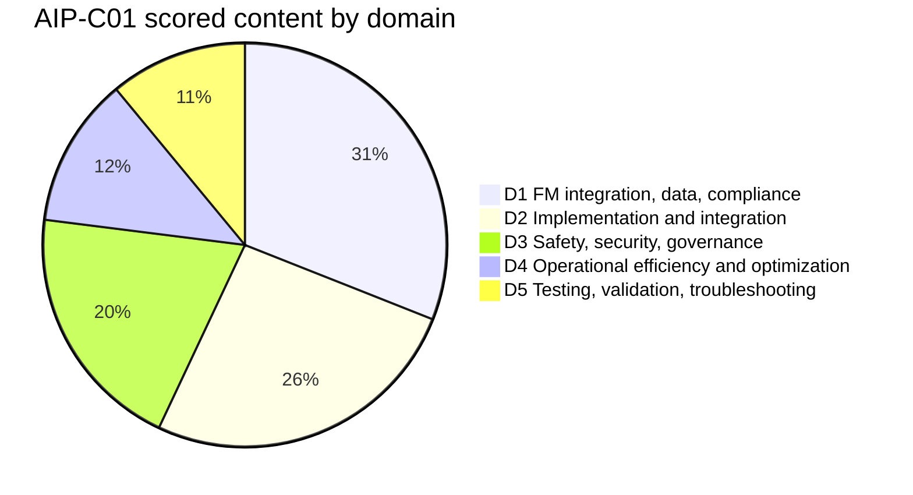

Domains 1 and 2 together are 57% of the scored content. That is the practical reading priority: **foundation-model integration, data pipelines, vector stores, retrieval, prompt engineering, agents, and application integration**. Domain 3 at 20% is large enough that guardrails, IAM and data protection cannot be treated as an afterthought.

---

## AIP-C01 Domains, Task Statements and Skills

What follows is the official task and skill structure, condensed to the level of detail you need to navigate this guide, with a pointer to the chapters that cover each one. The wording of task statements follows the exam guide; the "where covered" column is this document.

### Domain 1 — Foundation Model Integration, Data Management, and Compliance (31%)

| Task | Statement | Skills (abbreviated) | Where covered here |
|---|---|---|---|
| 1.1 | Analyze requirements and design GenAI solutions | Architectural designs aligned to business needs; technical proofs of concept with Amazon Bedrock; standardized components using the AWS Well-Architected Framework and the **Generative AI Lens** | Ch. 1, 11, 57–63, 90 |
| 1.2 | Select and configure FMs | Model choice from benchmarks, capabilities and limitations; provider-switchable architectures with Lambda, API Gateway, AppConfig; resilience with Step Functions circuit breakers, **Cross-Region inference**, graceful degradation; customization deployment and lifecycle with SageMaker AI, LoRA/adapters, Model Registry, rollback | Ch. 2, 12, 25, 30, 31, 48, 51 |
| 1.3 | Implement data validation and processing pipelines for FM consumption | Validation with AWS Glue Data Quality, SageMaker Data Wrangler, Lambda, CloudWatch; multimodal processing with Bedrock multimodal models, SageMaker Processing, Amazon Transcribe; model-specific input formatting; input enrichment with Bedrock, Amazon Comprehend, Lambda | Ch. 15, 18, 47, 48, 49 |
| 1.4 | Design and implement vector store solutions | Vector architectures with Bedrock Knowledge Bases, OpenSearch (neural/vector), RDS/Aurora, DynamoDB metadata; metadata frameworks; sharding, multi-index and hierarchical indexing; connectors to document systems and wikis; incremental update, change detection and scheduled refresh | Ch. 4, 5, 18, 42, 43, 44, 45 |
| 1.5 | Design retrieval mechanisms for FM augmentation | Chunking strategies; embedding model selection (Amazon Titan and other Bedrock embedding models); vector search on OpenSearch, Aurora `pgvector`, managed Bedrock Knowledge Bases; hybrid search and rerankers; query expansion/decomposition/transformation with Bedrock, Lambda, Step Functions; consistent access via function calling and **MCP** | Ch. 4, 5, 6, 19, 20, 21, 36 |
| 1.6 | Implement prompt engineering strategies and governance | Instruction frameworks with Prompt Management and Guardrails; multi-turn interaction with Step Functions, Comprehend, DynamoDB; prompt governance with versions, S3 template repositories, CloudTrail, CloudWatch Logs; prompt QA and regression; iterative refinement; **Prompt Flows** for complex chains | Ch. 7, 28, 29, 63 |

### Domain 2 — Implementation and Integration (26%)

| Task | Statement | Skills (abbreviated) | Where covered here |
|---|---|---|---|
| 2.1 | Implement agentic AI solutions and tool integrations | Autonomous systems with memory and state (**Strands Agents**, **AWS Agent Squad**, **MCP**); ReAct and chain-of-thought with Step Functions; stopping conditions, timeouts, IAM boundaries, circuit breakers; model ensembles and selection; human-in-the-loop review; tool definitions with validation and error handling; MCP servers on Lambda and ECS | Ch. 8, 22, 23, 24, 35–38, 58 |
| 2.2 | Implement model deployment strategies | On-demand Lambda invocation, Bedrock Provisioned Throughput, SageMaker AI endpoints; container deployment tuned for memory, GPU and token throughput; model cascading and small-model selection | Ch. 27, 46, 48, 61 |
| 2.3 | Design and implement enterprise integration architectures | API-based and event-driven integration; API Gateway microservices, Lambda webhooks, EventBridge; identity federation, RBAC and least-privilege model access; Outposts and Wavelength for jurisdictional/edge constraints; CI/CD and **GenAI gateway** patterns with CodePipeline and CodeBuild | Ch. 39, 40, 41, 46, 52, 53, 62, 63 |
| 2.4 | Implement FM API integrations | Synchronous Bedrock API use from any compute; asynchronous with SDKs and SQS; API Gateway request validation; streaming with Bedrock streaming APIs, WebSockets, server-sent events; resilience with SDK exponential backoff, rate limiting, fallbacks, X-Ray; static and dynamic model routing including **intelligent prompt routing** | Ch. 13, 14, 16, 30, 31, 80, 89 |
| 2.5 | Implement application integration patterns and development tools | FM-aware API design (streaming, token limits, retries); AWS Amplify, OpenAPI-first, Prompt Flows as no-code builders; business system enhancement with Lambda, Step Functions, **Bedrock Data Automation**; **Amazon Q Developer** and **Kiro** for developer productivity; troubleshooting with CloudWatch Logs Insights, X-Ray and error-pattern recognition | Ch. 15, 29, 41, 50, 54, 83–88 |

### Domain 3 — AI Safety, Security, and Governance (20%)

| Task | Statement | Skills (abbreviated) | Where covered here |
|---|---|---|---|
| 3.1 | Implement input and output safety controls | Guardrails for input and output filtering; custom moderation with Step Functions and Lambda; hallucination reduction with knowledge-base grounding, confidence scoring, JSON Schema structured output; defence in depth with Comprehend pre-processing, model-based guardrails, Lambda post-processing, API Gateway response filtering; prompt-injection and jailbreak detection, sanitization, safety classifiers, adversarial testing | Ch. 10, 14, 17, 67, 74 |
| 3.2 | Implement data security and privacy controls | VPC endpoints for network isolation; IAM data-access patterns; AWS Lake Formation granular access; CloudWatch access monitoring; PII detection with Comprehend and Macie; Bedrock native privacy behaviour; S3 Lifecycle retention; masking and anonymization | Ch. 33, 55, 59, 64, 65, 66 |
| 3.3 | Implement AI governance and compliance mechanisms | Model cards via SageMaker AI; data lineage with AWS Glue and the Glue Data Catalog; metadata tagging for attribution; decision logs in CloudWatch Logs; CloudTrail audit logging; organizational governance frameworks; continuous monitoring for misuse, drift and policy violations; token-level redaction and output policy filters | Ch. 32, 33, 47, 68 |
| 3.4 | Implement responsible AI principles | Transparency through reasoning displays, citations, agent traces and confidence metrics; fairness evaluation with A/B testing, Prompt Management/Flows and LLM-as-a-judge; policy compliance via Guardrails, model cards and automated Lambda checks | Ch. 10, 69, 71, 73 |

### Domain 4 — Operational Efficiency and Optimization for GenAI Applications (12%)

| Task | Statement | Skills (abbreviated) | Where covered here |
|---|---|---|---|
| 4.1 | Implement cost optimization and resource efficiency strategies | Token estimation and tracking, context-window optimization, prompt compression, response limiting; cost-capability trade-offs and tiered model usage; batching, capacity planning, auto scaling, provisioned throughput optimization; semantic caching, deterministic request hashing, **prompt caching**, edge caching | Ch. 27, 32, 78, 79 |
| 4.2 | Optimize application performance | Latency-optimized inference, pre-computation, parallel requests, streaming, benchmarking; retrieval index and query optimization, hybrid search scoring; token-throughput optimization, batch inference, concurrency management; parameter tuning (temperature, top-k, top-p) and A/B testing; capacity and auto-scaling for GenAI traffic; profiling and vector-database query optimization | Ch. 21, 76, 77, 78, 81 |
| 4.3 | Implement monitoring systems for GenAI applications | Holistic observability across operational, tracing and business metrics; CloudWatch tracking of token usage, prompt effectiveness, hallucination rate, response quality; anomaly detection; **Model invocation logging**; dashboards, compliance monitoring, forensic traceability; tool-call and multi-agent observability; vector-store operational monitoring; GenAI-specific failure-mode diagnosis with golden datasets, output diffing and reasoning-path tracing | Ch. 34, 54, 82, 88 |

### Domain 5 — Testing, Validation, and Troubleshooting (11%)

| Task | Statement | Skills (abbreviated) | Where covered here |
|---|---|---|---|
| 5.1 | Implement evaluation systems for GenAI | Quality dimensions beyond classic ML metrics (relevance, factual accuracy, consistency, fluency); **Bedrock model evaluation**, A/B and canary testing, multi-model and cost-performance analysis; user feedback and annotation workflows; continuous evaluation, regression testing and quality gates; RAG evaluation and LLM-as-a-judge; retrieval quality testing; agent evaluation (task completion, tool-use effectiveness, reasoning quality); reporting; deployment validation with synthetic workflows and drift checks | Ch. 9, 26, 70–75 |
| 5.2 | Troubleshoot GenAI applications | Context-window overflow and truncation diagnostics; FM API integration errors; prompt-quality troubleshooting with version comparison; retrieval failures (embedding quality, drift, vectorization, chunking, vector-search performance); prompt maintenance with CloudWatch Logs, X-Ray observability pipelines and schema validation | Ch. 83–88 |

### Technologies and concepts the exam guide names explicitly

Retrieval Augmented Generation (RAG) · vector databases and embeddings · prompt engineering and management · foundation-model integration · agentic AI systems · Responsible AI practices · content safety and moderation · model evaluation and validation · cost optimization for AI workloads · performance tuning for AI applications · monitoring and observability for AI systems · security and governance for AI applications · API design and integration patterns · event-driven architectures · serverless computing · container orchestration · infrastructure as code · CI/CD for AI applications · hybrid cloud architectures · enterprise system integration.

Notice how much of that list is ordinary senior backend engineering. Roughly half of the exam's difficulty is generative-AI-specific; the other half is whether you can apply the distributed-systems instincts you already have to a workload whose latency is measured in seconds, whose output is non-deterministic, and whose unit of cost is a token.

### In-scope AWS services (official list, September 2026)

The exam guide groups in-scope services by category. Reproduced here as a navigation aid — the chapters in Parts III–VI follow this list, and **this document covers every service on it**, at a depth proportional to its generative-AI relevance.

- **Analytics:** Amazon Athena · Amazon EMR · AWS Glue · Amazon Kinesis · Amazon OpenSearch Service · Amazon Quick Suite (QuickSight) · Amazon MSK
- **Application Integration:** Amazon AppFlow · AWS AppConfig · Amazon EventBridge · Amazon SNS · Amazon SQS · AWS Step Functions
- **Compute:** AWS App Runner · Amazon EC2 · AWS Lambda · Lambda@Edge · AWS Outposts · AWS Wavelength
- **Containers:** Amazon ECR · Amazon ECS · Amazon EKS · AWS Fargate
- **Customer Engagement:** Amazon Connect
- **Database:** Amazon Aurora · Amazon DocumentDB · Amazon DynamoDB · DynamoDB Streams · Amazon ElastiCache · Amazon Neptune · Amazon RDS
- **Developer Tools:** AWS Amplify · AWS CDK · AWS CLI · AWS CloudFormation · AWS CodeArtifact · AWS CodeBuild · AWS CodeDeploy · AWS CodePipeline · **Kiro** · AWS Tools and SDKs · AWS X-Ray
- **Machine Learning:** Amazon Augmented AI · **Amazon Bedrock** · **Amazon Bedrock AgentCore** · Bedrock Knowledge Bases · Bedrock Prompt Management · Bedrock Prompt Flows · Amazon Comprehend · Amazon Kendra · Amazon Lex · Amazon Q Business (and Q Business Apps) · Amazon Q Developer · Amazon Quick · Amazon Rekognition · Amazon SageMaker AI (Clarify, Data Wrangler, Ground Truth, JumpStart, Model Monitor, Model Registry, Neo, Processing, Unified Studio) · Amazon Textract · Amazon Titan · Amazon Transcribe
- **Management and Governance:** AWS Auto Scaling · AWS Chatbot · AWS CloudTrail · Amazon CloudWatch · CloudWatch Logs · CloudWatch Synthetics · AWS Cost Anomaly Detection · AWS Cost Explorer · Amazon Managed Grafana · AWS Service Catalog · AWS Systems Manager · AWS Well-Architected Tool
- **Migration and Transfer:** AWS DataSync · AWS Transfer Family
- **Networking and Content Delivery:** Amazon API Gateway · AWS AppSync · Amazon CloudFront · Elastic Load Balancing · AWS Global Accelerator · AWS PrivateLink · Amazon Route 53 · Amazon VPC
- **Security, Identity, and Compliance:** Amazon Cognito · AWS Encryption SDK · IAM · IAM Access Analyzer · IAM Identity Center · AWS KMS · Amazon Macie · AWS Secrets Manager · AWS WAF
- **Storage:** Amazon EBS · Amazon EFS · Amazon S3 (including Intelligent-Tiering, Lifecycle policies, Cross-Region Replication)

### Out-of-scope services worth noticing

The full out-of-scope list is on the exam guide page. Three entries are worth calling out because candidates routinely study them anyway:

- **Amazon Redshift is out of scope.** Do not spend time on Redshift-based analytics patterns. (Athena, Glue and EMR are in scope.)
- **AWS Batch is out of scope**, even though batch inference on Bedrock is very much in scope — the *Bedrock feature* is tested, the *AWS Batch service* is not.
- **AWS Transit Gateway, Direct Connect and VPN are out of scope**, so hybrid connectivity questions will be framed around Outposts, Wavelength and PrivateLink rather than network plumbing.

> **Scope note — exam guide vs. current documentation.** The in-scope list names "Amazon Quick Suite"/"Amazon Quick"; AWS documentation for QuickSight now lives under the Amazon Quick Suite user guide (<https://docs.aws.amazon.com/quick/latest/userguide/what-is.html>). Similarly, the guide names "Amazon SageMaker AI", which is the current name for what older documentation calls "Amazon SageMaker". Several Bedrock feature names in the exam guide ("Amazon Bedrock Prompt Flows") appear in current documentation simply as "Flows". These are naming drifts, not scope changes. Every such divergence found while compiling this guide is flagged in a Scope note at the point where it matters.

---

## Master AIP-C01 → AWS Documentation Mapping

This is the high-level map. It is intentionally coarse: it tells you which service and which guide own each task statement. The detailed per-page reading lists live in the chapters.

| Domain | Task / concept | AWS service or technology | Primary official documentation | Priority |
|---|---|---|---|---|
| D1 | 1.1 Architectural design for GenAI | AWS Well-Architected Framework, Generative AI Lens | [Generative AI Lens](https://docs.aws.amazon.com/wellarchitected/latest/generative-ai-lens/generative-ai-lens.html) · [Framework](https://docs.aws.amazon.com/wellarchitected/latest/framework/welcome.html) · [WA Tool](https://docs.aws.amazon.com/wellarchitected/latest/userguide/intro.html) | REQUIRED |
| D1 | 1.1 Proof of concept on Bedrock | Amazon Bedrock | [Bedrock overview](https://docs.aws.amazon.com/bedrock/latest/userguide/what-is-bedrock.html) · [Quickstart](https://docs.aws.amazon.com/bedrock/latest/userguide/getting-started.html) | REQUIRED |
| D1 | 1.2 Model selection and capability analysis | Bedrock model catalogue | [Supported models](https://docs.aws.amazon.com/bedrock/latest/userguide/models-supported.html) · [Model support by feature](https://docs.aws.amazon.com/bedrock/latest/userguide/models-features.html) · [Model lifecycle](https://docs.aws.amazon.com/bedrock/latest/userguide/model-lifecycle.html) | REQUIRED |
| D1 | 1.2 Provider-switchable architecture | Lambda, API Gateway, AppConfig | [AppConfig](https://docs.aws.amazon.com/appconfig/latest/userguide/what-is-appconfig.html) · [Lambda](https://docs.aws.amazon.com/lambda/latest/dg/welcome.html) | IMPORTANT |
| D1 | 1.2 Resilience, regional availability | Cross-Region inference, Step Functions | [Cross-Region inference](https://docs.aws.amazon.com/bedrock/latest/userguide/cross-region-inference.html) · [Error handling in Step Functions](https://docs.aws.amazon.com/step-functions/latest/dg/concepts-error-handling.html) | REQUIRED |
| D1 | 1.2 Customization lifecycle | SageMaker AI, Model Registry | [Model Registry](https://docs.aws.amazon.com/sagemaker/latest/dg/model-registry.html) · [Bedrock custom models](https://docs.aws.amazon.com/bedrock/latest/userguide/custom-models.html) | IMPORTANT |
| D1 | 1.3 Data quality validation | AWS Glue Data Quality, SageMaker Data Wrangler | [Glue Data Quality](https://docs.aws.amazon.com/glue/latest/dg/glue-data-quality.html) · [Data Wrangler](https://docs.aws.amazon.com/sagemaker/latest/dg/data-wrangler.html) | IMPORTANT |
| D1 | 1.3 Multimodal and document processing | Bedrock Data Automation, Textract, Transcribe | [Bedrock Data Automation](https://docs.aws.amazon.com/bedrock/latest/userguide/bda.html) · [Textract](https://docs.aws.amazon.com/textract/latest/dg/what-is.html) · [Transcribe](https://docs.aws.amazon.com/transcribe/latest/dg/what-is.html) | IMPORTANT |
| D1 | 1.3 Model-specific input formatting | Bedrock inference APIs | [Making inference requests](https://docs.aws.amazon.com/bedrock/latest/userguide/inference.html) · [Inference parameters](https://docs.aws.amazon.com/bedrock/latest/userguide/inference-parameters.html) | REQUIRED |
| D1 | 1.4 Vector stores | Bedrock Knowledge Bases, OpenSearch, Aurora, Neptune Analytics, S3 Vectors | [Knowledge Bases](https://docs.aws.amazon.com/bedrock/latest/userguide/knowledge-base.html) · [OpenSearch vector search](https://docs.aws.amazon.com/opensearch-service/latest/developerguide/vector-search.html) · [Aurora pgvector](https://docs.aws.amazon.com/AmazonRDS/latest/AuroraUserGuide/AuroraPostgreSQL.VectorDB.html) | REQUIRED |
| D1 | 1.4 Metadata frameworks | S3 metadata, KB metadata files | [KB metadata](https://docs.aws.amazon.com/bedrock/latest/userguide/kb-metadata.html) · [S3 object metadata](https://docs.aws.amazon.com/AmazonS3/latest/userguide/UsingMetadata.html) | REQUIRED |
| D1 | 1.4 Freshness and synchronization | KB data source sync, direct ingestion, DynamoDB Streams, EventBridge | [Sync a data source](https://docs.aws.amazon.com/bedrock/latest/userguide/kb-data-source-sync-ingest.html) · [Direct ingestion](https://docs.aws.amazon.com/bedrock/latest/userguide/kb-direct-ingestion.html) | REQUIRED |
| D1 | 1.5 Chunking and parsing | Bedrock Knowledge Bases | [Content chunking](https://docs.aws.amazon.com/bedrock/latest/userguide/kb-chunking.html) · [Parsing options](https://docs.aws.amazon.com/bedrock/latest/userguide/kb-advanced-parsing.html) | REQUIRED |
| D1 | 1.5 Embeddings | Amazon Titan Text Embeddings and other Bedrock embedding models | [Titan Text Embeddings](https://docs.aws.amazon.com/bedrock/latest/userguide/titan-embedding-models.html) | REQUIRED |
| D1 | 1.5 Hybrid search and reranking | OpenSearch neural/hybrid search, Bedrock rerankers | [Rerank](https://docs.aws.amazon.com/bedrock/latest/userguide/rerank.html) · [Neural and hybrid search](https://docs.aws.amazon.com/opensearch-service/latest/developerguide/serverless-configure-neural-search.html) | REQUIRED |
| D1 | 1.5 Query handling | Bedrock, Lambda, Step Functions, MCP | [RetrieveAndGenerate API](https://docs.aws.amazon.com/bedrock/latest/APIReference/API_agent-runtime_RetrieveAndGenerate.html) · [Tool use](https://docs.aws.amazon.com/bedrock/latest/userguide/tool-use.html) | REQUIRED |
| D1 | 1.6 Prompt engineering and governance | Bedrock Prompt Management, Flows, Guardrails | [Prompt management](https://docs.aws.amazon.com/bedrock/latest/userguide/prompt-management.html) · [Flows](https://docs.aws.amazon.com/bedrock/latest/userguide/flows.html) · [Prompt engineering concepts](https://docs.aws.amazon.com/bedrock/latest/userguide/prompt-engineering-guidelines.html) | REQUIRED |
| D2 | 2.1 Agentic systems | Bedrock Agents, AgentCore, Strands Agents, Agent Squad, MCP | [Bedrock Agents](https://docs.aws.amazon.com/bedrock/latest/userguide/agents.html) · [AgentCore](https://docs.aws.amazon.com/bedrock-agentcore/latest/devguide/what-is-bedrock-agentcore.html) | REQUIRED |
| D2 | 2.1 Structured reasoning and safeguards | Step Functions, Lambda, IAM | [Step Functions](https://docs.aws.amazon.com/step-functions/latest/dg/welcome.html) · [AgentCore Policy](https://docs.aws.amazon.com/bedrock-agentcore/latest/devguide/policy.html) | REQUIRED |
| D2 | 2.1 MCP servers | Lambda, ECS, AgentCore Runtime/Gateway | [Deploy MCP servers on AgentCore Runtime](https://docs.aws.amazon.com/bedrock-agentcore/latest/devguide/runtime-mcp.html) · [Gateway](https://docs.aws.amazon.com/bedrock-agentcore/latest/devguide/gateway.html) | REQUIRED |
| D2 | 2.2 Deployment strategies | Lambda, Provisioned Throughput, SageMaker AI endpoints | [Provisioned Throughput](https://docs.aws.amazon.com/bedrock/latest/userguide/prov-throughput.html) · [SageMaker real-time endpoints](https://docs.aws.amazon.com/sagemaker/latest/dg/realtime-endpoints.html) | REQUIRED |
| D2 | 2.3 Enterprise integration | API Gateway, EventBridge, Lambda, AppSync | [EventBridge](https://docs.aws.amazon.com/eventbridge/latest/userguide/eb-what-is.html) · [API Gateway](https://docs.aws.amazon.com/apigateway/latest/developerguide/welcome.html) | IMPORTANT |
| D2 | 2.3 Jurisdiction and edge | Outposts, Wavelength, PrivateLink | [Outposts](https://docs.aws.amazon.com/outposts/latest/userguide/what-is-outposts.html) · [PrivateLink](https://docs.aws.amazon.com/vpc/latest/privatelink/what-is-privatelink.html) | IMPORTANT |
| D2 | 2.3 CI/CD and GenAI gateway | CodePipeline, CodeBuild, CodeDeploy, CDK | [CodePipeline](https://docs.aws.amazon.com/codepipeline/latest/userguide/welcome.html) · [CDK](https://docs.aws.amazon.com/cdk/v2/guide/home.html) | IMPORTANT |
| D2 | 2.4 Bedrock API integration | Bedrock Runtime, AWS SDKs | [Converse API](https://docs.aws.amazon.com/bedrock/latest/userguide/conversation-inference.html) · [API Reference](https://docs.aws.amazon.com/bedrock/latest/APIReference/Welcome.html) | REQUIRED |
| D2 | 2.4 Streaming | ConverseStream, API Gateway WebSockets, Lambda response streaming | [ConverseStream](https://docs.aws.amazon.com/bedrock/latest/APIReference/API_runtime_ConverseStream.html) · [Lambda response streaming](https://docs.aws.amazon.com/lambda/latest/dg/configuration-response-streaming.html) | REQUIRED |
| D2 | 2.4 Resilience and routing | SDK retries, intelligent prompt routing, Step Functions | [Retry strategy (Java SDK)](https://docs.aws.amazon.com/sdk-for-java/latest/developer-guide/retry-strategy.html) · [Intelligent prompt routing](https://docs.aws.amazon.com/bedrock/latest/userguide/prompt-routing.html) | REQUIRED |
| D2 | 2.5 Developer tooling | Amazon Q Developer, Kiro, Amplify | [Q Developer](https://docs.aws.amazon.com/amazonq/latest/qdeveloper-ug/what-is.html) · [Amplify](https://docs.aws.amazon.com/amplify/latest/userguide/welcome.html) | OPTIONAL |
| D3 | 3.1 Input/output safety | Bedrock Guardrails | [Guardrails](https://docs.aws.amazon.com/bedrock/latest/userguide/guardrails.html) · [ApplyGuardrail](https://docs.aws.amazon.com/bedrock/latest/userguide/guardrails-use-independent-api.html) | REQUIRED |
| D3 | 3.1 Grounding and structure | Contextual grounding checks, structured outputs, Automated Reasoning | [Contextual grounding](https://docs.aws.amazon.com/bedrock/latest/userguide/guardrails-contextual-grounding-check.html) · [Structured outputs](https://docs.aws.amazon.com/bedrock/latest/userguide/structured-output.html) · [Automated Reasoning checks](https://docs.aws.amazon.com/bedrock/latest/userguide/guardrails-automated-reasoning-checks.html) | REQUIRED |
| D3 | 3.1 Prompt injection defence | Bedrock security guidance, prompt attack filters | [Prompt injection security](https://docs.aws.amazon.com/bedrock/latest/userguide/prompt-injection.html) · [Prompt attacks](https://docs.aws.amazon.com/bedrock/latest/userguide/guardrails-prompt-attack.html) | REQUIRED |
| D3 | 3.2 Network and data isolation | VPC endpoints, KMS, S3, Lake Formation | [Bedrock VPC endpoints](https://docs.aws.amazon.com/bedrock/latest/userguide/vpc-interface-endpoints.html) · [Bedrock data protection](https://docs.aws.amazon.com/bedrock/latest/userguide/data-protection.html) | REQUIRED |
| D3 | 3.2 PII handling | Comprehend, Macie, Guardrails sensitive filters | [Comprehend PII](https://docs.aws.amazon.com/comprehend/latest/dg/pii.html) · [Sensitive information filters](https://docs.aws.amazon.com/bedrock/latest/userguide/guardrails-sensitive-filters.html) | REQUIRED |
| D3 | 3.3 Governance, lineage and audit | Glue Data Catalog, CloudTrail, model invocation logging | [CloudTrail](https://docs.aws.amazon.com/awscloudtrail/latest/userguide/cloudtrail-user-guide.html) · [Model invocation logging](https://docs.aws.amazon.com/bedrock/latest/userguide/model-invocation-logging.html) | REQUIRED |
| D3 | 3.4 Responsible AI | Agent traces, citations, SageMaker model cards, LLM-as-a-judge | [Agent trace events](https://docs.aws.amazon.com/bedrock/latest/userguide/trace-events.html) · [Model cards](https://docs.aws.amazon.com/sagemaker/latest/dg/model-cards.html) · [LLM-as-a-judge evaluation](https://docs.aws.amazon.com/bedrock/latest/userguide/evaluation-judge.html) | REQUIRED |
| D4 | 4.1 Token and cost efficiency | Token counting, prompt caching, batch inference, service tiers | [Token counting](https://docs.aws.amazon.com/bedrock/latest/userguide/quotas-token-burndown.html) · [Prompt caching](https://docs.aws.amazon.com/bedrock/latest/userguide/prompt-caching.html) · [Batch inference](https://docs.aws.amazon.com/bedrock/latest/userguide/batch-inference.html) | REQUIRED |
| D4 | 4.1 Cost attribution | Application inference profiles, cost management | [Track usage and costs](https://docs.aws.amazon.com/bedrock/latest/userguide/cost-management.html) · [Cost Explorer](https://docs.aws.amazon.com/cost-management/latest/userguide/ce-what-is.html) | REQUIRED |
| D4 | 4.2 Latency and throughput | Latency-optimized inference, streaming, quotas, best practices | [Latency-optimized inference](https://docs.aws.amazon.com/bedrock/latest/userguide/latency-optimized-inference.html) · [Scaling best practices](https://docs.aws.amazon.com/bedrock/latest/userguide/scaling-throughput-best-practices.html) | REQUIRED |
| D4 | 4.3 Observability | CloudWatch, model invocation logging, X-Ray, AgentCore Observability | [Bedrock observability](https://docs.aws.amazon.com/bedrock/latest/userguide/observability.html) · [AgentCore Observability](https://docs.aws.amazon.com/bedrock-agentcore/latest/devguide/observability.html) | REQUIRED |
| D5 | 5.1 Model and RAG evaluation | Bedrock evaluations | [Evaluate models](https://docs.aws.amazon.com/bedrock/latest/userguide/evaluation.html) · [RAG evaluation jobs](https://docs.aws.amazon.com/bedrock/latest/userguide/evaluation-kb.html) | REQUIRED |
| D5 | 5.1 Agent evaluation | AgentCore Evaluations | [AgentCore Evaluations](https://docs.aws.amazon.com/bedrock-agentcore/latest/devguide/evaluations.html) · [Built-in evaluators](https://docs.aws.amazon.com/bedrock-agentcore/latest/devguide/built-in-evaluators-overview.html) | REQUIRED |
| D5 | 5.1 Human review | Amazon A2I, SageMaker Ground Truth | [Augmented AI human review loops](https://docs.aws.amazon.com/sagemaker/latest/dg/a2i-use-augmented-ai-a2i-human-review-loops.html) · [Ground Truth](https://docs.aws.amazon.com/sagemaker/latest/dg/sms.html) | IMPORTANT |
| D5 | 5.2 Troubleshooting | Bedrock error codes, CloudWatch Logs Insights, X-Ray | [API error codes](https://docs.aws.amazon.com/bedrock/latest/userguide/troubleshooting-api-error-codes.html) · [Logs Insights](https://docs.aws.amazon.com/AmazonCloudWatch/latest/logs/AnalyzingLogData.html) · [X-Ray concepts](https://docs.aws.amazon.com/xray/latest/devguide/xray-concepts.html) | REQUIRED |

The table is a map, not the territory. The chapters that follow explain *why* each of those pages matters and what mental model you should hold while reading it.

---

## Table of Contents


**[Part I — Generative AI and AWS Foundations](#part-i-generative-ai-and-aws-foundations)**

- [1. Generative AI Application Architecture](#1-generative-ai-application-architecture)
- [2. Foundation Models](#2-foundation-models)
- [3. Tokens, Context Windows and Inference Parameters](#3-tokens-context-windows-and-inference-parameters)
- [4. Embeddings](#4-embeddings)
- [5. Vector Search and Vector Stores](#5-vector-search-and-vector-stores)
- [6. Retrieval-Augmented Generation (RAG)](#6-retrieval-augmented-generation-rag)
- [7. Prompt Engineering, Prompt Management and Governance](#7-prompt-engineering-prompt-management-and-governance)
- [8. Agents, Tool Use and Orchestration](#8-agents-tool-use-and-orchestration)
- [9. Evaluation](#9-evaluation)
- [10. Responsible AI, Safety and Guardrails (conceptual foundation)](#10-responsible-ai-safety-and-guardrails-conceptual-foundation)

**[Part II — Amazon Bedrock](#part-ii-amazon-bedrock)**

- [11. Amazon Bedrock Mental Model](#11-amazon-bedrock-mental-model)
- [12. Model Access, Regions and Availability](#12-model-access-regions-and-availability)
- [13. Bedrock Runtime and the Invoke APIs](#13-bedrock-runtime-and-the-invoke-apis)
- [14. Structured Output, Reasoning and Model-Specific Behaviour](#14-structured-output-reasoning-and-model-specific-behaviour)
- [15. Multimodal Input and Document Processing](#15-multimodal-input-and-document-processing)
- [16. Streaming Inference](#16-streaming-inference)
- [17. Amazon Bedrock Guardrails (deep dive)](#17-amazon-bedrock-guardrails-deep-dive)
- [18. Bedrock Knowledge Bases: Ingestion](#18-bedrock-knowledge-bases-ingestion)
- [19. Bedrock Knowledge Bases: Retrieval and Generation](#19-bedrock-knowledge-bases-retrieval-and-generation)
- [20. Reranking](#20-reranking)
- [21. Query Handling and Retrieval Optimization](#21-query-handling-and-retrieval-optimization)
- [22. Amazon Bedrock Agents](#22-amazon-bedrock-agents)
- [23. Amazon Bedrock AgentCore](#23-amazon-bedrock-agentcore)
- [24. Memory, Sessions and Conversation State](#24-memory-sessions-and-conversation-state)
- [25. Model Customization: Fine-Tuning, Distillation and Custom Model Import](#25-model-customization-fine-tuning-distillation-and-custom-model-import)
- [26. Model Evaluation in Amazon Bedrock](#26-model-evaluation-in-amazon-bedrock)
- [27. Inference Deployment Options and Service Tiers](#27-inference-deployment-options-and-service-tiers)
- [28. Prompt Management (as a Bedrock resource)](#28-prompt-management-as-a-bedrock-resource)
- [29. Flows (Prompt Flows)](#29-flows-prompt-flows)
- [30. Intelligent Prompt Routing and Model Selection at Runtime](#30-intelligent-prompt-routing-and-model-selection-at-runtime)
- [31. Cross-Region Inference and Resilience](#31-cross-region-inference-and-resilience)
- [32. Cost Tracking and Attribution in Bedrock](#32-cost-tracking-and-attribution-in-bedrock)
- [33. Amazon Bedrock Security](#33-amazon-bedrock-security)
- [34. Observability for Amazon Bedrock](#34-observability-for-amazon-bedrock)

**[Part III — Agent Frameworks, Protocols and Orchestration](#part-iii-agent-frameworks-protocols-and-orchestration)**

- [35. Strands Agents](#35-strands-agents)
- [36. Model Context Protocol (MCP)](#36-model-context-protocol-mcp)
- [37. Multi-Agent Systems and AWS Agent Squad](#37-multi-agent-systems-and-aws-agent-squad)
- [38. Deterministic Orchestration with AWS Step Functions](#38-deterministic-orchestration-with-aws-step-functions)

**[Part IV — Supporting AWS Services](#part-iv-supporting-aws-services)**

- [39. AWS Lambda](#39-aws-lambda)
- [40. Amazon API Gateway and AWS AppSync](#40-amazon-api-gateway-and-aws-appsync)
- [41. Event-Driven Integration: EventBridge, SQS and SNS](#41-event-driven-integration-eventbridge-sqs-and-sns)
- [42. Amazon S3](#42-amazon-s3)
- [43. Amazon DynamoDB (with ElastiCache, DocumentDB and Neptune)](#43-amazon-dynamodb-with-elasticache-documentdb-and-neptune)
- [44. Amazon Aurora and Amazon RDS](#44-amazon-aurora-and-amazon-rds)
- [45. Amazon OpenSearch Service](#45-amazon-opensearch-service)
- [46. Containers and Compute: ECS, EKS, Fargate, ECR, App Runner, EC2](#46-containers-and-compute-ecs-eks-fargate-ecr-app-runner-ec2)
- [47. Data and Analytics: Glue, Athena, EMR, Kinesis, MSK, AppFlow, DataSync, Transfer Family, Lake Formation](#47-data-and-analytics-glue-athena-emr-kinesis-msk-appflow-datasync-transfer-family-lake-formation)
- [48. Amazon SageMaker AI](#48-amazon-sagemaker-ai)
- [49. AWS AI Services: Comprehend, Textract, Transcribe, Rekognition, Kendra, Lex, Connect, A2I](#49-aws-ai-services-comprehend-textract-transcribe-rekognition-kendra-lex-connect-a2i)
- [50. Amazon Q, Kiro and Developer Tooling](#50-amazon-q-kiro-and-developer-tooling)
- [51. Configuration and Operations: AppConfig, Systems Manager, Service Catalog, Auto Scaling, Chatbot](#51-configuration-and-operations-appconfig-systems-manager-service-catalog-auto-scaling-chatbot)
- [52. Infrastructure as Code: CloudFormation, CDK, SAM](#52-infrastructure-as-code-cloudformation-cdk-sam)
- [53. CI/CD for Generative-AI Applications: CodePipeline, CodeBuild, CodeDeploy](#53-cicd-for-generative-ai-applications-codepipeline-codebuild-codedeploy)
- [54. Observability Services: CloudWatch, Logs, Synthetics, X-Ray, Managed Grafana, CloudTrail](#54-observability-services-cloudwatch-logs-synthetics-x-ray-managed-grafana-cloudtrail)
- [55. Networking and Edge: VPC, PrivateLink, CloudFront, WAF, Route 53, Global Accelerator](#55-networking-and-edge-vpc-privatelink-cloudfront-waf-route-53-global-accelerator)
- [56. Identity Services: IAM, IAM Identity Center, Cognito, IAM Access Analyzer](#56-identity-services-iam-iam-identity-center-cognito-iam-access-analyzer)

**[Part V — Cross-Service Architectures](#part-v-cross-service-architectures)**

- [57. Production RAG Architecture](#57-production-rag-architecture)
- [58. Production Agent Architecture](#58-production-agent-architecture)
- [59. Secure and Network-Isolated Bedrock Architecture](#59-secure-and-network-isolated-bedrock-architecture)
- [60. Event-Driven and Asynchronous AI Architecture](#60-event-driven-and-asynchronous-ai-architecture)
- [61. Serverless versus Containerized AI Architecture](#61-serverless-versus-containerized-ai-architecture)
- [62. The GenAI Gateway Pattern (Multi-Tenant Platform)](#62-the-genai-gateway-pattern-multi-tenant-platform)
- [63. CI/CD and Environment Promotion for GenAI](#63-cicd-and-environment-promotion-for-genai)

**[Part VI — Security, Governance and Responsible AI](#part-vi-security-governance-and-responsible-ai)**

- [64. The Security Mental Model and IAM for GenAI Workloads](#64-the-security-mental-model-and-iam-for-genai-workloads)
- [65. Encryption and Secrets: KMS, Secrets Manager, Encryption SDK](#65-encryption-and-secrets-kms-secrets-manager-encryption-sdk)
- [66. Data Protection and Privacy: PII, Macie, Retention](#66-data-protection-and-privacy-pii-macie-retention)
- [67. Prompt Injection, Jailbreaks and Adversarial Defence](#67-prompt-injection-jailbreaks-and-adversarial-defence)
- [68. Audit, Lineage and Compliance Evidence](#68-audit-lineage-and-compliance-evidence)
- [69. Responsible AI in Practice](#69-responsible-ai-in-practice)

**[Part VII — Testing, Validation and Evaluation](#part-vii-testing-validation-and-evaluation)**

- [70. A Testing Strategy for Generative-AI Applications](#70-a-testing-strategy-for-generative-ai-applications)
- [71. Model Evaluation in Practice](#71-model-evaluation-in-practice)
- [72. RAG Evaluation in Practice](#72-rag-evaluation-in-practice)
- [73. Agent Evaluation](#73-agent-evaluation)
- [74. Safety, Adversarial and Compliance Testing](#74-safety-adversarial-and-compliance-testing)
- [75. Load, Performance and Deployment Validation](#75-load-performance-and-deployment-validation)

**[Part VIII — Performance, Reliability and Cost](#part-viii-performance-reliability-and-cost)**

- [76. Latency Engineering](#76-latency-engineering)
- [77. Throughput, Scaling and Quotas](#77-throughput-scaling-and-quotas)
- [78. Caching Strategies](#78-caching-strategies)
- [79. Token Economics and Cost Optimization](#79-token-economics-and-cost-optimization)
- [80. Reliability and Failure Handling](#80-reliability-and-failure-handling)
- [81. Capacity Planning](#81-capacity-planning)
- [82. Monitoring and Alerting for GenAI Systems](#82-monitoring-and-alerting-for-genai-systems)

**[Part IX — Troubleshooting](#part-ix-troubleshooting)**

- [83. A Troubleshooting Method for GenAI Systems](#83-a-troubleshooting-method-for-genai-systems)
- [84. Inference and API Failures](#84-inference-and-api-failures)
- [85. Quality Failures: Hallucination, Drift and Inconsistency](#85-quality-failures-hallucination-drift-and-inconsistency)
- [86. Retrieval Failures](#86-retrieval-failures)
- [87. Agent Failures](#87-agent-failures)
- [88. Cost and Latency Incidents](#88-cost-and-latency-incidents)
- [89. Using the AWS SDKs: Java 2.x and Python](#89-using-the-aws-sdks-java-2x-and-python)

**[Part X — Documentation Reading Roadmaps](#part-x-documentation-reading-roadmaps)**

- [90. Minimum Required Official Documentation](#90-minimum-required-official-documentation)
- [91. Recommended Reading (the strong-pass set)](#91-recommended-reading-the-strong-pass-set)
- [92. Extended Professional Reading (beyond the exam)](#92-extended-professional-reading-beyond-the-exam)

**[Part XI — Mental Model Review](#part-xi-mental-model-review)**

- [93. Can I Explain It? (master question set)](#93-can-i-explain-it-master-question-set)
- [94. Common Confusions](#94-common-confusions)
- [95. Architecture Scenarios (reason, don't memorize)](#95-architecture-scenarios-reason-dont-memorize)
- [96. Troubleshooting Scenarios](#96-troubleshooting-scenarios)
- [97. Cross-Service Reasoning Drills](#97-cross-service-reasoning-drills)
- [98. Scope Notes, Known Discrepancies and Keeping This Guide Current](#98-scope-notes-known-discrepancies-and-keeping-this-guide-current)

**[Part XII — Master Official Documentation Index](#part-xii-master-official-documentation-index)**


Plus, before Part I: [How to Use This Guide](#how-to-use-this-guide) · [Source of Truth: the Official AIP-C01 Exam Guide](#source-of-truth-the-official-aip-c01-exam-guide) · [AIP-C01 Domains, Task Statements and Skills](#aip-c01-domains-task-statements-and-skills) · [Master AIP-C01 → AWS Documentation Mapping](#master-aip-c01--aws-documentation-mapping)

---

# Part I — Generative AI and AWS Foundations

Part I builds the vocabulary and the mental models that every later chapter assumes. If you already build LLM features at work, skim it; if your exposure is mostly through chat UIs, read it slowly, because almost every wrong answer on a professional-level exam is wrong for a *conceptual* reason, not a trivia reason.

---

## 1. Generative AI Application Architecture

### The problem

A conventional backend service is deterministic: given the same input, the same code path returns the same output, in single-digit milliseconds, with a bounded, typed response. A generative-AI feature breaks four of those assumptions at once. The response is probabilistic; latency is measured in hundreds of milliseconds to tens of seconds; the "response schema" is whatever the model felt like emitting; and the cost of a single call is a function of how much text went in and came out.

Nearly every architectural decision in this exam exists to contain one of those four facts.

### The mental model

Think of a generative-AI application as a **classical distributed system with one unusual dependency**: a remote, stateless, non-deterministic, token-metered inference service that holds no memory of your previous calls.

Two consequences follow immediately, and they explain most of the AWS services in scope:

1. **The model is stateless.** Any notion of conversation, user identity, session, retrieved context, or long-term memory must be supplied by *your* architecture, on every call. Hence DynamoDB for conversation history, Bedrock Sessions and AgentCore Memory for managed state, knowledge bases for document context.
2. **The model knows nothing about your business.** Its parameters were frozen at training time and contain no private data. Hence retrieval, tool calling, agents, and model customization — four different answers to the same question: *how do I get proprietary knowledge or capability into an inference call?*

### The four architecture archetypes

Every architecture the exam tests is one of these four, or a composition of them.

**Archetype 1 — Direct invocation.** The application constructs a prompt and calls the model.

```text
Java application
      ↓  (AWS SDK for Java 2.x — BedrockRuntimeClient)
Credential provider resolves credentials
      ↓  SigV4 signing
Amazon Bedrock Runtime endpoint (regional)
      ↓
Foundation model inference
      ↓
Response (or a stream of chunks)
      ↓
Java application post-processing / validation
```

Use it for summarization, classification, rewriting, extraction — anything where the necessary knowledge is already in the prompt.

**Archetype 2 — Retrieval-augmented generation (RAG).** The application retrieves relevant private content first, then asks the model to answer *using only that content*.

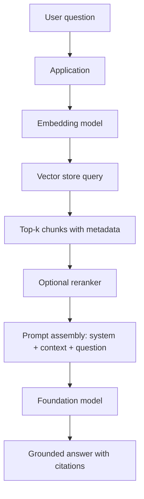

Use it when the answer depends on documents that change, are numerous, or are access-controlled.

**Archetype 3 — Agentic / tool use.** The model is given a set of callable tools and allowed to decide, in a loop, which to call.

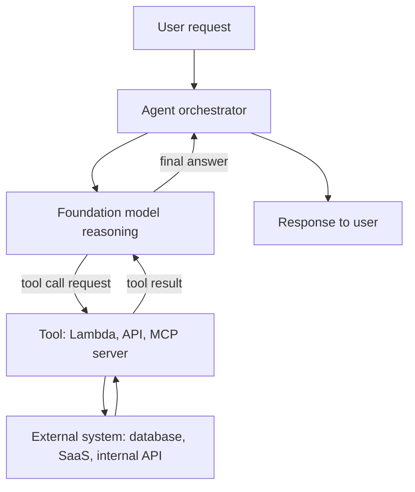

Use it when the task requires *actions* or multi-step lookups rather than a single answer.

**Archetype 4 — Production wrapper.** Any of the above, embedded in the plumbing that makes it operable.

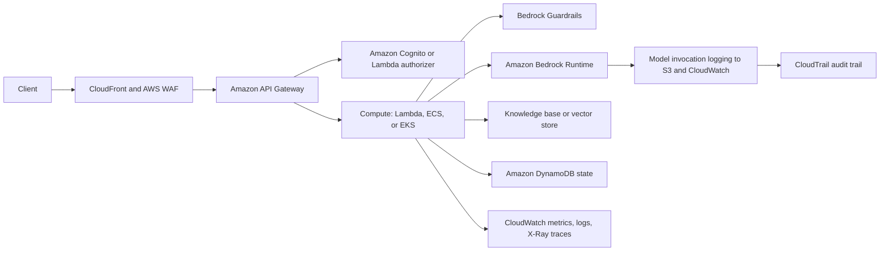

### Where each concern lives

| Concern | Where it is handled | Why not elsewhere |
|---|---|---|
| Authentication of the end user | Cognito, IAM Identity Center, or an enterprise IdP at the edge (API Gateway) | Bedrock authenticates *your application's* IAM principal, not your end users. It has no concept of your user base. |
| Authorization to call a model | IAM identity-based policy on the calling role, `bedrock:InvokeModel` scoped to model ARNs | Model access is an AWS control-plane concern; the model itself enforces nothing. |
| Authorization to see a document | Your retrieval layer: metadata filters, ACL-aware retrieval, or per-tenant indexes | The model cannot enforce document permissions; anything you put in the prompt, the user can see. |
| Content safety | Guardrails (independent of model choice), plus application validation | A model's own alignment is not a control you can audit or version. |
| Conversation state | DynamoDB, Bedrock Sessions, or AgentCore Memory | The model is stateless. |
| Latency budget | Streaming, model choice, retrieval tuning, caching | You cannot make inference fast; you can make it *feel* fast and do less of it. |
| Cost | Token discipline, model tiering, caching, batch inference | Cost is dominated by tokens, not by compute. |

### Developer responsibilities

AWS operates the model endpoint. You own: prompt construction and versioning; input validation; output validation (never trust the shape of a model response); retries and idempotency; conversation state; retrieval quality; guardrail configuration; observability; and the token bill. The exam tests exactly this boundary repeatedly — a question that appears to be about a model is usually about which of those responsibilities was neglected.

### Documentation roadmap

**REQUIRED — AWS Well-Architected Generative AI Lens**
*Documentation type:* Well-Architected lens
*Why read it:* It is AWS's own opinionated answer to "what does good look like for a GenAI workload", organized along the six Well-Architected pillars. The exam guide names it explicitly in Skill 1.1.3, which makes it one of the few documents you can be reasonably confident the exam authors had open.
*What you should understand:* the lens's lifecycle stages; the design principles for model selection, prompt management, RAG, agents and responsible AI; and how each pillar's questions translate into a concrete AWS control.
<https://docs.aws.amazon.com/wellarchitected/latest/generative-ai-lens/generative-ai-lens.html>

**REQUIRED — AWS Well-Architected Framework**
*Why read it:* The lens assumes you know the pillars. If your Well-Architected knowledge is thin, read the framework's operational-excellence, security and cost-optimization pillars at minimum.
<https://docs.aws.amazon.com/wellarchitected/latest/framework/welcome.html>

**IMPORTANT — Choosing a generative AI service on AWS (decision guide)**
*Why read it:* A compact, official comparison of Bedrock, SageMaker AI, Amazon Q and the ML services. It is the cleanest source for "when would you *not* use Bedrock" reasoning.
<https://docs.aws.amazon.com/decision-guides/latest/decision-guides/genai-guide.html>

**IMPORTANT — AWS Well-Architected Tool**
*Why read it:* Skill 1.1.3 mentions standardized components and the WA Tool. Know that the tool lets you apply a lens to a defined workload and produce an improvement plan — that is the level of detail the exam needs.
<https://docs.aws.amazon.com/wellarchitected/latest/userguide/intro.html>

**OPTIONAL — Machine Learning Lens**
*Why read it:* Useful background if you also work with classical ML pipelines; largely out of exam scope because model training is out of scope.
<https://docs.aws.amazon.com/wellarchitected/latest/machine-learning-lens/machine-learning-lens.html>

### What AWS expects you to understand

You should be able to take a business requirement ("our support agents need answers from 40,000 internal PDFs, with citations, under three seconds, and no customer PII may leave our VPC") and produce an architecture that names the AWS component owning each stage, identifies the security boundary at each hop, and explains what happens when each component fails or degrades.

### Can I explain it?

- Why does a generative-AI application need more state management than a conventional REST service, not less?
- Which of the four archetypes would you choose for "answer questions about our product catalogue, which changes hourly", and why not the other three?
- Where in the production wrapper does end-user authentication happen, and why can't Bedrock do it?
- A question is answered incorrectly using stale information. Name three architectural layers that could be at fault.

---

## 2. Foundation Models

### The problem

You need a component that can read and write natural language, follow instructions, and generalize to tasks nobody enumerated in advance. Training such a model requires capital and data at a scale no application team has. So you rent one — and the engineering question becomes *which one*, and *how do I keep that choice from calcifying into a dependency I cannot change?*

### The mental model

A foundation model is a **large, frozen function** from a sequence of tokens to a probability distribution over the next token, wrapped in a sampling loop. Everything you perceive as "capability" — reasoning, tool use, JSON output — is a behaviour that emerged from training and is *elicited* by your prompt, not a feature you configure.

Three properties follow, and all three are exam material:

- **Frozen:** the model has a training cutoff and no knowledge of your data. Freshness and privacy are architecture problems, not model problems.
- **Probabilistic:** identical input can produce different output. Temperature, top-p and top-k shape the sampling; only at temperature 0 (or with a fixed seed where supported) do you approach repeatability, and even then it is not a contract.
- **Bounded:** the context window caps how much input and output can exist in one call. Exceeding it truncates or errors.

### Choosing a model

The exam's model-selection questions are trade-off questions with a dominant constraint. Learn to spot the constraint:

| Dominant constraint in the scenario | What it implies |
|---|---|
| "Sub-second response for a chat UI" | Small/fast model tier, streaming, latency-optimized inference, aggressive prompt trimming |
| "Highest accuracy on complex multi-step analysis" | Frontier/reasoning-capable model, higher cost per call, possibly longer latency budget; consider reasoning-enabled inference |
| "Millions of low-value classifications per day" | Smallest adequate model, batch inference, prompt caching, model cascading |
| "Must process scanned invoices and photographs" | Multimodal model, or Bedrock Data Automation / Textract upstream |
| "Must run in a specific country for data residency" | Region and model availability are the binding constraint — check model support by Region before anything else |
| "Output must be valid JSON conforming to a schema" | Structured outputs / tool-use schema enforcement plus application-side validation |
| "Model must know our internal jargon" | RAG first; customization only if RAG fails and you have thousands of labelled examples |

### Keeping the choice reversible

Skill 1.2.2 asks for "dynamic model selection and provider switching without requiring code modifications". In practice that means:

- Invoke through the **Converse API**, which normalizes messages, system prompts, inference configuration and tool definitions across model families, so swapping a model ID does not mean rewriting request-building code.
- Store the model identifier in **AWS AppConfig** (or Parameter Store) rather than in code, so a model change is a configuration deployment with validation and rollback, not a code release.
- Route through an **inference profile** rather than a bare model ID, so the same application identifier can point at cross-Region capacity and carry cost-allocation tags.
- Keep prompts in **Bedrock Prompt Management** with versions and aliases, because a model swap usually needs a prompt revision, and you want those versioned together.

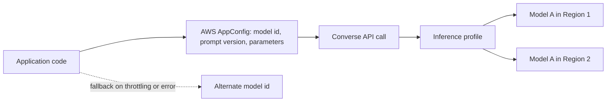

### Model lifecycle: the detail candidates miss

Models on Bedrock are versioned and have a lifecycle — they can be marked legacy and eventually reach end of life. A production application pinned to a specific model version must have a migration plan, and the exam can ask what you monitor to detect an upcoming deprecation. This is precisely why configuration-driven model IDs and a regression test suite matter.

### Documentation roadmap

**REQUIRED — Amazon Bedrock overview**
*Why read it:* Establishes the platform vocabulary: providers, model IDs, Regions, endpoints, the difference between control plane (`bedrock`) and runtime (`bedrock-runtime`).
<https://docs.aws.amazon.com/bedrock/latest/userguide/what-is-bedrock.html>

**REQUIRED — Supported foundation models in Amazon Bedrock**
*Why read it:* The canonical catalogue. Do not memorize it — model availability changes monthly. Learn instead *how to read it*: modality support, streaming support, fine-tuning support, and the model ID format you will pass to the API.
<https://docs.aws.amazon.com/bedrock/latest/userguide/models-supported.html>

**REQUIRED — Model support by feature** and **Model support by Region**
*Why read it:* The most common "wrong but plausible" exam answer is an architecture that uses a feature the chosen model does not support in the chosen Region. These two pages are where an engineer checks before promising anything.
<https://docs.aws.amazon.com/bedrock/latest/userguide/models-features.html>
<https://docs.aws.amazon.com/bedrock/latest/userguide/models-regions.html>

**REQUIRED — Model lifecycle**
*Why read it:* Explains the legacy and end-of-life states and what AWS communicates before a model is retired. Directly supports Skill 1.2.4 (retire and replace models).
<https://docs.aws.amazon.com/bedrock/latest/userguide/model-lifecycle.html>

**REQUIRED — Request access to foundation models**
*Why read it:* Access is granted per model per account per Region and is an explicit step. "The call returns AccessDeniedException although IAM looks correct" is a standard troubleshooting scenario whose answer is model access, not IAM.
<https://docs.aws.amazon.com/bedrock/latest/userguide/model-access.html>

**IMPORTANT — Amazon Nova user guide**
*Why read it:* Nova is AWS's own model family and appears throughout Bedrock documentation and examples (including customization and distillation). Understand the tiers and their intended trade-offs rather than benchmark numbers.
<https://docs.aws.amazon.com/nova/latest/userguide/what-is-nova.html>

**IMPORTANT — Amazon Titan models**
*Why read it:* Titan Text Embeddings is the default embedding model in most Knowledge Base documentation; Titan Multimodal Embeddings matters for image retrieval.
<https://docs.aws.amazon.com/bedrock/latest/userguide/titan-models.html>

**IMPORTANT — Amazon Bedrock Marketplace**
*Why read it:* Explains how models outside the curated serverless catalogue are subscribed to and deployed to managed endpoints — the bridge between "Bedrock as an API" and "a model I host".
<https://docs.aws.amazon.com/bedrock/latest/userguide/amazon-bedrock-marketplace.html>

**OPTIONAL — Key terminology**
*Why read it:* A short glossary that aligns your vocabulary with AWS's. Useful early.
<https://docs.aws.amazon.com/bedrock/latest/userguide/key-definitions.html>

### Can I explain it?

- What exactly is frozen in a foundation model, and what does that imply for an application that must answer questions about yesterday's data?
- Give three architectural measures that make a model choice reversible, and name the AWS service behind each.
- Why can an identical request succeed in one Region and fail in another with the same IAM role?
- When is "use a bigger model" the wrong fix for poor answer quality?

---

## 3. Tokens, Context Windows and Inference Parameters

### The problem

Text is billed, limited and processed in tokens, not characters or words. Almost every cost, latency and truncation incident in a generative-AI system is ultimately a token accounting problem, and most engineers' first mental model of it is wrong.

### The mental model

A token is a sub-word unit produced by the model's tokenizer. As a working approximation for English, one token ≈ 4 characters ≈ 0.75 words; code, JSON and non-English text tokenize *less* efficiently. Every call has:

- **Input tokens:** system prompt + conversation history + retrieved context + user message + tool definitions. All of it, every call, because the model is stateless.
- **Output tokens:** what the model generates, capped by `maxTokens`.
- **A context window:** the maximum combined size. Exceed it and you get truncation or a validation error, depending on the API and model.

The billing and latency asymmetry matters: output tokens are generated sequentially, so **output length drives latency**, while input length drives cost more than latency (input is processed in parallel). This is why "ask the model to be concise" is a latency optimization and "trim retrieved context" is a cost optimization.

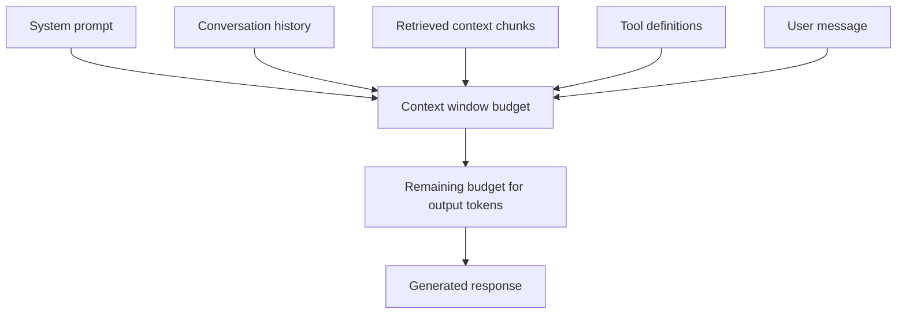

### Inference parameters and what they actually do

| Parameter | Effect | When to change it |
|---|---|---|
| `temperature` | Scales the sharpness of the sampling distribution. Low → repetitive, deterministic-ish; high → varied, creative | Near 0 for extraction, classification, SQL generation, structured output. Higher for brainstorming and copywriting. |
| `topP` (nucleus sampling) | Samples only from the smallest set of tokens whose cumulative probability exceeds P | An alternative knob to temperature; tune one, not both |
| `topK` | Samples only from the K most likely tokens | Model-family dependent; same purpose as topP |
| `maxTokens` | Hard cap on generated tokens | Cost and latency control; set it deliberately, because a runaway generation is a runaway bill |
| `stopSequences` | Strings that end generation | Structured-output framing, agent loop control |

The exam's favourite trap: a scenario complains about *inconsistent* output for a deterministic task (extracting an invoice number). The fix is lowering temperature and enforcing a schema — not a bigger model, not fine-tuning.

### Context-window overflow: the Domain 5 classic

Skill 5.2.1 is entirely about this. Symptoms and their real causes:

| Symptom | Likely cause | Fix |
|---|---|---|
| Response stops mid-sentence | `maxTokens` reached | Raise `maxTokens`, or instruct shorter output; check the stop reason in the response |
| Validation exception about input length | Input exceeds context window | Trim history, reduce `numberOfResults` for retrieval, summarize older turns |
| The model "forgets" instructions given earlier in a long chat | Earlier turns silently dropped by the application's history-trimming logic, or lost in the middle of a very long context | Keep the system prompt immutable and at the front; summarize rather than truncate; re-assert critical constraints near the question |
| Costs grow superlinearly with conversation length | The whole history is resent every turn | Rolling summary of old turns; prompt caching for stable prefixes |

Always read the **stop reason** in the response. `max_tokens` versus `end_turn` versus `stop_sequence` versus a guardrail intervention tell you four different stories, and reading it is the first troubleshooting step.

### Documentation roadmap

**REQUIRED — Inference parameters**
*Why read it:* Defines the shared `inferenceConfig` used by the Converse API and the model-specific parameter fields. Understand which parameters are universal and which are per-model.
<https://docs.aws.amazon.com/bedrock/latest/userguide/inference-parameters.html>

**REQUIRED — Token counting and quota burndown**
*Why read it:* Explains how Bedrock counts tokens against quotas — the mechanism behind throttling that is *not* request-rate based. Essential for Domain 4.
<https://docs.aws.amazon.com/bedrock/latest/userguide/quotas-token-burndown.html>

**REQUIRED — CountTokens API**
*Why read it:* The official way to measure a prompt's token count before sending it. This is the difference between estimating cost and knowing it.
<https://docs.aws.amazon.com/bedrock/latest/userguide/count-tokens.html>

**IMPORTANT — Advanced inference topics: inference parameters by model**
*Why read it:* Per-model parameter reference. Skim, then return when you actually use a model family.
<https://docs.aws.amazon.com/bedrock/latest/userguide/model-parameters.html>

**IMPORTANT — Inference reasoning**
*Why read it:* Reasoning-capable models expose a separate budget for internal reasoning tokens. Those tokens are billed and consume the window; a candidate who does not know this will mis-size context budgets.
<https://docs.aws.amazon.com/bedrock/latest/userguide/inference-reasoning.html>

**IMPORTANT — Quotas for Amazon Bedrock**
*Why read it:* Where requests-per-minute and tokens-per-minute quotas live, which are adjustable, and how they interact with inference profiles.
<https://docs.aws.amazon.com/bedrock/latest/userguide/quotas.html>

### Can I explain it?

- Why does output length affect latency more than input length, while input length affects cost more?
- A chat application's cost per conversation grows quadratically with turns. Explain the mechanism and two fixes.
- What is the first field you inspect in a response when output looks truncated?
- When would you tune `topP` instead of `temperature`?

---

## 4. Embeddings

### The problem

Keyword search fails when the user's words differ from the document's words. "How do I reset my password?" should match a document titled "Credential recovery procedure", and lexical search will not do that reliably.

### The mental model

An embedding model maps text (or an image) to a fixed-length vector of floats such that **semantic similarity becomes geometric proximity**. Similar meanings land near each other; the distance metric (cosine similarity, Euclidean, dot product) is how you measure "near".

Three engineering facts follow:

1. **The embedding model is part of your data's identity.** Vectors produced by model A are meaningless in a space built by model B. Changing embedding models means **re-embedding the whole corpus** — a migration, not a config change. This is the single most consequential early decision in a RAG system.
2. **Dimensionality is a trade-off.** More dimensions generally means better discrimination and larger storage and slower search. Some models (Titan Text Embeddings v2 among them) support configurable output dimensions so you can trade a little accuracy for a lot of index size.
3. **Queries and documents must be embedded by the same model**, and ideally in the same way (same normalization, same truncation behaviour).

### Where embeddings appear in the exam

- Choosing an embedding model for a Knowledge Base (Skill 1.5.2), including dimensionality and domain fit.
- Batch-generating embeddings with Lambda for a custom pipeline.
- Diagnosing "embedding quality" problems in retrieval (Skill 5.2.4) — usually a chunking or domain-mismatch problem wearing an embedding costume.
- Multimodal embeddings for image retrieval.

### Failure modes to recognize

| Symptom | Cause |
|---|---|
| Retrieval returns topically related but useless chunks | Chunks too large; the embedding averages several topics into a mush |
| Retrieval misses exact identifiers (order numbers, error codes) | Pure semantic search has no notion of exact match — this is the canonical case for **hybrid search** |
| Quality degrades after a corpus refresh | Documents re-embedded with a different model or different chunking than the query path assumes |
| Domain jargon retrieves badly | General-purpose embedding model with no exposure to the jargon; consider a domain-appropriate model or hybrid search on the jargon terms |

### Documentation roadmap

**REQUIRED — Amazon Titan Text Embeddings**
*Why read it:* The default embedding model in most Bedrock documentation. Read for input limits, output dimensions, normalization guidance and the request/response shape.
<https://docs.aws.amazon.com/bedrock/latest/userguide/titan-embedding-models.html>

**REQUIRED — How knowledge bases turn data into a knowledge base**
*Why read it:* Shows where embedding happens inside the managed ingestion pipeline and what you control.
<https://docs.aws.amazon.com/bedrock/latest/userguide/kb-how-data.html>

**IMPORTANT — Amazon Titan Multimodal Embeddings G1**
*Why read it:* For image-and-text retrieval, and for understanding that "embedding" is not a text-only concept.
<https://docs.aws.amazon.com/bedrock/latest/userguide/titan-multiemb-models.html>

**IMPORTANT — Amazon Bedrock Runtime code examples (Titan Text Embeddings)**
*Why read it:* Concrete SDK usage, including Java, for generating embeddings outside a managed knowledge base.
<https://docs.aws.amazon.com/bedrock/latest/userguide/service_code_examples_bedrock-runtime_amazon_titan_text_embeddings.html>

**IMPORTANT — Retrieval Augmented Generation options and architectures on AWS (Prescriptive Guidance)**
*Why read it:* AWS's own comparison of RAG building blocks, including embedding and vector-store choices. Written for architects making exactly the decisions Domain 1 tests.
<https://docs.aws.amazon.com/prescriptive-guidance/latest/retrieval-augmented-generation-options/introduction.html>

### Can I explain it?

- Why is changing the embedding model a data migration rather than a configuration change?
- Why does a purely semantic search miss an exact order number, and what fixes it?
- What does configurable embedding dimensionality buy you, and what does it cost?
- Two identical documents produce very different retrieval quality. Name three properties of the pipeline you would inspect first.

---

## 5. Vector Search and Vector Stores

### The problem

Once documents are vectors, answering "what is closest to this query vector?" over millions of vectors must happen in milliseconds. Exact nearest-neighbour search does not scale; approximate nearest neighbour (ANN) algorithms trade a small amount of recall for orders of magnitude of speed.

### The mental model

A vector store is **an index plus a filterable metadata store**. The index answers "nearest by vector"; the metadata answers "and only where tenant = X and effective_date > Y". Production retrieval quality depends on both halves, and the metadata half is where access control and freshness live.

### The AWS options and when each is right

| Store | Shape | Choose it when |
|---|---|---|
| **Amazon Bedrock Knowledge Bases (managed)** | Fully managed ingestion + vector store, no infrastructure to choose | You want RAG without operating a vector database, and the managed retrieval configuration is sufficient |
| **Amazon OpenSearch Serverless (vector search collection)** | Managed vector engine, scales capacity automatically | You need vector + lexical (hybrid) search, rich filtering, and you do not want to size clusters |
| **Amazon OpenSearch Service (managed clusters)** | You choose instances, shards and replicas | You need control over sharding, multi-index strategies, hybrid scoring, or you already run OpenSearch |
| **Aurora PostgreSQL with `pgvector`** | Vectors as a column next to relational data | Your retrieval needs joins with transactional data, you want one database and one transaction boundary, and your vector volume is moderate |
| **Amazon Neptune Analytics** | Graph + vector | Relationships between entities matter as much as text similarity (GraphRAG) |
| **Amazon DocumentDB** | Document database with vector search | You are already on DocumentDB and want vectors beside the documents |
| **Amazon S3 Vectors** | Vector storage natively in S3, cost-optimized for large, less latency-sensitive corpora | Huge vector volumes where per-query latency in the tens to hundreds of milliseconds is acceptable and cost dominates |
| **Amazon Kendra (GenAI index)** | Managed intelligent search with connectors and ACL awareness | Enterprise search over many SaaS sources with document-level permissions is the primary requirement |

> **Scope note.** The exam guide's Skill 1.4.1 lists "Amazon RDS with Amazon S3 document repositories" and "Amazon DynamoDB with vector databases for metadata and embeddings". Read those as *patterns* — relational or key-value storage holding metadata and document pointers alongside a vector index — rather than as claims that DynamoDB is itself a vector engine.

### Index design decisions that actually matter

- **Shards and replicas (OpenSearch):** shards parallelize search and bound index size; replicas add read throughput and availability. Too many shards on a small corpus adds coordination overhead; too few on a large one makes each query slow.
- **Multi-index / multi-collection strategies:** separating by domain, tenant or language improves relevance (less cross-topic noise) and simplifies access control, at the cost of query fan-out.
- **Hierarchical indexing:** index summaries at one level and detailed chunks at another; retrieve coarse then fine. This is the "hierarchical chunking" idea applied to the index.
- **Filtering before or after the ANN search** changes both correctness and latency; filtered ANN search that applies filters during traversal preserves recall better than post-filtering a fixed top-k.

### Documentation roadmap

**REQUIRED — Vector search in Amazon OpenSearch Service**
*Why read it:* The main reference for AWS's flagship vector engine: k-NN, engines and algorithms, and how vector fields are defined.
<https://docs.aws.amazon.com/opensearch-service/latest/developerguide/vector-search.html>

**REQUIRED — k-NN search**
*Why read it:* The algorithmic layer. Understand approximate versus exact search and the recall/latency trade-off you are choosing.
<https://docs.aws.amazon.com/opensearch-service/latest/developerguide/knn.html>

**REQUIRED — Working with vector search collections (OpenSearch Serverless)**
*Why read it:* The serverless option Bedrock Knowledge Bases use by default; read for capacity units, data access policies and network policies.
<https://docs.aws.amazon.com/opensearch-service/latest/developerguide/serverless-vector-search.html>

**REQUIRED — Configure neural and hybrid search**
*Why read it:* Hybrid search (lexical BM25 + vector, score-normalized) is the standard fix for the "semantic search misses exact terms" failure and is named in Skill 1.5.4.
<https://docs.aws.amazon.com/opensearch-service/latest/developerguide/serverless-configure-neural-search.html>

**REQUIRED — Aurora PostgreSQL as a vector store with pgvector**
*Why read it:* The relational option. Read for the extension setup, index types (HNSW, IVFFlat), and the operational implications of vectors in a transactional database.
<https://docs.aws.amazon.com/AmazonRDS/latest/AuroraUserGuide/AuroraPostgreSQL.VectorDB.html>

**IMPORTANT — Amazon S3 Vectors**
*Why read it:* A newer, cost-oriented vector storage option. Know that it exists, what it optimizes for, and how it integrates with OpenSearch.
<https://docs.aws.amazon.com/AmazonS3/latest/userguide/s3-vectors.html>

**IMPORTANT — Amazon Neptune Analytics**
*Why read it:* For GraphRAG scenarios, which Bedrock Knowledge Bases support directly.
<https://docs.aws.amazon.com/neptune-analytics/latest/userguide/what-is-neptune-analytics.html>

**IMPORTANT — Vector search in Amazon DocumentDB**
*Why read it:* Completes the picture of AWS vector options; useful for "we already run DocumentDB" scenarios.
<https://docs.aws.amazon.com/documentdb/latest/devguide/vector-search.html>

**OPTIONAL — GPU acceleration for vector indexing**
*Why read it:* Relevant to very large index builds; professional depth rather than exam content.
<https://docs.aws.amazon.com/opensearch-service/latest/developerguide/gpu-acceleration-vector-index.html>

### Can I explain it?

- What does a vector store do that a relational database with a float array column cannot?
- When is Aurora with `pgvector` the better answer than OpenSearch Serverless, and when is it clearly worse?
- How do shard count and replica count each change latency, throughput and cost?
- Why does filtering after retrieval sometimes return fewer results than the user expected, and how do you avoid it?

---

## 6. Retrieval-Augmented Generation (RAG)

### The problem

The model does not know your documents, your documents change, and you cannot put all of them in a prompt. You also need the answer to be attributable — "according to which document?" — which a model's parameters can never give you.

### The mental model

RAG is **just-in-time context injection**. At query time you find the small number of passages most likely to contain the answer, put them into the prompt, and instruct the model to answer *from those passages only*. The model contributes language competence; your retrieval layer contributes truth.

That framing explains the two independent failure modes, which the exam separates carefully:

- **Retrieval failure:** the right passage was never retrieved. No prompt engineering can fix this. Diagnose with retrieval metrics (context relevance, recall@k), not with answer quality.
- **Generation failure:** the right passage *was* retrieved and the model still answered wrongly, ignored it, or invented detail. Fix with prompt instructions, grounding checks, a stronger model, or structured output.

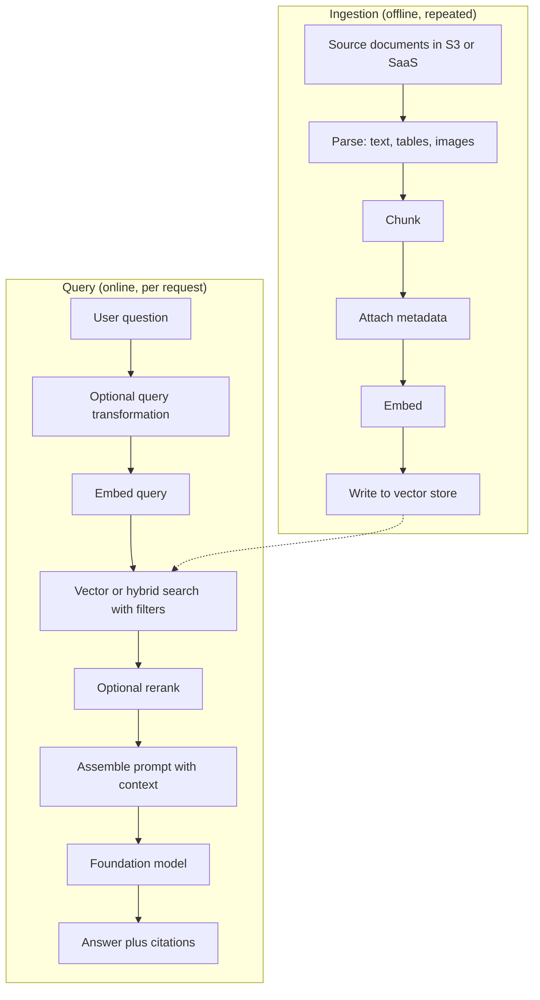

### The ingestion pipeline, stage by stage

**Parsing.** PDFs, scans, tables and images must become text (or structured representations) before chunking. Options: the default parser, a foundation-model-based parser for complex documents, Amazon Textract for forms and tables, Bedrock Data Automation for mixed media, Amazon Transcribe for audio. Bad parsing is invisible until retrieval quality mysteriously plateaus.

**Chunking.** The most consequential tunable in RAG.

| Strategy | How it works | Best for |
|---|---|---|
| Fixed size (with overlap) | N tokens per chunk, overlapping by M | Uniform prose; the safe default |
| No chunking | One chunk per file | Short documents such as FAQs or product cards |
| Hierarchical | Parent (large) and child (small) chunks; search the children, return the parents | Long structured documents where the answer needs surrounding context |
| Semantic | Split at semantic boundaries detected by embedding similarity | Documents whose topics shift irregularly |
| Custom (Lambda transformation) | Your own code, e.g. split by Markdown heading or by legal clause | Highly structured corpora with known boundaries |

The trade-off is constant: **small chunks retrieve precisely but lose context; large chunks carry context but dilute the embedding and waste tokens.**

**Metadata.** Attach tenant, source, author, effective date, document type, language, sensitivity. Metadata is what makes filtered retrieval, freshness rules and multi-tenant isolation possible. It must be attached at ingestion — retrofitting it means re-ingesting.

**Embedding and indexing.** Covered in chapters 4 and 5.

**Synchronization.** Documents change. Options: scheduled full syncs, incremental syncs driven by the data source's change detection, event-driven ingestion (S3 event → EventBridge → ingestion job), or direct ingestion APIs for single-document updates. Skill 1.4.5 asks precisely this: incremental updates, real-time change detection, automated synchronization, scheduled refresh.

### The query pipeline, stage by stage

**Query transformation.** Expansion (add synonyms), decomposition (split a compound question into sub-questions and retrieve for each), rewriting (resolve "it" against conversation history). Implemented with a cheap model call, a Lambda function, or Step Functions for multi-step flows.

**Search.** Vector, lexical, or hybrid; with metadata filters; top-k selected deliberately (too small misses, too large dilutes and costs tokens).

**Reranking.** A cross-encoder reranker scores each candidate against the query jointly rather than comparing pre-computed vectors. It is materially more accurate and materially slower, so the standard pattern is *retrieve 50, rerank, keep 5*.

**Prompt assembly.** Order matters (instructions first, context clearly delimited, question last is a common, effective layout). Always instruct the model on what to do when the context does not contain the answer — otherwise it will improvise.

**Generation and citation.** Return source references with the answer. Citations are simultaneously a UX feature, a Responsible AI transparency control (Skill 3.4.1) and a debugging tool.

### Build it yourself or use Knowledge Bases?

| Use Bedrock Knowledge Bases when | Build a custom pipeline when |
|---|---|
| Standard document RAG with supported sources | Exotic sources, bespoke parsing, or domain-specific chunking rules |
| You want managed ingestion, sync and retrieval APIs | You need full control of the retrieval algorithm or a store AWS does not manage |
| The team is small and time-to-value matters | You need per-query custom scoring, multi-stage retrieval or research-grade experimentation |
| ACL-aware retrieval from supported connectors is enough | Your authorization model cannot be expressed with metadata filters or connector ACLs |

A pragmatic middle path, and a common exam answer: use Knowledge Bases for ingestion and the `Retrieve` API for search, then do your own prompt assembly and generation. You get managed ingestion without surrendering control of the prompt.

### Documentation roadmap

**REQUIRED — Amazon Bedrock Knowledge Bases**
<https://docs.aws.amazon.com/bedrock/latest/userguide/knowledge-base.html>

**REQUIRED — How knowledge bases work**
*Why read it:* The clearest official statement of the two-phase (ingest / retrieve) model.
<https://docs.aws.amazon.com/bedrock/latest/userguide/kb-how-it-works.html>

**REQUIRED — Retrieving information from data sources**
<https://docs.aws.amazon.com/bedrock/latest/userguide/kb-how-retrieval.html>

**REQUIRED — Content chunking**
*What to extract:* the available strategies, their parameters, and which document shapes they suit.
<https://docs.aws.amazon.com/bedrock/latest/userguide/kb-chunking.html>

**REQUIRED — Parsing options**
*What to extract:* when the default parser is insufficient and what foundation-model parsing costs you.
<https://docs.aws.amazon.com/bedrock/latest/userguide/kb-advanced-parsing.html>

**REQUIRED — Include metadata in a data source**
*What to extract:* the metadata file format, and how metadata becomes a retrieval filter.
<https://docs.aws.amazon.com/bedrock/latest/userguide/kb-metadata.html>

**REQUIRED — Query a knowledge base and retrieve data (Retrieve API)** and **generate responses (RetrieveAndGenerate)**
<https://docs.aws.amazon.com/bedrock/latest/userguide/kb-test-retrieve.html>
<https://docs.aws.amazon.com/bedrock/latest/userguide/kb-test-retrieve-generate.html>

**REQUIRED — Configure and customize queries and responses**
*What to extract:* `numberOfResults`, search type (semantic/hybrid), metadata filters, prompt templates, and guardrail association — this page is where most retrieval tuning actually happens.
<https://docs.aws.amazon.com/bedrock/latest/userguide/kb-test-config.html>

**REQUIRED — Sync a data source** and **Ingest changes directly into a knowledge base**
<https://docs.aws.amazon.com/bedrock/latest/userguide/kb-data-source-sync-ingest.html>
<https://docs.aws.amazon.com/bedrock/latest/userguide/kb-direct-ingestion.html>

**IMPORTANT — Use a Lambda function for custom transformation during ingestion**
<https://docs.aws.amazon.com/bedrock/latest/userguide/kb-custom-transformation.html>

**IMPORTANT — Build a knowledge base for multimodal content**
<https://docs.aws.amazon.com/bedrock/latest/userguide/kb-multimodal.html>

**IMPORTANT — Build a knowledge base by connecting to a structured data store**
*Why read it:* Natural-language-to-SQL over a warehouse or database is a distinct RAG variant and a legitimate exam scenario (it also appears in Skill 3.1.2 as a determinism technique).
<https://docs.aws.amazon.com/bedrock/latest/userguide/knowledge-base-build-structured.html>

**IMPORTANT — RAG options and architectures on AWS (Prescriptive Guidance)**
<https://docs.aws.amazon.com/prescriptive-guidance/latest/retrieval-augmented-generation-options/introduction.html>

**OPTIONAL — Build a knowledge base with Amazon Neptune Analytics graphs** (GraphRAG)
<https://docs.aws.amazon.com/bedrock/latest/userguide/knowledge-base-build-graphs.html>

### Reading order for this chapter

1. `knowledge-base.html` — what it is.
2. `kb-how-it-works.html`, `kb-how-data.html`, `kb-how-retrieval.html` — the two phases.
3. `kb-chunking.html`, `kb-advanced-parsing.html`, `kb-metadata.html` — the levers that determine quality.
4. `kb-test-retrieve.html`, `kb-test-retrieve-generate.html`, `kb-test-config.html` — the query-time API surface.
5. `kb-data-source-sync-ingest.html`, `kb-direct-ingestion.html` — keeping it fresh.
6. The Prescriptive Guidance RAG options paper — to place your choices in a wider design space.

This order follows the data: first what a knowledge base is, then how documents get in, then how answers come out, then how it stays current.

### Can I explain it?

- Distinguish a retrieval failure from a generation failure, and give the metric you would use to tell them apart.
- Why does increasing chunk size sometimes *reduce* answer quality?
- Your corpus updates hourly and users complain about stale answers. Walk through the synchronization options and their trade-offs.
- Why is reranking usually applied to 50 candidates rather than to the entire corpus?

---

## 7. Prompt Engineering, Prompt Management and Governance

### The problem

The prompt is the interface to the model — and in most organizations it starts life as a string literal in application code, unversioned, untested, edited by whoever is on call. That is a production system whose behaviour changes without review.

### The mental model

Treat the prompt as **source code with a schema and a test suite**, and treat prompt changes as deployments. A prompt has:

- a **system instruction** (role, constraints, tone, refusal policy, output contract) — stable, versioned;
- **context** (retrieved chunks, conversation history, user profile) — dynamic, per request;
- a **user message** — untrusted input;
- an **output contract** (format, schema, length).

The security consequence is central to Domain 3: everything after the system instruction is data that an attacker may control, including retrieved documents. Treat it as untrusted input, exactly as you would in a SQL or template-injection context.

### Techniques that are actually tested

| Technique | What it does | Use when |
|---|---|---|
| Clear role and task framing | Reduces ambiguity, improves consistency | Always |
| Explicit output contract (JSON schema, field list, "respond with only…") | Makes parsing reliable | Any machine-consumed output |
| Few-shot examples | Demonstrates format and edge-case handling | Format is hard to describe but easy to show |
| Chain-of-thought / step-by-step instructions | Improves multi-step reasoning accuracy | Analysis, math, planning. Costs output tokens |
| Delimiters around context | Prevents instruction/data confusion and blunts injection | Any RAG or user-supplied content |
| "If the context does not contain the answer, say you do not know" | Reduces hallucination materially | Every RAG prompt |
| Prompt chaining / decomposition | Splits a hard task into verifiable steps | Complex workflows; implement with Flows or Step Functions |

### Prompt governance: the part engineers skip

Skill 1.6.3 asks for "comprehensive prompt management and governance": parameterized templates, approval workflows, template repositories, usage tracking with CloudTrail, access logging with CloudWatch Logs. Concretely:

- **Bedrock Prompt Management** stores prompts as first-class resources with **versions**; applications reference a version (or an alias) rather than inlining text. That gives you rollback, diffing and an audit trail.
- **CloudTrail** records control-plane changes (who edited or published which prompt version).
- **A regression suite** — a golden dataset of inputs with expected properties — runs on every prompt change, in CI, with a quality gate. Skill 1.6.4 names Lambda, Step Functions and CloudWatch for exactly this.
- **Flows** compose prompts into multi-step graphs with conditional branching, versioned and deployable as a unit.

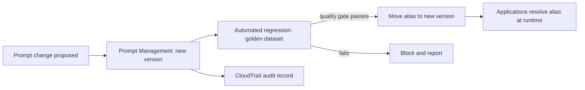

### Documentation roadmap

**REQUIRED — Prompt engineering concepts**
<https://docs.aws.amazon.com/bedrock/latest/userguide/prompt-engineering-guidelines.html>

**REQUIRED — What is prompt engineering?** and **Design a prompt**
<https://docs.aws.amazon.com/bedrock/latest/userguide/what-is-prompt-engineering.html>
<https://docs.aws.amazon.com/bedrock/latest/userguide/design-a-prompt.html>

**REQUIRED — Prompt management in Amazon Bedrock**
*What to extract:* how prompts, variants, variables and versions are modelled, and how an application retrieves a prompt at runtime.
<https://docs.aws.amazon.com/bedrock/latest/userguide/prompt-management.html>

**REQUIRED — Create a prompt** and **Deploy to your application using versions**
<https://docs.aws.amazon.com/bedrock/latest/userguide/prompt-management-create.html>
<https://docs.aws.amazon.com/bedrock/latest/userguide/prompt-management-deploy.html>

**IMPORTANT — Prompt templates and examples for Amazon Bedrock text models**
<https://docs.aws.amazon.com/bedrock/latest/userguide/prompt-templates-and-examples.html>

**IMPORTANT — Optimize and migrate prompts (prompt optimization)**
*Why read it:* AWS's managed prompt optimization rewrites a prompt for a target model — directly relevant to "we switched models and quality dropped".
<https://docs.aws.amazon.com/bedrock/latest/userguide/prompt-optimization-migration.html>

**IMPORTANT — Prompt engineering best practices for LLMs (Prescriptive Guidance)**
<https://docs.aws.amazon.com/prescriptive-guidance/latest/llm-prompt-engineering-best-practices/introduction.html>

**IMPORTANT — Prompt injection security**
*Why read it:* AWS's own guidance on treating prompt content as untrusted. Read it here, then again in chapter 63.
<https://docs.aws.amazon.com/bedrock/latest/userguide/prompt-injection.html>

### Can I explain it?

- Why is a prompt a deployable artifact rather than a configuration string?
- What does a prompt regression suite assert, given that model output is non-deterministic?
- How do delimiters and explicit context framing reduce prompt-injection risk, and why are they insufficient on their own?
- When would you use Prompt Flows instead of one large prompt?

---

## 8. Agents, Tool Use and Orchestration

### The problem

Some tasks cannot be answered from text alone: they require looking something up, calling an API, doing arithmetic reliably, or performing an action with side effects. And some require several of those, in an order that depends on intermediate results.

### The mental model

**Tool use** (also called function calling) is a protocol, not magic. You describe the available tools as JSON schemas; the model, instead of answering, may emit a structured request to call one; *your code* executes it and returns the result; the model continues. The model never calls anything itself — every side effect passes through your code, which is exactly where authorization belongs.

**An agent** is that loop plus a policy: an orchestrator that repeatedly asks the model "given the goal and what we know so far, what next?", executes the chosen tool, appends the result, and stops when the model produces a final answer or a stopping condition fires.

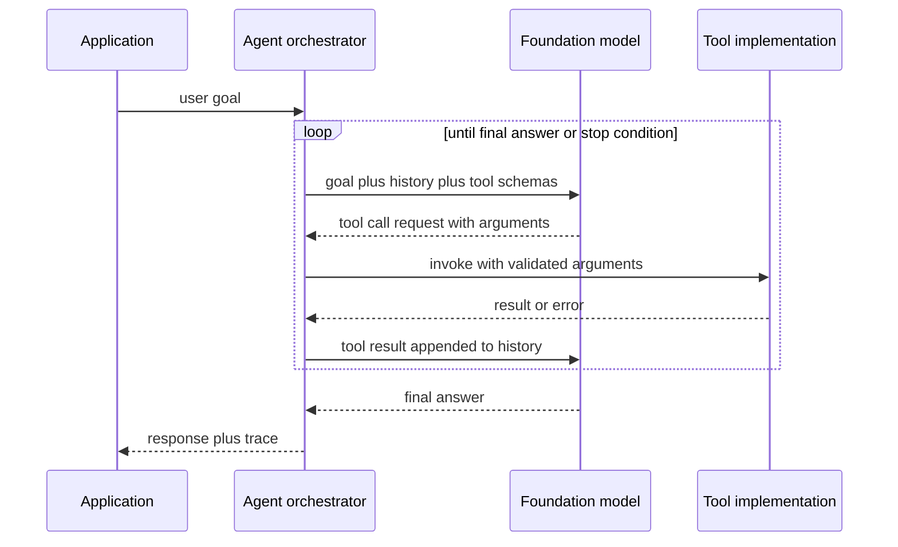

### The three hard problems of agents

1. **Termination.** An agent can loop forever, oscillate between two tools, or retry a failing call indefinitely. Controls: maximum iterations, wall-clock timeouts, per-tool call budgets, circuit breakers, and a stopping condition in the orchestration layer. Skill 2.1.3 names exactly these.
2. **Authorization.** The agent acts with *some* identity. If it uses the application's role, any user can reach anything the role can. Correct designs propagate user identity (AgentCore Identity, OAuth outbound credentials, per-session scoped credentials) or restrict tools per user via the orchestrator.
3. **Observability.** When an agent gives a wrong answer, you need the *trace*: which tools it considered, what it called, with what arguments, what came back. Without traces, agent debugging is guesswork — hence agent trace events, AgentCore Observability and X-Ray.

### The AWS agent landscape in September 2026

This is the area where the exam guide and current documentation diverge most, so read the scope note carefully.

| Option | What it is | Position |
|---|---|---|
| **Converse API tool use** | Raw tool-calling protocol; you write the loop | Maximum control, minimum machinery. Correct answer whenever the "agent" is two tools and a loop |
| **Amazon Bedrock Agents** | Managed agent with action groups (Lambda or API schemas), knowledge-base integration, memory, guardrails, traces, multi-agent collaboration | Managed orchestration inside Bedrock |
| **Amazon Bedrock AgentCore** | A platform for agents you write yourself: Runtime (serverless hosting with session isolation), Gateway (turns APIs and Lambda into MCP tools), Memory (short and long term), Identity (inbound/outbound auth), Observability, Evaluations, Policy, plus Code Interpreter and Browser tools | Framework-agnostic infrastructure for production agents |
| **Strands Agents** | Open-source, AWS-maintained SDK for building agents in a few lines of Python, with model and tool abstractions | Named explicitly in Skill 2.1.1 and 2.5.5 |
| **AWS Agent Squad** | Open-source framework for orchestrating multiple specialized agents with a classifier that routes to the right one | Named explicitly in Skill 2.1.1 and 2.5.5 |
| **AWS Step Functions** | Deterministic workflow orchestration, including direct Bedrock integration | The right answer whenever the sequence is known in advance, or when you need durable, auditable, restartable execution |
| **Model Context Protocol (MCP)** | An open protocol standardizing how agents discover and call tools | Named in Skills 1.5.6, 2.1.1 and 2.1.7 |

> **Scope note.** Current Bedrock documentation marks the original Bedrock Agents experience as **"Agents Classic" in maintenance mode**, with AgentCore positioned as the path forward for new agentic workloads. The exam guide names Bedrock Agents, AgentCore, Strands and Agent Squad together. Study Bedrock Agents concepts (action groups, orchestration, memory, traces) because they are named and because the vocabulary transfers, but understand AgentCore as the current production platform.

### Deterministic workflow or agent?

A recurring professional-level judgement:

- **Use Step Functions** when the steps are known, auditability and exactly-once semantics matter, and you want retries, error handling and compensation built in. A model may sit *inside* a step, but the model does not choose the path.
- **Use an agent** when the path genuinely depends on the content of intermediate results and enumerating branches is impractical.
- **Use both:** an agent for the open-ended part, Step Functions for the regulated part (approval, payment, provisioning). The exam likes architectures where the irreversible action sits behind a deterministic, human-approved step.

### Documentation roadmap

**REQUIRED — Tool use (function calling) in Amazon Bedrock**
<https://docs.aws.amazon.com/bedrock/latest/userguide/tool-use.html>

**REQUIRED — Client-side tool use** and **server-side tool use**
*What to extract:* the request/response shapes, the `toolUse` / `toolResult` content blocks, and which tools Bedrock can execute itself.
<https://docs.aws.amazon.com/bedrock/latest/userguide/tool-use-client-side.html>
<https://docs.aws.amazon.com/bedrock/latest/userguide/tool-use-server-side.html>

**REQUIRED — Amazon Bedrock Agents** and **how agents work**
<https://docs.aws.amazon.com/bedrock/latest/userguide/agents.html>
<https://docs.aws.amazon.com/bedrock/latest/userguide/agents-how.html>

**REQUIRED — Amazon Bedrock AgentCore overview**
<https://docs.aws.amazon.com/bedrock-agentcore/latest/devguide/what-is-bedrock-agentcore.html>

**REQUIRED — Trace events for agents**
*Why read it:* Traces are the Responsible AI transparency control *and* the debugging tool. Know what a trace contains.
<https://docs.aws.amazon.com/bedrock/latest/userguide/trace-events.html>

**IMPORTANT — Agents Classic maintenance mode**
*Why read it:* So you can reason correctly about which agent technology a new workload should use.
<https://docs.aws.amazon.com/bedrock/latest/userguide/agents-classic-maintenance-mode.html>

**IMPORTANT — AWS Step Functions overview** and **error handling**
<https://docs.aws.amazon.com/step-functions/latest/dg/welcome.html>
<https://docs.aws.amazon.com/step-functions/latest/dg/concepts-error-handling.html>

**IMPORTANT — Strands Agents documentation** — [Non-AWS-hosted site, open-source project maintained by AWS; supplementary]
<https://strandsagents.com/>

**IMPORTANT — Model Context Protocol specification** — [Non-AWS, open standard; supplementary for concepts, authoritative for the protocol]
<https://modelcontextprotocol.io/docs/2026-07-28/getting-started/intro>

**OPTIONAL — AWS Agent Squad** — [Non-AWS-hosted repository, AWS Labs project; supplementary]
<https://github.com/2FastLabs/agent-squad>

### Can I explain it?

- Who executes a tool call, and why does that fact determine where authorization belongs?
- Name four independent mechanisms that stop a runaway agent loop.
- Give a scenario where Step Functions is a better answer than an agent, and one where the reverse holds.
- What does an agent trace let you diagnose that a CloudWatch log line does not?

---

## 9. Evaluation

### The problem

"It looks better" is not evidence. Without measurement you cannot choose between models, tell whether a prompt change helped, detect a regression after a model upgrade, or demonstrate to a regulator that the system was assessed.

### The mental model

Evaluation answers three separate questions, and confusing them is the classic mistake:

1. **Is the generation good?** — relevance, factual accuracy, coherence, fluency, safety, adherence to format.
2. **Is the retrieval good?** — did the pipeline surface the passages that contain the answer (context relevance, recall), and is the answer faithful to them (groundedness / faithfulness)?
3. **Is the agent good?** — task completion rate, correct tool selection, number of steps, cost per task, and reasoning quality.

Each has its own dataset, its own metrics and its own AWS tooling.

### The three evaluation methods

| Method | How it works | Strengths | Limits |
|---|---|---|---|
| **Automatic (metric-based)** | Built-in algorithmic metrics against a labelled dataset | Cheap, fast, repeatable, good for regression gates | Weak correlation with human judgement on open-ended generation |
| **LLM-as-a-judge** | A model scores outputs against a rubric | Scales, handles open-ended quality, surprisingly well-correlated with human raters when the rubric is good | Judge bias (position, verbosity, self-preference), extra cost, requires rubric engineering |
| **Human** | Human raters or SMEs score outputs through a work-team UI | The ground truth for subjective and high-stakes quality | Slow, expensive, needs guidelines and inter-rater agreement |

Mature programmes use all three: automatic gates in CI, LLM-as-a-judge for broad nightly runs, humans for periodic calibration and for anything regulated.

### RAG-specific metrics worth knowing by name

- **Context relevance / precision:** were retrieved chunks actually relevant to the question?
- **Context recall:** did retrieval find everything needed?
- **Faithfulness / groundedness:** is every claim in the answer supported by the retrieved context?
- **Answer correctness / relevance:** does the answer address the question and match the reference?
- **Completeness:** does the answer cover all parts of a multi-part question?

The diagnostic table every candidate should internalize:

| Faithful? | Correct? | Diagnosis |
|---|---|---|
| Yes | Yes | Working as intended |
| Yes | No | Retrieval gave the wrong (or outdated) passages — fix retrieval |
| No | Yes | The model got lucky using parametric knowledge — dangerous; enforce grounding |
| No | No | Hallucination with poor retrieval — fix retrieval first, then grounding controls |

### Golden datasets

A golden dataset is a curated set of representative inputs with expected outputs or expected properties. It is the backbone of Skill 5.1.4 (quality gates), 5.1.9 (deployment validation) and 4.3.6 (hallucination detection). Build it from real traffic, include edge cases and known past failures, version it alongside prompts, and never let it leak into anything used for customization.

### Documentation roadmap

**REQUIRED — Evaluate models and RAG systems in Amazon Bedrock**
<https://docs.aws.amazon.com/bedrock/latest/userguide/evaluation.html>

**REQUIRED — Automatic model evaluation jobs**
<https://docs.aws.amazon.com/bedrock/latest/userguide/evaluation-automatic.html>

**REQUIRED — LLM-as-a-judge model evaluation jobs**
<https://docs.aws.amazon.com/bedrock/latest/userguide/evaluation-judge.html>

**REQUIRED — RAG evaluation jobs (knowledge base evaluation)**
*What to extract:* which retrieval and generation metrics AWS computes, what the input dataset must look like, and how results are reported.
<https://docs.aws.amazon.com/bedrock/latest/userguide/evaluation-kb.html>

**REQUIRED — Human-based model evaluation jobs**
<https://docs.aws.amazon.com/bedrock/latest/userguide/evaluation-human.html>

**REQUIRED — Reports and metrics for model evaluation**
<https://docs.aws.amazon.com/bedrock/latest/userguide/model-evaluation-report.html>

**REQUIRED — AgentCore Evaluations** and **built-in evaluators**
*Why read it:* Agent evaluation (Skill 5.1.7) is its own discipline, scored from traces rather than from a single input/output pair.
<https://docs.aws.amazon.com/bedrock-agentcore/latest/devguide/evaluations.html>
<https://docs.aws.amazon.com/bedrock-agentcore/latest/devguide/built-in-evaluators-overview.html>

**IMPORTANT — Amazon Augmented AI human review loops**
<https://docs.aws.amazon.com/sagemaker/latest/dg/a2i-use-augmented-ai-a2i-human-review-loops.html>

**IMPORTANT — SageMaker Ground Truth**
<https://docs.aws.amazon.com/sagemaker/latest/dg/sms.html>

**IMPORTANT — Data management and encryption in Bedrock evaluation jobs**
<https://docs.aws.amazon.com/bedrock/latest/userguide/evaluation-data-management.html>

### Can I explain it?

- An answer is factually correct but not grounded in the retrieved context. Why is that a problem worth fixing?
- Which evaluation method would you put in a CI quality gate, and which would you run nightly? Why not the other way round?
- What does "context recall" measure that "answer correctness" cannot?
- How would you evaluate an agent that completes the task but takes nine tool calls when three would do?

---

## 10. Responsible AI, Safety and Guardrails (conceptual foundation)

### The problem

A generative system can produce content that is harmful, biased, confidently false, or that leaks data it should not — and it can be *induced* to do so by an adversary who only has the ability to type text. None of these are model bugs you can wait for a vendor to fix; they are properties your architecture must contain.

### The mental model: defence in depth

There is no single control that makes a generative system safe. The exam's framing (Skill 3.1.4) is explicitly defence in depth — independent layers, each of which can fail without the system failing:

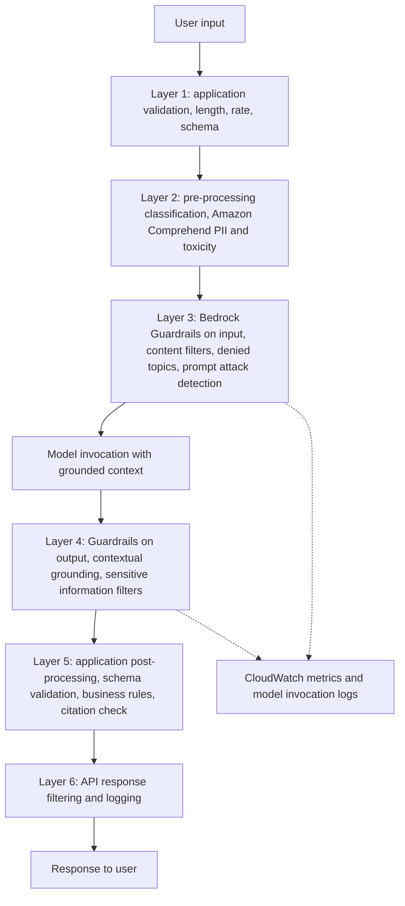

Two properties make this architecture defensible rather than decorative:

- **Guardrails are independent of the model.** The same guardrail policy applies across models and can be applied to arbitrary text through the `ApplyGuardrail` API — including text your application never sends to Bedrock at all. That makes safety a versioned, auditable, portable resource rather than a property of a model you happen to have chosen.
- **The layers fail differently.** A classifier misses what a semantic policy catches; a grounding check catches what a content filter cannot; schema validation catches malformed output regardless of meaning.

### The Responsible AI dimensions AWS uses

AWS frames Responsible AI around dimensions including fairness, explainability, privacy and security, safety, controllability, veracity and robustness, governance, and transparency. For the exam, the useful translation is *which AWS control implements each dimension*:

| Dimension | Concrete AWS implementation |
|---|---|
| Safety | Guardrails content filters, denied topics, word filters |
| Privacy | Guardrails sensitive-information filters, Comprehend/Macie PII detection, KMS, VPC endpoints, retention policies |
| Veracity | Contextual grounding checks, Automated Reasoning checks, RAG with citations, evaluation |
| Transparency | Citations, agent traces, model cards, decision logs |
| Fairness | Evaluation across demographic slices, LLM-as-a-judge rubrics, SageMaker Clarify bias metrics |
| Governance | CloudTrail, model invocation logging, Service Catalog, organizational policy frameworks |
| Controllability | Guardrails, AgentCore Policy, IAM boundaries, human-in-the-loop approval |

### Hallucination is an architecture problem

"The model hallucinated" is rarely an acceptable root cause in a professional-level answer. Ask instead: was the necessary fact retrieved? Did the prompt permit invention? Was grounding checked? Was the claim verified against a source before display? The controls ladder, cheapest first: instruct the model to refuse when context is insufficient → ground in retrieved context with citations → enable contextual grounding checks → enforce structured output and validate → verify critical claims against a system of record → escalate to human review.

### Documentation roadmap

**REQUIRED — Amazon Bedrock Guardrails**
<https://docs.aws.amazon.com/bedrock/latest/userguide/guardrails.html>

**REQUIRED — How guardrails work**
<https://docs.aws.amazon.com/bedrock/latest/userguide/guardrails-how.html>

**REQUIRED — Create your guardrail (components)**
*What to extract:* the six policy types and what each one is for.
<https://docs.aws.amazon.com/bedrock/latest/userguide/guardrails-components.html>

**REQUIRED — Contextual grounding checks**
<https://docs.aws.amazon.com/bedrock/latest/userguide/guardrails-contextual-grounding-check.html>

**REQUIRED — Prompt injection security guidance for Amazon Bedrock**
<https://docs.aws.amazon.com/bedrock/latest/userguide/prompt-injection.html>

**IMPORTANT — Abuse detection in Amazon Bedrock**
*Why read it:* Explains AWS-side abuse detection, which is distinct from your guardrails and often confused with them.
<https://docs.aws.amazon.com/bedrock/latest/userguide/abuse-detection.html>

**IMPORTANT — AWS Cloud Adoption Framework for Artificial Intelligence, Machine Learning, and Generative AI**
*Why read it:* The organizational-governance framing behind Skill 3.3.3, written by AWS.
<https://docs.aws.amazon.com/whitepapers/latest/aws-caf-for-ai/aws-caf-for-ai.html>

**IMPORTANT — SageMaker model cards**
<https://docs.aws.amazon.com/sagemaker/latest/dg/model-cards.html>

### Can I explain it?

- Why is a guardrail a better control than a well-written system prompt for the same policy?
- Give two failure classes that guardrails cannot catch and name the layer that does.
- What does "hallucination" decompose into once you refuse to treat it as a single phenomenon?
- Which Responsible AI dimension does a citation serve, and which does a grounding check serve?

---

# Part II — Amazon Bedrock

Amazon Bedrock is the centre of gravity of AIP-C01. Roughly speaking, if you deeply understand Bedrock's inference APIs, Knowledge Bases, Guardrails, agents, evaluation, customization, throughput model, security model and observability, you have covered most of Domains 1, 3, 4 and 5 and a large share of Domain 2.

Part II is organized as a curriculum, not as a feature list: platform model → access → invocation → structure and streaming → safety → retrieval → agents → customization → evaluation → capacity → governance.

---

## 11. Amazon Bedrock Mental Model

### Why the service exists

Before Bedrock, using a frontier model in an AWS workload meant negotiating with a model vendor, managing an API key, sending data to a third party, and rebuilding that integration for every model you wanted to compare. Bedrock replaces all of that with an AWS-native, IAM-authenticated, VPC-reachable, CloudTrail-audited API surface over many providers' models.

The value is not "an API for models". It is that **a foundation model becomes an ordinary AWS resource**: addressed by ARN, authorized by IAM, encrypted with KMS, reachable over PrivateLink, logged to CloudWatch and CloudTrail, billed on your AWS invoice, and governed by the same policies as the rest of your account.

### The two planes

This distinction resolves half of all IAM confusion:

| Plane | Endpoint / SDK client | What it does | Example operations |
|---|---|---|---|
| **Control plane** | `bedrock` (e.g. `BedrockClient` in Java) | Manage resources and configuration | `ListFoundationModels`, `CreateGuardrail`, `CreateKnowledgeBase`, `CreateModelCustomizationJob`, `CreateEvaluationJob`, `PutModelInvocationLoggingConfiguration` |
| **Runtime (data) plane** | `bedrock-runtime` (`BedrockRuntimeClient`) | Perform inference | `InvokeModel`, `InvokeModelWithResponseStream`, `Converse`, `ConverseStream`, `ApplyGuardrail`, `CountTokens` |

There are parallel planes for agents and knowledge bases: `bedrock-agent` (build-time: create agents, action groups, knowledge bases, prompts, flows) and `bedrock-agent-runtime` (runtime: `InvokeAgent`, `Retrieve`, `RetrieveAndGenerate`, `InvokeFlow`, `Rerank`).

Practical consequence: an application role usually needs **only runtime permissions**. If your Lambda's policy includes `bedrock:CreateGuardrail`, something is wrong with your least-privilege design.

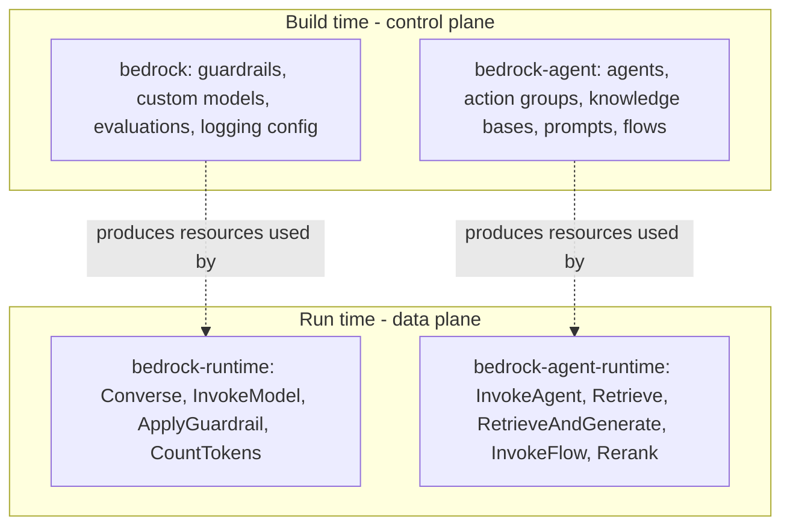

### What Bedrock does not do

- It does not know your users. Only your IAM principal.
- It does not remember conversations (except through the explicit Sessions feature or agent memory).
- It does not validate that the model's output makes sense for your business.
- It does not train on your prompts or completions. Your inputs and outputs are not used to train the underlying models and are not shared with model providers — a fact you will need for compliance questions.

### Data flow and the trust boundary

A single Converse call: your application signs a request with SigV4 using credentials from the default provider chain; the request reaches the regional `bedrock-runtime` endpoint (over the internet, or privately through an interface VPC endpoint); Bedrock authorizes it against IAM (identity policy, resource constraints, condition keys, SCPs); applies the guardrail if one is specified; routes to the model; returns the completion, optionally streamed; writes invocation logs if you enabled them; emits CloudWatch metrics; records the API call in CloudTrail.

Everything inside that sentence is an exam-relevant control point.

### Documentation roadmap

**REQUIRED — What is Amazon Bedrock**
<https://docs.aws.amazon.com/bedrock/latest/userguide/what-is-bedrock.html>

**REQUIRED — Quickstart**
*Why read it:* the shortest path from zero to a working invocation; establishes console and API vocabulary.
<https://docs.aws.amazon.com/bedrock/latest/userguide/getting-started.html>

**REQUIRED — Endpoints** and **APIs**
*What to extract:* which endpoint hosts which operations, and the control/runtime split.
<https://docs.aws.amazon.com/bedrock/latest/userguide/endpoints.html>
<https://docs.aws.amazon.com/bedrock/latest/userguide/apis.html>

**REQUIRED — Amazon Bedrock API Reference (Welcome)**
*Why read it:* you will return to this constantly; learn its structure now (Bedrock, Bedrock Runtime, Agents for Amazon Bedrock, Agents Runtime).
<https://docs.aws.amazon.com/bedrock/latest/APIReference/Welcome.html>

**IMPORTANT — Working with AWS SDKs**
<https://docs.aws.amazon.com/bedrock/latest/userguide/sdk-general-information-section.html>

**IMPORTANT — API keys for Amazon Bedrock**
*Why read it:* Bedrock supports API keys for simpler authentication in addition to SigV4. Understand the trade-off — convenience versus IAM's full condition/audit model — and when a key is acceptable.
<https://docs.aws.amazon.com/bedrock/latest/userguide/api-keys.html>

**IMPORTANT — Detailed getting started guide (API)**
<https://docs.aws.amazon.com/bedrock/latest/userguide/getting-started-api.html>

### Can I explain it?

- Why does the control/runtime split matter for least-privilege IAM design?
- Which AWS controls apply to a Bedrock call that would not apply to calling a model vendor's public API directly?
- What state does Bedrock keep between two `Converse` calls from the same user?
- When would an API key be an acceptable authentication mechanism, and when is it clearly wrong?

---

## 12. Model Access, Regions and Availability

### The problem

A model is not automatically callable just because it appears in the catalogue. Access is granted per account, per Region, per model, and availability differs by Region and by feature. Most "it works in my account but not in production" incidents live here.

### The mental model

Think of three independent gates in front of every inference call:

1. **Is the model available in this Region?** (Model support by Region.)
2. **Has this account been granted access to this model in this Region?** (Model access request — a one-time, per-account action; some models additionally require a Marketplace subscription or an end-user licence acceptance.)
3. **Does the calling principal have IAM permission for this model ARN?** (`bedrock:InvokeModel` on the model or inference-profile ARN.)

All three must pass. Failures at gates 2 and 3 both surface as access-denied errors, which is why the troubleshooting question is a favourite.

### Regions, endpoints and data residency

Inference happens in the Region you call, which is the anchor for data-residency arguments — with one important exception: **cross-Region inference** can route a request to another Region within a defined geography (or globally, with the global profile) to obtain capacity. That is a resilience and throughput feature with a compliance consequence you must be able to articulate. If a workload must not leave a jurisdiction, you use a Region-specific inference profile (or no profile at all), not a geographic one.

### Documentation roadmap

**REQUIRED — Request access to Amazon Bedrock foundation models**
<https://docs.aws.amazon.com/bedrock/latest/userguide/model-access.html>

**REQUIRED — Model support by Region** and **feature support by Region**
<https://docs.aws.amazon.com/bedrock/latest/userguide/models-regions.html>
<https://docs.aws.amazon.com/bedrock/latest/userguide/features-regions.html>

**REQUIRED — Model lifecycle**
<https://docs.aws.amazon.com/bedrock/latest/userguide/model-lifecycle.html>

**IMPORTANT — Endpoint availability** and **regional availability by endpoints**
<https://docs.aws.amazon.com/bedrock/latest/userguide/models-endpoint-availability.html>
<https://docs.aws.amazon.com/bedrock/latest/userguide/endpoints-region-availability.html>

**IMPORTANT — Get a list of models (programmatically)**
*Why read it:* `ListFoundationModels` is how an application discovers what it may use, rather than hard-coding a catalogue.
<https://docs.aws.amazon.com/bedrock/latest/userguide/models-get-info.html>

**IMPORTANT — Subscribe from AWS Marketplace**
<https://docs.aws.amazon.com/bedrock/latest/userguide/model-access-product-ids.html>

**OPTIONAL — Manage subscriptions with AWS License Manager**
<https://docs.aws.amazon.com/bedrock/latest/userguide/managed-entitlements.html>

### Can I explain it?

- Three different causes produce an access-denied error on `InvokeModel`. Name them and the fix for each.
- How would an application discover at startup which models it is permitted to use?
- What does cross-Region inference change about a data-residency commitment?

---

## 13. Bedrock Runtime and the Invoke APIs

### The mental model

There are two families of inference API, and knowing *why* both exist is worth more than memorizing either:

- **`InvokeModel` / `InvokeModelWithResponseStream`** — a thin, model-native pipe. The request body is the model provider's own JSON schema; Bedrock passes it through. Maximum access to model-specific features, zero portability.
- **`Converse` / `ConverseStream`** — a unified, model-agnostic conversation interface: `messages`, `system`, `inferenceConfig`, `toolConfig`, `guardrailConfig`. Bedrock translates to each model's native format. Slight loss of exotic per-model options (available through `additionalModelRequestFields`), large gain in portability.

Bedrock additionally exposes OpenAI-compatible surfaces (Chat Completions, Responses and Messages APIs) for migrating existing code. Know that they exist and what they are for; the exam's centre remains Converse.

### Why Converse is usually the right answer

Skill 1.2.2 asks for provider switching "without requiring code modifications". Converse is the concrete mechanism: swap the model ID, keep the code. It also normalizes the two things applications most often need — tool use and guardrail application — across model families. In exam scenarios, prefer Converse unless the question specifically requires a model-native capability that only `InvokeModel` exposes.

### Anatomy of a Converse request

```text
modelId            model id, inference profile id, provisioned throughput ARN, or custom model deployment
messages[]         ordered conversation turns, each with role (user|assistant) and content blocks
                   content blocks: text, image, document, video, toolUse, toolResult, guardContent
system[]           system instructions, separate from the conversation
inferenceConfig    maxTokens, temperature, topP, stopSequences
toolConfig         tool specifications (JSON schema) and tool choice
guardrailConfig    guardrailIdentifier, guardrailVersion, trace
additionalModelRequestFields   model-specific parameters not in the unified schema
```

And the response: `output.message` (the assistant turn), `stopReason` (`end_turn`, `tool_use`, `max_tokens`, `stop_sequence`, `guardrail_intervened`, `content_filtered`), `usage` (input, output and total tokens — **log this; it is your cost telemetry**), `metrics.latencyMs`, and `trace` when requested.

### The Java view

For a Java backend developer, the shape to internalize is:

```java
// AWS SDK for Java 2.x
BedrockRuntimeClient client = BedrockRuntimeClient.builder()
        .region(Region.US_EAST_1)
        .credentialsProvider(DefaultCredentialsProvider.create())
        .build();

ConverseResponse response = client.converse(request -> request
        .modelId("<model-or-inference-profile-id>")
        .system(SystemContentBlock.fromText("You answer only from the provided context."))
        .messages(Message.builder()
                .role(ConversationRole.USER)
                .content(ContentBlock.fromText(userQuestion))
                .build())
        .inferenceConfig(cfg -> cfg.maxTokens(512).temperature(0.0F)));

String answer = response.output().message().content().get(0).text();
int inputTokens = response.usage().inputTokens();
```

The important engineering points are not the syntax: build the client **once** (it is thread-safe and expensive to create), use the async client (`BedrockRuntimeAsyncClient`) for streaming and for high fan-out, set timeouts and a retry strategy deliberately because default HTTP timeouts are usually too short for long generations, and record `usage` on every call.

### Documentation roadmap

**REQUIRED — Making inference requests**
<https://docs.aws.amazon.com/bedrock/latest/userguide/inference.html>

**REQUIRED — Converse API**
<https://docs.aws.amazon.com/bedrock/latest/userguide/conversation-inference.html>

**REQUIRED — Invoke API**
<https://docs.aws.amazon.com/bedrock/latest/userguide/inference-api.html>

**REQUIRED — Converse API reference** and **InvokeModel API reference**
*What to extract:* exact request/response members, especially `stopReason`, `usage`, and the content-block union.
<https://docs.aws.amazon.com/bedrock/latest/APIReference/API_runtime_Converse.html>
<https://docs.aws.amazon.com/bedrock/latest/APIReference/API_runtime_InvokeModel.html>

**REQUIRED — API error codes**
*Why read it:* `ThrottlingException`, `ValidationException`, `ModelTimeoutException`, `ServiceQuotaExceededException`, `ModelNotReadyException`, `AccessDeniedException` — each implies a different remediation. Domain 5 asks you to distinguish them.
<https://docs.aws.amazon.com/bedrock/latest/userguide/troubleshooting-api-error-codes.html>

**IMPORTANT — Amazon Bedrock Runtime code examples** (includes Java)
<https://docs.aws.amazon.com/bedrock/latest/userguide/service_code_examples_bedrock-runtime.html>

**IMPORTANT — OpenAI-compatible surfaces: Chat Completions, Responses, Messages**
*Why read it:* migration scenarios, and knowing which API a scenario's existing code is using.
<https://docs.aws.amazon.com/bedrock/latest/userguide/inference-chat-completions.html>
<https://docs.aws.amazon.com/bedrock/latest/userguide/inference-responses-api.html>
<https://docs.aws.amazon.com/bedrock/latest/userguide/inference-messages-api.html>

**IMPORTANT — API restrictions**
<https://docs.aws.amazon.com/bedrock/latest/userguide/inference-api-restrictions.html>

### Can I explain it?

- Give two reasons to choose Converse over InvokeModel, and one reason to do the opposite.
- Which response field tells you the generation was cut short, and which tells you a guardrail acted?
- Why should a Bedrock client be a singleton in a Spring Boot application, and what must you configure that the defaults get wrong?
- What breaks if you switch model families while using `InvokeModel` directly?

---

## 14. Structured Output, Reasoning and Model-Specific Behaviour

### The problem

Applications need typed data, not prose. "Return JSON" in a prompt works most of the time, and "most of the time" is the problem: at scale, a 1% malformed-output rate is an incident.

### The mental model

There are three levels of rigour, and you should be able to place any scenario on this ladder:

1. **Ask nicely.** Instruct the format in the prompt, parse defensively, retry on failure. Cheapest, least reliable.
2. **Constrain the model.** Use structured outputs / JSON-schema-constrained generation, or model the desired shape as a tool and let tool-use schemas enforce it. The model is steered toward valid output by construction.
3. **Verify independently.** Validate against a JSON Schema in your code, apply business rules, and reject or repair. This layer is never optional, because level 2 reduces malformed output without eliminating the possibility.

Skill 3.1.3 names "JSON Schema to enforce structured outputs" as a hallucination-reduction technique, which is the right framing: a schema removes an entire class of ambiguity from the interaction.

### Reasoning models

Some models expose extended reasoning: the model produces internal reasoning tokens before its answer. Three engineering implications: reasoning tokens are **billed**; they **consume the context window**; and they **increase latency**. Enable reasoning for genuinely hard multi-step tasks and disable it for routine ones. Traces of reasoning can be surfaced for transparency (Skill 3.4.1) but should be treated as an explanation aid, not as a verified account of how the answer was produced.

### Documentation roadmap

**REQUIRED — Structured Outputs**
<https://docs.aws.amazon.com/bedrock/latest/userguide/structured-output.html>

**REQUIRED — Inference reasoning**
<https://docs.aws.amazon.com/bedrock/latest/userguide/inference-reasoning.html>

**IMPORTANT — Structured outputs with Anthropic Claude messages**
<https://docs.aws.amazon.com/bedrock/latest/userguide/claude-messages-structured-outputs.html>

**IMPORTANT — Inference parameters by model**
<https://docs.aws.amazon.com/bedrock/latest/userguide/model-parameters.html>

**OPTIONAL — Computer use**
*Why read it:* a specialized tool-use capability; know it exists and that it carries heightened safety requirements.
<https://docs.aws.amazon.com/bedrock/latest/userguide/computer-use.html>

### Can I explain it?

- Why is schema-constrained generation not a substitute for validation in your code?
- What are the three costs of enabling reasoning, and when do they pay for themselves?
- How can tool use be used to obtain structured output even when the task requires no tool at all?

---

## 15. Multimodal Input and Document Processing

### The problem

Enterprise knowledge does not live in clean text. It lives in scanned PDFs, slide decks, spreadsheets, call recordings and photographs. Skill 1.3.2 asks explicitly for pipelines handling text, image, audio and tabular data.

### The mental model

There are two routes from a non-text artifact to a model, and choosing between them is the design decision:

- **Convert first, then reason.** Textract for forms/tables, Transcribe for audio, Bedrock Data Automation for mixed documents; the model then sees text. Deterministic, auditable, cacheable, cheaper; loses visual layout nuance.
- **Send the artifact to a multimodal model.** The model sees the image or document directly. Preserves layout and visual context; costs more per call and is harder to audit.

Production pipelines usually do both: structured extraction for the fields that matter, multimodal reasoning for the parts that resist schemas.

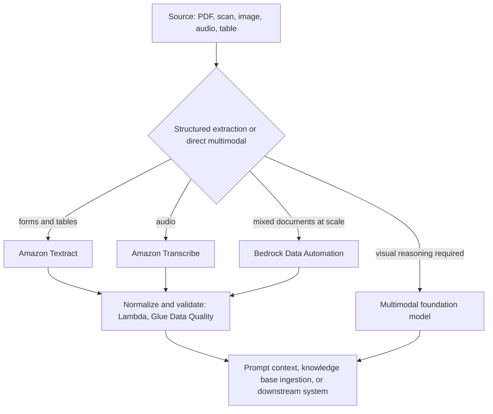

### Bedrock Data Automation

BDA deserves specific attention because the exam guide names it (Skill 2.5.3). It converts unstructured multimodal content — documents, images, audio, video — into structured output, either **standard output** (a consistent default extraction) or **custom output** driven by **blueprints** you define. It also supports sensitive-data detection and redaction. Mentally file it as *managed, schema-driven document and media understanding*, sitting between raw Textract/Transcribe and a bespoke pipeline.

### Documentation roadmap

**REQUIRED — Amazon Bedrock Data Automation** and **how it works**
<https://docs.aws.amazon.com/bedrock/latest/userguide/bda.html>
<https://docs.aws.amazon.com/bedrock/latest/userguide/bda-how-it-works.html>

**REQUIRED — Build a knowledge base for multimodal content**
<https://docs.aws.amazon.com/bedrock/latest/userguide/kb-multimodal.html>

**IMPORTANT — BDA standard output** and **custom output and blueprints**
<https://docs.aws.amazon.com/bedrock/latest/userguide/bda-standard-output.html>
<https://docs.aws.amazon.com/bedrock/latest/userguide/bda-custom-output-idp.html>

**IMPORTANT — BDA sensitive data detection and redaction**
<https://docs.aws.amazon.com/bedrock/latest/userguide/bda-sensitive-data.html>

**IMPORTANT — Amazon Textract**
<https://docs.aws.amazon.com/textract/latest/dg/what-is.html>

**IMPORTANT — Amazon Transcribe**
<https://docs.aws.amazon.com/transcribe/latest/dg/what-is.html>

**IMPORTANT — Parsing options for knowledge bases** (foundation-model parsing, BDA as a parser)
<https://docs.aws.amazon.com/bedrock/latest/userguide/kb-advanced-parsing.html>

**OPTIONAL — Amazon Rekognition**
<https://docs.aws.amazon.com/rekognition/latest/dg/what-is.html>

### Can I explain it?

- When is deterministic extraction preferable to multimodal reasoning, and why do auditors care?
- What does a BDA blueprint give you that a prompt asking for JSON does not?
- Where in a multimodal RAG pipeline does redaction belong, and why not later?

---

## 16. Streaming Inference

### The problem

A 900-token answer takes seconds to generate. A user staring at a spinner for six seconds perceives a broken product, even though total latency is identical to one where text appears after 400 ms and flows steadily.

### The mental model

Streaming does not make generation faster; it changes **when the user sees the first token**. The metric that matters for perceived performance is *time to first token* (TTFT); the metric that matters for total cost and completion is *time to last token*. Streaming optimizes the first, not the second.

Architecturally, streaming forces a decision at every hop between the model and the browser, because a normal request/response hop breaks the stream:

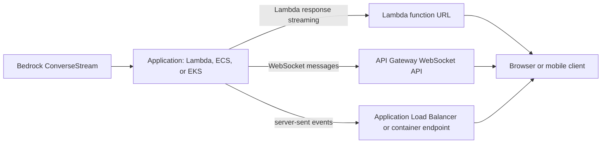

The trap the exam sets: **API Gateway REST and HTTP APIs with Lambda proxy integration buffer the response**; they do not stream chunk-by-chunk to the client. If a scenario requires token-by-token delivery, the valid answers are WebSocket APIs, Lambda response streaming via function URLs, or a container behind a load balancer emitting server-sent events.

### Engineering consequences of streaming

- **Guardrails:** output filtering on a stream is different from filtering a complete response. Bedrock supports streaming guardrail evaluation, which can act mid-stream; you must decide what your client does with already-displayed text when an intervention occurs.
- **Errors mid-stream:** a stream can fail after partial output. Your client and your telemetry need to handle "partial success", and your retry logic must not double-charge the user for a re-generation.
- **Token accounting:** usage metadata arrives at the end of the stream. Do not assume you can compute cost from what you displayed.
- **Timeouts:** every hop (SDK socket timeout, Lambda timeout, API Gateway idle timeout, load-balancer idle timeout) must exceed the longest expected generation.

### Documentation roadmap

**REQUIRED — ConverseStream API reference**
<https://docs.aws.amazon.com/bedrock/latest/APIReference/API_runtime_ConverseStream.html>

**REQUIRED — InvokeModelWithResponseStream API reference**
<https://docs.aws.amazon.com/bedrock/latest/APIReference/API_runtime_InvokeModelWithResponseStream.html>

**REQUIRED — Configure a Lambda function to stream responses**
<https://docs.aws.amazon.com/lambda/latest/dg/configuration-response-streaming.html>

**REQUIRED — API Gateway WebSocket APIs**
<https://docs.aws.amazon.com/apigateway/latest/developerguide/apigateway-websocket-api.html>

**IMPORTANT — Streaming responses with guardrails**
<https://docs.aws.amazon.com/bedrock/latest/userguide/guardrails-streaming.html>

**IMPORTANT — AWS SDK for Java asynchronous programming**
*Why read it:* streaming from Java uses the async client and a subscriber; this page explains the model.
<https://docs.aws.amazon.com/sdk-for-java/latest/developer-guide/asynchronous.html>

### Can I explain it?

- What exactly does streaming improve, and what does it leave unchanged?
- Why can a REST API Gateway endpoint not deliver a token-by-token stream, and what are the three alternatives?
- A guardrail blocks content halfway through a stream. What should the client do, and what should you log?
- Where do you get token usage for a streamed response?

---

## 17. Amazon Bedrock Guardrails (deep dive)

### Why it exists as a separate resource

Safety policy changes at a different rate than application code and must apply uniformly across models, teams and applications. Making guardrails a standalone, versioned resource means a compliance team can own them, an auditor can inspect them, and a model swap cannot silently change your safety posture.

### The policy types

| Policy | What it evaluates | Typical use |
|---|---|---|
| **Content filters** | Harmful categories (hate, insults, sexual, violence, misconduct) with configurable strength, on input and output; image content filters for multimodal | Baseline moderation |
| **Prompt attack detection** | Jailbreak and prompt-injection patterns in user input | First line against adversarial input |
| **Denied topics** | Topics you define in natural language, with examples | "Do not give legal, medical or investment advice" |
| **Word filters** | Exact words and phrases, plus managed profanity list | Competitor names, slurs, internal codenames |
| **Sensitive information filters** | PII entity types and custom regex; block or mask | Prevent PII in prompts or leakage in responses |
| **Contextual grounding check** | Grounding score (is the response supported by the provided source?) and relevance score (does it address the query?), with thresholds | RAG hallucination control |
| **Automated Reasoning checks** | Formal, logic-based verification of statements against a policy you encode | High-assurance domains where "probably right" is not enough |

### How guardrails are applied

Three distinct mechanisms, and the exam expects you to pick correctly:

1. **Inline with inference** — pass `guardrailConfig` to Converse/InvokeModel. Bedrock evaluates input and output around the model call.
2. **Independently, via `ApplyGuardrail`** — evaluate arbitrary text with no model invocation. This is how you guard content that never touches Bedrock (a third-party model, user-generated content, a tool result), and how you validate input *before* paying for inference.
3. **Attached to a resource** — a knowledge base query, an agent, or a flow can carry a guardrail so the policy applies to everything that resource does.

Guardrails also support **input tagging**, letting you mark which parts of a prompt are user content and which are trusted system content, so filters apply where they should.

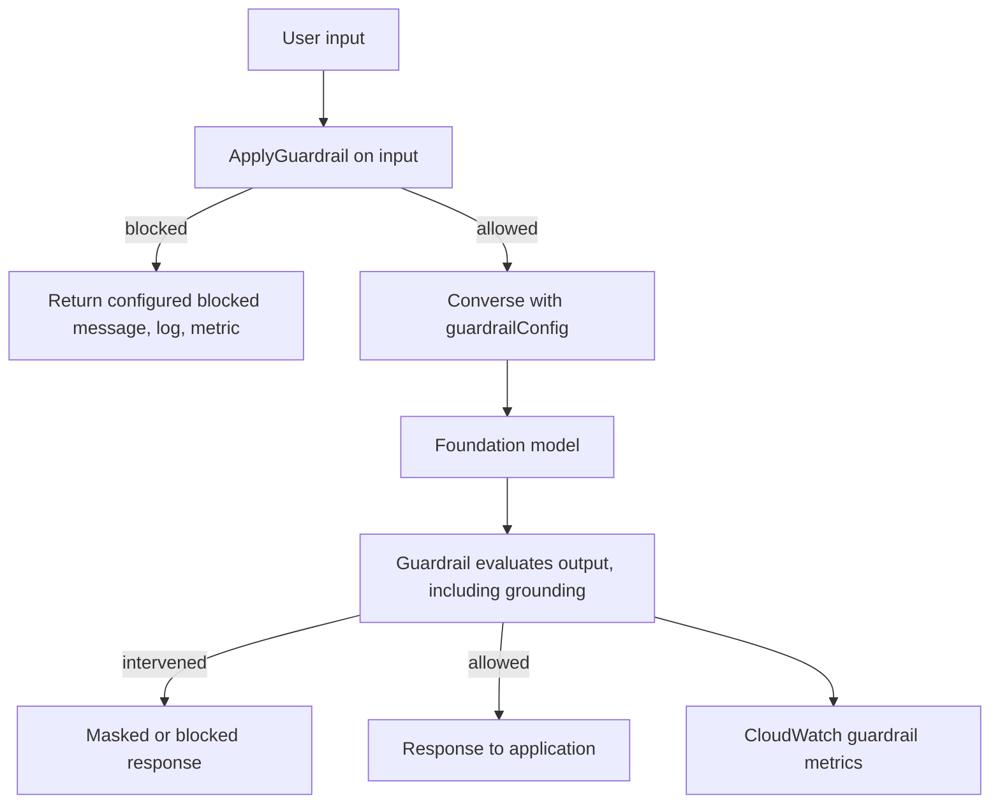

### Operational facts that matter

- Guardrails are **versioned**; applications should reference a specific version (or `DRAFT` only in development). Publishing a new version is a deployable change — test it against a golden dataset of adversarial and benign inputs.
- Guardrails add **latency and cost** to each call; measure both.
- **Safeguard tiers** let you choose the tier of guardrail policy behaviour (including language coverage); check supported Regions and models.
- Guardrails emit **CloudWatch metrics** for interventions — this is your safety telemetry and your alerting source for attack campaigns.
- `stopReason` and guardrail trace tell you *why* something was blocked. Log the trace; without it, "the assistant refused" is unexplainable.
- A guardrail can be **cross-Region** and can be **enforced by IAM condition keys**, so a principal cannot invoke a model *without* a specified guardrail — that is how you make safety mandatory rather than voluntary.

### Documentation roadmap

**REQUIRED — Guardrails overview and how it works**
<https://docs.aws.amazon.com/bedrock/latest/userguide/guardrails.html>
<https://docs.aws.amazon.com/bedrock/latest/userguide/guardrails-how.html>

**REQUIRED — Create your guardrail (components)**
<https://docs.aws.amazon.com/bedrock/latest/userguide/guardrails-components.html>

**REQUIRED — Content filters** and **prompt attacks**
<https://docs.aws.amazon.com/bedrock/latest/userguide/guardrails-content-filters.html>
<https://docs.aws.amazon.com/bedrock/latest/userguide/guardrails-prompt-attack.html>

**REQUIRED — Denied topics**, **word filters**, **sensitive information filters**
<https://docs.aws.amazon.com/bedrock/latest/userguide/guardrails-denied-topics.html>
<https://docs.aws.amazon.com/bedrock/latest/userguide/guardrails-word-filters.html>
<https://docs.aws.amazon.com/bedrock/latest/userguide/guardrails-sensitive-filters.html>

**REQUIRED — Contextual grounding checks**
<https://docs.aws.amazon.com/bedrock/latest/userguide/guardrails-contextual-grounding-check.html>

**REQUIRED — Use the ApplyGuardrail API in your application**
<https://docs.aws.amazon.com/bedrock/latest/userguide/guardrails-use-independent-api.html>

**REQUIRED — Include a guardrail with the Converse API**
<https://docs.aws.amazon.com/bedrock/latest/userguide/guardrails-use-converse-api.html>

**REQUIRED — Enforce specific guardrails during inference (IAM condition)**
*Why read it:* the difference between "we have a guardrail" and "a guardrail cannot be bypassed".
<https://docs.aws.amazon.com/bedrock/latest/userguide/guardrails-permissions-id.html>

**IMPORTANT — Automated Reasoning checks**
<https://docs.aws.amazon.com/bedrock/latest/userguide/guardrails-automated-reasoning-checks.html>

**IMPORTANT — Guardrail versions** and **deploy your guardrail**
<https://docs.aws.amazon.com/bedrock/latest/userguide/guardrails-versions-create.html>
<https://docs.aws.amazon.com/bedrock/latest/userguide/guardrails-deploy.html>

**IMPORTANT — Monitor guardrails with CloudWatch metrics**
<https://docs.aws.amazon.com/bedrock/latest/userguide/monitoring-guardrails-cw-metrics.html>

**IMPORTANT — Safeguard tiers** and **supported Regions and models**
<https://docs.aws.amazon.com/bedrock/latest/userguide/guardrails-tiers.html>
<https://docs.aws.amazon.com/bedrock/latest/userguide/guardrails-supported.html>

**IMPORTANT — Options for handling harmful content** (block versus mask)
<https://docs.aws.amazon.com/bedrock/latest/userguide/guardrails-harmful-content-handling-options.html>

**OPTIONAL — Resource-based policies for guardrails** and **cross-account safeguards**
<https://docs.aws.amazon.com/bedrock/latest/userguide/guardrails-resource-based-policies.html>
<https://docs.aws.amazon.com/bedrock/latest/userguide/guardrails-enforcements.html>

### Reading order

1. `guardrails.html` → `guardrails-how.html` — the model.
2. `guardrails-components.html` and the six policy pages — the levers.
3. `guardrails-use-converse-api.html` and `guardrails-use-independent-api.html` — the two application patterns.
4. `guardrails-permissions-id.html` — making it mandatory.
5. `monitoring-guardrails-cw-metrics.html` — knowing whether it works.

### Can I explain it?

- When would you call `ApplyGuardrail` rather than passing `guardrailConfig` inline? Give two distinct cases.
- How do you make it impossible for a developer in your account to invoke a model without a guardrail?
- What do the grounding and relevance thresholds in a contextual grounding check actually compare?
- Which guardrail policy addresses indirect prompt injection carried inside a retrieved document, and what other control must accompany it?

---

## 18. Bedrock Knowledge Bases: Ingestion

### The mental model

A knowledge base is a **managed ETL pipeline for retrieval**: it connects to sources, parses, chunks, embeds, writes to a vector store, keeps that store in sync, and exposes retrieval APIs. You configure the pipeline; AWS runs it.

Current documentation distinguishes two builds, and the difference is worth knowing:

- **Managed knowledge base** — AWS manages the vector store entirely. Fastest path; fewest knobs; supports connectors, ACL-aware retrieval and agentic retrieval.
- **Knowledge base with your own vector store** — you bring OpenSearch Serverless, OpenSearch managed clusters, Aurora PostgreSQL, Neptune Analytics, or another supported store. More control over index design, cost and data location; more responsibility.

There are also knowledge bases over **structured data stores** (the model generates SQL against your warehouse) and over an **Amazon Kendra GenAI index** (enterprise search with connectors and document-level ACLs).

### The ingestion decisions that determine quality

1. **Data source and connector.** S3 is the baseline; connectors exist for Confluence, SharePoint, Salesforce, Web Crawler, custom sources and others. Connector choice determines what metadata and ACLs you get for free.
2. **Parsing.** Default parser for clean text; foundation-model parsing or Bedrock Data Automation for documents with tables, charts and images.
3. **Chunking.** Fixed, hierarchical, semantic, none, or a custom Lambda transformation.
4. **Metadata.** Supplied as companion metadata files or connector attributes; becomes your filtering and access-control vocabulary at query time.
5. **Embedding model.** Chosen at creation and effectively immutable without re-ingesting.
6. **Vector store.** Managed or your own; if your own, you must pre-create the index with the right dimensions and field mappings.
7. **Sync strategy.** Full or incremental sync jobs, event-driven triggers, or direct ingestion of individual documents.

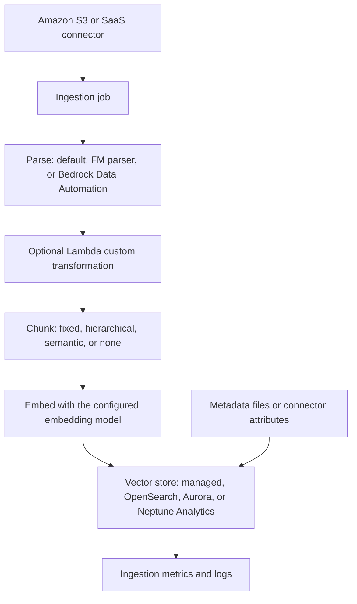

### Operational realities

- Ingestion is **asynchronous and billable**; large corpora take time and embedding calls cost money. Plan an initial load window.
- **Failed documents are reported per job.** Read the ingestion job statistics; silently skipped files are a common cause of "the answer isn't in the knowledge base".
- **Changing chunking or the embedding model requires re-ingestion.** Treat those as schema migrations.
- **Deletion matters for compliance.** Know how a document is removed from both the source and the index (direct ingestion delete, or sync after source deletion).
- **Access control at ingestion time** — ACL-aware connectors carry document permissions into retrieval so a user only sees what they are entitled to. Without that, you need metadata filters and per-tenant separation.

### Documentation roadmap

**REQUIRED — Knowledge bases overview** and **how knowledge bases work**
<https://docs.aws.amazon.com/bedrock/latest/userguide/knowledge-base.html>
<https://docs.aws.amazon.com/bedrock/latest/userguide/kb-how-it-works.html>

**REQUIRED — Turning data into a knowledge base**
<https://docs.aws.amazon.com/bedrock/latest/userguide/kb-how-data.html>

**REQUIRED — Build a managed knowledge base** and **build a knowledge base with vector stores**
<https://docs.aws.amazon.com/bedrock/latest/userguide/kb-build-managed.html>
<https://docs.aws.amazon.com/bedrock/latest/userguide/knowledge-base-build.html>

**REQUIRED — Prerequisites for your vector store**
*What to extract:* index naming, vector dimensions, field mappings — the setup that must match your embedding model exactly.
<https://docs.aws.amazon.com/bedrock/latest/userguide/knowledge-base-setup.html>

**REQUIRED — Content chunking**, **parsing options**, **metadata**
<https://docs.aws.amazon.com/bedrock/latest/userguide/kb-chunking.html>
<https://docs.aws.amazon.com/bedrock/latest/userguide/kb-advanced-parsing.html>
<https://docs.aws.amazon.com/bedrock/latest/userguide/kb-metadata.html>

**REQUIRED — Sync a data source** and **direct ingestion**
<https://docs.aws.amazon.com/bedrock/latest/userguide/kb-data-source-sync-ingest.html>
<https://docs.aws.amazon.com/bedrock/latest/userguide/kb-direct-ingestion.html>

**REQUIRED — Knowledge base service role permissions**
<https://docs.aws.amazon.com/bedrock/latest/userguide/kb-permissions.html>

**IMPORTANT — Custom transformation with Lambda**
<https://docs.aws.amazon.com/bedrock/latest/userguide/kb-custom-transformation.html>

**IMPORTANT — Connect a data source** (connector catalogue)
<https://docs.aws.amazon.com/bedrock/latest/userguide/kb-managed-connect-ds.html>

**IMPORTANT — ACL awareness** and **VPC configuration for managed knowledge bases**
<https://docs.aws.amazon.com/bedrock/latest/userguide/kb-managed-acl.html>
<https://docs.aws.amazon.com/bedrock/latest/userguide/kb-managed-vpc-configuration.html>

**IMPORTANT — Monitor knowledge bases** and **managed knowledge base observability**
<https://docs.aws.amazon.com/bedrock/latest/userguide/knowledge-bases-logging.html>
<https://docs.aws.amazon.com/bedrock/latest/userguide/kb-managed-observability.html>

**OPTIONAL — Cross-account resource policies for knowledge bases**
<https://docs.aws.amazon.com/bedrock/latest/userguide/kb-managed-cross-account.html>

### Can I explain it?

- Which two ingestion decisions force a full re-ingestion if changed later?
- How does document-level access control reach the retrieval layer, and what do you do when your source has no ACL connector?
- A user says a document "isn't in the knowledge base" although it is in the bucket. List the checks, in order.

---

## 19. Bedrock Knowledge Bases: Retrieval and Generation

### The two APIs

| API | What it returns | Use it when |
|---|---|---|
| `Retrieve` | Ranked chunks with scores, metadata and source locations — no generation | You want to own prompt assembly, mix in other context, or feed another system |
| `RetrieveAndGenerate` (and its streaming variant) | A generated answer plus citations | You want managed RAG end to end |

Choosing `Retrieve` plus your own Converse call is a legitimate, often-preferable design: you keep prompt versioning, tool use, guardrail configuration and model choice in your own hands while still getting managed ingestion.

### The retrieval knobs

- **`numberOfResults` (top-k):** more context improves recall and costs tokens and latency; beyond a point it *reduces* answer quality by diluting the signal.
- **Search type:** semantic or hybrid. Hybrid is the answer when exact identifiers, product codes or rare terms matter.
- **Metadata filters:** equality, comparison and logical combinations over the attributes you attached at ingestion. This is your tenant isolation, recency filter and document-type selector.
- **Reranking:** apply a reranker model to reorder candidates before generation.
- **Query reformulation / decomposition:** break a compound question into sub-queries before retrieval.
- **Generation configuration:** prompt template, inference parameters, guardrail association, and how citations are produced.
- **Session and conversation context:** so follow-up questions resolve pronouns correctly.

### Diagnosing bad answers

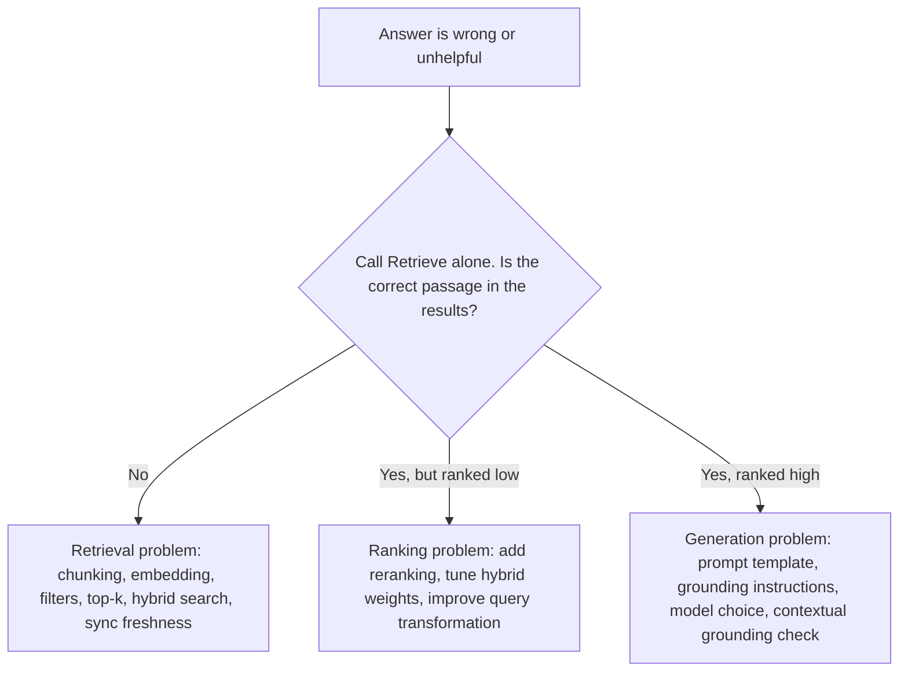

This flow is the single most useful troubleshooting habit for Domain 5. **Always separate retrieval from generation before theorizing.**

### Documentation roadmap

**REQUIRED — Retrieving information from data sources**
<https://docs.aws.amazon.com/bedrock/latest/userguide/kb-how-retrieval.html>

**REQUIRED — Test your knowledge base with queries and responses**
<https://docs.aws.amazon.com/bedrock/latest/userguide/knowledge-base-test.html>

**REQUIRED — Query a knowledge base and retrieve data**
<https://docs.aws.amazon.com/bedrock/latest/userguide/kb-test-retrieve.html>

**REQUIRED — Query a knowledge base and generate responses**
<https://docs.aws.amazon.com/bedrock/latest/userguide/kb-test-retrieve-generate.html>

**REQUIRED — Configure and customize queries and responses**
<https://docs.aws.amazon.com/bedrock/latest/userguide/kb-test-config.html>

**REQUIRED — Retrieve and RetrieveAndGenerate API references**
<https://docs.aws.amazon.com/bedrock/latest/APIReference/API_agent-runtime_Retrieve.html>
<https://docs.aws.amazon.com/bedrock/latest/APIReference/API_agent-runtime_RetrieveAndGenerate.html>
<https://docs.aws.amazon.com/bedrock/latest/APIReference/API_agent-runtime_RetrieveAndGenerateStream.html>

**IMPORTANT — Deploy your knowledge base for your application**
<https://docs.aws.amazon.com/bedrock/latest/userguide/knowledge-base-deploy.html>

**IMPORTANT — ACL-aware retrieval** and **agentic retrieval**
<https://docs.aws.amazon.com/bedrock/latest/userguide/kb-test-retrieve-acl.html>
<https://docs.aws.amazon.com/bedrock/latest/userguide/kb-test-agentic-retrieve.html>

**IMPORTANT — Configure responses for reasoning models**
<https://docs.aws.amazon.com/bedrock/latest/userguide/kb-test-configure-reasoning.html>

### Can I explain it?

- Why might increasing top-k from 5 to 25 make answers worse?
- Give the precise sequence of checks that distinguishes a retrieval failure from a generation failure.
- When is `Retrieve` plus your own Converse call better than `RetrieveAndGenerate`?
- How do metadata filters implement multi-tenant isolation, and what is the risk if a filter is applied in the application rather than in the query?

---

## 20. Reranking

### The problem

Vector similarity is a *proxy* for relevance computed independently for query and document. It is fast because the document vectors were computed in advance — and approximate for the same reason.

### The mental model

A reranker is a **cross-encoder**: it looks at the query and a candidate passage *together* and scores their relevance directly. Because it cannot pre-compute, it is far too slow to run over a corpus — so it runs over the shortlist that vector search produced.

```text
Query → vector/hybrid search → 25-100 candidates → reranker → top 3-5 → prompt
```

The gain is typically a large improvement in precision at small k, which translates directly into fewer hallucinations (the model sees less irrelevant context) and fewer tokens (you can pass 5 good chunks instead of 20 mediocre ones). The cost is added latency and a per-rerank charge.

### Documentation roadmap

**REQUIRED — Reranker models in Amazon Bedrock**
<https://docs.aws.amazon.com/bedrock/latest/userguide/rerank.html>

**REQUIRED — Use a reranker model**
<https://docs.aws.amazon.com/bedrock/latest/userguide/rerank-use.html>

**REQUIRED — Rerank API reference**
<https://docs.aws.amazon.com/bedrock/latest/APIReference/API_agent-runtime_Rerank.html>

**IMPORTANT — Reranker permissions** and **supported Regions and models**
<https://docs.aws.amazon.com/bedrock/latest/userguide/rerank-prereq.html>
<https://docs.aws.amazon.com/bedrock/latest/userguide/rerank-supported.html>

**IMPORTANT — Reranker pricing model**
<https://docs.aws.amazon.com/bedrock/latest/userguide/rerank-pricing.html>

### Can I explain it?

- Why can a reranker not replace vector search?
- How does reranking reduce both hallucination and token cost at the same time?
- What latency budget does reranking consume, and when is that unacceptable?

---

## 21. Query Handling and Retrieval Optimization

### The problem

Users ask badly. They use pronouns, compound two questions into one, use internal abbreviations, or phrase a question in a way that shares no vocabulary with the answer.

### Techniques and where they run

| Technique | What it does | Implementation |
|---|---|---|
| **Query rewriting** | Resolves references against conversation history ("what about *its* warranty?") | A cheap model call before retrieval |
| **Query expansion** | Adds synonyms, expands acronyms | Model call, or a curated synonym map in the lexical index |
| **Query decomposition** | Splits multi-part questions; retrieves per sub-question | Lambda or Step Functions orchestration |
| **HyDE-style expansion** | Generate a hypothetical answer, embed *that*, search with it | Model call; helps when questions and documents differ stylistically |
| **Hybrid search** | Combines BM25 lexical scores with vector scores | OpenSearch neural/hybrid search pipelines |
| **Metadata pre-filtering** | Narrows the candidate set before similarity | Knowledge base filters or index queries |
| **Reranking** | Reorders the shortlist | Chapter 20 |

Every one of these costs latency, and some cost an extra model call. The professional judgement is which to apply for which query class — for example, decompose only when the question contains a conjunction, or skip expansion for queries that already contain an exact identifier.

### Retrieval performance (Skill 4.2.2)

Latency in a RAG request typically decomposes as: query embedding (tens of ms) + vector search (tens of ms if indexed well, seconds if not) + reranking (tens to hundreds of ms) + generation (the dominant term). Optimize in that awareness: index tuning and caching of embeddings help, but the largest win is usually sending *less, better* context to the model.

### Documentation roadmap

**REQUIRED — Configure and customize queries and responses** (query reformulation, filters, search type)
<https://docs.aws.amazon.com/bedrock/latest/userguide/kb-test-config.html>

**REQUIRED — Configure neural and hybrid search in OpenSearch**
<https://docs.aws.amazon.com/opensearch-service/latest/developerguide/serverless-configure-neural-search.html>

**IMPORTANT — k-NN search tuning**
<https://docs.aws.amazon.com/opensearch-service/latest/developerguide/knn.html>

**IMPORTANT — AWS Step Functions Map state** (fan-out for decomposed queries)
<https://docs.aws.amazon.com/step-functions/latest/dg/state-map.html>

**IMPORTANT — RAG options and architectures (Prescriptive Guidance)**
<https://docs.aws.amazon.com/prescriptive-guidance/latest/retrieval-augmented-generation-options/introduction.html>

### Can I explain it?

- Which query-handling technique fixes "what about its warranty?" and which fixes "compare the 2023 and 2024 policies"?
- Where does most of the latency in a RAG request actually live, and what does that imply about optimization priorities?
- When does hybrid search hurt rather than help?

---

## 22. Amazon Bedrock Agents

### The mental model

A Bedrock agent is a **managed ReAct loop** with a fixed set of building blocks:

- **Instruction** — the agent's system prompt: role, scope, rules.
- **Foundation model** — the reasoning engine.
- **Action groups** — tools, defined either by an OpenAPI schema plus a Lambda function, or by a function schema; the agent chooses when to call them.
- **Knowledge bases** — attached for retrieval-augmented answers.
- **Memory** — retains context across sessions.
- **Guardrails** — safety applied to the agent's inputs and outputs.
- **Advanced prompts** — templates for each stage of orchestration (pre-processing, orchestration, knowledge-base response generation, post-processing), which you can override.
- **Traces** — a step-by-step record of reasoning, tool selection, invocation and results.
- **Versions and aliases** — an agent is drafted, prepared, versioned and exposed through an alias that applications invoke.

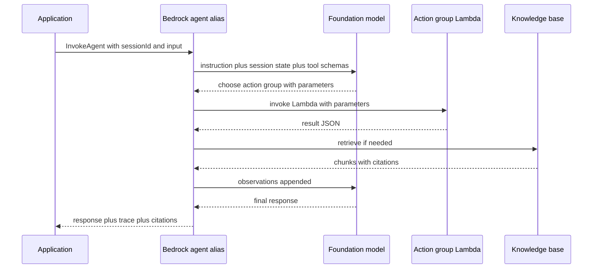

### What the developer owns

The Lambda behind an action group is ordinary code with extraordinary responsibilities: **validate every parameter** (the arguments were written by a language model and may be influenced by user input), enforce authorization for the *end user*, be idempotent where the action has side effects, return errors in a form the agent can reason about, and never return secrets or raw internal errors into the model's context.

### Session state and return of control

Two mechanisms worth knowing by name: **session attributes / prompt session attributes** let you pass data into an agent invocation without putting it in the user's message (user ID, locale, entitlements); **return of control** lets the agent hand a tool call back to your application to execute, instead of invoking a Lambda — essential when the action must run inside your own network or under the end user's credentials.

> **Scope note.** Bedrock Agents Classic is in maintenance mode in current documentation, with AgentCore as the path forward. The exam guide still names Bedrock Agents (and Bedrock Agent evaluations in Skill 5.1.7), so learn both: Agents for the concepts and vocabulary, AgentCore for how you would actually build a new production agent in 2026.

### Documentation roadmap

**REQUIRED — Agents overview** and **how Amazon Bedrock Agents work**
<https://docs.aws.amazon.com/bedrock/latest/userguide/agents.html>
<https://docs.aws.amazon.com/bedrock/latest/userguide/agents-how.html>

**REQUIRED — Use action groups to define actions for your agent**
<https://docs.aws.amazon.com/bedrock/latest/userguide/agents-action-create.html>

**REQUIRED — Augment response generation with a knowledge base**
<https://docs.aws.amazon.com/bedrock/latest/userguide/agents-kb-add.html>

**REQUIRED — Retain conversational context using memory**
<https://docs.aws.amazon.com/bedrock/latest/userguide/agents-memory.html>

**REQUIRED — Test and troubleshoot agent behavior** and **trace events**
<https://docs.aws.amazon.com/bedrock/latest/userguide/agents-test.html>
<https://docs.aws.amazon.com/bedrock/latest/userguide/trace-events.html>

**REQUIRED — Deploy and use an agent in your application** (versions and aliases)
<https://docs.aws.amazon.com/bedrock/latest/userguide/agents-deploy.html>

**REQUIRED — Implement safeguards for your agent (guardrails)**
<https://docs.aws.amazon.com/bedrock/latest/userguide/agents-guardrail.html>

**IMPORTANT — Multi-agent collaboration**
<https://docs.aws.amazon.com/bedrock/latest/userguide/agents-multi-agent-collaboration.html>

**IMPORTANT — Customize your agent (advanced prompts)**
<https://docs.aws.amazon.com/bedrock/latest/userguide/agents-customize.html>

**IMPORTANT — Configure an agent to request information from the user**
<https://docs.aws.amazon.com/bedrock/latest/userguide/agents-user-input.html>

**IMPORTANT — Code interpretation**
<https://docs.aws.amazon.com/bedrock/latest/userguide/agents-code-interpretation.html>

**IMPORTANT — Provision additional throughput for agents**
<https://docs.aws.amazon.com/bedrock/latest/userguide/agents-pt.html>

**IMPORTANT — InvokeAgent API reference**
<https://docs.aws.amazon.com/bedrock/latest/APIReference/API_agent-runtime_InvokeAgent.html>

**OPTIONAL — Tutorial: building a simple agent**
<https://docs.aws.amazon.com/bedrock/latest/userguide/agent-tutorial.html>

### Can I explain it?

- Name four responsibilities of an action group Lambda that ordinary business logic does not have.
- What problem does "return of control" solve that a Lambda action group cannot?
- How do session attributes differ from putting the same information in the user's message, and why does that matter for injection defence?
- Where would you look first when an agent calls the wrong tool?

---

## 23. Amazon Bedrock AgentCore

### Why it exists

Bedrock Agents answers "give me a managed agent". AgentCore answers a different question: "I have written an agent — in Strands, LangGraph, CrewAI, or plain code — and I need to run it in production with session isolation, identity, memory, tool access, observability, evaluation and policy enforcement."

It is deliberately **framework-agnostic and model-agnostic**. The exam guide lists Amazon Bedrock AgentCore as an in-scope service, and Skills 2.1.1, 2.1.7 and 4.3.4 map onto its components.

### The components

| Component | What it provides | Why it matters |
|---|---|---|
| **Runtime** | Serverless hosting for agents and tools, with session isolation, long-running and asynchronous execution, streaming (including bidirectional), and support for MCP, A2A and AG-UI server protocols | Agents are long-lived, stateful and bursty — a shape that plain request/response compute handles badly |
| **Gateway** | Turns existing APIs, Lambda functions and services into MCP-compatible tools, with fine-grained access control | Tool sprawl and per-tool auth are the real cost of agents at scale |
| **Memory** | Short-term (within a session) and long-term (across sessions) memory with extraction strategies | The stateless-model problem, solved as a service |
| **Identity** | Inbound authorization (JWT) for who may invoke the agent, and outbound credential providers (OAuth) for what the agent may access on the user's behalf | Propagating user identity to tools is the hardest security problem in agentic systems |
| **Observability** | Traces, spans and metrics for agent behaviour, built on OpenTelemetry-style telemetry | You cannot debug or evaluate what you cannot see |
| **Evaluations** | Built-in and custom evaluators scoring agents from traces, online, on-demand or in batch; simulation | Skill 5.1.7 (agent performance frameworks) |
| **Policy** | Runtime control over what an agent may do, expressible in natural language and validated | Controllability without hard-coding rules in prompts |
| **Code Interpreter** and **Browser** | Sandboxed code execution and web interaction as managed tools | Two capabilities that are dangerous to build yourself |

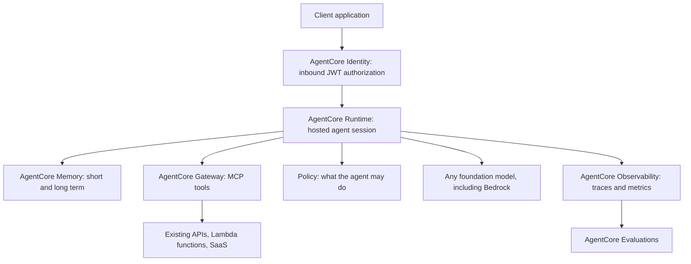

### Documentation roadmap

**REQUIRED — What is Amazon Bedrock AgentCore**
<https://docs.aws.amazon.com/bedrock-agentcore/latest/devguide/what-is-bedrock-agentcore.html>

**REQUIRED — AgentCore Runtime: host agent or tools** and **the service contract**
<https://docs.aws.amazon.com/bedrock-agentcore/latest/devguide/agents-tools-runtime.html>
<https://docs.aws.amazon.com/bedrock-agentcore/latest/devguide/runtime-service-contract.html>

**REQUIRED — AgentCore Memory**
<https://docs.aws.amazon.com/bedrock-agentcore/latest/devguide/memory.html>

**REQUIRED — AgentCore Gateway** and **core concepts**
<https://docs.aws.amazon.com/bedrock-agentcore/latest/devguide/gateway.html>
<https://docs.aws.amazon.com/bedrock-agentcore/latest/devguide/gateway-core-concepts.html>

**REQUIRED — AgentCore Identity**
<https://docs.aws.amazon.com/bedrock-agentcore/latest/devguide/identity.html>

**REQUIRED — AgentCore Observability**
<https://docs.aws.amazon.com/bedrock-agentcore/latest/devguide/observability.html>

**REQUIRED — AgentCore Evaluations**
<https://docs.aws.amazon.com/bedrock-agentcore/latest/devguide/evaluations.html>

**IMPORTANT — Deploy MCP servers on AgentCore Runtime**
<https://docs.aws.amazon.com/bedrock-agentcore/latest/devguide/runtime-mcp.html>

**IMPORTANT — Inbound and outbound authentication**
<https://docs.aws.amazon.com/bedrock-agentcore/latest/devguide/runtime-oauth.html>

**IMPORTANT — Policy in AgentCore**
<https://docs.aws.amazon.com/bedrock-agentcore/latest/devguide/policy.html>

**IMPORTANT — Code Interpreter** and **Browser** tools
<https://docs.aws.amazon.com/bedrock-agentcore/latest/devguide/code-interpreter-tool.html>
<https://docs.aws.amazon.com/bedrock-agentcore/latest/devguide/browser-tool.html>

**IMPORTANT — Stream agent responses** and **long-running agents**
<https://docs.aws.amazon.com/bedrock-agentcore/latest/devguide/response-streaming.html>
<https://docs.aws.amazon.com/bedrock-agentcore/latest/devguide/runtime-long-run.html>

**IMPORTANT — Runtime security best practices** and **isolated sessions**
<https://docs.aws.amazon.com/bedrock-agentcore/latest/devguide/runtime-security-best-practices.html>
<https://docs.aws.amazon.com/bedrock-agentcore/latest/devguide/runtime-sessions.html>

**OPTIONAL — Supported AWS Regions for AgentCore**
<https://docs.aws.amazon.com/bedrock-agentcore/latest/devguide/agentcore-regions.html>

### Can I explain it?

- What does AgentCore Runtime provide that running the same agent on Fargate would require you to build?
- Explain inbound versus outbound authentication in an agent, with a concrete example of each.
- Why is a Gateway that exposes APIs as MCP tools a security improvement rather than just a convenience?
- Which AgentCore component would you reach for to answer "why did the agent take nine steps?"

---

## 24. Memory, Sessions and Conversation State

### The problem

The model is stateless, but conversations are not, and users expect an assistant to remember both the last three turns and the fact that they prefer metric units.

### The three horizons of state

| Horizon | Contents | AWS options |
|---|---|---|
| **Turn** | The current request: system prompt, context, question | Built by your application on every call |
| **Session** | This conversation: previous turns, working variables | Bedrock Sessions, agent memory, DynamoDB (with TTL), ElastiCache, AgentCore Memory short-term |
| **Long-term** | Facts about the user or account that outlive a conversation | AgentCore Memory long-term, agent memory, your own datastore |

The engineering tension is the context window: you cannot resend an unbounded history. Standard strategies — a rolling window of recent turns, a running summary of older ones, or retrieval over past turns (RAG on the conversation itself). Each trades fidelity for tokens.

### Choosing a store

- **DynamoDB** is the workhorse for conversation history: single-digit-millisecond reads, a natural partition key (`sessionId` or `userId`), TTL for automatic expiry, Streams to trigger downstream processing. Use it when you want full control and predictable cost.
- **ElastiCache** when you need very low latency shared state across many application nodes and the data is ephemeral.
- **Bedrock Sessions** when you want Bedrock to manage conversation checkpoints, including encryption with a customer managed key.
- **AgentCore Memory** when you want managed extraction of durable facts from conversations, not just a transcript.

Privacy is a first-class concern here: conversation history frequently contains PII, so it inherits retention limits, encryption requirements, deletion obligations and audit requirements. TTL is a compliance control, not just a cost control.

### Documentation roadmap

**REQUIRED — Session management in Amazon Bedrock**
<https://docs.aws.amazon.com/bedrock/latest/userguide/sessions.html>

**REQUIRED — Store and retrieve conversation history and context**
<https://docs.aws.amazon.com/bedrock/latest/userguide/sessions-store-coversation.html>
<https://docs.aws.amazon.com/bedrock/latest/userguide/sessions-retrieve-coversation.html>

**REQUIRED — Agent memory**
<https://docs.aws.amazon.com/bedrock/latest/userguide/agents-memory.html>

**REQUIRED — AgentCore Memory: short-term and long-term**
<https://docs.aws.amazon.com/bedrock-agentcore/latest/devguide/using-memory-short-term.html>
<https://docs.aws.amazon.com/bedrock-agentcore/latest/devguide/long-term-memory-long-term.html>

**REQUIRED — DynamoDB Time to Live**
<https://docs.aws.amazon.com/amazondynamodb/latest/developerguide/TTL.html>

**IMPORTANT — Session encryption with a customer managed key**
<https://docs.aws.amazon.com/bedrock/latest/userguide/sessions-encryption.html>

**IMPORTANT — DynamoDB core components and how it works**
<https://docs.aws.amazon.com/amazondynamodb/latest/developerguide/HowItWorks.html>

**IMPORTANT — Amazon ElastiCache overview**
<https://docs.aws.amazon.com/AmazonElastiCache/latest/dg/WhatIs.html>

**OPTIONAL — Manage sessions with the BedrockSessionSaver LangGraph library**
<https://docs.aws.amazon.com/bedrock/latest/userguide/sessions-opensource-library.html>

### Can I explain it?

- Why does a long conversation become quadratically expensive, and which two strategies bound that cost?
- When is DynamoDB with TTL the better answer than a managed memory service?
- What compliance obligations attach to conversation history, and which AWS features implement them?

---

## 25. Model Customization: Fine-Tuning, Distillation and Custom Model Import

### The problem

Sometimes prompting and retrieval are not enough: the model must adopt a house style consistently, follow a domain-specific format, handle a specialized vocabulary, or match a larger model's quality at a smaller model's cost.

### The decision ladder (memorize this shape, not the details)

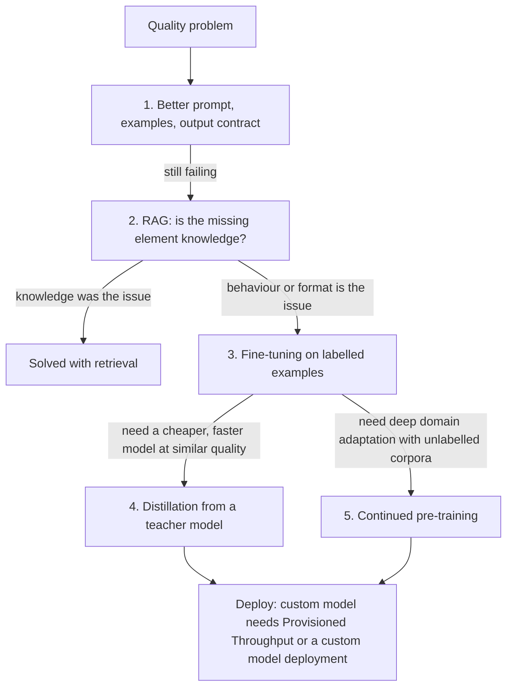

**The rule that answers most exam questions:** *RAG changes what the model knows; fine-tuning changes how the model behaves.* If the complaint is "it doesn't know our product catalogue", the answer is retrieval. If the complaint is "it knows the facts but writes them in the wrong format/tone/structure despite a good prompt, consistently, across thousands of examples", the answer is customization.

### The customization options on Bedrock

| Option | Input | What it changes | Cost profile |
|---|---|---|---|
| **Supervised fine-tuning (SFT)** | Labelled prompt/completion pairs | Behaviour, format, style, task accuracy | Training job + storage + inference through Provisioned Throughput or a custom deployment |
| **Reinforcement fine-tuning** | Examples plus a reward signal / graders | Optimizes toward an objective rather than imitating outputs | Higher complexity; for well-specified objectives |
| **Continued pre-training** | Large unlabelled domain corpus | Domain knowledge and vocabulary in the base model | Most expensive; rarely the right answer for an application team |
| **Distillation** | A teacher model plus prompts (or production traffic) | Transfers teacher quality into a smaller, cheaper student | Training cost repaid by cheaper inference at volume |
| **Custom model import** | Your own trained open-weight model | Brings an externally trained model into Bedrock's API surface | Deployment-based |

### What customization costs you beyond money

- **Inference deployment.** A customized model is not serverless-on-demand in the way a base model is; serving it requires Provisioned Throughput or a custom model deployment. That changes your cost model from per-token to per-hour of committed capacity.
- **Data preparation.** Format, quality, deduplication, and *separation from your evaluation set*. Leakage between training and evaluation data invalidates your measurements.
- **Lifecycle.** A fine-tuned model is pinned to a base model version. When that base model is deprecated you must re-train. Skill 1.2.4 asks explicitly about versioning, automated deployment, rollback and retirement.
- **Governance.** Training data becomes part of your compliance surface: provenance, consent, PII, retention.

### Documentation roadmap

**REQUIRED — Model customization overview**
<https://docs.aws.amazon.com/bedrock/latest/userguide/custom-models.html>

**REQUIRED — Supervised fine-tuning** and **prepare data for fine-tuning**
<https://docs.aws.amazon.com/bedrock/latest/userguide/custom-model-fine-tuning.html>
<https://docs.aws.amazon.com/bedrock/latest/userguide/model-customization-prepare.html>

**REQUIRED — Set up inference for a custom model**
*Why read it:* this is where candidates discover that a fine-tuned model needs dedicated capacity.
<https://docs.aws.amazon.com/bedrock/latest/userguide/model-customization-use.html>

**REQUIRED — Model distillation**
<https://docs.aws.amazon.com/bedrock/latest/userguide/model-distillation.html>

**IMPORTANT — Custom model hyperparameters**
<https://docs.aws.amazon.com/bedrock/latest/userguide/custom-models-hp.html>

**IMPORTANT — Reinforcement fine-tuning**
<https://docs.aws.amazon.com/bedrock/latest/userguide/reinforcement-fine-tuning.html>

**IMPORTANT — Manage customized models** (monitor, analyze, share, copy to another Region, delete)
<https://docs.aws.amazon.com/bedrock/latest/userguide/manage-customized-models.html>

**IMPORTANT — Custom model import**
<https://docs.aws.amazon.com/bedrock/latest/userguide/import-pre-trained-model.html>

**IMPORTANT — Model customization access and security**
<https://docs.aws.amazon.com/bedrock/latest/userguide/custom-model-job-access-security.html>

**IMPORTANT — Troubleshooting model customization**
<https://docs.aws.amazon.com/bedrock/latest/userguide/fine-tuning-troubleshooting.html>

**IMPORTANT — SageMaker AI JumpStart foundation models** (fine-tuning outside Bedrock, including LoRA-style adaptation)
<https://docs.aws.amazon.com/sagemaker/latest/dg/jumpstart-foundation-models.html>

**IMPORTANT — SageMaker Model Registry** (versioning and approval for customized models, named in Skill 1.2.4)
<https://docs.aws.amazon.com/sagemaker/latest/dg/model-registry.html>

### Can I explain it?

- State the RAG-versus-fine-tuning rule in one sentence, then give a scenario where you would do both.
- Why does fine-tuning change your cost model and not just your cost?
- What is distillation optimizing for, and what evidence would justify it?
- Your fine-tuned model's base model is being deprecated. Describe the migration plan.

---

## 26. Model Evaluation in Amazon Bedrock

### The mental model

Bedrock's evaluation feature turns "is this model/prompt/knowledge base good enough?" into a **job**: you supply a dataset and a configuration, AWS runs inference and scoring, and you get a report in S3 plus a console view. There are two families:

- **Model evaluation** — evaluate a model (or compare models) on a task, using automatic metrics, an LLM judge, or human workers.
- **RAG evaluation (knowledge base evaluation)** — evaluate retrieval and generation from a knowledge base, with retrieval-specific and generation-specific metrics, including citation and groundedness dimensions.

### How to use it well

- Build a **golden dataset** that represents real traffic, including known failures and adversarial cases.
- Compare **models** and **prompts** one variable at a time — an evaluation that changes both tells you nothing about either.
- Run it **in CI** for prompt and model changes, and on a schedule to detect drift.
- Combine it with **A/B or canary** rollout: evaluation tells you what to ship, canary tells you whether production agrees.
- Remember the **data-handling rules**: evaluation input and output live in S3 under your encryption and retention policies, and human evaluation involves work teams with access to your data.

### Documentation roadmap

**REQUIRED — Evaluate models** (overview)
<https://docs.aws.amazon.com/bedrock/latest/userguide/evaluation.html>

**REQUIRED — Automatic model evaluation jobs**
<https://docs.aws.amazon.com/bedrock/latest/userguide/evaluation-automatic.html>

**REQUIRED — LLM-as-a-judge evaluation jobs**
<https://docs.aws.amazon.com/bedrock/latest/userguide/evaluation-judge.html>

**REQUIRED — RAG evaluation jobs**
<https://docs.aws.amazon.com/bedrock/latest/userguide/evaluation-kb.html>

**REQUIRED — Reports and metrics**
<https://docs.aws.amazon.com/bedrock/latest/userguide/model-evaluation-report.html>

**IMPORTANT — Human-based evaluation jobs**
<https://docs.aws.amazon.com/bedrock/latest/userguide/evaluation-human.html>

**IMPORTANT — Data management and encryption in evaluation jobs**
<https://docs.aws.amazon.com/bedrock/latest/userguide/evaluation-data-management.html>

**IMPORTANT — Supported Regions and models for evaluation**
<https://docs.aws.amazon.com/bedrock/latest/userguide/evaluation-support.html>

**OPTIONAL — Management events for evaluations in CloudTrail**
<https://docs.aws.amazon.com/bedrock/latest/userguide/cloudtrail-events-in-model-evaluations.html>

### Can I explain it?

- What is the difference between the metrics an automatic evaluation job reports and those a RAG evaluation job reports?
- Why must an evaluation change exactly one variable?
- Where does evaluation data live, and what does that imply for a regulated workload?

---

## 27. Inference Deployment Options and Service Tiers

### The mental model

"Where does the model run?" has several answers on AWS, and the exam expects you to match them to constraints:

| Option | Shape | Choose when |
|---|---|---|
| **On-demand (serverless) Bedrock inference** | Pay per token, no capacity commitment, subject to account quotas | Default. Variable traffic, no strict throughput guarantee needed |
| **Provisioned Throughput** | Reserved model units for committed capacity, hourly pricing, optional commitment term | Predictable high volume, latency/throughput guarantees, or a customized model that requires it |
| **Service tiers** (reserved, standard, priority, flex) | Different capacity and latency characteristics for requests | Matching workload urgency to cost: interactive versus background |
| **Batch inference** | Submit a large input file, get results asynchronously at reduced cost | Bulk scoring, backfills, offline enrichment where latency does not matter |
| **SageMaker AI endpoints** | You host a model on instances you choose | Open-weight or custom models not available serverlessly, special hardware, or full control of the serving stack |
| **Bedrock Marketplace endpoints** | Subscribe to a model and deploy it to a managed endpoint | A model outside the curated serverless catalogue |

### Provisioned Throughput in practice

A model unit provides a defined throughput in tokens per minute for a specific model. Sizing requires measuring your actual token throughput at peak, not your request rate. The exam likes scenarios where the correct answer is "measure input and output tokens per minute at p95, then size model units, and keep on-demand as overflow" — and distractors that confuse request-per-second capacity with token capacity.

### Batch inference

Batch trades latency for cost: submit a JSONL file of records in S3, receive outputs in S3. Use it for classification of a corpus, generating embeddings in bulk, evaluation runs, and data enrichment. Know that it is a distinct quota and a distinct pricing tier, and that it is not suitable for anything user-facing.

### Documentation roadmap

**REQUIRED — Capacity and performance (overview)**
<https://docs.aws.amazon.com/bedrock/latest/userguide/capacity-limits-cost-optimization.html>

**REQUIRED — Provisioned Throughput** and **purchase a Provisioned Throughput**
<https://docs.aws.amazon.com/bedrock/latest/userguide/prov-throughput.html>
<https://docs.aws.amazon.com/bedrock/latest/userguide/prov-thru-purchase.html>

**REQUIRED — Service tiers for inference**
<https://docs.aws.amazon.com/bedrock/latest/userguide/service-tiers-inference.html>

**REQUIRED — Batch inference** and **create a batch inference job**
<https://docs.aws.amazon.com/bedrock/latest/userguide/batch-inference.html>
<https://docs.aws.amazon.com/bedrock/latest/userguide/batch-inference-create.html>

**REQUIRED — Quotas for Amazon Bedrock**
<https://docs.aws.amazon.com/bedrock/latest/userguide/quotas.html>

**IMPORTANT — Use a Provisioned Throughput**
<https://docs.aws.amazon.com/bedrock/latest/userguide/prov-thru-use.html>

**IMPORTANT — Scaling and throughput best practices**
<https://docs.aws.amazon.com/bedrock/latest/userguide/scaling-throughput-best-practices.html>

**IMPORTANT — SageMaker AI real-time endpoints** and **deploy models**
<https://docs.aws.amazon.com/sagemaker/latest/dg/realtime-endpoints.html>
<https://docs.aws.amazon.com/sagemaker/latest/dg/deploy-model.html>

**OPTIONAL — Batch inference results and code example**
<https://docs.aws.amazon.com/bedrock/latest/userguide/batch-inference-results.html>

### Can I explain it?

- Which measurement do you need before sizing Provisioned Throughput, and why is request rate insufficient?
- Give two workloads where batch inference is correct and one where it is a trap.
- Why might a customized model force a capacity decision you would otherwise avoid?

---

## 28. Prompt Management (as a Bedrock resource)

Chapter 7 covered prompt engineering and governance conceptually. This chapter is about the service.

### What the resource gives you

- **Prompts as resources** with variables, variants (different models or parameters for the same intent), and **versions**.
- **Testing in the console** against different models and inputs, side by side with variants.
- **Deployment through versions**, so an application fetches a specific version rather than embedding text.
- **Integration** with Flows and agents, so the same prompt artifact is reusable.
- **Optimization**: a managed capability that rewrites a prompt for a target model — the practical remedy when a model swap degrades quality.

The governance value is that prompt changes become **control-plane events**: visible in CloudTrail, attributable, reversible.

### Documentation roadmap

**REQUIRED — Prompt management**
<https://docs.aws.amazon.com/bedrock/latest/userguide/prompt-management.html>

**REQUIRED — Create a prompt** and **deploy using versions**
<https://docs.aws.amazon.com/bedrock/latest/userguide/prompt-management-create.html>
<https://docs.aws.amazon.com/bedrock/latest/userguide/prompt-management-deploy.html>

**IMPORTANT — Test a prompt** and **optimize a prompt**
<https://docs.aws.amazon.com/bedrock/latest/userguide/prompt-management-test.html>
<https://docs.aws.amazon.com/bedrock/latest/userguide/prompt-management-optimize.html>

**IMPORTANT — Prompt optimization and migration (advanced)**
<https://docs.aws.amazon.com/bedrock/latest/userguide/prompt-optimization-migration.html>

**IMPORTANT — Run code samples for prompt management**
<https://docs.aws.amazon.com/bedrock/latest/userguide/prompt-management-code-ex.html>

### Can I explain it?

- What does a prompt *variant* let you test that two separate prompts do not?
- Which audit trail records a prompt change, and which records its use?

---

## 29. Flows (Prompt Flows)

### The mental model

A flow is a **visual, versioned, serverless workflow for generative-AI steps**: nodes for prompts, knowledge-base retrieval, Lambda invocation, conditions, iteration, agents and storage, connected by typed edges. It occupies the space between "one prompt" and "a full Step Functions state machine".

Choose a flow when the sequence is GenAI-centric and you want it owned by the Bedrock resource model (versions, aliases, guardrails, console editing). Choose Step Functions when you need broad AWS service integration, long-running durable execution, complex error handling and compensation, or human approval with callbacks.

### Documentation roadmap

**REQUIRED — Flows overview** and **how it works**
<https://docs.aws.amazon.com/bedrock/latest/userguide/flows.html>
<https://docs.aws.amazon.com/bedrock/latest/userguide/flows-how-it-works.html>

**REQUIRED — Create and design a flow**
<https://docs.aws.amazon.com/bedrock/latest/userguide/flows-create.html>

**REQUIRED — Deploy a flow using versions and aliases**
<https://docs.aws.amazon.com/bedrock/latest/userguide/flows-deploy.html>

**IMPORTANT — Include guardrails in your flow**
<https://docs.aws.amazon.com/bedrock/latest/userguide/flows-guardrails.html>

**IMPORTANT — Converse with a flow (multi-turn)** and **run a flow asynchronously**
<https://docs.aws.amazon.com/bedrock/latest/userguide/flows-multi-turn-invocation.html>
<https://docs.aws.amazon.com/bedrock/latest/userguide/flows-create-async.html>

**OPTIONAL — Invoke a Lambda function in a different account from a flow**
<https://docs.aws.amazon.com/bedrock/latest/userguide/flow-cross-account-lambda.html>

### Can I explain it?

- Give two characteristics of a workflow that push you from Flows to Step Functions.
- How do flow versions and aliases mirror the deployment model used by prompts and agents?

---

## 30. Intelligent Prompt Routing and Model Selection at Runtime

### The problem

Not every request deserves your most capable model. Routing simple requests to a cheaper model and hard ones to a stronger model is the single largest cost lever in most production systems — and doing it badly degrades quality invisibly.

### Three routing designs

1. **Static routing.** Configuration maps a request type to a model. Simple, predictable, auditable; requires you to classify requests up front.
2. **Application-level dynamic routing.** A cheap classifier (heuristics, a small model, or Amazon Comprehend) inspects the request and chooses. Full control, extra latency, your own failure mode.
3. **Intelligent prompt routing (Bedrock).** Bedrock predicts response quality for candidate models in a family and routes each prompt to the cheapest model expected to meet your quality bar.

Add to those a **fallback** dimension: on throttling or error, retry against another model or another Region. Skill 1.2.3 asks explicitly for graceful degradation, and a well-designed system distinguishes *routing for cost* from *failover for availability*.

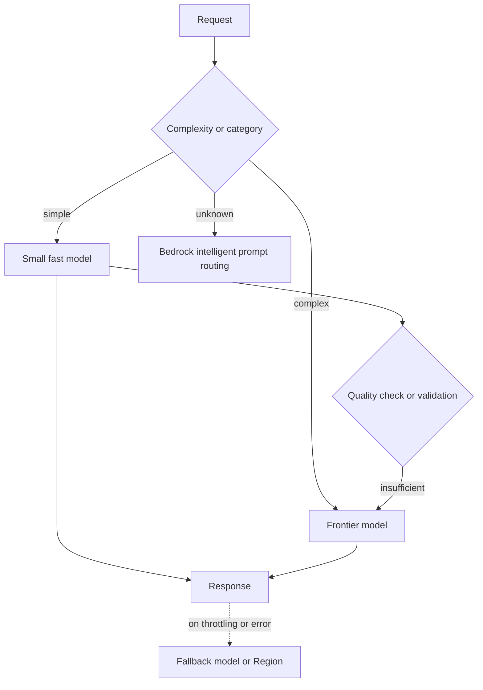

The two-stage pattern in the middle — try the cheap model, validate, escalate on failure — is **model cascading** (Skill 2.2.3). It works when validation is cheap and reliable (schema conformance, a grounding check, a confidence threshold) and fails when validation is as expensive as the strong model.

### Documentation roadmap

**REQUIRED — Intelligent prompt routing**
<https://docs.aws.amazon.com/bedrock/latest/userguide/prompt-routing.html>

**REQUIRED — Inference profiles** and **use an inference profile in model invocation**
<https://docs.aws.amazon.com/bedrock/latest/userguide/inference-profiles.html>
<https://docs.aws.amazon.com/bedrock/latest/userguide/inference-profiles-use.html>

**IMPORTANT — AWS AppConfig** (runtime configuration for model selection without deployment)
<https://docs.aws.amazon.com/appconfig/latest/userguide/what-is-appconfig.html>

**IMPORTANT — Step Functions Choice state / workflow selection**
<https://docs.aws.amazon.com/step-functions/latest/dg/welcome.html>

### Can I explain it?

- Distinguish routing for cost from failover for availability. Which one belongs in the retry path?
- When does model cascading *increase* total cost?
- What does an inference profile give you that a bare model ID does not?

---

## 31. Cross-Region Inference and Resilience

### The problem

A single Region's capacity for a popular model is finite, and your traffic is bursty. Meanwhile your availability target does not care that the model was throttled.

### The mental model

**Cross-Region inference** lets a request be served from one of several Regions in a defined scope, using an **inference profile** as the addressable entity. Two scopes matter:

- **Geographic** profiles route within a geography (for example, Regions within the US or within the EU), which keeps data within that geography's boundary.
- **Global** profiles route across a wider set of Regions for maximum capacity, with correspondingly broader data movement.

The trade-off is explicit and examinable: **more capacity and better resilience, in exchange for a weaker statement about where the request is processed.** A workload with a strict residency obligation uses a Region-scoped profile; a workload that needs burst capacity and has no residency constraint uses a geographic or global one.

### Resilience patterns beyond routing

- **Retry with exponential backoff and jitter** on `ThrottlingException` — the SDK does much of this, but you must configure the strategy and the maximum attempts deliberately.
- **Circuit breakers** so a failing dependency stops receiving traffic instead of consuming your latency budget (Skill 1.2.3 names Step Functions for this).
- **Fallback models** — a second model, ideally from a different family and/or Region.
- **Graceful degradation** — return a cached answer, a retrieval-only answer with no generation, or an honest "try again" rather than an error page.
- **Queue-based load levelling** — SQS in front of non-interactive work so bursts become depth rather than failures.

### Documentation roadmap

**REQUIRED — Cross-Region inference**
<https://docs.aws.amazon.com/bedrock/latest/userguide/cross-region-inference.html>

**REQUIRED — Geographic cross-Region inference** and **global cross-Region inference**
<https://docs.aws.amazon.com/bedrock/latest/userguide/geographic-cross-region-inference.html>
<https://docs.aws.amazon.com/bedrock/latest/userguide/global-cross-region-inference.html>

**REQUIRED — Inference profiles** and **create an application inference profile**
<https://docs.aws.amazon.com/bedrock/latest/userguide/inference-profiles.html>
<https://docs.aws.amazon.com/bedrock/latest/userguide/inference-profiles-create.html>

**REQUIRED — Resilience in Amazon Bedrock**
<https://docs.aws.amazon.com/bedrock/latest/userguide/disaster-recovery-resiliency.html>

**REQUIRED — Retry strategy in the AWS SDK for Java 2.x**
<https://docs.aws.amazon.com/sdk-for-java/latest/developer-guide/retry-strategy.html>

**IMPORTANT — Error handling in Step Functions** (retries, catchers, circuit-breaker patterns)
<https://docs.aws.amazon.com/step-functions/latest/dg/concepts-error-handling.html>

**IMPORTANT — Amazon SQS dead-letter queues** and **visibility timeout**
<https://docs.aws.amazon.com/AWSSimpleQueueService/latest/SQSDeveloperGuide/sqs-dead-letter-queues.html>
<https://docs.aws.amazon.com/AWSSimpleQueueService/latest/SQSDeveloperGuide/sqs-visibility-timeout.html>

### Can I explain it?

- What exactly does a geographic inference profile guarantee, and what does it not?
- Why is an inference profile, rather than a model ID, the right thing for an application to reference?
- Design a degradation ladder for a RAG chatbot whose model is throttled: three steps, worst outcome last.

---

## 32. Cost Tracking and Attribution in Bedrock

### The problem

"Our Bedrock bill tripled" is a question about *which team, which feature, which prompt*. Without attribution built in advance, the answer is unobtainable.

### The mechanisms

| Mechanism | What it attributes | Notes |
|---|---|---|
| **Application inference profiles** | Costs to an application or team, via tags on the profile | The primary recommended attribution mechanism; the application invokes the profile ARN |
| **Per-request metadata tagging** | Costs and usage to arbitrary request-level dimensions | Fine-grained; pairs with invocation logs |
| **IAM principal attribution** | Usage to the calling role or user | Useful in shared platforms |
| **Tagging resources** | Costs of guardrails, knowledge bases, agents, provisioned throughput | Standard AWS tagging |
| **Cost Explorer and Cost Anomaly Detection** | Trends and surprises across the account | Set anomaly monitors for Bedrock specifically |
| **Model invocation logs** | Per-invocation token counts for your own analysis | The raw material for a per-feature cost dashboard |

The design principle: **decide your attribution dimensions before launch**, because retrofitting them means re-instrumenting every call site.

### Documentation roadmap

**REQUIRED — Track usage and costs in Amazon Bedrock**
<https://docs.aws.amazon.com/bedrock/latest/userguide/cost-management.html>

**REQUIRED — Application inference profiles for cost tracking**
<https://docs.aws.amazon.com/bedrock/latest/userguide/cost-mgmt-application-inference-profiles.html>

**REQUIRED — Per-request metadata tagging**
<https://docs.aws.amazon.com/bedrock/latest/userguide/cost-mgmt-request-metadata.html>

**IMPORTANT — IAM principal attribution** and **cost management best practices**
<https://docs.aws.amazon.com/bedrock/latest/userguide/cost-mgmt-iam-principal-tracking.html>
<https://docs.aws.amazon.com/bedrock/latest/userguide/cost-mgmt-best-practices.html>

**IMPORTANT — Tagging Amazon Bedrock resources**
<https://docs.aws.amazon.com/bedrock/latest/userguide/tagging.html>

**IMPORTANT — AWS Cost Explorer** and **AWS Cost Anomaly Detection**
<https://docs.aws.amazon.com/cost-management/latest/userguide/ce-what-is.html>
<https://docs.aws.amazon.com/cost-management/latest/userguide/manage-ad.html>

**IMPORTANT — Amazon Bedrock pricing** (pricing model, not memorized numbers)
<https://aws.amazon.com/bedrock/pricing/>

### Can I explain it?

- Two teams share one AWS account and one model. How do you produce a per-team Bedrock bill?
- Which artifact lets you compute cost per feature after the fact, and what must be enabled beforehand?

---

## 33. Amazon Bedrock Security

### The mental model: seven questions, seven controls

| Question | Control |
|---|---|
| Who is calling? | IAM principal, SigV4 signature (or an API key, with weaker guarantees) |
| What may they call? | Identity-based policy on `bedrock:InvokeModel` etc., scoped to model, inference-profile, guardrail, knowledge-base and agent ARNs |
| Under what conditions? | IAM condition keys — enforce a specific guardrail, require a VPC endpoint, restrict by tag |
| How does the traffic travel? | TLS in transit; interface VPC endpoints (PrivateLink) to keep traffic off the public internet |
| Where is data at rest, and encrypted how? | S3 for training/evaluation/logs, KMS customer managed keys for custom models, sessions, knowledge-base data and agent memory |
| What did the model see and say? | Model invocation logging to S3 and/or CloudWatch Logs — opt-in, and a privacy decision in itself |
| Who did what, when? | CloudTrail for control-plane and (where enabled) data events |

```mermaid
flowchart TD
    APP["Application in a VPC"] --> EP["Interface VPC endpoint for bedrock-runtime"]
    EP --> IAM["IAM policy evaluation: identity, resource, conditions, SCPs"]
    IAM --> GRD["Guardrail enforced by IAM condition"]
    GRD --> MODEL["Model inference"]
    MODEL --> LOG["Model invocation logging to S3 or CloudWatch Logs"]
    MODEL --> RESP["Response"]
    LOG --> KMS["Encrypted with AWS KMS"]
    IAM --> CT["CloudTrail records the API call"]
```

### Facts that decide exam questions

- **Your prompts and completions are not used to train the base models**, and are not shared with model providers. This is the answer to most "can we use Bedrock with confidential data?" scenarios — paired with encryption, VPC endpoints and logging controls.
- **Model invocation logging is off by default.** Turning it on is what makes prompt/response auditing possible — and simultaneously creates a store of potentially sensitive text that needs its own encryption, retention and access policy.
- **Guardrails can be made mandatory with an IAM condition key**, which is the difference between policy and hope.
- **Knowledge bases and agents use service roles**; those roles are a distinct blast radius from your application role, and cross-service confused-deputy protections matter when they access your S3 buckets.
- **Bedrock supports customer managed KMS keys** for custom models, sessions, agent memory and other stored artifacts — needed whenever "we must control the key" appears in a scenario.

### Documentation roadmap

**REQUIRED — Security in Amazon Bedrock** (overview)
<https://docs.aws.amazon.com/bedrock/latest/userguide/security.html>
<https://docs.aws.amazon.com/bedrock/latest/userguide/security-overview.html>

**REQUIRED — Data protection in Amazon Bedrock**
<https://docs.aws.amazon.com/bedrock/latest/userguide/data-protection.html>

**REQUIRED — Identity and access management for Amazon Bedrock**
<https://docs.aws.amazon.com/bedrock/latest/userguide/security-iam.html>

**REQUIRED — Identity-based policy examples**
*Why read it:* the concrete policy documents you will be asked to recognize.
<https://docs.aws.amazon.com/bedrock/latest/userguide/security_iam_id-based-policy-examples.html>

**REQUIRED — How Amazon Bedrock works with IAM**
<https://docs.aws.amazon.com/bedrock/latest/userguide/security_iam_service-with-iam.html>

**REQUIRED — Use interface VPC endpoints (PrivateLink) with Amazon Bedrock**
<https://docs.aws.amazon.com/bedrock/latest/userguide/vpc-interface-endpoints.html>

**REQUIRED — Model invocation logging**
<https://docs.aws.amazon.com/bedrock/latest/userguide/model-invocation-logging.html>

**REQUIRED — Log Amazon Bedrock API calls with CloudTrail**
<https://docs.aws.amazon.com/bedrock/latest/userguide/logging-using-cloudtrail.html>

**IMPORTANT — Configure access to S3 buckets** and **restrict data access to your S3 data**
<https://docs.aws.amazon.com/bedrock/latest/userguide/s3-bucket-access.html>
<https://docs.aws.amazon.com/bedrock/latest/userguide/vpc-s3.html>

**IMPORTANT — Cross-service confused deputy prevention**
<https://docs.aws.amazon.com/bedrock/latest/userguide/cross-service-confused-deputy-prevention.html>

**IMPORTANT — Infrastructure security**, **compliance validation**, **incident response**
<https://docs.aws.amazon.com/bedrock/latest/userguide/infrastructure-security.html>
<https://docs.aws.amazon.com/bedrock/latest/userguide/compliance-validation.html>
<https://docs.aws.amazon.com/bedrock/latest/userguide/security-incident-response.html>

**IMPORTANT — Abuse detection** and **prompt injection security**
<https://docs.aws.amazon.com/bedrock/latest/userguide/abuse-detection.html>
<https://docs.aws.amazon.com/bedrock/latest/userguide/prompt-injection.html>

**OPTIONAL — Configuration and vulnerability analysis**
<https://docs.aws.amazon.com/bedrock/latest/userguide/vulnerability-analysis-and-management.html>

### Can I explain it?

- Write, in prose, the IAM policy you would attach to a Lambda that must call exactly one model through one inference profile with one mandatory guardrail.
- What new risk does enabling model invocation logging create, and how do you contain it?
- Why does a VPC endpoint matter if the traffic is already TLS-encrypted?
- Which security control answers "prove that no employee could have retrieved a document they were not entitled to see"?

---

## 34. Observability for Amazon Bedrock

### The four questions and the four tools

| Question | Tool | What it holds |
|---|---|---|
| "How often, how fast, how many tokens?" | **CloudWatch metrics** | Invocation counts, latency, input/output token counts, throttles, guardrail interventions |
| "What exactly did we send and receive?" | **Model invocation logging** | Full request and response payloads (and multimodal artifacts) to S3 and/or CloudWatch Logs |
| "Who made this API call?" | **CloudTrail** | Control-plane and data-event audit records with principal, time, source IP |
| "Why was this request slow, and where did the time go?" | **X-Ray traces** (plus agent traces) | Spans across API Gateway, Lambda, retrieval, model call |

Add the GenAI-specific layer: **agent traces** for reasoning and tool selection, **AgentCore Observability** for agent-level telemetry, **knowledge-base logging** for ingestion and retrieval diagnostics, and **CloudWatch Logs Insights** queries over invocation logs to answer questions like "which prompt version produced the most guardrail interventions last week?".

### What to instrument on day one

- `usage.inputTokens`, `usage.outputTokens` per call, tagged with feature, prompt version, model ID.
- `stopReason` distribution — a rise in `max_tokens` means truncation; a rise in guardrail interventions means either an attack or an over-tight policy.
- Latency split: time to first token versus total.
- Retrieval metrics: number of results, top score, whether a citation was produced.
- Errors by type: throttling versus validation versus model errors.
- Cost per request, derived from tokens and model.

Business metrics matter too (Skill 4.3.1 says "business impact metrics"): deflection rate, task completion, user thumbs-up rate, escalation rate. These are the only metrics that tell you whether the system is *useful*.

### Documentation roadmap

**REQUIRED — Observability in Amazon Bedrock**
<https://docs.aws.amazon.com/bedrock/latest/userguide/observability.html>

**REQUIRED — Monitor Amazon Bedrock with CloudWatch**
<https://docs.aws.amazon.com/bedrock/latest/userguide/monitoring.html>

**REQUIRED — Monitor Bedrock features**
<https://docs.aws.amazon.com/bedrock/latest/userguide/monitoring-features.html>

**REQUIRED — Model invocation logging**
<https://docs.aws.amazon.com/bedrock/latest/userguide/model-invocation-logging.html>

**REQUIRED — CloudWatch Logs Insights query syntax**
<https://docs.aws.amazon.com/AmazonCloudWatch/latest/logs/AnalyzingLogData.html>

**REQUIRED — Guardrail CloudWatch metrics**
<https://docs.aws.amazon.com/bedrock/latest/userguide/monitoring-guardrails-cw-metrics.html>

**IMPORTANT — Publish custom metrics** and **embedded metric format**
<https://docs.aws.amazon.com/AmazonCloudWatch/latest/monitoring/publishingMetrics.html>
<https://docs.aws.amazon.com/AmazonCloudWatch/latest/monitoring/CloudWatch_Embedded_Metric_Format.html>

**IMPORTANT — CloudWatch anomaly detection**
<https://docs.aws.amazon.com/AmazonCloudWatch/latest/monitoring/CloudWatch_Anomaly_Detection.html>

**IMPORTANT — Monitor knowledge bases**
<https://docs.aws.amazon.com/bedrock/latest/userguide/knowledge-bases-logging.html>

**IMPORTANT — AWS X-Ray concepts**
<https://docs.aws.amazon.com/xray/latest/devguide/xray-concepts.html>

**IMPORTANT — AgentCore Observability concepts**
<https://docs.aws.amazon.com/bedrock-agentcore/latest/devguide/observability-telemetry.html>

### Can I explain it?

- Which tool answers "who changed the guardrail?", and which answers "what did the model output at 14:03?"
- Your p99 latency doubled. Describe the order in which you would consult metrics, traces and logs.
- Why is a rise in guardrail interventions ambiguous, and what second signal disambiguates it?

---

# Part III — Agent Frameworks, Protocols and Orchestration

The exam guide names Strands Agents, AWS Agent Squad and the Model Context Protocol by name, alongside AWS Step Functions, as the mechanisms for building agentic systems. Part III covers them as a set, because the real skill is choosing among them.

---

## 35. Strands Agents

### The mental model

Strands Agents is an open-source SDK, maintained by AWS, that takes the position that **an agent is a model, a prompt and a set of tools** — and that the orchestration loop should be handled by the model rather than hard-coded by the developer. You declare the tools (often as decorated functions), give the agent an instruction, and the SDK runs the reason-act loop.

Its role in the AWS ecosystem: it is the "write the agent yourself" option that pairs naturally with **AgentCore** for hosting, memory, identity, gateway and observability. Strands is model-agnostic (Bedrock, other providers, local models) and deployment-agnostic (local, Lambda, Fargate, AgentCore Runtime).

### What to understand for the exam

- Strands is a **framework**, not a managed AWS service; there is no control plane, no ARN, no IAM resource for a "Strands agent". Its IAM footprint is whatever the process's role permits.
- It is the SDK the exam means when it says "by using the Strands API to implement custom behaviors" (Skill 2.1.6).
- It supports MCP clients, so a Strands agent can consume tools published through AgentCore Gateway or any MCP server.
- The production concerns (session isolation, auth, memory, traces) are exactly what AgentCore supplies — the two are designed to compose.

### Documentation roadmap

**IMPORTANT — Strands Agents documentation** — [Open-source project maintained by AWS; hosted outside docs.aws.amazon.com. Authoritative for the SDK, supplementary for exam scope]
<https://strandsagents.com/>

**REQUIRED — Use any agent framework on AgentCore Runtime**
*Why read it:* the official AWS page that explains how a framework-based agent (Strands, LangGraph, CrewAI and others) is packaged and hosted.
<https://docs.aws.amazon.com/bedrock-agentcore/latest/devguide/using-any-agent-framework.html>

**IMPORTANT — Use any foundation model with AgentCore**
<https://docs.aws.amazon.com/bedrock-agentcore/latest/devguide/using-any-model.html>

### Can I explain it?

- What does Strands own, and what does AgentCore own, in a production deployment of a Strands agent?
- Why does "the SDK has no IAM resource" matter when you reason about least privilege for an agent?

---

## 36. Model Context Protocol (MCP)

### The problem

Every agent framework invented its own way to describe tools. Every tool provider then had to write an adapter per framework. The combinatorics are the problem, and they are the same problem that gave us ODBC, LSP and OpenAPI.

### The mental model

MCP is a **client–server protocol for tool and context provision**. An MCP *server* exposes tools (callable functions), resources (data) and prompts; an MCP *client*, embedded in an agent, discovers and invokes them. The agent framework no longer needs to know how a tool is implemented, and the tool no longer needs to know which framework is calling.

For AWS work, the implications are concrete:

- **A Lambda function can be an MCP server** — stateless, cheap, scales to zero; suitable for lightweight tools (Skill 2.1.7 says exactly this).
- **Amazon ECS (or EKS/Fargate) can host an MCP server** for tools that need persistent connections, large dependencies, or long-running work.
- **AgentCore Gateway converts existing APIs, Lambda functions and services into MCP tools**, adding discovery, authentication and fine-grained access control — which is how you avoid every team hand-rolling tool auth.
- **AgentCore Runtime can host MCP servers directly**, including stateful MCP features.

```mermaid
flowchart LR
    AGENT["Agent with MCP client"] --> GW["AgentCore Gateway"]
    GW --> T1["Lambda-based MCP tool"]
    GW --> T2["OpenAPI or Smithy API target"]
    GW --> T3["MCP server on ECS or AgentCore Runtime"]
    T2 --> BACK["Existing enterprise API"]
    GW --> AUTH["Inbound and outbound authorization"]
```

### Security notes that matter

A tool server is an execution surface reachable, indirectly, by anything a user can type. Treat every MCP tool as an internet-facing API: authenticate the caller, authorize per user (not per agent), validate arguments, rate-limit, log, and never expose a tool whose blast radius exceeds what the least-privileged user should have.

### Documentation roadmap

**REQUIRED — Deploy MCP servers on AgentCore Runtime**
<https://docs.aws.amazon.com/bedrock-agentcore/latest/devguide/runtime-mcp.html>

**REQUIRED — AgentCore Gateway and supported targets**
<https://docs.aws.amazon.com/bedrock-agentcore/latest/devguide/gateway.html>
<https://docs.aws.amazon.com/bedrock-agentcore/latest/devguide/gateway-supported-targets.html>

**REQUIRED — Gateway fine-grained access control**
<https://docs.aws.amazon.com/bedrock-agentcore/latest/devguide/gateway-fine-grained-access-control.html>

**IMPORTANT — Stateful MCP features on AgentCore Runtime**
<https://docs.aws.amazon.com/bedrock-agentcore/latest/devguide/mcp-stateful-features.html>

**IMPORTANT — Model Context Protocol specification** — [Non-AWS open standard; authoritative for the protocol itself]
<https://modelcontextprotocol.io/docs/2026-07-28/getting-started/intro>

### Can I explain it?

- What problem does MCP solve that OpenAPI alone does not, in an agent context?
- When would you host an MCP server on Lambda, and when on ECS?
- Why is per-user authorization at the tool layer non-negotiable, even when the agent is trusted?

---

## 37. Multi-Agent Systems and AWS Agent Squad

### The mental model

A multi-agent system decomposes a problem across **specialized agents** with a coordination mechanism. The common topologies:

- **Supervisor / router:** a classifier or supervisor agent routes each request to the specialist best suited to it. This is the shape AWS Agent Squad implements, and the shape Bedrock Agents' multi-agent collaboration supports.
- **Pipeline:** agents in sequence, each transforming the work (research → draft → review).
- **Peer collaboration:** agents exchange messages to converge on an answer; powerful, hard to bound, easy to make expensive.

### When multi-agent is the right answer — and when it is not

It helps when sub-tasks need genuinely different tools, instructions, models or permissions; when you want separate blast radii (the agent that can issue refunds is not the agent that answers FAQs); and when specialization measurably improves quality.

It hurts when a single agent with more tools would do: every hop adds latency, tokens, failure modes and debugging difficulty. A professional-level answer usually prefers the simplest topology that satisfies the isolation requirement.

### Agent-to-agent communication

AgentCore Runtime supports **A2A** servers alongside MCP, which matters when agents from different teams or vendors must interoperate. Treat inter-agent calls with the same suspicion as external input: the content is model-generated and may be influenced by an adversary upstream.

### Documentation roadmap

**REQUIRED — Multi-agent collaboration in Amazon Bedrock Agents**
<https://docs.aws.amazon.com/bedrock/latest/userguide/agents-multi-agent-collaboration.html>

**IMPORTANT — Deploy A2A servers on AgentCore Runtime**
<https://docs.aws.amazon.com/bedrock-agentcore/latest/devguide/runtime-a2a.html>

**IMPORTANT — AgentCore Observability for multi-agent coordination** (Skill 4.3.4)
<https://docs.aws.amazon.com/bedrock-agentcore/latest/devguide/observability.html>

**OPTIONAL — Agent Squad (named "AWS Agent Squad" in the exam guide)** — [Open-source repository, **no longer hosted under AWS Labs**: the project moved from `awslabs/agent-squad` to a community organization. Supplementary, non-authoritative for exam scope]
<https://github.com/2FastLabs/agent-squad>

> **Scope note.** The exam guide names "AWS Agent Squad", and the project was originally published by AWS Labs (earlier still as "Multi-Agent Orchestrator"). As of September 2026 the repository has been transferred out of the `awslabs` organization. The *concept* the exam tests — a supervisor/classifier routing requests to specialized agents, with shared conversation context — is unchanged, and that concept is what you should study.

### Can I explain it?

- Give a requirement that genuinely forces multi-agent design rather than one agent with more tools.
- What does each additional agent hop cost you, in four different currencies?
- Why must an agent treat another agent's output as untrusted input?

---

## 38. Deterministic Orchestration with AWS Step Functions

### Why this matters more than candidates expect

Step Functions appears in eight separate skills across Domains 1, 2 and 3: circuit breakers, ReAct patterns, stopping conditions, human review orchestration, query transformation, clarification workflows, prompt edge-case testing, custom moderation workflows and document-processing orchestration. It is the exam's default answer for **"orchestrate this reliably"**.

### The mental model

Step Functions is a **durable state machine**: each state's input and output are recorded, failures are handled declaratively (Retry, Catch), and execution survives process death. Compared with an agent, it trades flexibility for guarantees.

Patterns you should be able to recognize:

| Pattern | Step Functions mechanism |
|---|---|
| Retry with exponential backoff on throttling | `Retry` with `BackoffRate`, `MaxAttempts`, error matching on `ThrottlingException` |
| Circuit breaker | A state that checks a failure counter (DynamoDB) and short-circuits to a fallback branch |
| Bounded agent loop | An iteration counter in state plus a `Choice` state enforcing a maximum |
| Human approval | Task with `waitForTaskToken`, resumed by an API call after review |
| Fan-out over chunks or sub-queries | `Map` state with configurable concurrency |
| Parallel model calls | `Parallel` state, then aggregation |
| Long-running document pipeline | Standard workflow with callbacks; Express for high-volume short work |

Step Functions also has **direct integration with Bedrock**, so a state can invoke a model without a Lambda in between — fewer moving parts, less code, and the retry/catch semantics come for free.

### Documentation roadmap

**REQUIRED — AWS Step Functions overview**
<https://docs.aws.amazon.com/step-functions/latest/dg/welcome.html>

**REQUIRED — Error handling (Retry and Catch)**
<https://docs.aws.amazon.com/step-functions/latest/dg/concepts-error-handling.html>

**REQUIRED — Call Amazon Bedrock from Step Functions**
<https://docs.aws.amazon.com/step-functions/latest/dg/connect-bedrock.html>

**REQUIRED — Choosing a workflow type (Standard vs Express)**
<https://docs.aws.amazon.com/step-functions/latest/dg/choosing-workflow-type.html>

**IMPORTANT — Map state** (fan-out with controlled concurrency)
<https://docs.aws.amazon.com/step-functions/latest/dg/state-map.html>

**IMPORTANT — Callback pattern with task tokens** (human-in-the-loop)
<https://docs.aws.amazon.com/step-functions/latest/dg/callback-task-sample-sqs.html>

### Can I explain it?

- Which properties does Step Functions guarantee that an agent loop in application code does not?
- How do you implement a hard stopping condition for an agentic workflow in Step Functions?
- When is Express the right workflow type for a GenAI pipeline, and what do you lose?

---

# Part IV — Supporting AWS Services

Part IV is the service-by-service learning map required by the exam's ecosystem framing. Every service here is on the official in-scope list. Each entry follows the same template — mental model, why it exists, generative-AI relevance, documentation roadmap, related services — at a depth proportional to how much the exam leans on it.

For a Java backend developer, much of this will be familiar. Read for the *generative-AI-specific* twist: what changes when the workload has multi-second latency, non-deterministic output and token-based cost.

---

## 39. AWS Lambda

### Mental model

Event-driven, per-request compute with no capacity management: you supply a handler, AWS supplies isolation, scaling and lifecycle. For generative AI, Lambda is the default glue — the thing that calls Bedrock, implements an agent action group, transforms a document during ingestion, or hosts a lightweight MCP server.

### Why it exists

To remove servers from request-scoped work. The trade-offs that matter here are *time limits*, *cold starts*, *concurrency limits* and *no persistent connections*.

### Generative-AI relevance

- **Action group implementations** for Bedrock Agents.
- **Knowledge base custom transformation** during ingestion.
- **Lightweight MCP servers** (Skill 2.1.7).
- **Pre/post-processing**: PII redaction, schema validation, business-rule enforcement.
- **Streaming to clients** through Lambda response streaming and function URLs.
- **Asynchronous processing** from SQS, EventBridge or S3 events.

### What changes for GenAI workloads

| Concern | Detail |
|---|---|
| Timeout | Model calls can take tens of seconds. Set the function timeout above the longest expected generation *and* set the SDK's socket/read timeout below it, so you fail intentionally rather than silently. |
| Cold start | A JVM Lambda with a Bedrock client in the handler pays initialization cost per cold start. Build clients in the initialization phase (static/constructor), consider SnapStart for Java, or provisioned concurrency for latency-sensitive paths. |
| Concurrency | A burst of chat requests becomes a burst of concurrent executions *and* a burst of Bedrock token consumption. Reserved concurrency is how you protect both your account's Lambda limit and your Bedrock quota. |
| Payload limits | Synchronous response payloads are capped; large generations belong in a stream or in S3. |
| Retries | Asynchronous invocations retry automatically — dangerous for non-idempotent actions that spend tokens or write data. |

### Documentation roadmap

**REQUIRED — Lambda developer guide overview**
<https://docs.aws.amazon.com/lambda/latest/dg/welcome.html>

**REQUIRED — Invoking Lambda functions** (sync, async, event source mappings)
<https://docs.aws.amazon.com/lambda/latest/dg/lambda-invocation.html>

**REQUIRED — Lambda function scaling and concurrency**
<https://docs.aws.amazon.com/lambda/latest/dg/lambda-concurrency.html>

**REQUIRED — Configure response streaming**
<https://docs.aws.amazon.com/lambda/latest/dg/configuration-response-streaming.html>

**REQUIRED — Error handling and automatic retries**
<https://docs.aws.amazon.com/lambda/latest/dg/invocation-retries.html>

**IMPORTANT — Building Lambda functions with Java**
<https://docs.aws.amazon.com/lambda/latest/dg/java-handler.html>

**IMPORTANT — Provisioned concurrency**
<https://docs.aws.amazon.com/lambda/latest/dg/provisioned-concurrency.html>

**IMPORTANT — Connect a function to a VPC**
<https://docs.aws.amazon.com/lambda/latest/dg/configuration-vpc.html>

**IMPORTANT — Monitoring with CloudWatch Logs**
<https://docs.aws.amazon.com/lambda/latest/dg/monitoring-cloudwatchlogs.html>

### Related services

API Gateway (front door), Step Functions (orchestration), SQS/EventBridge (async triggers), Bedrock Agents (action groups), AgentCore Gateway (as an MCP tool target).

### Can I explain it?

- Why must the SDK read timeout be shorter than the Lambda timeout?
- What is the risk of Lambda's automatic retry for a function that invokes a model?
- Which two mechanisms reduce Java cold-start impact, and what do they cost?

---

## 40. Amazon API Gateway and AWS AppSync

### Mental model

API Gateway is a managed front door: it terminates client connections, authenticates and authorizes, validates, throttles, transforms and routes. AppSync is the same idea for GraphQL, with real-time subscriptions.

### Generative-AI relevance

- **The boundary where end users are authenticated** (Cognito user pools, Lambda authorizers, IAM, JWT) before any model is invoked.
- **Rate limiting and usage plans** — your first defence against a user (or a bot) burning your token budget.
- **Request validation** against a JSON Schema — rejecting malformed or oversized input before it costs anything (Skill 2.4.1).
- **WebSocket APIs** for streaming token-by-token responses (Skill 2.4.2).
- **Response transformation and filtering** as part of defence in depth (Skill 3.1.4).

### The streaming caveat, restated because it is examinable

REST and HTTP APIs with Lambda proxy integration **buffer** the Lambda response; they do not relay a stream. For token-by-token delivery use WebSocket APIs, Lambda function URLs with response streaming, or a container behind an ALB/CloudFront emitting server-sent events.

### Documentation roadmap

**REQUIRED — API Gateway developer guide overview**
<https://docs.aws.amazon.com/apigateway/latest/developerguide/welcome.html>

**REQUIRED — Control access to an API**
<https://docs.aws.amazon.com/apigateway/latest/developerguide/apigateway-control-access-to-api.html>

**REQUIRED — Lambda authorizers**
<https://docs.aws.amazon.com/apigateway/latest/developerguide/apigateway-use-lambda-authorizer.html>

**REQUIRED — Throttle API requests**
<https://docs.aws.amazon.com/apigateway/latest/developerguide/api-gateway-request-throttling.html>

**REQUIRED — Request validation**
<https://docs.aws.amazon.com/apigateway/latest/developerguide/api-gateway-method-request-validation.html>

**REQUIRED — WebSocket APIs**
<https://docs.aws.amazon.com/apigateway/latest/developerguide/apigateway-websocket-api.html>

**IMPORTANT — REST APIs vs HTTP APIs**
<https://docs.aws.amazon.com/apigateway/latest/developerguide/apigateway-rest-api.html>
<https://docs.aws.amazon.com/apigateway/latest/developerguide/http-api.html>

**IMPORTANT — Quotas and important notes**
<https://docs.aws.amazon.com/apigateway/latest/developerguide/limits.html>

**IMPORTANT — AWS AppSync**
<https://docs.aws.amazon.com/appsync/latest/devguide/what-is-appsync.html>

### Related services

Cognito and IAM Identity Center (identity), WAF and CloudFront (edge protection), Lambda and ECS (backends), Bedrock (the protected resource).

### Can I explain it?

- Where does end-user authentication belong in a Bedrock-backed API, and why not in the Lambda?
- Which API Gateway feature protects your token budget, and how would you configure it per customer?
- Why can't a REST API relay a Bedrock stream?

---

## 41. Event-Driven Integration: EventBridge, SQS and SNS

### Mental model

| Service | Shape | Use for |
|---|---|---|
| **Amazon SQS** | Durable queue; one consumer group pulls messages | Load levelling, backpressure, retry with DLQ, decoupling a slow model call from a fast API |
| **Amazon SNS** | Pub/sub fan-out to many subscribers | Notifying several systems of one event |
| **Amazon EventBridge** | Event bus with content-based routing rules, schema registry, SaaS integrations, scheduler | Loose coupling between services and teams; reacting to AWS or SaaS events |

### Generative-AI relevance

The single most useful pattern: **put a queue between user-facing intake and model inference** for any work that does not need a synchronous answer. Document processing, bulk summarization, re-ingestion after a corpus change, and evaluation runs all belong behind SQS. Benefits: throttling absorbs bursts rather than failing them, retries are free, poison messages land in a DLQ instead of looping, and your Bedrock quota is consumed at a rate you control (via Lambda reserved concurrency or a consumer's batch size).

EventBridge is the right answer for "when a document lands in S3, start ingestion", "when a knowledge base sync finishes, notify the team", and for scheduled refreshes (Skill 1.4.5).

```mermaid
flowchart LR
    API["API Gateway"] --> ACK["Enqueue job and return 202 with job id"]
    ACK --> SQS["Amazon SQS"]
    SQS --> WK["Worker: Lambda or ECS with bounded concurrency"]
    WK --> BR["Amazon Bedrock"]
    WK --> DDB["Store result in DynamoDB"]
    SQS -.->|"repeated failures"| DLQ["Dead-letter queue"]
    DDB --> POLL["Client polls or receives a notification"]
```

### Documentation roadmap

**REQUIRED — Amazon SQS overview**, **visibility timeout**, **dead-letter queues**
<https://docs.aws.amazon.com/AWSSimpleQueueService/latest/SQSDeveloperGuide/welcome.html>
<https://docs.aws.amazon.com/AWSSimpleQueueService/latest/SQSDeveloperGuide/sqs-visibility-timeout.html>
<https://docs.aws.amazon.com/AWSSimpleQueueService/latest/SQSDeveloperGuide/sqs-dead-letter-queues.html>

**REQUIRED — Amazon EventBridge overview** and **rules**
<https://docs.aws.amazon.com/eventbridge/latest/userguide/eb-what-is.html>
<https://docs.aws.amazon.com/eventbridge/latest/userguide/eb-rules.html>

**IMPORTANT — Amazon SNS overview**
<https://docs.aws.amazon.com/sns/latest/dg/welcome.html>

**IMPORTANT — DynamoDB Streams** (change-driven ingestion triggers)
<https://docs.aws.amazon.com/amazondynamodb/latest/developerguide/Streams.html>

### Related services

Lambda and ECS (consumers), Step Functions (orchestrated alternatives), S3 (event source), DynamoDB (result store).

### Can I explain it?

- Why does a queue in front of inference improve reliability more than increasing retries?
- Choose between SQS, SNS and EventBridge for: bulk re-embedding after a chunking change; notifying three teams that a model was deprecated; triggering ingestion when a PDF is uploaded.
- What does a DLQ tell you that a CloudWatch error metric does not?

---

## 42. Amazon S3

### Mental model

Durable object storage; in a generative-AI system it is simultaneously the **source of truth for documents**, the **staging area for batch and customization jobs**, and the **sink for logs and evaluation output**.

### Generative-AI relevance and the details that matter

- **Knowledge base data sources** read from S3; the bucket layout and prefix design become your partitioning and permission model.
- **Metadata**: object metadata and companion metadata files feed retrieval filters (Skill 1.4.2).
- **Events**: `s3:ObjectCreated` → EventBridge → ingestion job is the canonical freshness pattern.
- **Lifecycle policies** implement retention and deletion obligations (Skill 3.2.2) and move cold artifacts to cheaper classes.
- **Intelligent-Tiering** for corpora with unpredictable access.
- **Cross-Region Replication** for resilience and for co-locating data with a model's Region.
- **Encryption** with SSE-KMS and bucket policies that deny unencrypted or non-TLS access.
- **Batch inference and model customization** read input and write output in S3, which makes the bucket a compliance boundary.

### Documentation roadmap

**REQUIRED — Amazon S3 user guide overview**
<https://docs.aws.amazon.com/AmazonS3/latest/userguide/Welcome.html>

**REQUIRED — Managing object lifecycle**
<https://docs.aws.amazon.com/AmazonS3/latest/userguide/object-lifecycle-mgmt.html>

**REQUIRED — Working with object metadata**
<https://docs.aws.amazon.com/AmazonS3/latest/userguide/UsingMetadata.html>

**REQUIRED — Security best practices for Amazon S3**
<https://docs.aws.amazon.com/AmazonS3/latest/userguide/security-best-practices.html>

**IMPORTANT — Replicating objects (CRR)**
<https://docs.aws.amazon.com/AmazonS3/latest/userguide/replication.html>

**IMPORTANT — S3 Intelligent-Tiering**
<https://docs.aws.amazon.com/AmazonS3/latest/userguide/intelligent-tiering.html>

**IMPORTANT — Amazon S3 Vectors**
<https://docs.aws.amazon.com/AmazonS3/latest/userguide/s3-vectors.html>

**IMPORTANT — Configure access to S3 buckets for Amazon Bedrock**
<https://docs.aws.amazon.com/bedrock/latest/userguide/s3-bucket-access.html>

### The other storage options on the in-scope list

**Amazon EBS** is block storage attached to an EC2 instance; in a generative-AI context it matters only when you self-host a model or a vector database on EC2 — model weights, index files and scratch space live there, and its throughput/IOPS characteristics become your loading and query performance. **Amazon EFS** is a shared file system several compute nodes can mount; it appears when containers or training/processing jobs need a common, POSIX-style view of large artifacts (model weights, corpora) without each node downloading its own copy.

The comparison the exam cares about is **S3 versus EFS**: S3 is object storage addressed by key over HTTP, with lifecycle policies, event notifications, replication and effectively unlimited scale — the right home for documents, batch inputs and logs. EFS is a file system with POSIX semantics and file locking, the right home for artifacts that existing code expects to `open()` and that several nodes must share. Documents for a knowledge base belong in S3; a shared cache of model weights for a fleet of containers is the EFS case.

Official documentation: [Amazon EBS user guide](https://docs.aws.amazon.com/ebs/latest/userguide/what-is-ebs.html) · [Amazon EFS user guide](https://docs.aws.amazon.com/efs/latest/ug/whatisefs.html) — both **OPTIONAL** for the exam unless your scenario self-hosts models.

### Related services

Bedrock Knowledge Bases (source), EventBridge (change events), KMS (encryption), Macie (sensitive-data discovery), Glue (cataloguing and lineage), Athena (querying logs).

### Can I explain it?

- How does S3 prefix design become an access-control and multi-tenancy decision in a RAG system?
- Which S3 feature implements a "delete customer data within 30 days" obligation, and what else must you do for the vector index?
- Why is the bucket holding model invocation logs a higher-sensitivity resource than the bucket holding source documents?

---

## 43. Amazon DynamoDB (with ElastiCache, DocumentDB and Neptune)

### Mental model

DynamoDB is a managed key-value and document store with single-digit-millisecond latency at any scale, provided you design the access pattern first and the schema second.

### Generative-AI relevance

- **Conversation history and session state** — the default choice, with `sessionId` as partition key, turn timestamp as sort key, and **TTL** for automatic expiry.
- **Idempotency records** — store a request key before calling the model so a retry does not re-generate and re-charge.
- **Semantic cache metadata** — mapping a prompt fingerprint to a cached response.
- **Job status** for asynchronous inference.
- **Metadata about documents and embeddings** in custom RAG pipelines.
- **DynamoDB Streams** to trigger re-embedding when a record changes.

**Amazon ElastiCache** covers the same ground when you need sub-millisecond shared state or a distributed rate limiter. **Amazon DocumentDB** and **Amazon Neptune** appear on the in-scope list for document-database and graph workloads respectively, including vector search in DocumentDB and graph-based retrieval with Neptune Analytics.

### Documentation roadmap

**REQUIRED — DynamoDB overview and how it works**
<https://docs.aws.amazon.com/amazondynamodb/latest/developerguide/Introduction.html>
<https://docs.aws.amazon.com/amazondynamodb/latest/developerguide/HowItWorks.html>

**REQUIRED — Time to Live**
<https://docs.aws.amazon.com/amazondynamodb/latest/developerguide/TTL.html>

**IMPORTANT — DynamoDB Streams**
<https://docs.aws.amazon.com/amazondynamodb/latest/developerguide/Streams.html>

**IMPORTANT — NoSQL design best practices**
<https://docs.aws.amazon.com/amazondynamodb/latest/developerguide/bp-general-nosql-design.html>

**IMPORTANT — Amazon ElastiCache**
<https://docs.aws.amazon.com/AmazonElastiCache/latest/dg/WhatIs.html>

**IMPORTANT — Vector search in Amazon DocumentDB**
<https://docs.aws.amazon.com/documentdb/latest/devguide/vector-search.html>

**OPTIONAL — Amazon Neptune Analytics**
<https://docs.aws.amazon.com/neptune-analytics/latest/userguide/what-is-neptune-analytics.html>

### Can I explain it?

- Design the key schema for a chat history table serving "last 20 turns for this session" and "all sessions for this user".
- How does an idempotency record prevent double-charging on a retried model call?
- When is ElastiCache the right answer instead of DynamoDB?

---

## 44. Amazon Aurora and Amazon RDS

### Mental model

Managed relational databases. For generative AI, Aurora PostgreSQL with the **`pgvector`** extension is the option that puts embeddings next to the transactional data they describe.

### When Aurora + pgvector wins

- Retrieval must **join** with relational facts (entitlements, prices, statuses) in one query and one transaction.
- The team already operates PostgreSQL and values one fewer datastore.
- Strong consistency between a document's business record and its vector matters.
- Corpus size is moderate; index build and query performance are acceptable with HNSW or IVFFlat.

### When it loses

Very large vector volumes, high query concurrency, or a need for lexical+vector hybrid scoring push you to OpenSearch. Vector indexes also compete with your OLTP workload for memory — a real operational risk in a shared cluster.

### Documentation roadmap

**REQUIRED — Aurora PostgreSQL as a vector store (pgvector)**
<https://docs.aws.amazon.com/AmazonRDS/latest/AuroraUserGuide/AuroraPostgreSQL.VectorDB.html>

**IMPORTANT — Amazon Aurora overview**
<https://docs.aws.amazon.com/AmazonRDS/latest/AuroraUserGuide/CHAP_AuroraOverview.html>

**IMPORTANT — Aurora Serverless v2**
<https://docs.aws.amazon.com/AmazonRDS/latest/AuroraUserGuide/aurora-serverless-v2.html>

**IMPORTANT — Prerequisites for your vector store (Bedrock Knowledge Bases)**
<https://docs.aws.amazon.com/bedrock/latest/userguide/knowledge-base-setup.html>

### Can I explain it?

- Give a retrieval requirement that Aurora satisfies and OpenSearch does not.
- What operational risk do vector indexes introduce into an existing OLTP cluster?

---

## 45. Amazon OpenSearch Service

### Mental model

A managed search and analytics engine with a vector engine attached. Two deployment shapes: **managed clusters** (you size nodes, shards, replicas) and **Serverless collections** (you choose a collection type — vector search, search, or time series — and AWS manages capacity).

### Generative-AI relevance

- The default vector store behind Bedrock Knowledge Bases when you bring your own store.
- The only in-scope option with first-class **hybrid search** (lexical + vector with score normalization).
- Rich **filtering**, aggregations and analytics over your corpus metadata.
- The place where index design decisions from chapter 5 (shards, replicas, multi-index, hierarchical) actually happen.

### Documentation roadmap

**REQUIRED — Amazon OpenSearch Service overview**
<https://docs.aws.amazon.com/opensearch-service/latest/developerguide/what-is.html>

**REQUIRED — Vector search**
<https://docs.aws.amazon.com/opensearch-service/latest/developerguide/vector-search.html>

**REQUIRED — k-NN search**
<https://docs.aws.amazon.com/opensearch-service/latest/developerguide/knn.html>

**REQUIRED — OpenSearch Serverless** and **vector search collections**
<https://docs.aws.amazon.com/opensearch-service/latest/developerguide/serverless.html>
<https://docs.aws.amazon.com/opensearch-service/latest/developerguide/serverless-vector-search.html>

**REQUIRED — Configure neural and hybrid search**
<https://docs.aws.amazon.com/opensearch-service/latest/developerguide/serverless-configure-neural-search.html>

**IMPORTANT — Knowledge base prerequisites for OpenSearch managed clusters**
<https://docs.aws.amazon.com/bedrock/latest/userguide/kb-osm-permissions-prereq.html>

### Can I explain it?

- What does hybrid search combine, and how are the two scores reconciled?
- Serverless or managed cluster: which constraints decide it?
- How do data access policies in OpenSearch Serverless differ from IAM policies, and why do both exist?

---

## 46. Containers and Compute: ECS, EKS, Fargate, ECR, App Runner, EC2

### Mental model

When a generative-AI workload outgrows Lambda — because it needs long-lived connections, large dependencies, GPUs, persistent state, or sustained throughput — it becomes a container. The in-scope container stack is: **ECR** (registry), **ECS** (AWS-native orchestration), **EKS** (Kubernetes), **Fargate** (serverless capacity for both), **App Runner** (simplest path from container to HTTPS service), **EC2** (when you need the instance itself).

### Choosing between them

| Requirement | Choice |
|---|---|
| Short, event-driven, bursty work | Lambda (chapter 39) |
| Long-running agent sessions, WebSocket/SSE streaming, or heavyweight model-serving libraries | ECS on Fargate |
| You already run Kubernetes, need its ecosystem (operators, service mesh, custom schedulers), or run multi-cloud | EKS |
| You need GPUs for self-hosted models | ECS/EKS on EC2 GPU instances, or SageMaker AI endpoints |
| One container, HTTPS, autoscaling, minimum operations | App Runner |
| Agent hosting with session isolation, identity and observability built in | AgentCore Runtime (chapter 23) |

Skill 2.2.2 asks specifically about container deployment "optimized for memory requirements, GPU utilization, and token processing capacity" — the self-hosted-model case. If you host a model yourself, the dominant constraints are model weights in GPU memory, batch size versus latency, and warm-up time on scale-out; these are why serverless model APIs are preferred unless a specific requirement forces self-hosting.

### GenAI-specific operational notes

- **Scaling signal:** CPU is a poor autoscaling metric for a service whose threads spend seconds waiting on Bedrock. Scale on concurrent in-flight requests, queue depth, or request latency instead.
- **Graceful shutdown:** a container terminated mid-generation loses a paid-for response. Drain connections and let in-flight generations complete.
- **Idle timeouts:** load balancer and target idle timeouts must exceed the longest generation.
- **Image size:** large Python ML images slow scale-out; multi-stage builds and slimmer bases pay for themselves on every scale event.

### Documentation roadmap

**REQUIRED — Amazon ECS developer guide** and **AWS Fargate for ECS**
<https://docs.aws.amazon.com/AmazonECS/latest/developerguide/Welcome.html>
<https://docs.aws.amazon.com/AmazonECS/latest/developerguide/AWS_Fargate.html>

**REQUIRED — Amazon EKS user guide**
<https://docs.aws.amazon.com/eks/latest/userguide/what-is-eks.html>

**REQUIRED — Amazon ECR user guide**
<https://docs.aws.amazon.com/AmazonECR/latest/userguide/what-is-ecr.html>

**IMPORTANT — AWS App Runner**
<https://docs.aws.amazon.com/apprunner/latest/dg/what-is-apprunner.html>

**IMPORTANT — Amazon EC2 concepts**
<https://docs.aws.amazon.com/AWSEC2/latest/UserGuide/concepts.html>

**IMPORTANT — Elastic Load Balancing**
<https://docs.aws.amazon.com/elasticloadbalancing/latest/userguide/what-is-load-balancing.html>

**IMPORTANT — Lambda@Edge** (running code at CloudFront edge locations — relevant for request shaping, header-based routing and lightweight pre-processing ahead of an AI backend; inference itself does not belong at the edge)
<https://docs.aws.amazon.com/AmazonCloudFront/latest/DeveloperGuide/lambda-at-the-edge.html>

**IMPORTANT — AWS Outposts** and **AWS Wavelength** (Skill 2.3.4: jurisdictional and edge deployments)
<https://docs.aws.amazon.com/outposts/latest/userguide/what-is-outposts.html>
<https://docs.aws.amazon.com/wavelength/latest/developerguide/what-is-wavelength.html>

**OPTIONAL — Application Auto Scaling** (scaling ECS services, and the mechanism behind auto scaling for in-scope compute)
<https://docs.aws.amazon.com/autoscaling/application/userguide/what-is-application-auto-scaling.html>

### Can I explain it?

- Why is CPU utilization a misleading autoscaling metric for a Bedrock-calling service, and what replaces it?
- Give two requirements that move a workload from Lambda to ECS, and one that moves it from ECS to EKS.
- What does AgentCore Runtime give you that Fargate would require you to build?

---

## 47. Data and Analytics: Glue, Athena, EMR, Kinesis, MSK, AppFlow, DataSync, Transfer Family, Lake Formation

### Mental model

Generative-AI systems are downstream of data platforms. These services get documents and records *to* the place where ingestion, validation and analysis happen — and, on the way back, let you analyse what your AI system did.

| Service | Role in a GenAI system |
|---|---|
| **AWS Glue** | ETL for source documents and records; the **Data Catalog** as the lineage and metadata backbone (Skills 3.3.1, 3.3.2); **Glue Data Quality** for validation rules before FM consumption (Skill 1.3.1) |
| **Amazon Athena** | SQL over S3 — query model invocation logs, evaluation outputs and usage data without building a warehouse |
| **Amazon EMR** | Large-scale Spark processing for corpus preparation, deduplication and bulk embedding generation |
| **Amazon Kinesis** | Streaming ingestion of events (clickstreams, telemetry) that feed near-real-time enrichment or monitoring |
| **Amazon MSK** | Managed Kafka — the same role in Kafka-centric enterprises |
| **Amazon AppFlow** | Managed SaaS-to-AWS data transfer (Salesforce, Zendesk, etc.) for corpus ingestion without writing connectors |
| **AWS DataSync / Transfer Family** | Bulk movement of documents from on-premises or partner systems into S3 |
| **AWS Lake Formation** | Fine-grained (table, column, row) permissions over data-lake content — named in Skill 3.2.1 as the granular access-control mechanism |

> **Scope note.** Amazon Redshift is explicitly **out of scope**. When a scenario needs SQL analytics over lake data, the in-scope answers are Athena (and Glue for cataloguing), not Redshift.

### The data-quality gate

Skill 1.3.1 is easy to under-read. A production ingestion pipeline should reject or quarantine bad data *before* it is embedded, because a poisoned or malformed corpus degrades retrieval silently and expensively. Glue Data Quality rules (completeness, uniqueness, freshness, referential checks), Lambda validators and CloudWatch metrics on rejection rates are the machinery. Pair it with anomaly detection so a sudden change in document volume or shape raises an alarm rather than a silent quality drop three weeks later.

### Documentation roadmap

**REQUIRED — AWS Glue overview** and **AWS Glue Data Quality**
<https://docs.aws.amazon.com/glue/latest/dg/what-is-glue.html>
<https://docs.aws.amazon.com/glue/latest/dg/glue-data-quality.html>

**REQUIRED — AWS Lake Formation**
<https://docs.aws.amazon.com/lake-formation/latest/dg/what-is-lake-formation.html>

**IMPORTANT — Amazon Athena**
<https://docs.aws.amazon.com/athena/latest/ug/what-is.html>

**IMPORTANT — Amazon Kinesis Data Streams**
<https://docs.aws.amazon.com/streams/latest/dev/introduction.html>

**IMPORTANT — Amazon MSK**
<https://docs.aws.amazon.com/msk/latest/developerguide/what-is-msk.html>

**IMPORTANT — Amazon AppFlow**
<https://docs.aws.amazon.com/appflow/latest/userguide/what-is-appflow.html>

**IMPORTANT — Amazon EMR**
<https://docs.aws.amazon.com/emr/latest/ManagementGuide/emr-what-is-emr.html>

**OPTIONAL — AWS DataSync** and **AWS Transfer Family**
<https://docs.aws.amazon.com/datasync/latest/userguide/what-is-datasync.html>
<https://docs.aws.amazon.com/transfer/latest/userguide/what-is-aws-transfer-family.html>

**OPTIONAL — Amazon Quick Suite (QuickSight)** for reporting evaluation and usage metrics (Skill 5.1.8)
<https://docs.aws.amazon.com/quick/latest/userguide/what-is.html>

### Can I explain it?

- Where does the Glue Data Catalog fit in a data-lineage story for AI-generated output?
- Which service answers "show me every prompt last month that triggered a guardrail", and what must be enabled first?
- Why is a data-quality gate before embedding cheaper than fixing retrieval afterwards?

---

## 48. Amazon SageMaker AI

### Mental model

SageMaker AI is the full machine-learning platform: build, train, tune, deploy, monitor. For AIP-C01 it is deliberately **peripheral but not absent** — model development and training are out of scope for the candidate, yet several SageMaker capabilities are named explicitly in skills.

### The parts the exam actually names

| Capability | Named in | What to know |
|---|---|---|
| **SageMaker AI endpoints** | 1.2.4, 2.2.1 | Where you host a fine-tuned, open-weight or custom model that Bedrock does not serve; real-time, asynchronous, serverless and batch transform variants |
| **Model Registry** | 1.2.4 | Versioning, approval status and lineage for deployable models; the control point in an automated deployment pipeline |
| **JumpStart** | in-scope list | Catalogue of pre-trained and foundation models you can deploy or fine-tune, including parameter-efficient techniques such as LoRA |
| **Model Monitor** | in-scope list | Drift detection on deployed models (data quality, model quality, bias drift) |
| **Clarify** | in-scope list, 3.4.2 | Bias metrics and explainability; the bias-drift monitor pairs with Model Monitor |
| **Data Wrangler** | 1.3.1 | Data preparation and validation before FM consumption |
| **Processing jobs** | 1.3.2 | Containerized batch data processing (parsing, chunking, embedding generation at scale) |
| **Ground Truth** | 5.1.3, 5.1.5 | Human labelling and annotation workflows |
| **Model cards** | 3.3.1, 3.4.3 | Documented model intent, limitations and evaluation — the governance artifact |
| **SageMaker Neo** | in-scope list | Compiles and optimizes trained models for specific target hardware; relevant to edge/embedded inference, not to Bedrock workloads. Recognition-level knowledge |
| **SageMaker Unified Studio** | in-scope list | A single environment spanning data, analytics and AI development; know it as the unified workbench, not as an exam topic in its own right |

### Bedrock or SageMaker AI?

| Use Bedrock when | Use SageMaker AI when |
|---|---|
| You want a model as an API, per token, with no infrastructure | You need a model AWS does not serve, or full control of the serving stack |
| You need guardrails, knowledge bases, agents and evaluation as managed features | You need custom training, custom inference containers, or specific hardware |
| Time-to-value and operational simplicity dominate | Cost at very high sustained volume favours dedicated instances, or licensing requires self-hosting |

The exam's framing: Bedrock is the default for generative-AI application development; SageMaker AI appears when the scenario forces self-hosting, customization beyond Bedrock's offerings, or classical-ML governance artifacts.

### Documentation roadmap

**REQUIRED — Amazon SageMaker AI overview**
<https://docs.aws.amazon.com/sagemaker/latest/dg/whatis.html>

**REQUIRED — Deploy models for inference** and **real-time endpoints**
<https://docs.aws.amazon.com/sagemaker/latest/dg/deploy-model.html>
<https://docs.aws.amazon.com/sagemaker/latest/dg/realtime-endpoints.html>

**REQUIRED — SageMaker Model Registry**
<https://docs.aws.amazon.com/sagemaker/latest/dg/model-registry.html>

**REQUIRED — SageMaker model cards**
<https://docs.aws.amazon.com/sagemaker/latest/dg/model-cards.html>

**IMPORTANT — SageMaker JumpStart** and **JumpStart foundation models**
<https://docs.aws.amazon.com/sagemaker/latest/dg/studio-jumpstart.html>
<https://docs.aws.amazon.com/sagemaker/latest/dg/jumpstart-foundation-models.html>

**IMPORTANT — SageMaker Model Monitor** and **bias drift monitoring with Clarify**
<https://docs.aws.amazon.com/sagemaker/latest/dg/model-monitor.html>
<https://docs.aws.amazon.com/sagemaker/latest/dg/clarify-model-monitor-bias-drift.html>

**IMPORTANT — Data Wrangler** and **Processing jobs**
<https://docs.aws.amazon.com/sagemaker/latest/dg/data-wrangler.html>
<https://docs.aws.amazon.com/sagemaker/latest/dg/processing-job.html>

**IMPORTANT — SageMaker Ground Truth**
<https://docs.aws.amazon.com/sagemaker/latest/dg/sms.html>

### Can I explain it?

- Name three scenario features that make SageMaker AI the right answer instead of Bedrock.
- What role does Model Registry play in an automated deployment pipeline with rollback?
- What is a model card for, and who reads it?

---

## 49. AWS AI Services: Comprehend, Textract, Transcribe, Rekognition, Kendra, Lex, Connect, A2I

### Mental model

These are **task-specific managed models**. In a generative-AI architecture they are rarely the star; they are the cheap, deterministic, auditable components that surround a foundation model and make it safer and less expensive.

| Service | Use in a GenAI system |
|---|---|
| **Amazon Comprehend** | PII detection and redaction (Skills 3.2.2, 3.2.3), entity extraction to enrich prompts (1.3.4), intent/sentiment classification for routing (1.6.2), pre-processing filters (3.1.4) |
| **Amazon Textract** | Extract text, forms and tables from scanned documents before ingestion |
| **Amazon Transcribe** | Speech to text for audio corpora and voice interfaces (1.3.2) |
| **Amazon Rekognition** | Image analysis and moderation before or alongside multimodal reasoning |
| **Amazon Kendra** | Managed enterprise search with connectors and document-level ACLs; a **Kendra GenAI index** can back a Bedrock knowledge base |
| **Amazon Lex** | Conversational interfaces (bots) — can front or complement an FM-based assistant |
| **Amazon Connect** | Contact centre; the business context in which many GenAI assistants are deployed |
| **Amazon Augmented AI (A2I)** | Human review workflows triggered by confidence thresholds (Skills 2.1.5, 5.1.3) |

### The design principle worth internalizing

Prefer a **deterministic service over a model** whenever the task is well-defined: Comprehend for PII detection is cheaper, faster, auditable and independently testable compared with asking an LLM to find PII. Keep the foundation model for the part that genuinely needs open-ended language ability. This principle answers many cost and safety questions on the exam.

### Documentation roadmap

**REQUIRED — Amazon Comprehend** and **PII detection**
<https://docs.aws.amazon.com/comprehend/latest/dg/what-is.html>
<https://docs.aws.amazon.com/comprehend/latest/dg/pii.html>

**REQUIRED — Amazon Kendra**
<https://docs.aws.amazon.com/kendra/latest/dg/what-is-kendra.html>

**REQUIRED — Build a knowledge base with an Amazon Kendra GenAI index**
<https://docs.aws.amazon.com/bedrock/latest/userguide/knowledge-base-build-kendra-genai-index.html>

**IMPORTANT — Amazon Textract**, **Amazon Transcribe**, **Amazon Rekognition**
<https://docs.aws.amazon.com/textract/latest/dg/what-is.html>
<https://docs.aws.amazon.com/transcribe/latest/dg/what-is.html>
<https://docs.aws.amazon.com/rekognition/latest/dg/what-is.html>

**IMPORTANT — Amazon Augmented AI human review loops**
<https://docs.aws.amazon.com/sagemaker/latest/dg/a2i-use-augmented-ai-a2i-human-review-loops.html>

**IMPORTANT — Amazon Lex V2**
<https://docs.aws.amazon.com/lexv2/latest/dg/what-is.html>

**OPTIONAL — Amazon Connect**
<https://docs.aws.amazon.com/connect/latest/adminguide/what-is-amazon-connect.html>

### Can I explain it?

- Why detect PII with Comprehend rather than asking the foundation model to do it?
- When is Kendra the better retrieval layer than a vector store you build yourself?
- What triggers an A2I human review loop, and what does the loop return?

---

## 50. Amazon Q, Kiro and Developer Tooling

### Mental model

These are the **AI-assisted development and business-application** layers. The exam guide names Amazon Q Developer (Skills 2.5.4, 2.5.6), Amazon Q Business and Q Business Apps, and **Kiro** in the Developer Tools list.

| Tool | What it is | Exam-relevant use |
|---|---|---|
| **Amazon Q Developer** | AI assistant for software development across IDE, CLI and AWS console | Generating and refactoring code, API assistance, test generation, and GenAI-specific error-pattern recognition during troubleshooting |
| **Amazon Q Business** | Managed generative-AI assistant over enterprise data, with connectors and access controls | The "buy rather than build" alternative to a custom RAG application — a legitimate exam answer when requirements are standard enterprise Q&A |
| **Kiro** | Agentic, spec-driven development environment | Named in the in-scope Developer Tools list; know it as an AWS agentic coding tool |
| **AWS Amplify** | Full-stack app development with hosted frontends and backend integration | Skill 2.5.2: accessible AI interfaces and declarative UI components |

The judgement the exam tests: **when is a managed assistant (Q Business) sufficient, and when must you build?** Build when you need custom orchestration, bespoke retrieval, agentic actions against internal systems, or embedded AI inside your own product. Buy when the requirement is "let employees ask questions of our documents, respecting existing permissions".

### Documentation roadmap

**IMPORTANT — Amazon Q Developer**
<https://docs.aws.amazon.com/amazonq/latest/qdeveloper-ug/what-is.html>

**IMPORTANT — Amazon Q Business**
<https://docs.aws.amazon.com/amazonq/latest/qbusiness-ug/what-is.html>

**IMPORTANT — AWS Amplify**
<https://docs.aws.amazon.com/amplify/latest/userguide/welcome.html>

**IMPORTANT — AWS CLI** (the in-scope list names it explicitly; in practice it is how you inspect Bedrock resources, run one-off invocations and script operational tasks)
<https://docs.aws.amazon.com/cli/latest/userguide/cli-chap-welcome.html>

**OPTIONAL — AWS CodeArtifact** (dependency governance for AI application builds)
<https://docs.aws.amazon.com/codeartifact/latest/ug/welcome.html>

### Can I explain it?

- Give two requirements that rule out Amazon Q Business and force a custom Bedrock application.
- Where does Amazon Q Developer fit in the troubleshooting workflow of Skill 2.5.6?

---

## 51. Configuration and Operations: AppConfig, Systems Manager, Service Catalog, Auto Scaling, Chatbot

### Why these matter for generative AI

Model IDs, prompt versions, temperature, top-k, feature flags, guardrail versions and routing rules are **configuration**, not code. Changing them should be a controlled, validated, instantly reversible operation.

| Service | Role |
|---|---|
| **AWS AppConfig** | Feature flags and configuration with validators, deployment strategies (gradual rollout) and automatic rollback on alarm — exactly what Skill 1.2.2 describes for provider switching without code change |
| **AWS Systems Manager Parameter Store** | Simple hierarchical configuration and secure string parameters |
| **AWS Secrets Manager** | Credentials with rotation (chapter 65) |
| **AWS Service Catalog** | Curated, approved stacks — the mechanism behind "standardized technical components" in Skill 1.1.3 and organizational governance in 3.3.3 |
| **AWS Auto Scaling** | Capacity for the compute layer around inference |
| **AWS Chatbot** | Routing alarms and notifications into chat operations |

The exam-relevant nuance: AppConfig's **validation plus gradual deployment plus alarm-triggered rollback** is what distinguishes it from Parameter Store. If a scenario says "roll out a new model to 10% of traffic and roll back automatically if error rates rise", that is AppConfig, not a code deploy.

### Documentation roadmap

**REQUIRED — AWS AppConfig**
<https://docs.aws.amazon.com/appconfig/latest/userguide/what-is-appconfig.html>

**IMPORTANT — AWS Systems Manager** and **Parameter Store**
<https://docs.aws.amazon.com/systems-manager/latest/userguide/what-is-systems-manager.html>
<https://docs.aws.amazon.com/systems-manager/latest/userguide/systems-manager-parameter-store.html>

**IMPORTANT — AWS Service Catalog**
<https://docs.aws.amazon.com/servicecatalog/latest/adminguide/introduction.html>

**OPTIONAL — AWS Chatbot**
<https://docs.aws.amazon.com/chatbot/latest/adminguide/what-is.html>

### Can I explain it?

- Which AppConfig features make a model swap safe, and which of them Parameter Store lacks?
- How does Service Catalog implement organizational governance for GenAI workloads?

---

## 52. Infrastructure as Code: CloudFormation, CDK, SAM

### Why it matters here

Generative-AI systems have an unusually large amount of *configuration that is really infrastructure*: guardrails, knowledge bases, data sources, agents, prompts, flows, inference profiles, IAM roles, vector collections. If those live only in a console, you cannot review, reproduce, promote between environments, or roll back. Skill 2.3.5 asks for CI/CD with rollback support; Skill 1.1.3 asks for standardized components.

### The three tools

| Tool | Shape | Choose when |
|---|---|---|
| **CloudFormation** | Declarative JSON/YAML templates | You want the base layer, drift detection, StackSets across accounts; everything else compiles down to it |
| **AWS CDK** | Infrastructure defined in TypeScript, Java, Python, etc. | You want types, loops, abstraction and unit tests over infrastructure; a Java team gets one language across app and infra |
| **AWS SAM** | CloudFormation extension specialized for serverless | Lambda- and API-Gateway-centric applications; local testing and guided deploys |

Bedrock resources are available as **`AWS::Bedrock` CloudFormation resources**, which is what makes guardrails, knowledge bases, agents and prompts reviewable artifacts.

### Documentation roadmap

**REQUIRED — Creating Amazon Bedrock resources with CloudFormation**
<https://docs.aws.amazon.com/bedrock/latest/userguide/creating-resources-with-cloudformation.html>

**REQUIRED — AWS::Bedrock resource types**
<https://docs.aws.amazon.com/bedrock/latest/userguide/cfn-bedrock-resources.html>

**REQUIRED — AWS CloudFormation user guide**
<https://docs.aws.amazon.com/AWSCloudFormation/latest/UserGuide/Welcome.html>

**IMPORTANT — AWS CDK developer guide**
<https://docs.aws.amazon.com/cdk/v2/guide/home.html>

**IMPORTANT — AWS SAM developer guide**
<https://docs.aws.amazon.com/serverless-application-model/latest/developerguide/what-is-sam.html>

### Can I explain it?

- Name five generative-AI resources that belong in version control as infrastructure.
- What does CDK give a Java team that raw CloudFormation does not, and what does it cost?

---

## 53. CI/CD for Generative-AI Applications: CodePipeline, CodeBuild, CodeDeploy

### The mental model

A GenAI deployment pipeline has the usual stages plus three that are specific to this workload:

```mermaid
flowchart LR
    SRC["Source: app code, prompts, IaC, eval datasets"] --> BUILD["CodeBuild: compile, unit tests, container build, security scan"]
    BUILD --> AIT["AI quality gate: golden dataset evaluation, guardrail regression, schema checks"]
    AIT --> DEPS["Deploy to staging via CloudFormation or CDK"]
    DEPS --> SMOKE["Synthetic canaries and smoke tests"]
    SMOKE --> CANARY["Canary or blue/green rollout with CodeDeploy"]
    CANARY --> MON{"Alarms healthy?"}
    MON -->|"yes"| PROD["Full production"]
    MON -->|"no"| RB["Automatic rollback"]
```

The three GenAI-specific additions:

1. **An evaluation gate** — run the golden dataset against the new prompt/model/knowledge-base configuration and fail the build on regression (Skills 1.6.4, 5.1.4).
2. **Artifact versioning beyond code** — prompt versions, guardrail versions, agent aliases, knowledge-base configuration and evaluation datasets must be promoted together, because a prompt tuned for model A can fail on model B.
3. **Safety regression** — a fixed set of adversarial inputs that must remain blocked.

### Documentation roadmap

**REQUIRED — AWS CodePipeline**
<https://docs.aws.amazon.com/codepipeline/latest/userguide/welcome.html>

**REQUIRED — AWS CodeBuild**
<https://docs.aws.amazon.com/codebuild/latest/userguide/welcome.html>

**IMPORTANT — AWS CodeDeploy** (blue/green and canary deployment strategies)
<https://docs.aws.amazon.com/codedeploy/latest/userguide/welcome.html>

**IMPORTANT — Bedrock prompt and flow deployment with versions and aliases**
<https://docs.aws.amazon.com/bedrock/latest/userguide/prompt-management-deploy.html>
<https://docs.aws.amazon.com/bedrock/latest/userguide/flows-deploy.html>
<https://docs.aws.amazon.com/bedrock/latest/userguide/agents-deploy.html>

**IMPORTANT — CloudWatch Synthetics canaries**
<https://docs.aws.amazon.com/AmazonCloudWatch/latest/monitoring/CloudWatch_Synthetics_Canaries.html>

### Can I explain it?

- What does an AI quality gate assert, and how do you keep it from being flaky given non-deterministic output?
- Which artifacts must be promoted together, and what breaks if they are not?
- How would you roll back a bad prompt version in under a minute?

---

## 54. Observability Services: CloudWatch, Logs, Synthetics, X-Ray, Managed Grafana, CloudTrail

Chapter 34 covered Bedrock's observability specifically. This chapter is the service-level view.

| Service | Answers |
|---|---|
| **CloudWatch metrics and alarms** | "How much, how fast, how often?" — including custom GenAI metrics (tokens, quality scores, cache hit rate) |
| **CloudWatch Logs and Logs Insights** | "What exactly happened in this request?" — structured application logs and model invocation logs, queryable |
| **CloudWatch Synthetics** | "Is the user journey working right now?" — scripted canaries that exercise the assistant end to end |
| **CloudWatch anomaly detection** | "Is this normal?" — band-based alarms for token bursts and drift, named in Skill 4.3.2 |
| **AWS X-Ray** | "Where did the time go, across services?" — distributed traces |
| **Amazon Managed Grafana** | "Show it all on one dashboard" — unified visualization across data sources |
| **AWS CloudTrail** | "Who did this, and when?" — the audit record |

### The instrumentation contract for a GenAI service

Emit, on every request: correlation ID, user/tenant, feature, model ID, prompt version, guardrail version, input tokens, output tokens, latency (TTFT and total), stop reason, retrieval result count, top retrieval score, cache hit/miss, and error class. With those fields in structured logs, almost every Domain 4 and 5 question becomes a Logs Insights query rather than an investigation.

### Documentation roadmap

**REQUIRED — Amazon CloudWatch overview**
<https://docs.aws.amazon.com/AmazonCloudWatch/latest/monitoring/WhatIsCloudWatch.html>

**REQUIRED — CloudWatch Logs Insights**
<https://docs.aws.amazon.com/AmazonCloudWatch/latest/logs/AnalyzingLogData.html>

**REQUIRED — AWS X-Ray** and **X-Ray concepts**
<https://docs.aws.amazon.com/xray/latest/devguide/aws-xray.html>
<https://docs.aws.amazon.com/xray/latest/devguide/xray-concepts.html>

**REQUIRED — AWS CloudTrail user guide**
<https://docs.aws.amazon.com/awscloudtrail/latest/userguide/cloudtrail-user-guide.html>

**IMPORTANT — Publishing custom metrics** and **embedded metric format**
<https://docs.aws.amazon.com/AmazonCloudWatch/latest/monitoring/publishingMetrics.html>
<https://docs.aws.amazon.com/AmazonCloudWatch/latest/monitoring/CloudWatch_Embedded_Metric_Format.html>

**IMPORTANT — CloudWatch anomaly detection**
<https://docs.aws.amazon.com/AmazonCloudWatch/latest/monitoring/CloudWatch_Anomaly_Detection.html>

**IMPORTANT — CloudWatch Synthetics canaries**
<https://docs.aws.amazon.com/AmazonCloudWatch/latest/monitoring/CloudWatch_Synthetics_Canaries.html>

**IMPORTANT — Logging data events with CloudTrail**
<https://docs.aws.amazon.com/awscloudtrail/latest/userguide/logging-data-events-with-cloudtrail.html>

**IMPORTANT — Amazon Managed Grafana**
<https://docs.aws.amazon.com/grafana/latest/userguide/what-is-Amazon-Managed-Service-Grafana.html>

**OPTIONAL — CloudWatch Application Signals**
<https://docs.aws.amazon.com/AmazonCloudWatch/latest/monitoring/CloudWatch-Application-Signals-Enable.html>

### Can I explain it?

- Which of the seven tools answers "a specific user got a wrong answer at 09:14 — what did the model see?"
- Why does emitting prompt version as a log dimension change what you can diagnose?
- What does a Synthetics canary catch that CloudWatch alarms on error rate do not?

---

## 55. Networking and Edge: VPC, PrivateLink, CloudFront, WAF, Route 53, Global Accelerator

### Mental model for a GenAI workload

Three network questions recur:

1. **Does traffic to Bedrock leave my VPC?** By default, calls go to a public regional endpoint over TLS. With an **interface VPC endpoint (PrivateLink)**, traffic stays on the AWS network and you can restrict access with endpoint policies — and you can then write IAM conditions requiring the endpoint, so a compromised credential cannot be used from outside your network.
2. **What protects the front door?** **CloudFront** for global distribution and caching, **AWS WAF** for request filtering, rate-based rules and bot control, **Route 53** for DNS and failover routing, **Global Accelerator** for anycast entry and fast regional failover.
3. **Where does the model run relative to the data?** Region choice, cross-Region inference scope, and edge/on-premises constraints (Outposts, Wavelength, Lambda@Edge).

```mermaid
flowchart LR
    USER["User"] --> R53["Amazon Route 53"]
    R53 --> CF["Amazon CloudFront"]
    CF --> WAF["AWS WAF: rate limits, bot control, request rules"]
    WAF --> APIGW["API Gateway or ALB"]
    APIGW --> VPC["Application in private subnets"]
    VPC --> PL["Interface VPC endpoint"]
    PL --> BR["Amazon Bedrock runtime"]
    VPC --> S3EP["Gateway endpoint for Amazon S3"]
```

WAF deserves a specific note for generative AI: **rate-based rules are a cost control**, not only a security control. A scraping bot pointed at an unauthenticated chat endpoint is a direct debit from your token budget.

### Documentation roadmap

**REQUIRED — Amazon VPC overview**
<https://docs.aws.amazon.com/vpc/latest/userguide/what-is-amazon-vpc.html>

**REQUIRED — AWS PrivateLink** and **create an interface endpoint**
<https://docs.aws.amazon.com/vpc/latest/privatelink/what-is-privatelink.html>
<https://docs.aws.amazon.com/vpc/latest/privatelink/create-interface-endpoint.html>

**REQUIRED — Use interface VPC endpoints with Amazon Bedrock**
<https://docs.aws.amazon.com/bedrock/latest/userguide/vpc-interface-endpoints.html>

**REQUIRED — AWS WAF**
<https://docs.aws.amazon.com/waf/latest/developerguide/what-is-aws-waf.html>

**IMPORTANT — Amazon CloudFront**
<https://docs.aws.amazon.com/AmazonCloudFront/latest/DeveloperGuide/Introduction.html>

**IMPORTANT — Amazon Route 53**
<https://docs.aws.amazon.com/Route53/latest/DeveloperGuide/Welcome.html>

**OPTIONAL — AWS Global Accelerator**
<https://docs.aws.amazon.com/global-accelerator/latest/dg/what-is-global-accelerator.html>

### Can I explain it?

- TLS already encrypts the call. What does a VPC endpoint add?
- How does an IAM condition key turn a VPC endpoint from a network choice into a security control?
- Name two ways WAF reduces your Bedrock bill.

---

## 56. Identity Services: IAM, IAM Identity Center, Cognito, IAM Access Analyzer

### The distinction that exam questions hinge on

**IAM authenticates and authorizes AWS principals** — your roles, your services, your CI pipeline. **Amazon Cognito authenticates your application's end users** and can exchange that identity for scoped AWS credentials or a JWT your API validates. **IAM Identity Center** manages workforce identity across accounts, federating from your corporate IdP.

In a generative-AI application:

```text
End user  ──authenticated by──>  Cognito / corporate IdP (via Identity Center)
                                      │ JWT or session
                                      ▼
                          API Gateway authorizer validates
                                      │ user context
                                      ▼
                    Application role (IAM) calls Bedrock, KB, tools
                                      │
                    Per-user authorization enforced by YOUR code
                    (metadata filters, tool allow-lists, tenant scoping)
```

The failure mode the exam loves: an application that authenticates users correctly but then lets every user's request reach every document, because retrieval filtering was never tied to the user's identity. Authentication is not authorization, and the model enforces neither.

**IAM Access Analyzer** finds resources shared outside your trust boundary and helps generate least-privilege policies from CloudTrail activity — useful evidence in a governance answer.

### Documentation roadmap

**REQUIRED — IAM user guide introduction** and **policy evaluation logic**
<https://docs.aws.amazon.com/IAM/latest/UserGuide/introduction.html>
<https://docs.aws.amazon.com/IAM/latest/UserGuide/reference_policies_evaluation-logic.html>

**REQUIRED — Policies and permissions**, **condition keys**, **roles**
<https://docs.aws.amazon.com/IAM/latest/UserGuide/access_policies.html>
<https://docs.aws.amazon.com/IAM/latest/UserGuide/reference_policies_condition-keys.html>
<https://docs.aws.amazon.com/IAM/latest/UserGuide/id_roles.html>

**REQUIRED — IAM security best practices**
<https://docs.aws.amazon.com/IAM/latest/UserGuide/best-practices.html>

**REQUIRED — Amazon Cognito**
<https://docs.aws.amazon.com/cognito/latest/developerguide/what-is-amazon-cognito.html>

**IMPORTANT — IAM Identity Center**
<https://docs.aws.amazon.com/singlesignon/latest/userguide/what-is.html>

**IMPORTANT — IAM Access Analyzer**
<https://docs.aws.amazon.com/IAM/latest/UserGuide/what-is-access-analyzer.html>

**IMPORTANT — AgentCore Identity** (inbound and outbound auth for agents)
<https://docs.aws.amazon.com/bedrock-agentcore/latest/devguide/identity.html>

### Can I explain it?

- Explain the difference between IAM and Cognito in one sentence each, then describe where each sits in a Bedrock-backed API.
- A multi-tenant RAG assistant must never show tenant A's documents to tenant B. Where is that enforced, and what evidence proves it?
- What is the difference between authenticating an agent and authorizing an agent's action on behalf of a user?

---

# Part V — Cross-Service Architectures

Part V composes the services into the architectures the exam actually describes. For each one: why every component exists, what happens during a request, where authentication and authorization occur, where data flows, where failures and latency arise, where costs come from, how it scales, and how it is monitored and secured.

---

## 57. Production RAG Architecture

### The architecture

```mermaid
flowchart TD
    U["User"] --> CF["CloudFront and AWS WAF"]
    CF --> GW["API Gateway with Cognito or JWT authorizer"]
    GW --> APP["Application: Lambda or ECS"]
    APP --> CACHE{"Semantic or exact cache hit?"}
    CACHE -->|"hit"| RET["Return cached answer"]
    CACHE -->|"miss"| GIN["Guardrail on input via ApplyGuardrail"]
    GIN --> RETR["Retrieve from knowledge base with metadata filter for this tenant and user"]
    RETR --> RR["Rerank top candidates"]
    RR --> PROMPT["Assemble prompt from Prompt Management version"]
    PROMPT --> BR["Bedrock Converse with guardrail and inference profile"]
    BR --> GOUT["Guardrail on output including contextual grounding"]
    GOUT --> VAL["Schema and business-rule validation"]
    VAL --> STORE["Persist turn in DynamoDB with TTL"]
    STORE --> RESP["Response with citations"]
    BR --> MIL["Model invocation logging to S3"]
    APP --> OBS["CloudWatch metrics, structured logs, X-Ray"]
    subgraph INGEST["Ingestion pipeline"]
        S3["S3 documents"] --> EB["EventBridge on object created"]
        EB --> JOB["Start ingestion job or direct ingestion"]
        JOB --> KB["Knowledge base: parse, chunk, embed, index"]
    end
    KB -.-> RETR
```

### Responsibility of each component

| Component | Owns |
|---|---|
| CloudFront + WAF | Edge distribution, rate limiting, bot control, geo restrictions |
| API Gateway + authorizer | End-user authentication, request validation, per-client throttling |
| Application | Prompt assembly, tenant scoping, cache lookup, validation, state |
| Cache | Avoiding repeated inference for identical or near-identical questions |
| Guardrails | Safety on input and output; grounding verification |
| Knowledge base | Ingestion, embedding, indexing, retrieval, citations |
| Reranker | Precision of the final context set |
| Bedrock | Inference |
| DynamoDB | Conversation state with expiry |
| Observability stack | Metrics, traces, logs, audit |

### What happens during a request (and where it can go wrong)

1. **Edge** — WAF may block; a rate-limited user gets 429. *Failure mode:* legitimate burst throttled; fix with per-key usage plans.
2. **Authentication** — invalid/expired token gets 401. *Failure mode:* clock skew, wrong audience claim.
3. **Authorization context** — the application derives tenant and entitlements from claims. *Failure mode (the dangerous one):* skipping this and querying the whole index.
4. **Cache** — a hit avoids all downstream cost. *Failure mode:* stale answers after a corpus update; fix with cache invalidation keyed on knowledge-base version.
5. **Input guardrail** — blocked input returns a policy message. *Failure mode:* over-tight policy blocking valid queries; monitor intervention rate.
6. **Retrieval** — vector/hybrid search with filters. *Failure modes:* empty results (filters too narrow, sync stale), irrelevant results (chunking, embeddings), slow results (index sizing).
7. **Rerank** — improves precision; adds latency.
8. **Prompt assembly** — versioned template plus context. *Failure mode:* context exceeds the window → truncation.
9. **Inference** — throttling, model timeout, or a long generation. *Failure modes:* `ThrottlingException` (retry with backoff, fall back to another Region/model), timeout (lower `maxTokens`, stream).
10. **Output guardrail and grounding check** — may mask or block.
11. **Validation** — schema and business rules; on failure, retry once with a repair prompt, then degrade.
12. **Persist and respond** — with citations.

### Latency budget (typical shape)

| Stage | Typical share |
|---|---|
| Edge + auth | small, single-digit ms to tens of ms |
| Cache lookup | ms |
| Embedding the query | tens of ms |
| Vector search | tens of ms (well-tuned) |
| Rerank | tens to low hundreds of ms |
| **Generation** | **the dominant term: hundreds of ms to seconds** |
| Guardrail evaluation | tens to low hundreds of ms per direction |

The implication: optimize generation first (streaming, smaller model, shorter output), retrieval second, everything else last.

### Cost drivers

Input tokens (dominated by retrieved context), output tokens, embedding calls at query time, reranking calls, guardrail evaluations, vector-store capacity, ingestion embedding costs, storage and logging. The two largest levers are usually **caching** and **sending fewer, better chunks**.

### Scaling and security summary

Scale: stateless application tier behind autoscaling; vector store scaled by capacity units or shards; Bedrock scaled by quotas, inference profiles and, where needed, Provisioned Throughput; queues for anything asynchronous. Security: WAF and authorizers at the edge; tenant isolation via metadata filters or per-tenant indexes; VPC endpoints for Bedrock and S3; KMS everywhere data rests; model invocation logging with restricted access; CloudTrail for audit.

### Documentation roadmap

REQUIRED: [Knowledge Bases](https://docs.aws.amazon.com/bedrock/latest/userguide/knowledge-base.html) · [Retrieve/RetrieveAndGenerate config](https://docs.aws.amazon.com/bedrock/latest/userguide/kb-test-config.html) · [Guardrails with Converse](https://docs.aws.amazon.com/bedrock/latest/userguide/guardrails-use-converse-api.html) · [Prompt caching](https://docs.aws.amazon.com/bedrock/latest/userguide/prompt-caching.html) · [Generative AI Lens](https://docs.aws.amazon.com/wellarchitected/latest/generative-ai-lens/generative-ai-lens.html)
IMPORTANT: [RAG options (Prescriptive Guidance)](https://docs.aws.amazon.com/prescriptive-guidance/latest/retrieval-augmented-generation-options/introduction.html) · [API Gateway throttling](https://docs.aws.amazon.com/apigateway/latest/developerguide/api-gateway-request-throttling.html) · [Rerank](https://docs.aws.amazon.com/bedrock/latest/userguide/rerank.html)

### Can I explain it?

- Trace a single request through all twelve stages and name the failure mode of each.
- Where is tenant isolation enforced, and what evidence would you show an auditor?
- Which two changes would halve the cost per request without changing the model?

---

## 58. Production Agent Architecture

### The architecture

```mermaid
flowchart TD
    CLIENT["Client application"] --> AUTH["Identity provider: Cognito or corporate IdP"]
    AUTH --> RT["AgentCore Runtime or ECS-hosted agent"]
    RT --> IDN["AgentCore Identity: inbound JWT, outbound OAuth"]
    RT --> MEM["AgentCore Memory: short and long term"]
    RT --> FM["Foundation model via Bedrock"]
    RT --> POL["Policy and guardrails: what the agent may do and say"]
    RT --> GWY["AgentCore Gateway"]
    GWY --> T1["Tool: Lambda"]
    GWY --> T2["Tool: internal REST API"]
    GWY --> T3["Tool: MCP server on ECS"]
    T1 --> SYS1["System of record"]
    T2 --> SYS2["SaaS system"]
    RT --> SFN["Step Functions for irreversible or approval-gated actions"]
    SFN --> HUMAN["Human approval"]
    RT --> OBS["Traces, metrics, logs"]
    OBS --> EVAL["AgentCore Evaluations"]
```

### The four control points

1. **Inbound authorization** — who may invoke the agent, and as whom.
2. **Tool authorization** — which tools this user's session may use, enforced at the gateway or orchestrator, not in the prompt.
3. **Action gating** — irreversible actions (refunds, provisioning, deletions) routed through a deterministic workflow with approval, not executed directly from a model decision.
4. **Loop bounding** — iteration limits, time limits, token budgets, circuit breakers.

### Request flow and failure modes

| Stage | Failure mode | Mitigation |
|---|---|---|
| Inbound auth | Token replay, missing user context | Short-lived JWTs, audience validation, identity propagation |
| Reasoning | Model picks the wrong tool, or loops | Better tool descriptions, fewer tools, iteration cap, trace review |
| Tool call | Bad arguments from the model | Strict schema validation, allow-lists, type coercion rejection |
| Tool execution | Downstream 5xx or timeout | Retries with backoff, circuit breaker, return a structured error the agent can reason about |
| Side effects | Duplicate action after retry | Idempotency keys stored in DynamoDB |
| Output | Sensitive data from a tool leaks into the answer | Output guardrail, field-level redaction in the tool response |
| Cost | Long loops consume tokens | Per-session token budget, alerting on steps-per-task |

### The idempotency rule

An agent may retry. A tool may be called twice with the same arguments. Every side-effecting tool must therefore accept an idempotency key derived from the session and the intent, and must be safe to call twice. This is ordinary distributed-systems hygiene, but agents make it mandatory rather than merely wise.

### Documentation roadmap

REQUIRED: [AgentCore overview](https://docs.aws.amazon.com/bedrock-agentcore/latest/devguide/what-is-bedrock-agentcore.html) · [Runtime](https://docs.aws.amazon.com/bedrock-agentcore/latest/devguide/agents-tools-runtime.html) · [Gateway](https://docs.aws.amazon.com/bedrock-agentcore/latest/devguide/gateway.html) · [Identity](https://docs.aws.amazon.com/bedrock-agentcore/latest/devguide/identity.html) · [Tool use](https://docs.aws.amazon.com/bedrock/latest/userguide/tool-use.html) · [Bedrock Agents action groups](https://docs.aws.amazon.com/bedrock/latest/userguide/agents-action-create.html)
IMPORTANT: [Policy in AgentCore](https://docs.aws.amazon.com/bedrock-agentcore/latest/devguide/policy.html) · [Step Functions callback pattern](https://docs.aws.amazon.com/step-functions/latest/dg/callback-task-sample-sqs.html) · [Agent trace events](https://docs.aws.amazon.com/bedrock/latest/userguide/trace-events.html)

### Can I explain it?

- Which actions should never be executed directly by an agent, and what replaces direct execution?
- How is a user's identity propagated from the client to a SaaS tool, and what breaks if it is not?
- Design the three limits you would set on an agent loop before launch.

---

## 59. Secure and Network-Isolated Bedrock Architecture

### The scenario

A regulated workload: no traffic to public endpoints, customer-managed encryption keys, full auditability, and demonstrable isolation between tenants and between environments.

```mermaid
flowchart TD
    subgraph VPC["Customer VPC, private subnets only"]
        APP["Application on ECS Fargate"]
        EP1["Interface endpoint: bedrock-runtime"]
        EP2["Interface endpoint: bedrock-agent-runtime"]
        EP3["Gateway endpoint: Amazon S3"]
        EP4["Interface endpoint: Secrets Manager, KMS, CloudWatch Logs"]
    end
    APP --> EP1
    APP --> EP2
    APP --> EP3
    APP --> EP4
    EP1 --> BR["Amazon Bedrock"]
    EP3 --> S3["S3 buckets with SSE-KMS and bucket policies"]
    BR --> LOGS["Model invocation logs to S3, encrypted with a customer managed key"]
    SCP["Organization SCPs: deny non-approved Regions and models"] -.-> APP
    IAMP["IAM policies with condition keys: require VPC endpoint, require guardrail"] -.-> APP
    CT["CloudTrail organization trail"] -.-> AUDIT["Audit account"]
```

### The controls, and what each one proves

| Control | Proves |
|---|---|
| Private subnets with no internet gateway/NAT for the app tier | Data cannot be exfiltrated to arbitrary internet destinations |
| Interface endpoints with endpoint policies | Only approved AWS services and actions are reachable |
| IAM condition requiring the endpoint (`aws:SourceVpce`) | Stolen credentials are useless outside your network |
| IAM condition requiring a specific guardrail | Safety policy cannot be bypassed by a developer |
| SCPs restricting Regions and model ARNs | Data residency and approved-model policy hold account-wide |
| KMS customer managed keys with key policies | You control, and can revoke, access to data at rest |
| Model invocation logging to a restricted, encrypted bucket | Every prompt and completion is auditable |
| CloudTrail organization trail into a separate audit account | Records cannot be tampered with by the workload account |
| Separate accounts per environment | Blast-radius isolation between dev, staging and production |

### Documentation roadmap

REQUIRED: [Bedrock VPC endpoints](https://docs.aws.amazon.com/bedrock/latest/userguide/vpc-interface-endpoints.html) · [Bedrock data protection](https://docs.aws.amazon.com/bedrock/latest/userguide/data-protection.html) · [Bedrock IAM](https://docs.aws.amazon.com/bedrock/latest/userguide/security-iam.html) · [Model invocation logging](https://docs.aws.amazon.com/bedrock/latest/userguide/model-invocation-logging.html) · [AWS KMS concepts](https://docs.aws.amazon.com/kms/latest/developerguide/concepts.html)
IMPORTANT: [Restrict data access to your S3 data](https://docs.aws.amazon.com/bedrock/latest/userguide/vpc-s3.html) · [Confused deputy prevention](https://docs.aws.amazon.com/bedrock/latest/userguide/cross-service-confused-deputy-prevention.html) · [Infrastructure security](https://docs.aws.amazon.com/bedrock/latest/userguide/infrastructure-security.html)

### Can I explain it?

- Which single IAM condition key most reduces the damage from a leaked access key in this architecture?
- Why does logging to a bucket in the same account weaken your audit story, and what fixes it?

---

## 60. Event-Driven and Asynchronous AI Architecture

### When synchronous inference is the wrong shape

Document processing, bulk classification, nightly summarization, re-embedding after a chunking change, evaluation runs, and any workflow where a user submits work and collects results later. Forcing these through a synchronous API creates timeouts, throttling storms and a terrible failure story.

```mermaid
flowchart LR
    UP["Upload to S3"] --> EB["EventBridge rule"]
    EB --> SFN["Step Functions: parse, validate, chunk"]
    SFN --> MAP["Map state with bounded concurrency"]
    MAP --> Q["SQS work queue"]
    Q --> W["Worker: Lambda with reserved concurrency"]
    W --> BR["Bedrock inference or batch inference job"]
    BR --> OUT["Results to S3 and DynamoDB"]
    OUT --> NOTIFY["SNS or EventBridge completion event"]
    Q -.-> DLQ["Dead-letter queue"]
    W -.-> CW["CloudWatch metrics and alarms"]
```

### The concurrency control chain

This is the part candidates miss: your Bedrock token quota is a **shared, account-level** resource. An unbounded fan-out will throttle not only the batch job but your interactive users. Controls, from outside in: Map state `MaxConcurrency` → SQS consumer batch size → Lambda **reserved concurrency** → SDK retry configuration → separate inference profiles or accounts for batch versus interactive traffic.

For truly large offline volumes, **Bedrock batch inference** is cheaper and does not compete with interactive quota in the same way.

### Documentation roadmap

REQUIRED: [EventBridge rules](https://docs.aws.amazon.com/eventbridge/latest/userguide/eb-rules.html) · [Step Functions Map state](https://docs.aws.amazon.com/step-functions/latest/dg/state-map.html) · [SQS DLQs](https://docs.aws.amazon.com/AWSSimpleQueueService/latest/SQSDeveloperGuide/sqs-dead-letter-queues.html) · [Batch inference](https://docs.aws.amazon.com/bedrock/latest/userguide/batch-inference.html) · [Lambda concurrency](https://docs.aws.amazon.com/lambda/latest/dg/lambda-concurrency.html)

### Can I explain it?

- Name the four places you can bound concurrency in this pipeline, from outermost to innermost.
- Why does a batch job threaten your interactive users, and what isolates them?
- When is batch inference preferable to a queue of real-time calls?

---

## 61. Serverless versus Containerized AI Architecture

### The comparison, on the axes that matter for generative AI

| Axis | Serverless (Lambda + API Gateway) | Containers (ECS/EKS + ALB) |
|---|---|---|
| Streaming to client | Function URLs with response streaming, or WebSocket APIs | Native SSE/WebSocket; simplest |
| Long-running sessions | Bounded by function timeout | Natural |
| Cold start | Real, mitigable (SnapStart, provisioned concurrency) | Warm instances, slower scale-out |
| Scaling granularity | Per request | Per task, with a scaling policy |
| Cost at low/spiky volume | Excellent | Pays for idle capacity |
| Cost at high steady volume | Can exceed containers | Better |
| Heavy dependencies (ML libraries) | Package size and init time hurt | Fine |
| GPU | Not available | Available on EC2-backed capacity |
| Operational surface | Smallest | Largest (EKS especially) |

### The pragmatic answer for most GenAI applications

Serverless for the request path and glue; containers when you need streaming-heavy long sessions, self-hosted models, or steady high throughput; **AgentCore Runtime** when the workload is an agent and you want session isolation, identity and observability without building them.

### Documentation roadmap

REQUIRED: [Lambda concurrency](https://docs.aws.amazon.com/lambda/latest/dg/lambda-concurrency.html) · [Lambda response streaming](https://docs.aws.amazon.com/lambda/latest/dg/configuration-response-streaming.html) · [ECS](https://docs.aws.amazon.com/AmazonECS/latest/developerguide/Welcome.html) · [AgentCore Runtime](https://docs.aws.amazon.com/bedrock-agentcore/latest/devguide/agents-tools-runtime.html)

### Can I explain it?

- Give three requirements that decisively rule out Lambda for a GenAI service.
- At what point does steady traffic make containers cheaper, and what measurement tells you?

---

## 62. The GenAI Gateway Pattern (Multi-Tenant Platform)

### The problem it solves

Once more than one team uses foundation models, you get duplicated safety configuration, no central cost attribution, inconsistent retries, no shared caching, and no way to enforce an approved-model list. Skill 2.3.5 names "centralized abstraction layers, observability and control mechanisms" — that is a GenAI gateway.

```mermaid
flowchart TD
    T1["Team A service"] --> GW["Internal GenAI gateway API"]
    T2["Team B service"] --> GW
    T3["Batch pipeline"] --> GW
    GW --> AUTHZ["AuthN and AuthZ per team, quota per team"]
    AUTHZ --> POLICY["Policy: approved models, mandatory guardrail, PII rules"]
    POLICY --> CACHE["Shared cache"]
    CACHE --> ROUTE["Routing and fallback: model, Region, tier"]
    ROUTE --> BR["Amazon Bedrock via application inference profiles per team"]
    BR --> LOG["Central logging, token accounting, chargeback"]
    LOG --> DASH["Dashboards and anomaly detection"]
```

### What the gateway should own — and what it must not

**Own:** authentication of internal callers, per-team rate and token quotas, approved-model policy, mandatory guardrails, retry/backoff, fallback routing, caching, cost attribution, central logging and redaction.

**Not own:** prompt content and business logic (that belongs to the teams), and it must not become a single point of failure — design it stateless, multi-AZ, with a bypass runbook for incidents.

The trade-off to be honest about: a gateway adds a network hop and a team that must keep up with Bedrock's feature velocity. Teams will want features it does not yet proxy. Version the gateway API and expose a pass-through for advanced fields.

### Documentation roadmap

REQUIRED: [Application inference profiles for cost tracking](https://docs.aws.amazon.com/bedrock/latest/userguide/cost-mgmt-application-inference-profiles.html) · [API Gateway usage plans and throttling](https://docs.aws.amazon.com/apigateway/latest/developerguide/api-gateway-request-throttling.html) · [Guardrails enforced by IAM condition](https://docs.aws.amazon.com/bedrock/latest/userguide/guardrails-permissions-id.html)
IMPORTANT: [Cost management best practices](https://docs.aws.amazon.com/bedrock/latest/userguide/cost-mgmt-best-practices.html) · [AgentCore Gateway](https://docs.aws.amazon.com/bedrock-agentcore/latest/devguide/gateway.html) (the same idea applied to tools)

### Can I explain it?

- What does a gateway centralize that IAM alone cannot?
- Name two failure modes a gateway introduces and their mitigations.

---

## 63. CI/CD and Environment Promotion for GenAI

### What must be promoted together

```text
Application code
Prompts (Prompt Management versions)
Guardrail versions
Agent versions and aliases
Flow versions and aliases
Knowledge base configuration (chunking, parsing, embedding model, data sources)
Inference profile / model identifiers (as configuration)
Evaluation datasets and thresholds
Infrastructure templates (CloudFormation/CDK)
```

The rule: **a configuration that changes model behaviour is part of the release**, and a release is only valid if the evaluation gate passed for that exact combination.

### Environment strategy

Separate AWS accounts per environment, each with its own knowledge base and vector store (a shared store across environments is a data-leak and drift hazard). Non-production may use smaller corpora but must use the same chunking and embedding configuration, or your staging evaluation tells you nothing.

### Rollback

Rollback for GenAI is usually **not** a code rollback: it is moving an alias back to the previous prompt, agent or flow version, or flipping an AppConfig value back to the previous model. Both must be one action and must be practised.

### Documentation roadmap

REQUIRED: [CodePipeline](https://docs.aws.amazon.com/codepipeline/latest/userguide/welcome.html) · [Prompt deployment with versions](https://docs.aws.amazon.com/bedrock/latest/userguide/prompt-management-deploy.html) · [Agent deployment](https://docs.aws.amazon.com/bedrock/latest/userguide/agents-deploy.html) · [Bedrock CloudFormation resources](https://docs.aws.amazon.com/bedrock/latest/userguide/cfn-bedrock-resources.html) · [AppConfig](https://docs.aws.amazon.com/appconfig/latest/userguide/what-is-appconfig.html)
IMPORTANT: [CodeDeploy deployment strategies](https://docs.aws.amazon.com/codedeploy/latest/userguide/welcome.html) · [CloudWatch Synthetics](https://docs.aws.amazon.com/AmazonCloudWatch/latest/monitoring/CloudWatch_Synthetics_Canaries.html)

### Can I explain it?

- Why is sharing one knowledge base between staging and production a bad idea, even for cost reasons?
- Describe a 60-second rollback for a prompt regression discovered in production.

---

# Part VI — Security, Governance and Responsible AI

Domain 3 is 20% of the exam, and it is the domain where a plausible-sounding answer is most often wrong. Part VI builds the security model from identity to audit, then covers the generative-AI-specific threats.

---

## 64. The Security Mental Model and IAM for GenAI Workloads

### The chain

```text
Identity           who is making this call (IAM principal; end user is separate)
   ↓
Authentication     SigV4 signature, or API key, or JWT at your edge
   ↓
Authorization      IAM policy evaluation: SCPs, identity policies, resource policies, permission boundaries, session policies
   ↓
Resource access    model ARN, inference profile, guardrail, knowledge base, agent, S3 object
   ↓
Encryption         TLS in transit; KMS at rest
   ↓
Network controls   VPC endpoints, endpoint policies, security groups, WAF
   ↓
Application controls  tenant filters, tool allow-lists, output validation
   ↓
Audit / monitoring    CloudTrail, model invocation logs, CloudWatch
```

Every layer answers a different question, and a control at one layer cannot substitute for another. The exam's hard questions usually hinge on that.

### IAM for Bedrock: the policy shapes to recognize

- **Scope to model ARNs**, not `"Resource": "*"`. A role that may call one model should not be able to call all of them.
- **Scope to inference profiles** when you route through them — note that invoking through a profile may require permissions on both the profile and the underlying models/Regions.
- **Condition keys** to require a specific guardrail, restrict to a VPC endpoint, enforce tags, or limit Regions.
- **Separate roles** for control-plane administration and runtime invocation.
- **Service roles** for knowledge bases, agents and customization jobs — these access your S3 and vector store and must be scoped with confused-deputy protections.
- **Permission boundaries and SCPs** so a team cannot grant itself more than the organization allows.

### The end-user authorization gap (again, because it is the most common real defect)

IAM authorizes your *application*. It does not know your users. Any per-user restriction — which documents, which tools, which actions — must be implemented by your code and proven by your logs. Design it as: identity → claims → policy decision in the application → retrieval filter and tool allow-list → logged decision.

### Documentation roadmap

REQUIRED: [IAM policy evaluation logic](https://docs.aws.amazon.com/IAM/latest/UserGuide/reference_policies_evaluation-logic.html) · [Bedrock IAM](https://docs.aws.amazon.com/bedrock/latest/userguide/security-iam.html) · [Bedrock identity-based policy examples](https://docs.aws.amazon.com/bedrock/latest/userguide/security_iam_id-based-policy-examples.html) · [How Bedrock works with IAM](https://docs.aws.amazon.com/bedrock/latest/userguide/security_iam_service-with-iam.html) · [IAM condition keys](https://docs.aws.amazon.com/IAM/latest/UserGuide/reference_policies_condition-keys.html) · [IAM best practices](https://docs.aws.amazon.com/IAM/latest/UserGuide/best-practices.html)
IMPORTANT: [Enforce specific guardrails](https://docs.aws.amazon.com/bedrock/latest/userguide/guardrails-permissions-id.html) · [Knowledge base service role](https://docs.aws.amazon.com/bedrock/latest/userguide/kb-permissions.html) · [Agent policy examples](https://docs.aws.amazon.com/bedrock/latest/userguide/security_iam_id-based-policy-examples-agent.html) · [IAM Access Analyzer](https://docs.aws.amazon.com/IAM/latest/UserGuide/what-is-access-analyzer.html)

### Can I explain it?

- Which layer of the chain stops a stolen credential used from an attacker's laptop?
- Write the three conditions you would attach to a production Bedrock invocation policy.
- Why can IAM not enforce "user X may not see document Y"?

---

## 65. Encryption and Secrets: KMS, Secrets Manager, Encryption SDK

### The mental model

| Question | Answer |
|---|---|
| "Encrypt data at rest, with keys I control and can revoke" | **AWS KMS** customer managed keys, with key policies and grants |
| "Store and rotate a credential my application uses" | **AWS Secrets Manager** (automatic rotation) or Parameter Store SecureString for simpler cases |
| "Encrypt data inside my application, client-side, before it reaches a service" | **AWS Encryption SDK** (envelope encryption, data key caching) |

### Where encryption touches a generative-AI system

- S3 buckets: source documents, batch input/output, customization data, evaluation data, model invocation logs.
- Vector stores: OpenSearch and Aurora encryption at rest.
- Conversation state: DynamoDB encryption; Bedrock Sessions with a customer managed key.
- Custom models and agent memory: KMS customer managed keys.
- Secrets used by tools and data-source connectors: Secrets Manager, with rotation.

The governance point: a **customer managed key with a restrictive key policy is a kill switch**. Revoking key access renders the data unreadable even to principals who retain S3 permissions — the control auditors ask about.

### Documentation roadmap

REQUIRED: [KMS concepts](https://docs.aws.amazon.com/kms/latest/developerguide/concepts.html) · [KMS key policies](https://docs.aws.amazon.com/kms/latest/developerguide/key-policies.html) · [Secrets Manager introduction](https://docs.aws.amazon.com/secretsmanager/latest/userguide/intro.html) · [Bedrock data protection](https://docs.aws.amazon.com/bedrock/latest/userguide/data-protection.html)
IMPORTANT: [KMS overview](https://docs.aws.amazon.com/kms/latest/developerguide/overview.html) · [KMS grants](https://docs.aws.amazon.com/kms/latest/developerguide/grants.html) · [Rotate secrets](https://docs.aws.amazon.com/secretsmanager/latest/userguide/rotating-secrets.html) · [Session encryption](https://docs.aws.amazon.com/bedrock/latest/userguide/sessions-encryption.html) · [AWS Encryption SDK](https://docs.aws.amazon.com/encryption-sdk/latest/developer-guide/introduction.html)

### Can I explain it?

- What is the practical difference between an AWS managed key and a customer managed key in an audit conversation?
- Which artifacts in a Bedrock workload should use a customer managed key, and why those specifically?
- When would you reach for the Encryption SDK rather than server-side encryption?

---

## 66. Data Protection and Privacy: PII, Macie, Retention

### The problem

Generative-AI systems collect and generate text that is unusually likely to contain personal data: user questions, retrieved documents, conversation history, logs of both. Every one of those is a data-protection surface.

### Where PII enters and how to control it at each point

| Point | Risk | Control |
|---|---|---|
| User input | User pastes personal data into a prompt | Guardrail sensitive-information filters (block or mask); Comprehend PII detection before invocation |
| Retrieved documents | Corpus contains PII the requester may not see | Classify at ingestion (Macie), exclude or tag sensitive documents, enforce metadata filters and ACL-aware retrieval |
| Model output | Model reproduces PII from context | Output guardrail with masking; validation before display |
| Conversation state | History accumulates personal data | Encryption, TTL, deletion on request, access control |
| Model invocation logs | Full prompts and responses stored | Restricted bucket, KMS, lifecycle expiry, minimal access, consider redaction before logging |
| Evaluation datasets | Real user data used for testing | Anonymize or synthesize; separate account; retention limits |

### Anonymization versus masking versus redaction

Masking replaces a value with a placeholder in output. Redaction removes it from the stored artifact. Anonymization transforms the dataset so individuals cannot be re-identified. The exam expects you to pick the one that fits a stated obligation — and to know that masking output does not help if the raw prompt was already logged.

### Documentation roadmap

REQUIRED: [Guardrails sensitive information filters](https://docs.aws.amazon.com/bedrock/latest/userguide/guardrails-sensitive-filters.html) · [Comprehend PII detection](https://docs.aws.amazon.com/comprehend/latest/dg/pii.html) · [Amazon Macie](https://docs.aws.amazon.com/macie/latest/user/what-is-macie.html) · [S3 lifecycle management](https://docs.aws.amazon.com/AmazonS3/latest/userguide/object-lifecycle-mgmt.html) · [Bedrock data protection](https://docs.aws.amazon.com/bedrock/latest/userguide/data-protection.html)
IMPORTANT: [Model invocation logging](https://docs.aws.amazon.com/bedrock/latest/userguide/model-invocation-logging.html) · [BDA sensitive data detection and redaction](https://docs.aws.amazon.com/bedrock/latest/userguide/bda-sensitive-data.html) · [DynamoDB TTL](https://docs.aws.amazon.com/amazondynamodb/latest/developerguide/TTL.html) · [Lake Formation](https://docs.aws.amazon.com/lake-formation/latest/dg/what-is-lake-formation.html)

### Can I explain it?

- A user invokes a right-to-erasure request. List every store in a RAG chatbot that must be touched.
- Why does enabling model invocation logging create a privacy obligation, and what three controls contain it?
- When is masking insufficient and redaction required?

---

## 67. Prompt Injection, Jailbreaks and Adversarial Defence

### The threat model

| Attack | Mechanism | Primary defences |
|---|---|---|
| **Direct prompt injection** | User instructs the model to ignore its instructions | Guardrail prompt-attack filters, input tagging, clear delimiters, least-privilege tools, output validation |
| **Indirect prompt injection** | Malicious instructions hidden in a retrieved document, web page or tool result | Treat retrieved content as data: never grant it instruction authority; sanitize on ingestion; guardrails on retrieved context; restrict tools; require human approval for consequential actions |
| **Jailbreak** | Role-play or obfuscation to elicit prohibited content | Guardrail content filters and denied topics; adversarial test suite; monitoring intervention rates |
| **Data exfiltration** | Inducing the model to reveal system prompts, other tenants' data, or secrets | Never put secrets in prompts; strict tenant filtering; output filtering; egress restrictions on tools |
| **Tool misuse** | Coaxing the agent into a harmful tool call | Per-user tool allow-lists, argument validation, idempotency, approval gates, IAM-scoped tool credentials |
| **Denial of wallet** | Driving expensive inference through an open endpoint | WAF rate rules, authentication, usage plans, token budgets, alarms |

### The principle

**A language model cannot reliably distinguish instructions from data.** Therefore security cannot rest on the model obeying its system prompt. It rests on what the surrounding system *permits*: which tools exist, what they may do, whose credentials they use, what is validated, and what requires a human.

### An adversarial test suite

Skill 3.1.5 names "automated adversarial testing workflows". Build a fixed corpus of attack prompts (direct injections, indirect injections embedded in test documents, jailbreak patterns, exfiltration attempts, tool-abuse attempts), run it on every prompt/model/guardrail change in CI, and alert on any regression. This is the safety analogue of a golden dataset.

### Documentation roadmap

REQUIRED: [Prompt injection security](https://docs.aws.amazon.com/bedrock/latest/userguide/prompt-injection.html) · [Guardrails prompt attacks](https://docs.aws.amazon.com/bedrock/latest/userguide/guardrails-prompt-attack.html) · [Guardrails content filters](https://docs.aws.amazon.com/bedrock/latest/userguide/guardrails-content-filters.html) · [Apply tags to user input](https://docs.aws.amazon.com/bedrock/latest/userguide/guardrails-tagging.html) · [ApplyGuardrail API](https://docs.aws.amazon.com/bedrock/latest/userguide/guardrails-use-independent-api.html)
IMPORTANT: [Abuse detection](https://docs.aws.amazon.com/bedrock/latest/userguide/abuse-detection.html) · [AgentCore Policy](https://docs.aws.amazon.com/bedrock-agentcore/latest/devguide/policy.html) · [AWS WAF](https://docs.aws.amazon.com/waf/latest/developerguide/what-is-aws-waf.html) · [Runtime security best practices](https://docs.aws.amazon.com/bedrock-agentcore/latest/devguide/runtime-security-best-practices.html)

### Can I explain it?

- Why is indirect prompt injection harder to defend than direct injection?
- Name three controls that remain effective even if the model fully obeys an attacker's instructions.
- What belongs in an adversarial regression suite, and when does it run?

---

## 68. Audit, Lineage and Compliance Evidence

### What "prove it" means

A regulator or internal auditor asks four questions. Know which artifact answers each:

| Question | Artifact |
|---|---|
| "Who configured this system, and when?" | CloudTrail management events (guardrail, knowledge base, agent, prompt changes) |
| "What did the system say to this customer on 3 March?" | Model invocation logs (S3/CloudWatch Logs) plus application logs with correlation IDs |
| "Where did the information in that answer come from?" | Citations in the response, plus data lineage from the Glue Data Catalog and ingestion metadata |
| "How do you know the system is fit for purpose?" | Evaluation reports, model cards, adversarial test results, monitoring dashboards |

### Lineage in practice

Skills 3.3.1 and 3.3.2 ask for data lineage and source attribution. The chain: source system → ingestion job (recorded, with job ID and timestamp) → Glue Data Catalog entry and metadata tags → chunk with source URI and version in the vector store → citation in the answer → log entry linking request, prompt version, retrieved chunk IDs and response. If any link is missing, "where did this come from?" is unanswerable.

### Documentation roadmap

REQUIRED: [CloudTrail user guide](https://docs.aws.amazon.com/awscloudtrail/latest/userguide/cloudtrail-user-guide.html) · [Log Bedrock API calls with CloudTrail](https://docs.aws.amazon.com/bedrock/latest/userguide/logging-using-cloudtrail.html) · [Model invocation logging](https://docs.aws.amazon.com/bedrock/latest/userguide/model-invocation-logging.html) · [Glue Data Catalog / AWS Glue](https://docs.aws.amazon.com/glue/latest/dg/what-is-glue.html)
IMPORTANT: [CloudTrail data events](https://docs.aws.amazon.com/awscloudtrail/latest/userguide/logging-data-events-with-cloudtrail.html) · [Compliance validation for Bedrock](https://docs.aws.amazon.com/bedrock/latest/userguide/compliance-validation.html) · [SageMaker model cards](https://docs.aws.amazon.com/sagemaker/latest/dg/model-cards.html) · [AWS CAF for AI](https://docs.aws.amazon.com/whitepapers/latest/aws-caf-for-ai/aws-caf-for-ai.html)

### Can I explain it?

- Which two logs must be correlated to reconstruct a single customer interaction, and what field joins them?
- What is the minimum metadata a chunk must carry for end-to-end lineage?

---

## 69. Responsible AI in Practice

### From principle to implementation

| Principle | Implementation in this architecture | Evidence it produces |
|---|---|---|
| Transparency | Citations; agent traces; "generated by AI" disclosure; reasoning displays where appropriate | Trace records, cited sources |
| Veracity | RAG grounding, contextual grounding checks, Automated Reasoning checks, structured output validation | Grounding scores, validation failures |
| Fairness | Evaluation across user segments and demographic slices; LLM-as-a-judge rubrics; Clarify bias metrics for classical models | Evaluation reports over slices |
| Privacy | PII detection and masking, retention limits, encryption | Guardrail intervention metrics, lifecycle policies |
| Safety | Guardrail policies, adversarial testing | Intervention rates, test results |
| Controllability | AgentCore Policy, tool allow-lists, human approval gates, kill switches (disable a model in AppConfig) | Policy configuration, approval records |
| Governance | Model cards, approval workflows, Service Catalog, organizational policy | Documented artifacts |
| Human oversight | A2I review loops, escalation paths, feedback collection | Review outcomes, feedback data |

### Human-in-the-loop design

Three distinct patterns, often confused:

1. **Human review before action** — the model proposes, a human approves, then the action executes. For irreversible or high-value actions.
2. **Human review of samples** — a percentage of outputs are reviewed after the fact, for quality measurement and drift detection.
3. **Human escalation** — the system detects low confidence, a guardrail block, or repeated failure and routes the interaction to a person.

Each has a different trigger, a different latency profile and a different AWS implementation (Step Functions callbacks; A2I; application routing to a queue or contact centre).

### Documentation roadmap

REQUIRED: [Guardrails](https://docs.aws.amazon.com/bedrock/latest/userguide/guardrails.html) · [Contextual grounding checks](https://docs.aws.amazon.com/bedrock/latest/userguide/guardrails-contextual-grounding-check.html) · [Agent trace events](https://docs.aws.amazon.com/bedrock/latest/userguide/trace-events.html) · [SageMaker model cards](https://docs.aws.amazon.com/sagemaker/latest/dg/model-cards.html) · [LLM-as-a-judge evaluation](https://docs.aws.amazon.com/bedrock/latest/userguide/evaluation-judge.html)
IMPORTANT: [Automated Reasoning checks](https://docs.aws.amazon.com/bedrock/latest/userguide/guardrails-automated-reasoning-checks.html) · [Amazon A2I review loops](https://docs.aws.amazon.com/sagemaker/latest/dg/a2i-use-augmented-ai-a2i-human-review-loops.html) · [Step Functions callback pattern](https://docs.aws.amazon.com/step-functions/latest/dg/callback-task-sample-sqs.html) · [AWS CAF for AI](https://docs.aws.amazon.com/whitepapers/latest/aws-caf-for-ai/aws-caf-for-ai.html)

### Can I explain it?

- Distinguish the three human-in-the-loop patterns by trigger and by the AWS service that implements each.
- Which Responsible AI principle does an Automated Reasoning check serve, and how does it differ from a grounding check?
- What evidence would you present to show a system is fair, and what are that evidence's limits?

---

# Part VII — Testing, Validation and Evaluation

Domain 5 is 11% of the exam but touches every other domain: you cannot claim an optimization worked, a guardrail is effective, or a model swap is safe without measurement.

---

## 70. A Testing Strategy for Generative-AI Applications

### What traditional testing still covers

Unit tests for prompt assembly, parsing, validation and business rules; contract tests for tool schemas; integration tests with mocked model responses; infrastructure tests for IaC. All of this remains deterministic and should be fast.

### What is different

The model call itself is non-deterministic, slow and billed. Three consequences:

1. **Mock the model in unit and most integration tests.** Assert on *your* logic: does the code send the right prompt, handle a truncated response, retry on throttling, reject malformed JSON, apply the tenant filter?
2. **Assert on properties, not exact strings.** For real model calls, test invariants: valid JSON, required fields present, citations present, no PII, length within bounds, refusal when context is missing.
3. **Separate the quality suite from the correctness suite.** Correctness tests gate every commit. Quality evaluation runs against a golden dataset, produces scores, and gates releases against a threshold rather than a binary pass.

### The test pyramid for a GenAI service

```text
        few   │  Adversarial and safety suite (per release)
              │  End-to-end quality evaluation on golden dataset (per release, nightly)
              │  Integration tests with real model, small sample (per release)
              │  Integration tests with mocked model (per commit)
       many   │  Unit tests: prompts, parsing, validation, filters (per commit)
```

### Documentation roadmap

REQUIRED: [Bedrock evaluation overview](https://docs.aws.amazon.com/bedrock/latest/userguide/evaluation.html) · [CloudWatch Synthetics canaries](https://docs.aws.amazon.com/AmazonCloudWatch/latest/monitoring/CloudWatch_Synthetics_Canaries.html) · [Prompt regression with Step Functions and Lambda](https://docs.aws.amazon.com/step-functions/latest/dg/welcome.html)
IMPORTANT: [CodeBuild](https://docs.aws.amazon.com/codebuild/latest/userguide/welcome.html) · [Bedrock code examples](https://docs.aws.amazon.com/bedrock/latest/userguide/service_code_examples.html)

### Can I explain it?

- Which tests should call the real model, and which must not?
- Give four property assertions that work despite non-determinism.
- How do you keep a quality gate from becoming flaky?

---

## 71. Model Evaluation in Practice

### The workflow

1. Define the task and the quality dimensions that matter (accuracy, relevance, format adherence, safety, tone).
2. Build a golden dataset of representative inputs, with reference outputs where possible.
3. Choose the method: automatic metrics for well-defined tasks, LLM-as-a-judge for open-ended quality, human for high-stakes or calibration.
4. Run the evaluation job; store results in S3.
5. Compare candidates (models, prompt versions, parameter settings) on the same dataset, changing one variable.
6. Set a threshold and wire it into the release gate.
7. Re-run periodically to detect drift — model providers update models, your corpus changes, your users change.

### Common measurement mistakes

- Evaluating on data that was used to tune the prompt (overfitting to your own examples).
- Comparing across different datasets and concluding a model is better.
- Using a judge model from the same family as the candidate without checking for self-preference bias.
- Reporting an average that hides a catastrophic failure on a small but important segment — always look at the distribution and at per-segment scores.
- Treating a 2% score difference on 50 examples as signal.

### Documentation roadmap

REQUIRED: [Automatic evaluation jobs](https://docs.aws.amazon.com/bedrock/latest/userguide/evaluation-automatic.html) · [LLM-as-a-judge jobs](https://docs.aws.amazon.com/bedrock/latest/userguide/evaluation-judge.html) · [Human evaluation jobs](https://docs.aws.amazon.com/bedrock/latest/userguide/evaluation-human.html) · [Reports and metrics](https://docs.aws.amazon.com/bedrock/latest/userguide/model-evaluation-report.html)
IMPORTANT: [Evaluation data management and encryption](https://docs.aws.amazon.com/bedrock/latest/userguide/evaluation-data-management.html) · [Supported Regions and models](https://docs.aws.amazon.com/bedrock/latest/userguide/evaluation-support.html) · [Prompt optimization](https://docs.aws.amazon.com/bedrock/latest/userguide/prompt-optimization-migration.html)

### Can I explain it?

- Why must an evaluation change exactly one variable at a time?
- What is judge bias, and name two ways to reduce it?
- How large must a golden dataset be before a score difference means anything?

---

## 72. RAG Evaluation in Practice

### Measure the two halves separately

**Retrieval metrics** (no model involved): context relevance/precision, context recall, hit rate at k, mean reciprocal rank, retrieval latency. Build them from a dataset of questions annotated with the passages that should be retrieved.

**Generation metrics** (given the retrieved context): faithfulness/groundedness, answer relevance, correctness against a reference, completeness, citation accuracy.

Bedrock's **RAG evaluation jobs** compute retrieval and generation metrics for a knowledge base, which is the fastest route to a baseline. Beyond that, an LLM-as-a-judge harness over your own pipeline gives you per-stage visibility.

### Turning metrics into fixes

| Failing metric | Most likely causes | First things to try |
|---|---|---|
| Context recall low | Chunking too large/small, wrong embedding model, filters too narrow, stale index | Re-chunk, hybrid search, widen filters, re-sync |
| Context precision low | top-k too high, no reranking, noisy corpus | Add reranking, lower k, improve metadata filtering |
| Faithfulness low | Prompt permits invention, model too weak, context contradictory | Strengthen grounding instructions, enable contextual grounding checks, stronger model |
| Correctness low but faithfulness high | Retrieval returned the wrong (or outdated) source | Fix retrieval and freshness, not the prompt |
| Citation accuracy low | Prompt template or citation configuration | Adjust generation configuration; verify citation post-processing |

### Documentation roadmap

REQUIRED: [RAG evaluation jobs](https://docs.aws.amazon.com/bedrock/latest/userguide/evaluation-kb.html) · [Retrieve API](https://docs.aws.amazon.com/bedrock/latest/APIReference/API_agent-runtime_Retrieve.html) · [Query configuration](https://docs.aws.amazon.com/bedrock/latest/userguide/kb-test-config.html) · [Contextual grounding checks](https://docs.aws.amazon.com/bedrock/latest/userguide/guardrails-contextual-grounding-check.html)
IMPORTANT: [Chunking](https://docs.aws.amazon.com/bedrock/latest/userguide/kb-chunking.html) · [Rerank](https://docs.aws.amazon.com/bedrock/latest/userguide/rerank.html) · [Hybrid search](https://docs.aws.amazon.com/opensearch-service/latest/developerguide/serverless-configure-neural-search.html)

### Can I explain it?

- Describe an experiment that measures retrieval quality without invoking a generation model.
- Faithfulness is high and correctness is low. What is broken?
- Which single change most often improves context precision?

---

## 73. Agent Evaluation

### Why agents need different metrics

An agent's output is a *trajectory*, not a single response. Useful measures: task completion rate, tool-selection accuracy, number of steps versus optimal, tool error rate, recovery rate after a failed tool call, latency and cost per completed task, and reasoning quality on multi-step problems.

AgentCore Evaluations scores agents **from traces**, with built-in evaluators, third-party and custom evaluators, and modes for online (sampled live traffic), on-demand, batch and dataset evaluation, plus simulation for synthetic interactions. Bedrock Agents also support agent evaluations, which the exam guide names in Skill 5.1.7.

### A practical agent test suite

1. **Happy paths** — representative tasks with known correct outcomes.
2. **Tool-failure paths** — inject tool errors and assert graceful handling.
3. **Ambiguity** — vague requests that should trigger a clarifying question, not a guess.
4. **Out-of-scope** — requests the agent must refuse or escalate.
5. **Adversarial** — attempts to induce forbidden tool calls or data disclosure.
6. **Efficiency** — assert a maximum number of steps for standard tasks.

### Documentation roadmap

REQUIRED: [AgentCore Evaluations](https://docs.aws.amazon.com/bedrock-agentcore/latest/devguide/evaluations.html) · [Built-in evaluators](https://docs.aws.amazon.com/bedrock-agentcore/latest/devguide/built-in-evaluators-overview.html) · [Agent trace events](https://docs.aws.amazon.com/bedrock/latest/userguide/trace-events.html) · [Test and troubleshoot agents](https://docs.aws.amazon.com/bedrock/latest/userguide/agents-test.html)
IMPORTANT: [Online evaluations](https://docs.aws.amazon.com/bedrock-agentcore/latest/devguide/online-evaluations.html) · [Custom evaluators](https://docs.aws.amazon.com/bedrock-agentcore/latest/devguide/custom-evaluators.html) · [Simulation](https://docs.aws.amazon.com/bedrock-agentcore/latest/devguide/simulation.html) · [AgentCore Observability](https://docs.aws.amazon.com/bedrock-agentcore/latest/devguide/observability.html)

### Can I explain it?

- Why is "did it answer correctly?" insufficient for an agent?
- What does trace-based evaluation see that output-based evaluation cannot?
- How would you detect an agent that is getting slower and more expensive without becoming less accurate?

---

## 74. Safety, Adversarial and Compliance Testing

### The three suites

1. **Guardrail regression** — a fixed set of prompts that must be blocked, and a fixed set of benign prompts that must *not* be blocked (false-positive control). Run on every guardrail or model change.
2. **Adversarial suite** — injection, jailbreak, exfiltration and tool-abuse attempts, including indirect injection payloads hidden inside test documents ingested into a test knowledge base.
3. **Compliance suite** — PII handling, retention behaviour, citation presence, disclosure requirements, refusal behaviour for regulated advice.

### Measuring safety without gaming it

Report both **block rate on attacks** and **false-positive rate on benign traffic**. A guardrail configuration that blocks everything scores perfectly on the first and destroys the product on the second. Track both as a pair, and alert when either moves.

### Documentation roadmap

REQUIRED: [ApplyGuardrail API](https://docs.aws.amazon.com/bedrock/latest/userguide/guardrails-use-independent-api.html) · [Test your guardrail](https://docs.aws.amazon.com/bedrock/latest/userguide/guardrails-test.html) · [Guardrail CloudWatch metrics](https://docs.aws.amazon.com/bedrock/latest/userguide/monitoring-guardrails-cw-metrics.html) · [Prompt injection security](https://docs.aws.amazon.com/bedrock/latest/userguide/prompt-injection.html)
IMPORTANT: [Guardrail versions](https://docs.aws.amazon.com/bedrock/latest/userguide/guardrails-versions-create.html) · [Automated Reasoning policy testing](https://docs.aws.amazon.com/bedrock/latest/userguide/test-automated-reasoning-policy.html)

### Can I explain it?

- Why must a safety suite include benign prompts?
- How do you test defences against indirect prompt injection end to end?

---

## 75. Load, Performance and Deployment Validation

### Load testing a token-metered system

Load testing a GenAI endpoint differs in three ways: the bottleneck is usually a **quota**, not your compute; each request costs real money, so a full-scale load test has a bill attached; and the interesting metric is **tokens per minute**, not requests per second.

Practical approach: measure the token profile of representative requests, compute the tokens-per-minute your target RPS implies, compare against your quota (and Provisioned Throughput if used), then load-test the *application tier* against a mocked model to validate concurrency, connection pooling and timeouts — and run a smaller, honest test against the real model to validate throttling behaviour and retry logic.

### Deployment validation (Skill 5.1.9)

After a deployment: synthetic user workflows via CloudWatch Synthetics; output validation on a sample (hallucination rate, schema conformance, semantic drift against previous responses for the same inputs); comparison of key metrics (latency, token usage, guardrail interventions, error rates) against the pre-deployment baseline; automatic rollback if any breaches.

### Documentation roadmap

REQUIRED: [Bedrock quotas](https://docs.aws.amazon.com/bedrock/latest/userguide/quotas.html) · [Token counting](https://docs.aws.amazon.com/bedrock/latest/userguide/quotas-token-burndown.html) · [Scaling and throughput best practices](https://docs.aws.amazon.com/bedrock/latest/userguide/scaling-throughput-best-practices.html) · [CloudWatch Synthetics](https://docs.aws.amazon.com/AmazonCloudWatch/latest/monitoring/CloudWatch_Synthetics_Canaries.html)
IMPORTANT: [CountTokens API](https://docs.aws.amazon.com/bedrock/latest/userguide/count-tokens.html) · [Provisioned Throughput](https://docs.aws.amazon.com/bedrock/latest/userguide/prov-throughput.html) · [Request a quota increase](https://docs.aws.amazon.com/bedrock/latest/userguide/quotas-increase.html)

### Can I explain it?

- Why is requests-per-second the wrong target for a GenAI load test?
- What do you validate in the first ten minutes after a model version change?

---

# Part VIII — Performance, Reliability and Cost

Domain 4 is 12% of the exam, and its questions are almost always trade-offs: cheaper versus better, faster versus more accurate, committed capacity versus elasticity.

---

## 76. Latency Engineering

### Where the time goes

```text
Client → edge → auth        : milliseconds
Application logic           : milliseconds
Cache lookup                : milliseconds
Query embedding             : tens of milliseconds
Vector search               : tens of milliseconds (well tuned)
Reranking                   : tens to hundreds of milliseconds
Guardrail (input)           : tens to hundreds of milliseconds
MODEL INFERENCE             : hundreds of milliseconds to many seconds  ← dominant
Guardrail (output)          : tens to hundreds of milliseconds
Validation and persistence  : milliseconds
```

### The levers, in order of impact

1. **Generate fewer output tokens.** Output is sequential; halving output roughly halves generation time. Instruct brevity, cap `maxTokens`, return structured data instead of prose where a machine consumes it.
2. **Stream.** Time-to-first-token is what users feel.
3. **Choose a faster model** for the tier of work; use **latency-optimized inference** where supported.
4. **Cache.** The fastest inference is the one you skip (chapter 78).
5. **Shorten the prompt.** Fewer, better chunks; summarized history; avoid dumping entire documents.
6. **Parallelize** independent work (retrieval and a non-dependent tool call; multiple sub-queries) rather than sequencing it.
7. **Pre-compute** predictable answers offline (Skill 4.2.1).
8. **Tune retrieval** — index configuration, filter selectivity, and skipping reranking for easy queries.
9. **Remove cold starts** from the critical path (provisioned concurrency, SnapStart, warm containers).

### Agents are a special case

Each agent step is a full model call. A five-step agent is five sequential inferences plus tool latency. Reduce steps (better tool descriptions, fewer tools), run independent tool calls in parallel, and cache tool results within a session.

### Documentation roadmap

REQUIRED: [Latency-optimized inference](https://docs.aws.amazon.com/bedrock/latest/userguide/latency-optimized-inference.html) · [Prompt caching](https://docs.aws.amazon.com/bedrock/latest/userguide/prompt-caching.html) · [ConverseStream](https://docs.aws.amazon.com/bedrock/latest/APIReference/API_runtime_ConverseStream.html) · [Scaling and throughput best practices](https://docs.aws.amazon.com/bedrock/latest/userguide/scaling-throughput-best-practices.html)
IMPORTANT: [Service tiers](https://docs.aws.amazon.com/bedrock/latest/userguide/service-tiers-inference.html) · [Lambda provisioned concurrency](https://docs.aws.amazon.com/lambda/latest/dg/provisioned-concurrency.html) · [X-Ray concepts](https://docs.aws.amazon.com/xray/latest/devguide/xray-concepts.html)

### Can I explain it?

- Rank the latency levers by expected impact for a RAG chatbot and justify the top two.
- Why does reducing input tokens help cost more than latency?
- How do you cut an agent's latency without changing the model?

---

## 77. Throughput, Scaling and Quotas

### The mental model

Your throughput ceiling is the **minimum** of: Bedrock quotas (requests and tokens per minute, per model, per Region), your compute tier's concurrency, your vector store's capacity, and any downstream tool's limits. Scaling means finding which of those binds first — and it is usually the token quota.

### Techniques

| Technique | Effect |
|---|---|
| **Inference profiles with cross-Region inference** | Access capacity in multiple Regions under one identifier |
| **Provisioned Throughput** | Reserved, predictable token capacity |
| **Service tiers** | Match urgency to capacity class; move background work off the interactive path |
| **Batch inference** | Large offline volume at lower cost without competing for interactive capacity |
| **Queue-based levelling** | Convert bursts into queue depth |
| **Backoff with jitter** | Avoid synchronized retry storms that make throttling worse |
| **Reserved concurrency** | Stop one workload from consuming the whole account's capacity |
| **Quota increases** | The legitimate answer when the workload genuinely needs more |

### Handling throttling correctly

`ThrottlingException` means *slow down*, not *try harder*. Exponential backoff with jitter, a bounded number of attempts, a circuit breaker if throttling persists, and a user-visible degradation path. Retrying immediately in a tight loop across many workers is how a brief throttle becomes an outage.

### Documentation roadmap

REQUIRED: [Quotas](https://docs.aws.amazon.com/bedrock/latest/userguide/quotas.html) · [Token burndown](https://docs.aws.amazon.com/bedrock/latest/userguide/quotas-token-burndown.html) · [Cross-Region inference](https://docs.aws.amazon.com/bedrock/latest/userguide/cross-region-inference.html) · [Provisioned Throughput](https://docs.aws.amazon.com/bedrock/latest/userguide/prov-throughput.html) · [Retry strategy (Java SDK)](https://docs.aws.amazon.com/sdk-for-java/latest/developer-guide/retry-strategy.html)
IMPORTANT: [Batch inference](https://docs.aws.amazon.com/bedrock/latest/userguide/batch-inference.html) · [Service tiers](https://docs.aws.amazon.com/bedrock/latest/userguide/service-tiers-inference.html) · [Request a quota increase](https://docs.aws.amazon.com/bedrock/latest/userguide/quotas-increase.html) · [Lambda concurrency](https://docs.aws.amazon.com/lambda/latest/dg/lambda-concurrency.html)

### Can I explain it?

- Which four ceilings determine your maximum throughput, and how do you find the binding one?
- Why can aggressive retries make throttling worse?
- How do you protect interactive users from a bulk job in the same account?

---

## 78. Caching Strategies

### Four kinds of caching, often confused

| Kind | What it stores | Where | When it helps |
|---|---|---|---|
| **Exact-match response cache** | Response keyed by a hash of the full request (prompt + parameters + model) | ElastiCache, DynamoDB, CloudFront for public content | Repeated identical questions, deterministic settings |
| **Semantic cache** | Response keyed by the *embedding* of the question, matched by similarity above a threshold | Vector store + application logic | Users asking the same thing in different words |
| **Prompt caching (Bedrock)** | The model-side processing of a stable prompt prefix (system prompt, long shared context, tool definitions) | Managed by Bedrock | Long, repeated prefixes — cuts cost and time-to-first-token |
| **Retrieval cache** | Retrieved chunks for a query | Application cache | Expensive retrieval that repeats within a session |

### The risks

Staleness (an answer cached before the corpus changed), **cross-tenant leakage** (a cache key that omits tenant or user context is a data breach waiting to happen), and cached errors. Every cache key must include tenant/user scope where the answer is not public, and every cache needs an invalidation path tied to corpus and prompt versions.

Semantic caching has one more: a similarity threshold that is too loose returns a *confidently wrong* answer to a subtly different question. Tune it conservatively and evaluate it like any other quality change.

### Documentation roadmap

REQUIRED: [Prompt caching](https://docs.aws.amazon.com/bedrock/latest/userguide/prompt-caching.html) · [Cost management best practices](https://docs.aws.amazon.com/bedrock/latest/userguide/cost-mgmt-best-practices.html) · [ElastiCache](https://docs.aws.amazon.com/AmazonElastiCache/latest/dg/WhatIs.html)
IMPORTANT: [DynamoDB TTL](https://docs.aws.amazon.com/amazondynamodb/latest/developerguide/TTL.html) · [CloudFront](https://docs.aws.amazon.com/AmazonCloudFront/latest/DeveloperGuide/Introduction.html)

### Can I explain it?

- Distinguish prompt caching from a semantic cache — what does each store and where?
- What must every cache key include in a multi-tenant assistant, and why?
- How do you invalidate caches after a knowledge-base re-ingestion?

---

## 79. Token Economics and Cost Optimization

### The cost model

Cost ≈ (input tokens × input rate) + (output tokens × output rate), summed over every call, plus embeddings, reranking, guardrail evaluations, storage, vector-store capacity, logging, and the compute around it. Input rate and output rate differ by model and typically differ from each other; cached input and batch processing are priced differently again.

### The levers, ordered by typical impact

1. **Model selection and tiering.** Moving the 80% of easy requests to a cheaper model is usually the single biggest saving.
2. **Caching.** Free answers beat cheap answers.
3. **Prompt discipline.** Retrieved context is usually the largest part of the prompt: fewer, better chunks (via reranking) cuts cost and improves quality simultaneously.
4. **Output limits.** `maxTokens`, plus instructions to be concise, plus structured output instead of prose.
5. **Prompt caching** for long, stable prefixes.
6. **Batch inference** for offline volume.
7. **Conversation summarization** instead of resending full history.
8. **Provisioned Throughput** where steady high volume makes committed capacity cheaper than on-demand.
9. **Eliminating waste**: retries that duplicate work, agents that loop, evaluation runs left on a schedule, logging of full payloads where metadata would do.

### Making cost visible

Instrument token counts per request with dimensions (feature, tenant, prompt version, model). Use application inference profiles and request metadata for attribution, Cost Explorer for trends, and Cost Anomaly Detection for surprises. A cost regression should page someone, exactly like a latency regression.

### Documentation roadmap

REQUIRED: [Track usage and costs](https://docs.aws.amazon.com/bedrock/latest/userguide/cost-management.html) · [Application inference profiles](https://docs.aws.amazon.com/bedrock/latest/userguide/cost-mgmt-application-inference-profiles.html) · [Prompt caching](https://docs.aws.amazon.com/bedrock/latest/userguide/prompt-caching.html) · [Batch inference](https://docs.aws.amazon.com/bedrock/latest/userguide/batch-inference.html) · [Bedrock pricing model](https://aws.amazon.com/bedrock/pricing/)
IMPORTANT: [Per-request metadata](https://docs.aws.amazon.com/bedrock/latest/userguide/cost-mgmt-request-metadata.html) · [Cost Anomaly Detection](https://docs.aws.amazon.com/cost-management/latest/userguide/manage-ad.html) · [Cost Explorer](https://docs.aws.amazon.com/cost-management/latest/userguide/ce-what-is.html) · [Intelligent prompt routing](https://docs.aws.amazon.com/bedrock/latest/userguide/prompt-routing.html)

### Can I explain it?

- Your bill is dominated by input tokens in a RAG system. Name the three most effective interventions.
- When does Provisioned Throughput become cheaper than on-demand, and what measurement proves it?
- Why does adding a reranker sometimes *reduce* total cost?

---

## 80. Reliability and Failure Handling

### The failure taxonomy

| Failure | Signal | Response |
|---|---|---|
| Throttling | `ThrottlingException` | Backoff with jitter, cross-Region profile, queue, degrade |
| Model timeout | `ModelTimeoutException`, socket timeout | Reduce `maxTokens`, stream, retry once, fall back to a faster model |
| Model unavailable / not ready | `ModelNotReadyException`, service errors | Fallback model, retry with backoff |
| Validation error | `ValidationException` | Do **not** retry — fix the request (usually context length or a malformed field) |
| Access denied | `AccessDeniedException` | Do not retry — model access, IAM, or guardrail permissions |
| Quota exceeded | `ServiceQuotaExceededException` | Shed load, request an increase, move to batch |
| Retrieval empty | Zero results | Widen filters, fall back to a broader search, tell the user you cannot answer |
| Guardrail intervention | Stop reason / guardrail trace | Return the policy message; log; do not retry the same content |
| Tool failure | Tool error response | Bounded retry, circuit breaker, return a structured error to the agent |
| Malformed output | Parse failure | One repair attempt with a corrective prompt, then degrade |

The distinction between **retryable** and **non-retryable** errors is examinable and is where naive retry wrappers cause outages and double bills.

### Idempotency

Any operation that spends tokens or causes a side effect must be idempotent under retry: derive a key from the request (user + conversation + turn + content hash), record it before acting, and return the stored result on a repeat.

### Graceful degradation ladder

1. Serve a cached or pre-computed answer.
2. Retrieval-only response ("here are the three most relevant documents") without generation.
3. Smaller/faster model with reduced quality.
4. Queue the request and notify when complete.
5. Honest failure with a clear message and a support path.

### Documentation roadmap

REQUIRED: [API error codes](https://docs.aws.amazon.com/bedrock/latest/userguide/troubleshooting-api-error-codes.html) · [Retry strategy (Java SDK)](https://docs.aws.amazon.com/sdk-for-java/latest/developer-guide/retry-strategy.html) · [Step Functions error handling](https://docs.aws.amazon.com/step-functions/latest/dg/concepts-error-handling.html) · [Resilience in Bedrock](https://docs.aws.amazon.com/bedrock/latest/userguide/disaster-recovery-resiliency.html)
IMPORTANT: [SQS DLQs](https://docs.aws.amazon.com/AWSSimpleQueueService/latest/SQSDeveloperGuide/sqs-dead-letter-queues.html) · [Lambda retries](https://docs.aws.amazon.com/lambda/latest/dg/invocation-retries.html) · [Cross-Region inference](https://docs.aws.amazon.com/bedrock/latest/userguide/cross-region-inference.html)

### Can I explain it?

- Which Bedrock errors must never be retried, and why?
- Design an idempotency key for a chat turn and explain what it protects against.
- Give a four-step degradation ladder for an outage of your primary model.

---

## 81. Capacity Planning

### The inputs you need

Peak requests per minute; average and p95 input tokens per request; average and p95 output tokens; the resulting **tokens per minute** at peak; the tolerance for throttling; and the latency target. Without the token profile, capacity planning is guesswork.

### The decision

- If peak TPM is comfortably under your quota and bursts are absorbable: on-demand, with backoff and a queue for non-interactive work.
- If peak TPM approaches the quota: request an increase, spread across Regions with inference profiles, and/or shift background work to batch and lower service tiers.
- If volume is steady and high, or latency guarantees are contractual, or you serve a customized model: Provisioned Throughput sized on measured TPM with headroom, retaining on-demand overflow where possible.

Re-plan when the prompt changes: adding retrieved context or switching to a reasoning model changes token consumption per request, and therefore capacity, without changing request rate at all.

### Documentation roadmap

REQUIRED: [Quotas](https://docs.aws.amazon.com/bedrock/latest/userguide/quotas.html) · [Provisioned Throughput](https://docs.aws.amazon.com/bedrock/latest/userguide/prov-throughput.html) · [Token counting](https://docs.aws.amazon.com/bedrock/latest/userguide/quotas-token-burndown.html) · [Scaling best practices](https://docs.aws.amazon.com/bedrock/latest/userguide/scaling-throughput-best-practices.html)
IMPORTANT: [CountTokens](https://docs.aws.amazon.com/bedrock/latest/userguide/count-tokens.html) · [Inference profiles](https://docs.aws.amazon.com/bedrock/latest/userguide/inference-profiles.html) · [Quota increases](https://docs.aws.amazon.com/bedrock/latest/userguide/quotas-increase.html)

### Can I explain it?

- Why does a prompt change trigger a capacity review?
- What headroom would you plan above measured peak TPM, and why?

---

## 82. Monitoring and Alerting for GenAI Systems

### What to alarm on

| Alarm | Why |
|---|---|
| Throttling rate above baseline | Capacity or a runaway workload |
| p95 latency above target | User experience and possible model-side change |
| Guardrail intervention rate spike | Attack campaign, or a bad policy change |
| Error rate by class | Distinguishes client-side from service-side problems |
| Token usage anomaly | Cost runaway, prompt regression, agent loop |
| Cost anomaly (Cost Anomaly Detection) | The bill-level backstop |
| Retrieval empty-result rate | Index, sync or filter regression |
| Evaluation score drop on scheduled runs | Quality drift |
| Cache hit rate drop | Cache invalidation bug or traffic-pattern change |
| Agent steps-per-task increase | Reasoning regression or tool degradation |

### Dashboards that earn their place

One operational dashboard (traffic, latency, errors, throttles, tokens), one quality dashboard (evaluation scores over time, grounding scores, guardrail interventions, feedback ratings), and one cost dashboard (tokens and spend by feature and tenant). Skill 4.3.3 asks for exactly this split: operational, business-impact and compliance views.

### Documentation roadmap

REQUIRED: [Bedrock observability](https://docs.aws.amazon.com/bedrock/latest/userguide/observability.html) · [Monitor Bedrock with CloudWatch](https://docs.aws.amazon.com/bedrock/latest/userguide/monitoring.html) · [CloudWatch anomaly detection](https://docs.aws.amazon.com/AmazonCloudWatch/latest/monitoring/CloudWatch_Anomaly_Detection.html) · [Logs Insights](https://docs.aws.amazon.com/AmazonCloudWatch/latest/logs/AnalyzingLogData.html)
IMPORTANT: [Guardrail metrics](https://docs.aws.amazon.com/bedrock/latest/userguide/monitoring-guardrails-cw-metrics.html) · [Cost Anomaly Detection](https://docs.aws.amazon.com/cost-management/latest/userguide/manage-ad.html) · [Managed Grafana](https://docs.aws.amazon.com/grafana/latest/userguide/what-is-Amazon-Managed-Service-Grafana.html) · [AgentCore Observability](https://docs.aws.amazon.com/bedrock-agentcore/latest/devguide/observability.html)

### Can I explain it?

- Which three alarms would you create first for a new GenAI service, and what does each protect?
- Why is a rising guardrail intervention rate ambiguous, and what second metric disambiguates it?

---

# Part IX — Troubleshooting

Domain 5's second task statement is troubleshooting, and it rewards a *method* more than a catalogue. Part IX gives you the method, then the five failure families.

---

## 83. A Troubleshooting Method for GenAI Systems

### The method

1. **Classify the symptom.** Is it an error (the call failed), a quality problem (the call succeeded and the answer was wrong), a performance problem, or a cost problem? These have disjoint diagnostic paths.
2. **Reproduce with the smallest possible request.** Strip retrieval, history and tools until it either stops failing (the removed component is implicated) or fails minimally.
3. **Read the response envelope before the content.** `stopReason`, `usage`, guardrail trace, error type, request ID. Most answers are here.
4. **Split the pipeline.** For RAG: run `Retrieve` alone. For agents: read the trace. For streaming: check whether the failure is in generation or in the transport.
5. **Compare against a known-good baseline.** Same input, previous prompt version, previous model. Version everything precisely so this comparison is possible.
6. **Check the boring causes first:** model access, Region, IAM, quotas, expired credentials, a stale configuration value, a sync that has not run.
7. **Fix, then add a regression test** to the golden or adversarial suite so the same failure cannot return silently.

### The first five things to look at, always

Request ID (for AWS support), error type, `stopReason`, token usage versus the context window, and the prompt version that produced it.

---

## 84. Inference and API Failures

| Symptom | Likely cause | Diagnosis | Fix |
|---|---|---|---|
| `AccessDeniedException` | Model access not requested; IAM policy missing the model ARN; guardrail permission missing; wrong Region | Check model access page for the Region; decode the IAM error; check the resource ARN in the policy | Request model access; scope the policy correctly |
| `ValidationException` | Input too long; malformed request; unsupported parameter for this model; unsupported feature in this Region | Compare request against the API reference and model support pages | Trim context; correct the field; choose a supporting model |
| `ThrottlingException` | Requests or tokens per minute exceeded | CloudWatch throttle metrics; token burndown | Backoff with jitter; cross-Region profile; queue; quota increase |
| `ModelTimeoutException` / socket timeout | Very long generation; timeout shorter than generation | Compare configured timeouts across every hop | Lower `maxTokens`; stream; raise timeouts consistently |
| `ServiceQuotaExceededException` | Account-level limit | Service Quotas console | Request an increase; redistribute load |
| `ResourceNotFoundException` | Wrong model ID, profile, guardrail or knowledge-base ID; wrong Region | Verify the identifier and Region | Correct the identifier |
| Response truncated | `maxTokens` reached | `stopReason == max_tokens` | Increase the cap or instruct shorter output |
| Empty or refusal response | Guardrail intervention; safety alignment; insufficient context | Guardrail trace; stop reason | Adjust the policy, or accept as correct behaviour |
| Works in console, fails in code | Different Region, credentials, model ID or parameters | Log the effective request and identity | Align configuration |

### Documentation roadmap

REQUIRED: [API error codes](https://docs.aws.amazon.com/bedrock/latest/userguide/troubleshooting-api-error-codes.html) · [Quotas](https://docs.aws.amazon.com/bedrock/latest/userguide/quotas.html) · [Model access](https://docs.aws.amazon.com/bedrock/latest/userguide/model-access.html) · [Model support by Region and feature](https://docs.aws.amazon.com/bedrock/latest/userguide/models-features.html)

---

## 85. Quality Failures: Hallucination, Drift and Inconsistency

| Symptom | Likely cause | Fix |
|---|---|---|
| Confident invention of facts | No grounding; prompt permits improvisation; weak retrieval | RAG with citations; explicit "say you don't know"; contextual grounding checks; verify critical claims |
| Answer contradicts the retrieved context | Model ignoring context; context buried among irrelevant chunks; conflicting sources | Fewer, better chunks via reranking; restructure the prompt; grounding check; stronger model |
| Output format varies run to run | Temperature too high; no output contract | Temperature near 0; structured outputs or tool-schema enforcement; validate and repair |
| Quality dropped after a model upgrade | Prompt tuned for the previous model | Re-run evaluation; prompt optimization; pin versions and gate upgrades |
| Quality degrades slowly over weeks | Corpus drift, user-behaviour drift, stale index | Scheduled evaluation; drift monitoring; re-sync and re-evaluate |
| Good on average, terrible for one segment | Aggregate metrics hiding a subgroup failure | Per-segment evaluation; targeted examples; possibly a specialized prompt or model |
| Answers correct but unusable (too long, wrong tone) | Under-specified output contract | Specify length, structure, audience; few-shot examples |

### Documentation roadmap

REQUIRED: [Contextual grounding checks](https://docs.aws.amazon.com/bedrock/latest/userguide/guardrails-contextual-grounding-check.html) · [Structured outputs](https://docs.aws.amazon.com/bedrock/latest/userguide/structured-output.html) · [Prompt engineering concepts](https://docs.aws.amazon.com/bedrock/latest/userguide/prompt-engineering-guidelines.html) · [Evaluation](https://docs.aws.amazon.com/bedrock/latest/userguide/evaluation.html)
IMPORTANT: [Prompt optimization](https://docs.aws.amazon.com/bedrock/latest/userguide/prompt-optimization-migration.html) · [Inference parameters](https://docs.aws.amazon.com/bedrock/latest/userguide/inference-parameters.html)

---

## 86. Retrieval Failures

The diagnostic order matters: **freshness → filters → chunking → embeddings → ranking → generation.**

| Symptom | Check | Fix |
|---|---|---|
| Zero results | Metadata filters; index populated; sync job status | Relax filters; re-sync; verify ingestion statistics for skipped documents |
| Results exist but are irrelevant | Chunk size; embedding model fit; query phrasing | Re-chunk; hybrid search; query rewriting; reranking |
| Exact identifiers never match | Pure semantic search | Hybrid search (lexical + vector) |
| Correct passage retrieved but ranked low | No reranking; poor hybrid weighting | Add reranking; tune score normalization |
| Answers cite outdated documents | Sync cadence; deleted-document handling | Event-driven ingestion; verify deletions propagate to the index |
| Retrieval slow | Index configuration, shard count, filter selectivity, collection capacity | Tune index; pre-filter; scale the store |
| Quality dropped after re-ingestion | Chunking or embedding model changed; partial ingestion | Compare configuration; check job statistics; re-ingest fully |
| One tenant sees another's data | Filter applied in application code after retrieval, or missing tenant metadata | Enforce filters in the query; separate indexes; add ACL-aware retrieval |

### Documentation roadmap

REQUIRED: [Retrieve API](https://docs.aws.amazon.com/bedrock/latest/APIReference/API_agent-runtime_Retrieve.html) · [Query configuration](https://docs.aws.amazon.com/bedrock/latest/userguide/kb-test-config.html) · [Chunking](https://docs.aws.amazon.com/bedrock/latest/userguide/kb-chunking.html) · [Metadata](https://docs.aws.amazon.com/bedrock/latest/userguide/kb-metadata.html) · [Sync a data source](https://docs.aws.amazon.com/bedrock/latest/userguide/kb-data-source-sync-ingest.html)
IMPORTANT: [Monitor knowledge bases](https://docs.aws.amazon.com/bedrock/latest/userguide/knowledge-bases-logging.html) · [k-NN tuning](https://docs.aws.amazon.com/opensearch-service/latest/developerguide/knn.html) · [Hybrid search](https://docs.aws.amazon.com/opensearch-service/latest/developerguide/serverless-configure-neural-search.html)

---

## 87. Agent Failures

| Symptom | Likely cause | Fix |
|---|---|---|
| Agent loops or oscillates | No stopping condition; tool returns ambiguous results; contradictory instructions | Iteration cap; clearer tool descriptions and result schemas; simplify the instruction |
| Wrong tool chosen | Overlapping or vague tool descriptions; too many tools | Rewrite descriptions with explicit "use when / do not use when"; reduce the toolset; split into specialized agents |
| Tool called with bad arguments | Loose schema; ambiguous parameter names | Strict JSON schema with enums and formats; validate and return a corrective error |
| Tool fails intermittently | Downstream instability | Retries with backoff inside the tool; circuit breaker; structured error the agent can act on |
| Duplicate side effects | Retry without idempotency | Idempotency keys |
| Agent leaks internal data | Tool returns more than needed; raw errors surfaced | Trim tool responses; sanitize errors; output guardrail |
| Slow and expensive | Too many steps; sequential tool calls; large context per step | Reduce steps; parallelize independent calls; summarize state between steps |
| Cannot explain a decision | Traces not captured | Enable traces and agent observability; store them with the conversation |

### Documentation roadmap

REQUIRED: [Test and troubleshoot agent behavior](https://docs.aws.amazon.com/bedrock/latest/userguide/agents-test.html) · [Trace events](https://docs.aws.amazon.com/bedrock/latest/userguide/trace-events.html) · [AgentCore Observability](https://docs.aws.amazon.com/bedrock-agentcore/latest/devguide/observability.html) · [Tool use](https://docs.aws.amazon.com/bedrock/latest/userguide/tool-use.html)
IMPORTANT: [AgentCore Runtime troubleshooting](https://docs.aws.amazon.com/bedrock-agentcore/latest/devguide/runtime-troubleshooting.html) · [AgentCore Evaluations](https://docs.aws.amazon.com/bedrock-agentcore/latest/devguide/evaluations.html)

---

## 88. Cost and Latency Incidents

### The cost incident playbook

1. Confirm with Cost Explorer which service and usage type moved.
2. Break down by application inference profile, tag or request metadata to find the feature or tenant.
3. Check token metrics: did input tokens per request rise (prompt/context change), output tokens rise (instruction change), or request count rise (traffic or retry storm)?
4. Check for loops: agent steps per task, retry counts, duplicate requests.
5. Check cache hit rate — a sudden drop multiplies cost immediately.
6. Apply the fix and add an alarm so the same pattern is caught in hours, not at month end.

### The latency incident playbook

1. Confirm with CloudWatch which percentile moved and when.
2. Use traces to attribute time: retrieval, guardrail, generation, tool calls.
3. Check whether output token counts grew (longer answers) — the most common invisible cause.
4. Check throttling and retries — a retried request has multiples of the base latency.
5. Check the vector store (index growth, capacity) and cold starts.
6. Mitigate (stream, smaller model, cap output) and then fix the cause.

### Documentation roadmap

REQUIRED: [Cost management](https://docs.aws.amazon.com/bedrock/latest/userguide/cost-management.html) · [Cost Anomaly Detection](https://docs.aws.amazon.com/cost-management/latest/userguide/manage-ad.html) · [Monitor Bedrock](https://docs.aws.amazon.com/bedrock/latest/userguide/monitoring.html) · [X-Ray](https://docs.aws.amazon.com/xray/latest/devguide/aws-xray.html)

### Can I explain it?

- Your cost doubled with flat traffic. List the four hypotheses and the metric that tests each.
- p50 latency is unchanged, p99 tripled. What does that pattern suggest?

---

## 89. Using the AWS SDKs: Java 2.x and Python

### Why this chapter exists

The exam does not test SDK syntax, but it tests behaviours the SDK controls: credentials, Region resolution, retries, timeouts, streaming, and async. For a Java developer these map onto familiar concepts, with a few traps.

### AWS SDK for Java 2.x essentials

| Concern | What to know |
|---|---|
| **Clients** | `BedrockRuntimeClient` (sync), `BedrockRuntimeAsyncClient` (async/streaming), `BedrockClient` (control plane), `BedrockAgentRuntimeClient` (Retrieve, RetrieveAndGenerate, InvokeAgent). Clients are thread-safe and expensive to build — create once, reuse, close on shutdown. |
| **Credentials** | `DefaultCredentialsProvider` walks the standard chain (env vars, system properties, profile, container/IMDS role). In production, use an IAM role; never embed keys. |
| **Region** | Resolved from the chain or set explicitly. Model availability is regional — mismatches show up as `ResourceNotFoundException` or access errors. |
| **Retries** | Configure the retry strategy explicitly (`RetryStrategy`/`RetryMode`), with backoff and a sensible attempt cap. Distinguish retryable from non-retryable errors (chapter 80). |
| **Timeouts** | Set API call timeout, attempt timeout, and the HTTP client's connection/read timeouts. Defaults are tuned for millisecond APIs, not multi-second generations. |
| **HTTP client** | Apache or URL-connection client for sync; Netty for async. Tune connection pool size to your concurrency. |
| **Streaming** | `converseStream` with a response handler; process chunks as they arrive; collect usage metadata at the end. |
| **Spring Boot integration** | Define clients as singleton beans; externalize model ID and prompt version as configuration (ideally AppConfig); wrap calls with your own metrics, retry policy and circuit breaker. |

### Python where it matters

Python dominates the AI tooling ecosystem: `boto3` for all AWS APIs, the SageMaker Python SDK, evaluation and data-processing scripts, agent frameworks (Strands and others), and most AWS documentation examples for Bedrock features. A Java-first engineer should be able to read and adapt `boto3` examples — the request/response JSON shapes are identical across SDKs, which is the real portable knowledge.

### Documentation roadmap

REQUIRED: [AWS SDK for Java 2.x developer guide](https://docs.aws.amazon.com/sdk-for-java/latest/developer-guide/home.html) · [Credentials](https://docs.aws.amazon.com/sdk-for-java/latest/developer-guide/credentials.html) · [Retry strategy](https://docs.aws.amazon.com/sdk-for-java/latest/developer-guide/retry-strategy.html) · [HTTP configuration](https://docs.aws.amazon.com/sdk-for-java/latest/developer-guide/http-configuration.html) · [Asynchronous programming](https://docs.aws.amazon.com/sdk-for-java/latest/developer-guide/asynchronous.html)
REQUIRED: [Bedrock Runtime code examples (multiple languages)](https://docs.aws.amazon.com/bedrock/latest/userguide/service_code_examples_bedrock-runtime.html) · [Bedrock code examples index](https://docs.aws.amazon.com/bedrock/latest/userguide/service_code_examples.html)
IMPORTANT: [boto3 Bedrock Runtime reference](https://docs.aws.amazon.com/boto3/latest/reference/services/bedrock-runtime.html) · [Working with AWS SDKs (Bedrock)](https://docs.aws.amazon.com/bedrock/latest/userguide/sdk-general-information-section.html) · [Bedrock Agents Runtime examples](https://docs.aws.amazon.com/bedrock/latest/userguide/service_code_examples_bedrock-agent-runtime.html)

### Can I explain it?

- Which SDK settings must you change from their defaults for a Bedrock workload, and why?
- Why is `DefaultCredentialsProvider` the right choice in production, and what does it resolve to on ECS?
- What is identical between a `boto3` Converse call and a Java Converse call, and what is not?

---

# Part X — Documentation Reading Roadmaps

AWS documentation is effectively infinite. This part turns it into three finite reading plans.

---

## 90. Minimum Required Official Documentation

This is the smallest realistic set a serious AIP-C01 candidate should read **substantially or completely**. If you read only what is listed here, in this order, you will have covered every domain's core.

### Stage 1 — Scope and foundations (half a day)

1. [AIP-C01 exam guide](https://docs.aws.amazon.com/aws-certification/latest/ai-professional-01/ai-professional-01.html) — all five domain pages, the technologies list, and both service lists.
2. [AWS Well-Architected Generative AI Lens](https://docs.aws.amazon.com/wellarchitected/latest/generative-ai-lens/generative-ai-lens.html).
3. [Choosing a generative AI service (decision guide)](https://docs.aws.amazon.com/decision-guides/latest/decision-guides/genai-guide.html).

### Stage 2 — Bedrock core (two to three days)

4. [What is Amazon Bedrock](https://docs.aws.amazon.com/bedrock/latest/userguide/what-is-bedrock.html) and [Quickstart](https://docs.aws.amazon.com/bedrock/latest/userguide/getting-started.html).
5. [Model availability and access](https://docs.aws.amazon.com/bedrock/latest/userguide/model-access.html), [supported models](https://docs.aws.amazon.com/bedrock/latest/userguide/models-supported.html), [model support by feature](https://docs.aws.amazon.com/bedrock/latest/userguide/models-features.html), [model lifecycle](https://docs.aws.amazon.com/bedrock/latest/userguide/model-lifecycle.html).
6. [Making inference requests](https://docs.aws.amazon.com/bedrock/latest/userguide/inference.html), [Converse API](https://docs.aws.amazon.com/bedrock/latest/userguide/conversation-inference.html), [Invoke API](https://docs.aws.amazon.com/bedrock/latest/userguide/inference-api.html), [inference parameters](https://docs.aws.amazon.com/bedrock/latest/userguide/inference-parameters.html).
7. [Converse API reference](https://docs.aws.amazon.com/bedrock/latest/APIReference/API_runtime_Converse.html) and [ConverseStream](https://docs.aws.amazon.com/bedrock/latest/APIReference/API_runtime_ConverseStream.html).
8. [Tool use](https://docs.aws.amazon.com/bedrock/latest/userguide/tool-use.html) and [structured outputs](https://docs.aws.amazon.com/bedrock/latest/userguide/structured-output.html).
9. [API error codes](https://docs.aws.amazon.com/bedrock/latest/userguide/troubleshooting-api-error-codes.html).

### Stage 3 — RAG (two days)

10. [Knowledge bases](https://docs.aws.amazon.com/bedrock/latest/userguide/knowledge-base.html) and [how they work](https://docs.aws.amazon.com/bedrock/latest/userguide/kb-how-it-works.html).
11. [Chunking](https://docs.aws.amazon.com/bedrock/latest/userguide/kb-chunking.html), [parsing](https://docs.aws.amazon.com/bedrock/latest/userguide/kb-advanced-parsing.html), [metadata](https://docs.aws.amazon.com/bedrock/latest/userguide/kb-metadata.html).
12. [Retrieve](https://docs.aws.amazon.com/bedrock/latest/userguide/kb-test-retrieve.html), [RetrieveAndGenerate](https://docs.aws.amazon.com/bedrock/latest/userguide/kb-test-retrieve-generate.html), [query configuration](https://docs.aws.amazon.com/bedrock/latest/userguide/kb-test-config.html).
13. [Sync a data source](https://docs.aws.amazon.com/bedrock/latest/userguide/kb-data-source-sync-ingest.html) and [direct ingestion](https://docs.aws.amazon.com/bedrock/latest/userguide/kb-direct-ingestion.html).
14. [Titan Text Embeddings](https://docs.aws.amazon.com/bedrock/latest/userguide/titan-embedding-models.html) and [rerank](https://docs.aws.amazon.com/bedrock/latest/userguide/rerank.html).
15. [OpenSearch vector search](https://docs.aws.amazon.com/opensearch-service/latest/developerguide/vector-search.html) and [hybrid search](https://docs.aws.amazon.com/opensearch-service/latest/developerguide/serverless-configure-neural-search.html).

### Stage 4 — Agents (one to two days)

16. [Bedrock Agents](https://docs.aws.amazon.com/bedrock/latest/userguide/agents.html) and [how they work](https://docs.aws.amazon.com/bedrock/latest/userguide/agents-how.html).
17. [Action groups](https://docs.aws.amazon.com/bedrock/latest/userguide/agents-action-create.html), [memory](https://docs.aws.amazon.com/bedrock/latest/userguide/agents-memory.html), [trace events](https://docs.aws.amazon.com/bedrock/latest/userguide/trace-events.html).
18. [AgentCore overview](https://docs.aws.amazon.com/bedrock-agentcore/latest/devguide/what-is-bedrock-agentcore.html), [Runtime](https://docs.aws.amazon.com/bedrock-agentcore/latest/devguide/agents-tools-runtime.html), [Gateway](https://docs.aws.amazon.com/bedrock-agentcore/latest/devguide/gateway.html), [Memory](https://docs.aws.amazon.com/bedrock-agentcore/latest/devguide/memory.html), [Identity](https://docs.aws.amazon.com/bedrock-agentcore/latest/devguide/identity.html).

### Stage 5 — Safety and security (one to two days)

19. [Guardrails](https://docs.aws.amazon.com/bedrock/latest/userguide/guardrails.html), [how it works](https://docs.aws.amazon.com/bedrock/latest/userguide/guardrails-how.html), [components](https://docs.aws.amazon.com/bedrock/latest/userguide/guardrails-components.html).
20. [Contextual grounding checks](https://docs.aws.amazon.com/bedrock/latest/userguide/guardrails-contextual-grounding-check.html) and [ApplyGuardrail](https://docs.aws.amazon.com/bedrock/latest/userguide/guardrails-use-independent-api.html).
21. [Bedrock security](https://docs.aws.amazon.com/bedrock/latest/userguide/security.html), [data protection](https://docs.aws.amazon.com/bedrock/latest/userguide/data-protection.html), [IAM](https://docs.aws.amazon.com/bedrock/latest/userguide/security-iam.html), [VPC endpoints](https://docs.aws.amazon.com/bedrock/latest/userguide/vpc-interface-endpoints.html).
22. [Prompt injection security](https://docs.aws.amazon.com/bedrock/latest/userguide/prompt-injection.html).
23. [IAM policy evaluation logic](https://docs.aws.amazon.com/IAM/latest/UserGuide/reference_policies_evaluation-logic.html).

### Stage 6 — Capacity, cost and observability (one day)

24. [Capacity and performance](https://docs.aws.amazon.com/bedrock/latest/userguide/capacity-limits-cost-optimization.html), [Provisioned Throughput](https://docs.aws.amazon.com/bedrock/latest/userguide/prov-throughput.html), [batch inference](https://docs.aws.amazon.com/bedrock/latest/userguide/batch-inference.html), [prompt caching](https://docs.aws.amazon.com/bedrock/latest/userguide/prompt-caching.html).
25. [Cross-Region inference](https://docs.aws.amazon.com/bedrock/latest/userguide/cross-region-inference.html) and [inference profiles](https://docs.aws.amazon.com/bedrock/latest/userguide/inference-profiles.html).
26. [Quotas](https://docs.aws.amazon.com/bedrock/latest/userguide/quotas.html) and [token counting](https://docs.aws.amazon.com/bedrock/latest/userguide/quotas-token-burndown.html).
27. [Cost management](https://docs.aws.amazon.com/bedrock/latest/userguide/cost-management.html).
28. [Observability](https://docs.aws.amazon.com/bedrock/latest/userguide/observability.html) and [model invocation logging](https://docs.aws.amazon.com/bedrock/latest/userguide/model-invocation-logging.html).

### Stage 7 — Evaluation and customization (one day)

29. [Evaluate models](https://docs.aws.amazon.com/bedrock/latest/userguide/evaluation.html), [automatic](https://docs.aws.amazon.com/bedrock/latest/userguide/evaluation-automatic.html), [LLM-as-a-judge](https://docs.aws.amazon.com/bedrock/latest/userguide/evaluation-judge.html), [RAG evaluation](https://docs.aws.amazon.com/bedrock/latest/userguide/evaluation-kb.html).
30. [Model customization](https://docs.aws.amazon.com/bedrock/latest/userguide/custom-models.html) and [set up inference for a custom model](https://docs.aws.amazon.com/bedrock/latest/userguide/model-customization-use.html).

### Stage 8 — Surrounding services (one to two days, skim what you know)

31. [Lambda](https://docs.aws.amazon.com/lambda/latest/dg/welcome.html) (invocation, concurrency, response streaming), [API Gateway](https://docs.aws.amazon.com/apigateway/latest/developerguide/welcome.html) (access control, throttling, WebSockets), [Step Functions](https://docs.aws.amazon.com/step-functions/latest/dg/welcome.html) (error handling, Bedrock integration).
32. [S3 lifecycle](https://docs.aws.amazon.com/AmazonS3/latest/userguide/object-lifecycle-mgmt.html), [DynamoDB TTL](https://docs.aws.amazon.com/amazondynamodb/latest/developerguide/TTL.html), [EventBridge](https://docs.aws.amazon.com/eventbridge/latest/userguide/eb-what-is.html), [SQS DLQs](https://docs.aws.amazon.com/AWSSimpleQueueService/latest/SQSDeveloperGuide/sqs-dead-letter-queues.html).
33. [KMS concepts](https://docs.aws.amazon.com/kms/latest/developerguide/concepts.html), [Secrets Manager](https://docs.aws.amazon.com/secretsmanager/latest/userguide/intro.html), [Cognito](https://docs.aws.amazon.com/cognito/latest/developerguide/what-is-amazon-cognito.html), [PrivateLink](https://docs.aws.amazon.com/vpc/latest/privatelink/what-is-privatelink.html).
34. [CloudWatch](https://docs.aws.amazon.com/AmazonCloudWatch/latest/monitoring/WhatIsCloudWatch.html), [Logs Insights](https://docs.aws.amazon.com/AmazonCloudWatch/latest/logs/AnalyzingLogData.html), [CloudTrail](https://docs.aws.amazon.com/awscloudtrail/latest/userguide/cloudtrail-user-guide.html), [X-Ray](https://docs.aws.amazon.com/xray/latest/devguide/xray-concepts.html).
35. [AWS SDK for Java 2.x](https://docs.aws.amazon.com/sdk-for-java/latest/developer-guide/home.html) — credentials, retries, timeouts, async.

That is roughly **ten to twelve focused days** of reading, which is the honest minimum for a professional-level exam.

---

## 91. Recommended Reading (the strong-pass set)

Add these to the minimum set if you want comfort rather than survival:

- Bedrock: [Prompt management](https://docs.aws.amazon.com/bedrock/latest/userguide/prompt-management.html), [Flows](https://docs.aws.amazon.com/bedrock/latest/userguide/flows.html), [intelligent prompt routing](https://docs.aws.amazon.com/bedrock/latest/userguide/prompt-routing.html), [Sessions](https://docs.aws.amazon.com/bedrock/latest/userguide/sessions.html), [Data Automation](https://docs.aws.amazon.com/bedrock/latest/userguide/bda.html), [service tiers](https://docs.aws.amazon.com/bedrock/latest/userguide/service-tiers-inference.html), [latency-optimized inference](https://docs.aws.amazon.com/bedrock/latest/userguide/latency-optimized-inference.html), [Automated Reasoning checks](https://docs.aws.amazon.com/bedrock/latest/userguide/guardrails-automated-reasoning-checks.html), [multi-agent collaboration](https://docs.aws.amazon.com/bedrock/latest/userguide/agents-multi-agent-collaboration.html), [CloudFormation resources](https://docs.aws.amazon.com/bedrock/latest/userguide/creating-resources-with-cloudformation.html).
- AgentCore: [Observability](https://docs.aws.amazon.com/bedrock-agentcore/latest/devguide/observability.html), [Evaluations](https://docs.aws.amazon.com/bedrock-agentcore/latest/devguide/evaluations.html), [Policy](https://docs.aws.amazon.com/bedrock-agentcore/latest/devguide/policy.html), [MCP servers on Runtime](https://docs.aws.amazon.com/bedrock-agentcore/latest/devguide/runtime-mcp.html), [Code Interpreter](https://docs.aws.amazon.com/bedrock-agentcore/latest/devguide/code-interpreter-tool.html), [Browser](https://docs.aws.amazon.com/bedrock-agentcore/latest/devguide/browser-tool.html).
- Data and governance: [Glue Data Quality](https://docs.aws.amazon.com/glue/latest/dg/glue-data-quality.html), [Lake Formation](https://docs.aws.amazon.com/lake-formation/latest/dg/what-is-lake-formation.html), [Macie](https://docs.aws.amazon.com/macie/latest/user/what-is-macie.html), [Comprehend PII](https://docs.aws.amazon.com/comprehend/latest/dg/pii.html), [SageMaker model cards](https://docs.aws.amazon.com/sagemaker/latest/dg/model-cards.html).
- Platform: [CDK](https://docs.aws.amazon.com/cdk/v2/guide/home.html), [SAM](https://docs.aws.amazon.com/serverless-application-model/latest/developerguide/what-is-sam.html), [CodePipeline](https://docs.aws.amazon.com/codepipeline/latest/userguide/welcome.html), [AppConfig](https://docs.aws.amazon.com/appconfig/latest/userguide/what-is-appconfig.html), [Synthetics](https://docs.aws.amazon.com/AmazonCloudWatch/latest/monitoring/CloudWatch_Synthetics_Canaries.html), [ECS](https://docs.aws.amazon.com/AmazonECS/latest/developerguide/Welcome.html), [EKS](https://docs.aws.amazon.com/eks/latest/userguide/what-is-eks.html).
- Retrieval depth: [Aurora pgvector](https://docs.aws.amazon.com/AmazonRDS/latest/AuroraUserGuide/AuroraPostgreSQL.VectorDB.html), [k-NN](https://docs.aws.amazon.com/opensearch-service/latest/developerguide/knn.html), [OpenSearch Serverless](https://docs.aws.amazon.com/opensearch-service/latest/developerguide/serverless.html), [Kendra](https://docs.aws.amazon.com/kendra/latest/dg/what-is-kendra.html), [S3 Vectors](https://docs.aws.amazon.com/AmazonS3/latest/userguide/s3-vectors.html), [Neptune Analytics](https://docs.aws.amazon.com/neptune-analytics/latest/userguide/what-is-neptune-analytics.html).
- Prescriptive guidance: [RAG options and architectures](https://docs.aws.amazon.com/prescriptive-guidance/latest/retrieval-augmented-generation-options/introduction.html), [prompt engineering best practices](https://docs.aws.amazon.com/prescriptive-guidance/latest/llm-prompt-engineering-best-practices/introduction.html).

---

## 92. Extended Professional Reading (beyond the exam)

For engineering depth rather than exam points:

- [AWS Cloud Adoption Framework for AI, ML and Generative AI](https://docs.aws.amazon.com/whitepapers/latest/aws-caf-for-ai/aws-caf-for-ai.html) — organizational adoption and governance.
- [Machine Learning Lens](https://docs.aws.amazon.com/wellarchitected/latest/machine-learning-lens/machine-learning-lens.html) — for teams that also own classical ML.
- [SageMaker AI deployment](https://docs.aws.amazon.com/sagemaker/latest/dg/deploy-model.html), [JumpStart foundation models](https://docs.aws.amazon.com/sagemaker/latest/dg/jumpstart-foundation-models.html), [Model Monitor](https://docs.aws.amazon.com/sagemaker/latest/dg/model-monitor.html), [Clarify bias drift](https://docs.aws.amazon.com/sagemaker/latest/dg/clarify-model-monitor-bias-drift.html).
- Bedrock customization depth: [reinforcement fine-tuning](https://docs.aws.amazon.com/bedrock/latest/userguide/reinforcement-fine-tuning.html), [distillation](https://docs.aws.amazon.com/bedrock/latest/userguide/model-distillation.html), [custom model import](https://docs.aws.amazon.com/bedrock/latest/userguide/import-pre-trained-model.html), [hyperparameters](https://docs.aws.amazon.com/bedrock/latest/userguide/custom-models-hp.html).
- [Bedrock Marketplace](https://docs.aws.amazon.com/bedrock/latest/userguide/amazon-bedrock-marketplace.html) and [License Manager entitlements](https://docs.aws.amazon.com/bedrock/latest/userguide/managed-entitlements.html).
- [Strands Agents](https://strandsagents.com/), the [Model Context Protocol](https://modelcontextprotocol.io/docs/2026-07-28/getting-started/intro), and [Agent Squad](https://github.com/2FastLabs/agent-squad) — [all non-AWS-hosted; supplementary].
- [AgentCore harness](https://docs.aws.amazon.com/bedrock-agentcore/latest/devguide/harness.html), [payments](https://docs.aws.amazon.com/bedrock-agentcore/latest/devguide/payments.html), [advanced memory](https://docs.aws.amazon.com/bedrock-agentcore/latest/devguide/memory-advanced.html).

---

# Part XI — Mental Model Review

---

## 93. Can I Explain It? (master question set)

Work through these without notes. If an answer is a definition rather than an explanation, re-read the relevant chapter.

### Foundations
1. What is frozen in a foundation model, and what does that force your architecture to supply on every call?
2. Why is output length the dominant latency factor while input length is the dominant cost factor?
3. Why does changing the embedding model require re-ingesting the corpus?
4. What does a vector store do that a relational table of floats does not?
5. Distinguish a retrieval failure from a generation failure, and name the measurement that separates them.

### Bedrock
6. Explain the control-plane / runtime split and its consequence for least-privilege IAM.
7. Give two reasons to prefer Converse over InvokeModel, and one reason not to.
8. Which response fields tell you the generation was truncated, that a guardrail acted, and what the call cost?
9. When is `ApplyGuardrail` the right call instead of an inline guardrail?
10. What does an inference profile give you that a model ID does not?
11. Why does a customized model change your cost model rather than just your cost?
12. What exactly does a geographic cross-Region inference profile guarantee?

### RAG
13. Why can increasing top-k reduce answer quality?
14. When does a semantic search miss an exact identifier, and what fixes it?
15. What does reranking buy, and what does it cost?
16. Name the five ingestion decisions that most determine retrieval quality.
17. How is tenant isolation enforced in a knowledge-base-backed assistant, and how do you prove it?

### Agents
18. Who executes a tool call, and why does that determine where authorization belongs?
19. Name four independent mechanisms that bound an agent loop.
20. When is Step Functions the better answer than an agent?
21. What does AgentCore provide that a Fargate-hosted agent would require you to build?
22. What does trace-based evaluation reveal that output-based evaluation cannot?

### Safety and security
23. Why is a guardrail a stronger control than the same policy written into a system prompt?
24. How do you make a guardrail impossible to bypass in your account?
25. Why is indirect prompt injection harder than direct, and which controls survive a fully-obeyed injection?
26. What new obligations does enabling model invocation logging create?
27. Which layer stops a stolen credential used from outside your network?

### Operations
28. Which four ceilings bound your throughput, and how do you identify the binding one?
29. Why can aggressive retries turn throttling into an outage?
30. Distinguish prompt caching, semantic caching and exact-match caching.
31. Your cost doubled at flat traffic — name four hypotheses and the metric that tests each.
32. What do you validate in the first ten minutes after a model version change?

---

## 94. Common Confusions

**Bedrock vs SageMaker AI.** Bedrock serves foundation models as an API with application-level features (guardrails, knowledge bases, agents, evaluation). SageMaker AI is a platform for building, training and hosting models on infrastructure you configure. Choose Bedrock unless a requirement forces self-hosting, custom training, or specific hardware.

**RAG vs fine-tuning.** RAG changes what the model *knows* at inference time; fine-tuning changes how it *behaves*. Knowledge that changes → RAG. Consistent format/style/task behaviour that prompting cannot achieve → fine-tuning. They compose.

**Embedding model vs foundation model.** An embedding model turns text into a vector for search; it does not generate. A foundation model generates; its own internal representations are not your index. Different model IDs, different pricing, different failure modes.

**Vector database vs object storage.** S3 stores the document; the vector store stores searchable representations plus metadata. Losing the index does not lose the data; losing the source does.

**IAM vs Cognito.** IAM authorizes AWS principals (your services). Cognito authenticates your application's end users. Neither enforces per-document authorization for those users — your code does.

**Authentication vs authorization.** Who you are versus what you may do. A GenAI system needs both at two levels: the AWS principal (IAM) and the end user (your application).

**CloudWatch vs CloudTrail vs X-Ray.** CloudWatch: metrics, logs and alarms — what is happening. CloudTrail: who called which API — accountability. X-Ray: distributed traces — where the time went.

**Guardrails vs application validation.** Guardrails evaluate meaning (harmful content, topics, PII, grounding). Application validation enforces structure and business rules (schema, ranges, referential integrity). Neither substitutes for the other.

**Agent vs normal model invocation.** A single invocation answers; an agent decides, acts and iterates. Agents add capability, latency, cost, non-determinism and a much larger security surface.

**Prompt engineering vs model customization.** Prompting is a runtime, reversible, free-to-change instruction. Customization is a training-time, versioned, costly artifact with its own deployment and lifecycle.

**Bedrock Agents vs AgentCore.** Agents is a managed agent inside Bedrock (Classic now in maintenance mode); AgentCore is infrastructure for agents you write in any framework. Both are in scope; AgentCore is where new production work goes.

**SQS vs SNS vs EventBridge.** Queue with one consumer group and retries; pub/sub fan-out; event bus with content-based routing and SaaS integration.

**ECS vs EKS.** Both orchestrate containers; ECS is simpler and AWS-native, EKS is Kubernetes with its ecosystem and its operational weight.

**Lambda vs containers.** Per-request, scale-to-zero, bounded duration versus long-lived processes with steady capacity. Streaming and long agent sessions push you toward containers.

**KMS vs Secrets Manager.** KMS manages *keys* used to encrypt data; Secrets Manager stores and rotates *credentials*. Secrets Manager uses KMS underneath.

**Provisioned Throughput vs service tiers vs batch.** Reserved capacity for a model; a class of service for a request; an asynchronous, cheaper mode for bulk work. Different problems.

**Model invocation logging vs CloudTrail.** The first records prompts and completions (content); the second records API calls (metadata). Compliance usually needs both.

**Throttling vs quota exceeded vs validation error.** Slow down; you hit an account limit; your request is wrong. Only the first two are retryable, and only the first benefits from backoff.

---

## 95. Architecture Scenarios (reason, don't memorize)

For each scenario, decide the architecture and name the controls. Suggested answers follow each.

**Scenario 1 — Regulated internal assistant.** A bank wants employees to query 200,000 internal policy documents. Answers must cite sources, never leave the EU, and be auditable for seven years.
*Shape:* RAG over a knowledge base in an EU Region; Region-scoped inference (no global profile); VPC endpoints; KMS customer managed keys; ACL-aware retrieval or metadata filters mapped to employee entitlements; guardrails with grounding checks; model invocation logging to an encrypted, lifecycle-managed bucket in a separate audit account; CloudTrail organization trail.

**Scenario 2 — Consumer chat feature at scale.** A media app adds a chat assistant for 500,000 daily users, cost-sensitive, latency-sensitive, public internet.
*Shape:* CloudFront + WAF (rate-based rules) + API Gateway with Cognito; streaming via WebSocket or function URLs; small/fast model with cascading to a stronger model on validation failure; aggressive exact and semantic caching; prompt caching for the stable system prefix; per-user token budgets; cost anomaly alarms; cross-Region inference profile for capacity.

**Scenario 3 — Document processing pipeline.** 50,000 PDFs per night must be classified, summarized and indexed.
*Shape:* S3 → EventBridge → Step Functions with a Map state → Bedrock Data Automation or Textract for extraction → batch inference for summarization → knowledge-base ingestion → results to DynamoDB; bounded concurrency at every layer; DLQ; job-level metrics; no interactive quota contention.

**Scenario 4 — Agentic operations assistant.** An internal agent can query monitoring systems, open tickets and restart services.
*Shape:* AgentCore Runtime with inbound JWT auth; Gateway exposing read-only tools broadly and write tools narrowly; user identity propagated outbound; restart action routed through Step Functions with human approval; iteration and token budgets; full traces retained; evaluations on task completion and tool-selection accuracy; guardrails on output.

**Scenario 5 — Multi-tenant SaaS feature.** A B2B product embeds an assistant; each customer's data must be strictly isolated, and per-customer cost must be reportable.
*Shape:* Per-tenant metadata filtering (or per-tenant indexes for the strictest customers); tenant ID in every cache key; application inference profiles or request metadata per tenant for cost attribution; per-tenant rate limits; guardrails shared, versions pinned; isolation verified by an automated test in CI.

**Scenario 6 — Legacy enterprise integration.** A 20-year-old system must gain a natural-language interface without modification.
*Shape:* API Gateway + Lambda adapter layer in front of the legacy API; tool definitions describing the legacy operations; event-driven synchronization to a knowledge base for read-mostly data; no direct model access to the legacy system; strict argument validation; circuit breaker around the legacy dependency.

---

## 96. Troubleshooting Scenarios

**"Answers are confidently wrong about our newest products."** → Check corpus freshness and sync status first; then metadata filters excluding new documents; then chunking of the new document format; only then prompt and model.

**"Latency spiked at 09:00 every weekday."** → Traffic burst against a quota; check throttling metrics and retry counts; consider cross-Region profiles, caching of the morning-common questions, and pre-warming.

**"The assistant refuses ordinary questions since Tuesday."** → A guardrail version was published; check guardrail change events in CloudTrail and intervention metrics by policy type; test with the previous version; adjust thresholds and add the false-positive corpus to the safety suite.

**"One customer's costs are ten times everyone else's."** → Attribution by inference profile or request metadata; check prompt size (are they uploading huge documents?), conversation length, retry storms, and whether their integration disables caching.

**"The agent sometimes charges customers twice."** → Missing idempotency on a side-effecting tool; add idempotency keys, make the tool safe under retry, and move the payment action behind a deterministic approval step.

**"Retrieval returns nothing for some queries."** → Overly narrow metadata filters (often a date or status filter), an unsynced data source, or an empty index after a failed re-ingestion. Run `Retrieve` without filters to bisect.

---

## 97. Cross-Service Reasoning Drills

For each pair, state the decisive characteristic that selects one over the other:

1. Bedrock Knowledge Bases vs a custom pipeline on OpenSearch.
2. OpenSearch Serverless vs Aurora `pgvector`.
3. Bedrock Agents vs AgentCore vs Converse tool use.
4. Step Functions vs Bedrock Flows.
5. Lambda vs ECS Fargate for a streaming chat backend.
6. On-demand vs Provisioned Throughput vs batch inference.
7. Intelligent prompt routing vs application-level routing.
8. Guardrail sensitive-information filters vs Amazon Comprehend PII detection.
9. Amazon Q Business vs a custom Bedrock RAG application.
10. Model invocation logging vs application-level prompt logging.
11. Cognito vs IAM Identity Center for end-user identity.
12. Semantic cache vs prompt caching.
13. Fine-tuning vs distillation.
14. Kendra GenAI index vs a vector-store knowledge base.
15. SQS vs EventBridge for triggering ingestion.

If you can answer all fifteen in one or two sentences each, naming the characteristic rather than the service's marketing description, you are reasoning at the level the exam expects.

---

## 98. Scope Notes, Known Discrepancies and Keeping This Guide Current

### Where the exam guide and current AWS documentation diverge (September 2026)

The exam guide is the authority on **scope**; current documentation is the authority on **how things work today**. These are the divergences found while compiling this guide, and how to reason about each.

| Divergence | What the exam guide says | What current documentation says | How to treat it |
|---|---|---|---|
| Agent platform | Names "Amazon Bedrock Agents" and "Amazon Bedrock AgentCore" side by side; Skill 5.1.7 mentions Amazon Bedrock Agent evaluations | Bedrock Agents Classic is in **maintenance mode**; AgentCore (Runtime, Gateway, Memory, Identity, Observability, Evaluations, Policy) is the path forward | Learn Agents' concepts (action groups, orchestration, memory, traces) — they are named and the vocabulary transfers — and learn AgentCore as the platform you would actually build on |
| Prompt Flows | "Amazon Bedrock Prompt Flows" | Documented simply as **Flows** | Same feature; naming drift only |
| QuickSight | "Amazon Quick Suite" / "Amazon Quick" in the in-scope list | Documentation now lives under the **Amazon Quick Suite** user guide | Same product family; use the current guide |
| SageMaker | "Amazon SageMaker AI" | Current name is Amazon SageMaker AI; older pages still say "Amazon SageMaker" | Same service |
| Model customization options | Names fine-tuning, LoRA/adapters and continued pre-training generically | Bedrock now documents supervised fine-tuning, **reinforcement fine-tuning**, distillation and custom model import; parameter-efficient techniques such as LoRA appear mainly through SageMaker AI JumpStart | Know the decision ladder (chapter 25) rather than a fixed feature list |
| Inference surfaces | Focuses on Bedrock APIs and streaming | Bedrock also exposes OpenAI-compatible Chat Completions, Responses and Messages APIs, plus API keys, Projects and Workspaces | Converse remains the centre of gravity; know the others exist and what they are for |
| Capacity model | Mentions provisioned throughput and on-demand | Documentation now also describes **service tiers** (reserved, standard, priority, flex) and global cross-Region inference | Reason about capacity as a spectrum (chapter 27) |
| Agent Squad | Names "AWS Agent Squad" as an AWS-native orchestration option | The repository has moved out of the `awslabs` GitHub organization and is community-maintained | Study the supervisor/router multi-agent pattern, not the repository's ownership |
| Vector stores | Names OpenSearch, Aurora, RDS, DynamoDB patterns | Adds managed knowledge bases, Amazon S3 Vectors, Neptune Analytics graphs, Kendra GenAI index, DocumentDB vector search | The decision criteria in chapter 5 remain valid; the option list grows |

### Ambiguities in the official exam guide worth knowing

1. **"Non-exhaustive and subject to change" applies to every list** — technologies, in-scope services, out-of-scope services. A service's absence from the in-scope list is weak evidence, not proof, unless it appears on the out-of-scope list.
2. **Skill 1.4.1's "Amazon DynamoDB with vector databases"** is a pattern description (metadata and pointers in DynamoDB alongside a vector index), not a claim that DynamoDB is a vector engine.
3. **Strands Agents, AWS Agent Squad and MCP are named, but are open-source projects**, not AWS services with documentation on `docs.aws.amazon.com`. Expect conceptual questions (what they are, when to use them), not API details.
4. **"Amazon Titan" appears in the Machine Learning in-scope list** as a model family; specific model versions come and go, so study the embedding/generation roles rather than the version numbers.
5. **Kiro appears only in the Developer Tools list** with no task statement behind it; treat it as recognition-level knowledge.
6. **Amazon Q Business and Q Developer are in scope** but have no dedicated task statement either; the exam-relevant question is when a managed assistant replaces a custom build.

### Keeping this guide current

AWS ships changes to Bedrock weekly. Three habits keep your preparation from drifting:

- Re-read the **exam guide** page before booking; AWS updates it in place and the revision matters more than any third-party material.
- Watch the **Amazon Bedrock document history** page: <https://docs.aws.amazon.com/bedrock/latest/userguide/bedrock-ug-doc-history.html>
- Re-check **model support by feature and Region** before relying on any capability in an answer or an architecture: <https://docs.aws.amazon.com/bedrock/latest/userguide/models-features.html>

### Final self-audit for the reader

Work through this checklist before you consider your preparation complete.

- [ ] I have read every page marked REQUIRED in Parts I–IX at least once.
- [ ] I can draw the production RAG architecture from memory and name the failure mode of each stage.
- [ ] I can write, in plain language, the IAM policy for a least-privilege Bedrock-calling role, including two condition keys.
- [ ] I have built one working Converse-API application, one knowledge-base-backed RAG application, and one tool-using agent.
- [ ] I can distinguish retrieval failures from generation failures using a measurement rather than an opinion.
- [ ] I can size Provisioned Throughput from a token profile, and explain when not to buy it.
- [ ] I can name the control that makes a guardrail impossible to bypass.
- [ ] I can list every store that must be touched for a data-erasure request.
- [ ] I can explain cross-Region inference's compliance trade-off in two sentences.
- [ ] I can answer all fifteen cross-service reasoning drills in chapter 97 without notes.

---

# Part XII — Master Official Documentation Index

Every documentation resource referenced in this guide, grouped by source guide and alphabetized within each group. Page names follow the official titles in each guide's table of contents. Every link was verified against the live AWS documentation in September 2026; the handful of non-AWS resources are grouped separately and clearly marked as supplementary.


## AWS Certification — AIP-C01 exam guide

| # | Page | Official URL |
|---|---|---|
| 1 | AIP-C01 exam guide | <https://docs.aws.amazon.com/aws-certification/latest/ai-professional-01/ai-professional-01.html> |
| 2 | AIP-C01 exam guide (PDF) | <https://docs.aws.amazon.com/pdfs/aws-certification/latest/ai-professional-01/ai-professional-01.pdf> |
| 3 | Content Domain 1: Foundation Model Integration, Data Management, and Compliance | <https://docs.aws.amazon.com/aws-certification/latest/ai-professional-01/ai-professional-01-domain1.html> |
| 4 | Content Domain 2: Implementation and Integration | <https://docs.aws.amazon.com/aws-certification/latest/ai-professional-01/ai-professional-01-domain2.html> |
| 5 | Content Domain 3: AI Safety, Security, and Governance | <https://docs.aws.amazon.com/aws-certification/latest/ai-professional-01/ai-professional-01-domain3.html> |
| 6 | Content Domain 4: Operational Efficiency and Optimization | <https://docs.aws.amazon.com/aws-certification/latest/ai-professional-01/ai-professional-01-domain4.html> |
| 7 | Content Domain 5: Testing, Validation, and Troubleshooting | <https://docs.aws.amazon.com/aws-certification/latest/ai-professional-01/ai-professional-01-domain5.html> |
| 8 | In-Scope AWS Services | <https://docs.aws.amazon.com/aws-certification/latest/ai-professional-01/aip-01-in-scope-services.html> |
| 9 | Out-of-Scope AWS Services | <https://docs.aws.amazon.com/aws-certification/latest/ai-professional-01/aip-01-out-of-scope-services.html> |
| 10 | Technologies and concepts that might appear on the exam | <https://docs.aws.amazon.com/aws-certification/latest/ai-professional-01/ai-professional-01-technologies-concepts.html> |

## Amazon Bedrock User Guide

| # | Page | Official URL |
|---|---|---|
| 11 | (Example) Restrict data access to your S3 data | <https://docs.aws.amazon.com/bedrock/latest/userguide/vpc-s3.html> |
| 12 | Abuse detection | <https://docs.aws.amazon.com/bedrock/latest/userguide/abuse-detection.html> |
| 13 | ACL awareness enablement | <https://docs.aws.amazon.com/bedrock/latest/userguide/kb-managed-acl.html> |
| 14 | ACL-aware retrieval | <https://docs.aws.amazon.com/bedrock/latest/userguide/kb-test-retrieve-acl.html> |
| 15 | Add contextual grounding checks | <https://docs.aws.amazon.com/bedrock/latest/userguide/guardrails-contextual-grounding-check.html> |
| 16 | Add denied topics | <https://docs.aws.amazon.com/bedrock/latest/userguide/guardrails-denied-topics.html> |
| 17 | Add sensitive information filters | <https://docs.aws.amazon.com/bedrock/latest/userguide/guardrails-sensitive-filters.html> |
| 18 | Add word filters | <https://docs.aws.amazon.com/bedrock/latest/userguide/guardrails-word-filters.html> |
| 19 | Agentic retrieval | <https://docs.aws.amazon.com/bedrock/latest/userguide/kb-test-agentic-retrieve.html> |
| 20 | Agents: Automate tasks | <https://docs.aws.amazon.com/bedrock/latest/userguide/agents.html> |
| 21 | Amazon Bedrock Agents Classic maintenance mode | <https://docs.aws.amazon.com/bedrock/latest/userguide/agents-classic-maintenance-mode.html> |
| 22 | Amazon Bedrock Agents examples | <https://docs.aws.amazon.com/bedrock/latest/userguide/security_iam_id-based-policy-examples-agent.html> |
| 23 | Amazon Bedrock Agents Runtime | <https://docs.aws.amazon.com/bedrock/latest/userguide/service_code_examples_bedrock-agent-runtime.html> |
| 24 | Amazon Bedrock Marketplace | <https://docs.aws.amazon.com/bedrock/latest/userguide/amazon-bedrock-marketplace.html> |
| 25 | Amazon Bedrock Runtime | <https://docs.aws.amazon.com/bedrock/latest/userguide/service_code_examples_bedrock-runtime.html> |
| 26 | Amazon Titan models | <https://docs.aws.amazon.com/bedrock/latest/userguide/titan-models.html> |
| 27 | Amazon Titan Text Embeddings | <https://docs.aws.amazon.com/bedrock/latest/userguide/service_code_examples_bedrock-runtime_amazon_titan_text_embeddings.html> |
| 28 | API Error Codes | <https://docs.aws.amazon.com/bedrock/latest/userguide/troubleshooting-api-error-codes.html> |
| 29 | API keys | <https://docs.aws.amazon.com/bedrock/latest/userguide/api-keys.html> |
| 30 | API restrictions | <https://docs.aws.amazon.com/bedrock/latest/userguide/inference-api-restrictions.html> |
| 31 | APIs | <https://docs.aws.amazon.com/bedrock/latest/userguide/apis.html> |
| 32 | Application inference profiles | <https://docs.aws.amazon.com/bedrock/latest/userguide/cost-mgmt-application-inference-profiles.html> |
| 33 | Apply tags to user input | <https://docs.aws.amazon.com/bedrock/latest/userguide/guardrails-tagging.html> |
| 34 | Augment response generation for your agent with knowledge base | <https://docs.aws.amazon.com/bedrock/latest/userguide/agents-kb-add.html> |
| 35 | Automatic model evaluation jobs | <https://docs.aws.amazon.com/bedrock/latest/userguide/evaluation-automatic.html> |
| 36 | AWS::Bedrock resources | <https://docs.aws.amazon.com/bedrock/latest/userguide/cfn-bedrock-resources.html> |
| 37 | Batch inference | <https://docs.aws.amazon.com/bedrock/latest/userguide/batch-inference.html> |
| 38 | Bedrock Guardrails | <https://docs.aws.amazon.com/bedrock/latest/userguide/guardrails.html> |
| 39 | Best practices | <https://docs.aws.amazon.com/bedrock/latest/userguide/cost-mgmt-best-practices.html> |
| 40 | Best practices | <https://docs.aws.amazon.com/bedrock/latest/userguide/scaling-throughput-best-practices.html> |
| 41 | Build a knowledge base by connecting to a structured data store | <https://docs.aws.amazon.com/bedrock/latest/userguide/knowledge-base-build-structured.html> |
| 42 | Build a knowledge base for multimodal content | <https://docs.aws.amazon.com/bedrock/latest/userguide/kb-multimodal.html> |
| 43 | Build a knowledge base with Amazon Neptune Analytics graphs | <https://docs.aws.amazon.com/bedrock/latest/userguide/knowledge-base-build-graphs.html> |
| 44 | Build a knowledge base with an Amazon Kendra GenAI index | <https://docs.aws.amazon.com/bedrock/latest/userguide/knowledge-base-build-kendra-genai-index.html> |
| 45 | Build a knowledge base with vector stores | <https://docs.aws.amazon.com/bedrock/latest/userguide/knowledge-base-build.html> |
| 46 | Build a managed knowledge base | <https://docs.aws.amazon.com/bedrock/latest/userguide/kb-build-managed.html> |
| 47 | Capacity and Performance | <https://docs.aws.amazon.com/bedrock/latest/userguide/capacity-limits-cost-optimization.html> |
| 48 | Chat Completions API | <https://docs.aws.amazon.com/bedrock/latest/userguide/inference-chat-completions.html> |
| 49 | Client-side | <https://docs.aws.amazon.com/bedrock/latest/userguide/tool-use-client-side.html> |
| 50 | CloudFormation | <https://docs.aws.amazon.com/bedrock/latest/userguide/creating-resources-with-cloudformation.html> |
| 51 | Code examples | <https://docs.aws.amazon.com/bedrock/latest/userguide/service_code_examples.html> |
| 52 | Compliance validation | <https://docs.aws.amazon.com/bedrock/latest/userguide/compliance-validation.html> |
| 53 | Computer use | <https://docs.aws.amazon.com/bedrock/latest/userguide/computer-use.html> |
| 54 | Configuration and vulnerability analysis in Amazon Bedrock | <https://docs.aws.amazon.com/bedrock/latest/userguide/vulnerability-analysis-and-management.html> |
| 55 | Configure access to S3 buckets | <https://docs.aws.amazon.com/bedrock/latest/userguide/s3-bucket-access.html> |
| 56 | Configure agent to request information from user | <https://docs.aws.amazon.com/bedrock/latest/userguide/agents-user-input.html> |
| 57 | Configure and customize queries and responses | <https://docs.aws.amazon.com/bedrock/latest/userguide/kb-test-config.html> |
| 58 | Configure responses for reasoning models | <https://docs.aws.amazon.com/bedrock/latest/userguide/kb-test-configure-reasoning.html> |
| 59 | Connect a data source | <https://docs.aws.amazon.com/bedrock/latest/userguide/kb-managed-connect-ds.html> |
| 60 | Content chunking | <https://docs.aws.amazon.com/bedrock/latest/userguide/kb-chunking.html> |
| 61 | Content filters (text) | <https://docs.aws.amazon.com/bedrock/latest/userguide/guardrails-content-filters.html> |
| 62 | Converse API | <https://docs.aws.amazon.com/bedrock/latest/userguide/conversation-inference.html> |
| 63 | Converse with a flow | <https://docs.aws.amazon.com/bedrock/latest/userguide/flows-multi-turn-invocation.html> |
| 64 | CountTokens API | <https://docs.aws.amazon.com/bedrock/latest/userguide/count-tokens.html> |
| 65 | Create a job | <https://docs.aws.amazon.com/bedrock/latest/userguide/batch-inference-create.html> |
| 66 | Create a prompt | <https://docs.aws.amazon.com/bedrock/latest/userguide/prompt-management-create.html> |
| 67 | Create a version of a guardrail | <https://docs.aws.amazon.com/bedrock/latest/userguide/guardrails-versions-create.html> |
| 68 | Create an application inference profile | <https://docs.aws.amazon.com/bedrock/latest/userguide/inference-profiles-create.html> |
| 69 | Create and design a flow | <https://docs.aws.amazon.com/bedrock/latest/userguide/flows-create.html> |
| 70 | Create your guardrail | <https://docs.aws.amazon.com/bedrock/latest/userguide/guardrails-components.html> |
| 71 | Cross-account safeguards | <https://docs.aws.amazon.com/bedrock/latest/userguide/guardrails-enforcements.html> |
| 72 | Cross-Region inference | <https://docs.aws.amazon.com/bedrock/latest/userguide/cross-region-inference.html> |
| 73 | Cross-service confused deputy prevention | <https://docs.aws.amazon.com/bedrock/latest/userguide/cross-service-confused-deputy-prevention.html> |
| 74 | Custom model hyperparameters | <https://docs.aws.amazon.com/bedrock/latest/userguide/custom-models-hp.html> |
| 75 | Custom model import | <https://docs.aws.amazon.com/bedrock/latest/userguide/import-pre-trained-model.html> |
| 76 | Custom output and blueprints | <https://docs.aws.amazon.com/bedrock/latest/userguide/bda-custom-output-idp.html> |
| 77 | Customize agent for your use case | <https://docs.aws.amazon.com/bedrock/latest/userguide/agents-customize.html> |
| 78 | Data Automation | <https://docs.aws.amazon.com/bedrock/latest/userguide/bda.html> |
| 79 | Data management and encryption in Amazon Bedrock evaluation job | <https://docs.aws.amazon.com/bedrock/latest/userguide/evaluation-data-management.html> |
| 80 | Data protection | <https://docs.aws.amazon.com/bedrock/latest/userguide/data-protection.html> |
| 81 | Deploy and use an agent in your application | <https://docs.aws.amazon.com/bedrock/latest/userguide/agents-deploy.html> |
| 82 | Deploy to your application using versions | <https://docs.aws.amazon.com/bedrock/latest/userguide/prompt-management-deploy.html> |
| 83 | Deploy to your application using versions and aliases | <https://docs.aws.amazon.com/bedrock/latest/userguide/flows-deploy.html> |
| 84 | Deploy your guardrail | <https://docs.aws.amazon.com/bedrock/latest/userguide/guardrails-deploy.html> |
| 85 | Deploy your knowledge base for your application | <https://docs.aws.amazon.com/bedrock/latest/userguide/knowledge-base-deploy.html> |
| 86 | Design a prompt | <https://docs.aws.amazon.com/bedrock/latest/userguide/design-a-prompt.html> |
| 87 | Distillation | <https://docs.aws.amazon.com/bedrock/latest/userguide/model-distillation.html> |
| 88 | Document history | <https://docs.aws.amazon.com/bedrock/latest/userguide/bedrock-ug-doc-history.html> |
| 89 | Endpoint availability | <https://docs.aws.amazon.com/bedrock/latest/userguide/models-endpoint-availability.html> |
| 90 | Endpoints | <https://docs.aws.amazon.com/bedrock/latest/userguide/endpoints.html> |
| 91 | Enforce specific guardrails during inference | <https://docs.aws.amazon.com/bedrock/latest/userguide/guardrails-permissions-id.html> |
| 92 | Evaluate models | <https://docs.aws.amazon.com/bedrock/latest/userguide/evaluation.html> |
| 93 | Feature support by Region | <https://docs.aws.amazon.com/bedrock/latest/userguide/features-regions.html> |
| 94 | Flows | <https://docs.aws.amazon.com/bedrock/latest/userguide/flows.html> |
| 95 | Generate, run, and test code with code interpretation | <https://docs.aws.amazon.com/bedrock/latest/userguide/agents-code-interpretation.html> |
| 96 | Geographic cross-Region inference | <https://docs.aws.amazon.com/bedrock/latest/userguide/geographic-cross-region-inference.html> |
| 97 | Get list of models | <https://docs.aws.amazon.com/bedrock/latest/userguide/models-get-info.html> |
| 98 | Get started with the API | <https://docs.aws.amazon.com/bedrock/latest/userguide/getting-started-api.html> |
| 99 | Global cross-Region inference | <https://docs.aws.amazon.com/bedrock/latest/userguide/global-cross-region-inference.html> |
| 100 | How Amazon Bedrock Agents work | <https://docs.aws.amazon.com/bedrock/latest/userguide/agents-how.html> |
| 101 | How Amazon Bedrock works with IAM | <https://docs.aws.amazon.com/bedrock/latest/userguide/security_iam_service-with-iam.html> |
| 102 | How Bedrock Data Automation works | <https://docs.aws.amazon.com/bedrock/latest/userguide/bda-how-it-works.html> |
| 103 | How it works | <https://docs.aws.amazon.com/bedrock/latest/userguide/flows-how-it-works.html> |
| 104 | How knowledge bases work | <https://docs.aws.amazon.com/bedrock/latest/userguide/kb-how-it-works.html> |
| 105 | Human-based model evaluation jobs | <https://docs.aws.amazon.com/bedrock/latest/userguide/evaluation-human.html> |
| 106 | IAM principal attribution | <https://docs.aws.amazon.com/bedrock/latest/userguide/cost-mgmt-iam-principal-tracking.html> |
| 107 | Identity and access management | <https://docs.aws.amazon.com/bedrock/latest/userguide/security-iam.html> |
| 108 | Identity-based policy examples | <https://docs.aws.amazon.com/bedrock/latest/userguide/security_iam_id-based-policy-examples.html> |
| 109 | Implement safeguards for your application | <https://docs.aws.amazon.com/bedrock/latest/userguide/agents-guardrail.html> |
| 110 | Incident response | <https://docs.aws.amazon.com/bedrock/latest/userguide/security-incident-response.html> |
| 111 | Include a guardrail with Converse API | <https://docs.aws.amazon.com/bedrock/latest/userguide/guardrails-use-converse-api.html> |
| 112 | Include guardrails in your flow | <https://docs.aws.amazon.com/bedrock/latest/userguide/flows-guardrails.html> |
| 113 | Include metadata in a data source | <https://docs.aws.amazon.com/bedrock/latest/userguide/kb-metadata.html> |
| 114 | Inference parameters | <https://docs.aws.amazon.com/bedrock/latest/userguide/inference-parameters.html> |
| 115 | Inference parameters | <https://docs.aws.amazon.com/bedrock/latest/userguide/model-parameters.html> |
| 116 | Inference profiles | <https://docs.aws.amazon.com/bedrock/latest/userguide/inference-profiles.html> |
| 117 | Inference reasoning | <https://docs.aws.amazon.com/bedrock/latest/userguide/inference-reasoning.html> |
| 118 | Infrastructure security | <https://docs.aws.amazon.com/bedrock/latest/userguide/infrastructure-security.html> |
| 119 | Ingest changes directly into a knowledge base | <https://docs.aws.amazon.com/bedrock/latest/userguide/kb-direct-ingestion.html> |
| 120 | Intelligent prompt routing | <https://docs.aws.amazon.com/bedrock/latest/userguide/prompt-routing.html> |
| 121 | Invoke a Lambda function in a different AWS account | <https://docs.aws.amazon.com/bedrock/latest/userguide/flow-cross-account-lambda.html> |
| 122 | Invoke API | <https://docs.aws.amazon.com/bedrock/latest/userguide/inference-api.html> |
| 123 | Key terminology | <https://docs.aws.amazon.com/bedrock/latest/userguide/key-definitions.html> |
| 124 | Knowledge base service role | <https://docs.aws.amazon.com/bedrock/latest/userguide/kb-permissions.html> |
| 125 | Knowledge Bases | <https://docs.aws.amazon.com/bedrock/latest/userguide/knowledge-base.html> |
| 126 | Latency-optimized inference | <https://docs.aws.amazon.com/bedrock/latest/userguide/latency-optimized-inference.html> |
| 127 | LLM as a judge model evaluation jobs | <https://docs.aws.amazon.com/bedrock/latest/userguide/evaluation-judge.html> |
| 128 | Making inference requests | <https://docs.aws.amazon.com/bedrock/latest/userguide/inference.html> |
| 129 | Manage customized models | <https://docs.aws.amazon.com/bedrock/latest/userguide/manage-customized-models.html> |
| 130 | Manage sessions with BedrockSessionSaver LangGraph library | <https://docs.aws.amazon.com/bedrock/latest/userguide/sessions-opensource-library.html> |
| 131 | Manage subscriptions with License Manager | <https://docs.aws.amazon.com/bedrock/latest/userguide/managed-entitlements.html> |
| 132 | Management events | <https://docs.aws.amazon.com/bedrock/latest/userguide/cloudtrail-events-in-model-evaluations.html> |
| 133 | Messages API | <https://docs.aws.amazon.com/bedrock/latest/userguide/inference-messages-api.html> |
| 134 | Model customization | <https://docs.aws.amazon.com/bedrock/latest/userguide/custom-models.html> |
| 135 | Model customization access and security | <https://docs.aws.amazon.com/bedrock/latest/userguide/custom-model-job-access-security.html> |
| 136 | Model lifecycle | <https://docs.aws.amazon.com/bedrock/latest/userguide/model-lifecycle.html> |
| 137 | Model support by feature | <https://docs.aws.amazon.com/bedrock/latest/userguide/models-features.html> |
| 138 | Model support by Region | <https://docs.aws.amazon.com/bedrock/latest/userguide/models-regions.html> |
| 139 | Monitor APIs | <https://docs.aws.amazon.com/bedrock/latest/userguide/logging-using-cloudtrail.html> |
| 140 | Monitor bedrock-runtime | <https://docs.aws.amazon.com/bedrock/latest/userguide/monitoring.html> |
| 141 | Monitor features | <https://docs.aws.amazon.com/bedrock/latest/userguide/monitoring-features.html> |
| 142 | Monitor Guardrails | <https://docs.aws.amazon.com/bedrock/latest/userguide/monitoring-guardrails-cw-metrics.html> |
| 143 | Monitor knowledge bases | <https://docs.aws.amazon.com/bedrock/latest/userguide/knowledge-bases-logging.html> |
| 144 | Monitor models | <https://docs.aws.amazon.com/bedrock/latest/userguide/model-invocation-logging.html> |
| 145 | Multimodal Embeddings G1 | <https://docs.aws.amazon.com/bedrock/latest/userguide/titan-multiemb-models.html> |
| 146 | Observability | <https://docs.aws.amazon.com/bedrock/latest/userguide/kb-managed-observability.html> |
| 147 | Observability | <https://docs.aws.amazon.com/bedrock/latest/userguide/observability.html> |
| 148 | Optimize a prompt | <https://docs.aws.amazon.com/bedrock/latest/userguide/prompt-management-optimize.html> |
| 149 | Optimize and migrate prompts | <https://docs.aws.amazon.com/bedrock/latest/userguide/prompt-optimization-migration.html> |
| 150 | Options for handling harmful content | <https://docs.aws.amazon.com/bedrock/latest/userguide/guardrails-harmful-content-handling-options.html> |
| 151 | Overview | <https://docs.aws.amazon.com/bedrock/latest/userguide/guardrails-how.html> |
| 152 | Overview | <https://docs.aws.amazon.com/bedrock/latest/userguide/what-is-bedrock.html> |
| 153 | Parsing options | <https://docs.aws.amazon.com/bedrock/latest/userguide/kb-advanced-parsing.html> |
| 154 | Per-request metadata tagging | <https://docs.aws.amazon.com/bedrock/latest/userguide/cost-mgmt-request-metadata.html> |
| 155 | Permissions | <https://docs.aws.amazon.com/bedrock/latest/userguide/rerank-prereq.html> |
| 156 | Prepare data for fine-tuning your models | <https://docs.aws.amazon.com/bedrock/latest/userguide/model-customization-prepare.html> |
| 157 | Prerequisites for OpenSearch Managed Clusters | <https://docs.aws.amazon.com/bedrock/latest/userguide/kb-osm-permissions-prereq.html> |
| 158 | Prerequisites for using your vector store | <https://docs.aws.amazon.com/bedrock/latest/userguide/knowledge-base-setup.html> |
| 159 | Pricing | <https://docs.aws.amazon.com/bedrock/latest/userguide/rerank-pricing.html> |
| 160 | Prompt attacks | <https://docs.aws.amazon.com/bedrock/latest/userguide/guardrails-prompt-attack.html> |
| 161 | Prompt caching | <https://docs.aws.amazon.com/bedrock/latest/userguide/prompt-caching.html> |
| 162 | Prompt engineering concepts | <https://docs.aws.amazon.com/bedrock/latest/userguide/prompt-engineering-guidelines.html> |
| 163 | Prompt injection security | <https://docs.aws.amazon.com/bedrock/latest/userguide/prompt-injection.html> |
| 164 | Prompt management | <https://docs.aws.amazon.com/bedrock/latest/userguide/prompt-management.html> |
| 165 | Prompt templates and examples for Amazon Bedrock text models | <https://docs.aws.amazon.com/bedrock/latest/userguide/prompt-templates-and-examples.html> |
| 166 | Provision additional throughput | <https://docs.aws.amazon.com/bedrock/latest/userguide/agents-pt.html> |
| 167 | Provisioned Throughput | <https://docs.aws.amazon.com/bedrock/latest/userguide/prov-throughput.html> |
| 168 | Purchase a Provisioned Throughput | <https://docs.aws.amazon.com/bedrock/latest/userguide/prov-thru-purchase.html> |
| 169 | Query a knowledge base and generate responses | <https://docs.aws.amazon.com/bedrock/latest/userguide/kb-test-retrieve-generate.html> |
| 170 | Query a knowledge base and retrieve data | <https://docs.aws.amazon.com/bedrock/latest/userguide/kb-test-retrieve.html> |
| 171 | Quickstart | <https://docs.aws.amazon.com/bedrock/latest/userguide/getting-started.html> |
| 172 | Quotas | <https://docs.aws.amazon.com/bedrock/latest/userguide/quotas.html> |
| 173 | RAG evaluation jobs | <https://docs.aws.amazon.com/bedrock/latest/userguide/evaluation-kb.html> |
| 174 | Regional availability by endpoints | <https://docs.aws.amazon.com/bedrock/latest/userguide/endpoints-region-availability.html> |
| 175 | Reinforcement fine-tuning | <https://docs.aws.amazon.com/bedrock/latest/userguide/reinforcement-fine-tuning.html> |
| 176 | Reports and metrics for model evaluation | <https://docs.aws.amazon.com/bedrock/latest/userguide/model-evaluation-report.html> |
| 177 | Request a quota increase | <https://docs.aws.amazon.com/bedrock/latest/userguide/quotas-increase.html> |
| 178 | Request access to models | <https://docs.aws.amazon.com/bedrock/latest/userguide/model-access.html> |
| 179 | Reranker models | <https://docs.aws.amazon.com/bedrock/latest/userguide/rerank.html> |
| 180 | Reserved, Standard, Priority, and Flex tiers | <https://docs.aws.amazon.com/bedrock/latest/userguide/service-tiers-inference.html> |
| 181 | Resilience | <https://docs.aws.amazon.com/bedrock/latest/userguide/disaster-recovery-resiliency.html> |
| 182 | Resource policies | <https://docs.aws.amazon.com/bedrock/latest/userguide/kb-managed-cross-account.html> |
| 183 | Responses API | <https://docs.aws.amazon.com/bedrock/latest/userguide/inference-responses-api.html> |
| 184 | Retain conversational context using memory | <https://docs.aws.amazon.com/bedrock/latest/userguide/agents-memory.html> |
| 185 | Retrieve conversation history and context from a session | <https://docs.aws.amazon.com/bedrock/latest/userguide/sessions-retrieve-coversation.html> |
| 186 | Retrieving information from data sources | <https://docs.aws.amazon.com/bedrock/latest/userguide/kb-how-retrieval.html> |
| 187 | Run a flow asynchronously | <https://docs.aws.amazon.com/bedrock/latest/userguide/flows-create-async.html> |
| 188 | Run code samples | <https://docs.aws.amazon.com/bedrock/latest/userguide/prompt-management-code-ex.html> |
| 189 | Safeguard tiers for guardrails policies | <https://docs.aws.amazon.com/bedrock/latest/userguide/guardrails-tiers.html> |
| 190 | Security | <https://docs.aws.amazon.com/bedrock/latest/userguide/security-overview.html> |
| 191 | Security, Guardrails, and Observability | <https://docs.aws.amazon.com/bedrock/latest/userguide/security.html> |
| 192 | Sensitive data detection and redaction in Amazon Bedrock Data Automation | <https://docs.aws.amazon.com/bedrock/latest/userguide/bda-sensitive-data.html> |
| 193 | Server-side | <https://docs.aws.amazon.com/bedrock/latest/userguide/tool-use-server-side.html> |
| 194 | Session encryption | <https://docs.aws.amazon.com/bedrock/latest/userguide/sessions-encryption.html> |
| 195 | Session management | <https://docs.aws.amazon.com/bedrock/latest/userguide/sessions.html> |
| 196 | Set up inference for a custom model | <https://docs.aws.amazon.com/bedrock/latest/userguide/model-customization-use.html> |
| 197 | Standard output in Bedrock Data Automation | <https://docs.aws.amazon.com/bedrock/latest/userguide/bda-standard-output.html> |
| 198 | Store conversation history and context in a session | <https://docs.aws.amazon.com/bedrock/latest/userguide/sessions-store-coversation.html> |
| 199 | Streaming responses | <https://docs.aws.amazon.com/bedrock/latest/userguide/guardrails-streaming.html> |
| 200 | Structured Outputs | <https://docs.aws.amazon.com/bedrock/latest/userguide/structured-output.html> |
| 201 | Structured Outputs | <https://docs.aws.amazon.com/bedrock/latest/userguide/claude-messages-structured-outputs.html> |
| 202 | Subscribe from Marketplace | <https://docs.aws.amazon.com/bedrock/latest/userguide/model-access-product-ids.html> |
| 203 | Supervised fine-tuning | <https://docs.aws.amazon.com/bedrock/latest/userguide/custom-model-fine-tuning.html> |
| 204 | Supported models | <https://docs.aws.amazon.com/bedrock/latest/userguide/models-supported.html> |
| 205 | Supported Regions and models | <https://docs.aws.amazon.com/bedrock/latest/userguide/evaluation-support.html> |
| 206 | Supported Regions/models | <https://docs.aws.amazon.com/bedrock/latest/userguide/guardrails-supported.html> |
| 207 | Supported Regions/models | <https://docs.aws.amazon.com/bedrock/latest/userguide/rerank-supported.html> |
| 208 | Sync a data source | <https://docs.aws.amazon.com/bedrock/latest/userguide/kb-data-source-sync-ingest.html> |
| 209 | Tagging resources | <https://docs.aws.amazon.com/bedrock/latest/userguide/tagging.html> |
| 210 | Test a prompt | <https://docs.aws.amazon.com/bedrock/latest/userguide/prompt-management-test.html> |
| 211 | Test an Automated Reasoning policy | <https://docs.aws.amazon.com/bedrock/latest/userguide/test-automated-reasoning-policy.html> |
| 212 | Test and troubleshoot agent behavior | <https://docs.aws.amazon.com/bedrock/latest/userguide/agents-test.html> |
| 213 | Test your guardrail | <https://docs.aws.amazon.com/bedrock/latest/userguide/guardrails-test.html> |
| 214 | Test your knowledge base with queries and responses | <https://docs.aws.amazon.com/bedrock/latest/userguide/knowledge-base-test.html> |
| 215 | Text Embeddings | <https://docs.aws.amazon.com/bedrock/latest/userguide/titan-embedding-models.html> |
| 216 | Token counting | <https://docs.aws.amazon.com/bedrock/latest/userguide/quotas-token-burndown.html> |
| 217 | Tool use | <https://docs.aws.amazon.com/bedrock/latest/userguide/tool-use.html> |
| 218 | Track agent's step-by-step reasoning process using trace | <https://docs.aws.amazon.com/bedrock/latest/userguide/trace-events.html> |
| 219 | Track usage and costs | <https://docs.aws.amazon.com/bedrock/latest/userguide/cost-management.html> |
| 220 | Troubleshooting model customization issues | <https://docs.aws.amazon.com/bedrock/latest/userguide/fine-tuning-troubleshooting.html> |
| 221 | Turning data into a knowledge base | <https://docs.aws.amazon.com/bedrock/latest/userguide/kb-how-data.html> |
| 222 | Tutorial: Building a simple agent | <https://docs.aws.amazon.com/bedrock/latest/userguide/agent-tutorial.html> |
| 223 | Use a Lambda function for data ingestion | <https://docs.aws.amazon.com/bedrock/latest/userguide/kb-custom-transformation.html> |
| 224 | Use a Provisioned Throughput | <https://docs.aws.amazon.com/bedrock/latest/userguide/prov-thru-use.html> |
| 225 | Use a reranker model | <https://docs.aws.amazon.com/bedrock/latest/userguide/rerank-use.html> |
| 226 | Use action groups to define actions for your agent | <https://docs.aws.amazon.com/bedrock/latest/userguide/agents-action-create.html> |
| 227 | Use an inference profile in model invocation | <https://docs.aws.amazon.com/bedrock/latest/userguide/inference-profiles-use.html> |
| 228 | Use AWS PrivateLink to create a private connection | <https://docs.aws.amazon.com/bedrock/latest/userguide/vpc-interface-endpoints.html> |
| 229 | Use multi-agent collaboration for complex tasks | <https://docs.aws.amazon.com/bedrock/latest/userguide/agents-multi-agent-collaboration.html> |
| 230 | Use the ApplyGuardrail API in your application | <https://docs.aws.amazon.com/bedrock/latest/userguide/guardrails-use-independent-api.html> |
| 231 | Using resource-based policies for guardrails | <https://docs.aws.amazon.com/bedrock/latest/userguide/guardrails-resource-based-policies.html> |
| 232 | View the results of a job | <https://docs.aws.amazon.com/bedrock/latest/userguide/batch-inference-results.html> |
| 233 | VPC configuration | <https://docs.aws.amazon.com/bedrock/latest/userguide/kb-managed-vpc-configuration.html> |
| 234 | What are Automated Reasoning checks? | <https://docs.aws.amazon.com/bedrock/latest/userguide/guardrails-automated-reasoning-checks.html> |
| 235 | What is prompt engineering? | <https://docs.aws.amazon.com/bedrock/latest/userguide/what-is-prompt-engineering.html> |
| 236 | Working with AWS SDKs | <https://docs.aws.amazon.com/bedrock/latest/userguide/sdk-general-information-section.html> |

## Amazon Bedrock API Reference

| # | Page | Official URL |
|---|---|---|
| 237 | Converse | <https://docs.aws.amazon.com/bedrock/latest/APIReference/API_runtime_Converse.html> |
| 238 | ConverseStream | <https://docs.aws.amazon.com/bedrock/latest/APIReference/API_runtime_ConverseStream.html> |
| 239 | InvokeAgent | <https://docs.aws.amazon.com/bedrock/latest/APIReference/API_agent-runtime_InvokeAgent.html> |
| 240 | InvokeModel | <https://docs.aws.amazon.com/bedrock/latest/APIReference/API_runtime_InvokeModel.html> |
| 241 | InvokeModelWithResponseStream | <https://docs.aws.amazon.com/bedrock/latest/APIReference/API_runtime_InvokeModelWithResponseStream.html> |
| 242 | Rerank | <https://docs.aws.amazon.com/bedrock/latest/APIReference/API_agent-runtime_Rerank.html> |
| 243 | Retrieve | <https://docs.aws.amazon.com/bedrock/latest/APIReference/API_agent-runtime_Retrieve.html> |
| 244 | RetrieveAndGenerate | <https://docs.aws.amazon.com/bedrock/latest/APIReference/API_agent-runtime_RetrieveAndGenerate.html> |
| 245 | RetrieveAndGenerateStream | <https://docs.aws.amazon.com/bedrock/latest/APIReference/API_agent-runtime_RetrieveAndGenerateStream.html> |
| 246 | Welcome | <https://docs.aws.amazon.com/bedrock/latest/APIReference/Welcome.html> |

## Amazon Bedrock AgentCore Developer Guide

| # | Page | Official URL |
|---|---|---|
| 247 | Advanced topics | <https://docs.aws.amazon.com/bedrock-agentcore/latest/devguide/memory-advanced.html> |
| 248 | AgentCore Browser: interact with web applications | <https://docs.aws.amazon.com/bedrock-agentcore/latest/devguide/browser-tool.html> |
| 249 | AgentCore Code Interpreter: Execute code and analyze data | <https://docs.aws.amazon.com/bedrock-agentcore/latest/devguide/code-interpreter-tool.html> |
| 250 | AgentCore Evaluations: Evaluate agent performance | <https://docs.aws.amazon.com/bedrock-agentcore/latest/devguide/evaluations.html> |
| 251 | AgentCore Gateway | <https://docs.aws.amazon.com/bedrock-agentcore/latest/devguide/gateway.html> |
| 252 | AgentCore harness | <https://docs.aws.amazon.com/bedrock-agentcore/latest/devguide/harness.html> |
| 253 | AgentCore Identity: Provide identity management for agent applications | <https://docs.aws.amazon.com/bedrock-agentcore/latest/devguide/identity.html> |
| 254 | AgentCore Memory: Add memory to your agent | <https://docs.aws.amazon.com/bedrock-agentcore/latest/devguide/memory.html> |
| 255 | AgentCore Observability: Observe your agents and resources | <https://docs.aws.amazon.com/bedrock-agentcore/latest/devguide/observability.html> |
| 256 | AgentCore payments: Enable secure microtransaction payments for AI agents | <https://docs.aws.amazon.com/bedrock-agentcore/latest/devguide/payments.html> |
| 257 | AgentCore Runtime: Host agent or tools | <https://docs.aws.amazon.com/bedrock-agentcore/latest/devguide/agents-tools-runtime.html> |
| 258 | Authenticate and authorize with Inbound Auth and Outbound Auth | <https://docs.aws.amazon.com/bedrock-agentcore/latest/devguide/runtime-oauth.html> |
| 259 | Built-in evaluators | <https://docs.aws.amazon.com/bedrock-agentcore/latest/devguide/built-in-evaluators-overview.html> |
| 260 | Core concepts | <https://docs.aws.amazon.com/bedrock-agentcore/latest/devguide/gateway-core-concepts.html> |
| 261 | Custom evaluators | <https://docs.aws.amazon.com/bedrock-agentcore/latest/devguide/custom-evaluators.html> |
| 262 | Deploy A2A servers | <https://docs.aws.amazon.com/bedrock-agentcore/latest/devguide/runtime-a2a.html> |
| 263 | Deploy MCP servers | <https://docs.aws.amazon.com/bedrock-agentcore/latest/devguide/runtime-mcp.html> |
| 264 | Fine-grained access control | <https://docs.aws.amazon.com/bedrock-agentcore/latest/devguide/gateway-fine-grained-access-control.html> |
| 265 | Handle asynchronous and long running agents | <https://docs.aws.amazon.com/bedrock-agentcore/latest/devguide/runtime-long-run.html> |
| 266 | Observability concepts | <https://docs.aws.amazon.com/bedrock-agentcore/latest/devguide/observability-telemetry.html> |
| 267 | Online evaluation | <https://docs.aws.amazon.com/bedrock-agentcore/latest/devguide/online-evaluations.html> |
| 268 | Overview | <https://docs.aws.amazon.com/bedrock-agentcore/latest/devguide/what-is-bedrock-agentcore.html> |
| 269 | Policy in AgentCore: Control Agent Interactions | <https://docs.aws.amazon.com/bedrock-agentcore/latest/devguide/policy.html> |
| 270 | Security best practices | <https://docs.aws.amazon.com/bedrock-agentcore/latest/devguide/runtime-security-best-practices.html> |
| 271 | Simulation | <https://docs.aws.amazon.com/bedrock-agentcore/latest/devguide/simulation.html> |
| 272 | Stateful MCP features | <https://docs.aws.amazon.com/bedrock-agentcore/latest/devguide/mcp-stateful-features.html> |
| 273 | Stream agent responses | <https://docs.aws.amazon.com/bedrock-agentcore/latest/devguide/response-streaming.html> |
| 274 | Supported AWS Regions | <https://docs.aws.amazon.com/bedrock-agentcore/latest/devguide/agentcore-regions.html> |
| 275 | Supported gateway targets | <https://docs.aws.amazon.com/bedrock-agentcore/latest/devguide/gateway-supported-targets.html> |
| 276 | Troubleshoot | <https://docs.aws.amazon.com/bedrock-agentcore/latest/devguide/runtime-troubleshooting.html> |
| 277 | Understand the AgentCore Runtime service contract | <https://docs.aws.amazon.com/bedrock-agentcore/latest/devguide/runtime-service-contract.html> |
| 278 | Use any agent framework | <https://docs.aws.amazon.com/bedrock-agentcore/latest/devguide/using-any-agent-framework.html> |
| 279 | Use any foundation model | <https://docs.aws.amazon.com/bedrock-agentcore/latest/devguide/using-any-model.html> |
| 280 | Use isolated sessions for agents | <https://docs.aws.amazon.com/bedrock-agentcore/latest/devguide/runtime-sessions.html> |
| 281 | Use long-term memory | <https://docs.aws.amazon.com/bedrock-agentcore/latest/devguide/long-term-memory-long-term.html> |
| 282 | Use short-term memory | <https://docs.aws.amazon.com/bedrock-agentcore/latest/devguide/using-memory-short-term.html> |

## Amazon Nova User Guide

| # | Page | Official URL |
|---|---|---|
| 283 | What is Amazon Nova? | <https://docs.aws.amazon.com/nova/latest/userguide/what-is-nova.html> |

## Amazon SageMaker AI Developer Guide

| # | Page | Official URL |
|---|---|---|
| 284 | Augmented AI | <https://docs.aws.amazon.com/sagemaker/latest/dg/a2i-use-augmented-ai-a2i-human-review-loops.html> |
| 285 | Bias drift | <https://docs.aws.amazon.com/sagemaker/latest/dg/clarify-model-monitor-bias-drift.html> |
| 286 | Data and model quality monitoring | <https://docs.aws.amazon.com/sagemaker/latest/dg/model-monitor.html> |
| 287 | Deploy models for inference | <https://docs.aws.amazon.com/sagemaker/latest/dg/deploy-model.html> |
| 288 | Foundation models | <https://docs.aws.amazon.com/sagemaker/latest/dg/jumpstart-foundation-models.html> |
| 289 | Ground Truth | <https://docs.aws.amazon.com/sagemaker/latest/dg/sms.html> |
| 290 | Model Cards | <https://docs.aws.amazon.com/sagemaker/latest/dg/model-cards.html> |
| 291 | Model Registry | <https://docs.aws.amazon.com/sagemaker/latest/dg/model-registry.html> |
| 292 | Prepare Data with Data Wrangler | <https://docs.aws.amazon.com/sagemaker/latest/dg/data-wrangler.html> |
| 293 | Processing jobs | <https://docs.aws.amazon.com/sagemaker/latest/dg/processing-job.html> |
| 294 | Real-time inference | <https://docs.aws.amazon.com/sagemaker/latest/dg/realtime-endpoints.html> |
| 295 | SageMaker JumpStart | <https://docs.aws.amazon.com/sagemaker/latest/dg/studio-jumpstart.html> |
| 296 | What is Amazon SageMaker AI? | <https://docs.aws.amazon.com/sagemaker/latest/dg/whatis.html> |

## AWS Well-Architected Framework and Lenses

| # | Page | Official URL |
|---|---|---|
| 297 | Abstract and introduction | <https://docs.aws.amazon.com/wellarchitected/latest/framework/welcome.html> |
| 298 | Abstract and introduction | <https://docs.aws.amazon.com/wellarchitected/latest/machine-learning-lens/machine-learning-lens.html> |
| 299 | Abstract and introduction | <https://docs.aws.amazon.com/wellarchitected/latest/generative-ai-lens/generative-ai-lens.html> |
| 300 | What is AWS Well-Architected Tool? | <https://docs.aws.amazon.com/wellarchitected/latest/userguide/intro.html> |

## AWS Prescriptive Guidance

| # | Page | Official URL |
|---|---|---|
| 301 | Introduction | <https://docs.aws.amazon.com/prescriptive-guidance/latest/llm-prompt-engineering-best-practices/introduction.html> |
| 302 | Introduction | <https://docs.aws.amazon.com/prescriptive-guidance/latest/retrieval-augmented-generation-options/introduction.html> |

## AWS Decision Guides

| # | Page | Official URL |
|---|---|---|
| 303 | Choosing a generative AI service on AWS | <https://docs.aws.amazon.com/decision-guides/latest/decision-guides/genai-guide.html> |

## AWS Whitepapers

| # | Page | Official URL |
|---|---|---|
| 304 | Abstract and introduction | <https://docs.aws.amazon.com/whitepapers/latest/aws-caf-for-ai/aws-caf-for-ai.html> |

## AWS Lambda Developer Guide

| # | Page | Official URL |
|---|---|---|
| 305 | Attaching functions to a VPC | <https://docs.aws.amazon.com/lambda/latest/dg/configuration-vpc.html> |
| 306 | Configuring provisioned concurrency | <https://docs.aws.amazon.com/lambda/latest/dg/provisioned-concurrency.html> |
| 307 | Function scaling | <https://docs.aws.amazon.com/lambda/latest/dg/lambda-concurrency.html> |
| 308 | Handler | <https://docs.aws.amazon.com/lambda/latest/dg/java-handler.html> |
| 309 | Invoking functions | <https://docs.aws.amazon.com/lambda/latest/dg/lambda-invocation.html> |
| 310 | Log with CloudWatch Logs | <https://docs.aws.amazon.com/lambda/latest/dg/monitoring-cloudwatchlogs.html> |
| 311 | Response streaming | <https://docs.aws.amazon.com/lambda/latest/dg/configuration-response-streaming.html> |
| 312 | Retries | <https://docs.aws.amazon.com/lambda/latest/dg/invocation-retries.html> |
| 313 | What is AWS Lambda? | <https://docs.aws.amazon.com/lambda/latest/dg/welcome.html> |

## Amazon API Gateway Developer Guide

| # | Page | Official URL |
|---|---|---|
| 314 | Access control | <https://docs.aws.amazon.com/apigateway/latest/developerguide/apigateway-control-access-to-api.html> |
| 315 | API Gateway REST APIs | <https://docs.aws.amazon.com/apigateway/latest/developerguide/apigateway-rest-api.html> |
| 316 | API Gateway WebSocket APIs | <https://docs.aws.amazon.com/apigateway/latest/developerguide/apigateway-websocket-api.html> |
| 317 | Http api | <https://docs.aws.amazon.com/apigateway/latest/developerguide/http-api.html> |
| 318 | Quotas and important notes | <https://docs.aws.amazon.com/apigateway/latest/developerguide/limits.html> |
| 319 | Request validation | <https://docs.aws.amazon.com/apigateway/latest/developerguide/api-gateway-method-request-validation.html> |
| 320 | Throttling | <https://docs.aws.amazon.com/apigateway/latest/developerguide/api-gateway-request-throttling.html> |
| 321 | Use Lambda authorizers | <https://docs.aws.amazon.com/apigateway/latest/developerguide/apigateway-use-lambda-authorizer.html> |
| 322 | What is Amazon API Gateway? | <https://docs.aws.amazon.com/apigateway/latest/developerguide/welcome.html> |

## AWS AppSync Developer Guide

| # | Page | Official URL |
|---|---|---|
| 323 | What is AWS AppSync | <https://docs.aws.amazon.com/appsync/latest/devguide/what-is-appsync.html> |

## AWS Step Functions Developer Guide

| # | Page | Official URL |
|---|---|---|
| 324 | Amazon Bedrock | <https://docs.aws.amazon.com/step-functions/latest/dg/connect-bedrock.html> |
| 325 | Callback pattern example | <https://docs.aws.amazon.com/step-functions/latest/dg/callback-task-sample-sqs.html> |
| 326 | Choosing workflow type | <https://docs.aws.amazon.com/step-functions/latest/dg/choosing-workflow-type.html> |
| 327 | Handling errors | <https://docs.aws.amazon.com/step-functions/latest/dg/concepts-error-handling.html> |
| 328 | Map | <https://docs.aws.amazon.com/step-functions/latest/dg/state-map.html> |
| 329 | What is Step Functions? | <https://docs.aws.amazon.com/step-functions/latest/dg/welcome.html> |

## Amazon OpenSearch Service Developer Guide

| # | Page | Official URL |
|---|---|---|
| 330 | Amazon OpenSearch Serverless | <https://docs.aws.amazon.com/opensearch-service/latest/developerguide/serverless.html> |
| 331 | Configure Neural and Hybrid Search | <https://docs.aws.amazon.com/opensearch-service/latest/developerguide/serverless-configure-neural-search.html> |
| 332 | GPU-acceleration for vector indexing | <https://docs.aws.amazon.com/opensearch-service/latest/developerguide/gpu-acceleration-vector-index.html> |
| 333 | k-NN search | <https://docs.aws.amazon.com/opensearch-service/latest/developerguide/knn.html> |
| 334 | Vector search | <https://docs.aws.amazon.com/opensearch-service/latest/developerguide/vector-search.html> |
| 335 | What is Amazon OpenSearch Service? | <https://docs.aws.amazon.com/opensearch-service/latest/developerguide/what-is.html> |
| 336 | Working with vector search collections | <https://docs.aws.amazon.com/opensearch-service/latest/developerguide/serverless-vector-search.html> |

## Amazon Aurora User Guide

| # | Page | Official URL |
|---|---|---|
| 337 | Using Aurora PostgreSQL as a Knowledge Base for Amazon Bedrock | <https://docs.aws.amazon.com/AmazonRDS/latest/AuroraUserGuide/AuroraPostgreSQL.VectorDB.html> |
| 338 | Using Aurora serverless | <https://docs.aws.amazon.com/AmazonRDS/latest/AuroraUserGuide/aurora-serverless-v2.html> |
| 339 | What is Aurora? | <https://docs.aws.amazon.com/AmazonRDS/latest/AuroraUserGuide/CHAP_AuroraOverview.html> |

## Amazon DynamoDB Developer Guide

| # | Page | Official URL |
|---|---|---|
| 340 | How it works | <https://docs.aws.amazon.com/amazondynamodb/latest/developerguide/HowItWorks.html> |
| 341 | NoSQL design | <https://docs.aws.amazon.com/amazondynamodb/latest/developerguide/bp-general-nosql-design.html> |
| 342 | Time to Live (TTL) | <https://docs.aws.amazon.com/amazondynamodb/latest/developerguide/TTL.html> |
| 343 | What is Amazon DynamoDB? | <https://docs.aws.amazon.com/amazondynamodb/latest/developerguide/Introduction.html> |
| 344 | Working with DynamoDB Streams | <https://docs.aws.amazon.com/amazondynamodb/latest/developerguide/Streams.html> |

## Amazon ElastiCache User Guide

| # | Page | Official URL |
|---|---|---|
| 345 | What is ElastiCache? | <https://docs.aws.amazon.com/AmazonElastiCache/latest/dg/WhatIs.html> |

## Amazon DocumentDB Developer Guide

| # | Page | Official URL |
|---|---|---|
| 346 | Vector search | <https://docs.aws.amazon.com/documentdb/latest/devguide/vector-search.html> |

## Amazon Neptune Analytics User Guide

| # | Page | Official URL |
|---|---|---|
| 347 | What is Neptune Analytics? | <https://docs.aws.amazon.com/neptune-analytics/latest/userguide/what-is-neptune-analytics.html> |

## Amazon S3 User Guide

| # | Page | Official URL |
|---|---|---|
| 348 | Managing lifecycle | <https://docs.aws.amazon.com/AmazonS3/latest/userguide/object-lifecycle-mgmt.html> |
| 349 | Managing storage costs with Amazon S3 Intelligent-Tiering | <https://docs.aws.amazon.com/AmazonS3/latest/userguide/intelligent-tiering.html> |
| 350 | Replicating objects within and across Regions | <https://docs.aws.amazon.com/AmazonS3/latest/userguide/replication.html> |
| 351 | Security best practices | <https://docs.aws.amazon.com/AmazonS3/latest/userguide/security-best-practices.html> |
| 352 | What is Amazon S3? | <https://docs.aws.amazon.com/AmazonS3/latest/userguide/Welcome.html> |
| 353 | Working with metadata | <https://docs.aws.amazon.com/AmazonS3/latest/userguide/UsingMetadata.html> |
| 354 | Working with S3 Vectors and vector buckets | <https://docs.aws.amazon.com/AmazonS3/latest/userguide/s3-vectors.html> |

## Amazon EBS User Guide

| # | Page | Official URL |
|---|---|---|
| 355 | What is Amazon EBS? | <https://docs.aws.amazon.com/ebs/latest/userguide/what-is-ebs.html> |

## Amazon EFS User Guide

| # | Page | Official URL |
|---|---|---|
| 356 | What is Amazon Elastic File System? | <https://docs.aws.amazon.com/efs/latest/ug/whatisefs.html> |

## AWS IAM User Guide

| # | Page | Official URL |
|---|---|---|
| 357 | Global condition keys | <https://docs.aws.amazon.com/IAM/latest/UserGuide/reference_policies_condition-keys.html> |
| 358 | IAM Access Analyzer | <https://docs.aws.amazon.com/IAM/latest/UserGuide/what-is-access-analyzer.html> |
| 359 | Policies and permissions | <https://docs.aws.amazon.com/IAM/latest/UserGuide/access_policies.html> |
| 360 | Policy evaluation logic | <https://docs.aws.amazon.com/IAM/latest/UserGuide/reference_policies_evaluation-logic.html> |
| 361 | Roles | <https://docs.aws.amazon.com/IAM/latest/UserGuide/id_roles.html> |
| 362 | Security best practices | <https://docs.aws.amazon.com/IAM/latest/UserGuide/best-practices.html> |
| 363 | What is IAM? | <https://docs.aws.amazon.com/IAM/latest/UserGuide/introduction.html> |

## AWS IAM Identity Center User Guide

| # | Page | Official URL |
|---|---|---|
| 364 | What is IAM Identity Center? | <https://docs.aws.amazon.com/singlesignon/latest/userguide/what-is.html> |

## AWS KMS Developer Guide

| # | Page | Official URL |
|---|---|---|
| 365 | AWS Key Management Service | <https://docs.aws.amazon.com/kms/latest/developerguide/overview.html> |
| 366 | AWS KMS keys | <https://docs.aws.amazon.com/kms/latest/developerguide/concepts.html> |
| 367 | Grants | <https://docs.aws.amazon.com/kms/latest/developerguide/grants.html> |
| 368 | Key policies | <https://docs.aws.amazon.com/kms/latest/developerguide/key-policies.html> |

## AWS Secrets Manager User Guide

| # | Page | Official URL |
|---|---|---|
| 369 | Rotate secrets | <https://docs.aws.amazon.com/secretsmanager/latest/userguide/rotating-secrets.html> |
| 370 | What is Secrets Manager? | <https://docs.aws.amazon.com/secretsmanager/latest/userguide/intro.html> |

## AWS Encryption SDK Developer Guide

| # | Page | Official URL |
|---|---|---|
| 371 | What is the AWS Encryption SDK? | <https://docs.aws.amazon.com/encryption-sdk/latest/developer-guide/introduction.html> |

## Amazon Macie User Guide

| # | Page | Official URL |
|---|---|---|
| 372 | What is Amazon Macie? | <https://docs.aws.amazon.com/macie/latest/user/what-is-macie.html> |

## Amazon Cognito Developer Guide

| # | Page | Official URL |
|---|---|---|
| 373 | What is Amazon Cognito? | <https://docs.aws.amazon.com/cognito/latest/developerguide/what-is-amazon-cognito.html> |

## AWS WAF Developer Guide

| # | Page | Official URL |
|---|---|---|
| 374 | What are AWS WAF, Shield Advanced, AWS Shield network security director and Firewall Manager? | <https://docs.aws.amazon.com/waf/latest/developerguide/what-is-aws-waf.html> |

## Amazon CloudFront Developer Guide

| # | Page | Official URL |
|---|---|---|
| 375 | Customize with Lambda@Edge | <https://docs.aws.amazon.com/AmazonCloudFront/latest/DeveloperGuide/lambda-at-the-edge.html> |
| 376 | What is Amazon CloudFront? | <https://docs.aws.amazon.com/AmazonCloudFront/latest/DeveloperGuide/Introduction.html> |

## Amazon Route 53 Developer Guide

| # | Page | Official URL |
|---|---|---|
| 377 | What is Amazon Route 53? | <https://docs.aws.amazon.com/Route53/latest/DeveloperGuide/Welcome.html> |

## AWS Global Accelerator Developer Guide

| # | Page | Official URL |
|---|---|---|
| 378 | What is AWS Global Accelerator? | <https://docs.aws.amazon.com/global-accelerator/latest/dg/what-is-global-accelerator.html> |

## Elastic Load Balancing User Guide

| # | Page | Official URL |
|---|---|---|
| 379 | What is Elastic Load Balancing? | <https://docs.aws.amazon.com/elasticloadbalancing/latest/userguide/what-is-load-balancing.html> |

## AWS PrivateLink Guide

| # | Page | Official URL |
|---|---|---|
| 380 | Create an interface endpoint | <https://docs.aws.amazon.com/vpc/latest/privatelink/create-interface-endpoint.html> |
| 381 | What is AWS PrivateLink? | <https://docs.aws.amazon.com/vpc/latest/privatelink/what-is-privatelink.html> |

## Amazon VPC User Guide

| # | Page | Official URL |
|---|---|---|
| 382 | What is Amazon VPC? | <https://docs.aws.amazon.com/vpc/latest/userguide/what-is-amazon-vpc.html> |

## Amazon CloudWatch Logs User Guide

| # | Page | Official URL |
|---|---|---|
| 383 | Analyzing log data with CloudWatch Logs Insights | <https://docs.aws.amazon.com/AmazonCloudWatch/latest/logs/AnalyzingLogData.html> |

## Amazon CloudWatch User Guide

| # | Page | Official URL |
|---|---|---|
| 384 | Embedding metrics within logs | <https://docs.aws.amazon.com/AmazonCloudWatch/latest/monitoring/CloudWatch_Embedded_Metric_Format.html> |
| 385 | Enable Application Signals in your account | <https://docs.aws.amazon.com/AmazonCloudWatch/latest/monitoring/CloudWatch-Application-Signals-Enable.html> |
| 386 | Publish custom metrics | <https://docs.aws.amazon.com/AmazonCloudWatch/latest/monitoring/publishingMetrics.html> |
| 387 | Synthetic monitoring (canaries) | <https://docs.aws.amazon.com/AmazonCloudWatch/latest/monitoring/CloudWatch_Synthetics_Canaries.html> |
| 388 | Using anomaly detection | <https://docs.aws.amazon.com/AmazonCloudWatch/latest/monitoring/CloudWatch_Anomaly_Detection.html> |
| 389 | What is Amazon CloudWatch? | <https://docs.aws.amazon.com/AmazonCloudWatch/latest/monitoring/WhatIsCloudWatch.html> |

## AWS CloudTrail User Guide

| # | Page | Official URL |
|---|---|---|
| 390 | Data events | <https://docs.aws.amazon.com/awscloudtrail/latest/userguide/logging-data-events-with-cloudtrail.html> |
| 391 | What Is AWS CloudTrail? | <https://docs.aws.amazon.com/awscloudtrail/latest/userguide/cloudtrail-user-guide.html> |

## AWS X-Ray Developer Guide

| # | Page | Official URL |
|---|---|---|
| 392 | Concepts | <https://docs.aws.amazon.com/xray/latest/devguide/xray-concepts.html> |
| 393 | What is AWS X-Ray? | <https://docs.aws.amazon.com/xray/latest/devguide/aws-xray.html> |

## Amazon Managed Grafana User Guide

| # | Page | Official URL |
|---|---|---|
| 394 | What is Amazon Managed Grafana? | <https://docs.aws.amazon.com/grafana/latest/userguide/what-is-Amazon-Managed-Service-Grafana.html> |

## AWS Cost Management User Guide

| # | Page | Official URL |
|---|---|---|
| 395 | Analyzing your costs and usage with AWS Cost Explorer | <https://docs.aws.amazon.com/cost-management/latest/userguide/ce-what-is.html> |
| 396 | Detecting unusual spend with AWS Cost Anomaly Detection | <https://docs.aws.amazon.com/cost-management/latest/userguide/manage-ad.html> |

## Amazon EventBridge User Guide

| # | Page | Official URL |
|---|---|---|
| 397 | Rules | <https://docs.aws.amazon.com/eventbridge/latest/userguide/eb-rules.html> |
| 398 | What Is Amazon EventBridge? | <https://docs.aws.amazon.com/eventbridge/latest/userguide/eb-what-is.html> |

## Amazon SQS Developer Guide

| # | Page | Official URL |
|---|---|---|
| 399 | Dead-letter queues | <https://docs.aws.amazon.com/AWSSimpleQueueService/latest/SQSDeveloperGuide/sqs-dead-letter-queues.html> |
| 400 | Visibility timeout | <https://docs.aws.amazon.com/AWSSimpleQueueService/latest/SQSDeveloperGuide/sqs-visibility-timeout.html> |
| 401 | What is Amazon SQS? | <https://docs.aws.amazon.com/AWSSimpleQueueService/latest/SQSDeveloperGuide/welcome.html> |

## Amazon SNS Developer Guide

| # | Page | Official URL |
|---|---|---|
| 402 | What is Amazon SNS? | <https://docs.aws.amazon.com/sns/latest/dg/welcome.html> |

## Amazon ECS Developer Guide

| # | Page | Official URL |
|---|---|---|
| 403 | AWS Fargate | <https://docs.aws.amazon.com/AmazonECS/latest/developerguide/AWS_Fargate.html> |
| 404 | What is Amazon ECS? | <https://docs.aws.amazon.com/AmazonECS/latest/developerguide/Welcome.html> |

## Amazon EKS User Guide

| # | Page | Official URL |
|---|---|---|
| 405 | What is Amazon EKS? | <https://docs.aws.amazon.com/eks/latest/userguide/what-is-eks.html> |

## Amazon ECR User Guide

| # | Page | Official URL |
|---|---|---|
| 406 | What is Amazon ECR | <https://docs.aws.amazon.com/AmazonECR/latest/userguide/what-is-ecr.html> |

## AWS App Runner Developer Guide

| # | Page | Official URL |
|---|---|---|
| 407 | What is AWS App Runner? | <https://docs.aws.amazon.com/apprunner/latest/dg/what-is-apprunner.html> |

## Amazon EC2 User Guide

| # | Page | Official URL |
|---|---|---|
| 408 | What is Amazon EC2? | <https://docs.aws.amazon.com/AWSEC2/latest/UserGuide/concepts.html> |

## AWS Outposts User Guide

| # | Page | Official URL |
|---|---|---|
| 409 | What is AWS Outposts? | <https://docs.aws.amazon.com/outposts/latest/userguide/what-is-outposts.html> |

## AWS Wavelength Developer Guide

| # | Page | Official URL |
|---|---|---|
| 410 | What is AWS Wavelength? | <https://docs.aws.amazon.com/wavelength/latest/developerguide/what-is-wavelength.html> |

## Application Auto Scaling User Guide

| # | Page | Official URL |
|---|---|---|
| 411 | What is Application Auto Scaling? | <https://docs.aws.amazon.com/autoscaling/application/userguide/what-is-application-auto-scaling.html> |

## AWS CloudFormation User Guide

| # | Page | Official URL |
|---|---|---|
| 412 | What is CloudFormation? | <https://docs.aws.amazon.com/AWSCloudFormation/latest/UserGuide/Welcome.html> |

## AWS CDK Developer Guide

| # | Page | Official URL |
|---|---|---|
| 413 | What is the AWS CDK? | <https://docs.aws.amazon.com/cdk/v2/guide/home.html> |

## AWS SAM Developer Guide

| # | Page | Official URL |
|---|---|---|
| 414 | What is AWS SAM? | <https://docs.aws.amazon.com/serverless-application-model/latest/developerguide/what-is-sam.html> |

## AWS CodePipeline User Guide

| # | Page | Official URL |
|---|---|---|
| 415 | What is CodePipeline? | <https://docs.aws.amazon.com/codepipeline/latest/userguide/welcome.html> |

## AWS CodeBuild User Guide

| # | Page | Official URL |
|---|---|---|
| 416 | What is AWS CodeBuild? | <https://docs.aws.amazon.com/codebuild/latest/userguide/welcome.html> |

## AWS CodeDeploy User Guide

| # | Page | Official URL |
|---|---|---|
| 417 | What is CodeDeploy? | <https://docs.aws.amazon.com/codedeploy/latest/userguide/welcome.html> |

## AWS CodeArtifact User Guide

| # | Page | Official URL |
|---|---|---|
| 418 | What is AWS CodeArtifact? | <https://docs.aws.amazon.com/codeartifact/latest/ug/welcome.html> |

## AWS CLI User Guide

| # | Page | Official URL |
|---|---|---|
| 419 | About the AWS CLI | <https://docs.aws.amazon.com/cli/latest/userguide/cli-chap-welcome.html> |

## AWS AppConfig User Guide

| # | Page | Official URL |
|---|---|---|
| 420 | What is AWS AppConfig? | <https://docs.aws.amazon.com/appconfig/latest/userguide/what-is-appconfig.html> |

## AWS Systems Manager User Guide

| # | Page | Official URL |
|---|---|---|
| 421 | Parameter Store | <https://docs.aws.amazon.com/systems-manager/latest/userguide/systems-manager-parameter-store.html> |
| 422 | What is AWS Systems Manager? | <https://docs.aws.amazon.com/systems-manager/latest/userguide/what-is-systems-manager.html> |

## AWS Service Catalog Administrator Guide

| # | Page | Official URL |
|---|---|---|
| 423 | What Is Service Catalog? | <https://docs.aws.amazon.com/servicecatalog/latest/adminguide/introduction.html> |

## AWS Chatbot Administrator Guide

| # | Page | Official URL |
|---|---|---|
| 424 | What is Amazon Q Developer in chat applications? | <https://docs.aws.amazon.com/chatbot/latest/adminguide/what-is.html> |

## AWS Amplify User Guide

| # | Page | Official URL |
|---|---|---|
| 425 | What is AWS Amplify Hosting? | <https://docs.aws.amazon.com/amplify/latest/userguide/welcome.html> |

## Amazon Comprehend Developer Guide

| # | Page | Official URL |
|---|---|---|
| 426 | Personally identifiable information (PII) | <https://docs.aws.amazon.com/comprehend/latest/dg/pii.html> |
| 427 | What is Amazon Comprehend? | <https://docs.aws.amazon.com/comprehend/latest/dg/what-is.html> |

## Amazon Kendra Developer Guide

| # | Page | Official URL |
|---|---|---|
| 428 | What is Amazon Kendra? | <https://docs.aws.amazon.com/kendra/latest/dg/what-is-kendra.html> |

## Amazon Textract Developer Guide

| # | Page | Official URL |
|---|---|---|
| 429 | What is Amazon Textract? | <https://docs.aws.amazon.com/textract/latest/dg/what-is.html> |

## Amazon Transcribe Developer Guide

| # | Page | Official URL |
|---|---|---|
| 430 | What is Amazon Transcribe? | <https://docs.aws.amazon.com/transcribe/latest/dg/what-is.html> |

## Amazon Rekognition Developer Guide

| # | Page | Official URL |
|---|---|---|
| 431 | What is Amazon Rekognition? | <https://docs.aws.amazon.com/rekognition/latest/dg/what-is.html> |

## Amazon Lex V2 Developer Guide

| # | Page | Official URL |
|---|---|---|
| 432 | What is Amazon Lex V2? | <https://docs.aws.amazon.com/lexv2/latest/dg/what-is.html> |

## Amazon Connect Administrator Guide

| # | Page | Official URL |
|---|---|---|
| 433 | What is Connect Customer? | <https://docs.aws.amazon.com/connect/latest/adminguide/what-is-amazon-connect.html> |

## Amazon Q Developer and Q Business User Guides

| # | Page | Official URL |
|---|---|---|
| 434 | What is Amazon Q Business? | <https://docs.aws.amazon.com/amazonq/latest/qbusiness-ug/what-is.html> |
| 435 | What is Amazon Q Developer? | <https://docs.aws.amazon.com/amazonq/latest/qdeveloper-ug/what-is.html> |

## AWS Glue Developer Guide

| # | Page | Official URL |
|---|---|---|
| 436 | AWS Glue Data Quality | <https://docs.aws.amazon.com/glue/latest/dg/glue-data-quality.html> |
| 437 | What is AWS Glue? | <https://docs.aws.amazon.com/glue/latest/dg/what-is-glue.html> |

## Amazon Athena User Guide

| # | Page | Official URL |
|---|---|---|
| 438 | What is Amazon Athena? | <https://docs.aws.amazon.com/athena/latest/ug/what-is.html> |

## Amazon EMR Management Guide

| # | Page | Official URL |
|---|---|---|
| 439 | What is Amazon EMR? | <https://docs.aws.amazon.com/emr/latest/ManagementGuide/emr-what-is-emr.html> |

## Amazon MSK Developer Guide

| # | Page | Official URL |
|---|---|---|
| 440 | Welcome | <https://docs.aws.amazon.com/msk/latest/developerguide/what-is-msk.html> |

## Amazon Kinesis Data Streams Developer Guide

| # | Page | Official URL |
|---|---|---|
| 441 | What is Amazon Kinesis Data Streams? | <https://docs.aws.amazon.com/streams/latest/dev/introduction.html> |

## Amazon AppFlow User Guide

| # | Page | Official URL |
|---|---|---|
| 442 | What is Amazon AppFlow? | <https://docs.aws.amazon.com/appflow/latest/userguide/what-is-appflow.html> |

## AWS DataSync User Guide

| # | Page | Official URL |
|---|---|---|
| 443 | What is AWS DataSync? | <https://docs.aws.amazon.com/datasync/latest/userguide/what-is-datasync.html> |

## AWS Transfer Family User Guide

| # | Page | Official URL |
|---|---|---|
| 444 | What is AWS Transfer Family? | <https://docs.aws.amazon.com/transfer/latest/userguide/what-is-aws-transfer-family.html> |

## AWS Lake Formation Developer Guide

| # | Page | Official URL |
|---|---|---|
| 445 | What is AWS Lake Formation? | <https://docs.aws.amazon.com/lake-formation/latest/dg/what-is-lake-formation.html> |

## Amazon Quick Suite User Guide

| # | Page | Official URL |
|---|---|---|
| 446 | What is Amazon Quick? | <https://docs.aws.amazon.com/quick/latest/userguide/what-is.html> |

## AWS SDK for Java 2.x Developer Guide

| # | Page | Official URL |
|---|---|---|
| 447 | Asynchronous programming | <https://docs.aws.amazon.com/sdk-for-java/latest/developer-guide/asynchronous.html> |
| 448 | Credentials providers | <https://docs.aws.amazon.com/sdk-for-java/latest/developer-guide/credentials.html> |
| 449 | HTTP configuration | <https://docs.aws.amazon.com/sdk-for-java/latest/developer-guide/http-configuration.html> |
| 450 | Retries | <https://docs.aws.amazon.com/sdk-for-java/latest/developer-guide/retry-strategy.html> |
| 451 | What is the AWS SDK for Java 2.x | <https://docs.aws.amazon.com/sdk-for-java/latest/developer-guide/home.html> |

## AWS SDK for Python (boto3) reference

| # | Page | Official URL |
|---|---|---|
| 452 | boto3: BedrockRuntime client reference | <https://docs.aws.amazon.com/boto3/latest/reference/services/bedrock-runtime.html> |

## AWS product and pricing pages

| # | Page | Official URL |
|---|---|---|
| 453 | Amazon Bedrock pricing | <https://aws.amazon.com/bedrock/pricing/> |

## AWS Certification website

| # | Page | Official URL |
|---|---|---|
| 454 | AWS Certification general policies and service short names | <https://aws.amazon.com/certification/policies/general-information/> |
| 455 | AWS Certified Generative AI Developer – Professional (certification page) | <https://aws.amazon.com/certification/certified-generative-ai-developer-professional/> |

## Non-AWS sources (supplementary, clearly marked)

| # | Page | Official URL |
|---|---|---|
| 456 | Agent Squad repository (formerly awslabs/agent-squad) [non-AWS-hosted] | <https://github.com/2FastLabs/agent-squad> |
| 457 | Model Context Protocol — getting started [non-AWS] | <https://modelcontextprotocol.io/docs/2026-07-28/getting-started/intro> |
| 458 | Strands Agents documentation [non-AWS-hosted] | <https://strandsagents.com/> |

**Total distinct documentation resources mapped: 458** (across 90 official guides and reference sites).

