# Mastering Command-Line Tools for Java Backend Developers

> A senior platform engineer's field guide to the terminal — for Java backend developers running Spring Boot microservices in production.

This is **not** a cheat sheet, **not** a command reference, **not** a list of flags. It is a *mental-model* guide. For every tool we ask the same questions a senior engineer asks before typing anything:

- **Why** was this tool created? What pain existed before it?
- **What** problem does it actually solve?
- **When** should you reach for it instead of a GUI?
- **How** does it work internally?
- **How** is it used in real backend development and production incidents?
- **What** are the common mistakes and the interview questions?

The reader should finish able to do day-to-day backend work and production debugging *almost entirely from the terminal*, fluently across **Linux Bash, Windows CMD, and PowerShell**, reasoning about Spring Boot, Keycloak, Kong, PostgreSQL, Docker, Kubernetes, and the JVM.

Throughout, the running system is a realistic microservice landscape:

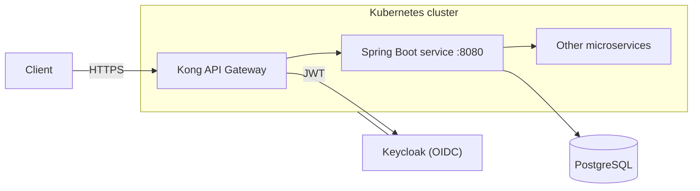

Every example targets some part of this landscape. No toy examples.

---

## Table of Contents

1. [Why Command-Line Tools Matter](#part-1--why-command-line-tools-matter)
2. [curl](#part-2--curl)
3. [jq](#part-3--jq)
4. [Windows Command Line (CMD)](#part-4--windows-command-line-cmd)
5. [PowerShell](#part-5--powershell)
6. [Linux Essentials](#part-6--linux-essentials)
7. [Text Processing Tools](#part-7--text-processing-tools)
8. [Searching Files](#part-8--searching-files)
9. [Process Management](#part-9--process-management)
10. [Networking Tools](#part-10--networking-tools)
11. [Log Analysis](#part-11--log-analysis)
12. [Docker Commands](#part-12--docker-commands)
13. [Kubernetes Commands](#part-13--kubernetes-commands)
14. [Database Command-Line Tools](#part-14--database-command-line-tools)
15. [Git Command Line](#part-15--git-command-line)
16. [Build Tools (Maven & Gradle)](#part-16--build-tools-maven--gradle)
17. [Java Command-Line Tools](#part-17--java-command-line-tools)
18. [OpenSSL](#part-18--openssl)
19. [Shell Scripting](#part-19--shell-scripting)
20. [Real Production Debugging](#part-20--real-production-debugging)
21. [Common Interview Questions](#part-21--common-interview-questions)
22. [Final Mental Model](#part-22--final-mental-model)

---

# PART 1 — Why Command-Line Tools Matter

## Why senior engineers live in the terminal

Watch a senior backend engineer debug a production incident and you'll notice something: they rarely open a GUI. Not because GUIs are bad, but because in the environments where production actually runs — a Kubernetes pod, an SSH session to a bastion host, a CI runner, a Docker container with no display — **there is no GUI**. The terminal is the *only* interface that exists everywhere: your laptop, the CI pipeline, the container, the cluster node, the database server. Learn it once, use it everywhere.

There are deeper reasons than availability:

- **Composability.** GUI tools are islands — each does one thing and you copy-paste between them. CLI tools are *Lego bricks*: the output of one becomes the input of the next. `kubectl logs | grep ERROR | awk ... | sort | uniq -c` is a custom diagnostic tool you assembled in five seconds. No GUI can be recombined like that.
- **Reproducibility & automation.** A command is text. Text can be saved, versioned in Git, pasted into a runbook, scheduled in cron, run in CI, and shared in a Slack message so a colleague reproduces your exact steps. A sequence of mouse clicks cannot.
- **Speed.** Once fluent, typing is faster than navigating menus, and you operate on *thousands* of files/lines/records at once.
- **Precision & scriptability.** The CLI does exactly what you say, every time — no hidden state, no "it worked when I clicked it."

> The rule of thumb: **use a GUI to explore something once; use the CLI when you'll do it again, do it at scale, do it remotely, or need to prove exactly what you did.**

## GUI vs CLI — a fair comparison

| Dimension | GUI | CLI |
|---|---|---|
| Discoverability | High (menus show options) | Lower (you must know/`--help`) |
| Speed once learned | Moderate | High |
| Automation | Poor | Excellent |
| Works over SSH / in containers | Rarely | Always |
| Composability | None | Pipelines |
| Reproducibility | Hard | Trivial (it's text) |
| Operating at scale | Painful | Natural |

The senior move isn't "CLI always." It's knowing that production debugging, automation, and remote work are inherently CLI territory, and building real fluency there.

## The three streams: stdin, stdout, stderr

This is the foundational mental model. Every Unix process is born with **three open file descriptors**:

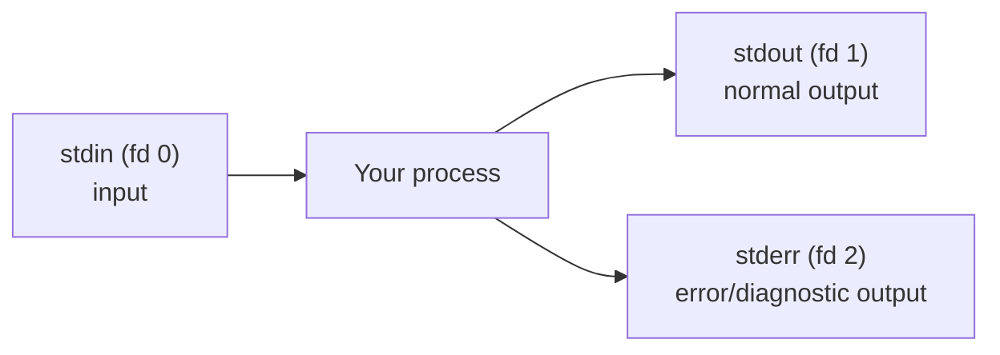

- **stdin (fd 0)** — where the program *reads* input. By default, your keyboard.
- **stdout (fd 1)** — where the program writes its *normal* results. By default, your screen.
- **stderr (fd 2)** — where the program writes *errors and diagnostics*. Also the screen by default, but a **separate** stream.

Why two output streams? So you can **separate results from noise**. A program can emit its real data on stdout and its warnings/progress on stderr, and you can route each independently. This is why `curl` shows a progress bar (stderr) that doesn't corrupt the downloaded data (stdout) when you pipe it.

## Redirection: rewiring the streams

Redirection changes where a stream points — usually to/from a file:

```bash
command > out.txt        # stdout → file (overwrite)
command >> out.txt       # stdout → file (append)
command 2> err.txt       # stderr → file
command > out.txt 2>&1   # stdout → file, then stderr → wherever stdout points (both to file)
command &> all.txt       # bash shorthand: both streams → file
command < in.txt         # file → stdin
command 2>/dev/null      # discard errors (the "black hole" device)
```

The `2>&1` idiom trips everyone up. Read it as: "make fd 2 (stderr) point to the same place fd 1 (stdout) currently points." **Order matters**: `> out.txt 2>&1` sends both to the file, but `2>&1 > out.txt` sends stderr to the *original* stdout (screen) and only stdout to the file, because redirections are applied left to right.

```bash
# Capture a Spring Boot app's full output (logs + errors) to a file
java -jar app.jar > app.log 2>&1

# Run it and only keep errors
java -jar app.jar 2> errors.log
```

## Pipes: the heart of the philosophy

A **pipe** (`|`) connects one process's stdout to the next process's stdin, in memory, streaming:


```bash
kubectl logs my-pod | grep ERROR | wc -l     # count error lines in a pod's logs
```

This is the **Unix philosophy**: *write programs that do one thing well, and that work together via text streams.* `grep` doesn't know about Kubernetes; `kubectl` doesn't know about counting; `wc` doesn't know about either. Yet piped together they form a bespoke tool. Master this and the whole toolkit multiplies: every tool composes with every other tool.

A crucial subtlety: **pipes connect stdout only.** stderr is *not* piped by default — it goes straight to the screen. So `command1 | command2` pipes command1's normal output; its errors bypass the pipe. To pipe errors too: `command1 2>&1 | command2`.

## Environment variables

Environment variables are **key-value pairs inherited by processes** — the ambient configuration of a shell and everything it launches. They're how you configure programs without command-line flags, and how Spring Boot reads config in containers.

```bash
export SPRING_PROFILES_ACTIVE=prod      # set (and export to child processes)
export DB_PASSWORD="s3cr3t"
echo "$SPRING_PROFILES_ACTIVE"          # read
env | grep SPRING                       # list all env vars matching SPRING
```

Spring Boot's **relaxed binding** means `SPRING_DATASOURCE_URL` (env var) maps to `spring.datasource.url` (property). This is *the* mechanism for configuring containers — you'll set these in Docker `-e` flags and Kubernetes manifests constantly.

```bash
docker run -e SPRING_PROFILES_ACTIVE=prod -e SERVER_PORT=8080 my-service
```

**Scope:** a variable set with `export` is inherited by child processes but dies with the shell. Set without `export` (`X=1`) and it's local to the shell only. Set inline before a command (`X=1 command`) and it's set *only* for that command's environment.

## Exit codes: how programs report success

Every process returns an **exit code** (0–255) when it finishes. **0 means success; anything else means failure.** This is the machinery that makes shell scripting and CI possible — `&&`, `||`, `if`, and pipelines all key off exit codes.

```bash
curl -f https://service/health     # -f makes curl exit non-zero on HTTP errors
echo $?                            # print the last exit code (0 = healthy)

# Chaining on success/failure
mvn package && docker build -t app . && docker push app   # each runs only if prior succeeded
curl -f https://service/health || echo "SERVICE DOWN"     # runs only if curl failed
```

- `$?` — the exit code of the last command.
- `A && B` — run B only if A succeeded (exit 0).
- `A || B` — run B only if A failed (exit ≠ 0).

Conventionally: `0` success, `1` general error, `2` misuse, `126` not executable, `127` command not found, `130` terminated by Ctrl-C. In a Kubernetes `livenessProbe` or a CI step, the exit code *is* the pass/fail signal.

## Putting the model together

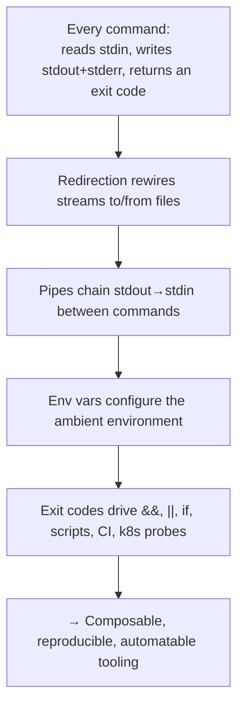

With this model, every later chapter is just "which brick is this, and how does it compose?" Let's start with the brick backend developers touch most: `curl`.

---

# PART 2 — curl

## Why curl exists

`curl` (client for URLs) exists to make **any** HTTP(S) request from the command line, scriptably, with total control over every byte of the request. Before curl, testing an API meant writing throwaway code or clicking around a browser (which can only do GETs easily and hides everything). curl lets you craft the *exact* request — method, headers, body, TLS options — and see the *exact* response, including status line and headers. It's the universal API client, present on virtually every server, and the *lingua franca* for sharing "how to reproduce this request" (every API doc and Postman export can produce a curl command).

> **When to prefer curl over Postman/a browser:** on a server or in a container (no GUI), in scripts/CI, in health checks, when you need to reproduce a request exactly in a bug report, when debugging TLS, and when you want speed. Postman is great for exploration; curl is how you *automate and prove*.

## The mental model

A curl invocation is: `curl [options] URL`. By default it does a **GET**, prints the **response body to stdout**, and prints progress/errors to **stderr**. Everything else — method, headers, body, auth, TLS — is options. Key ones to internalize:

| Option | Meaning |
|---|---|
| `-X METHOD` | HTTP method (GET/POST/PUT/DELETE/PATCH) |
| `-H "Header: value"` | add a request header (repeatable) |
| `-d 'data'` | request body (implies POST, sets `Content-Type: application/x-www-form-urlencoded`) |
| `--data-raw` / `--json` | send raw / JSON body (`--json` sets JSON headers, curl 7.82+) |
| `-i` | include response headers in output |
| `-I` | HEAD request — headers only |
| `-v` | verbose: show request + response headers, TLS handshake |
| `-s` | silent (hide progress bar) |
| `-S` | show errors even when silent |
| `-o file` / `-O` | write body to file / to remote filename |
| `-L` | follow redirects |
| `-f` | fail (non-zero exit) on HTTP ≥ 400 |
| `-w` | write-out custom info (timings, status) |
| `-u user:pass` | basic auth |

## First requests against a Spring Boot service

```bash
# Simple GET (body to stdout)
curl http://localhost:8080/api/users/42

# Include response status + headers (great first diagnostic)
curl -i http://localhost:8080/api/users/42
# HTTP/1.1 200 OK
# Content-Type: application/json
# {"id":42,"name":"Alice"}

# Just the headers (is the service even up? what content type?)
curl -I http://localhost:8080/actuator/health

# Pretty-print JSON by piping to jq (Part 3)
curl -s http://localhost:8080/api/users | jq '.'
```

Note the `-s` before piping — you almost always want silent mode in pipelines so the progress bar doesn't pollute stdout.

## HTTP methods and JSON bodies

```bash
# POST JSON (the everyday backend request)
curl -X POST http://localhost:8080/api/users \
  -H "Content-Type: application/json" \
  -d '{"name":"Bob","email":"bob@example.com"}'

# Modern shorthand (curl 7.82+): --json sets Content-Type AND Accept to application/json
curl --json '{"name":"Bob"}' http://localhost:8080/api/users

# PUT / PATCH / DELETE
curl -X PUT http://localhost:8080/api/users/42 -H "Content-Type: application/json" -d '{"name":"Alice2"}'
curl -X DELETE http://localhost:8080/api/users/42

# Body from a file (keeps big payloads out of your shell history)
curl -X POST http://localhost:8080/api/orders -H "Content-Type: application/json" -d @order.json
```

**Common mistake:** using `-d` without a `Content-Type` header. `-d` defaults to `application/x-www-form-urlencoded`, so Spring's `@RequestBody` (expecting JSON) returns **415 Unsupported Media Type** or a null body. Always pair JSON bodies with `-H "Content-Type: application/json"` (or use `--json`).

## Authentication: Basic, Bearer/JWT, OAuth2

```bash
# Basic auth
curl -u admin:password http://localhost:8080/actuator/env

# Bearer token (JWT) — the standard for secured APIs
curl -H "Authorization: Bearer eyJhbGciOi..." http://localhost:8080/api/secure
```

### Getting a token from Keycloak, then calling the API

This is the real backend workflow — authenticate against Keycloak (OIDC), extract the token, call your service:

```bash
# 1. Get an access token from Keycloak (password grant — dev/testing)
curl -s -X POST \
  "https://keycloak.example.com/realms/myrealm/protocol/openid-connect/token" \
  -H "Content-Type: application/x-www-form-urlencoded" \
  -d "grant_type=password" \
  -d "client_id=my-app" \
  -d "client_secret=SECRET" \
  -d "username=alice" \
  -d "password=alicepw" | jq -r '.access_token'

# 2. Do it in one shot: capture the token into a variable, then call the API
TOKEN=$(curl -s -X POST \
  "https://keycloak.example.com/realms/myrealm/protocol/openid-connect/token" \
  -d "grant_type=client_credentials" \
  -d "client_id=my-app" \
  -d "client_secret=SECRET" | jq -r '.access_token')

curl -H "Authorization: Bearer $TOKEN" http://localhost:8080/api/secure

# 3. Client-credentials grant (service-to-service, no user)
#    is the same as above with grant_type=client_credentials
```

The `jq -r '.access_token'` extracts the raw token string from Keycloak's JSON response (Part 3). This two-step (get token → use token) is the single most common curl pattern in a Keycloak/OAuth2 shop.

### Inspecting a JWT

```bash
# Decode a JWT payload (base64url) without verifying — just to read claims
echo "$TOKEN" | cut -d. -f2 | base64 -d 2>/dev/null | jq '.'
# → shows exp, iss, aud, realm_access.roles, etc.
```

## Cookies and sessions

```bash
# Save cookies to a jar, then reuse them (session-based auth flows)
curl -c cookies.txt -d "username=alice&password=pw" http://localhost:8080/login
curl -b cookies.txt http://localhost:8080/api/profile
```

`-c` writes cookies, `-b` sends them. Useful for testing session/CSRF flows or emulating a browser session.

## File uploads and multipart

```bash
# Multipart file upload (Spring @RequestParam MultipartFile)
curl -F "file=@report.pdf" -F "description=Q3 report" http://localhost:8080/api/upload

# -F sets multipart/form-data automatically; @ means "read from file"
# Specify content type of a part explicitly:
curl -F "file=@data.json;type=application/json" http://localhost:8080/api/import
```

## Downloads, redirects, compression

```bash
curl -O https://repo/artifact.jar          # save with remote filename
curl -o app.jar https://repo/artifact.jar   # save with chosen name
curl -L https://short.url/x                  # follow redirects (301/302)
curl --compressed https://api/data           # request + auto-decompress gzip
```

## Timeouts and retries (essential in production)

Never run curl against production without timeouts — a hung connection blocks your script forever.

```bash
curl --connect-timeout 5 --max-time 30 https://slow-service/api    # fail fast
curl --retry 3 --retry-delay 2 --retry-all-errors https://flaky/api # resilient calls
```

- `--connect-timeout` — max seconds to *establish* the connection.
- `--max-time` — max seconds for the *whole* operation.
- `--retry N` — retry transient failures.

## Proxies and mTLS

```bash
# Through a corporate/debug proxy (e.g. mitmproxy to inspect traffic)
curl -x http://proxy:8080 https://api/data

# Client certificate (mutual TLS) — Kong/service-mesh scenarios
curl --cert client.crt --key client.key --cacert ca.crt https://mtls-service/api

# PKCS12 client cert
curl --cert-type P12 --cert client.p12:password https://mtls-service/api
```

## HTTP/2 and TLS control

```bash
curl --http2 -I https://service          # force HTTP/2
curl --tlsv1.2 https://service           # minimum TLS version
curl -k https://self-signed-service      # -k/--insecure: SKIP cert verification (DEBUG ONLY)
```

> **Warning:** `-k` disables TLS verification. It's invaluable for *diagnosing* a cert problem ("does it work if I ignore the cert?") but must **never** appear in production scripts — it defeats the point of TLS.

## Verbose, trace, and timing — the debugging superpowers

```bash
# -v shows the TLS handshake, request headers (>) and response headers (<)
curl -v https://keycloak.example.com/realms/myrealm/.well-known/openid-configuration

# Full wire trace including body bytes
curl --trace-ascii trace.txt https://api/endpoint

# Timing breakdown — WHERE is the latency? (DNS? connect? TLS? server?)
curl -s -o /dev/null -w "dns=%{time_namelookup} connect=%{time_connect} tls=%{time_appconnect} ttfb=%{time_starttransfer} total=%{time_total}\n" \
  https://api/endpoint
```

That `-w` timing line is a senior favorite: it decomposes total latency into DNS lookup, TCP connect, TLS handshake, time-to-first-byte, and total — instantly telling you whether a slow request is DNS, network, TLS, or the server. `-o /dev/null` discards the body so you see only the timing.

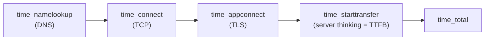

## Testing GraphQL and webhooks

```bash
# GraphQL is just a POST with a JSON query
curl -X POST http://localhost:8080/graphql \
  -H "Content-Type: application/json" \
  -d '{"query":"{ user(id:42){ name email } }"}'

# Simulate a webhook delivery to your service
curl -X POST http://localhost:8080/webhooks/payment \
  -H "Content-Type: application/json" \
  -H "X-Signature: sha256=..." \
  -d @webhook-payload.json
```

## Calling through Kong Gateway

```bash
# Kong proxies to your upstream service; test the gateway route + auth plugin
curl -i https://api-gateway.example.com/orders/api/orders \
  -H "Authorization: Bearer $TOKEN"
# A 401 here (vs 200 direct to the service) isolates the problem to Kong's auth plugin.
```

Comparing a direct-to-service call vs a through-Kong call is a classic isolation technique: if direct works but through-gateway 401s, the gateway's JWT/auth plugin is the culprit.

## Production debugging scenarios

- **"The API returns 500."** `curl -i` to see the exact status and any error body; add `-v` to confirm the request headers are what you think.
- **"Is it DNS or the server that's slow?"** The `-w` timing breakdown.
- **"HTTPS fails."** `curl -v` shows the TLS handshake; `-k` tells you if it's *purely* a cert problem; combine with `openssl s_client` (Part 18).
- **"Works locally, 401 in the cluster."** Compare direct-to-pod (`kubectl port-forward` + curl) vs through-gateway curl to isolate the layer.
- **"Health check flaps."** `curl -f --max-time 2 http://localhost:8080/actuator/health; echo $?` mirrors exactly what Kubernetes does.

## curl vs wget vs HTTPie

| | curl | wget | HTTPie |
|---|---|---|---|
| Focus | any request, scripting, APIs | recursive downloads/mirroring | human-friendly API testing |
| Output | body to stdout | file by default | colorized, auto-pretty JSON |
| JSON ergonomics | manual headers | poor | excellent (`http POST url a=b`) |
| Ubiquity | everywhere | common | must install |
| Best for | production, CI, precise control | grabbing files/recursive | interactive dev exploration |

```bash
wget -q -O app.jar https://repo/app.jar          # wget shines at downloads
http POST :8080/api/users name=Bob email=b@x.com  # HTTPie: concise, readable
```

Use **HTTPie** while exploring on your laptop (concise, pretty), **curl** everywhere that matters (servers, scripts, CI, health checks), **wget** for grabbing/mirroring files.

## Common mistakes

- `-d` with JSON but no `Content-Type: application/json` → 415/null body.
- Forgetting `-L` when the endpoint redirects (you get a 301 body, not the real response).
- Forgetting `-s` in pipelines → progress bar corrupts piped output.
- No timeouts in production scripts → hangs forever.
- `-k` left in production code → silently disables TLS security.
- Single-quoting a body containing `$VAR` you *wanted* expanded (single quotes prevent shell expansion; use double quotes when you need `$TOKEN` substituted).

## Interview questions

- *What's the difference between `-i`, `-I`, and `-v`?* (include headers in output; HEAD request; verbose incl. request/TLS).
- *How do you follow redirects and why isn't it default?* (`-L`; safety/explicitness).
- *How would you measure where latency comes from in an HTTPS call?* (`-w` timing variables).
- *How do you test an OAuth2-secured endpoint from the shell?* (get token from Keycloak, pass as Bearer).
- *What does `-k` do and why is it dangerous?* (skips TLS verification).
- *How do you send a file as multipart?* (`-F "file=@path"`).

Notice how many curl examples ended in `| jq`. That's the other half of API work — parsing JSON. Next.

---

# PART 3 — jq

## Why jq exists

APIs speak JSON. But JSON is *structured* data, and the classic Unix text tools (`grep`, `awk`, `sed`) treat everything as flat lines — they choke on nested, multi-line JSON. `jq` exists to be "sed/awk for JSON": a tool that *understands* JSON structure, so you can select fields, filter arrays, transform, and reformat without writing a program. For a backend developer, jq turns raw API responses into exactly the data you need, and composes perfectly with curl and kubectl.

> **When to reach for jq:** any time JSON comes out of a pipeline — curl responses, `kubectl get -o json`, `docker inspect`, log lines that are JSON, config files. It's the difference between eyeballing a 500-line response and extracting the one field you need.

## The mental model: filters and the pipe

jq's core idea: a **filter** takes JSON in and produces JSON out, and filters compose with jq's *own* internal pipe (`|`). The identity filter is `.` (the whole input). Everything builds from there.

```bash
echo '{"id":42,"name":"Alice"}' | jq '.'        # pretty-print the whole thing
echo '{"id":42,"name":"Alice"}' | jq '.name'    # "Alice"
echo '{"id":42,"name":"Alice"}' | jq -r '.name' # Alice  (-r = raw, no quotes)
```

`-r` (raw output) is essential when you want the *value* to feed another command (like the JWT extraction in Part 2) — without it, strings come out with quotes.

## Selecting fields and nested access

```bash
# Given a Spring Boot response
curl -s :8080/api/users/42 | jq '.address.city'          # nested field
curl -s :8080/api/users/42 | jq '.roles[0]'              # first array element
curl -s :8080/api/users/42 | jq '.name, .email'          # multiple fields
curl -s :8080/api/users/42 | jq '{name, city: .address.city}'  # reshape into new object
```

## Working with arrays

```bash
# A list endpoint returns [{...},{...},...]
curl -s :8080/api/users | jq '.[]'                 # each element (stream)
curl -s :8080/api/users | jq '.[] | .name'         # each user's name
curl -s :8080/api/users | jq '.[].name'            # same, shorthand
curl -s :8080/api/users | jq 'length'              # how many users
curl -s :8080/api/users | jq '.[0:3]'              # first three (slice)
curl -s :8080/api/users | jq 'map(.name)'          # array of names
```

`.[]` *explodes* an array into a stream of its elements; `map(f)` applies `f` to each element and collects back into an array. Knowing when you want a stream vs an array is the key jq skill.

## Filtering with select()

```bash
# Only active users
curl -s :8080/api/users | jq '.[] | select(.active == true)'

# Users in a specific city, just their emails
curl -s :8080/api/users | jq -r '.[] | select(.address.city=="Berlin") | .email'

# Users with more than 2 roles
curl -s :8080/api/users | jq '.[] | select(.roles | length > 2)'

# Find the pod that is not Running (kubectl JSON)
kubectl get pods -o json | jq -r '.items[] | select(.status.phase!="Running") | .metadata.name'
```

`select(condition)` passes through only inputs where the condition is true — jq's equivalent of `grep`/`WHERE`.

## Transforming: map, sort, group, unique, reduce

```bash
# Sort users by name
curl -s :8080/api/users | jq 'sort_by(.name)'

# Group orders by status, count each
curl -s :8080/api/orders | jq 'group_by(.status) | map({status: .[0].status, count: length})'

# Unique cities
curl -s :8080/api/users | jq '[.[].address.city] | unique'

# Sum order totals (reduce)
curl -s :8080/api/orders | jq 'reduce .[].total as $t (0; . + $t)'
# or the shorthand:
curl -s :8080/api/orders | jq '[.[].total] | add'

# Min/max/average
curl -s :8080/api/orders | jq '[.[].total] | max'
```

## Updating JSON

```bash
# Change a field
echo '{"name":"Alice","active":false}' | jq '.active = true'

# Add/derive a field
curl -s :8080/api/users/42 | jq '. + {fullName: (.firstName + " " + .lastName)}'

# Update every element in an array
curl -s :8080/api/users | jq 'map(.active = true)'

# Delete a field
curl -s :8080/api/users/42 | jq 'del(.passwordHash)'
```

## Building objects and CSV/TSV output

```bash
# Reshape into a flat report
curl -s :8080/api/users | jq -r '.[] | {name, city: .address.city}'

# Produce CSV (great for spreadsheets / further processing)
curl -s :8080/api/users | jq -r '.[] | [.id, .name, .email] | @csv'
# 42,"Alice","alice@x.com"

# Tab-separated for column/awk pipelines
curl -s :8080/api/users | jq -r '.[] | [.id, .name] | @tsv'
```

`@csv`/`@tsv`/`@json`/`@base64` are **format strings** — they encode an array/value into that format, correctly quoting/escaping.

## String interpolation and formatting

```bash
curl -s :8080/api/users | jq -r '.[] | "\(.id): \(.name) <\(.email)>"'
# 42: Alice <alice@x.com>
```

`"\(expr)"` interpolates a jq expression into a string — perfect for building log lines or shell commands.

## Real Spring Boot / Kubernetes examples

```bash
# Extract the JWT from a Keycloak token response (from Part 2)
... | jq -r '.access_token'

# From /actuator/health, get overall status and the DB component status
curl -s :8080/actuator/health | jq '{status, db: .components.db.status}'

# From /actuator/metrics/jvm.memory.used, get the value
curl -s :8080/actuator/metrics/jvm.memory.used | jq '.measurements[0].value'

# List all container images used in a namespace
kubectl get pods -o json | jq -r '.items[].spec.containers[].image' | sort -u

# Get the restart count of every pod (spot crash loops)
kubectl get pods -o json | jq -r '.items[] | "\(.metadata.name) \(.status.containerStatuses[0].restartCount)"'

# From docker inspect, get a container's IP
docker inspect my-container | jq -r '.[0].NetworkSettings.Networks[].IPAddress'
```

## Large files and streaming

For huge JSON (multi-GB log dumps), the default jq reads the whole document into memory. Use:

```bash
jq -c '.[]' huge.json                 # compact output, one JSON per line (NDJSON)
jq --stream ...                       # event-based streaming for enormous inputs
cat logs.ndjson | jq 'select(.level=="ERROR")'   # NDJSON: one JSON object per line, streams naturally
```

Modern log pipelines emit **NDJSON** (newline-delimited JSON) precisely because each line is independently parseable — jq processes it line-by-line, streaming, with low memory.

## Performance considerations

- jq is fast for typical API responses (KBs–MBs). For GB-scale, prefer NDJSON + line-by-line, or `--stream`.
- `-c` (compact) output is faster and smaller when feeding another program.
- Avoid re-parsing: do all transformations in *one* jq invocation with internal pipes rather than several `| jq | jq |` stages.

## Common mistakes

- Forgetting `-r` when extracting a value for shell use → you get `"value"` with quotes and downstream breaks.
- Confusing `.[]` (stream) with `map()` (array) — leads to "wrong shape" errors.
- Not quoting the jq program in the shell — `$`, `|`, `()` get interpreted by bash; **always single-quote** the jq filter.
- Piping non-silent curl into jq → the progress bar makes jq fail with a parse error (use `curl -s`).
- Assuming a field exists — use `.field // "default"` to handle nulls/missing keys.

## jq vs yq vs alternatives

- **jq** — JSON. The standard.
- **yq** — YAML (and JSON/XML). Same query language (the Go `yq` mimics jq syntax), for Kubernetes manifests, `application.yml`, Helm values:

```bash
yq '.spring.datasource.url' application.yml
yq '.spec.replicas = 3' deployment.yaml            # edit YAML in place with -i
kubectl get deploy x -o yaml | yq '.spec.template.spec.containers[0].image'
```

- **`jless`/`fx`** — interactive JSON viewers for exploration.
- Language JSON libs (Python `json`, `jackson`) — when logic gets too complex for a one-liner.

Rule: **jq for JSON, yq for YAML**, same mental model.

## Interview questions

- *What does `.[]` do vs `map()`?* (explode to stream vs transform-and-collect).
- *How do you extract a raw string value for use in a shell variable?* (`jq -r`).
- *How would you find all non-Running pods from `kubectl get -o json`?* (`select(.status.phase!="Running")`).
- *What is NDJSON and why do log pipelines use it?* (line-delimited JSON, streamable).
- *How do you produce CSV from a JSON array?* (`@csv` with `-r`).

Now we shift environments. Many backend developers work on Windows machines — let's cover the native CMD toolset before PowerShell.

---

# PART 4 — Windows Command Line (CMD)

## Why CMD still matters

Even in a Linux-dominated backend world, many enterprise developer laptops run Windows, CI agents run Windows, and you'll SSH/RDP into Windows servers. CMD (`cmd.exe`) is the *always-present* Windows shell — no install needed — and its commands appear in countless legacy scripts (`.bat`/`.cmd`). You don't need to love it, but you must be able to navigate, inspect processes, and check networking on a Windows box that has nothing else installed. PowerShell (Part 5) is far more powerful, but CMD is the guaranteed baseline.

## The core translation table (Linux Bash → CMD → PowerShell)

This single table saves you constant context-switching. We'll expand key rows afterward.

| Task | Linux Bash | Windows CMD | PowerShell |
|---|---|---|---|
| List files | `ls -la` | `dir` | `Get-ChildItem` (`ls`, `gci`) |
| Change dir | `cd /path` | `cd \path` | `Set-Location` (`cd`) |
| Print working dir | `pwd` | `cd` (no args) | `Get-Location` (`pwd`) |
| Show file | `cat f` | `type f` | `Get-Content f` (`cat`) |
| Page a file | `less f` | `more f` | `Get-Content f | more` |
| Copy | `cp a b` | `copy a b` | `Copy-Item a b` |
| Move/rename | `mv a b` | `move`/`rename` | `Move-Item`/`Rename-Item` |
| Delete file | `rm f` | `del f` | `Remove-Item f` |
| Make dir | `mkdir d` | `mkdir d` / `md d` | `New-Item -Type Directory` |
| Remove dir | `rm -r d` | `rmdir /s d` | `Remove-Item -Recurse d` |
| Find text | `grep x f` | `findstr x f` | `Select-String x f` |
| Find files | `find . -name '*.log'` | `dir /s /b *.log` | `Get-ChildItem -Recurse -Filter *.log` |
| List processes | `ps aux` | `tasklist` | `Get-Process` |
| Kill process | `kill PID` | `taskkill /PID n` | `Stop-Process -Id n` |
| Ports | `ss -tlnp` | `netstat -ano` | `Get-NetTCPConnection` |
| Ping | `ping host` | `ping host` | `Test-Connection host` |
| Traceroute | `traceroute host` | `tracert host` | `Test-NetConnection` |
| IP config | `ip addr` | `ipconfig /all` | `Get-NetIPAddress` |
| DNS lookup | `dig host` | `nslookup host` | `Resolve-DnsName host` |
| Env var | `echo $X` | `echo %X%` | `$env:X` |
| Which/where | `which cmd` | `where cmd` | `Get-Command cmd` |
| Hostname | `hostname` | `hostname` | `hostname` |

## Files and directories

```cmd
dir                     :: list (like ls)
dir /a                  :: include hidden/system files
dir /s /b *.jar         :: recursive, bare paths — find all jars (like find)
dir /o-d                :: sort by date descending
cd C:\projects\service  :: change directory (note backslashes)
cd                      :: with no args, PRINTS current dir (unlike Linux)
cd /d D:\other          :: /d also changes DRIVE
tree /f                 :: directory tree including files
type application.yml    :: print a file (like cat)
more app.log            :: page through a file
```

**Windows-specific gotchas vs Linux:**
- Paths use `\` (backslash) and drive letters (`C:`). `cd` alone prints the dir instead of going home.
- Wildcards and case: CMD is case-insensitive; Linux is case-sensitive.
- Deleting: `del` removes files; `rmdir /s /q dir` removes a directory tree quietly.

```cmd
copy source.txt dest.txt         :: copy a file
move old.txt new.txt             :: move/rename
rename config.old config.new     :: rename only
del /q *.tmp                     :: delete quietly
mkdir logs & rmdir /s /q old     :: make + remove (& chains commands)
```

## xcopy and robocopy (serious file copying)

```cmd
xcopy src dst /E /I /Y           :: copy dir tree (/E incl empty, /I assume dir, /Y no prompt)

:: robocopy — robust, resumable, mirror-capable (the professional choice)
robocopy C:\app\logs D:\backup\logs /MIR       :: MIRROR (exact copy, deletes extras)
robocopy src dst /E /Z /R:3 /W:5               :: recursive, restartable, 3 retries, 5s wait
```

**robocopy** is genuinely excellent — it mirrors directory trees, resumes interrupted copies, retries on failure, and is far more reliable than `copy`/`xcopy` for backups and deployments. Note robocopy's exit codes are unusual (0 = nothing copied, 1 = files copied, ≥8 = error) — matters in scripts.

## Searching text: find vs findstr

```cmd
type app.log | find "ERROR"          :: simple substring match (find)
find /c "ERROR" app.log              :: /c = count matches
findstr "ERROR WARN" app.log         :: findstr: multiple terms (OR)
findstr /i /s /n "NullPointer" *.log :: /i insensitive, /s recursive, /n line numbers
findstr /r "Exception.*Error" app.log :: /r = regex
```

`findstr` is the closer analog to `grep` (supports regex, recursion, case-insensitivity); plain `find` only does literal substrings. **Use `findstr` for real log searching.**

## Processes

```cmd
tasklist                              :: all processes (like ps)
tasklist | findstr java               :: find the Java process
tasklist /FI "IMAGENAME eq java.exe"  :: filter by image name
taskkill /PID 12345 /F                :: force-kill by PID
taskkill /IM java.exe /F              :: kill all java.exe (like killall)
```

Finding and killing a stuck Spring Boot process on Windows: `tasklist | findstr java` to get the PID, then `taskkill /PID <pid> /F`.

## Networking

```cmd
ipconfig /all                    :: full network config (IP, DNS, MAC)
ipconfig /flushdns               :: clear DNS cache (fixes stale resolution)
ping api.example.com             :: reachability + latency
tracert api.example.com          :: hop-by-hop path
netstat -ano                     :: all connections + owning PID
netstat -ano | findstr :8080     :: WHO is using port 8080? (the classic)
netstat -ano | findstr LISTENING :: all listening ports
nslookup keycloak.example.com    :: DNS lookup
where java                       :: locate the java executable in PATH
hostname                         :: machine name
```

The **"port already in use"** workflow on Windows: `netstat -ano | findstr :8080` gives you the PID holding the port, then `taskkill /PID <pid> /F`.

## Environment variables and PATH

```cmd
echo %JAVA_HOME%                 :: read a var
echo %PATH%                      :: read PATH
set                              :: list ALL env vars
set SPRING_PROFILES_ACTIVE=dev   :: set for THIS session only
setx JAVA_HOME "C:\jdk-21"       :: set PERMANENTLY (new sessions; not current)
path                             :: show PATH (alias of echo %PATH%)
```

**Critical distinction:** `set` is session-only (gone when you close CMD); `setx` writes to the registry permanently but does **not** affect the current session (open a new one). New developers lose an hour to this constantly.

## Other useful CMD commands

```cmd
fc file1.txt file2.txt           :: compare two files (like diff)
echo Hello                       :: print
echo %DATE% %TIME%               :: current date/time
type nul > empty.txt             :: create an empty file (like touch)
cls                              :: clear screen
```

## Chaining and redirection in CMD

```cmd
cmd1 & cmd2       :: run both (sequential, unconditional)
cmd1 && cmd2      :: run cmd2 only if cmd1 succeeded (exit 0)
cmd1 || cmd2      :: run cmd2 only if cmd1 failed
cmd > out.txt     :: redirect stdout
cmd 2> err.txt    :: redirect stderr
cmd > out 2>&1    :: both to file (same idiom as Linux)
cmd | findstr x   :: pipe
```

Encouragingly, `&&`, `||`, `>`, `2>&1`, and `|` work the same conceptually as Bash — the stream model from Part 1 carries over.

## Common mistakes

- Using `/` for paths (Windows uses `\`; though many tools accept `/`).
- Expecting `set X=Y` to persist → use `setx` (and open a new shell).
- Using `find` expecting grep behavior → use `findstr`.
- Forgetting `/F` on `taskkill` for a stuck process.
- Spaces around `=` in `set` (`set X = Y` creates a var named `X ` with value ` Y`) — no spaces.

## Interview questions

- *How do you find which process holds port 8080 on Windows?* (`netstat -ano | findstr :8080` → `taskkill /PID`).
- *Difference between `set` and `setx`?* (session vs permanent).
- *CMD equivalent of `grep -r`?* (`findstr /s`).
- *How to mirror a directory reliably?* (`robocopy /MIR`).
- *How to force-kill all Java processes?* (`taskkill /IM java.exe /F`).

CMD is the baseline. But Windows' real power shell is object-based and deserves its own model.

---

# PART 5 — PowerShell

## Why PowerShell is fundamentally different

Here is the one insight that unlocks PowerShell: **Unix pipes pass *text*; PowerShell pipes pass *objects*.** In Bash, `ls | grep foo` streams bytes, and every tool must re-parse text. In PowerShell, `Get-ChildItem | Where-Object Length -gt 1MB` streams *file objects* with real typed properties (`.Length`, `.LastWriteTime`, `.Name`) — no parsing, no fragile column-counting. This is a genuinely different paradigm, and it's why PowerShell is the serious Windows automation tool (and now cross-platform via PowerShell Core on Linux/macOS).

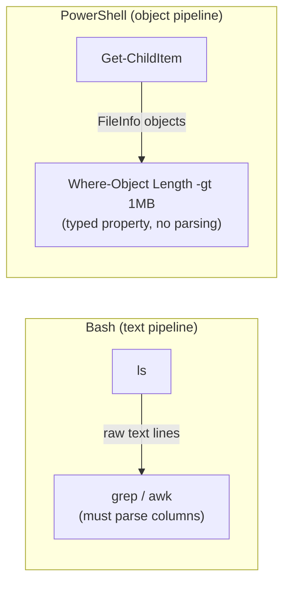

## Cmdlets: the Verb-Noun convention

PowerShell commands are **cmdlets** named `Verb-Noun`: `Get-Process`, `Stop-Service`, `Set-Content`, `Invoke-RestMethod`. This consistency means you can *guess* command names. Common verbs: `Get`, `Set`, `New`, `Remove`, `Start`, `Stop`, `Invoke`, `Select`, `Where`, `ForEach`, `Sort`, `Measure`. Aliases make it friendlier: `ls`/`gci` → `Get-ChildItem`, `cat` → `Get-Content`, `ps` → `Get-Process`, `%` → `ForEach-Object`, `?` → `Where-Object`.

## Discovering everything: Get-Command and Get-Help

```powershell
Get-Command *process*            # find cmdlets related to processes
Get-Help Invoke-RestMethod -Examples   # examples for a cmdlet
Get-Help Get-Process -Full             # full docs
Get-Member -InputObject (Get-Process)  # what PROPERTIES/METHODS does this object have?
```

`Get-Member` is the object-pipeline superpower: it tells you the properties available on whatever an object is, so you know what you can filter/select on. When in doubt, `... | Get-Member`.

## Files and directories

```powershell
Get-ChildItem                          # ls
Get-ChildItem -Recurse -Filter *.log   # recursive find
Get-ChildItem -Recurse | Where-Object Length -gt 10MB   # files over 10MB (typed!)
Get-Content app.log                    # cat
Get-Content app.log -Tail 100 -Wait    # tail -f !  (follow a growing log)
Set-Content out.txt "hello"            # write a file
"line" | Add-Content log.txt           # append
Copy-Item a b; Move-Item a b; Remove-Item a -Recurse
New-Item -ItemType Directory logs
```

`Get-Content -Tail 100 -Wait` is the PowerShell `tail -f` — invaluable for watching a Spring Boot log on Windows.

## Searching text: Select-String (the grep of PowerShell)

```powershell
Select-String -Pattern "ERROR" -Path app.log
Select-String -Pattern "NullPointer" -Path *.log -Context 2,5   # 2 lines before, 5 after
Get-ChildItem -Recurse -Filter *.log | Select-String "Exception"  # recursive grep
Select-String "timeout" app.log | Measure-Object                  # count matches
```

`Select-String` returns *match objects* (with `.LineNumber`, `.Line`, `.Path`), not just text — so you can pipe them onward.

## Filtering, sorting, measuring, iterating

These four cmdlets are the PowerShell equivalents of `grep`/`sort`/`wc`/`xargs`:

```powershell
Get-Process | Where-Object CPU -gt 100          # filter (like grep on a property)
Get-Process | Sort-Object CPU -Descending       # sort by CPU (like sort)
Get-Process | Measure-Object CPU -Sum -Average  # aggregate (like wc/awk sum)
Get-Process | ForEach-Object { $_.Name }        # iterate (like xargs/loop); $_ = current object
Get-Process | Select-Object Name, CPU, Id       # pick columns (like cut/jq projection)
Get-Process java | Select-Object -First 5        # take first 5
```

`$_` is the current pipeline object (like `awk`'s `$0` but an object). `Where-Object`, `Sort-Object`, and `Select-Object` operate on *properties*, not text columns — no brittle field-splitting.

## Processes and services

```powershell
Get-Process java                       # the Spring Boot JVM
Get-Process | Where-Object WS -gt 1GB  # processes using >1GB working set (memory leak hunt)
Stop-Process -Name java -Force         # kill all java
Stop-Process -Id 12345                 # kill by PID
Get-Service                            # list Windows services
Get-Service | Where-Object Status -eq "Running"
Start-Service MyService; Stop-Service MyService; Restart-Service MyService
```

## REST APIs: Invoke-RestMethod and Invoke-WebRequest

PowerShell has curl built in, and it's *object-aware* — `Invoke-RestMethod` auto-parses JSON responses into objects:

```powershell
# GET — response is auto-parsed into an object, access fields directly!
$user = Invoke-RestMethod -Uri "http://localhost:8080/api/users/42"
$user.name                             # no jq needed — it's already an object
$user.address.city

# POST JSON
$body = @{ name = "Bob"; email = "bob@x.com" } | ConvertTo-Json
Invoke-RestMethod -Uri "http://localhost:8080/api/users" -Method Post `
  -Body $body -ContentType "application/json"

# With a Bearer token (Keycloak flow)
$token = (Invoke-RestMethod -Uri "$kc/realms/myrealm/protocol/openid-connect/token" `
  -Method Post -Body @{ grant_type="client_credentials"; client_id="app"; client_secret="s" }).access_token

Invoke-RestMethod -Uri "http://localhost:8080/api/secure" `
  -Headers @{ Authorization = "Bearer $token" }
```

- **`Invoke-RestMethod`** — for APIs; auto-parses JSON/XML into objects. Use this for REST.
- **`Invoke-WebRequest`** — lower-level; gives you the full response (status code, headers, raw content). Use when you need status/headers, like `curl -i`.

```powershell
$resp = Invoke-WebRequest -Uri "http://localhost:8080/actuator/health"
$resp.StatusCode          # 200
$resp.Headers["Content-Type"]
$resp.Content             # raw body
```

## JSON handling: ConvertTo-Json / ConvertFrom-Json

```powershell
# Parse a JSON string/file into objects
$data = Get-Content response.json | ConvertFrom-Json
$data.items | Where-Object { $_.status -ne "Running" } | Select-Object name

# Build JSON from objects
@{ replicas = 3; image = "app:1.2" } | ConvertTo-Json

# The PowerShell equivalent of a curl|jq pipeline:
(Invoke-RestMethod :8080/api/users) | Where-Object active | Select-Object name, email
```

That last line does what `curl -s | jq '.[] | select(.active) | {name,email}'` does — but with native objects, no jq required. This is PowerShell's big win for JSON-heavy backend work on Windows.

## Environment variables

```powershell
$env:JAVA_HOME                         # read
$env:SPRING_PROFILES_ACTIVE = "dev"    # set (this session)
Get-ChildItem Env:                     # list all
[Environment]::SetEnvironmentVariable("JAVA_HOME","C:\jdk-21","User")  # persist (like setx)
```

## Comparison: the same task three ways

**"Find the Java process and show its memory."**

```bash
# Bash
ps aux | grep '[j]ava' | awk '{print $6/1024 " MB"}'
```
```cmd
:: CMD
tasklist /FI "IMAGENAME eq java.exe"
```
```powershell
# PowerShell (typed, no parsing)
Get-Process java | Select-Object Name, @{N='MB';E={[math]::Round($_.WS/1MB)}}
```

**"Call an API and get one field."**

```bash
curl -s :8080/api/users/42 | jq -r '.name'
```
```powershell
(Invoke-RestMethod :8080/api/users/42).name
```

## Performance and gotchas

- Object pipelines are convenient but can be **slower** than text tools for massive data — PowerShell wraps each item in a rich object. For huge log crunching, native `grep`/`awk` (or ripgrep) win.
- Backtick `` ` `` is the line-continuation character (not `\`).
- Execution policy may block scripts: `Set-ExecutionPolicy -Scope CurrentUser RemoteSigned`.
- `Invoke-WebRequest` on older Windows PowerShell used IE's engine and could hang; use `-UseBasicParsing` there (unnecessary in PowerShell 7).

## Common mistakes

- Expecting text-pipeline habits (`awk '{print $1}'`) to work — use `Select-Object`/property access instead.
- Confusing `Invoke-RestMethod` (parsed object) with `Invoke-WebRequest` (full response).
- Forgetting `-Force` on `Stop-Process`/`Remove-Item` for protected items.
- Using `\` for line continuation (it's backtick).

## Interview questions

- *Fundamental difference between PowerShell and Bash pipelines?* (objects vs text).
- *When use `Invoke-RestMethod` vs `Invoke-WebRequest`?* (parsed API object vs full HTTP response).
- *PowerShell equivalent of `tail -f`?* (`Get-Content -Wait -Tail`).
- *How do you discover an object's properties?* (`Get-Member`).
- *How do you filter by a property?* (`Where-Object`).

Now to the environment most production backends actually run in: Linux. The essentials.

---

# PART 6 — Linux Essentials

## Why these matter to a backend developer

Your Spring Boot app runs in a Linux container on a Linux node. When you `kubectl exec` or `docker exec` into it, you land in a minimal Linux shell. You need to navigate the filesystem, read config and logs, check disk space, and understand *permissions* — because "permission denied" and "no space left on device" are among the most common production failures. These commands are the floor you stand on.

## Navigation

```bash
pwd                 # print working directory — "where am I?"
ls                  # list
ls -la              # long format, all files (incl. hidden dotfiles), permissions, sizes, dates
ls -lh              # human-readable sizes (K/M/G)
ls -lt              # sort by modification time (newest first) — "what changed recently?"
ls -lS              # sort by size (largest first)
cd /app             # go to /app
cd ..               # up one level
cd ~                # home directory
cd -                # back to previous directory
```

Reading `ls -la` output is a core skill:

```
-rw-r--r--  1 appuser appgroup  4096 Jul 12 10:30 application.yml
drwxr-xr-x  2 appuser appgroup  4096 Jul 12 10:00 logs
```

Columns: **permissions**, link count, **owner**, **group**, size, date, name. The first char: `-` file, `d` directory, `l` symlink.

## Files and directories

```bash
mkdir logs                    # create directory
mkdir -p a/b/c                # create nested path (no error if exists)
touch app.log                 # create empty file OR update its timestamp
cp app.yml app.yml.bak        # copy
cp -r config config-backup    # copy directory recursively
mv app.yml config/            # move
mv old.log new.log            # rename
rm temp.txt                   # delete file
rm -rf build/                 # delete directory tree (DANGEROUS — no undo, no trash)
rmdir emptydir                # remove an EMPTY directory only
ln -s /opt/app/current /opt/app/v2   # symbolic link (current → v2)
```

> **`rm -rf` is the most dangerous command in this guide.** There is no recycle bin. `rm -rf /` or `rm -rf $VAR/` with an empty `$VAR` has destroyed production systems. Double-check the path; consider `ls` first; never run it with a variable you haven't validated.

## Viewing files

```bash
cat application.yml           # dump whole file (small files)
cat -n app.log                # with line numbers
tac app.log                   # reverse (last line first)
less app.log                  # PAGE through (arrows, /search, q to quit) — best for big files
head app.log                  # first 10 lines
head -n 50 app.log            # first 50
tail app.log                  # last 10 lines
tail -n 100 app.log           # last 100
tail -f app.log               # FOLLOW — stream new lines as they're written (live logs!)
tail -f app.log | grep ERROR  # live-filter for errors
nl app.log                    # number non-blank lines
wc -l app.log                 # count lines (how big is this log?)
wc -c app.log                 # count bytes
file mystery.bin              # what KIND of file is this? (reads magic bytes)
```

`less` is your friend for large files (it doesn't load the whole thing into memory). `tail -f` is *the* command for watching a live Spring Boot log. `head`/`tail` are constant companions for peeking at big logs without dumping millions of lines.

## Inspecting metadata: stat and file

```bash
stat app.log                  # size, permissions, owner, access/modify/change timestamps, inode
file app.jar                  # "Java archive data (JAR)" — identifies by content, not extension
```

`stat` shows the three timestamps (atime/mtime/ctime) and the inode — useful when debugging "was this file actually updated?" `file` reads magic bytes, so it identifies a JAR renamed to `.txt` correctly.

## Disk usage: du and df (production-critical)

```bash
df -h                         # disk FREE per filesystem (human-readable) — "am I out of space?"
df -h /var                    # specific mount
du -sh /var/log               # total SIZE of a directory
du -sh * | sort -rh | head    # biggest items in the current dir (find the space hog)
du -h --max-depth=1 /var/log | sort -rh   # per-subdir sizes
```

**"No space left on device"** is a frequent Spring Boot killer (logs filling `/`, or a runaway heap dump). The workflow: `df -h` to confirm which filesystem is full, then `du -sh * | sort -rh | head` to find what's eating it — almost always a giant log file or `*.hprof` heap dump.

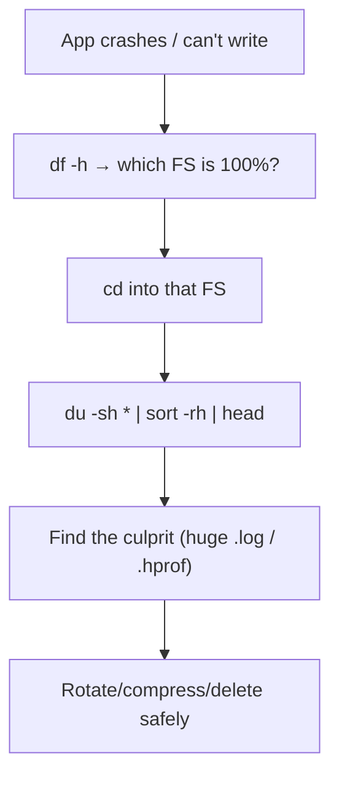

## Permissions — deeply

Linux permissions are the #1 source of "it works locally but not in the container." Every file has permissions for three classes — **owner (u)**, **group (g)**, **others (o)** — each with **read (r=4)**, **write (w=2)**, **execute (x=1)**.

```
-rwxr-x---
 └┬┘└┬┘└┬┘
owner grp others
 rwx  r-x ---
```

- **rwx (owner)** = 4+2+1 = 7 → read, write, execute
- **r-x (group)** = 4+0+1 = 5 → read, execute
- **--- (others)** = 0 → nothing

So this file is mode **750**.

```bash
chmod 755 script.sh           # rwxr-xr-x (owner full, others read+execute)
chmod +x deploy.sh            # add execute for all (make a script runnable)
chmod u+w,o-r file            # symbolic: owner +write, others -read
chmod -R 644 config/          # recursive (files: rw-r--r--)
chown appuser:appgroup app.jar    # change owner and group
chown -R appuser /app         # recursive ownership
```

**What execute means differs by type:** on a *file*, `x` means "can run it"; on a *directory*, `x` means "can enter/traverse it" (you can `cd` in). A common bug: a directory with `r` but not `x` — you can list names but can't access the files.

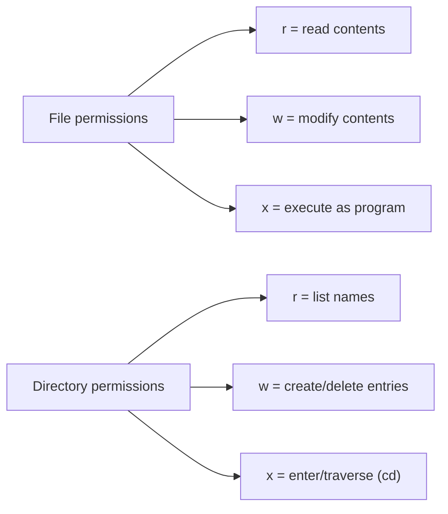

### Real permission scenarios

```bash
# Spring Boot can't read its config: check ownership/mode
ls -l /app/config/application.yml
# If owned by root but the container runs as appuser → permission denied
chown appuser:appgroup /app/config/application.yml

# A mounted volume's files are root-owned and the app (non-root) can't write logs:
chmod 775 /app/logs && chown -R 1000:1000 /app/logs
```

## Comparison: Linux vs CMD vs PowerShell (essentials)

| Task | Linux | CMD | PowerShell |
|---|---|---|---|
| List with sizes | `ls -lh` | `dir` | `gci` |
| Tail a log live | `tail -f f` | *(no native)* | `gc f -Wait -Tail 10` |
| Disk free | `df -h` | `wmic logicaldisk` | `Get-PSDrive` |
| Dir size | `du -sh d` | `dir /s d` | `(gci d -Rec | measure Length -Sum)` |
| Permissions | `chmod`/`chown` | `icacls` | `Get-Acl`/`Set-Acl` |

## Common mistakes

- `rm -rf` with an unvalidated variable path.
- `chmod 777` "to make it work" — a security hole; find the *actual* needed permission (usually 644 files / 755 dirs / 750 for private).
- Forgetting directory `x` permission → "can't access files inside."
- `cp` without `-r` on a directory → "omitting directory."
- Confusing `df` (free space) with `du` (used by a path).

## Interview questions

- *What does chmod 640 mean?* (owner rw, group r, others none).
- *Difference between `du` and `df`?* (directory usage vs filesystem free space).
- *How do you watch a log file update in real time?* (`tail -f`).
- *Why can a user list a directory but not read a file inside it?* (dir has r but not x, or file perms).
- *How do you find the largest files in a directory tree?* (`du -sh * | sort -rh | head`).

Viewing and navigating is step one. The real power is *processing* text at scale — the classic Unix text tools.

---

# PART 7 — Text Processing Tools

## Why these tools are a backend developer's daily bread

Production is drowning in text: gigabyte log files, CSV exports, config files, `kubectl`/`docker` output. The text-processing tools — `grep`, `awk`, `sed`, `cut`, `sort`, `uniq`, and friends — let you *slice, filter, transform, and summarize* that text at scale, composed into pipelines. A senior engineer facing a 2GB log doesn't open an editor; they build a pipeline that answers their question in one line. This chapter is where the Unix philosophy pays off most.

Our running example: a Spring Boot access/application log.

```
2026-07-12 10:30:01.123 ERROR 12345 --- [http-nio-8080-exec-3] c.a.OrderService : Payment failed for order 987 userId=42
2026-07-12 10:30:02.456 INFO  12345 --- [http-nio-8080-exec-4] c.a.UserController : GET /api/users/42 200 15ms
```

## grep — find lines matching a pattern

`grep` (global regular expression print) is the most-used text tool: print lines that match a pattern.

```bash
grep ERROR app.log                 # lines containing ERROR
grep -i error app.log              # case-insensitive
grep -c ERROR app.log              # COUNT matching lines (how many errors?)
grep -n ERROR app.log              # show line numbers
grep -v INFO app.log               # INVERT: lines NOT containing INFO
grep -r "NullPointer" src/         # recursive search in a directory tree
grep -A 5 ERROR app.log            # 5 lines AFTER each match (see the stack trace!)
grep -B 2 ERROR app.log            # 2 lines BEFORE
grep -C 3 ERROR app.log            # 3 lines of context both sides
grep -E "ERROR|WARN" app.log       # extended regex (OR) — same as egrep
grep -o "order [0-9]*" app.log     # print ONLY the matched part, not the whole line
grep -w "42" app.log               # whole-word match (not 420, 142)
```

`-A`/`-B`/`-C` (context) are gold for stack traces — an exception's message is one line but the trace is the next 20; `grep -A 20 Exception` shows them.

```bash
# How many errors per hour? (extract hour, count)
grep ERROR app.log | grep -oE '^[0-9-]+ [0-9]{2}' | sort | uniq -c
```

**`egrep`** is just `grep -E` (extended regex, so `|`, `+`, `()` work without backslashes). Modern grep supports `-E` directly; `egrep` is deprecated but everywhere.

## awk — field-based processing and computation

`awk` treats each line as **fields** (split by whitespace/delimiter) and lets you compute on them. It's a whole language, but 90% of use is `awk '{print $N}'` and simple sums/filters. `$1` is field 1, `$2` field 2, `$0` the whole line, `NF` the number of fields, `NR` the current line number.

```bash
awk '{print $1, $2}' app.log            # print timestamp columns
awk '{print $NF}' app.log               # print the LAST field
awk '/ERROR/ {print $0}' app.log        # only ERROR lines (grep-like)
awk '$3 == "ERROR" {print $NF}' app.log # filter by a specific field's value

# Sum the response times from an access log (field with "15ms")
awk '{gsub(/ms/,"",$NF); sum += $NF} END {print sum " ms total, avg " sum/NR}' access.log

# CSV: print columns 1 and 3 (comma-delimited)
awk -F',' '{print $1, $3}' users.csv

# Count requests per endpoint
awk '{print $8}' access.log | sort | uniq -c | sort -rn

# Average of a numeric column
awk '{sum+=$1; n++} END {print sum/n}' latencies.txt
```

`-F` sets the field delimiter (e.g. `-F','` for CSV, `-F':'` for `/etc/passwd`). The `END` block runs after all lines — perfect for totals/averages. awk shines when you need *arithmetic* on columns, which grep/cut can't do.

## sed — stream editor (find and replace, transform)

`sed` edits a stream line-by-line, most famously for substitution:

```bash
sed 's/ERROR/CRITICAL/' app.log         # replace first ERROR per line
sed 's/ERROR/CRITICAL/g' app.log        # replace ALL (global)
sed 's/password=[^ ]*/password=***/g' app.log   # REDACT secrets in logs
sed -n '10,20p' app.log                 # print only lines 10–20
sed '/DEBUG/d' app.log                  # DELETE lines containing DEBUG
sed -i 's/localhost/db.prod/g' config.properties   # EDIT FILE IN PLACE (-i)
sed -i.bak 's/8080/9090/g' application.properties  # in-place WITH backup
```

`-i` edits the file in place (dangerous without a backup — use `-i.bak`). Redacting secrets before sharing logs (`sed 's/password=[^ ]*/password=***/g'`) is a professional habit. `sed` complements awk: awk for fields/math, sed for substitution/line-ops.

## cut — extract columns by position or delimiter

```bash
cut -d',' -f1,3 users.csv               # fields 1 and 3 from CSV (-d delimiter, -f fields)
cut -d':' -f1 /etc/passwd               # all usernames
cut -c1-19 app.log                      # characters 1–19 (the timestamp)
echo "$PATH" | tr ':' '\n'              # (with tr) split PATH onto lines
```

`cut` is simpler/faster than awk for pure column extraction (no computation). Use `cut` when you just need "column N by delimiter."

## sort and uniq — the counting duo

```bash
sort app.log                    # lexicographic sort
sort -n numbers.txt             # NUMERIC sort (10 after 9, not before)
sort -rn numbers.txt            # numeric, reverse (largest first)
sort -k2 data.txt               # sort by 2nd field
sort -t',' -k3 -n users.csv     # CSV, by 3rd field, numeric
uniq                            # collapse ADJACENT duplicate lines
sort file | uniq                # de-duplicate (must sort first — uniq only sees adjacent)
sort file | uniq -c             # COUNT occurrences of each unique line
sort file | uniq -c | sort -rn  # ranked by frequency (the "top N" idiom)
```

The **`sort | uniq -c | sort -rn`** pattern is one of the most valuable pipelines in existence — it produces a frequency-ranked histogram. "Which error is most common?" "Which IP hits us most?" "Which endpoint is called most?" — all one line:

```bash
# Top 10 most frequent ERROR messages in a Spring Boot log
grep ERROR app.log | sed 's/[0-9]//g' | sort | uniq -c | sort -rn | head -10
#   (strip digits so order-IDs/timestamps don't make each error "unique")
```

## tr — translate/delete characters

```bash
tr 'a-z' 'A-Z' < file           # uppercase
tr -d ' ' < file                # delete spaces
tr -s ' ' < file                # SQUEEZE repeated spaces into one
echo "$PATH" | tr ':' '\n'      # replace colons with newlines (split PATH)
tr -cd '[:print:]' < file       # keep only printable chars (clean binary junk from logs)
```

## Assembling and reshaping: paste, join, column, split

```bash
paste file1 file2               # merge lines side by side (tab-separated)
join -t',' -1 1 -2 1 a.csv b.csv  # SQL-like join on a key column
column -t -s',' users.csv       # align CSV into pretty aligned columns (readable tables)
split -l 100000 huge.log part_   # split a huge file into 100k-line chunks
```

`column -t` is lovely for making messy output readable. `join` does a relational join between two sorted files on a key.

## The glue: xargs, tee, wc

**`xargs`** turns stdin into command *arguments* — bridging tools that output text and tools that take arguments:

```bash
# Find all .log files and delete them (find outputs names; xargs feeds them to rm)
find . -name '*.log' | xargs rm

# grep across files found by find
find . -name '*.java' | xargs grep -l "deprecated"

# Kill all Java processes (pgrep outputs PIDs; xargs feeds kill)
pgrep java | xargs kill

# Safer with null-delimiters (handles spaces in filenames)
find . -name '*.log' -print0 | xargs -0 rm

# Parallelism: run 4 at a time
cat urls.txt | xargs -P4 -I{} curl -s {}
```

**`tee`** splits a stream: writes to a file *and* passes it on (so you can save *and* see/continue a pipeline):

```bash
mvn package | tee build.log                    # watch build AND save it
curl -s :8080/api/data | tee raw.json | jq '.count'   # save raw, also process
kubectl logs pod | tee pod.log | grep ERROR    # archive full log, view errors
```

**`wc`** counts:

```bash
wc -l app.log        # lines
wc -w file           # words
wc -c file           # bytes
grep ERROR app.log | wc -l   # error count (though grep -c is more direct)
```

## Putting it together — realistic log pipelines

```bash
# 1) Count errors per class in the last 10k log lines
tail -10000 app.log | grep ERROR | awk '{print $8}' | sort | uniq -c | sort -rn

# 2) Extract all unique userIds that hit an error
grep ERROR app.log | grep -oE 'userId=[0-9]+' | cut -d= -f2 | sort -u

# 3) Requests per minute (from timestamps)
awk '{print substr($2,1,5)}' access.log | sort | uniq -c

# 4) Slowest 10 requests (assuming a "NNms" latency field)
grep -oE '[0-9]+ms' access.log | tr -d 'ms' | sort -rn | head -10

# 5) Redact secrets, then share a snippet
grep -A20 Exception app.log | sed -E 's/(password|token)=[^ ]+/\1=***/g' | tee incident.txt
```

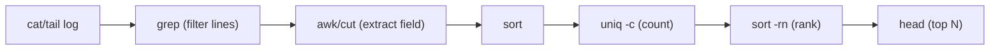

## Performance considerations

- For **huge** files, prefer `grep`/`rg` (ripgrep, Part 8) over `awk`/`sed` when you only need matching — they're highly optimized.
- Put the **most selective filter first** in a pipeline (a `grep` that eliminates 99% of lines) so downstream tools process less.
- `LC_ALL=C grep ...` can be dramatically faster (skips Unicode collation) for ASCII logs.
- Avoid `cat file | grep` (useless use of cat) — `grep pattern file` is fine; save the pipe for real chains.

## Common mistakes

- `uniq` without sorting first — it only collapses *adjacent* duplicates.
- `sort` lexicographically when you meant numerically (`-n`) → "10" sorts before "9".
- `sed -i` without a backup on an irreplaceable file.
- Forgetting `-r`/`-E` for regex features in grep/sed.
- `xargs` on filenames with spaces without `-0`/`-print0`.

## Comparison / when to use which

- **grep** — find lines. **awk** — fields + arithmetic. **sed** — substitution/line edits. **cut** — simple column extraction. **sort/uniq** — ordering + counting. **tr** — char-level. They *compose*; the art is picking the right one per stage.

## Interview questions

- *Difference between grep, sed, and awk?* (filter lines / edit stream / field-based processing+compute).
- *How do you count occurrences of each unique value?* (`sort | uniq -c | sort -rn`).
- *What does `xargs` do?* (turn stdin into command arguments).
- *How do you see the 20 lines after each error?* (`grep -A20`).
- *Why must you sort before uniq?* (uniq only detects adjacent dupes).
- *How do you redact secrets from a log before sharing?* (`sed` substitution).

Text tools search *within* files. Next: finding the files themselves, efficiently, across big repos and servers.

---

# PART 8 — Searching Files

## The problem: "where is that file / command / config?"

On a real server or in a large monorepo you constantly need to answer: *Where is this file? Which config is actually being loaded? Where does this executable live? What's the real path behind this symlink?* The search tools answer these, and choosing the right one (real-time scan vs prewritten index vs PATH lookup) matters for speed.

## find — the recursive workhorse

`find` walks a directory tree in real time, evaluating tests on each entry. It's exhaustive and always current (it reads the actual filesystem now).

```bash
find . -name "*.log"                     # all .log files under current dir
find . -iname "*.LOG"                    # case-insensitive
find /app -type f -name "application*.yml"   # files only, config
find /app -type d -name "logs"           # directories only
find . -name "*.jar" -not -path "*/target/*"   # exclude build dirs

# By time — "what changed recently?" (deploy debugging)
find /app -mmin -10                      # modified in the last 10 minutes
find /var/log -mtime -1                  # modified in the last day
find . -newer pom.xml                    # newer than a reference file

# By size — find the space hogs (pairs with du from Part 6)
find / -type f -size +100M 2>/dev/null   # files over 100MB
find / -name "*.hprof" 2>/dev/null       # heap dumps eating disk!

# By permission / owner
find /app -type f -perm 777              # world-writable files (security audit)
find /app -user root                     # root-owned files (container permission issues)

# The power move: -exec (run a command per result)
find . -name "*.log" -exec ls -lh {} \;  # {} = each file; \; ends the command
find . -name "*.tmp" -delete             # delete matches
find . -name "*.log" -mtime +30 -delete  # delete logs older than 30 days (cleanup)
find . -name "*.java" -exec grep -l "TODO" {} +   # grep across found files (+ batches them)
```

`-exec ... {} \;` runs the command once per file; `-exec ... {} +` batches many files into one invocation (faster). Combining `find` with `-exec grep` or piping to `xargs grep` is how you search *content* in a filtered *set* of files.

```bash
# Find all Spring config files and search them for a property
find . -name "application*.yml" -exec grep -l "datasource" {} +
```

## locate — instant search via a prebuilt index

`find` scans live; `locate` queries a **prebuilt database** (`updatedb`, usually run nightly by cron). It's *instant* but only as fresh as the last index build.

```bash
locate application.yml           # instant, from the index
sudo updatedb                    # rebuild the index (to include recent files)
locate -i keycloak               # case-insensitive
```

Use `locate` for "where is that file somewhere on this system?" when speed matters and the file isn't brand-new. Use `find` when you need current results, complex tests (size/time/perm), or `-exec`.

| | find | locate |
|---|---|---|
| Freshness | live (always current) | index (may be stale) |
| Speed | slower (walks tree) | instant |
| Tests | rich (size/time/perm/exec) | name only |
| Availability | everywhere | needs `mlocate` + index |

## which, whereis — locate commands, not files

```bash
which java                       # path of the java that WILL run (first in PATH)
which -a java                    # ALL javas in PATH (spot version conflicts!)
whereis java                     # binary + source + man page locations
type java                        # shell's view: is it a binary, alias, or function?
```

**`which java`** answers the eternal "which JDK am I actually using?" — critical when multiple JDKs are installed and `JAVA_HOME` disagrees with PATH. `which -a` reveals *all* candidates so you can see the conflict.

## realpath — resolve the true path

```bash
realpath ./config/../app.jar     # canonical absolute path (resolves .. and symlinks)
realpath /opt/app/current        # follow a symlink to its real target
readlink -f /opt/app/current     # similar; follows symlinks fully
```

Deployments often use a `current → releases/v1.2.3` symlink; `realpath`/`readlink -f` tells you *which release is actually live*.

## Modern alternatives: fd and ripgrep

Two Rust tools that are dramatically faster and friendlier — worth installing on any machine you control.

**`fd`** — a better `find`: simpler syntax, respects `.gitignore`, parallel, colorized:

```bash
fd "\.log$"                      # all .log files (regex by default)
fd -e yml                        # by extension
fd -H pattern                    # include hidden files
fd -t f -e java                  # files only, .java
fd config -x grep datasource {}  # find + execute
```

**`ripgrep` (`rg`)** — a better `grep -r`: extremely fast, respects `.gitignore`, recursive by default:

```bash
rg "NullPointerException"        # recursive search, current dir, skips .git/target/node_modules
rg -i "timeout" --type java      # case-insensitive, only Java files
rg "datasource" -g "*.yml"       # glob filter
rg -A5 "Exception" logs/         # context lines, like grep -A
rg -c "ERROR" app.log            # count
rg --stats "pattern" .           # search stats
```

For searching a large Spring Boot codebase, `rg` is often 5–10× faster than `grep -r` and skips build artifacts automatically. If a machine has it, use it.

| Old | Modern | Why switch |
|---|---|---|
| `find` | `fd` | simpler syntax, faster, .gitignore-aware |
| `grep -r` | `rg` | much faster, .gitignore-aware, recursive default |

## Real backend scenarios

```bash
# Which application.yml is on the classpath / being packaged?
find . -name "application*.yml" -path "*/resources/*"

# Find the heap dump that filled the disk
find / -name "*.hprof" -size +100M 2>/dev/null

# Which java binary does 'mvn' actually use?
which java && java -version

# Search the whole codebase for a hardcoded secret (audit)
rg -i "password\s*=\s*['\"]" --type java --type yaml

# Find recently modified configs after a bad deploy
find /app/config -mmin -30 -type f
```

## Performance considerations

- `find /` is slow (walks everything); scope it (`find /app`) and redirect errors (`2>/dev/null`) to skip permission-denied noise.
- `locate` is instant but stale — `updatedb` first if you need fresh results.
- Prefer `rg`/`fd` on large trees; they parallelize and skip ignored dirs.
- `-exec {} +` (batched) beats `-exec {} \;` (per-file) for many results.

## Common mistakes

- Using `find` where `locate`/`rg` would be instant.
- Forgetting `-type f`/`-type d` and matching both.
- `find / ...` without `2>/dev/null` (drowning in permission errors).
- Assuming `which` shows all versions (use `which -a`).
- Forgetting `locate` needs an up-to-date index.

## Interview questions

- *find vs locate?* (live scan vs prebuilt index; freshness vs speed).
- *How do you find files modified in the last 10 minutes?* (`find -mmin -10`).
- *How do you find which `java` will run and all installed ones?* (`which java` / `which -a java`).
- *What does `realpath` resolve?* (symlinks + `..` to a canonical absolute path).
- *Why is ripgrep faster than grep -r?* (parallel, gitignore-aware, optimized).

Finding files leads naturally to finding *processes* — especially a misbehaving JVM.

---

# PART 9 — Process Management

## Why this matters for a JVM

Your Spring Boot app *is* a process — a JVM. When it's stuck, eating CPU, leaking memory, or holding a port, you diagnose it with process tools: find it, inspect its resource use, see what files/sockets it holds, and (last resort) signal or kill it. These tools plus the Java-specific ones (Part 17) are your JVM diagnostics kit.

## ps — snapshot of processes

`ps` prints a point-in-time snapshot. The ubiquitous incantation is `ps aux` (BSD style) or `ps -ef` (System V style).

```bash
ps aux                          # all processes, all users, with CPU/MEM
ps aux | grep '[j]ava'          # find the JVM (the [j] trick avoids matching grep itself)
ps -ef | grep spring            # System V style
ps -eLf | grep java             # include THREADS (-L) — a JVM has many
ps -o pid,ppid,%cpu,%mem,rss,cmd -p 12345   # custom columns for one PID
```

Reading `ps aux` columns: **USER, PID, %CPU, %MEM, VSZ (virtual size), RSS (resident memory in KB), STAT, START, TIME, COMMAND**. **RSS** is the real physical memory — watch it for leaks. The `grep '[j]ava'` trick: the bracket makes the grep pattern not match its own process line.

```bash
# Get just the Spring Boot PID (for scripting)
pgrep -f 'spring-boot' 
pgrep -f 'app.jar'              # by command-line pattern
```

## top and htop — live resource monitor

`top` is the live, self-updating process monitor — your first stop for "the server is slow / CPU is pegged."

```bash
top                    # live view; press 'P' sort by CPU, 'M' by memory, 'q' quit
top -o %MEM            # start sorted by memory
top -H -p 12345        # THREADS of a specific process (find the hot thread in a JVM!)
top -b -n1 | head -20  # batch mode (one snapshot) — scriptable/loggable
```

`top -H -p <jvm-pid>` shows individual JVM *threads* with their CPU — you can find the exact thread burning CPU, note its **TID (in decimal)**, convert to hex, and match it against a thread dump (Part 17) to see *what Java code* is spinning. That is the canonical high-CPU JVM investigation.

**`htop`** is a friendlier `top`: color, scrolling, mouse, tree view, easy kill. Install it where you can; it makes triage pleasant.

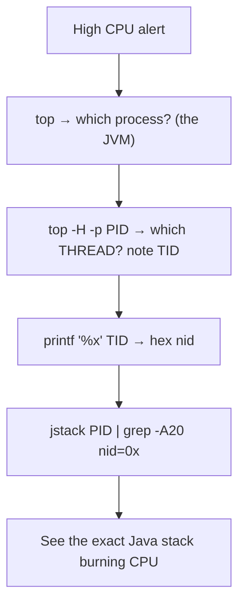

## Signals: kill, killall, pkill

**"Killing" a process means sending it a signal.** The default `kill` sends `SIGTERM` (15) — a polite "please shut down," which Spring Boot handles gracefully (runs shutdown hooks, closes the context). `SIGKILL` (9) is the un-ignorable "die now" — no cleanup.

```bash
kill 12345                 # SIGTERM (15) — graceful; let Spring Boot shut down cleanly
kill -TERM 12345           # same, explicit
kill -9 12345              # SIGKILL — force; use ONLY if SIGTERM doesn't work
kill -HUP 12345            # SIGHUP — often "reload config"
kill -3 12345              # SIGQUIT — makes the JVM print a thread dump to stdout!
kill -l                    # list all signals

killall java               # kill all processes named 'java'
pkill -f 'app.jar'         # kill by command-line pattern
pgrep -f app.jar | xargs kill   # find then kill
```

> **Prefer SIGTERM (graceful) over SIGKILL.** `kill -9` skips Spring's shutdown hooks — no graceful connection draining, no `@PreDestroy`, possible data loss. Reach for `-9` only when a process ignores SIGTERM. And `kill -3` is a hidden gem: it triggers a **thread dump** to the JVM's stdout without any extra tools.

## Job control: jobs, bg, fg, nohup, &

Managing foreground/background tasks in a shell session:

```bash
./long-task.sh &           # run in background; shell returns immediately
jobs                       # list background jobs of this shell
fg %1                      # bring job 1 to foreground
bg %1                      # resume a stopped job in background
# Ctrl-Z suspends the foreground job; bg resumes it in background

# Keep a process alive after you log out (detach from the terminal)
nohup java -jar app.jar > app.log 2>&1 &    # survives SSH disconnect
disown                     # detach a job from the shell
```

**`nohup ... &`** is how you start something that must outlive your SSH session (though for real services you'd use systemd or a container). Without `nohup`, closing the terminal sends `SIGHUP` and kills the job.

## Priority: nice and renice

```bash
nice -n 10 ./batch-job.sh          # start with lower priority (nicer to others; 19=lowest)
nice -n -5 java -jar app.jar        # higher priority (needs root; -20=highest)
renice -n 5 -p 12345                # change priority of a running process
```

"Niceness" ranges -20 (greedy) to 19 (generous). Use it to keep a batch/import job from starving your service on a shared box.

## lsof — what files and sockets does a process hold?

`lsof` (list open files) is a Swiss army knife — in Unix, sockets and network connections are "files" too.

```bash
lsof -p 12345                    # ALL files/sockets held by a PID
lsof -i :8080                    # WHO is listening on / connected to port 8080? (port conflicts!)
lsof -i TCP:8080 -sTCP:LISTEN    # only the listener
lsof -u appuser                  # everything opened by a user
lsof /var/log/app.log            # which processes have this file open? (can't delete it?)
lsof -i @db.prod:5432            # connections to the DB host:port
lsof -p 12345 | grep -c TCP      # count open TCP connections (leak detection)
```

The **"port already in use"** answer on Linux: `lsof -i :8080` (or `ss -tlnp | grep 8080`, Part 10) → get the PID → decide to kill it. `lsof` also finds **file-descriptor leaks** (a JVM slowly accumulating open connections/files until it hits `Too many open files`).

## watch — re-run a command periodically

```bash
watch -n 2 'ps aux | grep [j]ava'          # refresh every 2s
watch -n 5 'curl -s :8080/actuator/health | jq .status'   # poll health
watch -d 'lsof -p 12345 | wc -l'           # -d highlights changes (watch FD count grow)
watch -n 1 'kubectl get pods'              # watch a rollout
```

`watch` turns any command into a live dashboard — great for observing a metric trend (memory climbing, connections growing, pods restarting).

## time — how long did it take?

```bash
time mvn package                 # wall/user/sys time for a command
time curl -s :8080/api/slow > /dev/null
```

`real` = wall-clock, `user` = CPU in user space, `sys` = CPU in kernel. A big gap between `real` and `user+sys` means the command spent time *waiting* (I/O, network) rather than computing.

## Real JVM scenarios

```bash
# 1) Spring Boot pegging CPU — find the hot thread
top -H -p $(pgrep -f app.jar)             # note the TID with high CPU
printf '%x\n' <TID>                        # convert to hex
jstack $(pgrep -f app.jar) | grep -A30 'nid=0x<hex>'   # the culprit stack (Part 17)

# 2) Suspected FD/connection leak
watch -n5 "lsof -p $(pgrep -f app.jar) | wc -l"        # is it climbing?

# 3) Graceful vs forced shutdown
kill -TERM $(pgrep -f app.jar)             # try graceful first
kill -9 $(pgrep -f app.jar)                # only if it won't die

# 4) Quick thread dump without tools
kill -3 $(pgrep -f app.jar)                # dump goes to the app's stdout/console log
```

## Comparison: Linux vs Windows vs PowerShell

| Task | Linux | CMD | PowerShell |
|---|---|---|---|
| List processes | `ps aux` | `tasklist` | `Get-Process` |
| Find by name | `pgrep java` | `tasklist \| findstr java` | `Get-Process java` |
| Kill graceful | `kill PID` | `taskkill /PID n` | `Stop-Process -Id n` |
| Kill force | `kill -9 PID` | `taskkill /PID n /F` | `Stop-Process -Id n -Force` |
| Live monitor | `top`/`htop` | Task Manager / `tasklist` | `Get-Process | Sort CPU` |
| Ports | `lsof -i :8080` | `netstat -ano \| findstr :8080` | `Get-NetTCPConnection -LocalPort 8080` |

## Performance considerations

- `ps`/`top` are cheap; `lsof` on a busy system can be slow (scans all FDs) — scope with `-p`/`-i`.
- `watch` at 0.1s intervals wastes CPU; 1–5s is usually plenty.
- On containers, `ps` may show few processes (PID namespace) — that's expected.

## Common mistakes

- Reaching for `kill -9` first, skipping graceful shutdown.
- Reading VSZ (virtual) as real memory instead of RSS.
- `grep java` matching the grep process itself (use `[j]ava` or `pgrep`).
- Forgetting `nohup`/`&` and losing a long task when SSH drops.
- Killing the wrong PID (always confirm with `ps -p <pid> cmd`).

## Interview questions

- *Difference between SIGTERM and SIGKILL?* (graceful vs forced/un-catchable).
- *How do you find which thread in a JVM is using the CPU?* (`top -H -p`, TID→hex, match in `jstack`).
- *What is RSS vs VSZ?* (resident physical vs virtual memory).
- *How do you find what's using port 8080?* (`lsof -i :8080`).
- *How do you keep a process running after logout?* (`nohup ... &` / systemd).
- *What does `kill -3` do to a JVM?* (triggers a thread dump).

High CPU, port conflicts, and hung requests are often *network* problems in disguise. The networking toolkit is next.

---

# PART 10 — Networking Tools

## Why: microservices are mostly network

A microservice architecture is a graph of network calls: gateway → service → service → database, plus DNS, TLS, and service discovery. When something "doesn't work," the question is usually *where on the network does it break?* The networking tools let you test each layer independently — is DNS resolving? is the host reachable? is the port open? is TLS handshaking? — so you can localize a failure instead of guessing. This maps directly to the OSI-ish layered debugging model:

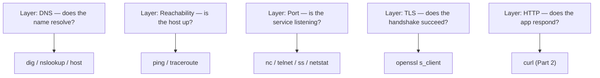

Walk *down* this list and the failure reveals itself at exactly one layer.

## DNS: dig, nslookup, host

DNS resolution is the #1 hidden cause of "service can't reach service." Test it directly.

```bash
dig keycloak.example.com                 # full DNS query + answer section
dig +short keycloak.example.com          # just the IP(s)
dig keycloak.example.com A               # A records (IPv4)
dig keycloak.example.com CNAME           # aliases
dig @8.8.8.8 example.com                 # query a SPECIFIC DNS server (bypass local resolver)
dig +trace example.com                   # follow the delegation from root (deep DNS debugging)

nslookup keycloak.example.com            # simpler, interactive-capable, cross-platform
host keycloak.example.com                # concise one-liner
```

`dig +short` is perfect for scripts. `dig @8.8.8.8` vs `dig` (default resolver) tells you if the problem is *your* resolver vs the actual DNS record. In Kubernetes, DNS is `service.namespace.svc.cluster.local` — resolving that from inside a pod confirms cluster DNS (CoreDNS) works.

```bash
# Inside a pod: does cluster DNS resolve another service?
dig +short my-service.default.svc.cluster.local
nslookup postgres.default.svc.cluster.local
```

## Reachability: ping, traceroute, tracepath

```bash
ping api.example.com             # ICMP echo — is the host alive? round-trip latency
ping -c 4 api.example.com        # 4 packets then stop (Linux; -n on Windows)
traceroute api.example.com       # every hop on the path — WHERE does it stop/slow?
tracepath api.example.com        # like traceroute, no root needed, shows MTU
```

`ping` confirms basic reachability and shows latency; **but many hosts/firewalls block ICMP**, so a failed ping doesn't always mean "down" — verify the actual port too. `traceroute` shows the hop-by-hop path; if it dies at a certain hop, that's where the network breaks (a firewall, a down router).

## Ports: ss, netstat, telnet, nc

**"Is the service actually listening, and can I reach its port?"** — the most common backend network question.

```bash
# ss — the modern netstat (faster, on all recent Linux)
ss -tlnp                         # TCP, Listening, Numeric, Process — all listening ports + PIDs
ss -tlnp | grep 8080             # is my Spring Boot app listening on 8080?
ss -tanp                         # all TCP connections (established + listening)
ss -s                            # summary stats
ss -tnp state established '( dport = :5432 )'   # connections to Postgres

# netstat — older, still common (and on Windows)
netstat -tlnp                    # Linux
netstat -ano                     # Windows (see Part 4)

# Test if a remote port is OPEN (without a full client)
nc -zv db.prod 5432              # netcat: -z scan, -v verbose → "succeeded" or "refused"
nc -zv keycloak.example.com 443
telnet db.prod 5432              # old-school: connects = open, "refused"/hang = closed/filtered
```

**`nc -zv host port`** is the cleanest "is this port reachable from here?" test — decisive for "can my service reach the database?" Run it *from inside the service's pod/container* to test the actual path. `telnet` does the same but is interactive and less scriptable.

The three outcomes and their meaning:
- **"succeeded" / "Connected"** → port open, service listening. Problem is higher up (auth, app).
- **"Connection refused"** → reached the host, but nothing is listening on that port (service down / wrong port).
- **Hang / timeout** → a firewall/security group is silently dropping packets (very common in cloud).

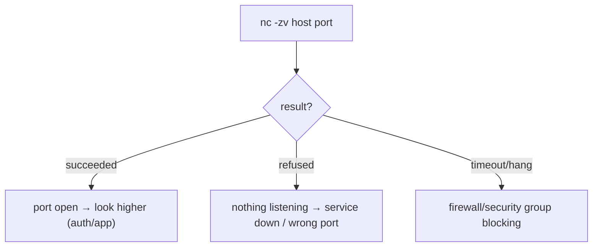

## netcat (nc) — the network Swiss army knife

Beyond port scanning, `nc` can move data, act as a throwaway server, and test raw protocols:

```bash
nc -l 9999                       # listen on 9999 (a quick test server)
echo "hello" | nc host 9999      # send data to a listener
nc -zv host 8080-8090            # scan a port RANGE
printf 'GET / HTTP/1.0\r\n\r\n' | nc localhost 8080   # raw HTTP by hand
```

## IP configuration: ip, ifconfig, arp, route

```bash
ip addr                          # this host's IP addresses (modern; replaces ifconfig)
ip a                             # short form
ip route                         # routing table — how packets leave this host
ip route get 10.0.0.5            # which route/interface reaches an IP
arp -a                           # ARP cache (IP↔MAC on the local network)
route -n                         # routing table (older tool)
```

In containers, `ip addr` shows the pod/container IP — useful when debugging service-to-service connectivity and confirming the IP a service registered with.

## Packet capture: tcpdump (introduction)

When higher-level tools aren't enough, `tcpdump` shows the actual packets on the wire — the ground truth.

```bash
tcpdump -i any port 8080                    # all traffic on port 8080
tcpdump -i any host db.prod and port 5432   # traffic to the DB
tcpdump -i any -w capture.pcap port 443     # save to a file (open in Wireshark)
tcpdump -i any -A port 8080                  # print packet payloads as ASCII (see HTTP)
tcpdump -i any -c 20 port 8080               # capture 20 packets then stop
```

Use tcpdump to answer "are packets even *arriving*?" and "is the app *responding*?" at the lowest level — e.g., confirming a request reaches the pod but gets no reply (app hung), vs never arriving (network/routing). It needs root and is a last resort, but it's definitive.

## TLS: openssl s_client (preview — full in Part 18)

```bash
# Inspect the certificate a server presents and watch the handshake
openssl s_client -connect keycloak.example.com:443 -servername keycloak.example.com

# Just the cert dates (expiry checks)
echo | openssl s_client -connect api.example.com:443 2>/dev/null | openssl x509 -noout -dates
```

This is how you debug "SSL handshake failed" and expired-certificate incidents (Part 18).

## Putting it together — "Service A can't reach Service B"

The disciplined isolation sequence, run *from inside Service A's container*:

```bash
# 1. DNS: does B's name resolve?
dig +short service-b.default.svc.cluster.local     # empty → DNS problem
# 2. Reachability: is the host up? (may be blocked by ICMP policy)
ping -c2 service-b.default.svc.cluster.local
# 3. Port: is B listening and reachable?
nc -zv service-b.default.svc.cluster.local 8080    # refused/timeout → service down / firewall
# 4. TLS (if HTTPS): handshake OK?
openssl s_client -connect service-b:8443 -servername service-b < /dev/null
# 5. HTTP: does the app actually respond?
curl -v http://service-b:8080/actuator/health
```

Each step isolates one layer. The first step that fails is your root cause.

## Comparison table

| Task | Linux | CMD | PowerShell |
|---|---|---|---|
| DNS | `dig`/`host` | `nslookup` | `Resolve-DnsName` |
| Ping | `ping` | `ping` | `Test-Connection` |
| Traceroute | `traceroute` | `tracert` | `Test-NetConnection -Traceroute` |
| Port test | `nc -zv h p` | `telnet` / (PS) | `Test-NetConnection h -Port p` |
| Listening ports | `ss -tlnp` | `netstat -ano` | `Get-NetTCPConnection -State Listen` |

`Test-NetConnection host -Port 8080` in PowerShell is a great all-in-one (ping + port + optional trace).

## Performance / caution

- `ping`/`traceroute` may be blocked by policy — absence of a reply ≠ host down.
- `tcpdump` on a busy interface generates enormous data — always filter (`port`, `host`) and limit (`-c`).
- `ss` is faster than `netstat` on busy systems; prefer it.

## Common mistakes

- Concluding "host is down" from a failed `ping` when only ICMP is blocked — test the *port*.
- Testing connectivity from your laptop instead of *from inside the pod/container* (different network namespace, different firewalls).
- Confusing "connection refused" (nothing listening) with "timeout" (firewall) — they mean different fixes.
- Forgetting `-servername` (SNI) with `openssl s_client` for virtual-hosted TLS → wrong cert.

## Interview questions

- *How do you check if a remote port is open?* (`nc -zv host port`).
- *What's the difference between "connection refused" and "timeout"?* (nothing listening vs firewall drop).
- *How do you test DNS resolution against a specific server?* (`dig @8.8.8.8`).
- *ss vs netstat?* (modern/faster vs legacy).
- *How do you check a service's TLS certificate expiry from the CLI?* (`openssl s_client ... | openssl x509 -dates`).
- *Why might ping fail even though the service works?* (ICMP blocked).

Networking gets you to the service. Now, reading what the service *says* — log analysis.

---

# PART 11 — Log Analysis

## Why logs are the backend developer's black box recorder

When an incident happens, logs are usually the *only* record of what the application actually did. Being able to rapidly search, filter, correlate, and quantify log data — across files, containers, pods, and systemd — separates engineers who resolve incidents in minutes from those who flail for hours. This chapter combines the text tools (Part 7) with log-specific sources (`tail -f`, `journalctl`, `docker/kubectl logs`) into real investigation workflows.

## The two modes: live tailing vs forensic search

- **Live** (`tail -f`, `kubectl logs -f`): watch as it happens — reproduce a bug and see it appear.
- **Forensic** (`grep`/`less`/`awk` over saved logs): the incident already happened; mine the record.

## Live tailing

```bash
tail -f app.log                          # follow new lines
tail -f app.log | grep --line-buffered ERROR   # live-filter (--line-buffered so grep doesn't buffer)
tail -n 200 -f app.log                   # show last 200 then follow
tail -f app.log | grep -E "ERROR|WARN|Exception"

# Follow MULTIPLE files (which one logged this?)
tail -f service-a.log service-b.log      # prefixes each block with the filename

# Follow through a rotation (keep following even when the file is rotated)
tail -F app.log                          # capital -F re-opens on rotation
```

`--line-buffered` matters: without it, `grep` buffers output in blocks and your live view lags. `tail -F` (capital) survives log rotation — important for long-running watches on services that rotate logs.

## Paging large logs with less

For big saved logs, `less` beats `cat` (doesn't load everything) and has powerful in-pager search:

```bash
less app.log
#   /ERROR      search forward
#   ?Exception  search backward
#   n / N       next / previous match
#   G           jump to end (latest logs)
#   g           jump to start
#   F           follow mode (like tail -f) — Ctrl-C to stop, then search
#   &ERROR      show ONLY lines matching ERROR (filter view!)
#   -N          toggle line numbers
```

`less`'s `&pattern` filter and `F` follow mode make it a one-tool log explorer. `less -R app.log` preserves ANSI colors.

## Finding and quantifying errors

Combine Part 7's tools for real answers:

```bash
# How many errors total?
grep -c ERROR app.log

# Errors with their full stack traces (message + following trace lines)
grep -A 30 "ERROR" app.log

# Just the exception TYPES, ranked by frequency (what's breaking most?)
grep -oE '[A-Za-z.]+Exception' app.log | sort | uniq -c | sort -rn
#   125 java.lang.NullPointerException
#    43 org.springframework.dao.DataIntegrityViolationException

# Errors in a time window (between 10:30 and 10:45)
awk '$2 >= "10:30:00" && $2 <= "10:45:00"' app.log | grep ERROR

# Error rate per minute (spot the spike)
grep ERROR app.log | awk '{print substr($2,1,5)}' | sort | uniq -c

# Unique users affected by an error
grep "Payment failed" app.log | grep -oE 'userId=[0-9]+' | sort -u | wc -l

# Correlate by request/trace ID (find everything for one request)
grep "traceId=abc123" app.log
```

The **"rank exceptions by frequency"** pipeline is the fastest way to triage a noisy incident — it tells you *which* error dominates, so you fix the highest-impact one first.

## Extracting full stack traces

Java stack traces span many lines (`\tat ...`, `Caused by:`). To pull a complete trace:

```bash
# From the ERROR line through the end of its trace (blank line or next timestamp)
awk '/ERROR/{p=1} p; /^[0-9]{4}-/ && !/ERROR/{p=0}' app.log

# Simpler: N lines of context after each exception
grep -A 40 "Exception" app.log | less

# Count "Caused by" root causes
grep "Caused by:" app.log | sort | uniq -c | sort -rn
```

`Caused by:` lines reveal the *root* cause beneath a wrapped exception — often the real story (e.g. a `SQLException` beneath a Spring `DataAccessException`).

## journalctl — systemd's log query engine

On Linux hosts running services under **systemd**, logs go to the journal, queried with `journalctl` (structured, indexed, filterable by time/unit/priority):

```bash
journalctl -u myapp.service              # logs for one service unit
journalctl -u myapp -f                    # follow (like tail -f)
journalctl -u myapp --since "10 min ago"  # time-bounded
journalctl -u myapp --since "2026-07-12 10:00" --until "10:30"
journalctl -u myapp -p err                # priority: errors and worse
journalctl -u myapp -n 100 --no-pager     # last 100 lines, no pager (scriptable)
journalctl -u myapp -o json | jq .        # structured JSON output → jq!
journalctl -k                             # kernel messages (like dmesg)
journalctl --disk-usage                   # how much space journals use
```

`journalctl` is far more powerful than tailing a text file: native time filtering, priority levels, per-unit isolation, and JSON output you can pipe to `jq`. For any systemd-managed Spring Boot service, this is the primary log tool.

**`dmesg`** shows kernel ring-buffer messages — crucial for **OOM kills** (the kernel's OOM killer terminating your JVM):

```bash
dmesg | grep -i "killed process"          # did the OOM killer kill the JVM?
dmesg -T | tail -50                        # -T = human-readable timestamps
dmesg | grep -i oom                        # out-of-memory events
```

Seeing `Out of memory: Killed process 12345 (java)` in `dmesg` explains a Spring Boot pod that "vanished" — the *host/container* ran out of memory and the kernel killed it (different from a JVM `OutOfMemoryError`).

## Container and cluster logs (bridging to Parts 12–13)

```bash
docker logs -f my-service                 # follow container stdout/stderr
docker logs --since 10m my-service | grep ERROR
kubectl logs -f deploy/my-service         # follow a deployment's pod
kubectl logs my-pod --previous            # logs from the CRASHED previous container (crash loops!)
kubectl logs -l app=my-service --all-containers --tail=200 | grep ERROR   # across all pods
```

`kubectl logs --previous` is the key to crash-loop debugging: the *current* container may be freshly restarted and empty; the *previous* one holds the death rattle.

## A real incident pipeline

```bash
# "500 errors spiked at 10:30." Investigate:
# 1. Confirm and quantify
grep ERROR app.log | grep "10:3[0-5]" | wc -l
# 2. What exception dominates?
grep ERROR app.log | grep "10:3" | grep -oE '[A-Za-z.]+Exception' | sort | uniq -c | sort -rn
# 3. Get a full example trace
grep -A40 "DataIntegrityViolation" app.log | head -45
# 4. Find the root cause
grep "Caused by" app.log | sort | uniq -c | sort -rn
# 5. Blast radius — how many users/requests?
grep "10:3" app.log | grep ERROR | grep -oE 'traceId=[a-f0-9]+' | sort -u | wc -l
# 6. Save a redacted snippet for the incident ticket
grep -A40 "DataIntegrityViolation" app.log | sed -E 's/(password|token)=\S+/\1=***/g' | tee incident-1234.txt
```

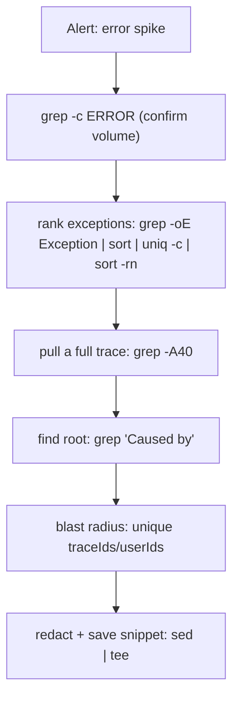

## Structured (JSON) logs

Modern Spring Boot often logs **JSON** (via logback/logstash encoders). Then jq beats grep:

```bash
cat app.json.log | jq 'select(.level=="ERROR")'
cat app.json.log | jq -r 'select(.level=="ERROR") | .message' | sort | uniq -c | sort -rn
cat app.json.log | jq -r 'select(.traceId=="abc123") | "\(.timestamp) \(.message)"'
kubectl logs deploy/svc | jq -r 'select(.level=="ERROR") | .logger' | sort | uniq -c
```

JSON logs are why NDJSON + jq (Part 3) is the modern log-analysis stack — every line is a queryable object.

## Performance considerations

- On multi-GB logs, `grep` (or `rg`) first to shrink the data *before* `awk`/`sort`.
- `zgrep`/`zcat` search compressed logs without decompressing to disk: `zgrep ERROR app.log.gz`.
- Avoid `cat huge.log | grep` when tailing live — use `tail -f | grep --line-buffered`.
- `journalctl` is indexed; prefer its `--since`/`-u` filters over dumping everything and grepping.

## Common mistakes

- Grepping the *current* container in a crash loop instead of `--previous`.
- Forgetting `--line-buffered` on live `tail | grep` (laggy output).
- Treating a JSON log line with plain grep (works, but jq is far better).
- Not redacting secrets before pasting logs into a ticket/Slack.
- Confusing JVM `OutOfMemoryError` (in app log) with a kernel OOM kill (in `dmesg`).

## Interview questions

- *How do you find the most frequent exception in a log?* (`grep -oE Exception | sort | uniq -c | sort -rn`).
- *How do you get logs from a crashed (restarted) pod?* (`kubectl logs --previous`).
- *How do you follow a log through rotation?* (`tail -F`).
- *How do you know if the kernel OOM-killed your JVM?* (`dmesg | grep -i "killed process"`).
- *How do you query systemd logs for one service in a time window?* (`journalctl -u svc --since`).
- *How do you correlate all log lines for one request?* (grep by traceId).

Logs increasingly live inside containers. Let's master Docker's debugging commands.

---

# PART 12 — Docker Commands

## Why Docker matters and the mental model

Your Spring Boot app ships as a **container image** and runs as a **container** — an isolated process with its own filesystem, network namespace, and resource limits, sharing the host kernel. Understanding the CLI is how you build, run, inspect, and *debug into* these containers. The core mental model:

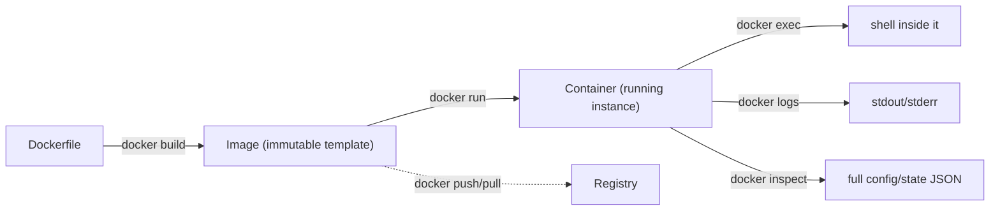

**Image = template; container = a running instance of it.** Everything below is about observing and entering that instance.

## Listing and inspecting

```bash
docker ps                        # running containers
docker ps -a                     # ALL, including stopped/exited (find the crashed one)
docker ps --format 'table {{.Names}}\t{{.Status}}\t{{.Ports}}'   # custom columns
docker images                    # local images
docker images | grep my-service  # find a specific image/tag

docker inspect my-service        # FULL JSON: env, mounts, network, health, restart policy
docker inspect -f '{{.State.Status}}' my-service            # one field via Go template
docker inspect -f '{{.NetworkSettings.IPAddress}}' my-service
docker inspect my-service | jq '.[0].Config.Env'            # env vars via jq
docker inspect my-service | jq '.[0].State'                 # exit code, OOMKilled, error
```

`docker inspect | jq '.[0].State'` reveals *why a container died* — `ExitCode`, `OOMKilled: true`, `Error`. `OOMKilled: true` means the container hit its memory limit — a top cause of Spring Boot container restarts (the JVM heap + metaspace + threads exceeded the container's memory limit).

## Logs

```bash
docker logs my-service           # all stdout/stderr (Spring Boot logs here by default)
docker logs -f my-service        # follow
docker logs --tail 100 my-service
docker logs --since 10m my-service | grep ERROR
docker logs -t my-service        # with timestamps
docker logs my-service 2>&1 | grep Exception   # logs combine both streams
```

A 12-factor Spring Boot app logs to stdout/stderr, so `docker logs` *is* your log file. No need to exec in and `cat` a file.

## Executing commands inside a container (the debugging workhorse)

```bash
docker exec -it my-service bash          # interactive shell inside (or 'sh' for minimal images)
docker exec -it my-service sh            # Alpine/distroless often lack bash
docker exec my-service env               # dump the container's env vars (config debugging)
docker exec my-service cat /app/application.yml    # read a config file
docker exec my-service ls -la /app       # inspect the filesystem
docker exec my-service jps               # is the JVM running? (if JDK tools present)
docker exec -u root -it my-service bash  # exec as root (install tools for debugging)
```

`docker exec -it <c> bash` drops you *inside* the container to poke around: check env vars, read configs, test network (`nc`, `curl`), run JVM diagnostics. **`-it`** = interactive + TTY (needed for a shell). This is how you verify "is the config *actually* what I think inside the container?" — the answer is often "no, an env var overrode it."

> **Minimal/distroless images** (common for Spring Boot) may have no shell at all. Then `docker exec` won't get you a bash prompt — use `docker cp` to pull files out, or a debug sidecar, or `kubectl debug` (Part 13).

## Copying files in/out

```bash
docker cp my-service:/app/logs/app.log ./app.log     # pull a file OUT of the container
docker cp ./patched-config.yml my-service:/app/config/   # push a file IN
docker cp my-service:/tmp/heapdump.hprof ./            # extract a heap dump for analysis
```

`docker cp` is how you retrieve a **heap dump** or **thread dump** generated inside the container for offline analysis (feed the `.hprof` to Eclipse MAT).

## Resource usage: stats and top

```bash
docker stats                     # LIVE CPU/MEM/NET/IO for all containers (like top)
docker stats my-service          # one container
docker stats --no-stream         # one snapshot (scriptable)
docker top my-service            # processes INSIDE the container (like ps)
docker top my-service -eLf       # with threads
```

`docker stats` shows the container's **MEM USAGE / LIMIT** — if usage is pinned at the limit, you're about to get OOM-killed. This is the live view that predicts the `OOMKilled` you'd later find in `docker inspect`.

## Running containers

```bash
# Run a Spring Boot image with config, port mapping, and a memory limit
docker run -d --name my-service \
  -p 8080:8080 \
  -e SPRING_PROFILES_ACTIVE=prod \
  -e SPRING_DATASOURCE_URL=jdbc:postgresql://db:5432/app \
  -m 512m \
  my-service:1.2.0

# -d detached, -p host:container port map, -e env var, -m memory limit, --name friendly name

docker run --rm -it my-service:1.2.0 sh   # throwaway interactive container (--rm auto-removes)
docker restart my-service
docker stop my-service           # SIGTERM then SIGKILL after grace period (graceful)
docker rm -f my-service          # force remove
```

> **JVM + container memory:** always set `-m` (memory limit) *and* ensure the JVM respects it. Modern JDKs are container-aware (`-XX:MaxRAMPercentage=75`) and read the cgroup limit. Without care, the JVM sees the *host's* RAM, sizes a huge heap, and gets OOM-killed. This is the #1 Spring-Boot-in-Docker footgun.

## Volumes and networks (debugging persistence & connectivity)

```bash
docker volume ls                 # list volumes
docker volume inspect my-data    # where is it on the host? mountpoint
docker inspect -f '{{ .Mounts }}' my-service   # what's mounted into the container

docker network ls                # list networks
docker network inspect bridge    # which containers, their IPs, subnet
docker network inspect my-net | jq '.[0].Containers'   # who's on this network

# Can container A reach container B? (network debugging)
docker exec my-service nc -zv postgres 5432
docker exec my-service getent hosts postgres   # does the service name resolve? (Docker DNS)
```

Docker Compose/user-defined networks give containers **DNS by service name** (`postgres`, `keycloak`). If a Spring Boot container can't reach the DB, exec in and test name resolution + port — usually it's a wrong service name, wrong network, or the DB not ready yet.

## docker events — real-time daemon activity

```bash
docker events                    # live stream of container lifecycle events
docker events --filter container=my-service
docker events --filter event=die --since 1h   # what died in the last hour?
```

`docker events` shows restarts, OOM kills, and health-status changes as they happen — useful for catching an intermittent crash-restart cycle.

## docker compose — multi-container orchestration

For local dev of the whole stack (service + Postgres + Keycloak):

```bash
docker compose up -d             # start all services defined in compose.yml
docker compose ps                # status of the stack
docker compose logs -f my-service    # logs for one service
docker compose logs -f            # all services, interleaved
docker compose exec my-service bash  # exec into a compose service
docker compose down              # stop and remove everything
docker compose down -v           # ...including volumes (fresh DB)
docker compose up -d --build     # rebuild images and restart
docker compose restart my-service
```

Compose is the standard way to run a realistic local environment (Spring Boot + PostgreSQL + Keycloak + Kong) with one command. `docker compose logs -f` interleaves all services so you see cross-service interactions.

## Real debugging scenarios

```bash
# 1) Container keeps restarting — why?
docker ps -a                                    # STATUS shows "Restarting" / exit code
docker inspect my-service | jq '.[0].State'     # OOMKilled? ExitCode? Error?
docker logs --tail 100 my-service               # the death message (stack trace / bind error)

# 2) "Config isn't taking effect"
docker exec my-service env | grep SPRING        # what env vars are REALLY set?
docker exec my-service cat /app/application.yml  # what config is REALLY there?

# 3) "Can't connect to the database"
docker exec my-service nc -zv postgres 5432     # port reachable from the app container?
docker network inspect my-net | jq '.[0].Containers'   # are they on the same network?

# 4) Memory issue
docker stats --no-stream my-service             # usage vs limit
docker cp my-service:/tmp/dump.hprof ./         # extract heap dump for MAT
```

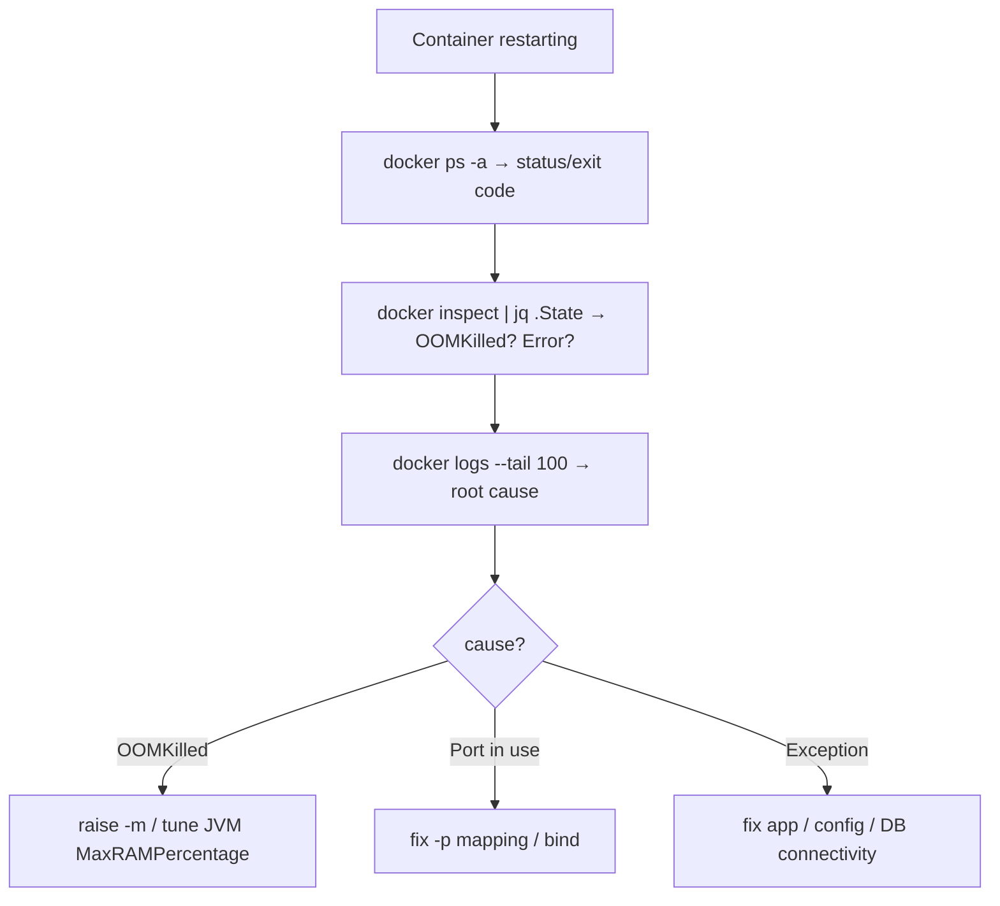

## Performance considerations

- `docker logs` on a long-running container can be huge; use `--tail`/`--since`.
- `docker stats` streams continuously — use `--no-stream` in scripts.
- Prefer small base images (distroless/alpine) for faster pulls, but know they lack debug tools.

## Common mistakes

- Not setting a memory limit, or the JVM ignoring it → OOM kills.
- Exec'ing `bash` into a distroless image (no shell) — use `sh` or `docker cp`.
- Editing files inside a container and expecting persistence — containers are ephemeral; changes vanish on recreate (use volumes/config).
- Confusing image vs container (rebuild the image, but keep running the old container).
- Debugging the wrong container (multiple instances) — check `docker ps` names/IDs.

## Interview questions

- *Difference between an image and a container?* (template vs running instance).
- *How do you see why a container exited?* (`docker inspect | jq .State`, `docker logs`).
- *What does OOMKilled mean and how do you fix it for a JVM?* (hit memory limit; set `-m` + `MaxRAMPercentage`).
- *How do you get a shell inside a running container?* (`docker exec -it c bash/sh`).
- *How do you copy a heap dump out of a container?* (`docker cp`).
- *How do containers on a user-defined network find each other?* (DNS by service name).

Docker runs one host's containers. Kubernetes orchestrates them across a cluster — the production reality.

---

# PART 13 — Kubernetes Commands

## Why kubectl is the production lens

In production, your Spring Boot service runs as **pods** managed by a **Deployment**, exposed via a **Service**, configured by **ConfigMaps/Secrets**, across many nodes. `kubectl` is the single CLI to observe and control all of it. Ninety percent of production debugging is a handful of kubectl verbs: `get`, `describe`, `logs`, `exec`. Master those and you can triage almost anything.

The object hierarchy to keep in mind:

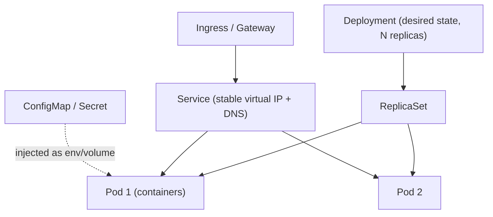

## get — list and query resources

```bash
kubectl get pods                          # pods in the current namespace
kubectl get pods -o wide                  # + node, IP
kubectl get pods -n production            # a specific namespace
kubectl get pods -A                       # ALL namespaces
kubectl get pods -w                       # WATCH (live updates) — watch a rollout
kubectl get pods -l app=my-service        # by label selector
kubectl get pods --field-selector status.phase!=Running   # only non-Running (problems)
kubectl get deploy,svc,pods               # multiple resource types at once
kubectl get pod my-pod -o yaml            # full manifest
kubectl get pod my-pod -o json | jq '.status'   # pipe to jq
kubectl get events --sort-by=.lastTimestamp     # cluster events (why did scheduling fail?)
```

**Reading `kubectl get pods` STATUS is a core skill:**

| STATUS | Meaning | Next step |
|---|---|---|
| `Running` | healthy | check `READY` column (`1/1`?) |
| `CrashLoopBackOff` | container keeps crashing | `logs --previous`, `describe` |
| `ImagePullBackOff` / `ErrImagePull` | can't fetch image | `describe` → wrong tag / registry auth |
| `Pending` | not scheduled | `describe` → no resources / taints |
| `OOMKilled` (in describe) | hit memory limit | raise limit / tune JVM |
| `ContainerCreating` | starting | wait, or `describe` if stuck (volume/secret) |
| `Terminating` (stuck) | won't delete | finalizers / `--force` |

The `READY` column (`0/1` vs `1/1`) reflects **readiness probes** — `0/1 Running` means the container is up but its `/actuator/health/readiness` isn't passing, so it gets no traffic. That distinction (Running but not Ready) confuses many; it usually means the app is still starting or a dependency (DB) is down.

## describe — the detail + events view

```bash
kubectl describe pod my-pod               # events, probes, image, resources, restart reasons
kubectl describe deploy my-service
kubectl describe node worker-1            # node capacity/pressure
```

`kubectl describe pod` is the **single most useful debugging command**. Its **Events** section at the bottom explains *why* a pod is unhealthy: `Failed to pull image`, `Liveness probe failed`, `OOMKilled`, `Insufficient memory`, `Back-off restarting failed container`. Always `describe` before guessing.

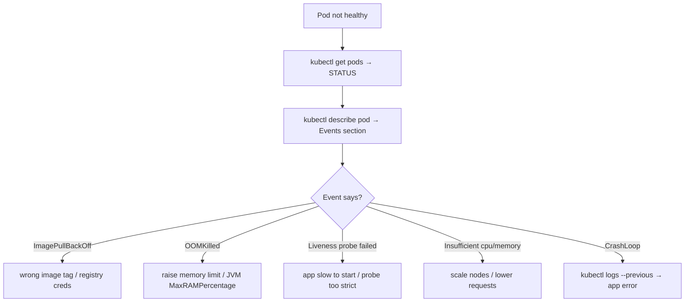

## logs — application output

```bash
kubectl logs my-pod                       # current container logs
kubectl logs my-pod -f                    # follow
kubectl logs my-pod --previous            # CRASHED container's logs (crash loops!)
kubectl logs my-pod -c sidecar            # a specific container in a multi-container pod
kubectl logs deploy/my-service            # logs from a deployment's pod
kubectl logs -l app=my-service --tail=100 --all-containers   # across all matching pods
kubectl logs my-pod --since=15m
kubectl logs my-pod | grep ERROR | tail -50
```

Same as Docker: `--previous` is the key to crash-loop debugging. Combine with grep/jq (Parts 11/3) for real analysis. `kubectl logs deploy/x` is convenient but picks one pod — for all replicas use the label selector.

## exec — run commands inside a pod

```bash
kubectl exec -it my-pod -- bash           # shell inside (note the -- separator)
kubectl exec -it my-pod -- sh             # for minimal images
kubectl exec my-pod -- env | grep SPRING  # check env/config inside the pod
kubectl exec my-pod -- cat /app/config/application.yml
kubectl exec my-pod -- nc -zv postgres 5432    # test DB connectivity FROM the pod
kubectl exec my-pod -- jstack 1           # thread dump of the JVM (PID 1 in the container)
kubectl exec my-pod -- curl -s localhost:8080/actuator/health
```

The `--` separates kubectl flags from the command to run in the pod. `kubectl exec` is how you verify config, test network *from the pod's network namespace* (crucial — the pod sees a different network than your laptop), and run JVM diagnostics. For distroless images without a shell, use **`kubectl debug`**:

```bash
kubectl debug -it my-pod --image=busybox --target=my-container   # ephemeral debug container
```

## cp and port-forward

```bash
kubectl cp my-pod:/tmp/heapdump.hprof ./heapdump.hprof   # extract a heap dump
kubectl cp ./fix.yml my-pod:/app/config/                 # push a file in

# port-forward: tunnel a pod/service port to your laptop (bypass the gateway)
kubectl port-forward pod/my-pod 8080:8080                # localhost:8080 → pod:8080
kubectl port-forward svc/my-service 8080:80
kubectl port-forward svc/postgres 5432:5432              # connect psql/DBeaver to a cluster DB
```

**`kubectl port-forward`** is invaluable: it lets you `curl localhost:8080` directly to a pod, *bypassing* the Ingress/Kong/Service layer — instantly isolating "is it the app or the gateway?" Also lets you point local tools (psql, DBeaver) at an in-cluster database.

## Resource usage: top

```bash
kubectl top nodes                         # CPU/MEM per node
kubectl top pods                          # per pod (needs metrics-server)
kubectl top pods -l app=my-service --sort-by=memory
kubectl top pod my-pod --containers       # per container
```

`kubectl top` reveals which pods are resource-hungry — a Spring Boot pod near its memory limit is an OOM waiting to happen (correlate with `describe` restart counts).

## Deployments: rollout, scale

```bash
kubectl rollout status deploy/my-service          # watch a deploy complete (or hang)
kubectl rollout history deploy/my-service         # revision history
kubectl rollout undo deploy/my-service            # ROLL BACK to previous (incident response!)
kubectl rollout undo deploy/my-service --to-revision=3
kubectl rollout restart deploy/my-service         # restart all pods (pick up new config/secret)

kubectl scale deploy/my-service --replicas=5      # scale out
kubectl scale deploy/my-service --replicas=0      # scale to zero (stop without deleting)
```

**`kubectl rollout undo`** is the fastest incident mitigation when a bad deploy breaks production — revert first, investigate after. `kubectl rollout restart` cycles pods to pick up a changed ConfigMap/Secret (which don't auto-reload).

## Applying and diffing config (GitOps-adjacent)

```bash
kubectl apply -f deployment.yaml          # declaratively apply (create or update)
kubectl apply -f k8s/                      # a whole directory
kubectl diff -f deployment.yaml           # what WOULD change vs the cluster (before applying!)
kubectl delete -f deployment.yaml         # delete what the file defines
kubectl delete pod my-pod                 # delete a pod (Deployment recreates it — a "poke")
```

`kubectl diff` before `apply` is a professional safety habit — see exactly what your change will do to the live cluster. Deleting a managed pod is a safe "restart this one instance" trick (the ReplicaSet recreates it).

## Discovery: explain, api-resources, auth can-i

```bash
kubectl explain pod.spec.containers       # DOCS for any field (schema reference)
kubectl explain deployment.spec.strategy --recursive
kubectl api-resources                     # all resource types + short names + apiVersion
kubectl auth can-i create deployments -n prod   # RBAC check — am I allowed?
kubectl auth can-i '*' '*'                 # am I admin?
```

`kubectl explain` is a built-in manifest reference — no need to browse docs to recall a field. `auth can-i` diagnoses "why is my command forbidden?" (RBAC).

## Context and config (multi-cluster)

```bash
kubectl config get-contexts               # clusters/namespaces you can target
kubectl config current-context            # which cluster am I pointed at?! (avoid prod accidents)
kubectl config use-context staging        # switch clusters
kubectl config set-context --current --namespace=production   # default namespace
```

> **Always check `current-context` before running destructive commands.** Running `kubectl delete` against prod when you thought you were on staging is a classic, painful mistake. Tools like `kubectx`/`kubens` make switching safer and visible.

## Helm and Kustomize (packaging)

Raw manifests don't scale across environments. Two tools manage that:

**Helm** — templated, versioned "charts" (packages) with values per environment:

```bash
helm install my-service ./chart -f values-prod.yaml   # install a release
helm upgrade my-service ./chart -f values-prod.yaml   # upgrade
helm rollback my-service 2                             # roll back to revision 2
helm list                                              # installed releases
helm history my-service                                # revision history
helm template ./chart -f values-prod.yaml             # render manifests locally (debug what it WILL apply)
helm diff upgrade my-service ./chart                  # (plugin) preview changes
```

**Kustomize** — overlay-based (patch a base per environment), built into kubectl:

```bash
kubectl apply -k overlays/production      # apply a kustomize overlay
kubectl kustomize overlays/production      # render to see the result
```

Helm = templating + release lifecycle (install/upgrade/rollback). Kustomize = patch/overlay a base with no templating language. Many shops use both (Helm for third-party charts, Kustomize for their own manifests).

## Real production workflows

```bash
# 1) "My service is returning 503"
kubectl get pods -l app=my-service            # any not Ready/Running?
kubectl describe pod <bad-pod>                # Events: probe failures? OOM?
kubectl logs <bad-pod> --previous | tail -50  # crash cause
kubectl top pod <bad-pod>                     # resource pressure?

# 2) "Is it the app or the gateway?"
kubectl port-forward pod/<pod> 8080:8080
curl -s localhost:8080/actuator/health        # direct-to-pod: works? → gateway issue

# 3) Bad deploy → mitigate then investigate
kubectl rollout undo deploy/my-service
kubectl rollout status deploy/my-service

# 4) Config change not applied
kubectl rollout restart deploy/my-service     # ConfigMaps don't auto-reload

# 5) Verify DB connectivity from the pod
kubectl exec -it <pod> -- nc -zv postgres.default.svc.cluster.local 5432
```

## Common mistakes

- Debugging the *current* crash-looped container instead of `--previous`.
- Forgetting the `--` before the in-pod command in `exec`.
- Running against the wrong context/namespace (check `current-context`!).
- Reading `Running` as healthy while `READY` is `0/1` (readiness failing).
- Editing a live resource with `kubectl edit` and losing the change on the next GitOps sync (edit the source, not the cluster).
- Expecting ConfigMap changes to hot-reload (they don't; restart pods).

## Interview questions

- *CrashLoopBackOff — how do you debug it?* (`describe` events + `logs --previous`).
- *Difference between Running and Ready?* (process up vs readiness probe passing / receiving traffic).
- *How do you test a pod directly, bypassing the gateway?* (`port-forward`).
- *How do you roll back a bad deployment?* (`kubectl rollout undo`).
- *How do you make a Secret/ConfigMap change take effect?* (`rollout restart`).
- *ImagePullBackOff cause?* (wrong tag / missing registry credentials).
- *Helm vs Kustomize?* (templating+releases vs overlay patching).

Many incidents end at the data layer. Time for database CLIs.

---

# PART 14 — Database Command-Line Tools

## Why the DB CLI beats a GUI in production

A GUI (DBeaver, pgAdmin) is lovely for exploration, but in production you're often on a bastion host or inside a pod with no GUI, you need to run a migration script as part of a deploy, dump/restore a database in a pipeline, or check "is the connection even working?" from where the app runs. The database CLIs (`psql`, `mysql`, `sqlcmd`) do all of this scriptably, and connecting from the *same network location* as your Spring Boot app is how you prove whether a "database connection failure" is credentials, network, or the DB itself.

## psql — the PostgreSQL client

`psql` is an exceptionally capable client. Connection first:

```bash
# Connection parameters
psql -h localhost -p 5432 -U appuser -d appdb        # host, port, user, database
psql "postgresql://appuser:pw@db.prod:5432/appdb"    # connection URI
PGPASSWORD=pw psql -h db -U appuser -d appdb          # password via env (scripting)

# From inside a pod (test the app's actual DB connectivity)
kubectl exec -it my-pod -- psql "$SPRING_DATASOURCE_URL"
```

### Meta-commands (the backslash commands)

psql's `\` commands are its superpower — schema introspection without SQL:

```
\l              list databases
\c appdb        connect to a database
\dt             list tables
\dt+            tables with sizes
\d users        describe the 'users' table (columns, types, indexes, constraints)
\di             list indexes
\dn             list schemas
\du             list roles/users
\df             list functions
\x              toggle EXPANDED display (rows as key:value — great for wide tables)
\timing         toggle query timing (how slow is this query?)
\e              open the last query in an editor
\i script.sql   run a SQL file
\copy ...       client-side CSV import/export
\q              quit
\?              help on meta-commands
\h SELECT       SQL syntax help
```

`\d table` and `\x` are the two you'll use constantly — inspecting a table's structure and reading wide rows vertically.

### Running queries and scripts

```bash
# One-off query from the shell (-c), no interactive session
psql -h db -U appuser -d appdb -c "SELECT count(*) FROM orders WHERE status='PENDING';"

# Run a migration/DDL script (-f)
psql -h db -U appuser -d appdb -f migration_V2.sql

# Quiet, tuples-only, unaligned → clean output for pipelines
psql -h db -U appuser -d appdb -tAc "SELECT email FROM users WHERE active" | sort

# Export a query to CSV
psql -h db -U appuser -d appdb -c "\copy (SELECT * FROM orders) TO 'orders.csv' CSV HEADER"
```

`-t` (tuples only, no headers), `-A` (unaligned), `-c` (command) combine to produce pipe-friendly output you can feed to grep/awk/jq.

### Production diagnostics with psql

These queries are your DB incident toolkit:

```sql
-- Who's connected and what are they running? (find the blocker)
SELECT pid, usename, state, query_start, left(query,60) FROM pg_stat_activity
 WHERE state != 'idle' ORDER BY query_start;

-- Long-running queries (> 30s) — the usual cause of slowness / pool exhaustion
SELECT pid, now()-query_start AS duration, left(query,80) FROM pg_stat_activity
 WHERE state='active' AND now()-query_start > interval '30 seconds' ORDER BY duration DESC;

-- Blocking locks (deadlock / stuck transaction hunting)
SELECT blocked.pid AS blocked, blocking.pid AS blocking, left(blocked.query,50)
 FROM pg_stat_activity blocked
 JOIN pg_stat_activity blocking ON blocking.pid = ANY(pg_blocking_pids(blocked.pid));

-- Connection count vs max (HikariCP pool exhaustion? too many connections?)
SELECT count(*), (SELECT setting FROM pg_settings WHERE name='max_connections') FROM pg_stat_activity;

-- Table sizes (what's growing?)
SELECT relname, pg_size_pretty(pg_total_relation_size(relid)) FROM pg_catalog.pg_statio_user_tables
 ORDER BY pg_total_relation_size(relid) DESC LIMIT 10;

-- Kill a runaway query (get pid from pg_stat_activity above)
SELECT pg_cancel_backend(12345);     -- polite
SELECT pg_terminate_backend(12345);  -- forceful
```

`pg_stat_activity` is the DB equivalent of `top` — it shows what every connection is doing. When a Spring Boot app's HikariCP pool is exhausted or requests hang, this reveals the culprit query holding connections.

## PostgreSQL utility commands

```bash
createdb -h db -U admin newapp                     # create a database
dropdb -h db -U admin oldapp                        # drop a database
createuser -h db -U admin --pwprompt appuser        # create a role
vacuumdb -h db -U admin -z appdb                    # VACUUM ANALYZE (reclaim space, update stats)
reindexdb -h db -U admin -d appdb                   # rebuild indexes (bloat/corruption)

# Backup and restore (the critical ones)
pg_dump -h db -U appuser -d appdb > backup.sql            # plain SQL dump
pg_dump -h db -U appuser -Fc -d appdb > backup.dump       # custom format (compressed, parallel restore)
pg_dump -h db -U appuser -t orders -d appdb > orders.sql  # single table
psql -h db -U appuser -d appdb < backup.sql               # restore a plain dump
pg_restore -h db -U appuser -d appdb backup.dump          # restore a custom-format dump
pg_restore -h db -U appuser -d appdb -j4 backup.dump      # parallel restore (4 jobs)
```

`pg_dump -Fc` (custom format) is preferred for real backups: compressed, and `pg_restore` can restore selectively and in parallel. `pg_dump | psql` across hosts clones a database. **`vacuumdb`** matters because Postgres accumulates dead tuples (from updates/deletes) that bloat tables until vacuumed — a common cause of gradually degrading query performance.

## mysql — the MySQL/MariaDB client

Same shape, different meta-commands:

```bash
mysql -h db -P 3306 -u appuser -p appdb            # -p prompts for password
mysql -h db -u appuser -ppassword -e "SELECT count(*) FROM orders;"   # one-shot (-e)
mysql -h db -u appuser -p appdb < migration.sql    # run a script

# Inside the mysql prompt:
#   SHOW DATABASES;
#   USE appdb;
#   SHOW TABLES;
#   DESCRIBE users;          -- table structure
#   SHOW PROCESSLIST;        -- like pg_stat_activity: active connections/queries
#   SHOW ENGINE INNODB STATUS\G   -- lock/deadlock info
#   \G  at end of a query → vertical output (like psql \x)

# Backup/restore
mysqldump -h db -u appuser -p appdb > backup.sql
mysqldump -h db -u appuser -p --single-transaction appdb > backup.sql   # consistent, non-locking
mysql -h db -u appuser -p appdb < backup.sql
```

`SHOW PROCESSLIST` is MySQL's `pg_stat_activity`; `mysqldump --single-transaction` gives a consistent backup of InnoDB without locking writes.

## sqlcmd — SQL Server client

```bash
sqlcmd -S server -U sa -P password -d appdb        # connect
sqlcmd -S server -U sa -P pw -Q "SELECT COUNT(*) FROM Orders;"   # one query (-Q exits after)
sqlcmd -S server -U sa -P pw -i script.sql          # run a script
sqlcmd -S server -U sa -P pw -d appdb -o out.txt -Q "..."   # output to file

# Inside sqlcmd, batches end with GO:
#   SELECT name FROM sys.databases;
#   GO
#   sp_who2;      -- active sessions (like processlist)
#   GO
```

## Comparison of the three

| Concept | psql (Postgres) | mysql | sqlcmd (SQL Server) |
|---|---|---|---|
| One-shot query | `-c "SQL"` | `-e "SQL"` | `-Q "SQL"` |
| Run a file | `-f file` / `\i` | `< file` | `-i file` |
| List tables | `\dt` | `SHOW TABLES;` | `SELECT * FROM sys.tables` |
| Describe table | `\d t` | `DESCRIBE t;` | `sp_help 't'` |
| Active sessions | `pg_stat_activity` | `SHOW PROCESSLIST` | `sp_who2` |
| Vertical output | `\x` | `\G` | `-Y` / `:XML` |
| Backup | `pg_dump` | `mysqldump` | `BACKUP DATABASE` |

## Real Spring Boot + DB scenarios

```bash
# 1) "Application can't connect to the database"
#    Test from the SAME place the app runs:
kubectl exec -it my-pod -- psql "$SPRING_DATASOURCE_URL" -c "SELECT 1;"
#    → auth error = bad creds; timeout = network/firewall; "database does not exist" = wrong db name

# 2) "Requests hang / HikariCP pool exhausted"
psql -h db -U appuser -d appdb -c \
  "SELECT count(*), state FROM pg_stat_activity GROUP BY state;"
#    Many 'idle in transaction' = the app leaks transactions (didn't commit/close) → the classic culprit

# 3) Verify a migration ran
psql -h db -U appuser -d appdb -c "SELECT * FROM flyway_schema_history ORDER BY installed_on DESC LIMIT 5;"

# 4) Quick data check during an incident
psql -h db -U appuser -d appdb -tAc "SELECT count(*) FROM orders WHERE created_at > now() - interval '1 hour';"
```

`idle in transaction` connections are a frequent Spring Boot bug signature — a transaction opened but never committed/rolled back (often a `@Transactional` method doing a slow external call, or a leaked connection) — visible instantly in `pg_stat_activity`.

## Performance considerations

- `-tA` / one-shot mode avoids the interactive overhead for scripted queries.
- `pg_dump -Fc -j` and `pg_restore -j` parallelize large backups/restores.
- `mysqldump --single-transaction` avoids locking; plain dumps lock tables.
- Run big analytical queries against a replica, not the primary, in production.

## Common mistakes

- Putting passwords in the command line (visible in `ps`/history) — use `PGPASSWORD`/`~/.pgpass` or prompt.
- Restoring a `-Fc` dump with `psql` (use `pg_restore`) — format mismatch.
- Running `pg_terminate_backend` on the wrong pid.
- Testing DB connectivity from your laptop when the app runs in the cluster (different network).
- Forgetting `--single-transaction` on mysqldump of a live DB (inconsistent backup + locking).

## Interview questions

- *How do you see active queries/connections in Postgres?* (`pg_stat_activity`).
- *What does "idle in transaction" indicate for a Spring Boot app?* (leaked/uncommitted transaction).
- *psql `-c` vs `-f`?* (inline command vs run a file).
- *Difference between `pg_dump` plain and custom format?* (SQL text vs compressed, selective/parallel restore).
- *How do you kill a runaway query?* (`pg_terminate_backend`/`pg_cancel_backend`).
- *How would you test the app's DB connectivity from inside its pod?* (`kubectl exec ... psql "$SPRING_DATASOURCE_URL"`).

Code that reaches production came through Git. Let's master the Git CLI.

---

# PART 15 — Git Command Line

## Why the CLI over the GUI for Git

Git GUIs are fine for viewing history, but the CLI is where you gain *true understanding and control*. GUIs hide what's happening (the difference between merge and rebase, what reset actually moves); the CLI makes it explicit. More importantly, the CLI is the only option in CI, on servers, and for the advanced recovery operations (`reflog`, `bisect`, `cherry-pick`) that save you in a crisis. Understanding Git's model — commits form a DAG, branches are just pointers, HEAD is where you are — makes every command sensible.

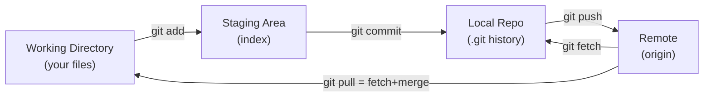

## The everyday cycle

```bash
git status                    # what's changed, staged, branch state — run this constantly
git add file.java             # stage a specific file
git add -p                    # stage HUNK BY HUNK (review each change — pro habit)
git add .                     # stage everything (careful — includes new files)
git commit -m "Fix payment rounding"          # commit staged changes
git commit -am "msg"          # stage tracked changes AND commit (skips new files)
git diff                      # unstaged changes (working vs index)
git diff --staged             # staged changes (index vs last commit)
git diff main feature         # difference between branches
git log --oneline --graph --all   # visual history DAG
git log -p file.java          # history WITH diffs for one file
git show HEAD                  # the last commit's changes
git show abc123:src/App.java   # a file AS IT WAS in a specific commit
```

`git add -p` (patch mode) is a senior habit — it forces you to review each hunk before staging, catching stray debug code. `git status` and `git log --oneline --graph` are your orientation commands.

## Working with remotes

```bash
git clone https://github.com/org/service.git
git fetch origin              # download remote changes but DON'T merge (safe — inspect first)
git pull                      # fetch + merge into current branch (can create merge commits)
git pull --rebase             # fetch + REBASE (linear history, no merge commit — preferred by many)
git push                      # upload commits
git push -u origin feature-x  # push and set upstream tracking (first push of a branch)
git push --force-with-lease   # force push SAFELY (fails if someone else pushed — unlike --force)
git remote -v                 # list remotes
```

> **`git fetch` vs `git pull`:** `fetch` just downloads (safe, non-destructive — you can inspect `origin/main` before merging); `pull` downloads *and* integrates immediately. Seniors often `fetch` then look before merging, especially on shared branches. And **prefer `--force-with-lease` over `--force`** — it refuses to clobber commits you haven't seen, preventing you from overwriting a teammate's work.

## Branches: branch, switch, checkout

```bash
git branch                    # list local branches (* = current)
git branch -a                 # include remote branches
git switch feature-x          # switch to a branch (modern, clearer than checkout)
git switch -c feature-y       # create AND switch (like checkout -b)
git checkout feature-x        # older, overloaded command (switches branches OR restores files)
git branch -d feature-x       # delete a merged branch
git branch -D feature-x       # force-delete (unmerged)
git branch -m old new         # rename
```

Modern Git split the overloaded `checkout` into **`switch`** (change branches) and **`restore`** (restore files) for clarity. Use them; reserve `checkout` for when you need its legacy behaviors.

## Integrating changes: merge vs rebase

Both combine branches, but differently — and this is the most-asked Git interview topic:

```bash
git merge feature-x           # create a MERGE COMMIT joining the histories (preserves branch shape)
git rebase main               # REPLAY your commits on top of main (linear history, rewrites SHAs)
git rebase -i HEAD~3          # INTERACTIVE rebase: squash/reorder/edit the last 3 commits
```

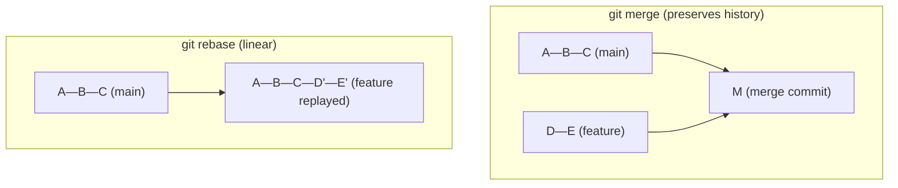

- **Merge** — non-destructive, keeps the true history (with a merge commit). Good for shared/long-lived branches.
- **Rebase** — rewrites your commits onto a new base for a clean, linear history. Good for tidying *your local* feature branch before merging. **Golden rule: never rebase commits that others have already pulled** (shared/public branches) — it rewrites SHAs and breaks their history.
- **Interactive rebase** (`-i`) lets you squash "WIP" commits into one clean commit before a PR — a professional courtesy.

## Undoing things: reset, restore, revert

These three "undo" commands do very different things — confusing them causes lost work:

```bash
# restore — discard changes in the WORKING directory / unstage
git restore file.java             # discard unstaged changes to a file
git restore --staged file.java    # unstage (keep the changes in working dir)

# reset — move the branch pointer (and optionally staging/working)
git reset --soft HEAD~1           # undo last commit, KEEP changes staged
git reset --mixed HEAD~1          # undo last commit, keep changes UNstaged (default)
git reset --hard HEAD~1           # undo last commit, DISCARD changes (DANGEROUS — data loss)
git reset --hard origin/main      # nuke local commits, match remote (careful)

# revert — create a NEW commit that undoes a previous one (safe for shared history)
git revert abc123                 # inverse-commit; doesn't rewrite history
```

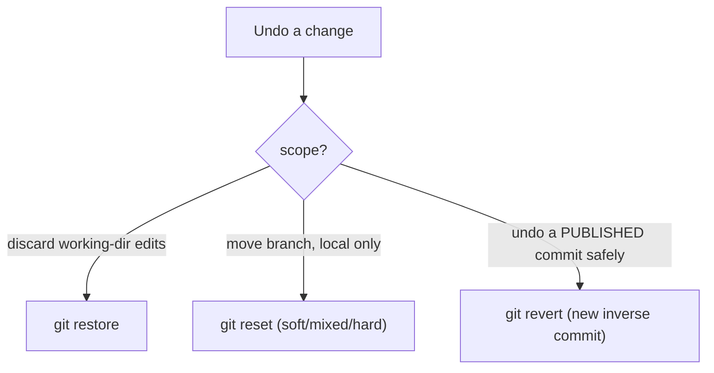

> **`reset` rewrites history (local); `revert` adds history (safe to share).** On a shared branch, use `revert` — `reset --hard` there means discarding commits others may have. And `reset --hard` is the second-most-dangerous command in this guide (after `rm -rf`) — it silently discards uncommitted work.

## Stashing: shelve work-in-progress

```bash
git stash                     # shelve uncommitted changes, clean working dir
git stash push -m "wip auth"  # named stash
git stash list                # list stashes
git stash pop                 # re-apply the latest stash AND remove it
git stash apply               # re-apply but KEEP it in the stash list
git stash drop                # delete a stash
git stash -u                  # include untracked files
```

`git stash` is for "I need to switch branches / pull, but I'm mid-change and not ready to commit." Shelve, do the other thing, `pop` to resume.

## Surgical tools: cherry-pick, reflog, bisect, blame

```bash
# cherry-pick — apply a specific commit from another branch (e.g. a hotfix)
git cherry-pick abc123        # apply that single commit onto the current branch
git cherry-pick abc123..def456   # a range

# reflog — the safety net: a log of everywhere HEAD has been (recover "lost" commits!)
git reflog                    # see every HEAD movement, including after a bad reset
git reset --hard HEAD@{2}     # jump back to a previous state → UNDO a bad reset/rebase

# bisect — binary-search history to find the commit that introduced a bug
git bisect start
git bisect bad                # current commit is broken
git bisect good v1.2.0        # this old tag worked
#   git checks out the midpoint; you test, then:
git bisect good  # or  git bisect bad     # repeat until it pinpoints the culprit commit
git bisect reset              # finish

# blame — who last changed each line (and in which commit)?
git blame src/OrderService.java
git blame -L 40,60 src/OrderService.java   # only lines 40–60
```

Two lifesavers to internalize:
- **`git reflog`** is the ultimate undo — even after a `reset --hard` or a botched rebase, the old commits are still referenced in the reflog for ~90 days. You can *always* get back. This alone removes the fear of experimenting.
- **`git bisect`** turns "which of 300 commits broke this?" into ~8 tests via binary search — invaluable for regressions where you know a good and a bad point.

## Tags and worktrees

```bash
git tag v1.2.0                        # lightweight tag
git tag -a v1.2.0 -m "Release 1.2.0"  # annotated tag (recommended for releases)
git push origin v1.2.0                # push a tag (CI often builds/deploys on tags)
git tag -l "v1.*"                     # list matching tags

# worktree — check out multiple branches into separate directories SIMULTANEOUSLY
git worktree add ../hotfix hotfix-branch   # work on a hotfix without stashing your feature
git worktree list
git worktree remove ../hotfix
```

`git worktree` is underused gold: it lets you have `main` and a `hotfix` branch checked out in two directories at once — fix a production bug without disturbing your in-progress feature (no stashing, no context loss).

## Real backend scenarios

```bash
# 1) Production hotfix while mid-feature
git worktree add ../hotfix -b hotfix/payment origin/main
# ...fix, commit, push, PR from ../hotfix; your feature branch untouched

# 2) "Who introduced this bug and when?"
git log --oneline -S "buggyMethod" -- src/     # commits that added/removed that string
git blame src/File.java                         # line-level authorship
git bisect ...                                  # pinpoint the breaking commit

# 3) Accidentally reset --hard and lost commits
git reflog                                      # find the lost commit's SHA
git reset --hard <sha>                          # restore

# 4) Bring one bugfix commit from develop into release
git cherry-pick <fix-sha>

# 5) Clean up messy commits before a PR
git rebase -i origin/main                       # squash "wip" commits into meaningful ones
```

## Comparison / when to use each

- **merge** vs **rebase**: preserve history & shared branches → merge; clean linear local history → rebase.
- **reset** vs **revert**: local undo → reset; undo published commit → revert.
- **switch/restore** vs **checkout**: prefer the explicit new commands.
- **stash** vs **worktree**: quick shelve → stash; parallel branches → worktree.

## Common mistakes

- `reset --hard` on shared branches / losing uncommitted work (forgetting reflog can save committed work, but *uncommitted* is gone).
- Rebasing a shared branch → rewrites others' history.
- `git push --force` (use `--force-with-lease`).
- `git add .` committing secrets/build artifacts (use `.gitignore`, `git add -p`).
- Confusing `fetch` (safe) with `pull` (integrates immediately).

## Interview questions

- *merge vs rebase — when each?* (preserve vs linearize; never rebase shared history).
- *reset vs revert?* (rewrite history vs new inverse commit).
- *How do you recover a commit after a bad `reset --hard`?* (`git reflog`).
- *What does `git bisect` do?* (binary-search for the breaking commit).
- *fetch vs pull?* (download vs download+merge).
- *`--force` vs `--force-with-lease`?* (blind overwrite vs safe, aborts if remote moved).
- *How do you apply one commit from another branch?* (`cherry-pick`).

Code becomes a runnable artifact through build tools. Maven and Gradle next.

---

# PART 16 — Build Tools (Maven & Gradle)

## Why build tools exist

A Java project is source files + hundreds of transitive dependencies + a compile/test/package process + configuration for multiple environments. Doing this by hand (`javac` with a giant classpath) is unthinkable at scale. **Maven** and **Gradle** automate the whole lifecycle: resolve dependencies, compile, run tests, package a runnable JAR, and produce reproducible builds — the same way locally and in CI. For a Spring Boot developer, the build tool is how you turn source into the `app.jar` that becomes a container image.

## The Maven build lifecycle (the mental model)

Maven is built around a fixed, ordered **lifecycle** of phases. Running a phase runs *all phases before it*. This ordering is the key intuition:

```mermaid
flowchart LR
    A["validate"] --> B["compile"] --> C["test"] --> D["package"] --> E["verify"] --> F["install"] --> G["deploy"]
```

- **compile** — compile `src/main/java`.
- **test** — run unit tests (`src/test/java`) with a test-scoped classpath.
- **package** — bundle into a JAR/WAR (for Spring Boot, a runnable fat JAR).
- **install** — copy the artifact to your **local** repo (`~/.m2`) so other local projects can use it.
- **deploy** — upload to a **remote** repo (Nexus/Artifactory).

Because phases are cumulative, `mvn package` implicitly runs validate→compile→test→package.

```bash
mvn clean                    # delete target/ (start fresh)
mvn compile                  # compile main sources
mvn test                     # compile + run unit tests
mvn package                  # + build the JAR (runs tests first)
mvn verify                   # + run integration tests / checks
mvn install                  # + install to ~/.m2
mvn clean package            # the everyday full rebuild
mvn clean install -DskipTests    # build+install, skip tests (fast local iteration)
mvn package -DskipTests -o       # -o = offline (use cached deps, no network)
```

`clean package` is the canonical "build me a fresh JAR." `-DskipTests` (compiles but skips *running* tests) vs `-Dmaven.test.skip=true` (skips compiling *and* running) — know the difference.

## Running a Spring Boot app with Maven

```bash
mvn spring-boot:run                                    # run the app directly (dev)
mvn spring-boot:run -Dspring-boot.run.profiles=dev      # with a profile
mvn spring-boot:run -Dspring-boot.run.arguments="--server.port=9090"
mvn spring-boot:run -Dspring-boot.run.jvmArguments="-Xmx512m -Xdebug"
java -jar target/app-1.0.0.jar --spring.profiles.active=prod   # run the packaged JAR
```

`spring-boot:run` is the goal from the Spring Boot Maven plugin — it compiles and launches the app in one step for local development, with hot-ish reload if devtools is present.

## Dependency management — the debugging superpower

Dependency conflicts ("NoSuchMethodError", "ClassNotFoundException", wrong library version) are among the most confusing Java problems. The build tool tells you exactly what's on the classpath:

```bash
mvn dependency:tree                          # the FULL transitive dependency tree
mvn dependency:tree -Dincludes=com.fasterxml.jackson   # filter to one group (find version conflicts)
mvn dependency:tree | grep -i conflict       # spot mediated/conflicting versions
mvn dependency:analyze                       # find used-but-undeclared & declared-but-unused deps
mvn dependency:resolve                       # download all deps
mvn help:effective-pom                       # the FULLY resolved POM (after inheritance/BOMs)
```

**`mvn dependency:tree`** is the tool for "which version of X is *actually* being used and who pulled it in?" When two libraries demand different versions of Jackson/Guava/Netty, the tree shows the transitive path and Maven's chosen (mediated) version. This is how you diagnose the classic Spring Boot `NoSuchMethodError` caused by a version clash.

```mermaid
flowchart TD
    A["NoSuchMethodError / ClassNotFoundException at runtime"] --> B["mvn dependency:tree -Dincludes=<lib>"]
    B --> C["Find conflicting versions + who brought them"]
    C --> D["Exclude the bad transitive dep, or pin via dependencyManagement/BOM"]
```

## Profiles and properties

```bash
mvn package -Pproduction          # activate the 'production' Maven profile
mvn package -Pintegration-tests   # a profile that enables IT execution
mvn versions:set -DnewVersion=1.3.0    # bump the project version
```

(Note: Maven *profiles* configure the build; Spring *profiles* configure the app at runtime — different things with the same word.)

## The wrapper — reproducible builds

```bash
./mvnw clean package          # Maven Wrapper: uses the project-pinned Maven version
./mvnw --version              # shows the wrapper-managed version
```

The **wrapper** (`mvnw`/`gradlew`, committed to the repo) pins the exact build-tool version so everyone — and CI — builds identically, with no "works on my machine" from version drift. **Always use `./mvnw`/`./gradlew`** in projects that have them.

## Gradle — the alternative

Gradle uses a task graph (not a fixed lifecycle) and is faster for large builds (incremental builds, build cache, daemon). Same *concepts*, different commands:

```bash
./gradlew build              # compile + test + assemble (the full build)
./gradlew assemble           # build without running tests
./gradlew test               # run tests
./gradlew clean              # delete build/
./gradlew bootRun            # run the Spring Boot app (like mvn spring-boot:run)
./gradlew bootJar            # build the runnable fat JAR
./gradlew dependencies       # the dependency tree
./gradlew dependencies --configuration runtimeClasspath   # runtime deps only
./gradlew dependencyInsight --dependency jackson-databind  # why is this version here?
./gradlew tasks              # list all available tasks
./gradlew build -x test      # build but EXCLUDE the test task (-x)
./gradlew build --scan       # generate a shareable build report
```

`./gradlew dependencyInsight --dependency X` is Gradle's answer to Maven's `dependency:tree` filter — it explains *why* a particular version was selected. `-x test` excludes a task (Gradle's `-DskipTests`).

## Maven vs Gradle

| | Maven | Gradle |
|---|---|---|
| Config | XML (`pom.xml`), declarative | Groovy/Kotlin DSL, programmable |
| Model | fixed lifecycle/phases | flexible task graph |
| Speed | slower | faster (incremental, cache, daemon) |
| Learning curve | simpler, predictable | steeper, more powerful |
| Dependency insight | `dependency:tree` | `dependencyInsight` |
| Run Spring Boot | `spring-boot:run` | `bootRun` |
| Build JAR | `package` | `bootJar` |

Both are ubiquitous; know both. Maven's rigidity is predictable; Gradle's flexibility and speed win on large codebases.

## CI/pipeline usage

```bash
# Typical CI build step
./mvnw -B clean verify                        # -B = batch mode (no color, CI-friendly)
./mvnw -B clean package -DskipTests           # if tests run in a separate stage
./gradlew build --no-daemon                    # CI: no daemon (clean process each run)

# Then containerize
docker build -t registry/my-service:$GIT_SHA .
```

`-B` (batch) and `--no-daemon` produce clean, deterministic CI output.

## Real scenarios

```bash
# 1) Runtime version conflict
mvn dependency:tree -Dincludes=io.netty
#    → two netty versions; exclude the older transitive one in the pom

# 2) Build works locally, fails in CI
./mvnw -o clean package        # reproduce with offline/cached deps; check the wrapper version matches

# 3) Slow build
./gradlew build --scan         # find the slow tasks
mvn -T 1C clean package        # parallel build (1 thread per core)

# 4) "Which deps are unused / missing?"
mvn dependency:analyze
```

## Performance considerations

- Maven parallel builds: `mvn -T 1C` (one thread per core).
- Gradle: keep the daemon on locally (fast), off in CI (clean).
- Use the build cache / `~/.m2` cache; `-o` (offline) skips network when deps are cached.
- `-DskipTests` for fast local packaging, but *never* skip tests in the pipeline that gates production.

## Common mistakes

- Not using the wrapper → version drift between devs/CI.
- `mvn clean` on every trivial build (wastes time; only clean when needed).
- Confusing Maven profiles with Spring profiles.
- `skipTests` leaking into the pipeline that should gate releases.
- Ignoring `dependency:tree` and guessing at version conflicts.

## Interview questions

- *What does `mvn install` do vs `package`?* (install adds copy to `~/.m2`).
- *How do you diagnose a dependency version conflict?* (`dependency:tree` / `dependencyInsight`).
- *Why use the Maven/Gradle wrapper?* (reproducible, pinned build-tool version).
- *`-DskipTests` vs `-Dmaven.test.skip`?* (skip running vs skip compiling+running).
- *Maven lifecycle order?* (validate→compile→test→package→verify→install→deploy).
- *Maven vs Gradle trade-offs?* (predictable XML lifecycle vs fast programmable task graph).

The JAR runs on a JVM. When *that* misbehaves in production, the JDK's own CLI tools are your instruments.

---

# PART 17 — Java Command-Line Tools

## Why these ship with the JDK

The JDK includes a suite of diagnostic CLIs (`jps`, `jstack`, `jmap`, `jcmd`, `jstat`, ...) that peer *inside* a running JVM — its threads, heap, GC, and flags — without a profiler or debugger attached. For a backend engineer, these are the difference between "the service is slow/leaking and I have no idea why" and a precise diagnosis. They work over `docker exec`/`kubectl exec` too (if the image has the JDK, not just the JRE). Master `jcmd`, `jstack`, and `jmap` and you can diagnose most production JVM incidents.

## Running and building: java, javac, jar

```bash
java -jar app.jar                                   # run a Spring Boot fat JAR
java -jar app.jar --spring.profiles.active=prod      # pass Spring args
java -Xmx512m -XX:MaxRAMPercentage=75 -jar app.jar   # heap sizing (container-aware)
java -XX:+HeapDumpOnOutOfMemoryError -XX:HeapDumpPath=/tmp -jar app.jar   # auto heap dump on OOM
java --version
javac -d out src/**/*.java                           # compile (build tools usually do this)
jar tf app.jar                                       # LIST contents of a JAR
jar xf app.jar                                       # extract
jar tf app.jar | grep application.yml                # is the config actually packaged?
```

Two production-critical JVM flags: **`-XX:MaxRAMPercentage`** (size the heap as a % of the *container* memory — modern, cgroup-aware) and **`-XX:+HeapDumpOnOutOfMemoryError`** (capture a heap dump automatically when an OOM happens, so you can analyze the cause *after* the crash). `jar tf | grep` answers "did my config/resource actually make it into the JAR?"

## jps — list JVMs

```bash
jps                          # list Java processes with their main class/jar
jps -l                       # full package/jar names
jps -lvm                     # + JVM args + main args (see the actual flags in effect)
```

`jps` is `ps` for JVMs — it gives you the PID you'll feed to the other tools. `jps -lvm` shows the exact heap/GC flags a running app was started with (great for "is `MaxRAMPercentage` actually set?").

## jstack — thread dumps (the #1 hang/CPU tool)

`jstack` prints every thread's stack — a **thread dump**. It's the primary tool for **hung requests**, **deadlocks**, and (with `top -H`) **high CPU**.

```bash
jstack <pid>                      # full thread dump
jstack <pid> > dump1.txt          # save it (take 3, seconds apart, to see what's STUCK vs moving)
jstack -l <pid>                   # + lock/ownership info (deadlock detection)

# Find threads blocked/waiting (pool exhaustion signature)
jstack <pid> | grep -A1 'BLOCKED' | head
jstack <pid> | grep 'java.lang.Thread.State' | sort | uniq -c   # thread state histogram
```

**High-CPU workflow** (tying together Part 9): `top -H -p <pid>` → note the hot thread's TID → `printf '%x' <TID>` → find `nid=0x<hex>` in the dump:

```bash
jstack <pid> | grep -A 30 'nid=0x1a2b'    # the exact Java stack burning CPU
```

**Hang/deadlock workflow:** take *three* dumps a few seconds apart. Threads stuck on the *same* stack across all three are truly blocked (find what they're waiting on). `jstack -l` explicitly reports detected deadlocks ("Found one Java-level deadlock").

A classic Spring Boot signature: 200 `http-nio-8080-exec-*` threads all `BLOCKED`/`WAITING` on a DB connection or lock = Tomcat worker-pool exhaustion from a slow downstream (correlate with `pg_stat_activity`, Part 14).

```mermaid
flowchart TD
    A["Requests hang / high CPU"] --> B{which?}
    B -->|high CPU| C["top -H -p PID → TID → hex"]
    C --> D["jstack PID | grep nid=0x<hex> → hot stack"]
    B -->|hang| E["jstack PID x3 over ~5s"]
    E --> F["threads stuck on SAME stack = blocked"]
    F --> G["jstack -l → deadlock? what lock/resource?"]
```

## jmap — heap analysis (the memory-leak tool)

`jmap` inspects the heap and captures **heap dumps** for leak analysis.

```bash
jmap -histo <pid>                       # histogram: instance count + bytes per class
jmap -histo:live <pid> | head -30       # only live objects (forces GC first) — top memory users
jmap -dump:live,format=b,file=/tmp/heap.hprof <pid>   # full heap dump for Eclipse MAT / VisualVM
jmap -clstats <pid>                     # class loader stats
```

`jmap -histo:live | head` instantly shows the top memory-consuming classes — if you see millions of a domain object or `char[]`/`byte[]`, that's your leak lead. For a real leak hunt, `jmap -dump` a `.hprof`, `docker cp`/`kubectl cp` it out (Parts 12/13), and open it in **Eclipse MAT** to find the retention path (what's holding the objects alive). This is the definitive memory-leak investigation.

> **Caution:** `jmap -dump` and `-histo:live` trigger a full GC and *pause the app* (stop-the-world) — a big heap dump can freeze the JVM for seconds. Prefer taking dumps on an unhealthy/soon-to-restart instance, or rely on `-XX:+HeapDumpOnOutOfMemoryError` which captures at the moment of OOM automatically.

## jcmd — the unified swiss-army tool (preferred)

`jcmd` is the modern, recommended front-end that consolidates most of the others — one tool, many commands:

```bash
jcmd                                         # list JVMs (like jps)
jcmd <pid> help                              # all available commands for this JVM
jcmd <pid> Thread.print                      # thread dump (like jstack)
jcmd <pid> GC.heap_info                      # heap usage summary
jcmd <pid> GC.class_histogram                # class histogram (like jmap -histo)
jcmd <pid> GC.heap_dump /tmp/heap.hprof      # heap dump (like jmap -dump)
jcmd <pid> GC.run                            # trigger a GC
jcmd <pid> VM.flags                          # all effective JVM flags
jcmd <pid> VM.system_properties              # system properties
jcmd <pid> VM.uptime                         # uptime
jcmd <pid> VM.native_memory summary          # native memory tracking (if enabled)
jcmd <pid> JFR.start duration=60s filename=/tmp/rec.jfr   # Java Flight Recorder!
jcmd <pid> JFR.dump filename=/tmp/rec.jfr
```

**Prefer `jcmd` over the individual tools** — it's the actively-developed, unified interface, and it unlocks **Java Flight Recorder (JFR)**: low-overhead continuous profiling you can start on a live production JVM, capturing CPU, allocation, locks, and GC into a `.jfr` file you open in JDK Mission Control. JFR is the modern way to profile production without a heavyweight agent.

## jstat — GC and memory statistics over time

```bash
jstat -gc <pid> 1000                    # GC stats every 1000ms (survivor/eden/old, GC counts/times)
jstat -gcutil <pid> 1000 10             # utilization %, 10 samples
jstat -gccause <pid> 1000               # + the cause of the last GC
```

`jstat -gcutil <pid> 1000` is a live GC dashboard: watch the **O** (old gen %) and **FGC** (full GC count). If old-gen stays near 100% and full GCs keep firing without reclaiming, you have a **memory leak or undersized heap** — the JVM is thrashing on GC (high CPU, high pause times) instead of doing work. This is often the real story behind "the service got slow."

## jinfo, jdeps, jlink

```bash
jinfo <pid>                             # config flags + system properties of a running JVM
jinfo -flag MaxHeapSize <pid>           # read a specific flag
jinfo -flag +PrintGCDetails <pid>       # toggle a manageable flag at runtime

jdeps app.jar                           # analyze class/package dependencies
jdeps --jdk-internals app.jar           # find usages of internal JDK APIs (migration risk)
jdeps -s app.jar                        # summary

jlink --add-modules java.base,java.sql --output custom-jre   # build a minimal custom JRE (small images)
```

`jdeps` audits dependencies and flags internal-API usage (helps JDK upgrades). `jlink` builds a trimmed JRE containing only the modules you use — used to shrink container images.

## Using these inside containers/pods

```bash
# In the pod, the JVM is usually PID 1
kubectl exec -it my-pod -- jcmd 1 Thread.print
kubectl exec -it my-pod -- jcmd 1 GC.heap_dump /tmp/heap.hprof
kubectl cp my-pod:/tmp/heap.hprof ./heap.hprof     # pull it out for MAT
kubectl exec -it my-pod -- jstat -gcutil 1 1000
```

Requires a **JDK** in the image (not a slim JRE). Many teams ship a JDK-based image (or a debug sidecar) specifically so these tools are available in production.

## Quick tool-selection guide

| Symptom | Tool | What you get |
|---|---|---|
| Hung requests / deadlock | `jstack` / `jcmd Thread.print` | thread stacks, lock ownership |
| High CPU | `top -H` + `jstack` | the hot thread's Java stack |
| Memory growth / leak | `jmap -histo:live`, `jcmd GC.heap_dump` → MAT | top classes, retention paths |
| GC thrashing / slowness | `jstat -gcutil` | live old-gen % and full-GC frequency |
| "Which flags are set?" | `jps -lvm` / `jcmd VM.flags` | effective JVM args |
| Continuous profiling | `jcmd JFR.start` | low-overhead flight recording |

## Common mistakes

- Running these against a **JRE**-only container (tools absent) — ship a JDK or use a debug image.
- Taking a heap dump on a healthy production JVM (stop-the-world pause) — prefer OOM auto-dump or an unhealthy instance.
- Taking a *single* thread dump for a hang (take several to see what's *stuck*).
- Ignoring `jstat` and guessing about GC — measure it.
- Forgetting the JVM is PID 1 in a container.

## Interview questions

- *How do you diagnose high CPU in a JVM?* (`top -H` → TID→hex → `jstack` match).
- *How do you find a memory leak?* (`jmap -histo:live` / heap dump → MAT retention path).
- *What does `jstat -gcutil` tell you?* (live GC/heap utilization; full-GC thrashing = leak/undersized heap).
- *Why prefer `jcmd`?* (unified, actively developed, includes JFR).
- *How do you capture a thread dump without any tool installed?* (`kill -3` → JVM prints to stdout).
- *How do you get a JVM's effective flags?* (`jcmd VM.flags` / `jps -lvm`).

Many production incidents are TLS incidents. OpenSSL is how you diagnose them.

---

# PART 18 — OpenSSL

## Why TLS debugging is a core backend skill

"SSL handshake failed", "certificate has expired", "PKIX path building failed", "unable to find valid certification path to requested target" — every backend engineer meets these. They happen at the Keycloak↔service boundary, the service↔database TLS link, the Kong↔upstream hop, and mutual-TLS between services. `openssl` is the universal tool to *inspect* certificates, *test* handshakes, *generate* keys and CSRs, and *convert* between formats. Understanding it turns opaque TLS errors into precise diagnoses.

## The concepts you must hold

```mermaid
flowchart TD
    K["Private key<br/>(secret, signs/decrypts)"] --> CSR["CSR<br/>(cert signing request:<br/>public key + identity)"]
    CSR -->|CA signs| CERT["Certificate<br/>(public key + identity + CA signature)"]
    CERT --> CHAIN["Certificate chain<br/>(leaf → intermediate → root CA)"]
    CA["CA / trust store"] -.verifies.-> CHAIN
```

- **Private key** — secret; proves identity, decrypts/signs. Never leaves the server.
- **Public key** — shared; embedded in the certificate.
- **CSR (Certificate Signing Request)** — "please sign my public key for this identity"; sent to a CA.
- **Certificate** — public key + identity (CN/SAN) + the CA's signature.
- **Chain of trust** — your leaf cert is signed by an intermediate CA, signed by a root CA that clients already trust. Clients verify the whole chain.
- **Trust store** — the set of CA certs a client trusts (the JVM's `cacerts`, the OS store).

Most TLS failures are: expired cert, name mismatch (CN/SAN ≠ hostname), **missing intermediate cert** (incomplete chain), or the CA not in the client's trust store (self-signed/internal CA).

## Formats: PEM, DER, PKCS12

- **PEM** — Base64 text, `-----BEGIN CERTIFICATE-----`. The most common; used by nginx, curl, most Linux tooling.
- **DER** — binary form of the same. Common in Java/Windows contexts.
- **PKCS12 (.p12/.pfx)** — a binary bundle containing a cert **and** its private key (and chain), password-protected. **This is what Java keystores often use**, and what Spring Boot's `server.ssl.key-store` typically points to.

You'll constantly convert between these because different tools expect different formats.

## Inspecting certificates (the everyday task)

```bash
# Inspect a local PEM certificate
openssl x509 -in cert.pem -text -noout                  # full human-readable details
openssl x509 -in cert.pem -noout -subject -issuer -dates # who/by whom/validity window
openssl x509 -in cert.pem -noout -dates                  # notBefore / notAfter (EXPIRY!)
openssl x509 -in cert.pem -noout -ext subjectAltName     # the SANs (must include the hostname)
openssl x509 -in cert.pem -noout -fingerprint -sha256    # fingerprint (compare/pin)

# Inspect a DER cert
openssl x509 -inform der -in cert.der -text -noout
```

`-subject -issuer -dates` and the **SAN** are what you check first: is it expired? does the SAN match the hostname the client uses? (Modern clients ignore CN and require the hostname in the SAN — a missing SAN is a frequent failure.)

## Inspecting a LIVE server's certificate (production TLS debugging)

This is the command you'll use most in incidents — it connects to a running server and shows the cert it actually serves and the handshake:

```bash
# Full handshake + presented chain (the primary TLS debugger)
openssl s_client -connect keycloak.example.com:443 -servername keycloak.example.com

# -servername (SNI) is REQUIRED for virtual-hosted TLS — without it you may get the wrong cert

# Just the expiry dates of the live cert
echo | openssl s_client -connect api.example.com:443 -servername api.example.com 2>/dev/null \
  | openssl x509 -noout -dates

# Show the full chain the server sends (spot a MISSING intermediate)
openssl s_client -connect api.example.com:443 -servername api.example.com -showcerts

# Test a specific TLS version (diagnose protocol mismatch)
openssl s_client -connect api.example.com:443 -tls1_2
openssl s_client -connect api.example.com:443 -tls1_3

# Verify against a specific CA bundle
openssl s_client -connect api.example.com:443 -CAfile ca-bundle.pem
```

Reading `s_client` output:
- **`Verify return code: 0 (ok)`** → chain verified successfully.
- **`Verify return code: 21 (unable to verify the first certificate)`** → the server sent an **incomplete chain** (missing intermediate) — a very common, fixable server misconfiguration.
- **`Verify return code: 10 (certificate has expired)`** → renew it.
- **`Verify return code: 19 (self-signed certificate in chain)`** → the (internal) CA isn't trusted by the client.
- The `subject=`/`issuer=` lines and **SAN** confirm identity/hostname match.

```mermaid
flowchart TD
    A["SSL handshake fails"] --> B["openssl s_client -connect host:443 -servername host"]
    B --> C{Verify return code?}
    C -->|21 unable to verify first cert| D["missing intermediate → fix server chain"]
    C -->|10 expired| E["renew certificate"]
    C -->|19 self-signed in chain| F["add internal CA to client trust store"]
    C -->|"0 ok but app still fails"| G["hostname/SAN mismatch or JVM cacerts missing the CA"]
```

## Generating keys, CSRs, and certs

```bash
# Generate a private key
openssl genrsa -out server.key 2048
openssl genpkey -algorithm RSA -out server.key -pkeyopt rsa_keygen_bits:2048   # modern

# Generate a CSR from the key (you'll be prompted for CN, etc.)
openssl req -new -key server.key -out server.csr
openssl req -new -key server.key -out server.csr \
  -subj "/CN=api.example.com/O=Acme/C=US" \
  -addext "subjectAltName=DNS:api.example.com,DNS:www.api.example.com"   # include SANs!

# Inspect a CSR before sending it to the CA
openssl req -in server.csr -noout -text

# Self-signed cert (dev/testing only)
openssl req -x509 -newkey rsa:2048 -keyout dev.key -out dev.crt -days 365 -nodes \
  -subj "/CN=localhost" -addext "subjectAltName=DNS:localhost"
```

Always include **SANs** in the CSR (`-addext subjectAltName=...`) — a cert without the hostname in its SAN will be rejected by modern clients even if the CN matches.

## Format conversion (constant in Java shops)

```bash
# PEM → PKCS12 (bundle cert + key for a Java keystore / Spring Boot server.ssl)
openssl pkcs12 -export -in cert.pem -inkey server.key -out keystore.p12 -name myalias -certfile chain.pem

# PKCS12 → PEM (extract cert and key from a .p12)
openssl pkcs12 -in keystore.p12 -out cert.pem -clcerts -nokeys      # just the cert
openssl pkcs12 -in keystore.p12 -out key.pem -nocerts -nodes        # just the key

# PEM ↔ DER
openssl x509 -in cert.pem -outform der -out cert.der
openssl x509 -inform der -in cert.der -out cert.pem
```

The PEM→PKCS12 conversion is exactly how you produce the keystore Spring Boot references:

```yaml
server:
  ssl:
    key-store: classpath:keystore.p12
    key-store-type: PKCS12
    key-store-password: changeit
    key-alias: myalias
```

## The Java trust-store connection (keytool)

TLS errors in *Java* apps often come down to the JVM's trust store not containing an internal CA. The JDK's `keytool` manages it:

```bash
# Import a CA/cert into the JVM trust store (fixes "PKIX path building failed" for internal CAs)
keytool -importcert -alias internal-ca -file internal-ca.crt \
  -keystore $JAVA_HOME/lib/security/cacerts -storepass changeit

# List what a keystore/truststore contains
keytool -list -keystore keystore.p12 -storetype PKCS12 -storepass changeit
keytool -list -v -keystore $JAVA_HOME/lib/security/cacerts | grep -A1 "your-ca-name"
```

**"PKIX path building failed" / "unable to find valid certification path"** = the JVM doesn't trust the server's CA. Fix by importing the CA into `cacerts` (or a custom truststore the app is configured to use). This is *the* classic Spring-Boot-calling-Keycloak-over-internal-TLS error.

## Other handy openssl uses

```bash
openssl s_client -connect host:443 -cert client.crt -key client.key   # test mTLS from the client side
echo -n "password" | openssl dgst -sha256                             # hashing
openssl rand -base64 32                                                # generate a random secret/key
openssl verify -CAfile ca.pem cert.pem                                # verify a cert against a CA
```

## Real scenarios

```bash
# 1) "Keycloak call fails with SSL error from my Spring Boot service"
openssl s_client -connect keycloak.example.com:443 -servername keycloak.example.com -showcerts
#    → code 21? server missing intermediate. code 19? import Keycloak's CA into the JVM cacerts.

# 2) "Cert is about to expire — which services?"
for h in api keycloak kong; do
  echo -n "$h: "; echo | openssl s_client -connect $h.example.com:443 2>/dev/null | openssl x509 -noout -enddate
done

# 3) "mTLS between services failing"
openssl s_client -connect service-b:8443 -cert service-a.crt -key service-a.key -CAfile ca.pem

# 4) Build the keystore Spring Boot needs
openssl pkcs12 -export -in fullchain.pem -inkey privkey.pem -out keystore.p12 -name app
```

## Common mistakes

- Omitting `-servername` (SNI) → server returns the default cert, not the vhost's.
- Confusing an incomplete chain (fix the *server*) with an untrusted CA (fix the *client trust store*).
- Putting the private key where the public cert goes (or committing a private key!).
- Forgetting SANs in the CSR.
- Using `curl -k` "to fix" TLS in production instead of fixing the actual chain/trust.

## Interview questions

- *What's in a PKCS12 file?* (cert + private key + chain, password-protected).
- *How do you check a live server's cert expiry?* (`openssl s_client | openssl x509 -dates`).
- *What does "unable to verify the first certificate" mean?* (server sent an incomplete chain / missing intermediate).
- *How do you fix "PKIX path building failed" in a Java app?* (import the CA into the JVM trust store).
- *Difference between PEM and DER?* (Base64 text vs binary).
- *Why must a cert have a SAN?* (modern clients validate hostname against SAN, not CN).

The final skill ties everything together: automating these tools with shell scripts.

---

# PART 19 — Shell Scripting

## Why scripting is the multiplier

Every tool in this guide becomes exponentially more valuable when *composed and automated*. A shell script is how you turn a debugging session into a reusable runbook, a manual deploy into a repeatable pipeline step, and a five-command health check into one command. Scripting is the glue that binds curl, jq, kubectl, docker, and psql into workflows. This chapter builds the language fundamentals with real backend automation.

Start every serious script with a **shebang** and safety flags:

```bash
#!/usr/bin/env bash
set -euo pipefail
# -e  : exit immediately if any command fails (non-zero exit)
# -u  : error on undefined variables (catch typos)
# -o pipefail : a pipeline fails if ANY stage fails (not just the last)
```

`set -euo pipefail` is the single most important habit — it makes scripts **fail fast and loud** instead of silently continuing after an error (which in a deploy script can be catastrophic).

## Variables and command substitution

```bash
SERVICE="order-service"           # no spaces around =
PORT=8080
NAMESPACE="production"

# Command substitution: capture a command's output into a variable
POD=$(kubectl get pods -n "$NAMESPACE" -l app="$SERVICE" -o jsonpath='{.items[0].metadata.name}')
NOW=$(date +%Y-%m-%dT%H:%M:%S)
TOKEN=$(curl -s -X POST "$KC_URL/token" -d "grant_type=client_credentials" ... | jq -r '.access_token')

echo "Pod: $POD at $NOW"          # always double-quote variable expansions
```

**Always double-quote variables** (`"$POD"`) — unquoted variables word-split on spaces and glob-expand, causing subtle bugs (a filename with a space becomes two arguments). `$(...)` (command substitution) is how you feed one tool's output into a variable — the backbone of scripting.

## Conditions and exit codes

Scripting logic keys off **exit codes** (Part 1): 0 = success.

```bash
# Test a service's health and act on it
if curl -sf "http://localhost:$PORT/actuator/health" > /dev/null; then
    echo "Service is UP"
else
    echo "Service is DOWN" >&2      # write errors to stderr
    exit 1
fi

# String / number / file tests
if [[ "$ENV" == "prod" ]]; then ... fi
if [[ -z "$TOKEN" ]]; then echo "No token!" >&2; exit 1; fi   # -z: empty string
if [[ -f "app.jar" ]]; then ... fi                            # -f: file exists
if [[ "$COUNT" -gt 100 ]]; then ... fi                        # -gt: numeric greater-than
if [[ "$STATUS" != "Running" && "$RETRIES" -lt 5 ]]; then ... fi

# Guard clauses using && / ||
[[ -n "$POD" ]] || { echo "Pod not found" >&2; exit 1; }
```

`[[ ... ]]` is bash's test construct (prefer it over `[ ]`). Common tests: `-z` empty, `-n` non-empty, `-f` file exists, `-d` dir exists, `-eq/-ne/-gt/-lt` numeric, `==/!=` string.

## Loops

```bash
# Iterate over a list
for svc in order-service user-service payment-service; do
    echo "Checking $svc..."
    curl -sf "http://$svc:8080/actuator/health" || echo "$svc DOWN" >&2
done

# Iterate over command output (careful with word-splitting; this handles lines)
kubectl get pods -o name | while read -r pod; do
    echo "Logs for $pod:"
    kubectl logs "$pod" --tail=5
done

# C-style loop with retries
for i in $(seq 1 5); do
    if curl -sf "$URL"; then break; fi
    echo "Attempt $i failed, retrying..."; sleep 2
done

# Until loop — wait for readiness
until kubectl get pod "$POD" -o jsonpath='{.status.phase}' | grep -q Running; do
    echo "Waiting for $POD..."; sleep 3
done
```

`while read -r line` is the correct way to iterate over lines of output (handles spaces; `-r` prevents backslash mangling). `until` loops are perfect for "wait until X is ready" polling.

## Functions

```bash
# Reusable functions with local variables and return codes
log()  { echo "[$(date +%H:%M:%S)] $*"; }
die()  { echo "ERROR: $*" >&2; exit 1; }

get_token() {
    local realm="$1" client="$2" secret="$3"     # local vars, positional args
    curl -s -X POST "$KC_URL/realms/$realm/protocol/openid-connect/token" \
        -d "grant_type=client_credentials" \
        -d "client_id=$client" -d "client_secret=$secret" \
    | jq -r '.access_token'
}

check_health() {
    local url="$1"
    if curl -sf "$url/actuator/health" | jq -e '.status=="UP"' > /dev/null; then
        return 0    # success exit code
    else
        return 1
    fi
}

# Usage
TOKEN=$(get_token "myrealm" "app" "$SECRET") || die "token fetch failed"
check_health "http://localhost:8080" && log "healthy" || die "unhealthy"
```

`local` keeps variables scoped to the function (avoid clobbering globals). `$1 $2 ...` are positional arguments; `$*`/`$@` are all of them. Functions `return` an exit code (0–255), not a value — capture *output* via command substitution, use *return* for success/failure.

## Arguments, input, and redirection

```bash
#!/usr/bin/env bash
set -euo pipefail

# Script arguments
SERVICE="${1:?Usage: $0 <service> [namespace]}"   # :? = error if missing
NAMESPACE="${2:-default}"                           # :- = default value if unset

# Read from stdin
while read -r line; do echo "got: $line"; done < input.txt

# Redirection (Part 1)
kubectl logs "$POD" > "logs-$(date +%F).txt" 2>&1   # capture all output
command 2>/dev/null                                  # discard errors
```

`${1:?message}` enforces required arguments; `${2:-default}` provides defaults — clean, defensive argument handling.

## Error handling and traps

```bash
#!/usr/bin/env bash
set -euo pipefail

# Cleanup on exit (even on error/interrupt)
cleanup() { rm -f /tmp/deploy-$$.tmp; kubectl delete pod debug-pod --ignore-not-found; }
trap cleanup EXIT

# Custom error handler
trap 'echo "Failed at line $LINENO" >&2' ERR

# Explicit checks
mvn -B clean package || die "build failed"
docker build -t "$IMAGE" . || die "docker build failed"
```

`trap cleanup EXIT` guarantees cleanup runs no matter how the script ends — essential for scripts that create temp files or debug resources. `trap ... ERR` reports where a failure happened.

## Real automation scripts

**1) Health-check all services (monitoring/CI gate):**

```bash
#!/usr/bin/env bash
set -euo pipefail
SERVICES=(order-service user-service payment-service)
FAILED=0
for svc in "${SERVICES[@]}"; do
    status=$(curl -s --max-time 5 "http://$svc:8080/actuator/health" | jq -r '.status // "UNREACHABLE"')
    printf "%-20s %s\n" "$svc" "$status"
    [[ "$status" == "UP" ]] || FAILED=$((FAILED+1))
done
[[ "$FAILED" -eq 0 ]] || { echo "$FAILED service(s) unhealthy" >&2; exit 1; }
```

**2) Get a Keycloak token and call a secured API:**

```bash
#!/usr/bin/env bash
set -euo pipefail
: "${KC_URL:?set KC_URL}" "${CLIENT_SECRET:?set CLIENT_SECRET}"

TOKEN=$(curl -sf -X POST "$KC_URL/realms/myrealm/protocol/openid-connect/token" \
  -d grant_type=client_credentials -d client_id=my-app -d client_secret="$CLIENT_SECRET" \
  | jq -r '.access_token')
[[ -n "$TOKEN" && "$TOKEN" != "null" ]] || { echo "token failed" >&2; exit 1; }

curl -sf -H "Authorization: Bearer $TOKEN" "http://localhost:8080/api/orders" | jq '.'
```

**3) Cert-expiry monitor (from Part 18):**

```bash
#!/usr/bin/env bash
set -euo pipefail
for host in api keycloak kong; do
    end=$(echo | openssl s_client -connect "$host.example.com:443" -servername "$host.example.com" 2>/dev/null \
          | openssl x509 -noout -enddate | cut -d= -f2)
    end_epoch=$(date -d "$end" +%s); now=$(date +%s)
    days=$(( (end_epoch - now) / 86400 ))
    printf "%-10s expires in %d days\n" "$host" "$days"
    [[ "$days" -gt 14 ]] || echo "WARNING: $host cert expiring soon!" >&2
done
```

**4) Deploy with rollback safety:**

```bash
#!/usr/bin/env bash
set -euo pipefail
IMAGE="${1:?Usage: $0 <image:tag>}"
kubectl set image deploy/my-service app="$IMAGE"
if kubectl rollout status deploy/my-service --timeout=120s; then
    echo "Deploy succeeded"
else
    echo "Deploy failed — rolling back" >&2
    kubectl rollout undo deploy/my-service
    exit 1
fi
```

These are the kinds of scripts a senior engineer keeps in a `bin/` folder and reuses across incidents and deploys.

## Comparison: Bash vs PowerShell scripting

```bash
# Bash: check health of services
for s in a b c; do curl -sf "http://$s/health" || echo "$s down"; done
```
```powershell
# PowerShell: same, object-oriented
'a','b','c' | ForEach-Object {
    try { Invoke-RestMethod "http://$_/health" | Out-Null } catch { "$_ down" }
}
```

Bash pipes text and keys off exit codes; PowerShell pipes objects and uses try/catch exceptions. For Linux/containers/CI, Bash dominates; for Windows automation, PowerShell.

## Performance considerations

- Avoid spawning a subprocess per item in a huge loop (fork cost) — prefer a single `awk`/`jq`/`xargs -P` where possible.
- `xargs -P N` parallelizes; loops are serial.
- Reading a big file with `while read` is slower than `awk`/`grep`; use the right tool.

## Common mistakes

- Omitting `set -euo pipefail` → scripts limp on after failures.
- Unquoted `$variables` → word-splitting/globbing bugs.
- Parsing `ls` output in loops (use globs or `find -print0 | xargs -0`).
- Using `==` for numbers (use `-eq`) or `-eq` for strings.
- Forgetting that functions return exit codes, not values.
- No cleanup `trap` → leaked temp files/debug pods.

## Interview questions

- *What does `set -euo pipefail` do?* (exit on error, error on unset vars, fail on any pipe stage).
- *Why quote variables in bash?* (prevent word-splitting/globbing).
- *How do you capture a command's output into a variable?* (`$(...)`).
- *How do functions return success/failure?* (exit code via `return`; output via echo + `$(...)`).
- *How do you ensure cleanup runs on exit?* (`trap cleanup EXIT`).
- *Difference between `$*` and `$@`?* (all args as one string vs as separate quoted args).

Now let's put the *entire* toolkit to work on real incidents.

---

# PART 20 — Real Production Debugging

This is where the toolkit becomes a *method*. Each scenario below is a real production incident with a step-by-step investigation: exactly which commands, in what order, what output to expect, and how to interpret it. The unifying principle: **isolate the failing layer by testing each layer independently, top to bottom.**

## HTTP status codes as a diagnostic starting point

The status code tells you *which layer* to suspect first:

| Status | Likely layer | First tools |
|---|---|---|
| **404** | routing/gateway or app mapping | curl direct-to-pod vs via-gateway; app logs |
| **401** | authentication (token) | decode JWT; Keycloak; curl with/without token |
| **403** | authorization (roles/RBAC) | JWT claims; app security config |
| **500** | application code | app logs, stack trace |
| **502/503/504** | gateway/upstream health | pod readiness, gateway logs, timeouts |

## Scenario 1 — 404 Not Found

```bash
# 1. Is it the gateway or the app? Bypass the gateway with port-forward.
kubectl port-forward svc/order-service 8080:8080 &
curl -i http://localhost:8080/api/orders          # direct-to-app
#    200 direct but 404 via gateway → GATEWAY ROUTE misconfigured (Kong route/path)
#    404 direct too → the APP has no such mapping

# 2. If gateway: check the route
curl -i https://gateway.example.com/orders/api/orders   # note the path prefix
#    Kong strips/adds path prefixes — mismatch = 404

# 3. If app: is the controller mapped? Check startup logs for the mapping.
kubectl logs deploy/order-service | grep -i "Mapped\|RequestMapping\|/api/orders"
#    Missing → controller not scanned / wrong @RequestMapping path
```

**Interpretation:** direct-works/gateway-404 isolates it to the gateway; both-404 means the app genuinely lacks the route (wrong path, controller not scanned, context-path prefix).

## Scenario 2 — 401 Unauthorized

```bash
# 1. Is a token being sent, and is it valid?
curl -i -H "Authorization: Bearer $TOKEN" https://gateway/api/secure
#    401 → token missing/expired/invalid signature

# 2. Decode the JWT — is it expired? right issuer/audience?
echo "$TOKEN" | cut -d. -f2 | base64 -d 2>/dev/null | jq '{exp, iss, aud, azp}'
date -d @$(echo "$TOKEN" | cut -d. -f2 | base64 -d 2>/dev/null | jq .exp)   # expiry time
#    exp in the past → token expired → refresh it

# 3. Get a fresh token and retry
TOKEN=$(curl -s -X POST "$KC/realms/r/protocol/openid-connect/token" \
  -d grant_type=client_credentials -d client_id=app -d client_secret="$S" | jq -r .access_token)

# 4. Can the service reach Keycloak to validate signatures (JWKS)?
kubectl exec -it deploy/order-service -- curl -s "$KC/realms/r/protocol/openid-connect/certs" | jq '.keys | length'
#    Fails → service can't fetch JWKS → every token fails validation (network/DNS to Keycloak)
```

**Interpretation:** 401 = *authentication*. Common roots: expired token (check `exp`), wrong issuer/audience (`iss`/`aud` mismatch), or the resource server can't reach Keycloak's JWKS endpoint to verify signatures.

## Scenario 3 — 403 Forbidden

```bash
# Authenticated but not authorized — check the ROLES in the token
echo "$TOKEN" | cut -d. -f2 | base64 -d 2>/dev/null | jq '.realm_access.roles, .resource_access'
#    Missing the required role (e.g. ROLE_ADMIN) → 403

# Check the app's security decision in logs
kubectl logs deploy/order-service | grep -i "denied\|forbidden\|AccessDenied"
```

**Interpretation:** 403 = *authorization*. The user authenticated fine but lacks the role/permission. Fix in Keycloak role mapping or the app's `@PreAuthorize`/`authorizeHttpRequests` rules.

## Scenario 4 — 500 Internal Server Error

```bash
# 1. Get the exact exception from the app logs
kubectl logs deploy/order-service --tail=200 | grep -A40 "ERROR\|Exception" | tail -50

# 2. Find the root cause
kubectl logs deploy/order-service | grep "Caused by" | tail -5

# 3. If DB-related, verify the database
kubectl exec -it deploy/order-service -- psql "$SPRING_DATASOURCE_URL" -c "SELECT 1;"

# 4. Quantify — is this every request or intermittent?
kubectl logs deploy/order-service --since=10m | grep -c "500\|ERROR"
```

**Interpretation:** 500 = *application code*. The stack trace + `Caused by` names the real fault (NPE, constraint violation, downstream failure). Reproduce with curl if possible.

## Scenario 5 — 504 Gateway Timeout

```bash
# 1. Is the upstream slow or dead?
kubectl get pods -l app=order-service          # any not Ready?
kubectl top pods -l app=order-service          # CPU/mem pressure?

# 2. Measure the actual latency direct-to-pod
kubectl port-forward pod/<pod> 8080:8080 &
curl -s -o /dev/null -w "total=%{time_total}s ttfb=%{time_starttransfer}s\n" localhost:8080/api/slow
#    If TTFB is huge → the APP is slow (not the gateway)

# 3. If slow, is it the DB? Check for long queries and pool exhaustion.
kubectl exec deploy/order-service -- jstack 1 | grep -c "http-nio"        # worker threads
kubectl exec deploy/order-service -- jstack 1 | grep -A3 "BLOCKED\|WAITING" | grep -i sql
psql "$DB" -c "SELECT count(*), state FROM pg_stat_activity GROUP BY state;"   # idle in transaction?
```

**Interpretation:** 504 = the gateway gave up waiting. Localize with a timing breakdown: if direct-to-pod is also slow, the app/DB is the bottleneck (often a slow query exhausting the HikariCP pool → Tomcat workers block → requests queue → gateway times out).

## Scenario 6 — DNS failure

```bash
# From inside the affected pod, walk the network layers (Part 10)
kubectl exec -it deploy/order-service -- sh
  nslookup postgres.default.svc.cluster.local     # empty → cluster DNS (CoreDNS) problem
  dig +short keycloak.example.com                  # external DNS
  cat /etc/resolv.conf                             # what resolver is configured?
# Check CoreDNS itself
kubectl -n kube-system logs -l k8s-app=kube-dns --tail=50 | grep -i error
```

**Interpretation:** if a service name doesn't resolve *from inside the pod*, it's a DNS problem (wrong service name, wrong namespace, or CoreDNS unhealthy) — not the target service being down.

## Scenario 7 — SSL handshake failure

```bash
# 1. Inspect the live cert and chain (Part 18)
openssl s_client -connect keycloak.example.com:443 -servername keycloak.example.com -showcerts </dev/null 2>/dev/null | openssl x509 -noout -subject -issuer -dates
# 2. Check the verify code
echo | openssl s_client -connect keycloak.example.com:443 -servername keycloak.example.com 2>&1 | grep "Verify return code"
#    21 = missing intermediate; 10 = expired; 19 = untrusted CA
# 3. For a Java app hitting "PKIX path building failed": the JVM doesn't trust the CA
keytool -list -keystore $JAVA_HOME/lib/security/cacerts -storepass changeit | grep -i "our-ca"
#    Absent → import it
```

**Interpretation:** map the openssl verify code (Part 18 flowchart) to the fix: expired → renew; incomplete chain → fix the server; untrusted CA → import into the JVM trust store.

## Scenario 8 — Container crash / Pod restart loop

```bash
# 1. Status and restart count
kubectl get pods -l app=order-service            # CrashLoopBackOff? high RESTARTS?
# 2. WHY — the events
kubectl describe pod <pod> | sed -n '/Events/,$p'  # OOMKilled? probe failed? image pull?
# 3. The death message from the PREVIOUS (crashed) container
kubectl logs <pod> --previous --tail=100
# 4. If OOMKilled
kubectl describe pod <pod> | grep -i oom
#    → raise memory limit AND set -XX:MaxRAMPercentage so the JVM respects the container limit
```

```mermaid
flowchart TD
    A["CrashLoopBackOff"] --> B["kubectl describe → Events"]
    B --> C{cause?}
    C -->|OOMKilled| D["raise limits + JVM MaxRAMPercentage"]
    C -->|Liveness probe failed| E["app slow start → relax initialDelay"]
    C -->|ImagePullBackOff| F["fix tag / registry creds"]
    C -->|app exception| G["logs --previous → fix code/config"]
```

## Scenario 9 — High CPU

```bash
# 1. Confirm which process (in the pod, JVM is PID 1)
kubectl exec -it <pod> -- top -bn1 | head          # or kubectl top pod
# 2. Which THREAD? (Part 9/17)
kubectl exec <pod> -- sh -c 'top -H -bn1 -p 1 | head -20'   # note hot TID
# 3. Convert TID to hex and find the Java stack
kubectl exec <pod> -- sh -c 'jstack 1 | grep -A30 nid=0x<hex>'
# 4. Check GC — is it GC thrashing rather than app work?
kubectl exec <pod> -- jstat -gcutil 1 1000 5       # old-gen ~100% + frequent FGC = leak/undersized heap
```

**Interpretation:** either a hot application thread (find it via `top -H` → `jstack`) or GC thrashing (find it via `jstat` — old gen pinned, full GCs firing). The two have different fixes (fix the code vs fix the heap/leak).

## Scenario 10 — Memory leak

```bash
# 1. Watch memory climb over time
watch -n 30 'kubectl top pod <pod> --no-headers'
kubectl exec <pod> -- jstat -gcutil 1 5000         # old-gen never drops after full GC = leak
# 2. Top memory consumers
kubectl exec <pod> -- jmap -histo:live 1 | head -30
# 3. Full heap dump → analyze offline in Eclipse MAT
kubectl exec <pod> -- jcmd 1 GC.heap_dump /tmp/heap.hprof
kubectl cp <pod>:/tmp/heap.hprof ./heap.hprof
#    Open in MAT → "Leak Suspects" → find the retention path holding objects alive
```

**Interpretation:** the signature is old-gen that never recovers after full GC. `jmap -histo:live` points at the leaking class; the heap dump + MAT reveals *what's holding the references* (a static collection, a cache without eviction, a ThreadLocal not cleared).

## Scenario 11 — Port already in use

```bash
# Linux
lsof -i :8080                     # or: ss -tlnp | grep 8080  → get the PID
kill <pid>                        # graceful; kill -9 only if needed
# Windows
netstat -ano | findstr :8080      # get PID
taskkill /PID <pid> /F
# In a container it's usually a leftover previous instance or a wrong port mapping
```

**Interpretation:** `Web server failed to start. Port 8080 was already in use.` → another process holds it. Find it (`lsof`/`netstat`), decide whether to kill it or change `server.port`.

## Scenario 12 — Database connection failure

```bash
# Test from the SAME network location as the app (inside the pod)
kubectl exec -it <pod> -- sh
  nc -zv postgres 5432                          # port reachable? (refused=down, timeout=firewall)
  psql "$SPRING_DATASOURCE_URL" -c "SELECT 1;"   # auth + db name correct?
# Check pool exhaustion / leaked transactions
psql "$DB" -c "SELECT count(*), state FROM pg_stat_activity GROUP BY state;"
#    Many 'idle in transaction' → app leaks transactions → pool exhausts → new requests hang
kubectl logs <pod> | grep -i "HikariPool\|Connection is not available\|timeout"
```

**Interpretation:** walk the layers — port reachable? (nc) → credentials/db correct? (psql) → pool healthy? (`pg_stat_activity`). `Connection is not available, request timed out` in logs + many `idle in transaction` = a transaction leak in the app.

## Scenario 13 — JSON parsing problems

```bash
# 1. Is the response even valid JSON? (a proxy error page? HTML?)
curl -s https://api/endpoint | jq . || echo "NOT VALID JSON"
curl -s https://api/endpoint | head -c 200        # peek at what actually came back
# 2. 415/400 on a POST? Check Content-Type and body shape
curl -i -X POST https://api/x -H "Content-Type: application/json" -d @body.json
#    415 → missing/wrong Content-Type; 400 → malformed JSON / DTO mismatch
# 3. Validate a request body locally before sending
jq . body.json || echo "body.json is invalid"
```

**Interpretation:** "JSON errors" are often a non-JSON response (gateway HTML error page) or a Content-Type/DTO mismatch. `jq` validates; `head -c` reveals what the bytes really are.

## The universal method

```mermaid
flowchart TD
    A["Incident reported"] --> B["Read the symptom: status code / error / metric"]
    B --> C["Identify the suspect LAYER"]
    C --> D["Test that layer IN ISOLATION<br/>(port-forward, nc, curl, psql, openssl)"]
    D --> E{layer OK?}
    E -->|no| F["Root cause found → fix"]
    E -->|yes| G["Move to the next layer down"]
    G --> D
```

Every scenario above is an instance of this loop: *don't guess — test each layer independently until one fails.* That failing layer is your root cause. This discipline, plus the tools, is what senior debugging *is*.

---

# PART 21 — Common Interview Questions

100+ questions grouped by topic, with short model answers. Use them to self-test — cover the answer and explain it aloud.

## Fundamentals & shell

1. **What are stdin, stdout, stderr?** File descriptors 0/1/2: input, normal output, error output — separated so results and diagnostics can be routed independently.
2. **What does a pipe (`|`) connect?** One command's stdout to the next's stdin (stdout only — stderr bypasses it).
3. **How do you redirect both stdout and stderr to a file?** `command > file 2>&1` (order matters) or `&> file`.
4. **What does `2>/dev/null` do?** Discards stderr.
5. **What is an exit code and what does 0 mean?** A process's 0–255 result; 0 = success.
6. **What do `&&` and `||` do?** Run next command on success / on failure of the previous.
7. **How do you read the last command's exit code?** `$?`.
8. **Difference between `>` and `>>`?** Overwrite vs append.
9. **What does `set -euo pipefail` do?** Exit on error, error on unset vars, fail on any pipeline stage.
10. **Why quote shell variables?** Prevent word-splitting and globbing.

## curl & HTTP

11. **`-i` vs `-I` vs `-v`?** Include response headers / HEAD request / verbose (request + TLS + headers).
12. **How do you POST JSON?** `-X POST -H "Content-Type: application/json" -d '...'` (or `--json`).
13. **Why might `@RequestBody` be null with curl?** Missing `Content-Type: application/json`.
14. **How do you follow redirects?** `-L`.
15. **How do you measure where latency comes from?** `-w` with `time_namelookup/connect/appconnect/starttransfer/total`.
16. **What does `-k` do and why is it dangerous?** Skips TLS verification.
17. **How do you get and use a Keycloak token?** POST to the token endpoint, extract `.access_token` with jq, pass as `Authorization: Bearer`.
18. **How do you upload a file?** `-F "file=@path"` (multipart).
19. **curl vs wget?** curl = any request/scripting/APIs (body to stdout); wget = downloads/recursive mirroring.
20. **How do you set timeouts?** `--connect-timeout` and `--max-time`.

## jq / JSON

21. **What is jq?** A structure-aware JSON processor ("sed/awk for JSON").
22. **`.[]` vs `map()`?** Explode array to a stream vs transform-and-collect into an array.
23. **How do you extract a raw string value?** `jq -r`.
24. **How do you filter array elements?** `select(condition)`.
25. **How do you produce CSV?** `@csv` with `-r`.
26. **What is NDJSON and why do logs use it?** Newline-delimited JSON — each line independently parseable, streamable.
27. **jq vs yq?** JSON vs YAML, same query model.
28. **How do you handle a possibly-missing field?** `.field // "default"`.

## Linux essentials & files

29. **What does chmod 640 mean?** owner rw, group r, others none.
30. **`du` vs `df`?** Directory usage vs filesystem free space.
31. **How do you watch a log update live?** `tail -f` (`-F` to survive rotation).
32. **Why can a user list a directory but not read files in it?** Dir has `r` but not `x`, or file perms deny.
33. **What does the `x` bit mean on a directory?** Permission to enter/traverse it.
34. **How do you find the biggest files in a tree?** `du -sh * | sort -rh | head` or `find / -size +100M`.
35. **Difference between a hard link and a symlink?** Symlink points to a path; hard link is another name for the same inode.
36. **What does `stat` show?** Size, permissions, owner, timestamps, inode.

## Text processing

37. **grep vs sed vs awk?** Filter lines / edit stream / field-based processing + arithmetic.
38. **How do you count occurrences of each unique value?** `sort | uniq -c | sort -rn`.
39. **Why must you sort before uniq?** uniq only collapses *adjacent* duplicates.
40. **What does `xargs` do?** Turns stdin into command arguments.
41. **How do you see N lines after each match?** `grep -A N`.
42. **How do you do in-place editing safely with sed?** `sed -i.bak 's/.../.../'`.
43. **What does `tee` do?** Writes to a file *and* passes the stream onward.
44. **How do you extract column 2 from whitespace-delimited text?** `awk '{print $2}'` or `cut`.
45. **egrep vs grep?** `egrep` = `grep -E` (extended regex).

## Searching

46. **find vs locate?** Live filesystem scan vs prebuilt index (fresh vs fast).
47. **How do you find files modified in the last 10 minutes?** `find -mmin -10`.
48. **How do you find which `java` runs and all installed?** `which java` / `which -a java`.
49. **What does `realpath` resolve?** Symlinks and `..` to a canonical absolute path.
50. **Why is ripgrep faster than `grep -r`?** Parallel, gitignore-aware, optimized.

## Processes

51. **SIGTERM vs SIGKILL?** Graceful (catchable) vs forced (un-catchable).
52. **How do you find the JVM thread using the CPU?** `top -H -p PID` → TID→hex → match `nid` in `jstack`.
53. **RSS vs VSZ?** Resident physical memory vs virtual size.
54. **How do you find what's using a port?** `lsof -i :8080` / `ss -tlnp`.
55. **How do you keep a process alive after logout?** `nohup ... &` (or systemd).
56. **What does `kill -3` do to a JVM?** Triggers a thread dump to stdout.
57. **What is `nice`/`renice`?** Set/adjust process scheduling priority.

## Networking

58. **How do you test if a remote port is open?** `nc -zv host port`.
59. **"Connection refused" vs "timeout"?** Nothing listening vs firewall dropping packets.
60. **How do you query DNS against a specific server?** `dig @8.8.8.8 host`.
61. **ss vs netstat?** Modern/faster vs legacy.
62. **Why might ping fail even though the service works?** ICMP is blocked.
63. **How do you see the TLS cert a server presents?** `openssl s_client -connect host:443 -servername host`.
64. **What is SNI and why does `-servername` matter?** Virtual-host selector; without it you may get the wrong cert.
65. **What does traceroute show?** Each network hop on the path to a host.

## Logs

66. **How do you find the most frequent exception?** `grep -oE '\w+Exception' | sort | uniq -c | sort -rn`.
67. **How do you get logs from a crashed pod?** `kubectl logs --previous`.
68. **How do you know the kernel OOM-killed the JVM?** `dmesg | grep -i "killed process"`.
69. **How do you follow a rotating log?** `tail -F`.
70. **How do you query systemd logs for one unit in a window?** `journalctl -u svc --since ...`.

## Docker

71. **Image vs container?** Template vs running instance.
72. **How do you see why a container exited?** `docker inspect | jq .State`, `docker logs`.
73. **What does OOMKilled mean for a JVM and how do you fix it?** Hit the container memory limit; set `-m` + `-XX:MaxRAMPercentage`.
74. **How do you get a shell in a running container?** `docker exec -it c bash/sh`.
75. **How do you copy a heap dump out?** `docker cp`.
76. **How do containers on a user-defined network find each other?** DNS by service name.
77. **Why can't you exec bash into a distroless image?** No shell present; use `sh`/`cp`/debug sidecar.

## Kubernetes

78. **How do you debug CrashLoopBackOff?** `describe` (events) + `logs --previous`.
79. **Running vs Ready?** Process up vs readiness probe passing (receiving traffic).
80. **How do you test a pod bypassing the gateway?** `kubectl port-forward`.
81. **How do you roll back a bad deploy?** `kubectl rollout undo`.
82. **How do you make a ConfigMap/Secret change take effect?** `kubectl rollout restart`.
83. **ImagePullBackOff cause?** Wrong tag / missing registry credentials.
84. **Helm vs Kustomize?** Templating + release lifecycle vs overlay patching.
85. **How do you check your current cluster/namespace?** `kubectl config current-context` / `get-contexts`.
86. **How do you check RBAC permissions?** `kubectl auth can-i`.

## Databases

87. **How do you see active queries in Postgres?** `pg_stat_activity`.
88. **What does "idle in transaction" indicate?** A leaked/uncommitted transaction (app bug).
89. **`pg_dump` plain vs custom format?** SQL text vs compressed, selective/parallel restore (with `pg_restore`).
90. **How do you kill a runaway query?** `pg_terminate_backend(pid)`.
91. **How do you test the app's DB connectivity from its pod?** `kubectl exec ... psql "$SPRING_DATASOURCE_URL" -c "SELECT 1"`.

## Git

92. **merge vs rebase?** Merge commit preserving history vs replay for linear history; never rebase shared history.
93. **reset vs revert?** Rewrite history (local) vs new inverse commit (safe to share).
94. **How do you recover a commit after `reset --hard`?** `git reflog`.
95. **What does `git bisect` do?** Binary-search history for the breaking commit.
96. **fetch vs pull?** Download vs download + integrate.
97. **`--force` vs `--force-with-lease`?** Blind overwrite vs abort if remote moved.
98. **How do you apply one commit from another branch?** `git cherry-pick`.
99. **What is `git worktree` for?** Multiple branches checked out simultaneously in separate dirs.

## Build tools & Java

100. **Maven lifecycle order?** validate→compile→test→package→verify→install→deploy.
101. **How do you diagnose a dependency version conflict?** `mvn dependency:tree` / Gradle `dependencyInsight`.
102. **Why use the build wrapper?** Reproducible, pinned tool version.
103. **How do you diagnose high CPU in a JVM?** `top -H` → `jstack`.
104. **How do you find a memory leak?** `jmap -histo:live` / heap dump → Eclipse MAT retention path.
105. **What does `jstat -gcutil` show?** Live GC/heap utilization; full-GC thrashing = leak/undersized heap.
106. **Why prefer `jcmd`?** Unified, actively developed, includes JFR.
107. **How do you capture a thread dump with no tools?** `kill -3` (JVM prints to stdout).

## OpenSSL / TLS

108. **What's in a PKCS12 file?** Certificate + private key + chain, password-protected.
109. **How do you check a live cert's expiry?** `openssl s_client ... | openssl x509 -noout -dates`.
110. **What does "unable to verify the first certificate" mean?** Incomplete chain (missing intermediate).
111. **How do you fix "PKIX path building failed" in Java?** Import the CA into the JVM trust store (`keytool`).
112. **PEM vs DER?** Base64 text vs binary.
113. **Why must a cert have a SAN?** Modern clients validate the hostname against the SAN, not CN.

## Windows / PowerShell

114. **How do you find what holds port 8080 on Windows?** `netstat -ano | findstr :8080` → `taskkill /PID`.
115. **`set` vs `setx`?** Session-only vs permanent (new sessions).
116. **Fundamental PowerShell vs Bash difference?** Object pipeline vs text pipeline.
117. **`Invoke-RestMethod` vs `Invoke-WebRequest`?** Parsed object vs full HTTP response.
118. **PowerShell equivalent of `tail -f`?** `Get-Content -Wait -Tail`.
119. **CMD equivalent of `grep -r`?** `findstr /s`.

Practice explaining the *why* behind each, not just the command — that's what distinguishes a senior answer.

---

# PART 22 — Final Mental Model

You've learned dozens of tools. The senior skill isn't memorizing them — it's knowing, when an incident hits, **which layer to test and which tool tests it.** This final chapter is the durable workflow that ties everything together.

## The layered troubleshooting model

Every backend request traverses layers. When something breaks, you localize the failure by testing each layer *in isolation*, top to bottom, until one fails. That failing layer is the root cause.

```mermaid
flowchart TD
    A["🚨 Problem reported (error / slowness / outage)"] --> B["1. Identify the affected layer<br/>(read the status code / error / metric)"]
    B --> C["2. DNS — does the name resolve?<br/>dig / nslookup"]
    C --> D["3. Network — is the host/port reachable?<br/>ping / traceroute / nc -zv"]
    D --> E["4. TLS — does the handshake succeed?<br/>openssl s_client"]
    E --> F["5. API — does the app respond?<br/>curl -i -v -w (bypass gateway via port-forward)"]
    F --> G["6. Payload — is the JSON valid/expected?<br/>jq"]
    G --> H["7. Logs — what does the app say?<br/>kubectl logs / journalctl / grep / less"]
    H --> I["8. Process — is the JVM healthy?<br/>top -H / jstack / jstat / jmap"]
    I --> J["9. Container — limits/exit reason?<br/>docker/kubectl inspect / describe / top / stats"]
    J --> K["10. Orchestration — pod/deploy state?<br/>kubectl get/describe/events/rollout"]
    K --> L["11. Database — connectivity/queries/locks?<br/>psql / pg_stat_activity"]
    L --> M["✅ Root cause identified → fix / mitigate"]
```

## Why each step, in order

- **1. Identify the layer** — the symptom points you to a starting layer (Part 20's status-code table). A 401 starts at auth; a 504 at gateway/upstream; an `OutOfMemoryError` at the JVM. Don't test all layers blindly — start where the symptom points, then move down.
- **2. DNS** — if a name doesn't resolve, nothing else can work. `dig +short name` from *inside the affected environment*. Cheap to rule out, frequent root cause.
- **3. Network reachability** — `nc -zv host port` from the *same network namespace* as the app (the pod/container). "refused" = service down; "timeout" = firewall; "succeeded" = go higher.
- **4. TLS** — `openssl s_client` decodes handshake failures (expired / incomplete chain / untrusted CA). Map the verify code to the fix.
- **5. API** — `curl -i -v` (and `-w` for timing), ideally *bypassing the gateway* via `kubectl port-forward`, to isolate app vs gateway. The status code and timing breakdown localize further.
- **6. Payload** — pipe to `jq` to confirm the response is valid, expected JSON (not a gateway HTML error page).
- **7. Logs** — the app's own account: `kubectl logs`/`journalctl` + `grep`/`less`/`jq`. Rank exceptions, pull the stack trace, find `Caused by`, use `--previous` for crashes.
- **8. Process/JVM** — if the app is up but misbehaving: `top -H` + `jstack` for CPU/hangs, `jstat` for GC, `jmap` for memory. This is where "slow" becomes "this query blocks 200 worker threads."
- **9. Container** — `docker inspect`/`kubectl describe` for exit reason (OOMKilled?), `stats`/`top` for resource pressure.
- **10. Orchestration** — `kubectl get/describe/events/rollout`: is the pod scheduled, ready, image-pullable? Was it a bad deploy (rollback)?
- **11. Database** — `psql` + `pg_stat_activity`: reachable, authenticated, and not drowning in slow queries or leaked transactions.

## The tool-to-layer map (keep this in your head)

| Layer | Question | Primary tools |
|---|---|---|
| DNS | Does the name resolve? | `dig`, `nslookup`, `host` |
| Network | Is host:port reachable? | `nc`, `ping`, `traceroute`, `ss` |
| TLS | Does the handshake verify? | `openssl s_client`, `keytool` |
| API | Does the app respond (and how fast)? | `curl -i -v -w`, `port-forward` |
| Payload | Is the JSON valid/expected? | `jq`, `yq` |
| Logs | What does the app say? | `kubectl/docker logs`, `journalctl`, `grep`, `less`, `jq` |
| JVM | Threads/GC/memory healthy? | `jstack`, `jstat`, `jmap`, `jcmd`, `top -H` |
| Container | Why did it exit / resource use? | `docker/kubectl inspect`, `describe`, `stats`, `top` |
| Orchestration | Pod/deploy state? | `kubectl get/describe/events/rollout` |
| Database | Connect/query/lock health? | `psql`, `pg_stat_activity`, `nc` |
| Process | Ports/CPU/memory on host? | `ps`, `top`, `lsof`, `pgrep` |

## Two habits that separate seniors

1. **Test from the right place.** Connectivity, DNS, and TLS must be tested from *where the app runs* — inside the pod/container (`kubectl exec`, `docker exec`), not from your laptop. Different network namespaces have different DNS, firewalls, and trust stores. This one habit prevents hours of chasing phantoms.

2. **Isolate, don't guess.** Each command should *rule a layer in or out*. The `port-forward` + direct-curl trick (does it work bypassing the gateway?) is the archetype: one test that splits the problem space in half. Binary-search the layers the way `git bisect` binary-searches commits.

## The composability payoff

Everything in this guide composes. A single incident might chain:

```bash
# "Orders API is slow" — one investigative pipeline
kubectl get pods -l app=order-service                                   # orchestration
kubectl exec deploy/order-service -- jstat -gcutil 1 1000 3             # JVM GC
kubectl exec deploy/order-service -- jstack 1 | grep -c 'http-nio'      # worker threads
kubectl exec deploy/order-service -- jstack 1 | grep -A3 BLOCKED | grep -i sql   # blocked on DB?
psql "$DB" -c "SELECT count(*),state FROM pg_stat_activity GROUP BY state"       # DB side
kubectl logs deploy/order-service --since=10m | grep -oE '[0-9]+ms' | sort -rn | head  # slow requests
```

Five tools, one story: worker threads blocked on the DB, `pg_stat_activity` shows a slow query, logs confirm the latency. No GUI could have assembled that; the CLI let you build a bespoke diagnostic in seconds.

## From here

You now have a senior-level command-line toolkit and — more importantly — a *method*: the layered isolation model, the tool-to-layer map, and the composability mindset. The tools will keep evolving (fd, ripgrep, k9s, newer JVM tooling), but the mental model is durable. When the next incident hits at 3 a.m. with no GUI in sight, you'll know exactly which layer to test, which tool to reach for, and how to chain them into an answer.

**Practice the workflow, not just the commands.** Rebuild the Part 20 scenarios in a local `docker compose` stack (Spring Boot + PostgreSQL + Keycloak + Kong). Break things on purpose — kill the DB, expire a cert, exhaust the heap, misconfigure a route — and debug them with this model until the sequence is muscle memory. That is how you become the engineer everyone calls when production is down.

