# Mastering EPoS & Virtual Payment Terminal Systems

> A first-principles engineering handbook for understanding, designing, building, securing, and troubleshooting real-world fintech payment platforms — written for a Spring Boot engineer who wants to think like a senior payments architect.

---

## How to read this book

This is not a tutorial you skim. It is a **mental-model builder**. Each part follows the same rhythm:

1. **Problem Statement** — what business pain forces this thing to exist.
2. **Intuition** — the idea in plain language, no jargon.
3. **Real-world analogy** — a picture you already understand.
4. **Internal mechanics** — components, responsibilities, data flow, states, failure handling.
5. **Detailed transaction flow** — step by step.
6. **Diagrams** — Mermaid, explained line by line.
7. **Spring Boot perspective** — how it's actually implemented.
8. **Common mistakes** — how engineers get burned.
9. **Debugging perspective** — how you find the truth in production.

The split is deliberately **~70% explanation, ~20% diagrams, ~10% code**. If you can only remember one thing per chapter, remember the *picture in your head* — the "Mental Model" box at the end of each part.

A word of honesty before we start: **payments are mostly about what happens when things go wrong.** Anyone can move money on the happy path. The entire profession exists because networks time out, banks go down, customers double-click, and money must *never* be created or destroyed by a bug. Keep that lens on as you read.

---

# Table of Contents

- **Part 1** — Payment System Fundamentals
- **Part 2** — EPoS Architecture
- **Part 3** — Payment Transaction Lifecycle
- **Part 4** — Payment Flows (Card, QR, Wallet, Recurring)
- **Part 5** — Payment APIs
- **Part 6** — Payment Security
- **Part 7** — Financial Data Consistency
- **Part 8** — Payment Microservice Architecture
- **Part 9** — Database Design
- **Part 10** — Ledger System
- **Part 11** — Settlement Process
- **Part 12** — Reconciliation
- **Part 13** — Failure Handling
- **Part 14** — Event-Driven Payment Architecture
- **Part 15** — Observability
- **Part 16** — Production Troubleshooting
- **Part 17** — Uzbekistan Fintech Context
- **Part 18** — System Design Interview (100+ questions)
- **Part 19** — Complete Hands-On Project

---

# PART 1 — PAYMENT SYSTEM FUNDAMENTALS

## 1.1 Step 1 — Problem Statement

You already know how to write a money transfer in code. It looks like this:

```sql
UPDATE accounts SET balance = balance - 100 WHERE id = 'alice';
UPDATE accounts SET balance = balance + 100 WHERE id = 'bob';
```

Two updates inside one database transaction. Done. If you believe that's "a payment system," this book exists to dismantle that belief carefully.

That code works only under a fantasy set of assumptions:

- Alice and Bob's money lives in **the same database** you control.
- You are **allowed** to debit Alice (you have her authorization and her funds).
- Nobody else is touching those rows.
- The operation either fully succeeds or fully fails, instantly.
- No regulator, bank, or card network needs to agree.

Every single one of those assumptions is false in the real world.

**Why payment processing is genuinely hard:**

1. **The money is not in your system.** When a customer pays with a Visa card, the money is in *their bank*. You — the merchant or fintech — have no rights to that database. You can only *ask* the customer's bank to move money, through a long chain of intermediaries, each speaking its own protocol.

2. **Trust is asymmetric and adversarial.** The customer doesn't trust the merchant. The merchant doesn't trust the customer (cards get stolen). The bank doesn't fully trust either. Card networks sit in the middle enforcing rules. Every participant must be able to *prove* what happened later.

3. **It's distributed, and distributed systems fail partially.** A "payment" crosses 5–8 independent systems owned by different companies in different data centers. Any hop can time out. When a network call to a bank times out, you do not know whether the bank charged the customer or not. That uncertainty is the central problem of payments.

4. **Money must be conserved.** In a chat app, a lost message is annoying. In payments, a "lost" message can mean a customer was charged but got no goods, or a merchant shipped goods but got no money. Both are unacceptable and both are *legally actionable*.

5. **Authorization now, money later.** When your card is approved at a shop, no money actually moves at that instant. The bank only *promises* (authorizes). Real money moves hours or days later in a separate process called settlement. So a payment is not one event — it's a *lifecycle* spanning days, and your system must track that.

6. **Regulation and audit.** Banks and processors are legally required to keep immutable records, prove who was charged, handle disputes (chargebacks), report to central banks, and never lose a cent. You cannot just `DELETE` a bad row.

**Concrete examples of the same complexity in different clothing:**

- **Online shopping:** Customer in Tashkent buys a phone. Their money is at Bank A. The shop's money should land at Bank B. Neither bank trusts a random e-commerce site to touch accounts. A whole chain is needed to authorize, then move funds, then prove it happened.
- **Utility payments:** Paying an electricity bill means crediting a state utility's account *and* notifying the utility's billing system that invoice #123 is paid. If the money moves but the notification is lost, the customer's lights might still get cut off. Two systems must agree.
- **Mobile top-ups:** You pay 50,000 UZS and expect airtime *instantly*. This couples a financial transaction with a telecom provisioning call. If the charge succeeds but the top-up fails, you owe the customer a refund or a retry.
- **Bank transfers (P2P):** Even "same bank" transfers must respect daily limits, fraud checks, and anti-money-laundering rules. "Different bank" transfers route through national rails (in Uzbekistan, through interbank systems).
- **Subscription payments:** You charge a card every month *without the customer present*. You're not allowed to store the raw card, so you must store a *token*. And the card may expire, get blocked, or have insufficient funds — each needing a different recovery flow.

> **The one sentence to internalize:** A payment is not a money movement. A payment is a *distributed, auditable, multi-party agreement* that money *will* move, tracked through a lifecycle, designed so that no failure can create or destroy money.

## 1.2 Step 2 — Intuition

Forget cards and banks for a second. Imagine you want to give your friend money, but you two are in different cities and don't trust each other.

You can't just say "I sent it." Your friend needs proof. So you both agree to use a **trusted middleman** who:

- Checks that you actually *have* the money (so you can't promise money you don't have).
- Holds a record that you *promised* to pay.
- Later actually moves the money.
- Gives both of you a receipt with a unique reference number.
- Can answer, weeks later, "did this payment happen?" — with certainty.

A payment system is just **a chain of these trusted middlemen**, each checking the one before it, each keeping records, each able to prove what happened. The complexity comes from the fact that there isn't *one* middleman — there are several, because no single company is allowed to (or wants to) hold everyone's money and connect to every bank on earth.

The mental shift: stop thinking "transfer money" and start thinking **"pass a verified message down a chain, get a verified answer back, and remember everything so you can prove it later."**

## 1.3 Step 3 — Real-World Analogy

Think of sending an important international parcel:

- **You (customer)** hand the parcel to a **local courier (merchant/EPoS)**.
- The local courier doesn't fly to the destination. They hand it to a **logistics hub (payment gateway)**.
- The hub routes it through **international carriers (card networks)** to the **destination courier (issuing bank)**.
- At every handoff, the parcel is **scanned** (logged), gets a **tracking number** (transaction ID), and someone **signs for it** (authorization).
- You can track it at every step. If it's lost, the tracking history tells you *exactly which hop dropped it*.
- Delivery confirmation (authorization) is separate from the **invoice being paid** (settlement) — the carrier delivers first and bills the accounts later in a batch.

That tracking number that lets you reconstruct the entire journey? In payments that's your **transaction ID / correlation ID**, and it is the single most important thing you will design. Hold that thought — Parts 15 and 16 are built entirely around it.

## 1.4 The Participants (the cast of characters)

Every payment involves some subset of these roles. Learn them cold — the rest of the book assumes them.

| Participant | Plain-English job | Who they are in real life |
|---|---|---|
| **Customer (Cardholder)** | The person paying. Owns the funds. | You, with a card or wallet. |
| **Merchant** | The business getting paid. | An e-commerce site, a shop, a utility. |
| **EPoS / Virtual Terminal** | The merchant's payment interface; turns a sale into a structured payment request. | A checkout page, a card terminal, an admin "take a payment" screen. |
| **Payment Gateway** | The secure entry door into the payment network. Encrypts, validates, and routes the request. | Stripe, Adyen, or a local Uzbek PSP's gateway. |
| **Payment Processor** | Connects the gateway to banks and card networks; speaks banking protocols (ISO 8583). | Often bundled with the gateway or the acquiring bank. |
| **Acquiring Bank (Acquirer)** | The *merchant's* bank. Receives funds on behalf of the merchant. | The bank where the merchant has a settlement account. |
| **Issuing Bank (Issuer)** | The *customer's* bank. Holds the customer's money, approves or declines. | The bank that issued the customer's card. |
| **Card Network (Scheme)** | The rails that connect acquirers and issuers; sets rules. | Visa, Mastercard; in Uzbekistan: **Uzcard**, **Humo**. |
| **Settlement System** | Actually moves real money between banks, usually in batches. | Central-bank-operated clearing/settlement systems. |

A critical insight beginners miss: **there are two banks**, not one. The customer's bank (issuer) and the merchant's bank (acquirer) are different institutions. The entire card network exists to let these two banks — who may have no direct relationship — safely exchange money. This "four-party model" (cardholder, issuer, acquirer, merchant, with the network in the middle) is the backbone of card payments.

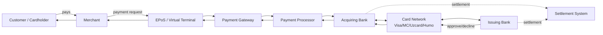

**Reading this diagram line by line:**

- `C -->|pays| M`: The customer initiates by choosing to pay the merchant. No money moves yet — this is just intent.
- `M -->|payment request| EP`: The merchant's app hands the sale to its payment interface, which structures it (amount, currency, order reference).
- `EP --> GW`: The EPoS sends the structured, secured request into the gateway — the controlled entry point to the financial network.
- `GW --> PR`: The gateway hands off to the processor, which knows how to talk to banks in their native protocol.
- `PR --> ACQ`: The processor reaches the *merchant's* bank (acquirer), which is the merchant's representative in the network.
- `ACQ <--> NET <--> ISS`: The acquirer asks the card network to route the authorization request to the *customer's* bank (issuer). The double arrows show request *and* response.
- `ISS -->|approve/decline|`: The issuer makes the real decision: does the customer have funds, is the card valid, does fraud scoring pass?
- The return chain (`NET --> ACQ --> PR --> GW --> EP --> M --> C`) shows the answer flowing all the way back so the customer sees "Approved" or "Declined."
- The dotted `settlement` lines show that **moving real money is a separate, later process** between the two banks via the settlement system — not part of the live request.

> **Mental model after Part 1:** A payment is a request that travels down a chain of trusted intermediaries to the customer's bank and back, producing a *promise* (authorization), where the *real money* moves later (settlement). There are two banks. Everything is logged with a tracking ID so it can be proven later.

---

## 1.5 What is EPoS?

**EPoS = Electronic Point of Sale.** The "point of sale" is simply *the place where a sale happens and a payment is taken*. "Electronic" means it's software/hardware that captures the sale and turns it into a payment request the financial network can understand.

But that definition is too thin. Here's the engineering truth: **EPoS is the layer that translates a business event ("customer wants to buy this for this much") into a structured, secure, trackable payment transaction, and translates the financial network's answer back into a business outcome ("order paid / order failed").**

It has four jobs:

1. **Electronic Point of Sale** — the moment and place of the sale (a checkout page, a counter terminal, an admin screen).
2. **Virtual terminal** — a *software-only* version of a card terminal, usually a web interface where a merchant's staff can key in a payment manually (think: a call-center operator taking a card over the phone, or a business invoicing a client).
3. **Merchant payment interface** — the API/UI the merchant integrates with so they never have to talk to banks directly.
4. **Transaction processing system** — it creates the transaction record, assigns IDs, validates, routes to the gateway, tracks state, and handles retries/timeouts/callbacks.

### Physical POS vs Virtual POS

| Aspect | Physical POS terminal | Virtual Terminal (EPoS software) |
|---|---|---|
| Form | Hardware device on a counter | Web page / API / admin screen |
| Card present? | Yes — card is dipped/tapped/swiped | No — card data is keyed or tokenized (Card-Not-Present) |
| Customer present? | Usually yes | Often no (phone, online, recurring) |
| Risk profile | Lower fraud risk (chip + PIN proves possession) | Higher fraud risk → needs 3D Secure, CVV, fraud scoring |
| Typical use | Retail shop, restaurant | E-commerce, call centers, B2B invoicing, subscriptions |
| Integration | Talks to acquirer over a payment terminal protocol | Talks to a gateway over HTTPS/REST |
| Cost to deploy | Hardware per location | Software, scales infinitely |

The crucial distinction is **CP (Card Present) vs CNP (Card Not Present)**. A physical POS proves the customer physically has the card (chip authentication). A virtual terminal cannot — the card details could be stolen. This is why CNP transactions carry more security machinery (3D Secure, CVV checks, AVS, fraud engines) and why issuers can decline them more aggressively. Most of this book deals with the CNP / virtual world, because that's where fintech and e-commerce live.

> **Mental model:** EPoS is a *translator and tracker*. It speaks "business" on one side ("order #5567, 250,000 UZS") and "payment network" on the other ("authorize this PAN for this amount"), and it remembers every transaction so it can answer "what happened?" forever.

---

# PART 2 — EPoS ARCHITECTURE

## 2.1 Step 1 — Problem Statement

The merchant just wants to get paid. They do *not* want to:

- Become PCI-DSS compliant to touch raw card numbers.
- Maintain TLS connections to a dozen banks, each with a different protocol.
- Implement ISO 8583 message formatting.
- Handle retries, timeouts, idempotency, and reconciliation.
- Track every transaction's lifecycle for years for audit.

So we build an architecture that **absorbs all of that complexity behind a clean interface.** The EPoS architecture is essentially a series of layers, each hiding the messiness of the layer below it.

## 2.2 Step 2 — Intuition

Think of EPoS architecture as **a relay race with specialists.** Nobody runs the whole track. Each runner (component) does one leg well and hands off a clean baton (a validated, structured message) to the next. If you tried to make one component do everything, it would be impossible to secure, test, scale, or debug.

## 2.3 Step 3 — Real-World Analogy

A restaurant:

- **Waiter (Merchant System):** takes the order, shows the menu, brings the result. Doesn't cook.
- **Kitchen expediter (EPoS Server):** validates the order, decides which station handles it, tracks every dish's state.
- **Specialist chefs / pass-through window (Payment Gateway):** the controlled door to the outside supply chain.
- **Suppliers (Banks/Networks):** actually provide the ingredients (the funds).

Each role is replaceable and independently improvable. That's the whole point of layering.

## 2.4 Internal Mechanics — the components

### Merchant System

**Responsibilities:**
- Owns the *business* context: the order, the cart, the customer, the invoice.
- Renders the payment UI (or redirects to a hosted page).
- Sends a payment request to the EPoS (amount, currency, order ID, return URLs).
- Receives the final result (via redirect/callback) and updates the order.

**What it must NOT do:** touch raw card data (to stay out of PCI scope), or assume the payment succeeded just because it "sent the request."

### EPoS Server

**Responsibilities:**
- **Transaction management:** create a transaction record, assign a unique transaction ID, track its state machine (Part 3).
- **Validation:** amount > 0, currency supported, merchant active, order not already paid (idempotency).
- **Routing:** choose the right gateway/acquirer for this card type/currency/region. (A card might route to Uzcard vs Visa vs Humo differently.)
- **Security:** enforce tokenization, never log full PAN, sign/verify messages, apply fraud rules.

The EPoS server is the **brain**. It's where most of your Spring Boot code lives.

### Payment Gateway

**Responsibilities:**
- **Request processing:** accept the structured request, encrypt sensitive data, format it for the bank/processor.
- **Bank communication:** maintain secure, persistent connections to acquirers/processors; speak their protocol (often ISO 8583 under the hood).
- **Response handling:** parse the bank's response codes, normalize them into a consistent format, return them up the chain.

The gateway is the **border crossing** between "the merchant's world" (HTTP/JSON) and "the banking world" (ISO 8583, secure links).

### Bank Integration Layer

**Responsibilities:**
- **API communication:** the actual adapters per bank/network. Each acquirer or scheme may have a different endpoint, auth method, and message format.
- **ISO 8583 messages:** the decades-old binary/positional message standard most card systems still use. A "0100" message is an authorization request; "0110" is the response; "0200" financial request; "0400" reversal. You rarely write raw ISO 8583 yourself — the processor/gateway does — but you must know it exists, because **bank response codes** (e.g., `00` = approved, `51` = insufficient funds, `05` = do not honor) come from here and you'll debug them constantly.

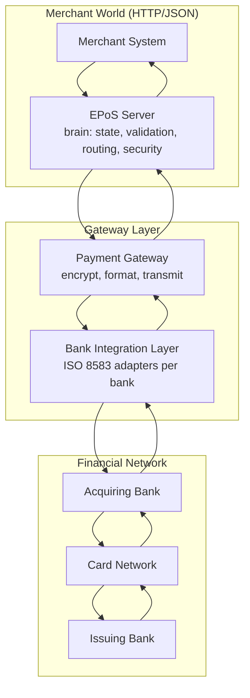

**Line-by-line:**
- The `Merchant World` subgraph speaks HTTP/JSON — friendly, modern, easy to integrate.
- `EPS` is labeled the *brain* — it holds state and makes decisions; everything else is plumbing.
- The `Gateway Layer` is where the protocol *translation* happens: JSON in, ISO 8583 out.
- `BIL` has *per-bank adapters* — this is why it's a separate layer: each bank is a little different, and you isolate that variation here so the brain doesn't care.
- The `Financial Network` is outside your control entirely; you only send requests and interpret responses.
- The downward path is the request; the upward path (`ISS --> ... --> MS`) is the response carrying the approve/decline decision back.

> **Mental model after Part 2:** EPoS is layered so each layer hides the complexity below it. The merchant speaks business and HTTP; the EPoS server is the decision-making brain; the gateway and bank-integration layer translate to banking protocols. You build and own the brain; you integrate with the rest.

---

# PART 3 — PAYMENT TRANSACTION LIFECYCLE

## 3.1 Step 1 — Problem Statement

Why can't a payment just be "success" or "fail"? Because a payment is **not instantaneous and not atomic across systems.** Between "customer clicked Pay" and "merchant has the money in the bank," hours or days pass and multiple independent systems are involved. At any moment you must be able to answer *exactly where this payment is* — to show the customer, to handle a refund, to reconcile, to recover from a crash.

A payment that's "Authorized but not Captured" is in a completely different real-world situation than one that's "Captured" or "Refunded." If you collapse these into a boolean, you will lose money. The state machine **is** the payment system.

## 3.2 Step 2 — Intuition

Think of an online order's shipping status: *Ordered → Packed → Shipped → Out for delivery → Delivered.* You'd never reduce that to "shipped: true/false," because each state needs different handling and different customer messaging. Payments are the same — except getting it wrong costs real money and triggers legal disputes.

## 3.3 Step 3 — Real-World Analogy

A hotel booking with a card:

- **Authorized:** the hotel puts a *hold* on your card for the room. No money has left your account; your available balance just dropped. (Authorization)
- **Captured:** at checkout, the hotel actually *charges* the held amount. (Capture)
- **Completed/Settled:** days later the money actually lands in the hotel's bank account. (Settlement)
- **Reversed:** if you cancel before checkout, the hold is released — money never moved.
- **Refunded:** if you already paid and then complain, they send money *back* — a new opposite movement.

Auth-then-capture is everywhere: hotels, car rentals, e-commerce that charges on shipment, restaurants adding a tip.

## 3.4 Internal Mechanics — the states and why each exists

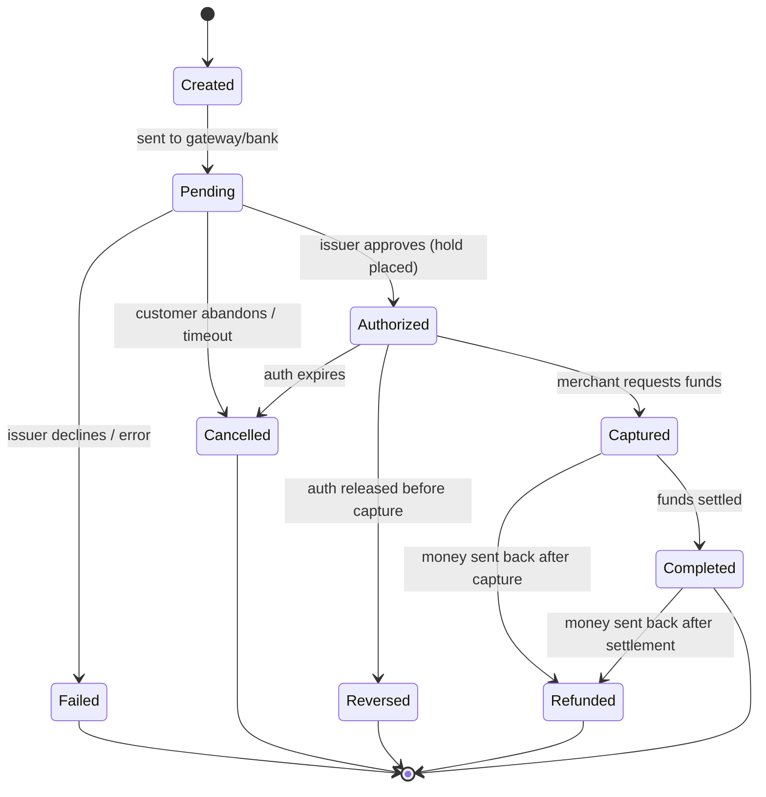

**Why each state exists:**

- **Created** — the transaction record exists in *your* DB, with an ID, but nothing has been sent anywhere. This state exists so that if you crash *right now*, you have a durable record that "a payment attempt was started." Without it, a crash means amnesia.
- **Pending** — the request is *in flight* to the gateway/bank, and you do **not yet know the outcome.** This is the most dangerous state in all of payments. A timeout leaves you here, uncertain. Your entire reliability strategy revolves around resolving Pending transactions correctly (via status queries and reconciliation).
- **Authorized** — the issuer approved and placed a *hold* on the customer's funds. Money has **not** moved. The hold typically expires (e.g., 7 days) if not captured. This state exists because many businesses must verify/ship before charging.
- **Captured** — the merchant has requested the held funds. This commits the charge. From here, undoing it requires a *refund* (a new opposite transaction), not a reversal.
- **Completed (Settled)** — the money has actually moved between banks and landed (conceptually) with the merchant. This is the only state where the merchant truly "has the money."
- **Failed** — a terminal state: declined or errored. Important: *failed authorization* means no money is held. But you must still keep the record (for fraud analysis, retries, audit).
- **Cancelled** — the customer abandoned, or the session timed out before completion. No money moved.
- **Reversed** — an authorization was explicitly released before capture (e.g., order cancelled). The hold is removed; the customer's available balance is restored. Money never actually moved, which is why reversal is *cheaper and cleaner* than refund.
- **Refunded** — money that *already moved* is sent back. This is a brand-new financial movement in the opposite direction (full or partial). It is **not** "undo" — the original transaction stays Completed; a separate refund transaction is created and linked.

The single most important conceptual pair: **Reversal vs Refund.**
- *Reversal* = cancel a promise before money moved (release a hold). Fast, no fee, no real settlement.
- *Refund* = create a new opposite money movement after money already moved. Slow, settles separately, costs fees.

> **Mental model after Part 3:** A payment is a state machine, not a boolean. The scary state is **Pending** (outcome unknown). Authorization is a *promise/hold*; Capture *commits* it; Settlement *delivers the money*. Undoing before money moves is a **Reversal**; undoing after is a **Refund** (a new opposite transaction). You never delete a transaction — you transition it.

## 3.5 Common Mistakes (lifecycle)

- **Treating Pending as Failed (or Success).** A timeout to the bank is *not* a decline. If you mark it Failed and the bank actually approved, the customer is charged with no order. Always *query status* before concluding.
- **Refunding by deleting the original row.** Destroys audit history and breaks reconciliation. Always create a linked refund transaction.
- **Allowing capture on a non-Authorized transaction.** Enforce legal transitions in code; reject illegal ones loudly.
- **Forgetting auth expiry.** An authorization you never capture silently expires; the customer's hold drops and you get no money. Capture in time or re-authorize.

## 3.6 Debugging Perspective (lifecycle)

When investigating, the *first question* is always: **what state is the transaction in, and what was the last successful transition?** A transaction stuck in `Pending` for 30 minutes is a red flag pointing at a lost bank response. The state + a timeline of state-change events (with timestamps and the response codes that caused each) is your primary diagnostic artifact. We design exactly this in Parts 9 and 15.

---

# PART 4 — PAYMENT FLOWS

This part is the heart of the book. We walk four flows in detail. Internalize these sequences; everything later (APIs, DB, failures) hangs off them.

## 4.1 Card Payment Flow (Card-Not-Present, online)

### Detailed step-by-step

1. **Customer enters card information** on the checkout page (or a hosted/iframe field that sends data *directly* to the gateway, keeping the merchant out of PCI scope).
2. **Merchant creates a payment request** — but note: the merchant's *backend* creates the order and an *intent* to pay (amount, currency, orderId, an idempotency key). It does **not** see the raw card if using hosted fields.
3. **EPoS generates a transaction** — assigns a `transactionId`, persists a `Created` record, validates (amount, merchant active, not already paid).
4. **Payment gateway receives the request** — encrypts card data, formats an authorization message, transitions the transaction to `Pending`.
5. **Bank (issuer) validates the card** via the card network: is the PAN valid, not expired, not blocked, CVV correct, funds sufficient, fraud score acceptable? Possibly triggers **3D Secure** (customer redirected to bank to confirm with OTP/biometrics).
6. **Card network processes the request** — routes the ISO 8583 auth request from acquirer to issuer and the response back.
7. **Authorization response returns** — `00` approved (hold placed) or a decline code (`51` insufficient funds, `05` do not honor, etc.).
8. **Transaction status updated** — `Authorized` or `Failed`. The customer is shown the result. The merchant's order is updated.
9. **Capture** — either immediately (auth+capture) or later when goods ship. Transitions `Authorized → Captured`.
10. **Settlement happens later** — in a nightly batch, real funds move from issuer to acquirer; `Captured → Completed`.
11. **Merchant receives funds** — the acquirer credits the merchant's account (minus fees) on the settlement cycle.

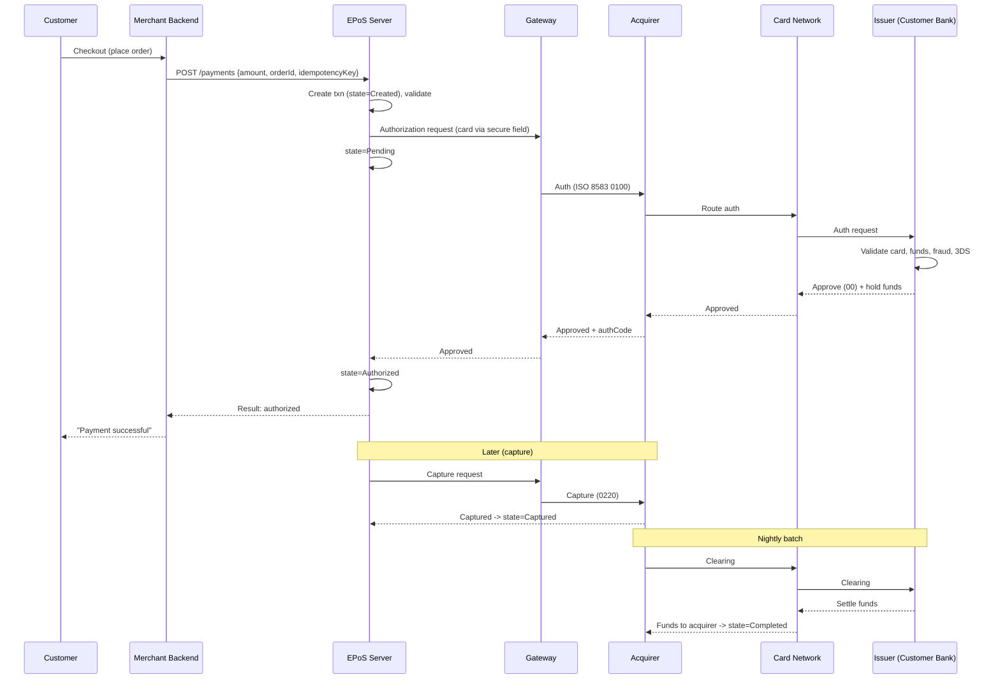

**Line-by-line (the important ones):**
- `E->>E: state=Pending` right after sending to the gateway — this is the *commit point of uncertainty*. If the next line never returns, you are stuck in Pending and must reconcile.
- `I->>I: Validate ... 3DS` — the issuer is the only party that can truly approve; everything before it is plumbing. 3D Secure may insert a customer interaction here.
- `I-->>N: Approve (00) + hold funds` — note **hold**, not transfer. Money hasn't moved.
- The `Note over E,A: Later (capture)` block shows capture is a *separate* operation, possibly hours/days later.
- The `Note over A,I: Nightly batch` block shows settlement is *batched and delayed* — the merchant doesn't get money in real time.

> **Mental model (card flow):** Auth is a fast, online, real-time *yes/no + hold*. Capture and settlement are slower, batched *money movements*. The customer sees the auth result instantly; the merchant gets money days later.

## 4.2 QR Payment Flow

QR payments invert the data flow: instead of the customer handing card data to the merchant, the **customer's app** scans a code and pushes the payment from their side. Common in Uzbekistan and across Asia.

**Two modes:**
- **Merchant-presented QR:** the merchant shows a QR (static = same code always, or dynamic = encodes this specific amount/order). The customer scans with their bank/wallet app and confirms.
- **Customer-presented QR:** the customer's app shows a one-time QR; the merchant scans it.

### Step-by-step (dynamic merchant-presented)

1. **QR generation:** EPoS creates a transaction (`Created`) and generates a QR encoding `{merchantId, transactionId, amount, currency, expiry, signature}`. The signature prevents tampering.
2. Customer scans with their wallet/bank app; the app reads the encoded request.
3. Customer confirms in their app; their bank/wallet authorizes from *their* side and pushes the payment to the network.
4. **Payment confirmation:** the network/processor notifies the EPoS (via **callback/webhook**) that transaction X is paid.
5. **Callback:** EPoS verifies the callback signature, transitions `Pending → Authorized/Completed`, and notifies the merchant.

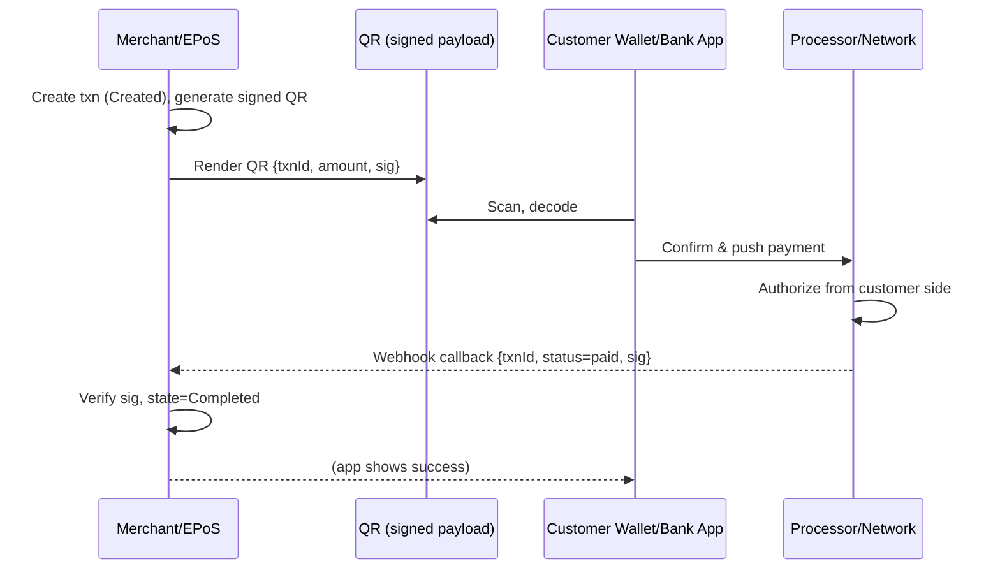

**Why the callback matters:** in QR flows the merchant is *not in the request path*. The merchant launched the QR and then **waits**. The only way it learns the result is an asynchronous callback. This means: (a) you must handle the callback being **delayed**, (b) **duplicated**, or (c) **never arriving** (fall back to polling a status endpoint). This async nature is the defining engineering challenge of QR/wallet payments — see Part 13.

## 4.3 Mobile Wallet Flow

A wallet is a **stored-value account** inside your platform (or a partner's). The customer pre-loads money (or links a card), and pays from the wallet **balance**. The key difference from cards: **you (or the wallet provider) own the ledger** — the money may be inside your own system.

### Mechanics: Wallet, Balance, Ledger, Settlement

- **Wallet:** an account belonging to a customer with a **balance**.
- **Balance:** a *derived* number — it should always equal the sum of ledger entries, never a standalone field you blindly increment (see Part 10).
- **Ledger:** the immutable double-entry record of every movement (debit/credit). The balance is computed from it.
- **Settlement:** when the customer pays a *merchant* from their wallet, value moves between the customer's wallet account and the merchant's account *within the ledger*, and later real money settles between the underlying bank accounts.

### Step-by-step (pay a merchant from wallet)

1. Customer chooses "Pay with wallet" for amount A.
2. EPoS checks wallet balance ≥ A (read from ledger-derived balance, with a lock or atomic check).
3. Create a ledger transaction: **debit** customer wallet A, **credit** merchant wallet A (double-entry — both sides recorded, sum zero).
4. Mark payment `Completed` (wallet payments are often instant because the money is in-system).
5. Later, settlement moves real bank funds to align with the ledger (e.g., the platform pays the merchant from the pooled account).

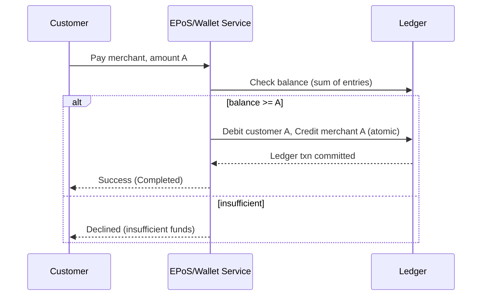

> **Mental model (wallet):** A wallet payment is a *ledger entry*, not a network round-trip. It's fast because the money is in-system, but it demands rock-solid double-entry accounting (Part 10) — the balance is a *consequence* of the ledger, never an independent counter.

## 4.4 Recurring Payment Flow

Subscriptions: charge a customer repeatedly *without them being present*. The legal/technical enabler is **tokenization** — you stored a token, not the card, the first time, with the customer's consent ("mandate") to charge it later.

### Mechanics: Subscriptions, Tokenization, Scheduled payments

1. **First payment (customer present):** customer pays once; the gateway returns a **token** representing the card. You store the token + a mandate/consent reference. You never store the PAN.
2. **Subscription record:** you store `{customerId, token, amount, interval, nextChargeDate, status}`.
3. **Scheduled payments:** a scheduler (e.g., a daily job) finds subscriptions due today and submits **merchant-initiated transactions (MIT)** using the token.
4. **Failure handling (dunning):** if a charge fails (insufficient funds, expired card), you retry on a schedule, notify the customer, and eventually suspend the subscription.

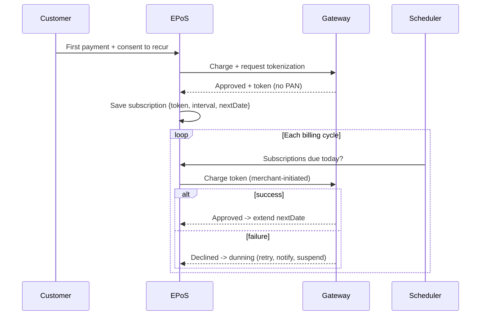

**Why tokenization is mandatory here:** storing raw cards to charge later would put you in the deepest tier of PCI-DSS scope and is a massive breach liability. The token is useless to a thief (it only works for *your* merchant account) and removes you from card-storage scope. Recurring payments are *impossible to do responsibly* without it. (Detailed in Part 6.)

> **Mental model (recurring):** The customer is present *once* to give a token + consent. After that, *your scheduler* initiates charges using the token. The hard part isn't charging — it's gracefully handling the many ways a future charge can fail (dunning).

---

# PART 5 — PAYMENT APIs

## 5.1 Step 1 — Problem Statement

The merchant integrates with you over an API. That API is a *contract* that must survive network failures, retries, and async outcomes — while never double-charging. A naive REST CRUD API is dangerous here. Payment APIs have special rules: **idempotency, async results, and signed callbacks.**

## 5.2 Intuition & Analogy

A payment API is like ordering at a counter where the kitchen is in another building. You place the order and get a *ticket number* (payment ID). The food isn't ready instantly. You can *ask* about your ticket (status endpoint), and they'll *call your number* when it's ready (webhook). And if you accidentally hand in the same order slip twice, they should recognize it and not cook two meals (idempotency).

## 5.3 Create Payment

```
POST /api/v1/payments
Idempotency-Key: 7e9c-...-a1   (client-generated, unique per attempt)
Authorization: Bearer <merchant-api-key>
Content-Type: application/json
```
```json
{
  "amount": 250000,
  "currency": "UZS",
  "orderId": "ORD-5567",
  "description": "Order #5567",
  "captureMode": "AUTO",
  "returnUrl": "https://shop.uz/checkout/return",
  "callbackUrl": "https://shop.uz/api/payment-callback"
}
```

**Design notes that matter:**
- **`amount` is an integer in the smallest currency unit** (tiyin for UZS, cents for USD). *Never use floats for money.* `250000` here means 250,000.00 UZS if UZS has no minor unit, or you define a convention and stick to it religiously. (See Part 9 on money types.)
- **`Idempotency-Key`** is the client's promise: "if you've seen this key, return the original result, don't create a new payment." This is what makes retries safe.
- **`captureMode`**: `AUTO` (auth+capture together) or `MANUAL` (auth now, capture later).
- **`returnUrl`** is where the *customer's browser* lands after a redirect (e.g., after 3DS). **`callbackUrl`** is where your *server* notifies the merchant's *server*. These are different and both needed — never trust the browser return alone to confirm payment.

**Response (note: this is an async-friendly response):**
```json
{
  "paymentId": "pay_01HX...",
  "status": "PENDING",
  "amount": 250000,
  "currency": "UZS",
  "redirectUrl": "https://gateway.uz/3ds/pay_01HX...",
  "createdAt": "2026-06-21T10:05:00Z"
}
```
The response is `PENDING` with a `redirectUrl` (for 3DS/QR). The merchant must **not** assume success here — it must wait for the callback or poll status.

## 5.4 Payment Status

```
GET /api/v1/payments/{paymentId}
```
```json
{
  "paymentId": "pay_01HX...",
  "status": "AUTHORIZED",
  "amount": 250000,
  "authorizedAmount": 250000,
  "capturedAmount": 0,
  "refundedAmount": 0,
  "bankResponseCode": "00",
  "updatedAt": "2026-06-21T10:05:14Z"
}
```
**Why it exists:** the callback can be lost. The status endpoint is the **source of truth fallback**. A well-behaved merchant polls status when a callback doesn't arrive within an expected window. Make it cheap, idempotent, and always reflect the latest known state.

## 5.5 Callback / Webhook

Your platform calls the *merchant's* `callbackUrl` when the outcome is known:
```
POST https://shop.uz/api/payment-callback
X-Signature: hmac-sha256=...   (so the merchant can verify it's really you)
```
```json
{
  "paymentId": "pay_01HX...",
  "orderId": "ORD-5567",
  "status": "COMPLETED",
  "amount": 250000,
  "currency": "UZS",
  "eventId": "evt_98ad...",
  "timestamp": "2026-06-21T10:06:00Z"
}
```

**Why callbacks exist:** the result is often *asynchronous* (3DS redirects, QR scans, bank delays). The merchant can't hold an HTTP request open for minutes. So you push the result when ready.

**Webhook rules every engineer must know:**
1. **Sign every callback** (HMAC) so the receiver can verify authenticity. Otherwise an attacker posts fake "COMPLETED" events.
2. **Make them idempotent** via `eventId` — networks redeliver. The receiver must handle the same event twice without acting twice.
3. **Expect retries with backoff** — if the merchant returns non-2xx, you retry (e.g., 1m, 5m, 30m, 2h...). Document this.
4. **Don't rely on ordering** — a `COMPLETED` might arrive before an `AUTHORIZED`. Use timestamps/states, not arrival order.

## 5.6 Refund API

```
POST /api/v1/payments/{paymentId}/refunds
Idempotency-Key: rf_3321...
```
```json
{ "amount": 100000, "reason": "Customer returned 1 item" }
```
- **Full refund:** `amount` equals the captured amount (or omit to refund all).
- **Partial refund:** `amount` < captured amount. You may allow *multiple* partial refunds, but their sum must never exceed the captured amount — enforce this server-side.

**Response:**
```json
{ "refundId": "ref_77...", "paymentId": "pay_01HX...", "status": "PENDING", "amount": 100000 }
```
A refund is its own resource with its own lifecycle (it also settles separately). It links back to the original payment but never mutates it beyond updating `refundedAmount`.

> **Mental model (APIs):** A payment API is *async + idempotent + signed*. Create returns a ticket (often PENDING); the result arrives via signed webhook; status is the fallback truth; refunds are separate linked resources. Idempotency keys make every call safe to retry.

## 5.7 Common Mistakes (APIs)

- Treating the synchronous create response as final success.
- No idempotency key → double charges on client retry.
- Unsigned/unverified webhooks → spoofed payment confirmations.
- Floats for money.
- Mutating the original payment for refunds instead of creating a refund resource.

---

# PART 6 — PAYMENT SECURITY

## 6.1 Step 1 — Problem Statement

Card data is *bearer credentials*: whoever has the PAN + expiry + CVV can spend the customer's money in CNP contexts. A breach isn't an inconvenience — it's direct theft, regulatory fines, and loss of your ability to process cards at all. So the entire industry is built around one principle: **handle as little sensitive data as possible, and protect what you must handle obsessively.**

## 6.2 PCI DSS — why card data is protected

**PCI DSS** (Payment Card Industry Data Security Standard) is the rulebook card networks impose on anyone who touches card data. It defines requirements: network segmentation, encryption, access control, logging, regular testing, etc.

The single most valuable PCI insight for an engineer: **scope reduction.** The fewer systems that ever *see* a PAN, the smaller (and cheaper, safer) your PCI scope. That's why modern designs use:
- **Hosted fields / iframes:** card data goes from the browser *directly* to the gateway; your servers never see it.
- **Tokenization:** you store a token, not the card.

If your backend never receives the raw PAN, vast swaths of PCI requirements no longer apply to it. **Design to never touch the card.**

Things you must NEVER do: log full PAN, store CVV *at all* (storing CVV is forbidden even encrypted), store PAN in plaintext, put card data in URLs or analytics.

## 6.3 Card Tokenization — why systems avoid storing cards

**Tokenization** replaces a sensitive value (the PAN) with a non-sensitive surrogate (a token) that has no exploitable value outside your specific context.

- The real card lives in a hardened **vault** (the gateway's or a tokenization provider's), under heavy PCI controls.
- You receive `tok_abc123` and store *that*. It's useless to a thief: it can only be charged through *your* authenticated merchant account.
- For recurring/one-click, you charge the token instead of the card.

Analogy: a coat-check ticket. The ticket isn't your coat and is worthless to anyone but the cloakroom that issued it, yet it lets *you* reclaim the coat. Tokenization is a coat-check for card numbers.

## 6.4 Encryption — data protection

Two layers you must distinguish:
- **Encryption in transit (TLS):** every hop uses TLS (HTTPS). Card networks often add field-level encryption on top. Non-negotiable.
- **Encryption at rest:** any sensitive data stored (tokens, PII, mandates) is encrypted in the database / disk. Use a KMS for key management; rotate keys.
- **Field-level / application-layer encryption:** for the most sensitive fields, encrypt *before* it hits the DB so even DB admins can't read it.

For card data specifically: **point-to-point encryption (P2PE)** encrypts at the point of capture so intermediate systems never see cleartext.

## 6.5 3D Secure — 3DS1 vs 3DS2

3D Secure adds **cardholder authentication** to CNP transactions: it lets the *issuer* verify the customer is really the cardholder, and (crucially) shifts **liability for fraud** from the merchant to the issuer when used.

- **3DS1 (legacy):** the customer is redirected to a bank page and enters a static password / OTP. Clunky, high friction, high cart-abandonment. Being phased out.
- **3DS2 (current):** designed for mobile and frictionless flows. The merchant/app sends ~100+ data points (device, behavior, history) to the issuer. The issuer does **risk-based authentication**:
  - *Frictionless:* if risk is low, the customer isn't challenged at all — approved invisibly.
  - *Challenge:* if risk is higher, the customer confirms via OTP/biometrics in their banking app.

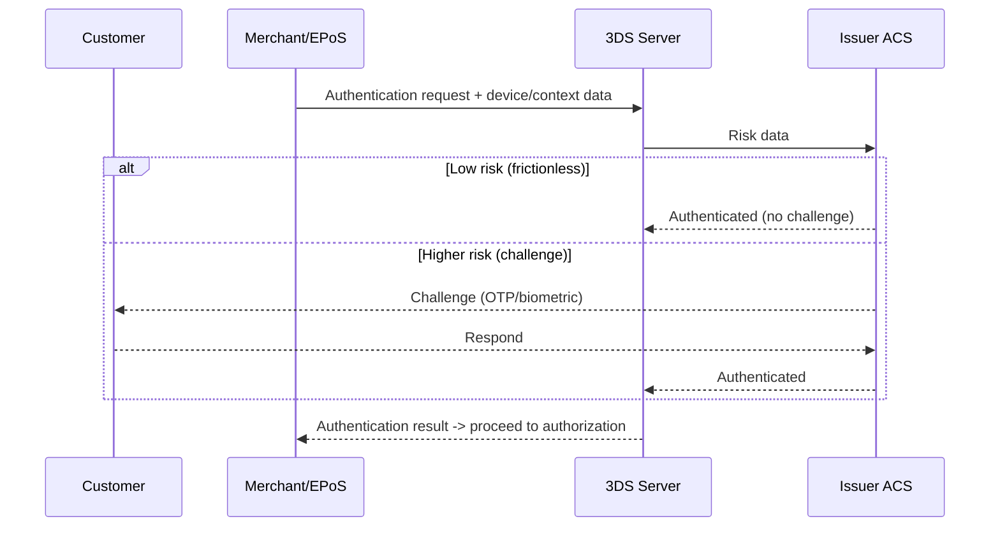

**Engineering takeaway:** 3DS happens *before* authorization and may insert a customer interaction (redirect/app switch). Your flow must handle the "needs challenge → come back → continue" path. This is why Create Payment often returns a `redirectUrl` and a `PENDING` status.

## 6.6 Authentication vs Authorization (in payment context)

These two words sound alike and confuse everyone. In payments they mean specific, different things:

- **Authentication = "are you who you say you are?"** Proving the cardholder's identity (3D Secure, OTP, biometrics). Answers: *is this really the legitimate cardholder?*
- **Authorization = "are you allowed to do this, and do you have the funds?"** The issuer's approval of the *transaction* (valid card, sufficient funds, within limits, fraud OK). Answers: *can this specific charge go through?*

Order: you (optionally) **authenticate** the cardholder (3DS), then the issuer **authorizes** the transaction. Authentication reduces fraud and shifts liability; authorization moves the payment forward. A transaction can be authenticated but *not* authorized (e.g., insufficient funds), and historically could be authorized without strong authentication (riskier).

> **Mental model (security):** Touch as little card data as possible (scope reduction). What you keep, tokenize and encrypt. Use 3DS to *authenticate* the human and shift fraud liability; the issuer *authorizes* the money. Authentication = identity; Authorization = permission + funds.

## 6.7 Common Security Mistakes
- Logging full PAN or storing CVV (forbidden, ever).
- Trusting the browser return URL as proof of payment (always verify server-side via signed callback/status).
- Unsigned webhooks.
- Putting card data through your own servers when hosted fields would keep you out of scope.
- Reusing/never-rotating encryption keys; secrets in code or env files committed to git.

---

# PART 7 — FINANCIAL DATA CONSISTENCY

## 7.1 Step 1 — Problem Statement

In payments, a bug doesn't corrupt a profile picture — it *creates or destroys money*. Two requirements collide: payments are **distributed** (many systems, partial failure) yet must be **strongly consistent** (money conserved, no doubles, no losses). Reconciling those two facts is the intellectual core of payment engineering.

The recurring villains: **the customer double-clicks**, **the client retries a timed-out request**, **a service crashes mid-operation**, **a network call's response is lost**. Each can create a duplicate or a lost transaction unless you design against it.

## 7.2 Idempotency — the cornerstone

**Idempotent** = doing it twice has the same effect as doing it once.

**Why duplicates happen:**
- User double-clicks "Pay."
- Client times out and retries (but the first request *did* go through).
- A message queue redelivers an event.
- A load balancer retries an upstream call.

**How idempotency keys work:**
1. The client generates a unique key per *logical* operation (not per retry) and sends it (`Idempotency-Key` header).
2. The server, before doing anything, checks: *have I seen this key?*
   - **No:** process, then store `{key → result}` durably.
   - **Yes (completed):** return the *stored* result without re-processing.
   - **Yes (in progress):** return a "conflict / try again" or wait — never double-process.
3. Keys are stored with the result and a TTL.

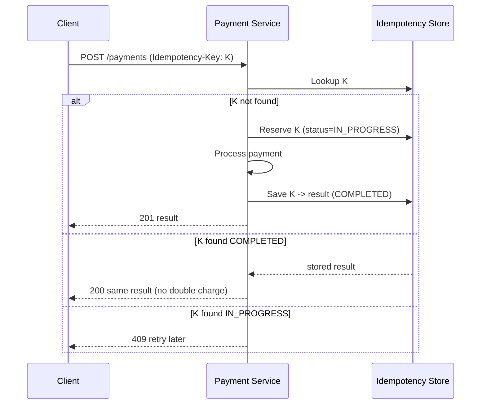

**Spring Boot example (idempotency filter / service):**
```java
@Service
@RequiredArgsConstructor
public class IdempotencyService {

    private final IdempotencyKeyRepository repo;

    /**
     * Returns existing result if the key was already processed, otherwise
     * reserves the key and lets the caller proceed.
     */
    @Transactional
    public Optional<StoredResult> begin(String key, String requestHash) {
        Optional<IdempotencyKey> existing = repo.findByKey(key);
        if (existing.isPresent()) {
            IdempotencyKey k = existing.get();
            if (!k.getRequestHash().equals(requestHash)) {
                throw new IdempotencyConflictException("Key reused with different body");
            }
            return Optional.of(new StoredResult(k.getStatus(), k.getResponseBody()));
        }
        // INSERT ... ON CONFLICT DO NOTHING semantics via a unique constraint
        try {
            repo.save(IdempotencyKey.reserved(key, requestHash));
            return Optional.empty(); // caller proceeds
        } catch (DataIntegrityViolationException race) {
            // Another thread inserted first; treat as in-progress
            throw new IdempotencyInProgressException(key);
        }
    }

    @Transactional
    public void complete(String key, String responseBody) {
        repo.markCompleted(key, responseBody);
    }
}
```
The **unique constraint on the key column** is what makes this race-safe under concurrency — the database, not your app logic, is the final arbiter. Store idempotency keys in PostgreSQL (durable) and optionally cache in Redis for speed.

## 7.3 Transaction Management (local DB transactions)

Within a single service, use database ACID transactions to keep related writes atomic: e.g., insert the payment row *and* the first ledger entries *and* the outbox event in **one** DB transaction. Either all commit or none do.

```java
@Transactional
public Payment authorize(CreatePaymentCmd cmd) {
    Payment p = paymentRepo.save(Payment.created(cmd));
    p.markPending();
    outbox.save(OutboxEvent.of("PaymentCreated", p));   // same transaction!
    return p;
}
```
Key rule: **never call an external bank API inside a DB transaction** — external calls are slow and can fail/timeout, holding DB locks and connections. Persist intent first (commit), *then* call out, then record the outcome.

## 7.4 Distributed Transactions — why Saga, Outbox, events

Across services (Payment, Ledger, Notification, Settlement), you **cannot** use a single ACID transaction — they have separate databases. Two-phase commit (2PC) across services is slow, fragile, and blocks; the industry avoids it for payments. Instead:

### The Outbox Pattern (reliable event publishing)
Problem: you want to (a) update your DB and (b) publish a Kafka event, *atomically*. But DB and Kafka are two systems — if you write to DB then crash before publishing, the event is lost; publish first then crash, and you have a phantom event.

Solution: write the event into an **outbox table in the same DB transaction** as your state change. A separate **relay** process reads new outbox rows and publishes them to Kafka, marking them sent. The DB transaction guarantees the event exists iff the state change committed.

```mermaid
sequenceDiagram
    participant Svc as Payment Service
    participant DB as Postgres (payment + outbox)
    participant Relay as Outbox Relay
    participant K as Kafka
    Svc->>DB: BEGIN; update payment; insert outbox row; COMMIT
    Relay->>DB: poll unsent outbox rows
    Relay->>K: publish PaymentAuthorized
    Relay->>DB: mark outbox row sent
```
This gives **at-least-once** delivery (events may be published twice if the relay crashes after publishing but before marking sent) — which is exactly why consumers must be **idempotent** (back to 7.2).

### The Saga Pattern (multi-step distributed workflow)
A saga is a sequence of *local* transactions across services, where each step has a **compensating action** to undo it if a later step fails. There's no global rollback; you *compensate*.

Example: "pay from wallet then top up phone":
1. Debit wallet (local txn). Compensation: credit wallet back.
2. Call telecom to add airtime. If this fails → run compensation (refund wallet).

Two styles:
- **Orchestration:** a central coordinator tells each service what to do and triggers compensations. Easier to reason about; single place to see the flow.
- **Choreography:** services react to each other's events with no central brain. More decoupled; harder to trace.

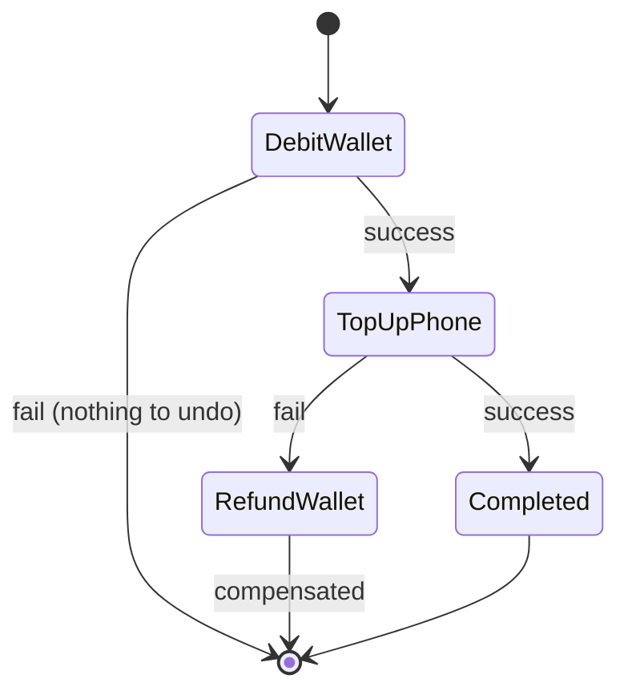

> **Mental model (consistency):** Inside one service, use ACID transactions and never call banks inside them. Across services, you can't have one big transaction — use the **Outbox** to publish events reliably and **Sagas** with compensations to coordinate multi-step money flows. Because delivery is at-least-once, **every consumer and endpoint must be idempotent.** Idempotency is not a feature; it's the foundation.

## 7.5 Common Consistency Mistakes
- Calling the bank inside a DB transaction (locks held during slow I/O).
- Publishing to Kafka and writing to DB without the outbox (dual-write problem → lost or phantom events).
- Assuming exactly-once delivery (it doesn't exist; design for at-least-once + idempotency).
- Incrementing a balance column directly instead of deriving from a ledger (lost updates under concurrency).
- No idempotency on event consumers.

---

# PART 8 — PAYMENT MICROSERVICE ARCHITECTURE

## 8.1 Step 1 — Problem Statement

Why split a payment platform into services at all? Because different concerns have radically different requirements:
- The **ledger** must be bulletproof and audited — it changes rarely and carefully.
- **Fraud** scoring needs ML and changes weekly.
- **Notifications** are best-effort and can be slow.
- **Settlement** runs in batches on a schedule.
Bundling these into one app means one team's risky deploy can take down money movement. Splitting them isolates risk, allows independent scaling, and clarifies ownership. But splitting also introduces distributed-consistency problems (Part 7) — so we split along clean ownership lines and connect with events.

## 8.2 Intuition & Analogy

Think of a bank's back office: the teller window (Payment Service), the accounts ledger department (Ledger Service), the fraud/security desk (Fraud Service), the daily settlement clerks (Settlement Service), the mailroom (Notification Service). Each is a specialized department with its own records, communicating via memos (events). You wouldn't make one person do all five jobs.

## 8.3 The services and responsibilities

| Service | Owns | Responsibilities | Must NOT do |
|---|---|---|---|
| **Payment Service** | Payment intents, API surface | Accept requests, idempotency, orchestrate the flow, talk to gateway, manage payment state | Hold the financial truth (that's the ledger) |
| **Transaction Service** | Transaction records & state machine | Persist each transaction attempt, enforce legal state transitions, store bank responses | Decide business policy |
| **Ledger Service** | The money truth | Immutable double-entry entries, balances, never lose/duplicate | Call external banks |
| **Settlement Service** | Batches & payouts | Group captured txns, generate settlement files, reconcile, trigger merchant payouts | Authorize live payments |
| **Notification Service** | Outbound comms | Send webhooks, SMS, email; retries/backoff | Be in the critical money path |
| **Fraud Service** | Risk scoring | Score transactions, apply rules/ML, return allow/deny/review | Block forever silently (must be observable) |

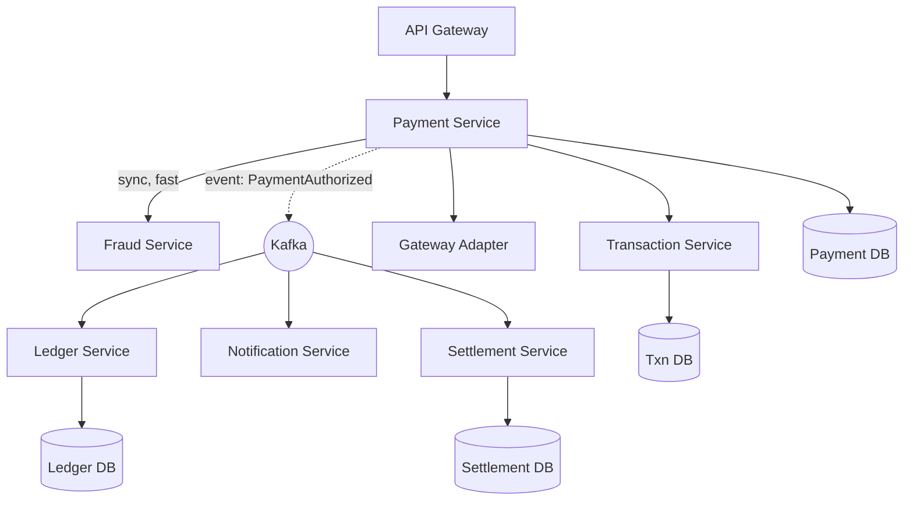

**Line-by-line:**
- `API --> PS`: all merchant traffic enters through the Payment Service behind an API gateway (auth, rate-limit).
- `PS -->|sync, fast| FS`: fraud is checked **synchronously** before authorizing — you can't undo a fraudulent charge as easily as preventing it. It must be fast (low latency budget).
- `PS -. event .-> K`: after a state change, Payment Service emits events to Kafka (via outbox).
- `K --> LS / NS / SS`: Ledger, Notification, and Settlement **react asynchronously** to events. They don't sit in the customer's latency path.
- Each service has its **own database** (`PDB`, `TDB`, `LDB`, `SDB`) — the "database per service" principle. No service reaches into another's DB; they communicate via APIs/events. This is what allows independent evolution and prevents hidden coupling.

**Sync vs async split — the key design decision:** Anything the *customer is waiting on* (fraud, authorization) is synchronous and latency-budgeted. Anything that can happen *after* the customer is told "success" (ledger posting in some designs, notifications, settlement) is asynchronous via events. Choosing this boundary correctly is most of the architecture.

> **Mental model (microservices):** Split by ownership: Payment orchestrates, Transaction records, Ledger holds truth, Settlement batches, Notification informs, Fraud guards. Customer-facing steps are synchronous; the rest react to events. Database-per-service + events, never shared tables.

---

# PART 9 — DATABASE DESIGN

## 9.1 Step 1 — Problem Statement

A payment database isn't a CRUD app. Its job is to be a **permanent, tamper-evident financial record** that can answer "what exactly happened to this money, and when?" years later, survive audits, support disputes, and never lose a transaction. That forces specific design choices most app databases ignore: **immutability, money as integers, append-only history, and strict status modeling.**

## 9.2 Core tables

```sql
-- Merchant: who gets paid
CREATE TABLE merchant (
    id              UUID PRIMARY KEY,
    name            TEXT NOT NULL,
    status          TEXT NOT NULL,          -- ACTIVE, SUSPENDED
    settlement_acct TEXT NOT NULL,          -- where payouts go
    created_at      TIMESTAMPTZ NOT NULL DEFAULT now()
);

-- Customer (may be minimal for card payments; richer for wallets)
CREATE TABLE customer (
    id          UUID PRIMARY KEY,
    external_ref TEXT,
    created_at  TIMESTAMPTZ NOT NULL DEFAULT now()
);

-- Payment: the business-level intent ("ORD-5567 should be paid 250000 UZS")
CREATE TABLE payment (
    id               UUID PRIMARY KEY,
    merchant_id      UUID NOT NULL REFERENCES merchant(id),
    customer_id      UUID REFERENCES customer(id),
    order_id         TEXT NOT NULL,
    amount_minor     BIGINT NOT NULL,        -- integer, smallest unit
    currency         CHAR(3) NOT NULL,       -- ISO 4217: UZS, USD
    status           TEXT NOT NULL,          -- CREATED, PENDING, AUTHORIZED, CAPTURED, COMPLETED, FAILED, ...
    captured_minor   BIGINT NOT NULL DEFAULT 0,
    refunded_minor   BIGINT NOT NULL DEFAULT 0,
    idempotency_key  TEXT,
    created_at       TIMESTAMPTZ NOT NULL DEFAULT now(),
    updated_at       TIMESTAMPTZ NOT NULL DEFAULT now(),
    UNIQUE (merchant_id, order_id),          -- one payment per order (idempotency at business level)
    UNIQUE (idempotency_key)
);

-- Transaction: each ATTEMPT/operation against the gateway/bank (auth, capture, refund...)
-- APPEND-ONLY. One payment can have many transactions.
CREATE TABLE transaction (
    id               UUID PRIMARY KEY,
    payment_id       UUID NOT NULL REFERENCES payment(id),
    type             TEXT NOT NULL,          -- AUTH, CAPTURE, REFUND, REVERSAL
    status           TEXT NOT NULL,          -- PENDING, SUCCESS, FAILED
    amount_minor     BIGINT NOT NULL,
    bank_response_code TEXT,                 -- 00, 51, 05 ...
    bank_ref         TEXT,                   -- bank/gateway reference id
    correlation_id   TEXT NOT NULL,          -- traces this through all systems
    created_at       TIMESTAMPTZ NOT NULL DEFAULT now()
    -- NOTE: no updated_at. Rows are not mutated; a new row records the next state.
);

-- Ledger: double-entry, immutable money truth (see Part 10)
CREATE TABLE ledger_entry (
    id            BIGSERIAL PRIMARY KEY,
    txn_group_id  UUID NOT NULL,            -- groups the debit+credit of one movement
    account_id    UUID NOT NULL,            -- a wallet, merchant, or system account
    direction     TEXT NOT NULL,           -- DEBIT or CREDIT
    amount_minor  BIGINT NOT NULL CHECK (amount_minor > 0),
    currency      CHAR(3) NOT NULL,
    payment_id    UUID REFERENCES payment(id),
    created_at    TIMESTAMPTZ NOT NULL DEFAULT now()
    -- APPEND ONLY. Never UPDATE or DELETE.
);

-- Refund: separate resource linked to a payment
CREATE TABLE refund (
    id            UUID PRIMARY KEY,
    payment_id    UUID NOT NULL REFERENCES payment(id),
    amount_minor  BIGINT NOT NULL,
    status        TEXT NOT NULL,           -- PENDING, COMPLETED, FAILED
    reason        TEXT,
    created_at    TIMESTAMPTZ NOT NULL DEFAULT now()
);

-- Settlement: batches and payouts
CREATE TABLE settlement (
    id            UUID PRIMARY KEY,
    merchant_id   UUID NOT NULL REFERENCES merchant(id),
    batch_date    DATE NOT NULL,
    gross_minor   BIGINT NOT NULL,
    fees_minor    BIGINT NOT NULL,
    net_minor     BIGINT NOT NULL,
    status        TEXT NOT NULL,           -- PENDING, PAID, RECONCILED
    created_at    TIMESTAMPTZ NOT NULL DEFAULT now()
);
```

## 9.3 The design principles (the *why*)

**1. Money as integers in the smallest unit (`*_minor BIGINT`).** Floating point (`double`) cannot represent `0.1` exactly; financial math with floats accumulates errors and *loses money*. Store cents/tiyin as integers. In Java, use `BigDecimal` or `long` minor units — never `double`/`float` for money.

**2. Separate `payment` from `transaction`.** A `payment` is the *intent* ("this order should be paid"). A `transaction` is each *attempt/operation* (the auth, then the capture, then maybe a refund). One payment → many transactions. Beginners cram everything into one row and then can't represent "auth succeeded, capture failed, retried capture succeeded."

**3. The `transaction` and `ledger_entry` tables are APPEND-ONLY.** You never `UPDATE` or `DELETE` them. State changes are recorded as *new rows*. Why?
- **Audit:** regulators and dispute resolution require proof of every step. A mutated row erases history.
- **Debugging:** you can replay exactly what happened.
- **Concurrency safety:** appends don't fight over the same row.
The *current* state can live as a derived/cached value (e.g., `payment.status`), but the *history* is immutable.

**4. `correlation_id` on transactions.** This single value ties a request across every microservice and log line. It's the thread you pull in Part 16 to unravel any incident.

**5. Uniqueness constraints enforce business rules.** `UNIQUE(merchant_id, order_id)` makes it *impossible* to create two payments for the same order — the database enforces idempotency even if application code has a bug. Push critical invariants into DB constraints; don't trust app logic alone.

**6. Audit & financial history.** Keep `created_at` everywhere (with timezone, `TIMESTAMPTZ`). Consider a separate immutable `audit_log` / event table. Retention is often *years* by regulation — design for archival, not deletion.

> **Mental model (DB):** The payment DB is a permanent ledger of facts. Money is integers. `payment` = intent; `transaction`/`ledger_entry` = append-only history. Current status is derived; history is sacred. DB constraints enforce the invariants that protect money.

## 9.4 Common DB Mistakes
- Floats for money.
- Mutating/deleting transaction or ledger rows (destroys audit + reconciliation).
- One giant table conflating intent, attempt, and money movement.
- A mutable `balance` column updated directly under concurrency (lost updates) instead of a derived ledger sum.
- No unique constraint on order/idempotency key → duplicate payments.

---

# PART 10 — LEDGER SYSTEM

## 10.1 Step 1 — Problem Statement

How do you store "how much money is in this account" so that it is **always correct**, even under concurrency, crashes, and audits, and so you can *prove* every change? The naive answer — a `balance` column you increment — fails catastrophically: concurrent updates lose money, and you can't explain *why* a balance is what it is. The financial world solved this 600 years ago with **double-entry bookkeeping**, and modern fintech ledgers are a faithful software implementation of it.

## 10.2 Intuition

A ledger is not "the current balance." A ledger is **the complete, append-only list of every movement.** The balance is just the *sum* of that list. If you ever store the balance as a primary fact, you've created something that can disagree with reality. If the balance is always *computed* from the list of movements, it can never lie.

## 10.3 Real-World Analogy

Your bank statement. It doesn't just say "you have 1,000,000 UZS." It lists every deposit and withdrawal, and the balance is what you get by adding them up. If the bank just told you a number with no transaction list, you couldn't trust it or dispute it. The list *is* the truth.

## 10.4 Double-entry accounting: Debit and Credit

The core rule: **every movement of money touches at least two accounts, and the total debits equal the total credits.** Money is never created or destroyed — it only *moves* from one account to another. Every entry has an equal and opposite entry.

- **Debit** and **Credit** are just the two *directions* of a movement. (Forget the everyday "debit = bad, credit = good" intuition; in double-entry they're neutral directions whose meaning depends on the account type.)
- For our purposes the invariant that matters: **for each money movement, sum(debits) == sum(credits).** If they don't balance, the entry is invalid and must be rejected.

### Example 1: Customer tops up wallet with 100,000 UZS (via card)
| Account | Direction | Amount |
|---|---|---|
| Customer Wallet | CREDIT | 100,000 |
| Card-Funding Clearing | DEBIT | 100,000 |

The customer's wallet goes up by 100,000; the clearing account (representing money coming in from the card rails) goes down by the same. Debits == Credits. ✔

### Example 2: Customer pays merchant 30,000 from wallet
| Account | Direction | Amount |
|---|---|---|
| Customer Wallet | DEBIT | 30,000 |
| Merchant Payable | CREDIT | 30,000 |

Customer wallet decreases; merchant's owed balance increases. Balanced. ✔

### Example 3: Platform fee of 1,000 on that payment
| Account | Direction | Amount |
|---|---|---|
| Merchant Payable | DEBIT | 1,000 |
| Platform Revenue | CREDIT | 1,000 |

The merchant's payable reduces by the fee; platform revenue grows. Balanced. ✔

The customer's wallet balance is now `sum of all entries for that account` = `+100,000 - 30,000 = 70,000`. You never stored "70,000" — you *computed* it. It is therefore always correct and always explainable.

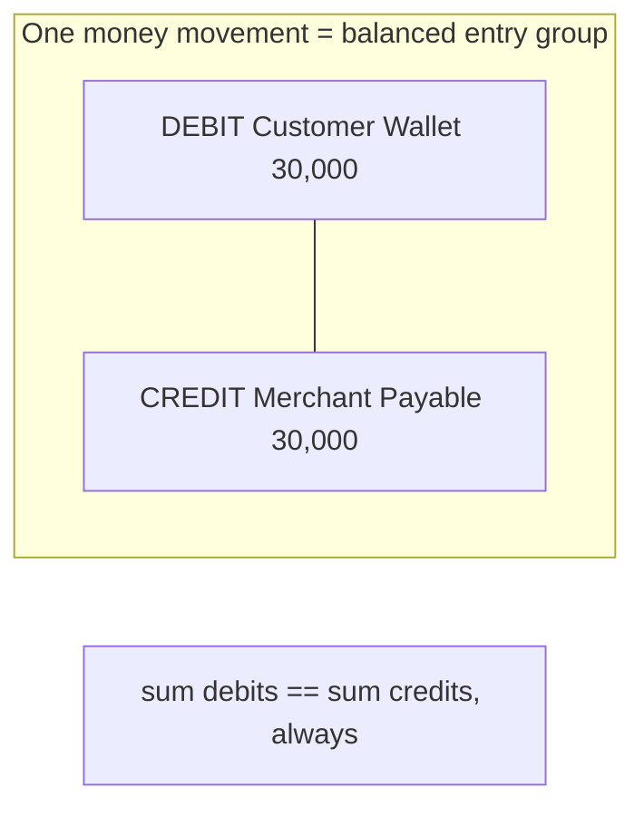

## 10.5 Internal Mechanics

- **Accounts:** every entity that can hold value has an account — customer wallets, merchant payables, platform revenue, fee accounts, clearing/suspense accounts.
- **Entry group:** each movement creates a group of ≥2 entries that must net to zero. The Ledger Service validates this *before* committing.
- **Append-only:** entries are never edited. A *mistake* is fixed with a **reversing entry** (an opposite movement), preserving history.
- **Balance query:** `SELECT SUM(CASE WHEN direction='CREDIT' THEN amount ELSE -amount END) FROM ledger_entry WHERE account_id = ?`. For performance, maintain a *materialized* balance updated atomically with each entry, but always reconcilable against the sum.
- **Concurrency:** because entries are appends (not updates to a shared balance row), they don't conflict. To prevent overdraft you check the derived balance under an appropriate lock or use a balance-with-version row updated in the same transaction as the entries.

### Spring Boot sketch
```java
@Transactional
public LedgerTxn post(MoneyMovement m) {
    // Validate balance invariant
    long debitTotal  = m.entries().stream().filter(Entry::isDebit).mapToLong(Entry::amount).sum();
    long creditTotal = m.entries().stream().filter(Entry::isCredit).mapToLong(Entry::amount).sum();
    if (debitTotal != creditTotal) {
        throw new UnbalancedEntryException(debitTotal, creditTotal);
    }
    // Overdraft check on the debited wallet (derived balance, locked)
    if (m.debitsWallet()) {
        long balance = ledgerRepo.balanceForUpdate(m.walletAccountId()); // SELECT ... FOR UPDATE on balance row
        if (balance < m.walletDebitAmount()) throw new InsufficientFundsException();
    }
    UUID group = UUID.randomUUID();
    m.entries().forEach(e -> ledgerRepo.append(group, e)); // append-only inserts
    return new LedgerTxn(group);
}
```

> **Mental model (ledger):** A ledger is an append-only list of balanced movements; balances are *computed*, never stored as primary truth. Every movement debits one account and credits another so money is conserved. Mistakes are fixed by *reversing entries*, never edits. This is why a real ledger can survive an audit and a naive `balance` column cannot.

## 10.6 Common Ledger Mistakes
- Single-entry thinking (just changing a balance) → unexplainable, unbalanced books.
- Editing/deleting entries instead of reversing.
- Storing balance as the source of truth instead of deriving it.
- Mixing currencies in one entry group (each movement is single-currency; cross-currency needs an FX bridge with two movements).
- Float amounts (again).

---

# PART 11 — SETTLEMENT PROCESS

## 11.1 Step 1 — Problem Statement

When a card is authorized, **no money moves.** The issuer only *promised*. So how and when does the merchant actually get paid? If banks moved real money on every single authorization in real time, the global card system would collapse under the volume and cost. Instead, money moves in **batches**, later, through **clearing and settlement**. Understanding this delay is essential — it's why "the customer was charged but the merchant says they got nothing" is a normal, expected, days-long state, not necessarily a bug.

## 11.2 Authorization vs Settlement (the central distinction)

| | Authorization | Settlement |
|---|---|---|
| What happens | Issuer approves & **holds** funds | Real money **moves** between banks |
| Timing | Real-time (seconds) | Batched, later (hours to days) |
| Reversible by | Reversal (release hold) | Refund (new opposite movement) |
| Money moved? | **No** | **Yes** |
| Frequency | Per transaction | Per batch (e.g., nightly) |

Authorization answers "*can* this payment happen?" Settlement is the payment *actually happening* financially.

## 11.3 Intuition & Analogy

Think of bar tabs. All evening, the bartender writes down what you ordered (authorizations/holds). You don't pay per drink. At closing (the batch), they total everyone's tabs and run the cards (clearing), and the money lands in the bar's account the next day (settlement). Running each card per drink would be absurdly slow and expensive — so they batch.

## 11.4 Internal Mechanics: Clearing, Batch, Payout

1. **Capture** — the merchant tells the system "collect the held funds" (`Authorized → Captured`). This *marks* the transaction for settlement but still doesn't move money.
2. **Batching** — at a cutoff time, all captured transactions are grouped into a settlement batch per merchant/acquirer.
3. **Clearing** — the acquirer and issuer exchange transaction details through the card network. They agree on amounts, fees (interchange), and net positions. This is the "who owes whom how much" calculation.
4. **Net settlement** — instead of moving money for every transaction, banks compute **net positions** and move a single net amount between them (via the central settlement system / central bank). If Bank A's customers spent 10M at Bank B's merchants, and Bank B's customers spent 7M at Bank A's merchants, only the **net 3M** actually moves.
5. **Merchant payout** — the acquirer credits the merchant's settlement account with the net amount (gross sales − fees − refunds − chargebacks), on the agreed schedule (T+1, T+2, etc.).

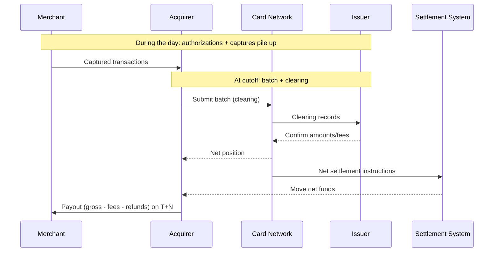

**Line-by-line highlights:**
- The two `Note over` blocks emphasize the two phases: real-time auth/capture *during* the day, batch clearing/settlement *at cutoff*.
- `NET->>CB: Net settlement` — only net amounts move, which is the efficiency that makes card systems viable.
- `ACQ->>M: Payout ... on T+N` — the merchant gets money *days* after the customer paid, net of fees. This delay is normal.

> **Mental model (settlement):** Authorization is a promise; settlement is the money. Captures accumulate, then at a cutoff they're cleared (amounts/fees agreed) and *net* funds move between banks, then the merchant is paid T+N minus fees. The customer-merchant money gap of several days is by design.

## 11.5 Common Settlement Mistakes
- Telling the merchant "you've been paid" at authorization time (you haven't).
- Forgetting to capture authorized transactions (the hold expires → no money).
- Not accounting for fees/refunds/chargebacks in payout math.
- Assuming settlement amount equals sum of authorizations (it equals captures − refunds − fees, and timing differences shift items between batches).

---

# PART 12 — RECONCILIATION

## 12.1 Step 1 — Problem Statement

You have *your* records of what happened. The bank/network has *their* records. **They will not always match**, because the two systems are independent, asynchronous, and occasionally buggy or delayed. Reconciliation is the disciplined process of comparing the two and resolving every discrepancy — because an unreconciled difference means money is unaccounted for, and that is both a financial loss and a compliance failure.

This is where the "money deducted but order failed" class of problems gets *caught and fixed*. Reconciliation is the safety net under the entire system.

## 12.2 Intuition & Analogy

Balancing a checkbook against your bank statement. You wrote down what you spent; the bank recorded what cleared. At month-end you compare line by line. A mismatch means either you forgot to record something, the bank made an error, or a transaction is still pending. You don't rest until every line is explained.

## 12.3 Internal Mechanics: internal records vs bank records

**Inputs:**
- **Internal records:** your `transaction` / `ledger_entry` / `settlement` tables.
- **Bank/network records:** settlement reports / files the acquirer or network sends (often a daily file: per-transaction lines with bank references, amounts, fees, statuses).

**Process:**
1. **Ingest** the bank's settlement file.
2. **Match** each bank line to an internal transaction (by `bank_ref`, `correlation_id`, amount, date).
3. **Classify** every line into one of:
   - **Matched** — both sides agree (amount + status). ✔ Most lines.
   - **Internal-only** — you have it, bank doesn't. (e.g., you marked success but bank has no record → likely you misread a timeout as success.)
   - **Bank-only** — bank has it, you don't. (e.g., a charge succeeded at the bank but your callback was lost → **the dangerous "customer charged, order failed" case**.)
   - **Amount mismatch** — both have it but amounts differ (fees, partial capture, currency rounding).
   - **Status mismatch** — e.g., you think Authorized, bank shows Reversed.
4. **Resolve** each exception with a defined action (see below) and record the resolution. Nothing is left unexplained.

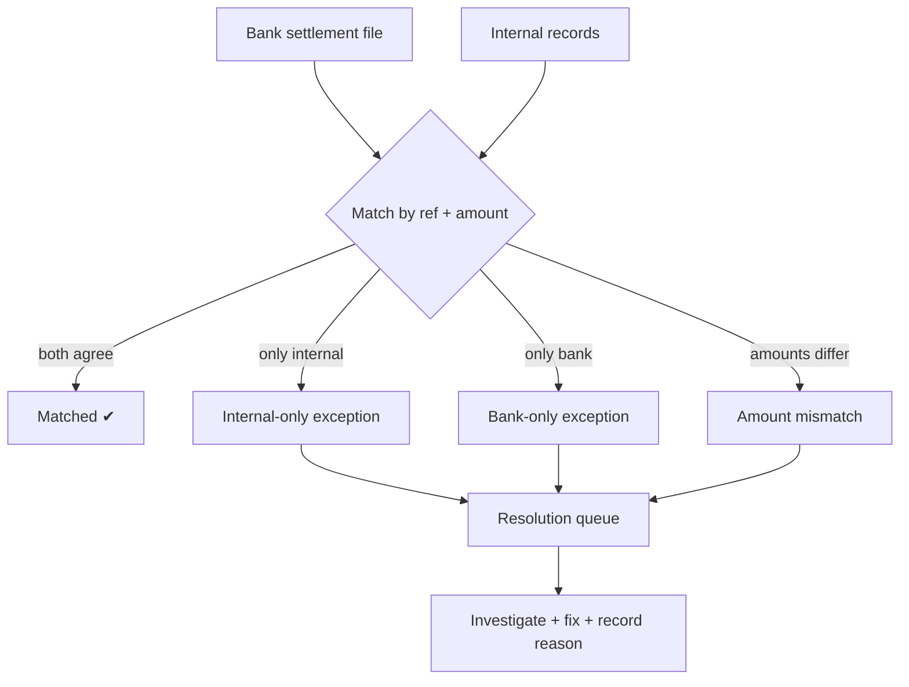

## 12.4 Mismatch handling (the playbook)

- **Bank-only (bank charged, you have nothing/Pending):** This is the classic "money deducted, order failed." Resolution: **complete the order** (the customer paid) or **refund** the customer if you can't fulfill. Update your records to match reality. This is why reconciliation often *triggers automatic refunds* for stuck/failed orders that the bank actually charged.
- **Internal-only (you think success, bank has nothing):** You likely treated a timeout as success. Resolution: query the bank's status API; if truly not charged, mark your transaction Failed and unwind any goods released.
- **Amount mismatch:** Usually fees or partial captures. Resolution: reconcile against the fee schedule; if unexplained, escalate to the acquirer.
- **Status mismatch (e.g., reversed by bank):** Update your state to match the authoritative bank record and reverse any downstream effects.

**Cadence:** reconciliation runs at least daily (matching the settlement batch). Many platforms also do **near-real-time reconciliation** for high-value flows.

> **Mental model (reconciliation):** Two independent ledgers (yours and the bank's) must be proven equal every day. Every line is Matched or an Exception; every Exception gets investigated and resolved with a recorded reason. This is the net that catches lost callbacks and timeout-misreads — and it's where "charged but failed" gets refunded. **An unreconciled difference is never acceptable.**

## 12.5 Common Reconciliation Mistakes
- Not reconciling at all (you only learn of losses from angry customers).
- Auto-trusting your own records over the bank's (the bank is authoritative for money that moved).
- No unique `bank_ref`/`correlation_id` to match on → impossible to reconcile.
- Resolving exceptions without recording *why* (breaks audit, repeats forever).

---

# PART 13 — FAILURE HANDLING

This is the part senior engineers care about most. For each scenario: **Symptoms → Cause → Solution → Prevention.**

## 13.1 Bank timeout (the canonical payment failure)

- **Symptoms:** Your request to the gateway/bank doesn't return in time. Transaction stuck in `Pending`. You don't know if the customer was charged.
- **Cause:** Network latency, bank overload, or the response packet lost on the way back. Crucially, **a timeout is not a decline** — the bank may have approved and the *response* was lost.
- **Solution:**
  1. Do **not** mark Failed. Keep it `Pending`.
  2. **Query the bank's status API** (by your `correlation_id`/reference) to learn the real outcome.
  3. If still unknown, **reconcile** later against the settlement file (Part 12).
  4. If the bank charged but order failed → refund or complete.
- **Prevention:** Always send an idempotency key / unique reference *to the bank* so a safe retry won't double-charge. Set sane timeouts. Build a "pending resolver" job that polls status for stuck transactions.

## 13.2 Network failure (between your own services)

- **Symptoms:** Payment Service can't reach Ledger/Fraud/Notification. Partial completion.
- **Cause:** Service down, deploy, network partition.
- **Solution:** Use the **Outbox + events** (Part 7) so state changes and their downstream effects are decoupled — Ledger catches up by consuming events when it's back. Apply retries with backoff and circuit breakers for sync calls.
- **Prevention:** Never make the customer's success depend on best-effort async services. Make consumers idempotent so replays after recovery don't double-post.

## 13.3 Duplicate request (double-click / client retry)

- **Symptoms:** Two payments / two charges for one order.
- **Cause:** User double-clicked, client retried a timed-out request, or a webhook/event was redelivered.
- **Solution:** **Idempotency key** on create; `UNIQUE(merchant_id, order_id)` constraint; idempotent event consumers keyed by `eventId`.
- **Prevention:** Make idempotency mandatory at the API contract level — reject create requests without a key.

## 13.4 Partial processing (crash mid-flow)

- **Symptoms:** Wallet debited but airtime not delivered; payment marked authorized but ledger not posted.
- **Cause:** A service crashed between steps of a multi-service operation.
- **Solution:** **Saga with compensations** (Part 7). Each step either completes or its compensation runs. A recovery process detects half-finished sagas and drives them to a terminal state.
- **Prevention:** Model multi-step money flows explicitly as sagas with a state machine; never do "step A in service 1, step B in service 2" with no compensation plan.

## 13.5 Callback failure (webhook lost/delayed/duplicated)

- **Symptoms:** Merchant never learns the result, or learns it twice, or out of order.
- **Cause:** Receiver was down, network dropped it, or the platform retried.
- **Solution:** **Retries with exponential backoff**, **signed + idempotent** callbacks (by `eventId`), and a **status polling** endpoint as fallback. Persist callback delivery attempts.
- **Prevention:** Never make the callback the *only* source of truth — always expose status. Document retry schedule and signature verification for integrators.

## 13.6 Database failure

- **Symptoms:** Can't persist a transaction; risk of acting without a durable record.
- **Cause:** DB down, connection pool exhausted, deadlock.
- **Solution:** **Persist intent before acting** — if you can't write the `Created`/`Pending` record, **do not call the bank.** No record = no external action. Use connection pool limits, deadlock retries, and short transactions (never hold a txn across a bank call).
- **Prevention:** "Write first, act second" discipline; health checks that stop accepting payments if the DB is unhealthy (fail closed, not open).

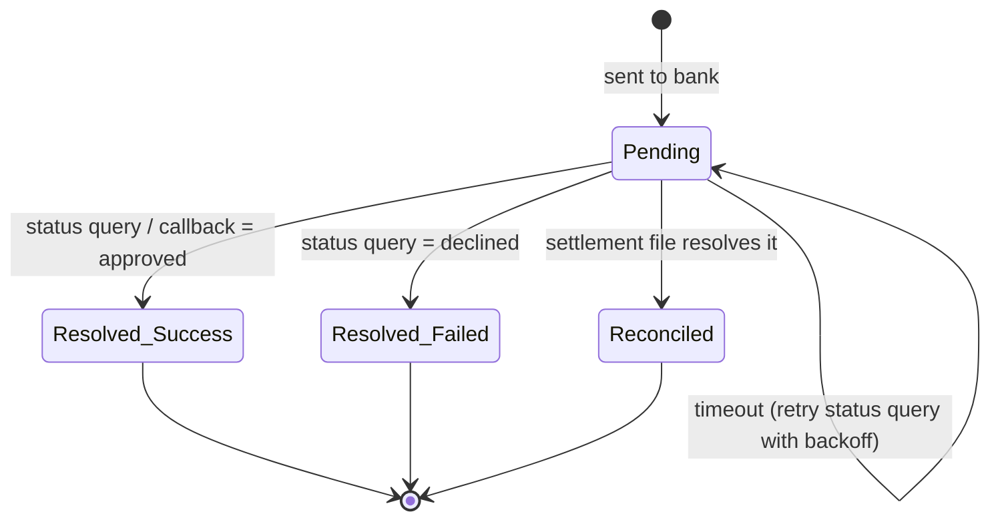
This diagram is the heart of payment reliability: **Pending is never a dead end.** Every Pending transaction is eventually resolved by a status query, a callback, or reconciliation. You design *active resolvers*, not hope.

> **Mental model (failures):** Assume every hop can fail and every response can be lost. The defenses are always the same small set: **idempotency** (no doubles), **persist-before-act** (no ghost actions), **active pending-resolution** (status queries + reconciliation), and **sagas/outbox** (recover partial flows). Master these five and you can handle any failure scenario.

---

# PART 14 — EVENT-DRIVEN PAYMENT ARCHITECTURE

## 14.1 Step 1 — Problem Statement

A payment has many downstream consequences: post to ledger, notify the merchant, score for fraud, queue for settlement, update analytics. If the Payment Service called each of these synchronously, it would be slow, tightly coupled, and one slow consumer would break checkout. **Events** decouple "something happened" from "everyone who cares about it," letting each consumer react at its own pace and letting you add new consumers without touching the producer.

## 14.2 Intuition & Analogy

A newspaper. The Payment Service *publishes* facts ("PaymentAuthorized"). Subscribers (ledger, notifications, settlement, fraud, analytics) each read and react. The publisher doesn't know or care who subscribes. Add a new subscriber tomorrow — the publisher is unchanged.

## 14.3 The events

Events are **immutable facts in the past tense.** Name them as things that *happened*, not commands:

- **PaymentCreated** — a payment intent now exists. Consumers: analytics, fraud (pre-scoring).
- **PaymentAuthorized** — the issuer approved and held funds. Consumers: ledger (post pending entries), notification (tell merchant), fraud (post-scoring).
- **PaymentCaptured** — funds marked for collection. Consumers: settlement (queue for batch), ledger.
- **PaymentCompleted** — settled; merchant will be paid. Consumers: notification, analytics, ledger (finalize).
- **PaymentFailed / PaymentRefunded / PaymentReversed** — terminal/compensating facts. Consumers: notification, ledger (refund entries), settlement adjustments.

Each event carries `paymentId`, `eventId` (for idempotency), `correlationId`, amount, currency, timestamp, and a version.

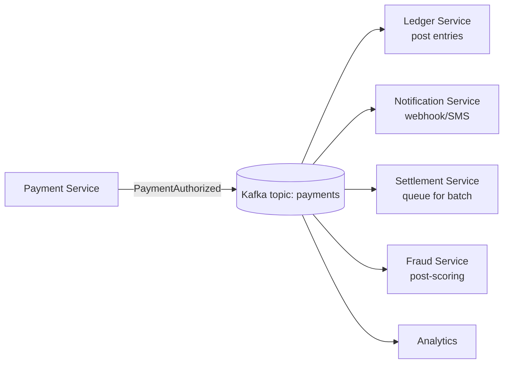

## 14.4 Consumers and their rules

- **Ledger consumer:** on `PaymentAuthorized`/`Captured`/`Completed`/`Refunded`, posts the appropriate balanced entries. **Must be idempotent** (keyed by `eventId`) because Kafka delivers at-least-once.
- **Notification consumer:** sends the merchant webhook and customer SMS. Retries with backoff. Best-effort; never blocks the money path.
- **Settlement consumer:** accumulates captured payments into batches.
- **Fraud consumer:** updates risk models with outcomes.

**Why Kafka specifically:** durable, ordered-per-partition (partition by `paymentId` so all events for one payment stay ordered), replayable (a new consumer can re-read history), and high-throughput. Partitioning by `paymentId` is the key design choice — it guarantees that for a *single payment*, events are processed in order, while different payments parallelize across partitions.

**Idempotent consumer pattern (Spring + Kafka):**
```java
@KafkaListener(topics = "payments", groupId = "ledger")
public void onPaymentEvent(PaymentEvent e) {
    if (processedEventRepo.existsById(e.eventId())) {
        return; // already handled — at-least-once delivery, dedupe here
    }
    ledgerService.postFor(e);             // do the work
    processedEventRepo.save(e.eventId()); // mark handled (same txn as the work, ideally)
}
```

> **Mental model (event-driven):** The Payment Service announces *facts*; everyone else *reacts*. Events are immutable, past-tense, idempotently consumed, partitioned by paymentId for per-payment ordering. This decouples the system, keeps checkout fast, and lets you add capabilities without touching the core. At-least-once delivery means **idempotency everywhere** (again).

## 14.5 Common Event-Driven Mistakes
- Treating events as commands ("DoLedgerPost") instead of facts ("PaymentAuthorized") → hidden coupling.
- Non-idempotent consumers → double ledger postings, double notifications.
- Wrong partition key → out-of-order processing for a single payment.
- Putting the dual-write (DB + Kafka) without the outbox → lost/phantom events.
- Making checkout wait on async consumers.

---
