# Mastering Keycloak and Spring Security

> A complete learning path that takes a Java Spring Boot developer from authentication
> fundamentals to production-grade enterprise security architectures used in banking,
> fintech, telecom, and large-scale microservice systems.

---

## How To Read This Guide

This is not a cheat sheet. It is a **mentoring book**. Each major concept follows the same
ten-step rhythm:

1. **Problem Statement** — what hurt before this existed.
2. **Intuition** — plain-language explanation.
3. **Real-World Analogy** — a mental picture.
4. **Internal Mechanics** — what actually happens inside.
5. **Step-by-Step Flow** — the exact sequence.
6. **Visual Diagram** — a Mermaid diagram, explained line by line.
7. **Code Example** — only after you understand the idea.
8. **Common Mistakes** — what bites people in production.
9. **Debugging Perspective** — how you'd know it's broken.
10. **Summary** — what to carry forward.

Read it slowly. After each chapter ask yourself the **self-check**:

> *Could I explain this to another engineer, on a whiteboard, with no notes?*

If the answer is "no," reread the chapter. The goal is **mastery, not exposure**.

### Table of Contents

- **Part 1** — Security Fundamentals
- **Part 2** — OAuth2 From Scratch
- **Part 3** — OpenID Connect (OIDC)
- **Part 4** — JWT Deep Dive
- **Part 5** — Keycloak Architecture
- **Part 6** — Spring Security Architecture
- **Part 7** — Keycloak + Spring Security Integration
- **Part 8** — OAuth2 Resource Server
- **Part 9** — Token Validation Flow
- **Part 10** — Role Mapping
- **Part 11** — Authorization
- **Part 12** — Microservice Security
- **Part 13** — Service Accounts
- **Part 14** — Advanced Enterprise Architectures
- **Part 15** — Troubleshooting
- **Part 16** — Debugging Like a Senior Engineer
- **Part 17** — Interview Questions
- **Part 18** — Hands-On Labs
- **Part 19** — Common Misconceptions
- **Part 20** — The Complete Mental Model

---

# Part 1 — Security Fundamentals

Before we touch a single line of Keycloak or Spring Security configuration, we need to build
the foundation. Almost every production incident I have seen with these tools — the 401 that
won't go away, the 403 that makes no sense, the token that "works in Postman but not in the
service" — traces back to a shaky understanding of *two words*: **authentication** and
**authorization**. If those two words are crisp in your mind, ninety percent of the confusion
disappears. So we begin there, slowly, from first principles.

## 1.1 What Is Authentication?

### Step 1 — Problem Statement

Imagine a bank in the year 1850. A man walks up to the teller and says, "I am John Smith, give
me money from John Smith's account." The teller faces an ancient, fundamental problem: **how do
I know you are who you say you are?** There is no photograph, no ID card, no signature on file.
The entire economy depends on solving this one question. If the bank cannot reliably answer it,
anyone can claim to be anyone, and money — which is really just a ledger of *who owns what* —
becomes meaningless.

This is the oldest problem in security, and it predates computers by thousands of years. A
Roman soldier presenting a wax seal, a medieval messenger carrying a signet ring, a citizen
showing a passport at a border — all of them are solving the exact same problem the bank teller
faced: **proving identity to someone who does not already know you.**

In software, the problem is identical but worse, because the two parties never physically meet.
A user in Tashkent types into a browser, and a server in Frankfurt must decide: is this really
the account holder, or an attacker who stole a password? There is no face to recognize, no
voice, no handshake. There is only data flowing across a wire — and data can be copied,
replayed, forged, and intercepted. Authentication is the discipline of answering "who are you?"
*reliably*, across an untrusted network, between parties who have never met.

### Step 2 — Intuition

Authentication is the act of **proving you are who you claim to be**. It has three moving
parts, and keeping them separate in your head is the single most useful thing in this entire
chapter:

- **Identity** — *the claim*. "I am John Smith." Anyone can make a claim. A claim by itself is
  worthless. Your username is an identity claim. Your email address is an identity claim.
- **Credentials** — *the proof*. "Here is my password / fingerprint / one-time code / private
  key." Credentials are the evidence you offer to back up your claim. Good credentials are
  things that *only the real John Smith* could possess or produce.
- **Verification** — *the checking*. The system compares the credential against what it knows
  and decides: accept or reject. This is where trust is actually established.

The key insight juniors miss: **identity is cheap, credentials are everything.** Claiming to be
the CEO costs nothing. *Proving* it is the whole game. When you debug authentication, you are
almost always debugging the credential-and-verification half, not the identity half.

### Step 3 — Real-World Analogy

Think of arriving at an international airport. You walk up to passport control:

- You **claim** an identity by handing over your passport (the name printed inside).
- The passport itself is your **credential** — a document with security features (hologram,
  chip, watermark) that is hard to forge.
- The officer **verifies** by checking the hologram, scanning the chip, comparing your face to
  the photo, and querying a database.

Notice three things that map *perfectly* onto software authentication. First, the officer never
*knew* you before — trust is established fresh, from evidence. Second, the credential is
designed to be hard to forge; a passport is not just a piece of paper with a name. Third, the
officer can reject you even though you made a confident claim. "I am a citizen" is not enough;
the *proof* must hold up.

### Step 4 — Internal Mechanics

Mechanically, authentication is a comparison against a **stored secret or trusted reference**.
The system holds something it can check your credential against:

- For passwords: a **hash** of the real password (never the password itself — more on this
  below). The system hashes what you typed and compares the two hashes.
- For OTP/TOTP: a **shared seed** plus the current time, run through an algorithm to produce a
  6-digit code that both sides can compute independently.
- For certificates and JWTs: a **public key** that can verify a signature produced by a matching
  private key, *without* the verifier ever holding the secret.

That last category — public-key verification — is the one that makes modern distributed
authentication possible, and it is the beating heart of Keycloak and JWT. Hold that thought; we
return to it in depth in Part 4.

A crucial mechanical detail: **good systems never store the raw credential.** A bank does not
store your password in a column called `password`. It stores `bcrypt(password + salt)`. When
you log in, it hashes your input the same way and compares. This means even if the database
leaks, attackers don't get usable passwords. If you ever see a system storing plaintext
passwords, that is a fireable-offense-level bug.

### Step 5 — Step-by-Step Flow (password login)

1. User types username `john` and password `hunter2` into a form.
2. Browser sends them over **HTTPS** (so the wire is encrypted — without this, step 1 is
   pointless).
3. Server receives the request and looks up the user record for `john`.
4. Server retrieves the *stored hash* for John, e.g. `bcrypt` output plus the salt.
5. Server hashes the submitted `hunter2` using the same salt and algorithm.
6. Server compares the freshly computed hash to the stored hash, byte for byte.
7. If they match, the credential is **verified** — the system now believes you are John.
8. The server creates some proof-of-login (a session or a token) so John doesn't have to
   re-authenticate on every click.
9. That proof is returned to the browser and used for subsequent requests.

Every step matters. Skip HTTPS and step 2 leaks the password. Skip salting in step 4 and two
users with the same password get the same hash, enabling rainbow-table attacks. Authentication
is a chain; the weakest link defines its strength.

### Step 6 — Visual Diagram

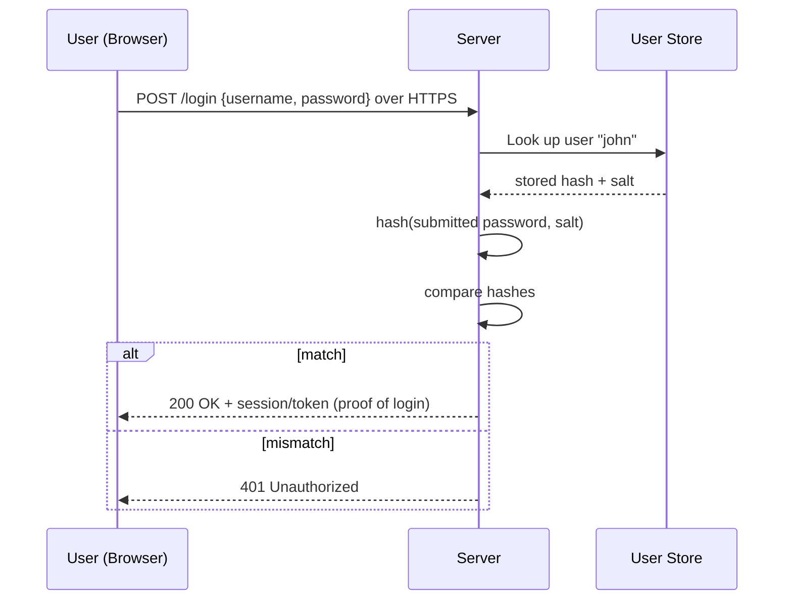

Reading this diagram line by line: the **User** sends credentials to the **Server**. The Server
does *not* trust them yet — it turns to the **User Store** to fetch the reference hash. The two
self-arrows (`S->>S`) are the cryptographic comparison happening entirely inside the server; no
network is involved there. The `alt` block shows the only two outcomes that exist in
authentication: you proved it (200 + proof) or you didn't (401). Memorize that **401 means
"authentication failed / missing"** — we will contrast it sharply with 403 shortly.

### Step 7 — Credential Types (with code)

Different credentials offer different strength. A senior engineer chooses based on the threat
model, not fashion.

```text
Username/Password   — something you KNOW.    Weakest alone; phishable, reusable.
OTP / TOTP          — something you HAVE.    A second factor; defeats stolen passwords.
Biometrics          — something you ARE.     Fingerprint/face; convenient, not secret-revocable.
API Keys            — a long shared secret.  Good for machines; bad if leaked (no expiry usually).
Certificates (mTLS) — public-key proof.      Strongest for machine identity; hard to phish.
```

A tiny illustration of *why you never store raw passwords*, using Spring Security's encoder:

```java
PasswordEncoder encoder = new BCryptPasswordEncoder();

// At registration: store ONLY this, never the raw password.
String stored = encoder.encode("hunter2");
// e.g. $2a$10$N9qo8uLOickgx2ZMRZoMy... (salt is embedded in the string)

// At login: compare without ever decrypting (bcrypt is one-way).
boolean ok = encoder.matches("hunter2", stored); // true
```

The important line is `encoder.matches(...)`. There is no `decrypt`. Bcrypt is a **one-way**
function — you can verify a guess but you cannot reverse the hash back to the password. This is
the property that makes password storage safe-ish even when databases leak.

### Step 8 — Common Mistakes

- **Confusing identity with authentication.** Knowing a username is not authentication. The
  *proof* is. Many "auth bugs" are really "we trusted a claim without checking the credential."
- **Storing plaintext or reversibly-encrypted passwords.** Always one-way hash with a slow,
  salted algorithm (bcrypt, scrypt, argon2).
- **Authenticating over plain HTTP.** Credentials in the clear are credentials given away.
- **Believing MFA is unbreakable.** It dramatically raises the bar but phishing proxies can
  relay OTPs in real time. Defense in depth still matters.

### Step 9 — Debugging Perspective

When authentication fails in a real system, the signal is almost always an **HTTP 401** and a
log line near your login or token-validation code. You ask: *did the credential arrive?* (is the
header/form field present?), *is it well-formed?* (typo, truncation, encoding), *does it verify
against the reference?* (wrong realm, wrong key, clock skew for OTP/JWT). In Part 15 we turn
each of these into a precise diagnostic recipe. For now, internalize: **401 = "I don't believe
who you are."**

### Step 10 — Summary

Authentication answers **"who are you?"** through three parts: an *identity* (claim), a
*credential* (proof), and *verification* (the check). The proof, not the claim, is where
security lives. Systems verify by comparing against a stored hash or a trusted public key, never
by storing raw secrets. The universal failure signal is **401**. Mental picture: a passport
officer who has never met you, establishing trust purely from evidence that is hard to forge.

---

## 1.2 What Is Authorization?

### Step 1 — Problem Statement

Now flip the bank scenario forward. The teller has confirmed you really are John Smith — great.
But John walks over to the vault and says, "Open it, I want to inspect the gold reserves." Being
*John Smith* does not entitle him to the vault. He's a checking-account customer, not the vault
manager. The new question is not "who are you?" but **"are you allowed to do this?"** That is
authorization, and it is a completely different question that begins *only after* authentication
succeeds.

Before access-control systems, software often conflated the two: if you could log in, you could
do anything. That worked when every logged-in user was trusted equally. The moment systems had
*different kinds* of users — customers, tellers, managers, auditors, regulators — a logged-in
identity was no longer enough. You needed to encode *what each identity is permitted to do.*

### Step 2 — Intuition

Authorization is **deciding what an authenticated identity is allowed to do**. It assumes
authentication already happened. Its building blocks:

- **Permissions** — atomic "can do X" facts. `can_view_balance`, `can_transfer_funds`,
  `can_open_vault`.
- **Roles** — bundles of permissions given a name. `TELLER`, `MANAGER`, `AUDITOR`. Roles exist
  so we don't assign fifty individual permissions to every person; we assign a role, and the
  role carries the permissions.
- **Access control** — the runtime decision: given *this* identity with *these* roles, do we
  allow *this* action on *this* resource?

The clean mental separation: **authentication establishes *who*; authorization decides *what
that who may do*.** They are sequential. You cannot authorize an unknown party — there's nothing
to base the decision on.

### Step 3 — Real-World Analogy

A hotel. **Authentication** happens at the front desk: you show ID and your booking, and they
hand you a key card. **Authorization** happens at every door afterward. Your card opens *your*
room (you're permitted) and the gym (a perk of your booking) but not other guests' rooms and not
the staff-only server room. The card *proves who you are* (authenticated) but the lock decides
*what you may enter* (authorized). Same card, different doors, different answers. That is exactly
how a JWT works: the token authenticates you everywhere, but each service's locks decide what you
can reach.

### Step 4 — Internal Mechanics

Internally, authorization is a **policy evaluation**. The system gathers:

1. The **subject's attributes** — their roles, groups, scopes, maybe department or tenant.
2. The **action and resource** — "transfer funds from account X."
3. A **policy** — rules that map (attributes, action, resource) → allow/deny.

The evaluation can be:

- **Role-Based Access Control (RBAC)** — "MANAGERs may open vaults." Decision is a set
  membership test: does the user have the required role? This is what 95% of Spring apps use.
- **Attribute-Based Access Control (ABAC)** — "Allow if user.department == account.department
  AND amount < user.limit AND time is business hours." Richer, rule-driven.
- **Relationship-Based (ReBAC)** — "Allow if user is the *owner* of this document." Decision
  depends on the relationship between subject and specific object.

In Spring Security, RBAC shows up as `hasRole('MANAGER')`, ABAC/ReBAC shows up as
`@PreAuthorize` expressions and custom `AuthorizationManager` beans. We cover all of this in
Part 11.

### Step 5 — Step-by-Step Flow

1. Request arrives at a protected endpoint: `POST /accounts/123/transfer`.
2. The system already knows *who* you are (authentication done, identity in context).
3. It reads your **granted authorities** (roles/permissions) from the security context.
4. It reads the endpoint's **required authority** (e.g. "needs `ROLE_TELLER` or higher").
5. It evaluates the policy: is the required authority present in your set?
6. If yes → the request proceeds to business logic.
7. If no → the request is rejected with **403 Forbidden** (note: *not* 401 — you're
   authenticated, just not permitted).

### Step 6 — Visual Diagram

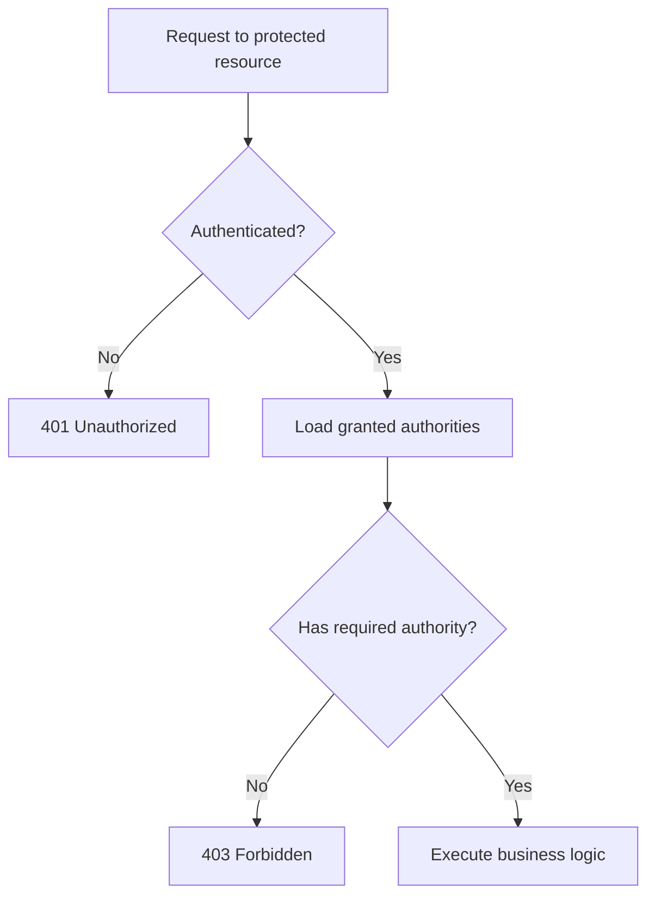

Line by line: every protected request first passes the **authentication gate** (`B`). Fail it →
**401**. Pass it → we load *what you're allowed to do* (`D`) and compare against *what this
resource requires* (`E`). Fail that → **403**. Pass it → the actual work runs (`G`). This single
diagram is the skeleton of every secured request in Spring Security. The two diamonds are
authentication and authorization, in that strict order.

### Step 7 — Code Example

```java
@RestController
@RequestMapping("/accounts")
class AccountController {

    // Authentication is handled upstream by the filter chain.
    // This annotation is pure AUTHORIZATION: who may call this method.
    @PreAuthorize("hasRole('TELLER')")
    @PostMapping("/{id}/transfer")
    public TransferResult transfer(@PathVariable String id, @RequestBody TransferRequest req) {
        return service.transfer(id, req);
    }
}
```

The one line that matters is `@PreAuthorize("hasRole('TELLER')")`. By the time this method is
considered, Spring Security already knows *who* the caller is. This annotation answers the
second question: *may this who do this?* If the caller lacks `ROLE_TELLER`, Spring throws an
`AccessDeniedException` which becomes a **403** — the business method never runs.

### Step 8 — Common Mistakes

- **Returning 401 when you mean 403 (and vice versa).** They are diagnostically opposite. 401:
  "log in / your token is bad." 403: "you're known but not allowed." Mixing them sends engineers
  hunting in the wrong half of the system for hours.
- **Authorizing in the UI only.** Hiding a button is UX, not security. The server must enforce.
  An attacker calls your API directly.
- **God roles.** One `ADMIN` role that can do everything becomes a single catastrophic blast
  radius. Prefer least privilege.

### Step 9 — Debugging Perspective

Authorization failures surface as **403** with an `AccessDeniedException` in logs. The questions
become: *what authorities does the principal actually have?* (often the surprise: the role you
expected isn't in the token, or it's named `realm_role_teller` not `ROLE_TELLER`), and *what did
the endpoint require?* The gap between those two sets is your bug. Most "403 mysteries" in
Keycloak + Spring are role-*mapping* mismatches, which is why Part 10 exists.

### Step 10 — Summary

Authorization answers **"what may you do?"** It runs *after* authentication, using roles and
permissions evaluated against a policy. RBAC (role membership) covers most cases; ABAC/ReBAC
handle richer rules. The universal failure signal is **403**, distinct from authentication's
401. Mental picture: a hotel key card that proves who you are but whose access each door decides
independently.

---

## 1.3 Authentication vs Authorization (Side by Side)

It is worth one concentrated page on the distinction because it is the root of more confusion
than any other topic in this guide.

| Dimension | Authentication | Authorization |
|---|---|---|
| Question | Who are you? | What may you do? |
| When | First | After authentication |
| Based on | Credentials (proof) | Roles / permissions / attributes |
| Failure code | **401** Unauthorized | **403** Forbidden |
| Analogy | Showing your passport | The visa stamp that says where you can go |
| Spring piece | Filter chain, `AuthenticationManager`, JWT decode | `@PreAuthorize`, `AuthorizationManager` |
| Keycloak piece | Login, token issuance | Roles, groups, scopes baked into the token |

**Banking example that fuses both:** An auditor logs in successfully (authenticated — she really
is the auditor). She tries to *modify* a transaction. She is *authorized* to **read** every
transaction but **not to write** any. Result: login succeeds (no 401), the write is rejected
(403). Same person, same session, different answers per action. If your system returned 401
here, you'd waste an hour suspecting her token — when the token was perfect and the *policy* did
its job correctly.

A subtle but career-defining nuance: the HTTP spec named the codes confusingly. **401 is
literally labeled "Unauthorized" but actually means "Unauthenticated."** **403 "Forbidden" is
the real authorization failure.** Senior engineers read 401 as "your identity isn't established"
and 403 as "your identity is fine, your permissions aren't." Burn that into memory now; it saves
you constantly.

---

## 1.4 Session-Based Authentication

### Step 1 — Problem Statement

You proved who you are at login. Now you click ten pages in a row. Should you retype your
password on every click? Obviously not — that's unusable. So after the first successful
authentication, the system needs to *remember* you across many requests. HTTP itself is
**stateless**: each request is an independent letter with no memory of the last. The server, by
default, has amnesia. Session-based authentication is the original, classic cure for that
amnesia.

### Step 2 — Intuition

After you log in, the server creates a **session** — a little record in its memory (or a
database/Redis) that says "this is John, logged in at 10:00, here's his cart, his roles, etc."
It gives the browser a **session ID**: a random, meaningless string like
`JSESSIONID=8af2...`. The browser sends that ID back on every subsequent request (in a cookie).
The server looks up the ID in its session store, finds "oh, that's John," and treats the request
as authenticated. The *real* data lives on the server; the browser holds only a claim ticket.

The defining property: **the server is stateful.** It must *store* every active session. The
cookie is just a pointer into server-side memory.

### Step 3 — Real-World Analogy

A coat check at a theater. You hand over your coat (authenticate once), and you get a numbered
ticket (session ID). The ticket itself is worthless — it's just a number. The *coat* (your real
state) stays with the attendant. To get your coat back, you present the ticket; the attendant
looks up slot #42 and returns your coat. If the cloakroom burns down (server restart, session
store wiped), your ticket is useless even though it's still in your pocket. That's the essence of
server-side sessions: the value lives with the server, not in the ticket.

### Step 4 — Internal Mechanics

- On login, the server generates a cryptographically random **session ID** and creates a
  **session object** keyed by that ID in a **session store** (in-memory map, Redis, JDBC).
- The ID is returned in a `Set-Cookie: JSESSIONID=...; HttpOnly; Secure; SameSite` header.
- On each request, the browser auto-attaches `Cookie: JSESSIONID=...`.
- A server filter reads the cookie, looks up the session object, and rehydrates the
  authentication into the request context.
- On logout (or timeout), the server **deletes** the session object — instant revocation.

The flags matter: `HttpOnly` stops JavaScript from reading the cookie (defends against XSS theft),
`Secure` forces HTTPS-only transmission, `SameSite` mitigates CSRF.

### Step 5 — Step-by-Step Flow

1. User submits credentials.
2. Server verifies them (Section 1.1).
3. Server creates a session object and a random session ID.
4. Server stores the session in its session store.
5. Server returns `Set-Cookie: JSESSIONID=...`.
6. Browser stores the cookie.
7. On the next request, browser sends the cookie automatically.
8. Server looks up the session ID in the store.
9. Found → request is authenticated, identity rehydrated.
10. On logout, server deletes the session; the cookie becomes a dead ticket.

### Step 6 — Visual Diagram

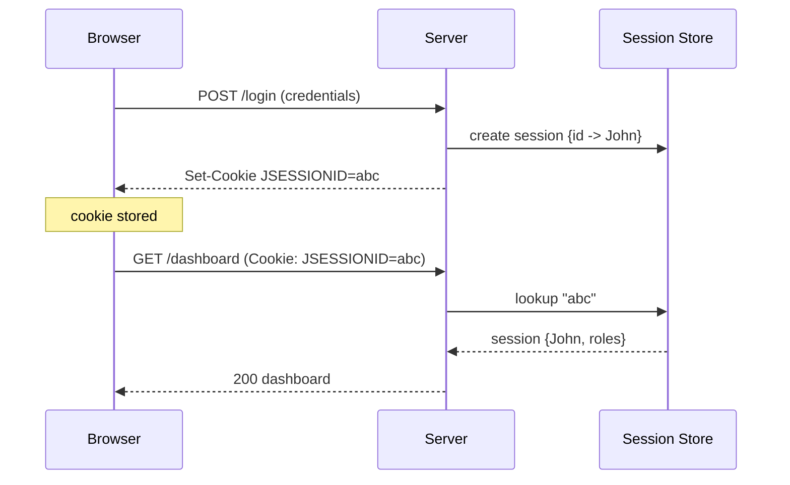

The crucial arrow is `S->>Store: lookup "abc"` on **every** request. That round trip to the
session store is the cost — and the limitation — of sessions. The server cannot know who you are
from the cookie alone; it *must* consult its memory. Remember that arrow; tokens exist largely
to eliminate it.

### Step 7 — Code (Spring's default)

```java
http
  .formLogin(Customizer.withDefaults())   // classic session login
  .sessionManagement(s -> s.sessionCreationPolicy(SessionCreationPolicy.IF_REQUIRED));
```

By default, traditional Spring MVC apps are session-based: `formLogin` plus a server-side
`HttpSession`. The `IF_REQUIRED` policy means "create a session when needed." This is the model
Spring used for fifteen years and still uses for server-rendered apps. Note: for the
resource-server APIs we build later, we'll switch this to `STATELESS` — no sessions at all.

### Step 8 — Common Mistakes

- **Forgetting that sessions don't scale horizontally for free.** Three server instances behind
  a load balancer each have their own in-memory store. A user logs in on instance A, the next
  request hits instance B, which has no record of them → mysterious logouts. Fix: sticky
  sessions or a shared store (Redis). This pain is a major reason microservices moved to tokens.
- **Not setting `HttpOnly`/`Secure`/`SameSite`** → cookie theft and CSRF.
- **Unbounded session stores** → memory exhaustion under load.

### Step 9 — Debugging Perspective

Session bugs look like "I keep getting logged out" or "I'm logged in as someone else." You check:
is the cookie present and unchanged? Is there one shared session store or N per-instance stores?
Did a deploy/restart wipe in-memory sessions? The smoking gun is usually a load balancer
spreading requests across instances that don't share state.

### Step 10 — Summary

Session-based auth cures HTTP's amnesia by storing identity **on the server** and handing the
browser a meaningless **session ID** cookie. **Advantages:** simple, instantly revocable (delete
the session), small cookie, server fully controls state. **Disadvantages:** the server must store
and look up every session (stateful), which complicates horizontal scaling and cross-service
sharing. Mental picture: a coat-check ticket — the value stays with the attendant.

---

## 1.5 Token-Based Authentication

### Step 1 — Problem Statement

The coat-check model breaks down the moment you have *many* coat checks. Picture a modern bank's
backend: an API gateway, an accounts service, a payments service, a notifications service, a
fraud service — twenty microservices, each possibly running five instances, possibly written in
different languages, possibly owned by different teams. With sessions, *every one of them* would
need to reach the *same* session store on *every* request to learn who the caller is. That's a
shared bottleneck, a single point of failure, and a coupling nightmare. The accounts service
shouldn't have to phone a central session database — and certainly shouldn't have to trust that
the payments team configured the same store correctly.

The deeper problem: sessions make identity **a server-side lookup**. In a distributed system you
want identity to be **self-contained** — to travel *with* the request so any service can verify
it independently, with no shared state and no network call.

### Step 2 — Intuition

What if, instead of giving you a meaningless ticket and keeping your data on the server, we give
you a **sealed, tamper-proof document that contains your identity and is signed by an authority
everyone trusts?** Now you don't need the server to remember you. You carry the proof yourself.
Any service can read the document, verify the signature, and instantly know "this is John, he's
a TELLER, the token is valid until 10:15" — *without calling anyone.*

That sealed document is a **token** (specifically, a JWT — Part 4). The shift is profound:

- Sessions: identity is **stored on the server**; the client holds a pointer.
- Tokens: identity is **carried by the client**; the server holds *nothing* and verifies on the
  spot using a signature.

This is what "stateless authentication" means. The server keeps no per-user record. It just
checks the signature on each incoming token. That property — no shared state — is *exactly* what
distributed, horizontally-scaled microservices need.

### Step 3 — Real-World Analogy

A **passport with a visa** versus a coat-check ticket. A coat-check ticket means nothing on its
own — you must return to *that* cloakroom. A passport is the opposite: it *contains* your
identity (name, photo, nationality) and is *signed/sealed* by a government whose seal border
officers everywhere recognize. Any border officer, in any country, can verify it **without
phoning your home country**. They trust the seal. That is a token: a self-contained, signed proof
of identity that any service can verify locally because they all trust the same signing authority
(Keycloak). Twenty services = twenty border officers, all trusting the same seal, none needing to
call home.

### Step 4 — Internal Mechanics

- At login, an **authority** (Keycloak) verifies your credentials and issues a **signed token**
  containing your identity and claims (roles, expiry, audience).
- The token is signed with the authority's **private key**. Crucially, the authority is the
  *only* holder of that private key.
- Every service holds the matching **public key** (fetched once from Keycloak's JWKS endpoint —
  Part 4). With it, a service can *verify* the signature but cannot *forge* a token.
- On each request, the client sends the token in an `Authorization: Bearer <token>` header.
- The service verifies the signature, checks expiry/issuer/audience, reads the claims, and
  proceeds — **no session store, no network call to Keycloak per request.**

The asymmetry is the magic: private key signs (Keycloak only), public key verifies (everyone).
We devote all of Part 4 to this.

### Step 5 — Step-by-Step Flow

1. User authenticates once at Keycloak.
2. Keycloak verifies credentials and **signs** a JWT with its private key.
3. JWT returned to the client.
4. Client stores it and attaches it to each API call as `Authorization: Bearer ...`.
5. Service receives the request, extracts the token.
6. Service verifies the signature using Keycloak's public key (cached).
7. Service checks `exp` (not expired), `iss` (right issuer), `aud` (intended for me).
8. Service reads claims → builds the security context → authorizes → runs business logic.
9. No session is stored anywhere. The token *is* the proof.

### Step 6 — Visual Diagram

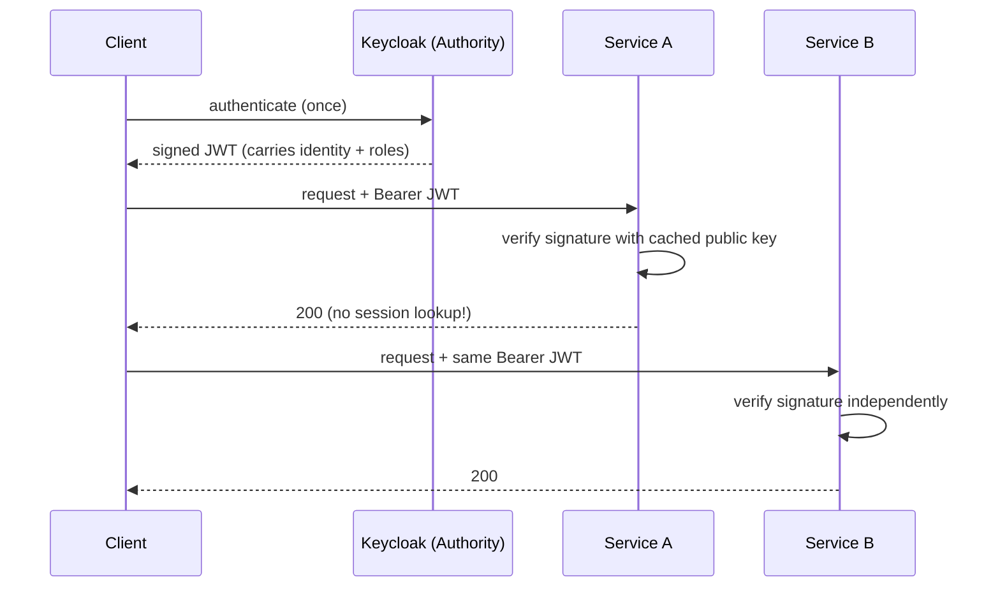

Contrast this with the session diagram. There is **no Session Store** participant and **no
per-request lookup arrow** to Keycloak. Services A and B each verify the token *by themselves*
(`A->>A`, `B->>B`) using a cached public key. Keycloak is contacted *once*, at login. That
absence of a shared lookup is the entire reason tokens dominate microservices.

### Step 7 — Code Example

```java
// A resource server: this is ALL it takes to validate Keycloak tokens.
http
  .authorizeHttpRequests(a -> a.anyRequest().authenticated())
  .oauth2ResourceServer(o -> o.jwt(Customizer.withDefaults()))
  .sessionManagement(s -> s.sessionCreationPolicy(SessionCreationPolicy.STATELESS));
```

Two lines carry the meaning. `oauth2ResourceServer().jwt()` tells Spring: "expect a Bearer JWT,
fetch the public keys from the configured issuer, and verify every incoming token." `STATELESS`
declares: "create *no* sessions; each request stands alone, authenticated purely by its token."
This is the model the rest of the guide builds on.

### Step 8 — Common Mistakes

- **Treating tokens like sessions and trying to revoke them per-request.** A signed JWT is valid
  until it expires; you can't "delete" it from a store because there is no store. Revocation
  needs extra machinery (short lifetimes, token blacklists, or back-channel logout). Misjudging
  this causes "I logged out but my token still works" surprises.
- **Putting secrets in the token.** JWTs are *signed*, not *encrypted* — anyone can read the
  payload (Part 4). Never put passwords or PII you wouldn't want visible.
- **Long-lived access tokens.** Because you can't easily revoke them, keep them short (minutes)
  and use refresh tokens (Part 2.4).

### Step 9 — Debugging Perspective

Token problems show as 401 (bad/expired/missing token) and 403 (token valid but lacks the role).
You decode the token (jwt.io or `jwt decode`), check `exp`, `iss`, `aud`, and the roles claims.
The beauty for debugging: the token is *self-describing* — paste it and read exactly what the
service sees. We make this a precise discipline in Part 16.

### Step 10 — Summary

Token-based auth makes identity **self-contained and portable**: a signed token carries who you
are so any service can verify it locally, with no shared session store and no per-request call
home. **Why invented:** to authenticate across **stateless, distributed** systems where
server-side sessions don't scale or share well. **Trade-off:** statelessness costs easy
revocation. Mental picture: a signed passport every border officer trusts without phoning your
country. This is the foundation everything else in this guide stands on — and the reason OAuth2,
OIDC, JWT, and Keycloak exist.

---

# Part 2 — OAuth2 From Scratch

We will now teach OAuth2 as though you have never heard the term. This matters because OAuth2 is
the *most misunderstood* technology in the modern security stack. Engineers use it daily and
still cannot explain what problem it solves. By the end of this part you will be able to draw any
OAuth2 flow on a whiteboard and explain *why* each actor exists.

## 2.1 The Problem OAuth2 Solves

### Step 1 — Problem Statement

Picture the early 2010s. You sign up for a budgeting app, "MoneyTracker." To be useful it needs
to read your bank transactions. How does it get them? In the bad old days, MoneyTracker would ask
you for your **bank username and password**, store them, and log into your bank *as you* to
scrape data. Stop and feel how catastrophic this is:

- MoneyTracker now **knows your bank password**. A startup with three engineers holds the keys
  to your money.
- It has **full access** — not just "read transactions" but transfers, wire payments, everything.
  There is no way to grant *only* read access.
- You **cannot revoke** MoneyTracker without **changing your bank password** (which breaks every
  other app you gave it to).
- If MoneyTracker is breached, your **bank credentials leak**, not just some app data.

This is the "password anti-pattern," and it was genuinely how early integrations worked. The core
problem: **how do I let a third-party application access *some* of my data on *another* service,
without giving it my password, with limited scope, for a limited time, revocably?**

That sentence *is* OAuth2. Read it again. OAuth2 is **delegated authorization** — granting an
app limited access to your resources without sharing your credentials.

### Step 2 — Intuition

The breakthrough idea: instead of giving MoneyTracker your password, you send MoneyTracker *to
the bank*. The bank asks *you* (not MoneyTracker) to log in directly, then asks "do you want to
let MoneyTracker **read your transactions**?" You say yes. The bank hands MoneyTracker a
**limited-purpose access token** — a key that opens *only* the "read transactions" door, expires
in an hour, and can be revoked any time without touching your password.

MoneyTracker never sees your password. It only ever holds a narrow, expiring, revocable token.
That is the entire intuition: **separate the act of proving who you are (which only you and the
bank do) from the act of granting an app limited access (a token the bank issues on your
behalf).**

### Step 3 — Real-World Analogy

A **hotel valet key**. When you hand your car to a valet, you don't give them your *master* key
that also opens your house and your trunk. You give a **valet key**: it starts the car and opens
the driver's door, but *not* the trunk or glovebox, and it works only while you're at the hotel.
The valet does their job with a *deliberately limited* key. OAuth2's access token is the valet
key: scoped (only certain doors), temporary, and revocable, issued *without* handing over your
real keys (password).

### Step 4 — The Four Actors (Internal Mechanics)

OAuth2 defines exactly four roles. Memorize them; every flow is just these four passing messages.

1. **Resource Owner** — *you*, the human who owns the data. (You own your bank transactions.)
2. **Client** — the application that wants access. (MoneyTracker.) "Client" does **not** mean
   browser; it means the app requesting access. This trips people up constantly.
3. **Authorization Server** — the service that authenticates the resource owner and issues
   tokens. **This is Keycloak's primary job.** (In the analogy, the bank's login + token desk.)
4. **Resource Server** — the API that holds the protected data and accepts tokens. (The bank's
   transactions API. In *your* world, **your Spring Boot microservices are resource servers.**)

The relationships: the **Client** wants to reach the **Resource Server** on behalf of the
**Resource Owner**, and the **Authorization Server** brokers that trust by issuing tokens. Keep
this picture: *Keycloak is the Authorization Server; your services are Resource Servers; your
frontend or another service is the Client; the user is the Resource Owner.*

### Step 5 — A Vocabulary You Now Own

- **Access Token** — the valet key. Sent to resource servers to access data. Short-lived.
- **Refresh Token** — a longer-lived key used to get *new* access tokens without re-login.
- **Scope** — the specific permissions a token carries (`accounts:read`, `payments:write`).
- **Grant / Flow** — the *method* by which a client obtains a token. Different situations
  (browser app, mobile app, machine-to-machine, device) need different flows. The rest of Part 2
  walks each one.

### Step 6 — Visual: the actors

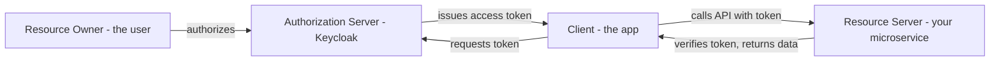

Line by line: the **Resource Owner** authorizes at the **Authorization Server** (Keycloak). The
**Client** asks Keycloak for a token and receives one. The Client then calls the **Resource
Server** (your service) presenting that token. The Resource Server verifies it and serves data.
Notice the Client never touches the user's password — it only ever holds tokens issued by
Keycloak. That separation is OAuth2's whole reason for being.

### Step 7 — Why this matters for you

In your microservice world, you will constantly map real components onto these four roles. When
something breaks, the *first question a senior asks* is: "which actor is which here, and which
hop is failing?" Is the **client** failing to obtain a token (a Keycloak/client-config problem)?
Or is the **resource server** rejecting a valid token (a Spring Security validation problem)?
Naming the actors instantly halves your search space.

### Step 8 — Common Mistakes

- **Thinking OAuth2 is about authentication.** It is **authorization/delegation**. It says
  nothing, by itself, about *who the user is* — that gap is exactly why OIDC was bolted on top
  (Part 3). Using "raw" OAuth2 for login is a classic security mistake.
- **Confusing "Client" with "frontend."** A backend service calling another service is *also* a
  client. Keycloak models both as clients.
- **Believing the access token proves identity to the client.** It doesn't; it grants access to
  the resource server. (Again — OIDC fixes the "who is the user" question.)

### Step 9 — Debugging Perspective

When OAuth2 misbehaves, locate the failing hop among the four actors. Token-acquisition failures
(client ↔ authorization server) look like errors from the `/token` endpoint:
`invalid_client`, `invalid_grant`, `unauthorized_client`. Token-*usage* failures (client ↔
resource server) look like 401/403 from your API. Knowing which endpoint produced the error tells
you which half of OAuth2 to investigate.

### Step 10 — Summary

OAuth2 solves **delegated authorization**: letting an app access *some* of your data on another
service without your password, with limited scope, limited lifetime, and revocability. Four
actors — Resource Owner, Client, Authorization Server (Keycloak), Resource Server (your
services). Mental picture: a hotel valet key. Everything that follows — the flows — are just
*different ways for a client to obtain that valet key*, each suited to a different situation.

---

## 2.2 Authorization Code Flow

### Step 1 — Problem Statement

You have a web app and a user with a browser. The user must log in (at Keycloak) and the app must
end up holding an access token — but **the app's backend should be the one to receive the token,
and the user's password must never touch the app.** Also, the token must not be exposed in places
it can leak (browser history, URLs, logs). How do we choreograph this safely? The Authorization
Code Flow is the answer, and it is the **default, most secure flow for server-side web apps.**

### Step 2 — Intuition

The clever trick: don't send the token through the browser directly. Instead, send a **temporary,
single-use "authorization code"** through the browser, then have the app's backend **exchange
that code for the real token over a direct, server-to-server back channel.** The code is useless
if stolen in transit (it's single-use, short-lived, and exchanging it requires the client's
secret). The valuable token only ever travels on the secure back channel, never through the
browser. It's a two-step handoff precisely so the sensitive item never goes through the risky
path.

### Step 3 — Real-World Analogy

Picking up a will-call concert ticket. The website doesn't mail you the actual ticket (too
stealable). It emails you a **confirmation code**. You bring that code to the box office and
exchange it — along with your ID — for the **real ticket**. The code in your email is low-value
(useless without your ID at the window); the real ticket only materializes at the secure counter.
Authorization code = confirmation code; the token = the real ticket; the box office = Keycloak's
token endpoint.

### Step 4 — Internal Mechanics

Two channels operate:

- **Front channel** (through the browser, visible, less trusted): used to authenticate the user
  at Keycloak and return the short-lived **authorization code** to the app's redirect URI.
- **Back channel** (direct app-backend ↔ Keycloak, invisible to browser, authenticated with the
  client secret): used to **exchange the code for tokens**.

The client is registered in Keycloak with a **client ID**, a **client secret**, and a
**redirect URI** (where Keycloak sends the code; Keycloak only redirects to pre-registered URIs
to prevent token/code hijacking). A **state** parameter ties the response to the original request
to defeat CSRF.

### Step 5 — Step-by-Step Flow

1. User clicks "Login." The app redirects the browser to Keycloak's `/authorize` endpoint with
   `response_type=code`, `client_id`, `redirect_uri`, `scope`, and a random `state`.
2. Keycloak shows its login page. The **user authenticates directly with Keycloak** (app never
   sees the password).
3. Keycloak may show a consent screen ("App X wants to access ...").
4. Keycloak redirects the browser back to the app's `redirect_uri` with `?code=ABC&state=...`.
5. The app verifies `state` matches what it sent (CSRF check).
6. The app's **backend** calls Keycloak's `/token` endpoint **directly**, sending the `code`,
   its `client_id`, and `client_secret`.
7. Keycloak validates the code (unused, unexpired, issued to this client) and returns an
   **access token**, **refresh token**, and (with OIDC) an **ID token**.
8. The app stores the tokens server-side and establishes the user's session.
9. The app calls resource servers using the access token.

### Step 6 — Visual Diagram

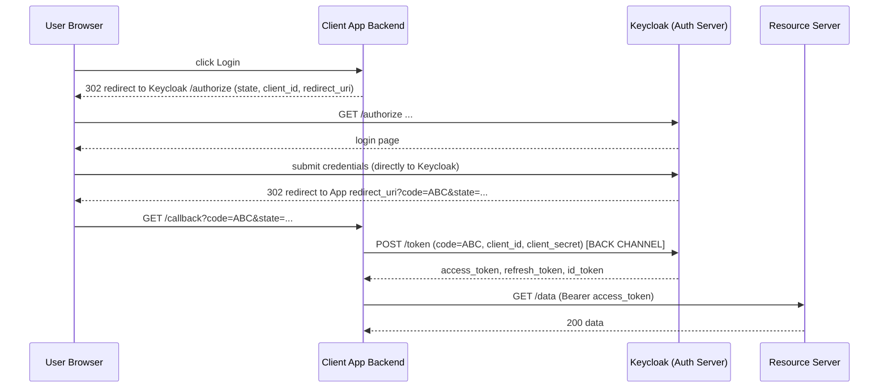

The pivotal lines are the **redirect with `code=ABC`** (front channel, browser-visible) and the
**`POST /token` with the client secret** (back channel, browser-invisible). The code crosses the
visible channel; the token is born on the invisible one. Also note the user submits credentials
*to Keycloak*, never to the App — the App's box labeled "Backend" never sees a password.

### Step 7 — Code Example

```text
# Step 1 — front-channel redirect (browser navigates here)
GET https://keycloak/realms/bank/protocol/openid-connect/auth
    ?response_type=code
    &client_id=money-tracker
    &redirect_uri=https://app/callback
    &scope=openid accounts:read
    &state=xyz123
```

```text
# Step 6 — back-channel exchange (server-to-server POST)
POST https://keycloak/realms/bank/protocol/openid-connect/token
Content-Type: application/x-www-form-urlencoded

grant_type=authorization_code
&code=ABC
&redirect_uri=https://app/callback
&client_id=money-tracker
&client_secret=SUPERSECRET
```

```json
// Keycloak's response
{
  "access_token": "eyJhbGci...",   // the valet key for resource servers
  "refresh_token": "eyJhbGci...",  // used to get new access tokens
  "id_token": "eyJhbGci...",       // OIDC: who the user is (Part 3)
  "expires_in": 300,
  "token_type": "Bearer"
}
```

The thing to internalize: the **first** request is a *browser redirect* carrying no secret and
returning only a `code`. The **second** is a *server POST* carrying the `client_secret` and
returning the *tokens*. Two requests, two channels, by design.

### Step 8 — Common Mistakes

- **Skipping the `state` check** → CSRF vulnerability.
- **Exposing `client_secret` in a browser/SPA** → which is exactly why SPAs and mobile apps must
  use **PKCE instead** (next section). A secret a browser holds is not a secret.
- **Misconfigured redirect URI** → Keycloak refuses with "Invalid redirect_uri." Must match
  exactly what's registered.

### Step 9 — Debugging Perspective

Failures cluster at two endpoints. `/authorize` errors (`invalid redirect_uri`,
`unauthorized_client`) are *Keycloak client configuration* issues. `/token` errors
(`invalid_grant` = code expired/reused, `invalid_client` = wrong secret) are *exchange* issues.
The Keycloak server log plus the browser network tab (to see the redirect and the `code`) are
your two best tools.

### Step 10 — Summary

The Authorization Code Flow is the secure default for server-side web apps: the user logs in
**directly at Keycloak**, a short-lived **code** returns via the browser, and the app's
**backend exchanges it for tokens on a private back channel** using its client secret. The
password never touches the app; the token never touches the browser. Mental picture: a will-call
confirmation code exchanged for the real ticket at the box office.

---

## 2.3 Authorization Code Flow + PKCE

### Step 1 — Problem Statement

The classic code flow relies on a **client secret** to protect the code-for-token exchange. But
what about a **Single-Page App** (React/Angular) or a **mobile app**? Their code ships to the
user's device. *Any secret embedded there can be extracted* — decompile the app, read the JS
bundle. So these "public clients" have **no safe way to hold a secret.** Without a secret, what
stops an attacker who intercepts the authorization code (e.g., a malicious app registered on the
same mobile URL scheme) from exchanging it for tokens themselves? We need a secret that is
**generated fresh per-login and never stored**, so there's nothing to steal.

### Step 2 — Intuition

PKCE (Proof Key for Code Exchange, pronounced "pixy") replaces the static client secret with a
**one-time, self-made secret created for that single login attempt.** Before redirecting, the
app invents a big random string (the **code verifier**) and sends only a *hash* of it (the
**code challenge**) to Keycloak. Later, when exchanging the code, the app reveals the **original
verifier**. Keycloak hashes it and checks it matches the challenge it stored. An attacker who
intercepts the code does **not** have the verifier (it never left the app) and cannot fake it
(hashing is one-way). The code becomes useless to anyone but the app that started the flow.

### Step 3 — Real-World Analogy

You tear a banknote in half before a deal. You give the counterparty *one half* (the challenge)
and keep the other (the verifier). Later you prove you're the legitimate party by producing the
*matching* half — and only the exact matching tear fits. An interceptor who saw the first half
can't manufacture the matching tear. PKCE is a cryptographic torn banknote, generated fresh each
time.

### Step 4 — Internal Mechanics

- **code_verifier**: a high-entropy random string (43–128 chars), generated by the client, kept
  in memory only.
- **code_challenge**: `BASE64URL(SHA256(code_verifier))` (method `S256`).
- The `/authorize` request includes `code_challenge` and `code_challenge_method=S256`. Keycloak
  stores the challenge alongside the issued code.
- The `/token` request includes the raw `code_verifier`. Keycloak computes `SHA256(verifier)`
  and compares to the stored challenge. Match → issue tokens; mismatch → reject.

Because SHA-256 is one-way, seeing the challenge tells an attacker nothing about the verifier.

### Step 5 — Step-by-Step Flow

1. App generates `code_verifier` (random) and `code_challenge = SHA256(verifier)`.
2. App redirects to `/authorize` with `code_challenge` + `code_challenge_method=S256`.
3. User authenticates at Keycloak.
4. Keycloak returns the `code` (and remembers the challenge bound to it).
5. App calls `/token` with the `code` **and** the raw `code_verifier` — **no client secret.**
6. Keycloak hashes the verifier, compares to the stored challenge.
7. Match → tokens issued. Mismatch (or missing verifier) → rejected.

### Step 6 — Visual Diagram

```mermaid
sequenceDiagram
    participant App as SPA / Mobile (public client)
    participant K as Keycloak
    App->>App: verifier = random(); challenge = SHA256(verifier)
    App->>K: /authorize ... code_challenge=challenge, method=S256
    K-->>App: redirect back with code=ABC
    App->>K: /token code=ABC, code_verifier=verifier  (NO secret)
    K->>K: SHA256(verifier) == stored challenge ?
    alt match
        K-->>App: access_token, refresh_token, id_token
    else mismatch
        K-->>App: invalid_grant
    end
```

The two self-arrows are the heart of PKCE: the app *computes* the challenge from the verifier up
front (`App->>App`), and Keycloak *re-computes and compares* at exchange time (`K->>K`). The
verifier travels only on the final `/token` call and never via the browser redirect — so
intercepting the `code` alone is worthless.

### Step 7 — Code Example

```javascript
// Public client generating PKCE values
const verifier = base64url(randomBytes(64));            // kept in memory ONLY
const challenge = base64url(sha256(verifier));          // sent up front

// 1) redirect for login
location = `${KC}/authorize?response_type=code&client_id=web-spa`
         + `&redirect_uri=${redirect}&scope=openid`
         + `&code_challenge=${challenge}&code_challenge_method=S256`
         + `&state=${state}`;

// 2) later, exchange code — note: NO client_secret, but YES code_verifier
await fetch(`${KC}/token`, {
  method: 'POST',
  body: new URLSearchParams({
    grant_type: 'authorization_code',
    code, redirect_uri: redirect,
    client_id: 'web-spa',
    code_verifier: verifier      // the matching banknote half
  })
});
```

The teaching line is `code_verifier: verifier` with **no** `client_secret`. PKCE *replaces* the
secret with a per-request proof. In Keycloak you configure this client as a **public client**
(no secret) with PKCE required.

### Step 8 — Common Mistakes

- **Using the plain code flow with a secret in an SPA.** The secret is visible in the JS bundle.
  Always PKCE for public clients.
- **Using `method=plain` instead of `S256`.** `plain` sends the verifier as the challenge —
  defeating the point. Always `S256`.
- **Persisting the verifier insecurely** (e.g., localStorage long-term). It should live only for
  the duration of the login.

### Step 9 — Debugging Perspective

PKCE failures show as `invalid_grant` at `/token` with messages about the code verifier. Causes:
verifier/challenge mismatch (regenerated verifier, lost across a page reload), wrong method,
or Keycloak requiring PKCE while the client omits it. Check that the *same* verifier used to
build the challenge is the one sent at exchange.

### Step 10 — Summary

PKCE secures the code flow for clients that **cannot hold a secret** (SPAs, mobile). It swaps a
static secret for a **per-login proof**: send a hash up front (challenge), reveal the original
(verifier) at exchange. Modern best practice is **Authorization Code + PKCE for all browser and
mobile clients** — and increasingly for confidential clients too. Mental picture: a torn banknote
generated fresh for every login.

---

## 2.4 Client Credentials Flow

### Step 1 — Problem Statement

Everything so far involved a *human* (resource owner) clicking "login." But in a microservice
bank, the **payments service** needs to call the **accounts service** at 3 a.m. with no human
anywhere. There is no browser, no login page, no user. Yet the call must still be authenticated
and authorized — accounts can't just trust any caller. The question: **how does a *machine*
prove its identity and get a token when there is no user to log in?**

### Step 2 — Intuition

When the client *is* the resource owner — i.e., the service is acting **as itself**, not on
behalf of a user — it can authenticate directly with its **own credentials** (a client ID and
secret, or a certificate) and receive a token representing *the service itself*. No user, no
redirects, no browser. The service says to Keycloak: "I am the payments-service, here's my
secret, give me a token." Keycloak verifies and issues an access token whose subject is the
*service*, carrying the service's own roles. This is **machine-to-machine** authentication.

### Step 3 — Real-World Analogy

An employee badge versus a visitor pass. The user flows are *visitor passes* — issued to a guest
(user) for a visit, on behalf of whom the front desk vouches. Client credentials is an
**employee badge**: the building's own staff member (the service) swipes their *own* badge to
enter. No guest involved; the staff member is acting as themselves, with their own clearances.

### Step 4 — Internal Mechanics

- The service is registered in Keycloak as a **confidential client** with **"Service Accounts
  Enabled."** This gives the client its *own identity* (a service-account user) and lets it hold
  roles.
- The service authenticates to `/token` with `grant_type=client_credentials` plus its
  `client_id` and `client_secret` (or mTLS / signed JWT for stronger auth).
- Keycloak returns an **access token only** — *no* refresh token (a machine can just request a
  new one anytime) and *no* user identity (the subject is the service account).
- The token's roles come from **client roles / service-account roles** assigned in Keycloak, not
  from any user.

### Step 5 — Step-by-Step Flow

1. The payments service needs to call accounts.
2. It POSTs to Keycloak `/token` with `grant_type=client_credentials`, `client_id`,
   `client_secret`.
3. Keycloak authenticates the *client* (verifies the secret).
4. Keycloak mints an access token whose `sub`/`azp` identify the service account, carrying its
   assigned roles (e.g., `accounts:read`).
5. The payments service calls accounts with `Authorization: Bearer <that token>`.
6. Accounts (a resource server) validates the token and sees roles belonging to the *service*,
   then authorizes.
7. When the token expires, payments simply requests another (often cached until near expiry).

### Step 6 — Visual Diagram

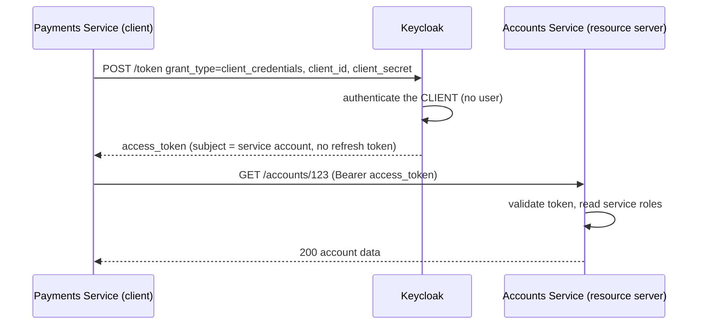

Notice what's **absent** compared to the code flow: no browser, no user, no redirect, no
authorization code, no refresh token. The service talks straight to `/token` and gets a token
representing *itself*. That stripped-down shape is the signature of machine-to-machine auth.

### Step 7 — Code Example

```text
POST https://keycloak/realms/bank/protocol/openid-connect/token
Content-Type: application/x-www-form-urlencoded

grant_type=client_credentials
&client_id=payments-service
&client_secret=SERVICE_SECRET
```

```json
{
  "access_token": "eyJhbGci...",
  "expires_in": 300,
  "token_type": "Bearer"
  // note: NO refresh_token, NO id_token
}
```

In Spring, you rarely write this by hand — Spring Security's
`OAuth2AuthorizedClientManager` / `ClientCredentialsOAuth2AuthorizedClientProvider` obtains and
caches the token for you, and a `WebClient`/`RestClient` filter attaches it. We build exactly
this in Part 13. The key teaching point here is the *shape* of the request: `grant_type=
client_credentials` and the service's own secret.

### Step 8 — Common Mistakes

- **Using client credentials to act on behalf of a user.** This is the #1 conceptual error. The
  resulting token has the *service's* roles, not the user's — so the user's permissions and
  identity are lost. If you need the user's context downstream, propagate the *user's* token or
  use Token Exchange (Part 12), not client credentials.
- **Leaking the client secret** (in config, logs, images). Treat it like a password; prefer
  vaults and mTLS.
- **Requesting a fresh token on every call.** Cache it until shortly before expiry.

### Step 9 — Debugging Perspective

Failures show at `/token`: `invalid_client` (wrong secret / client not confidential /
service accounts disabled), `unauthorized_client` (grant type not enabled for this client). On
the resource-server side, a 403 here usually means the service account lacks the needed role —
fix in Keycloak by assigning service-account roles.

### Step 10 — Summary

Client Credentials is the **machine-to-machine** flow: a service authenticates **as itself** with
its own secret and receives a token carrying its *own* roles — no user, no browser, no refresh
token. Use it for *system* actions (a cron job, a service acting on its own authority). Do **not**
use it to impersonate users. Mental picture: an employee swiping their own badge. This is the
flow that secures most internal service-to-service calls, and we implement it fully in Part 13.

---

## 2.5 Refresh Token Flow

### Step 1 — Problem Statement

Access tokens should be **short-lived** (minutes) because they're hard to revoke (Part 1.5) — if
one leaks, a short lifetime limits the damage. But short lifetimes create a usability problem:
must the user log in again every five minutes? That would be miserable. We need a way to get
*fresh* access tokens *without* re-prompting the user, while still keeping access tokens
short-lived.

### Step 2 — Intuition

At login, Keycloak issues two tokens: a short-lived **access token** (used constantly, expires
fast) and a longer-lived **refresh token** (used rarely, kept safe). When the access token
expires, the client quietly sends the refresh token to Keycloak and gets a new access token
back — no user interaction. The refresh token is like a **renewal coupon**: it does nothing on
its own (you can't call APIs with it), its only power is to mint new access tokens, and it can be
revoked centrally (it *is* tracked server-side, unlike access tokens).

### Step 3 — Real-World Analogy

A **season pass** (refresh token) versus a **daily ticket** (access token). The daily ticket gets
you through the gates today and expires tonight. Rather than buying a new ticket at the counter
each morning (re-login), you flash your season pass at the kiosk and it prints today's ticket
automatically. The season pass itself doesn't open gates — it only issues daily tickets — and the
park can cancel your season pass if needed.

### Step 4 — Internal Mechanics

- The refresh token is bound to the user's session in Keycloak and is **trackable/revocable**
  (Keycloak stores session state; revoking the session invalidates the refresh token).
- `grant_type=refresh_token` at `/token` returns a new access token (and usually a *new* refresh
  token — "refresh token rotation," which detects theft: if an old one is reused, Keycloak can
  revoke the whole chain).
- Refresh tokens have their own (longer) lifetime and an absolute session max.

### Step 5 — Step-by-Step Flow

1. Client uses its access token until it nears/*hits* expiry.
2. Client POSTs `grant_type=refresh_token` with the refresh token to `/token`.
3. Keycloak validates the refresh token (not expired, session still alive, not revoked).
4. Keycloak issues a **new access token** (and typically a rotated refresh token).
5. Client resumes calling APIs with the new access token — the user noticed nothing.
6. If the refresh token is expired/revoked, Keycloak returns `invalid_grant` → client must send
   the user through a full login again.

### Step 6 — Visual Diagram

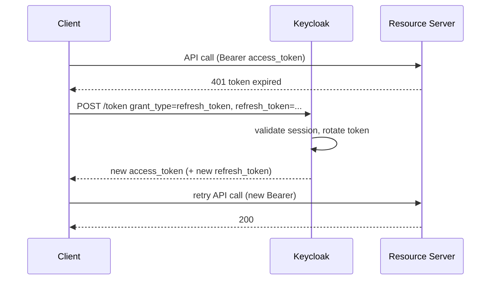

The flow's signature is the **401 → refresh → retry** loop. A good client detects the expiry
(either proactively from `exp` or reactively from a 401), silently refreshes, and retries the
original call. The user experiences uninterrupted access while access tokens stay short-lived.

### Step 7 — Code Example

```text
POST /realms/bank/protocol/openid-connect/token
Content-Type: application/x-www-form-urlencoded

grant_type=refresh_token
&refresh_token=eyJhbGci...
&client_id=web-app
&client_secret=...        # confidential clients only
```

The single concept: `grant_type=refresh_token`. Everything else mirrors the token endpoint. Most
front-end SDKs and Spring's OAuth2 client handle this loop automatically; you mainly *configure*
lifetimes in Keycloak (Access Token Lifespan, SSO Session Idle/Max).

### Step 8 — Common Mistakes

- **Long access-token lifetimes "to avoid refreshing."** This defeats the security purpose. Keep
  access tokens short; lean on refresh.
- **Storing refresh tokens insecurely in the browser.** They're high value. The BFF pattern
  (Part 14) keeps them server-side for exactly this reason.
- **Ignoring rotation.** With rotation on, you must store the *new* refresh token each time;
  reusing a rotated-out token triggers theft detection and session revocation.

### Step 9 — Debugging Perspective

`invalid_grant` on refresh means the refresh token is expired, revoked, or the session hit its
max lifetime — the cure is a fresh login, not a retry. "Users randomly logged out" often traces
to SSO Session Idle/Max settings in Keycloak being shorter than expected. Check realm session
timeouts.

### Step 10 — Summary

The Refresh Token Flow reconciles **security** (short access tokens) with **usability** (no
constant re-login). The refresh token is a revocable, longer-lived "renewal coupon" that mints
new access tokens silently. Keep access tokens short, refresh tokens safe, and prefer rotation.
Mental picture: a season pass that prints today's ticket at the kiosk.

---

## 2.6 Device Authorization Flow

### Step 1 — Problem Statement

Now imagine logging into a **smart TV**, a CLI tool, or an IoT device. There's no keyboard, or a
terrible one, and often no real browser. Typing a password with a TV remote is agony, and you
*definitely* don't want to enter bank credentials on a shared device. How does a device with poor
input get the user authenticated?

### Step 2 — Intuition

Split the login across **two devices**. The constrained device shows a short **user code** and a
URL. You take out your **phone or laptop** — a device with a real browser and keyboard — go to
the URL, enter the code, and log in *there*, comfortably and securely. Meanwhile the TV is
**polling** Keycloak in the background asking "has the user finished yet?" Once you complete login
on your phone, Keycloak tells the TV "yes," and the TV receives its tokens. The hard part
(authentication) happens on the good device; the constrained device just waits.

### Step 3 — Real-World Analogy

A printed claim code at a pharmacy pickup: the kiosk gives you a slip with a code, but you
complete the sensitive verification at the staffed counter with proper tools, then return to
collect. The kiosk (TV) can't do the hard verification; the counter (your phone's browser) can.

### Step 4 — Internal Mechanics & Flow

1. The device POSTs to Keycloak's **device authorization endpoint** and receives a `device_code`,
   a human-friendly `user_code`, a `verification_uri`, and a polling `interval`.
2. The device displays: "Go to keycloak/device and enter ABCD-1234."
3. The user, on a separate browser, visits the URI, enters the code, and authenticates normally
   (including MFA).
4. Meanwhile the device **polls** `/token` with `grant_type=urn:ietf:params:oauth:grant-type:
   device_code` and its `device_code`.
5. Keycloak responds `authorization_pending` until the user finishes, then returns the tokens.

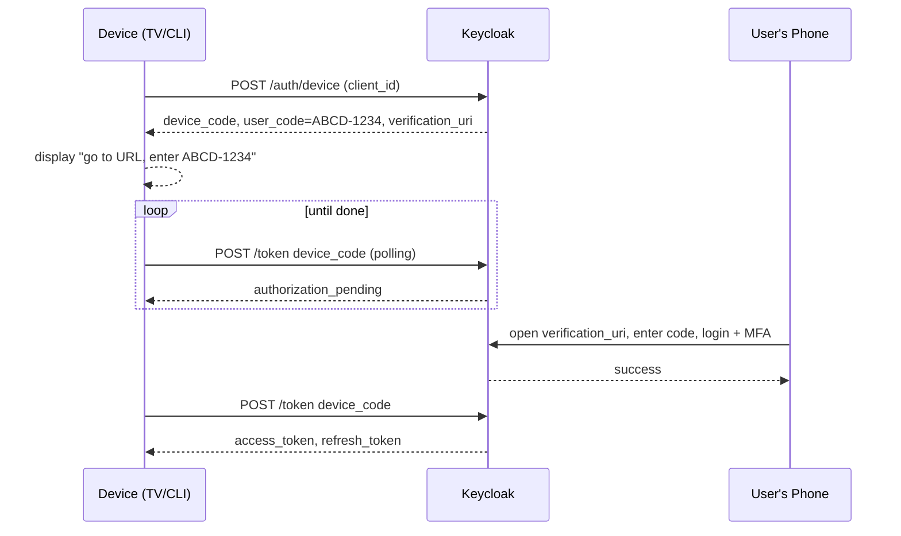

The signature is the **polling loop** on the device paired with **out-of-band login** on the
phone. The constrained device never handles credentials.

### Step 5 — Summary

The Device Flow authenticates devices with **poor input** by offloading login to a second,
capable device, using a short user code plus background polling. **When to use:** smart TVs, CLIs
(`kubectl`, cloud CLIs), IoT, consoles. **When not to:** anything with a normal browser — use
code + PKCE. Mental picture: "enter this code on your phone to finish signing in."

---

## 2.7 Token Exchange

### Step 1 — Problem Statement

In a deep microservice call chain — gateway → service A → service B → service C — service A
receives the *user's* token. When A calls B, what token should it use? If it forwards the user's
token verbatim, B gets the *full* user token (maybe over-privileged for B, maybe with the wrong
audience). If A uses *client credentials*, it **loses the user's identity** — B no longer knows
*which user* this is for, breaking per-user authorization and audit. We need a way to take "the
user's token, as seen by A" and **exchange it for a new token suited to calling B** — one that
still represents the user but is scoped/audienced correctly for B.

### Step 2 — Intuition

Token Exchange lets a service hand Keycloak an *existing* token and ask for a *different* one:
"Here's the user's token I hold; give me a token to call service B **on this user's behalf**,
with audience B and only the scopes B needs." The new token still says "this is user John" but is
*minted fresh* for the next hop — narrower, correctly addressed, and traceable. It's the
enterprise mechanism for **delegation and impersonation** across service boundaries.

### Step 3 — Real-World Analogy

A travel agent (service A) holds your authorization to book on your behalf. To reserve a specific
hotel (service B), the agent gets a **hotel-specific authorization** that still names you as the
guest but is valid only at that hotel for that booking — not a master key to your whole life.

### Step 4 — Internal Mechanics & Flow

- Uses `grant_type=urn:ietf:params:oauth:grant-type:token-exchange`. The client (service A)
  sends the `subject_token` (the user's token it holds) and a target `audience`/`scope`.
- Keycloak validates that A is permitted to exchange, then issues a **new token** with the
  user as subject but tailored audience/scopes (delegation), or even a different subject
  (impersonation, tightly controlled).

```mermaid
sequenceDiagram
    participant A as Service A
    participant K as Keycloak
    participant B as Service B
    A->>K: /token grant_type=token-exchange, subject_token=USER_TOKEN, audience=service-b
    K->>K: verify A may exchange; mint user-on-behalf token for B
    K-->>A: new access_token (sub=user, aud=service-b, narrowed scopes)
    A->>B: call (Bearer new token)
    B->>B: validate; sees correct audience + real user identity
    B-->>A: 200
```

The win: B receives a token that is **both** user-identifying **and** correctly audienced/scoped
for B — neither the over-broad forwarded token nor the identity-erasing client-credentials token.

### Step 5 — Summary

Token Exchange is an **enterprise delegation** tool: trade an existing token for a new one scoped
to the next hop while preserving (or controlled-switching) the subject. **Use when:** you need
the user's identity to flow through many services *and* you want correct, least-privilege
audiences per hop, or controlled impersonation (support agent acting as a user). **Caution:**
powerful — lock down which clients may exchange. Mental picture: a per-hotel booking authorization
that still names you as the guest. We revisit propagation strategies (forward vs. exchange vs.
client-credentials) in Part 12.

---

# Part 3 — OpenID Connect (OIDC)

## 3.1 Why OAuth2 Is Not Enough for Authentication

### Step 1 — Problem Statement

Here is a subtle, dangerous truth that catches even experienced engineers: **OAuth2 was never
designed to tell you *who the user is*.** Re-read Part 2 — every word was about *authorization*:
granting a client limited *access* to *resources*. An access token is a valet key. It says "the
bearer may open these doors." It does **not** reliably say "the bearer is John Smith."

Why is that a problem? Because everyone *wanted* to use OAuth2 for **login** ("Sign in with
Google/Facebook"). They'd take the access token, call some API with it, and infer "well, the
token worked, so the user must be whoever I think." This led to real, exploitable vulnerabilities
(the "confused deputy" / token-substitution attacks). An access token issued for app X might be
*replayed* into app Y; app Y, naively treating "valid token = this user," would authenticate the
wrong person. OAuth2 alone gives you *access*, not a *trustworthy assertion of identity.*

The missing piece: a **standardized, verifiable statement from the authorization server that
says, in a tamper-proof way, "I authenticated this user, here is who they are, here is when, and
here is which client this statement was made for."** That is exactly what OIDC adds.

### Step 2 — Intuition

OpenID Connect is a **thin identity layer on top of OAuth2.** It keeps everything about OAuth2
(the flows, the access tokens, the resource servers) and adds one crucial new artifact: the **ID
Token** — a JWT whose explicit, standardized purpose is to tell the *client* **who the user is**.
Where the access token is for *resource servers* ("let the bearer in"), the ID token is for the
*client* ("the person who just logged in is John, verified by Keycloak, at 10:00, for you
specifically").

So the mental split — and this resolves enormous confusion — is:

- **Access Token** → *authorization* → sent to **resource servers** → "what may the bearer do?"
- **ID Token** → *authentication* → consumed by the **client** → "who is the user?"

OIDC is "OAuth2 done right for login." When you click "Sign in with Google," you are using OIDC,
not raw OAuth2.

### Step 3 — Real-World Analogy

OAuth2's access token is a **valet key** — it operates the car but says nothing certified about
*who* you are. OIDC's ID token is a **notarized letter of introduction** that the authority hands
*you* (the client): "I, the trusted authority, have personally verified this individual is John
Smith, I did so just now, and I'm writing this letter specifically for *you*, recipient X." The
"specifically for you" part (the `aud` claim) is what defeats the replay attack — a letter
addressed to app X is invalid if presented to app Y.

### Step 4 — Internal Mechanics: the new pieces OIDC adds

OIDC layers four things onto OAuth2:

1. **ID Token** — a JWT containing identity claims (`sub`, `name`, `email`, `iss`, `aud`, `iat`,
   `exp`, `auth_time`, `nonce`). Always a JWT (unlike access tokens, which *may* be opaque in
   pure OAuth2). It is *signed* by the authorization server so the client can verify authenticity.
2. **The `openid` scope** — you opt into OIDC by including `scope=openid` in the authorization
   request. That scope is literally what turns an OAuth2 flow into an OIDC flow and makes
   Keycloak return an ID token.
3. **UserInfo Endpoint** — a standard endpoint (`/userinfo`) the client can call *with the access
   token* to fetch additional, fresh user claims (useful when you don't want to bloat the ID
   token, or need up-to-date profile data).
4. **Discovery Endpoint** — `/.well-known/openid-configuration`, a JSON document advertising every
   relevant URL and capability (authorization endpoint, token endpoint, JWKS URI, supported
   scopes, signing algorithms). This is *huge* for tooling: a client (or Spring Boot) points at
   the issuer and **auto-discovers everything else.**

### Step 5 — Step-by-Step Flow (OIDC login = code flow + `openid` scope)

1. Client redirects to `/authorize` with `response_type=code` **and `scope=openid`** (plus
   `profile`, `email`, etc.).
2. User authenticates at Keycloak.
3. Keycloak returns an authorization code (front channel).
4. Client exchanges the code at `/token` (back channel).
5. Keycloak returns an **access token**, a **refresh token**, **and now an ID token.**
6. The client **validates the ID token**: checks signature (JWKS), `iss` (is this my Keycloak?),
   `aud` (is this token *for me*?), `exp` (fresh), and `nonce` (matches what I sent — replay
   defense).
7. The client reads `sub`, `name`, `email` from the ID token → it now *knows who logged in.*
8. Optionally, the client calls `/userinfo` with the access token for more claims.
9. The client uses the **access token** for resource servers, and the **ID token** to establish
   the user's identity in its own session.

### Step 6 — Visual Diagram

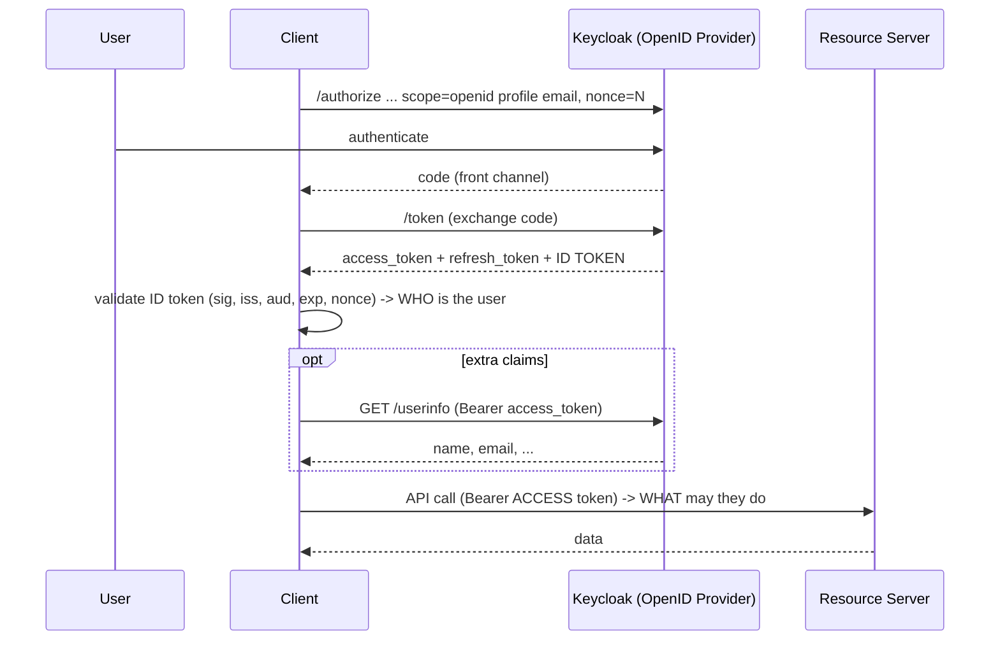

The diagram makes the dual nature visible. The **ID token** is consumed by the *Client* (the
`C->>C: validate ID token` self-arrow) to answer **who**. The **access token** is sent onward to
the *Resource Server* to answer **what**. Two tokens, two audiences, two purposes — that
separation *is* OIDC. The `nonce=N` and its validation are the anti-replay mechanism missing from
raw OAuth2.

### Step 7 — Decoded ID Token Example

```json
{
  "iss": "https://keycloak/realms/bank",   // who issued this (the OpenID Provider)
  "sub": "8af2c1e0-...",                    // stable unique user id (use THIS as the key, not email)
  "aud": "web-app",                          // THIS token is for the 'web-app' client — replay defense
  "exp": 1718270400,
  "iat": 1718270100,
  "auth_time": 1718270090,                   // when the user actually authenticated
  "nonce": "N-random-from-client",           // ties token to this specific login request
  "name": "John Smith",
  "preferred_username": "john",
  "email": "john@example.com",
  "email_verified": true
}
```

The teaching points: `sub` is the **stable identifier** — emails change, `sub` doesn't, so key
your user records on `sub`. `aud` must equal *your* client id; if it names a different client,
**reject it** (that's the substitution attack). `nonce` must match what the client generated for
*this* login. Notice this carries *identity*, not permissions — permissions live in the *access*
token.

### Step 8 — Common Mistakes

- **Using the *access* token to identify the user.** Use the **ID token** for identity; the
  access token is for resource access. Mixing them is the classic OIDC mistake.
- **Sending the *ID* token to resource servers.** Resource servers should validate *access*
  tokens. The ID token is for the client. (Keycloak's tokens look similar, which tempts people to
  misuse them.)
- **Skipping `aud`/`nonce` validation** on the ID token → replay and substitution attacks.
- **Forgetting `scope=openid`** → Keycloak returns *no* ID token and you wonder why login "half
  works."

### Step 9 — Debugging Perspective

"Login succeeds but I can't get user info" → did you include `scope=openid`? No ID token without
it. "Identity is wrong/insecure" → are you reading identity from the access token instead of the
ID token, and are you validating `aud`/`nonce`? For configuration, hit
`/.well-known/openid-configuration` — if that 404s or points at the wrong issuer, every downstream
client/Spring config will fail in confusing ways.

### Step 10 — Summary

OIDC is the **identity layer on OAuth2**: it adds the **ID Token** (a signed JWT that tells the
*client who the user is*), the **`openid` scope** (opt-in), the **UserInfo** endpoint (more
claims), and **Discovery** (`/.well-known/openid-configuration`, auto-config). The durable mental
model: **access token = authorization (for resource servers, "what"); ID token = authentication
(for clients, "who").** Keycloak is therefore precisely an **OpenID Provider**, and "Sign in
with X" is OIDC in action. Mental picture: a notarized, *addressed-to-you* letter of introduction
alongside the valet key.

---

# Part 4 — JWT Deep Dive

This is one of the most important chapters in the guide. JWT is the *currency* of everything we
do — Keycloak mints them, Spring Security verifies them, microservices pass them around. If you
deeply understand JWTs, half of all "why is my auth broken" mysteries become trivially debuggable
because **a JWT is self-describing**: you can literally read what every service sees.

## 4.1 What a JWT Is and Why It Exists

### Step 1 — Problem Statement

Recall the breakthrough from Part 1.5: we want identity to be **self-contained and portable** so
any service can verify it locally, with no shared session store. But that raises a hard question:
if the client *carries* its own identity document, **what stops the client from forging it?** If
the token were just JSON like `{"user":"john","role":"admin"}`, anyone could edit it to
`{"role":"super-admin"}` and grant themselves the keys to the kingdom. A self-contained token is
worthless unless it is **tamper-evident** — unless any modification is *detectable*.

We also need it to be **compact** (it rides in an HTTP header on every request), **URL-safe**
(no characters that break headers/URLs), and **verifiable without contacting the issuer** (so we
keep the stateless property). JWT is the format engineered to satisfy *all* of these at once.

### Step 2 — Intuition

A JWT (JSON Web Token) is a small, URL-safe string with **three parts** separated by dots:
`header.payload.signature`. The first two parts are just **Base64URL-encoded JSON** — readable by
anyone (this surprises people: **a JWT is not encrypted; it's encoded**). The third part is a
**cryptographic signature** computed over the first two by the issuer (Keycloak) using a secret
or private key.

The magic is the signature. It doesn't *hide* the contents — it *protects* them. If anyone changes
a single character of the header or payload, the signature no longer matches, and verification
fails. So a JWT is like a **document where every page is sealed with a wax stamp**: you can read
every page, but you cannot alter a word without breaking the seal, and only the issuer owns the
stamp. That's how a token the client carries can still be trusted — not because it's hidden, but
because it's *unforgeable.*

### Step 3 — Real-World Analogy

A **banknote**. You can look at a $100 bill all you want — it's not secret. But you can't
*counterfeit* it: it has a watermark, a security thread, special ink that only the central bank
can produce. A cashier anywhere verifies it instantly without calling the central bank. A JWT is a
banknote for identity: openly readable, centrally signed, locally verifiable, practically
impossible to forge.

### Step 4 — Internal Mechanics: anatomy

A JWT is `BASE64URL(header) + "." + BASE64URL(payload) + "." + signature`.

- **Header** — JSON metadata about the token: which algorithm signed it (`alg`), the token type
  (`typ: JWT`), and crucially `kid` (key ID) telling the verifier *which* public key to use.
- **Payload (claims)** — JSON statements about the subject: who they are, what roles, when it
  expires, who it's for. Standard claims (`iss`, `sub`, `aud`, `exp`...) plus Keycloak-specific
  ones (`realm_access`, `resource_access`, `azp`...).
- **Signature** — the result of signing `header.payload` with the chosen algorithm and key. This
  is what makes the token tamper-evident.

### Step 5 — The Three Parts, Decoded

```text
eyJhbGciOiJSUzI1NiIsImtpZCI6ImFiYzEyMyJ9   <- header  (Base64URL of JSON)
.
eyJpc3MiOiJodHRwczovL2tleWNsb2FrL3JlYWxtcy9iYW5rIiwic3ViIjoiOGFmMiJ9   <- payload
.
NHVQ7m...signature-bytes...                 <- signature (binary, Base64URL-encoded)
```

Decoding the first part gives:

```json
// HEADER
{
  "alg": "RS256",      // signed with RSA + SHA-256 (asymmetric: private signs, public verifies)
  "typ": "JWT",
  "kid": "abc123"      // which key in Keycloak's JWKS verifies this — vital for key rotation
}
```

```json
// PAYLOAD (claims) — full Keycloak-style example
{
  "iss": "https://keycloak/realms/bank",  // issuer: who minted this token
  "sub": "8af2c1e0-...",                  // subject: stable unique user/service id
  "aud": ["accounts-service", "account"], // audience: who this token is FOR
  "azp": "web-app",                       // authorized party: which client requested it
  "exp": 1718270400,                      // expiry (epoch seconds) — past this, reject
  "iat": 1718270100,                      // issued-at
  "nbf": 1718270100,                      // not-before — reject if used earlier than this
  "jti": "f1e2d3...",                     // unique token id (for blacklisting/replay tracking)
  "sid": "session-id-...",                // Keycloak session id
  "scope": "openid profile accounts:read",
  "preferred_username": "john",
  "email": "john@example.com",
  "realm_access": {                        // REALM roles (apply across the realm)
    "roles": ["offline_access", "TELLER", "default-roles-bank"]
  },
  "resource_access": {                     // CLIENT roles (per-client)
    "accounts-service": { "roles": ["accounts:read"] },
    "account": { "roles": ["manage-account"] }
  },
  "groups": ["/retail/branch-42"]
}
```

This single payload is the Rosetta Stone for the rest of the guide. Spend real time here.

### Step 6 — Every Claim, Explained

- **`iss` (issuer)** — the URL of the realm that minted the token. Spring's resource server checks
  this *exactly* against its configured `issuer-uri`. A mismatch (http vs https, trailing slash,
  `localhost` vs service name) is the **#1 cause of mysterious 401s**.
- **`sub` (subject)** — stable unique id of the principal (user or service account). Use this as
  your durable key.
- **`aud` (audience)** — who the token is *intended for*. A well-configured resource server
  rejects tokens not addressed to it. Misconfigured `aud` is a top source of 401/403.
- **`azp` (authorized party)** — which *client* obtained the token (e.g., `web-app`). Useful for
  policy ("only tokens from the mobile client may do X") and audit.
- **`scope`** — OAuth2 scopes granted (space-delimited). Coarse-grained permissions / consent.
- **`realm_access.roles`** — **realm roles**: roles that apply across the whole realm. Keycloak
  puts them *here*. Spring does **not** read these automatically — you must write a converter
  (Part 10). This is why "my roles don't work" is so common.
- **`resource_access.<client>.roles`** — **client roles**: roles scoped to a specific client.
  Also requires a custom converter to map into Spring authorities.
- **`exp` / `iat` / `nbf`** — expiry / issued-at / not-before. Validation checks `now` falls in
  `[nbf, exp)`. Clock skew between Keycloak and services causes spurious failures here.
- **`sid`** — Keycloak session id; links the token to a session (used by back-channel logout).
- **`jti`** — unique token id; enables blacklisting/replay detection.
- **`preferred_username`, `email`, `groups`** — profile claims and group memberships (groups can
  be mapped to roles).

### Step 7 — Signing Algorithms: HS256 vs RS256 vs ES256

This distinction is *fundamental* to how Keycloak and Spring cooperate.

- **HS256 (HMAC-SHA256) — symmetric.** One **shared secret** both signs *and* verifies. Problem
  in microservices: *every* service that verifies would need the *signing* secret — and anything
  that can verify can also *forge*. Sharing a signing secret with twenty services is a security
  nightmare. **Avoid for multi-service token verification.**
- **RS256 (RSA-SHA256) — asymmetric.** A **key pair**: Keycloak holds the **private key** (signs,
  never shared) and publishes the **public key** (verifies). Every service holds only the *public*
  key — it can *verify* but can never *forge*. This is **the** algorithm for Keycloak +
  microservices and Keycloak's default. The asymmetry is what makes safe, distributed, local
  verification possible.
- **ES256 (ECDSA-SHA256) — asymmetric, elliptic-curve.** Same public/private idea as RS256 but
  with smaller keys and signatures for equivalent security; nice for high-volume/constrained
  environments. Keycloak supports it.

**The one-sentence rule:** in a microservice system, you want **asymmetric** signing (RS256/ES256)
so Keycloak alone can mint tokens while every service can *independently verify* them with a public
key it can't abuse.

### Step 8 — Visual: Signature & Verification

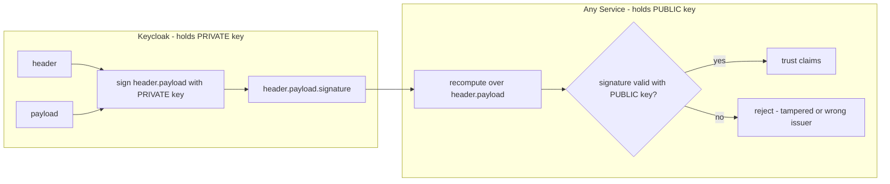

Line by line: Keycloak signs `header.payload` with its **private** key, producing the JWT. A
service receiving it uses Keycloak's **public** key to check the signature over the *same*
`header.payload`. If even one byte changed, the check fails (`NO`). If it passes (`OK`), the
service trusts the claims — *without ever contacting Keycloak.* The private key never leaves
Keycloak; the public key is freely distributed. That asymmetry is the entire security model.

### Step 9 — JWT Validation, Step by Step

When a token arrives, a correct verifier performs **all** of these, in order:

1. **Parse** the three parts; decode header and payload JSON.
2. **Read `kid`** from the header to select the right public key.
3. **Fetch the public key** from Keycloak's **JWKS endpoint** (cached) matching that `kid`.
4. **Verify the signature** over `header.payload` with that key. Fail → reject (tampered/forged).
5. **Check `iss`** equals the expected issuer exactly.
6. **Check `exp`** — token not expired (allowing small clock skew).
7. **Check `nbf`/`iat`** — token not used before valid / not absurdly future-dated.
8. **Check `aud`** — token is intended for this service (if audience validation is enabled).
9. **Extract claims** and build the security context / authorities (Part 10).
10. Only now is the request **authenticated**; authorization follows.

Skipping any of 4–8 is a security hole. Spring's resource server does 1–7 automatically and lets
you add 8 and 9. We trace the exact classes in Part 9.

### Step 10 — JWKS Endpoint & Key Rotation

How does each service get Keycloak's public key without manual copying? The **JWKS endpoint**
(JSON Web Key Set): `https://keycloak/realms/bank/protocol/openid-connect/certs`. It returns
Keycloak's current public keys as JSON, each tagged with a `kid`.

```json
{
  "keys": [
    { "kid": "abc123", "kty": "RSA", "alg": "RS256", "use": "sig", "n": "...", "e": "AQAB" },
    { "kid": "def456", "kty": "RSA", "alg": "RS256", "use": "sig", "n": "...", "e": "AQAB" }
  ]
}
```

At startup (or first use), a resource server fetches this set and **caches** it. For each incoming
token, it reads the token's `kid` and picks the matching key. **Key rotation** works beautifully
with this design: Keycloak periodically generates a *new* signing key (new `kid`) and starts
signing with it, while *keeping the old public key in the JWKS* for a while so tokens signed by the
old key still verify. When a service sees an unknown `kid`, it **re-fetches** the JWKS to pick up
the new key. No downtime, no manual key distribution, no shared secrets.

This is why you should **never hard-code a public key** in a service — point it at the JWKS URI and
let rotation be automatic. The classic rotation outage: someone pins a single static key, Keycloak
rotates, every token suddenly fails signature validation (401 storm). The fix and prevention live
in Part 15.

### Self-Check

Could you, on a whiteboard, draw a JWT's three parts, explain why it's *signed not encrypted*,
explain why RS256 beats HS256 for microservices, and walk the ten validation steps? If yes, you
own the single most leveraged concept in this guide. If not, reread Sections 4.7–4.10.

### Summary

A JWT is a compact, URL-safe, **signed-not-encrypted** `header.payload.signature` token. The
header names the algorithm and key (`kid`); the payload carries claims (`iss`, `sub`, `aud`,
`exp`, roles in `realm_access`/`resource_access`); the signature makes it **tamper-evident**.
Use **asymmetric** signing (RS256) so Keycloak signs with a private key and every service verifies
locally with a public key fetched from **JWKS** — which also makes **key rotation** automatic.
Mental picture: a banknote — openly readable, centrally minted, locally verifiable, unforgeable.

---

# Part 5 — Keycloak Architecture

Now that you understand OAuth2, OIDC, and JWT, Keycloak stops being a mysterious black box and
becomes *an OAuth2 Authorization Server + OpenID Provider with a user database and an admin UI.*
That sentence is the whole product. This part opens the box.

## 5.1 What Keycloak Is (and the Problem It Solves)

### Step 1 — Problem Statement

Imagine you're the bank and you have twenty microservices plus a web app and a mobile app. Each
needs to authenticate users, store passwords securely, support MFA, handle "forgot password,"
integrate with the corporate LDAP, federate with Google login, issue and validate tokens, manage
sessions, and enforce password policies. Without a central identity system, **every team
reinvents all of this** — badly, inconsistently, insecurely. One team stores passwords with MD5.
Another forgets account lockout. A third has no MFA. Users have twenty different passwords. There
is no single place to disable a compromised account.

The problem: **identity is a cross-cutting concern that must be centralized, done once, done
right.** You want *one* system that owns users, credentials, MFA, federation, and token issuance —
and every app delegates to it. That system is an **Identity and Access Management (IAM)** server.
Keycloak is a mature, open-source, standards-based IAM.

### Step 2 — Intuition

Keycloak is the **single front door for identity** in your whole landscape. Users log in *there*,
not in each app. It stores users and credentials, runs the login flows (including MFA and social
login), and — because it's an OAuth2/OIDC server — it **issues the signed JWTs** that your services
trust. Your apps stop being in the password business entirely; they just **redirect to Keycloak
for login** and **verify the tokens Keycloak issues.** One place to add a user, disable a user,
enforce a policy, see login events, plug in a new MFA method.

### Step 3 — Real-World Analogy

Keycloak is the **central security office and badge-issuing desk** of a large corporate campus.
Employees and visitors get verified *there* and receive a badge (token). Every building's door
readers (your services) trust badges from that one office. You don't put a separate HR
verification desk in every building — that would be chaos. One office issues; every door verifies.

### Step 4 — Internal Mechanics: the building blocks

Keycloak organizes everything into a hierarchy. Understanding these objects *is* understanding
Keycloak.

- **Realm** — the top-level, fully-isolated tenant boundary. A realm has its *own* users, clients,
  roles, keys, and login settings. Realms cannot see each other's users. You almost always make a
  realm per security domain (e.g., a `bank` realm for customers, an `internal` realm for staff).
  The special `master` realm is *only* for administering Keycloak itself — **never** put
  application users there.
- **Client** — an application registered in a realm: your web app, mobile app, each microservice.
  A client is **confidential** (can hold a secret — backends) or **public** (cannot — SPAs/mobile,
  use PKCE). Clients define redirect URIs, allowed flows, and scopes. A microservice acting as a
  *resource server* is also modeled as a client.
- **User** — a person (or a service account) with credentials and attributes, living in a realm.
- **Role** — a named permission bundle. **Realm roles** apply realm-wide; **client roles** are
  scoped to one client. Roles can be *composite* (a role that includes other roles).
- **Group** — a collection of users; groups can have roles attached, so adding a user to a group
  grants them the group's roles. Great for org structure ("/retail/branch-42").
- **Client Scope** — reusable sets of claims/roles/protocol mappers that can be attached to
  clients to shape what ends up in tokens (default vs optional scopes).
- **Mapper (Protocol Mapper)** — a rule that decides *what goes into the token*. Want roles in a
  custom claim? A user attribute added? The audience set? Mappers do that. This is how you control
  the JWT contents Spring will read.
- **Identity Provider (IdP)** — an *external* login source Keycloak federates with: Google,
  GitHub, corporate SAML, another OIDC provider. Keycloak brokers the login and still issues
  *its own* tokens.
- **User Federation** — connect Keycloak to an existing user store (LDAP/Active Directory) so
  those users authenticate without migration.
- **Authentication Flow** — a configurable sequence of steps for login (username/password →
  OTP → conditional steps). You can customize/extend these.
- **Session** — Keycloak tracks user sessions (and client sessions) to support SSO, refresh
  tokens, and logout.
- **Events** — login/admin events Keycloak records (and can stream) for audit and security
  monitoring.
- **Admin Console & Admin REST API** — the web UI and the programmatic API to manage all of the
  above (create users, assign roles, etc.).

### Step 5 — How These Fit Together (Visual)

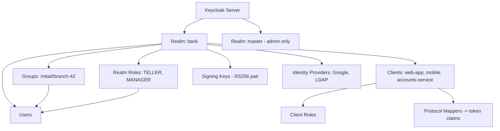

Reading it: the **server** hosts multiple **realms**; the `bank` realm contains **users**,
**clients**, **roles**, **groups**, its **own signing keys**, and **identity providers**. Clients
carry **client roles** and **mappers** that shape tokens. Roles and groups attach to users. The
key insight: **the realm is a self-contained universe** — its keys sign its tokens, its users are
invisible to other realms. When you configure Spring's `issuer-uri`, you're pointing at exactly
one realm's universe.

### Step 6 — How Keycloak Creates a JWT (internally)

When a flow completes and a token must be issued, Keycloak:

1. Resolves the **authenticated user** (or service account) and the **client** that requested the
   token.
2. Gathers the user's **roles** (realm + client + composites + group-inherited) and **attributes**.
3. Determines **requested scopes** and the client's **default/optional client scopes**.
4. Runs the applicable **protocol mappers**, each writing claims into the token: roles into
   `realm_access`/`resource_access`, username into `preferred_username`, audience into `aud`, any
   custom attribute into a custom claim.
5. Sets standard claims: `iss` (this realm's URL), `sub`, `exp`/`iat`/`nbf`, `jti`, `azp`, `sid`.
6. **Signs** the assembled payload with the realm's **active private key** (RS256 by default),
   stamping the header's `kid`.
7. Returns the compact `header.payload.signature` string.

The thing to internalize: **the contents of your JWT are not magic — they are the output of
mappers over the user's roles/attributes.** If a role is missing from your token, the cause is
almost always "no mapper put it there" or "the role isn't assigned." This makes Part 10's mapping
work predictable rather than mysterious.

### Step 7 — How Keycloak Validates Users (login)

For a password login, Keycloak runs the realm's **authentication flow**: it looks up the user,
verifies the password against the stored hash (PBKDF2/Argon2 by default), applies policies
(account enabled? locked? password expired?), runs any required actions (OTP, "update password"),
and on success creates a **session** and issues tokens. For **federated** users (LDAP), it
delegates credential checks to the external store. For **brokered** logins (Google), it redirects
to the external IdP, receives the result, maps the external identity to a local user, and *still
issues its own Keycloak tokens.* In every case the *output* is the same: a Keycloak session and
Keycloak-signed tokens your services trust.

### Step 8 — Configuration Example (realm/client essentials)

```text
Realm: bank
  Signing: RS256 (active key pair; old keys retained for rotation)
  Tokens: Access Token Lifespan = 5m; SSO Session Idle = 30m, Max = 10h

Client: accounts-service   (this is a RESOURCE SERVER)
  Access Type: bearer-only / confidential
  Audience mapper: adds "accounts-service" to aud of tokens that should reach it

Client: web-app            (this is the user-facing CLIENT)
  Access Type: public (SPA) -> PKCE required
  Valid Redirect URIs: https://app.bank.com/*
  Default Client Scopes: openid, profile, email, roles

Client: payments-service   (machine-to-machine CLIENT)
  Access Type: confidential
  Service Accounts Enabled: ON
  Service Account Roles: accounts:read
```

Notice each app maps to an OAuth2 actor you already know: `web-app` is the *Client*,
`accounts-service` is a *Resource Server*, `payments-service` is a *Client using client
credentials*. Keycloak just calls them all "clients," but their *role* in the flows differs.

### Step 9 — Debugging Perspective

When something's off, Keycloak gives you two superpowers: the **Events** tab (realm → Events) shows
login successes/failures with reasons (`invalid_user_credentials`, `invalid_client`), and the
**token preview / "Evaluate" tool** (client scopes → Evaluate) shows *exactly* what claims a token
for a given user would contain — invaluable for role-mapping bugs. Server logs reveal flow and
mapper errors. If a service rejects tokens, first confirm the **realm's issuer URL** and that the
**JWKS endpoint** returns keys.

### Step 10 — Summary

Keycloak is a centralized **IAM = OAuth2 Authorization Server + OpenID Provider + user store +
admin UI**. Its object hierarchy — **realm → clients, users, roles, groups, scopes, mappers, IdPs,
flows, sessions** — is the entire mental model. A **realm** is an isolated identity universe with
its own signing keys; **mappers** decide what lands in your JWTs; Keycloak **issues** tokens that
your services merely **verify**. Mental picture: the campus security office that issues badges
every door trusts. Your apps get out of the password business and delegate identity to this one
front door.

---

# Part 6 — Spring Security Architecture

Keycloak issues the token; **Spring Security is what stands at your service's door and decides
what to do with it.** Most engineers use Spring Security as a black box of magic annotations. We
will open it up. Once you see the **filter chain** clearly, debugging stops being guesswork.

## 6.1 The Core Problem Spring Security Solves

### Step 1 — Problem Statement

Your Spring Boot service has controllers handling business logic. Cross-cutting concerns —
"is this request authenticated? is it authorized? where do I extract the token? how do I turn it
into roles?" — must happen *before* any controller runs, *consistently*, for *every* endpoint,
*without* polluting business code with security checks. If each controller did its own auth, you'd
have inconsistent, error-prone, duplicated security everywhere — and one forgotten check is a
breach. We need a **single, uniform, pluggable interception layer** that runs before controllers
and enforces security policy centrally.

### Step 2 — Intuition

Spring Security inserts itself as a **chain of filters** in front of your application. Every HTTP
request passes through this chain *before* reaching a controller. Each filter has one job —
extract the token, validate it, build the security context, check authorization, handle errors.
Think of it as a **series of checkpoints**: the request walks down a corridor, passing guard after
guard, each checking one thing. By the time it reaches your controller, security is *already
decided*; your controller just does business logic, trusting that an unauthenticated or
unauthorized request never got this far.

This is why your controllers look clean: the security happened upstream, in the filter chain,
uniformly, for every request.

### Step 3 — Real-World Analogy

Airport security. Before you reach your gate (the controller), you walk a fixed sequence of
checkpoints: boarding-pass scan (is there a token?), ID check (is it valid / who are you?),
metal detector and bag scan (are you carrying what's allowed / authorization), and a final
gate-agent scan (method-level check). Each checkpoint does *one* thing and hands you to the next.
Fail any one and you're turned back *before* the gate. The gate agent never re-verifies your
passport — that already happened upstream. Spring's filter chain is that corridor.

### Step 4 — Internal Mechanics: the key components

Here is the cast of characters. Knowing *each one's single responsibility* is the whole game.

- **DelegatingFilterProxy** — a thin standard Servlet filter Spring registers in the servlet
  container. Its only job is to **delegate** into the Spring-managed security filters. It's the
  bridge from the servlet world into Spring's world.
- **FilterChainProxy** — the heart. A single filter (named `springSecurityFilterChain`) that holds
  **a list of `SecurityFilterChain`s** and, for each request, picks the *first* chain whose URL
  matcher matches, then runs that chain's filters in order.
- **SecurityFilterChain** — an ordered list of security filters that applies to a set of URLs. You
  define these in your `@Configuration`. A request matches *one* chain.
- **The individual security filters** — e.g. `BearerTokenAuthenticationFilter` (extracts the
  `Authorization: Bearer` token), `ExceptionTranslationFilter` (turns auth exceptions into 401/403),
  `AuthorizationFilter` (enforces URL-level access rules). There are ~15 by default; you care
  about a handful.
- **Authentication** — an object representing the request's identity: who the principal is, their
  credentials, their **authorities** (roles), and whether they're authenticated. Before validation
  it's a "request for authentication"; after, it's a fully populated, trusted token.
- **AuthenticationManager** — the component asked "please authenticate this `Authentication`." It
  delegates to providers.
- **AuthenticationProvider** — does the *actual* authentication for a particular type. For JWTs,
  the relevant one decodes and validates the token and produces an authenticated `Authentication`.
- **SecurityContext / SecurityContextHolder** — the **SecurityContext** holds the current
  `Authentication`. The **SecurityContextHolder** is a holder (by default thread-local) that makes
  "who is the current user?" available anywhere in the request thread. This is what
  `@AuthenticationPrincipal` and `SecurityContextHolder.getContext().getAuthentication()` read.
- **GrantedAuthority** — a single permission/role the principal holds (e.g., `ROLE_TELLER`,
  `SCOPE_accounts:read`). Authorization compares required authorities against these.
- **AuthorizationManager** — the modern component that makes allow/deny decisions for URLs and
  methods (replaced the older `AccessDecisionManager`). Returns grant/deny given the
  `Authentication` and the secured object.
- **Method Security** — `@PreAuthorize`/`@PostAuthorize` etc., enforced by an
  `AuthorizationManager` via an AOP interceptor around your methods.

### Step 5 — The Request Lifecycle, Step by Step

1. Request hits the servlet container; **DelegatingFilterProxy** forwards it to
   **FilterChainProxy**.
2. FilterChainProxy selects the **matching SecurityFilterChain** by URL.
3. The request passes through that chain's filters in order.
4. For a token API, **BearerTokenAuthenticationFilter** extracts the `Authorization: Bearer`
   header. No token on a protected route → it lets the request continue *unauthenticated* (the
   authorization filter will later reject it).
5. The filter builds an unauthenticated `Authentication` (the raw token) and hands it to the
   **AuthenticationManager**.
6. The manager delegates to the JWT **AuthenticationProvider**, which **decodes and validates** the
   token (signature, `iss`, `exp`, `aud`) via a `JwtDecoder`, then converts claims into
   **authorities** (Part 10).
7. On success, a fully-authenticated `Authentication` is placed in the **SecurityContext** (via
   SecurityContextHolder).
8. **AuthorizationFilter** consults the **AuthorizationManager**: does the principal's authorities
   satisfy this URL's rule? No → **AccessDeniedException** → 403.
9. If allowed, the request reaches the **controller**.
10. If the method has `@PreAuthorize`, **Method Security** re-checks authorization right before the
    method body runs.
11. **ExceptionTranslationFilter** sits around the chain: an `AuthenticationException` becomes
    **401**, an `AccessDeniedException` becomes **403**.

### Step 6 — Visual: the Filter Chain

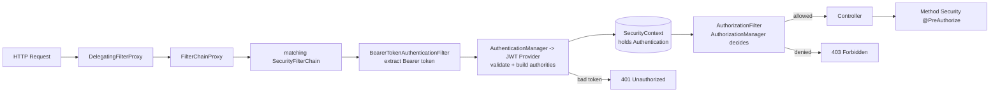

Line by line: the request enters via **DelegatingFilterProxy**, reaches **FilterChainProxy**, which
picks the **matching chain**. The **BearerTokenAuthenticationFilter** pulls the token; the
**AuthenticationManager** (JWT provider) validates it and builds authorities; the result lands in
the **SecurityContext**. The **AuthorizationFilter** then asks the **AuthorizationManager** to
allow or deny — denial is **403**, a bad token earlier is **401**. Only an allowed request reaches
the **Controller**, where **Method Security** can apply one more, finer check. Memorize this
picture; *every* Spring Security debugging session is "where in this corridor did it stop?"

### Step 7 — Minimal Configuration (with explanation)

```java
@Configuration
@EnableWebSecurity
@EnableMethodSecurity                       // turns on @PreAuthorize/@PostAuthorize
public class SecurityConfig {

  @Bean
  SecurityFilterChain api(HttpSecurity http) throws Exception {
    http
      // 1) URL-level authorization rules (the AuthorizationFilter uses these)
      .authorizeHttpRequests(auth -> auth
          .requestMatchers("/public/**").permitAll()
          .requestMatchers("/admin/**").hasRole("ADMIN")
          .anyRequest().authenticated())
      // 2) declare this app a resource server that validates JWTs
      .oauth2ResourceServer(o -> o.jwt(Customizer.withDefaults()))
      // 3) no sessions — pure token auth
      .sessionManagement(s -> s.sessionCreationPolicy(SessionCreationPolicy.STATELESS))
      // 4) APIs with bearer tokens don't need CSRF (no browser-managed cookies)
      .csrf(csrf -> csrf.disable());
    return http.build();
  }
}
```

Each block maps onto the architecture: `authorizeHttpRequests` configures the
**AuthorizationFilter/Manager** (Step 8 of the lifecycle); `oauth2ResourceServer().jwt()` wires up
the **BearerTokenAuthenticationFilter + JwtDecoder + JWT AuthenticationProvider** (Steps 4–6);
`STATELESS` removes the session machinery; CSRF is disabled because bearer-token APIs aren't
vulnerable to it the way cookie-session browser forms are. `@EnableMethodSecurity` activates the
AOP interceptor for `@PreAuthorize`.

### Step 8 — Common Mistakes

- **Defining multiple `SecurityFilterChain`s without `securityMatcher` ordering** → a request
  matches the wrong (often permissive) chain. Only the *first* matching chain runs.
- **Expecting `hasRole("ADMIN")` to match a `ROLE_ADMIN` authority** — it does, *if* the authority
  is literally `ROLE_ADMIN`. But Keycloak puts roles in `realm_access` as `ADMIN`, and Spring's
  default converter creates `SCOPE_...` authorities, *not* `ROLE_...`. Result: rules silently
  never match. This is the bridge into Part 10.
- **Leaving sessions on (`IF_REQUIRED`) for a token API** → subtle state leakage and
  `JSESSIONID` cookies you didn't want.
- **Disabling security "temporarily" with `permitAll()` everywhere** and forgetting it.

### Step 9 — Debugging Perspective

The killer tool: set `logging.level.org.springframework.security=DEBUG`. Spring will print *the
ordered list of filters in the chain* at startup and *which filter handled/blocked each request* at
runtime — you can literally see where in the corridor a request stopped. A 401 means it failed at
the authentication filter (bad/missing/invalid token); a 403 means it passed authentication but
the **AuthorizationManager** denied it (missing authority). Knowing *which filter* produced the
status instantly tells you *which half* of the problem to fix. Part 16 turns this into a full
playbook.

### Step 10 — Summary

Spring Security is a **chain of single-purpose filters** in front of your controllers.
**DelegatingFilterProxy → FilterChainProxy → SecurityFilterChain → {auth filter →
AuthenticationManager/Provider → SecurityContext → AuthorizationFilter/Manager} → Controller →
Method Security.** Authentication builds an `Authentication` of `GrantedAuthority`s held in the
`SecurityContext`; authorization compares those authorities against rules; failures become **401**
(authn) or **403** (authz). Mental picture: an airport security corridor of checkpoints. Master
this corridor and Keycloak integration — next — is just "wire the JWT validator into the auth
filter."

---

# Part 7 — Keycloak + Spring Security Integration

You now understand both halves. This part snaps them together and answers the question that
confuses everyone at first: **"If Keycloak already does authentication, why do I still need Spring
Security?"**

## 7.1 The Division of Responsibility

### Step 1 — Problem Statement

A junior engineer reasonably thinks: "Keycloak logs the user in and issues a token. Isn't that the
whole security job? Why does my service also need Spring Security doing *more* security?" The
confusion comes from collapsing two *different* responsibilities into one word, "security." There
are really two jobs, performed by two parties, at two different times and places.

### Step 2 — Intuition

Split it cleanly:

- **Keycloak's job (Authentication / token issuance):** Verify *who the user is* and **mint a
  signed token** that vouches for them. This happens **once, at login**, at Keycloak. Keycloak is
  the **Authorization Server** — the *issuer*. It never sees your service's requests.
- **Spring Security's job (token verification / authorization enforcement):** On **every request to
  your service**, **verify the token** Keycloak issued (signature, issuer, expiry, audience), turn
  its claims into authorities, and **enforce access rules** ("does this caller have the role this
  endpoint requires?"). Your service is the **Resource Server** — the *verifier and enforcer*.

So Keycloak *issues* trust; Spring Security *checks and enforces* it locally, per request. Keycloak
isn't standing inside your service inspecting each call — it's far away, and it would be a
bottleneck and single point of failure if every request had to phone it. Instead, Keycloak's
*signature* lets Spring verify tokens **offline**. They are partners, not redundant.

### Step 3 — Real-World Analogy

The passport office (Keycloak) **issues** your passport once. The border officer at each country
(Spring Security in each service) **verifies** the passport on every crossing and decides whether
*this* traveler may enter *this* country for *this* purpose. The passport office doesn't travel
with you to every border — that would be absurd. It issues a credential that border officers can
verify independently. "Why do we need border officers if the passport office exists?" Because
issuing and enforcing are different jobs, done in different places, at different times.

### Step 4 — Internal Mechanics: who does what

| Concern | Keycloak (Auth Server) | Spring Security (Resource Server) |
|---|---|---|
| Authenticate user credentials | ✅ | ❌ (never sees passwords) |
| MFA, social login, federation | ✅ | ❌ |
| **Issue** signed JWT | ✅ (private key) | ❌ |
| Manage sessions / refresh | ✅ | ❌ (stateless) |
| **Validate** JWT signature/iss/exp/aud | ❌ | ✅ (public key from JWKS) |
| Map claims → authorities | ❌ | ✅ (JwtAuthenticationConverter) |
| Enforce endpoint/method authorization | ❌ | ✅ (AuthorizationManager) |
| Hold the per-request security context | ❌ | ✅ (SecurityContext) |

The clean phrase to remember: **Keycloak = Authentication Server (issuer). Spring Security =
Resource Server (validator + authorizer).** Keycloak says *who you are*; Spring decides *what you
may do here.*

### Step 5 — Full Request Lifecycle (User → Keycloak → JWT → Spring → Controller)

1. User opens the web app; the app redirects them to **Keycloak** (Authorization Code + PKCE).
2. User authenticates **at Keycloak** (password + MFA). The app never sees the password.
3. Keycloak **issues** an access token (JWT, RS256-signed) and an ID token.
4. The app stores the access token and calls your microservice with
   `Authorization: Bearer <jwt>`.
5. The request hits your service's **Spring Security filter chain**.
6. **BearerTokenAuthenticationFilter** extracts the token.
7. **JwtDecoder** fetches Keycloak's **public key** from JWKS (cached) and **verifies** the
   signature; validators check `iss`, `exp`, `aud`.
8. **JwtAuthenticationConverter** maps `realm_access`/`resource_access` roles into
   `GrantedAuthority`s.
9. The authenticated principal is placed in the **SecurityContext**.
10. **AuthorizationFilter / @PreAuthorize** checks the caller's authorities against the endpoint's
    requirements.
11. Allowed → **controller** runs the business logic. Denied → 403. Bad token → 401.

Steps 1–3 are Keycloak. Steps 5–11 are Spring Security. The **JWT** is the baton passed between
them. They never talk directly per request — only through the token and the (cached) JWKS.

### Step 6 — Visual: the integration

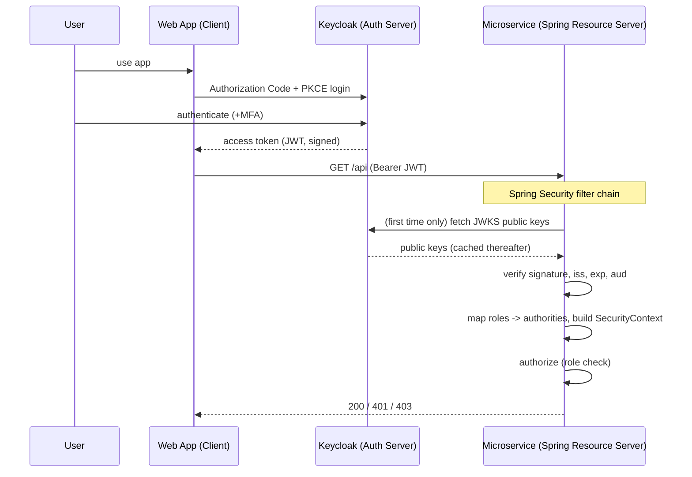

The pivotal detail is the **`SVC->>K: fetch JWKS` happening "first time only"** — after that,
verification is entirely local (`SVC->>SVC`). Keycloak is consulted once for keys, not once per
request. This is what makes the architecture scale: a thousand requests per second do *not* mean a
thousand calls to Keycloak.

### Step 7 — The Whole Integration in Config

```yaml
# application.yml — your microservice (resource server)
spring:
  security:
    oauth2:
      resourceserver:
        jwt:
          # Point at the realm. Spring auto-discovers JWKS + issuer from
          # {issuer-uri}/.well-known/openid-configuration
          issuer-uri: https://keycloak.bank.com/realms/bank
```

That *one property* wires the entire validation pipeline: Spring hits the realm's discovery
document, learns the JWKS URI, fetches keys, and configures the `JwtDecoder` to verify signature
and `iss` automatically. You add audience validation and role mapping on top (Parts 9–10). This is
the payoff of OIDC Discovery (Part 3): integration is essentially one line plus your authorization
rules.

### Step 8 — Common Mistakes

- **"Keycloak secures my APIs automatically."** It does not. Keycloak issues tokens; **your service
  must validate them and enforce rules.** A service with no resource-server config will happily
  serve unauthenticated requests *even though Keycloak exists.* (See Part 19.)
- **Pointing `issuer-uri` at the wrong realm or the `master` realm.** Tokens won't validate.
- **Mismatch between the issuer in the token (`iss`) and `issuer-uri`** (http vs https, internal
  hostname vs external). Classic 401.
- **Expecting roles to "just work."** Default Spring does not read Keycloak's role claims; you must
  map them (Part 10).

### Step 9 — Debugging Perspective

When integration "doesn't work," isolate the boundary. Decode the token (Part 16): is it
well-formed, unexpired, from the right `iss`, addressed to the right `aud`? If the token is good
but the service 401s, the problem is *Spring-side* (issuer/JWKS/audience config). If the token
itself is wrong (missing roles, wrong audience), the problem is *Keycloak-side* (client/mapper
config). The token is the contract between the two systems — inspect it first, then you know which
side to fix.

### Step 10 — Summary

Keycloak and Spring Security are **partners with distinct jobs**: Keycloak **authenticates and
issues** signed tokens (once, at login); Spring Security **validates and authorizes** them (every
request, locally, using cached public keys). The **JWT is the baton** between them, and **JWKS** is
the trust anchor. You need *both* because *issuing trust* and *enforcing it per request* are
different responsibilities. Mental picture: a passport office that issues, and border officers who
verify. The next parts zoom into the Spring side: how exactly it validates (Parts 8–9) and maps
roles (Part 10).

---

# Part 8 — OAuth2 Resource Server

## 8.1 Understanding `spring-boot-starter-oauth2-resource-server`

### Step 1 — Problem Statement

You've decided: "my microservice should accept Keycloak JWTs, validate them, and protect its
endpoints." But validating a JWT properly is *hard and dangerous to hand-roll*: you must parse it,
select the right key by `kid`, fetch and cache JWKS, verify the signature with the correct
algorithm, reject `alg:none` attacks, check `exp`/`nbf`/`iss`/`aud`, handle clock skew, and
re-fetch keys on rotation. Every one of these is a place to introduce a vulnerability. You do *not*
want each team writing this. You want a battle-tested library that does it correctly by default.

### Step 2 — Intuition

`spring-boot-starter-oauth2-resource-server` is exactly that library. Adding it (plus one config
property) turns your service into a proper **OAuth2 Resource Server**: it knows how to find a
bearer token, validate it against Keycloak, and expose the result to Spring Security. You declare
*where* your authorization server lives; the starter builds the entire validation pipeline. You
focus on *authorization rules and role mapping*, not on cryptography.

The mental model: this starter is a **pre-built, correct implementation of "Part 4's ten validation
steps,"** wired into the filter chain from Part 6.

### Step 3 — Real-World Analogy

Rather than each bank branch designing its own counterfeit-detection machine (and getting it
subtly wrong), every branch installs the *same certified note-validator* from the central bank. You
just plug it in and point it at the right currency. The resource-server starter is that certified
validator for tokens.

### Step 4 — Internal Mechanics: what the starter assembles

When you enable `oauth2ResourceServer().jwt()`, Spring constructs:

- **`BearerTokenAuthenticationFilter`** — finds the token in the `Authorization: Bearer` header (or
  configured location) and starts authentication.
- **`JwtDecoder`** (concretely `NimbusJwtDecoder`) — parses the JWT, selects the key by `kid`,
  verifies the signature, and runs the configured **OAuth2 token validators**.
- **`JwtIssuerValidator` / timestamp validators** — check `iss` and `exp`/`nbf` by default; you can
  add an **audience validator**.
- **`JwtAuthenticationProvider`** — orchestrates decode + validate, then calls the converter.
- **`JwtAuthenticationConverter`** — turns the validated `Jwt` into an `Authentication` with
  `GrantedAuthority`s (Part 10 customizes this).
- A **JWKS key source** with caching and rotation handling, pointed at the realm's `jwk-set-uri`.

### Step 5 — `issuer-uri` vs `jwk-set-uri` (and startup behavior)

Two ways to configure the decoder:

- **`issuer-uri`** (preferred): Spring calls `{issuer-uri}/.well-known/openid-configuration` to
  **auto-discover** the `jwks_uri`, supported algorithms, and the expected issuer. It also **adds an
  issuer validator** automatically. One property, maximum correctness.
- **`jwk-set-uri`** (manual): you give the JWKS URL directly. Use this when discovery isn't
  reachable, but you then configure issuer validation yourself.

**Startup process:** with `issuer-uri`, by default Spring fetches the discovery document **at
startup** to configure the decoder. (Consequence: if Keycloak is down when your service boots, the
service may fail to start — a real operational coupling; you can switch to lazy/`jwk-set-uri` to
decouple boot ordering.) **Runtime process:** on the first token (and after), Spring uses the
cached JWKS to verify signatures; when it encounters an unknown `kid`, it **re-fetches** JWKS to
pick up rotated keys.

### Step 6 — Visual: startup vs runtime

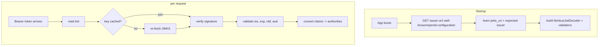

The **Startup** subgraph happens once: discover → build decoder. The **Runtime** subgraph happens
per request: read `kid`, verify with cached key (re-fetch only on cache miss / rotation), then run
validators and the converter. This diagram is the precise behavior behind "one config property."

### Step 7 — Dependency + Config

```xml
<dependency>
  <groupId>org.springframework.boot</groupId>
  <artifactId>spring-boot-starter-oauth2-resource-server</artifactId>
</dependency>
```

```yaml
spring:
  security:
    oauth2:
      resourceserver:
        jwt:
          issuer-uri: https://keycloak.bank.com/realms/bank
          # optional explicit override:
          # jwk-set-uri: https://keycloak.bank.com/realms/bank/protocol/openid-connect/certs
```

```java
@Bean
SecurityFilterChain api(HttpSecurity http) throws Exception {
  http.authorizeHttpRequests(a -> a.anyRequest().authenticated())
      .oauth2ResourceServer(o -> o.jwt(Customizer.withDefaults()))
      .sessionManagement(s -> s.sessionCreationPolicy(SessionCreationPolicy.STATELESS));
  return http.build();
}
```

The dependency brings the validator machinery; `issuer-uri` points it at your realm;
`oauth2ResourceServer().jwt()` plugs it into the filter chain. Three small things, a complete and
*correct* token-validation pipeline.

### Step 8 — Common Mistakes

- **Adding the *client* starter instead of the *resource-server* starter.**
  `spring-boot-starter-oauth2-client` is for apps that *log users in* (obtain tokens);
  `...-resource-server` is for APIs that *validate* tokens. Mixing them up causes baffling behavior.
- **Hard service-start coupling to Keycloak** via startup discovery — fine in prod with Keycloak
  HA, surprising in local/dev when Keycloak isn't up yet.
- **Forgetting `STATELESS`** so the resource server starts minting sessions.

### Step 9 — Debugging Perspective

If the app won't *start*, suspect discovery (`issuer-uri` unreachable/wrong). If it starts but
every token 401s, decode a token and compare its `iss` to your `issuer-uri` *character for
character*, and curl the `jwk-set-uri` to confirm keys are served. Spring Security DEBUG logs name
the exact validator that rejected a token (`Jwt expired`, `iss claim is not valid`).

### Step 10 — Summary

The resource-server starter is a **certified, correct JWT-validation pipeline** wired into Spring's
filter chain. Prefer **`issuer-uri`** for auto-discovery (it also adds issuer validation). It
**discovers at startup** and **verifies per request** using cached, auto-rotating JWKS keys. Your
job shrinks to **authorization rules + role mapping**. Mental picture: a certified currency
validator you plug in and point at the right realm.

---

# Part 9 — Token Validation Flow (Internals)

This part traces, class by class, what happens between "a request with a Bearer token arrives" and
"the SecurityContext is populated." When you can name these classes, you can read a stack trace
like a map.

### Step 1 — Problem Statement

You set `issuer-uri` and it "just works" — until it doesn't, and a 401 appears with no obvious
cause. To debug like a senior, you must know the *exact internal pipeline*: which class extracts
the token, which decodes it, which validates each claim, which builds authorities, and where in
that chain a given failure is thrown. Black-box knowledge fails you at 2 a.m.; white-box knowledge
saves you.

### Step 2 — Intuition

Validation is an assembly line. The raw token enters one end; a trusted, authenticated principal
exits the other. Each station has a name and one responsibility, and each can stop the line with a
specific exception that becomes a specific HTTP status. Learn the stations and the line becomes
transparent.

### Step 3 — The Ten Steps Mapped to Real Classes

1. **Request arrives** → handled by `BearerTokenAuthenticationFilter`.
2. **Authorization header extracted** → `DefaultBearerTokenResolver` pulls the `Bearer <token>`
   value (rejects malformed headers, multiple tokens).
3. **Token wrapped** → a `BearerTokenAuthenticationToken` (unauthenticated) is created and passed
   to the `AuthenticationManager`, which delegates to `JwtAuthenticationProvider`.
4. **JWT parsed + signature verified** → `JwtAuthenticationProvider` calls `NimbusJwtDecoder`,
   which parses the JOSE structure, reads `kid`, gets the matching key from the cached
   `JWKSource`, and **verifies the signature**. Failure → `BadJwtException` /
   `InvalidBearerTokenException`.
5. **Issuer verified** → `JwtIssuerValidator` (added automatically with `issuer-uri`) checks `iss`.
6. **Audience verified** → your custom `JwtClaimValidator`/`OAuth2TokenValidator` for `aud` (you
   add this; see code below).
7. **Expiration/not-before checked** → `JwtTimestampValidator` checks `exp`/`nbf` with allowed
   clock skew (default 60s).
8. **Authorities created** → `JwtAuthenticationConverter` (with a
   `JwtGrantedAuthoritiesConverter`) maps claims (`scope`, and—after you customize—`realm_access`/
   `resource_access`) into `GrantedAuthority`s (Part 10).
9. **SecurityContext populated** → the resulting authenticated `JwtAuthenticationToken` is set on
   the `SecurityContext` via `SecurityContextHolder`.
10. **Request allowed** → control returns to the filter chain; `AuthorizationFilter` +
    `AuthorizationManager` make the access decision; allowed requests reach the controller.

Validators 4–7 run *inside* the decoder via a `DelegatingOAuth2TokenValidator` (a composite that
runs all configured validators and aggregates failures).

### Step 4 — Visual: classes in the pipeline

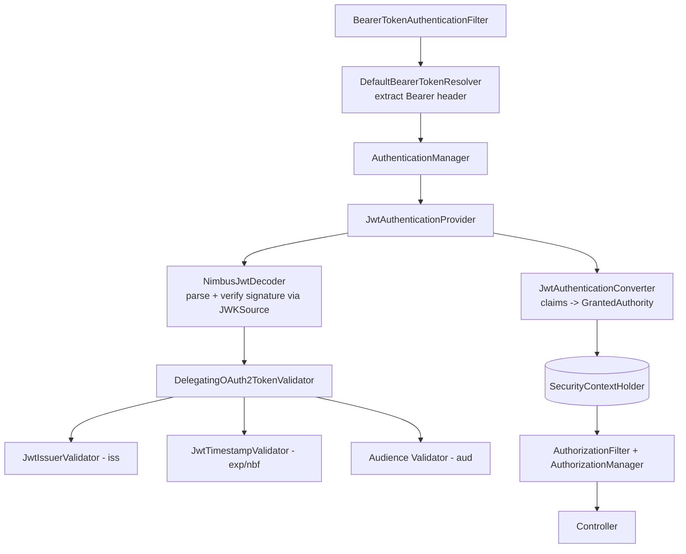

Read top to bottom: the **filter** extracts the token, the **provider** drives the **decoder**, the
decoder verifies the signature and runs the **validator composite** (`iss`, `exp/nbf`, `aud`), then
the **converter** builds authorities, the result is stored in the **SecurityContextHolder**, and
finally **authorization** runs before the **controller**. Every arrow is a place a failure can occur
— and each throws a distinct, greppable exception.

### Step 5 — Code: adding audience validation (closing step 6)

```java
@Bean
JwtDecoder jwtDecoder(OAuth2ResourceServerProperties props) {
  // Build the standard decoder from issuer-uri (gives signature + iss + timestamp checks)
  NimbusJwtDecoder decoder =
      JwtDecoders.fromIssuerLocation(props.getJwt().getIssuerUri());

  // Compose the default validators (iss, exp/nbf) WITH a custom audience check.
  OAuth2TokenValidator<Jwt> withIssuer =
      JwtValidators.createDefaultWithIssuer(props.getJwt().getIssuerUri());
  OAuth2TokenValidator<Jwt> audience = new JwtClaimValidator<List<String>>(
      "aud", aud -> aud != null && aud.contains("accounts-service"));

  decoder.setJwtValidator(new DelegatingOAuth2TokenValidator<>(withIssuer, audience));
  return decoder;
}
```

The crucial line is the `DelegatingOAuth2TokenValidator` combining `withIssuer` (signature +
issuer + timestamps) and `audience` (our `aud` rule). Now any token not addressed to
`accounts-service` is rejected at **step 6** with a clear `aud claim is not valid` message. This is
how you harden against tokens minted for *other* services being replayed at yours.

### Step 6 — Which failure → which status → which exception

| Failure | Step | Exception | HTTP |
|---|---|---|---|
| No/garbled Bearer header | 2 | (none; stays unauthenticated) | 401 (later) |
| Bad signature / unknown kid | 4 | `BadJwtException` → `InvalidBearerTokenException` | 401 |
| Wrong `iss` | 5 | `JwtValidationException` | 401 |
| Wrong/missing `aud` | 6 | `JwtValidationException` | 401 |
| Expired (`exp`) | 7 | `JwtValidationException` | 401 |
| Valid token, missing role | 10 | `AccessDeniedException` | 403 |

Note the sharp line: everything through step 7 is **authentication** and fails **401**; step 10 is
**authorization** and fails **403**. The `WWW-Authenticate` response header on a 401 from a
resource server often *names the reason* (e.g., `error="invalid_token",
error_description="Jwt expired at ..."`) — read it.

### Step 7 — Debugging Perspective

Turn on `logging.level.org.springframework.security=DEBUG` and watch for the validator names above.
A `JwtValidationException` tells you *which claim* failed. A `BadJwtException` means signature/JWKS
trouble — curl the `jwk-set-uri`, check the token's `kid` is present. An `AccessDeniedException`
means the token was *fine* and the problem is roles → go to Part 10. Knowing the class instantly
routes you to the right fix.

### Step 8 — Summary

Token validation is a named pipeline: **BearerTokenAuthenticationFilter → BearerTokenResolver →
JwtAuthenticationProvider → NimbusJwtDecoder (signature via JWKSource) →
DelegatingOAuth2TokenValidator (iss, exp/nbf, aud) → JwtAuthenticationConverter (authorities) →
SecurityContextHolder → AuthorizationManager → Controller.** Authentication failures (steps 2–7)
are **401**; authorization failures (step 10) are **403**, each thrown by a distinct, greppable
class. Mental picture: an assembly line where every station is named, so any stoppage is
immediately locatable.

---

# Part 10 — Role Mapping

This is the single most common source of "it authenticates but authorization is broken" pain. The
token is valid, the user *has* the role in Keycloak, and yet `hasRole('TELLER')` returns false and
you get a 403. Understanding *why* — and the few lines that fix it — is a rite of passage.

### Step 1 — Problem Statement

Keycloak and Spring Security each have a notion of "roles," but they **store and name them
differently**, and **by default they don't connect.** Keycloak puts realm roles in a nested claim
`realm_access.roles: ["TELLER"]` and client roles in `resource_access.<client>.roles`. Spring
Security, out of the box, **does not look in those claims at all** — its default
`JwtGrantedAuthoritiesConverter` reads the **`scope`** (or `scp`) claim and produces authorities
prefixed `SCOPE_` (e.g., `SCOPE_accounts:read`). So a user who is clearly a `TELLER` in Keycloak
arrives at your service with authorities like `SCOPE_openid`, `SCOPE_profile` — and *no*
`ROLE_TELLER`. Every `hasRole('TELLER')` fails. The bridge between the two worlds must be built
explicitly.

### Step 2 — Intuition

You must teach Spring Security *where to find Keycloak's roles in the token* and *how to name
them* so that `hasRole(...)` and `hasAuthority(...)` work. This is the job of a custom
**`JwtAuthenticationConverter`**: a small adapter that reads `realm_access.roles` and
`resource_access.*.roles` out of the JWT and emits `GrantedAuthority`s — typically prefixing realm
roles with `ROLE_` so Spring's `hasRole` helper (which auto-adds `ROLE_`) matches them.

Two vocabularies, one translator. Once you write the translator, everything downstream
(`hasRole`, `@PreAuthorize`) works as you'd expect.

### Step 3 — The Keycloak Role Landscape

Before mapping, know what you're mapping:

- **Realm roles** — apply across the realm (`TELLER`, `MANAGER`). In the token under
  `realm_access.roles`. Use for broad, cross-application roles.
- **Client roles** — scoped to a specific client (`accounts-service: [accounts:read]`). In the
  token under `resource_access.<clientId>.roles`. Use for app-specific permissions.
- **Groups** — collections of users; if a group has roles, members inherit them (those roles still
  appear in `realm_access`/`resource_access`). Groups can also be emitted as a `groups` claim via a
  mapper, for org-structure decisions.
- **Scopes** — OAuth2 scopes (`accounts:read`) in the `scope` claim. *Coarser* than roles; often
  represent *consent* and *what the client app is allowed to ask for*, not *what the user is*. This
  is why "roles ≠ scopes" (Part 19).

A senior's rule of thumb: **realm/client roles** express *who the user is / what they may do*;
**scopes** express *what the client application was authorized to request*. Map both, but keep
them conceptually distinct.

### Step 4 — Internal Mechanics: where mapping plugs in

Recall Part 9 step 8: after the token is validated, the **`JwtAuthenticationConverter`** turns the
`Jwt` into an `Authentication`. It has two responsibilities you can override:

- The **authorities converter** (`Converter<Jwt, Collection<GrantedAuthority>>`) — decides which
  claims become authorities and how they're named/prefixed.
- The **principal name** (`setPrincipalClaimName`) — which claim is the username (default `sub`;
  often set to `preferred_username`).

You replace the default authorities converter with one that reads Keycloak's role claims. That's
the entire fix.

### Step 5 — Step-by-Step Mapping Logic

1. Validated `Jwt` arrives at the converter.
2. Read `realm_access.roles` → for each, emit `ROLE_<name>` (so `hasRole('TELLER')` matches).
3. Read `resource_access.<client>.roles` → for each, emit an authority (e.g., `ROLE_<name>` or a
   client-prefixed name, your choice).
4. Optionally read `scope`/`scp` → emit `SCOPE_<scope>` (keep scope-based authorities too).
5. Combine all into one authority set.
6. Build a `JwtAuthenticationToken` with those authorities and the chosen principal name.
7. Downstream, `hasRole`, `hasAuthority`, and `@PreAuthorize` evaluate against this set.

### Step 6 — Visual: the two worlds bridged

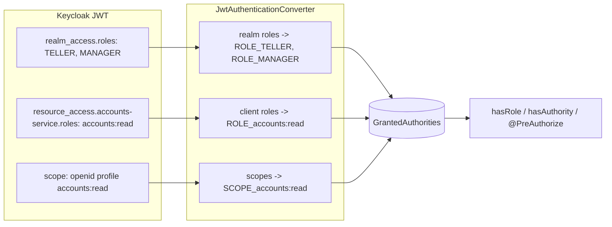

The left box is what Keycloak *put in the token*; the middle box is *your converter translating*;
the right is the authority set Spring authorizes against. The whole bug class "roles don't work"
is simply: **without the middle box, the left never reaches the right.** Build the middle box once.

### Step 7 — Code: the canonical custom converter

```java
@Bean
JwtAuthenticationConverter jwtAuthenticationConverter() {
  JwtAuthenticationConverter converter = new JwtAuthenticationConverter();

  // Keep Spring's default scope->SCOPE_ mapping AND add Keycloak realm roles.
  converter.setJwtGrantedAuthoritiesConverter(jwt -> {
    Collection<GrantedAuthority> authorities = new ArrayList<>();

    // 1) default scopes -> SCOPE_*
    authorities.addAll(new JwtGrantedAuthoritiesConverter().convert(jwt));

    // 2) realm roles -> ROLE_*
    Map<String, Object> realmAccess = jwt.getClaim("realm_access");
    if (realmAccess != null && realmAccess.get("roles") instanceof Collection<?> roles) {
      roles.forEach(r -> authorities.add(new SimpleGrantedAuthority("ROLE_" + r)));
    }

    // 3) client roles for a specific client -> ROLE_*
    Map<String, Object> resourceAccess = jwt.getClaim("resource_access");
    if (resourceAccess != null && resourceAccess.get("accounts-service")
            instanceof Map<?, ?> client && client.get("roles") instanceof Collection<?> cr) {
      cr.forEach(r -> authorities.add(new SimpleGrantedAuthority("ROLE_" + r)));
    }
    return authorities;
  });

  // Use the human username instead of the opaque sub as the principal name.
  converter.setPrincipalClaimName("preferred_username");
  return converter;
}
```

Wire it in:

```java
http.oauth2ResourceServer(o -> o.jwt(j -> j.jwtAuthenticationConverter(jwtAuthenticationConverter())));
```

The teaching points: block (1) preserves scope authorities; block (2) reaches into the **nested**
`realm_access.roles` (note: it's a `Map`, then a list — the nesting is exactly why the default
converter misses it); block (3) does the same for a specific client. Every realm role becomes
`ROLE_<name>`, so `hasRole('TELLER')` — which internally checks `ROLE_TELLER` — finally matches.
`setPrincipalClaimName` makes `authentication.getName()` return `john`, not a UUID.

### Step 8 — Alternative Strategy: map roles in Keycloak instead

Sometimes you'd rather not write the same converter in twenty services. Two cleaner-at-scale
options:

- **A shared library/auto-configuration** containing the converter, imported by every service —
  one implementation, consistent everywhere.
- **A Keycloak protocol mapper** that flattens roles into a single top-level claim (e.g., a
  `roles` claim), so services need a *simpler*, uniform converter (read one flat claim). You move
  some mapping responsibility into Keycloak's mappers. Trade-off: the token shape becomes a shared
  contract you must version carefully.

There's no single right answer; banks often standardize on a shared converter library *plus* a
consistent Keycloak mapper, documented as the org's "token contract."

### Step 9 — Common Mistakes & Debugging

- **Expecting roles without a converter** → the #1 mistake; `realm_access` is never read by
  default.
- **Prefix confusion:** `hasRole('X')` checks authority `ROLE_X`; `hasAuthority('Y')` checks `Y`
  *literally*. If your converter emits `TELLER` (no prefix), use `hasAuthority('TELLER')`, *not*
  `hasRole('TELLER')`. Mixing these is a constant 403 source.
- **Mapping client roles from the wrong client name** → empty roles. The `resource_access` key must
  match the Keycloak client id exactly.
- **Debugging:** decode the token (Part 16) and confirm the role is *actually in the claim*. If
  it's not in the token, fix **Keycloak** (assign the role / add a mapper). If it *is* in the token
  but `hasRole` fails, fix the **converter/prefix**. Log
  `SecurityContextHolder.getContext().getAuthentication().getAuthorities()` to see exactly what
  Spring computed.

### Step 10 — Summary

Keycloak stores roles in **nested** claims (`realm_access.roles`, `resource_access.<client>.roles`)
that Spring **ignores by default** (it only reads `scope` → `SCOPE_*`). Bridge the gap with a
custom **`JwtAuthenticationConverter`** that emits `ROLE_*` authorities, optionally setting the
principal name to `preferred_username`. Keep **roles vs scopes** distinct conceptually. At scale,
share the converter as a library and/or flatten roles via a Keycloak mapper. Mental picture: a
translator standing between two role vocabularies — without it, authorization silently fails.

---

# Part 11 — Authorization

With identity established and authorities mapped, we make **access decisions**. Spring offers two
layers: **URL-based** (in the filter chain) and **method-based** (`@PreAuthorize` and friends).
Knowing how each works internally lets you choose the right tool and debug denials precisely.

### Step 1 — Problem Statement

You have an authenticated principal with authorities. Now: *which* endpoints and *which* methods
may they invoke, and *under what conditions* (role? scope? ownership of the specific record?)? You
need an expressive, centralized way to declare these rules and have them enforced consistently —
some rules are coarse ("any `/admin/**` needs `ADMIN`"), others fine ("you may read account X only
if you own it"). One mechanism can't elegantly do both, so Spring provides two complementary ones.

### Step 2 — Intuition

- **URL authorization** is the *coarse outer gate*, enforced in the filter chain *before* the
  controller. Great for broad rules by path. ("Everything under `/admin` requires ADMIN.")
- **Method security** is the *fine inner gate*, enforced by an AOP interceptor *around the method*,
  with access to method arguments and the return value. Great for business rules that depend on
  *data*. ("`@PreAuthorize("#accountId == authentication.name or hasRole('MANAGER')")`".)

Mental model: a guarded building (URL rules at the lobby) where individual rooms also have their
own locks (method rules), some of which inspect *what you're carrying* (method arguments).

### Step 3 — Real-World Analogy

Airport again: the URL gate is the *concourse entrance* (only ticketed passengers past this point —
coarse). Method security is the *jet bridge agent* who checks that *this* boarding pass is for
*this specific flight and seat* (fine, data-dependent). Two gates, two granularities.

### Step 4 — Internal Mechanics

**URL authorization:** configured via `authorizeHttpRequests`, enforced by the
`AuthorizationFilter`, which consults an `AuthorizationManager<RequestAuthorizationContext>`. Each
matcher maps to an `AuthorizationManager` (e.g., `AuthorityAuthorizationManager` for
`hasRole`/`hasAuthority`). It returns an `AuthorizationDecision` (granted true/false). Denied →
`AccessDeniedException` → `ExceptionTranslationFilter` → 403.

**Method security:** enabled by `@EnableMethodSecurity`. Spring AOP wraps annotated beans with an
`AuthorizationManagerBeforeMethodInterceptor` (for `@PreAuthorize`) and an `...After...`
interceptor (for `@PostAuthorize`). These delegate to a `PreAuthorizeAuthorizationManager`, which
evaluates the **SpEL** expression against a context exposing `authentication`, method arguments
(`#argName`), and (for `@PostAuthorize`) `returnObject`. The expression's boolean result is the
decision.

**The expression helpers:**
- `hasRole('X')` → checks authority `ROLE_X` (adds the prefix for you).
- `hasAuthority('Y')` → checks authority `Y` literally.
- `hasAnyRole(...)`, `hasAnyAuthority(...)` → any-of.
- `permitAll()`, `denyAll()`, `isAuthenticated()`.
- Arbitrary SpEL: `#id == authentication.name`, `@beanName.check(#x)` (call your own bean).

### Step 5 — Step-by-Step Decision Flow (method security)

1. A request, already authenticated, reaches a controller method annotated `@PreAuthorize`.
2. The AOP interceptor fires *before* the method body.
3. It builds a SpEL evaluation context: `authentication` (from SecurityContext), method args.
4. It evaluates the expression, e.g. `hasRole('MANAGER') or #accountId == authentication.name`.
5. `true` → method body executes. `false` → `AccessDeniedException` → 403; body never runs.
6. For `@PostAuthorize`, the method runs first, then the expression (with `returnObject`) decides
   whether the caller may *receive* the result — useful for "you may read it only if it's yours."

### Step 6 — Visual: the two gates

```mermaid
flowchart TD
    R[Authenticated request] --> U{URL rule: authorizeHttpRequests}
    U -- denied --> D1[403]
    U -- allowed --> C[Controller method]
    C --> P{@PreAuthorize SpEL}
    P -- false --> D2[403]
    P -- true --> BODY[method body runs]
    BODY --> PO{@PostAuthorize SpEL on returnObject}
    PO -- false --> D3[403, result withheld]
    PO -- true --> OUT[return result]
```

The request passes the **outer URL gate** (`U`), then the **pre-method gate** (`P`) which can read
arguments, runs the **body**, then optionally the **post-method gate** (`PO`) which can inspect the
*result*. Three checkpoints of increasing granularity. Most denials you debug are at `P` (wrong
role/expression) or the URL gate (wrong matcher).

### Step 7 — Code Examples (each explained)

```java
// URL-level (coarse) — in SecurityFilterChain
http.authorizeHttpRequests(a -> a
    .requestMatchers("/public/**").permitAll()
    .requestMatchers(HttpMethod.GET, "/accounts/**").hasAnyRole("TELLER", "MANAGER")
    .requestMatchers("/admin/**").hasRole("ADMIN")
    .anyRequest().authenticated());
```
The matchers are evaluated top-down; the first match wins. `hasRole("ADMIN")` requires authority
`ROLE_ADMIN` (so your converter must emit that — Part 10). `anyRequest().authenticated()` is the
safe catch-all; never end with `permitAll()` by accident.

```java
// Method-level (fine) — ownership rule using a method argument
@PreAuthorize("hasRole('MANAGER') or #accountId == authentication.name")
public Account getAccount(@P("accountId") String accountId) { ... }
```
This says: managers may read any account; everyone else may read *only their own* (where the
account id equals their username). `#accountId` references the method argument — a data-dependent
rule impossible at the URL layer. This is the power of method security.

```java
// Post-authorize — decide based on the returned object
@PostAuthorize("returnObject.owner == authentication.name or hasRole('AUDITOR')")
public Document fetch(String id) { ... }
```
The method runs, then access to its *result* is gated: you get the document only if you own it (or
are an auditor). Use sparingly — the body already executed (side effects happen), so prefer
`@PreAuthorize` when you can decide up front.

### Step 8 — Common Mistakes

- **`hasRole` vs `hasAuthority` prefix mismatch** (again — it's that common). `hasRole('X')` ≠
  authority `X`; it's `ROLE_X`.
- **Forgetting `@EnableMethodSecurity`** → all `@PreAuthorize` annotations silently do nothing.
  Terrifying: your security "works" in code review but enforces nothing.
- **Putting authorization only at the URL layer for data-ownership rules** → users access others'
  records via direct ids. Ownership needs method security or service-layer checks.
- **`@PostAuthorize` on methods with side effects** → the side effect already happened before the
  denial.

### Step 9 — Debugging Perspective

A 403 with `AccessDeniedException` means authorization, not authentication. Ask: (1) what
authorities does the principal actually have? (log them). (2) What did the rule require? (3) Is it a
prefix mismatch? (4) For method security: is `@EnableMethodSecurity` present, and is the bean a
Spring proxy (self-invocation within the same class bypasses the interceptor — a classic gotcha)?
DEBUG logging shows the `AuthorizationManager` decision.

### Step 10 — Summary

Spring authorizes at two layers: **URL rules** (coarse, in the filter chain via
`AuthorizationFilter`/`AuthorizationManager`) and **method security** (`@PreAuthorize`/
`@PostAuthorize`, AOP interceptors evaluating **SpEL** with access to arguments and return values).
Use URL rules for broad path-based gates and method security for **data-dependent** rules
(ownership, business conditions). Mind the `hasRole`/`hasAuthority` prefix and always enable method
security. Mental picture: a concourse gate plus a per-seat boarding check. Denials are **403** with
`AccessDeniedException` — always an authorization, never an authentication, problem.

---

# Part 12 — Microservice Security

A single secured service is the easy case. The real challenge — the one that defines enterprise
architecture — is securing a *chain* of services: User → API Gateway → Service A → Service B →
Service C. This part is about **how identity travels through that chain.**

### Step 1 — Problem Statement

A user calls the gateway, which routes to the accounts service, which must call the payments
service, which must call the ledger service. The user authenticated *once* at the edge. But the
deep services also need to know "who is this for?" and "is this allowed?" Three hard questions
arise: **(1)** How does each hop *prove* the call is legitimate (not an attacker who slipped inside
the network)? **(2)** Does the *user's identity* need to reach service C, or only service A? **(3)**
When A calls B, *whose* token does A present — the user's, or its own? Getting these wrong causes
either security holes (deep services trusting anything on the network) or broken authorization
(deep services not knowing which user they're serving).

### Step 2 — Intuition

The old model was "hard shell, soft center": authenticate at the edge, then trust everything
inside the network. This is **dangerous** — one compromised service or a misconfigured network and
an attacker roams freely. The modern model is **Zero Trust**: *every* hop verifies a token; no
service trusts a caller just because it's "internal." So the question becomes *which* token each
hop carries. Three strategies exist, each appropriate in different situations:

- **User token propagation** — A forwards the *user's* token to B. B sees the *user's* identity and
  roles. Good when downstream authorization is *per-user*.
- **Client credentials (service token)** — A uses its *own* service token to call B. B sees the
  *service's* identity, not the user's. Good for *system* actions where the user's identity is
  irrelevant (a nightly reconciliation job).
- **Token exchange** — A trades the user's token for a *new* token scoped for B that still
  represents the user (Part 2.7). Good when you want user identity *and* least-privilege, correct
  audiences per hop.

Choosing among these per call is the core skill of microservice security.

### Step 3 — Real-World Analogy

A hospital. A patient (user) is admitted at reception (gateway). When the ER doctor (service A)
orders a lab test (service B), three models exist: the doctor could **forward the patient's
wristband info** (user propagation — the lab knows *which patient*), act under **their own medical
license** for a general task (client credentials — the lab knows *a doctor* ordered it, not which
patient, fine for "calibrate the machine"), or get a **test-specific authorization** that still
names the patient but is valid only for this lab order (token exchange). Different tasks demand
different models.

### Step 4 — Internal Mechanics

- **At the edge (gateway):** validates the user's token (or terminates the OAuth2 login in a BFF),
  then forwards requests with `Authorization: Bearer <user token>`.
- **User propagation:** each service is a resource server; it validates the *same* user token and
  re-applies authorization with the *user's* roles. The token's `aud` should include each service
  (or audience checks must be relaxed/configured). Propagation is implemented by **copying the
  incoming `Authorization` header onto outgoing calls** (Feign interceptor / WebClient filter).
- **Service token (client credentials):** the calling service obtains its *own* token from Keycloak
  (Part 13) and uses it; downstream authorizes against *service-account* roles.
- **Token exchange:** the calling service swaps the user token at Keycloak for a downstream-scoped
  token (Part 2.7), preserving user identity with correct audience.

A crucial mechanical detail for user propagation: **the token must not have expired mid-chain**,
and **audience validation** must accept the token at each hop. Long chains + short token lifetimes
+ strict audience checks = subtle failures.

### Step 5 — Step-by-Step: a user request through three services

1. User → Gateway with `Bearer <user-token>`. Gateway validates and routes.
2. Gateway → Service A with the same `Bearer <user-token>`.
3. A validates the token, authorizes with the user's roles, does its work.
4. A needs data from B. **Decision point:** is this *on behalf of the user* (propagate/exchange) or
   *a system action* (client credentials)?
5. Say it's per-user: A forwards `Bearer <user-token>` to B (or exchanges it).
6. B validates, authorizes with the user's roles, calls C similarly.
7. C validates and responds; results flow back up.
8. Every hop independently verified a token — **Zero Trust** all the way down.

### Step 6 — Visual: the chain and the strategies

```mermaid
flowchart LR
    U[User] -->|Bearer user-token| GW[API Gateway]
    GW -->|Bearer user-token| A[Service A]
    A -->|Strategy 1: forward user-token| B1[Service B - sees USER]
    A -->|Strategy 2: client-credentials service-token| B2[Service B - sees SERVICE]
    A -->|Strategy 3: token exchange| B3[Service B - sees USER, aud=B]
```

The diagram shows the *fork at Service A*: the same downstream call can carry three different
tokens depending on intent. **Strategy 1** keeps the user's identity but forwards a broad token.
**Strategy 2** loses the user (system identity only). **Strategy 3** keeps the user *and* narrows
the token. Senior engineers annotate each inter-service call in their architecture with which
strategy it uses and *why*.

### Step 7 — Code: propagating the user token

**Feign (declarative client) — copy the incoming Authorization header:**
```java
@Bean
public RequestInterceptor userTokenRelay() {
  return template -> {
    Authentication auth = SecurityContextHolder.getContext().getAuthentication();
    if (auth instanceof JwtAuthenticationToken jwt) {
      template.header("Authorization", "Bearer " + jwt.getToken().getTokenValue());
    }
  };
}
```
This interceptor runs for every Feign call, pulling the *current* request's JWT from the
SecurityContext and attaching it outbound — implementing user propagation transparently. (Caveat:
the SecurityContext is thread-local; async/reactive needs propagation — Part 15.)

**WebClient (reactive/imperative) — same idea via a filter:**
```java
WebClient.builder()
  .filter((request, next) -> ReactiveSecurityContextHolder.getContext()
     .map(ctx -> ((JwtAuthenticationToken) ctx.getAuthentication()).getToken().getTokenValue())
     .map(tok -> ClientRequest.from(request)
          .headers(h -> h.setBearerAuth(tok)).build())
     .defaultIfEmpty(request)
     .flatMap(next::exchange))
  .build();
```
Reactive code can't use the thread-local; it reads `ReactiveSecurityContextHolder` and attaches the
token to the outgoing request. Same goal, reactive-safe mechanism.

### Step 8 — When to use which strategy

| Situation | Strategy | Why |
|---|---|---|
| Downstream authorizes per-user (read *my* accounts) | Propagate user token | B needs the user's identity & roles |
| System/background action (nightly batch, cache warm) | Client credentials | No user involved; service acts as itself |
| Per-user but long chain / least-privilege / strict audiences | Token exchange | Keeps user identity, narrows scope/aud per hop |
| Crossing a trust boundary to a partner | Token exchange / fresh token | Don't leak the original broad token externally |

The anti-patterns: using **client credentials when you need the user** (downstream can't enforce
per-user rules or audit *who*), and **forwarding the user token across an external boundary** (you
hand a partner a token good for your whole system).

### Step 9 — Debugging Perspective

Chain failures are often "works at A, 401/403 at B." Decode the token *as B receives it*: did A
forward it? Did it expire between hops (long chain, short lifespan)? Does B's audience check accept
it? Is A accidentally sending its *service* token when B expects the *user*? The discipline: at
each hop, log the token's `sub`, `aud`, `exp`, and roles — you'll see exactly where identity or
audience changed. Distributed tracing (Part 16) with the `sub`/`jti` attached makes this visible
end-to-end.

### Step 10 — Summary

Microservice security is about **how identity travels through a call chain** under **Zero Trust**
(every hop validates a token; no implicit network trust). Three propagation strategies — **forward
the user token** (per-user authz), **client credentials** (system actions), **token exchange**
(per-user + least privilege/correct audience) — each fit different intents. Implement propagation
with Feign interceptors / WebClient filters; mind token expiry and audience across hops; never leak
broad user tokens across trust boundaries. Mental picture: a hospital where each downstream order
carries either the patient's wristband, the doctor's license, or a test-specific authorization.

---

# Part 13 — Service Accounts

Part 12 named "client credentials" as a strategy. This part implements it end to end: how Keycloak
models a service's own identity, and how Spring Boot obtains and uses service tokens with Feign,
WebClient, RestClient, and RestTemplate.

### Step 1 — Problem Statement

A service often must act **as itself**, with no user in the picture: a scheduled job reconciling
ledgers at midnight, a service warming a cache, a worker consuming a queue and calling another
service. There is no user token to propagate. Yet the call must still be authenticated and
authorized — downstream services must not accept anonymous internal traffic (Zero Trust). The
service needs its *own* credential and its *own* token.

### Step 2 — Intuition

A **service account** is an identity in Keycloak that belongs to a *client* rather than a person.
When you enable "Service Accounts" on a confidential client, Keycloak creates a hidden user
representing that client. The client can then use the **client credentials flow** (Part 2.4) to get
a token whose subject *is* that service account, carrying roles you assign to it. So the payments
service has a Keycloak identity, holds roles like `ledger:write`, and presents tokens that prove
"I am the payments service, authorized to write to the ledger." It's an *employee badge* for a
machine.

### Step 3 — Real-World Analogy

A company issues a **corporate service card** to the "Facilities Robot." The robot isn't a person,
but it has its own badge with its own clearances (it can enter the supply room but not the vault).
When it acts, it swipes *its* badge, and the logs show "Facilities Robot entered supply room" —
accountable, scoped, non-human. A service account is that badge.

### Step 4 — Internal Mechanics: how Keycloak creates it

1. Create a **confidential client** (e.g., `payments-service`) with a client secret (or, better,
   mTLS / signed-JWT client authentication).
2. Toggle **"Service Accounts Enabled."** Keycloak generates a service-account user named
   `service-account-payments-service`.
3. Assign **roles** to that service account (realm roles and/or other clients' roles), e.g.
   `ledger:write`. These become the roles in the client-credentials token.
4. At runtime, the service authenticates to `/token` with `grant_type=client_credentials` and gets
   a token whose `sub`/`azp` identify the service account and whose `realm_access`/`resource_access`
   carry the assigned roles. **No refresh token, no user.**

### Step 5 — Step-by-Step Runtime Flow

1. The scheduled job in payments-service wakes up.
2. Spring's `OAuth2AuthorizedClientManager` checks its cache for a valid token for the
   `payments-service` client registration.
3. None (or expired) → it POSTs client credentials to Keycloak's `/token`.
4. Keycloak returns an access token (5-min lifespan, service-account subject, `ledger:write`).
5. The manager caches it until shortly before expiry.
6. The HTTP client (WebClient/RestClient/Feign/RestTemplate) attaches the token as a Bearer header.
7. The ledger service validates it and authorizes against the service account's roles.
8. On the next call before expiry, the cached token is reused (no Keycloak round trip).

### Step 6 — Visual

```mermaid
sequenceDiagram
    participant Job as payments-service (scheduled job)
    participant Mgr as OAuth2AuthorizedClientManager (cache)
    participant K as Keycloak
    participant L as ledger-service
    Job->>Mgr: need token for "payments-service"
    alt cached & valid
        Mgr-->>Job: cached access_token
    else missing/expired
        Mgr->>K: client_credentials (id+secret)
        K-->>Mgr: access_token (sub=service-account, ledger:write)
        Mgr-->>Job: access_token (now cached)
    end
    Job->>L: POST /ledger (Bearer access_token)
    L->>L: validate + authorize service-account role
    L-->>Job: 200
```

The diagram's value is the **cache fork**: most calls hit the cache; only expiry triggers a
Keycloak round trip. This is why service accounts scale — you're not hammering `/token` on every
call. The downstream sees a *service* subject with *service* roles, exactly as intended.

### Step 7 — Code: all four HTTP clients

**Common setup — register the client and an authorized-client manager:**
```yaml
spring:
  security:
    oauth2:
      client:
        registration:
          payments-service:
            provider: keycloak
            client-id: payments-service
            client-secret: ${PAYMENTS_SECRET}
            authorization-grant-type: client_credentials
        provider:
          keycloak:
            token-uri: https://keycloak.bank.com/realms/bank/protocol/openid-connect/token
```

```java
@Bean
OAuth2AuthorizedClientManager authorizedClientManager(
    ClientRegistrationRepository repo, OAuth2AuthorizedClientService svc) {
  var provider = OAuth2AuthorizedClientProviderBuilder.builder().clientCredentials().build();
  var manager = new AuthorizedClientServiceOAuth2AuthorizedClientManager(repo, svc);
  manager.setAuthorizedClientProvider(provider);
  return manager;   // obtains + caches client-credentials tokens
}
```

**WebClient (preferred, reactive or blocking):**
```java
@Bean
WebClient ledgerClient(OAuth2AuthorizedClientManager manager) {
  var oauth = new ServletOAuth2AuthorizedClientExchangeFilterFunction(manager);
  oauth.setDefaultClientRegistrationId("payments-service");
  return WebClient.builder().apply(oauth.oauth2Configuration()).build();
}
// usage: ledgerClient.post().uri("/ledger")... — token attached automatically
```

**RestClient (Spring 6.1+, modern blocking):**
```java
@Bean
RestClient ledgerRestClient(OAuth2AuthorizedClientManager manager) {
  var interceptor = new OAuth2ClientHttpRequestInterceptor(manager);
  interceptor.setClientRegistrationIdResolver(req -> "payments-service");
  return RestClient.builder().requestInterceptor(interceptor).build();
}
```

**Feign (declarative):**
```java
@Bean
RequestInterceptor serviceTokenInterceptor(OAuth2AuthorizedClientManager manager) {
  return template -> {
    var req = OAuth2AuthorizeRequest.withClientRegistrationId("payments-service")
                 .principal("payments-service").build();
    var client = manager.authorize(req);
    template.header("Authorization", "Bearer " + client.getAccessToken().getTokenValue());
  };
}
```

**RestTemplate (legacy):**
```java
@Bean
RestTemplate ledgerRestTemplate(OAuth2AuthorizedClientManager manager) {
  RestTemplate rt = new RestTemplate();
  rt.getInterceptors().add((request, body, execution) -> {
    var req = OAuth2AuthorizeRequest.withClientRegistrationId("payments-service")
                 .principal("payments-service").build();
    var token = manager.authorize(req).getAccessToken().getTokenValue();
    request.getHeaders().setBearerAuth(token);
    return execution.execute(request, body);
  });
  return rt;
}
```

The unifying idea across all four: an **`OAuth2AuthorizedClientManager`** obtains and caches the
service token; an HTTP-client-specific hook (filter/interceptor) attaches it as a Bearer header. You
never hand-code the `/token` call. WebClient/RestClient are the modern choices; Feign suits
declarative codebases; RestTemplate is legacy but still common.

### Step 8 — Common Mistakes

- **Hard-coding the `/token` call and caching tokens yourself** → reinventing (and mis-caching)
  what the manager does. Let Spring manage it.
- **Over-privileged service accounts** → assign least-privilege roles; a service account with
  `ADMIN` is a huge blast radius if its secret leaks.
- **Secrets in config/images/logs** → use a vault, environment injection, or mTLS/signed-JWT client
  auth instead of a static secret.
- **Using a service account where you needed the *user*** (Part 12) → downstream loses user
  identity and per-user authorization.

### Step 9 — Debugging Perspective

`invalid_client` at `/token` → wrong secret, client not confidential, or service accounts disabled.
403 downstream → the service account lacks the role (assign it in Keycloak → client → Service
Account Roles). Decode the service token and confirm `azp`/`sub` is the service account and the
expected roles are present. Watch for *token caching across role changes* — a cached token won't
reflect a just-assigned role until it expires.

### Step 10 — Summary

A **service account** gives a *client* its own Keycloak identity and roles so a service can act
**as itself** via the client-credentials flow — the implementation of Part 12's "service token"
strategy. Enable it on a confidential client, assign least-privilege roles, and let an
**`OAuth2AuthorizedClientManager`** obtain and cache tokens, attached to WebClient/RestClient/
Feign/RestTemplate via filters/interceptors. Mental picture: a corporate badge for a robot —
scoped, accountable, non-human. Use it for system actions; never as a substitute for user identity.

---

# Part 14 — Advanced Enterprise Architectures

Everything so far composes into the patterns large organizations actually run. This part surveys
those patterns, the problem each solves, and when to reach for it. These are the diagrams you'll
draw in design reviews and architecture interviews.

## 14.1 API Gateway + Keycloak

**Problem it solves.** With twenty services, you don't want each one re-implementing edge concerns
(rate limiting, routing, CORS, coarse auth). A **gateway** centralizes the edge. The question is
*how much* security the gateway does versus the services.

**The pattern.** The gateway (Spring Cloud Gateway, etc.) sits at the edge. Two common stances:

- **Gateway validates, services trust-but-verify:** the gateway validates the user's JWT (fail
  fast at the edge), then forwards it; each service *still* validates it (Zero Trust). This is the
  recommended default — defense in depth.
- **Gateway terminates, services validate:** the gateway handles the OAuth2 login (BFF-style) and
  forwards tokens; services validate.

```mermaid
flowchart LR
    U[User] -->|Bearer| GW[API Gateway\nvalidate JWT, route, rate-limit]
    GW -->|Bearer user-token| S1[accounts-service]
    GW -->|Bearer user-token| S2[payments-service]
    S1 -. validate again .- KC[(Keycloak JWKS)]
    S2 -. validate again .- KC
```

The dotted lines stress that services **independently validate** even though the gateway already
did. The gateway is an optimization and policy point, **not** a substitute for service-level
verification. **When NOT to:** don't let the gateway be the *only* validator — a service reachable
by another path would be unprotected.

## 14.2 Kong + Keycloak

**Problem.** Some orgs standardize on **Kong** (or another API-management platform) as the gateway,
using its OIDC plugin to authenticate at the edge and integrate with Keycloak. This offloads
token validation, introspection, and even login redirects to Kong.

**The pattern.** Kong's OIDC plugin validates tokens (or runs the auth-code flow), optionally
**introspects** opaque tokens against Keycloak, injects identity headers, and forwards to upstream
services. Services can either trust Kong-injected headers (inside a strong trust boundary) or
re-validate the forwarded JWT (Zero Trust).

```mermaid
flowchart LR
    U[User] --> KONG[Kong + OIDC plugin]
    KONG -->|validate / introspect| KC[Keycloak]
    KONG -->|forward JWT + headers| SVC[Spring services - validate JWT]
```

**Trade-off.** Centralizing at Kong is operationally clean and language-agnostic (non-Java services
benefit too), but **trusting injected headers without re-validation** recreates the "soft center"
risk. Best practice: still validate the JWT in services, or strongly lock the network so only Kong
can reach upstreams. **When to use:** polyglot estates, heavy API-management needs (quotas,
analytics, monetization).

## 14.3 Microservices & Event-Driven Systems

**Problem.** Synchronous calls (Part 12) propagate tokens naturally. But in **event-driven** systems
(Kafka, RabbitMQ), a producer drops a message and moves on; there's no live request to carry a
token, and the consumer may process it seconds or hours later, when the user's token has long
expired. How does identity/authorization work for *asynchronous* work?

**The pattern.** A few approaches, often combined:

- **Capture identity in the event, not a token.** Stamp the event with the *verified* user id /
  tenant / relevant claims (not the raw token) at produce time, after the producer authenticated
  the request. The consumer trusts the *broker boundary* and acts on the captured identity. Don't
  ship live tokens in events (they expire and leak).
- **Consumers act under a service account.** The consumer authorizes downstream calls with its own
  service token (Part 13), carrying the captured user id as *data* for business logic/audit.
- **Sign/secure the event channel** (broker auth, mTLS, schema validation) so events can't be
  forged.

```mermaid
flowchart LR
    P[Producer - validated user request] -->|event{userId, tenant, action}| BR[(Kafka)]
    BR --> C[Consumer]
    C -->|service-account token + userId as data| DS[downstream service]
```

**Key insight:** tokens are for *synchronous* request authorization; for *asynchronous* flows,
**capture the verified identity as event data** and let consumers act under service accounts. **When
NOT to:** never embed long-lived user tokens in events.

## 14.4 Multi-Realm Architectures

**Problem.** A bank may have wholly separate populations: retail customers, corporate clients,
internal staff. They have different login policies, MFA, federation, and must be strongly isolated
(a staff account must never be confusable with a customer account).

**The pattern.** One Keycloak, multiple **realms** (`retail`, `corporate`, `staff`), each with its
own users, clients, keys, and policies. Services that serve multiple populations must validate
tokens from *multiple issuers* (configure multiple issuer/JWKS sources, selecting by the token's
`iss`).

```mermaid
flowchart TD
    KC[Keycloak] --> R1[realm: retail]
    KC --> R2[realm: corporate]
    KC --> R3[realm: staff]
    R1 --> S[shared service validates by iss]
    R2 --> S
    R3 --> S
```

**Trade-off.** Strong isolation and independent policies, but services need multi-issuer validation
and you manage more realms. Spring supports multiple `JwtDecoder`s selected per issuer
(`JwtIssuerAuthenticationManagerResolver`). **When to use:** clearly distinct user populations with
different security regimes.

## 14.5 Multi-Tenant Architectures

**Problem.** A SaaS bank platform serves many *tenant* organizations from shared services, but each
tenant's data and policies must be isolated. Unlike multi-realm (separate populations), here you may
have *many* tenants and want them to scale without a realm explosion.

**The patterns (choose by isolation needs):**

- **Realm-per-tenant:** strongest isolation, but heavy at large tenant counts.
- **Shared realm, tenant claim:** one realm; each token carries a `tenant_id` claim; services
  enforce tenant isolation in authorization and data access. Scales to many tenants; isolation is
  *logical* (enforced in code), so correctness is critical.
- **Keycloak Organizations** (newer feature) for modeling tenants within a realm.

```mermaid
flowchart LR
    U[User of Tenant A] --> KC[Keycloak]
    KC -->|JWT with tenant_id=A| SVC[service]
    SVC --> AUTHZ{authorize within tenant A only}
    AUTHZ --> DATA[(filter data by tenant_id=A)]
```

**Key insight:** in the shared-realm model, **`tenant_id` from the token must drive both
authorization and data filtering** — a missing tenant check is a cross-tenant data breach. **When
to use realm-per-tenant:** few, high-value tenants needing hard isolation. **Shared realm:** many
tenants, SaaS scale.

## 14.6 BFF (Backend-for-Frontend) Pattern

**Problem.** SPAs storing tokens in the browser are exposed to XSS (token theft) and the awkwardness
of refresh-token handling in JavaScript. Can we keep tokens *out* of the browser entirely?

**The pattern.** A **BFF** is a server-side component dedicated to one frontend. The browser holds
only a **secure, HttpOnly session cookie** to the BFF; the BFF performs the OAuth2 code flow, holds
the tokens server-side, and calls downstream APIs with them. The browser never sees a JWT.

```mermaid
flowchart LR
    B[Browser - HttpOnly session cookie only] --> BFF[BFF server\nholds tokens]
    BFF -->|code flow| KC[Keycloak]
    BFF -->|Bearer access-token| API[downstream APIs]
```

**Trade-off.** Much better security posture (no tokens in JS, refresh handled server-side, easy
revocation via session) at the cost of a stateful BFF tier. **When to use:** browser apps with real
security requirements (banking, fintech) — increasingly the *recommended* pattern over storing
tokens in SPAs. Spring's `oauth2Login` + a gateway makes a natural BFF.

## 14.7 Zero Trust Security

**Problem.** The "hard shell, soft center" model fails against insider threats and lateral movement.
Modern security assumes the network is *already* hostile.

**The principles.** *Never trust, always verify.* Every request — even internal — is authenticated
and authorized. Identity, not network location, is the perimeter. Least privilege everywhere. This
is the philosophy behind everything in Parts 12–13: every hop validates a token; service accounts
are least-privileged; nothing is trusted "because it's internal."

```mermaid
flowchart LR
    A[Service A] -->|verify token| B[Service B]
    B -->|verify token| C[Service C]
    note[No hop trusts another by network location alone]
```

**When to use:** essentially always in modern enterprise systems; it's the default mindset, not an
add-on.

## 14.8 Service Mesh & mTLS

**Problem.** Token-based auth proves *user/service identity at the application layer*, but what
about the *transport*? How do we guarantee that the connection between service A and B is encrypted
and that B is *really* B (not an impostor on the network)? And can we get Zero-Trust transport
*without* changing application code?

**The pattern.** A **service mesh** (Istio, Linkerd) injects sidecar proxies beside each service.
The mesh establishes **mTLS** (mutual TLS) between sidecars: both sides present certificates, so
each connection is encrypted *and* both endpoints are cryptographically authenticated at the
transport layer — automatically, transparently to the app.

```mermaid
flowchart LR
    subgraph PodA
      A[Service A] --- PA[sidecar]
    end
    subgraph PodB
      B[Service B] --- PB[sidecar]
    end
    PA -- mTLS encrypted + mutually authenticated --- PB
```

**The two layers together.** mTLS answers *"is this connection to the real service, encrypted?"*
(transport identity); JWTs answer *"who is the user/service and what may they do?"* (application
identity and authorization). They are **complementary**, not alternatives: mTLS secures the pipe,
JWT secures the *meaning* flowing through it. Banks typically run **both** — mesh mTLS for
transport Zero Trust, Keycloak JWTs for application authorization.

**Trade-off.** The mesh removes mTLS/retries/observability from app code (big win) but adds
significant operational complexity. **When to use:** large Kubernetes estates wanting uniform
transport security and observability. **When NOT to:** small systems where the mesh's complexity
outweighs its benefits — there, library-level TLS + JWT suffices.

### Part 14 Summary

Enterprise security is **composition**: a **gateway** (or **Kong**) centralizes the edge but never
replaces per-service validation; **event-driven** systems capture verified identity as event data
and use service accounts; **multi-realm** isolates distinct populations while **multi-tenant**
(shared realm + `tenant_id`) scales SaaS; the **BFF** keeps tokens out of browsers; **Zero Trust**
makes identity the perimeter; and a **service mesh with mTLS** secures the transport beneath your
JWTs. The recurring mental model: **layers** — edge, application (JWT authz), and transport (mTLS) —
each doing its own job, none trusted to do another's.

---

# Part 15 — Troubleshooting

This is the section you'll return to during incidents. Each problem follows the same structure:
**Symptoms → Root Causes → Diagnosis → Logs → Fix → Prevention.** The meta-skill underneath all of
it: **decode the token, identify which boundary failed (Keycloak-side vs Spring-side), and read the
specific exception.**

## 15.1 The Universal First Moves

Before any specific problem, do these three things — they resolve most incidents in minutes:

1. **Decode the token** (jwt.io offline, or `jwt decode`, or Part 16's snippet). Read `iss`, `aud`,
   `exp`, `azp`, `realm_access`, `resource_access`. The token tells you almost everything.
2. **Enable Spring Security DEBUG:** `logging.level.org.springframework.security=DEBUG`. It names
   the filter/validator/exception that failed.
3. **Read the `WWW-Authenticate` header** on a 401 from a resource server — it usually contains
   `error` and `error_description` (e.g., `Jwt expired`, `iss claim is not valid`).

## 15.2 401 Unauthorized

- **Symptoms:** every protected request returns 401; `WWW-Authenticate: Bearer error="invalid_token"`.
- **Root causes:** missing/malformed `Authorization` header; expired token; wrong issuer; signature
  fails (wrong key/rotation); audience rejected; clock skew.
- **Diagnosis:** Is the header present and exactly `Bearer <jwt>`? Decode: is `exp` in the past?
  Does `iss` match `issuer-uri` *exactly*? Curl the `jwk-set-uri` — does it serve the token's `kid`?
- **Logs:** `InvalidBearerTokenException`, `JwtValidationException: Jwt expired`, `iss claim is not
  valid`, `BadJwtException` (signature).
- **Fix:** correct the header; refresh expired tokens; align `issuer-uri` with the token's `iss`;
  fix JWKS reachability; widen clock skew slightly if NTP drift is unavoidable.
- **Prevention:** use `issuer-uri` (auto issuer validation); sync clocks (NTP); never pin static
  keys (use JWKS); short but reasonable token lifetimes.

## 15.3 403 Forbidden

- **Symptoms:** authentication succeeds (token accepted) but the request is denied; 403,
  `AccessDeniedException`.
- **Root causes:** the principal lacks the required authority; **role-mapping not configured** (the
  Part 10 bug); `hasRole` vs `hasAuthority` prefix mismatch; method security not enabled.
- **Diagnosis:** log the principal's authorities
  (`getAuthentication().getAuthorities()`). Decode the token: is the role actually in
  `realm_access`/`resource_access`? Compare what the rule requires vs what the principal has.
- **Logs:** `Access is denied`, `AccessDeniedException`, with DEBUG showing the
  `AuthorizationManager` decision.
- **Fix:** if the role isn't in the token → assign it in Keycloak / add a mapper. If it's in the
  token but not an authority → fix the **`JwtAuthenticationConverter`**. If it's an authority but
  the rule misses it → fix the `hasRole`/`hasAuthority` prefix.
- **Prevention:** standardize a role-mapping library (Part 10); always `@EnableMethodSecurity`;
  test authorization in integration tests.

## 15.4 JWT Validation Failures (signature)

- **Symptoms:** 401, `BadJwtException`/`SignatureException`; often *after a Keycloak restart or key
  rotation*, affecting *all* tokens suddenly.
- **Root causes:** service pinned a static public key; JWKS unreachable; `kid` not in the cached
  key set; algorithm mismatch.
- **Diagnosis:** curl the `jwk-set-uri`; compare its `kid`s to the token's header `kid`. Did
  Keycloak rotate keys?
- **Fix:** stop pinning keys — use `issuer-uri`/`jwk-set-uri` so rotation is automatic; ensure the
  service can reach Keycloak's JWKS; clear/refresh the key cache.
- **Prevention:** never hard-code keys; monitor JWKS reachability; understand rotation (Part 4.10).

## 15.5 Role / Scope / Audience / Issuer Failures (quick table)

| Failure | Symptom | Root cause | Fix |
|---|---|---|---|
| Role mapping | 403 despite correct Keycloak role | no custom converter | add `JwtAuthenticationConverter` (Part 10) |
| Scope | 403 on `hasAuthority('SCOPE_x')` | scope not granted to client / not in token | add scope to client's default scopes |
| Audience | 401 `aud claim is not valid` | token's `aud` lacks this service | add audience mapper in Keycloak / relax validator |
| Issuer | 401 `iss claim is not valid` | `issuer-uri` ≠ token `iss` (http/https, host) | align exactly, incl. external vs internal hostname |

The **issuer hostname mismatch** deserves emphasis: if Keycloak is reached internally as
`http://keycloak:8080/realms/bank` but issues tokens with `iss:
https://keycloak.bank.com/realms/bank`, validation fails. Configure Keycloak's **frontend URL** so
`iss` is consistent, and point services at that same value.

## 15.6 Expired Tokens & Clock Skew

- **Symptoms:** intermittent 401 `Jwt expired`, especially on long-running requests or across hops.
- **Root causes:** access-token lifespan too short for the workflow; **server clocks out of sync**
  between Keycloak and services (a token looks expired/future on a drifted clock); long call chains.
- **Diagnosis:** compare `exp`/`iat` to actual wall-clock on each host; check NTP.
- **Fix:** sync clocks (NTP); set a sane access-token lifespan; refresh proactively; allow small
  skew (`JwtTimestampValidator` default 60s).
- **Prevention:** NTP everywhere; don't make lifespans absurdly short; refresh before expiry.

## 15.7 Key Rotation Failures

- **Symptoms:** sudden mass 401 after a Keycloak key event; new logins maybe fine, older ones fail.
- **Root cause:** services caching keys without re-fetching on unknown `kid`; pinned keys; very long
  JWKS cache TTL.
- **Fix/Prevention:** rely on Spring's JWKS source (auto re-fetch on cache miss); keep retired
  public keys in JWKS during a grace window; never pin.

## 15.8 Service Account / Client Credentials Failures

- **Symptoms:** `invalid_client`/`unauthorized_client` at `/token`; or 403 downstream for a service.
- **Root causes:** wrong client secret; client not confidential; service accounts disabled; grant
  type not enabled; service account missing roles.
- **Diagnosis:** test the `/token` call directly with the credentials; decode the resulting token
  for `azp`/roles.
- **Fix:** correct secret; enable confidential + service accounts + client-credentials grant; assign
  service-account roles.
- **Prevention:** store secrets in a vault; least-privilege roles; integration-test the M2M path.

## 15.9 Method Security Not Enforcing

- **Symptoms:** `@PreAuthorize` seems ignored; everyone gets through.
- **Root causes:** `@EnableMethodSecurity` missing; **self-invocation** (calling the annotated
  method from within the same bean bypasses the proxy); annotation on a non-Spring-bean.
- **Fix:** add `@EnableMethodSecurity`; call across beans so the proxy intercepts; ensure the target
  is a managed bean.
- **Prevention:** test that denials actually 403; code review for self-invocation.

## 15.10 SecurityContext / Async / Reactive Propagation

- **Symptoms:** `getAuthentication()` is null in a `@Async` method, a new thread, or a reactive
  chain; downstream propagation drops the token.
- **Root cause:** the default `SecurityContextHolder` strategy is **thread-local**; new threads
  don't inherit it. Reactive code uses `ReactiveSecurityContextHolder`, not the thread-local.
- **Fix:** for `@Async`, use `DelegatingSecurityContextExecutor`/`...AsyncTaskExecutor` or
  `MODE_INHERITABLETHREADLOCAL`; for reactive, read `ReactiveSecurityContextHolder`; propagate
  context explicitly to spawned threads.
- **Prevention:** know your concurrency model; standardize context-propagating executors; test
  async/reactive auth paths.

## 15.11 Feign / WebClient Propagation Failures

- **Symptoms:** downstream gets 401 because no token was forwarded; or forwards the *wrong* token.
- **Root cause:** no interceptor/filter attaching the token; SecurityContext empty on the calling
  thread (async); attaching a service token where a user token was needed (or vice versa).
- **Fix:** add the Feign `RequestInterceptor` / WebClient filter (Parts 12–13); ensure the
  SecurityContext is available on the calling thread; choose the right token strategy.
- **Prevention:** centralize propagation in shared config; integration-test multi-hop calls.

## 15.12 Gateway Authentication Failures

- **Symptoms:** requests fail at the gateway (401) or pass the gateway but services 401/403.
- **Root cause:** gateway issuer/JWKS misconfig; gateway strips/forwards the wrong header; gateway
  validates but services use a different issuer/audience; CORS preflight blocked.
- **Fix:** align issuer/audience config across gateway and services; ensure the `Authorization`
  header is forwarded; handle CORS/preflight (`OPTIONS`) as `permitAll`.
- **Prevention:** one source of truth for issuer/audience config; contract-test the edge.

### Part 15 Summary

Troubleshooting Keycloak + Spring is systematic, not mystical: **decode the token, turn on DEBUG,
read the exact exception/`WWW-Authenticate`, and localize to Keycloak-side (token contents) vs
Spring-side (validation/authorization config).** 401 = authentication (token bad/missing/expired/
wrong issuer/audience/signature). 403 = authorization (missing role, mapping not configured, prefix
mismatch). The recurring root causes — issuer mismatch, missing role converter, key pinning, clock
skew, thread-local context loss — recur because they're structural; prevent them with `issuer-uri`,
a shared role-mapping library, JWKS (never pinned keys), NTP, and context-propagating executors.

---

# Part 16 — Debugging Like a Senior Engineer

Troubleshooting (Part 15) is a catalog of problems. This part is the *method* — the repeatable
investigative discipline a senior applies to *any* security incident, even ones not in the catalog.

## 16.1 The Senior Mindset: localize before you theorize

Juniors guess ("maybe it's CORS? maybe the token?") and change things randomly. Seniors **localize
the failure to a boundary first**, then investigate only that boundary. In Keycloak + Spring there
are exactly four boundaries, and almost every incident lives at one:

```mermaid
flowchart LR
    A[1. Token issuance\nKeycloak] --> B[2. Token transport\nclient/gateway forwards header]
    B --> C[3. Token validation\nSpring resource server]
    C --> D[4. Authorization\nroles/method security]
```

The first question is never "what's the fix?" but **"which of these four failed?"** A decoded token
plus the HTTP status usually answers it: bad/missing token at the service → boundary 2 or 3; token
fine but 403 → boundary 4; token never minted / wrong claims → boundary 1.

## 16.2 Inspecting a JWT (your most-used tool)

Make token inspection reflexive. Three ways:

```bash
# 1) Decode without verifying (offline) — just split and base64-decode the payload
echo "$TOKEN" | cut -d. -f2 | base64 -d 2>/dev/null | jq .

# 2) Using the jwt CLI (if installed)
jwt decode "$TOKEN"

# 3) Programmatically log what the service actually sees
```
```java
@GetMapping("/whoami")
public Map<String,Object> whoami(JwtAuthenticationToken auth) {
  return Map.of(
    "name", auth.getName(),
    "authorities", auth.getAuthorities(),     // what Spring computed
    "claims", auth.getToken().getClaims());   // what Keycloak put in the token
}
```

The `/whoami` endpoint is gold: it shows, side by side, **what Keycloak issued** (claims) and **what
Spring derived** (authorities). The gap between them *is* your role-mapping bug (Part 10). Ship a
(secured) diagnostics endpoint like this in every service.

**What to read, in order:** `exp` (expired?), `iss` (matches config?), `aud` (addressed to me?),
`azp` (which client?), `realm_access`/`resource_access` (roles present?), `sub`/`preferred_username`
(who?). Five seconds of reading resolves most "mystery" 401/403s.

## 16.3 Inspecting Spring Security Internals

```properties
# See the filter chain at startup and per-request decisions at runtime
logging.level.org.springframework.security=DEBUG
logging.level.org.springframework.security.web.FilterChainProxy=TRACE
# Resource-server specifics
logging.level.org.springframework.security.oauth2=DEBUG
```

At **startup**, Spring prints the ordered list of filters in each chain — confirm your expected
filters (e.g., `BearerTokenAuthenticationFilter`, `AuthorizationFilter`) are present and ordered.
At **runtime**, it logs which filter handled the request and why it was allowed/denied — you can
literally watch a request walk the corridor (Part 6) and see where it stopped. This single setting
turns Spring Security from a black box into a glass box.

To inspect the live principal anywhere:
```java
var auth = SecurityContextHolder.getContext().getAuthentication();
log.info("principal={}, authorities={}", auth.getName(), auth.getAuthorities());
```

## 16.4 Debugging the Filter Chain

When "the wrong security applies" (e.g., an endpoint is unexpectedly public or unexpectedly
blocked):

1. With DEBUG on, find which **`SecurityFilterChain`** matched the request (logged at request
   start). Remember: **only the first matching chain runs** — a broad matcher earlier can swallow
   requests meant for a later chain.
2. Check the **matcher order** in your config; reorder so specific matchers precede general ones.
3. Confirm the **authorization rules** within that chain match what you intend (`permitAll` vs
   `authenticated` vs `hasRole`).

The classic bug: a `permitAll()` chain with a broad matcher accidentally covers a sensitive path.
The DEBUG log naming the matched chain finds it instantly.

## 16.5 Debugging Keycloak

Keycloak gives you three investigative tools:

- **Events** (Realm → Events → Login/Admin events): see *why* a login failed
  (`invalid_user_credentials`, `user_disabled`) and what clients/users did. Enable event logging if
  off.
- **Token "Evaluate"** (Client scopes → Evaluate, or a client's "Client scopes" → Evaluate): pick a
  user and *preview the exact token* they'd receive — the definitive way to confirm a role/claim
  will be present *before* blaming Spring.
- **Server logs:** mapper errors, flow errors, federation/LDAP issues.

The decision rule: if the **Evaluate** preview shows the role, the issue is **Spring-side**
(boundary 3/4). If it doesn't, the issue is **Keycloak-side** (boundary 1) — assign the role or fix
the mapper.

## 16.6 Tracing Authentication End-to-End

For multi-service incidents, correlate across hops:

- **Propagate a correlation/trace id** (e.g., via OpenTelemetry/Micrometer Tracing); attach the
  token's `sub` and `jti` to spans/logs at each service.
- Then a single trace shows the request crossing the gateway and each service, with the **principal
  and token id visible at every hop** — you can see exactly where identity changed (e.g., a
  service swapped the user token for a service token) or where a 401/403 first appeared.

```mermaid
sequenceDiagram
    participant GW as Gateway [trace=T, sub=john]
    participant A as Service A [trace=T, sub=john]
    participant B as Service B [trace=T, sub=??]
    GW->>A: traceId=T, sub=john
    A->>B: traceId=T  (did sub survive? did aud change?)
    Note over B: if sub/aud wrong here, A's propagation is the bug
```

The discipline: **never debug a distributed auth problem one service at a time in isolation.**
Trace the *whole* path with the principal attached, and the failing hop reveals itself.

## 16.7 A Repeatable Incident Playbook

1. **Reproduce** and capture the exact request, response status, and `WWW-Authenticate` header.
2. **Decode the token** the failing service received. Read `exp/iss/aud/roles`.
3. **Localize** to one of the four boundaries (16.1).
4. If **boundary 1** (issuance/claims): use Keycloak Events + Evaluate.
5. If **boundary 3** (validation): check `issuer-uri`, JWKS reachability, audience validator;
   read the `JwtValidationException` message.
6. If **boundary 4** (authorization): log authorities, check the converter and `hasRole`/
   `hasAuthority` prefix, confirm `@EnableMethodSecurity`.
7. If **boundary 2** (transport): confirm the header is forwarded and the right token strategy is
   used; check async/reactive context propagation.
8. **Fix at the right layer**, add a **regression test**, and note the **prevention** (Part 15).

### Part 16 Summary

Senior debugging is **localize-then-investigate** across four boundaries — issuance, transport,
validation, authorization. Your core instruments: **decode the token** (and a `/whoami` endpoint
exposing claims vs authorities), **Spring Security DEBUG** (glass-box the filter chain), **Keycloak
Events + Evaluate** (confirm issuance/claims), and **distributed tracing with the principal
attached** (find the failing hop). Mental picture: a four-station pipeline where you first find
*which station* failed, then look only there — never random trial-and-error.

---

# Part 17 — Interview Questions

A graded bank of questions with substantive answers. Use these to test mastery and to prepare for
interviews from junior to architect level. Don't memorize answers — *reconstruct* them from the
mental models in this guide.

## Beginner (Fundamentals)

**1. Authentication vs authorization?** Authentication = *who are you* (proving identity via
credentials), fails with **401**. Authorization = *what may you do* (checking permissions/roles),
fails with **403**. Authentication always precedes authorization.

**2. What is a JWT?** A compact, URL-safe, **signed** (not encrypted) token of three parts —
`header.payload.signature`. Header names the algorithm/key; payload holds claims; the signature
makes it tamper-evident. Anyone can read it; only the issuer can validly sign it.

**3. Is a JWT encrypted?** No — it's **encoded (Base64URL) and signed**. Never put secrets/PII you
wouldn't want readable. (JWE encryption exists but is separate and uncommon for access tokens.)

**4. 401 vs 403?** 401 = unauthenticated (missing/invalid/expired token). 403 = authenticated but
not permitted (missing role). They route you to opposite halves of the system.

**5. What is OAuth2 in one sentence?** A framework for **delegated authorization** — letting an app
access *some* of your resources without your password, with limited scope and lifetime.

**6. What is OIDC?** An **identity layer on OAuth2** adding the **ID token** (who the user is), the
`openid` scope, UserInfo, and Discovery. OAuth2 = authorization; OIDC = authentication.

**7. Session vs token auth?** Sessions store identity **server-side** (cookie is a pointer);
stateful, easy to revoke, harder to scale/share. Tokens carry identity **in the client** (signed);
stateless, scale well across services, harder to revoke.

**8. What is Keycloak?** An open-source IAM = OAuth2 Authorization Server + OpenID Provider + user
store + admin UI. It authenticates users and **issues** signed tokens your services trust.

**9. Access token vs ID token?** Access token → for **resource servers**, authorization ("what").
ID token → for the **client**, authentication ("who"). Don't send ID tokens to resource servers or
identify users from access tokens.

**10. What's a Bearer token?** A token where mere possession grants access ("the bearer"). Sent as
`Authorization: Bearer <token>`. Hence transport must be HTTPS and lifetimes short.

## Intermediate

**11. Walk the Authorization Code flow.** Redirect to Keycloak → user logs in *there* → code
returns via browser → backend exchanges code+secret for tokens on the back channel. Code travels
the visible channel; tokens only the invisible one.

**12. Why PKCE?** Public clients (SPA/mobile) can't hold a secret. PKCE replaces it with a
per-login proof: send `SHA256(verifier)` (challenge) up front, reveal `verifier` at exchange.
Defeats code interception.

**13. Client credentials flow — when?** Machine-to-machine, no user: a service acting **as itself**
with its own secret, receiving a token with the **service's** roles. Not for acting on a user's
behalf.

**14. How does Spring validate a Keycloak JWT?** `BearerTokenAuthenticationFilter` extracts it →
`NimbusJwtDecoder` verifies the signature using JWKS public keys (by `kid`) → validators check
`iss`, `exp/nbf`, `aud` → converter builds authorities → SecurityContext populated.

**15. Why don't my Keycloak roles work in Spring by default?** Spring's default converter reads
`scope` → `SCOPE_*`; Keycloak roles live in nested `realm_access`/`resource_access`. You need a
custom `JwtAuthenticationConverter` to emit `ROLE_*` (Part 10).

**16. `hasRole('X')` vs `hasAuthority('X')`?** `hasRole('X')` checks authority `ROLE_X` (adds the
prefix); `hasAuthority('X')` checks `X` literally. Prefix mismatches cause silent 403s.

**17. What is the JWKS endpoint?** `/protocol/openid-connect/certs` — serves Keycloak's public keys
(each with a `kid`). Services fetch and cache them to verify signatures and handle rotation
automatically.

**18. How does key rotation work?** Keycloak adds a new signing key (new `kid`) while keeping old
public keys in JWKS temporarily. On an unknown `kid`, services re-fetch JWKS. Never pin keys.

**19. Why RS256 over HS256 for microservices?** RS256 is asymmetric: Keycloak signs with a private
key, services verify with a public key (can't forge). HS256's shared secret would let every service
forge tokens. Asymmetry enables safe local verification.

**20. What does `STATELESS` session policy do and why use it?** Tells Spring to create no
`HttpSession`; each request is authenticated solely by its token. Correct for token-based resource
servers; avoids accidental session state.

**21. What is the `aud` claim and why validate it?** The intended audience. Validating it prevents a
token minted for service X from being replayed at service Y. Configure an audience validator.

**22. Difference between realm roles and client roles?** Realm roles apply realm-wide
(`realm_access.roles`); client roles are scoped to a specific client
(`resource_access.<client>.roles`). Both need mapping into authorities.

**23. Roles vs scopes?** Roles describe *who the user is / what they may do* (identity-side);
scopes describe *what the client app was authorized to request* (consent/coarse). Different
concepts, often both in the token.

**24. How do refresh tokens work?** A longer-lived, revocable token exchanged at `/token`
(`grant_type=refresh_token`) for new access tokens without re-login. Keep access tokens short,
refresh tokens safe; prefer rotation.

## Advanced

**25. Trace a request through Spring's filter chain.** DelegatingFilterProxy → FilterChainProxy →
matching SecurityFilterChain → BearerTokenAuthenticationFilter → AuthenticationManager/JWT provider
→ SecurityContext → AuthorizationFilter → controller → method security. 401 at auth, 403 at authz.

**26. How do you propagate a user's identity across microservices?** Forward the user's JWT (Feign
interceptor / WebClient filter reading the SecurityContext), or use token exchange for
least-privilege per-hop tokens. Mind expiry and audience across hops; Zero Trust = every hop
validates.

**27. User-token propagation vs client credentials vs token exchange — when each?** User token:
downstream needs the *user's* identity/roles. Client credentials: *system* actions, no user. Token
exchange: per-user *and* correct audience/least privilege, or crossing trust boundaries.

**28. How do service accounts work?** Enable "Service Accounts" on a confidential client → Keycloak
creates a service-account user → assign it roles → client-credentials flow yields tokens with those
roles. Spring's `OAuth2AuthorizedClientManager` obtains/caches them.

**29. Why might a token be valid but the user still gets 403?** Authentication passed but
authorization failed: missing role, role-mapping converter absent, `hasRole`/`hasAuthority` prefix
mismatch, or method security not enabled.

**30. Async/reactive and the SecurityContext?** The default holder is thread-local, so new threads
lose it. Use `DelegatingSecurityContext*` executors for `@Async`, and `ReactiveSecurityContextHolder`
for reactive. Propagation in Feign/WebClient depends on the context being available on the calling
thread.

**31. How does issuer-uri auto-configuration work, and its operational risk?** Spring hits
`/.well-known/openid-configuration` at startup to learn JWKS URI and issuer, building the decoder.
Risk: if Keycloak is down at boot, the service may fail to start — a boot-time coupling.

**32. How would you validate tokens from multiple realms in one service?** Use
`JwtIssuerAuthenticationManagerResolver` with multiple trusted issuers; Spring selects the decoder
by the token's `iss`. Common in multi-realm architectures.

**33. Explain the `iss` hostname mismatch failure.** If Keycloak's issued `iss` (external URL)
differs from the `issuer-uri` services use (internal URL), validation fails. Fix by configuring
Keycloak's frontend URL so `iss` is consistent everywhere.

**34. How do you handle authorization on data ownership (only read *my* records)?** Method security
with SpEL referencing arguments: `@PreAuthorize("#id == authentication.name or hasRole('MANAGER')")`,
or a service-layer ownership check. URL rules alone can't express data-dependent ownership.

**35. What's the difference between `@PreAuthorize` and `@PostAuthorize`?** Pre runs *before* the
method (can read arguments); Post runs *after* (can inspect `returnObject`) to gate the *result*.
Prefer Pre when possible; Post lets side effects happen before denial.

## Senior / Architect

**36. Design auth for a 20-service banking platform.** Keycloak (HA) as the OIDC provider; BFF for
the web app (tokens off the browser); gateway validates at the edge; every service is a resource
server validating JWTs (Zero Trust); RS256 + JWKS; service accounts for M2M; token exchange for
per-user least-privilege deep chains; service mesh mTLS for transport; standardized role-mapping
library; centralized issuer/audience config; NTP; distributed tracing with principal attached.

**37. Multi-realm vs multi-tenant — when each?** Multi-realm for **distinct populations** with
different policies (retail/corporate/staff), strong isolation. Multi-tenant (shared realm +
`tenant_id`) for **SaaS scale** with many tenants; enforce tenant in authz *and* data filtering.
Realm-per-tenant only for few, high-value tenants.

**38. How do you secure event-driven flows where tokens expire before processing?** Don't ship live
tokens in events. Capture the *verified* identity (user id, tenant, claims) as event data at
produce time; consumers act under **service accounts**, using the captured id for business logic and
audit; secure the broker channel.

**39. JWT vs mTLS — competing or complementary?** Complementary. mTLS authenticates and encrypts the
**transport** (is this the real service, on a secure pipe?); JWT authenticates the **application
identity** and authorizes (who is the user/service, what may they do?). Banks run both.

**40. How do you revoke a JWT before it expires?** You can't truly revoke a self-contained signed
token. Mitigations: short lifetimes, refresh-token revocation (revoke the session), a token
blacklist keyed on `jti`, or introspection (trading statelessness for revocability). Design for
short access tokens + revocable refresh.

**41. BFF vs SPA-stores-token — security trade-offs?** BFF keeps tokens server-side (HttpOnly cookie
to browser), defeating XSS token theft and easing revocation/refresh, at the cost of a stateful
tier. Storing tokens in the SPA exposes them to XSS and complicates refresh. For banking, prefer
BFF.

**42. How do you prevent a compromised internal service from escalating?** Zero Trust (every hop
validates), least-privilege service accounts, audience-scoped tokens (a stolen token for service A
isn't valid at B), token exchange for narrowing, mesh mTLS + network policy, short lifetimes, and
audit via `sub`/`jti` tracing.

**43. What's your strategy for consistent role mapping across many services?** A shared
auto-configuration library implementing the `JwtAuthenticationConverter` (one implementation,
imported everywhere), plus a documented "token contract" (which claims carry roles), possibly with a
Keycloak mapper flattening roles. Avoid per-service drift.

**44. How do you test security?** Integration tests asserting 401 (no/expired/bad token), 403
(authenticated, missing role), and 200 (proper role) per endpoint; tests for the role-mapping
converter; contract tests at the gateway; multi-hop propagation tests; and tests that
`@PreAuthorize` actually denies (guard against the "method security not enabled" footgun).

**45. Keycloak HA and performance considerations?** Cluster Keycloak with a shared database and
distributed caching (Infinispan); front it with a load balancer; set the frontend URL for stable
`iss`; size token lifetimes to balance security vs `/token` load; ensure JWKS is highly available
(it's the trust anchor for every service); monitor login latency and event volume.

### Part 17 Summary

These ~45 questions (expandable into 100+ with variants per topic) span fundamentals to
architecture. The pattern in strong answers is consistent: **state the problem, name the mechanism,
note when *not* to use it.** If you can answer the Senior/Architect set from the mental models — not
memorized configs — you've reached the mastery this guide targets.

---

# Part 18 — Hands-On Labs

Reading builds understanding; *building* cements it. These ten labs progress from a single secured
app to production troubleshooting. Each states a **goal**, the **setup**, the **key steps**, and a
**what-you-should-observe** so you can verify mastery, not just completion. Do them in order.

**Prerequisite — run Keycloak locally:**
```bash
docker run -p 8080:8080 \
  -e KEYCLOAK_ADMIN=admin -e KEYCLOAK_ADMIN_PASSWORD=admin \
  quay.io/keycloak/keycloak:latest start-dev
```
Then in the admin console (http://localhost:8080): create a realm `bank`. You'll add clients/users
per lab.

## Lab 1 — Single Spring Boot App + Keycloak

**Goal:** stand up a resource server that accepts Keycloak tokens.
**Setup:** realm `bank`; a confidential client `web-app` with direct-access grants enabled (for easy
testing); a user `john` / password. Add `spring-boot-starter-oauth2-resource-server`.
**Key steps:**
```yaml
spring.security.oauth2.resourceserver.jwt.issuer-uri: http://localhost:8080/realms/bank
```
```java
@Bean SecurityFilterChain f(HttpSecurity http) throws Exception {
  http.authorizeHttpRequests(a -> a.anyRequest().authenticated())
      .oauth2ResourceServer(o -> o.jwt(Customizer.withDefaults()))
      .sessionManagement(s -> s.sessionCreationPolicy(SessionCreationPolicy.STATELESS));
  return http.build();
}
```
Get a token (password grant, for the lab only):
```bash
curl -X POST http://localhost:8080/realms/bank/protocol/openid-connect/token \
 -d grant_type=password -d client_id=web-app -d client_secret=SECRET \
 -d username=john -d password=pass | jq -r .access_token
```
**Observe:** without the token → **401**. With `Authorization: Bearer <token>` → **200**. Decode the
token and find `iss`, `exp`, `preferred_username`. You've just seen Keycloak issue and Spring
validate.

## Lab 2 — Role-Based Access

**Goal:** restrict an endpoint to a realm role.
**Setup:** create realm role `TELLER`; assign to `john`. Add the custom `JwtAuthenticationConverter`
from Part 10.
**Key steps:** protect `/teller/**` with `.requestMatchers("/teller/**").hasRole("TELLER")`.
**Observe:** decode `john`'s token → `realm_access.roles` contains `TELLER`. Call `/teller` → 200.
Remove the role (or test with a user lacking it) → **403**. Crucially: *remove the custom converter*
and watch it 403 even *with* the role — proving Part 10's lesson firsthand.

## Lab 3 — Method Security

**Goal:** enforce `@PreAuthorize` including a data-ownership rule.
**Setup:** add `@EnableMethodSecurity`.
**Key steps:**
```java
@PreAuthorize("hasRole('MANAGER') or #id == authentication.name")
@GetMapping("/accounts/{id}") public Account get(@PathVariable String id) { ... }
```
**Observe:** `john` reading `/accounts/john` → 200 (owns it); reading `/accounts/jane` → 403 (not
owner, not manager); a MANAGER reading anyone → 200. Then *delete* `@EnableMethodSecurity` and watch
the annotation silently stop enforcing — the footgun from Part 15.9.

## Lab 4 — Client Credentials Flow

**Goal:** get and use a service token.
**Setup:** client `payments-service`, confidential, **Service Accounts Enabled**; assign it client
role/realm role `accounts:read`.
**Key steps:**
```bash
curl -X POST .../token -d grant_type=client_credentials \
  -d client_id=payments-service -d client_secret=SECRET | jq -r .access_token
```
**Observe:** the token has **no refresh token**, `azp=payments-service`, `sub` =
`service-account-payments-service`, and `accounts:read` in its roles. Call the Lab 1 service with
it → authenticated as the *service*, not a user.

## Lab 5 — Microservice-to-Microservice Authentication

**Goal:** service A calls service B with the user's token; both validate.
**Setup:** two Spring apps (A on 8081, B on 8082), both resource servers pointing at realm `bank`.
**Key steps:** A exposes `/a/work` which calls B's `/b/data`; forward the incoming Authorization
header (see Lab 6/7).
**Observe:** call A with `john`'s token → A validates → A calls B with the *same* token → B validates
and sees `john`. Tamper with the token before calling A → 401 at A (never reaches B). This is Zero
Trust across two hops.

## Lab 6 — Feign Token Propagation

**Goal:** propagate the user token via Feign.
**Key steps:** add the `RequestInterceptor` from Part 12 that copies the current request's JWT onto
outbound Feign calls.
**Observe:** with the interceptor, B receives `john`'s identity. Remove it → B gets **401** (no
token forwarded). Confirms propagation is *explicit*, not automatic.

## Lab 7 — WebClient Token Propagation

**Goal:** same propagation, reactive-safe.
**Key steps:** use the `WebClient` filter from Part 12 that reads the token and sets the bearer
header.
**Observe:** identical end result to Lab 6. Now test it from an `@Async` method *without* context
propagation → the token is missing (thread-local lost) → 401 downstream; fix with a
context-propagating executor (Part 15.10). This makes the async pitfall tangible.

## Lab 8 — Custom JWT Converter

**Goal:** map client roles and set the principal name.
**Key steps:** extend the converter to also read `resource_access.accounts-service.roles` and
`setPrincipalClaimName("preferred_username")`.
**Observe:** hit a `/whoami` endpoint (Part 16) and compare `claims` vs `authorities`. Watch a client
role become a `ROLE_*` authority and `getName()` return `john` instead of a UUID. You now *see* the
two-worlds bridge.

## Lab 9 — Audience Validation

**Goal:** reject tokens not addressed to this service.
**Setup:** add an **audience mapper** in Keycloak so tokens include `aud: accounts-service`. Add the
audience validator from Part 9.
**Observe:** a token with the right `aud` → 200; a token *without* it → **401 `aud claim is not
valid`**. Demonstrates defense against token replay across services.

## Lab 10 — Production Troubleshooting

**Goal:** practice the Part 16 playbook on injected faults. Deliberately break things and diagnose:
1. **Wrong issuer:** change `issuer-uri` to a typo → observe startup or 401 `iss` failure → fix.
2. **Key rotation:** rotate Keycloak's realm keys → observe behavior; confirm services recover via
   JWKS re-fetch (and break it by pinning a key to see the 401 storm).
3. **Clock skew:** set a container's clock forward → observe `Jwt expired`/`nbf` failures → fix via
   NTP/skew.
4. **Missing role:** remove `john`'s role → 403 → trace via `/whoami` and Keycloak Evaluate.
5. **Async context loss:** call a propagating client from `@Async` without context → 401 → fix.

**Observe:** for each, practice **decode → localize to a boundary → read the exception → fix at the
right layer**. By the end you've *experienced* every major failure mode from Part 15.

### Part 18 Summary

These labs take you from a single secured service to multi-hop Zero-Trust calls, service accounts,
custom role mapping, audience hardening, and deliberate production failures. The meta-lesson is in
the "remove the converter / remove `@EnableMethodSecurity` / pin the key / break the clock"
exercises: you don't truly understand a safeguard until you've *seen the system fail without it.*
Build them; break them; fix them.

---

# Part 19 — Common Misconceptions

Each misconception below is something experienced engineers *actually believe* until it burns them.
For each: the false belief, why it's tempting, the truth, and the consequence of getting it wrong.

## "Keycloak secures my APIs automatically."

**Why tempting:** you set up Keycloak, users log in, tokens flow — surely the APIs are protected?
**Truth:** Keycloak only **issues** tokens. A service that doesn't **validate** them and **enforce**
rules is wide open *even with Keycloak running.* Security is a *partnership* (Part 7): issuance
(Keycloak) + validation/authorization (your service). **Consequence:** a service with no
resource-server config happily serves anonymous requests. The presence of Keycloak gives false
comfort.

## "JWT means secure."

**Why tempting:** JWTs are associated with auth, so they feel inherently secure.
**Truth:** a JWT is **signed, not encrypted** — anyone can read its payload. It's only "secure" if
you **validate** it (signature, `iss`, `exp`, `aud`) *and* don't put secrets in it *and* transport
it over HTTPS *and* keep it short-lived. An unvalidated JWT is just untrusted JSON. **Consequence:**
teams put PII/secrets in tokens, skip audience validation, or accept `alg:none` — each a real
vulnerability.

## "Roles and scopes are the same thing."

**Why tempting:** both gate access and both appear in tokens.
**Truth:** **Roles** describe *who the user is / what they may do* (identity-side, in `realm_access`/
`resource_access`). **Scopes** describe *what the client application was authorized to request*
(consent/coarse, in `scope`). A user can have role `TELLER` while the *app* only has scope
`accounts:read`. **Consequence:** conflating them leads to authorization rules that check the wrong
thing — e.g., granting user power based on an app's scope, or vice versa.

## "401 and 403 are identical."

**Why tempting:** both are "access errors," and HTTP confusingly labels 401 "Unauthorized."
**Truth:** **401 = unauthenticated** (token missing/invalid/expired — fix the identity). **403 =
authenticated but not permitted** (missing role — fix the authorization). **Consequence:** treating
them the same sends you debugging the wrong half — hours spent on the token when the token was
perfect and the *role mapping* was the bug (or vice versa).

## "Spring Security validates tokens by calling Keycloak on every request."

**Why tempting:** "validate against the authority" sounds like it must contact the authority.
**Truth:** Spring verifies the **signature locally** using Keycloak's **public key**, fetched **once**
from JWKS and **cached**. No per-request call to Keycloak (that's the whole point of asymmetric
JWTs — Part 4/7). It re-fetches JWKS only on key rotation. **Consequence:** people fear Keycloak is
a per-request bottleneck and over-engineer caching, or they misconfigure introspection (which *does*
call Keycloak) without realizing JWT validation doesn't need it.

## "Client credentials should be used everywhere for service-to-service calls."

**Why tempting:** it's the simplest M2M flow and "just works."
**Truth:** client credentials makes the call carry the **service's** identity, **erasing the user's
identity.** If the downstream service needs to authorize *per user* or audit *which user*, you've
lost that. Use **user-token propagation or token exchange** when the call is *on behalf of a user*;
reserve client credentials for genuine *system* actions. **Consequence:** downstream per-user
authorization silently breaks, audits show "service did X" instead of "John did X," and you may
*over-grant* (the service account often has broad roles).

## "If it's inside our network, it's trusted."

**Why tempting:** the old perimeter model; internal traffic feels safe.
**Truth:** **Zero Trust** — assume the network is hostile. Every hop validates a token; no service
trusts a caller by network location. **Consequence:** one compromised pod or a routing mistake lets
an attacker call any internal service freely (lateral movement).

## "Longer token lifetimes are fine to avoid refreshing."

**Why tempting:** fewer refreshes, simpler clients.
**Truth:** access tokens are **hard to revoke**; a long lifetime means a leaked token is dangerous
for a long time. Keep them **short** and lean on refresh tokens. **Consequence:** a stolen long-lived
token is a long-lived breach with no easy kill switch.

## "Storing the JWT in browser localStorage is fine."

**Why tempting:** easy to access from JS.
**Truth:** localStorage is readable by **any** XSS-injected script → token theft. Prefer the **BFF
pattern** (tokens server-side, HttpOnly cookie) for sensitive apps. **Consequence:** one XSS = full
token compromise.

## "The ID token can be sent to resource servers to authorize."

**Why tempting:** Keycloak's ID and access tokens look similar.
**Truth:** the **ID token is for the client** (who logged in); **resource servers validate the access
token** (what may be done). **Consequence:** mixing them breaks the intended audience/validation
model and can introduce subtle authz errors.

### Part 19 Summary

Every misconception here shares a root: **collapsing two distinct things into one** —
issuance vs enforcement, signed vs encrypted, roles vs scopes, 401 vs 403, local verification vs
remote call, service identity vs user identity, network trust vs identity trust. Mastery is largely
the habit of **keeping these pairs separate.** When something confuses you, ask: *am I conflating
two different concepts?* You usually are.

---

# Part 20 — The Complete Mental Model

This final part assembles everything into one coherent picture you can hold in your head and draw on
a whiteboard. If Parts 1–19 were the components, this is the *fully wired machine.*

## 20.1 The One-Paragraph Model

A user proves who they are **once**, at **Keycloak** (the Authorization Server / OpenID Provider),
which **issues a signed JWT** carrying their identity and roles. The user's client attaches that JWT
to API calls. Each **Spring Security resource server** **validates the JWT locally** (signature via
cached JWKS public key, plus `iss`/`exp`/`aud`), **maps its claims into authorities**, builds a
**SecurityContext**, and **enforces authorization** — all with **no per-request call to Keycloak.**
When services call each other, the identity **propagates** (user token, service token, or token
exchange) and **every hop re-validates** (Zero Trust). Keycloak *issues* trust; Spring *verifies and
enforces* it; the **JWT is the baton**; **JWKS is the trust anchor.**

## 20.2 The End-to-End Flow (the master diagram)

```mermaid
sequenceDiagram
    autonumber
    participant U as User
    participant App as Client / BFF
    participant K as Keycloak (Auth Server)
    participant GW as API Gateway
    participant A as Service A (Resource Server)
    participant B as Service B (Resource Server)
    U->>App: open app
    App->>K: Authorization Code + PKCE
    U->>K: authenticate (+MFA)
    K-->>App: access token (JWT) + id token + refresh token
    Note over K: Keycloak SIGNS with private key (RS256)
    App->>GW: API call (Bearer access token)
    GW->>GW: validate JWT (edge)
    GW->>A: forward (Bearer access token)
    Note over A: Spring filter chain
    A->>K: (first time) fetch JWKS public keys
    K-->>A: keys (cached thereafter)
    A->>A: verify signature, iss, exp, aud
    A->>A: map roles -> authorities, build SecurityContext
    A->>A: authorize (URL + @PreAuthorize)
    A->>B: call on behalf of user (propagate / exchange)
    B->>B: validate independently (Zero Trust)
    B-->>A: 200
    A-->>GW: 200
    GW-->>App: 200
    App-->>U: result
```

**Walking the master diagram:**
- **1–4 (Authentication & issuance):** the user logs in *at Keycloak* via code+PKCE; Keycloak
  **signs** tokens with its private key and returns access/id/refresh tokens. This is the *only* time
  credentials are involved and the *only* time Keycloak authenticates a human.
- **5–7 (Edge):** the client sends the access token; the gateway validates it at the edge (fail
  fast) and forwards it.
- **8–9 (Trust anchor):** Service A fetches Keycloak's **public keys once** from JWKS and caches
  them. After this, validation is **fully local** — the architecture's scalability secret.
- **10–12 (Validation & authorization):** A verifies signature/`iss`/`exp`/`aud`, **maps claims to
  authorities** (the Part 10 bridge), builds the **SecurityContext**, and enforces **URL + method**
  authorization.
- **13–14 (Propagation & Zero Trust):** A calls B carrying the user's identity (propagate or
  exchange); **B validates independently** — no hop trusts another by network location.
- **15–18 (Response):** results flow back up. At no point after login did anyone contact Keycloak
  except for the one-time JWKS fetch.

## 20.3 The Layered View (who owns what)

```mermaid
flowchart TD
    subgraph Identity [Identity Layer - Keycloak]
      K1[authenticate users / MFA / federation]
      K2[issue signed JWTs - private key]
      K3[manage sessions / refresh / roles / mappers]
    end
    subgraph Application [Application Layer - Spring Security per service]
      S1[validate JWT - public key via JWKS]
      S2[map claims -> authorities]
      S3[enforce authorization - URL + method]
      S4[propagate identity to next hop]
    end
    subgraph Transport [Transport Layer - optional mesh]
      T1[mTLS: encrypt + mutually authenticate connections]
    end
    Identity --> Application --> Transport
```

Three layers, three jobs: **Identity** (Keycloak) issues; **Application** (Spring, per service)
validates, authorizes, and propagates; **Transport** (mesh/mTLS) secures the pipe. Each layer does
*only* its job and trusts the others to do theirs. Most confusion in this domain comes from
expecting one layer to do another's work (e.g., "Keycloak should secure my API" — no, that's the
Application layer).

## 20.4 The Five Sentences To Never Forget

1. **Keycloak issues; Spring validates and enforces.** (Partnership, not redundancy.)
2. **A JWT is signed, not encrypted** — readable by all, forgeable by none, valid only if you
   *validate* it.
3. **Asymmetric keys (RS256) + JWKS = local, scalable verification** with no per-request call home.
4. **401 is authentication, 403 is authorization** — they route you to opposite halves.
5. **Zero Trust: every hop validates; identity, not network location, is the perimeter.**

## 20.5 The Debugging Reflex (compressed)

When anything breaks: **decode the token → localize to one of four boundaries (issuance, transport,
validation, authorization) → read the specific exception/`WWW-Authenticate` → fix at that layer.**
The token is self-describing; the DEBUG log names the filter; Keycloak's Evaluate shows issuance.
You are never guessing.

## 20.6 Final Self-Check

Stand at a whiteboard and, without notes, draw the master diagram (20.2), label the four OAuth2
actors, explain why RS256 beats HS256, walk the ten JWT-validation steps, explain the Part 10 role
bridge, and name when to use user-token vs client-credentials vs token-exchange. If you can do all
of that and *explain the why* at each step, you have achieved the goal of this guide: you can
**design, implement, explain, secure, and troubleshoot enterprise Spring Security + Keycloak
integrations without trial-and-error.**

## 20.7 Where To Go Next

- Read the actual Spring Security reference for `oauth2ResourceServer` and method security.
- Read the Keycloak server admin guide on protocol mappers, client scopes, and token exchange.
- Re-skim the RFCs as references: OAuth2 (6749), Bearer (6750), JWT (7519), PKCE (7636), Device
  Flow (8628), Token Exchange (8693), and the OIDC Core spec.
- Then build something real (Part 18 labs scaled up) — mastery is forged in production, not prose.

---

> **You now hold a complete, first-principles model of Spring Security + Keycloak**, from "what is
> authentication" to multi-realm, Zero-Trust, mesh-backed enterprise architectures. Revisit the
> self-checks until each concept is teachable from memory. That is mastery.
