# Mastering Microservices Patterns with Spring Boot

> A complete learning path from monolithic fundamentals to advanced distributed systems used in banking, fintech, telecom, e-commerce, healthcare, and large enterprise platforms.

---

## How to Read This Guide

This is not a cheat sheet. It is not a pattern catalog you skim before an interview. It is a **course**. You should read it the way you would attend a semester of a distributed systems class taught by someone who has also spent years being paged at 3 a.m. because a payment service stopped responding.

Every pattern in this guide is taught in ten deliberate steps:

1. **Problem Statement** — what actually went wrong in the real world that forced engineers to invent this.
2. **Intuition** — the idea in plain words, before any jargon.
3. **Real-World Analogy** — a picture from everyday life (banks, airports, restaurants, factories).
4. **Internal Mechanics** — the moving parts and how they talk to each other.
5. **Step-by-Step Flow** — the full lifecycle of a request or event.
6. **Architecture Diagram** — Mermaid diagrams, explained line by line.
7. **Spring Boot Implementation** — code, only *after* you understand the idea.
8. **Common Mistakes** — the production traps.
9. **Debugging Perspective** — how engineers actually discover and diagnose the failure.
10. **Summary** — what you learned, when to use it, when to run away from it.

The guide deliberately spends about **70% of its words on explanation, 20% on diagrams, and only 10% on code**. If you finish a chapter and remember a mental picture rather than a code snippet, the chapter succeeded.

A note on philosophy that you should carry through the entire document:

> **Microservices are not a goal. They are a cost you pay to buy organizational and operational independence. If you are not buying that independence, you are just paying the cost.**

Keep that sentence in your head. Most bad microservice architectures are bad because someone forgot it.

---

## Table of Contents

- **Part 0** — First Principles of Distributed Systems
- **Part 1** — Application Architecture Patterns (Monolith, Microservices)
- **Part 2** — External API Patterns (API Gateway, BFF)
- **Part 3** — Service Decomposition Patterns
- **Part 4** — Testing Patterns
- **Part 5** — Messaging Style Patterns
- **Part 6** — Reliable Communication Patterns (Circuit Breaker)
- **Part 7** — Security Patterns (Access Token)
- **Part 8** — Cross-Cutting Concerns (Config, Chassis)
- **Part 9** — Service Discovery Patterns
- **Part 10** — Transactional Messaging Patterns (Outbox, CDC)
- **Part 11** — Data Consistency Patterns (Saga)
- **Part 12** — Business Logic Design Patterns (Aggregate, Event Sourcing)
- **Part 13** — Querying Patterns (API Composition, CQRS)
- **Part 14** — Observability Patterns
- **Part 15** — Deployment Patterns
- **Part 16** — Refactoring to Microservices
- **Part 17** — Complete Spring Boot Microservice Project
- **Part 18** — Production Troubleshooting
- **Part 19** — Senior Engineer Debugging Guide
- **Part 20** — Interview Preparation (150+ questions)

---

# Part 0 — First Principles of Distributed Systems

Before we talk about a single pattern, we need to agree on what a distributed system *is* and why it is so much harder than the single application you have been building for three years. Everything that follows — every pattern, every diagram, every production outage — is a consequence of the truths in this part. If you skip it, the rest of the guide will feel like a list of rules. If you absorb it, the rest of the guide will feel inevitable.

## What is a distributed system?

Here is the most useful one-line definition, attributed to Leslie Lamport:

> A distributed system is one in which the failure of a computer you didn't even know existed can render your own computer unusable.

Read that twice. In a monolith, when you call a method, the method runs. It might throw an exception, but it *runs*, in the same process, in the same memory, with the same clock. In a distributed system, when you "call a method," you are actually sending bytes across a network to another process — possibly on another machine, in another rack, in another data centre — and you are *hoping* they come back.

A monolith program is like talking to yourself. A distributed system is like sending letters by post and trying to run a business based on the replies. Letters get lost. Letters arrive twice. Letters arrive out of order. The person you wrote to may have moved house. You may send a letter, the recipient may act on it, and then their reply to you may be lost — so you don't know whether they acted or not. **Almost every microservice pattern in this guide exists to deal with one of those postal problems.**

## The eight fallacies of distributed computing

In the 1990s, engineers at Sun Microsystems wrote down the assumptions developers *wrongly* make when they first build networked systems. Every one of these fallacies has caused a real outage somewhere this week. Memorise them; they are the bedrock of architectural humility.

1. **The network is reliable.** It is not. Cables get cut, switches reboot, packets drop.
2. **Latency is zero.** It is not. A local method call is nanoseconds; a network call across a data centre is hundreds of microseconds to milliseconds; across continents it is hundreds of milliseconds.
3. **Bandwidth is infinite.** It is not. Sending a 50 MB response to a mobile device matters.
4. **The network is secure.** It is not. Anything on the wire can be read or tampered with unless you protect it.
5. **Topology doesn't change.** It does. Services scale up and down, move hosts, get new IP addresses constantly in the cloud.
6. **There is one administrator.** There isn't. Different teams own different services with different configs.
7. **Transport cost is zero.** It isn't. Serializing to JSON, compressing, encrypting — all cost CPU and time.
8. **The network is homogeneous.** It isn't. Different services run different stacks, versions, and protocols.

When you read later that "you must add a timeout to every remote call" or "you must make consumers idempotent," remember these fallacies. The patterns are simply disciplined responses to these eight truths.

## Latency: the number that changes how you design

A junior engineer thinks of a method call and a network call as the same thing with different syntax. A senior engineer feels the difference in their bones. Approximate numbers every architect should know:

| Operation | Approximate time | Human-scale analogy (×1 billion) |
|---|---|---|
| L1 cache reference | ~1 ns | 1 second |
| Main memory reference | ~100 ns | ~2 minutes |
| Read 1 MB sequentially from memory | ~10 µs | ~3 hours |
| SSD random read | ~150 µs | ~2 days |
| Round trip within same data centre | ~500 µs | ~6 days |
| Read 1 MB from disk | ~20 ms | ~8 months |
| Round trip across the Atlantic | ~150 ms | ~5 years |

The lesson is brutal and simple: **a network round trip is roughly a million times slower than a memory access.** When you decompose a monolith into services, every method call that becomes a network call just got a million times more expensive and a thousand times more likely to fail. This single fact is why "chatty" microservices (services that make dozens of fine-grained calls to each other to serve one request) are a classic disaster, and why patterns like API Composition and CQRS exist.

## The CAP theorem — finally explained so it sticks

You will be asked about CAP in interviews, and most candidates recite three letters without understanding them. Let us fix that permanently.

Imagine you run a bank with two branches, one in London and one in New York, and they keep copies of every customer's balance so either branch can serve the customer quickly. The cable under the ocean connecting them gets cut. This is a **network partition** — the two halves of your system can no longer talk.

A customer walks into the London branch and withdraws money. Now you face an impossible choice:

- **Choice A (Consistency):** London refuses to update the balance — or refuses the withdrawal — because it cannot confirm with New York. The system stays *correct* (no two branches ever disagree) but it is *unavailable* (the customer was turned away).
- **Choice B (Availability):** London allows the withdrawal and updates only its local copy. The system stays *available* (the customer was served) but it is now *inconsistent* (New York still shows the old, higher balance — the customer could withdraw "the same money" again in New York).

That is the entire CAP theorem in one story. Formally:

- **C — Consistency:** every read sees the most recent write (or an error).
- **A — Availability:** every request gets a non-error response (but maybe stale).
- **P — Partition tolerance:** the system keeps working despite the network splitting.

The theorem states: **when a partition happens (P), you must choose between C and A. You cannot have both.** And here is the part people miss: in a distributed system, partitions *will* happen — networks *will* fail. So P is not optional; it is a fact of life. Therefore the real choice is always **CP or AP**. There is no "CA distributed system" running across a real network; CA is only possible in a single node that never partitions (a monolith with one database).

- A **CP system** (e.g., a traditional relational database with synchronous replication, ZooKeeper, etcd) prefers to reject or block requests rather than return wrong data. You choose this for money movement, inventory you cannot oversell, and anything where being wrong is worse than being slow.
- An **AP system** (e.g., Cassandra, DynamoDB in its default mode, DNS) prefers to keep answering even if the answer is slightly stale. You choose this for shopping carts, social feeds, view counters, product catalogues — places where being available matters more than being perfectly fresh for a few hundred milliseconds.

The senior insight: **CAP is not a property of a whole company; it is a decision you make per piece of data.** A bank uses CP for the ledger and AP for the "customers also viewed" widget. Architecture is the art of knowing which data deserves which trade-off.

## Eventual consistency — the workhorse of microservices

If most of your data does not need to be perfectly fresh everywhere at every instant, you can accept **eventual consistency**: after a write, if no new writes happen, *eventually* all copies of the data converge to the same value. The window of disagreement is usually milliseconds to seconds.

Think of how a rumour spreads through an office. The moment something happens, not everyone knows. Over the next few minutes, it propagates desk by desk. Given enough time and no new rumours, everyone ends up knowing the same thing. That is eventual consistency. It feels uncomfortable to a developer raised on database transactions, where everything is true everywhere the instant `COMMIT` runs. But at scale, eventual consistency is the price of availability and independence — and an enormous amount of this guide (events, sagas, CQRS, outbox) is machinery for making eventual consistency *safe and predictable* instead of chaotic.

## Why distributed transactions are (mostly) forbidden

In your monolith, you do this without thinking:

```java
@Transactional
public void placeOrder(Order order) {
    orderRepository.save(order);        // table 1
    inventoryRepository.decrement(...); // table 2
    paymentRepository.charge(...);      // table 3
}
```

One transaction, three tables, all-or-nothing. The database guarantees atomicity. Beautiful.

Now split those three tables into three services with three separate databases. The naive instinct is to look for a "distributed transaction" that spans all three. There is a classic mechanism for this called **two-phase commit (2PC)**: a coordinator asks every participant "can you commit?" (phase 1, prepare), and if all say yes, tells them all "commit!" (phase 2). It works on paper. In practice it is largely avoided in microservices because:

- It is a **blocking, synchronous lock** held across services and across the network. While the coordinator decides, every participant holds locks. One slow service makes everyone slow.
- It **does not survive the coordinator crashing** at the wrong moment — participants can be left stuck holding locks, unsure whether to commit or roll back.
- It **destroys availability and independence** — the very things you bought microservices to get. If any one participant is down, nobody can commit.

So the field made a hard decision: **abandon distributed ACID transactions and embrace eventual consistency coordinated by events and compensations.** That decision is exactly why the **Saga pattern** (Part 11) and the **Transactional Outbox** (Part 10) exist. When you understand that 2PC is off the table, sagas stop looking weird and start looking necessary.

## Idempotency — the most important word you didn't learn in monolith land

Because the network can deliver the same message twice (remember the lost-reply postal problem — the sender re-sends because it didn't hear back), your services *will* receive duplicate requests and duplicate events. An operation is **idempotent** if doing it twice has the same effect as doing it once.

- "Set balance to 100" is idempotent. Do it ten times, balance is 100.
- "Add 100 to balance" is **not** idempotent. Do it twice, you've added 200.

In distributed systems, you must design operations to be idempotent, usually by attaching a unique ID to each request/event and remembering which IDs you've already processed. This single discipline prevents double-charging customers, double-shipping orders, and double-sending emails. We will return to it constantly.

## The mental model to carry forward

After Part 0, the picture in your head should be this:

> A microservice system is a collection of independent programs that can only communicate by sending messages over an unreliable, slow, insecure network. Any message can be lost, delayed, duplicated, or reordered. Any participant can crash at any moment. We cannot have one big transaction across them. Therefore our job as architects is to build correctness and resilience *out of unreliable parts* — using timeouts, retries, idempotency, events, compensations, and careful per-data consistency choices.

Hold that image. Every pattern from here on is a tool for building reliable behaviour out of unreliable parts.

---

# Part 1 — Application Architecture Patterns

## Chapter 1.1 — Monolithic Architecture

### Step 1 — Problem Statement

Picture a fintech startup in its first year. Four engineers. They are building a digital wallet: users sign up, top up money, send money to each other, and see a transaction history. The market is moving fast; a competitor launches every month. The single most valuable thing this team has is **speed of learning** — how quickly they can ship a feature, watch users react, and adjust.

What is the *problem* they are solving with their architecture choice? It is not "how do we scale to 50 million users" — they have 200 users. The problem is "how do we, four people, ship correct software as fast as humanly possible without drowning in infrastructure." Any architecture that makes them stand up service registries, message brokers, distributed tracing, and twelve deployment pipelines before they can ship a login screen is *actively hurting them*. They would be paying the cost of microservices (recall the opening sentence) without needing the independence it buys.

So the monolith is not a primitive thing you tolerate until you "graduate" to microservices. It is the **correct, deliberate answer** to a specific problem: build and evolve an application quickly with a small team and simple operations.

### Step 2 — Intuition

A monolith is **one program**. All the code — wallet logic, user logic, transaction logic, the web layer, the database access — lives in one codebase, compiles into one deployable unit (one `.jar` or `.war`), runs in one process, and talks to one database.

The intuition: keep everything in one box so that calling from one part of the system to another is just a normal method call — instant, reliable, transactional, and easy to debug. There is no network between your modules. When the "send money" feature needs to check the user's balance and write a transaction record, it just *calls a method* and the database wraps it all in one transaction. Simple, fast, correct.

### Step 3 — Real-World Analogy

A monolith is a **small family restaurant where one chef does everything** — takes the order, cooks the starter, cooks the main, plates the dessert, and runs the till. The huge advantage: there is zero coordination overhead. The chef never has to phone anyone, fill in a handover form, or wait for another department. Everything is in their head and their hands. For a small restaurant serving 30 covers a night, this is unbeatably efficient.

The limitation reveals itself only at scale: when the restaurant becomes popular and needs to serve 800 covers, one chef cannot do it. You cannot "add half a chef" to just the dessert station, because there are no stations — there is one person doing everything. To grow, you have to clone the entire chef (run more copies of the whole restaurant), even if the only bottleneck is dessert. Hold that image — it is exactly the scaling problem of monoliths.

### Step 4 — Internal Mechanics

A typical Spring Boot monolith is internally organised in **layers** and **modules**:

- **Web / Controller layer** — handles HTTP, validation, serialization.
- **Service / business layer** — the domain logic, transaction boundaries.
- **Repository / persistence layer** — talks to the single database.
- **Modules** — `user`, `wallet`, `transaction`, `notification` — ideally as separate packages with clear boundaries.

Crucially, **modules call each other via in-process method calls**. The `WalletService` can `@Autowired` the `TransactionService` and call it directly. The whole thing shares one Spring `ApplicationContext`, one connection pool, one JVM heap, and — most importantly — **one database with one transaction manager**, which means cross-module operations are trivially ACID.

Failure handling is simple: if the process crashes, *everything* goes down together (this is both a weakness and, oddly, a simplicity — there are no partial failures, no "user service is up but wallet service is down" states). Scaling is done by **running multiple identical copies behind a load balancer** (horizontal scaling) — the whole monolith is cloned, not individual parts.

### Step 5 — Step-by-Step Flow

A "send money" request in the monolith:

1. HTTP `POST /transfers` hits the embedded Tomcat in the JVM.
2. `TransferController` validates the request body.
3. It calls `TransferService.transfer(from, to, amount)` — an in-process method call (nanoseconds).
4. `TransferService` opens a single `@Transactional` boundary.
5. Inside it: read sender balance, check funds, debit sender row, credit receiver row, insert a transaction record — all against the **same database**.
6. The transaction commits atomically. Either all rows change or none do. No saga, no compensation, no eventual consistency.
7. The controller returns `200 OK`.

Notice how *boring* and *safe* this is. The hardest patterns in this entire guide (saga, outbox, idempotency) exist purely to recreate the safety you got for free in step 6 once you split the database.

### Step 6 — Architecture Diagram

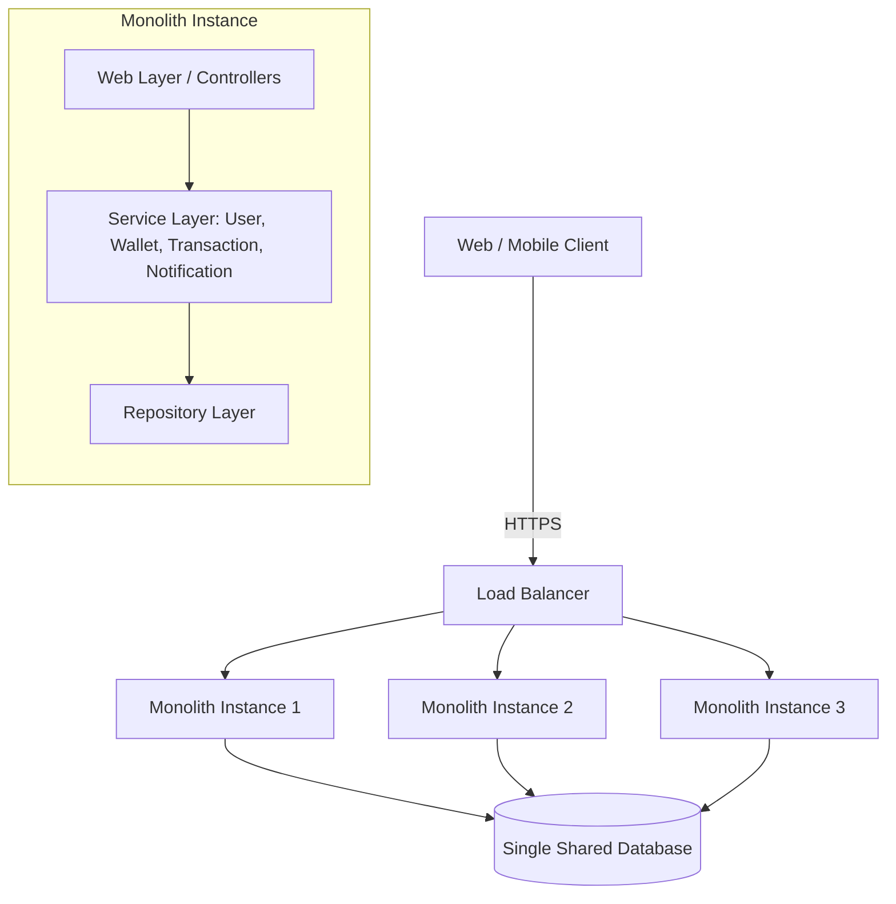
```mermaid
graph TD
    Client[Web / Mobile Client] -->|HTTPS| LB[Load Balancer]
    LB --> M1[Monolith Instance 1]
    LB --> M2[Monolith Instance 2]
    LB --> M3[Monolith Instance 3]

    subgraph Monolith Instance
      direction TB
      WEB[Web Layer / Controllers]
      SVC[Service Layer: User, Wallet, Transaction, Notification]
      REPO[Repository Layer]
      WEB --> SVC --> REPO
    end

    M1 --> DB[(Single Shared Database)]
    M2 --> DB
    M3 --> DB
```

Reading this diagram line by line:

- **`Client --> LB`**: all traffic enters through one load balancer. Clients have a single address to talk to — they don't know or care how many copies of the app exist.
- **`LB --> M1, M2, M3`**: the load balancer spreads requests across three *identical* copies of the whole application. This is how a monolith scales: clone the entire thing.
- **The `subgraph`**: inside *every* instance, the same three layers exist, stacked. Web calls Service calls Repository. These arrows are **method calls within one JVM** — fast and reliable.
- **`M1, M2, M3 --> DB`**: every instance points at the *same* database. This is the key constraint. The application scales horizontally, but the **database is shared and becomes the eventual bottleneck and the coupling point.**

The picture in your head: *one box, cloned a few times, all boxes leaning on one database.*

### Step 7 — Spring Boot Implementation

A clean modular monolith keeps boundaries even though everything is one deployable. Here is the heart of it:

```java
// transfer/TransferService.java
@Service
public class TransferService {

    private final AccountRepository accounts;
    private final TransactionRepository transactions;
    private final NotificationService notifications; // another module, in-process

    public TransferService(AccountRepository accounts,
                           TransactionRepository transactions,
                           NotificationService notifications) {
        this.accounts = accounts;
        this.transactions = transactions;
        this.notifications = notifications;
    }

    // ONE transaction spans every table. This is the monolith superpower.
    @Transactional
    public TransferResult transfer(Long fromId, Long toId, BigDecimal amount) {
        Account from = accounts.findByIdForUpdate(fromId)   // pessimistic lock
                .orElseThrow(() -> new AccountNotFound(fromId));
        Account to = accounts.findByIdForUpdate(toId)
                .orElseThrow(() -> new AccountNotFound(toId));

        if (from.getBalance().compareTo(amount) < 0) {
            throw new InsufficientFunds(fromId);   // rolls back automatically
        }

        from.debit(amount);     // both updated within the same DB transaction
        to.credit(amount);

        Transaction tx = transactions.save(
                Transaction.completed(fromId, toId, amount));

        notifications.notifyTransfer(tx);  // in-process call, same transaction
        return TransferResult.of(tx);
    }
}
```

The line that matters most is `@Transactional`. Everything inside — two account updates, one transaction insert, and even the notification record — either all commits or all rolls back. If `InsufficientFunds` is thrown after debiting, Spring rolls the whole thing back. **In microservices, this single guarantee evaporates, and Parts 10 and 11 spend thousands of words rebuilding it.**

A minimal monolith bootstrap:

```java
@SpringBootApplication
public class WalletApplication {
    public static void main(String[] args) {
        SpringApplication.run(WalletApplication.class, args);
    }
}
```

```yaml
# application.yml — one app, one database
spring:
  datasource:
    url: jdbc:postgresql://db:5432/wallet
    username: wallet
    password: ${DB_PASSWORD}
  jpa:
    hibernate:
      ddl-auto: validate
server:
  port: 8080
```

One application class, one datasource, one port. That simplicity is the whole point.

### Step 8 — Common Mistakes

- **The Big Ball of Mud.** The real failure of monoliths is not the architecture — it's letting modules bleed into each other until `user` code directly reads `wallet` tables and nothing has a boundary. The discipline of a *modular monolith* (clear packages, no cross-module table access, communicate through service interfaces) is what keeps a monolith healthy and, later, splittable.
- **Sharing entities everywhere.** When the same JPA `@Entity` is used by five modules, you can't change it without touching all five. Keep module-internal models.
- **Believing the monolith is "temporary."** Many extremely successful companies run monoliths at huge scale (Shopify, Stack Overflow historically). A well-structured monolith is a permanent valid choice, not a phase.
- **One enormous transaction across unrelated concerns** — e.g., wrapping a slow external email call inside the DB transaction, holding locks while waiting on the network.

### Step 9 — Debugging Perspective

Debugging a monolith is comparatively heavenly and you will miss it later:

- **One log file / one log stream.** A single request produces one continuous stack trace. No correlation IDs needed across services.
- **One stack trace tells the whole story.** A `NullPointerException` shows the exact path from controller to repository.
- **One profiler, one heap dump.** Performance problems are found with a normal JVM profiler.
- **Reproducible locally.** You run the entire system on your laptop with one `main()`.

The contrast with microservices debugging (Part 19) is stark, and it is one of the *real costs* you must weigh.

### Step 10 — Summary

- **What you learned:** A monolith is one deployable program with one database, where modules talk via in-process calls and cross-module operations are trivially ACID.
- **Why it matters:** It is the simplest, fastest, cheapest way to build and operate software, and it is the correct default for small teams and new products.
- **When to use it:** Small-to-medium teams, early products, domains you don't yet understand well, and any time operational simplicity outweighs independent scaling.
- **When not to use it:** When many teams need to deploy independently without blocking each other, when different parts have wildly different scaling needs, or when the codebase has grown so large that builds, tests, and coordination have become the bottleneck. That is the doorway to microservices — which we open next.

---

## Chapter 1.2 — Microservice Architecture

### Step 1 — Problem Statement

Fast-forward our fintech three years. It worked. Now there are 150 engineers across 18 teams and 4 million users. The monolith that was a superpower is now a tar pit, and the pain is *organizational* before it is technical:

- **Deployment contention.** Eighteen teams share one deployable. To release, everyone's changes go out together. One team's bug blocks everyone's release. The release train runs once a week, terrified, with a 40-person change log.
- **Build and test times.** The test suite takes 90 minutes. A one-line change costs an engineer two hours of waiting.
- **Coupling at scale.** The fraud team needs heavy CPU and GPU for ML scoring. The notifications team needs lots of memory for batching. But they share one JVM, so you must size every instance for the worst case and clone the whole thing.
- **Blast radius.** A memory leak in the rarely-used "monthly statements" feature crashes the whole process — including payments. One module's failure is everyone's outage.
- **Technology lock-in.** The fraud team would kill for a Python ML stack, but they're trapped in the monolith's JVM.

The core problem microservices solve is therefore **not** "performance" (a monolith can be very fast). It is **independence**: letting many teams build, deploy, scale, and fail *independently* so the organization can move fast even though it has become large. Microservices are, fundamentally, a solution to a **people-and-coordination problem** that happens to be expressed in software.

### Step 2 — Intuition

Instead of one big program, you build **many small programs**, each owning one business capability (payments, users, fraud, notifications), each with **its own database**, each deployable on its own schedule, each scalable on its own, each runnable in its own technology. They cooperate by **sending messages over the network** — synchronous calls (REST/gRPC) or asynchronous events (Kafka).

The intuition shift is profound: you trade the *safety and simplicity of in-process calls* for the *independence of separate programs*. You are deliberately reintroducing the network — with all its fallacies — between your modules, because the price of that network is worth paying to unblock your teams.

### Step 3 — Real-World Analogy

Go back to the restaurant. The monolith was one chef. Microservices are a **professional kitchen brigade with specialised stations**: a grill station, a sauce station, a pastry station, a garde-manger. Each station has its own chef, its own equipment, its own ingredients (its own database). The pastry chef can be replaced, trained, or doubled without touching the grill. When dessert orders spike, you add a second pastry chef *only* — you don't clone the whole kitchen.

But notice what the brigade *needs* that the lone chef didn't: **communication and coordination.** Orders must be called out ("two steaks, one well done!"), tickets must be tracked, and the *pass* (where dishes are assembled) becomes a critical coordination point. If the grill chef and sauce chef don't communicate, the steak arrives without its sauce. That coordination overhead — tickets, the pass, the expediter shouting — is precisely the API gateways, service discovery, event buses, and sagas of microservices. The brigade is more powerful *and* more complex. That trade is the whole game.

### Step 4 — Internal Mechanics

A microservice has these defining properties:

- **Single responsibility / business capability.** It owns one cohesive slice of the business (e.g., everything about payments).
- **Owns its data.** Each service has a **private database** that no other service may touch directly. This is the most violated and most important rule. If two services share a database table, they are not independent — they are a distributed monolith with extra latency.
- **Independently deployable.** You can release the payment service without coordinating with the user service team.
- **Independently scalable.** Run 30 copies of the payment service and 2 copies of the statements service.
- **Communicates only over the network**, through well-defined APIs and events — never by reaching into another service's database or memory.
- **Owned by one team** ("you build it, you run it").

Communication splits into two styles, each with deep consequences:

- **Synchronous (request/response):** Service A calls Service B and waits. Simple to reason about, but it creates **temporal coupling** — if B is down or slow, A is down or slow. Failure propagates. This is why we need timeouts and circuit breakers (Part 6).
- **Asynchronous (events/messaging):** Service A publishes an event and moves on; B consumes it later. This **decouples** services in time — A doesn't care if B is momentarily down. The price is **eventual consistency** and the complexity of message delivery guarantees (Parts 5, 10, 11).

Failure handling becomes a first-class design concern: each service must assume its dependencies will fail and degrade gracefully. Scaling becomes per-service and elastic.

### Step 5 — Step-by-Step Flow

The same "send money," now distributed across services:

1. Client sends `POST /transfers` to the **API Gateway**.
2. Gateway authenticates the token, rate-limits, and routes to the **Payment Service**.
3. Payment Service validates and needs the recipient's account status, so it calls the **Account Service** over REST (a network hop — could fail, could be slow → timeout + circuit breaker).
4. Payment Service writes the debit to **its own database** in a local transaction.
5. Because it cannot also write to the recipient's service database in the same transaction, it **publishes a `MoneyTransferred` event** to Kafka (reliably, via the Outbox pattern — Part 10).
6. The **Ledger Service** consumes the event and updates the recipient's balance (eventual consistency).
7. The **Notification Service** independently consumes the same event and sends a push notification.
8. A distributed trace (Part 14) stitches all these hops together under one trace ID so you can see the whole journey.

Compare to the monolith's seven cosy in-process steps. The logic is "the same," but now every arrow is a network hop that can fail, and the all-or-nothing transaction is gone — replaced by events, eventual consistency, and compensation logic. **This entire guide is the toolkit for making that distributed flow as correct and observable as the monolith's was for free.**

### Step 6 — Architecture Diagram

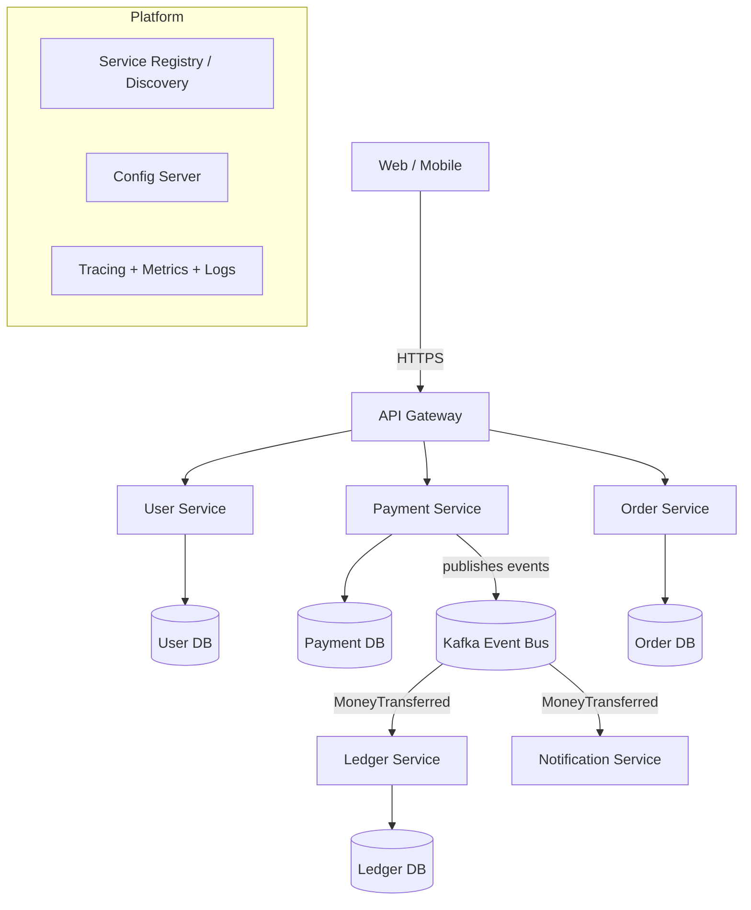
```mermaid
graph TD
    Client[Web / Mobile] -->|HTTPS| GW[API Gateway]
    GW --> US[User Service]
    GW --> PS[Payment Service]
    GW --> OS[Order Service]

    US --> USDB[(User DB)]
    PS --> PSDB[(Payment DB)]
    OS --> OSDB[(Order DB)]

    PS -->|publishes events| K[(Kafka Event Bus)]
    K -->|MoneyTransferred| LS[Ledger Service]
    K -->|MoneyTransferred| NS[Notification Service]
    LS --> LSDB[(Ledger DB)]

    subgraph Platform
      REG[Service Registry / Discovery]
      CFG[Config Server]
      OBS[Tracing + Metrics + Logs]
    end
```

Line-by-line:

- **`Client --> GW`**: clients talk to a single entry point, the API Gateway — they never see the dozens of services behind it (Part 2).
- **`GW --> US / PS / OS`**: the gateway routes each request to the right service. Each arrow is a **network call**.
- **`US --> USDB`, `PS --> PSDB`, `OS --> OSDB`**: the non-negotiable rule made visual — **every service has its own private database.** No arrow crosses from one service to another's database.
- **`PS --> K`**: instead of directly writing to other services, Payment publishes events to Kafka.
- **`K --> LS`, `K --> NS`**: multiple services consume the same event independently. Payment doesn't know or care who is listening — this is **decoupling**.
- **The `Platform` subgraph**: the supporting cast that a monolith never needed — a registry so services can find each other (Part 9), a config server (Part 8), and observability tooling (Part 14). **This subgraph is the "cost" in the opening sentence made concrete.**

The picture in your head: *many small boxes, each hugging its own database, connected by a web of fragile network arrows, with a gateway in front and a platform of supporting infrastructure underneath.*

### Step 7 — Spring Boot Implementation

The same transfer logic, now in the Payment Service, must give up the cross-service transaction:

```java
@Service
public class PaymentService {

    private final AccountRepository accounts;      // PAYMENT's own DB only
    private final OutboxRepository outbox;          // see Part 10
    private final AccountClient accountClient;      // REST call to Account Service

    @Transactional
    public TransferResult transfer(Long fromId, Long toId, BigDecimal amount) {
        // Synchronous call to another service — can fail/timeout (Part 6)
        AccountStatus recipient = accountClient.getStatus(toId);
        if (!recipient.isActive()) throw new RecipientInactive(toId);

        Account from = accounts.findByIdForUpdate(fromId).orElseThrow();
        if (from.getBalance().compareTo(amount) < 0) throw new InsufficientFunds(fromId);
        from.debit(amount);                          // only OUR database

        // We CANNOT update the recipient's DB here. Instead, atomically with the
        // debit, write an event to the outbox in the SAME local transaction.
        outbox.save(OutboxEvent.of("MoneyTransferred",
                new MoneyTransferred(fromId, toId, amount)));

        return TransferResult.pending();   // note: PENDING, not COMPLETED
    }
}
```

Two lines carry the whole lesson. First, `accountClient.getStatus(toId)` is a network call — it needs a timeout and a circuit breaker, and it can fail in ways a method call never could. Second, the result is `pending()`, not `completed()` — because the recipient's balance updates *eventually*, after the Ledger Service consumes the event. The comfortable certainty of the monolith is gone by design.

A Feign client makes the synchronous call ergonomic:

```java
@FeignClient(name = "account-service")   // resolved via service discovery (Part 9)
public interface AccountClient {
    @GetMapping("/accounts/{id}/status")
    AccountStatus getStatus(@PathVariable Long id);
}
```

```yaml
# Payment service has its OWN database — note the different DB name
spring:
  application:
    name: payment-service
  datasource:
    url: jdbc:postgresql://payment-db:5432/payment
```

### Step 8 — Common Mistakes

- **The Distributed Monolith** — the cardinal sin. Services that must be deployed together, share a database, or call each other synchronously in long chains. You get every cost of microservices and none of the independence. *If you can't deploy a service without deploying another, it isn't a microservice.*
- **Too fine-grained ("nano-services").** A service per entity (`AddressService`, `PhoneNumberService`) creates a chatty mess where one user request fans out into 40 network calls. Size services around *business capabilities*, not tables.
- **Shared database.** The fastest way to ruin a microservice architecture. Each service owns its data, full stop.
- **Synchronous call chains.** A → B → C → D synchronously means the availability of the chain is the *product* of each service's availability (99.9%⁴ ≈ 99.6%) and the latency is the *sum*. Prefer async events where you can.
- **Distributed transactions / 2PC.** Reaching for XA transactions to recreate monolith atomicity. Use sagas instead (Part 11).
- **Starting with microservices.** Building 15 services for a product with 0 users and 3 engineers. Start with a modular monolith; extract services when *pain* (not fashion) demands it.

### Step 9 — Debugging Perspective

This is where the bill comes due. A single user action now spans many services, so:

- **No single log file.** You need **centralized log aggregation** (Part 14, ELK) and a **correlation/trace ID** propagated across every hop, or you are blind.
- **No single stack trace.** A failure in service D surfaces as a vague `500` or timeout in service A. You need **distributed tracing** (Part 14, OpenTelemetry) to see the chain.
- **Partial failures are the norm.** "Payments work but notifications are delayed" is a state that simply cannot exist in a monolith. You debug *probabilistically* across services.
- **You can't run it all on your laptop** easily. You rely on observability in shared environments.

Remember the monolith's "debugging heaven" from the last chapter? Microservices trade it for "debugging detective work." Budget for the tooling *up front*, not after the first outage.

### Step 10 — Summary

- **What you learned:** Microservices are many small, independently deployable, independently scalable programs, each owning its own data, cooperating over an unreliable network via REST and events.
- **Why it matters:** They solve an *organizational* scaling problem — letting many teams move independently — at the cost of distributed-systems complexity.
- **When to use it:** Large organizations with many teams that need independent deployment; components with very different scaling/technology needs; domains you understand well enough to draw boundaries.
- **When NOT to use it:** Small teams, early products, unclear domains, or any time you can't yet afford the observability, automation, and on-call maturity microservices demand. The honest senior answer to "should we use microservices?" is almost always "not yet, and maybe never — let's start with a modular monolith and extract when the pain is real."

**The mental model to carry into the rest of the guide:** every remaining pattern is a tool to recover something the monolith gave you for free (atomic transactions, one log, reliable calls, easy queries) now that you've chosen to pay the price of independence.

---

# Part 2 — External API Patterns

## Chapter 2.1 — The API Gateway Pattern

### Step 1 — Problem Statement

You now have 25 services behind the scenes: users, accounts, payments, cards, statements, fraud, notifications, and so on. A mobile app needs to talk to your system. How does it do it?

The naive answer — "let the app call each service directly" — collapses immediately under real-world weight:

- **Discovery and addressing.** The app would need to know the network address of all 25 services. But services scale up and down and change IPs constantly (fallacy #5). The app cannot track that.
- **Authentication duplication.** Every one of the 25 services would have to independently validate tokens, check API keys, and enforce throttling. That is 25 copies of security logic — 25 chances to get it wrong, and 25 teams that must agree on auth.
- **Chattiness over slow mobile networks.** To render one screen, the app might need data from 6 services. Over a 4G connection with 150 ms latency, six sequential round trips is nearly a second of waiting before anything renders.
- **Cross-cutting concerns scattered everywhere.** Rate limiting, logging, TLS termination, CORS, request/response shaping — implemented 25 times.
- **Coupling the client to internal structure.** If you split the Payment Service into two, every client breaks, because clients knew the internal topology.

This is a real, painful problem at banks and telecoms especially, where there are dozens of legacy and modern backends and strict security requirements. Simple approaches (direct client-to-service) fail because they leak internal complexity and security responsibility out to every client.

### Step 2 — Intuition

Put **one front door** in front of all your services. Every external request goes through that door. The door handles all the boring, dangerous, repetitive work *once* — checking identity, rate limiting, logging, routing — and then forwards the request to the right internal service. Clients only ever know about the front door; the messy interior is hidden.

The intuition: **centralize cross-cutting concerns at the edge so services can focus on business logic, and hide internal structure so it can change freely.**

### Step 3 — Real-World Analogy

The API Gateway is the **reception desk and security checkpoint of a large corporate building.** Visitors don't wander the building looking for the right office. They go to one reception. Reception checks their ID (authentication), confirms they're allowed in today (authorization), gives them a visitor badge, logs their entry, tells them which floor to go to (routing), and stops people who show up 500 times an hour (rate limiting). The departments inside don't each need their own security guard — security is handled once, at the entrance. And if a department moves floors, reception just updates its directory; visitors never notice.

A second analogy bankers love: the gateway is the **branch teller window.** You don't go into the vault, the loan back-office, and the compliance department yourself. You go to one window, and the teller routes your request to the right department behind the scenes.

### Step 4 — Internal Mechanics

An API Gateway sits at the edge and performs, per request, a pipeline of responsibilities:

- **Routing:** match the incoming path/host/header to a target service (e.g., `/payments/**` → `payment-service`). It resolves the actual instance via **service discovery** (Part 9) and **load balances** across instances.
- **Authentication:** validate the JWT / OAuth2 token *once* at the edge (Part 7), reject anonymous traffic early.
- **Authorization:** coarse-grained checks (is this token allowed to hit this route at all?).
- **Rate limiting & throttling:** protect backends from abuse and traffic spikes; per-user or per-IP quotas.
- **Request/response transformation:** strip internal headers, add correlation IDs, rewrite paths, aggregate or reshape responses.
- **TLS termination:** decrypt HTTPS at the edge.
- **Observability:** emit metrics, logs, and start a distributed trace for every request.
- **Resilience:** apply timeouts, retries, and circuit breakers to protect itself from slow backends.

The critical design caveat: **the gateway must stay thin.** Its job is *cross-cutting concerns and routing*, not business logic. The classic failure is the gateway slowly absorbing domain rules until it becomes a new monolith and a deployment bottleneck — a "god gateway." Keep business logic in services.

For failure handling: the gateway itself must be highly available (run multiple instances behind a load balancer) because it is a single point of *failure* if mismanaged. It must apply circuit breakers so one dead backend doesn't exhaust its threads.

### Step 5 — Step-by-Step Flow

1. Mobile app sends `GET /api/accounts/123/summary` with a bearer token to `gateway.bank.com`.
2. Gateway terminates TLS.
3. Gateway runs the **auth filter**: validates the JWT signature and expiry. Invalid → `401`, never touches a backend.
4. Gateway runs the **rate-limit filter**: is this user under their quota? Over → `429`.
5. Gateway adds an `X-Correlation-Id` header and starts a trace span.
6. Gateway matches the route `/api/accounts/**` → `account-service`, asks discovery for a healthy instance, and load-balances.
7. Gateway forwards the request (with a timeout + circuit breaker around it).
8. Account Service responds; gateway records latency/metrics and returns the response to the app, stripping internal headers.
9. If the backend is down/slow, the circuit breaker returns a fast, controlled fallback instead of hanging the client.

### Step 6 — Architecture Diagram

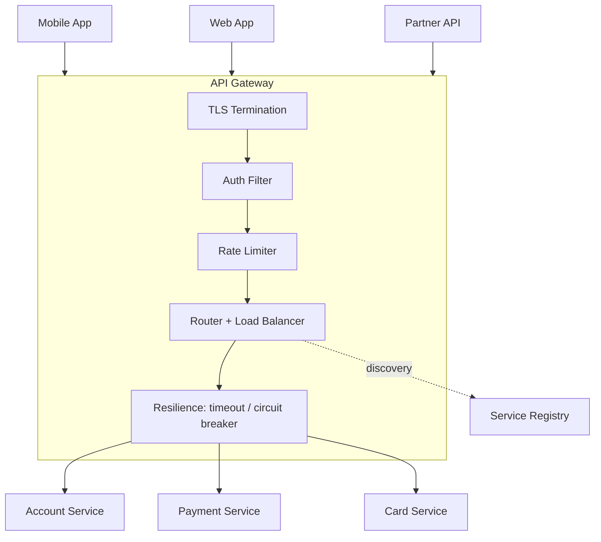
```mermaid
graph TD
    Mobile[Mobile App] --> GW
    Web[Web App] --> GW
    Partner[Partner API] --> GW

    subgraph GW[API Gateway]
      direction TB
      TLS[TLS Termination] --> AUTH[Auth Filter]
      AUTH --> RL[Rate Limiter]
      RL --> ROUTE[Router + Load Balancer]
      ROUTE --> RES[Resilience: timeout / circuit breaker]
    end

    RES --> ACC[Account Service]
    RES --> PAY[Payment Service]
    RES --> CARD[Card Service]

    ROUTE -.discovery.-> REG[Service Registry]
```

Line-by-line:

- **`Mobile/Web/Partner --> GW`**: three different client types, one entry point. They share the same front door.
- **The `GW` subgraph as a vertical pipeline**: each request flows down through filters in order — TLS, then auth, then rate limiting, then routing, then resilience. **Order matters**: you authenticate *before* you do expensive routing, and you reject bad traffic as early and cheaply as possible.
- **`RES --> ACC/PAY/CARD`**: only requests that survive the whole pipeline reach a backend service.
- **`ROUTE -.discovery.-> REG`** (dotted): the router doesn't hardcode addresses; it asks the service registry where healthy instances live (Part 9).

The picture: *a funnel with security and routing filters stacked inside it, feeding a fan-out to internal services.*

### Step 7 — Spring Boot Implementation

**Spring Cloud Gateway** is the modern, reactive choice (built on Spring WebFlux/Netty, non-blocking — important because a gateway handles huge concurrency).

```yaml
# gateway application.yml
spring:
  application:
    name: api-gateway
  cloud:
    gateway:
      routes:
        - id: account-route
          uri: lb://account-service          # lb:// => load-balance via discovery
          predicates:
            - Path=/api/accounts/**           # match these requests
          filters:
            - StripPrefix=1                    # drop /api before forwarding
            - name: CircuitBreaker             # resilience around the backend
              args:
                name: accountCB
                fallbackUri: forward:/fallback/accounts
            - name: RequestRateLimiter         # throttle abusive callers
              args:
                redis-rate-limiter.replenishRate: 100
                redis-rate-limiter.burstCapacity: 200
        - id: payment-route
          uri: lb://payment-service
          predicates:
            - Path=/api/payments/**
```

Key lines explained:

- `uri: lb://account-service` — the `lb://` scheme tells the gateway to resolve `account-service` through the service registry and load-balance, instead of a fixed URL. This is what lets backends scale and move freely.
- `Path=/api/accounts/**` — the predicate that decides which requests this route handles.
- `StripPrefix=1` — removes the `/api` segment so the backend sees `/accounts/123/summary`.
- The `CircuitBreaker` filter — if the account service is failing, the gateway stops hammering it and returns the fallback (Part 6).
- `RequestRateLimiter` — backed by Redis, enforces per-key quotas.

A global authentication filter, applied to every route:

```java
@Component
public class AuthFilter implements GlobalFilter, Ordered {

    private final JwtValidator jwt;
    public AuthFilter(JwtValidator jwt) { this.jwt = jwt; }

    @Override
    public Mono<Void> filter(ServerWebExchange exchange, GatewayFilterChain chain) {
        String token = bearer(exchange.getRequest());
        if (token == null || !jwt.isValid(token)) {
            exchange.getResponse().setStatusCode(HttpStatus.UNAUTHORIZED);
            return exchange.getResponse().setComplete();  // reject at the edge
        }
        // Propagate identity + correlation id downstream so services don't re-auth fully
        ServerHttpRequest mutated = exchange.getRequest().mutate()
                .header("X-User-Id", jwt.subject(token))
                .header("X-Correlation-Id", correlationId(exchange))
                .build();
        return chain.filter(exchange.mutate().request(mutated).build());
    }

    @Override public int getOrder() { return -100; } // run early, before routing
}
```

The important idea: the gateway validates the token *once* and forwards a trusted identity header inward, so internal services can do lighter-weight checks. `getOrder()` returning a low number ensures auth runs before expensive work.

### Step 8 — Common Mistakes

- **Putting business logic in the gateway.** It becomes a shared monolith and a deployment bottleneck every team must coordinate around.
- **Making it a single point of failure.** Run multiple gateway instances behind an L4 load balancer. If the gateway dies, *everything* is down.
- **Blocking I/O on a reactive gateway.** Calling a blocking JDBC driver inside a WebFlux filter starves the event loop. Keep gateway filters non-blocking.
- **No timeouts/circuit breakers on routes.** One slow backend exhausts the gateway's connections and takes down access to *all* services.
- **Over-aggregating.** Doing heavy response composition in the gateway for many clients — that's a job for BFFs (next chapter), not the shared gateway.

### Step 9 — Debugging Perspective

- **First place to look in almost any incident.** Gateway access logs and metrics show per-route latency, status codes, and throughput — the single best top-down view of system health.
- **A spike in `5xx` on one route** instantly localizes the problem to one backend.
- **A spike in `429`** means rate limits are firing — legitimate traffic surge or abuse.
- **A spike in `401/403`** points to auth/token issues (expired signing keys, clock skew).
- The gateway **starts the trace ID**; every downstream log carries it, so you can follow one request across all services (Part 19).
- Circuit-breaker state metrics (open/closed) at the gateway tell you which backend is unhealthy before users complain.

### Step 10 — Summary

- **What you learned:** An API Gateway is a single, thin entry point that centralizes routing, authentication, rate limiting, observability, and resilience, hiding internal service structure from clients.
- **Why it matters:** It removes duplicated cross-cutting logic from every service, secures the edge, and decouples clients from internal topology.
- **When to use it:** Essentially always, once you have more than a couple of services exposed to external clients.
- **When not to use it / cautions:** Don't let it grow business logic; don't make it a single point of failure; don't over-aggregate (use BFFs for that). A gateway should make your services *simpler*, not become a monolith of its own.

---

## Chapter 2.2 — Backend For Frontend (BFF)

### Step 1 — Problem Statement

You have one API behind your gateway. Two very different clients consume it: a **mobile app** and a **desktop web app**. They have genuinely different needs:

- The **mobile app** is on a slow, high-latency network with a small screen and a battery to protect. It wants *few, small, pre-aggregated* responses — exactly the data for the current screen, nothing more.
- The **web app** has a fast connection and a big screen showing rich dashboards. It wants *large, detailed* responses with lots of related data.

If you serve both from one generic API, you are stuck:

- A **generic API** that returns everything is too heavy for mobile (wastes bandwidth and battery).
- A **generic API** trimmed for mobile is too thin for web (forces the web app to make many extra calls).
- Worse, **the team owning each frontend can't move independently.** Every time the mobile app needs a new field shaped a particular way, it must beg a shared backend team to change a shared API, which risks breaking the web app. Coordination hell returns — the very thing microservices were supposed to kill.

### Step 2 — Intuition

Give **each frontend its own dedicated backend** — an API tailored exactly to that client's needs, owned by the same team that owns the frontend. The mobile team owns the Mobile BFF; the web team owns the Web BFF. Each BFF talks to the downstream microservices and shapes the data perfectly for *its* client.

The intuition: **one size does not fit all clients; let each client have a backend that speaks its language**, and let the team that feels the client's pain also own the backend that serves it.

### Step 3 — Real-World Analogy

Think of a **multilingual concierge service at an international hotel.** The hotel has the same underlying services — restaurant, spa, transport, housekeeping. But a Japanese guest, a German guest, and a Brazilian guest each get a concierge who speaks their language, understands their expectations, and presents options in the format they prefer. Behind the concierges, it's the same hotel. The concierges don't change the hotel; they *translate and curate* it for each kind of guest. A BFF is a per-client concierge in front of your shared microservices.

### Step 4 — Internal Mechanics

- Each BFF is a **thin service** (often itself behind the API gateway, or the gateway routes by client type) responsible for **aggregation, orchestration, and shaping** for one client type.
- It calls multiple downstream microservices, **composes** their responses (see API Composition, Part 13), and returns a payload tailored to its client.
- It contains **client-specific logic only** — pagination sizes, field selection, response format, client-specific caching — *not* core business rules (those stay in the microservices).
- **Ownership** is the heart of the pattern: the frontend team owns its BFF, enabling independent evolution.

Trade-offs to weigh honestly:

- **Pro:** optimal payloads per client; independent team velocity; client complexity moves server-side where it's easier to manage; reduced chattiness over the client network.
- **Con:** **code duplication** across BFFs (mobile and web BFFs may aggregate similar things); more services to deploy and operate; risk of business logic leaking into BFFs. Mitigate duplication by extracting shared aggregation into libraries or a shared internal service — but never at the cost of recoupling the teams.

### Step 5 — Step-by-Step Flow

Mobile "home screen" needs: user name, account balance, last 3 transactions, 1 promo.

1. Mobile app makes **one** call: `GET /mobile/home`.
2. Mobile BFF receives it, extracts the user from the token.
3. In parallel, the BFF calls: User Service (name), Account Service (balance), Transaction Service (last 3), Promo Service (1 promo).
4. The BFF waits for all four (with timeouts), then **composes** a single compact JSON shaped exactly for the mobile home screen.
5. It returns one small payload. The mobile app did one round trip instead of four.

The web BFF, for the same conceptual screen, might fetch 50 transactions, full account details, and three widgets — because the web client wants richness.

### Step 6 — Architecture Diagram

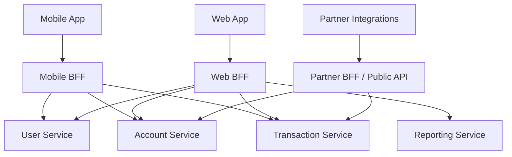
```mermaid
graph TD
    M[Mobile App] --> MB[Mobile BFF]
    W[Web App] --> WB[Web BFF]
    P[Partner Integrations] --> PB[Partner BFF / Public API]

    MB --> US[User Service]
    MB --> AS[Account Service]
    MB --> TS[Transaction Service]

    WB --> US
    WB --> AS
    WB --> TS
    WB --> RS[Reporting Service]

    PB --> AS
    PB --> TS
```

Line-by-line:

- **`M --> MB`, `W --> WB`, `P --> PB`**: three client types, three dedicated backends. Each client talks only to *its* BFF.
- **`MB --> US/AS/TS`**: the Mobile BFF aggregates from several shared services and returns a slim payload.
- **`WB --> US/AS/TS/RS`**: the Web BFF hits the *same* core services *plus* a reporting service, and shapes a richer payload. Note the overlap (`US`, `AS`, `TS`) — that overlap is the duplication trade-off made visible.
- **`PB --> AS/TS`**: partners get a stable, security-hardened public API surface, separate from your internal clients.

The picture: *the same fan of core services, fronted by several specialized adapters, one per audience.*

### Step 7 — Spring Boot Implementation

A Mobile BFF endpoint that aggregates in parallel:

```java
@RestController
@RequestMapping("/mobile")
public class MobileHomeController {

    private final UserClient users;
    private final AccountClient accounts;
    private final TransactionClient txns;
    private final PromoClient promos;

    @GetMapping("/home")
    public MobileHome home(@RequestHeader("X-User-Id") String userId) {
        // Fire all calls in parallel; mobile latency budget is tight.
        CompletableFuture<UserDto> u   = supplyAsync(() -> users.get(userId));
        CompletableFuture<AccountDto> a = supplyAsync(() -> accounts.summary(userId));
        CompletableFuture<List<TxDto>> t = supplyAsync(() -> txns.last(userId, 3));
        CompletableFuture<PromoDto> p   = supplyAsync(() -> promos.featured(userId));

        CompletableFuture.allOf(u, a, t, p).join();   // wait for all (with timeouts on clients)

        // Shape EXACTLY what the mobile home screen needs — nothing more.
        return new MobileHome(
            u.join().getDisplayName(),
            a.join().getBalance(),
            t.join().stream().map(TxDto::toCompact).toList(),
            p.join().getBanner()
        );
    }
}
```

The key idea: the BFF does **parallel aggregation** (so total latency ≈ the slowest single call, not the sum) and returns a **client-specific shape** (`MobileHome`). The web BFF would have a different controller returning a richer `WebDashboard`. Business rules (what a "balance" *means*) stay in the services.

### Step 8 — Common Mistakes

- **Putting business logic in the BFF.** BFFs aggregate and shape; they must not own domain rules. If both BFFs need the same rule, it belongs in a service.
- **One BFF for all clients.** That's just a generic API again — you've lost the whole point.
- **Sequential (not parallel) aggregation.** Calling four services one after another multiplies latency. Aggregate in parallel.
- **Uncontrolled duplication.** Some duplication is acceptable; *unbounded* copy-paste across BFFs is a maintenance trap. Extract shared client/aggregation code into libraries.
- **BFF per screen instead of per client.** You'll end up with hundreds of micro-BFFs. The boundary is the *client/experience*, not the screen.

### Step 9 — Debugging Perspective

- BFFs are **excellent aggregation points for tracing**: one client request fans out to N service calls, all under one trace ID — you can immediately see which downstream call is slow.
- Per-BFF latency metrics reveal whether the problem is the BFF's own aggregation or a slow downstream service.
- Because each BFF is owned by one team, **on-call ownership is clear** — the mobile team debugs the mobile BFF.
- Watch for the "**slowest dependency dominates**" pattern: a BFF's p99 latency is usually the p99 of its slowest downstream call.

### Step 10 — Summary

- **What you learned:** A BFF is a dedicated backend per client type that aggregates and shapes data optimally for that client, owned by the client's team.
- **Why it matters:** It optimizes payloads per client, reduces client chattiness, and — most importantly — lets frontend teams evolve independently.
- **When to use it:** When you have multiple client types with materially different needs (mobile vs web vs partner) and you want each frontend team to move independently.
- **When not to use it:** A single client type, or when the extra services and duplication outweigh the benefit. Don't reach for BFFs prematurely — start with one API, split when client divergence and team friction justify it.

---

# Part 3 — Service Decomposition Patterns

The single hardest question in microservices is not "how do services communicate?" — it's **"where do we draw the lines?"** Get the boundaries wrong and no amount of Kafka, Kubernetes, or clever code will save you; you'll have a distributed monolith. This part teaches the two foundational decomposition strategies and the thinking behind them.

## Chapter 3.1 — Decompose by Business Capability

### Step 1 — Problem Statement

You've decided to split your monolith. The tempting but wrong instinct is to split by **technical layer** (a "controllers service," a "business logic service," a "data access service") or by **entity** (a service per database table). Both fail badly:

- **Technical-layer splitting** means a single feature change touches all three services and requires deploying all three together — maximum coupling, zero independence. It's a layered monolith stretched across a network.
- **Entity splitting** creates nano-services and brutal chattiness: serving one "place order" request requires the Order service to call the OrderLine service to call the Product service to call the Price service... dozens of network hops for one business action.

The real problem: **how do we cut the system so that each piece can change and deploy independently, and so that most business changes stay inside one piece?** A change should ideally touch *one* service, not ripple across five.

### Step 2 — Intuition

Organize services around **what the business does** — its capabilities — not around technical layers or tables. A business capability is something the company offers that produces value: "manage customer accounts," "process payments," "originate loans," "detect fraud." Each capability becomes a service that owns *everything* needed to deliver it: its API, its logic, and its data.

The intuition: **a service should map to a chunk of the business that one team can own end-to-end.** If marketing changes how promotions work, ideally only the Promotions service changes.

### Step 3 — Real-World Analogy

A well-run company is organized into **departments by function**: Sales, HR, Finance, Logistics. Each department owns its responsibilities end-to-end, has its own staff and its own filing cabinets (its own data), and exposes a clear "interface" to the rest of the company ("submit an expense to Finance," "raise a ticket to HR"). HR doesn't reach into Finance's filing cabinet; it *asks* Finance. You wouldn't organize a company into a "talking-to-people department," a "thinking department," and a "filing department" (technical layers) — that's absurd. You organize by *what the function delivers.* Services should mirror the same logic.

### Step 4 — Internal Mechanics

To decompose by business capability:

1. **Identify capabilities** by analyzing what the business *does*. For a bank: Customer Management, Account Management, Payments, Cards, Lending, Fraud Detection, Statements, Notifications.
2. **Assign each capability its own service**, owning its API and **its private database**.
3. **Map services to teams** — each team owns one or a few capabilities (Conway's Law, below).
4. **Define interactions** between capabilities as APIs (sync) and events (async).

Two laws govern good boundaries:

- **High cohesion:** things that change together live together. A capability bundles all the logic and data for one business function so changes are local.
- **Loose coupling:** services depend on each other minimally and only through stable contracts (APIs/events), never shared databases.

**Conway's Law** is the deepest insight here: *"Organizations design systems that mirror their communication structure."* If you have a "frontend team," "backend team," and "DBA team," you'll naturally build a layered monolith. If you organize teams around business capabilities (cross-functional, owning UI-to-DB for one capability), you'll naturally build capability-aligned services. **The senior move is the *Inverse Conway Maneuver*: design your teams to match the architecture you want.**

### Step 5 — Step-by-Step Flow (decomposition process)

1. List everything the business does (capabilities).
2. Group closely related operations and data into candidate services.
3. For each candidate, ask: *Could one team own this end-to-end? Does it have a clear, stable API? Does it own its own data with minimal need to reach into others?*
4. Check chattiness: does a typical business transaction stay mostly within one service? If a single action requires synchronous calls across five services, your boundaries are wrong — re-group.
5. Identify the data each service owns and ensure no shared tables.
6. Define the events each capability emits (e.g., Payments emits `PaymentCompleted`).

### Step 6 — Architecture Diagram

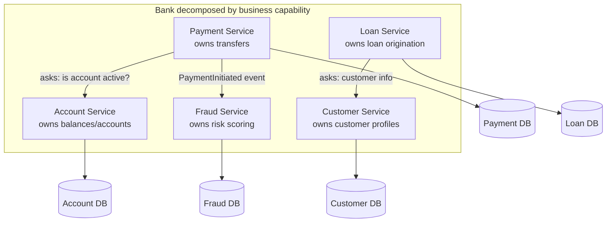
```mermaid
graph TD
    subgraph "Bank decomposed by business capability"
      CM[Customer Service<br/>owns customer profiles]
      AC[Account Service<br/>owns balances/accounts]
      PM[Payment Service<br/>owns transfers]
      LN[Loan Service<br/>owns loan origination]
      FR[Fraud Service<br/>owns risk scoring]
    end

    CM --> CMDB[(Customer DB)]
    AC --> ACDB[(Account DB)]
    PM --> PMDB[(Payment DB)]
    LN --> LNDB[(Loan DB)]
    FR --> FRDB[(Fraud DB)]

    PM -->|asks: is account active?| AC
    LN -->|asks: customer info| CM
    PM -->|PaymentInitiated event| FR
```

Line-by-line:

- Each node is a **capability** (Customer, Account, Payment, Loan, Fraud), not a layer or a table.
- Each capability **owns its own database** — five services, five databases, no sharing.
- **`PM --> AC`**: Payment *asks* Account whether an account is active — a synchronous query across a stable API, not a database join.
- **`PM --> FR` (event)**: Payment emits an event that Fraud consumes asynchronously — loose, time-decoupled coordination.
- Notice most arrows are *between* capabilities and few in number — that's a sign of good boundaries (loose coupling). If this diagram were a dense web of arrows, the boundaries would be wrong.

### Step 7 — Spring Boot Implementation

Capability boundaries show up as **separate Spring Boot applications**, each with its own `@SpringBootApplication`, its own datasource, and its own domain model. The Payment Service owns its `Account` *view* only for what it needs, and reaches the real Account capability via a client:

```java
// payment-service — its own bounded model, its own DB
@SpringBootApplication
public class PaymentServiceApplication { /* main */ }

@Service
public class PaymentService {
    private final AccountClient accountClient;   // talks to the Account CAPABILITY
    private final PaymentRepository payments;     // PAYMENT's own data

    public Payment initiate(TransferCmd cmd) {
        // Cross-capability question answered via API, never via shared DB
        if (!accountClient.isActive(cmd.toAccountId()))
            throw new InactiveAccount(cmd.toAccountId());
        return payments.save(Payment.initiated(cmd));
    }
}
```

The structural lesson is more about *repository and deployment topology* than code: each capability is its own deployable, its own database schema, its own team's repo. The code inside looks like ordinary Spring Boot — the discipline is in the boundaries.

### Step 8 — Common Mistakes

- **Decomposing by technical layer or entity** instead of capability — the two failures from Step 1.
- **Boundaries that don't match team structure** — if three teams must coordinate on every change to one service, the boundary is wrong (Conway's Law fighting you).
- **God services** — a "Core Service" that everything depends on becomes a bottleneck and a distributed monolith hub.
- **Boundaries that cause chatty synchronous chains** — a sign capabilities were split too finely or along the wrong seams.
- **Premature decomposition** — splitting before you understand the domain, then thrashing as boundaries shift (expensive to move data and APIs later).

### Step 9 — Debugging Perspective

- **Symptom of bad boundaries:** a single feature request keeps requiring changes to 3+ services and coordinated deploys. That's the loudest signal your decomposition is wrong.
- **Symptom of bad boundaries:** a trace for one business action shows a long synchronous chain across many services (chattiness) → boundaries too fine.
- **Dependency analysis** (which service calls which, how often) reveals hidden coupling; tools that build service dependency graphs from traces are invaluable.
- A capability with an extremely high fan-in (everyone depends on it) is a likely god service that will dominate incidents.

### Step 10 — Summary

- **What you learned:** Decompose services around business capabilities — end-to-end functions the business performs — each owned by one team with its own data.
- **Why it matters:** It maximizes cohesion and minimizes coupling, so most changes stay within one service and one team, delivering the independence microservices promise.
- **When to use it:** As your primary, default decomposition strategy.
- **When not to use it / cautions:** Don't decompose before you understand the domain; align teams to capabilities (Conway); avoid god services and over-fine boundaries.

---

## Chapter 3.2 — Decompose by Subdomain (Domain-Driven Design)

### Step 1 — Problem Statement

"Business capability" is a great heuristic, but it can be fuzzy. Two teams may argue endlessly about whether "pricing" belongs to Sales or Catalog, or whether the word "Customer" means the same thing in Marketing as it does in Support. Worse, a single word like **"Account"** might mean a *login account* to the identity team, a *bank account* to the ledger team, and a *customer relationship* to the sales team. If you build one shared "Account" model for all of them, you create a monstrous, over-coupled entity that no one can change — a model that tries to be everything to everyone and ends up serving no one.

The problem: **how do we find *principled*, rigorous boundaries, and how do we deal with the fact that the same word means different things in different parts of the business?**

### Step 2 — Intuition

**Domain-Driven Design (DDD)** gives us the tools. The core intuition: a large business domain naturally breaks into **subdomains** (areas of the business), and within each subdomain, words have **one precise, consistent meaning**. The boundary around "one consistent meaning of the language" is called a **bounded context**, and *that* is your service boundary.

Instead of fighting over one universal "Customer" model, you accept that **"Customer" can legitimately mean different things in different contexts**, and you give each context its own model. The Sales context has its rich `Customer` with leads and opportunities; the Support context has its `Customer` with tickets and SLAs; the Billing context has its `Customer` with payment methods and invoices. They refer to the same real person but model only what *they* care about.

### Step 3 — Real-World Analogy

Consider the word **"book"** in different parts of a publishing company. To the **editorial** department, a book is a manuscript with chapters, authors, and revisions. To the **warehouse**, a book is a physical object with weight, dimensions, and a shelf location. To **finance**, a book is a revenue line with a price, tax category, and royalty split. It's the *same* book, but each department has its own complete, self-consistent mental model — and forcing all three into one shared definition would be a disaster. Each department is a **bounded context**: inside it, "book" means exactly one thing.

### Step 4 — Internal Mechanics

DDD's key building blocks for decomposition:

- **Domain:** the entire problem space (e.g., "running a bank").
- **Subdomains**, classified by strategic importance:
  - **Core domain:** what makes the business *win* — your competitive advantage. (For a lender: the *risk/credit-scoring engine*.) Invest your best people here; build it in-house with rich models.
  - **Supporting subdomain:** necessary but not differentiating (e.g., document management). Build simply or with less investment.
  - **Generic subdomain:** solved problems everyone needs (auth, notifications, payments-processing). *Buy/use off-the-shelf* (Keycloak, Stripe) rather than build.
- **Bounded Context:** an explicit boundary within which a domain model and its **Ubiquitous Language** (the shared, precise vocabulary used by developers *and* domain experts alike) are consistent. **One bounded context ≈ one microservice** (a good rule of thumb).
- **Context Mapping:** how bounded contexts relate — e.g., *Customer/Supplier*, *Conformist*, *Anti-Corruption Layer* (Part 16), *Shared Kernel*. This defines how models translate at the boundaries.

The strategic payoff: classifying subdomains tells you **where to invest** (core) and **where to buy** (generic) — a senior architectural judgment that saves enormous effort.

### Step 5 — Step-by-Step Flow (DDD decomposition)

1. **Event Storming / domain analysis:** gather domain experts and engineers; map the business as a flow of domain events ("OrderPlaced," "PaymentReceived," "ItemShipped").
2. **Identify subdomains** from clusters of related events and language.
3. **Classify** each subdomain as core, supporting, or generic — decide build vs buy.
4. **Draw bounded contexts** around areas where the language is consistent. Where the meaning of a key term changes, you've found a context boundary.
5. **Define the Ubiquitous Language** within each context — and honor it in the code (class names, APIs).
6. **Create a context map** describing how contexts integrate and translate models at the seams.
7. **Map each bounded context to a microservice.**

### Step 6 — Architecture Diagram

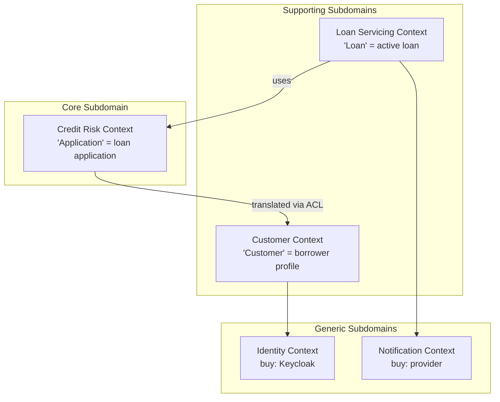
```mermaid
graph TD
    subgraph CORE[Core Subdomain]
      RISK[Credit Risk Context<br/>'Application' = loan application]
    end
    subgraph SUP[Supporting Subdomains]
      LOAN[Loan Servicing Context<br/>'Loan' = active loan]
      CUST[Customer Context<br/>'Customer' = borrower profile]
    end
    subgraph GEN[Generic Subdomains]
      AUTH[Identity Context<br/>buy: Keycloak]
      NOTIF[Notification Context<br/>buy: provider]
    end

    RISK -->|translated via ACL| CUST
    LOAN -->|uses| RISK
    LOAN --> NOTIF
    CUST --> AUTH
```

Line-by-line:

- **`CORE` subgraph:** the Credit Risk context is the *core domain* — the bank's competitive edge. Note its Ubiquitous Language: here, "Application" means a *loan application*.
- **`SUP` subgraph:** supporting contexts (Loan Servicing, Customer). In Loan Servicing, "Loan" means an *active, disbursed loan* — a different concept from "Application."
- **`GEN` subgraph:** generic contexts (Identity, Notification) — *bought*, not built (Keycloak, a notification provider).
- **`RISK -->|translated via ACL| CUST`**: contexts integrate through translation layers (Anti-Corruption Layer, Part 16) so one context's model doesn't leak into another's.
- The grouping by core/supporting/generic visually encodes the **investment strategy**: build the core richly, buy the generic.

### Step 7 — Spring Boot Implementation

DDD shows up in code as **rich domain models inside each bounded context**, using the context's language precisely. The same real-world person is modeled differently in different services:

```java
// customer-context (customer-service)
public class Customer {            // "Customer" = borrower profile here
    private CustomerId id;
    private FullName name;
    private CreditConsent consent;
    // behavior relevant to THIS context only
}

// risk-context (credit-risk-service)
public class LoanApplication {     // "Application" = loan application here
    private ApplicationId id;
    private CustomerRef applicant; // just a REFERENCE, not the whole Customer
    private Money requestedAmount;
    private RiskScore score;

    public Decision evaluate(RiskPolicy policy) {  // CORE business logic lives here
        return policy.assess(this);
    }
}
```

The crucial detail: the risk context does **not** import the customer context's `Customer` class. It keeps a lightweight `CustomerRef`. This prevents the two models from coupling — each context stays free to evolve its own model. Translation between them happens at the boundary (a client + a mapper, i.e., an ACL).

### Step 8 — Common Mistakes

- **One universal model for shared concepts** ("the God Customer") — the exact anti-pattern DDD prevents. Embrace multiple models for the same real-world thing.
- **Ignoring subdomain classification** — building your generic auth from scratch (wasting your best engineers) while under-investing in the core domain that actually differentiates you.
- **Anemic domain models** — services that are just CRUD over DTOs with all logic in "service" classes, missing the *rich behavior* DDD encourages (see Domain Model vs Transaction Script, Part 12).
- **Letting models leak across contexts** — no translation layer, so a change in one context's model breaks another.
- **Treating DDD as just folder structure** — DDD is about *language and boundaries with domain experts*, not package names.

### Step 9 — Debugging Perspective

- **Boundary confusion shows up as bugs** where the same term is handled inconsistently across services (e.g., "active customer" means different things) — a sign a bounded context was drawn wrong or a model leaked.
- When integration bugs cluster at the seam between two services, inspect the **translation layer** (ACL) — mistranslation is a common, subtle defect.
- Tracing a business process across contexts (using domain events as waypoints) helps verify the *domain flow* matches the business's mental model.

### Step 10 — Summary

- **What you learned:** Decompose by subdomain using DDD — find bounded contexts where the Ubiquitous Language is consistent, classify subdomains as core/supporting/generic to decide build-vs-buy, and map each bounded context to a service.
- **Why it matters:** It gives you *principled*, language-driven boundaries and resolves the "same word, different meaning" problem by allowing multiple models — preventing the God-entity coupling that kills microservice architectures.
- **When to use it:** For complex domains where boundaries are non-obvious and getting them right is critical (banking, healthcare, insurance). Pair it with business-capability thinking — they reinforce each other.
- **When not to use it / cautions:** For simple domains, full DDD ceremony may be overkill. But the core ideas (bounded contexts, ubiquitous language, build-vs-buy classification) are valuable almost everywhere.

**Mental model for all of Part 3:** *services are slices of the business where the language and ownership are consistent and a single team can deliver value end-to-end. Draw lines along business meaning, not technical layers — and design your teams to match the lines you draw.*

---

# Part 4 — Testing Patterns

In a monolith, testing is mostly self-contained: unit tests, a few integration tests against an in-memory DB, done. In microservices, the hardest bugs live **between** services — at the network boundary, in the contract. This part teaches how to test confidently in a distributed world without spinning up the entire system for every change.

A guiding model is the **test pyramid, adapted for microservices**: lots of fast unit tests at the bottom; a layer of integration/component tests in the middle; **contract tests** to verify service boundaries without full integration; and a thin layer of slow, brittle end-to-end tests at the top. The senior insight: **end-to-end tests across many services are expensive, slow, and flaky — minimize them and lean on contract tests instead.**

## Chapter 4.1 — Consumer-Driven Contract Testing

### Step 1 — Problem Statement

The Order Service (consumer) calls the Payment Service (provider) over REST. One day the Payment team, doing perfectly reasonable cleanup, renames a JSON field from `txnId` to `transactionId` and deploys. Their own tests pass — the Payment Service works fine in isolation. But the Order Service was reading `txnId`; in production, it silently gets `null`, and orders start failing. Nobody caught it because:

- The Payment team didn't *know* the Order team depended on that exact field name.
- The Order team's tests used a **mock** of the Payment Service — a mock that still returned the old `txnId`, so it kept passing even though reality had changed. **The mock and reality drifted apart.**
- The only test that *would* have caught it is a full end-to-end test, which is slow, flaky, and not run on every change.

This is the central testing problem of microservices: **how do two independently deployed services stay compatible without running them together every time, and without one team accidentally breaking another?** The danger is a **breaking API change** shipped by a provider who doesn't know what consumers actually need.

### Step 2 — Intuition

Flip the direction of who defines the contract. Instead of the provider declaring "here's my API, deal with it," let **each consumer declare exactly what it needs** from the provider: "when I send this request, I expect a response with *these* fields in *this* shape." These expectations are collected into a **contract**. Then:

- The **consumer** tests itself against a stub that obeys the contract (so the consumer's test reflects real expectations, not a hand-rolled mock that can drift).
- The **provider** runs the *same* contract against its real implementation, automatically, in its own CI. If the provider changes something a consumer depends on, the **provider's build fails immediately** — before deploy, before production.

The intuition: **consumers write down what they depend on; the provider is forced to honor it or its build breaks.** The mock can no longer silently drift, because the same contract drives both sides.

### Step 3 — Real-World Analogy

Think of a **restaurant and its regular catering customers.** A big corporate client says: "Every Monday we need 50 vegetarian sandwiches, nut-free, cut in halves." That's a *contract* — the customer's explicit expectation. The kitchen keeps that contract on file. Now, if the chef wants to switch suppliers or change the recipe, they check it against every standing contract first: "Does this still satisfy the nut-free, vegetarian, cut-in-halves requirement?" If a kitchen change would violate a customer's contract, they catch it *in the kitchen*, not when 50 angry employees open their lunch boxes. Consumer-driven contracts put the customers' requirements on file so the provider can never unknowingly break them.

### Step 4 — Internal Mechanics

Components in **Spring Cloud Contract** (the standard Spring tool):

- **Contract definition:** a file (Groovy or YAML DSL) describing a request/response pair — written from the consumer's perspective, often co-owned with the provider.
- **Provider side:** Spring Cloud Contract **generates provider tests** automatically from the contracts and runs them against the real provider (via `@AutoConfigureMockMvc` / a base test class that wires the controller). If the provider's real response doesn't match the contract, the generated test fails the provider's build.
- **Stub generation:** from the same contracts, it produces a **stub JAR** (a runnable WireMock stub) and publishes it to a repository.
- **Consumer side:** the consumer pulls the stub JAR and tests its client code against the stub using `@AutoConfigureStubRunner`. Because the stub is generated from the contract the provider is *verified* against, the consumer's test reflects the *real* provider behavior — no drift.

Communication flow of the *contract itself*: consumer expectation → contract file → (provider verification + stub generation) → consumer test against stub. The contract is the single source of truth both sides are bound to.

### Step 5 — Step-by-Step Flow

1. Order team writes a contract: "POST `/payments` with `{orderId, amount}` returns `200` with `{transactionId, status: 'COMPLETED'}`."
2. The contract is shared with the Payment team (e.g., in the provider's repo or a shared contracts repo).
3. Payment's CI runs Spring Cloud Contract, which **generates a test** asserting the real Payment controller returns that shape. It passes today.
4. Spring Cloud Contract publishes a **stub** of the Payment Service to the artifact repository.
5. Order's CI pulls the stub and runs the Order client against it — verifying Order correctly consumes `transactionId`.
6. Later, a Payment dev renames `transactionId` → `txnRef`. The **generated provider test fails** in Payment's CI. The break is caught *before merge*, with a clear message pointing at the consumer's expectation. Crisis averted without any end-to-end test.

### Step 6 — Architecture Diagram

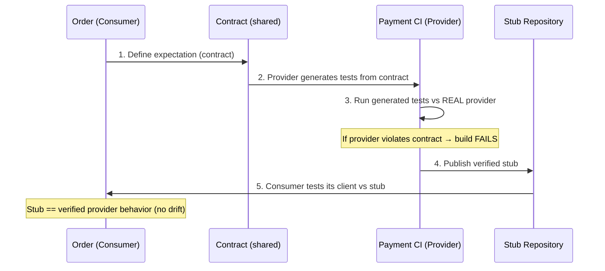
```mermaid
sequenceDiagram
    participant OC as Order (Consumer)
    participant CT as Contract (shared)
    participant PC as Payment CI (Provider)
    participant SR as Stub Repository

    OC->>CT: 1. Define expectation (contract)
    CT->>PC: 2. Provider generates tests from contract
    PC->>PC: 3. Run generated tests vs REAL provider
    Note over PC: If provider violates contract → build FAILS
    PC->>SR: 4. Publish verified stub
    SR->>OC: 5. Consumer tests its client vs stub
    Note over OC: Stub == verified provider behavior (no drift)
```

Line-by-line:

- **Step 1:** the consumer authors the expectation — *consumer-driven*.
- **Step 2–3:** the provider's CI turns that contract into real tests against its actual controller. This is the magic step: the provider is *forced* to honor the contract or fail its own build.
- The **Note over PC** is the whole value: breaking changes are caught at the provider, pre-deploy.
- **Step 4–5:** the verified stub flows to the consumer, so the consumer tests against something guaranteed to match the real provider — eliminating mock drift.

### Step 7 — Spring Boot Implementation

A contract (Groovy DSL), placed in the provider's `src/test/resources/contracts`:

```groovy
Contract.make {
    request {
        method 'POST'
        url '/payments'
        body([ orderId: 42, amount: 100.00 ])
        headers { contentType(applicationJson()) }
    }
    response {
        status OK()
        body([ transactionId: anyNonBlankString(), status: 'COMPLETED' ])
        headers { contentType(applicationJson()) }
    }
}
```

Provider base test (Spring Cloud Contract generates the actual test methods from contracts and runs them against this setup):

```java
@SpringBootTest(webEnvironment = MOCK)
public abstract class PaymentContractBase {
    @Autowired private WebApplicationContext ctx;
    @BeforeEach void setup() {
        RestAssuredMockMvc.webAppContextSetup(ctx);  // run contracts against real controller
    }
}
```

Consumer test against the published stub:

```java
@SpringBootTest
@AutoConfigureStubRunner(
    ids = "com.bank:payment-service:+:stubs:8090",     // pull verified stub
    stubsMode = StubRunnerProperties.StubsMode.REMOTE)
class OrderPaymentClientTest {
    @Autowired private PaymentClient client;

    @Test void parsesTransactionId() {
        PaymentResult r = client.pay(42L, new BigDecimal("100.00"));
        assertThat(r.getTransactionId()).isNotBlank();   // verified against real contract
    }
}
```

The key idea: the consumer test (`@AutoConfigureStubRunner`) runs against a stub *generated from a contract the provider is verified against*. If the provider later breaks the field, its own build fails first — so the consumer never gets a nasty surprise in production.

### Step 8 — Common Mistakes

- **Treating contract tests as integration tests.** They test the *contract*, not full behavior or business logic. Keep them focused.
- **Provider-defined contracts only.** If the provider writes contracts without consumer input, you lose the "consumer-driven" benefit — you might verify fields nobody uses and miss fields they do.
- **Not running provider verification in CI.** If the generated provider tests aren't gating merges, the whole safety net is gone.
- **Stale stubs.** Consumers pulling old stub versions test against outdated behavior. Version and publish stubs as part of the provider pipeline.
- **Over-specifying contracts** (matching exact values, timestamps) makes them brittle. Use matchers (`anyNonBlankString()`) for volatile fields.

### Step 9 — Debugging Perspective

- A **failing generated provider test** is your early warning: the message tells you exactly which consumer expectation you'd break. This is debugging *shifted left* — before deploy.
- When a production integration bug *does* slip through, the first question is "**was there a contract for this interaction?**" Missing contracts reveal blind spots in your test coverage between services.
- Contract repositories double as **living documentation**: they show precisely what each consumer depends on, invaluable when planning a provider change.

### Step 10 — Summary

- **What you learned:** Consumer-driven contract testing lets consumers declare what they need; the provider's build verifies it and publishes stubs consumers test against — catching breaking API changes before deploy without full integration tests.
- **Why it matters:** It replaces slow, flaky end-to-end tests with fast, reliable boundary tests and prevents one team from silently breaking another.
- **When to use it:** For every important synchronous (and even event) interaction between independently deployed services.
- **When not to use it:** For interactions with truly external third parties you don't control (you can't make *their* build verify your contract) — there, use real integration tests with recorded responses. Don't use it as a substitute for unit tests of business logic.

---

## Chapter 4.2 — Consumer-Side Contract Testing

### Step 1 — Problem Statement

The previous chapter focused on protecting the *provider* from breaking *consumers*. But there's a complementary question: how does a **consumer** verify that *its own understanding* of a dependency is correct, and keep its client code honest — especially against dependencies where you can't force provider-side verification (third-party APIs, slowly-moving legacy systems)?

If the consumer just hand-writes a mock of the provider, that mock encodes the consumer's *assumptions*, which may be wrong from day one or drift over time. The consumer needs a way to assert "this is exactly how I believe the provider behaves" and ideally have that belief checked against reality periodically.

### Step 2 — Intuition

The consumer writes tests that pin down its **expectations of the dependency** explicitly, in a form that can be (a) used to generate a stub for fast local testing, and (b) shared with the provider for verification when possible. Even when provider verification isn't possible (third party), the consumer at least has a single, explicit, reviewable record of its assumptions — and can run periodic real integration checks against the live dependency to detect drift.

The intuition: **make the consumer's assumptions about its dependencies explicit and testable, rather than buried in ad-hoc mocks.**

### Step 3 — Real-World Analogy

Imagine you depend on a bus that you believe arrives every 15 minutes. Instead of vaguely "assuming" this, you write it on your planning board: "Bus = every 15 min, from stop B." Now your plans are based on an *explicit, checkable* assumption. Periodically you verify it against the real timetable. If the bus company changes the schedule, your explicit assumption makes the mismatch obvious — versus a vague mental assumption that silently makes you late.

### Step 4 — Internal Mechanics

- **Tools:** Spring Cloud Contract (consumer side) or **Pact** (a popular consumer-driven contract framework, language-agnostic). Pact especially emphasizes the consumer-side workflow: the consumer test runs against a Pact mock, which records the interactions into a **pact file**.
- **Consumer test → mock provider:** the consumer's client code runs against an in-process mock that the framework controls. The test both *verifies the client* and *captures the expected interactions*.
- **Pact file / contract:** the captured expectations are published (to a Pact Broker or shared repo).
- **Optional provider verification:** if the provider participates, it replays the pact against its real service.
- **Drift detection for external deps:** schedule a periodic real-integration test against the live dependency to confirm the recorded expectations still hold.

### Step 5 — Step-by-Step Flow

1. Consumer writes a test for its `PaymentClient`, declaring the request it sends and the response it expects.
2. The framework spins up a **mock provider** honoring that expectation; the consumer's client code is exercised against it.
3. The test passes only if the consumer correctly produces the request and parses the response → the client code is verified.
4. The interaction is recorded into a contract/pact file and published.
5. (If possible) the provider verifies it. (If third party) a nightly job hits the real API to confirm the contract still holds; a failure flags drift early.

### Step 6 — Architecture Diagram

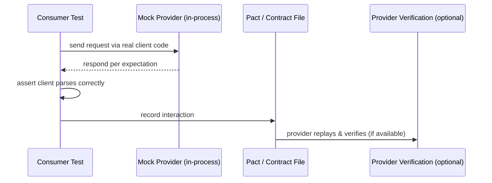
```mermaid
sequenceDiagram
    participant CT as Consumer Test
    participant MP as Mock Provider (in-process)
    participant PF as Pact / Contract File
    participant PV as Provider Verification (optional)

    CT->>MP: send request via real client code
    MP-->>CT: respond per expectation
    CT->>CT: assert client parses correctly
    CT->>PF: record interaction
    PF->>PV: provider replays & verifies (if available)
```

Line-by-line: the consumer's *real* client code (not a fake) drives the test against a mock provider; passing proves the client is correct against the stated expectation; the expectation is recorded and, where possible, verified against the real provider — closing the drift gap.

### Step 7 — Spring Boot Implementation

Consumer-side test with Spring Cloud Contract's stub runner (local stub generated from the consumer's own declared contract), focusing on verifying *client behavior*:

```java
@SpringBootTest
@AutoConfigureStubRunner(ids = "com.bank:payment-service:+:stubs:8090",
                         stubsMode = StubsMode.LOCAL)
class PaymentClientConsumerTest {

    @Autowired PaymentClient client;

    @Test
    void sendsCorrectRequestAndParsesResponse() {
        // Exercises the REAL client code against a stub honoring the contract.
        PaymentResult result = client.pay(42L, new BigDecimal("100.00"));

        assertThat(result.getStatus()).isEqualTo("COMPLETED");
        assertThat(result.getTransactionId()).isNotBlank();
        // If the client serialized the request wrong, the stub wouldn't match → test fails.
    }
}
```

The point: this test fails if the consumer's *own* client code is wrong (wrong URL, wrong body, wrong parsing). It validates the consumer's side of the contract independent of whether the provider is reachable.

### Step 8 — Common Mistakes

- **Hand-written mocks instead of generated stubs** — reintroduces drift. Generate stubs from contracts.
- **Never verifying against the real dependency** for third-party APIs — your recorded assumptions can silently go stale. Schedule periodic real checks.
- **Testing business logic in contract tests** — keep them about the interaction shape.
- **Not publishing/sharing the contract** — a consumer-only artifact that the provider never sees misses half the value.

### Step 9 — Debugging Perspective

- When a consumer breaks against a real provider but its contract tests pass, you've found **contract drift** — the recorded expectation no longer matches reality. The fix is to update the contract and (ideally) get provider verification in place.
- Consumer contract tests pinpoint whether a bug is in *your client* (request/parsing) versus *the provider* — narrowing the search dramatically.

### Step 10 — Summary

- **What you learned:** Consumer-side contract testing makes a consumer's assumptions about its dependencies explicit and testable, verifying the consumer's client code and (where possible) detecting drift against the real provider.
- **Why it matters:** It eliminates silent mock drift and gives you confidence in your integration code without full system tests.
- **When to use it:** For verifying your client logic against any dependency, especially third-party APIs where you can't control provider verification (add periodic real checks there).
- **When not to use it:** As a replacement for provider-side verification when you *can* do it (do both); or for testing internal business rules.

---

## Chapter 4.3 — Service Component Testing

### Step 1 — Problem Statement

You want to test a single service's behavior *thoroughly* — its API, its business logic, its database interactions, its error handling — but you do **not** want to spin up the entire ecosystem (all 25 services, Kafka, the gateway) just to test one service. Full end-to-end tests are slow (minutes per run), flaky (any of 25 services can fail for unrelated reasons), and hard to debug (which service caused the failure?). Yet pure unit tests don't cover how the service behaves as a *whole* — its wiring, serialization, transactions, and HTTP layer.

The problem: **how do we test one service as a complete, deployable unit — in isolation from its real dependencies — fast and reliably?**

### Step 2 — Intuition

Test the service **as a black box through its real API**, with its **real internals** (real controllers, real services, real database), but with all its **external dependencies replaced by controllable test doubles** (stubs for other services, an embedded or containerized database, an embedded broker). You exercise the whole service the way a client would, but in a hermetic bubble you fully control.

The intuition: **draw a boundary around one service; everything inside is real, everything outside is faked; test through the front door.**

### Step 3 — Real-World Analogy

This is like **testing a single car on a rolling-road dynamometer.** The car is real and complete — real engine, real gearbox, real electronics. But instead of an actual road, traffic, and weather (the external world), you simulate the load with rollers and sensors in a controlled garage. You can floor the accelerator, simulate a steep hill, or cut the fuel — all repeatably — without driving in real traffic. You test the whole car as a unit, in isolation, under conditions you dictate.

### Step 4 — Internal Mechanics

- **In-process component test:** start the whole Spring context (`@SpringBootTest`), call real HTTP endpoints (`TestRestTemplate`/`WebTestClient` or `MockMvc`), use a real but ephemeral database (**Testcontainers** Postgres or an in-memory DB), and **stub external service calls** (WireMock) and the message broker (embedded Kafka/an in-memory broker).
- **Out-of-process component test:** deploy the actual service (e.g., in a container) and test it over the real network, with dependencies stubbed by containers. Higher fidelity, slower.
- **Test doubles** for dependencies are configured to return contract-compliant responses (ideally the verified stubs from Chapter 4.1), and can be told to simulate failures, timeouts, and errors — enabling **failure-scenario testing** in isolation.

### Step 5 — Step-by-Step Flow

1. Start the Order Service with its full Spring context.
2. Start a Testcontainers Postgres for its real database.
3. Start WireMock standing in for the Payment Service; program it to return a successful payment (and, in other tests, a timeout or `500`).
4. Send a real `POST /orders` HTTP request to the running service.
5. Assert the HTTP response, the database state (order row created), and any events emitted (to embedded Kafka).
6. Re-run with WireMock simulating a Payment failure; assert the Order Service handles it correctly (e.g., marks the order failed, triggers compensation).

### Step 6 — Architecture Diagram

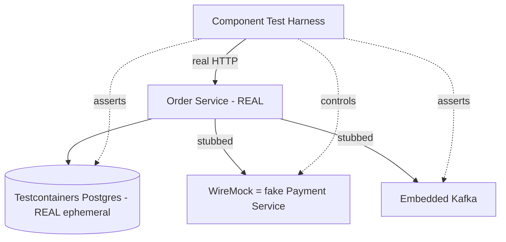
```mermaid
graph TD
    Test[Component Test Harness] -->|real HTTP| OS[Order Service - REAL]
    OS --> DB[(Testcontainers Postgres - REAL ephemeral)]
    OS -->|stubbed| WM[WireMock = fake Payment Service]
    OS -->|stubbed| EK[Embedded Kafka]
    Test -.controls.-> WM
    Test -.asserts.-> DB
    Test -.asserts.-> EK
```

Line-by-line: the **Order Service and its database are real** (inside the test boundary); the **Payment Service and broker are stubbed** (outside the boundary); the test harness drives the service through its real HTTP API and asserts on its database and emitted events. The dotted "controls" arrow shows the test dictating dependency behavior (including failures).

### Step 7 — Spring Boot Implementation

```java
@SpringBootTest(webEnvironment = RANDOM_PORT)
@Testcontainers
class OrderServiceComponentTest {

    @Container
    static PostgreSQLContainer<?> db =
        new PostgreSQLContainer<>("postgres:16");      // REAL db, ephemeral

    static WireMockServer payment = new WireMockServer(8091); // FAKE payment svc

    @DynamicPropertySource
    static void props(DynamicPropertyRegistry r) {
        r.add("spring.datasource.url", db::getJdbcUrl);
        r.add("clients.payment.url", () -> "http://localhost:8091");
    }

    @BeforeAll static void start() { payment.start(); }
    @AfterAll  static void stop()  { payment.stop(); }

    @Autowired TestRestTemplate http;
    @Autowired OrderRepository orders;

    @Test
    void createsOrder_whenPaymentSucceeds() {
        payment.stubFor(post("/payments").willReturn(okJson(
            "{\"transactionId\":\"tx-1\",\"status\":\"COMPLETED\"}")));

        var resp = http.postForEntity("/orders",
            new CreateOrder(42L, "100.00"), OrderResponse.class);

        assertThat(resp.getStatusCode()).isEqualTo(HttpStatus.CREATED);
        assertThat(orders.findById(resp.getBody().id()).get().getStatus())
            .isEqualTo(OrderStatus.CONFIRMED);
    }

    @Test
    void failsOrder_whenPaymentTimesOut() {
        payment.stubFor(post("/payments")
            .willReturn(aResponse().withFixedDelay(5000)));  // simulate timeout

        var resp = http.postForEntity("/orders",
            new CreateOrder(42L, "100.00"), OrderResponse.class);

        assertThat(resp.getStatusCode()).isEqualTo(HttpStatus.SERVICE_UNAVAILABLE);
        // assert compensation / order marked FAILED, etc.
    }
}
```

The two tests show the power: the *same real service* is tested for the happy path **and** for a dependency timeout — repeatably, fast, with no real Payment Service involved. The failure test is exactly what you can't easily do in flaky end-to-end suites.

### Step 8 — Common Mistakes

- **Confusing component tests with E2E tests** — pulling in real downstream services defeats the isolation and reintroduces flakiness.
- **Stubbing the service's own database** — the database is *inside* the boundary; use a real (ephemeral) one for fidelity. Mocking repositories turns it into a unit test.
- **Stubs that don't match contracts** — your component test passes against a fake that the real provider would never produce. Use verified stubs (Chapter 4.1).
- **Only testing happy paths** — the biggest value of component tests is cheaply simulating dependency failures (timeouts, 5xx, malformed responses).
- **Slow Testcontainers setup per test** — reuse containers across the class/suite.

### Step 9 — Debugging Perspective

- Component tests give a **clean, isolated reproduction** of a service's behavior — when production shows "Order Service mishandles a Payment timeout," you reproduce it deterministically here, not by chaos in a shared environment.
- Because dependencies are stubbed, **any failure is localized to the service under test** — no "is it me or one of the other 24 services?" ambiguity.
- They serve as **regression guards** for failure handling — once you fix a timeout bug, the component test prevents it from returning.

### Step 10 — Summary

- **What you learned:** Service component testing exercises one service as a complete, deployable unit through its real API, with real internals and a real ephemeral database, but with all external dependencies stubbed — fast, reliable, and able to simulate failures.
- **Why it matters:** It gives high confidence in a service's whole behavior (including failure handling) without the cost and flakiness of full end-to-end tests.
- **When to use it:** As the workhorse middle layer of your microservice test strategy — heavy use, on every service.
- **When not to use it:** As a substitute for contract tests (it can't catch provider drift on its own — pair them) or for the small number of true end-to-end smoke tests you still want before release.

**Mental model for all of Part 4:** *push testing down and to the boundaries — unit tests for logic, component tests for whole-service behavior in isolation, contract tests for the seams between services, and only a thin layer of end-to-end tests. The more you can verify without running everything together, the faster and more reliably your teams ship.*

---

# Part 5 — Messaging Style Patterns

How services talk to each other is one of the two or three most consequential decisions in your architecture. This part covers the two great families — **asynchronous messaging** (fire an event, move on) and **synchronous remote procedure invocation** (call and wait) — and, crucially, *when* each is right.

## Chapter 5.1 — The Messaging (Asynchronous) Pattern

### Step 1 — Problem Statement

When a customer places an order on an e-commerce platform, *many* things must happen: reserve inventory, charge payment, send a confirmation email, notify the warehouse, update analytics, award loyalty points, maybe trigger fraud scoring. In a monolith, the order method just calls each of these in turn, in one transaction. In microservices, the naive translation is for the Order Service to **synchronously call** Inventory, then Payment, then Email, then Warehouse, then Analytics, then Loyalty, then Fraud.

This naive approach is a disaster:

- **Temporal coupling / availability collapse.** If *any* of those seven services is down or slow, the order fails or hangs. The order's success now depends on the simultaneous health of seven services. If each is 99.9% available, the chain is roughly 99.3% available — far worse, and it gets worse with every dependency.
- **Latency stacking.** The customer waits for the *sum* of all seven calls. If analytics is slow, the customer's checkout is slow — even though analytics has nothing to do with whether the order succeeded.
- **Tight coupling to consumers.** Every time you add a new reaction to an order (say, a new "send to partner" feature), you must modify the Order Service to call it. The Order Service becomes a hub that knows about everyone.
- **No natural buffering.** A spike of 10,000 orders/second directly hammers all seven downstream services at once.

The core problem: **how can one service trigger work in many others without depending on their immediate availability, without waiting for them, and without knowing who they are?**

### Step 2 — Intuition

Instead of the Order Service *calling* everyone, it simply **announces what happened** — "an order was placed!" — by publishing a message to a **broker** (a durable middleman), and then immediately returns to the customer. Any service that cares about orders **subscribes** and reacts on its own time. The Order Service doesn't know or care who is listening; it just broadcasts a fact.

The intuition: **shift from "commanding specific services to do things" to "broadcasting facts that interested parties react to."** This is the difference between *telling* and *telling about*. The broker stores the message durably, so even if a consumer is down right now, it will get the message when it recovers. Nobody waits; everybody reacts independently.

### Step 3 — Real-World Analogy

Two analogies, each illuminating a different aspect:

**The post office (queue / point-to-point).** You drop a letter in the postbox and walk away — you don't wait at the recipient's door. The postal system *holds* the letter and delivers it even if the recipient is on holiday (durability). You're decoupled in time from the recipient.

**The newspaper / radio broadcast (publish-subscribe).** A radio station broadcasts the news. It has no idea how many people are listening, or who. New listeners can tune in tomorrow and start receiving broadcasts without the station changing anything. The station just *publishes facts*; subscribers consume what's relevant. This is exactly publish-subscribe: the Order Service "broadcasts" `OrderPlaced`, and any number of services "tune in."

### Step 4 — Internal Mechanics

A **message broker** sits between producers and consumers. The two dominant brokers in the Spring world:

**Apache Kafka** — a distributed, durable, append-only **log**. Key concepts:
- **Topic:** a named stream of messages (e.g., `orders`).
- **Partition:** a topic is split into partitions for parallelism and ordering. **Order is guaranteed only within a partition**, not across the whole topic. Messages with the same **key** (e.g., `orderId`) go to the same partition → ordered per key.
- **Offset:** each message's position in a partition. Consumers track their offset, so they can replay from any point — Kafka **retains messages** (hours, days, or forever), enabling replay and new consumers reading history.
- **Consumer group:** a set of consumer instances sharing the work; each partition is consumed by exactly one member of the group → horizontal scaling. Different groups each get *all* the messages (pub-sub).
- **Delivery semantics:** at-least-once by default (consumers must be **idempotent**); exactly-once is possible within Kafka transactions but with caveats.

**RabbitMQ** — a traditional **message queue / broker** built around AMQP. Key concepts:
- **Exchange:** receives messages and routes them to queues based on rules (direct, topic, fanout).
- **Queue:** holds messages until a consumer acks them. Messages are typically **removed after consumption** (unlike Kafka's retained log).
- **Routing keys & bindings:** decide which queues get which messages.
- Excellent for **complex routing, work queues, and per-message acknowledgement**; less suited to high-throughput replayable event streams.

**Kafka vs RabbitMQ — the senior summary:**
- **Kafka:** high-throughput **event streaming**, durable retention, replay, event sourcing, many independent consumers reading the same stream, ordering per key. Choose for event-driven architectures and analytics pipelines.
- **RabbitMQ:** flexible **routing**, classic task/work queues, request/reply, lower-latency per-message, priorities. Choose for command distribution and complex routing where retention/replay isn't needed.

**Failure handling concepts** (apply to both):
- **At-least-once delivery → duplicates → require idempotent consumers** (recall Part 0).
- **Dead-letter queue (DLQ):** messages that repeatedly fail processing are routed aside for inspection instead of blocking the stream forever ("poison messages").
- **Consumer lag:** how far behind a consumer is from the latest message — a primary health metric (Part 14).
- **Backpressure / buffering:** the broker absorbs spikes so consumers process at their own pace.

### Step 5 — Step-by-Step Flow

1. Customer checks out; Order Service writes the order to its DB and publishes `OrderPlaced{orderId, items, amount, customerId}` to the `orders` topic (reliably — via Outbox, Part 10).
2. Order Service immediately returns `201 Created` to the customer. **Total customer wait = one DB write + one publish.** Fast.
3. The broker durably stores the event.
4. Independently and in parallel:
   - **Inventory Service** (consumer group `inventory`) consumes `OrderPlaced`, reserves stock, emits `StockReserved`.
   - **Payment Service** consumes it, charges the card, emits `PaymentCompleted` or `PaymentFailed`.
   - **Notification Service** consumes it, sends a confirmation email.
   - **Analytics Service** consumes it, updates dashboards.
5. If the Notification Service was down at step 4, it processes the backlog when it recovers — no orders were lost or blocked.
6. Adding a new reaction later (e.g., Loyalty Service) means *just subscribing to `orders`* — the Order Service is never touched.

### Step 6 — Architecture Diagram

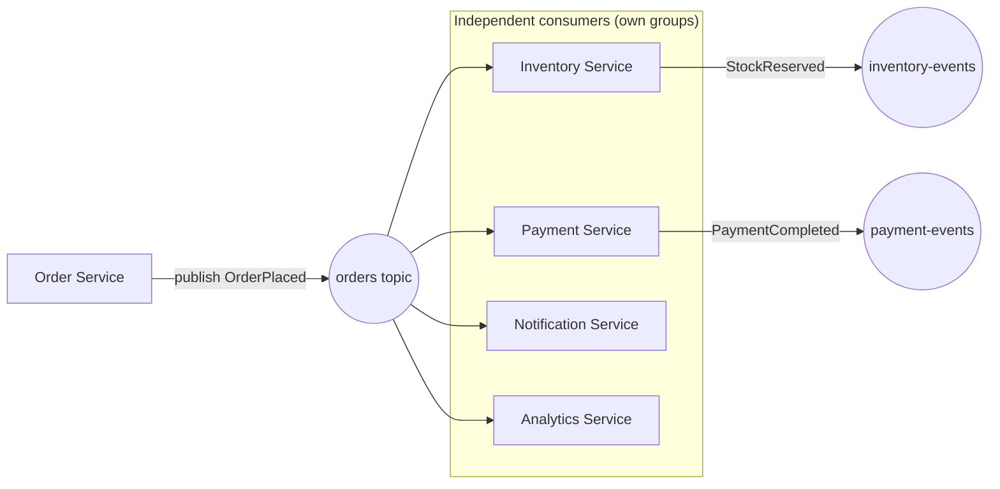
```mermaid
graph LR
    OS[Order Service] -->|publish OrderPlaced| T((orders topic))

    subgraph "Independent consumers (own groups)"
      INV[Inventory Service]
      PAY[Payment Service]
      NOT[Notification Service]
      ANA[Analytics Service]
    end

    T --> INV
    T --> PAY
    T --> NOT
    T --> ANA

    INV -->|StockReserved| T2((inventory-events))
    PAY -->|PaymentCompleted| T3((payment-events))
```

Line-by-line:

- **`OS -->|publish OrderPlaced| T`**: the Order Service publishes one fact to the `orders` topic and is *done*. It does not know who consumes it.
- **`T --> INV/PAY/NOT/ANA`**: four services, each in its own consumer group, *each receives the full stream* independently (publish-subscribe). One slow consumer doesn't block the others.
- **`INV -->|StockReserved| T2`**: consumers can themselves become producers, emitting their own events — this is how **event choreography** chains (Part 11).
- The broker `T` in the middle is the **buffer and decoupler**: producers and consumers never touch directly.

### Step 7 — Spring Boot Implementation

Producer with Spring Kafka:

```java
@Service
public class OrderPublisher {
    private final KafkaTemplate<String, OrderPlaced> kafka;

    public void publish(Order order) {
        OrderPlaced event = OrderPlaced.from(order);
        // Key = orderId → all events for one order land in the SAME partition (ordered)
        kafka.send("orders", order.getId().toString(), event);
    }
}
```

Idempotent consumer (because delivery is at-least-once):

```java
@Component
public class InventoryListener {

    private final ProcessedEventRepository processed;  // dedup store
    private final InventoryService inventory;

    @KafkaListener(topics = "orders", groupId = "inventory")
    public void on(OrderPlaced event,
                   @Header(KafkaHeaders.RECEIVED_KEY) String key) {
        // IDEMPOTENCY: skip if we've already handled this event id (Part 0).
        if (processed.existsById(event.eventId())) return;

        inventory.reserve(event.orderId(), event.items());
        processed.save(new ProcessedEvent(event.eventId()));  // remember we did it
    }
}
```

```yaml
spring:
  kafka:
    bootstrap-servers: kafka:9092
    consumer:
      group-id: inventory
      enable-auto-commit: false        # commit offset only AFTER successful processing
      auto-offset-reset: earliest
    producer:
      acks: all                        # wait for replicas → don't lose messages
      retries: 3
```

The most important lines: the **idempotency check** in the consumer (duplicates *will* happen) and `acks: all` on the producer (don't acknowledge a publish until replicas have it — prevents lost messages). `enable-auto-commit: false` ensures you only mark a message consumed after you've actually processed it (prevents lost messages on crash).

### Step 8 — Common Mistakes

- **Non-idempotent consumers.** At-least-once delivery guarantees duplicates eventually. A consumer that "adds points" without dedup will double-award. *This is the #1 messaging bug.*
- **Using messaging where you need an immediate answer.** "Is this card valid right now?" needs a synchronous response, not an event. Don't force async where the business needs sync.
- **Treating events as commands.** An event states a fact ("OrderPlaced"); a command tells someone to do something ("ChargeCard"). Publishing `OrderPlaced` and *assuming* exactly one specific consumer must act in a specific way couples you again. Design events as facts.
- **Giant events / events as a database.** Stuffing entire aggregates into events, or making consumers depend on huge payloads. Keep events lean (IDs + essential data); consumers fetch details if needed.
- **Ignoring ordering needs.** If order matters (e.g., `AccountDebited` before `AccountCredited`), you must key by the entity so they share a partition. Forgetting this causes subtle out-of-order bugs.
- **No DLQ / no lag monitoring.** Poison messages block partitions; unmonitored lag means silent data staleness.
- **Losing messages with `acks=0/1` or auto-commit before processing.** Misconfiguration silently drops data.

### Step 9 — Debugging Perspective

- **Consumer lag** is the headline metric: rising lag means consumers can't keep up (slow processing, too few instances, a poison message). Watch it per consumer group per partition.
- **DLQ depth:** messages piling in the DLQ point to a systematic processing failure (bad deploy, schema change).
- **Duplicate processing** shows up as double side effects (two emails, double charges) → check idempotency.
- **"Lost" messages** are usually either consumed-but-failed-silently (check error handling and offset commits) or never-published (check the producer/outbox).
- **Out-of-order effects** → check partition keys.
- Distributed tracing across async boundaries requires **propagating trace context in message headers** (Part 14), or the trace "breaks" at the broker.

### Step 10 — Summary

- **What you learned:** Asynchronous messaging lets a service broadcast facts to a durable broker and move on, while interested services consume independently — decoupling services in time and identity.
- **Why it matters:** It dramatically improves availability (no temporal coupling), enables buffering against spikes, and lets you add new behavior without touching the producer — at the cost of eventual consistency and the need for idempotency, ordering care, and richer monitoring.
- **When to use it:** Event-driven workflows, fan-out to many consumers, decoupling, buffering load, and anything that doesn't need an immediate answer.
- **When not to use it:** When the caller genuinely needs an immediate, synchronous answer (validation, queries the user is waiting on), or when the added eventual-consistency complexity isn't worth it for a simple interaction.

---

## Chapter 5.2 — Remote Procedure Invocation (Synchronous)

### Step 1 — Problem Statement

Not everything can be a fire-and-forget event. When the Order Service needs to know *right now* whether a customer's address is valid, or the Payment Service needs the *current* exchange rate before charging, it needs an **answer**, immediately, to continue. Events don't give you a synchronous answer. So we need a way for one service to **call another and wait for a response** — the distributed equivalent of a method call.

The problem is that this "method call" now crosses the unreliable network (Part 0): it can be slow, fail, or time out, and the two services are now temporally coupled. We need to choose *how* to make these calls (protocol, contract, tooling) and understand the trade-offs.

### Step 2 — Intuition

Make a request to another service and block until you get a response, just like calling a local method — but with full awareness that this "method" lives across a network. We give it a clear contract (what to send, what comes back), a protocol (HTTP/JSON or binary), and resilience (timeouts, retries, circuit breakers).

The intuition: **RPC is "make this look like a normal function call, but never forget it's a network call."** The danger is forgetting the second half.

### Step 3 — Real-World Analogy

Synchronous RPC is a **phone call.** You dial, you wait for them to pick up, you ask your question, and you stay on the line until they answer. It's direct and immediate — perfect when you need an answer now. But it has costs: both parties must be available *at the same time* (temporal coupling); if they don't pick up, you're stuck waiting (need a timeout — you hang up after 30 seconds); and if their line is busy, you can't proceed. Contrast with the previous chapter's *letter/post* (async): you don't wait, but you don't get an instant answer either. Phone vs post is exactly sync RPC vs async messaging.

### Step 4 — Internal Mechanics

Three common ways to do RPC in the Spring ecosystem:

**1. REST over HTTP/JSON** — the default.
- Human-readable, universally supported, easy to debug (curl, browser), loose coupling via JSON.
- Downsides: text serialization overhead, no enforced schema (without OpenAPI), verbose, request/response only.

**2. gRPC over HTTP/2 + Protocol Buffers** — high-performance binary RPC.
- **Protobuf:** a compact binary format with a strict, versioned **schema** (`.proto` files) that generates client/server code in many languages → strong typing across services.
- **HTTP/2:** multiplexing (many calls over one connection), header compression, and **streaming** (server-streaming, client-streaming, bidirectional) — not just request/response.
- Much faster and smaller on the wire than JSON; great for **internal service-to-service** calls, especially high-throughput or low-latency ones (common in telecom, trading, large platforms).
- Downsides: binary (harder to eyeball-debug), less browser-friendly (needs a proxy for web), more tooling.

**3. Feign (declarative REST client)** — not a protocol but a *developer-experience* layer.
- You declare a Java interface annotated with the remote endpoints; Spring Cloud OpenFeign generates the HTTP client. Integrates with service discovery (call by service name), load balancing, and resilience (Resilience4j).
- Makes REST calls look like local method calls — ergonomic, but *that's also the danger* (it hides the network).

**Resilience is mandatory for all RPC:** every synchronous call needs a **timeout** (never wait forever — fallacy #2), and usually **retries** (for transient failures, with backoff and only for idempotent operations) and a **circuit breaker** (Part 6) to stop cascading failures.

**Failure modes** unique to sync RPC: cascading failures (slow B makes A slow makes A's callers slow), thread-pool exhaustion (all of A's threads blocked waiting on B), and retry storms (everyone retries a struggling service, finishing it off).

### Step 5 — Step-by-Step Flow

1. Order Service needs the recipient's account status. It calls `accountClient.getStatus(id)`.
2. The Feign/HTTP client resolves `account-service` via discovery (Part 9), picks a healthy instance (load balancing).
3. It opens an HTTP connection, sends `GET /accounts/{id}/status`, and **starts a timeout clock** (say 800 ms).
4. **Circuit breaker check:** if the breaker for account-service is *open* (it's been failing), short-circuit immediately with a fallback — don't even make the call (Part 6).
5. Account Service responds within the timeout → Order Service continues.
6. If it times out or errors: maybe **retry once** (if idempotent), else apply fallback / propagate a controlled error. The breaker records the failure.

### Step 6 — Architecture Diagram

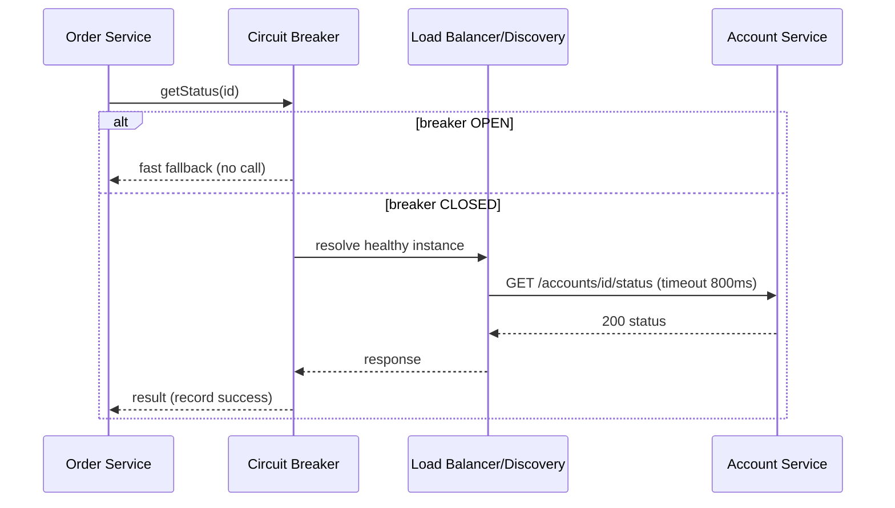
```mermaid
sequenceDiagram
    participant OS as Order Service
    participant CB as Circuit Breaker
    participant LB as Load Balancer/Discovery
    participant AS as Account Service

    OS->>CB: getStatus(id)
    alt breaker OPEN
        CB-->>OS: fast fallback (no call)
    else breaker CLOSED
        CB->>LB: resolve healthy instance
        LB->>AS: GET /accounts/id/status (timeout 800ms)
        AS-->>LB: 200 status
        LB-->>CB: response
        CB-->>OS: result (record success)
    end
```

Line-by-line: every synchronous call is wrapped by a **circuit breaker** (it can short-circuit to a fallback) and routed through **discovery + load balancing** to a *healthy* instance, with a **timeout** on the actual network call. The `alt`/`else` shows the breaker deciding whether to even attempt the call — the heart of resilient RPC.

### Step 7 — Spring Boot Implementation

Declarative REST with Feign + Resilience4j:

```java
@FeignClient(name = "account-service")    // resolved via discovery; load-balanced
public interface AccountClient {
    @GetMapping("/accounts/{id}/status")
    AccountStatus getStatus(@PathVariable Long id);
}

@Service
public class OrderService {
    private final AccountClient accounts;

    @CircuitBreaker(name = "accountService", fallbackMethod = "statusFallback")
    @Retry(name = "accountService")        // retry transient failures (idempotent GET)
    public AccountStatus check(Long id) {
        return accounts.getStatus(id);     // looks local, but it's a network call!
    }

    private AccountStatus statusFallback(Long id, Throwable t) {
        return AccountStatus.unknown();    // controlled degradation, not a crash
    }
}
```

```yaml
resilience4j:
  circuitbreaker:
    instances:
      accountService:
        slidingWindowSize: 20
        failureRateThreshold: 50      # open if >50% of last 20 calls fail
        waitDurationInOpenState: 10s
  timelimiter:
    instances:
      accountService:
        timeoutDuration: 800ms        # never wait forever
```

A gRPC service definition for the high-performance path:

```protobuf
// account.proto — strict, versioned schema shared across services
service AccountService {
  rpc GetStatus (AccountId) returns (AccountStatus);
}
message AccountId  { int64 id = 1; }
message AccountStatus { bool active = 1; string tier = 2; }
```

The most important code lesson: the Feign call *looks* exactly like a local method, which is why the `@CircuitBreaker`, `@Retry`, `fallback`, and `timeoutDuration` are non-negotiable — they reintroduce the safety the local-call illusion strips away.

### Step 8 — Common Mistakes

- **No timeout.** The cardinal sin. A call with no timeout will eventually hang a thread forever when the dependency stalls, and thread exhaustion takes your service down. *Every* remote call needs a timeout.
- **Long synchronous chains** (A→B→C→D). Latency adds up; availability multiplies down. Flatten with async events or composition.
- **Retrying non-idempotent operations.** Retrying "charge card" can double-charge. Only retry idempotent calls (or use idempotency keys).
- **Retry storms.** Aggressive retries from many callers can finish off a struggling service. Use exponential backoff + jitter + circuit breakers.
- **Forgetting it's a network call.** The Feign illusion leads developers to make chatty fine-grained calls in loops — N+1 over the network. Batch instead.
- **Using gRPC everywhere reflexively** — its tooling/complexity isn't worth it for simple, low-volume, browser-facing APIs where REST shines.

### Step 9 — Debugging Perspective

- **Latency percentiles (p50/p95/p99) per call** reveal slow dependencies; a service's own latency is dominated by its slowest synchronous dependency.
- **Thread-pool / connection-pool saturation** metrics signal calls blocked waiting on a slow downstream — the classic prelude to a cascading outage.
- **Circuit-breaker state** (open/half-open/closed) tells you which dependency is unhealthy at a glance.
- **Distributed traces** show the call chain and exactly which hop is slow or erroring — the single best tool for sync RPC debugging (Part 19).
- **Timeout vs error rates:** lots of timeouts → downstream slow; lots of 5xx → downstream broken; lots of 503 from breaker → breaker protecting you (downstream is the real problem).

### Step 10 — Summary

- **What you learned:** Synchronous RPC (REST, gRPC, Feign) lets a service call another and wait for an answer, with REST as the flexible default and gRPC as the high-performance binary option for internal calls. It always requires timeouts, and usually retries and circuit breakers.
- **Why it matters:** Some interactions genuinely need an immediate answer; RPC provides it — but reintroduces temporal coupling and the risk of cascading failures, which resilience patterns must contain.
- **When to use it:** Queries and validations where the caller needs a response to proceed; low-fan-out, latency-sensitive internal calls (gRPC).
- **When not to use it:** Fire-and-forget work, fan-out to many consumers, or anything where the dependency's availability shouldn't block you — use async messaging there. **The senior heuristic: prefer async events for "things that should happen," use sync RPC for "answers I need now," and never let synchronous chains grow long.**

**Mental model for Part 5:** *messaging is the postal/broadcast system — decoupled, resilient, eventually consistent. RPC is the phone call — immediate, coupled, fragile. Mature architectures use both deliberately: sync where an answer is required, async everywhere else, with the bias toward async because it buys availability.*

---

# Part 6 — Reliable Communication Patterns

## Chapter 6.1 — The Circuit Breaker Pattern

### Step 1 — Problem Statement

This is the single most important resilience pattern in microservices, so we'll go deep. Let's watch a real cascading failure unfold — the kind that turns one small problem into a total outage.

The Payment Service depends synchronously on a Fraud Service for risk scoring. Normally Fraud responds in 50 ms. One afternoon, the Fraud Service's database gets slow (a bad query plan after a data growth threshold), and Fraud's response time climbs to 30 seconds. Here's the catastrophe, step by step:

1. Payment calls Fraud. Fraud is slow, so each Payment request now holds a thread for 30 seconds waiting.
2. Payment has a thread pool of, say, 200 threads. Requests keep arriving (10/second). Within 20 seconds, all 200 threads are stuck waiting on Fraud.
3. Payment now has **zero free threads**. New requests — *even ones that don't need Fraud* — queue up and time out. **Payment is now effectively down**, even though Payment itself is perfectly healthy.
4. The Order Service calls Payment synchronously. Payment is now unresponsive, so Order's threads start blocking on Payment...
5. Order's thread pool exhausts. **Order is now down too.**
6. The API Gateway calls Order. The gateway's threads block... **The entire platform is down because one database got a slow query.**

This is a **cascading failure**, and it is how most large outages actually happen. The root cause was tiny (a slow query in one service), but the *failure propagated* through synchronous calls and thread-pool exhaustion until everything collapsed. Why do simple approaches fail to prevent this?

- **Just adding timeouts** helps but isn't enough: even with a 1-second timeout, under high load you can still exhaust threads, and you keep *hammering the already-struggling Fraud Service* with doomed requests, preventing its recovery.
- **Just retrying** makes it *worse* — a retry storm piles more load on the dying service.

We need something that *stops calling a failing dependency entirely* for a while, both to protect ourselves (free our threads) and to protect the dependency (let it recover).

### Step 2 — Intuition

Borrow the idea from your home's **electrical circuit breaker**. When there's a dangerous fault (a short circuit), the breaker *trips* — it cuts the electricity *immediately* rather than letting the fault start a fire or fry every appliance. After a while, once you've fixed the problem, you flip it back on. Crucially, while it's tripped, it doesn't keep trying to push electricity through the fault.

Apply this to service calls: wrap every risky remote call in a software "circuit breaker." It watches the call's success/failure rate. When failures cross a threshold, the breaker **trips (opens)**: for a cooldown period, it **stops making the call entirely** and instead returns an immediate error or fallback. This (a) frees the caller's threads instantly — no more waiting 30 seconds — and (b) gives the struggling dependency breathing room to recover by not bombarding it. After the cooldown, it cautiously tries again.

The intuition: **fail fast and stop kicking a service that's already down.**

### Step 3 — Real-World Analogy

Beyond the electrical breaker, think of a **restaurant kitchen that "86s" a dish.** When the kitchen runs out of salmon (or the salmon station is overwhelmed), the manager tells the waiters: "We're 86 on salmon — don't even bring me salmon orders." The waiters *immediately* tell customers "sorry, no salmon today" instead of taking the order, sending it to a drowning kitchen, and making everyone wait 40 minutes for a dish that will never come. Periodically the manager checks: "Can we do salmon again?" The 86 list is a circuit breaker: fail fast, protect the overwhelmed station, and probe occasionally for recovery.

### Step 4 — Internal Mechanics: The Three States

A circuit breaker is a **state machine** with three states:

**1. CLOSED (normal operation).** Calls pass through to the dependency. The breaker counts outcomes over a **sliding window** (e.g., last 100 calls or last 10 seconds). If the **failure rate** (or slow-call rate) exceeds a **threshold** (e.g., 50%), the breaker **trips to OPEN**.

**2. OPEN (tripped / failing fast).** Calls are *not* made. Instead, the breaker immediately returns an error or invokes a **fallback**. This lasts for a configured **wait duration** (e.g., 10 seconds). During this time the dependency is left alone to recover, and the caller's threads are never blocked. When the wait elapses, the breaker moves to HALF-OPEN.

**3. HALF-OPEN (probing recovery).** The breaker allows a *small number* of trial calls through. 
- If they **succeed** (dependency recovered), the breaker returns to **CLOSED** — normal service resumes.
- If they **fail** (still broken), the breaker returns to **OPEN** for another wait period.

This probing is essential: it lets the system **self-heal** without a human, while not flooding a still-broken service.

**Companion mechanisms** (usually configured together):
- **Timeout / TimeLimiter:** caps how long any single call may take (so "slow" counts as a failure).
- **Bulkhead:** limits concurrent calls to a dependency (isolates thread pools so one slow dependency can't consume *all* threads — named after a ship's watertight compartments).
- **Fallback:** what to return when the breaker is open or the call fails (cached value, default, graceful degradation, or a clear error).
- **Retry:** for transient blips, with backoff — but coordinated with the breaker so you don't retry-storm.

### Step 5 — Step-by-Step Flow

Watch the breaker save the day in the Fraud scenario:

1. Fraud starts timing out. Payment's breaker for Fraud is CLOSED, counting failures.
2. Failure rate crosses 50% over the sliding window → breaker **trips to OPEN**.
3. Now every Payment→Fraud call **returns instantly** via fallback (e.g., "route to manual review" or "apply default risk policy"). **Payment's threads are no longer blocked — Payment stays healthy.** No cascade. Order and the gateway are fine.
4. Fraud is no longer being hammered, so its database recovers.
5. After 10 seconds, the breaker goes **HALF-OPEN** and lets a few calls through. Fraud now responds quickly.
6. Those trial calls succeed → breaker returns to **CLOSED**. Full service restored, automatically, with zero human intervention.

The contrast with Step 1's catastrophe is the entire value proposition: same root cause, but the failure was *contained* to a graceful degradation of one feature instead of a total outage.

### Step 6 — Architecture Diagram

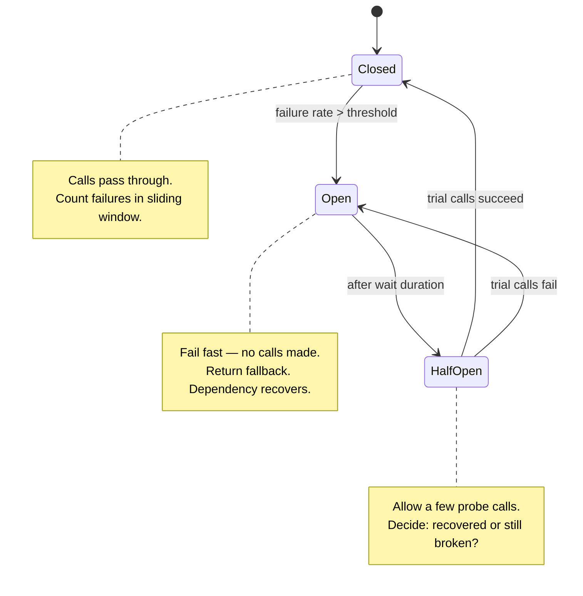
```mermaid
stateDiagram-v2
    [*] --> Closed
    Closed --> Open: failure rate > threshold
    Open --> HalfOpen: after wait duration
    HalfOpen --> Closed: trial calls succeed
    HalfOpen --> Open: trial calls fail
    note right of Closed
        Calls pass through.
        Count failures in sliding window.
    end note
    note right of Open
        Fail fast — no calls made.
        Return fallback. Dependency recovers.
    end note
    note right of HalfOpen
        Allow a few probe calls.
        Decide: recovered or still broken?
    end note
```

Line-by-line:

- **`[*] --> Closed`**: a breaker starts in the normal, calls-allowed state.
- **`Closed --> Open`**: too many failures trip it. This is the protective trip.
- **`Open --> HalfOpen`**: time-based transition — after the cooldown, cautiously probe.
- **`HalfOpen --> Closed`** vs **`HalfOpen --> Open`**: the probe's outcome decides recovery or another cooldown. This loop is the self-healing mechanism.
- The notes describe what happens *in* each state — pause on the OPEN note: "fail fast, dependency recovers" captures both benefits (protect caller + protect callee).

### Step 7 — Spring Boot Implementation

Resilience4j is the standard (Hystrix is deprecated). Layered annotations:

```java
@Service
public class FraudCheckService {

    private final FraudClient fraud;

    @CircuitBreaker(name = "fraud", fallbackMethod = "fallback")
    @Bulkhead(name = "fraud")              // limit concurrent calls → isolate threads
    @TimeLimiter(name = "fraud")           // cap each call's duration
    public CompletableFuture<RiskScore> score(Transaction tx) {
        return CompletableFuture.supplyAsync(() -> fraud.assess(tx));
    }

    // Invoked when breaker is OPEN or the call fails/times out.
    private CompletableFuture<RiskScore> fallback(Transaction tx, Throwable t) {
        // Graceful degradation: don't block payments; route to manual review.
        return CompletableFuture.completedFuture(RiskScore.manualReview());
    }
}
```

```yaml
resilience4j:
  circuitbreaker:
    instances:
      fraud:
        slidingWindowType: COUNT_BASED
        slidingWindowSize: 100
        failureRateThreshold: 50        # open if >=50% of last 100 calls fail
        slowCallRateThreshold: 80       # also count slow calls as failures
        slowCallDurationThreshold: 1s
        waitDurationInOpenState: 10s    # cooldown before probing
        permittedNumberOfCallsInHalfOpenState: 5
        registerHealthIndicator: true   # exposes breaker state via Actuator
  bulkhead:
    instances:
      fraud:
        maxConcurrentCalls: 25          # never let Fraud consume all threads
  timelimiter:
    instances:
      fraud:
        timeoutDuration: 1s
```

The crucial lines: `failureRateThreshold` and `slowCallRateThreshold` define what "unhealthy" means; `waitDurationInOpenState` is the cooldown; the **fallback method** turns a catastrophic block into a graceful degradation (`manualReview()`); and the **bulkhead** ensures Fraud can never grab more than 25 threads — so even without the breaker, Payment can't be fully drained. `registerHealthIndicator: true` surfaces the breaker's state to monitoring (Step 9).

### Step 8 — Common Mistakes

- **No fallback, or a fallback that also calls a remote service.** A fallback must be fast and local (cached/default), not another network call that can also hang.
- **Thresholds too sensitive or too lax.** Too sensitive → breaker flaps open on normal blips, harming availability. Too lax → it never trips and you get the cascade anyway. Tune with real traffic data.
- **Wrapping non-idempotent operations and retrying through the breaker.** Combining retries with breakers on "charge card" can double-charge. Be careful what you retry.
- **One giant breaker for many dependencies.** Each dependency needs its *own* breaker; otherwise a failure in one trips calls to healthy ones.
- **No bulkhead.** A breaker alone may trip too late; without a bulkhead, threads can still exhaust before the failure rate crosses the threshold under heavy load.
- **Hiding failures forever.** A fallback that returns stale/empty data silently can mask a serious outage. Always emit metrics/alerts when breakers open.
- **Putting business-critical correctness in a fallback** (e.g., "skip fraud check entirely") without considering the risk — a fallback for a fraud check that just approves everything is a security hole. Fallbacks need business judgment.

### Step 9 — Debugging Perspective

- **Breaker state metrics** (CLOSED/OPEN/HALF-OPEN) per dependency are gold: an OPEN breaker instantly tells you *which* dependency is unhealthy and that your system is currently degrading gracefully (working as designed).
- **A breaker that's flapping** (rapidly open↔closed) signals borderline health or bad thresholds.
- **Correlate breaker-open events with downstream latency/error spikes** to find the root cause (the dependency), not the symptom (your service returning fallbacks).
- **Fallback invocation counts** show how much of your traffic is currently degraded.
- In an incident, "**which breakers are open?**" is one of the first questions a senior engineer asks — it's a map of where the system is hurting.
- Actuator endpoint `/actuator/circuitbreakers` and Micrometer metrics (`resilience4j_circuitbreaker_state`) feed dashboards (Part 14).

### Step 10 — Summary

- **What you learned:** A circuit breaker is a three-state machine (CLOSED→OPEN→HALF-OPEN) that monitors a dependency's failure/slow rate, trips to fail fast when it's unhealthy, gives it time to recover, and automatically probes for recovery — paired with timeouts, bulkheads, and fallbacks.
- **Why it matters:** It prevents cascading failures (the most common cause of total outages) by containing failure to a graceful degradation, protecting both the caller (no thread exhaustion) and the callee (no hammering), and it self-heals without human intervention.
- **When to use it:** Around *every* synchronous remote call, especially to dependencies whose failure could cascade. It's not optional in a serious microservice system.
- **When not to use it / cautions:** It's for sync calls — async messaging decouples differently. Don't use it to mask correctness-critical failures with dangerous fallbacks (e.g., skipping security checks). Always pair with monitoring so "degrading gracefully" doesn't become "silently broken."

**Mental model:** *a circuit breaker is a self-resetting fuse for network calls. Its job is to convert "one slow dependency takes down everything" into "one feature degrades gracefully while the rest of the system stays up."*

---

# Part 7 — Security Patterns

## Chapter 7.1 — The Access Token Pattern (OAuth2 / JWT)

### Step 1 — Problem Statement

In a monolith, security is comparatively simple: a user logs in, you create an HTTP session stored server-side, the session cookie identifies them on every request, and any code can check `SecurityContext` to see who's logged in. One process, one session store, one place to check identity.

Now distribute it. A request flows: client → API Gateway → Order Service → Payment Service → Fraud Service. Several hard questions appear:

- **Where does authentication happen?** If every service maintains its own sessions, the user would have to log in to each service — absurd. If sessions live in one place, every service must call it on every request — a bottleneck and a single point of failure.
- **How does identity travel inward?** When Order calls Payment, how does Payment know *which user* this is acting for, and that they're legitimately authenticated? Payment never saw the login.
- **How do we avoid a central session lookup on every hop?** A shared session store hit by every service on every internal call doesn't scale and couples everyone to it.
- **How do services trust each other?** How does Payment *know* the call from Order is genuinely on behalf of an authenticated user and hasn't been forged?

Simple approaches fail: shared sessions don't scale and recouple services; re-authenticating at each service is impossible (services don't have the user's password); trusting internal calls blindly is a security disaster (anyone inside the network could impersonate anyone).

### Step 2 — Intuition

When the user logs in *once* (at a central identity provider), give them a **signed, self-contained token** that proves who they are and what they're allowed to do. The token carries the identity *inside it*, cryptographically signed so it can't be forged or tampered with. The client sends this token with every request. Each service can **verify the token's signature locally** — using the identity provider's public key — *without calling anyone*. The token *is* the proof; no central session lookup needed.

The intuition: **replace "ask a central server who this is" with "carry tamper-proof proof of who you are."** It's the difference between a guard phoning HQ to verify each visitor versus a visitor carrying an ID card with a hologram the guard can verify on the spot.

### Step 3 — Real-World Analogy

Two complementary analogies:

**The passport and visa (JWT).** When you travel, you don't phone your home country's government at every border to prove your citizenship. You carry a **passport** — a tamper-resistant document, signed/sealed by an authority, containing your identity and claims (name, nationality, photo). Any border officer can verify it *locally* using known security features, without calling your government. A **visa** stamped in it says what you're allowed to do (work, tourism). The passport is a JWT: self-contained, signed, carrying identity (authentication) and permissions (authorization).

**The festival wristband (access vs refresh token).** At a music festival, you show your ticket *once* at the entrance and get a **wristband**. The wristband gets you into areas without re-showing your ticket — but it expires at the end of the day (short-lived access token). Your original ticket (refresh token) lets you get a new wristband each day without buying a new ticket. Short-lived wristbands limit damage if one is stolen.

### Step 4 — Internal Mechanics

The key players (OAuth2 / OpenID Connect terminology):

- **Authorization Server / Identity Provider (IdP):** the central authority that authenticates users and issues tokens (e.g., **Keycloak**, Auth0, Okta, Azure AD). Only *it* knows passwords; services never do.
- **Access Token (usually a JWT):** short-lived (minutes), sent with every request, carries identity + permissions. Verified locally by services.
- **Refresh Token:** longer-lived, kept by the client, used to get new access tokens without re-login. Stored securely; can be revoked.
- **Resource Servers:** your microservices, which validate the access token and serve protected resources.
- **Client:** the app (web/mobile) that obtains and sends tokens.

**Anatomy of a JWT** — three Base64url parts separated by dots: `header.payload.signature`.
- **Header:** algorithm and key id (e.g., `{"alg":"RS256","kid":"abc"}`).
- **Payload (claims):** `sub` (user id), `exp` (expiry), `iat` (issued at), `iss` (issuer), `aud` (audience), and custom claims like `roles`/`scopes`. **The payload is *encoded, not encrypted* — anyone can read it. Never put secrets in a JWT.**
- **Signature:** the IdP signs the header+payload. With **RS256** (asymmetric), the IdP signs with a *private* key; services verify with the IdP's *public* key (published at a JWKS endpoint). This is why services can verify *without* contacting the IdP and without holding any secret — they only need the public key. (HS256 uses a shared secret — simpler but means every service holds the signing secret; avoid in distributed systems.)

**Token propagation** is the linchpin of distributed auth: when Order calls Payment, it **forwards the access token** (in the `Authorization: Bearer` header). Payment verifies the same token locally. Thus identity flows through the entire call chain without any service storing sessions. (For service-to-service calls not tied to a user, services use the **client credentials grant** to get their own tokens.)

**Authentication vs Authorization:**
- **Authentication (AuthN):** *who are you?* — proven by a valid token signature + non-expired.
- **Authorization (AuthZ):** *what may you do?* — decided by the claims (`roles`, `scopes`) and enforced per endpoint.

**Failure/security considerations:** short token lifetimes (limit stolen-token damage), token revocation (hard with stateless JWTs — solved via short expiry + a revocation list/introspection for sensitive cases), always HTTPS (tokens are bearer credentials — whoever holds one *is* you), clock skew handling for `exp`, and rotating signing keys (`kid` allows multiple active keys).

### Step 5 — Step-by-Step Flow

1. User logs in at the app; the app redirects to **Keycloak** (the IdP).
2. Keycloak authenticates (password, MFA) and issues an **access token (JWT)** + **refresh token**.
3. The app stores the tokens and includes `Authorization: Bearer <access_token>` on every API call.
4. Request hits the **API Gateway**, which validates the token's signature/expiry (rejecting bad ones at the edge) and forwards it inward.
5. **Order Service** receives the request, validates the token locally (public key), extracts the user and roles, and authorizes the endpoint.
6. Order calls **Payment Service**, **forwarding the same bearer token**.
7. Payment validates the *same* token locally and authorizes — it now knows the acting user without ever seeing the login.
8. The access token expires after, say, 5 minutes. The app uses the **refresh token** to get a new access token from Keycloak — silently, no re-login.

### Step 6 — Architecture Diagram

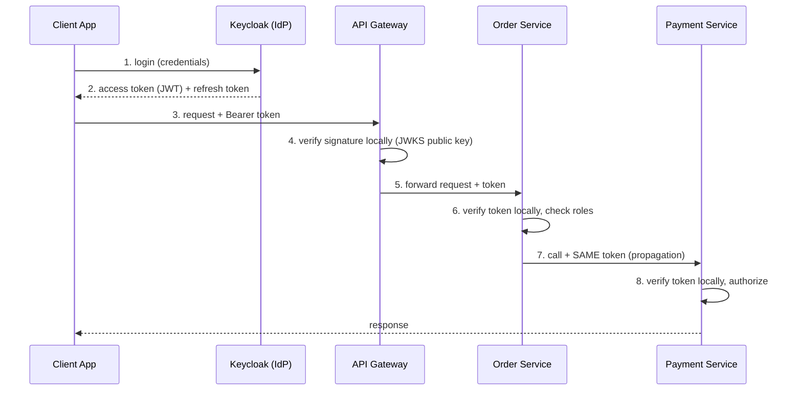
```mermaid
sequenceDiagram
    participant U as Client App
    participant KC as Keycloak (IdP)
    participant GW as API Gateway
    participant OS as Order Service
    participant PS as Payment Service

    U->>KC: 1. login (credentials)
    KC-->>U: 2. access token (JWT) + refresh token
    U->>GW: 3. request + Bearer token
    GW->>GW: 4. verify signature locally (JWKS public key)
    GW->>OS: 5. forward request + token
    OS->>OS: 6. verify token locally, check roles
    OS->>PS: 7. call + SAME token (propagation)
    PS->>PS: 8. verify token locally, authorize
    PS-->>U: response
```

Line-by-line:

- **1–2:** authentication happens *once*, centrally, at Keycloak. Only Keycloak handles credentials.
- **4, 6, 8:** every service verifies the token **locally** (`verify signature locally`) — no callbacks to Keycloak on the hot path. This is what makes it scale.
- **7 (`SAME token`):** token propagation carries identity through the chain. Payment trusts the request because the token's signature proves it came from an authenticated user via the trusted IdP.
- Notice Keycloak is involved only at login/refresh, **not** on every request — it's not a per-request bottleneck.

### Step 7 — Spring Boot Implementation

A resource server (any microservice) validating JWTs:

```yaml
spring:
  security:
    oauth2:
      resourceserver:
        jwt:
          # Spring fetches the public keys (JWKS) from here ONCE and caches them,
          # then validates every token locally — no per-request IdP call.
          issuer-uri: https://keycloak.bank.com/realms/bank
```

```java
@Configuration
@EnableMethodSecurity            // enable @PreAuthorize on methods
public class SecurityConfig {

    @Bean
    SecurityFilterChain chain(HttpSecurity http) throws Exception {
        http
          .authorizeHttpRequests(auth -> auth
              .requestMatchers("/actuator/health").permitAll()
              .anyRequest().authenticated())          // AuthN: must have valid token
          .oauth2ResourceServer(o -> o.jwt(jwt ->
              jwt.jwtAuthenticationConverter(rolesConverter())));  // map claims->roles
        return http.build();
    }
}

@RestController
class PaymentController {

    @PostMapping("/payments")
    @PreAuthorize("hasRole('PAYMENT_WRITE')")     // AuthZ: claim-based
    public PaymentResult pay(@RequestBody TransferCmd cmd,
                             @AuthenticationPrincipal Jwt jwt) {
        String userId = jwt.getSubject();          // identity from the token's 'sub'
        return service.transfer(userId, cmd);
    }
}
```

Token **propagation** when Order calls Payment via Feign — forward the incoming bearer token:

```java
@Component
class BearerTokenForwarder implements RequestInterceptor {  // Feign interceptor
    @Override public void apply(RequestTemplate template) {
        Authentication auth = SecurityContextHolder.getContext().getAuthentication();
        if (auth instanceof JwtAuthenticationToken jwtAuth) {
            template.header("Authorization",
                "Bearer " + jwtAuth.getToken().getTokenValue());  // propagate SAME token
        }
    }
}
```

The essential lines: `issuer-uri` lets Spring fetch and cache the IdP's public keys and validate tokens **locally**; `@PreAuthorize("hasRole(...)")` enforces authorization from token claims; and the Feign interceptor **propagates the token** so identity flows to the next service.

### Step 8 — Common Mistakes

- **Storing secrets/PII in JWT payloads.** The payload is readable by anyone (just Base64). Never put passwords, card numbers, or sensitive data in it.
- **Long-lived access tokens.** A stolen token is valid until it expires and JWTs are hard to revoke. Keep access tokens short (minutes) and use refresh tokens.
- **No HTTPS.** Tokens are bearer credentials — over plain HTTP they can be sniffed and replayed. Always TLS.
- **Each service calling the IdP to validate every token (introspection on the hot path).** This recreates the central-bottleneck problem. Prefer local JWT validation; reserve introspection for high-sensitivity revocation checks.
- **Not validating `iss`/`aud`/`exp`.** Accepting any signed token, or tokens meant for another audience, opens attacks. Validate all standard claims.
- **Forgetting token propagation** — internal calls fail authorization or, worse, services disable auth for internal calls ("trust the network"), which is how breaches spread laterally. Use zero-trust: verify tokens even internally.
- **Trusting the gateway alone.** If services skip validation because "the gateway checked it," anyone who reaches a service directly (misconfig, internal threat) bypasses security. Defense in depth: validate at every service.
- **Mixing up AuthN and AuthZ** — a valid token (authenticated) doesn't mean the user is *allowed* (authorized). Enforce both.

### Step 9 — Debugging Perspective

- **401 Unauthorized** → token missing, expired, malformed, or signature invalid (often: wrong issuer, clock skew making `exp` fail, or rotated signing keys the service hasn't refreshed). Decode the JWT (jwt.io) to inspect claims and expiry.
- **403 Forbidden** → authenticated but lacking the required role/scope → check the token's `roles`/`scopes` claims vs the endpoint's requirement.
- **Intermittent 401s after a deploy** → signing key rotation; services need to refresh JWKS.
- **Auth failures only on internal calls** → token propagation is broken (interceptor not applied, token not forwarded).
- **Clock skew** between services and the IdP causes spurious expiry failures → sync clocks (NTP) and allow a small leeway.
- Logs should record the `sub` and a correlation id (never the raw token) so you can trace *who* did *what* across services (ties into Audit Logging, Part 14).

### Step 10 — Summary

- **What you learned:** The Access Token pattern centralizes authentication at an identity provider that issues short-lived, signed JWTs; services verify them locally (no central lookup) and propagate them across calls so identity flows through the whole chain. JWTs carry both identity (AuthN) and permissions (AuthZ).
- **Why it matters:** It provides scalable, stateless, decentralized security — every service can independently verify "who is this and what may they do" without a bottleneck — which is exactly what distributed systems need.
- **When to use it:** Essentially all microservice systems with authenticated users; it's the de facto standard (OAuth2/OIDC + JWT + Keycloak/Okta/etc.).
- **When not to use it / cautions:** For extremely high-sensitivity, instantly-revocable scenarios, pure stateless JWTs may need augmenting (short expiry + introspection/revocation lists). Don't hand-roll crypto or token logic — use battle-tested IdPs and Spring Security. Adopt **zero-trust**: validate at every hop, always over HTTPS.

**Mental model:** *each request carries a tamper-proof passport. Every service is a border officer who can verify the passport on the spot using a published public key, and stamps it onward to the next border. The identity provider is the passport office — visited once at login, not at every border.*

---

# Part 8 — Cross-Cutting Concerns

## Chapter 8.1 — Externalized Configuration

### Step 1 — Problem Statement

A junior developer hardcodes the database URL, the Kafka broker address, and the third-party API key directly in `application.properties`, committed to git. It works on their laptop. Then reality intrudes:

- **The same code must run in dev, test, staging, and production** — each with *different* database URLs, broker addresses, credentials, and feature flags. With config baked into the artifact, you'd need a different build per environment. That breaks the cardinal rule: **build once, deploy anywhere.** The exact binary you tested in staging must be the one that runs in production; only its configuration should differ.
- **Secrets in git** (passwords, API keys, signing keys) are a severe security incident — anyone with repo access (or a leaked repo) gets the keys to production.
- **Changing config requires a rebuild and redeploy.** Want to flip a feature flag or change a timeout? With baked-in config, that's a full release cycle — slow and risky.
- **Across 25 services, config sprawls.** Common settings (the Kafka address, logging format) are copy-pasted into 25 repos; changing one means 25 edits and 25 deploys.

The problem: **configuration must be separated from code so the same artifact runs everywhere, secrets stay out of source control, and config can change without rebuilding.**

### Step 2 — Intuition

Treat configuration as something **injected into the application at runtime from its environment**, not something compiled into it. The application asks, at startup (or dynamically), "what's my database URL? what's my secret?" and the *environment* answers — differently in dev vs prod. The code is identical everywhere; the environment supplies the differences.

The intuition: **code is the constant; configuration is the variable supplied from outside.** This is one of the famous *Twelve-Factor App* principles ("store config in the environment").

### Step 3 — Real-World Analogy

Think of a **universal power adapter on a laptop charger.** The laptop (your code) is the same everywhere in the world. But the wall socket (the environment) differs by country — different voltage, different plug shape. You don't rebuild the laptop for each country; you supply the right adapter and the right wall voltage *externally*. Externalized configuration is the wall socket: the same appliance plugs into different environments, each providing its own power.

Another: a **theatre production with the same script** (code) performed in different venues. The script is fixed, but the venue-specific details — stage dimensions, local crew contacts, lighting rig addresses (config) — come from a venue-specific binder handed to the touring crew. Same show, different venue settings.

### Step 4 — Internal Mechanics

There's a hierarchy of approaches, often combined:

**1. Environment variables** — the simplest, twelve-factor default. The orchestrator (Docker/Kubernetes) injects env vars; Spring Boot maps them automatically (`SPRING_DATASOURCE_URL` → `spring.datasource.url`). Great for simple cases and the lowest common denominator.

**2. Kubernetes ConfigMaps & Secrets** — when running on Kubernetes:
- **ConfigMap:** non-sensitive config (URLs, flags), mounted as env vars or files.
- **Secret:** sensitive config (passwords, keys), base64-encoded and (with proper setup) encrypted at rest, access-controlled via RBAC. Kept separate from ConfigMaps precisely because secrets need stricter handling.

**3. Spring Cloud Config Server** — a **centralized configuration service**. A dedicated server reads config from a backend (commonly a git repo, or Vault for secrets) and serves it to all microservices at startup. Benefits:
- **Single source of truth** for shared config; change once, all services pick it up.
- **Versioned** (git history of every config change — auditable, revertable).
- **Per-environment profiles** (`application-prod.yml`, `service-a-dev.yml`).
- **Dynamic refresh:** with Spring Cloud Bus + `@RefreshScope`, services can reload config *without restart* — flip a flag live.

**4. Dedicated secret managers** — HashiCorp **Vault**, AWS Secrets Manager, etc., for secrets with rotation, leasing, and audit. Often integrated *behind* Config Server or via Kubernetes.

**Communication flow (Config Server):** at startup a service contacts the Config Server, identifies itself (`spring.application.name`) and its profile (`spring.profiles.active`), and receives its merged configuration before the rest of the context initializes.

**Failure handling:** the Config Server is a startup dependency — if it's down, services can't start (mitigate with retries, a local fallback/cache, and HA Config Server instances). This is a real trade-off of centralization.

### Step 5 — Step-by-Step Flow

1. Ops stores config in a git repo: `payment-service-prod.yml` with the prod DB URL; secrets in Vault.
2. The Config Server is configured to read that git repo (and Vault).
3. The Payment Service starts in production with `SPRING_PROFILES_ACTIVE=prod` and `spring.application.name=payment-service`.
4. Before initializing beans, it calls the Config Server: "give me config for `payment-service`, profile `prod`."
5. Config Server merges `application.yml` (global) + `payment-service.yml` + `payment-service-prod.yml`, pulls secrets from Vault, and returns the result.
6. The service initializes with prod config — the *same artifact* would get dev config if started with `prod`→`dev`.
7. Later, ops edits a timeout in git and triggers a refresh event (Spring Cloud Bus); `@RefreshScope` beans reload the new value with **no redeploy**.

### Step 6 — Architecture Diagram

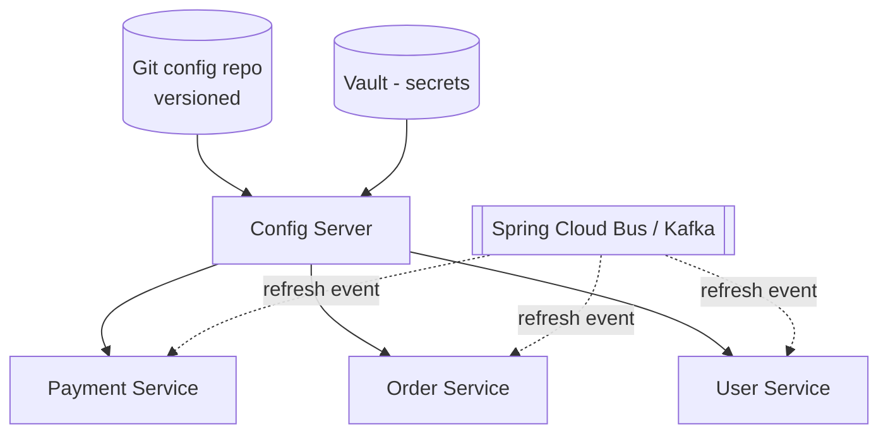
```mermaid
graph TD
    GIT[(Git config repo<br/>versioned)] --> CS[Config Server]
    VAULT[(Vault - secrets)] --> CS
    CS --> PS[Payment Service]
    CS --> OS[Order Service]
    CS --> US[User Service]
    BUS[[Spring Cloud Bus / Kafka]] -.refresh event.-> PS
    BUS -.refresh event.-> OS
    BUS -.refresh event.-> US
```

Line-by-line:

- **`GIT --> CS`, `VAULT --> CS`**: the Config Server's *backends* — versioned git for normal config, Vault for secrets (separated by sensitivity).
- **`CS --> PS/OS/US`**: every service fetches its config from the central server at startup — one source of truth.
- **`BUS -.refresh event.-> ...`** (dotted): a refresh event broadcast over the bus tells services to reload config live, without restarting.

### Step 7 — Spring Boot Implementation

Config Server:

```java
@SpringBootApplication
@EnableConfigServer          // turns this app into a Config Server
public class ConfigServerApp { public static void main(String[] a){ SpringApplication.run(ConfigServerApp.class,a);} }
```

```yaml
# config-server application.yml
spring:
  cloud:
    config:
      server:
        git:
          uri: https://git.bank.com/ops/microservice-config
          search-paths: '{application}'   # folder per service
```

A client service pointing at it:

```yaml
# payment-service — bootstrap config: where to GET the rest of my config
spring:
  application:
    name: payment-service        # identifies which config to fetch
  config:
    import: optional:configserver:http://config-server:8888
  profiles:
    active: ${SPRING_PROFILES_ACTIVE:dev}   # env-supplied; same artifact, diff env
```

Dynamic refresh of a value without restart:

```java
@RestController
@RefreshScope                    // beans re-created on refresh → pick up new config
class FeatureController {
    @Value("${features.new-checkout:false}")
    private boolean newCheckout;     // can change live via a refresh event
}
```

And the twelve-factor baseline — env vars override everything, perfect for secrets in Kubernetes:

```yaml
# k8s deployment snippet
env:
  - name: SPRING_DATASOURCE_PASSWORD
    valueFrom:
      secretKeyRef: { name: payment-db, key: password }   # from a K8s Secret
```

The key ideas: `spring.application.name` + active profile select the right config; `optional:configserver:` makes the service fetch config centrally; `@RefreshScope` enables live reloads; and Kubernetes Secrets/env vars keep credentials out of code and out of git.

### Step 8 — Common Mistakes

- **Secrets in git / in the image.** The classic breach. Use Secrets/Vault; never commit credentials.
- **Different builds per environment.** Defeats "build once." The artifact must be identical; only config differs.
- **No HA for the Config Server.** It becomes a single point of failure that blocks *all* service startups. Run multiple instances; cache/fallback locally.
- **Putting everything in central config**, including truly service-local settings, creating needless coupling. Keep service-specific defaults in the service; centralize the shared/environment-specific bits.
- **No audit/versioning for config changes.** A bad timeout pushed to prod with no history is hard to revert and blame. Git-backed config gives you both.
- **Refreshing config that beans cached at startup** without `@RefreshScope` — the new value silently doesn't take effect.

### Step 9 — Debugging Perspective

- **"Works in dev, breaks in prod"** is very often a *config* difference — diff the effective config across environments first.
- Spring Actuator's `/actuator/env` and `/actuator/configprops` show the *effective* resolved configuration and its source (which property won) — invaluable for "why is this value not what I set?"
- **Service won't start** → check the Config Server is reachable and returning config (a startup-dependency failure).
- **A config change didn't take effect** → check whether a refresh was triggered and whether the bean is `@RefreshScope`.
- **Secret-related auth failures** → verify the secret was injected (env present?) and not stale/rotated.

### Step 10 — Summary

- **What you learned:** Externalized configuration separates config from code so the *same artifact* runs in every environment, secrets stay out of source control, and config can change (sometimes live) without rebuilding — via env vars, Kubernetes ConfigMaps/Secrets, Spring Cloud Config Server, and Vault.
- **Why it matters:** It enables "build once, deploy anywhere," secure secret handling, auditable change management, and fast config changes — foundational operational hygiene.
- **When to use it:** Always. Even a single service benefits; across many services it's essential.
- **When not to use it / cautions:** Centralized config (Config Server) adds a startup dependency — make it HA. For simple setups, env vars/ConfigMaps may be enough without a full Config Server.

---

## Chapter 8.2 — Microservice Chassis

### Step 1 — Problem Statement

You're about to create your 12th microservice. Each of the previous 11 needed the *same* cross-cutting plumbing before it could do anything useful: structured logging with correlation IDs, metrics export to Prometheus, distributed tracing, health checks, security/JWT validation, centralized config, standardized error handling, and graceful shutdown. So far, each team has hand-rolled this — and the results diverge: Team A logs in JSON, Team B in plain text; Team C exposes metrics, Team D forgot; Team E's error responses look nothing like Team F's.

The problems:

- **Massive duplication.** The same ~2,000 lines of boilerplate copy-pasted into every service.
- **Inconsistency.** Logs, metrics, error formats, and health checks differ per service, making cross-service observability and operations painful (your log aggregator can't parse 5 different formats; your dashboards need 5 different queries).
- **Slow service creation.** Standing up a *new* service takes days of plumbing before any business value.
- **Drift and bugs.** Each copy diverges; a fix to the tracing setup must be applied 11 times, and inevitably some are missed.

The problem: **how do we give every service consistent, correct cross-cutting infrastructure without re-implementing it each time?**

### Step 2 — Intuition

Build the common plumbing **once**, as a reusable foundation, and have every service start from it. A new service should inherit logging, metrics, tracing, health checks, security, config, and error handling "for free," and immediately focus on business logic. Improvements to the plumbing are made in one place and propagate to all services.

The intuition: **factor out everything that isn't business logic into a shared chassis, so each service is "chassis + its unique business code."**

### Step 3 — Real-World Analogy

The name comes from **automobile manufacturing.** A car **chassis** is the common base frame — wheels, engine mounts, suspension, electrical system, steering. Manufacturers build many different car models (sedan, SUV, coupe) *on the same chassis platform*. They don't reinvent the suspension for every model; they reuse the proven platform and add the model-specific body and features on top. A microservice chassis is the same: a proven base platform (observability, security, config) on which you build many different services, adding only the business-specific "body."

### Step 4 — Internal Mechanics

A chassis is typically delivered as a **shared library / parent dependency** (a Maven/Gradle artifact, e.g., a Spring Boot **starter**, or a service **template/scaffold**). It bundles and auto-configures:

- **Logging:** structured (JSON) logging, with correlation/trace IDs automatically included (MDC), shipped to the log aggregator (Part 14).
- **Metrics:** Micrometer wired to Prometheus, with standard tags (`service`, `env`), default JVM/HTTP metrics.
- **Distributed tracing:** Micrometer Tracing / OpenTelemetry auto-instrumentation, trace context propagation across HTTP and Kafka.
- **Health checks:** Spring Actuator liveness/readiness endpoints (Part 14).
- **Security:** default JWT resource-server config (Part 7).
- **Configuration:** Spring Cloud Config client wiring (Chapter 8.1).
- **Error handling:** a standard `@RestControllerAdvice` producing a consistent error response shape (e.g., RFC 7807 Problem Details) across all services.
- **Resilience defaults:** Resilience4j conventions, sensible timeouts.
- **Graceful shutdown, CORS, common interceptors.**

**Two delivery styles, an important nuance:**
- **Shared library/starter:** maximum reuse, but creates a *coupling* — all services depend on the chassis version, and a bad chassis release can affect everyone. Manage with semantic versioning and gradual rollout.
- **Service template/scaffold:** generate a new service from a template; each service *copies* the setup (less coupling, but improvements don't auto-propagate).
- The modern middle path is the **service mesh** (Part 15) for *language-agnostic* cross-cutting concerns (mTLS, retries, tracing at the network layer) combined with a thin chassis library for app-level concerns. A mesh lets polyglot teams (Java + Go + Python) share infrastructure behavior without sharing a Java library.

### Step 5 — Step-by-Step Flow (creating service #13)

1. Developer generates a new service from the template *or* adds the chassis starter dependency.
2. On startup, the chassis auto-configures logging (JSON + trace IDs), metrics (Prometheus endpoint), tracing, health checks, security, and config-client — with zero extra code.
3. The developer writes only the business logic (controllers, domain, repositories).
4. The service immediately appears in dashboards, log aggregation, and tracing — consistently with all other services — and exposes `/actuator/health` for orchestration.
5. Months later, the platform team improves tracing in the chassis; bumping the chassis version in each service pulls in the improvement uniformly.

### Step 6 — Architecture Diagram

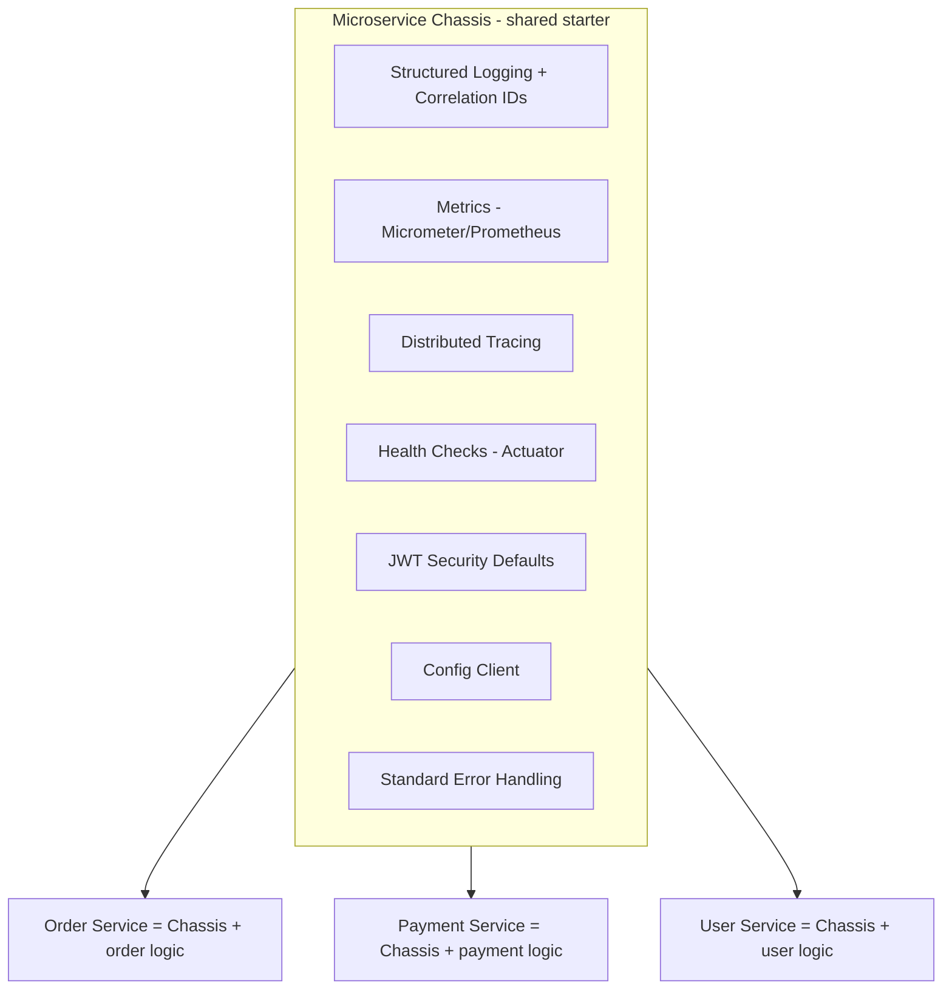
```mermaid
graph TD
    subgraph Chassis[Microservice Chassis - shared starter]
      LOG[Structured Logging + Correlation IDs]
      MET[Metrics - Micrometer/Prometheus]
      TRC[Distributed Tracing]
      HLT[Health Checks - Actuator]
      SEC[JWT Security Defaults]
      CFG[Config Client]
      ERR[Standard Error Handling]
    end

    Chassis --> S1[Order Service = Chassis + order logic]
    Chassis --> S2[Payment Service = Chassis + payment logic]
    Chassis --> S3[User Service = Chassis + user logic]
```

Line-by-line: the **Chassis** box bundles all the cross-cutting concerns once; each service (`S1/S2/S3`) is literally "**Chassis + its unique business logic**." The arrows show inheritance/reuse — every service gets the same proven plumbing, ensuring consistency and fast creation.

### Step 7 — Spring Boot Implementation

A chassis as a custom Spring Boot **auto-configuration starter**. The shared library provides an auto-config:

```java
// in the chassis library: chassis-spring-boot-starter
@AutoConfiguration
public class ChassisAutoConfiguration {

    @Bean   // consistent error responses across ALL services
    @ConditionalOnMissingBean
    GlobalExceptionHandler globalExceptionHandler() {
        return new GlobalExceptionHandler();
    }

    @Bean   // standard correlation-id filter for logs + tracing
    @ConditionalOnMissingBean
    CorrelationIdFilter correlationIdFilter() {
        return new CorrelationIdFilter();
    }
    // ... metrics tags, tracing config, security defaults, etc.
}
```

```
# src/main/resources/META-INF/spring/org.springframework.boot.autoconfigure.AutoConfiguration.imports
com.bank.chassis.ChassisAutoConfiguration
```

A standardized error handler every service inherits (consistent error shape):

```java
@RestControllerAdvice
public class GlobalExceptionHandler {
    @ExceptionHandler(Exception.class)
    public ProblemDetail handle(Exception ex, HttpServletRequest req) {
        ProblemDetail pd = ProblemDetail.forStatusAndDetail(
            HttpStatus.INTERNAL_SERVER_ERROR, ex.getMessage());
        pd.setProperty("traceId", MDC.get("traceId"));   // link error to a trace
        return pd;   // every service returns errors in this same shape
    }
}
```

Then a new service just adds the dependency:

```xml
<dependency>
  <groupId>com.bank</groupId>
  <artifactId>chassis-spring-boot-starter</artifactId>
  <version>2.4.1</version>   <!-- versioned; rollout managed -->
</dependency>
```

The key idea: `@AutoConfiguration` + the `AutoConfiguration.imports` file make the chassis behavior activate automatically just by being on the classpath. `@ConditionalOnMissingBean` lets a service override a default when it truly needs to. Every service now emits identical error shapes, correlation IDs, metrics, and tracing — for free.

### Step 8 — Common Mistakes

- **Putting business logic in the chassis.** The chassis is *infrastructure only*. Domain logic in a shared library couples all services and turns the chassis into a distributed monolith.
- **A monolithic, all-or-nothing chassis.** If it's too rigid, services can't opt out of pieces they don't need. Use conditional configuration and modular starters.
- **Versioning chaos.** A breaking chassis change forces every team to upgrade at once. Use semantic versioning, deprecation cycles, and gradual rollout.
- **The chassis becomes a bottleneck team.** If every change must go through one central team, you've recreated coordination hell. Make it well-documented and contributable.
- **Ignoring polyglot reality.** A Java-only chassis doesn't help Go/Python services. For polyglot shops, push language-agnostic concerns to a service mesh (Part 15).
- **Over-engineering the chassis before you have enough services** to know what's truly common. Extract it once duplication is real.

### Step 9 — Debugging Perspective

- A good chassis makes debugging *easier across the board*: because every service logs, traces, and reports errors *identically*, your aggregation, dashboards, and trace tools "just work" uniformly — you don't fight five different formats.
- **A bug in the chassis affects all services simultaneously** — a sudden cross-service regression right after a chassis upgrade points straight at the chassis version. (This is the flip side of reuse; check chassis version changes early in such incidents.)
- Consistent correlation IDs and error shapes (from the chassis) are exactly what make distributed debugging (Part 19) tractable.

### Step 10 — Summary

- **What you learned:** A microservice chassis is a reusable foundation (shared starter/template, often complemented by a service mesh) that provides consistent cross-cutting infrastructure — logging, metrics, tracing, health checks, security, config, error handling — so each service is "chassis + business logic."
- **Why it matters:** It eliminates duplication, enforces consistency (crucial for observability and operations at scale), and lets teams stand up new services in minutes focused on business value.
- **When to use it:** Once you have several services and the cross-cutting boilerplate is being duplicated. Pair an app-level chassis with a service mesh in polyglot environments.
- **When not to use it / cautions:** Don't over-build it prematurely or stuff business logic into it; manage its versioning carefully so it doesn't become a coupling point or a bottleneck team.

**Mental model for Part 8:** *configuration comes from the environment, not the code; and the boring-but-essential infrastructure every service needs comes from a shared chassis, not copy-paste. Both exist to keep services consistent and changeable without friction.*

---

# Part 9 — Service Discovery Patterns

### Step 1 — Problem Statement (the whole part)

The Order Service needs to call the Payment Service. In the old world, you'd hardcode `http://192.168.1.50:8080`. In the cloud-native world, this is hopeless:

- The Payment Service runs as **many instances** (for scale and HA), each with a different IP and port. Which one does Order call?
- Instances are **ephemeral**: they start, stop, crash, and get rescheduled constantly. Autoscaling adds 10 instances at noon and removes them at 2pm. IPs change every deploy (recall fallacy #5 — topology changes).
- A **dead instance** must not receive traffic; a **new instance** must start receiving it automatically.

Hardcoding addresses, or even using static load-balancer config, can't keep up with this churn. The problem: **how does a service find the current, healthy network locations of another service in a world where those locations change constantly?**

The answer is a **service registry** — a live "phone book" of services and their healthy instances — plus a discovery mechanism. There are four patterns describing *who* registers and *who* looks up, which we'll cover together because they're variations on one idea.

### Step 2 — Intuition

Maintain a constantly-updated directory: every service instance, when it starts, **announces itself** ("I'm a Payment Service instance at 10.0.3.7:8080, and I'm healthy"). When it dies or becomes unhealthy, it's **removed**. Anyone who wants to call Payment **asks the directory** for current healthy instances and picks one. The directory is kept fresh by health checks.

The intuition: **don't hardcode addresses — ask a live directory that always knows who's up right now.**

### Step 3 — Real-World Analogy

A **large hospital's central switchboard / on-call directory.** Doctors rotate shifts constantly; you never memorize a specific doctor's pager number. Instead you call the switchboard: "I need the on-call cardiologist." The switchboard knows who's *currently* on duty and connects you. When a doctor starts their shift, they register with the switchboard; when they leave, they're removed. You always reach a *currently available* doctor without knowing names or numbers in advance. The service registry is the switchboard; health checks are the "are you on duty?" confirmation.

### Step 4 — Internal Mechanics: the four patterns

First, two **registration** patterns (how instances get into the registry):

**1. Self-Registration.** Each service instance registers *itself* with the registry on startup and sends periodic **heartbeats** to stay listed; it deregisters on shutdown. The service contains registry-client code. (Example: a Spring Boot app using the Eureka client.)
- *Pro:* simple, service knows its own state. *Con:* couples the service to the registry; every service (in every language) needs the client logic.

**2. Third-Party Registration.** A separate component (a **registrar**) watches services and registers/deregisters them on their behalf — the service itself knows nothing about the registry. (Example: Kubernetes does this — the platform registers pods; the app code is registry-agnostic.)
- *Pro:* services stay clean and registry-agnostic; great for polyglot. *Con:* another moving part (the registrar/platform) to operate.

Then two **discovery** patterns (how a caller finds an instance):

**3. Client-Side Discovery.** The *client* queries the registry, gets the list of healthy instances, and **chooses one itself** (it runs the load-balancing logic). (Example: Spring Cloud + Eureka + Spring Cloud LoadBalancer — the Order Service asks Eureka and load-balances locally.)
- *Pro:* fewer network hops (no separate LB), client can be smart about choice. *Con:* load-balancing logic lives in every client (and every language); couples clients to the registry.

**4. Server-Side Discovery.** The client just calls a **stable address** (a load balancer / router / DNS name); that intermediary queries the registry and routes to a healthy instance. The client knows nothing about the registry. (Example: Kubernetes Services — call `payment-service`, and kube-proxy/DNS routes to a healthy pod; or an API gateway / cloud load balancer.)
- *Pro:* clients are simple and registry-agnostic (just call a name); language-agnostic; centralizes load-balancing. *Con:* the load balancer is an extra hop and must itself be HA.

**The big picture:** modern systems increasingly use **Kubernetes**, which gives you **third-party registration + server-side discovery** out of the box (the platform registers pods; you call a Service name and it routes). The classic **Eureka** stack gives you **self-registration + client-side discovery** (popular in Spring Cloud apps not on Kubernetes). **Consul** can do both styles and adds a rich key/value store and health checking, often used in mixed/VM environments.

**Health checking** is the glue for all four: the registry must know which instances are *healthy*, not just registered. Unhealthy instances are removed so callers never route to them (ties into Health Check API, Part 14).

### Step 5 — Step-by-Step Flow

*Client-side discovery with Eureka (self-registration):*
1. Payment instance starts, registers with Eureka: "payment-service @ 10.0.3.7:8080."
2. It sends heartbeats every 30s; Eureka keeps it listed while healthy.
3. Order Service (Eureka client) fetches and caches the registry: "payment-service has instances [10.0.3.7, 10.0.3.8]."
4. Order load-balances locally, picks 10.0.3.7, and calls it directly.
5. 10.0.3.7 crashes; heartbeats stop; Eureka evicts it. Order's cache refreshes; it stops routing there.

*Server-side discovery with Kubernetes (third-party registration):*
1. Payment pods start; **Kubernetes** registers them as endpoints of the `payment-service` Service (app code does nothing).
2. Readiness probes determine which pods are healthy endpoints.
3. Order calls the stable DNS name `http://payment-service`.
4. Kubernetes (kube-proxy/DNS) routes the call to a healthy Payment pod, load-balancing automatically.
5. A pod fails its readiness probe → removed from endpoints → no traffic, automatically.

### Step 6 — Architecture Diagram

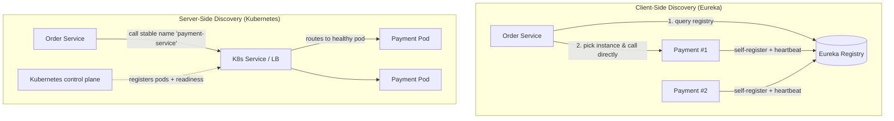
```mermaid
graph TD
    subgraph "Client-Side Discovery (Eureka)"
      O1[Order Service] -->|1. query registry| EUR[(Eureka Registry)]
      P1a[Payment #1] -->|self-register + heartbeat| EUR
      P1b[Payment #2] -->|self-register + heartbeat| EUR
      O1 -->|2. pick instance & call directly| P1a
    end

    subgraph "Server-Side Discovery (Kubernetes)"
      O2[Order Service] -->|call stable name 'payment-service'| SVC[K8s Service / LB]
      SVC -->|routes to healthy pod| P2a[Payment Pod]
      SVC --> P2b[Payment Pod]
      KUBE[Kubernetes control plane] -.registers pods + readiness.-> SVC
    end
```

Line-by-line:

- **Top subgraph (client-side):** Payment instances *self-register* with Eureka; Order *queries* Eureka and *chooses + calls* an instance directly. The load-balancing intelligence is in Order.
- **Bottom subgraph (server-side):** Order just calls the stable name; the K8s Service routes. The **control plane** registers pods (third-party registration, dotted) based on readiness — the app does nothing.
- Contrast the two: in client-side, the caller is smart and registry-aware; in server-side, the caller is dumb and the platform is smart.

### Step 7 — Spring Boot Implementation

Eureka server:

```java
@SpringBootApplication
@EnableEurekaServer
public class RegistryApp { /* main */ }
```

A self-registering client that also does client-side discovery (note: `@EnableEurekaClient` is implicit with the dependency on the classpath):

```yaml
# payment-service
spring:
  application:
    name: payment-service        # the name it registers under
eureka:
  client:
    service-url:
      defaultZone: http://registry:8761/eureka/
  instance:
    lease-renewal-interval-in-seconds: 30   # heartbeat interval
```

Calling by *logical name* (discovery + client-side load balancing) via Feign or a load-balanced RestClient:

```java
@FeignClient(name = "payment-service")   // resolved via the registry; load-balanced
public interface PaymentClient {
    @PostMapping("/payments")
    PaymentResult pay(@RequestBody TransferCmd cmd);
}
```

On Kubernetes (server-side discovery), you don't need Eureka at all — just call the Service name:

```java
// application.yml
clients:
  payment:
    url: http://payment-service       # K8s DNS resolves & load-balances
```

The key idea: in both cases your code references a **logical service name**, never a hardcoded IP. The difference is *who* resolves that name to a healthy instance — a client library querying a registry (Eureka) or the platform (Kubernetes).

### Step 8 — Common Mistakes

- **Hardcoding IPs/ports** — the original sin discovery exists to prevent.
- **No health checks / shallow health checks** — registering an instance that's up but broken (e.g., DB connection dead) sends traffic into a black hole. Health checks must reflect real readiness (Part 14).
- **Stale client caches** — client-side discovery caches the registry; too-long refresh intervals route to dead instances. Tune heartbeat/eviction/refresh timings.
- **Running Eureka *and* Kubernetes discovery together** redundantly — on K8s, the platform already does discovery; adding Eureka is usually duplicate complexity. Pick the model that matches your platform.
- **Registry as a single point of failure** — run the registry in HA (Eureka peer replication; K8s control plane is already HA).
- **Long deregistration delays** — a crashed instance lingering in the registry causes failed calls until eviction. Combine with circuit breakers/retries to ride out the gap.

### Step 9 — Debugging Perspective

- **"Connection refused / no instances available"** → check the registry: is the target service registered? Are instances healthy? Did they deregister?
- **Traffic to dead instances** → stale caches or slow eviction; check heartbeat/eviction config.
- **Some requests fail, some succeed** → one bad instance still registered (failing health check not catching it); inspect per-instance health.
- The registry's dashboard (Eureka UI) or `kubectl get endpoints` shows the live picture of who's registered and healthy — first stop for discovery issues.
- Circuit breakers (Part 6) and retries mask brief discovery gaps; their metrics can reveal underlying churn.

### Step 10 — Summary

- **What you learned:** Service discovery replaces hardcoded addresses with a live registry of healthy instances. Registration is either **self** (the instance registers itself, e.g., Eureka) or **third-party** (the platform registers it, e.g., Kubernetes). Discovery is either **client-side** (caller queries the registry and load-balances) or **server-side** (caller hits a stable name/LB that routes). Health checks keep the registry honest.
- **Why it matters:** It's what makes elastic, ever-changing, self-healing deployments possible — services find each other automatically as instances come and go.
- **When to use it:** Any dynamic deployment with multiple, changing instances — i.e., essentially all real microservice systems.
- **When not to use it / cautions:** Don't layer redundant discovery (Eureka on top of Kubernetes). On Kubernetes, prefer the built-in third-party + server-side model; off it, Eureka/Consul self-registration + client-side discovery is the classic Spring Cloud choice. Always pair with solid health checks and registry HA.

**Mental model:** *services are people on rotating shifts; the registry is the switchboard that always knows who's currently on duty. You call the role, not the person.*

---

# Part 10 — Transactional Messaging Patterns

This part solves one of the deepest, most underappreciated problems in microservices — the **dual-write problem** — and it's a favorite of senior interviews. We'll build the intuition carefully because everything in Parts 11–13 depends on getting events published *reliably*.

## Chapter 10.1 — The Dual-Write Problem (shared problem statement)

### Step 1 — Problem Statement

The Order Service must do two things when an order is placed: (1) save the order to **its own database**, and (2) publish an `OrderPlaced` event to **Kafka** so other services react. The naive code:

```java
@Transactional
public void placeOrder(Order order) {
    orderRepository.save(order);          // write #1: database
    kafkaTemplate.send("orders", event);  // write #2: Kafka — NOT in the DB transaction!
}
```

This looks fine and works 99% of the time. But it harbors a fatal flaw: **you are writing to two different systems (a database and a message broker) that cannot share a single transaction.** Consider the failure interleavings:

- **Crash after DB commit, before Kafka send:** the order is saved, but the event is *never published*. Inventory is never reserved, payment never charged, customer never notified. The systems are now **permanently inconsistent** — a *lost event*. The order exists in a void.
- **Kafka send succeeds, but the DB transaction rolls back** (e.g., a constraint violation on commit, or you sent before commit): now there's an event for an order that *doesn't exist*. Downstream services act on a *phantom* order — a *ghost event*.
- **Kafka is momentarily down** when you try to send: do you fail the whole order (bad UX) or save-but-not-publish (lost event)?

This is the **dual-write problem**: you cannot atomically update your database *and* publish a message, because they're separate systems with separate transactions, and a crash can happen in the gap between them. And recall from Part 0 — **we deliberately abandoned distributed transactions (2PC)**, so we can't wrap the DB and Kafka in one XA transaction (and even if we could, it's slow and fragile).

The problem: **how do we guarantee that a state change and its corresponding event are published together — all-or-nothing — without a distributed transaction?**

### Step 2 — Intuition (shared)

The trick is to turn two writes into **one write to one system** (the database, which *can* be transactional), and then move the data to the broker *afterwards* by a separate, reliable process.

Specifically: instead of writing to the DB *and* sending to Kafka, write the business data *and the event* **into the same database, in the same local transaction**. The event sits in an "**outbox**" table. Because it's one database transaction, it's atomic: either both the order *and* the event row are saved, or neither is. There's no gap. *Then*, a separate process reads the outbox and publishes the events to Kafka, marking them sent. If that publishing process crashes, it just retries later — the events are safely in the database, waiting.

The intuition: **never write to two systems at once. Write everything to your database atomically, then reliably relay it to the broker.** This is the foundation of the three patterns below.

### Step 3 — Real-World Analogy (shared)

Think of how a **careful office handles outgoing mail.** You don't run to the post office every time you finish writing a letter (writing to two systems in two trips, risking the letter blowing away in between). Instead, you put the finished letter in your **outbox tray** on your desk — *the same moment* you file your copy. The letter and your records are updated together, on your desk, atomically. Then, at set times, the **mail clerk** comes around, collects everything in the outbox tray, takes it to the post office, and marks it sent. If the clerk is sick today, the letters wait safely in the tray — nothing is lost; they go out tomorrow. The outbox tray + mail clerk is exactly the Transactional Outbox + relay.

---

## Chapter 10.2 — The Transactional Outbox Pattern

### Step 4 — Internal Mechanics

Components:

- **Outbox table:** a regular table in the *same database* as your business data. Columns typically: `id`, `aggregate_type`, `aggregate_id`, `event_type`, `payload (JSON)`, `created_at`, `published` (boolean) / `status`.
- **Business transaction:** the service writes its business change *and* inserts the event into the outbox table **in one local ACID transaction**. Atomic — the whole dual-write problem dissolves here.
- **Message relay (the "clerk"):** a separate process that reads unpublished outbox rows, publishes them to Kafka, and marks them published. Two ways to build the relay → the next two patterns (Polling Publisher and Transaction Log Tailing/CDC).
- **Idempotent consumers:** because the relay guarantees *at-least-once* delivery (it might publish, crash before marking published, then republish), consumers must dedupe (Part 0).

Communication/data flow: business write + outbox insert (atomic) → relay reads outbox → publishes to Kafka → marks published → consumers process idempotently.

**Why it works:** the only "dual" action (DB + Kafka) is now split in time and made *recoverable*. The DB write is atomic. The Kafka publish is retried until it succeeds, with the source of truth (the outbox row) safely persisted. A crash anywhere leaves the system recoverable: unpublished rows are simply published later.

### Step 5 — Step-by-Step Flow

1. `placeOrder` begins a DB transaction.
2. It inserts the order row **and** inserts an `OrderPlaced` row into the `outbox` table.
3. The transaction **commits atomically** — order and event are now both durably in the DB, or neither is.
4. The service returns to the caller. (Note: the event isn't in Kafka *yet* — eventual consistency.)
5. The **relay** picks up the new outbox row, publishes `OrderPlaced` to Kafka.
6. The relay marks the outbox row `published = true`.
7. If the relay crashed between 5 and 6, on restart it sees the row still unpublished and republishes → at-least-once → consumers dedupe.

### Step 6 — Architecture Diagram

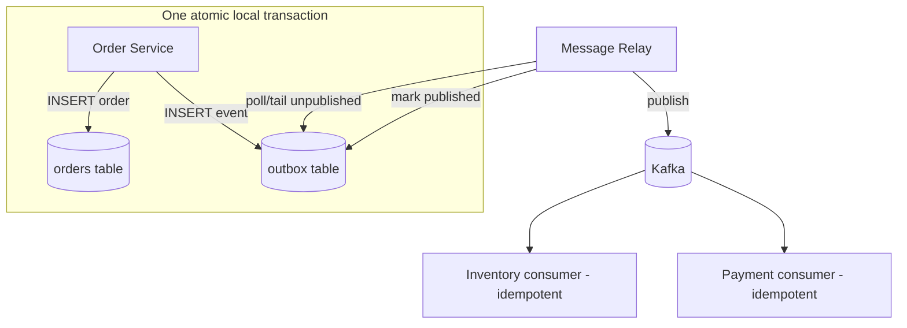
```mermaid
graph TD
    subgraph "One atomic local transaction"
      APP[Order Service] -->|INSERT order| ORD[(orders table)]
      APP -->|INSERT event| OUT[(outbox table)]
    end
    REL[Message Relay] -->|poll/tail unpublished| OUT
    REL -->|publish| K[(Kafka)]
    REL -->|mark published| OUT
    K --> C1[Inventory consumer - idempotent]
    K --> C2[Payment consumer - idempotent]
```

Line-by-line:

- **The transaction subgraph:** the order row *and* the outbox event row are written in the **same DB transaction** — atomic, no gap, no lost/ghost events.
- **`REL --> OUT` (poll/tail):** the relay reads unpublished events from the outbox.
- **`REL --> K`:** it publishes them to Kafka.
- **`REL --> OUT` (mark published):** it marks them done. If it dies before this, it republishes later (at-least-once).
- **`K --> C1/C2`:** consumers are explicitly *idempotent* to absorb the at-least-once duplicates.

### Step 7 — Spring Boot Implementation (PostgreSQL + Kafka)

The atomic write:

```java
@Service
public class OrderService {
    private final OrderRepository orders;
    private final OutboxRepository outbox;
    private final ObjectMapper json;

    @Transactional   // ONE transaction covers BOTH inserts
    public Order placeOrder(CreateOrder cmd) {
        Order order = orders.save(Order.from(cmd));        // business write

        OutboxEvent event = new OutboxEvent(
            UUID.randomUUID(),          // event id (consumers dedupe on this)
            "Order", order.getId().toString(),
            "OrderPlaced",
            toJson(new OrderPlaced(order)),
            Instant.now(), false);       // published = false
        outbox.save(event);              // event write — SAME transaction

        return order;   // both committed atomically, or neither
    }
}
```

The outbox entity and table:

```sql
CREATE TABLE outbox (
    id          UUID PRIMARY KEY,
    aggregate_type TEXT NOT NULL,
    aggregate_id   TEXT NOT NULL,
    event_type     TEXT NOT NULL,
    payload        JSONB NOT NULL,
    created_at     TIMESTAMPTZ NOT NULL,
    published      BOOLEAN NOT NULL DEFAULT false
);
CREATE INDEX idx_outbox_unpublished ON outbox (created_at) WHERE published = false;
```

The most important line is `@Transactional` wrapping *both* `orders.save` and `outbox.save`. That single transaction is what makes the state change and the event atomic — the entire point of the pattern. The relay is built in the next two chapters.

### Step 8 — Common Mistakes

- **Sending to Kafka inside the business transaction anyway** (the original bug) — defeats the purpose. The outbox must replace the direct send.
- **Forgetting consumer idempotency** — the relay is at-least-once; non-idempotent consumers double-process.
- **Not cleaning up the outbox table** — it grows forever. Periodically delete published rows (or partition/archive). Unbounded growth slows the DB.
- **Ordering issues** — if event order matters, publish per-aggregate in order (use `aggregate_id` as the Kafka key) and have the relay preserve order per aggregate.
- **Relay reads uncommitted/locked rows** — ensure the relay reads only committed rows (the polling query naturally does; CDC reads the committed log).
- **Two relays double-publishing** — coordinate relay instances (leader election or partitioned ownership) or rely on consumer idempotency to absorb it.

### Step 9 — Debugging Perspective

- **Events "disappear"** → check the outbox table: are rows being inserted (then the business write works) but never marked published (then the relay is broken/stopped)? This *localizes* the failure precisely — a huge benefit over the naive dual-write where you'd have no record.
- **Growing count of `published = false` rows** → the relay is down or failing; alert on this (it's your lost-event early warning).
- **Duplicate downstream effects** → consumer idempotency gap.
- The outbox table is itself a great **audit/debug log** of "what events *should* have been published," letting you replay or reconcile.

### Step 10 — Summary

- **What you learned:** The Transactional Outbox solves the dual-write problem by writing the business change and the event to the same database in one atomic transaction (into an outbox table), then relaying events to the broker separately and reliably.
- **Why it matters:** It guarantees no lost or ghost events without distributed transactions — the bedrock of reliable event-driven microservices.
- **When to use it:** Whenever a service must update its state *and* publish an event/message reliably (which is most event-driven services).
- **When not to use it:** If you don't publish events, or can tolerate occasional lost events (rare in serious systems). Always pair with idempotent consumers.

---

## Chapter 10.3 — Polling Publisher

### Step 1–4 — Problem, Intuition, Mechanics

The outbox needs a relay. The **Polling Publisher** is the simplest relay: a scheduled job that periodically **queries the outbox table** for unpublished rows, publishes them to Kafka, and marks them published. "The mail clerk walks to the outbox tray every 5 seconds and takes whatever's there."

Mechanics: a background scheduler (e.g., Spring `@Scheduled`) runs every N hundred milliseconds/seconds: `SELECT ... WHERE published = false ORDER BY created_at LIMIT batch FOR UPDATE SKIP LOCKED`, publish each, set `published = true`. `FOR UPDATE SKIP LOCKED` lets multiple relay instances poll concurrently without stepping on each other.

### Step 5–7 — Flow, Diagram, Implementation

Flow: timer fires → query unpublished → publish each to Kafka → mark published → commit → sleep → repeat.

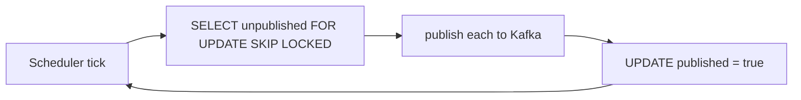
```mermaid
graph LR
    T[Scheduler tick] --> Q[SELECT unpublished FOR UPDATE SKIP LOCKED]
    Q --> PUB[publish each to Kafka]
    PUB --> M[UPDATE published = true]
    M --> T
```

```java
@Component
public class PollingPublisher {
    private final OutboxRepository outbox;
    private final KafkaTemplate<String, String> kafka;

    @Scheduled(fixedDelay = 500)     // poll every 500ms
    @Transactional
    public void publishBatch() {
        List<OutboxEvent> batch = outbox.findUnpublishedForUpdate(100); // SKIP LOCKED
        for (OutboxEvent e : batch) {
            kafka.send(topicFor(e), e.getAggregateId(), e.getPayload());
            e.markPublished();        // flushed at tx commit
        }
    }
}
```

```java
// repository
@Query(value = """
    SELECT * FROM outbox WHERE published = false
    ORDER BY created_at LIMIT :n
    FOR UPDATE SKIP LOCKED""", nativeQuery = true)
List<OutboxEvent> findUnpublishedForUpdate(int n);
```

The key idea: `FOR UPDATE SKIP LOCKED` makes the poller safe to run on multiple instances; `fixedDelay` controls latency vs load.

### Step 8 — Common Mistakes

- **Polling too frequently** (hammering the DB) vs **too infrequently** (event latency). Tune the interval; consider adaptive polling.
- **No `SKIP LOCKED`** → multiple pollers fight or double-publish.
- **Large batches blocking** → keep batches bounded.
- **The poll itself becomes DB load at scale** — at very high volume, CDC (next) is better.

### Step 9–10 — Debugging & Summary

Debug: watch poll latency, batch sizes, and unpublished-row age (the lag metric). If lag grows, the poller can't keep up → scale relay instances or switch to CDC.

- **Summary:** Polling Publisher is the simplest outbox relay — a scheduled query that publishes unpublished rows. Easy to build and reason about; ideal for low-to-moderate volume. Its cost is constant DB polling load and inherent latency; at high scale, prefer Transaction Log Tailing (CDC).

---

## Chapter 10.4 — Transaction Log Tailing (CDC with Debezium)

### Step 1 — Problem Statement

Polling has two drawbacks: it constantly queries the database (load) and it adds latency (you only publish as often as you poll). At banking/telecom scale — millions of events — polling becomes expensive and laggy. Is there a way to capture changes **the instant they're committed**, without polling, and without adding load to the application's query path?

### Step 2 — Intuition

Every relational database already keeps a **transaction log** (PostgreSQL's WAL — Write-Ahead Log; MySQL's binlog) — an append-only record of *every committed change*, used internally for crash recovery and replication. Instead of *polling a table*, we **tail this log**: read committed changes as they happen and publish them. The database is already writing this log anyway, so we're piggybacking on existing machinery with near-zero added load and near-real-time latency.

The intuition: **don't ask the database "anything new?" over and over — subscribe to the database's own change stream.** This is **Change Data Capture (CDC)**.

### Step 3 — Real-World Analogy

Polling is like repeatedly opening the fridge to check if someone added milk. Log tailing is like having a **notification the moment anyone puts something in the fridge** — you react instantly and you never waste a trip. The fridge already "knows" when its door opens (the log); you just subscribe to that signal.

### Step 4 — Internal Mechanics

- **Debezium** is the standard CDC tool. It connects to the database's replication stream (as if it were a replica), reads the transaction log, and converts each committed row change into an event.
- Applied to the **outbox pattern**: Debezium tails the `outbox` table's inserts and streams them to Kafka (often via Kafka Connect). This is the **Outbox Event Router**.
- **Near-real-time:** events flow as soon as the transaction commits — no polling interval.
- **Low application impact:** the app just inserts into the outbox; Debezium reads the log out-of-band, not the live tables via queries.
- **At-least-once:** Debezium tracks its log position (offset); on restart it resumes, possibly re-emitting a few events → consumers dedupe.

### Step 5 — Step-by-Step Flow

1. App inserts order + outbox row in one transaction; commits.
2. The commit is written to the WAL/binlog by the database.
3. Debezium, tailing the log, sees the new committed outbox insert.
4. Debezium emits the event to a Kafka topic (routing by `aggregate_type`/`event_type`).
5. Debezium records its log offset. On crash, it resumes from the last offset (at-least-once).
6. Consumers process idempotently.

### Step 6 — Architecture Diagram

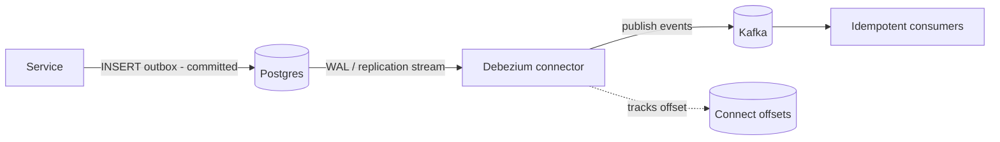
```mermaid
graph LR
    APP[Service] -->|INSERT outbox - committed| DB[(Postgres)]
    DB -->|WAL / replication stream| DBZ[Debezium connector]
    DBZ -->|publish events| K[(Kafka)]
    K --> C[Idempotent consumers]
    DBZ -.tracks offset.-> OFF[(Connect offsets)]
```

Line-by-line: the app only writes to the DB; the **WAL** carries committed changes; **Debezium** tails the WAL (not the tables) and publishes to Kafka; it tracks its **offset** for resume-on-crash. No polling, minimal app impact, near-real-time.

### Step 7 — Spring Boot / Config Implementation

The app side is *identical* to Chapter 10.2 (just insert into the outbox in the business transaction). The relay is **infrastructure**, not code — a Debezium connector config:

```json
{
  "name": "outbox-connector",
  "config": {
    "connector.class": "io.debezium.connector.postgresql.PostgresConnector",
    "database.hostname": "payment-db",
    "database.dbname": "payment",
    "table.include.list": "public.outbox",
    "transforms": "outbox",
    "transforms.outbox.type":
        "io.debezium.transforms.outbox.EventRouter",
    "transforms.outbox.route.by.field": "aggregate_type",
    "plugin.name": "pgoutput"
  }
}
```

```yaml
# postgres must enable logical replication for CDC
# postgresql.conf: wal_level = logical
```

The key idea: with CDC, your application code shrinks (no relay to write) and the relay becomes a configured, battle-tested connector. `EventRouter` is Debezium's built-in outbox support that routes events to topics by a field.

### Step 8 — Common Mistakes

- **Forgetting to enable logical replication** (`wal_level = logical`) — CDC silently won't work.
- **Treating CDC output as exactly-once** — it's at-least-once; dedupe.
- **Tailing business tables directly instead of an outbox** — couples consumers to your internal schema and leaks every column change as an "event." Use the outbox table as an explicit event contract.
- **Ignoring schema evolution / replication slot growth** — an inactive/stuck Debezium leaves the replication slot holding WAL, filling the disk. Monitor slot lag.
- **Operational complexity** — Debezium + Kafka Connect is more infra to run than a `@Scheduled` poller.

### Step 9 — Debugging Perspective

- **Replication slot lag / disk filling** → Debezium stopped consuming; the DB retains WAL. A classic, dangerous CDC incident — monitor it.
- **Events delayed** → check connector status (`/connectors/.../status`), task failures, and Kafka Connect logs.
- **Missing events** → connector not capturing the table (include list), or replication not enabled.
- Connect's offset topics show where Debezium is in the log — your CDC "lag" view.

### Step 10 — Summary

- **What you learned:** Transaction Log Tailing (CDC, via Debezium) implements the outbox relay by reading the database's transaction log directly, publishing committed changes to Kafka in near-real-time with minimal application load — instead of polling.
- **Why it matters:** It's the high-scale, low-latency way to reliably publish events, decoupling event publishing from application query load.
- **When to use it:** High-volume systems where polling load/latency is unacceptable; when you want near-real-time event propagation; banking/telecom-scale event pipelines.
- **When not to use it:** Small/simple systems where a Polling Publisher is enough and you'd rather avoid the operational weight of Debezium/Connect. Always combine with the outbox table (don't tail business tables) and idempotent consumers.

**Mental model for Part 10:** *never write to two systems at once. Write your state and your event together in one DB transaction (outbox), then relay events out reliably — by a poller for simplicity, or by tailing the DB's own change log (CDC) for scale. Consumers always dedupe, because the relay is at-least-once.*

---

# Part 11 — Data Consistency Patterns

## Chapter 11.1 — The Saga Pattern

This is the climactic pattern of the guide — the answer to the question Part 0 left hanging: *if we can't have distributed transactions, how do we keep data consistent across services?* We'll go very deep (this is a top senior-interview topic).

### Step 1 — Problem Statement

Placing an order in e-commerce spans multiple services, each with its own database:

1. **Order Service** — create the order.
2. **Payment Service** — charge the customer.
3. **Inventory Service** — reserve the stock.
4. **Shipping Service** — schedule delivery.

In a monolith this is one `@Transactional` method: if shipping fails, *everything* rolls back atomically — the charge, the reservation, the order. Beautiful, but impossible here, because these are **four separate databases** and we deliberately **abandoned distributed transactions / 2PC** (Part 0) — they're blocking, fragile, and destroy availability.

So what happens when step 3 (inventory) fails *after* step 2 (payment) already charged the customer? You've **taken the customer's money but can't fulfill the order.** You can't just "roll back" — the payment is in a *different database* in a *different service* that already committed its transaction. There is no global rollback button.

The problem: **how do we maintain consistency across multiple services' local transactions when there's no distributed transaction — including correctly *undoing* earlier steps when a later step fails?**

### Step 2 — Intuition

Break the big distributed transaction into a **sequence of local transactions**, one per service. Each service does its own local (ACID) transaction and then triggers the next step. If any step fails, you don't "roll back" (you can't) — instead you run **compensating transactions** that *semantically undo* the completed steps, in reverse order. Charged the card but inventory failed? Run a compensation: *refund* the card. Reserved stock but shipping failed? *Release* the reservation.

The key mental shift: **a saga doesn't roll back; it moves forward to a consistent state, either by completing all steps or by compensating the ones that succeeded.** Compensation is not a database rollback — it's a *new business action that counters a previous one* (a refund counters a charge; a release counters a reservation).

The intuition: **a long business process is a chain of small committed steps, each with a known "undo" action; if the chain breaks, you walk back undoing what was done.**

### Step 3 — Real-World Analogy

Booking a **multi-leg holiday**: flight, hotel, rental car. You book each separately (separate "local transactions" with separate providers). You can't book all three in one atomic action across three companies. So you book the flight (committed), then the hotel (committed), then try the car — and the car is sold out. You can't magically "roll back" the trip. Instead you perform **compensating actions**: *cancel the hotel* (with its cancellation policy) and *cancel the flight* (incurring a fee, perhaps). Each cancellation is a *new transaction* that undoes a prior booking. Notice the realism: compensation isn't always perfectly clean (cancellation fees, the hotel might already have charged a deposit) — exactly like real sagas, where compensations are *semantic*, not magical reversals.

### Step 4 — Internal Mechanics: two coordination styles

A saga needs coordination — *who decides the next step, and who triggers compensation?* Two approaches:

**A) Choreography (decentralized, event-driven).** There's no central coordinator. Each service **listens for events** and **emits events**, and the saga emerges from this chain of reactions:
- Order emits `OrderCreated` → Payment listens, charges, emits `PaymentCompleted` → Inventory listens, reserves, emits `StockReserved` → Shipping listens, schedules, emits `OrderShipped`.
- On failure, the failing service emits a failure event, and *upstream services listen for it and run their own compensations*: Inventory fails → emits `StockReservationFailed` → Payment listens, *refunds*, emits `PaymentRefunded` → Order listens, *cancels the order*.
- **Pros:** simple, loosely coupled, no central bottleneck, services are autonomous. **Cons:** the overall flow is *implicit* and hard to see (it's spread across many services' event handlers); cyclic dependencies and "event spaghetti" can emerge; hard to reason about and debug as steps grow.

**B) Orchestration (centralized).** A dedicated **saga orchestrator** explicitly directs the flow: it sends a **command** to each service ("charge payment"), waits for the reply, and decides the next command (or compensations on failure).
- Orchestrator → Payment "charge" → reply OK → orchestrator → Inventory "reserve" → reply FAIL → orchestrator → Payment "refund" → orchestrator → Order "cancel."
- **Pros:** the flow is *explicit and centralized* — easy to understand, monitor, and debug; the orchestrator holds the saga state machine; easier to manage complex sagas. **Cons:** the orchestrator is a central component (must be made resilient/HA); risk of it accumulating too much logic (a "god orchestrator"); services are slightly more coupled to the orchestrator's commands.

**Senior heuristic:** few steps and simple flows → choreography; many steps, complex branching, or a need for visibility/monitoring → orchestration. Banks and fintechs often prefer **orchestration** for critical money flows precisely because the explicit, auditable, centrally-monitored state machine is worth the central component.

**Cross-cutting saga mechanics (both styles):**
- **Each step's local transaction must be atomic with its event/command publishing** → use the **Outbox pattern** (Part 10). Sagas are *built on* reliable messaging.
- **Idempotency** — steps and compensations may be retried; they must be idempotent.
- **Compensations must be designed per step** — and some actions are hard/impossible to compensate (you can't un-send an email; you send an apology instead). **Order steps so that hard-to-compensate / irreversible steps come last**, and "pivot" on a step after which the saga is guaranteed to complete.
- **Lack of isolation:** unlike ACID, saga intermediate states are *visible* (an order can be briefly in "payment done, inventory pending"). You must handle this (e.g., semantic locks, status flags, "pending" states) — a key difference from monolith transactions.
- **Saga log / state:** the orchestrator (or a saga state store) tracks where each saga instance is, to resume after crashes.

### Step 5 — Step-by-Step Flow (orchestration, with a failure)

Happy path:
1. Order created (PENDING). Orchestrator starts the saga.
2. Orchestrator → Payment: "charge $100." Payment charges (local tx), replies OK.
3. Orchestrator → Inventory: "reserve item X." Inventory reserves, replies OK.
4. Orchestrator → Shipping: "schedule delivery." Shipping schedules, replies OK.
5. Orchestrator marks order CONFIRMED. Saga complete.

Failure path (inventory out of stock):
1. Order created (PENDING).
2. Orchestrator → Payment: charge → OK. *(Customer has been charged.)*
3. Orchestrator → Inventory: reserve → **FAIL (out of stock).**
4. Orchestrator begins **compensation**, in reverse: → Payment: "refund $100." Payment refunds (local tx).
5. Orchestrator → Order: "cancel order." Order marked CANCELLED.
6. Saga ends in a consistent state: no money taken, no stock reserved, order cancelled, customer notified. **No data was left inconsistent, with no distributed transaction.**

### Step 6 — Architecture Diagram

**Orchestration (happy path + compensation):**

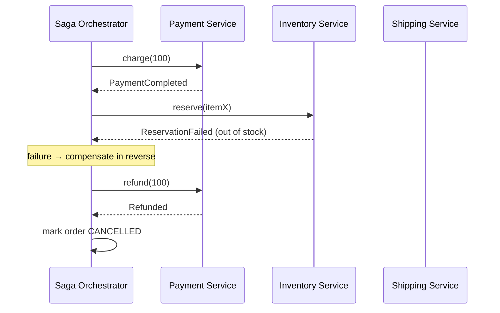
```mermaid
sequenceDiagram
    participant O as Saga Orchestrator
    participant P as Payment Service
    participant I as Inventory Service
    participant S as Shipping Service

    O->>P: charge(100)
    P-->>O: PaymentCompleted
    O->>I: reserve(itemX)
    I-->>O: ReservationFailed (out of stock)
    Note over O: failure → compensate in reverse
    O->>P: refund(100)
    P-->>O: Refunded
    O->>O: mark order CANCELLED
```

Line-by-line: the orchestrator issues commands one at a time, awaiting each reply. On `ReservationFailed`, it switches to **compensation mode** and issues `refund` to undo the earlier successful `charge`. The flow is *explicit* in one place — that's orchestration's advantage.

**Choreography (event chain):**

```mermaid
graph LR
    O[Order Service] -->|OrderCreated| P[Payment Service]
    P -->|PaymentCompleted| I[Inventory Service]
    I -->|StockReservationFailed| P2[Payment listens]
    P2 -->|PaymentRefunded| O2[Order listens]
    O2 -->|OrderCancelled| X[done]
```

Line-by-line: no orchestrator — each service reacts to events and emits its own. The compensation path is *also* just events (`StockReservationFailed` → Payment refunds → `PaymentRefunded` → Order cancels). Notice the flow is *spread across services* — powerful but harder to see end-to-end.

### Step 7 — Spring Boot Implementation

A simple orchestrator as an explicit state machine (conceptual; production systems often use frameworks like Axon, Eventuate Tram Saga, or Camunda):

```java
@Service
public class OrderSagaOrchestrator {

    private final PaymentClient payment;
    private final InventoryClient inventory;
    private final ShippingClient shipping;
    private final OrderRepository orders;
    private final SagaStateRepository sagaState;   // to resume after crashes

    public void start(Long orderId, BigDecimal amount, String item) {
        SagaState saga = sagaState.start(orderId);
        try {
            // Step 1: charge (each call is idempotent via an idempotency key)
            payment.charge(orderId, amount);
            saga.completed("PAYMENT");

            // Step 2: reserve
            inventory.reserve(orderId, item);
            saga.completed("INVENTORY");

            // Step 3: ship (pivot: after this, we always complete)
            shipping.schedule(orderId);
            saga.completed("SHIPPING");

            orders.confirm(orderId);
            saga.finish(SagaStatus.COMPLETED);

        } catch (SagaStepException e) {
            compensate(saga, orderId, amount);   // walk back the done steps
        }
    }

    private void compensate(SagaState saga, Long orderId, BigDecimal amount) {
        // Reverse order; only undo steps that actually completed.
        if (saga.didComplete("INVENTORY")) inventory.release(orderId);  // compensation
        if (saga.didComplete("PAYMENT"))   payment.refund(orderId, amount); // compensation
        orders.cancel(orderId);
        saga.finish(SagaStatus.COMPENSATED);
    }
}
```

Each service step's own transaction uses the **Outbox** (Part 10) to reliably emit its reply/event, and each command carries an **idempotency key** so retries don't double-charge. The compensation methods (`release`, `refund`, `cancel`) are *new business actions*, not DB rollbacks. The `SagaState` store lets a crashed orchestrator resume mid-saga.

A choreography consumer (Payment reacting to events) for contrast:

```java
@KafkaListener(topics = "order-events", groupId = "payment")
public void on(OrderCreated e) {
    if (processed(e.eventId())) return;       // idempotent
    payment.charge(e.orderId(), e.amount());  // local tx + outbox emits PaymentCompleted
}

@KafkaListener(topics = "inventory-events", groupId = "payment")
public void on(StockReservationFailed e) {    // compensation triggered by an event
    if (processed(e.eventId())) return;
    payment.refund(e.orderId());              // local tx + outbox emits PaymentRefunded
}
```

### Step 8 — Common Mistakes

- **No compensations / assuming you can "roll back."** You can't roll back committed local transactions across services. Every step needs a designed compensation.
- **Non-idempotent steps/compensations** → retries double-charge or double-refund. Use idempotency keys.
- **Not handling lost isolation** → exposing or acting on intermediate states (e.g., shipping an order whose payment later gets compensated). Use status flags, "pending" states, and order steps carefully.
- **Putting an irreversible/hard-to-compensate step early** (e.g., dispatching a physical package before payment confirms). Order steps so irreversible actions are last (after the pivot).
- **Choreography for complex sagas** → unmaintainable event spaghetti with no clear picture; switch to orchestration when complexity grows.
- **God orchestrator** holding business logic that belongs in services.
- **Forgetting the outbox** → events/commands lost mid-saga leave it stuck. Sagas require reliable messaging.
- **No saga state persistence** → a crashed orchestrator can't resume, leaving sagas half-done.
- **No timeout/stuck-saga handling** → a service never replies and the saga hangs forever. Add timeouts and a way to force-compensate.

### Step 9 — Debugging Perspective

- **"Customer charged but no order" / "order but no charge"** → a saga that failed to complete *or* failed to compensate. Look at the **saga state store**: where did this saga stop? Which steps completed? Which compensation didn't run?
- **Stuck sagas** → a service never replied (down/slow) and there was no timeout. Monitor saga duration and alert on long-running/stuck instances.
- **Orchestration makes debugging far easier** — one place shows each saga's current step and history. **Choreography is harder** — you must trace events across many services (distributed tracing + correlation IDs are essential; Part 19).
- **Double effects (two refunds)** → idempotency gap in a compensation.
- A **saga audit log** (every step and compensation, with timestamps and outcomes) is invaluable for both debugging and regulatory audit (banking).

### Step 10 — Summary

- **What you learned:** A saga maintains consistency across services without distributed transactions by chaining local transactions, each with a compensating action to semantically undo it on failure. Coordination is either **choreography** (event-driven, decentralized) or **orchestration** (centralized state machine). Sagas are built on reliable messaging (outbox) and idempotency, and they sacrifice ACID isolation (intermediate states are visible).
- **Why it matters:** It's *the* answer to distributed data consistency — how real banking, e-commerce, and fintech systems move money and fulfill orders across services correctly.
- **When to use it:** Any business process that spans multiple services and must remain consistent (order fulfillment, payments, account opening, multi-step provisioning).
- **When not to use it:** When the operation fits in a single service/database (just use a local transaction — don't invent a saga). Choose choreography for simple flows, orchestration for complex/critical/auditable ones.

**Mental model:** *a saga is a relay race of local transactions, each runner carrying a "how to undo my leg" note. If a later runner drops the baton, everyone who already ran walks backward and undoes their leg. There's no master rewind — only deliberate, business-level undo actions, coordinated either by everyone watching each other (choreography) or by a referee (orchestration).*

---

# Part 12 — Business Logic Design Patterns

How you organize the *business logic inside* a service matters as much as how services talk. This part covers the building blocks of Domain-Driven Design tactical patterns and the powerful (and dangerous) Event Sourcing.

## Chapter 12.1 — The Aggregate

### Step 1 — Problem Statement

Inside the Order Service, an order has order-lines, a shipping address, a status, and totals. Multiple requests may try to modify the same order concurrently (add a line, cancel it, change the address). Two questions arise: **What's the unit of consistency?** (When I save changes, what must be consistent together?) And **what guards the business rules?** (E.g., "an order's total must equal the sum of its lines"; "you can't add lines to a shipped order.") If any code anywhere can poke at any order field directly, invariants get violated and concurrent edits corrupt data.

### Step 2 — Intuition

Group the objects that *must change together and stay consistent together* into one cluster with a single gatekeeper. That cluster is an **aggregate**; the gatekeeper is the **aggregate root**. All changes go *through the root*, which enforces the rules. The aggregate is the **unit of consistency** — you load it, change it, and save it as one atomic whole, and you never let outsiders reach inside to mutate its parts directly.

The intuition: **draw a consistency boundary around tightly-related data and force all changes through one door that enforces the invariants.**

### Step 3 — Real-World Analogy

A **shopping cart**. The cart (aggregate root) contains items (members). You don't let a stranger reach into someone's cart and change item quantities directly — all changes go through the cart, which enforces rules ("max 10 of one item," "recompute total when items change"). The cart is also the natural unit you save/load as a whole. And one cart's rules don't need to be instantly consistent with *another* cart — each cart is its own consistency boundary.

### Step 4 — Internal Mechanics

- **Aggregate root:** the single entry point; holds invariants; the only object outside code references. Other objects in the aggregate (entities, value objects) are reached *only* through the root.
- **Consistency boundary:** everything inside is kept consistent within one transaction. **Crucial rule: one transaction modifies one aggregate.** Cross-aggregate consistency is *eventual* (via domain events/sagas) — this is what makes aggregates the natural sizing unit for distributed systems.
- **Reference other aggregates by ID, not by object reference** — an `Order` references a `customerId`, not a whole `Customer` object. This keeps aggregates small and decoupled (and maps perfectly onto microservice boundaries — an order in the Order Service references a customer in the Customer Service by id).
- **Value objects:** immutable, identity-less concepts (Money, Address) inside aggregates.

### Step 5–6 — Flow & Diagram

Flow: load aggregate (root + members) → call a method on the root (`order.addLine(...)`) → root validates invariants → persist the whole aggregate atomically → optionally emit a domain event.

```mermaid
graph TD
    subgraph "Order Aggregate (one consistency boundary)"
      ROOT[Order - aggregate root] --> L1[OrderLine]
      ROOT --> L2[OrderLine]
      ROOT --> ADDR[ShippingAddress - value object]
    end
    ROOT -. references by ID .-> CUST[customerId -> Customer aggregate elsewhere]
    EXT[Application code] -->|only through root| ROOT
```

Line-by-line: external code touches only the **root**; lines and address are *inside* the boundary; the customer is referenced **by id** (a different aggregate, possibly a different service). The dotted line emphasizes you don't embed other aggregates — you reference them.

### Step 7 — Implementation

```java
@Entity
public class Order {              // aggregate root
    @Id private Long id;
    private Long customerId;       // reference OTHER aggregate by ID
    @Enumerated private OrderStatus status;
    @ElementCollection private List<OrderLine> lines = new ArrayList<>();
    @Embedded private Address shippingAddress;   // value object

    // All changes go THROUGH the root, which enforces invariants:
    public void addLine(ProductId product, int qty, Money price) {
        if (status != OrderStatus.DRAFT)
            throw new IllegalState("Cannot modify a non-draft order");  // invariant
        lines.add(new OrderLine(product, qty, price));
        // total is always derived/consistent — never set independently
    }

    public Money total() {        // invariant: total == sum of lines
        return lines.stream().map(OrderLine::subtotal).reduce(Money.ZERO, Money::add);
    }
}
```

The key idea: `lines` is mutated only via `addLine`, which guards the rules; outsiders can't add a line to a shipped order or desync the total.

### Step 8–10 — Mistakes, Debugging, Summary

- **Mistakes:** aggregates too large (whole object graphs → contention, big transactions); referencing other aggregates by object instead of id (couples them, breaks "one tx per aggregate"); letting code bypass the root and mutate members directly; trying to keep multiple aggregates strongly consistent in one transaction (should be eventual).
- **Debugging:** invariant violations or corrupt data usually mean someone bypassed the root or an aggregate is too big and concurrent writes clash (optimistic-locking version conflicts are the symptom).
- **Summary:** An aggregate is a consistency boundary with a single gatekeeper (the root) that enforces invariants; modify one aggregate per transaction and reference others by id. **Why it matters:** aggregates are the natural unit of both transactional consistency *and* microservice/event design. **Use** to structure rich domain logic; keep them **small**.

---

## Chapter 12.2 — Domain Event

### Step 1–3 — Problem, Intuition, Analogy

When something significant happens in the domain (an order was placed, a payment failed, an account was overdrawn), other parts of the system — and other services — need to know. Hardcoding "when X happens, call Y and Z" couples the originator to all reactions. **Intuition:** instead, *announce a fact*: "OrderPlaced happened." Interested parties react. A **domain event** is an immutable record of *something meaningful that occurred in the business*, named in past tense. **Analogy:** a birth certificate — an official, immutable record that an event happened, which many institutions (hospital, government, insurer) independently react to.

### Step 4–6 — Mechanics, Flow, Diagram

- A domain event is **immutable**, **past-tense** (`OrderPlaced`, not `PlaceOrder` — that's a command), and carries the facts of what happened (ids, key data, timestamp).
- Aggregates **raise** domain events when their state changes meaningfully. These are published (in-process via Spring's `ApplicationEventPublisher`, and/or across services via the **outbox** + Kafka).
- Events enable **decoupling** (Part 5), **sagas** (Part 11), **CQRS read-model updates** (Part 13), and **event sourcing** (next).

```mermaid
graph LR
    AGG[Order Aggregate] -->|raises| EV[OrderPlaced event]
    EV --> H1[Inventory reacts]
    EV --> H2[Notification reacts]
    EV --> H3[Read model updates]
```

### Step 7 — Implementation

```java
public record OrderPlaced(UUID eventId, Long orderId, Long customerId,
                          Money total, Instant occurredAt) {}   // immutable fact

@Entity
public class Order extends AbstractAggregateRoot<Order> {  // Spring Data helper
    public static Order place(CreateOrder cmd) {
        Order o = new Order(cmd);
        o.registerEvent(new OrderPlaced(UUID.randomUUID(), o.id,
                        o.customerId, o.total(), Instant.now())); // raise event
        return o;
    }
}
// Events registered on the aggregate are published when it's saved.
```

### Step 8–10 — Mistakes, Debugging, Summary

- **Mistakes:** naming events as commands (present/imperative tense); fat events carrying entire aggregates; mutable events; publishing events that didn't actually commit (use the outbox); leaking internal structure through events.
- **Debugging:** events are themselves a debugging/audit goldmine — they record *what happened*; missing reactions trace back to a consumer or the outbox.
- **Summary:** Domain events are immutable, past-tense facts that decouple "what happened" from "who reacts." **Why it matters:** they're the currency of event-driven microservices and the foundation of sagas, CQRS, and event sourcing. **Use** to communicate significant state changes within and across services.

---

## Chapter 12.3 — Domain Model vs Transaction Script

### Step 1 — Problem Statement

Where does business logic *live*? Two philosophies. In one, logic is spread procedurally across "service" classes that operate on dumb data objects. In the other, logic lives *inside* rich domain objects. Choosing wrong leads either to unmaintainable spaghetti (logic duplicated and scattered) or to needless ceremony for trivial problems.

### Step 2 — Intuition & the two patterns

**Transaction Script:** organize business logic as **procedures** — one method per business transaction, executed top-to-bottom, operating on data structures (DTOs/records). The data objects are "anemic" (just getters/setters); all behavior is in the script. *Procedural.*

**Domain Model:** organize business logic *inside the objects that own the data* — rich entities and value objects with behavior and enforced invariants (the Aggregate of 12.1 is a domain model). *Object-oriented.*

### Step 3 — Analogy

**Transaction Script** is a **recipe card**: a linear list of steps you follow with passive ingredients. **Domain Model** is a **smart kitchen appliance** where the knowledge is built into the device — the bread machine *knows* how to make bread; you don't script every step. Simple dish → recipe card is fine. Complex, rule-heavy cooking → embed the expertise.

### Step 4–7 — Mechanics & Implementation

**Transaction Script** (good for simple CRUD/low-complexity logic):

```java
@Service
public class TransferScript {
    public void transfer(Long from, Long to, BigDecimal amt) {     // one procedure
        Account a = repo.find(from);
        Account b = repo.find(to);
        if (a.getBalance().compareTo(amt) < 0) throw new InsufficientFunds();
        a.setBalance(a.getBalance().subtract(amt));   // logic OUTSIDE the object
        b.setBalance(b.getBalance().add(amt));
        repo.save(a); repo.save(b);
    }
}
```

**Domain Model** (good for rich, rule-heavy domains):

```java
public class Account {                  // rich object: data + behavior + invariants
    private Money balance;
    public void withdraw(Money amt) {
        if (balance.isLessThan(amt)) throw new InsufficientFunds(); // invariant inside
        this.balance = balance.minus(amt);
    }
    public void deposit(Money amt) { this.balance = balance.plus(amt); }
}
@Service
class TransferService {
    public void transfer(Long from, Long to, Money amt) {
        Account a = repo.find(from), b = repo.find(to);
        a.withdraw(amt);  b.deposit(amt);    // logic lives in the domain objects
        repo.save(a);     repo.save(b);
    }
}
```

The difference: in Transaction Script the service *manipulates* data; in Domain Model the service *coordinates* objects that enforce their own rules. As rules multiply (overdraft limits, fees, currency, holds), the domain model keeps them cohesive and reusable, while the transaction script bloats and duplicates.

### Step 8–10 — Mistakes, Debugging, Summary

- **Mistakes:** the **anemic domain model** anti-pattern (objects with only getters/setters + all logic in services, claiming to be DDD but actually Transaction Script in disguise) for *complex* domains; conversely, full DDD ceremony for trivial CRUD (over-engineering).
- **Debugging:** scattered/duplicated rules (a symptom of Transaction Script outgrowing its fit) cause inconsistent behavior across endpoints; rich models centralize rules so bugs are localized.
- **Summary:** **Transaction Script** = procedural logic over dumb data; simple, fine for low-complexity services. **Domain Model** = behavior-rich objects enforcing their own invariants; scales with complexity. **Why it matters:** match the pattern to the complexity. **Use Domain Model** for your *core domain* (Part 3) where rules are rich; **Transaction Script** for simple supporting/CRUD services. Don't cargo-cult either.

---

## Chapter 12.4 — Event Sourcing

### Step 1 — Problem Statement

Traditional persistence stores **current state**: a bank account row says `balance = 500`. But this *throws away history* — you only know the *result*, not *how you got there*. For a bank, this is a serious problem:

- **Audit & compliance:** regulators demand a complete, immutable history of *every* change — every deposit, withdrawal, fee, correction — not just the final balance. With state-only storage, you bolt on audit logs that can drift from reality.
- **Lost information:** "What was the balance on March 3rd at 2pm? Why did it change? In what order?" State storage can't answer without separate, error-prone tracking.
- **Debugging & temporal queries:** you can't easily reconstruct past states or replay what happened.
- **Concurrency/overwrite:** the last update wins, silently erasing intermediate truth.

The problem: **how do we never lose history, get a perfect audit trail for free, and be able to reconstruct any past state?**

### Step 2 — Intuition

Stop storing the *current state*. Instead, store the **sequence of events that happened** — `AccountOpened`, `MoneyDeposited(100)`, `MoneyWithdrawn(30)`, `FeeCharged(2)` — as an append-only, immutable log. The current state isn't stored; it's **derived by replaying the events** from the beginning (open → +100 → −30 → −2 → balance 68). The events are the source of truth; state is a *computed projection* of them.

The intuition: **store *what happened* (the facts), not *the result*. The result is always recomputable from the facts.** It's the difference between keeping only your current bank balance versus keeping your full transaction statement — from the statement you can always recompute the balance *and* answer any historical question; from the balance alone you can recompute nothing.

### Step 3 — Real-World Analogy

A **bank account statement / ledger** itself. Accountants have known for centuries: you don't just write down "balance: $500" and overwrite it. You keep a **journal** — an append-only list of every transaction (you never erase a ledger entry; you add a correcting entry). The balance is *derived* from summing the journal. This gives a perfect audit trail, lets you reconstruct the balance at any past date, and makes tampering detectable. Event sourcing is double-entry bookkeeping applied to software state. (A second analogy: **chess notation** — you don't store a photo of the board; you store the moves. From the moves you can reconstruct the board at any point in the game and replay it.)

### Step 4 — Internal Mechanics

- **Event Store:** an append-only database of events, per aggregate, in order (Kafka, EventStoreDB, or a relational `events` table). Events are **immutable** — never updated or deleted.
- **Aggregate reconstruction:** to load an aggregate, read all its events and **fold/apply** them in order to rebuild current state.
- **Command handling:** a command (`Withdraw 30`) is validated against current state (rebuilt from events), and if valid, *produces new events* (`MoneyWithdrawn(30)`) that are appended. Commands don't mutate state directly — they emit events that, when applied, change state.
- **Snapshots:** replaying thousands of events to load an aggregate is slow. Periodically save a **snapshot** (the computed state at event #N); then load = snapshot + only events after N. An optimization, not a source of truth.
- **Event replay / projections:** you can build *any* read model by replaying events (ties directly into CQRS, Part 13). New read models can be built by replaying history. Bugs in a projection can be fixed by replaying.
- **Concurrency:** optimistic concurrency via expected event version (append only if the aggregate is still at version N).
- **Pairing:** event sourcing is *almost always* paired with **CQRS** (Part 13) — writes append events; reads come from projections built from those events, because querying raw event streams for current state is impractical.

### Step 5 — Step-by-Step Flow

Withdraw $30 from an account:
1. Command `Withdraw(accountId, 30)` arrives.
2. Load the account: read all its events from the event store, apply them → current state (balance 100).
3. Validate the command against state: 100 ≥ 30 → allowed.
4. Produce event `MoneyWithdrawn(30)` and **append** it to the event store (with expected version for concurrency).
5. (Optionally) publish the event to Kafka so projections/other services update.
6. A **projection** consumes `MoneyWithdrawn` and updates a read-model row `balance = 70` for fast queries.
7. Audit: the full history (`Opened`, `Deposited 100`, `Withdrawn 30`) is permanently, immutably stored.

### Step 6 — Architecture Diagram

```mermaid
graph TD
    CMD[Command: Withdraw 30] --> H[Command Handler]
    H -->|load + replay events| ES[(Event Store - append only)]
    H -->|validate, then append new event| ES
    ES -->|MoneyWithdrawn| PROJ[Projector]
    PROJ --> RM[(Read Model: balance=70)]
    QRY[Query: get balance] --> RM
    ES -.snapshot every N.-> SNAP[(Snapshots)]
```

Line-by-line: commands are validated by replaying events from the **append-only event store** (the source of truth), then *append* new events; **projectors** turn events into fast **read models**; queries hit the read model, not the event store; **snapshots** optimize reconstruction. Note writes and reads use different stores — that's CQRS (Part 13).

### Step 7 — Implementation

```java
public class Account {                 // event-sourced aggregate
    private String id;
    private Money balance = Money.ZERO;
    private long version;

    // Rebuild state by applying historical events
    public static Account rehydrate(List<DomainEvent> history) {
        Account a = new Account();
        history.forEach(a::apply);     // fold events into state
        return a;
    }

    // COMMAND: validate against current state, emit event (don't mutate directly)
    public List<DomainEvent> withdraw(Money amt) {
        if (balance.isLessThan(amt)) throw new InsufficientFunds();
        return List.of(new MoneyWithdrawn(id, amt, version + 1));
    }

    // APPLY: how each event changes state
    private void apply(DomainEvent e) {
        if (e instanceof MoneyDeposited d) balance = balance.plus(d.amount());
        else if (e instanceof MoneyWithdrawn w) balance = balance.minus(w.amount());
        version++;
    }
}

@Service
class AccountCommandHandler {
    private final EventStore store;
    public void handle(WithdrawCmd cmd) {
        List<DomainEvent> history = store.load(cmd.accountId());     // read events
        Account acc = Account.rehydrate(history);                   // replay -> state
        List<DomainEvent> newEvents = acc.withdraw(cmd.amount());   // produce events
        store.append(cmd.accountId(), newEvents, history.size());   // append (optimistic)
    }
}
```

The crucial idea: state is **never stored or mutated directly** — `withdraw` *produces* an event; `apply` defines how events fold into state; `rehydrate` rebuilds state from history. The event store only ever *appends*.

### Step 8 — Common Mistakes

- **Using event sourcing everywhere.** It's complex; reserve it for domains that genuinely need full history/audit (finance, ledgers, regulated domains). For simple CRUD it's massive over-engineering.
- **Mutable events / editing history.** Events are immutable. To "correct," append a *compensating* event (like an accounting reversal) — never edit the past.
- **No snapshots** → reconstructing aggregates with huge histories becomes slow.
- **Schema/event evolution ignored** → old events must remain readable forever; you need event versioning/upcasting strategies (you can never "migrate away" old event shapes — they're permanent).
- **Querying the event store for current state** → impractical; you *must* build read models/projections (CQRS).
- **Forgetting it's eventually consistent** → read models lag the event append; design for it.
- **No concurrency control** → concurrent commands corrupt the stream; use expected-version optimistic locking.

### Step 9 — Debugging Perspective

- **Event sourcing is a debugging superpower:** you have the *complete, ordered history* of everything that happened. You can replay events to reproduce *exactly* how an aggregate reached a bad state — something impossible with state-only storage.
- **"How did this balance become wrong?"** → read the event stream; the offending event is right there.
- **Fix a projection bug** by correcting the projector and *replaying* events to rebuild the read model.
- The flip side: **debugging the event/projection pipeline** (lagging projections, replay correctness, event versioning) is its own complexity.
- Auditors/regulators love it — the event store *is* the audit log, immutable and complete.

### Step 10 — Summary

- **What you learned:** Event sourcing stores an immutable, append-only log of events as the source of truth; current state is derived by replaying them, optimized with snapshots, and queried via projections (CQRS). Corrections are new events, never edits.
- **Why it matters:** It gives a perfect audit trail, full history, time-travel/temporal queries, and powerful debugging — exactly what regulated, money-handling domains need.
- **When to use it:** Domains requiring complete auditability and history (banking ledgers, financial transactions, regulated workflows) and where reconstructing past states or building many read models is valuable.
- **When not to use it:** Most CRUD applications — the complexity (event versioning, eventual consistency, projections, snapshots) far outweighs the benefit. It's a specialist tool, not a default.

**Mental model for Part 12:** *put business rules inside the objects that own the data (aggregates/domain model), communicate change as immutable past-tense facts (domain events), and — when history itself is the requirement — store those facts as the source of truth and compute state from them (event sourcing). Match the sophistication to the domain's real complexity.*

---

# Part 13 — Querying Patterns

Decomposing into services with private databases creates a brand-new problem we got for free in the monolith: **queries that need data from multiple services.** In a monolith, you'd `JOIN` across tables. Now those tables live in different databases owned by different services — and you *cannot* join across them. This part solves distributed querying.

## Chapter 13.1 — API Composition

### Step 1 — Problem Statement

The "order details" screen needs: the order (Order Service), the customer's name (Customer Service), the product details (Product Service), and the payment status (Payment Service). In a monolith: one SQL query with three joins. In microservices: that data lives in **four separate databases** you cannot join. So how do you assemble one coherent view from four services?

### Step 2 — Intuition

Have one component (a composer — often the API Gateway, a BFF, or a dedicated service) **call each service, gather the pieces, and stitch them together in memory** into the combined result. You do the "join" in application code instead of in the database.

The intuition: **if you can't join in the database, gather the parts by calling each owner and assemble the answer yourself** — ideally calling them in parallel to keep it fast.

### Step 3 — Analogy

A **journalist writing a story** that needs facts from several departments. They can't query one giant company database; they *phone each department*, collect each answer, and assemble the article. If they call all departments at once (parallel) the story is ready quickly; if they call one after another (sequential) it takes far longer.

### Step 4–6 — Mechanics, Flow, Diagram

- A **composer** invokes multiple services (in **parallel** to minimize latency), then **combines** the results.
- **Latency** = the slowest single call (if parallel), not the sum.
- **Partial failure** must be handled: if Product Service is down, do you fail the whole screen or return the order with "product details unavailable"? (Graceful degradation — often the right call for non-critical pieces, via circuit-breaker fallbacks.)
- Best for **simple aggregations** with modest fan-out. For large datasets, in-memory joins and pagination across services get ugly — that's where CQRS wins.

```mermaid
graph TD
    REQ[GET /orders/42/details] --> CMP[Composer - BFF/Gateway]
    CMP -->|parallel| OS[Order Service]
    CMP -->|parallel| CS[Customer Service]
    CMP -->|parallel| PS[Product Service]
    CMP -->|parallel| PAY[Payment Service]
    OS --> CMP
    CS --> CMP
    PS --> CMP
    PAY --> CMP
    CMP -->|stitched view| REQ
```

Line-by-line: the composer fans out to four services **in parallel**, awaits all (with timeouts/fallbacks), and merges them into one response.

### Step 7 — Implementation

```java
@GetMapping("/orders/{id}/details")
public OrderDetails details(@PathVariable Long id) {
    CompletableFuture<Order> order   = supplyAsync(() -> orderClient.get(id));
    Order o = order.join();
    // fan out the rest in parallel
    CompletableFuture<Customer> cust = supplyAsync(() -> customerClient.get(o.customerId()));
    CompletableFuture<List<Product>> prods =
        supplyAsync(() -> productClient.getAll(o.productIds()));
    CompletableFuture<PaymentStatus> pay =
        supplyAsync(() -> paymentClient.status(id));

    CompletableFuture.allOf(cust, prods, pay).join();   // wait for all in parallel
    return OrderDetails.assemble(o, cust.join(), prods.join(), pay.join()); // in-memory join
}
```

The key idea: parallel fan-out (`supplyAsync` + `allOf`) so total latency ≈ slowest call, then an **in-memory join** (`assemble`). Each client has a timeout + circuit breaker so one slow service doesn't hang the whole composition.

### Step 8–10 — Mistakes, Debugging, Summary

- **Mistakes:** sequential calls (latency stacks); the **N+1 problem** (calling Product Service once per line instead of a batch `getAll`); no partial-failure handling (one dead service kills the whole screen); composing huge datasets in memory; deep composition chains (composer calls a composer calls...).
- **Debugging:** traces show the fan-out and reveal the slowest dependency (composition latency ≈ slowest call); N+1 shows as many repeated calls to one service in a trace.
- **Summary:** API Composition answers cross-service queries by calling each owning service (in parallel) and joining in memory. **Why it matters:** it's the simplest way to query across services. **Use** for simple aggregations with small fan-out and modest data; **avoid** for large datasets, complex filtering/sorting/pagination across services, or high-traffic queries — use CQRS instead.

---

## Chapter 13.2 — CQRS (Command Query Responsibility Segregation)

### Step 1 — Problem Statement

API Composition breaks down for serious queries:

- **A report** needs to filter, sort, and paginate across data from five services. You'd have to pull *everything* from five services into memory and join/sort/page it — catastrophically slow and unscalable.
- **Read and write loads differ wildly.** An e-commerce product is *written* rarely but *read* millions of times. Optimizing one storage model for both is a compromise that serves neither.
- **The write model is shaped for consistency and invariants** (normalized, aggregate-oriented — Part 12); **queries want denormalized, query-optimized shapes.** One model can't be optimal for both.
- **Event-sourced systems** can't be queried for current state at all (Part 12) — they *need* a separate read model.

The problem: **how do we serve complex, high-volume queries efficiently across services when the write-optimized model is wrong for reading?**

### Step 2 — Intuition

**Separate the write side from the read side entirely.** Use one model optimized for *handling commands* (changing state, enforcing rules) and a *different* model optimized for *answering queries* (denormalized, pre-joined, indexed for exactly the queries you run). The read model is kept up to date by **subscribing to events** from the write side. Reads and writes can even use different databases, scaled independently.

The intuition: **stop forcing one data model to be good at both changing data and querying data. Build two purpose-built models and keep them in sync with events.** "Command" = change something; "Query" = read something — give each its own responsibility and storage.

### Step 3 — Analogy

A **restaurant kitchen vs the menu/display.** The **kitchen** (write side) is organized for *cooking* — raw ingredients, stations, processes, strict rules. The **menu board / display case** (read side) is organized for *customers to browse* — beautiful, denormalized, pre-arranged, optimized for quick selection. You don't make customers walk into the kitchen and assemble their view from raw ingredients (that's API Composition over-reaching); you maintain a separate, display-optimized representation. When the kitchen changes a dish, the menu is updated (eventual consistency — the menu might lag the kitchen by a moment).

Another: a **data warehouse vs operational database.** Companies have long separated the transaction-processing DB (writes) from the analytics/reporting DB (reads). CQRS is that idea applied at the service level.

### Step 4 — Internal Mechanics

- **Command side (write model):** handles state changes, enforces invariants (aggregates, Part 12), uses a normalized/transactional store. Emits **events** on every change (via outbox, Part 10).
- **Query side (read model):** one or more **denormalized read models / projections**, each shaped for specific queries (e.g., a flat `order_summary` table pre-joining order + customer + product names), in a store optimized for reading (could be Postgres, Elasticsearch for search, Redis for speed, etc.).
- **Projector / event handler:** subscribes to the write side's events and **updates the read model(s)** accordingly. This is the synchronization mechanism.
- **Eventual consistency:** the read model lags the write model by the projection delay (usually milliseconds). **This is the central trade-off** — a read right after a write might see stale data. You design UX around it (e.g., optimistic UI, "your change is processing").
- **Independent scaling:** read and write sides scale separately (huge for read-heavy systems).
- **Multiple read models:** build as many as you need (one for search, one for the mobile summary, one for reports) — each consuming the same events. New read models can be built by replaying events (pairs perfectly with event sourcing, Part 12).
- **Cross-service CQRS:** a read model can subscribe to events from *multiple services*, pre-joining their data into one queryable model — solving the distributed-join problem *without* runtime composition.

### Step 5 — Step-by-Step Flow

1. Command `PlaceOrder` hits the write side; the Order aggregate validates and saves (normalized), emitting `OrderPlaced` (outbox → Kafka).
2. Customer and Product services also emit their events.
3. A **projector** consumes `OrderPlaced`, `CustomerUpdated`, `ProductRenamed`, etc., and writes/updates a denormalized `order_summary` row containing order + customer name + product names + payment status — all pre-joined.
4. The "order details" query now hits a **single** `order_summary` table — one fast indexed read, no fan-out, no in-memory join.
5. If a customer renames, a `CustomerRenamed` event updates the relevant `order_summary` rows. (Eventual consistency — brief lag.)

### Step 6 — Architecture Diagram

```mermaid
graph TD
    subgraph "Write Side (Commands)"
      CMD[PlaceOrder command] --> AGG[Order Aggregate]
      AGG --> WDB[(Write DB - normalized)]
      AGG -->|events via outbox| K[(Kafka)]
    end
    subgraph "Read Side (Queries)"
      K --> PROJ[Projector]
      PROJ --> RDB[(Read DB - denormalized order_summary)]
      QRY[Order details query] --> RDB
    end
    CS[Customer Service events] --> K
    PS[Product Service events] --> K
```

Line-by-line: the **write side** validates and persists normalized data and emits events; **events flow through Kafka**; the **projector** builds a **denormalized read model**; **queries** hit only the read DB (one fast read). Events from *other services* (Customer, Product) also feed the projector — so the read model pre-joins cross-service data. Reads and writes use **separate databases**, scalable independently.

### Step 7 — Implementation

Write side emits events (outbox):

```java
@Transactional
public Order place(CreateOrder cmd) {
    Order o = orders.save(Order.place(cmd));        // normalized write model
    outbox.save(OutboxEvent.of("OrderPlaced", new OrderPlaced(o)));  // event (Part 10)
    return o;
}
```

Projector builds the denormalized read model:

```java
@Component
class OrderSummaryProjector {
    private final OrderSummaryRepository summaries;   // denormalized read store

    @KafkaListener(topics = "order-events", groupId = "order-summary-proj")
    void on(OrderPlaced e) {
        if (summaries.existsById(e.orderId())) return;          // idempotent
        summaries.save(new OrderSummary(e.orderId(), e.customerId(),
                       e.customerNameSnapshot(), e.total(), "PENDING"));
    }

    @KafkaListener(topics = "customer-events", groupId = "order-summary-proj")
    void on(CustomerRenamed e) {              // cross-service event updates read model
        summaries.updateCustomerName(e.customerId(), e.newName());
    }

    @KafkaListener(topics = "payment-events", groupId = "order-summary-proj")
    void on(PaymentCompleted e) {
        summaries.updateStatus(e.orderId(), "PAID");
    }
}
```

Query side — a single fast read, no fan-out:

```java
@GetMapping("/orders/{id}/details")
public OrderSummary details(@PathVariable Long id) {
    return summaries.findById(id).orElseThrow();   // ONE indexed read, pre-joined
}
```

The key idea: the write side stays clean and normalized; the **projector** consumes events (including from *other* services) to maintain a denormalized read model; queries become trivial single reads. Projectors are **idempotent** (at-least-once events).

### Step 8 — Common Mistakes

- **Using CQRS everywhere.** It adds significant complexity (two models, projectors, eventual consistency). Reserve it for read-heavy or complex-query or event-sourced parts. Most services don't need it.
- **Ignoring eventual consistency in UX.** Reading right after writing and showing stale data confuses users. Handle it (optimistic UI, read-your-writes tricks, "processing" states).
- **Projectors not idempotent** → duplicate events corrupt the read model.
- **No way to rebuild read models.** Projectors will have bugs; you need to *replay* events to rebuild a corrected read model (trivial with event sourcing; otherwise keep a replay mechanism).
- **Over-normalizing the read model** — defeats the purpose; read models should be denormalized for the exact queries.
- **Forgetting projection lag monitoring** — silent lag = stale reads users notice before you do.
- **Treating CQRS as requiring event sourcing** — it doesn't; they pair well but CQRS works with plain event publishing too.

### Step 9 — Debugging Perspective

- **"Read data is stale/wrong"** → check projector health and **projection lag** (consumer lag on the projection's topic). Lagging or dead projector = stale read model.
- **Read model corrupted/diverged from write model** → an idempotency bug or a projector bug; the fix is often **replaying events** to rebuild it. (Keep this capability — it's your repair tool.)
- **Reconciliation jobs** that compare write vs read models catch silent drift (common in finance).
- Traces help confirm whether a query hit the read model (fast) and whether writes emitted events (outbox).
- A query that's suddenly slow may mean the read model lost an index or the projector stopped (read model not updating, queries scanning).

### Step 10 — Summary

- **What you learned:** CQRS separates the write model (command-handling, normalized, invariant-enforcing) from one or more read models (denormalized, query-optimized), kept in sync via events — accepting eventual consistency between them. Read models can pre-join data from multiple services, solving distributed queries without runtime composition.
- **Why it matters:** It enables efficient, scalable complex queries across services, independent read/write scaling for read-heavy systems, and is essential for event-sourced systems.
- **When to use it:** Read-heavy workloads, complex/cross-service queries (reports, search, dashboards), and with event sourcing. Often applied to *parts* of a system, not the whole.
- **When not to use it:** Simple CRUD, low query complexity, or when eventual consistency is unacceptable for that data and you can't design around it. **API Composition vs CQRS:** composition for simple, low-volume, small-fan-out queries; CQRS for complex, high-volume, or cross-service-join queries where a maintained read model pays off.

**Mental model for Part 13:** *you can't join across service databases at query time cheaply. For simple needs, gather and join in memory (API Composition). For demanding needs, maintain a purpose-built, denormalized read model fed by events (CQRS) — trading a little freshness for enormous query power and scale.*

---

# Part 14 — Observability Patterns

In a monolith, when something breaks you read one log file and one stack trace. In microservices, a single user action touches a dozen services, and the failure could be anywhere. **Observability** — the ability to understand a system's internal state from its external outputs — is not optional in microservices; it's survival equipment. The "three pillars" are **metrics** (numbers over time), **logs** (discrete events), and **traces** (request journeys), plus health checks and exception tracking.

A unifying mental model first: **metrics tell you *that* something is wrong (and trends); traces tell you *where* it's wrong (which service/hop); logs tell you *why* it's wrong (the detail/error). You need all three, correlated.**

## Chapter 14.1 — Application Metrics (Prometheus + Grafana)

### Step 1–3 — Problem, Intuition, Analogy

You need to know, continuously and at a glance: how many requests per second, how slow (latency percentiles), how many errors, how full the thread pools and connection pools are, breaker states — across all services. Logs alone can't answer "what's the p99 latency trend this week." **Intuition:** continuously emit *numeric measurements* (counters, gauges, histograms), store them as time series, and chart/alert on them. **Analogy:** a car's **dashboard** — speedometer, fuel gauge, temperature, RPM — constant numeric readouts that tell you instantly if something's off, plus warning lights (alerts) when a threshold is crossed.

### Step 4 — Mechanics

- **Metrics types:** **counter** (monotonic — total requests), **gauge** (up/down — current threads in use), **histogram/summary** (distributions — latency buckets for percentiles).
- **Prometheus:** a time-series database that **scrapes** (pulls) metrics from each service's `/actuator/prometheus` endpoint on an interval, stores them, and supports **PromQL** queries.
- **Micrometer:** the vendor-neutral metrics facade in Spring Boot (like SLF4J for metrics) — auto-instruments HTTP, JVM, datasources, etc., and exports to Prometheus.
- **Grafana:** dashboards and visualization over Prometheus; **Alertmanager** fires alerts on PromQL conditions.
- **The Four Golden Signals** (Google SRE) to monitor for every service: **Latency, Traffic, Errors, Saturation.** Also **RED** (Rate, Errors, Duration) for request-driven services and **USE** (Utilization, Saturation, Errors) for resources.

### Step 5–6 — Flow & Diagram

Flow: service records metrics via Micrometer → exposes `/actuator/prometheus` → Prometheus scrapes every 15s → Grafana queries Prometheus for dashboards → Alertmanager evaluates rules → pages on-call.

```mermaid
graph LR
    S1[Service A /actuator/prometheus] --> PROM[(Prometheus - scrape & store)]
    S2[Service B /actuator/prometheus] --> PROM
    PROM --> GRAF[Grafana dashboards]
    PROM --> ALERT[Alertmanager] --> PAGE[On-call / Slack / PagerDuty]
```

### Step 7 — Implementation

```xml
<dependency><groupId>org.springframework.boot</groupId>
  <artifactId>spring-boot-starter-actuator</artifactId></dependency>
<dependency><groupId>io.micrometer</groupId>
  <artifactId>micrometer-registry-prometheus</artifactId></dependency>
```

```yaml
management:
  endpoints.web.exposure.include: health,info,prometheus,metrics
  metrics.tags:
    application: ${spring.application.name}   # tag every metric with the service
    env: ${ENV:dev}
```

```java
@Service
class PaymentMetrics {
    private final Counter charges;
    private final Timer chargeLatency;
    PaymentMetrics(MeterRegistry reg) {
        charges = reg.counter("payments.charges.total");
        chargeLatency = reg.timer("payments.charge.duration");
    }
    void recordCharge(Runnable charge) {
        chargeLatency.record(charge);   // histogram of charge durations
        charges.increment();             // counter of charges
    }
}
```

A PromQL alert (p99 latency too high):
```
histogram_quantile(0.99, rate(http_server_requests_seconds_bucket[5m])) > 1
```

### Step 8–10 — Mistakes, Debugging, Summary

- **Mistakes:** **high-cardinality labels** (tagging metrics with user IDs/order IDs) — explodes Prometheus memory; alerting on averages instead of percentiles (averages hide p99 pain); too many noisy alerts (alert fatigue); not monitoring the golden signals; measuring only the happy path.
- **Debugging:** metrics are the *first* place you look — a spike in error rate or latency, a saturated pool, an open breaker tells you *that* and *roughly where*; you then drill into traces and logs.
- **Summary:** Application metrics are continuous numeric time series (via Micrometer→Prometheus→Grafana) covering the golden signals. **Why it matters:** they give real-time, trendable health visibility and drive alerting. **Use** everywhere; watch cardinality and prefer percentiles.

---

## Chapter 14.2 — Distributed Tracing (OpenTelemetry)

### Step 1 — Problem Statement

A user reports "checkout took 8 seconds." The request flowed: Gateway → Order → Payment → Fraud → Inventory → Kafka → Notification. **Which hop ate the 8 seconds?** Metrics tell you *a* service is slow but not the *request's path*. Logs from seven services are scattered with no thread connecting them. You need to see the *single request's journey* across all services and the time spent in each.

### Step 2 — Intuition

Tag every incoming request with a unique **trace ID** at the edge, and **propagate it through every service call and message** so all the work for one request shares that ID. Each unit of work (one service handling the request, one DB call) is a **span** with a start/end time and a parent. Collect all spans for a trace ID and you can reconstruct the entire request as a timeline (a "waterfall"), seeing exactly where time went and where it failed.

The intuition: **give each request a passport stamped at every border, then assemble all the stamps into one journey map with timings.**

### Step 3 — Analogy

**Package tracking.** When you ship a parcel, it gets a tracking number (trace ID). At every facility — pickup, sorting hub, truck, delivery (spans) — the number is scanned with a timestamp. You can pull up the *whole journey* and see "it sat in the Memphis hub for 2 days" (the bottleneck). Distributed tracing is package tracking for requests.

### Step 4 — Mechanics

- **Trace ID:** unique per request, shared by all spans of that request.
- **Span:** one operation (a service handling the request, an outbound call, a DB query), with start/end time, a **span ID**, a **parent span ID** (forming a tree), and tags (HTTP status, errors).
- **Context propagation:** the trace context (IDs) is passed in **HTTP headers** (W3C `traceparent`) and **Kafka message headers**, so the trace continues across sync calls *and* async messaging (so it doesn't "break" at the broker).
- **OpenTelemetry (OTel):** the vendor-neutral standard for instrumentation and propagation; **Micrometer Tracing** is Spring Boot's integration. Spans are exported to a backend like **Jaeger**, **Zipkin**, **Tempo**, or a vendor (Honeycomb, Datadog).
- **Sampling:** tracing every request is expensive at scale; sample a percentage (head/tail sampling) while always capturing errors.
- **Correlation:** the trace ID is *also* injected into logs (MDC), tying traces and logs together.

### Step 5–6 — Flow & Diagram

Flow: Gateway creates trace ID + root span → passes `traceparent` to Order → Order creates a child span, passes context to Payment → ... each service reports spans to the collector → backend assembles the trace → you view the waterfall.

```mermaid
sequenceDiagram
    participant GW as Gateway (root span)
    participant OS as Order (child)
    participant PS as Payment (child)
    participant FR as Fraud (child)
    GW->>OS: request + traceparent=abc
    OS->>PS: call + traceparent=abc
    PS->>FR: call + traceparent=abc
    Note over GW,FR: all spans share trace abc → assembled into one waterfall
```

A trace waterfall (conceptual): `Gateway[8.1s] → Order[8.0s] → Payment[7.9s] → Fraud[7.8s ← BOTTLENECK]` instantly shows Fraud is the culprit.

### Step 7 — Implementation

```xml
<dependency><groupId>io.micrometer</groupId>
  <artifactId>micrometer-tracing-bridge-otel</artifactId></dependency>
<dependency><groupId>io.opentelemetry</groupId>
  <artifactId>opentelemetry-exporter-otlp</artifactId></dependency>
```

```yaml
management:
  tracing:
    sampling.probability: 0.1      # sample 10% (always keep errors)
  otlp.tracing.endpoint: http://otel-collector:4318/v1/traces
logging:
  pattern:
    level: "%5p [${spring.application.name},%X{traceId},%X{spanId}]"  # trace id in logs
```

Spring Boot auto-instruments RestClient/WebClient/Feign and Kafka, propagating context automatically. A custom span:

```java
@Observed(name = "fraud.assess")   // creates a span around this method
public RiskScore assess(Transaction tx) { ... }
```

The key idea: the logging pattern embeds `traceId`, so a log line and a trace are linked; sampling controls cost; auto-instrumentation propagates context across HTTP and Kafka so the trace stays whole.

### Step 8–10 — Mistakes, Debugging, Summary

- **Mistakes:** not propagating context across **async/Kafka** (trace breaks at the broker); not injecting trace ID into logs (can't correlate); sampling 100% at scale (cost) or 0% of errors (blind); no consistent trace ID at the edge.
- **Debugging:** tracing is *the* tool for "where is the latency/error?" — open the trace, find the slow/failed span. It also reveals **service dependencies** and **N+1 call patterns** (Part 19).
- **Summary:** Distributed tracing assigns a trace ID per request and propagates it across all services and messages, building a span tree you view as a timeline. **Why it matters:** it's the only practical way to locate latency and failures across a distributed request. **Use** everywhere; sample wisely; always correlate with logs.

---

## Chapter 14.3 — Log Aggregation (ELK / Loki)

### Step 1–3 — Problem, Intuition, Analogy

Fifty service instances each write logs to their own container's stdout. When debugging, you can't SSH into 50 ephemeral containers (which may already be gone). **Intuition:** ship every service's logs to one **central place**, structured and searchable, so you can query across all services at once and filter by trace ID, service, level, time. **Analogy:** instead of every department keeping paper records in its own locked cabinet, everything is filed into one **central searchable library** where you can instantly find all documents about one case (one trace ID) regardless of which department produced them.

### Step 4 — Mechanics

- **Centralized logging stack:** **ELK** = **E**lasticsearch (store/search) + **L**ogstash (process/transform) + **K**ibana (search UI); or **EFK** (Fluentd/Fluent Bit as shipper); or **Grafana Loki** (lighter, label-based).
- **Structured logging (JSON):** logs as JSON (`{timestamp, level, service, traceId, message, ...}`) so they're machine-parseable and filterable — far better than free-text.
- **Correlation:** include **traceId**/correlationId in every log line (from the chassis, Part 8), so you can pull *all* logs for one request across services.
- **Pipeline:** apps log to stdout → a shipper (Fluent Bit/Filebeat) collects → ships to the store → searchable in Kibana/Grafana.
- **Retention & cost:** logs are voluminous; set retention, index wisely, and avoid logging sensitive data (PII, tokens — compliance!).

### Step 5–6 — Flow & Diagram

```mermaid
graph LR
    A[Service A - JSON logs to stdout] --> SHIP[Fluent Bit / Filebeat]
    B[Service B - JSON logs] --> SHIP
    SHIP --> ES[(Elasticsearch / Loki)]
    ES --> KIB[Kibana / Grafana - search by traceId, service, level]
```

### Step 7 — Implementation

Structured JSON logging (Logback + logstash encoder):

```xml
<dependency><groupId>net.logstash.logback</groupId>
  <artifactId>logstash-logback-encoder</artifactId></dependency>
```
```xml
<!-- logback-spring.xml -->
<appender name="JSON" class="ch.qos.logback.core.ConsoleAppender">
  <encoder class="net.logstash.logback.encoder.LogstashEncoder"/>  <!-- JSON to stdout -->
</appender>
```
```java
log.info("payment charged");   // MDC auto-adds traceId, service → searchable fields
```

Searching in Kibana: `traceId: "abc123"` returns every log line from every service for that one request, in order — the distributed equivalent of one stack trace.

### Step 8–10 — Mistakes, Debugging, Summary

- **Mistakes:** unstructured free-text logs (hard to query); no trace ID (can't correlate); logging secrets/PII (security & compliance breach); over-logging (cost, noise) or under-logging; no retention policy; logging huge payloads.
- **Debugging:** after metrics (*that*) and traces (*where*), logs give the *why* — the exception, the bad input, the state. Searching by trace ID stitches the whole request's logs together.
- **Summary:** Log aggregation centralizes structured, correlated logs from all services into one searchable store. **Why it matters:** it's the only way to investigate detail across ephemeral, distributed instances. **Use** structured JSON + trace IDs always; never log secrets; manage retention.

---

## Chapter 14.4 — Health Check API (Liveness & Readiness)

### Step 1–4 — Problem, Intuition, Analogy, Mechanics

The orchestrator (Kubernetes) and load balancers need to know: *is this instance alive? is it ready for traffic?* Without this, traffic gets routed to dead or not-yet-ready instances (failed requests), and crashed-but-hung instances never get restarted. **Intuition:** each service exposes endpoints answering "am I alive?" and "am I ready?" that the platform polls. **Analogy:** a **night-shift guard doing roll call** — "alive?" (responding at all) vs "ready to work?" (logged in, systems up).

Two distinct checks — **the distinction is crucial and commonly confused:**
- **Liveness:** *is the process healthy enough to keep running, or is it stuck/broken and should be **restarted**?* A failing liveness check → Kubernetes **kills and restarts** the pod. Liveness should check only that the app itself isn't deadlocked — **not** dependencies (else a DB outage causes mass restarts that help nothing).
- **Readiness:** *is the instance ready to **receive traffic** right now?* A failing readiness check → Kubernetes **removes the pod from the Service endpoints** (no traffic) but does *not* restart it. Readiness *should* check critical dependencies (DB, broker) — if the DB is unreachable, stop sending this pod traffic until it recovers, but don't restart it.
- (Plus **startup** probes for slow-starting apps, to avoid premature liveness kills.)

### Step 5–7 — Flow, Diagram, Implementation

Flow: Kubernetes periodically GETs `/actuator/health/liveness` and `/actuator/health/readiness`; routes traffic only to ready pods; restarts pods failing liveness.

```mermaid
graph TD
    K8S[Kubernetes] -->|GET /health/liveness| SVC[Service]
    K8S -->|GET /health/readiness| SVC
    SVC -->|liveness fail| RESTART[restart pod]
    SVC -->|readiness fail| NOTRAFFIC[remove from endpoints - no traffic]
```

```yaml
management:
  endpoint.health.probes.enabled: true
  health.livenessstate.enabled: true
  health.readinessstate.enabled: true
```
```yaml
# k8s deployment
livenessProbe:
  httpGet: { path: /actuator/health/liveness, port: 8080 }
  initialDelaySeconds: 30
  periodSeconds: 10
readinessProbe:
  httpGet: { path: /actuator/health/readiness, port: 8080 }
  periodSeconds: 5
```

Spring Boot Actuator provides these out of the box; custom indicators contribute to readiness:

```java
@Component
class KafkaHealthIndicator implements HealthIndicator {
    public Health health() {
        return kafkaUp() ? Health.up().build() : Health.down().build(); // affects readiness
    }
}
```

### Step 8–10 — Mistakes, Debugging, Summary

- **Mistakes (very common):** **liveness checking dependencies** → a DB blip restarts every pod, turning a minor outage into a crash loop and an *outage*; readiness *not* checking dependencies → traffic sent to pods that can't serve; identical liveness/readiness logic; checks too aggressive (flapping) or too lax.
- **Debugging:** **crash loops** (pod restarting repeatedly) usually = a misconfigured liveness probe or a real startup failure; **pods never ready** = readiness dependency down; `kubectl describe pod` shows probe failures.
- **Summary:** Health Check APIs let the platform manage instances: **liveness** → restart if broken (check self only); **readiness** → route traffic only when ready (check dependencies). **Why it matters:** enables self-healing and zero-downtime deploys/scaling. **Use** Actuator's probes; **never** check dependencies in liveness.

---

## Chapter 14.5 — Audit Logging & Exception Tracking

### Audit Logging

- **What/why:** a *business* activity log — *who did what, when, to what* — separate from technical logs. In banking/healthcare it's a **legal/compliance requirement** (who viewed a patient record, who approved a transfer). It must be **immutable, complete, and tamper-evident**.
- **Mechanics:** record actor (`sub` from the JWT, Part 7), action, target, timestamp, before/after where relevant, correlation/trace id. Store in a secure, append-only store (often a dedicated audit service/DB; event sourcing from Part 12 is a natural fit — the event log *is* an audit trail).
- **Implementation (Spring):** an aspect or interceptor that records audited operations:

```java
@Around("@annotation(Audited)")
public Object audit(ProceedingJoinPoint pjp) throws Throwable {
    Object result = pjp.proceed();
    auditService.record(currentUser(), pjp.getSignature().getName(),
                        argsSummary(pjp), Instant.now(), MDC.get("traceId"));
    return result;
}
```
- **Mistakes:** mixing audit with debug logs; logging sensitive values in plaintext; mutable/incomplete audit trails; missing audit on read access where required.
- **Why it matters:** compliance, security forensics ("who did this?"), and dispute resolution. Mandatory in regulated domains.

### Exception Tracking

- **What/why:** errors scattered across logs are easy to miss. An **error monitoring** tool (**Sentry**, Rollbar, etc.) **aggregates exceptions**, **deduplicates** them (groups the same error), counts occurrences, captures stack traces + context (user, release, trace id), and **alerts** on new or spiking errors.
- **Mechanics:** a client in each service ships exceptions to the tracker; the tracker groups by fingerprint, tracks frequency/first-seen/regressions, links to releases.
- **Implementation:** add the Sentry Spring Boot starter; exceptions auto-report with trace context:
```yaml
sentry:
  dsn: https://...@sentry.io/123
  traces-sample-rate: 0.1
  environment: ${ENV}
```
- **Mistakes:** treating logs as a substitute (you'll miss spikes); not attaching trace id/release/user context; alert fatigue from un-triaged errors; not capturing async/Kafka consumer exceptions.
- **Why it matters:** proactively surfaces errors (especially *new* ones after a deploy) with the context to fix them fast — instead of waiting for users to report them.

---

**Mental model for Part 14:** *observability is how you keep a distributed system debuggable. **Metrics** = the dashboard (that something's wrong, trends, alerts). **Traces** = package tracking (where, across services). **Logs** = the detail (why). **Health checks** = self-healing signals to the platform. **Audit logs** = who-did-what for compliance. **Exception tracking** = proactive error surfacing. Correlate them all with a trace ID, and a 12-service mystery becomes a 5-minute investigation.*

---

# Part 15 — Deployment Patterns

How you package and run services shapes your scaling, reliability, and operational cost. This part moves from VMs to containers to service meshes and serverless, with the trade-offs that decide which fits.

## Chapter 15.1 — Language-Specific Packaging (JAR / WAR)

### Step 1–4 — Problem, Intuition, Analogy, Mechanics

Before you can deploy a service, you must **package** it. For Java there are two classic forms. **WAR** (Web Application Archive): your app *without* a server, deployed *into* an external servlet container (Tomcat/JBoss) that you install and manage separately. **JAR** (executable "fat/uber JAR"): Spring Boot's default — your app *bundled with an embedded server* (embedded Tomcat) into one runnable `java -jar app.jar`. **Intuition:** the fat JAR makes the app *self-contained* — no external server to install/configure/match versions with. **Analogy:** WAR is a *tenant* moving into a pre-built apartment building (the server) you don't control; the fat JAR is a *self-contained mobile home* — everything it needs travels with it, runs anywhere.

Mechanics: the fat JAR embeds dependencies + server; `java -jar` boots it. This self-containment is *why* Spring Boot fits microservices and containers so well — one artifact, runs the same everywhere, no external server coupling. WAR is largely legacy now (enterprise app servers, shared containers).

### Step 5–7 — Flow, Diagram, Implementation

```mermaid
graph LR
    SRC[Source] --> BUILD[mvn package]
    BUILD --> JAR[app.jar - app + embedded Tomcat]
    JAR --> RUN[java -jar app.jar - self-contained]
```

```xml
<packaging>jar</packaging>   <!-- Spring Boot default: executable fat JAR -->
<build><plugins><plugin>
  <groupId>org.springframework.boot</groupId>
  <artifactId>spring-boot-maven-plugin</artifactId>  <!-- builds the fat JAR -->
</plugin></plugins></build>
```
```bash
mvn clean package        # -> target/app.jar
java -jar target/app.jar # runs with embedded server, no external Tomcat
```

### Step 8–10 — Mistakes, Debugging, Summary

- **Mistakes:** using WAR + external app server for new microservices (operational overhead, version coupling); huge fat JARs with unused deps; not using layered JARs for faster Docker builds.
- **Debugging:** "works locally, not in container" often = JVM/heap/classpath differences; check `java -jar` flags and memory settings.
- **Summary:** Prefer the **executable fat JAR** — self-contained, runs anywhere, ideal for containers. WAR is legacy. This packaging choice is the foundation the container patterns build on.

---

## Chapter 15.2 — Deploy as VM vs Deploy as Container

### Step 1 — Problem Statement

You have your JAR. How do you run it in production reliably, repeatably, and at scale? Two eras: **Virtual Machines** and **Containers**. "Works on my machine" is the enemy — the runtime environment (OS, Java version, libraries) must be *identical* everywhere, reproducible, and fast to start/scale.

### Step 2 — Intuition

**VM:** virtualize the *hardware* — each VM runs a full guest OS on a hypervisor. Heavy (GBs), slow to boot (minutes), but strongly isolated. **Container:** virtualize the *OS* — containers share the host kernel but isolate the process, filesystem, and dependencies. Lightweight (MBs), fast to boot (seconds), dense. **Intuition:** a container packages your app *and its exact dependencies* into one immutable image that runs identically everywhere — killing "works on my machine."

### Step 3 — Analogy

**VMs are houses**; each has its own foundation, plumbing, and utilities (full OS) — expensive, slow to build, well-isolated. **Containers are apartments** in one building: they share the building's foundation and utilities (the host kernel) but each is a private, self-contained unit — cheaper, faster to set up, more per building. Same neighborhood (host), far higher density.

### Step 4 — Internal Mechanics

- **VM:** hypervisor (VMware, KVM) → multiple guest OSes → your app. Full isolation, full OS overhead. Boot in minutes. Resource-heavy.
- **Container (Docker):** the **image** is an immutable, layered package (base OS libs + JRE + your JAR + config). The **container** is a running instance of an image, isolated via kernel namespaces/cgroups. Shares the host kernel → tiny, seconds to start. **Immutability** is key: you don't patch a running container; you build a new image and replace it (cattle, not pets).
- **Why containers won for microservices:** fast startup/scaling (elastic), high density (cost), perfect dev/prod parity (the image *is* the environment), and a clean unit for orchestration.
- **Orchestration (Kubernetes):** containers alone don't scale themselves, restart on failure, or do discovery/rollouts. Kubernetes schedules containers (in **pods**) across a cluster, restarts failed ones (via health checks, Part 14), scales them, does rolling deploys, and provides service discovery (Part 9) and config (Part 8).

### Step 5–6 — Flow & Diagram

Flow: build image (`docker build`) → push to registry → Kubernetes pulls and schedules pods across nodes → probes manage health → autoscaler adjusts replicas.

```mermaid
graph TD
    subgraph "VM model"
      HV[Hypervisor] --> VM1[Guest OS + App]
      HV --> VM2[Guest OS + App]
    end
    subgraph "Container model"
      HOST[Host OS + Kernel] --> C1[Container: JRE+JAR]
      HOST --> C2[Container: JRE+JAR]
      HOST --> C3[Container: JRE+JAR]
    end
    K8S[Kubernetes] -.schedules/scales/heals.-> HOST
```

Line-by-line: VMs each carry a *full guest OS* (heavy); containers *share the host kernel* (light, dense); Kubernetes orchestrates the containers (schedule, scale, heal).

### Step 7 — Implementation

A layered Dockerfile (layer caching = faster rebuilds):

```dockerfile
FROM eclipse-temurin:21-jre AS base
WORKDIR /app
COPY target/app.jar app.jar
EXPOSE 8080
ENTRYPOINT ["java","-XX:MaxRAMPercentage=75","-jar","app.jar"]
```

A Kubernetes Deployment (3 replicas, with probes from Part 14 and config from Part 8):

```yaml
apiVersion: apps/v1
kind: Deployment
metadata: { name: payment-service }
spec:
  replicas: 3
  template:
    spec:
      containers:
        - name: payment
          image: registry.bank.com/payment-service:1.4.2   # immutable, versioned
          ports: [{ containerPort: 8080 }]
          readinessProbe: { httpGet: { path: /actuator/health/readiness, port: 8080 } }
          livenessProbe:  { httpGet: { path: /actuator/health/liveness,  port: 8080 } }
          envFrom: [{ secretRef: { name: payment-secrets } }]
          resources:
            requests: { cpu: "250m", memory: "512Mi" }
            limits:   { cpu: "1",    memory: "1Gi" }
```

The key ideas: the image is **immutable and versioned** (`:1.4.2` — never `:latest` in prod); **probes** let K8s heal and route; **resource requests/limits** let K8s schedule and prevent noisy-neighbor problems; `MaxRAMPercentage` makes the JVM respect the container's memory limit (a classic gotcha).

### Step 8 — Common Mistakes

- **`:latest` tags in production** → non-reproducible, can't roll back precisely. Use immutable version tags.
- **No resource requests/limits** → one service starves others or gets OOM-killed unpredictably.
- **JVM ignoring container memory** (old JVMs) → OOM kills; use `MaxRAMPercentage`/container-aware JVM.
- **Treating containers like VMs** (SSHing in, patching live) → breaks immutability; rebuild the image instead.
- **Fat, insecure base images** → slow pulls, large attack surface; use slim/distroless and scan images.
- **Stateful assumptions** (writing to local container disk expecting persistence) → containers are ephemeral; use external storage.

### Step 9 — Debugging Perspective

- **CrashLoopBackOff** → app fails on start or liveness misconfigured (`kubectl logs`, `kubectl describe pod`).
- **OOMKilled** → memory limit too low or JVM not container-aware.
- **Pending pods** → insufficient cluster resources or unschedulable (check requests/node capacity).
- **ImagePullBackOff** → wrong image tag/registry auth.
- **Works in one env not another** → with containers this should be rare (parity); if it happens, it's config/secrets/env differences (Part 8), not the runtime.

### Step 10 — Summary

- **What you learned:** Containers virtualize the OS (lightweight, fast, dense, immutable, perfect parity), beating VMs (full-OS, heavy, slow) for microservices. Kubernetes orchestrates containers — scheduling, healing, scaling, rolling deploys.
- **Why it matters:** containers + orchestration are what make microservices operationally feasible at scale: elastic, self-healing, reproducible.
- **When to use containers:** essentially all modern microservices. **VMs** still suit strong-isolation/compliance needs, legacy apps, or as the *hosts* that run container clusters.
- **Cautions:** respect immutability, set resource limits, make the JVM container-aware, and don't use mutable tags.

---

## Chapter 15.3 — Service Mesh (Istio / Envoy) & Sidecar Pattern

### Step 1 — Problem Statement

Across 25 polyglot services (Java, Go, Python), you need *every* service to do the same network-level things: mutual TLS (encrypted, authenticated service-to-service), retries, timeouts, circuit breaking, load balancing, traffic shifting (canary), and network-level metrics/tracing. Implementing all this in *each service's code, in each language*, via libraries (the chassis, Part 8) means: duplicated effort across languages, inconsistent behavior, and library upgrades requiring redeploying every service. Can we get these *network* concerns **out of application code entirely**?

### Step 2 — Intuition

Put a **proxy next to every service instance** that intercepts *all* its network traffic (in and out). The proxy — not the app — handles mTLS, retries, timeouts, circuit breaking, load balancing, and traffic routing. The application just makes a normal call to "payment-service"; its proxy transparently encrypts it, load-balances it, retries it, and traces it. All proxies are configured centrally. The app code becomes *network-dumb* — and it works for *any* language.

The intuition: **move cross-cutting network concerns out of the app and into a sidecar proxy, managed centrally — infrastructure, not code.**

### Step 3 — Analogy

Give every diplomat (service) a **personal translator/security escort** (the sidecar proxy) who travels with them everywhere. The diplomat speaks plainly; the escort handles translation (protocol), secure comms (mTLS), checking credentials (authz), and finding the right office (routing/LB). A central foreign ministry (the control plane) instructs all escorts uniformly. The diplomats don't need to learn security protocols — their escorts handle it, identically for everyone, regardless of which country's diplomat they serve.

### Step 4 — Internal Mechanics

- **Sidecar pattern (general):** deploy a helper container *alongside* the main app container in the same pod, sharing its network/lifecycle, to provide supporting functionality (proxy, logging agent, secrets agent). The service mesh is the most prominent use of sidecars.
- **Data plane:** the sidecar proxies (commonly **Envoy**) injected next to every service. *All* traffic flows through them. They enforce mTLS, retries, timeouts, circuit breaking, load balancing, and emit metrics/traces — at the network layer, transparently.
- **Control plane:** (e.g., **Istio's** istiod) configures all the proxies centrally — you declare policies (timeouts, retry rules, canary splits, mTLS on) and the control plane pushes them to the data plane. No app redeploy needed to change network behavior.
- **Capabilities:** zero-trust mTLS everywhere, fine-grained traffic management (canary, blue/green, fault injection), uniform observability (network-level golden signals + tracing), and resilience (retries/timeouts/circuit breaking) — *without touching app code*.
- **Trade-offs:** significant operational complexity (running and tuning the mesh), per-request latency from the extra proxy hop, resource overhead (a proxy per pod), and a steep learning curve. **It earns its keep at scale and in polyglot environments; it's overkill for a handful of services.**
- **Chassis vs mesh:** the chassis (Part 8) handles *application-level* concerns (logging format, error shapes, business metrics) in-language; the mesh handles *network-level* concerns (mTLS, retries, routing) language-agnostically. Mature platforms use **both**.

### Step 5–6 — Flow & Diagram

Flow: Order's app container calls "payment-service" normally → its **sidecar proxy** intercepts the call, applies mTLS + retry + timeout + load balancing, routes to a Payment pod → Payment's **sidecar** receives, terminates mTLS, applies policy, hands to Payment's app. The **control plane** configured both proxies.

```mermaid
graph TD
    subgraph "Order Pod"
      OA[Order App] --> OP[Envoy Sidecar]
    end
    subgraph "Payment Pod"
      PP[Envoy Sidecar] --> PA[Payment App]
    end
    OP -->|mTLS + retry + timeout + LB| PP
    CP[Control Plane - istiod] -.config/policy.-> OP
    CP -.config/policy.-> PP
```

Line-by-line: app containers talk *only to their local sidecar*; **sidecar-to-sidecar** carries mTLS + resilience + routing; the **control plane** centrally configures both proxies (dotted) — change policy without redeploying apps.

### Step 7 — Implementation

The beauty: **little to no app code.** You enable sidecar injection and declare policy as config. Example Istio resources:

```yaml
# Automatic retries + timeout for payment-service — NO app code change
apiVersion: networking.istio.io/v1
kind: VirtualService
metadata: { name: payment }
spec:
  hosts: [ payment-service ]
  http:
    - route: [{ destination: { host: payment-service, subset: v1 } }]
      retries: { attempts: 3, perTryTimeout: 800ms }
      timeout: 2s
```
```yaml
# Enforce mTLS everywhere — zero-trust, no app code
apiVersion: security.istio.io/v1
kind: PeerAuthentication
metadata: { name: default, namespace: payments }
spec: { mtls: { mode: STRICT } }
```
```yaml
# Canary: send 10% of traffic to v2
http:
  - route:
    - { destination: { host: payment-service, subset: v1 }, weight: 90 }
    - { destination: { host: payment-service, subset: v2 }, weight: 10 }
```

The key idea: retries, timeouts, mTLS, and canary routing are now **declarative infrastructure**, applied uniformly to all services in any language, changeable without redeploying apps.

### Step 8 — Common Mistakes

- **Adopting a mesh too early** — for 3–5 services, the complexity vastly outweighs the benefit; a chassis/library suffices.
- **Duplicating resilience in both app and mesh** (e.g., retries in Resilience4j *and* the mesh) → multiplied retries, retry storms. Decide where each concern lives.
- **Ignoring the latency/resource cost** of the sidecar at scale.
- **Underestimating operational expertise** required to run Istio safely.
- **Mesh as a silver bullet** — it doesn't fix bad service boundaries or business logic.

### Step 9 — Debugging Perspective

- The mesh provides **uniform network-level observability** (per-service golden signals, a service dependency graph, mTLS status) — excellent for spotting where traffic fails.
- **New failure mode:** the sidecar itself — misconfigured policy (a too-aggressive timeout, mTLS mismatch) causes failures that look like app bugs. Always check whether a failure is app-level or mesh-policy-level (check Envoy/sidecar logs and the applied VirtualService/PeerAuthentication).
- Canary/traffic-shift bugs trace back to routing weights and subset definitions.

### Step 10 — Summary

- **What you learned:** A service mesh deploys a sidecar proxy (Envoy) beside every service to handle network concerns — mTLS, retries, timeouts, circuit breaking, load balancing, traffic routing, observability — configured centrally by a control plane (Istio), with **zero app code**. The sidecar pattern (helper container in the pod) is the underlying mechanism, also used for logging/secrets agents.
- **Why it matters:** it provides uniform, language-agnostic networking, security, and resilience across many services without per-service/per-language code.
- **When to use it:** large, polyglot fleets needing zero-trust mTLS, advanced traffic management, and uniform observability.
- **When not to use it:** small fleets or teams without the operational maturity — the complexity, latency, and overhead aren't worth it; use a chassis instead.

---

## Chapter 15.4 — Serverless Deployment

### Step 1–4 — Problem, Intuition, Analogy, Mechanics

For some workloads, even containers + Kubernetes are *too much* to operate: you must provision capacity, manage scaling, and pay for idle instances. **Serverless / FaaS** (AWS Lambda, Azure Functions, Google Cloud Functions): you deploy *just the function/code*; the cloud provider runs it on demand, **auto-scales from zero to thousands**, and you **pay only per invocation/execution time** — no idle cost, no servers to manage. **Intuition:** "no servers to manage and no cost when idle — the platform runs your code only when something triggers it." **Analogy:** **electricity from the grid vs owning a generator** — you don't run a generator 24/7 (a server); you draw power only when you flip a switch (invocation) and pay for exactly what you use.

Mechanics: a **trigger** (HTTP request, queue message, S3 event, schedule) invokes a stateless **function**; the platform spins up an instance (or reuses a warm one), runs it, scales out automatically under load, and tears down when idle. **Cold starts** (latency when spinning a new instance — historically painful for the JVM) are the main downside; functions are stateless, short-lived, and have execution-time limits.

### Step 5–7 — Flow, Diagram, Implementation

```mermaid
graph LR
    TRIG[Trigger: HTTP / queue / schedule] --> FN[Function instance - on demand]
    FN -->|scale to N automatically| FN2[more instances under load]
    FN -->|idle| ZERO[scale to zero - no cost]
```

Spring Cloud Function lets you write provider-agnostic functions:

```java
@Bean
public Function<OrderEvent, Receipt> generateReceipt() {
    return event -> receiptService.create(event);   // a deployable function
}
```

Deployed to AWS Lambda (via the Spring Cloud Function AWS adapter), this runs only when an `OrderEvent` triggers it, scales automatically, and costs nothing when idle.

### Step 8–10 — Mistakes, Debugging, Summary

- **Mistakes:** using serverless for **steady, high-volume, latency-sensitive** workloads (cold starts + per-invocation cost make it slower/pricier than always-on containers); long-running tasks (execution limits); chatty function-to-function calls; ignoring cold starts for the JVM (mitigate with GraalVM native images, SnapStart, or provisioned concurrency); state assumptions (functions are stateless).
- **Debugging:** rely heavily on the provider's logs/traces; cold-start latency shows in tracing; concurrency limits and throttling are common culprits.
- **Summary:** Serverless runs your code on demand with auto-scaling (incl. to zero) and pay-per-use, no server management. **Why it matters:** ideal for **spiky, event-driven, intermittent** workloads (scheduled jobs, event processors, glue, low/variable traffic APIs) where idle cost and ops overhead should be zero. **Not for** steady high-throughput, latency-critical, or long-running workloads — use containers there.

**Mental model for Part 15:** *package as a self-contained JAR, ship it as an immutable container, orchestrate with Kubernetes for elasticity and self-healing, push network concerns into a service mesh when the fleet is large and polyglot, and reach for serverless when the workload is spiky and intermittent enough that idle servers are pure waste. Each step trades operational control for operational leverage — choose by workload, not by fashion.*

---

# Part 16 — Refactoring to Microservices

Most engineers won't build microservices from scratch — they'll **extract** them from an existing monolith that can't be turned off (it's running the business). This part covers how to migrate *safely and incrementally*, never with a risky "big bang rewrite."

A foundational warning, stated by every experienced architect: **the big-bang rewrite — building a new microservices system in parallel and switching over all at once — almost always fails.** It takes years, the business keeps changing the requirements underneath you, you can't ship value until the very end, and the cutover is terrifyingly risky. The patterns here exist to migrate *incrementally*, delivering value and reducing risk continuously.

## Chapter 16.1 — The Strangler Fig (Strangler Application) Pattern

### Step 1 — Problem Statement

You have a 10-year-old monolith running a bank. It's painful (slow deploys, coupling), but it *works* and *makes money*. You can't stop the world to rewrite it, and a big-bang rewrite is suicidal. How do you migrate to microservices **gradually**, **safely**, while the monolith keeps running, with the ability to **stop or roll back** at any point, and **delivering value continuously** rather than after a multi-year project?

### Step 2 — Intuition

Grow the new system *around* the old one, **one piece at a time**. Put a routing layer (façade/proxy, often your API Gateway) in front of the monolith. For each capability you want to modernize, build a new microservice, then **redirect just that capability's traffic** from the monolith to the new service. The monolith keeps handling everything else. Over time, more and more functionality is "strangled" out of the monolith into services, until the monolith shrinks to nothing (or to an acceptable residual) and can finally be retired.

The intuition: **incrementally divert functionality from the old system to new services behind a façade, until the old system withers away.**

### Step 3 — Real-World Analogy

The pattern is named after the **strangler fig tree.** A strangler fig seeds in the canopy of a host tree and grows its roots *down and around* the host. Over years, it envelops the host tree, gradually taking over. Eventually the host tree dies and rots away, leaving the fig standing on its own — having grown *around* the original, never requiring it to be cut down in one go. Your microservices grow around the monolith the same way: gradually, safely, until the monolith is gone.

(Another: **renovating a house room by room while still living in it** — you don't demolish the whole house and live in a tent for two years; you renovate the kitchen while using the old bathroom, then the bathroom, etc. You always have a livable house.)

### Step 4 — Internal Mechanics

- **The façade/proxy (strangler façade):** a routing layer in front intercepts all requests. Initially it routes everything to the monolith. As services are extracted, routes for those capabilities point to the new services. (Your API Gateway, Part 2, is often this façade.)
- **Incremental extraction:** pick a capability (ideally one with clear boundaries and high value/low risk first), build it as a service, migrate its data, switch its route. Repeat.
- **Data migration** is the hard part: the extracted service needs *its own* database. Strategies: replicate data, dual-write during transition, use CDC (Part 10) to keep the new service's DB in sync with the monolith's during cutover, then flip. Carefully untangle the shared schema.
- **Anti-Corruption Layer (next chapter):** the new services often still need data/behavior from the monolith during transition; an ACL keeps the monolith's messy model from polluting the clean new services.
- **Safety/rollback:** because you switch one capability at a time behind the façade, you can **roll back a route** if a new service misbehaves. You can also run **parallel/shadow** traffic to validate before cutover.
- **Choosing what to extract first:** good candidates are capabilities that are changing frequently (high value to decouple), have clear boundaries, are relatively independent, or need independent scaling. Avoid starting with the most entangled core first.

### Step 5 — Step-by-Step Flow

1. Put a façade (gateway/proxy) in front of the monolith; route 100% to the monolith. Nothing changes for users.
2. Choose the **Notifications** capability (well-bounded, low risk) to extract first.
3. Build a Notification microservice with its own DB.
4. Migrate/replicate notification data; keep it in sync (CDC/dual-write) during transition.
5. Switch the façade route `/notifications/**` to the new service. Monitor closely. Roll back the route instantly if needed.
6. Once stable, remove notification code from the monolith.
7. Repeat for the next capability (e.g., Payments), using an ACL to interact with the still-monolithic parts.
8. Continue until the monolith is empty (or a small acceptable core remains) and can be retired.

### Step 6 — Architecture Diagram

```mermaid
graph TD
    CL[Clients] --> FAC[Strangler Façade / API Gateway]
    FAC -->|/notifications/**| NS[New Notification Service]
    FAC -->|/payments/**| PS[New Payment Service]
    FAC -->|everything else| MONO[Legacy Monolith - shrinking]
    NS --> NSDB[(Notification DB)]
    PS --> PSDB[(Payment DB)]
    MONO --> MDB[(Monolith DB)]
    PS -.via ACL.-> MONO
```

Line-by-line:

- **`CL --> FAC`**: all client traffic enters through the façade — clients never know the migration is happening (transparent).
- **`FAC -->|/notifications/**| NS` and `|/payments/**| PS`**: extracted capabilities are routed to new services with their own DBs.
- **`FAC -->|everything else| MONO`**: everything *not yet* extracted still goes to the (shrinking) monolith.
- **`PS -.via ACL.-> MONO`**: during transition, a new service still talks to the monolith through an Anti-Corruption Layer (next chapter).
- The picture evolves over time: more arrows point to new services, the monolith's arrow shrinks, until it disappears.

### Step 7 — Spring Boot / Routing Implementation

The façade as a Spring Cloud Gateway gradually shifting routes:

```yaml
spring:
  cloud:
    gateway:
      routes:
        - id: notifications-extracted        # NEW: routed to the microservice
          uri: lb://notification-service
          predicates: [ Path=/notifications/** ]
        - id: payments-extracted             # NEW: routed to the microservice
          uri: lb://payment-service
          predicates: [ Path=/payments/** ]
        - id: monolith-fallback              # EVERYTHING ELSE still to the monolith
          uri: http://legacy-monolith:8080
          predicates: [ Path=/** ]
```

For data sync during cutover, CDC (Part 10/Debezium) streams monolith DB changes into the new service's DB until you flip the write path. The key idea: extraction is mostly **routing + data migration**, done one capability at a time, each independently reversible by changing a route.

### Step 8 — Common Mistakes

- **Big-bang rewrite** instead of incremental strangling — the cardinal sin (slow, risky, no early value).
- **Extracting the most entangled core first** — start with well-bounded, lower-risk capabilities to build momentum and learn.
- **Ignoring data migration** — the hardest part; underestimating it stalls migrations. Plan sync (CDC/dual-write) and cutover carefully.
- **No rollback plan** — always be able to route back to the monolith.
- **Distributed monolith result** — extracting services that still share the monolith's database or are tightly coupled. The extracted service must own its data.
- **Never finishing** — extracting a few services then stopping, leaving permanent hybrid complexity. Have a plan to complete (or consciously decide where to stop).
- **Strangling without clear boundaries** — extract along DDD bounded contexts (Part 3), not arbitrary slices.

### Step 9 — Debugging Perspective

- **Cutover bugs** (data inconsistencies between monolith and new service) → check the sync mechanism (CDC lag, dual-write divergence). Reconciliation jobs catch drift.
- **Routing issues** → the façade sent traffic to the wrong place; check route precedence/predicates.
- **Distributed tracing across the hybrid** (monolith + new services) is essential to follow requests during migration — ensure the monolith also propagates trace IDs.
- **Performance regressions** after extraction → a previously in-process call is now a network call (Part 0); add resilience (Part 6).

### Step 10 — Summary

- **What you learned:** The Strangler Fig pattern migrates a monolith to microservices incrementally — a façade routes traffic, capabilities are extracted one at a time (with their own data) and rerouted, the monolith shrinks until retired — with continuous value delivery and per-capability rollback.
- **Why it matters:** it's the safe, proven way to modernize a running system, avoiding the near-certain failure of big-bang rewrites.
- **When to use it:** migrating any significant legacy monolith you can't stop.
- **When not to use it / cautions:** if the monolith is small and healthy, you may not need to migrate at all. Extract along clear boundaries, plan data migration seriously, always keep rollback, and ensure extracted services own their data.

---

## Chapter 16.2 — Anti-Corruption Layer (ACL)

### Step 1 — Problem Statement

Your shiny new, clean Payment microservice (with a well-designed domain model, Part 12) must, during migration, still get customer data from the legacy monolith — whose data model is a 10-year-old mess of confusing field names, weird statuses, and tangled concepts. If the new service imports the monolith's model directly, that **legacy ugliness leaks into and corrupts your clean new design.** Your beautiful `Customer` domain object ends up polluted with the monolith's `CUST_FLG_3` and `STATUS_CD = 'X'` nonsense. The same risk applies to integrating with any external/legacy system with a model you don't control.

The problem: **how do we integrate with a messy legacy/external system without letting its model corrupt our clean domain?**

### Step 2 — Intuition

Build a **translation layer** between your clean service and the messy legacy system. This layer talks to the legacy system in *its* ugly language, then **translates** the data into *your* clean domain model before it ever enters your service. Your core logic only ever sees clean, well-named concepts; the ACL absorbs and contains all the legacy ugliness. If the legacy system changes, only the ACL changes — your domain stays pristine.

The intuition: **a translator/firewall at the boundary that converts the foreign, messy model into your clean model (and back), so corruption never crosses into your service.**

### Step 3 — Real-World Analogy

A **professional interpreter and cultural liaison** for a business negotiating in a foreign country with very different customs. You (your clean service) don't learn the foreign language and confusing local etiquette; the interpreter (ACL) handles all of it, translating their words and customs into terms you understand, and yours into theirs. You operate naturally in your own language; the interpreter absorbs all the complexity and prevents misunderstandings from "corrupting" your side. (Also: a **power adapter/voltage converter** between incompatible electrical systems — it isolates your device from the foreign grid's incompatibilities.)

### Step 4 — Internal Mechanics

- **The ACL** sits between your bounded context and the external/legacy one (a concept from DDD context mapping, Part 3).
- It contains **adapters** (call the legacy system's API/DB), **translators/mappers** (convert legacy models ↔ your domain models), and often a **façade** presenting a clean interface to your service.
- Your domain code depends only on the **clean interface** (e.g., a `CustomerProvider` returning your `Customer`), never on the legacy model. The ACL implements that interface by calling and translating the legacy system.
- It **isolates change:** legacy schema/API changes are absorbed in the ACL; your core is untouched.
- It can also handle **protocol/format differences** (SOAP↔REST, weird encodings) and shield against the legacy system's quirks (retries, error translation).

### Step 5–6 — Flow & Diagram

Flow: your service calls the clean `CustomerProvider.get(id)` → the ACL implementation calls the legacy system (its API/DB) → receives the ugly legacy model → **translates** it into your clean `Customer` → returns it. Your service never sees the legacy model.

```mermaid
graph LR
    CORE[Clean Payment Domain] -->|clean interface: CustomerProvider| ACL[Anti-Corruption Layer]
    ACL -->|legacy API/DB calls| LEG[Legacy Monolith - messy model]
    LEG -->|ugly model: CUST_FLG_3...| ACL
    ACL -->|translated clean Customer| CORE
```

Line-by-line: the **core** depends only on a clean interface; the **ACL** does the dirty work of calling the legacy system and **translating** its model; the **legacy model never reaches the core**. The ACL is the firewall.

### Step 7 — Implementation

```java
// Clean interface your domain depends on — knows nothing of legacy ugliness
public interface CustomerProvider {
    Customer get(CustomerId id);     // returns YOUR clean domain model
}

// ACL implementation: calls legacy + translates
@Component
class LegacyCustomerAcl implements CustomerProvider {
    private final LegacyMonolithClient legacy;   // talks the legacy language

    public Customer get(CustomerId id) {
        LegacyCustomerRecord raw = legacy.fetchCust(id.value());   // ugly legacy model
        // TRANSLATE the mess into our clean model — corruption stops here:
        return new Customer(
            new CustomerId(raw.getCUST_ID()),
            new FullName(raw.getF_NM(), raw.getL_NM()),
            translateStatus(raw.getSTATUS_CD()));    // 'X'/'A'/'9' -> clean enum
    }

    private CustomerStatus translateStatus(String legacyCode) {
        return switch (legacyCode) {
            case "A" -> CustomerStatus.ACTIVE;
            case "X" -> CustomerStatus.CLOSED;
            default  -> CustomerStatus.UNKNOWN;       // contain the weirdness
        };
    }
}
```

The key idea: the domain depends on `CustomerProvider` and the clean `Customer`; *all* knowledge of `CUST_ID`, `F_NM`, `STATUS_CD = 'X'` is **quarantined inside the ACL**. Change the legacy system → change only `LegacyCustomerAcl`.

### Step 8–10 — Mistakes, Debugging, Summary

- **Mistakes:** **skipping the ACL** and importing the legacy model directly (corruption spreads, defeating the new design); putting business logic in the ACL (it should *translate*, not decide); a "leaky" ACL that passes legacy types through; making the ACL a permanent crutch when the legacy system could be retired (it's often transitional, though it stays for permanent external integrations).
- **Debugging:** integration bugs at the legacy boundary localize to the ACL (the translation) — a contained, well-defined place to look; mistranslations (e.g., an unmapped status code) are common and caught here.
- **Summary:** An Anti-Corruption Layer is a translation boundary that converts a messy legacy/external model into your clean domain model (and back), preventing legacy ugliness from corrupting your service. **Why it matters:** it lets clean new services integrate with legacy/external systems safely — essential during strangler-fig migrations and for any integration with a model you don't control. **Use** whenever integrating with a legacy or external system whose model differs from yours; **keep it to translation only.**

**Mental model for Part 16:** *don't rewrite — strangle. Grow new services around the monolith behind a façade, extracting one well-bounded capability at a time with its own data, always able to roll back. Where the new services must touch the old, put a translator (ACL) at the border so the legacy mess never infects the clean design. Migration is a continuous, reversible journey, not a single terrifying leap.*

---

# Part 17 — Complete Spring Boot Microservice Project

Now we assemble everything into one realistic e-commerce platform. This part shows how the patterns from Parts 0–16 *combine* — because in the real world you never use one pattern in isolation; you compose a dozen of them into a coherent system. We'll design the architecture, justify each choice, and trace a complete order through the whole system.

## 17.1 — The System at a Glance

**Services (each its own deployable, its own database — Part 1, decomposed by business capability — Part 3):**

| Service | Capability | Data it owns | Key patterns used |
|---|---|---|---|
| **API Gateway** | Edge routing, auth, rate limit | none | Gateway (Part 2), JWT validation (Part 7) |
| **User Service** | Accounts, profiles, auth integration | users | Access Token (Part 7), CRUD/Transaction Script (Part 12) |
| **Product Service** | Catalog, pricing, stock levels | products, inventory | CQRS read model (Part 13), events (Part 5) |
| **Order Service** | Order lifecycle | orders, outbox, saga state | Aggregate (Part 12), Saga orchestrator (Part 11), Outbox (Part 10) |
| **Payment Service** | Charging, refunds | payments, outbox | Saga participant, Outbox, Idempotency (Parts 10/11), Circuit Breaker (Part 6) |
| **Notification Service** | Emails, push | notification log | Async consumer (Part 5), idempotency |

**Platform infrastructure (Parts 8, 9, 14, 15):** Service registry/discovery, Config Server, Kafka (event bus), PostgreSQL per service, Keycloak (IdP), Prometheus + Grafana (metrics), OpenTelemetry + Jaeger (tracing), ELK (logs), all running as containers on Kubernetes, fronted by the gateway.

## 17.2 — Full Architecture Diagram

```mermaid
graph TD
    CL[Web / Mobile Clients] --> GW[API Gateway]
    GW -->|JWT verify| KC[Keycloak IdP]

    GW --> US[User Service]
    GW --> PRD[Product Service]
    GW --> ORD[Order Service]

    US --> USDB[(User DB)]
    PRD --> PRDDB[(Product DB)]
    ORD --> ORDDB[(Order DB + outbox)]
    PAY --> PAYDB[(Payment DB + outbox)]

    ORD -->|saga orchestration| PAY[Payment Service]
    ORD -->|reserve stock REST + CB| PRD
    PAY -->|circuit breaker| FRAUD[Fraud check]

    ORD -->|events via outbox| K[(Kafka)]
    PAY -->|events via outbox| K
    PRD -->|stock events| K
    K --> NOTIF[Notification Service]
    K --> PRDPROJ[Product read-model projector]

    subgraph Platform
      REG[Service Registry]
      CFG[Config Server]
      OBS[Prometheus / Jaeger / ELK]
    end
```

**Reading the architecture:**
- Clients hit only the **gateway**, which validates JWTs (issued by **Keycloak**) and routes (Parts 2, 7).
- Each service owns its **own database** — no sharing (Part 1).
- **Order Service is a saga orchestrator** (Part 11): it coordinates Payment and Product to fulfill an order, with **circuit breakers** on the synchronous calls (Part 6).
- Services publish events **reliably via the outbox** (Part 10) to **Kafka**; **Notification** and the **Product read-model projector** consume asynchronously (Parts 5, 13).
- The **Platform** subgraph provides discovery, config, and observability (Parts 8, 9, 14).

## 17.3 — End-to-End Flow: Placing an Order

Let's trace one order through the whole system, naming every pattern as it fires.

```mermaid
sequenceDiagram
    participant C as Client
    participant GW as Gateway
    participant O as Order (Saga Orchestrator)
    participant P as Payment
    participant PR as Product
    participant K as Kafka
    participant N as Notification

    C->>GW: POST /orders + JWT
    GW->>GW: verify JWT, rate limit, start trace
    GW->>O: create order (token propagated)
    O->>O: save Order(PENDING) + outbox event (1 tx)
    O->>P: charge() [circuit breaker, idempotency key]
    P->>P: charge + outbox PaymentCompleted (1 tx)
    P-->>O: OK
    O->>PR: reserveStock() [circuit breaker]
    PR-->>O: OK (or FAIL -> compensate: refund)
    O->>O: mark Order CONFIRMED + outbox OrderConfirmed
    O-->>C: 201 Created (status reflects saga)
    K-->>N: OrderConfirmed -> send email (idempotent)
```

**Step-by-step with patterns:**
1. **Client → Gateway** with a JWT. Gateway **verifies the token locally** (Part 7), applies **rate limiting** (Part 2), and **starts a distributed trace** (Part 14).
2. **Gateway → Order Service**, propagating the token (Part 7) and trace context (Part 14).
3. **Order Service** saves the order as `PENDING` *and* writes an outbox event **in one local transaction** (Aggregate + Outbox, Parts 12, 10). It begins a **saga** (Part 11).
4. **Order → Payment** synchronously to charge, wrapped in a **circuit breaker + timeout** (Part 6) and carrying an **idempotency key** (Part 0). Payment charges and writes `PaymentCompleted` to its outbox in one transaction (Part 10).
5. **Order → Product** to reserve stock (circuit breaker). If reservation **fails**, the saga **compensates**: it tells Payment to **refund** and marks the order `CANCELLED` (Part 11) — no money kept, consistent end state, no distributed transaction.
6. On success, Order marks the order `CONFIRMED` and emits `OrderConfirmed` via outbox.
7. The outbox relay (poller or CDC) publishes events to **Kafka** (Part 10).
8. **Notification Service** consumes `OrderConfirmed` **idempotently** and sends the confirmation email (Part 5).
9. Throughout, **metrics, traces, and logs** (correlated by trace ID) record the whole journey (Part 14).

## 17.4 — Key Implementation Slices

**Order Service: aggregate + outbox + saga start (Parts 10, 11, 12):**

```java
@Transactional
public Order placeOrder(CreateOrder cmd, String userId) {
    Order order = Order.place(cmd, userId);        // aggregate enforces invariants
    orders.save(order);
    outbox.save(OutboxEvent.of("OrderPlaced", new OrderPlaced(order))); // atomic w/ save
    return order;   // PENDING; saga proceeds next
}

// Saga orchestrator step with compensation
public void runSaga(Long orderId) {
    SagaState s = sagaState.start(orderId);
    try {
        payment.charge(orderId, amount, idempotencyKey(orderId));  // CB + idempotent
        s.completed("PAYMENT");
        product.reserve(orderId, items);                           // CB
        s.completed("INVENTORY");
        orders.confirm(orderId);
        outbox.save(OutboxEvent.of("OrderConfirmed", ...));
        s.finish(COMPLETED);
    } catch (Exception e) {
        if (s.didComplete("PAYMENT")) payment.refund(orderId);     // compensation
        orders.cancel(orderId);
        s.finish(COMPENSATED);
    }
}
```

**Payment Service: resilient, idempotent participant (Parts 0, 6, 10):**

```java
@CircuitBreaker(name = "fraud", fallbackMethod = "manualReview")
@Transactional
public PaymentResult charge(Long orderId, Money amt, String idemKey) {
    if (payments.existsByIdempotencyKey(idemKey))                  // idempotency
        return payments.findByKey(idemKey).toResult();            // no double charge
    RiskScore risk = fraud.assess(orderId, amt);                  // CB-protected
    Payment p = payments.save(Payment.charge(orderId, amt, idemKey, risk));
    outbox.save(OutboxEvent.of("PaymentCompleted", new PaymentCompleted(p))); // atomic
    return p.toResult();
}
```

**Gateway route + security (Parts 2, 7):**

```yaml
spring.cloud.gateway.routes:
  - id: orders
    uri: lb://order-service
    predicates: [ Path=/api/orders/** ]
    filters:
      - StripPrefix=1
      - name: CircuitBreaker
        args: { name: ordersCB, fallbackUri: forward:/fallback/orders }
spring.security.oauth2.resourceserver.jwt.issuer-uri: https://keycloak/realms/shop
```

**Notification consumer (Parts 5, 14):**

```java
@KafkaListener(topics = "order-events", groupId = "notifications")
public void on(OrderConfirmed e) {
    if (processed.existsById(e.eventId())) return;     // idempotent (at-least-once)
    emailService.sendConfirmation(e.userId(), e.orderId());
    processed.save(new Processed(e.eventId()));
}
```

## 17.5 — How the Patterns Reinforce Each Other

The deep lesson of this part: **patterns are interdependent.**
- The **saga** (Part 11) *requires* the **outbox** (Part 10) to reliably emit its steps/events, which *requires* **idempotent consumers** (Part 0) because the outbox is at-least-once.
- **Synchronous saga steps** *require* **circuit breakers** (Part 6) so a failing participant doesn't cascade.
- **Async events** (Part 5) feed **CQRS read models** (Part 13) and **notifications**, all needing **distributed tracing** (Part 14) to stay debuggable across the async boundary.
- **Security** (Part 7) propagates through every hop; **config** (Part 8) and **discovery** (Part 9) are the substrate; **containers + Kubernetes** (Part 15) run it all with **health checks** (Part 14) for self-healing.

This is what "thinking in microservices" means: not memorizing patterns, but knowing **how they compose** into a system that is reliable, observable, secure, and independently deployable.

## 17.6 — Running It (conceptually)

A `docker-compose` (for local) or Kubernetes manifests bring up: Postgres ×N, Kafka + Zookeeper/KRaft, Keycloak, Config Server, registry, the six services, Prometheus, Grafana, Jaeger, and ELK. Each service is a container (Part 15) from a fat JAR (Part 15.1), configured via the Config Server and env vars (Part 8), discovered via the registry or Kubernetes DNS (Part 9), and observable via the platform (Part 14).

**Mental model for Part 17:** *a real microservice system is a careful composition of ~15 patterns working together. Master not just each pattern, but the seams where they meet — that's where senior engineering lives, and where production systems succeed or fail.*

---

# Part 18 — Production Troubleshooting

This is the part you'll reread at 3 a.m. during an incident. Each scenario follows the same structure — **Symptoms → Root Causes → Diagnosis → Logs → Metrics → Fix → Prevention** — because a disciplined, repeatable method beats panicked guessing. The meta-skill: **work from symptom to cause systematically** (metrics tell you *that* and *roughly where*; traces tell you *where* precisely; logs tell you *why*), and **change one thing at a time.**

## 18.1 — Service Unavailable (5xx / connection refused)

- **Symptoms:** clients get 503/connection refused; a service's traffic drops to zero; gateway shows the route failing.
- **Root Causes:** all instances crashed/OOM-killed; failed deploy (bad image, crash loop); not registered/unhealthy in discovery; readiness probe failing (so no traffic routed); resource exhaustion.
- **Diagnosis:** check instance count and health first. `kubectl get pods` (Running? CrashLoopBackOff? 0/1 ready?), `kubectl describe pod` (probe failures, OOMKilled, scheduling), service registry/endpoints (`kubectl get endpoints`).
- **Logs:** startup exceptions, `OutOfMemoryError`, failed DB/Kafka connections at boot, probe failure messages.
- **Metrics:** instance count = 0 or all not-ready; memory at limit before crash; restart count climbing; gateway 503 rate spiking.
- **Fix:** roll back the bad deploy; raise memory limits/fix the leak; fix the readiness probe (is it checking a down dependency? Part 14); scale up; restart stuck instances.
- **Prevention:** correct liveness/readiness separation (Part 14), resource limits + container-aware JVM (Part 15), canary/rolling deploys with automated rollback, startup probes for slow boots, redundancy (≥2 instances), alert on instance count and restart rate.

## 18.2 — Slow APIs / High Latency

- **Symptoms:** p95/p99 latency climbs; users report slowness; timeouts downstream.
- **Root Causes:** a slow downstream dependency (the usual culprit — your latency ≈ your slowest dependency); slow DB query (missing index, N+1); thread/connection pool saturation; GC pauses; large payloads; chatty synchronous call chains (Part 5); cold caches.
- **Diagnosis:** open a **distributed trace** of a slow request (Part 14) — the waterfall shows *exactly which span* is slow (which service, which DB call). This is the single most powerful step. Then drill into that service.
- **Logs:** slow-query logs; "connection pool timeout/exhausted"; long GC logs.
- **Metrics:** per-endpoint latency percentiles; per-dependency latency; DB query times; connection pool usage (HikariCP active/pending); GC pause time; thread pool saturation.
- **Fix:** add the missing DB index / fix N+1 (batch); increase pool size (carefully) or fix the slow dependency; add caching; flatten call chains (compose in parallel — Part 13, or go async — Part 5); tune GC/heap.
- **Prevention:** monitor percentiles (not averages); load test; set SLOs; use API Composition in parallel (Part 13); prefer async (Part 5); circuit breakers/timeouts (Part 6) so slowness doesn't cascade.

## 18.3 — Timeouts

- **Symptoms:** `TimeoutException`/`SocketTimeoutException`; requests fail after a fixed duration; circuit breakers opening.
- **Root Causes:** downstream slower than the configured timeout; network issues; downstream overloaded; timeout set too aggressively (false positives) or absent (hangs forever — Part 6).
- **Diagnosis:** trace to find which call times out; compare the downstream's actual latency to your timeout; check if the downstream is healthy or overloaded.
- **Logs:** timeout exceptions with the target; circuit-breaker open events; retry attempts.
- **Metrics:** timeout rate per dependency; downstream latency vs your timeout threshold; breaker state.
- **Fix:** fix/scale the slow downstream; tune the timeout to a sensible value (based on the downstream's p99, not a guess); ensure retries use backoff and only on idempotent ops; let the circuit breaker shed load.
- **Prevention:** **every** remote call has a timeout (Part 6); timeouts derived from real latency data; circuit breakers + bulkheads to contain; capacity planning.

## 18.4 — Database Failures

- **Symptoms:** "connection refused/too many connections"; queries failing; one service down (each DB serves one service — Part 1, so blast radius is contained).
- **Root Causes:** DB down/failover; connection pool exhausted (leaked connections, too-small pool, slow queries holding connections); deadlocks; disk full; replication lag (reading a stale replica); long-running transactions.
- **Diagnosis:** check DB health/connections; check the pool metrics (active vs max, pending threads); look for slow/blocking queries and locks.
- **Logs:** "HikariPool - Connection is not available, request timed out"; deadlock detected; SQL errors; connection leak warnings.
- **Metrics:** pool active/idle/pending; DB CPU/connections/replication lag; query latency; transaction duration.
- **Fix:** restart/failover the DB; fix connection leaks (always close/return connections; check `@Transactional` scopes); right-size the pool; add indexes; kill long transactions; clear disk.
- **Prevention:** connection pool tuning + leak detection; DB HA/replicas with proper read/write routing; query monitoring; circuit breakers around DB-dependent calls; alert on pool saturation and replication lag; the outbox (Part 10) and saga compensation (Part 11) keep data consistent despite failures.

## 18.5 — Message Failures (broker / consumer)

- **Symptoms:** events not processed; consumer lag growing; downstream effects missing (no email, stock not updated).
- **Root Causes:** broker down/partition unavailable; consumer crashed or stuck on a **poison message**; processing slower than production; deserialization errors (schema change); consumer group rebalancing storms; offset committed before processing (lost) or never committed (reprocessed).
- **Diagnosis:** check **consumer lag** per group/partition (the headline metric — Part 14); check the **DLQ**; check broker health; inspect consumer error logs.
- **Logs:** deserialization exceptions; "rebalance" churn; processing errors; DLQ routing logs.
- **Metrics:** consumer lag (rising = falling behind); DLQ depth; broker under-replicated partitions; consumer throughput.
- **Fix:** restart/scale consumers; route poison messages to DLQ so they stop blocking the partition; fix the deserialization/schema issue (schema registry, compatibility); add consumer instances/partitions for throughput; fix offset commit timing (commit after processing — Part 5).
- **Prevention:** idempotent consumers (Part 0); DLQ + alerting on DLQ depth and lag; schema registry with compatibility rules; `enable-auto-commit: false` + commit-after-process; partition by key for ordering; capacity-plan partitions/consumers.

## 18.6 — Duplicate Events / Double Processing

- **Symptoms:** customers charged twice; two confirmation emails; doubled loyalty points; inventory double-decremented.
- **Root Causes:** at-least-once delivery (Parts 5, 10) + **non-idempotent consumers**; retries on non-idempotent operations (Part 6); the outbox relay republishing after a crash (Part 10); a producer retry creating duplicates.
- **Diagnosis:** find the duplicated effect; check whether the consumer dedupes (is there an idempotency/processed-event check?); inspect whether the same event ID was processed twice.
- **Logs:** the same event ID/idempotency key appearing in two processing log lines; duplicate transaction records.
- **Metrics:** duplicate-detection counters; reconciliation mismatches; anomaly in side-effect counts vs event counts.
- **Fix:** make the consumer idempotent (dedup on event ID / idempotency key — store processed IDs, or use unique constraints/upserts); refund/correct the duplicate effect (a compensating action — Part 11).
- **Prevention:** **design every consumer to be idempotent** (the #1 messaging rule — Part 0); idempotency keys on commands (Part 11/17); unique constraints in the DB as a safety net; this is *expected* in distributed systems, not a bug to be surprised by.

## 18.7 — Lost Messages

- **Symptoms:** an event clearly should have fired but a downstream never reacted; data inconsistency with no error anywhere.
- **Root Causes:** the **dual-write problem** (Part 10) — DB committed but publish failed; producer `acks=0/1` losing on broker failover; consumer committed offset *before* processing then crashed; broker data loss (insufficient replication); event filtered out / wrong topic.
- **Diagnosis:** check the **outbox table** (Part 10) — is there an unpublished/`published=false` row? (If yes, the relay failed; if there's *no* row, the producer side failed.) Check broker retention and the consumer's offset vs processing.
- **Logs:** publish failures; relay errors; consumer offset commit before exception.
- **Metrics:** count of unpublished outbox rows (your lost-event early warning); producer error rate; consumer lag anomalies.
- **Fix:** republish from the outbox; reprocess from a known offset (Kafka retention enables replay); reconcile state.
- **Prevention:** the **Transactional Outbox** (Part 10) — the definitive fix for dual-write loss; `acks=all` + replication ≥3; commit offsets *after* processing; adequate retention; alert on unpublished outbox rows.

## 18.8 — Authentication / Authorization Failures

- **Symptoms:** sudden 401s/403s, often after a deploy or at a time boundary; internal calls failing auth.
- **Root Causes:** expired/rotated signing keys not refreshed (JWKS); clock skew making `exp` fail; wrong issuer/audience; **token not propagated** on internal calls (Part 7); missing role/scope (403); Keycloak/IdP down.
- **Diagnosis:** decode the JWT (jwt.io) — check `exp`, `iss`, `aud`, `roles`; 401 (authentication: bad/expired/invalid token) vs 403 (authorization: valid token, insufficient permission); check internal vs external (propagation issue).
- **Logs:** "JWT expired"; "Invalid signature"; "Issuer mismatch"; access-denied with the required authority.
- **Metrics:** 401/403 rate spikes; correlation with deploys or key-rotation times; IdP availability.
- **Fix:** refresh JWKS/signing keys; sync clocks (NTP) + allow leeway; fix token propagation (interceptor — Part 7); grant the missing role/scope; restore the IdP.
- **Prevention:** automatic JWKS refresh + key rotation with overlap (`kid`); NTP everywhere; zero-trust validation at every hop (Part 7); token propagation in the chassis (Part 8); monitor IdP health; short token lifetimes + refresh tokens.

## 18.9 — Deployment Failures

- **Symptoms:** new version crashes/regresses; rollout stuck; errors spike right after deploy.
- **Root Causes:** bad image/config; missing/incompatible env or secret (Part 8); incompatible API/schema change breaking consumers (Part 4); DB migration failure; insufficient resources; failed health checks.
- **Diagnosis:** correlate the incident time with the deploy (first question in any incident: "what changed?"); check rollout status, pod events, new-version logs; compare config across versions.
- **Logs:** startup failures; missing-property errors; migration errors; new exceptions absent in the prior version.
- **Metrics:** error/latency spike aligned to deploy; rollout progress; new-version-specific error rate (if using canary).
- **Fix:** **roll back** (fast, immutable images make this instant — Part 15); fix config/secret; revert/repair the migration; fix the breaking change.
- **Prevention:** canary/blue-green/rolling deploys with automated rollback on error-rate; **contract testing** to catch breaking API changes pre-deploy (Part 4); backward-compatible schema migrations (expand-contract); config validation; "build once, deploy anywhere" with externalized config (Part 8); feature flags to decouple deploy from release.

## 18.10 — Configuration Problems

- **Symptoms:** "works in staging, breaks in prod"; wrong values used; service won't start.
- **Root Causes:** environment-specific config wrong/missing; Config Server unreachable (startup dependency — Part 8); secret not injected/rotated; a config change not refreshed (no `@RefreshScope`); precedence confusion (env var overriding intended value).
- **Diagnosis:** check the **effective** config via `/actuator/env` and `/actuator/configprops` (which source won — Part 8); compare across environments; check Config Server reachability and the secret store.
- **Logs:** "Could not resolve placeholder"; Config Server connection errors; auth failures from a bad/stale secret.
- **Metrics:** Config Server availability; startup failure rate after a config change.
- **Fix:** correct the env-specific value/secret; restore Config Server (make it HA); trigger a refresh (and ensure `@RefreshScope`); resolve precedence.
- **Prevention:** externalized config done right (Part 8); HA Config Server with local fallback; secret management with rotation; config validation on startup (fail fast with a clear message); version-controlled, audited config; never bake config into images.

## 18.11 — The General Incident Method (tie it together)

1. **Detect & declare:** alert fires (metrics — Part 14). Acknowledge; declare an incident if user-impacting.
2. **Assess blast radius:** which services/users? Check the gateway and golden-signal dashboards first (Part 14).
3. **"What changed?":** recent deploys, config changes, traffic spikes, dependency incidents. Most incidents follow a change.
4. **Localize with traces:** find a failing/slow request, open its trace — *where* is it failing? (Part 14, 19).
5. **Diagnose with logs:** pull the failing request's logs by **trace ID** across services — *why*? (Part 14).
6. **Mitigate first, fix later:** roll back, scale up, fail over, open a breaker, or shed load to **stop the bleeding** before root-causing. Restoring service > finding the cause.
7. **Verify recovery:** metrics return to normal; user impact ends.
8. **Blameless postmortem:** root cause, timeline, action items (often: a missing alert, a missing timeout, a non-idempotent consumer, a bad probe). Feed fixes back into prevention.

**Mental model for Part 18:** *production debugging is a discipline, not a panic. Metrics say *that* something's wrong and roughly where; traces pinpoint *where*; logs (pulled by trace ID) reveal *why*. Mitigate before you fully understand. Almost every microservice incident traces back to a violated principle from earlier parts — a missing timeout (Part 6), a non-idempotent consumer (Part 0), a dual-write (Part 10), a dependency-checking liveness probe (Part 14), or an unverified breaking change (Part 4). The patterns in this guide are, in the end, a list of incidents prevented.*

---

# Part 19 — Senior Engineer Debugging Guide

Part 18 gave you a catalog of incidents. This part teaches the *underlying skills* that let a senior engineer walk into *any* distributed incident — including ones not in any catalog — and methodically find the cause. These are the habits that separate someone who *uses* microservices from someone who can *operate* them.

## 19.1 — Reading Distributed Logs

In a monolith, logs are a story you read top to bottom. In microservices, logs are **fragments scattered across a dozen services and dozens of instances**, interleaved with thousands of other requests. The skills:

- **Always start from a trace/correlation ID.** Never grep for an error message across services hoping to get lucky. Find the failing request's **trace ID** (from the user's request, the error response, or the exception tracker) and query your log aggregator (Part 14) for `traceId: "abc123"`. This reassembles *that one request's* logs across all services in order — the distributed equivalent of a single stack trace.
- **Read logs as a timeline, not a pile.** Sort by timestamp across services. The story is: request entered the gateway → reached Order → Order called Payment → Payment threw → Order caught and compensated. The *sequence* reveals causation.
- **Know your log levels and structure.** Structured JSON logs (Part 14) let you filter by `service`, `level`, `traceId`, `userId`. Learn the queries cold.
- **Distinguish cause from symptom in logs.** A flood of "connection timeout to Payment" in Order is a *symptom*; the *cause* is in Payment's logs (e.g., "DB pool exhausted"). Follow the trace *downstream* to the origin.
- **Beware clock skew** across hosts — timestamps may be slightly off between services; the trace's span ordering is more reliable than raw timestamps.

## 19.2 — Following Trace IDs (the master skill)

Distributed tracing (Part 14) is the senior engineer's primary instrument. Mastery means:

- **Open the trace waterfall** for a slow or failed request. Read it like an X-ray: each span is a service/operation with a duration. The **longest span that isn't just waiting on a child** is your bottleneck. The span marked with an **error** is your failure point.
- **Distinguish "slow self" from "slow child."** If span A is 5s but 4.9s of that is span B (its child call), A isn't slow — *B* is. Drill into B. Repeat until you reach the leaf span that's actually consuming time or erroring. This recursion is the core technique.
- **Spot fan-out and N+1 visually.** A span with 50 near-identical child spans to one service screams N+1 (Part 13) — batch it.
- **Follow traces across async boundaries.** A well-instrumented system propagates trace context into Kafka headers (Part 14), so the trace continues from producer to consumer. If the trace "ends" at a Kafka publish, your async instrumentation is broken — fix it, because async bugs are otherwise nearly impossible to follow.
- **Correlate trace → logs → metrics.** From a trace's error span, jump to that service's logs (same trace ID) for the *why*, and to its metrics for *how widespread*. The three pillars are one investigation.

## 19.3 — Finding Bottlenecks

- **Latency is additive in sync chains; availability is multiplicative.** A request's latency ≈ the sum of its synchronous hops; its success probability ≈ the product of each hop's. Memorize this — it tells you that long sync chains are inherently slow and fragile, and points you to flatten them (parallel composition, async events).
- **Your p99 is dominated by your slowest dependency's p99.** To improve tail latency, find and fix the slowest downstream, or stop waiting on it synchronously.
- **Look for saturation, not just slowness.** A service can be "slow" because a *resource* is saturated: thread pool full (blocked on a slow dependency — Part 6), connection pool exhausted (Part 18.4), CPU pegged, GC thrashing, or consumer lag growing. Check utilization metrics (USE method — Part 14), not just latency.
- **Use percentiles and heatmaps**, never averages — averages hide the tail where users actually suffer.
- **Load test to find the knee.** Bottlenecks often appear only under load (pool limits, lock contention). Find the throughput at which latency spikes ("the knee") before production does.

## 19.4 — Understanding Service Dependencies

- **Build and study the dependency graph.** Service meshes and tracing tools auto-generate "who calls whom." A senior engineer keeps a mental (and literal) map of it. This map predicts blast radius: "Payment is down — what else fails?" (everything synchronously downstream of Payment).
- **Identify critical paths and single points of failure.** Which services are on the path of *every* important request (the gateway, auth, the order flow)? Those need the most redundancy and resilience. Which service has the highest fan-in (everyone depends on it)? That's a likely incident epicenter (a "god service" — Part 3).
- **Distinguish hard vs soft dependencies.** A *hard* dependency's failure breaks you (Order → Payment for checkout). A *soft* dependency's failure should only degrade you (Order → Recommendations). Know which is which, and ensure soft dependencies have fallbacks (Part 6) so they can't take you down.
- **Sync vs async dependencies behave differently in incidents.** Sync dependencies propagate failure *immediately* (cascades — Part 6); async dependencies create *lag and eventual-consistency* problems (Part 18.5). Diagnose accordingly.
- **Watch for cyclic dependencies** — A→B→A is a design smell that causes deadlocks and impossible-to-reason-about failures (often from bad boundaries — Part 3).

## 19.5 — Debugging Production Incidents (the senior mindset)

- **Mitigate before you understand.** The junior instinct is to find the root cause first. The senior instinct is to **stop user impact first** — roll back, fail over, scale, open a breaker, shed load — *then* investigate at leisure. A reverted deploy that restores service buys you hours to root-cause calmly.
- **"What changed?" is almost always the answer.** ~70%+ of incidents follow a deploy, config change, traffic shift, or dependency event. Check the change log *first*. Correlate the incident start time with deploy/config timelines.
- **Form a hypothesis, then test it with data — don't thrash.** "I think Payment's DB pool is exhausted." Check the pool metric. Confirmed or refuted? Move on. Random restarts and guesses waste the incident.
- **Change one thing at a time** and observe. Multiple simultaneous changes make it impossible to know what helped (or hurt).
- **Reason about partial failure.** Distributed systems fail *partially* — "Payment works for 30% of requests" or "only the EU region is affected." Use this to localize: which instances? which region? which shard? which dependency? Partial patterns are clues, not noise.
- **Reproduce in isolation when possible.** A service **component test** (Part 4) can deterministically reproduce a failure (e.g., a Payment timeout) that's flaky in production.
- **Know your escape hatches:** rollback, circuit breakers, rate limiting/load shedding, scaling, failover, feature flags, replaying from Kafka offsets (Part 18.7), reprocessing the outbox (Part 10), and saga reconciliation (Part 11).
- **Communicate during incidents.** Senior engineers keep stakeholders updated and coordinate — incidents are a team sport. Declare a clear incident commander for big ones.
- **Blameless postmortems turn incidents into prevention.** Every incident should produce concrete action items that make a whole *class* of incident impossible (add the missing timeout, make the consumer idempotent, fix the probe). This is how systems get more reliable over time.

## 19.6 — A Worked Example (putting it together)

*Alert: checkout error rate jumped to 15% at 14:32.*

1. **Mitigate-readiness:** check the deploy log — Payment Service deployed at 14:30. Strong suspect. Prepare to roll back.
2. **Assess:** gateway dashboard (Part 14) shows 503s on `/orders`; tracing shows Order's calls to Payment failing.
3. **Localize with a trace:** open a failed checkout trace. Waterfall: Gateway → Order → Payment (error span: 500). The failure is *in Payment*.
4. **Why (logs by trace ID):** Payment's logs for that trace: `NullPointerException in FraudClient.parse()` — the new version mis-parses a fraud response.
5. **Confirm scope (metrics):** Payment error rate 100% on the new version's pods (canary metrics), 0% on old → it's the new release, as suspected.
6. **Mitigate:** roll back Payment to the previous image (instant — immutable images, Part 15). Error rate returns to baseline by 14:38. User impact ended.
7. **Root-cause calmly:** the new fraud-response schema wasn't covered by a **contract test** (Part 4). Fix the parsing, add the contract test, redeploy via canary.
8. **Postmortem action items:** add the contract test (prevents this class), add an alert on per-version error rate, ensure the FraudClient has a null-safe fallback (Part 6).

Notice every senior skill firing: "what changed" → trace to localize → logs to explain → metrics to scope → mitigate first → prevent the class. **This is the loop. Internalize it and you can debug systems you've never seen.**

**Mental model for Part 19:** *a senior engineer doesn't memorize every failure — they have a method. Start from a trace ID; follow it to the failing span; read that span's logs for why; check metrics for how widespread; ask what changed; mitigate before you fully understand; then prevent the entire class of incident. The tools (metrics, traces, logs) are useless without the discipline to use them in order.*

---

# Part 20 — Interview Preparation

This part contains **160+ questions** across five levels — Beginner, Intermediate, Advanced, Senior, and Architect — each with a detailed answer. Don't just memorize the answers; for each one, make sure you can *explain the why* and *draw the trade-off*, because that's what senior/architect interviews actually test. Cross-references point back to the relevant part for deeper study.

## Level 1 — Beginner (Fundamentals)

**1. What is a microservice?**
A small, independently deployable service that owns a single business capability and its own data, communicating with other services over the network via APIs or events. The defining traits are independent deployment, independent scaling, private data ownership, and single responsibility (Part 1).

**2. What is a monolith?**
One deployable application where all modules run in one process, share one database, and communicate via in-process method calls. Simple to build, test, and operate; harder to scale organizationally as it grows (Part 1).

**3. Name three advantages of microservices.**
Independent deployment (teams release without blocking each other), independent scaling (scale only the hot service), and fault isolation (one service's failure needn't crash the whole system). Also technology diversity and clear ownership (Part 1).

**4. Name three disadvantages of microservices.**
Distributed-systems complexity (network failures, no easy transactions), operational overhead (observability, deployment, infra), and eventual consistency instead of simple ACID. They solve an *organizational* problem at a real technical cost (Parts 0, 1).

**5. What is an API Gateway?**
A single entry point in front of all services that centralizes routing, authentication, rate limiting, and observability, hiding internal structure from clients (Part 2).

**6. What is service discovery?**
A mechanism for services to find each other's current network locations dynamically via a live registry, instead of hardcoding addresses that change as instances come and go (Part 9).

**7. What is the difference between synchronous and asynchronous communication?**
Synchronous (REST/gRPC) = call and wait for a response; creates temporal coupling. Asynchronous (events via Kafka/RabbitMQ) = publish and move on; decouples in time, enables eventual consistency (Part 5).

**8. What is REST?**
An architectural style for HTTP APIs using resources (URLs), standard verbs (GET/POST/PUT/DELETE), and stateless requests. The default synchronous communication style between services (Part 5).

**9. What is a message broker?**
Durable middleware (Kafka, RabbitMQ) that sits between producers and consumers, storing and delivering messages so services communicate without direct coupling (Part 5).

**10. What is Docker / a container?**
A lightweight, immutable package of an app plus its exact dependencies that runs identically everywhere by sharing the host OS kernel — solving "works on my machine" and enabling fast, dense, elastic deployment (Part 15).

**11. What is Kubernetes?**
A container orchestrator that schedules, scales, self-heals, and manages networking/discovery for containers across a cluster (Part 15).

**12. What is a JWT?**
A JSON Web Token — a signed, self-contained token (header.payload.signature) carrying identity and permissions, verifiable locally without contacting the issuer (Part 7).

**13. Why does each microservice have its own database?**
To ensure loose coupling and independent evolution. Sharing a database recouples services (a schema change breaks others) and creates a distributed monolith. Private data ownership is non-negotiable (Part 1).

**14. What is horizontal scaling?**
Adding more instances of a service (scaling out) behind a load balancer, versus vertical scaling (a bigger machine). Microservices scale horizontally per service (Parts 1, 15).

**15. What is a load balancer?**
A component that distributes incoming requests across multiple instances of a service to share load and improve availability (Parts 2, 9).

**16. What is the difference between a library and a microservice?**
A library runs in-process in your application (a method call); a microservice runs as a separate process you call over the network. Don't make a microservice out of what should be a library (Part 1).

**17. What is eventual consistency?**
A consistency model where, after a change, replicas/services converge to the same value *eventually* (usually milliseconds), rather than instantly everywhere. The price of availability and decoupling in distributed systems (Part 0).

**18. What is a health check?**
An endpoint the platform polls to know if an instance is alive (should it be restarted?) and ready (should it receive traffic?) — liveness vs readiness (Part 14).

**19. What is the role of Spring Boot in microservices?**
It provides fast, self-contained (embedded server, fat JAR) Spring applications with auto-configuration and a rich ecosystem (Spring Cloud, Spring Security, Spring Kafka) ideal for building microservices (Parts 1, 15).

**20. What is a correlation/trace ID?**
A unique ID attached to a request and propagated across all services it touches, so logs and traces for that one request can be reassembled across the system (Part 14, 19).

**21. What is the difference between authentication and authorization?**
Authentication = *who are you?* (proven by a valid token). Authorization = *what are you allowed to do?* (checked via roles/scopes). A valid token doesn't imply permission (Part 7).

**22. What is rate limiting?**
Restricting how many requests a client can make in a time window, to protect backends from overload and abuse — typically enforced at the gateway (Part 2).

**23. What is a circuit breaker (one line)?**
A resilience mechanism that stops calling a failing dependency for a while (fails fast) to prevent cascading failures and let the dependency recover (Part 6).

**24. What is the difference between a process and a thread (in this context)?**
Each microservice runs in its own process (isolated memory); within a service, threads handle concurrent requests. Thread-pool exhaustion (all threads blocked on a slow call) is a common failure mode (Part 6).

**25. What is an event in event-driven architecture?**
An immutable, past-tense record of something that happened (`OrderPlaced`), published for interested services to react to (Parts 5, 12).

**26. What is idempotency?**
An operation is idempotent if doing it multiple times has the same effect as doing it once. Essential in distributed systems because messages/requests can be duplicated (Part 0).

**27. What is the role of Kafka?**
A distributed, durable, high-throughput event-streaming platform (append-only log) used as the asynchronous backbone for events between services (Part 5).

**28. What is configuration externalization?**
Keeping configuration outside the code/artifact (env vars, config server) so the same build runs in every environment and secrets stay out of source control (Part 8).

**29. What does "stateless service" mean and why is it preferred?**
A service that keeps no client session state in memory between requests (state lives in DBs/tokens). Stateless services scale and fail over trivially — any instance can handle any request (Parts 7, 15).

**30. What is a deployment vs a release?**
Deployment = putting new code into an environment. Release = exposing it to users. Feature flags decouple them, reducing risk (Part 18).

## Level 2 — Intermediate

**31. Explain the CAP theorem.**
Under a network partition (P, unavoidable in distributed systems), you must choose between Consistency (every read sees the latest write) and Availability (every request gets a non-error response). So real systems are CP or AP — chosen *per data type* (CP for a bank ledger, AP for a product catalog) (Part 0).

**32. When should you NOT use microservices?**
Small teams, early-stage products, unclear domains, or when you lack the operational maturity (observability, automation, on-call). Start with a modular monolith and extract when real pain (not fashion) demands it (Part 1).

**33. What is the distributed monolith anti-pattern?**
Services that must be deployed together, share a database, or form long synchronous chains — you pay all the costs of microservices and get none of the independence. The most common microservices failure (Part 1).

**34. Explain the three states of a circuit breaker.**
CLOSED (calls pass, counting failures) → OPEN (trips on too many failures, fails fast, leaves the dependency alone) → HALF-OPEN (after a cooldown, allows trial calls; success → CLOSED, failure → OPEN). It self-heals (Part 6).

**35. What is the Saga pattern?**
A way to maintain consistency across services without distributed transactions: a sequence of local transactions, each with a compensating action to undo it if a later step fails. Coordinated by choreography (events) or orchestration (a central coordinator) (Part 11).

**36. Choreography vs orchestration?**
Choreography: decentralized, services react to each other's events — loosely coupled but the flow is implicit and hard to trace. Orchestration: a central coordinator commands each step — explicit, monitorable, but a central component. Few/simple steps → choreography; complex/critical → orchestration (Part 11).

**37. What is the dual-write problem?**
You can't atomically write to your database *and* publish to a broker (two systems, no shared transaction); a crash in between causes lost or ghost events. Solved by the Transactional Outbox (Part 10).

**38. Explain the Transactional Outbox pattern.**
Write the business change and the event into the same DB in one transaction (the event into an "outbox" table); a separate relay then publishes outbox rows to the broker and marks them sent. Guarantees no lost events without distributed transactions (Part 10).

**39. What is CQRS?**
Command Query Responsibility Segregation — separate the write model (normalized, invariant-enforcing) from read models (denormalized, query-optimized), kept in sync via events. Enables efficient complex/cross-service queries and independent read/write scaling, at the cost of eventual consistency (Part 13).

**40. What is the difference between Kafka and RabbitMQ?**
Kafka: durable, replayable, high-throughput event *log*; many independent consumers, ordering per partition — for event streaming. RabbitMQ: flexible routing, classic work queues, per-message ack, messages removed after consumption — for command/task distribution and complex routing (Part 5).

**41. How do you handle a breaking API change between services?**
Versioning + backward compatibility (expand-contract), and **consumer-driven contract testing** (Spring Cloud Contract) so the provider's build fails if it breaks a consumer's expectation before deploy (Part 4).

**42. What is a bulkhead?**
A resilience pattern that isolates resources (e.g., separate thread pools per dependency) so one failing/slow dependency can't consume all resources and take down the whole service. Named after ship compartments (Part 6).

**43. Explain client-side vs server-side discovery.**
Client-side: the caller queries the registry and load-balances itself (Eureka + Spring Cloud LoadBalancer). Server-side: the caller hits a stable name/LB that queries the registry and routes (Kubernetes Services). Server-side keeps clients simple and language-agnostic (Part 9).

**44. What is the difference between liveness and readiness probes?**
Liveness: is the process broken and needing a *restart*? (check self only — not dependencies). Readiness: is it ready to *receive traffic*? (check critical dependencies; failing removes it from routing without restart). Confusing them causes crash loops or routing to dead pods (Part 14).

**45. How do you achieve distributed tracing?**
Assign a trace ID at the edge and propagate it (W3C `traceparent` in HTTP headers, Kafka headers for async) through every hop; each operation is a span; spans are collected (OpenTelemetry → Jaeger) into a request timeline. Inject the trace ID into logs to correlate (Part 14).

**46. What are the three pillars of observability?**
Metrics (numeric time series — *that* something's wrong, trends), traces (request journeys — *where*), logs (detailed events — *why*). Plus health checks and exception tracking. Correlate them via trace IDs (Part 14).

**47. What is the Strangler Fig pattern?**
Incrementally migrate a monolith by routing capabilities one at a time to new services behind a façade, shrinking the monolith until it's retired — avoiding a risky big-bang rewrite (Part 16).

**48. What is an Anti-Corruption Layer?**
A translation layer between a clean new service and a messy legacy/external system that converts the foreign model into your clean domain model, preventing legacy ugliness from corrupting your design (Part 16).

**49. How do you secure service-to-service communication?**
Propagate JWTs and validate them at every hop (zero-trust), always over TLS; for service-identity (non-user) calls use the client-credentials grant; at the network layer, use mTLS (often via a service mesh) (Parts 7, 15).

**50. What is a sidecar?**
A helper container deployed alongside a service in the same pod (sharing its network/lifecycle) that provides supporting functionality — proxy (service mesh), logging agent, secrets agent (Part 15).

**51. What is a service mesh and what does it give you?**
A network of sidecar proxies (Envoy) controlled centrally (Istio) that provides mTLS, retries, timeouts, circuit breaking, load balancing, traffic routing, and observability — at the network layer, with no app code, language-agnostically (Part 15).

**52. How do you handle duplicate messages?**
Make consumers idempotent: attach a unique event/idempotency ID and skip already-processed IDs (dedup store, unique DB constraints, or upserts). Required because brokers deliver at-least-once (Parts 0, 5).

**53. What is API Composition and when does it fall short?**
A composer calls multiple services (in parallel) and joins their responses in memory. Great for simple, small-fan-out queries; falls short for large datasets or complex filtering/sorting/pagination across services — use CQRS there (Part 13).

**54. What is an aggregate in DDD?**
A cluster of related objects treated as one consistency unit, with a single root that enforces invariants; modify one aggregate per transaction and reference other aggregates by ID (Part 12).

**55. What is the difference between a domain event and a command?**
A command is an instruction to do something (`ChargeCard`, imperative). A domain event is a record that something happened (`PaymentCompleted`, past tense). Events are facts; commands are requests (Parts 5, 12).

**56. How do you decompose a system into services?**
By business capability (what the business does) and/or DDD subdomains/bounded contexts (where the language is consistent). Align services with teams (Conway's Law). Avoid splitting by technical layer or per-entity (Part 3).

**57. What is Conway's Law and the Inverse Conway Maneuver?**
Conway's Law: systems mirror the communication structure of the org that builds them. Inverse maneuver: deliberately structure teams (cross-functional, per-capability) to produce the architecture you want (Part 3).

**58. What is consumer-driven contract testing?**
Consumers declare their expectations as contracts; the provider's build generates tests from them and fails if it breaks a consumer — catching breaking changes pre-deploy without full integration tests (Part 4).

**59. How does the JVM cause container OOM kills, and how do you fix it?**
Older/misconfigured JVMs ignore container memory limits and size the heap from the host's RAM, exceeding the limit → OOMKilled. Fix with container-aware JVMs and `-XX:MaxRAMPercentage` (Part 15).

**60. What is consumer lag?**
How far behind a Kafka consumer is from the latest message (in offsets). Rising lag = consumers can't keep up (slow processing, too few instances, a poison message). A primary messaging health metric (Parts 5, 14, 18).

**61. What is a dead-letter queue?**
A separate queue/topic where messages that repeatedly fail processing are routed, so a poison message doesn't block the partition forever. You inspect and reprocess from it (Parts 5, 18).

**62. How do you do zero-downtime deployments?**
Rolling/blue-green/canary deployments with readiness probes (traffic only to ready instances) and backward-compatible API/schema changes (expand-contract), plus automated rollback on error-rate (Parts 14, 18).

**63. What is the expand-contract (parallel change) migration?**
A backward-compatible schema/API change in phases: expand (add the new alongside the old), migrate/dual-write, then contract (remove the old) — so old and new versions coexist during rollout (Part 18).

**64. What is the difference between a hard and soft dependency?**
A hard dependency's failure breaks your feature (checkout needs Payment); a soft dependency's failure should only degrade it (recommendations). Soft dependencies need fallbacks so they can't take you down (Parts 6, 19).

**65. Why is "build once, deploy anywhere" important?**
The exact artifact you tested must be what runs in production; only configuration differs per environment. Baking config into the build means a different (untested) artifact per environment — a source of "works in staging, breaks in prod" bugs (Part 8).

## Level 3 — Advanced

**66. Walk through a cascading failure and how to prevent it.**
A slow dependency causes callers' threads to block waiting; thread pools exhaust; those callers become unresponsive, so *their* callers' pools exhaust — failure propagates until everything is down. Prevent with timeouts (never wait forever), circuit breakers (fail fast, stop hammering the sick service), bulkheads (isolate thread pools), and async decoupling where possible (Part 6).

**67. How do you guarantee exactly-once processing? Can you?**
True exactly-once delivery is effectively impossible across an unreliable network; the practical answer is **at-least-once delivery + idempotent consumers = effectively-once *processing***. Kafka offers transactional/exactly-once *semantics* within Kafka, but cross-system you rely on idempotency keys and dedup (Parts 0, 5, 10).

**68. Design the order-placement flow across Order, Payment, Inventory with consistency.**
Order saves PENDING + outbox event in one tx (Outbox). A saga (orchestration) charges Payment (idempotent, circuit-breaker-protected), reserves Inventory; on failure it compensates (refund, cancel). Events flow via outbox→Kafka; consumers are idempotent. End state is always consistent without a distributed transaction (Parts 10, 11, 17).

**69. How does the Transactional Outbox interact with Saga and idempotency?**
The saga needs each step's local transaction to *reliably* emit its event/command — that's the Outbox. Because the outbox relay is at-least-once, steps and compensations must be idempotent. They're a trio: Saga (coordination) + Outbox (reliable emission) + Idempotency (duplicate safety) (Parts 10, 11).

**70. Compare Polling Publisher vs Transaction Log Tailing (CDC).**
Polling: a scheduled query reads unpublished outbox rows — simple, but constant DB load and inherent latency. CDC (Debezium): tails the DB transaction log, publishing committed changes in near-real-time with minimal app load — better at scale but more operational complexity (replication slots, Connect) (Part 10).

**71. How do you handle eventual consistency in the UI?**
Optimistic UI (show the change immediately, reconcile later), read-your-writes techniques (route the user's reads to the write model briefly or pass a version), "processing" states, and designing UX to tolerate brief staleness. Never assume read-after-write freshness in CQRS (Part 13).

**72. How do you rebuild a corrupted CQRS read model?**
Fix the projector bug, then **replay events** to rebuild the read model from scratch (trivial with event sourcing; otherwise you need a replay/reprocessing mechanism). Keep this capability — projectors *will* have bugs. Reconciliation jobs detect drift (Parts 12, 13).

**73. Explain event sourcing and its trade-offs.**
Store immutable events as the source of truth; derive state by replaying them (with snapshots for performance), query via projections (CQRS). Pros: perfect audit trail, full history, time-travel, powerful debugging. Cons: complexity, event-schema evolution forever, eventual consistency, can't query raw events for state. Use for regulated/audit-heavy domains, not general CRUD (Part 12).

**74. How do you evolve event schemas in an event-sourced system?**
Events are immutable and permanent, so you can never "migrate away" old shapes. Use versioned events and **upcasting** (transform old event versions to new on read), additive/backward-compatible changes, and a schema registry. Plan for this from day one (Part 12).

**75. How do you prevent and detect data inconsistency across services?**
Prevent: outbox for reliable events, sagas with compensation, idempotency. Detect: reconciliation jobs comparing related data across services (e.g., payments vs orders), alerting on unpublished outbox rows, monitoring projection lag, and audit logs. Accept that brief inconsistency is normal; detect *persistent* divergence (Parts 10, 11, 13, 18).

**76. How do you debug "customer charged but order not created"?**
A saga that failed to complete or compensate. Check the saga state store (where did it stop? which steps completed?), the outbox (did the event publish?), and traces/logs by trace ID. Then either complete or compensate (refund), and fix the gap (idempotency? a missing timeout? a stuck saga without timeout handling?) (Parts 11, 18, 19).

**77. How do you handle ordering of events when it matters?**
Partition by the entity key (e.g., `accountId`) so all events for one entity go to the same Kafka partition (ordered within a partition). Don't rely on global ordering across partitions. Design consumers to handle the ordering guarantee you actually have (Part 5).

**78. What's your approach to timeouts and retries?**
Every remote call has a timeout derived from the dependency's real p99 (not a guess). Retry only idempotent operations, with exponential backoff + jitter, bounded attempts, coordinated with a circuit breaker to avoid retry storms. Non-idempotent ops use idempotency keys instead of blind retries (Parts 0, 6).

**79. How do you design for graceful degradation?**
Identify soft dependencies and give them fallbacks (cached/default/empty-but-safe responses) via circuit breakers, so their failure degrades a feature instead of breaking the system. Be careful that fallbacks don't bypass correctness/security (e.g., never "approve all" as a fraud fallback) (Part 6).

**80. How does distributed tracing work across async (Kafka) boundaries?**
The trace context (trace/span IDs) is injected into Kafka message headers by the producer and extracted by the consumer, continuing the trace. Without this, the trace "breaks" at the broker and async bugs become nearly impossible to follow (Parts 14, 19).

**81. How do you load test and find bottlenecks in a microservice system?**
Test realistic end-to-end flows under increasing load to find "the knee" where latency spikes. Watch saturation metrics (thread/connection pools, CPU, GC, consumer lag), use traces to find the slow span, and remember p99 is dominated by the slowest dependency. Test failure scenarios (chaos) too (Parts 18, 19).

**82. Explain the difference between orchestration and choreography for debugging.**
Orchestration centralizes saga state, so debugging is "look at the orchestrator's record of this saga." Choreography spreads the flow across many services' event handlers, so debugging requires tracing events across services (correlation IDs + distributed tracing are essential). This debuggability is a major reason to choose orchestration for complex flows (Part 11).

**83. How do you handle a poison message?**
Detect repeated processing failures (retry with limit), then route the message to a dead-letter queue so it stops blocking the partition. Alert on DLQ depth, inspect the message, fix the cause (often a deserialization/schema issue), and reprocess. Ensure consumers are idempotent for the reprocessing (Parts 5, 18).

**84. What is the N+1 problem in microservices and how do you spot/fix it?**
Making one call per item (e.g., a product lookup per order line) instead of one batch call — multiplied over the network it's catastrophic. Spot it in a trace (many identical child spans to one service). Fix with batch endpoints (`getAll(ids)`) or a maintained read model (Parts 13, 19).

**85. How do you keep the API Gateway from being a single point of failure / bottleneck?**
Run multiple gateway instances behind an L4 load balancer (HA); keep it thin (no business logic); apply per-route timeouts/circuit breakers so one slow backend can't exhaust it; keep it non-blocking (reactive). It must make services simpler, not become a monolith (Part 2).

**86. How do you manage secrets in microservices?**
Never in code/images/git. Use Kubernetes Secrets, a secrets manager (Vault, AWS Secrets Manager) with rotation and audit, injected via env vars or mounted at runtime. Short-lived where possible; access-controlled via RBAC (Parts 7, 8).

**87. How do you do canary deployments and what do you monitor?**
Route a small % of traffic to the new version; compare its golden-signal metrics (error rate, latency) against the old version; auto-rollback if it regresses; gradually increase if healthy. A service mesh or gateway does the traffic split (Parts 15, 18).

**88. How do you test failure scenarios?**
Service component tests with stubs that simulate timeouts/5xx/malformed responses (Part 4); chaos engineering (deliberately killing instances, injecting latency/faults — e.g., via the service mesh's fault injection) in pre-prod or carefully in prod; verifying circuit breakers, retries, and fallbacks actually work (Parts 4, 6, 15).

**89. What metrics would you put on a service's primary dashboard?**
The golden signals: latency (p50/p95/p99 per endpoint), traffic (RPS), errors (rate by status), saturation (thread/connection pool usage, CPU, memory, GC); plus per-dependency latency/error, circuit-breaker states, consumer lag, and outbox unpublished count (Part 14).

**90. How do you prevent retry storms?**
Exponential backoff + jitter (so retries don't synchronize), bounded retry counts, circuit breakers (stop retrying a clearly-down service), and load shedding. Coordinate client retries with server capacity; consider retry budgets (Part 6).

**91. How do you handle backpressure?**
For async: the broker buffers and consumers pull at their own pace (natural backpressure); monitor lag and scale consumers. For sync: bulkheads, queue limits, load shedding (reject early with 429/503), and reactive streams with backpressure support. Never let unbounded queues hide an overload (Parts 5, 6, 15).

**92. How do you ensure a deploy doesn't break consumers of your events?**
Backward-compatible event evolution (additive changes, schema registry with compatibility rules), versioned events, and contract tests for events. Consumers should ignore unknown fields. Never remove/rename fields consumers depend on without a deprecation cycle (Parts 4, 5, 12).

**93. What's the difference between a read replica and a CQRS read model?**
A read replica is a *copy of the same schema* for read scaling (still normalized). A CQRS read model is a *purpose-built denormalized representation* shaped for specific queries, built from events, possibly combining data from multiple services. Different tools for different problems (Part 13).

**94. How do you handle distributed locking when you truly need it?**
Avoid it if possible (it hurts availability). When necessary, use a distributed lock manager (Redis Redlock with caveats, ZooKeeper/etcd for stronger guarantees) with lease/TTL to survive holder crashes. Prefer optimistic concurrency (version checks) or partitioning by key to sidestep locks (Parts 0, 12).

**95. Explain optimistic vs pessimistic concurrency control.**
Pessimistic: lock the row/resource so others wait (e.g., `SELECT ... FOR UPDATE`) — safe but reduces concurrency and risks deadlocks. Optimistic: don't lock; check a version on write and retry on conflict — better concurrency, used in aggregates/event sourcing (Part 12).

**96. How do you handle a service that needs data owned by several other services for a query?**
For simple/low-volume: API Composition (parallel calls + in-memory join). For complex/high-volume: a CQRS read model that subscribes to events from all those services and maintains a pre-joined, queryable view — solving the distributed-join problem without runtime fan-out (Part 13).

**97. What happens to in-flight requests during a deployment, and how do you handle it?**
Graceful shutdown: on SIGTERM, stop accepting new requests, finish in-flight ones within a grace period, deregister from discovery, then exit. Kubernetes sends SIGTERM and waits `terminationGracePeriodSeconds`; readiness should flip to not-ready first so traffic drains (Parts 14, 15).

**98. How do you correlate logs, metrics, and traces during an incident?**
A shared trace ID injected into logs (MDC), attached to metrics exemplars, and identifying traces. From a trace's error span, jump to logs (same trace ID) for *why* and metrics for *scope*. The chassis (Part 8) standardizes this across all services (Parts 14, 19).

**99. How do you decide sync vs async for a given interaction?**
Need an immediate answer to proceed (validation, a query the user waits on)? → sync RPC with timeout + circuit breaker. "Something should happen as a result" with no immediate answer needed (notify, update other services, fan-out)? → async event. Bias toward async for availability; keep sync chains short (Part 5).

**100. How do you handle versioning of REST APIs between services?**
URI versioning (`/v1/...`) or header/content negotiation; maintain backward compatibility within a version; deprecate with timelines; use contract tests to prevent accidental breaks; never make breaking changes without a parallel version and migration window (Parts 4, 5).

## Level 4 — Senior

**101. How would you decide whether to adopt microservices at all?**
Start from the problem: do you have multiple teams blocked by a shared deployable, components with very different scaling/tech needs, and the operational maturity (observability, CI/CD, on-call) to run distributed systems? If not, a modular monolith is better. Microservices buy *organizational independence* at a real cost — only pay it when you need the independence. Recommend starting monolith-first and extracting on proven pain (Parts 1, 16).

**102. A team wants to split a 3-engineer startup's app into 12 microservices. What do you advise?**
Advise against it. With 3 engineers and an unproven domain, 12 services means massive operational overhead, premature boundaries you'll get wrong, and slower delivery — all cost, no benefit. Build a well-structured modular monolith; extract services later when team size and domain clarity justify it. The hardest part (boundaries) is best decided after you understand the domain (Parts 1, 3, 16).

**103. How do you choose service boundaries?**
Along business capabilities and DDD bounded contexts (where the ubiquitous language is consistent), sized so a single team can own each end-to-end and most changes stay within one service. Validate by checking that typical transactions don't require long synchronous cross-service chains. Align teams to boundaries (Conway). Classify subdomains (core/supporting/generic) to decide build vs buy (Part 3).

**104. Your synchronous call chain is A→B→C→D. What are the risks and how do you fix them?**
Latency adds up (sum of hops) and availability multiplies down (product of each), plus cascading-failure risk. Fixes: flatten with parallel API composition, convert "things that should happen" into async events (break the chain), cache, or merge services if the boundary is wrong. Add timeouts/circuit breakers everywhere as a floor (Parts 5, 6, 13).

**105. How do you handle a distributed transaction requirement from the business?**
Educate that cross-service ACID isn't viable (2PC is fragile and kills availability), then design a Saga with compensations to achieve business-level consistency, using the outbox for reliable events and idempotency for safety. For truly critical money flows, prefer orchestration for auditability, and add reconciliation. Be explicit about the eventual-consistency window and design UX/process around it (Parts 0, 10, 11).

**106. How do you approach migrating a large legacy monolith?**
Never big-bang. Strangler Fig: put a façade in front, extract well-bounded, high-value/low-risk capabilities one at a time with their own data, route incrementally with rollback, use CDC/dual-write for data sync during cutover, and ACLs to interact with the remaining monolith. Deliver value continuously; have a plan to either finish or consciously stop (Part 16).

**107. How do you ensure consistency of a chassis/shared library across many teams?**
Semantic versioning, backward compatibility, deprecation cycles, gradual rollout (not forced lockstep upgrades), good docs, and a contribution model so it's not a bottleneck team. For polyglot fleets, push language-agnostic concerns to a service mesh and keep the library thin. Remember a bad chassis release can hit everyone — test and roll out carefully (Parts 8, 15).

**108. Describe your observability strategy for a 50-service system.**
Standardize via the chassis: structured JSON logs with trace IDs → centralized aggregation (ELK/Loki); Micrometer metrics → Prometheus → Grafana dashboards on golden signals with alerting; OpenTelemetry tracing (propagated across sync and async) → Jaeger/Tempo; exception tracking (Sentry); audit logging for compliance. Correlate all three by trace ID. Alert on symptoms (SLOs) not just causes, and avoid alert fatigue (Part 14).

**109. How do you run a production incident as the senior on call?**
Detect via alerts; assess blast radius (gateway + golden-signal dashboards); ask "what changed?" (deploys/config/traffic); localize with a trace; explain with logs by trace ID; **mitigate first** (rollback/scale/failover/breaker) to stop user impact before full root-cause; verify recovery; run a blameless postmortem producing prevention action items. Communicate throughout; assign an incident commander for big ones (Parts 18, 19).

**110. How do you prevent one team's bad deploy from taking down others?**
Service isolation (own DB, own deployable), circuit breakers/bulkheads/timeouts so failures don't cascade, soft-dependency fallbacks, canary deploys with auto-rollback, contract tests to catch breaking changes pre-deploy, rate limiting, and resource limits to prevent noisy-neighbor effects. Architecture should ensure failures are *contained*, not contagious (Parts 1, 4, 6, 15).

**111. How do you handle PII/compliance (GDPR, PCI, HIPAA) in microservices?**
Data minimization and clear data ownership; encrypt in transit (TLS/mTLS) and at rest; never log secrets/PII; audit logging (who accessed what); tokenization for card data (PCI scope reduction); right-to-erasure handling across services (often via events + per-service deletion, and care with immutable event stores — use crypto-shredding); strict access control (RBAC, least privilege). Keep regulated data in as few services as possible (Parts 7, 12, 14).

**112. The business wants real-time fraud scoring without slowing checkout. How do you design it?**
Put fraud on a synchronous path *only* if it must block, wrapped in a tight timeout + circuit breaker with a safe fallback (e.g., route to manual review rather than auto-approve or auto-decline) so fraud-system slowness degrades gracefully without blocking checkout or compromising safety. For non-blocking enrichment, do it asynchronously off an event. Bulkhead the fraud calls so they can't exhaust checkout threads (Parts 6, 17).

**113. How do you decide what to build vs buy?**
Classify subdomains: invest engineering in the **core** (your differentiator), build **supporting** simply, and **buy/use off-the-shelf** for **generic** subdomains (auth → Keycloak/Okta, payments → Stripe, notifications → providers). Don't burn your best engineers reinventing solved problems; spend them on what makes the business win (Part 3).

**114. How do you scale a write-heavy vs a read-heavy service differently?**
Read-heavy: CQRS read models, caching, read replicas, horizontal scaling of stateless read instances. Write-heavy: partition/shard by key, async ingestion (buffer writes via Kafka), batching, careful aggregate design to reduce contention, and possibly event sourcing for append-only throughput. Scale read and write paths independently (Parts 12, 13, 15).

**115. How do you handle schema/data migrations with zero downtime?**
Expand-contract (parallel change): add new columns/tables (backward compatible), deploy code that writes both old and new, backfill, switch reads to new, then remove old in a later deploy. Never do a breaking migration in one step; ensure the running and new code versions both work against the intermediate schema (Part 18).

**116. How do you manage cross-cutting changes (e.g., adding a new required header) across 40 services?**
Implement it in the chassis/service mesh so it propagates with a version bump rather than 40 hand edits; roll out gradually with backward compatibility (make consumers tolerant first, then producers emit); use contract tests; communicate and track adoption. Avoid changes that require simultaneous lockstep deploys (Parts 8, 15).

**117. How do you keep latency low when a request needs data from 6 services?**
Use a BFF/composer that fans out **in parallel** (latency ≈ slowest call, not sum), with per-call timeouts and fallbacks; better, maintain a CQRS read model that pre-joins the data so the request becomes one read. Avoid sequential calls and N+1; cache where appropriate (Parts 2, 13).

**118. How do you handle "thundering herd" / cache stampede?**
Request coalescing (single-flight: one fetch fills the cache while others wait), staggered/jittered TTLs, background refresh-ahead, and serving stale-while-revalidate. At the gateway, rate limiting and load shedding. Pre-warm caches after deploys (Parts 2, 18).

**119. When would you choose gRPC over REST internally?**
For high-throughput or low-latency internal service-to-service calls where the binary Protobuf efficiency, strict versioned schema, and HTTP/2 streaming matter (common in telecom/trading/large platforms). Stick with REST for browser-facing, simple, low-volume, or easily-debugged APIs. Don't adopt gRPC's tooling complexity without a reason (Part 5).

**120. How do you ensure idempotency for a payment "charge" operation?**
The client generates an idempotency key per logical charge; the Payment service stores it with the result and, on a duplicate key, returns the original result instead of charging again (enforced by a unique constraint). Combine with the outbox for reliable event emission. This makes retries and at-least-once delivery safe (Parts 0, 10, 17).

**121. How do you test a system this complex without a flaky E2E suite?**
Test pyramid for microservices: many unit tests, service component tests (whole service in isolation with stubbed deps, including failure simulation), contract tests at the seams (consumer-driven), and only a thin layer of E2E smoke tests for critical paths. Push verification down and to the boundaries; minimize cross-service E2E (Part 4).

**122. How do you handle clock skew issues?**
Sync clocks via NTP everywhere; allow small leeway for JWT `exp`/`nbf` validation; never rely on cross-host timestamps for ordering (use logical clocks, sequence numbers, or per-partition ordering); prefer the broker/trace span ordering over wall-clock comparisons across services (Parts 0, 7, 19).

**123. How do you prevent a "god service" / chatty hotspot?**
Re-examine boundaries (Part 3) — high fan-in usually means a misplaced boundary or a shared concept that should be split or pushed into events. Reduce synchronous coupling (events, read models), and ensure the hot service is highly available and well-scaled if it must remain central. Monitor the dependency graph for fan-in (Parts 3, 19).

**124. How do you handle partial failures gracefully in a composite response?**
Decide per piece whether it's essential or optional. Essential failure → fail the request with a clear error. Optional failure → return the rest with the optional part marked unavailable (graceful degradation via circuit-breaker fallbacks). Make the contract explicit so clients handle partial data (Parts 6, 13).

**125. What's your strategy for feature flags in microservices?**
Use a flag service/config (Part 8) to decouple deploy from release, enable canary/gradual rollout and instant kill-switches, and coordinate cross-service features. Keep flags short-lived (clean them up), avoid flag-dependency tangles across services, and ensure flag evaluation is fast and resilient (cached, with safe defaults) (Parts 8, 18).

## Level 5 — Architect

**126. Design a payment processing system for a bank. Walk through the architecture and trade-offs.**
Decompose by capability: Account/Ledger, Payment Orchestration, Fraud, Notification, plus an Identity (Keycloak) and an API Gateway. Use **CP** consistency for the ledger (correctness over availability — money must never be wrong), **event sourcing** for the ledger (immutable audit trail, regulatory requirement, full history), and **CQRS** for balance/statement queries. Money movement uses **orchestration sagas** (auditable, monitorable) with compensations (refunds/reversals as new entries, never edits), the **outbox** for reliable events, and **idempotency keys** to prevent double-charging. Fraud is synchronous with a tight timeout + circuit breaker + safe fallback (manual review). Everything is observable (metrics/traces/logs + immutable **audit logging**), secured zero-trust (JWT + mTLS), and reconciled by scheduled jobs. Trade-offs: choose consistency and auditability over raw latency/availability for the ledger; accept operational complexity for correctness and compliance (Parts 7, 10, 11, 12, 13, 14).

**127. Design an e-commerce platform that scales to Black Friday.**
Capabilities: Catalog/Product (read-heavy → CQRS read models, heavy caching, AP for browsing), Cart (AP, fast, eventually consistent), Order (saga orchestrator), Payment (idempotent, CP), Inventory (careful — can't oversell → CP or reservation with compensation), Notification (async), all behind a gateway with BFFs for mobile/web. Async-first via Kafka to decouple and buffer the spike (the broker absorbs load; consumers scale out). Autoscale stateless services on Kubernetes; pre-scale and load-test before the event; circuit breakers/bulkheads everywhere; rate limiting and load shedding at the gateway; graceful degradation (recommendations off before checkout). Trade-off: AP/eventual consistency for catalog/cart (availability wins) vs CP for inventory/payment (correctness wins) — chosen per data type (Parts 0, 2, 5, 6, 13, 15).

**128. How do you choose between CP and AP for each part of a system?**
Per data type, by asking "is being *wrong* worse than being *unavailable*?" Money, inventory you can't oversell, and identity → CP (reject/block over serving stale/incorrect). Catalogs, carts, feeds, view counts, recommendations → AP (serve, tolerate brief staleness). The architect's skill is recognizing that one system mixes both, and designing each subsystem with the right trade-off rather than forcing one global choice (Part 0).

**129. Design a system for a telecom handling millions of events/second.**
Event-streaming backbone (Kafka) with heavy partitioning for parallelism; CDC (Debezium) for low-latency, low-load event publishing; gRPC for high-throughput internal calls; stream processing (Kafka Streams/Flink) for real-time aggregation/billing; CQRS for queryable views; serverless or autoscaled consumers for spiky workloads. Emphasize per-partition ordering, backpressure handling, consumer-lag monitoring, and idempotency at massive scale. Trade-off: complexity and eventual consistency in exchange for throughput; partition keys chosen to balance load while preserving needed ordering (Parts 5, 10, 13, 15).

**130. How do you evolve an architecture over time without rewrites?**
Continuous, incremental change: extract/merge services as boundaries become clearer (strangler fig both ways — you can also *re*-merge over-split services), version APIs and events with backward compatibility, use ACLs at seams, keep the chassis/mesh evolving, and let team structure (Conway) guide structure. Architecture is a living thing tuned by feedback (incident postmortems, dependency graphs, latency data), not a one-time design. Avoid the rewrite trap; refactor in place (Parts 3, 16).

**131. What governance do you put in place for a large microservices org?**
Lightweight, enabling governance: a paved-road chassis/templates (consistency without mandates), API/event standards and a schema registry with compatibility rules, contract testing as a gate, service ownership + on-call (you build it you run it), SLOs and observability standards, security baselines (zero-trust, secret management), and an architecture review for cross-cutting/irreversible decisions. Balance autonomy (teams move fast) with enough standards to keep the whole operable. Too much governance = bottleneck; too little = chaos (Parts 3, 4, 8, 14).

**132. How do you handle multi-region / global deployment and data residency?**
Region-local deployments with global routing (GeoDNS/Anycast); per-region data stores with replication strategy chosen by consistency needs (async cross-region for AP data, careful for CP); data residency by keeping regulated data in-region (GDPR); active-active vs active-passive based on RTO/RPO and the CAP trade-off (cross-region partitions are common and slow). Beware cross-region latency (~100ms+) — don't make synchronous cross-region calls on the hot path. Use events for cross-region propagation with eventual consistency (Parts 0, 15).

**133. How do you design for disaster recovery?**
Define RTO/RPO per data type; replicate data (and the outbox/event log) across zones/regions; back up event stores (in event sourcing, the event log *is* the backup — replay to rebuild); infrastructure-as-code for fast environment recreation; regular DR drills (untested DR is no DR); graceful degradation and failover automation. Kafka retention + outbox enable replay/reprocessing to recover lost downstream state (Parts 10, 12, 15).

**134. How do you measure and improve system reliability?**
Define SLIs/SLOs (availability, latency, error rate) per service and per critical journey; track error budgets to balance feature velocity vs reliability work; alert on SLO burn, not noise; run blameless postmortems and track action items to completion; do chaos engineering to validate resilience; review the dependency graph for SPOFs. Reliability is engineered continuously, driven by data and incident learnings (Parts 14, 18, 19).

**135. When would you recommend *against* event-driven architecture / sagas / CQRS?**
When the domain is simple (CRUD), a single service/database suffices (just use a local transaction), the team lacks distributed-systems maturity, or strong immediate consistency is required and eventual consistency can't be designed around. These patterns add real complexity; they're justified by scale, cross-service consistency needs, audit requirements, or query/read demands — not by default. The senior move is often "you don't need this yet" (Parts 11, 12, 13).

**136. How do you balance team autonomy with system consistency?**
Paved roads, not mandates: provide an excellent default (chassis, templates, standards) that teams *want* to use because it's easier, while allowing justified deviation. Standardize the *interfaces and operability* (APIs, events, observability, security) and let teams choose *internals*. Align team boundaries with service boundaries (Conway). Govern the few cross-cutting/irreversible things; delegate the rest (Parts 3, 8).

**137. Design the authentication/authorization architecture for a platform with users, partners, and internal services.**
Central IdP (Keycloak/Okta) issuing short-lived JWTs; OAuth2 flows per client type (authorization-code+PKCE for apps, client-credentials for service-to-service); gateway validates and propagates tokens; every service validates locally (zero-trust) and enforces fine-grained authorization (roles/scopes, possibly OPA/policy-as-code for complex rules); mTLS between services (mesh); partners via a hardened public API with separate scopes/quotas; immutable audit logging of access. Trade-off: stateless JWTs for scale vs revocation difficulty → short expiry + refresh + introspection for high-sensitivity actions (Parts 7, 15).

**138. How do you think about the cost (cloud spend) of a microservices architecture?**
Microservices can be more expensive (per-service overhead, inter-service traffic, observability infra, idle capacity). Optimize: right-size resources (requests/limits), autoscale (incl. scale-to-zero/serverless for spiky workloads), consolidate over-split services, reduce chatty inter-service traffic, tier storage/log retention, and use the data to decide. Sometimes the right architectural call is *fewer* services. Factor operational/people cost too — independence has value but isn't free (Parts 1, 15).

**139. A service's boundaries turned out wrong — two services are always changed together. What do you do?**
That's a boundary smell (insufficient cohesion / wrong seam — Part 3). Consider **merging** them back into one service (it's valid to re-merge; over-splitting is as bad as under-splitting), or re-cut the boundary along the actual change axis. Use the strangler approach in reverse to consolidate safely. Architecture should follow how the system actually changes, revealed by the change/coupling data (Parts 3, 16).

**140. How do you onboard a new team to own a service in this architecture?**
Give them the paved road (chassis, templates, runbooks, dashboards, SLOs), clear service ownership and on-call, documentation of the service's contracts (APIs/events) and dependencies, and the observability to operate it. "You build it, you run it" with the platform team providing self-service infrastructure. Good chassis + standards make a new team productive in days, not months (Parts 8, 14).

**141. How do you handle a "noisy neighbor" problem in a shared cluster?**
Resource requests/limits per container (so one can't starve others), QoS classes and priorities, namespace quotas, dedicated node pools for critical services, and bulkheads at the app level. Monitor per-service resource use and saturation. The architecture should isolate resource consumption so one service's spike doesn't degrade unrelated services (Parts 6, 15).

**142. How do you decide the granularity of services (how big/small)?**
Size around business capabilities/bounded contexts that one team can own end-to-end, where most changes are local and typical transactions don't fan out into long synchronous chains. Too coarse → a mini-monolith with coupling; too fine → chatty nano-services and operational overhead. Let cohesion (changes together) and coupling (calls between) data guide it; start coarser and split on proven pain (Parts 1, 3).

**143. What's your approach to API and event contract management at scale?**
Treat contracts as first-class artifacts: a schema registry (Avro/Protobuf/JSON Schema) with enforced compatibility rules, consumer-driven contract tests gating CI, versioning with deprecation policies, and discoverability (a service/API catalog). Events especially need governance since many consumers depend on them. This prevents the silent breaking changes that cause cross-team outages (Parts 4, 5, 12).

**144. How do you architect for testability and safe continuous deployment?**
Test pyramid (unit → component → contract → thin E2E); independent deployability (no lockstep); backward-compatible changes (expand-contract, tolerant readers); canary/blue-green with automated rollback on SLO regression; feature flags decoupling deploy from release; strong observability to detect regressions fast. The goal: any team can deploy any service anytime, safely, many times a day (Parts 4, 14, 18).

**145. Explain how you'd introduce a service mesh to an existing 30-service system, and whether you should.**
First justify it: do you need uniform mTLS, advanced traffic management, and language-agnostic resilience/observability across a polyglot fleet? If yes, introduce incrementally — enable sidecar injection namespace by namespace, start with observability/mTLS (low risk), then migrate resilience concerns out of app code (avoiding double retries), measure the latency/resource cost, and invest in operational expertise. If you only have a few services or a homogeneous Java stack, a chassis may be enough — don't adopt the mesh's complexity without the payoff (Parts 8, 15).

**146. How do you reason about consistency vs availability for a shopping cart vs an order vs a ledger?**
Cart → AP (availability and speed matter; a briefly stale cart is fine; never block the user). Order → mixed: creation can be available (PENDING) with a saga driving it to a consistent end state (eventual). Ledger/payment → CP (correctness is paramount; reject rather than risk wrong balances). This per-data-type reasoning, justified explicitly, is exactly what architect interviews probe (Parts 0, 11).

**147. What are the failure modes you specifically design against in distributed systems?**
Network partitions, slow/failing dependencies (cascades), partial failures, duplicate/lost/out-of-order messages, dual-writes, thread/connection exhaustion, retry storms, clock skew, poison messages, and split-brain. Each maps to a defense: CAP-aware design, timeouts/circuit breakers/bulkheads, idempotency, outbox, backpressure, NTP, DLQs, and consensus/leader-election where needed. Designing against these *by default* is the mark of a distributed-systems architect (Parts 0, 5, 6, 10).

**148. How do you handle a regulatory audit requirement to show every change to a customer's account?**
Event sourcing for the account (immutable, ordered, complete history — the event store *is* the audit trail) and/or dedicated immutable audit logging capturing actor/action/target/time/trace-id, stored append-only and tamper-evident. Corrections are new (compensating) events, never edits. Ensure access to records is itself audited. This is a primary justification for event sourcing in finance/healthcare (Parts 12, 14).

**149. Your organization is suffering from a distributed monolith. How do you diagnose and fix it?**
Diagnose via symptoms: services deployed in lockstep, shared databases, long synchronous chains, changes rippling across services, and a dense dependency graph. Fix: give each service its own data (the root cause is usually a shared DB), break synchronous coupling with async events and read models, re-cut wrong boundaries (merge or re-split along change axes), add contract tests for independence, and introduce resilience. It's essentially re-applying decomposition (Part 3) and decoupling patterns to an existing tangle (Parts 1, 3, 5, 13).

**150. Summarize the single most important principle of microservice architecture.**
Microservices are a means, not an end: you adopt them to gain *organizational and operational independence*, and you pay for that independence with distributed-systems complexity. Therefore — draw boundaries around business capabilities a single team can own with its own data; communicate through stable contracts and events; build reliability out of unreliable parts (timeouts, idempotency, outbox, sagas, circuit breakers); make everything observable; and never adopt a pattern (or microservices at all) unless the problem you have justifies its cost. *Complexity is borrowed, not free — spend it where it buys you something* (Parts 0, 1, 3).

**151. How do you handle backward compatibility when you must change an event that 10 services consume?**
Tolerant readers (consumers ignore unknown fields) + additive-only changes + schema registry compatibility enforcement. For unavoidable breaking changes: publish a new event version alongside the old, migrate consumers one by one, then retire the old version after all have moved. Never break consumers in a single deploy; coordinate via the contract/registry, not by hoping (Parts 4, 5, 12).

**152. What's your view on shared libraries vs duplication across services?**
Share *infrastructure/cross-cutting* code (the chassis) to ensure consistency, but be cautious sharing *domain* code — it recouples services and turns the library into a distributed-monolith vector. A little duplication of domain logic is often healthier than tight coupling. Version shared libs carefully (a bad release hits everyone). Rule of thumb: share the boring plumbing, duplicate (or service-ize) the domain (Parts 8, 1).

**153. How do you keep p99 latency low across a deep system?**
Minimize synchronous hops (latency is additive), parallelize composition, use CQRS read models to avoid runtime joins, cache, set aggressive-but-realistic timeouts, eliminate N+1, tune GC and pools, and offload non-critical work to async. Continuously profile via traces (find the slow span) and remember your p99 is dominated by your slowest dependency's p99 — fix or stop waiting on it (Parts 5, 13, 19).

**154. How do you approach capacity planning for a new service?**
Estimate request volume and growth, measure per-request resource cost via load testing, find the saturation knee, set resource requests/limits and autoscaling thresholds with headroom, plan for traffic spikes (pre-scale for known events), and size dependencies (DB connections, partitions, downstream quotas) accordingly. Monitor and adjust with real data; capacity planning is iterative, not one-shot (Parts 15, 18, 19).

**155. What is the role of domain events in connecting all the patterns?**
Domain events are the connective tissue: aggregates raise them (Part 12), the outbox publishes them reliably (Part 10), sagas coordinate via them (Part 11), CQRS read models are built from them (Part 13), event sourcing stores them as truth (Part 12), and observability traces them across async boundaries (Part 14). Mastering event design (facts, past-tense, lean, versioned, ordered-by-key) unlocks most of the architecture (Parts 5, 10, 11, 12, 13).

**156. How would you explain microservices trade-offs to a non-technical executive?**
"Splitting our system into independent pieces lets our teams work and release in parallel without waiting on each other, and lets us scale and protect the busy parts independently — so we move faster and stay up under load. The cost is more moving parts to operate and more engineering discipline. It pays off when we're large enough that coordination is the bottleneck; for a small team it would slow us down. So we adopt it deliberately, where it earns its keep." This framing (independence vs cost, applied judiciously) is exactly the architect's mental model (Parts 1, 16).

**157. Design idempotent, reliable money transfer between two accounts in different services.**
Initiating service writes a transfer (PENDING) + outbox `MoneyTransferRequested` in one transaction, with a client idempotency key (duplicate key → return original result). A saga (orchestration) debits the source (idempotent, via its own outbox), then credits the destination; on failure, compensate (reverse the debit as a new ledger entry). Both services dedupe on the transfer ID. Ledger uses CP/event sourcing for auditability. Reconciliation jobs verify debits == credits. No distributed transaction; correctness via idempotency + saga + outbox + reconciliation (Parts 0, 10, 11, 12).

**158. How do you prevent overselling inventory across distributed orders?**
Treat inventory as a CP resource with a reservation model: reserve stock as part of the order saga (decrement with a check, atomically within the inventory service's DB), holding the reservation; confirm on payment success, release (compensate) on failure or timeout. Use optimistic concurrency/conditional updates to prevent races, and per-SKU partitioning for scale. Accept that strict no-oversell needs strong consistency on the inventory count — availability yields to correctness here (Parts 0, 11, 12).

**159. What's the difference between resilience and robustness, and how do you design for resilience?**
Robustness = resisting *expected* failures; resilience = gracefully handling and recovering from *unexpected* ones (and degrading rather than collapsing). Design for resilience with timeouts, circuit breakers, bulkheads, retries-with-backoff, fallbacks/graceful degradation, redundancy, self-healing (health checks + orchestration), backpressure, and chaos testing to validate it. Assume failure is normal and build the system to bend, not break (Parts 6, 14, 15).

**160. If you could enforce only three rules on a new microservices team, what would they be?**
(1) **Every service owns its own data** — no shared databases (prevents the distributed monolith). (2) **Every remote call has a timeout and a circuit breaker, and every consumer is idempotent** (prevents cascades and duplicate-processing disasters). (3) **Everything is observable from day one** — structured logs with trace IDs, metrics on the golden signals, distributed tracing (you cannot operate what you cannot see). These three prevent the majority of microservice catastrophes (Parts 1, 6, 14).

---

## Final Word

You've now walked the full path: from *why monoliths exist* and *what makes distributed systems hard* (Part 0), through every major pattern explained from first principles, to a complete system (Part 17), production troubleshooting (Part 18), senior debugging discipline (Part 19), and 160+ interview questions (Part 20).

The goal was never memorization. It was **architecture intuition** — the ability to look at a problem and *feel* which pattern fits, what it will cost, how it will fail, and how you'll know when it does. If you can now read a system design, predict its failure modes, and explain your boundary and consistency choices with their trade-offs, you have what senior and architect interviews — and real production systems — actually demand.

Re-read Part 0 whenever a pattern stops making sense; every pattern is just a disciplined response to the unreliable, slow, partial-failure reality of the network. And carry the one sentence that started this guide:

> **Microservices are not a goal. They are a cost you pay to buy organizational and operational independence. If you are not buying that independence, you are just paying the cost.**

Build accordingly.
