# Mastering Networking for Java Backend Developers

> A deep mental-model guide to how networking *actually* works — written for Java backend engineers who build Spring Boot microservices, debug production incidents, and need to understand what happens the moment a request leaves their application.

This is not a cheat sheet. It is a book-length walk through the machinery underneath every HTTP call your service makes. Read it slowly. The goal is not to memorize facts — it is to build a **mental model** so durable that when a 2 a.m. pager goes off with "payments service timing out," you already know which layer to suspect before you open a single log.

---

## Table of Contents

1. [Big Picture: How Networking Works in Real Systems](#1-big-picture-how-networking-works-in-real-systems)
2. [The OSI Model (But Practical)](#2-the-osi-model-but-practical)
3. [HTTP Deep Understanding](#3-http-deep-understanding)
4. [TCP Deep Understanding](#4-tcp-deep-understanding)
5. [UDP Explained Simply](#5-udp-explained-simply)
6. [DNS Deep Explanation](#6-dns-deep-explanation)
7. [TLS / SSL Deep Understanding](#7-tls--ssl-deep-understanding)
8. [Network Failures in Real Systems](#8-network-failures-in-real-systems)
9. [Java Network Stack Internals](#9-java-network-stack-internals)
10. [Microservices Networking](#10-microservices-networking)
11. [Kubernetes Networking Basics](#11-kubernetes-networking-basics)
12. [Debugging Network Issues Like a Senior Engineer](#12-debugging-network-issues-like-a-senior-engineer)
13. [Common Interview Questions (50+)](#13-common-interview-questions-50)
14. [The Final Mental Model](#14-the-final-mental-model)

---

# 1. Big Picture: How Networking Works in Real Systems

## Start with intuition

Imagine you want to send a physical letter to a friend in another city. You don't personally drive the letter there. You write it, put it in an envelope, write an address, and drop it in a mailbox. From that point on, an enormous invisible machine takes over: the post office sorts it, trucks carry it, it passes through regional hubs, and eventually a local carrier walks it to your friend's door. You trust this machine. You don't think about the trucks.

When your Java application calls another service, **exactly the same thing happens**, except the "post office" is a stack of software layers and physical hardware, and the whole journey takes milliseconds instead of days. The tragedy of most backend developers is that they treat this machine as magic. When it works, they don't think about it. When it breaks — a timeout, a reset, a hung thread pool — they have no map of the territory, so they guess. This guide gives you the map.

The single most important idea in this entire document is this:

> **Your Java code does almost no networking itself. It writes a letter and hands it to layers below it. Each layer adds its own envelope, does its own job, and can fail in its own way.**

Understanding networking means understanding *which layer does what*, and *which layer is lying to you* when something breaks.

## What actually happens when Java sends an HTTP request

Let's say you write the most boring line of code imaginable:

```java
String body = restTemplate.getForObject("https://payments.bank.internal/api/v1/balance", String.class);
```

To you, this is one line. To the machine, this triggers a cascade of roughly a dozen distinct steps across four or five different layers of software and hardware. Let's name the layers first, then walk the journey.

### The layers involved

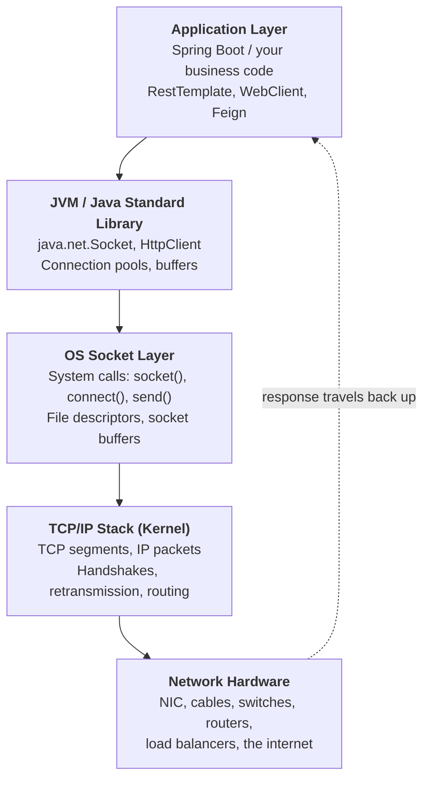

Notice the arrows go *down* on the way out and *up* on the way back. This up-and-down movement is the heartbeat of all networking. Every piece of data is wrapped (encapsulated) as it goes down, and unwrapped as it comes up on the other side. Hold that image.

Here's what each layer is responsible for:

- **Application (Spring Boot):** Decides *what* to say. The URL, the HTTP method, the headers, the JSON body. This is *intent*. It knows nothing about cables or IP addresses.
- **JVM / Java standard library:** Translates your intent into a sequence of bytes and manages *resources* — connection pools, sockets, buffers, timeouts. This is where `RestTemplate` lives. It decides *how* to talk but still delegates the actual sending.
- **OS socket layer:** The boundary between your program and the kernel. Your JVM asks the operating system, via *system calls*, "please open a connection" and "please send these bytes." The OS owns the actual network resources; the JVM only borrows them.
- **TCP/IP stack (inside the kernel):** The real networking engine. It breaks your data into segments, attaches addresses and ports, performs the handshake, guarantees delivery, retransmits lost data, and decides where packets physically go. *This is the post office.*
- **Network infrastructure:** The physical and virtual reality — your machine's network card, the switch in the rack, routers across the internet or data center, firewalls, load balancers, the destination machine.

## The full request lifecycle

Now the journey itself. Follow it as a story. Your code calls `getForObject` on an `https://` URL it has never contacted before.

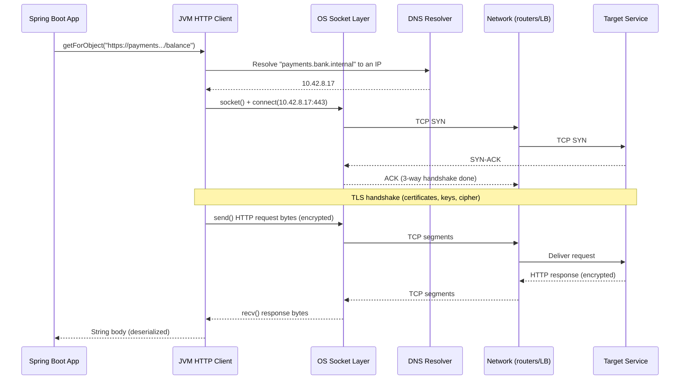

Let me narrate this in plain English, because the sequence diagram hides the *why*:

1. **DNS resolution first.** Your code used a *name* (`payments.bank.internal`), but the network only understands *numbers* (IP addresses like `10.42.8.17`). So before anything else, the JVM asks a DNS resolver to translate the name into a number. This is a network call *itself*, and it can fail — `UnknownHostException`. People forget DNS is a network operation that happens before their "real" request.

2. **TCP connection establishment (the 3-way handshake).** Now that we have an IP, the OS opens a *connection*. TCP doesn't just blurt out data — it first performs a polite three-message ceremony (SYN, SYN-ACK, ACK) to confirm both sides are alive and willing to talk. If the target is down or a firewall blocks the port, this is where you get **connection refused** or a **connect timeout**.

3. **TLS handshake (because it's `https://`).** The connection is established, but it's a plaintext pipe. Before sending sensitive banking data, both sides perform a cryptographic negotiation: exchange certificates, verify identity, agree on encryption keys. If the certificate is expired, untrusted, or the hostname doesn't match, the handshake fails here — `SSLHandshakeException`.

4. **Sending the request.** *Now* — and only now — your actual HTTP request bytes are encrypted and pushed through the OS into the network. TCP chops them into segments, numbers them, and ships them. The network (switches, routers, load balancers, the gateway) carries each segment toward the destination.

5. **The service processes and responds.** The far side reassembles the bytes, your business logic runs there, and a response travels back the same way — up through TCP, decrypted by TLS, handed to the JVM, deserialized into a `String` or a DTO, and returned to your code.

6. **Connection reuse or teardown.** A well-behaved client keeps the TCP connection open (keep-alive) so the next request can skip the handshake. Or the connection is closed with a FIN exchange.

## Where failures can occur — the punchline of section 1

Look back at those six steps. **Every single one is a separate failure domain.** This is the entire reason "the network is unreliable" — there is no single network, there's a chain, and a chain fails at its weakest link. Here is the map you must internalize:

| Stage | What can go wrong | What you see in Java |
|-------|-------------------|----------------------|
| DNS resolution | Name doesn't resolve, resolver down, stale cache | `UnknownHostException` |
| TCP handshake | Host down, port closed, firewall drop | `ConnectException: Connection refused`, connect timeout |
| TLS handshake | Bad/expired cert, hostname mismatch, untrusted CA | `SSLHandshakeException` |
| Sending/receiving | Slow server, network congestion, dropped packets | `SocketTimeoutException: Read timed out` |
| Mid-stream | Server crashes, LB kills idle connection | `Connection reset by peer` |
| Resource limits | Too many sockets, exhausted pool | `Too many open files`, pool timeout |

When you debug, your **first question is never "what's the bug?"** — it is **"which stage failed?"** Because the fix for a DNS failure and the fix for a TLS failure have nothing in common, and the error message usually tells you the stage if you know how to read it. The rest of this guide teaches you to read it.

---

# 2. The OSI Model (But Practical)

## Why this model even exists

In the early days of networking, every vendor built incompatible systems. To make machines from different companies talk, the industry needed a shared vocabulary — a way to say "this problem is at *this* level, not *that* level." The OSI (Open Systems Interconnection) model is that shared vocabulary: seven conceptual layers, each with a defined job, stacked on top of each other.

Here's the honest truth most courses won't tell you: **the real internet doesn't strictly follow OSI — it follows the simpler TCP/IP model.** OSI is a teaching tool and a *diagnostic* tool. Its real value to you is as a mental ladder: when something breaks, you climb the ladder asking "is *this* rung working?" before moving up.

So we won't memorize all seven layers as trivia. We'll learn the four that matter to a backend engineer and ruthlessly map them to your daily reality.

## The seven layers, and which ones you actually touch

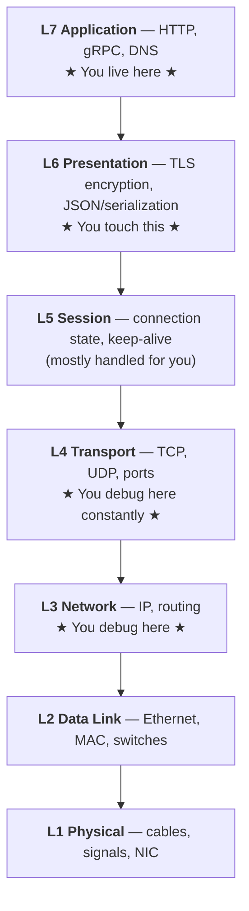

Let me be brutally practical about each, top to bottom, framed as *"why does a Java backend dev care?"*

**Layer 7 — Application.** This is HTTP, gRPC, and DNS. It is the language of *what you want*: `GET /balance`, status `200`, headers, JSON. When you read a `404` or a `503`, you are reading L7. Most of your day is here. The mental cue: **L7 problems have meaning** — a `403 Forbidden` is a deliberate decision by software, not a broken cable.

**Layer 6 — Presentation.** Encryption (TLS) and data formatting (how your JSON becomes bytes) live here. When you get an `SSLHandshakeException`, that's L6. When you debate JSON vs Protobuf, that's L6. The mental cue: **L6 is about translating meaning into a wire format and securing it.**

**Layer 5 — Session.** Managing the conversation: is the connection open, is it being reused, keep-alive. In practice your HTTP client and the kernel handle this, so you rarely poke it directly — but connection pooling (a huge production topic) conceptually lives here.

**Layer 4 — Transport.** TCP and UDP, and the concept of **ports**. This is where "connection refused," "connection reset," and "socket timeout" live. When you run `telnet host 443` to check if a port is open, you're testing L4. The mental cue: **L4 is about reliable (or unreliable) delivery between two programs, identified by port numbers.** You will debug here *constantly*.

**Layer 3 — Network.** IP addresses and routing. "How does a packet get from this data center to that one?" When a route is misconfigured, or a pod can't reach another pod's IP, that's L3. The mental cue: **L3 is about getting a packet to the right *machine* across networks.**

**Layers 2 and 1 — Data Link and Physical.** MAC addresses, switches, Ethernet frames, and literal cables and radio signals. As a backend dev you almost never touch these directly — but they explain things like MTU (covered in section 8) and "why did the whole rack go dark." The mental cue: **L1/L2 move bits between directly-connected machines.**

## The OSI ladder as a debugging tool

Here is the single most useful way to *use* OSI in real life. When a request fails, climb the ladder from the bottom:

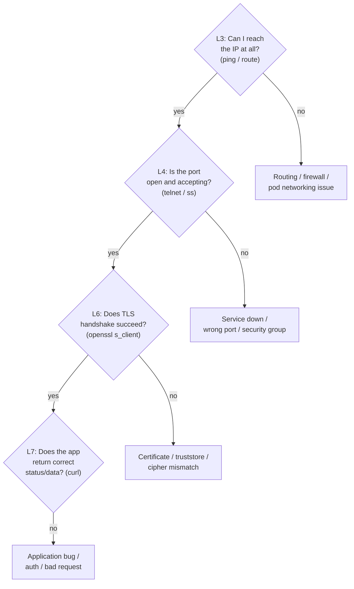

This ladder is gold. A junior engineer sees "service unreachable" and immediately blames the application code. A senior engineer asks: *can I even reach the IP?* (L3) → *is the port open?* (L4) → *does TLS work?* (L6) → *what does the app say?* (L7). By isolating the layer, you cut the problem space by 90% before writing a single line of fix. **Map every error to a layer, and the fix becomes obvious.**

---

# 3. HTTP Deep Understanding

## What HTTP really is

HTTP (HyperText Transfer Protocol) is, at its core, astonishingly simple: it is a **text-based request/response conversation**. One side asks, the other answers, and then — classically — they're done. That's it. Everything else (REST, GraphQL-over-HTTP, your entire microservice mesh) is built on this humble request-and-reply pattern.

The analogy I want you to hold: HTTP is like ordering at a restaurant counter. You walk up (open a connection), you state your order precisely — what you want and any special instructions (the request), the kitchen prepares it and hands it back with a receipt (the response), and the transaction is complete. The counter staff don't *remember* you the next time you walk up. You have to re-state everything. That forgetfulness is called **statelessness**, and it's the most important property of HTTP. We'll return to why it matters.

## The anatomy of an HTTP request

When you strip away all the libraries, an HTTP request is just plain text sent over a TCP connection. Here is what your `RestTemplate` call actually puts on the wire:

```http
GET /api/v1/balance?account=12345 HTTP/1.1
Host: payments.bank.internal
Authorization: Bearer eyJhbGciOi...
Accept: application/json
User-Agent: Java/17 Spring-RestTemplate
Connection: keep-alive

```

Read it line by line, because every line teaches something:

- **The request line** (`GET /api/v1/balance?account=12345 HTTP/1.1`) states three things: the *method* (what kind of action), the *path* (which resource), and the *protocol version*.
- **The headers** (everything from `Host:` to `Connection:`) are *metadata about the request* — key-value pairs that describe who's asking, what format they want back, how to authenticate, and how to manage the connection.
- **A blank line** — this is structurally critical. The blank line is how the receiver knows the headers have ended and the body (if any) begins. It's the period at the end of a sentence.
- **The body** (empty for a `GET`) would hold the actual payload for a `POST` or `PUT` — your JSON.

A POST looks like this — note the body after the blank line and the `Content-Length` / `Content-Type` headers that describe it:

```http
POST /api/v1/transfer HTTP/1.1
Host: payments.bank.internal
Content-Type: application/json
Content-Length: 58

{"from":"12345","to":"67890","amount":100.00,"currency":"USD"}
```

## The anatomy of an HTTP response

The kitchen hands back a receipt structured almost identically:

```http
HTTP/1.1 200 OK
Content-Type: application/json
Content-Length: 41
Date: Sat, 13 Jun 2026 10:15:30 GMT

{"account":"12345","balance":4200.50}
```

- **The status line** (`HTTP/1.1 200 OK`) carries the all-important *status code* — the single number that tells your code whether to celebrate or panic.
- **Response headers** describe the response payload (its type, its size, caching rules).
- **Blank line, then body** — same structure as the request.

## HTTP methods — and why they're not interchangeable

The method is a *verb* that declares your intent. They exist because "do something to a resource" is too vague; the server needs to know *what kind* of something.

- **GET** — "give me this resource." It should be *safe* (no side effects) and *idempotent* (calling it ten times is the same as once). This is why a browser or a proxy feels free to retry a GET, prefetch it, or cache it. **Never** put state-changing logic behind a GET — a crawler or retry will trigger it.
- **POST** — "create something / perform an action." Not idempotent: posting a transfer twice moves money twice. This non-idempotency is the source of countless production bugs (see retries in section 10).
- **PUT** — "replace this resource entirely at this location." Idempotent: putting the same object ten times leaves one object in the same state.
- **PATCH** — "partially update this resource." Apply a delta rather than a full replacement.
- **DELETE** — "remove this resource." Idempotent in principle: deleting twice, the second is a no-op (the thing is already gone).

> **Java relevance & a real trap:** The *idempotency* of a method dictates whether it's safe to auto-retry. Spring Cloud Gateway, Feign with Retry, and service meshes will happily retry failed requests. If you let them retry a non-idempotent **POST /transfer** on a read-timeout, you can **double-charge a customer** — even though the first request actually succeeded, the response just got lost. This is one of the most expensive bugs in banking systems. The defense is an **idempotency key** the server uses to deduplicate.

## Status codes — your most important diagnostic signal

Status codes are grouped by their first digit, and the grouping *is* the meaning:

- **2xx — Success.** It worked. `200 OK`, `201 Created`, `204 No Content`.
- **3xx — Redirection.** "Look somewhere else." `301`, `302`, `304 Not Modified`.
- **4xx — Client error.** *You* (the caller) did something wrong. Don't blindly retry — the request itself is the problem.
- **5xx — Server error.** *The server* failed. Often transient, often retryable.

The 4xx/5xx split is a mental fork you should make instantly: **4xx = fix your request; 5xx = the other side is struggling.** We'll cover the specific codes in the "Real Problems" subsection below, because seeing them in context teaches more than a list.

## Why HTTP is stateless (and why it's a feature, not a bug)

Recall the restaurant counter that forgets you. After each request/response, the server retains *no memory* of you. The next request must carry everything needed to understand it — credentials, context, identity — all over again.

This sounds inefficient, and it is, slightly. So why design it this way? **Scalability.** Because the server holds no per-client memory, *any* server instance can handle *any* request. This is the entire foundation of horizontal scaling and microservices. You can run 50 replicas of your payment service behind a load balancer, and a given customer's requests can bounce between all 50, because no single instance "owns" their session. If HTTP were stateful — if the server remembered you — you'd be pinned to one instance, and that instance becomes a single point of failure and a scaling bottleneck.

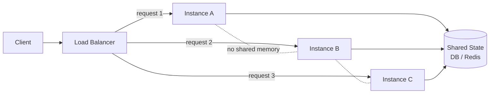

The trade-off: if statelessness means the server forgets you, *how do you stay logged in?* Two answers carry the "memory" outside the server: **tokens** (the client re-sends a JWT on every request, so identity travels *with* the request) and **cookies** (covered below). The state lives in a *shared store* (a database, Redis) that all instances reach, not in the server's local memory.

## Why headers exist

Headers exist to separate **metadata** from **data**. The body is *what you're sending*; headers are *everything the receiver needs to know to handle it correctly* without parsing the body first. `Content-Type` tells the receiver how to interpret the bytes. `Authorization` proves who you are. `Accept` says what you can understand back. `Content-Length` says how many body bytes to expect (critical — it's how the receiver knows when the body is complete on a reused connection).

The design principle: you should be able to understand the *envelope* (headers) without opening the *letter* (body). A proxy can route based on `Host` without ever reading your JSON. A cache can decide freshness from `Cache-Control` without understanding your data model. This separation is what lets infrastructure (gateways, CDNs, proxies) operate efficiently on traffic it doesn't semantically understand.

## Why the body exists

The body carries the *actual payload* — the JSON you're creating, the file you're uploading, the form you're submitting. It's separate from headers because it can be huge, binary, streamed, or compressed, while headers stay small and text-based. The blank line between them is the structural divider. Requests like GET typically have no body (you're just asking for something); requests like POST/PUT carry a body (you're sending something).

## Why cookies exist

Cookies are HTTP's patch for its own statelessness. The server can't remember you — so it hands the *client* a small token (`Set-Cookie: session=abc123`) and says "show me this every time you come back." The browser dutifully attaches `Cookie: session=abc123` to every subsequent request to that domain. Now the server can look up "abc123" in its session store and *reconstruct* who you are. The memory lives with the client (and a shared store), preserving statelessness while creating the *illusion* of a continuous session.

This matters in microservices because cookies are *automatic and domain-scoped* in browsers, while server-to-server calls (your Java services calling each other) usually use explicit `Authorization: Bearer` tokens instead — there's no browser to manage cookies for them.

## Why browsers behave differently than Postman (a classic confusion)

You test an endpoint in Postman — it works. The frontend team says it's broken in the browser. Both are sending "the same request," so what gives? They are *not* sending the same request. Browsers add behaviors that Postman doesn't:

- **CORS (Cross-Origin Resource Sharing):** A browser refuses to let JavaScript on `app.bank.com` read a response from `api.bank.com` unless the server explicitly permits it via `Access-Control-Allow-Origin` headers. Before the real request, the browser may send a **preflight `OPTIONS`** request to ask permission. Postman has no concept of "origin" and skips all of this — so it works in Postman and fails in the browser. This is the #1 "works in Postman" mystery.
- **Cookies & credentials:** Browsers automatically attach cookies; Postman only sends what you explicitly configure.
- **Caching:** Browsers aggressively cache GETs; Postman typically doesn't.
- **Security policies:** Mixed content (HTTPS page calling HTTP API) is blocked by browsers, ignored by Postman.

The lesson: **Postman tests your server in isolation; the browser tests your server *plus* the browser's security model.** When debugging "works in Postman, not in browser," suspect CORS first.

## Internal mechanics: how HTTP rides on TCP

Here is the layering that ties everything together. **HTTP is just the *content*; TCP is the *delivery truck*.** HTTP says "here are some bytes of text"; TCP guarantees those bytes arrive completely and in order. HTTP itself has no idea about packets, retransmission, or ordering — it *trusts TCP* for all of that. This is why HTTP can be so simple: it stands on TCP's reliability.

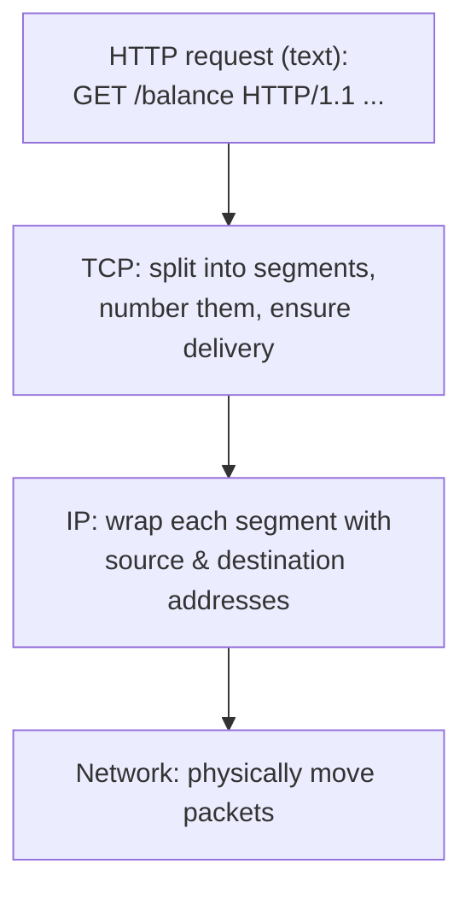

### How connection reuse (keep-alive) works

In HTTP/1.0, every request opened a fresh TCP connection and closed it after the response. Remember from section 1 that opening a connection means a 3-way handshake *and* (for HTTPS) a TLS handshake — that's multiple round trips of pure overhead *before any useful data moves*. Doing that for every single request is brutally wasteful.

**Keep-alive** (the default in HTTP/1.1) solves this: after the response, the TCP connection stays *open*, and the next request reuses it — skipping both handshakes. The `Connection: keep-alive` header signals this intent.

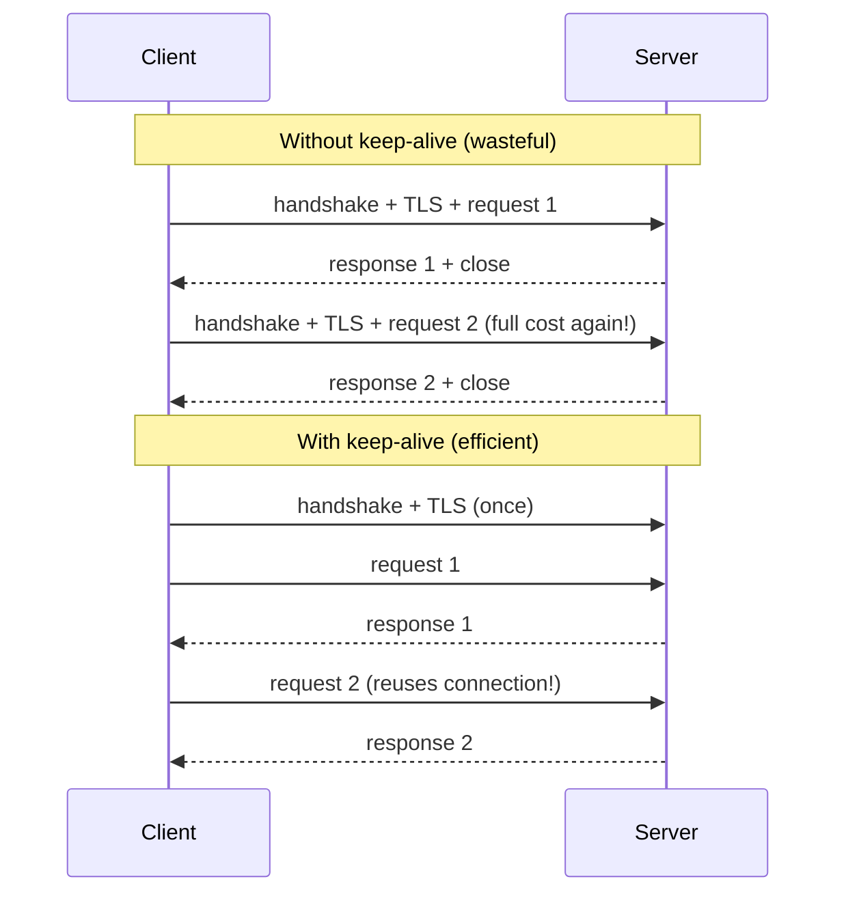

This is the conceptual basis of **connection pooling** in Java HTTP clients — a pool of warm, already-handshaked keep-alive connections ready to serve requests instantly. It's also the source of a nasty class of bug: an idle keep-alive connection can be silently killed by a load balancer or firewall after a timeout, but the *client* doesn't know — so the next request on that "dead" connection gets a **connection reset**. (More in section 8.)

### How proxies and gateways modify requests

A request rarely goes straight from your service to its target. It passes through proxies, API gateways, and load balancers — and these **actively rewrite the request**. They:

- **Add headers:** `X-Forwarded-For` (the original client IP, since the backend now sees the proxy's IP), `X-Forwarded-Proto` (was it originally HTTPS?), `X-Request-Id` (for tracing).
- **Strip or terminate TLS:** A gateway often *terminates* TLS (decrypts) at the edge and talks plain HTTP internally — this is **TLS termination**. Your backend may receive plaintext even though the client used HTTPS.
- **Rewrite paths:** Strip a prefix (`/api/payments/balance` → `/balance`) so the backend doesn't need to know its public path.
- **Enforce limits:** Reject oversized headers or bodies, apply rate limits, add timeouts.

> **Production gotcha:** Because gateways add headers, the total header size grows at each hop. Many servers cap header size (e.g., 8KB). A large JWT plus accumulated `X-Forwarded-*` headers can push a request over the limit, producing a confusing **`431 Request Header Fields Too Large`** or **`400 Bad Request`** that *only* appears in production (behind the gateway) and never in local testing. Always remember: the request your backend receives is *not* the request your client sent.

## How Java sends an HTTP request — the four clients

Java doesn't have one HTTP client; it has an evolution of them. Understanding what each does *internally* is essential.

### 1. RestTemplate (the classic, blocking workhorse)

```java
RestTemplate restTemplate = new RestTemplate();
ResponseEntity<Balance> response = restTemplate.getForEntity(
    "https://payments.bank.internal/api/v1/balance", Balance.class);
```

`RestTemplate` is **synchronous and blocking**. When you call it, the *calling thread* stops and waits — it is parked, doing nothing, until the response arrives or a timeout fires. Internally it delegates to a `ClientHttpRequestFactory` (by default the JDK's `HttpURLConnection`, but commonly swapped for Apache HttpClient to get real connection pooling). 

The critical thing to understand: **one in-flight request occupies one thread for its entire duration.** If a downstream service is slow and you have 200 Tomcat threads, 200 slow requests will consume *all* of them, and your service stops accepting *any* new work — even healthy requests. This is **thread-pool exhaustion**, and it's why `RestTemplate` is "risky under load" (more in section 9). `RestTemplate` is now in maintenance mode but remains extremely common in existing codebases.

### 2. WebClient (the non-blocking, reactive client)

```java
WebClient client = WebClient.create("https://payments.bank.internal");
Mono<Balance> balance = client.get()
    .uri("/api/v1/balance")
    .retrieve()
    .bodyToMono(Balance.class);
// The thread is NOT blocked here; the result arrives via callback later.
```

`WebClient` is **asynchronous and non-blocking**, built on Project Reactor and Netty. Instead of parking a thread to wait, it *registers a callback* and releases the thread to do other work. When the response bytes arrive, an event-loop thread picks them up and continues. A handful of event-loop threads can manage *thousands* of concurrent in-flight requests, because no thread is ever idly waiting. This is the right tool for high-concurrency or fan-out scenarios. The cost is a steeper mental model (reactive `Mono`/`Flux`) and the rule that you must *never* block inside the event loop.

### 3. FeignClient (the declarative client)

```java
@FeignClient(name = "payments", url = "https://payments.bank.internal")
public interface PaymentsClient {
    @GetMapping("/api/v1/balance")
    Balance getBalance(@RequestParam("account") String account);
}
```

Feign is **declarative**: you define an *interface*, and Feign generates the implementation at runtime. You call `paymentsClient.getBalance("123")` as if it were a local method, and Feign translates it into an HTTP call. It's beloved in Spring Cloud because it integrates cleanly with service discovery (use a service *name* instead of a URL and it resolves via Eureka/Kubernetes), load balancing, retries, and circuit breakers. Under the hood it's blocking like `RestTemplate` (unless you use reactive Feign), so the same thread-occupancy caveats apply. Its value is *ergonomics and integration*, not a different networking model.

### 4. HttpClient (the modern JDK client, Java 11+)

```java
HttpClient httpClient = HttpClient.newBuilder()
    .connectTimeout(Duration.ofSeconds(2))
    .build();
HttpRequest request = HttpRequest.newBuilder()
    .uri(URI.create("https://payments.bank.internal/api/v1/balance"))
    .header("Authorization", "Bearer " + token)
    .GET()
    .build();
// Synchronous:
HttpResponse<String> response = httpClient.send(request, BodyHandlers.ofString());
// Or asynchronous:
CompletableFuture<HttpResponse<String>> future =
    httpClient.sendAsync(request, BodyHandlers.ofString());
```

The JDK's built-in `java.net.http.HttpClient` (standardized in Java 11) is the modern foundation: it supports **both** synchronous and asynchronous styles, **HTTP/2**, connection pooling, and WebSockets — no external library needed. It's increasingly the base layer that higher-level clients build on.

### What happens internally — common to all of them

No matter which client you choose, when it actually sends, the sequence is identical underneath: **resolve DNS → acquire a socket (from a pool or new) → (TLS handshake if needed) → write the HTTP bytes to the socket → block or await → read response bytes → parse status line, headers, body → deserialize into your object.** The clients differ in *ergonomics* and in *whether they park a thread while waiting* — but they all bottom out at the same OS sockets and the same TCP/IP stack from section 1. The client is just a convenience layer over `connect()`, `send()`, and `recv()`.

## Real problems: reading HTTP errors like a doctor reads symptoms

Now the payoff. Here's how to interpret the codes and failures you'll actually see, with their likely root causes:

- **`400 Bad Request`** — The server couldn't understand your request. Malformed JSON, missing required field, a header that's too large, invalid query params. **It's your request's fault.** Don't retry; fix the payload. In production, a sudden flood of 400s often means a deploy changed an API contract.

- **`401 Unauthorized`** — "I don't know who you are." Missing, expired, or invalid credentials (a dead JWT, no `Authorization` header). The fix is authentication — refresh the token. *Note the misnomer:* 401 is about *authentication* (who are you), despite saying "Unauthorized."

- **`403 Forbidden`** — "I know who you are, but you're not allowed." Authentication succeeded, *authorization* failed. The token is valid but lacks the required role/scope. Refreshing the token won't help; the user genuinely lacks permission.

- **`404 Not Found`** — The resource (or route) doesn't exist. Could be a real missing resource, *or* a wrong path, *or* — sneakily — a gateway routing misconfiguration sending you to the wrong service. In microservices, a 404 sometimes means "the route exists but the gateway doesn't know about this service."

- **`500 Internal Server Error`** — The server's own code threw an unhandled exception. **It's the server's fault, not yours.** Your request may be perfectly valid. The fix lives in the *other* service's logs — go read *their* stack trace, not yours.

- **`502 Bad Gateway`** — A gateway/proxy tried to forward your request to a backend, and the backend gave an *invalid or no response* (crashed, returned garbage, closed the connection mid-response). **The gateway is healthy; the backend behind it is broken.** Extremely common in Kubernetes when a pod is crashing or just starting.

- **`503 Service Unavailable`** — The server is up but temporarily can't serve — overloaded, no healthy backends, in maintenance, or a circuit breaker is open. Often *retryable after a delay* (respect `Retry-After`). In K8s, frequently means "no ready pods behind this service."

- **`504 Gateway Timeout`** — A gateway forwarded your request to a backend, waited, and the backend *didn't respond in time*. **The backend is alive but too slow** (a slow query, a downstream hang). This is the classic symptom of a deep, slow dependency chain. Distinguish it sharply from 502: 502 = bad/no response; 504 = no response *in time*.

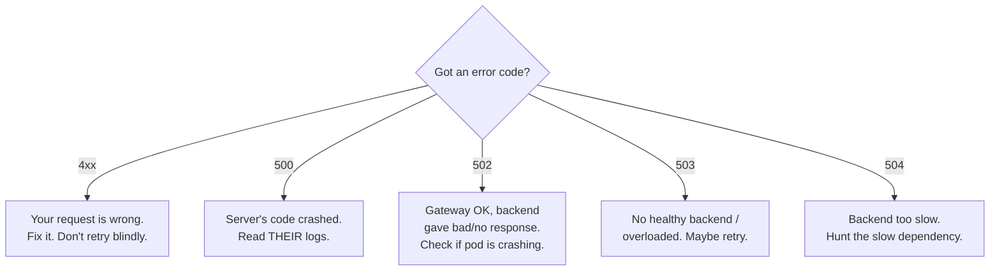

### Header size issues

Headers aren't free. Servers cap total header size (commonly 8KB; Spring Boot's embedded Tomcat default `max-http-header-size` is 8KB). When a fat JWT (with many claims) meets accumulated `X-Forwarded-*`, `Cookie`, and tracing headers, you can blow the limit and get a `400` or `431`. The fix is either trimming headers (smaller tokens, fewer claims) or raising the server's limit (`server.max-http-header-size=16KB`). The trap is that it manifests *only in production*, behind the gateway, because local requests don't accumulate the extra headers.

### Timeout issues

There are *several distinct timeouts*, and conflating them is a classic mistake (detailed in section 4). At the HTTP level: a **connect timeout** means "I couldn't even establish the TCP connection in time" (target down/unreachable), while a **read timeout** means "I connected fine, sent my request, but the server is taking too long to respond" (slow server/query). These point at completely different root causes — connect timeout = *reachability* problem, read timeout = *performance* problem.

### Connection reset

`Connection reset by peer` means the other side (or something in between, like a load balancer) abruptly slammed the connection shut with a TCP RST instead of a graceful close. Common causes: the server crashed mid-request, an idle keep-alive connection was reaped by an LB/firewall and you tried to reuse it, or the server hit a hard limit and killed the connection. This is fundamentally a *TCP-level* event surfacing in your HTTP client — which is the perfect bridge to the next section.

---

# 4. TCP Deep Understanding

## Why TCP exists at all

The raw internet (the IP layer) makes you a single, almost insulting promise: *"I'll try my best to deliver your packet, but I guarantee nothing."* Packets can be lost, duplicated, arrive out of order, or be corrupted. It's like a postal system that throws your letters in the general direction of the destination and shrugs. For a lot of applications — and certainly for a bank moving money — "I'll try my best" is unacceptable. You need *certainty*.

**TCP (Transmission Control Protocol) is the layer that turns the unreliable IP "best effort" into a reliable, ordered, error-checked stream.** It takes the chaotic packet soup and presents your application with a clean abstraction: *a continuous, ordered, guaranteed pipe of bytes*. When you write to a TCP socket, TCP swears that those exact bytes, in that exact order, with no gaps and no duplicates, will arrive at the other end — or it will tell you the connection broke trying. That guarantee is why HTTP, and therefore the vast majority of backend communication, rides on TCP.

The analogy: IP is dropping numbered pages of a book individually into the mail with no tracking. TCP is the diligent assistant who numbers every page, mails them, waits for the recipient to confirm each one, *re-mails any that got lost*, and ensures the recipient can reassemble the book in perfect order even if pages arrived scrambled. The assistant is the difference between chaos and reliability.

## The three-way handshake — connection establishment

TCP is *connection-oriented*. Before any data flows, both sides must agree to talk and synchronize their state. This agreement is the famous **three-way handshake**, and you should know it cold because so many failures happen *right here*, before your request bytes ever move.

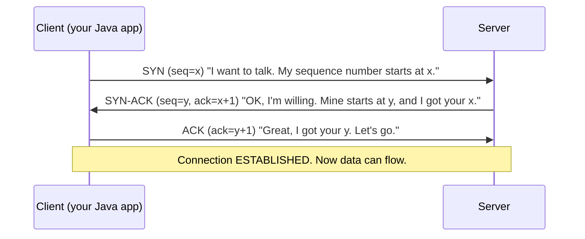

Why *three* messages? Because both sides need to confirm two things each: "can I send to you?" and "can you send to me?" The client's SYN proves the client→server path; the server's SYN-ACK proves server→client *and* acknowledges the client; the client's final ACK confirms it received the server's part. After three messages, both sides *know that both sides know* the connection is live and have exchanged the starting sequence numbers used to order all future bytes.

The real-world cost: this is a **full round trip** before useful data moves. Over a 50ms-latency link, that's 50ms of pure setup. Add a TLS handshake (another 1-2 round trips) and you've spent 100-150ms before sending a single byte of your actual request. *This is why keep-alive and connection pooling matter so much* — they amortize this cost across many requests.

### Where the handshake fails (and what Java tells you)

- **`Connection refused`** — The client's SYN reached the server's machine, but *nothing was listening* on that port. The OS immediately replied with an RST. This is a *fast, definitive* failure: "I'm here, but that door doesn't exist." Usually means the service is down or you've got the wrong port.
- **Connect timeout (SYN timeout)** — The SYN went out and *no reply came at all* — no SYN-ACK, no RST, just silence. The client retransmits the SYN a few times, then gives up. Silence usually means a *firewall is dropping the packet* or the host is unreachable/down. The distinction is sharp and diagnostic: **refused = something answered "no"; timeout = nothing answered at all.**

## Reliability: how TCP actually guarantees delivery

TCP's reliability isn't magic — it's a few clever, relentless mechanisms working together:

**Sequence numbers.** Every byte TCP sends is numbered. This lets the receiver reassemble data in the correct order even if segments arrive scrambled, and detect duplicates (just drop a byte-range you already have).

**Acknowledgements (ACKs).** The receiver tells the sender "I've received everything up to byte N." Until the sender hears that ACK, it *keeps a copy* of the sent data in a buffer, ready to resend.

**Retransmission.** If the sender doesn't receive an ACK within a *retransmission timeout*, it assumes the data was lost and *sends it again*. This is the heart of reliability: lost data is automatically re-sent without your application ever knowing. (This is also why a lossy network manifests as *latency* rather than *errors* — TCP hides the loss by retrying, which takes time.)

**Checksums.** Each segment carries a checksum so the receiver can detect corruption and discard bad segments (which then get retransmitted).

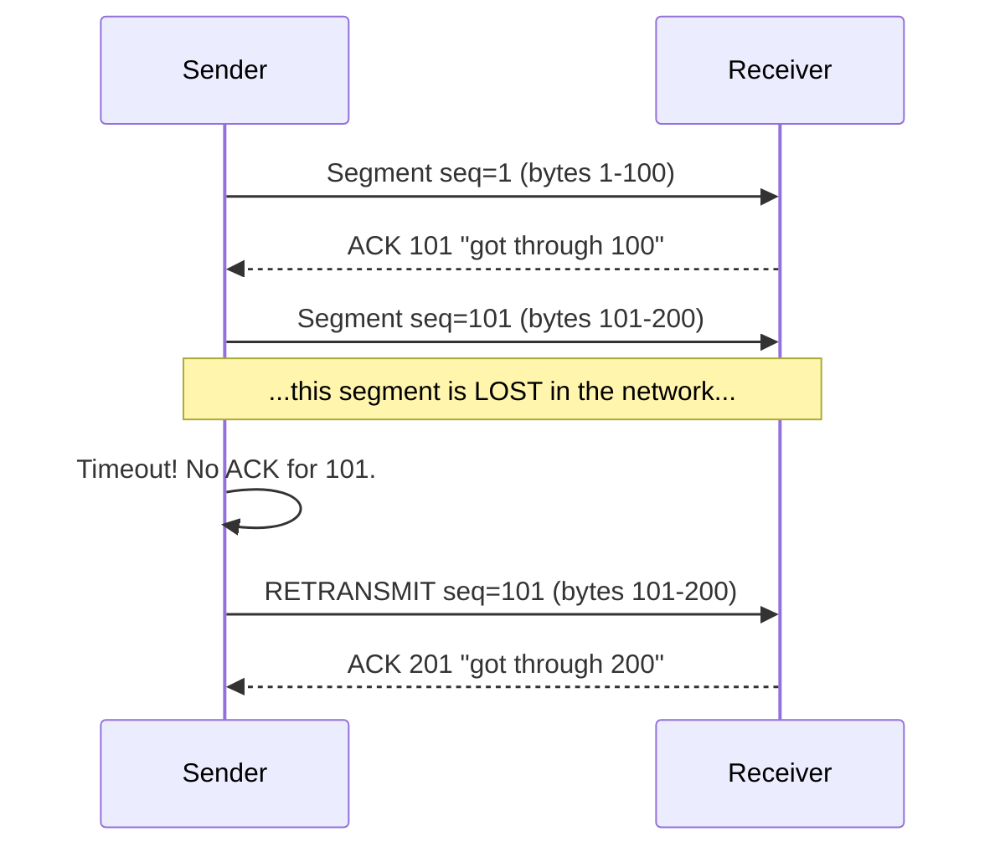

## Flow control and congestion control — why TCP slows itself down

Two more mechanisms shape TCP's behavior under load, and both matter for performance debugging.

**Flow control (the receiver's brake).** What if the sender is fast and the receiver is slow, its buffer filling up? TCP's *sliding window* lets the receiver advertise "I can only accept N more bytes right now." The sender respects this window and won't overflow a slow receiver. It's a politeness mechanism: don't talk faster than the listener can absorb.

**Congestion control (the network's brake).** What if the *network itself* (not the receiver) is overloaded? TCP can't see the routers, but it *infers* congestion from packet loss: lost packets = network is full. So TCP starts cautiously (**slow start**), ramps up its sending rate, and *backs off sharply* when it detects loss. This is why a single TCP connection takes a moment to reach full speed, and why a congested network causes throughput to collapse — every sender backs off simultaneously. For you, this surfaces as *latency spikes and reduced throughput* under network stress, not as hard errors.

## Connection termination — FIN and RST

There are two ways a TCP connection ends, and the difference is diagnostic.

**Graceful close (FIN) — the four-way handshake.** When a side is done, it sends a `FIN` ("I have no more data"). The other side ACKs it, sends its *own* FIN when it's done, gets an ACK, and both sides close cleanly. It's a polite "goodbye / goodbye back."

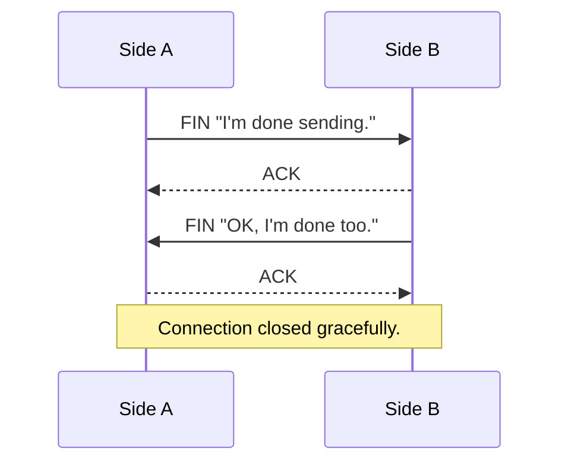

**Abrupt close (RST) — the door slam.** A `RST` (reset) is not a goodbye — it's an immediate, unilateral termination: "this connection is dead *now*, stop." It's sent when something is wrong: you tried to send data to a connection the other side already closed, the port isn't listening, the server crashed, or a load balancer killed an idle connection. **`Connection reset by peer` is a RST surfacing in your Java code.** The mental model: FIN is hanging up the phone after saying goodbye; RST is yanking the cord out of the wall.

> A `FIN` after a TIME_WAIT state lingers — the closing side holds the connection in `TIME_WAIT` for a couple minutes to absorb any stray delayed packets. Under very high connection churn (e.g., *not* reusing connections), thousands of `TIME_WAIT` sockets can pile up and exhaust ports — yet another argument for connection pooling.

## Java relevance: TCP as you actually encounter it

### Socket creation in the JVM

When your HTTP client connects, deep down the JVM calls `new Socket()` (or NIO `SocketChannel`), which invokes the OS `socket()` and `connect()` system calls — triggering the three-way handshake from above. A `java.net.Socket` is your Java handle to one TCP connection. Each open socket consumes a **file descriptor** (on Linux, sockets *are* files), and file descriptors are a *limited resource* — which is the root of the dreaded "too many open files."

### Connection pooling

Because handshakes are expensive (section 3's keep-alive discussion), production HTTP clients maintain a **connection pool**: a managed set of warm, reusable TCP connections. When you make a request, the client borrows an idle connection from the pool (or opens a new one if none is free and the pool isn't maxed), uses it, and returns it. A pool has two key limits: **max total connections** and **max per route (per destination host)**. Exhausting these limits is a top-tier production incident (below).

### Keep-alive behavior

The pool relies on TCP keep-alive: connections stay open between requests. But — critically — a connection that's been *idle* too long may have been silently killed by the *other end* (server, LB, firewall) without notifying your client. Your client thinks it's healthy, borrows it, sends a request, and gets a **connection reset**. The defense is *connection validation* (check/ping before use) and *idle eviction* (proactively close connections idle longer than the infrastructure's idle timeout).

### The three timeouts you must configure (and never confuse)

This is one of the highest-value things in this entire guide. There are **three different timeouts**, they protect against *different failures*, and forgetting any one is a classic production outage:

```java
// Example with Apache HttpClient via RestTemplate
HttpComponentsClientHttpRequestFactory factory = new HttpComponentsClientHttpRequestFactory();
factory.setConnectTimeout(2000);   // (1) connect timeout
factory.setConnectionRequestTimeout(1000); // (3) pool-acquire timeout
factory.setReadTimeout(5000);      // (2) read/socket timeout
RestTemplate restTemplate = new RestTemplate(factory);
```

1. **Connect timeout** — max time to *establish the TCP connection* (complete the handshake). Protects against an unreachable/dead host. Should be *short* (1-3s) — a healthy connection completes in milliseconds; waiting 30s to discover a host is down is a self-inflicted outage.

2. **Read timeout (socket timeout)** — max time to *wait for data* after the request is sent. Protects against a slow or hung server. Tune to your endpoint's realistic latency.

3. **Connection-request / pool timeout** — max time to *wait for a free connection from the pool*. Protects against pool exhaustion. **This is the one everyone forgets**, and its absence is catastrophic: if you don't set it and the pool is exhausted, threads wait *forever* for a connection, cascading into total thread-pool exhaustion.

> **The cardinal sin: no timeouts at all.** The JDK's defaults are often *infinite*. A service with no timeouts, calling a hung dependency, will pile up threads — each one blocked forever — until it exhausts its thread pool and stops serving *everything*. Then *its* callers time out and pile up too. This is how one slow service takes down an entire mesh: the **cascading failure**. *Always set all three timeouts, everywhere.*

## Real TCP failures — the field guide

| Symptom in Java | TCP-level reality | Likely root cause |
|---|---|---|
| `ConnectException: Connection refused` | SYN got an RST back | Service down, wrong port, nothing listening |
| `SocketTimeoutException: connect timed out` | SYN sent, no reply at all | Firewall dropping packets, host unreachable/down |
| `SocketTimeoutException: Read timed out` | Connected, but no response data in time | Slow server, slow DB query, downstream hang |
| `IOException: Connection reset by peer` | Received an RST mid-connection | Server crashed, idle keep-alive reaped by LB |
| `SocketException: Too many open files` | FD limit hit | Socket/connection leak, undersized `ulimit` |
| Pool timeout / `ConnectionPoolTimeoutException` | No free connection in pool | Pool too small, slow downstream holding connections |

Let me deepen the two most misunderstood:

**`Connection reset by peer`** is not your fault *most* of the time — something abruptly RST your connection. Walk the chain: Did the server crash (check *its* logs/restarts)? Is a load balancer reaping idle connections faster than your pool evicts them (mismatch between your idle timeout and the LB's)? Did the server hit a max-connections limit and start killing connections? The fix is usually to align your client's idle-connection eviction to be *shorter* than the infrastructure's idle timeout, plus enable connection validation.

**`Too many open files`** is a resource-exhaustion failure. Every socket is a file descriptor; Linux caps them per process (`ulimit -n`). You hit this either because (a) you're *leaking* connections — not closing responses/streams, so sockets accumulate — or (b) your legitimate concurrency genuinely exceeds the limit. Diagnose with `lsof -p <pid> | wc -l` and `ss -s`. The fix is *both*: find and close the leak (a `try-with-resources` on your HTTP response, a properly bounded pool) *and* raise the `ulimit` if your real load justifies it. A pure limit-raise without fixing a leak just delays the crash.

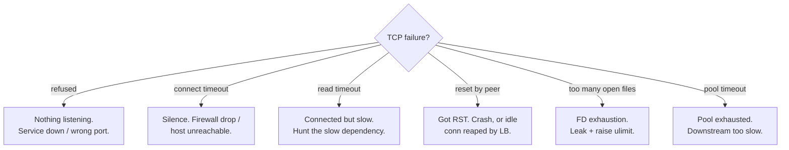

---

# 5. UDP Explained Simply

## What UDP is, and why it's the opposite of TCP

If TCP is the diligent assistant who numbers every page and confirms delivery, **UDP (User Datagram Protocol) is dropping a postcard in a mailbox and walking away.** You write your message, address it, send it — and you get *no* confirmation, *no* retransmission, *no* ordering, *no* connection. It might arrive. It might not. It might arrive after the postcard you sent later. UDP doesn't care. It is "fire and forget."

This sounds useless after all of TCP's hard-won guarantees, so why does it exist? **Because all those guarantees cost something — round trips, buffering, latency, state — and sometimes you'd rather have *speed* than *certainty*.** UDP strips away everything TCP adds. There's no handshake (so no round-trip setup cost), no ACKs (so no waiting), no ordering (so no head-of-line blocking), no congestion backoff. You just send a *datagram* — a single, self-contained packet — and it goes immediately.

## Why UDP is faster

UDP is faster for reasons that follow directly from what it *omits*:

- **No handshake** — TCP burns a full round trip before sending data; UDP sends instantly.
- **No ACKs or retransmission** — TCP waits for confirmations and resends lost data, which costs time; UDP never waits.
- **No ordering buffer** — TCP holds out-of-order data until gaps are filled (head-of-line blocking); UDP delivers each packet the moment it arrives.
- **No connection state** — TCP maintains per-connection bookkeeping; UDP is stateless and lightweight.

The trade is stark and absolute: **UDP gives you speed and simplicity by giving up reliability and ordering.** For some workloads that's a terrible deal; for others it's exactly right.

## When UDP is the right choice — and why

- **DNS.** A DNS lookup is one tiny question and one tiny answer. Setting up a whole TCP connection (handshake, teardown) for a single small exchange is wasteful. UDP sends the query in one packet, gets the reply in one packet, done — far faster. If a DNS packet is lost, the resolver just asks again. (DNS *does* fall back to TCP for large responses.)
- **Live streaming & video calls.** If you're on a video call and one frame's worth of data is lost, you do *not* want TCP to stop everything and retransmit that old frame — by the time it arrives, that moment has passed and you've moved on. A momentary glitch is far better than the whole stream freezing to recover stale data. UDP lets you skip the lost data and keep going in real time.
- **Online gaming.** Your character's position 50ms ago is worthless now. Games send position updates over UDP; if one is lost, the next update (with the *current* position) makes it irrelevant. Latency matters infinitely more than completeness.

The unifying principle: **UDP fits when fresh-but-incomplete beats complete-but-late.** When stale data is useless, retransmission is pointless, so you skip the machinery that provides it.

## Why backend systems rarely use UDP directly

Here's the honest reality for a Java backend engineer: **you will almost never write UDP code.** Your world is request/response over HTTP, which demands reliability and ordering — you absolutely *do* want the bank-transfer request to arrive completely and exactly once. Losing half a JSON body is catastrophic, and reliability is non-negotiable. So your business traffic rides TCP.

Where UDP touches your life is *indirectly and underneath*:

- **DNS** (every hostname resolution your service does starts as a UDP packet).
- **Newer protocols built on UDP:** **QUIC** (the transport under HTTP/3) reimplements reliability and ordering *on top of* UDP to get TCP-like guarantees *without* TCP's head-of-line blocking and with faster connection setup. So even as "HTTP/3" sounds like more of the same, it's quietly UDP-based underneath.
- **Metrics and logging:** Some systems (e.g., StatsD) ship metrics over UDP precisely *because* they're fine losing the occasional data point in exchange for never blocking the application.

So: know UDP conceptually, recognize it powers DNS and HTTP/3, but don't expect to open a `DatagramSocket` in your payment service. Your reliability-critical traffic belongs on TCP.

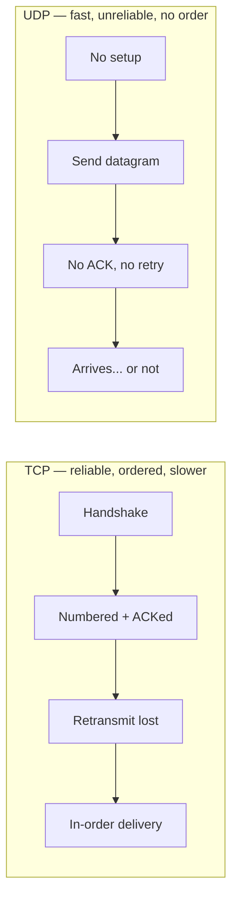

---

# 6. DNS Deep Explanation

## What DNS is and why it must exist

Humans think in names; networks route by numbers. You type `payments.bank.internal`; the network needs `10.42.8.17`. **DNS (Domain Name System) is the phone book of the internet** — the distributed system that translates human-friendly names into machine-routable IP addresses. Without it, you'd hardcode IP addresses everywhere, and the moment a server moved or scaled, everything would break. DNS gives us a *stable name* that can point to a *changing address* — which is the entire foundation of how modern, elastic, auto-scaling systems stay reachable.

This indirection is profound for microservices: a service can be killed, rescheduled onto a different node with a new IP, and *replaced* — and callers keep using the same name, blissfully unaware the underlying IP changed. The name is the stable contract; the IP is an implementation detail that DNS resolves *at call time*.

## How name resolution actually works

When your JVM needs to resolve a name, it doesn't ask one server — it walks a *hierarchy*, because no single machine could hold the whole internet's name→IP mapping. The journey (for a public name) looks like this:

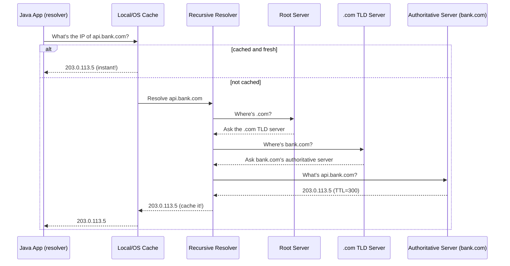

Read it as a phone-book search delegated down a hierarchy: the *recursive resolver* (usually run by your network or a public one like `8.8.8.8`) does the legwork — it asks a *root* server "who handles `.com`?", then asks the `.com` server "who handles `bank.com`?", then asks `bank.com`'s *authoritative* server "what's the IP of `api.bank.com`?" Each level delegates to a more specific authority. The resolver collects the answer and *caches* it so it doesn't repeat this whole dance next time.

## Caching layers and TTL — the double-edged sword

DNS resolution is expensive (multiple network round trips), so the answer is **cached at many layers**: the authoritative server tells everyone how long the answer is valid via a **TTL (Time To Live)** — say, 300 seconds. During that window, the recursive resolver, your OS, and your application can all serve the cached IP without re-asking. Caching makes DNS fast and scalable.

But caching is a *double-edged sword*, and this is where production pain lives. **TTL is a promise about how stale your data might be.** If a service's IP changes (a failover, a redeploy) but a cached entry says "valid for 300 more seconds," callers will keep hitting the *old, dead* IP until the TTL expires. Low TTLs mean faster propagation of changes but more DNS traffic; high TTLs mean efficiency but slow failover.

### The JVM's DNS caching trap

This is a Java-specific landmine. **The JVM has its *own* DNS cache, separate from the OS**, controlled by the security property `networkaddress.cache.ttl`. Historically, in some configurations the JVM cached successful lookups *forever* (`-1`). The consequence: a long-running Java service resolves `db.bank.com` once at startup, the database fails over to a new IP, but the JVM *keeps using the old cached IP indefinitely* — and you get connection failures that mysteriously "fix themselves" only on a restart. The fix is to set a sane JVM DNS TTL (e.g., 30-60 seconds) so the JVM re-resolves periodically. Every backend engineer running long-lived JVMs against DNS-based failover should know this setting exists.

## Why `UnknownHostException` happens

`UnknownHostException` is the JVM saying **"I tried to translate this name to an IP and got nothing."** It is purely a *resolution* failure — it happens *before* any TCP connection is even attempted. Common causes, in order of frequency:

- **The name genuinely doesn't exist** — a typo, a wrong service name, an environment mismatch (using a prod hostname in staging).
- **The DNS server is unreachable or down** — your resolver itself isn't answering.
- **In Kubernetes: the in-cluster DNS (CoreDNS) is failing or overloaded** — extremely common (below).
- **A short-lived DNS hiccup** — transient resolver failure, which is why DNS errors often appear intermittently.

The key mental shift: **`UnknownHostException` is not a connection problem — it's a *name lookup* problem.** When you see it, don't check firewalls or ports; check DNS. Run `nslookup`/`dig` on the name from the same host. The fix lives at the resolution layer, not the connection layer.

## How service names resolve in Kubernetes

Kubernetes runs its *own* internal DNS (CoreDNS), and understanding it demystifies a huge swath of microservice failures. Every Kubernetes `Service` automatically gets a DNS name following a strict pattern:

```
<service-name>.<namespace>.svc.cluster.local
```

So a service named `payments` in the `banking` namespace is reachable at `payments.banking.svc.cluster.local` — and, thanks to DNS *search domains* configured in each pod, often just `payments` (within the same namespace) or `payments.banking`. When your Java app calls `http://payments/api/v1/balance`, CoreDNS resolves `payments` to the Service's stable *virtual IP* (ClusterIP), which then load-balances across the actual pod IPs.

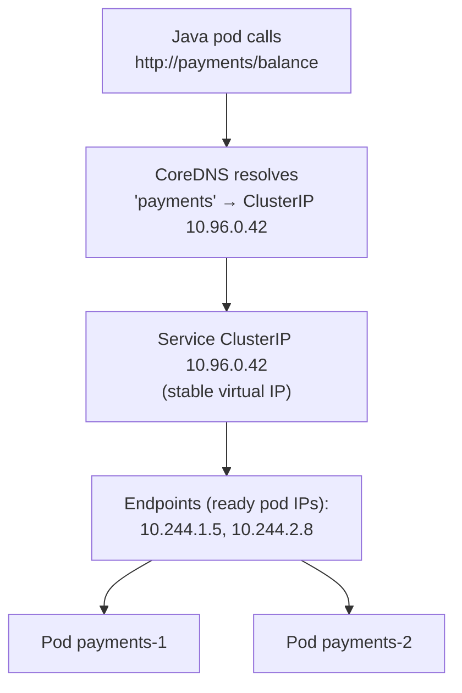

This is the elastic-naming magic from earlier made concrete: pods come and go with ephemeral IPs, but the *Service name* and its ClusterIP are stable, and CoreDNS + the Endpoints list keep the routing current.

## Why DNS failures are common in microservices

DNS becomes a *hot path* in microservices in a way it never was in monoliths, and that's exactly why it fails so often:

- **Every inter-service call may trigger a resolution.** In a monolith, you make a few DNS lookups at startup. In a mesh of dozens of services making thousands of calls per second *by name*, DNS is suddenly on the critical path of nearly every request — and **CoreDNS can become a bottleneck or single point of failure.** If CoreDNS is overloaded, slow, or restarting, *every* service that resolves a name at call time experiences errors or latency simultaneously. A CoreDNS hiccup looks like "everything is intermittently broken," which is terrifying to debug if you don't suspect DNS.
- **Aggressive caching meets fast-changing pods.** Pods churn constantly (deploys, scaling, crashes), so the name→IP mapping changes frequently. If anything caches too aggressively (the JVM trap above, or `ndots` misconfigurations causing excess lookups), you get stale routing.
- **The `ndots` performance trap.** Kubernetes default `ndots:5` means names with fewer than 5 dots get tried against each search domain *first*, multiplying lookups. A call to an *external* name like `api.stripe.com` might trigger several failed internal lookups (`api.stripe.com.banking.svc.cluster.local`, etc.) before the real one succeeds — adding latency and load to CoreDNS. Knowing this explains otherwise-baffling DNS slowness.

The takeaway: **in microservices, DNS is infrastructure on the critical path, not a one-time startup detail.** Treat it as a first-class dependency: monitor CoreDNS, set sane JVM TTLs, and when "everything is weirdly broken intermittently," put DNS near the top of your suspect list.

---

# 7. TLS / SSL Deep Understanding

## HTTPS vs HTTP — what the "S" actually buys you

Plain HTTP sends everything as readable text across the network. Every router, switch, proxy, and anyone who can tap the wire sees your request *in the clear* — including the `Authorization` header with your bearer token and the JSON with account numbers. For a bank, that's a catastrophe. **HTTPS is HTTP wrapped in TLS (Transport Layer Security)** — the same HTTP conversation, but encrypted so that anyone in the middle sees only meaningless ciphertext.

TLS (the modern name; "SSL" is the deprecated predecessor, but people still say "SSL" colloquially) provides three guarantees, and you should be able to name all three:

- **Confidentiality** — the data is encrypted; eavesdroppers see gibberish.
- **Integrity** — the data can't be tampered with in transit without detection.
- **Authentication** — you can verify you're *actually* talking to `payments.bank.internal` and not an impostor.

That third one — authentication — is what *certificates* are for, and it's where most of your debugging pain will come from.

## Public/private key encryption — the core idea

To understand TLS you need one beautiful idea: **asymmetric (public/private key) cryptography.** Each party has a *pair* of mathematically linked keys. The **public key** can be shared with anyone; the **private key** is kept secret. The magic property: *anything encrypted with the public key can only be decrypted with the matching private key* (and vice versa).

The analogy: a public key is an **open padlock** you hand out freely. Anyone can snap it shut on a box (encrypt), but *only you*, holding the unique key (the private key), can open it (decrypt). You can publish your open padlocks to the whole world without risk, because having the padlock doesn't let anyone *open* what's locked with it.

But asymmetric crypto is *slow*, so TLS uses it cleverly: it uses asymmetric crypto *only at the start* — to safely agree on a shared **symmetric** key — and then uses fast symmetric encryption for the actual data. You get the security of asymmetric key exchange with the speed of symmetric bulk encryption. This handoff is the heart of the handshake.

## The TLS handshake — step by step

Recall from section 1 that *after* the TCP handshake, before any HTTP data, comes the TLS handshake. Here's what happens (simplified for the classic flow):

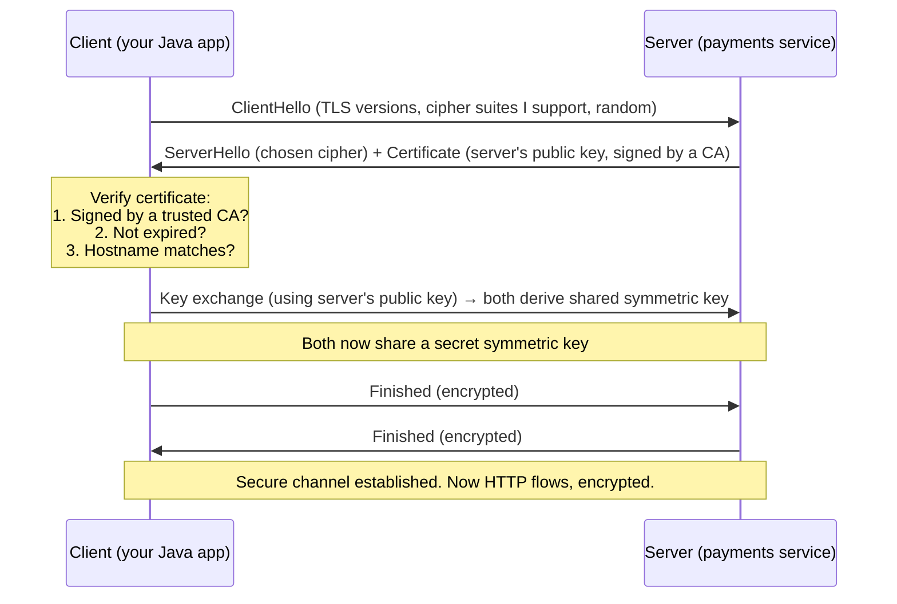

In plain English: the client says "here's what encryption I support." The server picks one and sends its **certificate** — which contains its public key *and a signature from a Certificate Authority vouching for its identity*. The client **verifies the certificate** (this is the critical, failure-prone step), then they use the public key to securely establish a shared symmetric key. From that point, all HTTP data flows encrypted with that fast symmetric key. The whole dance costs one or two extra round trips — which, again, is why connection reuse (keep-alive) matters so much, since it avoids re-doing this per request.

## Certificates and the chain of trust

How does the client *trust* the server's certificate? It can't have met every server before. The answer is a **chain of trust** anchored in **Certificate Authorities (CAs)** — a small set of organizations everyone agrees to trust.

A server's certificate is *signed* by an intermediate CA, whose certificate is signed by a root CA. Your client (the JVM) ships with a built-in list of trusted root CAs (in its **truststore**). When the server presents its certificate, the client walks the chain: "this server cert is signed by intermediate X, which is signed by root Y — and I have root Y in my trusted list. ✅ Trust established."

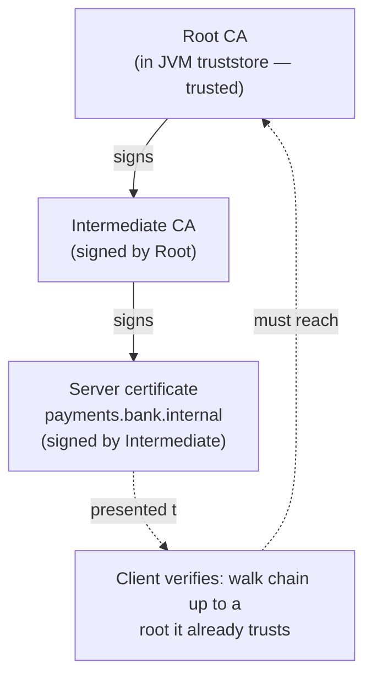

**This is where the most common TLS failure lives:** if the server only sends its own certificate but *not the intermediate*, the client can't complete the chain to a trusted root and the handshake fails — even though the certificate is technically valid. "It works in the browser but fails in Java" often means the browser bundles more intermediates than your JVM truststore does.

## Truststore vs keystore — the eternal confusion

These two are constantly mixed up, so nail the distinction with a single sentence each:

- **Truststore** = *"who do I trust?"* It holds the **public** certificates of CAs (and peers) you're willing to trust. When your client validates a *server's* certificate, it checks against the **truststore**. The JVM's default truststore is `cacerts`.
- **Keystore** = *"who am I?"* It holds **your own** certificate *and private key* — your identity, which you present to prove who *you* are.

A simple way to remember: **truststore is for verifying *them*; keystore is for proving *me*.** In ordinary one-way HTTPS (client verifies server), the client only needs a *truststore* and the server needs a *keystore*. In mutual TLS (below), *both* sides need both.

> **The #1 enterprise Java TLS failure:** `PKIX path building failed: unable to find valid certification path to requested target`. Translation: the server presented a certificate, but the JVM's *truststore* doesn't contain (or can't chain to) a CA that signed it. Common in banks with *internal/private CAs* — the corporate CA isn't in the default JVM `cacerts`, so every internal HTTPS call fails until you *import the internal CA into the truststore* (`keytool -importcert`). When you see "PKIX path building failed," think: *truststore is missing the CA.*

## Hostname verification

Even with a valid, trusted certificate, the client does one more check: **does the certificate's name actually match the hostname I tried to reach?** A certificate is issued *for* a specific name (or set of names, in its Subject Alternative Names). If you connect to `payments.bank.internal` but the certificate says it's for `payments-old.bank.internal`, verification fails — `No subject alternative names matching ... found` or `HostnameVerifier` errors.

Why bother? Because otherwise an attacker with *any* valid certificate (for *their own* domain) could impersonate your target. Hostname verification ensures the certificate was issued for *the exact host you intended to reach*. **Never disable it in production** — disabling hostname verification (a tempting "quick fix" you'll see in Stack Overflow answers) opens you to man-in-the-middle attacks, which is unconscionable in a banking system.

## mTLS (mutual TLS) in microservices

Ordinary TLS authenticates *one* side: the client verifies the server. But in a zero-trust microservice mesh, the server *also* wants to verify the client — "are you *really* the orders service, or an attacker who got into my network?" **Mutual TLS (mTLS)** makes verification bidirectional: *both* sides present certificates and verify each other.

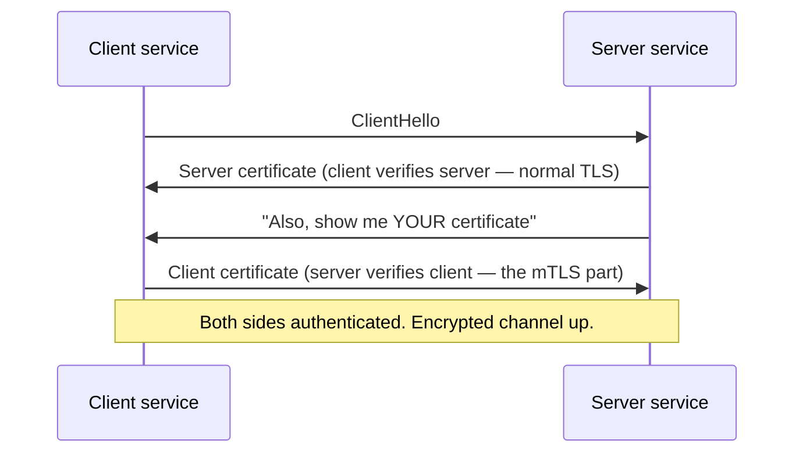

In mTLS, **every service needs both a keystore (its own identity) *and* a truststore (the CA that signed peer identities).** This is foundational to service meshes like Istio/Linkerd, which automate certificate issuance and rotation so every pod-to-pod call is mutually authenticated and encrypted *without* application code changing. For a banking platform, mTLS is often mandatory: it means even an attacker *inside* the network can't impersonate a service without a valid client certificate.

## Java relevance: SSLContext, truststore config, handshake failures

In Java, TLS behavior is governed by **`SSLContext`** — the object that bundles your truststore (what you trust), keystore (your identity), and protocol settings. Most of the time the JVM uses a *default* `SSLContext` built from system properties, and you configure it externally:

```bash
# Point the JVM at a custom truststore (e.g., one containing your internal bank CA)
-Djavax.net.ssl.trustStore=/etc/ssl/bank-truststore.jks
-Djavax.net.ssl.trustStorePassword=changeit
# And a keystore (your identity, for mTLS)
-Djavax.net.ssl.keyStore=/etc/ssl/my-service.jks
-Djavax.net.ssl.keyStorePassword=changeit
```

```java
// Programmatic custom SSLContext (e.g., for a WebClient with a custom truststore)
SSLContext sslContext = SSLContextBuilder.create()
    .loadTrustMaterial(new File("/etc/ssl/bank-truststore.jks"), "changeit".toCharArray())
    .build();
```

The single best debugging flag to know: **`-Djavax.net.debug=ssl:handshake`**. This makes the JVM print the *entire* TLS handshake — the certificates offered, the chain validation, the cipher negotiation, and exactly where it failed. When you're staring at an opaque `SSLHandshakeException`, this flag turns the black box transparent.

### TLS failures field guide

| Java error | Meaning | Fix |
|---|---|---|
| `PKIX path building failed` | Truststore doesn't trust the server's CA | Import the (internal) CA into the truststore |
| `certificate expired` / `NotAfter` | The server's certificate is past its validity date | Renew/rotate the certificate (a *very* common outage cause) |
| `No subject alternative names matching` | Hostname doesn't match the certificate | Use the correct hostname, or fix the cert's SANs |
| `Received fatal alert: handshake_failure` | No common protocol/cipher, or mTLS client cert missing/rejected | Align TLS versions/ciphers; provide a valid client cert |
| `unable to find valid certification path` | Missing intermediate certificate in chain | Server must send full chain, or import intermediate |

> **The most preventable production outage in this entire guide: certificate expiry.** Certificates have expiration dates. When one quietly expires at 3 a.m., *every* TLS connection to that service starts failing simultaneously with `SSLHandshakeException` — a total, instant outage with no code change to blame. The defense is *monitoring certificate expiry dates and automating rotation* (e.g., cert-manager in Kubernetes). Many famous large-scale outages were "just" an expired certificate nobody was watching.

---

# 8. Network Failures in Real Systems

The previous sections covered failures at *specific layers* (TCP resets, DNS errors, TLS handshakes). This section covers the *messier, lower-level* failures that don't map to one neat error code — the ones that make engineers say "the network is acting weird." These are insidious because they often manifest as *latency and intermittent failures* rather than clean exceptions, which makes them maddening to diagnose.

## Packet loss

**What it is:** Some packets simply never arrive — dropped by a congested router, a flaky NIC, or an overloaded link. **Why it's sneaky:** Remember from section 4 that *TCP hides packet loss by retransmitting.* So packet loss usually doesn't show up as an *error* — it shows up as *latency*. A 2% packet loss rate forces constant retransmissions, and each retransmission waits for a timeout, so your p99 latency balloons while your p50 looks fine. **How it appears in Java:** Sporadic `SocketTimeoutException: Read timed out`, wildly inconsistent response times, requests that "sometimes" hang. **Mental model:** *Packet loss masquerades as slowness, not failure.* When latency is erratic with no application explanation, suspect the network underneath.

## Latency spikes

**What it is:** Round-trip time suddenly jumps — from 5ms to 500ms — due to congestion, a routing change, an overloaded downstream, garbage-collection pauses on the *other* side, or noisy-neighbor effects in shared infrastructure. **How it appears in Java:** Read timeouts firing intermittently, p99 latency spiking while p50 stays flat (a classic tell — *the median is fine, the tail is on fire*). **Why it matters:** Your timeouts must account for realistic *tail* latency, not average latency. A timeout set to "average + a little" will fire constantly during normal latency spikes, turning a survivable slowdown into a flood of errors.

## Jitter

**What it is:** Jitter is the *variance* in latency — not "it's slow" but "it's *unpredictably* slow, packet to packet." One packet takes 10ms, the next 80ms, the next 15ms. **Why it matters for backends:** Jitter wrecks *tail latency* and makes timeout tuning miserable — there's no stable number to tune against. It's especially damaging to chatty protocols and anything doing many sequential round trips, because the variance compounds. **Mental model:** *Average latency lies; jitter is the truth about user experience.* A service with 20ms average but high jitter feels worse than one with steady 40ms.

## MTU issues (the subtle, vicious one)

**What it is:** **MTU (Maximum Transmission Unit)** is the largest packet size a network link will carry — typically 1500 bytes on Ethernet. If a packet is too big, it must be *fragmented* or it gets *dropped*. **Why it bites in production:** Tunnels and overlays (VPNs, and especially **Kubernetes pod networks / VXLAN overlays**) add encapsulation headers, *reducing* the effective MTU (e.g., to 1450). If the path MTU is misconfigured, large packets get silently dropped while small ones sail through. **The signature symptom — and it's diabolical:** *small requests work, large requests hang.* A health check (tiny) succeeds; a real request with a big JSON body (large) times out. The TLS handshake (small packets) completes, but the first large data packet vanishes. This produces the baffling pattern: "the connection establishes, but big payloads hang forever." **How it appears in Java:** Read timeouts that correlate with *payload size* — and that's the giveaway. If small calls work and large ones hang, *suspect MTU* before anything else.

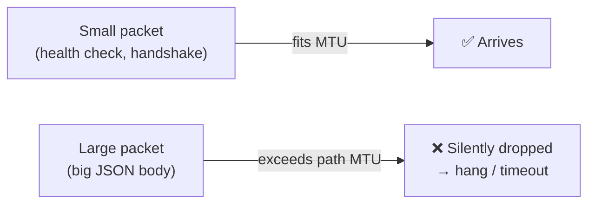

## Firewall blocking

**What it is:** A firewall or security group silently *drops* packets to a port it doesn't permit. Crucially, a firewall often **drops** (silent) rather than **rejects** (which would send an RST). **Why the distinction matters:** A *rejected* connection gives you a fast `Connection refused`; a *dropped* connection gives you `connect timed out` — silence. So **firewall blocks usually look like connect timeouts, not refusals.** **How it appears in Java:** `SocketTimeoutException: connect timed out` to a host you're *sure* is up. **Diagnostic:** `telnet host port` or `nc -zv host port` — if it hangs (vs. immediate refusal), a firewall is likely eating your packets. In cloud/K8s, check security groups and `NetworkPolicy`.

## NAT exhaustion / port exhaustion

**What it is:** **NAT (Network Address Translation)** lets many internal machines share outbound IPs by mapping connections to a pool of ports. Each outbound connection consumes a port from a *finite* range (~28,000 ephemeral ports per source IP). Under very high connection churn — especially if you're *not reusing connections* and are leaving thousands of sockets in `TIME_WAIT` — you can *run out of ports*. **How it appears in Java:** Intermittent `Cannot assign requested address` or connection failures *under high load* that vanish when load drops — and that "only under load" pattern is the tell. **The fix is the recurring theme of this guide:** *reuse connections* (connection pooling + keep-alive) so you open far fewer, and tune `TIME_WAIT` handling. This is yet another reason connection pooling isn't just a performance nicety — it's a *correctness and stability* requirement at scale.

## How these look in Spring Boot logs, and how to debug

The cruel truth: most of these low-level failures surface in Java as the *same* small set of generic exceptions — `SocketTimeoutException`, `Connection reset`, `connect timed out`. The exception alone *cannot* tell you whether it's packet loss, MTU, a firewall, or just a slow server. So the senior-engineer move is to **correlate the pattern**, not just read the exception:

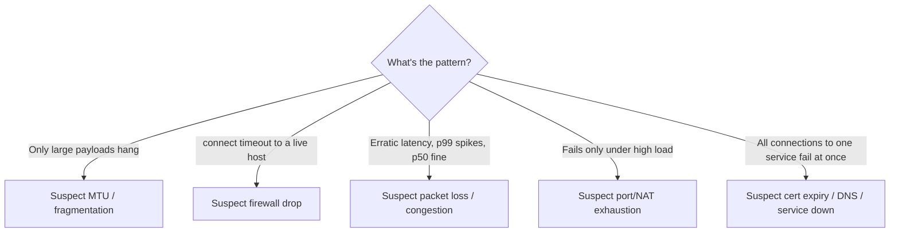

The general debugging recipe (expanded in section 12):
1. **Characterize the pattern** — Is it size-correlated (MTU)? Load-correlated (NAT/pool)? Latency-shaped (loss/jitter)? All-at-once (cert/DNS)? The *shape* of the failure points at the *cause* far better than the exception text.
2. **Reproduce at the right layer** — Use `curl` with timing (`-w`), `mtr` for path/loss, `tcpdump` for packet-level truth.
3. **Check both ends and the middle** — your service, the network/LB/firewall, and the target. The failure may be in infrastructure neither team "owns."

The overarching lesson of this section: **the network fails in analog, not digital, ways.** It's rarely a clean on/off. It's slowness, variance, size-dependence, load-dependence — and learning to read those *patterns* as fingerprints of specific causes is what separates a senior network debugger from someone who just keeps bumping the timeout up.

---

# 9. Java Network Stack Internals

We've repeatedly bumped into how Java interacts with the OS networking layer. Now let's make that interaction explicit, because understanding it explains the single most important *performance* behavior of your services: **why blocking calls freeze threads, and why that can take down a service.**

## The JVM networking layer — what Java actually owns

Here's the foundational truth: **the JVM does not implement TCP/IP. The OS kernel does.** Java's networking classes (`java.net.Socket`, `SocketChannel`, `HttpClient`) are *thin wrappers* over the operating system's socket *system calls*. When you write to a Java socket, the JVM ultimately invokes the kernel's `send()`; the kernel's TCP/IP stack does all the real work (segmentation, handshakes, retransmission from section 4). The JVM's job is to manage Java-side *resources* — buffers, the mapping of Java objects to OS file descriptors, and the threading model around blocking calls.

```mermaid
flowchart TD
    A["Your code: restTemplate.getForObject(...)"]
    B["Java HTTP client (RestTemplate/WebClient/HttpClient)"]
    C["java.net.Socket / SocketChannel"]
    D["JNI → OS system calls: socket(), connect(), send(), recv()"]
    E["Kernel TCP/IP stack (the real networking)"]
    A --> B --> C --> D --> E
```

This layering is *why* the failures in earlier sections surface as Java exceptions: the kernel detects an RST and reports it up through the system call, the JVM translates it into `IOException: Connection reset by peer`. **Java is the messenger; the kernel is where the network event actually happened.**

## The Socket API and file descriptors

Every TCP connection your JVM holds is, at the OS level, a **file descriptor** — a small integer the kernel uses to track the socket (on Linux, "everything is a file," including network connections). This matters enormously:

- File descriptors are a **bounded resource** (`ulimit -n`). Every open connection consumes one. *This is the root of "Too many open files"* (section 4) — your JVM ran out of file descriptors because too many sockets were open at once, usually from a leak (unclosed responses) or genuine over-concurrency.
- This is why **closing resources matters.** An unclosed HTTP response holds a socket, which holds a file descriptor. Leak enough and you exhaust the limit and crash. Always use `try-with-resources` or ensure your client returns connections to the pool.

## The blocking model — and why it's dangerous under load

This is the crux. Consider the *traditional* (and still extremely common) model: **one request = one thread, and that thread blocks while waiting for the network.**

When `RestTemplate` (or any blocking client) sends a request, the calling thread executes the OS `recv()` system call, which **blocks** — the thread is suspended by the kernel, consuming a thread but doing *zero* work, until data arrives or the timeout fires. For a fast downstream (5ms), no problem. But for a *slow* downstream (5 seconds), that thread is *frozen for 5 full seconds*, useful for nothing.

Now scale it. Your Spring Boot app runs on Tomcat with, say, **200 worker threads**. Each incoming request grabs one thread. If that request calls a slow downstream and blocks for 5 seconds, the thread is held for 5 seconds. If requests arrive faster than they complete, threads get consumed faster than they're freed. Once **all 200 threads are blocked** waiting on the slow downstream, your service **cannot accept a single new request** — not even a trivial health check. From the outside, your service looks *completely down*, even though its CPU is nearly idle (all threads are just *waiting*, not working).

```mermaid
flowchart TD
    subgraph Tomcat["Tomcat thread pool (200 threads)"]
      T1["Thread 1 — BLOCKED on slow downstream"]
      T2["Thread 2 — BLOCKED"]
      T3["Thread 3 — BLOCKED"]
      Tdot["... all 200 blocked ..."]
      T200["Thread 200 — BLOCKED"]
    end
    New["New requests (even /health)"] -->|no free thread| Rejected["❌ Rejected / queued / timeout"]
    Down["One slow dependency froze the WHOLE service"]
```

This is **thread-pool exhaustion**, and it is the mechanism behind most *cascading failures* in microservices: one slow service freezes its callers' threads, which makes *those* services unresponsive, which freezes *their* callers — the slowness propagates *upstream* like a traffic jam backing up a highway. The original slow service might even recover, but the wave of frozen threads has already taken down half the mesh.

The defenses (which tie back to earlier sections):
- **Aggressive timeouts** (section 4) so threads don't block *forever* — bound the damage.
- **Circuit breakers** (section 10) so you stop *sending* to a known-sick dependency and free your threads.
- **Bulkheads** — isolate each dependency into its own bounded thread pool, so a slow dependency can only exhaust *its* pool, not the whole service.

## Why WebClient is non-blocking — and why it changes everything

`WebClient` (and the reactive stack on Netty) breaks the "one request = one blocked thread" assumption. Instead of a thread *waiting* on `recv()`, the reactive model uses the OS's **event notification** (epoll on Linux): a small number of **event-loop threads** register interest in *many* sockets and are *notified by the kernel* when any of them has data ready. No thread sits idle waiting.

The consequence is dramatic: a handful of event-loop threads (often just one per CPU core) can manage **tens of thousands of concurrent in-flight requests**, because a thread is only ever *actively processing* — never *waiting*. When a request is "in flight," it costs *memory* (to hold its state/callback) but *not a thread*. This is why reactive services survive slow downstreams that would obliterate a blocking service: a slow downstream just means more requests are *parked* (cheap), not more threads *blocked* (expensive).

```mermaid
flowchart LR
    subgraph Blocking["Blocking (RestTemplate)"]
      direction TB
      R1["Request → Thread 1 (waits)"]
      R2["Request → Thread 2 (waits)"]
      R3["Request → Thread N (waits)"]
      Note1["N requests = N blocked threads"]
    end
    subgraph Reactive["Non-blocking (WebClient/Netty)"]
      direction TB
      EL["Few event-loop threads"]
      Many["Manage 10,000s of requests<br/>via kernel event notification"]
      EL --> Many
      Note2["Threads never wait; they only process"]
    end
```

The catch — and it's a sharp one: **you must never block inside the event loop.** If you call a blocking operation (a synchronous JDBC query, `Thread.sleep`, a blocking `RestTemplate`) on an event-loop thread, you freeze that thread — and since there are only a few, you can stall *thousands* of requests with one blocking call. Reactive programming's discipline ("never block the event loop") exists precisely because the model's power depends on threads *never waiting*.

## Why RestTemplate is risky under load (the honest summary)

`RestTemplate` isn't *bad* — for low-to-moderate traffic with fast, reliable downstreams, it's simple and perfectly fine, and it dominates existing codebases. It becomes **risky under load** specifically because its blocking model couples *thread availability* to *downstream latency*. The moment a downstream slows, threads pile up, and you're one slow dependency away from total exhaustion. The mitigations are non-negotiable if you stick with it: **strict timeouts on all three axes** (connect/read/pool), **a properly bounded connection pool**, **circuit breakers**, and ideally **bulkheads** per dependency. Without those, a single slow downstream is an outage waiting to happen. If you're building greenfield high-concurrency services, reactive `WebClient` (or virtual threads — see below) sidesteps the whole problem class.

> **Note on virtual threads (Project Loom, Java 21+):** Virtual threads offer a third path — they make blocking calls *cheap* by having the JVM (not the OS) schedule millions of lightweight threads, automatically un-mounting a virtual thread from its carrier when it blocks on I/O. This lets you write simple, blocking-style code (`RestTemplate`-shaped) while getting reactive-like scalability, because a "blocked" virtual thread no longer pins a precious OS thread. For many teams this is the future: the readability of blocking code without the thread-exhaustion trap. The mental model still matters, though — you're trading *OS-thread* exhaustion for *connection-pool* and *memory* limits, which is why bounded pools and timeouts remain essential.

---

# 10. Microservices Networking

Everything so far has been building blocks. Now we assemble them into the reality of a microservice system, where the central, uncomfortable truth is: **what used to be a method call is now a network call** — and from sections 1–8 you know a network call can fail in a dozen ways a method call never could. A monolith calling `paymentService.transfer()` either works or throws a bug you can debug locally. A microservice calling `POST /transfer` over the network can time out, get a connection reset, hit a DNS failure, fail a TLS handshake, or succeed-but-lose-the-response. **Microservices trade in-process reliability for network unreliability, and the entire discipline of microservice networking is about managing that unreliability.**

## Service-to-service communication

When service A calls service B, every concept from this guide fires: A resolves B's *name* via DNS (section 6), opens a *pooled TCP connection* (section 4), possibly does an *mTLS handshake* (section 7), sends an *HTTP request* (section 3), and waits — with *timeouts* (section 4) — for B to respond. Each of these is a failure domain. The first mental adjustment a developer must make moving from monoliths to microservices is to **treat every inter-service call as a fallible network operation that needs explicit handling for latency, failure, and partial success** — not as a reliable function call.

## The gateway's role

Clients (browsers, mobile apps) don't call your dozens of microservices directly — that would be chaos (every client needs to know every service's address, handle auth for each, etc.). Instead, a single **API Gateway** sits at the edge as the *one front door*:

```mermaid
flowchart TD
    Client["Frontend / Mobile"]
    GW["API Gateway<br/>(Spring Cloud Gateway / Kong / Nginx)"]
    A["Auth Service"]
    P["Payments Service"]
    O["Orders Service"]
    DB1[(Payments DB)]
    DB2[(Orders DB)]
    Client -->|HTTPS| GW
    GW -->|route /auth/*| A
    GW -->|route /payments/*| P
    GW -->|route /orders/*| O
    P --> DB1
    O --> DB2
```

The gateway's jobs: **routing** (map `/payments/*` to the payments service), **authentication** (validate the JWT once at the edge so downstream services can trust it), **TLS termination** (decrypt HTTPS at the edge — section 3), **rate limiting**, **request/response transformation** (add `X-Forwarded-*`, trace IDs — section 3), and **cross-cutting concerns** (logging, metrics). It's the chokepoint where you enforce policy uniformly. The trade-off: it's also a potential *single point of failure* and a place where header-size limits, routing misconfigurations, and timeout mismatches bite (recall the 502/503/504 discussion in section 3 — those are usually the *gateway* telling you about a *backend* problem).

## Retries — the double-edged sword

When a call fails transiently (a blip, a momentarily overloaded instance), retrying often succeeds — failures are frequently temporary. So retries improve resilience. **But retries are dangerous in two specific ways you must respect:**

1. **Non-idempotent retries cause duplicates.** Recall section 3: retrying a `POST /transfer` that *actually succeeded* but whose *response was lost* moves money twice. **Only retry idempotent operations** (GET, PUT, DELETE) blindly; for non-idempotent ones, use an **idempotency key** so the server deduplicates. In banking this is not optional — a double-charge is a serious incident.

2. **Retries amplify load and cause retry storms.** When a service is *already struggling* (overloaded), having every caller retry *multiplies* the load on it — turning a partial degradation into a total collapse. The struggling service gets 3× the traffic precisely when it can least handle it. The defenses: **exponential backoff** (wait longer between each retry, don't hammer), **jitter** (randomize backoff so all callers don't retry in synchronized waves), and a **retry budget / cap** (limit total retries so they can't snowball).

```mermaid
flowchart TD
    Fail["Call to B fails"]
    Retryable{"Idempotent &<br/>transient?"}
    Fail --> Retryable
    Retryable -->|No, e.g. POST /transfer| NoRetry["Don't blind-retry.<br/>Use idempotency key<br/>or fail fast."]
    Retryable -->|Yes| Backoff["Retry with exponential<br/>backoff + jitter + cap"]
    Backoff --> Storm["⚠️ Without backoff/cap:<br/>retry storm overloads B"]
```

## Timeouts — the foundation of resilience

We covered the three timeouts mechanically in section 4; here's the *systemic* point. In a microservice chain (A→B→C→D), **timeouts must form a sane hierarchy.** If A's timeout to B is 2s, but B's timeout to C is 5s, then B is still working on a request that A *already gave up on* — wasting B's resources on a doomed request. **Outer timeouts should generally be longer than the inner ones** (or you use *deadline propagation*: A tells B "you have 2s total," and B passes "1.8s" to C, so the whole chain respects one budget). Mismatched timeouts across a chain are a leading cause of resource waste and confusing cascading failures.

And the cardinal rule bears repeating from section 4: **a call with no timeout is a latent outage.** In a microservice mesh, one missing timeout can freeze a thread pool (section 9), which cascades upstream. *Every* inter-service call needs a timeout.

## Circuit breakers — failing fast to stay alive

A **circuit breaker** is the pattern that prevents cascading failure. The idea, borrowed from electrical circuits: if a downstream is clearly broken (failing repeatedly), *stop calling it* for a while — "trip the breaker" — and **fail fast** instead of piling up blocked threads waiting on a corpse.

```mermaid
stateDiagram-v2
    [*] --> Closed
    Closed --> Open: failure rate exceeds threshold
    Open --> HalfOpen: after cooldown period
    HalfOpen --> Closed: test request succeeds
    HalfOpen --> Open: test request fails
    note right of Closed: Normal — calls pass through
    note right of Open: Tripped — calls fail instantly (no waiting)
    note right of HalfOpen: Testing — allow a trial call
```

The three states: **Closed** (normal — requests flow), **Open** (tripped — requests fail *immediately* without even attempting the network call, so no threads block), and **Half-Open** (after a cooldown, let *one* test request through; if it succeeds, close the breaker and resume; if it fails, re-open and wait again). 

Why this is so powerful: it directly attacks the thread-exhaustion mechanism from section 9. When B is down, *without* a breaker, every call to B blocks a thread for the full timeout, exhausting A's pool. *With* a breaker, once it trips, calls to B return instantly with a fallback — A's threads stay free to serve everything else. The breaker converts a slow, resource-draining failure into a fast, contained one. In Spring, **Resilience4j** provides circuit breakers, retries, bulkheads, and rate limiters as composable annotations.

```java
@CircuitBreaker(name = "payments", fallbackMethod = "balanceFallback")
@Retry(name = "payments")
@TimeLimiter(name = "payments")
public CompletableFuture<Balance> getBalance(String account) {
    return CompletableFuture.supplyAsync(() ->
        webClient.get().uri("/balance?account={a}", account)
            .retrieve().bodyToMono(Balance.class).block());
}

// Called automatically when the breaker is open or the call fails:
public CompletableFuture<Balance> balanceFallback(String account, Throwable t) {
    return CompletableFuture.completedFuture(Balance.unavailable(account));
}
```

## The full architecture and each hop

Let's trace a single user action — "check my balance" — through the whole system, naming every hop and its failure mode, to cement how everything connects:

```mermaid
flowchart LR
    U["User browser"] -->|1. HTTPS| GW["API Gateway"]
    GW -->|2. mTLS, routed| P["Payments Service"]
    P -->|3. pooled call| A["Account Service"]
    A -->|4. JDBC| DB[(Database)]
    DB -->|response| A -->|response| P -->|response| GW -->|response| U
```

1. **Browser → Gateway (HTTPS):** TLS handshake (cert must be valid — section 7), CORS applies (section 3). *Failure modes:* cert expiry, CORS rejection, gateway overload (503).
2. **Gateway → Payments (routed, mTLS):** DNS resolves the service name (section 6), gateway adds trace/forwarded headers, mTLS authenticates. *Failure modes:* routing misconfiguration (404), no healthy backend (503), header-size limit (431/400), backend slow (504) or crashing (502).
3. **Payments → Account (pooled HTTP):** Borrow a pooled keep-alive connection, apply timeouts + circuit breaker. *Failure modes:* pool exhaustion, read timeout, connection reset, circuit open.
4. **Account → Database (JDBC):** A *connection pool* (HikariCP) over TCP. *Failure modes:* DB connection pool exhaustion, slow query → read timeout → thread blocked (section 9).

The profound point: **a single user click traverses every layer and concept in this guide, and can fail at every hop.** Mastering microservice networking means holding this entire chain in your head and knowing, for any symptom, *which hop and which layer* to interrogate first.

---

# 11. Kubernetes Networking Basics

Most modern Java microservices run in Kubernetes, and Kubernetes adds its *own* networking layer on top of everything you've learned. Understanding it resolves a whole category of "but the pod is running, why can't I reach it?!" mysteries.

## The core objects

**Pods** are the smallest deployable unit — one or more containers sharing a network namespace. The critical fact: **each pod gets its own IP address, but that IP is *ephemeral*.** When a pod dies and is replaced (a deploy, a crash, a scale event), the new pod gets a *new* IP. So you can *never* hardcode pod IPs — they're as transient as the pods themselves. This is the problem Services solve.

**Services** provide a *stable* virtual IP (the **ClusterIP**) and DNS name in front of a *changing set* of pods (recall section 6). The Service is the stable contract; the pods behind it churn freely. When you call `http://payments`, you're hitting the Service's ClusterIP, which load-balances across the *currently healthy* pods. The Service is what makes pod ephemerality invisible to callers.

**Ingress** is the entry point from *outside* the cluster — it routes external HTTP(S) traffic (e.g., `api.bank.com/payments`) to internal Services, often handling TLS termination. It's essentially the cluster's edge gateway (and overlaps conceptually with the API Gateway from section 10).

```mermaid
flowchart TD
    Ext["External traffic<br/>api.bank.com"]
    Ing["Ingress<br/>(TLS termination, host/path routing)"]
    SvcP["Service: payments<br/>ClusterIP 10.96.0.42 (stable)"]
    EP["Endpoints (ready pods only)"]
    Pod1["Pod payments-abc<br/>10.244.1.5"]
    Pod2["Pod payments-xyz<br/>10.244.2.8"]
    Ext --> Ing --> SvcP --> EP --> Pod1
    EP --> Pod2
```

## DNS inside the cluster and service discovery

As covered in section 6, **CoreDNS** resolves Service names (`payments.banking.svc.cluster.local`, or just `payments` within the namespace) to the Service's ClusterIP. This *is* Kubernetes service discovery: you call services by *name*, CoreDNS + the Service abstraction handle the rest — no service registry code in your app, no hardcoded addresses. Your Java app just calls `http://payments/balance` and Kubernetes makes it work. Remember the DNS caveats: CoreDNS on the critical path can become a bottleneck, the JVM DNS cache can hold stale entries, and `ndots` can cause excess lookups.

## Why services fail even when pods are running — the Endpoints insight

This is *the* Kubernetes networking insight, and it resolves the most common confusion. You run `kubectl get pods`, see your pod is `Running`, and yet calls to its Service fail with timeouts or 503s. How? **Because a pod being `Running` does *not* mean it's `Ready` to receive traffic — and the Service only routes to *Ready* pods.**

The mechanism: a Service doesn't route to pods directly; it routes to its **Endpoints** — the list of pods that are currently **Ready**, determined by the pod's **readiness probe**. A pod can be `Running` (process alive) but `Not Ready` (readiness probe failing — maybe it's still warming up, its DB connection isn't established, or it's overloaded). **A Not-Ready pod is *removed from the Endpoints list*, so the Service won't send it traffic** — even though it's "running."

```mermaid
flowchart TD
    Svc["Service: payments"]
    EP["Endpoints list = READY pods only"]
    P1["Pod-1: Running + Ready ✅"]
    P2["Pod-2: Running but NOT Ready ❌<br/>(readiness probe failing)"]
    Svc --> EP
    EP -->|routes traffic| P1
    EP -.->|EXCLUDED — no traffic| P2
    Empty["If NO pods are Ready →<br/>Endpoints is EMPTY →<br/>Service returns 503 / connection refused"]
```

So the senior-engineer debugging move when "the service is broken but pods are running" is: **`kubectl get endpoints <service>`.** If the Endpoints list is *empty* or missing your pod, that's your answer — the pods aren't Ready, so the Service has no one to route to, and you get 503s or refused connections. The fix is in the *readiness probe* and *why it's failing* (the app isn't actually ready — slow startup, failing dependency, misconfigured probe), not in the network. **The Endpoints list is the source of truth for "who can this Service actually reach right now."**

Other "pod is running but unreachable" causes worth knowing: a **`NetworkPolicy`** silently blocking the traffic (a firewall at the K8s layer — manifests as connect timeouts, section 8), a **port mismatch** between the Service's `targetPort` and the container's actual port, or the pod **failing its readiness probe intermittently** under load (flapping in and out of Endpoints, causing intermittent failures).

## The mental model for Kubernetes networking

Kubernetes networking is *layers of indirection* designed to make ephemeral pods reachable by stable names: **Name (DNS) → Service (stable ClusterIP) → Endpoints (Ready pods) → Pod IP → Container.** Each layer can break independently, and the debugging skill is knowing which to check: DNS resolution (`nslookup` from a pod), Service existence (`kubectl get svc`), the all-important Endpoints list (`kubectl get endpoints`), NetworkPolicies, and finally the pod/container itself. When you internalize that **the Service routes only to Ready Endpoints**, half of Kubernetes's networking mysteries dissolve.

---

# 12. Debugging Network Issues Like a Senior Engineer

Everything converges here. A senior engineer doesn't *guess* — they *isolate*, moving methodically through layers (the OSI ladder from section 2) until the failing layer reveals itself. The defining trait is a **systematic, layer-by-layer approach** instead of randomly changing things and hoping. Here is that method, step by step, as a repeatable playbook.

## Step 1: Identify the layer (the most important step)

Before touching any tool, ask: **which layer is failing?** The error message and *failure pattern* usually tell you, if you've internalized sections 1–8. Map the symptom to a layer:

```mermaid
flowchart TD
    S{Symptom}
    S -->|UnknownHostException| DNS["DNS layer (§6)"]
    S -->|Connection refused| L4a["L4: nothing listening (§4)"]
    S -->|connect timed out| L4b["L4/network: firewall drop / unreachable (§4,§8)"]
    S -->|Read timed out| App["App slow / downstream hang (§4,§8)"]
    S -->|Connection reset| L4c["L4: RST — crash / idle reap (§4)"]
    S -->|SSLHandshakeException| TLS["TLS layer: cert/truststore (§7)"]
    S -->|4xx / 5xx| L7["L7: app logic / gateway (§3)"]
```

This single triage step eliminates most of the search space. A DNS failure and a TLS failure share *no* fixes — naming the layer first prevents you from "fixing" the wrong thing for an hour.

## Step 2: Check the logs — both ends

Read *your* service's logs for the exact exception and stack trace, but crucially also read the *other side's* logs. Recall section 3: a `500` means *their* code crashed — *their* stack trace holds the answer, not yours. A `502` means *their* pod gave a bad response — check *their* restart count and logs. **A huge fraction of "network" problems are actually application problems on the other end, visible only in the other service's logs.** Also check *gateway* and *load balancer* logs — they sit in the middle and often log the real cause (timeout, no healthy upstream, header too large).

## Step 3: Run curl tests (isolate L7 and below)

`curl` is the single most valuable debugging tool because it exercises the *whole stack* (DNS → TCP → TLS → HTTP) and reports timing for each phase:

```bash
# Basic: does the endpoint respond, and with what status?
curl -v https://payments.bank.internal/api/v1/balance

# Timing breakdown — WHERE is the time going? (DNS? connect? TLS? server?)
curl -w "dns:%{time_namelookup} connect:%{time_connect} tls:%{time_appconnect} ttfb:%{time_starttransfer} total:%{time_total}\n" \
     -o /dev/null -s https://payments.bank.internal/api/v1/balance
```

That `-w` timing breakdown is gold — it tells you *which phase* is slow: a high `time_namelookup` means DNS is slow (section 6); high `time_connect` means the TCP handshake/network is slow; high `time_appconnect` means TLS is slow (section 7); high `time_starttransfer` (TTFB) means the *server* is slow (the app or its DB). **curl turns "it's slow" into "the *DNS* is slow" — that precision is the whole game.** Run it *from the same host/pod* as your failing service, because network reachability is location-dependent (a key insight — `curl` from your laptop tests a *different* path than `curl` from inside the pod).

## Step 4: Use kubectl (for Kubernetes issues)

If you're in Kubernetes, work through the indirection layers from section 11:

```bash
kubectl get pods -l app=payments              # Are pods Running AND Ready (READY column)?
kubectl get endpoints payments                # ← THE KEY ONE: any Ready pods behind the service?
kubectl get svc payments                       # Does the Service exist? Right ports?
kubectl logs <pod> --previous                  # Why did it crash/restart? (for 502s)
kubectl exec -it <pod> -- curl http://other-svc/health   # Test connectivity FROM inside a pod
kubectl describe networkpolicy                 # Is a NetworkPolicy blocking traffic?
```

`kubectl get endpoints` is the standout (section 11): empty endpoints = no Ready pods = your 503/refused-connection answer. And `kubectl exec ... curl` lets you test the *actual* in-cluster network path, not your laptop's.

## Step 5: Inspect DNS

If you suspect resolution (section 6), test it directly *from the affected host/pod*:

```bash
nslookup payments.bank.internal          # Does the name resolve? To what IP?
dig payments.bank.internal +short        # Same, scriptable; shows TTL with full output
# Inside a K8s pod, test cluster DNS:
nslookup payments.banking.svc.cluster.local
```

If the name *doesn't* resolve, you've confirmed a DNS problem — check CoreDNS health, the name's correctness, and (for long-lived JVMs) the JVM DNS cache TTL trap. If it *does* resolve but you still can't connect, DNS is innocent — move up to TCP/TLS.

## Step 6: Check TCP connectivity

To test *just* L4 — "is the port even open and accepting?" — bypass HTTP and TLS entirely:

```bash
telnet payments.bank.internal 443        # Connects = port open; hangs = firewall drop; refused = nothing listening
nc -zv payments.bank.internal 443        # Same, cleaner: -z scan, -v verbose
```

The *behavior* diagnoses (section 4 + 8): immediate "Connected" = port open and reachable; immediate "Connection refused" = reachable host but nothing listening (service down/wrong port); *hang then timeout* = firewall silently dropping packets (section 8). This cleanly separates "can I reach the port at all?" (L4) from "is the app behaving?" (L7).

To see *existing* connections and their states on a host:

```bash
ss -tanp                 # All TCP connections, states (ESTABLISHED, TIME_WAIT, etc.), and owning process
ss -s                    # Summary counts — spot TIME_WAIT pileups (NAT/port exhaustion, §8)
lsof -p <java-pid> | wc -l   # How many file descriptors is the JVM holding? (too-many-open-files, §4,§9)
```

`ss` (the modern `netstat`) reveals connection-state problems: a flood of `TIME_WAIT` suggests connection churn / no pooling (sections 4, 8); a pile of `ESTABLISHED` connections to one downstream that never close suggests a leak or pool misconfiguration.

## Step 7: Inspect the TLS handshake

If you suspect TLS (section 7), `openssl` shows you *exactly* what certificate is presented and whether the chain validates:

```bash
# Show the cert chain, validation result, expiry, and SANs:
openssl s_client -connect payments.bank.internal:443 -servername payments.bank.internal

# Just the expiry dates (catch the cert-expiry outage before it happens):
echo | openssl s_client -connect payments.bank.internal:443 2>/dev/null | openssl x509 -noout -dates
```

This reveals the section-7 failure modes directly: an expired cert (check the dates), a missing intermediate (the chain won't complete), a hostname mismatch (check the SANs against the name you used), or an untrusted CA. On the Java side, the killer flag from section 7 — **`-Djavax.net.debug=ssl:handshake`** — makes the JVM print its entire handshake so you see *exactly* where *Java's* validation diverged (often: the JVM truststore lacks your internal CA → `PKIX path building failed`).

## The tools, summarized — and tcpdump

| Tool | Layer it probes | What it answers |
|---|---|---|
| `curl -v -w` | DNS→TCP→TLS→HTTP (whole stack, with timing) | Where in the request is time/failure happening? |
| `dig` / `nslookup` | DNS (§6) | Does the name resolve, and to what? |
| `telnet` / `nc -zv` | TCP / L4 (§4) | Is the port open / firewalled / refused? |
| `ss` / `netstat` / `lsof` | TCP state, FDs (§4,§9) | Connection states, leaks, TIME_WAIT, open-file count |
| `openssl s_client` | TLS (§7) | What cert is served? Valid chain? Expired? |
| `kubectl get endpoints` | K8s service (§11) | Are there Ready pods behind the service? |
| `tcpdump` | Packet level (L3/L4) | The literal truth — what packets actually flow? |

**tcpdump** is the tool of last resort and ultimate truth. It captures the *actual packets* on the wire, so when higher-level tools disagree with reality (curl says one thing, the app sees another), tcpdump shows you exactly what left and what arrived:

```bash
# Capture traffic to/from a host on port 443 (just enough to see handshakes/resets):
tcpdump -i any host payments.bank.internal and port 443 -nn
```

You don't need deep tcpdump mastery, but you should recognize what it reveals: SYN packets with no SYN-ACK (firewall drop / host down — §4,§8), RST packets (who's resetting the connection and when — §4), retransmissions (packet loss — §8), and large packets vanishing (MTU issues — §8). When all else fails, tcpdump ends the argument about "what's *really* happening on the network" — because it shows you the packets themselves.

## The meta-lesson

```mermaid
flowchart TD
    Start["Network problem reported"]
    L1["1. NAME the failing layer<br/>(from the exception + pattern)"]
    L2["2. Read logs — BOTH ends + gateway"]
    L3["3. curl -w from the affected host:<br/>which phase is slow/failing?"]
    L4["4. Isolate: dig (DNS) → nc (TCP) →<br/>openssl (TLS) → curl (HTTP)"]
    L5["5. In K8s: endpoints → exec curl → netpol"]
    L6["6. Last resort: tcpdump = ground truth"]
    Fix["Fix targets the CONFIRMED layer,<br/>not a guess"]
    Start --> L1 --> L2 --> L3 --> L4 --> L5 --> L6 --> Fix
```

The senior engineer's secret isn't knowing more commands — it's **isolating the failing layer before attempting a fix**, so every action is targeted. Guessing changes random things and occasionally gets lucky; isolating *guarantees* you converge on the cause. Master the ladder, and every network incident becomes a methodical descent to the one broken rung.

---

# 13. Common Interview Questions (50+)

These double as a self-test. If you can answer each in a few sentences *with the why*, you've absorbed this guide. They're grouped by topic.

### HTTP

1. **Why is HTTP stateless, and how do we maintain sessions despite that?** Statelessness means the server keeps no per-client memory between requests, which enables horizontal scaling (any instance serves any request). Sessions are maintained by carrying state *with* the request — cookies (a session ID the client re-sends) or tokens (a JWT) — backed by a shared store.
2. **What's the difference between 401 and 403?** 401 = *authentication* failed (I don't know who you are — refresh credentials). 403 = *authorization* failed (I know you, but you lack permission — refreshing won't help).
3. **What's the difference between 502, 503, and 504?** 502 = gateway got a *bad/no* response from a backend (backend crashing). 503 = *no healthy backend* / overloaded. 504 = backend *too slow* (didn't respond in time).
4. **Why does it work in Postman but not the browser?** Browsers enforce CORS, send cookies automatically, cache, and block mixed content; Postman skips all of that. Usually CORS.
5. **What is keep-alive and why does it matter?** Reusing a TCP connection across requests, avoiding repeated TCP+TLS handshakes. Foundation of connection pooling; huge latency win.
6. **Which HTTP methods are idempotent, and why does it matter?** GET, PUT, DELETE (and HEAD) are idempotent; POST/PATCH generally aren't. It dictates whether auto-retry is safe — retrying a non-idempotent POST can double-charge.
7. **Why do headers exist separately from the body?** To separate metadata (envelope) from payload (letter), so infrastructure can route/cache/authorize without parsing the body.
8. **What causes a `431` / header-too-large error?** Accumulated headers (fat JWT + `X-Forwarded-*` + cookies) exceeding the server's header-size cap — often only in production behind a gateway.
9. **What is the difference between connect timeout and read timeout?** Connect timeout = couldn't establish the TCP connection (reachability). Read timeout = connected but no response data in time (server slowness).
10. **How does a gateway modify a request?** Adds forwarded/trace headers, terminates TLS, rewrites paths, enforces auth/rate limits — so the backend's received request differs from the client's.

### TCP / UDP

11. **Explain the TCP three-way handshake and why it needs three messages.** SYN, SYN-ACK, ACK — both sides must confirm both directions work and exchange initial sequence numbers; three messages are the minimum to do that.
12. **TCP vs UDP — when would you use each?** TCP = reliable, ordered, connection-based (HTTP, anything where completeness matters). UDP = fast, connectionless, no guarantees (DNS, streaming, gaming — where stale data is useless).
13. **What makes TCP reliable?** Sequence numbers (ordering), ACKs (confirmation), retransmission (resend lost data), checksums (corruption detection), plus flow & congestion control.
14. **What's the difference between FIN and RST?** FIN = graceful close ("goodbye"). RST = abrupt termination ("connection dead now"). `Connection reset by peer` is an RST.
15. **What does "Connection refused" mean vs "connect timed out"?** Refused = SYN got an RST (nothing listening — fast, definitive). Timeout = SYN got *silence* (firewall drop / host unreachable).
16. **What causes "Connection reset by peer"?** An RST mid-connection: server crashed, hit a limit, or an idle keep-alive connection was reaped by an LB/firewall and reused.
17. **Why is packet loss often invisible as an error?** TCP retransmits lost packets automatically, so loss surfaces as *latency*, not as exceptions.
18. **What is congestion control and why does throughput ramp up slowly?** TCP infers network congestion from packet loss and starts cautiously (slow start), ramping up — so a connection takes time to reach full speed.
19. **Why is UDP faster than TCP?** No handshake, no ACKs/retransmission, no ordering buffer, no connection state — it omits everything that costs round trips.
20. **What protocol uses UDP under HTTP/3?** QUIC — it reimplements reliability/ordering on top of UDP to avoid TCP's head-of-line blocking and get faster setup.
21. **What is TIME_WAIT and why can it cause problems?** A state a closing socket lingers in to absorb stray packets; under high connection churn, TIME_WAIT pileups can exhaust ports.

### DNS

22. **What is DNS and why does it exist?** It translates human names to IP addresses, providing a stable name over a changeable IP — the foundation of elastic, scalable systems.
23. **Walk through resolving a public hostname.** Check cache → recursive resolver asks root (who handles .com) → TLD server (who handles the domain) → authoritative server (the IP) → cache it with a TTL.
24. **What causes `UnknownHostException`?** A *resolution* failure (before any TCP): name doesn't exist, resolver down, CoreDNS failing, or a transient hiccup. Not a connection problem.
25. **What is TTL and why does DNS caching cause stale routing?** TTL is how long an answer is cached. If an IP changes before TTL expires, callers keep hitting the old IP until it does.
26. **What is the JVM DNS cache trap?** The JVM caches DNS separately (`networkaddress.cache.ttl`), historically sometimes forever — so a long-lived JVM keeps using a stale IP after failover until restart. Set a sane TTL.
27. **How do service names resolve in Kubernetes?** CoreDNS resolves `<svc>.<ns>.svc.cluster.local` (or short forms via search domains) to the Service's ClusterIP.
28. **Why is DNS a common failure point in microservices?** Every by-name inter-service call may resolve at call time, putting CoreDNS on the critical path; overload/restart causes broad intermittent failures.
29. **What is the `ndots` problem?** K8s default `ndots:5` causes short external names to try internal search domains first, multiplying lookups and adding latency/load.

### TLS / SSL

30. **What does TLS provide?** Confidentiality (encryption), integrity (tamper detection), and authentication (verifying identity via certificates).
31. **Walk through the TLS handshake.** ClientHello → ServerHello + certificate → client verifies cert → key exchange establishes a shared symmetric key → encrypted data flows.
32. **Why does TLS use both asymmetric and symmetric crypto?** Asymmetric (slow) only to securely exchange a symmetric key; symmetric (fast) for bulk data — best of both.
33. **Truststore vs keystore?** Truststore = who I trust (CA public certs, for verifying *them*). Keystore = who I am (my cert + private key, for proving *me*).
34. **What does "PKIX path building failed" mean and how do you fix it?** The JVM truststore can't chain the server's cert to a trusted CA — common with internal CAs. Import the CA into the truststore.
35. **What is hostname verification and why never disable it?** Checking the cert's name matches the host you reached; disabling it enables man-in-the-middle attacks.
36. **What is mTLS and where is it used?** Mutual TLS — both sides present and verify certificates; used in zero-trust service meshes so even an in-network attacker can't impersonate a service.
37. **Why is certificate expiry such a dangerous outage?** When a cert expires, *all* TLS connections to that service fail instantly and simultaneously with no code change to blame; prevent with expiry monitoring/auto-rotation.
38. **What causes a TLS handshake failure besides a bad cert?** No common protocol/cipher, a missing intermediate certificate, or (in mTLS) a missing/rejected client certificate.
39. **What is TLS termination?** A gateway decrypts HTTPS at the edge and talks plain HTTP internally; your backend may receive plaintext even though the client used HTTPS.

### Java / connection management

40. **Why is RestTemplate risky under load?** It's blocking: one in-flight request holds one thread; a slow downstream blocks threads until the pool is exhausted and the service stops serving anything.
41. **Why is WebClient non-blocking and how does it scale?** It uses event-loop threads + kernel event notification, so a few threads manage thousands of in-flight requests because no thread ever waits.
42. **What's the cardinal rule with reactive code?** Never block the event loop — one blocking call on a scarce event-loop thread can stall thousands of requests.
43. **What is connection pool exhaustion and what causes it?** No free connection in the pool, so callers wait/timeout. Caused by a too-small pool or a slow downstream holding connections too long.
44. **What causes "Too many open files"?** File-descriptor exhaustion — a socket/connection leak (unclosed responses) and/or too-low `ulimit`. Fix the leak *and* raise the limit.
45. **What three timeouts must you configure, and what does each protect against?** Connect (unreachable host), read/socket (slow server), connection-request/pool (pool exhaustion). The pool one is most forgotten.
46. **What are virtual threads and how do they change the picture?** Java 21 lightweight threads the JVM schedules; a blocked virtual thread doesn't pin an OS thread, giving blocking-style code reactive-like scalability.

### Microservices / Kubernetes / resilience

47. **What is a circuit breaker and how does it prevent cascading failure?** It trips after repeated failures and fails fast (no network call, no blocked threads), keeping the caller's threads free; Closed → Open → Half-Open states.
48. **How do retries cause more harm than good?** Non-idempotent retries duplicate effects (double-charge); retries on an overloaded service amplify load into a retry storm. Mitigate with idempotency keys, backoff, jitter, caps.
49. **Why must timeouts form a hierarchy across a service chain?** If an inner timeout exceeds an outer one, the inner service works on a request the caller already abandoned, wasting resources; use deadline propagation.
50. **A pod is `Running` but the service returns 503 — why?** `Running` ≠ `Ready`. The Service routes only to *Ready* Endpoints; a failing readiness probe removes the pod from Endpoints, so there's no one to route to. Check `kubectl get endpoints`.
51. **Why can't you hardcode pod IPs in Kubernetes?** Pod IPs are ephemeral — they change on every restart/reschedule. Use the Service's stable name/ClusterIP instead.
52. **What is the gateway's role in microservices?** A single front door: routing, edge authentication, TLS termination, rate limiting, header/trace injection — enforcing cross-cutting policy uniformly.
53. **How would you debug "service A can't reach service B" in production?** Name the failing layer from the error → check both ends' logs → `curl -w` from A's host → isolate with dig/nc/openssl → in K8s check endpoints + exec curl + NetworkPolicy → tcpdump as last resort.
54. **What's the difference between a firewall *dropping* vs *rejecting* a connection?** Reject sends an RST (fast `Connection refused`); drop is silent (`connect timed out`). Firewalls usually drop, so they look like connect timeouts.
55. **Small requests work but large ones hang — what do you suspect?** MTU/fragmentation issues (common with K8s overlay networks) — large packets exceed path MTU and are silently dropped while small ones pass.

---

# 14. The Final Mental Model

You've now seen every layer. Let's assemble them into *one image* you can carry forever — the complete journey of a single HTTP call from your Java code, every stage, every failure point. This is the synthesis of the entire guide.

```mermaid
flowchart TD
    Start["Java code:<br/>restTemplate / webClient / feign<br/>.call('https://payments/balance')"]

    HC["① HTTP Client<br/>builds request, picks a connection"]
    DNS["② DNS Resolution<br/>name → IP (CoreDNS / resolver)"]
    POOL["③ Connection Pool<br/>reuse warm conn or open new"]
    TCP["④ TCP Handshake<br/>SYN / SYN-ACK / ACK"]
    TLS["⑤ TLS Handshake<br/>cert verify + key exchange"]
    SEND["⑥ Send encrypted HTTP bytes<br/>over the socket (kernel TCP/IP)"]
    GW["⑦ Gateway / LB<br/>route, add headers, mTLS"]
    SVC["⑧ Target Microservice<br/>+ its own DB/downstream calls"]
    RESP["⑨ Response travels back up<br/>decrypt → parse → deserialize"]

    Start --> HC --> DNS --> POOL --> TCP --> TLS --> SEND --> GW --> SVC --> RESP --> Start

    DNS -. UnknownHostException .-> FD["DNS failure"]
    POOL -. pool timeout .-> FP["Pool exhaustion / leak"]
    TCP -. refused / connect timeout .-> FT["Host down / firewall / unreachable"]
    TLS -. SSLHandshakeException .-> FL["Cert expired / untrusted / hostname"]
    SEND -. read timeout / reset .-> FS["Slow server / RST / packet loss / MTU"]
    GW -. 502 / 503 / 504 .-> FG["Bad/no/slow backend, no Ready pods"]
    SVC -. 500 / 4xx .-> FV["App bug / auth / bad request"]
```

Now narrate it to yourself one final time, because the narration *is* the mental model — and the goal of this guide is that you can recite this from memory when a pager goes off:

> My Java code calls a URL. **①** The HTTP client builds the request and reaches for a connection. **②** First it must turn the *name* into an *IP* — DNS resolution — which itself is a network call that can fail with `UnknownHostException` (and in Kubernetes routes through CoreDNS, which can be a bottleneck; and my JVM might be caching a stale IP). **③** With an IP, the client looks in its connection pool — reusing a warm keep-alive connection if it can (cheap), or opening a new one if not (and if the pool is exhausted, I wait or time out). **④** Opening a new connection means a TCP three-way handshake — which fails *refused* if nothing's listening or *times out* if a firewall silently drops it. **⑤** Because it's HTTPS, a TLS handshake follows — verifying the certificate against my truststore (failing with `PKIX path building failed` if it doesn't trust the CA, or `SSLHandshakeException` if the cert expired or the hostname doesn't match) and exchanging keys. **⑥** Only *now* do my actual encrypted request bytes go through the OS socket into the kernel's TCP/IP stack, which segments and reliably delivers them — where packet loss shows as latency, large payloads can hit MTU drops, and an abrupt RST surfaces as `Connection reset`. **⑦** The request usually hits a gateway or load balancer first, which routes it, adds forwarded/trace headers (possibly overflowing header limits), maybe does mTLS, and forwards to a backend — returning `502` if the backend gave a bad response, `503` if there's no Ready pod behind the service, or `504` if the backend was too slow. **⑧** The target microservice runs its logic — making its *own* downstream and database calls, each with the same full set of failure modes recursively — and returns `500` if its code crashed or a `4xx` if my request was wrong. **⑨** The response travels all the way back up the same stack — decrypted by TLS, reassembled by TCP, parsed and deserialized by my HTTP client — and finally my blocked thread wakes up (or my reactive callback fires) and I get my object. *And the whole time, if I'm blocking, that one slow downstream is holding one of my threads hostage — and if enough of them hang, my entire service freezes even though my CPU is idle.*

That single paragraph contains everything: DNS, pooling, TCP, TLS, the kernel, gateways, status codes, thread models, and cascading failure. **If you can hold that whole journey in your head, you can debug almost any production network incident** — because for *any* symptom, you know exactly which of the nine stages to interrogate, which layer (section 2's ladder) it lives on, and which tool (section 12) confirms it.

## The closing principle

The difference between a developer who is *scared* of networking and one who *masters* it is not knowledge of obscure flags. It's this: **the master has a map.** They know networking is not magic — it's a *chain* of well-defined layers, each with a clear job and a clear set of failure modes. When something breaks, they don't panic and randomly bump timeouts; they calmly ask "which link in the chain failed?" and walk the ladder until they find it.

You now have that map. The layers, the handshakes, the timeouts, the status codes, the certificates, the thread models, the Kubernetes indirection, and the debugging ladder — they're not separate facts anymore. They're one connected model of *what happens when a request leaves your Java application*. Internalize it, and the next 2 a.m. page won't be a mystery. It'll be a methodical walk down a ladder you already know by heart.

---

*Build the mental model. Trust the layers. Isolate before you fix. Think like a senior backend and platform engineer — because now you have the map to do exactly that.*
