# Mastering Spring Boot Auto-Configuration and Bean Lifecycle

> How the Spring Framework builds an entire application from nothing — traced in chronological startup order, from `main()` to `ApplicationReadyEvent`.

This is a mental-model guide for engineers who want to understand Spring's IoC container, dependency-injection engine, bean lifecycle, and auto-configuration the way a **Spring Framework contributor** understands them — as an *implementation*, not as magic.

It is **not** a beginner tutorial, **not** an annotation reference, **not** a quick guide. Every concept is introduced *in the order Spring actually executes it during startup*. You should always know **where you are in the startup lifecycle**.

For every component we relentlessly answer eight questions:

1. **Why** does this component exist? (What pain existed without it?)
2. **Who** creates it?
3. **Who** calls it?
4. **Who** owns it? (Whose lifecycle does it belong to?)
5. **When** is it executed? (Where in the startup timeline?)
6. **What** data does it produce?
7. **Who** consumes that data next?
8. How does it **fit into Spring startup**?

Keep these eight questions in mind. They are the method.

---

## Table of Contents

1. [Big Picture — Why an IoC Container Exists](#part-1--big-picture--why-an-ioc-container-exists)
2. [SpringApplication.run()](#part-2--springapplicationrun)
3. [ApplicationContext](#part-3--applicationcontext)
4. [BeanFactory Internals](#part-4--beanfactory-internals)
5. [BeanDefinition](#part-5--beandefinition)
6. [Component Scanning](#part-6--component-scanning)
7. [Annotation Processing](#part-7--annotation-processing)
8. [Configuration Classes](#part-8--configuration-classes)
9. [Bean Creation Lifecycle](#part-9--bean-creation-lifecycle)
10. [Dependency Injection](#part-10--dependency-injection)
11. [Circular Dependencies](#part-11--circular-dependencies)
12. [BeanPostProcessor](#part-12--beanpostprocessor)
13. [BeanFactoryPostProcessor](#part-13--beanfactorypostprocessor)
14. [Auto-Configuration](#part-14--auto-configuration)
15. [Conditional Annotations](#part-15--conditional-annotations)
16. [External Configuration](#part-16--external-configuration)
17. [Bean Scopes](#part-17--bean-scopes)
18. [Lazy Initialization](#part-18--lazy-initialization)
19. [Bean Destruction](#part-19--bean-destruction)
20. [How AOP Enters the Container](#part-20--how-aop-enters-the-container)
21. [Spring Boot Source Code Tour](#part-21--spring-boot-source-code-tour)
22. [Production Debugging](#part-22--production-debugging)
23. [Final Startup Walkthrough](#part-23--final-startup-walkthrough)

---

# PART 1 — Big Picture — Why an IoC Container Exists

## The problem Spring solves

Before we touch a single Spring class, we must feel the pain that made Spring inevitable. Consider a plain Java application that has an order service, which needs a repository, which needs a data source, which needs configuration:

```java
public class OrderApp {
    public static void main(String[] args) {
        // Every object must build its own dependencies, by hand, in the right order.
        Config config = new Config("jdbc:postgresql://localhost/shop", "user", "pw");
        DataSource dataSource = new HikariDataSource(config.toHikariConfig());
        OrderRepository repo = new JdbcOrderRepository(dataSource);
        PricingService pricing = new PricingService(config.taxRate());
        OrderService service = new OrderService(repo, pricing);
        InventoryService inventory = new InventoryService(repo);
        OrderController controller = new OrderController(service, inventory);
        // ... and this graph is only 6 objects. Real apps have thousands.
    }
}
```

Look at what's wrong here — and *why* it's wrong, not just *that* it's wrong:

- **The caller must know the entire construction order.** `DataSource` before `repo` before `service`. Get it wrong and you get a `NullPointerException`. As the graph grows, this ordering becomes a full-time job.
- **Every class is hard-wired to concrete implementations.** `OrderService` didn't ask for "a repository" — the `main` method forced `JdbcOrderRepository` on it. Swapping to a test double or a different implementation means editing `main`.
- **Lifecycle is manual.** Who closes the `DataSource` on shutdown? Who calls an init method? You do, by hand, everywhere.
- **Cross-cutting concerns are impossible to add cleanly.** Want every service method wrapped in a transaction? You'd have to hand-write a wrapper around every object.
- **There is no single place that knows about all objects.** Nothing can answer "give me the `OrderService`" except code you wrote to hold references.

This is the **object-graph assembly problem**. Every non-trivial application has it. The insight of Spring is: *assembling and managing the object graph is itself a responsibility worth extracting into a dedicated component.* That component is the **IoC container**.

## Inversion of Control — the shift

**Inversion of Control (IoC)** is a principle, not a Spring feature. Normally, *your* code controls the flow: it decides when to create objects, in what order, and wires them together. IoC *inverts* that: a container controls creation, ordering, and wiring; your code merely *declares* what it needs.

> Before IoC: "I will build my dependencies." After IoC: "I declare my dependencies; something else builds and gives them to me."

The "something else" is the container. The *mechanism* by which it hands you your dependencies is **Dependency Injection (DI)**.

## Dependency Injection — the mechanism

DI means: an object does not create or look up its collaborators — they are **injected** from outside (via constructor, setter, or field). The class above becomes:

```java
@Service
class OrderService {
    private final OrderRepository repo;
    private final PricingService pricing;

    // "I need these two things. I don't care who builds them or how."
    OrderService(OrderRepository repo, PricingService pricing) {
        this.repo = repo;
        this.pricing = pricing;
    }
}
```

`OrderService` now states its needs and nothing more. Something — the container — will discover this class, notice its constructor requires an `OrderRepository` and a `PricingService`, find or create those, and pass them in. The class is now:

- **Testable** — pass mocks in the constructor, no container needed.
- **Decoupled** — it depends on the *type* `OrderRepository`, not a concrete class.
- **Free of lifecycle/wiring code** — that's the container's job.

## Why does the container exist? (Motivation, distilled)

The container exists to own three responsibilities that would otherwise be smeared across your entire codebase:

1. **Creation** — instantiate objects, resolving construction order automatically from the dependency graph.
2. **Wiring** — inject each object's declared dependencies.
3. **Lifecycle** — run init/destroy callbacks, manage scopes, and (via post-processors) apply cross-cutting behavior like proxying for transactions.

Everything in this guide is an elaboration of *how* Spring fulfills those three responsibilities.

## The layers, top to bottom

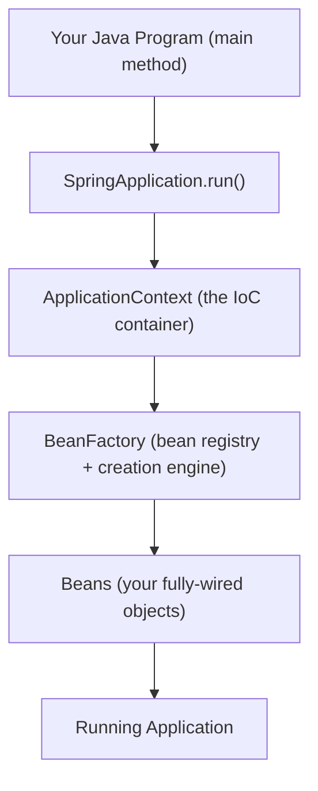

Read it as a pipeline of *creation*:

- **Your program** calls one method: `SpringApplication.run()`.
- **`SpringApplication`** is a bootstrapper: it prepares the environment and *creates* the `ApplicationContext`.
- **`ApplicationContext`** is the IoC container — the rich facade. Internally it owns a **`BeanFactory`**.
- **`BeanFactory`** is the low-level engine that stores bean *definitions* (recipes) and turns them into *beans* (objects).
- **Beans** are your objects, created and wired by the factory.
- The assembled graph *is* the running application.

## Two words you must never conflate: Definition vs Bean

The single most important distinction in this entire guide, introduced now so it colors everything:

- A **`BeanDefinition`** is a **recipe** — metadata describing *how* to make a bean (its class, scope, constructor args, init method, whether it's lazy). It is not an object you can call methods on.
- A **bean** is the **actual object** created from that recipe.

Spring's startup has two big phases mirroring this: first it **collects all the recipes** (definitions), then it **cooks them** (instantiates beans). Component scanning and configuration parsing produce *definitions*. Bean creation consumes them to produce *beans*. If you hold this distinction firmly, 80% of Spring's "magic" evaporates.

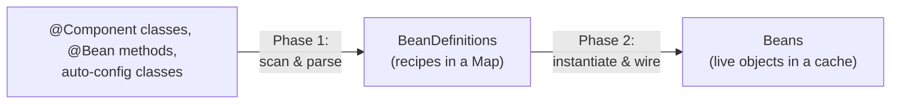

## How object creation changes under Spring

| Concern | Plain Java | Under Spring |
|---|---|---|
| Who creates objects? | You (`new`) | The container |
| Who decides order? | You | The container (from the dependency graph) |
| Who wires dependencies? | You | The container (DI) |
| Who manages lifecycle? | You | The container (init/destroy callbacks) |
| Who applies cross-cutting behavior? | You (manual wrappers) | The container (BeanPostProcessors → proxies) |
| Who knows about all objects? | Nobody, or ad-hoc | The container (single registry) |

## What "understanding Spring" really means

By the end of this guide, "Spring started my app" will decompose in your mind into a precise sequence: *bootstrap → build environment → create context → collect bean definitions (scan + parse config + auto-config) → run definition post-processors → register bean post-processors → instantiate & wire singletons (with proxying) → start the web server → publish ready event.* Each arrow is a named method calling a named collaborator producing named data. That decomposition is the goal. Let's start where your program does — one line: `SpringApplication.run()`.

---

# PART 2 — SpringApplication.run()

## The one line

```java
@SpringBootApplication
public class ShopApplication {
    public static void main(String[] args) {
        SpringApplication.run(ShopApplication.class, args);
    }
}
```

`main()` is an ordinary method on an ordinary thread (the JVM `main` thread). There is no application server "deploying" you. **You** start everything, synchronously, by calling `run()`. It does not return until the application is fully started. Let's open it up.

`SpringApplication.run(Class, args)` is a static convenience equal to:

```java
new SpringApplication(primarySources).run(args);
```

So there are two phases: **constructing** the `SpringApplication` (cheap setup) and **running** it (the whole startup).

## Constructing the SpringApplication

The constructor does a few fast, decisive things — no beans yet:

```java
// org.springframework.boot.SpringApplication (simplified)
public SpringApplication(ResourceLoader rl, Class<?>... primarySources) {
    this.primarySources = new LinkedHashSet<>(Arrays.asList(primarySources));
    this.webApplicationType = WebApplicationType.deduceFromClasspath();      // (1)
    this.bootstrapRegistryInitializers = getInstances(BootstrapRegistryInitializer.class);
    setInitializers(getInstances(ApplicationContextInitializer.class));      // (2)
    setListeners(getInstances(ApplicationListener.class));                   // (3)
    this.mainApplicationClass = deduceMainApplicationClass();
}
```

1. **`deduceFromClasspath()`** — probes the classpath: is `DispatcherServlet` present? → `SERVLET`. Is only WebFlux's `DispatcherHandler` present? → `REACTIVE`. Neither? → `NONE`. This single decision determines *which `ApplicationContext` class* is created later and *whether an embedded web server* starts. Your first taste of the core Spring Boot mechanic: **classpath-driven decisions.**
2. **Initializers** and **3. Listeners** are loaded from `META-INF/spring.factories` (via `SpringFactoriesLoader`). Initializers get a callback to tweak the context *before* refresh; listeners react to lifecycle events.

## run() — the timeline

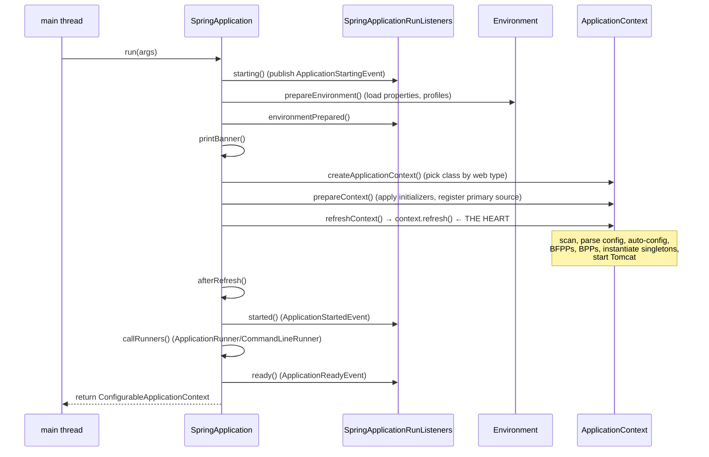

Here is the actual method, condensed:

```java
// SpringApplication.run(String... args) — condensed
public ConfigurableApplicationContext run(String... args) {
    ConfigurableApplicationContext context = null;
    SpringApplicationRunListeners listeners = getRunListeners(args);
    listeners.starting(bootstrapContext, mainApplicationClass);
    try {
        ApplicationArguments appArgs = new DefaultApplicationArguments(args);
        ConfigurableEnvironment env = prepareEnvironment(listeners, bootstrapContext, appArgs);  // (A)
        printBanner(env);                                                                        // (B)
        context = createApplicationContext();                                                    // (C)
        prepareContext(bootstrapContext, context, env, listeners, appArgs);                      // (D)
        refreshContext(context);                                                                 // (E) ← everything
        afterRefresh(context, appArgs);
        listeners.started(context, timeTaken);                                                   // (F)
        callRunners(context, appArgs);                                                           // (G)
    } catch (Throwable ex) {
        handleRunFailure(context, ex, listeners);
        throw new IllegalStateException(ex);
    }
    listeners.ready(context, timeTaken);                                                          // (H)
    return context;
}
```

### (A) prepareEnvironment — build the Environment first

Before any bean, Spring builds the **`Environment`**: the unified view of all configuration (system properties, env vars, command-line args, `application.yml`/`.properties`, profiles). Why first? Because *everything downstream* — auto-configuration conditions, `@Value`, `@ConditionalOnProperty` — needs to *read* configuration to make decisions. The `environmentPrepared` event is where Boot's `EnvironmentPostProcessorApplicationListener` runs, loading `application.yml` and activating profiles. (Full detail in Part 16.)

**Produces:** a fully-populated `ConfigurableEnvironment`. **Consumed by:** the context (conditions, property binding).

### (B) printBanner

Cosmetic, but it happens here — after the environment (so it can read banner properties) and before the context. A tiny landmark confirming "environment ready, context not yet built."

### (C) createApplicationContext — instantiate the container

Based on the web type from the constructor, an `ApplicationContextFactory` picks the concrete class:

- `SERVLET` → `AnnotationConfigServletWebServerApplicationContext`
- `REACTIVE` → `AnnotationConfigReactiveWebServerApplicationContext`
- `NONE` → `AnnotationConfigApplicationContext`

At this moment the context exists but is **empty** — no bean definitions, no beans. Crucially, constructing it also constructs its internal **`DefaultListableBeanFactory`** (Part 4). (Details of the hierarchy in Part 3.)

**Produces:** an empty `ConfigurableApplicationContext` + its `BeanFactory`.

### (D) prepareContext — seed the container

Spring applies the `ApplicationContextInitializer`s, sets the `Environment`, and **registers your primary source** (`ShopApplication.class`) as the very first bean definition (an `AnnotatedGenericBeanDefinition`). This one definition is the seed from which component scanning and auto-configuration will grow the entire definition set — because `ShopApplication` carries `@SpringBootApplication`.

**Produces:** a context containing exactly one bean definition (your main class). **Consumed by:** `refresh()`.

### (E) refreshContext → refresh() — the heart

This delegates to `AbstractApplicationContext.refresh()`, the template method that does *everything*: collect all bean definitions (component scan + configuration parsing + auto-configuration), run `BeanFactoryPostProcessor`s, register `BeanPostProcessor`s, instantiate and wire all non-lazy singletons (applying AOP proxies), and start the embedded Tomcat. This is so central it gets its own treatment across Parts 3–20, and a step-by-step in Part 23. For now, hold the shape:

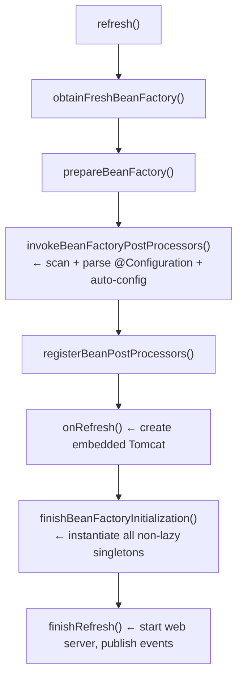

### (F)(G)(H) started, runners, ready

After `refresh()`, the app is essentially up. Spring publishes `ApplicationStartedEvent`, then runs your `ApplicationRunner`/`CommandLineRunner` beans (the "do this once at startup" hook), then publishes `ApplicationReadyEvent`. `run()` returns the live context. In a web app, Tomcat's threads keep the JVM alive.

## Common misconceptions

- **"`run()` is asynchronous / returns before startup."** No — it's fully synchronous; when it returns, the app is started.
- **"The environment is built lazily."** No — it's built *first*, because conditions and property binding depend on it.
- **"`createApplicationContext` creates beans."** No — it creates the *empty* container. Beans come in `refresh()`.
- **"Component scanning happens in the constructor."** No — it happens inside `refresh()` (step E), long after construction.

## Debugging startup

- Breakpoint `SpringApplication.run` and step over (A)–(H) to *see* the phases.
- App exits immediately → web type deduced `NONE` (missing `spring-boot-starter-web`); nothing keeps the JVM alive.
- To watch the environment being built, breakpoint `prepareEnvironment`; to watch the container fill up, breakpoint `refreshContext`.

Next: what exactly *is* the `ApplicationContext` we just created, and how does it relate to the `BeanFactory` it wraps?

---

# PART 3 — ApplicationContext

## Two interfaces, one relationship

The most common confusion in all of Spring: **is `ApplicationContext` a `BeanFactory`, or does it *have* a `BeanFactory`?** The answer is *both*, and understanding why illuminates the whole design.

- `ApplicationContext` **extends** the `BeanFactory` interface — so you can call `getBean` on it.
- But an `AbstractApplicationContext` **holds** (composition) an internal `DefaultListableBeanFactory` and **delegates** the actual bean work to it.

So the `ApplicationContext` is a **rich facade** that *is-a* `BeanFactory` by interface but *has-a* `BeanFactory` for implementation. It adds capabilities on top and forwards the core bean operations down.

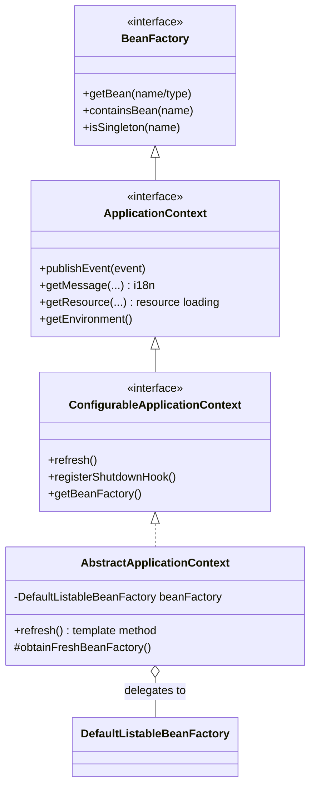

## What ApplicationContext adds on top of BeanFactory

`BeanFactory` is the bare minimum: register definitions, create beans, look them up (lazily). `ApplicationContext` layers on the features a *real application* needs:

| Capability | BeanFactory | ApplicationContext |
|---|---|---|
| Bean registry + DI | ✅ | ✅ (delegated) |
| **Eager** singleton instantiation at startup | ❌ (lazy) | ✅ (`refresh()` pre-instantiates) |
| Event publishing (`ApplicationEventPublisher`) | ❌ | ✅ |
| Internationalization (`MessageSource`) | ❌ | ✅ |
| Resource loading (`getResource`) | ❌ | ✅ |
| `Environment` (properties/profiles) | ❌ | ✅ |
| Automatic `BeanPostProcessor`/`BeanFactoryPostProcessor` registration | ❌ (manual) | ✅ |
| `Aware` callbacks, lifecycle | partial | ✅ |

The killer difference for our purposes: an `ApplicationContext`, during `refresh()`, **eagerly instantiates all non-lazy singletons** and **automatically detects and applies** post-processors. A raw `BeanFactory` would make you do all that by hand. This is why real Spring apps always use an `ApplicationContext`.

## The class hierarchy that matters

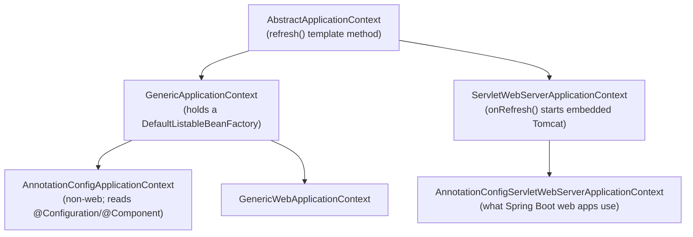

- **`AbstractApplicationContext`** — defines `refresh()`, the fixed startup sequence. All contexts inherit it.
- **`GenericApplicationContext`** — holds a single, ready `DefaultListableBeanFactory` (created in its constructor). Modern contexts extend this; it avoids the older "create a fresh factory each refresh" model.
- **`AnnotationConfigApplicationContext`** — for non-web apps; knows how to read annotated classes (`@Configuration`, `@Component`) via an `AnnotatedBeanDefinitionReader` and `ClassPathBeanDefinitionScanner`.
- **`ServletWebServerApplicationContext`** — overrides **`onRefresh()`** to create and start the embedded servlet container (Tomcat). This is the class that turns "an IoC container" into "a running web server."
- **`AnnotationConfigServletWebServerApplicationContext`** — the concrete class Spring Boot instantiates for servlet web apps (chosen in Part 2, step C). It combines annotation reading + embedded web server.

## Internal data structures (a first look)

The `ApplicationContext` itself mostly holds references to subsystems; the *real* data structures live in its `DefaultListableBeanFactory` (Part 4). But the context owns:

- `applicationListeners` — the registered listeners.
- `applicationEventMulticaster` — dispatches events.
- `messageSource` — i18n.
- `environment` — the config abstraction.
- a reference to its `beanFactory` — where definitions and singletons actually live.

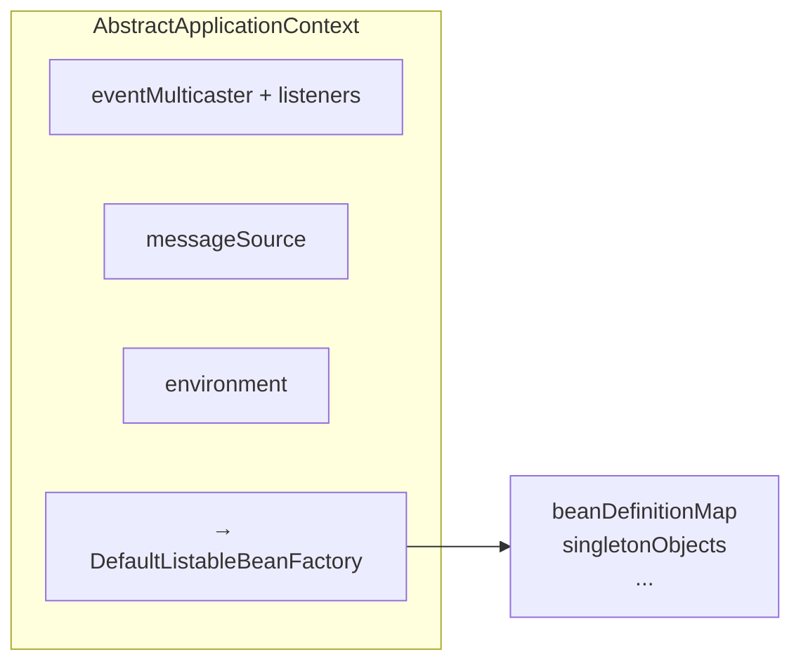

## obtainFreshBeanFactory — where the context meets the factory

Early in `refresh()`, `obtainFreshBeanFactory()` returns the internal `DefaultListableBeanFactory`. For `GenericApplicationContext` subclasses (all modern ones), this factory was created in the constructor and is simply returned (and marked "refreshed"). From here on, `refresh()` operates on that factory: filling it with definitions, then instantiating beans from it.

## Who owns what

- **`SpringApplication`** created the context (Part 2). After `run()` returns, it hands ownership to you (the returned reference).
- **The context** owns the `BeanFactory`, the environment, the event system, and — after refresh — every singleton bean.
- **The `BeanFactory`** owns the definitions and the singleton cache.

## Common misconceptions

- **"`ApplicationContext` and `BeanFactory` are two separate containers."** No — the context *wraps and delegates to* one factory. There's one registry of beans.
- **"`getBean` on the context does something different than on the factory."** No — the context forwards to the factory.
- **"You should use `BeanFactory` for lightweight apps."** In practice, always use an `ApplicationContext`; the extra features (eager singletons, post-processor auto-registration, events) are what make Spring usable.

## Debugging

- `context.getBeanDefinitionCount()` / `getBeanDefinitionNames()` — inspect every registered definition (great for "is my bean even known?").
- `context.getBeanFactory()` (on `ConfigurableApplicationContext`) — reach the `DefaultListableBeanFactory` to inspect internals.
- Cast to `AbstractApplicationContext` to call `getApplicationListeners()`, etc.

Now let's descend into that internal factory — the actual engine that stores definitions and builds beans.

---

# PART 4 — BeanFactory Internals

## `DefaultListableBeanFactory` — the engine

Everything the container "does" with beans ultimately happens inside one class: **`org.springframework.beans.factory.support.DefaultListableBeanFactory`**. It is the full, concrete implementation of the bean registry and creation engine. It implements a stack of interfaces, each adding a capability:

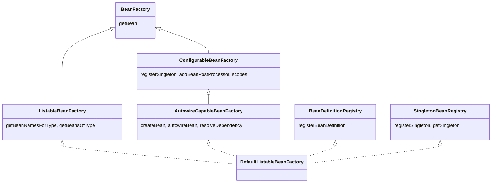

Note two capabilities that will matter enormously later:

- **`BeanDefinitionRegistry`** — store/retrieve *recipes*.
- **`AutowireCapableBeanFactory`** — *create and wire* beans, resolve dependencies. This is the part `AbstractAutowireCapableBeanFactory` (its superclass) implements.

## The internal collections

Here are the actual fields you'd find inside (names are real). These *are* the container's memory:

```java
// Recipes (Phase 1 output)
Map<String, BeanDefinition> beanDefinitionMap;      // name → recipe
List<String> beanDefinitionNames;                   // ordered names (registration order)

// Finished singletons (Phase 2 output) — the "singleton cache"
Map<String, Object> singletonObjects;               // name → fully-initialized bean

// The three-level cache for circular deps (Part 11)
Map<String, Object> earlySingletonObjects;          // raw, not-yet-finished beans
Map<String, ObjectFactory<?>> singletonFactories;   // factories that yield early refs (incl. proxies)
Set<String> singletonsCurrentlyInCreation;          // cycle detection

// Aliases and types
Map<String, String> aliasMap;                       // alias → canonical name
Map<Class<?>, String[]> allBeanNamesByType;         // type → names (cached lookups)

// Post-processors
List<BeanPostProcessor> beanPostProcessors;         // creation interceptors
```

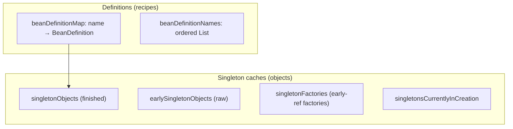

## Bean registration — filling `beanDefinitionMap`

During Phase 1 (component scanning, config parsing, auto-config — Parts 6/8/14), each discovered component becomes a `BeanDefinition` and is stored via:

```java
// BeanDefinitionRegistry
void registerBeanDefinition(String beanName, BeanDefinition beanDefinition);
```

which puts it in `beanDefinitionMap` and appends the name to `beanDefinitionNames`. **At the end of Phase 1, the map holds every recipe** — yours, Spring's infrastructure, and all auto-configured beans — but `singletonObjects` is still nearly empty.

## Bean retrieval — `getBean` / `doGetBean`

`getBean(name)` funnels into `AbstractBeanFactory.doGetBean`, the single most-traveled method in the container:

```java
// AbstractBeanFactory.doGetBean (heavily simplified)
protected <T> T doGetBean(String name, ...) {
    Object shared = getSingleton(name);              // 1. already in cache?
    if (shared != null) {
        bean = shared;                               //    → return cached
    } else {
        RootBeanDefinition mbd = getMergedLocalBeanDefinition(name);  // 2. resolve recipe
        // 3. create dependent beans first (depends-on)
        if (mbd.isSingleton()) {
            shared = getSingleton(name, () -> createBean(name, mbd, args));  // 4. create
            bean = shared;
        } else if (mbd.isPrototype()) {
            bean = createBean(name, mbd, args);      // new instance every time
        } else {
            // custom scope (request/session/...)
        }
    }
    return (T) bean;
}
```

The key branches:

- **Singleton + cache hit** → return the existing object (O(1) map lookup). This is why injecting a singleton "everywhere" is free after first creation.
- **Singleton + cache miss** → `createBean` runs the *entire* lifecycle (Part 9), stores the result in `singletonObjects`, returns it.
- **Prototype** → `createBean` every call; nothing cached.

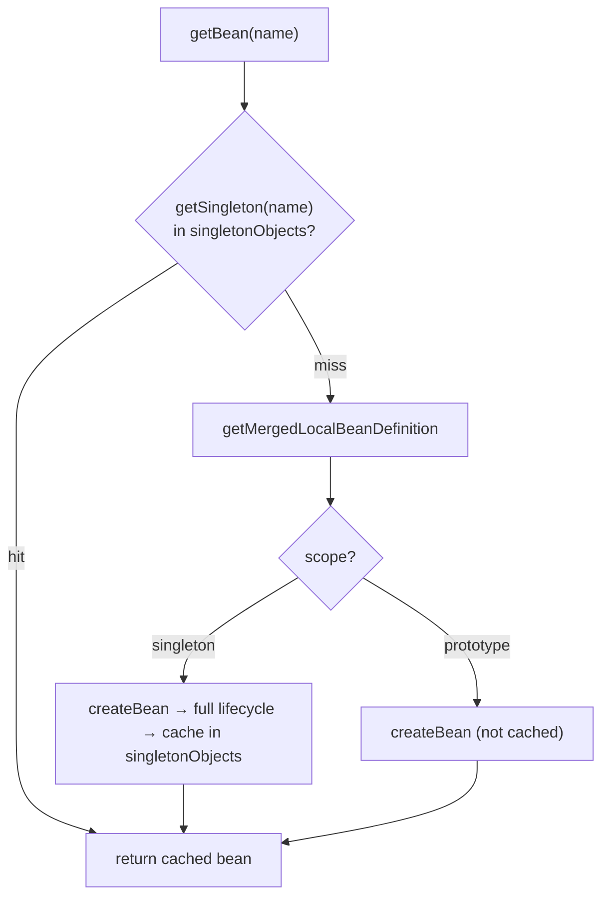

## The singleton cache and `getSingleton`

`getSingleton(name)` checks the three maps in order: `singletonObjects` → `earlySingletonObjects` → `singletonFactories`. This ordering *is* the circular-dependency resolution mechanism (Part 11). For a normal, non-circular singleton, only `singletonObjects` matters: it's checked first on every `getBean`, populated once after creation, and read forever after.

## The alias registry

Beans can have aliases (alternative names). `aliasMap` maps each alias → canonical name; `getBean("alias")` resolves through it. Used by `@Bean(name={...})`, XML `<alias>`, and some auto-config. Rarely something you touch, but it's why a bean can answer to multiple names.

## The dependency graph

The factory tracks `dependentBeanMap` (bean → beans that depend on it) and `dependenciesForBeanMap` (bean → beans it depends on). These support correct **destruction order** (destroy dependents before their dependencies, Part 19) and `@DependsOn`. It's an internal DAG the container maintains as it wires beans.

## Bean destruction

For singletons implementing `DisposableBean`/`@PreDestroy`/`destroyMethod`, the factory registers them in `disposableBeans`. On context close, it walks these in **reverse dependency order** and invokes their destroy callbacks (Part 19).

## Common misconceptions

- **"The container is some huge opaque runtime."** No — its "memory" is a handful of `Map`s and `List`s inside one class. You can literally print them.
- **"Every `getBean` constructs the object."** Only for prototypes or first-time singletons; cached singletons are a map lookup.
- **"Definitions and instances live together."** They live in *different* maps: `beanDefinitionMap` (recipes) vs `singletonObjects` (objects).

## Debugging BeanFactory internals

- `((DefaultListableBeanFactory) context.getBeanFactory()).getBeanDefinitionNames()` — every recipe.
- Breakpoint `DefaultListableBeanFactory.registerBeanDefinition` — watch definitions arrive during Phase 1.
- Breakpoint `AbstractBeanFactory.doGetBean` — watch retrieval/creation decisions.
- Inspect `singletonObjects` in the debugger to see which beans are already built.

We keep saying "BeanDefinition." Let's now open that recipe and see exactly what it stores and why.

---

# PART 5 — BeanDefinition

## Why metadata before objects?

Here is a design decision that, once understood, explains a huge amount of Spring's power: **Spring never creates a bean directly from a class. It first builds a `BeanDefinition` — a mutable metadata object describing the bean — and only later instantiates from that definition.**

Why the indirection? Because a *description* can be **inspected and modified** before anything is instantiated. This enables:

- **`BeanFactoryPostProcessor`s** to edit definitions before creation (Part 13) — e.g. resolve `${...}` placeholders, or auto-config adjusting a bean.
- **Conditional evaluation** to *remove* a definition before it ever becomes an object (Part 15).
- **Scope, laziness, primary, autowire-mode** decisions to be recorded declaratively and honored at creation time.
- **Ordering and dependency analysis** without constructing anything.

If Spring jumped straight from class to object, none of this would be possible. The `BeanDefinition` is the "editable blueprint" phase that makes Spring extensible.

## What a BeanDefinition stores

`BeanDefinition` is an interface; the common implementation is `RootBeanDefinition`/`GenericBeanDefinition`. It holds:

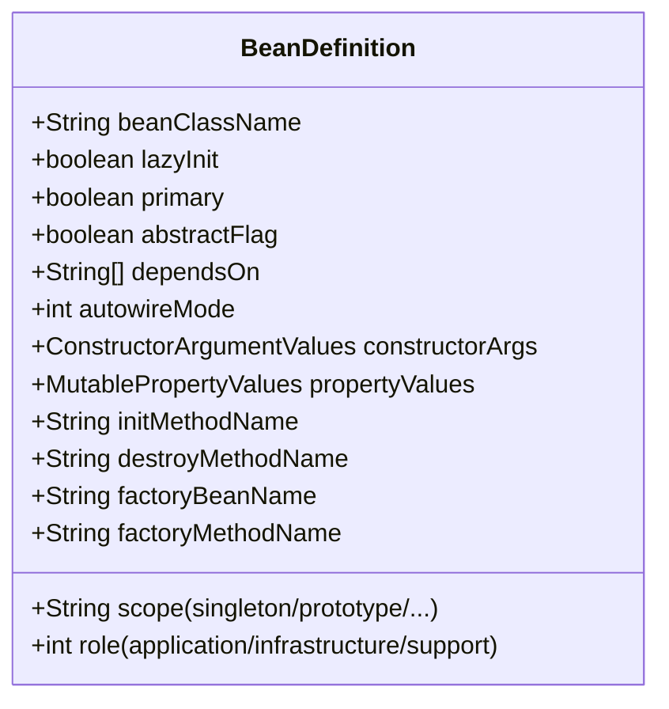

Walking the important fields with *why each exists*:

- **`beanClassName`** — what class to instantiate. May be a name (resolved lazily) or a resolved `Class`.
- **`scope`** — `singleton` (default), `prototype`, or a web scope. Decides caching/creation behavior (Part 17).
- **`lazyInit`** — if true, skip during eager singleton pre-instantiation; create on first access (Part 18).
- **`primary`** — tie-breaker when multiple candidates match a dependency (Part 10).
- **`dependsOn`** — beans that must be created *before* this one (ordering not implied by injection).
- **`constructorArgumentValues` / `propertyValues`** — explicit constructor args and property values (used by XML and `@Bean` factory-method style). For annotation-driven autowiring, these are often empty and injection is resolved by post-processors instead.
- **`initMethodName` / `destroyMethodName`** — lifecycle callbacks (Parts 9/19).
- **`factoryBeanName` / `factoryMethodName`** — for beans produced by a factory method (this is exactly how `@Bean` methods are modeled! The definition says "call method `orderService` on the config bean").
- **`role`** — `ROLE_APPLICATION` (yours), `ROLE_INFRASTRUCTURE` (Spring's internal machinery like post-processors), `ROLE_SUPPORT`. Purely informational/tooling.

## Two flavors: component vs factory-method

There are two structurally different ways a definition describes creation, and recognizing them clarifies `@Component` vs `@Bean`:

1. **Constructor/component definition** (`@Component` scanned classes): `beanClassName` = the component class; Spring will instantiate it via its constructor and autowire.

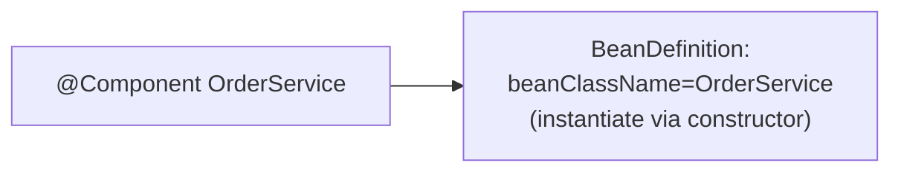

2. **Factory-method definition** (`@Bean` methods): `factoryBeanName` = the `@Configuration` bean, `factoryMethodName` = the method. Spring will call *that method* to get the bean.

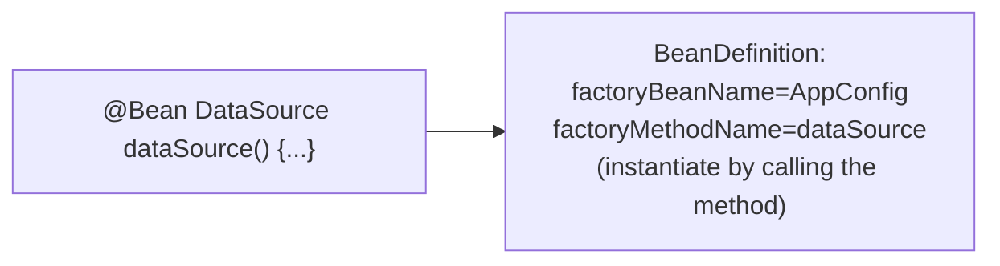

This is why `@Bean` methods can contain arbitrary construction logic: the definition just says "call this method," and the method body does whatever it wants.

## AnnotatedBeanDefinition and metadata

Definitions created from annotated classes are `AnnotatedBeanDefinition`s, which additionally carry an **`AnnotationMetadata`** — the parsed annotations of the class, read via ASM *without loading the class* (Part 6). This metadata is what conditions (`@ConditionalOnClass`), scope annotations, and `@Bean`-method discovery inspect.

## A concrete example

```java
@Configuration
class AppConfig {
    @Bean
    @Lazy
    @Primary
    DataSource dataSource(DataSourceProperties props) {
        return new HikariDataSource(/* from props */);
    }
}
```

Spring builds a `BeanDefinition` roughly equivalent to:

```
beanName        = "dataSource"
factoryBeanName = "appConfig"
factoryMethodName = "dataSource"
scope           = "singleton"
lazyInit        = true
primary         = true
// constructor arg: DataSourceProperties resolved by autowiring the method parameter
```

No `HikariDataSource` exists yet. The *recipe* exists. Instantiation happens later in Phase 2 when something needs a `DataSource` (or during eager pre-instantiation, unless `@Lazy`).

## The lifecycle of a definition

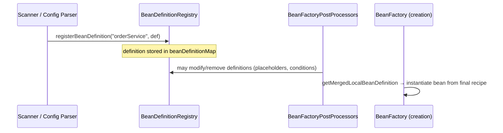

A definition can be created, **modified**, or **removed** before any bean exists. Only when `getBean`/pre-instantiation runs is the (possibly-modified) recipe finally "cooked."

## Common misconceptions

- **"`@Bean` methods create beans directly."** They *become factory-method definitions*; Spring calls them at creation time (and intercepts them — Part 8).
- **"A BeanDefinition is the bean."** No — it's the recipe; the bean is a separate object created later.
- **"Definitions are immutable."** They're deliberately *mutable* so post-processors can edit them.

## Debugging

- `context.getBeanDefinition("orderService")` — dump the actual recipe (scope, lazy, factory method, etc.).
- If a bean behaves unexpectedly (wrong scope, unexpectedly lazy), inspect its definition first — the answer is usually there.

We have recipes-in-theory. Now: how does Spring *discover* the classes that become recipes? Component scanning.

---

# PART 6 — Component Scanning

## The problem: find annotated classes without loading everything

Your `@SpringBootApplication` says "scan my package for components." But a classpath can contain *tens of thousands* of classes (yours + all libraries). Loading every class via the classloader just to check "does it have `@Component`?" would be catastrophically slow and memory-hungry — loading a class runs its static initializers, links it, fills metaspace. Spring needs to inspect annotations on thousands of `.class` files **without loading them as Java classes**.

The solution is **ASM bytecode reading**: Spring reads the raw bytes of each `.class` file and parses just the annotation metadata directly from the constant pool — no classloading. This is the key performance trick behind scanning.

## The players

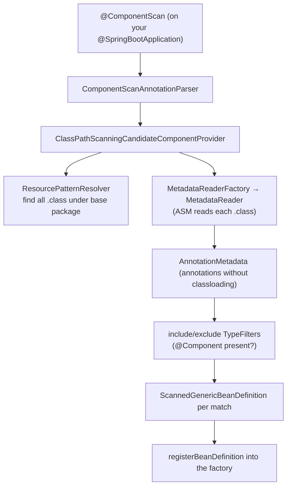

- **`ClassPathScanningCandidateComponentProvider`** — the core scanner. Given a base package, it finds candidate components.
- **`ResourcePatternResolver`** — expands `classpath*:com/acme/**/*.class` into a list of `.class` resources.
- **`MetadataReader`** (from `MetadataReaderFactory`, backed by ASM's `ClassReader`) — reads one `.class` file's bytes and exposes `ClassMetadata` + `AnnotationMetadata`.
- **`TypeFilter`s** — include filters (default: has `@Component` or a meta-annotation like `@Service`) and exclude filters. Decide if a candidate qualifies.
- **`ScannedGenericBeanDefinition`** — the definition produced for each qualifying class.

## The algorithm, step by step

```java
// ClassPathScanningCandidateComponentProvider.findCandidateComponents (conceptual)
Set<BeanDefinition> findCandidateComponents(String basePackage) {
    Set<BeanDefinition> candidates = new LinkedHashSet<>();
    String pattern = "classpath*:" + basePackage.replace('.', '/') + "/**/*.class";
    Resource[] resources = resourcePatternResolver.getResources(pattern);   // (1) list .class files
    for (Resource resource : resources) {
        MetadataReader reader = metadataReaderFactory.getMetadataReader(resource);  // (2) ASM read
        if (isCandidateComponent(reader)) {                                 // (3) filter check
            ScannedGenericBeanDefinition sbd = new ScannedGenericBeanDefinition(reader);
            if (isCandidateComponent(sbd)) {                                // (4) concrete & not abstract
                candidates.add(sbd);
            }
        }
    }
    return candidates;
}
```

1. **Enumerate** all `.class` resources under the base package.
2. **ASM-read** each into a `MetadataReader` — cheap, no classloading.
3. **Include/exclude filtering**: does the class carry `@Component` (directly or via meta-annotation)? Default include filter matches `@Component` and anything annotated with it (`@Service`, `@Repository`, `@Controller`, `@Configuration`).
4. **Concreteness check**: skip interfaces and abstract classes (unless they have lookup methods).

Each survivor becomes a `ScannedGenericBeanDefinition` and is registered into the `BeanDefinitionRegistry`.

## Where the base package comes from

Your `@SpringBootApplication` includes `@ComponentScan` with **no explicit `basePackages`**. In that case, the default base package is **the package of the annotated class**. This is the concrete reason all your beans must live in or below your main application class's package — the scanner never looks outside it. `AutoConfigurationPackages` also records this package (used later by, e.g., JPA entity scanning).

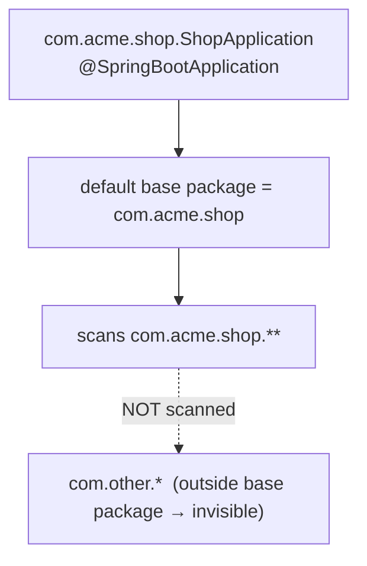

## `@Component` → `BeanDefinition` (the exact conversion)

When the scanner finds `@Service class OrderService`:

1. ASM metadata confirms `@Service` (which is meta-annotated `@Component`).
2. A `ScannedGenericBeanDefinition` is created with `beanClassName = "com.acme.shop.OrderService"`.
3. `AnnotationConfigUtils.processCommonDefinitionAnnotations` reads `@Scope`, `@Lazy`, `@Primary`, `@DependsOn`, `@Role` from the metadata and stamps them onto the definition.
4. A bean name is generated by `AnnotationBeanNameGenerator` — default is the decapitalized simple class name (`OrderService` → `orderService`), or the value in `@Service("...")`.
5. `registerBeanDefinition("orderService", def)` stores it.

At this point `OrderService` is a *recipe*, not an object. No constructor has run.

## Efficiency — why this scales

- **No classloading** during scanning → thousands of classes inspected in milliseconds.
- **Metadata caching** — `MetadataReaderFactory` caches readers so re-inspection is free.
- **Filter short-circuit** — most classes fail the include filter immediately (no `@Component`) and are discarded without building a definition.

For very large apps, scanning is still measurable; alternatives like Spring's `@Indexed`/`spring-context-indexer` (compile-time candidate index in `META-INF/spring.components`) skip runtime scanning entirely by precomputing the candidate list.

## Common misconceptions

- **"Scanning loads every class."** No — it reads bytecode via ASM without loading. Classes are only loaded when their beans are actually instantiated.
- **"Scanning happens in `main`/constructor."** No — it runs inside `refresh()` → `invokeBeanFactoryPostProcessors` → `ConfigurationClassPostProcessor` (Part 8), during Phase 1.
- **"`@ComponentScan` scans the whole classpath."** No — only the base package (default: main class's package) downward.

## Debugging

- **A whole package of beans missing** → they're outside the base package. Fix with `@SpringBootApplication(scanBasePackages="com.acme")` or an explicit `@ComponentScan`.
- Enable `logging.level.org.springframework.context.annotation=DEBUG` to trace scanning.
- `context.getBeanDefinitionNames()` — verify the expected components became definitions.

Scanning found classes carrying annotations. But *how* does Spring interpret each annotation — `@Component` vs `@Configuration` vs `@Bean` vs `@Import`? That's annotation processing.

---

# PART 7 — Annotation Processing

## Meta-annotations: the foundation

Spring's stereotype annotations are **composed** via meta-annotation. `@Service` is *itself* annotated with `@Component`:

```java
@Target(TYPE) @Retention(RUNTIME)
@Component                       // ← meta-annotation
public @interface Service {
    @AliasFor(annotation = Component.class)
    String value() default "";
}
```

When Spring reads a class's `AnnotationMetadata` (via ASM, Part 6), it computes not just the *direct* annotations but the **transitive meta-annotation set**. So a class annotated `@Service` is recognized as "meta-annotated with `@Component`," which is why the default component-scan include filter (which looks for `@Component`) matches `@Service`, `@Repository`, `@Controller`, and `@Configuration` too. This composition is handled by `MergedAnnotations` / `AnnotationMetadata`.

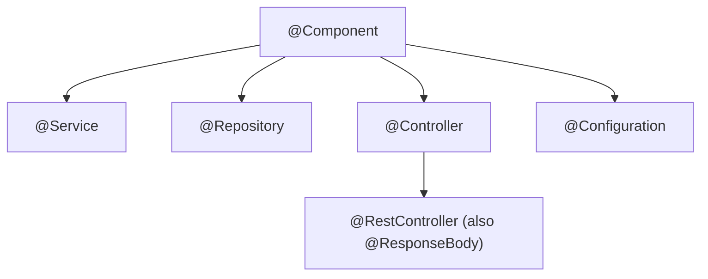

## The stereotype annotations — semantics, not just labels

All become `@Component`-style bean definitions, but they carry *intent* and sometimes *behavior*:

- **`@Component`** — generic managed component. The base.
- **`@Service`** — a business-logic component. Semantically marks the service layer; no extra behavior by default.
- **`@Repository`** — a persistence component. **Adds behavior**: it's a target for `PersistenceExceptionTranslationPostProcessor`, which wraps the bean so native persistence exceptions (JPA/Hibernate/JDBC) are translated into Spring's `DataAccessException` hierarchy. So `@Repository` is not purely cosmetic.
- **`@Controller`** — a web controller; `RequestMappingHandlerMapping` scans these for `@RequestMapping` methods.
- **`@Configuration`** — a source of `@Bean` definitions; **enhanced by CGLIB** (Part 8). This is the most behaviorally different stereotype.

## `@Bean` — factory-method definitions

A `@Bean` method inside a `@Configuration` (or `@Component`) class declares a bean whose creation is "call this method." As we saw in Part 5, it becomes a *factory-method* `BeanDefinition` (`factoryBeanName` + `factoryMethodName`). Method parameters are **injected** (autowired by type). The method name is the default bean name.

```java
@Configuration
class AppConfig {
    @Bean                                   // beanName "objectMapper"
    ObjectMapper objectMapper() { return new ObjectMapper(); }

    @Bean                                   // beanName "orderService"; deps injected as params
    OrderService orderService(OrderRepository repo, ObjectMapper mapper) {
        return new OrderService(repo, mapper);
    }
}
```

`@Bean` is how you register beans for types you **don't own** (can't annotate) — third-party classes like `DataSource`, `ObjectMapper`, `RestTemplate`.

## `@Import` — pulling in more configuration

`@Import` lets one configuration class bring in others. It accepts three kinds of targets, each processed differently by `ConfigurationClassParser` (Part 8):

1. **A `@Configuration`/`@Component` class** → processed as an additional configuration class.
2. **An `ImportSelector`** → its `selectImports()` returns class *names* to import (dynamic). This is how auto-configuration works (Part 14).
3. **An `ImportBeanDefinitionRegistrar`** → given the registry, it programmatically registers bean definitions (maximum control; used by e.g. `@EnableConfigurationProperties`, MyBatis mapper scanning).

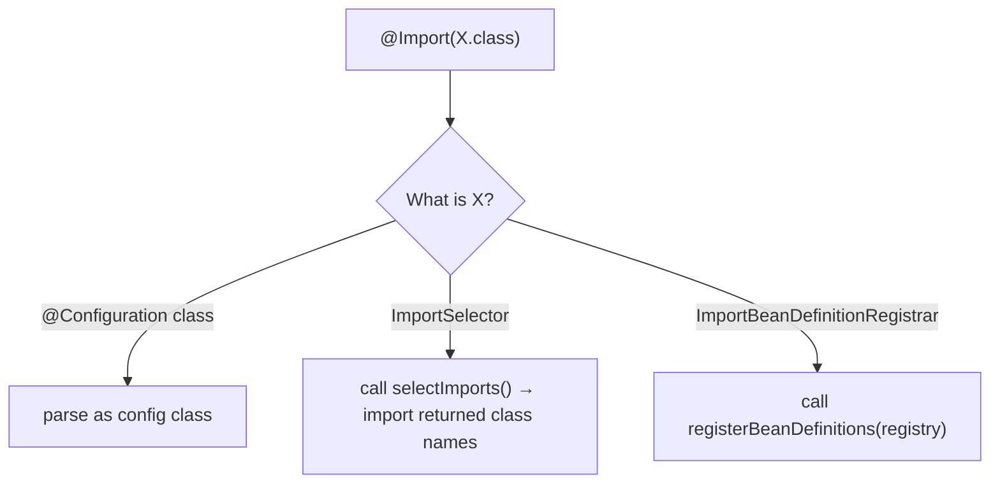

## `@ImportResource` — legacy XML

`@ImportResource("classpath:beans.xml")` loads bean definitions from an XML file via an `XmlBeanDefinitionReader`. A bridge for legacy XML config coexisting with annotations. Rare in new code but you'll meet it in migrations.

## `@PropertySource` — adding property files

`@PropertySource("classpath:custom.properties")` adds a `PropertySource` to the `Environment` so its keys are available to `@Value`/`@ConfigurationProperties`. Processed by `ConfigurationClassParser` during config parsing (note: it does **not** load YAML by default — that's Boot's separate mechanism, Part 16).

## How discovery actually happens (the unifying view)

All of these annotations are discovered and interpreted in **one place**: `ConfigurationClassPostProcessor` → `ConfigurationClassParser` (Part 8). The parser, for each configuration class, reads its `AnnotationMetadata` and:

- processes `@PropertySource` (add property sources),
- processes `@ComponentScan` (run the scanner, Part 6, which may find *more* config classes → recursion),
- processes `@Import` (the three kinds above),
- processes `@ImportResource`,
- registers `@Bean` methods as factory-method definitions,
- honors `@Conditional` at each step (Part 15).

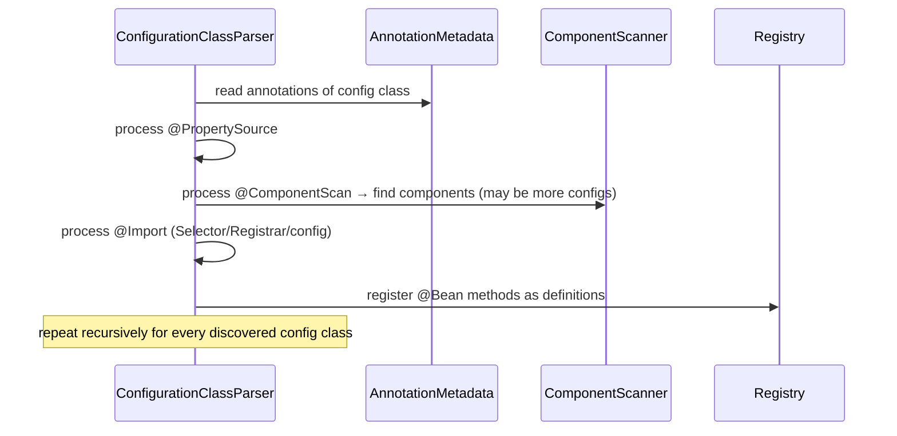

## Common misconceptions

- **"`@Service`/`@Repository` are just aliases for `@Component`."** `@Service` is; `@Repository` additionally enables exception translation. Intent also matters for readability and tooling.
- **"`@Bean` and `@Component` are the same."** `@Component` = the class *is* the bean (constructor definition); `@Bean` = a *method* produces the bean (factory-method definition), enabling arbitrary construction and third-party types.
- **"`@Import` only imports config classes."** It also accepts `ImportSelector` and `ImportBeanDefinitionRegistrar` — the extension points auto-config relies on.

## Debugging

- Bean from a `@Bean` method missing → the enclosing `@Configuration` class isn't a bean (not scanned/imported), or a `@Conditional` failed.
- `@Repository` exceptions not translated → missing `PersistenceExceptionTranslationPostProcessor` (Boot auto-configures it when JPA is present).
- Use `context.getBeanDefinition(name)` to confirm whether a definition is component-style or factory-method-style.

The most behaviorally special stereotype is `@Configuration`. Why is it enhanced by CGLIB, and what does `ConfigurationClassPostProcessor` really do? Next.

---

# PART 8 — Configuration Classes

## `ConfigurationClassPostProcessor` — the Phase 1 powerhouse

Everything about configuration classes, component scanning, `@Import`, and auto-configuration is driven by **one** `BeanDefinitionRegistryPostProcessor`: `ConfigurationClassPostProcessor`. Spring Boot registers it very early (in `AnnotationConfigUtils.registerAnnotationConfigProcessors`). During `refresh()` → `invokeBeanFactoryPostProcessors`, it runs *before* any bean is instantiated, and it **expands your single seed definition (the main class) into the full set of definitions**.

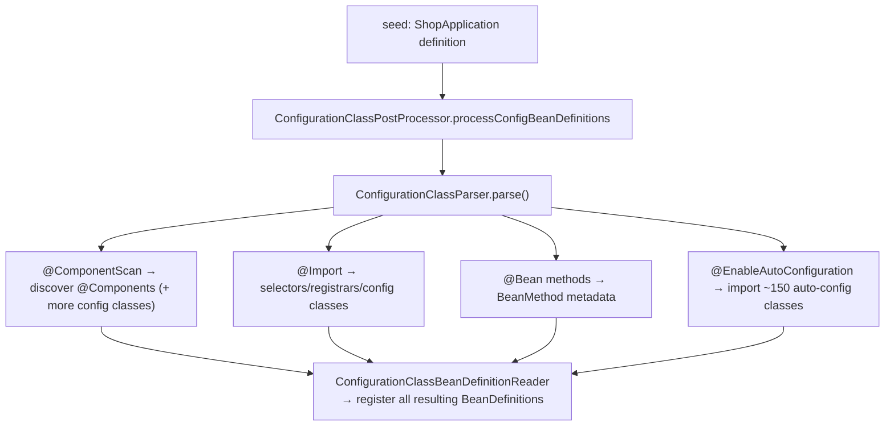

## Full mode vs Lite mode

A class can supply `@Bean` methods in two "modes," and the difference is *behavioral and important*:

- **Full mode** — a class annotated `@Configuration` (with `proxyBeanMethods=true`, the default). Spring **CGLIB-enhances** it (subclass proxy). Inter-bean method calls are intercepted (see below) to preserve singleton semantics.
- **Lite mode** — a class with `@Bean` methods but **not** `@Configuration` (e.g. `@Component` with `@Bean` methods, or `@Configuration(proxyBeanMethods=false)`). **No CGLIB enhancement.** `@Bean` methods still register beans, but inter-bean calls are *plain Java calls* — not intercepted.

```mermaid
flowchart TD
    Q{"@Configuration with proxyBeanMethods=true?"} -->|yes| Full["FULL: CGLIB-enhanced<br/>inter-bean calls intercepted → singleton preserved"]
    Q -->|"no (lite / proxyBeanMethods=false)"| Lite["LITE: plain class<br/>inter-bean calls create NEW instances"]
```

## Why `@Configuration` is CGLIB-enhanced — the singleton problem

Consider:

```java
@Configuration
class AppConfig {
    @Bean DataSource dataSource() { return new HikariDataSource(...); }

    @Bean OrderRepository orderRepository() {
        return new JdbcOrderRepository(dataSource());   // ← calls another @Bean method!
    }

    @Bean InventoryRepository inventoryRepository() {
        return new JdbcInventoryRepository(dataSource());  // ← calls it AGAIN
    }
}
```

`dataSource()` is called *twice* from within the config class. In plain Java, that would create **two** `HikariDataSource` objects — disastrous (two connection pools!). But `DataSource` is a singleton; both repositories must share the *same* instance.

**CGLIB enhancement solves this.** Spring replaces `AppConfig` with a CGLIB subclass whose `@Bean` methods are **overridden and intercepted**. When `orderRepository()` calls `dataSource()`, the interceptor doesn't run the method body — it checks the container: *"is the `dataSource` singleton already created? Return the cached one. If not, create it once, cache it, return it."* So both repositories get the identical, single `DataSource`.

```mermaid
sequenceDiagram
    participant OR as orderRepository() body
    participant Enh as CGLIB-enhanced AppConfig
    participant BF as BeanFactory (singleton cache)
    OR->>Enh: dataSource()   (intercepted!)
    Enh->>BF: is "dataSource" singleton cached?
    alt cached
        BF-->>Enh: return existing DataSource
    else not yet
        Enh->>Enh: run real dataSource() body ONCE
        Enh->>BF: cache it
    end
    Enh-->>OR: the ONE DataSource instance
```

This is the answer to **"why do `@Bean` methods return singletons even when called like normal methods?"** — because the enclosing `@Configuration` class isn't a normal object; it's a CGLIB proxy that routes every inter-`@Bean` call through the singleton cache.

> With `proxyBeanMethods=false` (lite), this interception is *gone*. Inter-bean method calls create new instances. Boot uses `proxyBeanMethods=false` extensively in its own auto-config classes for faster startup — but *only* where methods don't call each other. If you write inter-`@Bean` calls, you need full mode (the default).

## `ConfigurationClassParser` — how parsing works

The parser builds a model of configuration classes before registering definitions. For each config class it produces a `ConfigurationClass` holding:

- its `@Bean` methods (as `BeanMethod` objects),
- imported resources,
- imported registrars,
- discovered `@ComponentScan` results.

It processes recursively: a `@ComponentScan` may discover *another* `@Configuration` class, which is then parsed too. `@Import` of an `ImportSelector` yields more classes to parse. The parser also **evaluates `@Conditional`** at each node (Part 15) — skipping classes/methods whose conditions fail *before* they become definitions.

## ImportSelector vs DeferredImportSelector vs ImportBeanDefinitionRegistrar

Three `@Import` targets, three timings:

- **`ImportSelector`** — `selectImports()` returns class names to import; processed **immediately** during parsing.
- **`DeferredImportSelector`** — like `ImportSelector` but processed **last**, *after* all regular config classes are parsed. **This is what auto-configuration uses** (`AutoConfigurationImportSelector`), so that user configuration and its beans are known *before* auto-config's `@ConditionalOnMissingBean` checks run (enabling correct back-off, Part 14).
- **`ImportBeanDefinitionRegistrar`** — gets the `BeanDefinitionRegistry` and registers definitions programmatically; for cases needing full control.

```mermaid
flowchart LR
    A["parse user @Configuration classes<br/>(ImportSelectors processed inline)"] --> B["THEN process DeferredImportSelectors<br/>(auto-config) LAST"]
    B --> C["auto-config @ConditionalOnMissingBean<br/>sees user beans → backs off correctly"]
```

## `BeanMethod` and registration

Each `@Bean` method becomes a `BeanMethod` in the model, then `ConfigurationClassBeanDefinitionReader` turns it into a factory-method `BeanDefinition` (Part 5) and registers it. Scanned `@Component`s are already definitions; imported classes get parsed then registered. At the end, `beanDefinitionMap` contains the complete recipe set.

## Common misconceptions

- **"`@Configuration` and `@Component` with `@Bean` are equivalent."** No — the former is CGLIB-enhanced (inter-bean calls preserve singletons); the latter (lite) is not.
- **"CGLIB on config classes is for AOP."** No — it's specifically to intercept inter-`@Bean` calls for singleton preservation.
- **"`proxyBeanMethods=false` is always a safe optimization."** Only if your `@Bean` methods don't call each other. If they do, you'll silently get duplicate instances.

## Debugging

- **Duplicate singletons / two connection pools** → a `@Configuration` accidentally in lite mode (`proxyBeanMethods=false`) with inter-bean calls. Switch to full mode or inject the dependency as a method parameter instead of calling the method.
- **Auto-config bean not backing off to my bean** → ordering; auto-config is a `DeferredImportSelector` and should see your beans — verify your bean is actually registered (scanned/imported).
- Breakpoint `ConfigurationClassPostProcessor.processConfigBeanDefinitions` to watch the whole Phase 1 expansion.

Phase 1 is done: the factory holds every recipe. Now Phase 2 — the deepest chapter — how a recipe becomes a living, wired bean.

---

# PART 9 — Bean Creation Lifecycle

## Where we are in startup

Phase 1 (Parts 6–8) filled `beanDefinitionMap` with recipes. Now `refresh()` calls **`finishBeanFactoryInitialization`** → `beanFactory.preInstantiateSingletons()`, which iterates every non-lazy singleton definition and calls `getBean(name)`. Each `getBean` triggers the full lifecycle we're about to dissect. This is Phase 2: **recipes → live, wired, proxied beans.**

## The complete lifecycle

```mermaid
flowchart TD
    A["BeanDefinition (recipe)"] --> B["1. createBeanInstance<br/>(constructor + constructor DI)"]
    B --> C["2. MergedBeanDefinitionPostProcessors<br/>(scan @Autowired/@PostConstruct metadata)"]
    C --> D["3. addSingletonFactory<br/>(expose early ref for circular deps)"]
    D --> E["4. populateBean<br/>(field + setter injection)"]
    E --> F["5. Aware interfaces<br/>(BeanNameAware, ApplicationContextAware...)"]
    F --> G["6. BeanPostProcessor.postProcessBeforeInitialization"]
    G --> H["7. @PostConstruct"]
    H --> I["8. InitializingBean.afterPropertiesSet()"]
    I --> J["9. custom init-method"]
    J --> K["10. BeanPostProcessor.postProcessAfterInitialization<br/>← AOP PROXY created here"]
    K --> L["11. register for destruction (if DisposableBean/@PreDestroy)"]
    L --> M["12. put in singletonObjects (cache)"]
```

This is `AbstractAutowireCapableBeanFactory.doCreateBean` unfolded. Let's walk every stage with *who does what*.

## Stage 1 — Instantiation (`createBeanInstance`)

Spring picks a constructor and instantiates the raw object. Two paths:

- **Component definition** → choose a constructor. If there's one constructor with parameters (or one `@Autowired` constructor), Spring resolves each parameter as a dependency (recursive `getBean`) and calls it — this is **constructor injection**, happening *right here at instantiation*.
- **Factory-method definition** (`@Bean`) → call the (CGLIB-intercepted) factory method, injecting its parameters.

At the end of Stage 1 you have a **raw object** — constructed, but fields not yet injected (except constructor args), init not yet run.

```java
// Constructor injection resolves dependencies BEFORE the object exists
OrderService(OrderRepository repo, PricingService pricing) { ... }
// Spring: getBean(OrderRepository) + getBean(PricingService), THEN new OrderService(a, b)
```

This is *why* constructor injection guarantees a fully-formed object with all mandatory dependencies present — and why it can't participate in certain circular dependencies (Part 11): the object literally cannot be created until its constructor args exist.

## Stage 2 — Merged definition post-processing

`MergedBeanDefinitionPostProcessor`s run (e.g. `AutowiredAnnotationBeanPostProcessor`, `CommonAnnotationBeanPostProcessor`). They **scan the bean's class for injection metadata** — which fields/methods carry `@Autowired`, `@Value`, `@Resource`, and which methods are `@PostConstruct`/`@PreDestroy` — and cache this metadata (`InjectionMetadata`) for use in the next stages. Doing it once here avoids re-reflecting later.

## Stage 3 — Early singleton exposure

*Before* injecting this bean's own dependencies, Spring adds an `ObjectFactory` for it into `singletonFactories` (the third-level cache). This publishes an **early reference** to the half-built bean so that if a circular dependency loops back to it during Stage 4, the loop can be closed. Critically, this factory can also return the **proxy** (if the bean will be AOP-advised) rather than the raw object. This whole mechanism is Part 11; just note *where* it happens — between instantiation and population.

## Stage 4 — Population (`populateBean`): field & setter injection

Now Spring injects the bean's declared dependencies that weren't constructor args:

- **Field injection** — `AutowiredAnnotationBeanPostProcessor` uses the cached metadata to set `@Autowired`/`@Value` fields via reflection.
- **Setter injection** — `@Autowired` setter methods are invoked with resolved dependencies.

Each dependency is resolved by `resolveDependency` (Part 10), which may recursively `getBean` other beans (creating them if needed). At the end of Stage 4 the bean has **all** its collaborators wired.

## Stage 5 — Aware interfaces

If the bean implements an `*Aware` interface, Spring injects the corresponding infrastructure object:

- `BeanNameAware.setBeanName(name)`
- `BeanFactoryAware.setBeanFactory(bf)`
- `ApplicationContextAware.setApplicationContext(ctx)`
- `EnvironmentAware`, `ResourceLoaderAware`, etc.

These give a bean a hook into the container itself. (Some, like `ApplicationContextAware`, are actually applied via a `BeanPostProcessor` — `ApplicationContextAwareProcessor` — in the "before initialization" step, but conceptually they belong here.)

## Stage 6 — `postProcessBeforeInitialization`

Every `BeanPostProcessor`'s `postProcessBeforeInitialization(bean, name)` runs. This is where, for example, `@PostConstruct` methods and `@Resource` injection are *triggered* (via `CommonAnnotationBeanPostProcessor` / `InitDestroyAnnotationBeanPostProcessor`), and `ApplicationContextAwareProcessor` sets aware references. A post-processor may return a *different* object, replacing the bean — though proxying usually happens in Stage 10.

## Stage 7 — `@PostConstruct`

The bean's `@PostConstruct`-annotated method runs (via `InitDestroyAnnotationBeanPostProcessor` during the "before init" phase). This is the recommended place for initialization that needs injected dependencies (they're all present now). Runs **once**.

## Stage 8 — `InitializingBean.afterPropertiesSet()`

If the bean implements `InitializingBean`, its `afterPropertiesSet()` runs. Same purpose as `@PostConstruct` but couples your code to Spring's interface, so it's less preferred.

## Stage 9 — Custom init-method

If the definition specifies an `initMethodName` (`@Bean(initMethod="...")` or XML), it's invoked now. This keeps init logic decoupled from Spring interfaces (good for third-party beans).

**Order of the three init callbacks:** `@PostConstruct` → `afterPropertiesSet()` → custom `init-method`.

## Stage 10 — `postProcessAfterInitialization`: proxy creation

Every `BeanPostProcessor`'s `postProcessAfterInitialization(bean, name)` runs. **This is the pivotal stage for AOP.** `AnnotationAwareAspectJAutoProxyCreator` (a `BeanPostProcessor`) checks whether any advisor (e.g. `@Transactional`, `@Async`, `@Cacheable`, method security) applies to this bean. If so, it **returns a proxy** wrapping the bean — and *that proxy* is what gets cached and injected everywhere. The raw bean becomes the proxy's internal target. (Full detail in Part 20.)

> This is why "the bean everyone injects" may be a `...$$SpringCGLIB$$...` or `$Proxy` object, not your class — and why `@Transactional` works. The swap happens here, at the very end of initialization.

## Stage 11 — Register for destruction

If the bean has a destroy callback (`DisposableBean`, `@PreDestroy`, or `destroyMethod`), the factory registers it in `disposableBeans` so it can be torn down at context close, in reverse dependency order (Part 19).

## Stage 12 — Cache in `singletonObjects`

The finished bean (proxy or raw) is placed in `singletonObjects`, and removed from the early caches (`earlySingletonObjects`, `singletonFactories`). From now on, `getBean` returns it directly. The bean is *live*.

## The whole thing as a sequence

```mermaid
sequenceDiagram
    participant BF as AbstractAutowireCapableBeanFactory
    participant Ctor as Constructor / factory method
    participant MBPP as MergedBeanDefinitionPostProcessors
    participant Pop as populateBean
    participant BPP as BeanPostProcessors
    participant Init as init callbacks

    BF->>Ctor: createBeanInstance (constructor DI)
    BF->>MBPP: scan @Autowired/@PostConstruct metadata
    BF->>BF: addSingletonFactory (early ref)
    BF->>Pop: field/setter injection (resolveDependency)
    BF->>BPP: postProcessBeforeInitialization (+ Aware, @PostConstruct)
    BF->>Init: afterPropertiesSet → custom init-method
    BF->>BPP: postProcessAfterInitialization (AOP proxy!)
    BF->>BF: register disposable + put in singletonObjects
```

## Common misconceptions

- **"Injection happens in the constructor for everything."** Only constructor-arg dependencies. Field/setter injection happens in Stage 4, *after* instantiation.
- **"`@PostConstruct` runs before dependencies are injected."** No — it runs in Stage 7, after all injection; that's why you can safely use injected fields in it.
- **"The bean you get is the one your constructor made."** Often it's a *proxy* created in Stage 10 wrapping your object.
- **"Init callbacks run in arbitrary order."** They run `@PostConstruct` → `afterPropertiesSet` → custom init, deterministically.

## Debugging

- Breakpoint `AbstractAutowireCapableBeanFactory.doCreateBean` to step through Stages 1–12 for a single bean.
- Log the injected bean's class (`bean.getClass()`): if it's `...$$SpringCGLIB$$...`, a proxy was created in Stage 10.
- A field null in `@PostConstruct` → the field wasn't injected (missing `@Autowired`, or it's a `static`/`final` field, or the dependency is itself mid-creation in a cycle).
- Init-method not running → wrong `initMethod` name, or the bean is a prototype whose lifecycle Spring doesn't fully manage (Part 17).

We glossed over "resolveDependency." That's the heart of DI — let's make it explicit.

---

# PART 10 — Dependency Injection

## The three injection styles, mechanically

- **Constructor injection** — dependencies are constructor parameters; resolved during **Stage 1** (instantiation) of the lifecycle (Part 9). Produces immutable, fully-initialized objects. **Recommended.**
- **Setter injection** — `@Autowired` on a setter; invoked during **Stage 4** (population).
- **Field injection** — `@Autowired` on a field; set via reflection during **Stage 4**.

```java
@Service
class OrderService {
    private final OrderRepository repo;             // constructor injection (preferred)
    OrderService(OrderRepository repo) { this.repo = repo; }

    @Autowired private PricingService pricing;      // field injection

    private TaxService tax;
    @Autowired void setTax(TaxService tax) { this.tax = tax; }  // setter injection
}
```

> Since Spring 4.3, a class with a **single constructor** needs no `@Autowired` on it — Spring uses it automatically. This is why modern constructor injection looks annotation-free.

## Why constructor injection is preferred (not dogma — mechanics)

- The object is **never in a half-built state** — all mandatory deps present at construction.
- Fields can be **`final`** → immutable, thread-safe.
- **Testable without Spring** — just call the constructor with mocks.
- **Fails fast** on missing dependencies (at creation, not at first use).
- Makes **circular dependencies impossible to hide** — they fail loudly at startup instead of silently working via half-built objects (Part 11).

Field injection's only advantage is brevity, at the cost of all the above (and it needs reflection/`@Autowired` and can't be `final`).

## The annotations: `@Autowired` vs `@Resource` vs `@Inject`

| Annotation | Origin | Default resolution | Processed by |
|---|---|---|---|
| `@Autowired` | Spring | **by type**, then narrow by qualifier/name | `AutowiredAnnotationBeanPostProcessor` |
| `@Inject` | JSR-330 (`jakarta.inject`) | same as `@Autowired` (by type) | `AutowiredAnnotationBeanPostProcessor` |
| `@Resource` | JSR-250 (`jakarta.annotation`) | **by name** first, then by type | `CommonAnnotationBeanPostProcessor` |

The key semantic difference: **`@Autowired` is type-first; `@Resource` is name-first.** With one candidate per type they behave identically; with multiple candidates they diverge.

## The dependency resolution algorithm (`resolveDependency`)

When Spring must satisfy an injection point (constructor param, field, or setter param), `DefaultListableBeanFactory.doResolveDependency` runs roughly:

```mermaid
flowchart TD
    A["injection point: type T (+ annotations)"] --> B{special container type?<br/>Optional/ObjectProvider/List/Map/Stream}
    B -->|yes| C["handle multiplicity (see below)"]
    B -->|no| D["find all bean names of type T"]
    D --> E{how many candidates?}
    E -->|0| F{required?}
    F -->|yes| G["NoSuchBeanDefinitionException"]
    F -->|no| H["inject null / empty"]
    E -->|1| I["inject it"]
    E -->|many| J["narrow: @Qualifier match?"]
    J --> K{still many?}
    K -->|"@Primary present"| L["inject the @Primary one"]
    K -->|"name matches field/param name"| M["inject the name match"]
    K -->|still ambiguous| N["NoUniqueBeanDefinitionException"]
```

Step by step:

1. **Find candidates** by type (`getBeanNamesForType`), possibly triggering their creation.
2. **Zero candidates** → if `required` (default), throw `NoSuchBeanDefinitionException`; else inject `null`/empty/`Optional.empty()`.
3. **One candidate** → inject it.
4. **Many candidates** → disambiguate in order: `@Qualifier` → `@Primary` → **name match** (the field/parameter name equals a bean name). Still ambiguous → `NoUniqueBeanDefinitionException`.

## Qualifiers and `@Primary`

```java
@Bean @Primary PaymentGateway stripe() { ... }   // default winner
@Bean @Qualifier("paypal") PaymentGateway paypal() { ... }

@Service
class Checkout {
    Checkout(PaymentGateway gateway) { ... }                 // → stripe (@Primary)
    Checkout(@Qualifier("paypal") PaymentGateway g) { ... }  // → paypal (explicit)
}
```

- **`@Primary`** — the default choice when multiple candidates exist and no qualifier narrows it. One per type.
- **`@Qualifier("name")`** — explicit selection, overrides `@Primary`. Can also be a custom meta-annotation for type-safe qualification.

## Injecting collections and maps

Spring injects *all* beans of a type when the injection point is a collection:

```java
@Autowired List<PaymentGateway> allGateways;      // every PaymentGateway bean, ordered by @Order
@Autowired Map<String, PaymentGateway> byName;    // beanName → bean
```

- **`List<T>` / `Set<T>` / `T[]`** — all beans of type `T`. Order respects `@Order`/`Ordered`.
- **`Map<String, T>`** — keys are bean names, values are the beans. Powerful for "strategy by key" designs.

This is resolved specially in `resolveMultipleBeans` *before* the single-candidate logic.

## `Optional`, `@Nullable`, and `ObjectProvider`

- **`Optional<T>`** — injects `Optional.empty()` if no bean exists (no exception).
- **`@Nullable T`** — injects `null` if absent.
- **`ObjectProvider<T>`** — a lazy, programmatic handle: `provider.getIfAvailable()`, `getIfUnique()`, `stream()`, `orderedStream()`. It **defers resolution** to call time and gracefully handles 0/1/many. It's the modern, clean way to depend on optional or multiple beans, and to break certain injection-timing problems.

```java
@Service
class Notifier {
    private final ObjectProvider<Mailer> mailers;
    Notifier(ObjectProvider<Mailer> mailers) { this.mailers = mailers; }
    void send() {
        mailers.ifAvailable(m -> m.mail(...));   // resolved now, safely
    }
}
```

## `@Lazy` injection

`@Lazy` on an injection point injects a **proxy** immediately; the real bean is resolved on first *use*. Two uses: deferring expensive bean creation, and **breaking circular dependencies** (Part 11) by not resolving the real dependency during wiring.

```java
@Service
class A {
    A(@Lazy B b) { this.b = b; }   // injects a B-proxy now; real B resolved on first call
}
```

## Common misconceptions

- **"`@Autowired` resolves by name."** It resolves by **type** first; name is only a tie-breaker. `@Resource` is the name-first one.
- **"Field injection and constructor injection are equivalent."** Mechanically different stages (Part 9) and different guarantees (immutability, fail-fast, testability).
- **"Injecting a `List<T>` needs a special bean."** No — Spring auto-collects all `T` beans.
- **"`@Primary` and `@Qualifier` conflict."** `@Qualifier` wins; `@Primary` is only the *default* when nothing narrows.

## Debugging

- **`NoUniqueBeanDefinitionException`** → multiple candidates; add `@Primary` or `@Qualifier`. The message lists the candidates.
- **`NoSuchBeanDefinitionException`** → no candidate; the bean isn't defined/scanned, a condition excluded it, or wrong type.
- **Wrong implementation injected** → an unexpected `@Primary`, or name-based tie-break picking a bean whose name matches your field. Rename or qualify.
- **Optional dependency throwing** → use `Optional`/`@Nullable`/`ObjectProvider` instead of a plain required field.

Injection resolves dependencies recursively. What happens when the graph loops back on itself? Circular dependencies.

---

# PART 11 — Circular Dependencies

## The problem

`A` needs `B`, and `B` needs `A`. To create `A`, Spring must inject `B`; to create `B`, it must inject `A` — which is still being created. Naively, this is infinite recursion. Spring resolves *some* of these cases with a clever three-level cache and **early singleton exposure**. Understanding exactly which cases work (and why) is a rite of passage.

## The three-level cache

Recall the factory's three singleton maps (Part 4). They exist *specifically* for this problem:

```mermaid
flowchart TD
    L1["1st level: singletonObjects<br/>(fully finished beans)"]
    L2["2nd level: earlySingletonObjects<br/>(raw/early refs, exposed mid-creation)"]
    L3["3rd level: singletonFactories<br/>(ObjectFactory that yields the early ref, incl. proxy)"]
    L3 -->|"once resolved"| L2
    L2 -->|"once finished"| L1
```

`getSingleton(name)` checks them in order 1 → 2 → 3. When a bean's creation begins, it's marked in `singletonsCurrentlyInCreation` and an `ObjectFactory` is placed in level 3 (Stage 3 of the lifecycle, Part 9).

## How a setter/field cycle is resolved — step by step

`A` and `B` both field-injected, cycle `A → B → A`:

```mermaid
sequenceDiagram
    participant BF as BeanFactory
    Note over BF: getBean(A)
    BF->>BF: instantiate A (raw)  [Stage 1]
    BF->>BF: singletonFactories.put("A", ()->A)  [Stage 3 — early exposure]
    BF->>BF: populate A → needs B → getBean(B)  [Stage 4]
    Note over BF: getBean(B)
    BF->>BF: instantiate B (raw)
    BF->>BF: singletonFactories.put("B", ()->B)
    BF->>BF: populate B → needs A → getBean(A)
    BF->>BF: getSingleton("A"): level3 factory → early A reference!
    BF->>BF: inject early A into B; finish B; cache B in singletonObjects
    BF-->>BF: return finished B to A
    BF->>BF: inject B into A; finish A; cache A
```

The magic moment: when `B` asks for `A`, `A` isn't finished, but its **early reference** is available in level 3. `B` gets that reference (the very same object that will eventually be the finished `A`), completes, and is injected back into `A`. Both end up pointing at each other correctly.

**Why does this work?** Because with setter/field injection, the object can be **instantiated first** (Stage 1) and **populated later** (Stage 4). The early reference exists *between* those stages. The cycle is broken in the gap.

## Why constructor cycles fail

Now make both **constructor-injected**:

```java
@Service class A { A(B b) { ... } }
@Service class B { B(A a) { ... } }
```

To instantiate `A`, Spring needs `B` *as a constructor argument* — at **Stage 1**, before any early reference can be exposed (early exposure happens in Stage 3, *after* instantiation). To get `B`, it needs `A` — also at Stage 1. Neither can be instantiated because neither's constructor argument exists yet, and there's no half-built object to expose. Result:

```
BeanCurrentlyInCreationException:
  Error creating bean with name 'a': Requested bean is currently in creation:
  Is there an unresolvable circular reference?
```

```mermaid
flowchart LR
    A["create A → needs B in constructor (Stage 1)"] --> B["create B → needs A in constructor (Stage 1)"]
    B --> A
    A -. "no early ref possible before Stage 3" .-> X["BeanCurrentlyInCreationException"]
```

**The rule:** early exposure requires instantiation to complete before dependency resolution. Constructor injection fuses those two, so there's no gap to exploit.

## The proxy subtlety (why level 3 is a *factory*, not just an object)

Why three levels, not two? Because of AOP. If `A` will be wrapped in a proxy (Stage 10), and `B` grabs `A`'s early reference in the middle of `A`'s creation, `B` must get the **proxy**, not the raw `A` — otherwise `B` would hold a reference that bypasses `A`'s advice. The level-3 `ObjectFactory` calls `getEarlyBeanReference`, which lets `SmartInstantiationAwareBeanPostProcessor`s (the auto-proxy creator) **create the proxy early** if needed. Once obtained, the resolved (proxied) reference is promoted to level 2. This is the precise reason for the three-level design.

## Spring Boot 2.6+ default: circular refs prohibited

Since Boot 2.6, **circular references fail at startup by default**, even the resolvable setter/field kind:

```
The dependencies of some of the beans in the application context form a cycle...
```

To restore the old behavior: `spring.main.allow-circular-references=true`. But the framework is nudging you: a cycle is a design smell. Prefer to **break it** — extract a third collaborator, rethink responsibilities, or use `@Lazy` on one side.

## Breaking cycles

1. **Redesign** — the cleanest. A cycle usually means two beans share a responsibility that belongs in a third.
2. **`@Lazy`** — inject one side as `@Lazy`, so a proxy is injected and the real bean resolved on first use, past the cycle:
   ```java
   @Service class A { A(@Lazy B b) { this.b = b; } }
   ```
3. **Setter/field injection** on one side — reintroduces the instantiation/population gap (only if `allow-circular-references=true`).
4. **`ObjectProvider<B>`** — defer resolution to call time.

## Common misconceptions

- **"All circular dependencies are unresolvable."** Setter/field cycles are resolvable via early references; only constructor cycles are inherently unresolvable.
- **"The early reference is a different object."** It's the *same* object that will become the finished bean (or its proxy) — identity is preserved.
- **"Two-level cache would suffice."** Not with AOP — level 3 exists so the early reference can be the correct proxy.

## Debugging

- **`BeanCurrentlyInCreationException`** → constructor cycle. Read the bean names in the message; break the cycle (`@Lazy`, redesign).
- **Startup cycle error (Boot 2.6+)** → the report prints the cycle chain (`a → b → a`). Fix the design rather than flipping `allow-circular-references`.
- Breakpoint `DefaultSingletonBeanRegistry.getSingleton(String, boolean)` to watch the three-level lookup during a cycle.

We've mentioned `BeanPostProcessor` repeatedly as the extension mechanism. Let's study it directly — it's how Spring extends *itself*.

---

# PART 12 — BeanPostProcessor

## The idea: hooks around every bean's creation

A **`BeanPostProcessor`** (BPP) is an interceptor the container invokes around the initialization of *every* bean. Two methods:

```java
public interface BeanPostProcessor {
    default Object postProcessBeforeInitialization(Object bean, String name) { return bean; }
    default Object postProcessAfterInitialization(Object bean, String name) { return bean; }
}
```

`before` runs at Stage 6, `after` at Stage 10 (Part 9). Each can **return a different object**, replacing the bean — which is how proxies get substituted. This single hook is the mechanism by which **Spring extends itself**: nearly every "magic" feature (`@Autowired`, `@PostConstruct`, `@Value`, AOP, `@ConfigurationProperties` binding) is implemented as a BPP, not as special-cased container code.

> Mental model: the core container knows only how to instantiate, populate, and cache beans. *Everything else* is a BeanPostProcessor plugged into that pipeline. Spring is a small engine with a huge set of plugins.

## Why they must be registered early

`refresh()` calls `registerBeanPostProcessors()` **before** `finishBeanFactoryInitialization()`. BPPs must exist *before* the regular beans they process. So BPPs are instantiated first (they're beans too), then applied to everyone else. (A consequence: a BPP can't itself be advised by another BPP that's registered later — infrastructure ordering matters, and Spring logs a warning if an application bean is created too early because a BPP depends on it.)

```mermaid
flowchart LR
    A["registerBeanPostProcessors()<br/>(instantiate all BPPs first)"] --> B["finishBeanFactoryInitialization()<br/>(create regular beans, applying BPPs)"]
```

## The specialized BPP sub-interfaces

BPPs come in flavors, each with extra callbacks at different lifecycle points:

- **`InstantiationAwareBeanPostProcessor`** — adds `postProcessBeforeInstantiation` (**before** the constructor — can short-circuit and supply a custom object, used by AOP for some cases) and `postProcessProperties` (**during** population — used by `AutowiredAnnotationBeanPostProcessor` to inject fields).
- **`SmartInstantiationAwareBeanPostProcessor`** — adds `getEarlyBeanReference` (the level-3 early-reference/proxy hook, Part 11) and constructor determination.
- **`MergedBeanDefinitionPostProcessor`** — `postProcessMergedBeanDefinition` (Stage 2): scan/cache injection & lifecycle metadata.
- **`DestructionAwareBeanPostProcessor`** — `postProcessBeforeDestruction`: hook at teardown (used for `@PreDestroy`).

```mermaid
classDiagram
    class BeanPostProcessor { before/afterInitialization }
    class InstantiationAwareBeanPostProcessor { beforeInstantiation, postProcessProperties }
    class SmartInstantiationAwareBeanPostProcessor { getEarlyBeanReference }
    class MergedBeanDefinitionPostProcessor { postProcessMergedBeanDefinition }
    class DestructionAwareBeanPostProcessor { beforeDestruction }
    BeanPostProcessor <|-- InstantiationAwareBeanPostProcessor
    InstantiationAwareBeanPostProcessor <|-- SmartInstantiationAwareBeanPostProcessor
    BeanPostProcessor <|-- MergedBeanDefinitionPostProcessor
    BeanPostProcessor <|-- DestructionAwareBeanPostProcessor
```

## The important built-in BPPs

These *are* Spring's feature set:

- **`AutowiredAnnotationBeanPostProcessor`** — processes `@Autowired`, `@Value`, `@Inject`. Scans metadata (Stage 2), injects during population (Stage 4). This is DI itself.
- **`CommonAnnotationBeanPostProcessor`** — processes JSR-250: `@Resource` injection, `@PostConstruct`, `@PreDestroy`.
- **`AnnotationAwareAspectJAutoProxyCreator`** — creates AOP proxies in `postProcessAfterInitialization` (Stage 10). The engine behind `@Transactional`/`@Async`/`@Aspect` (Part 20).
- **`ApplicationContextAwareProcessor`** — sets `ApplicationContextAware`, `EnvironmentAware`, etc. (Stage 6).
- **`ConfigurationPropertiesBindingPostProcessor`** — binds `@ConfigurationProperties` beans from the `Environment` (Part 16).
- **`PersistenceExceptionTranslationPostProcessor`** — wraps `@Repository` beans for exception translation (Part 7).

## Execution order among BPPs

When multiple BPPs apply, order matters (e.g. inject fields *before* proxying). Spring orders them by:

1. `PriorityOrdered` BPPs first,
2. then `Ordered` BPPs,
3. then the rest.

`AutowiredAnnotationBeanPostProcessor` is ordered so injection completes before the auto-proxy creator runs — you must inject into the real object *before* wrapping it in a proxy.

## Writing one (to internalize the hook)

```java
@Component
class TimingBeanPostProcessor implements BeanPostProcessor {
    @Override public Object postProcessBeforeInitialization(Object bean, String name) {
        // runs at Stage 6 for EVERY bean
        return bean;
    }
    @Override public Object postProcessAfterInitialization(Object bean, String name) {
        if (bean instanceof ExpensiveService svc) {
            // could return a proxy here, exactly like AOP does
        }
        return bean;   // return a different object to replace the bean
    }
}
```

Returning a proxy from `postProcessAfterInitialization` is *literally* how `@Transactional` is applied — you now understand the mechanism, not just the annotation.

## Common misconceptions

- **"BPPs run once at startup."** They run once **per bean**, around each bean's initialization — potentially thousands of times.
- **"`@Autowired` is core container magic."** It's a BPP (`AutowiredAnnotationBeanPostProcessor`) — removable/replaceable in principle.
- **"BPPs only observe beans."** They can *replace* them (return a different object) — the basis of proxying.

## Debugging

- A BPP that depends on application beans can force those beans to initialize *before* all BPPs are ready → log: *"Bean X is not eligible for getting processed by all BeanPostProcessors."* Fix by making the BPP not depend on application beans (use `ObjectProvider`/`@Lazy`).
- To see all registered BPPs: inspect `((AbstractBeanFactory) context.getBeanFactory()).getBeanPostProcessors()`.
- `@PostConstruct` not firing → `CommonAnnotationBeanPostProcessor` missing (rare in Boot) or the method signature is wrong (must be no-arg, non-static).

BPPs process *bean instances*. Its sibling, `BeanFactoryPostProcessor`, processes *definitions* — and runs even earlier.

---

# PART 13 — BeanFactoryPostProcessor

## Editing recipes before any bean exists

A **`BeanFactoryPostProcessor`** (BFPP) operates on the **bean-definition registry** — the recipes — *after* they're all loaded but *before* any bean is instantiated:

```java
public interface BeanFactoryPostProcessor {
    void postProcessBeanFactory(ConfigurableListableBeanFactory beanFactory);
}
```

At this point `beanFactory` holds every `BeanDefinition`, and a BFPP can **read, modify, add, or remove** definitions. Because it runs before instantiation, its changes are honored when beans are finally created.

> The mnemonic from Part 1: **BeanFactoryPostProcessor edits blueprints; BeanPostProcessor edits buildings.**

## `BeanDefinitionRegistryPostProcessor` — the more powerful sub-interface

```java
public interface BeanDefinitionRegistryPostProcessor extends BeanFactoryPostProcessor {
    void postProcessBeanDefinitionRegistry(BeanDefinitionRegistry registry);
}
```

This sub-interface adds a callback that runs **even earlier** and receives the `BeanDefinitionRegistry` directly, so it can **register new definitions**. The ordering within `invokeBeanFactoryPostProcessors` is:

1. `postProcessBeanDefinitionRegistry` of all `BeanDefinitionRegistryPostProcessor`s (can add definitions),
2. then `postProcessBeanFactory` of all BFPPs (can modify definitions).

```mermaid
flowchart TD
    A["invokeBeanFactoryPostProcessors()"] --> B["1. BeanDefinitionRegistryPostProcessor.postProcessBeanDefinitionRegistry<br/>(add definitions — e.g. scanning, config parsing, auto-config)"]
    B --> C["2. BeanFactoryPostProcessor.postProcessBeanFactory<br/>(modify definitions — e.g. resolve placeholders)"]
    C --> D["definitions final → bean creation can begin"]
```

## `ConfigurationClassPostProcessor` — the most important BFPP

The single most consequential `BeanDefinitionRegistryPostProcessor` is **`ConfigurationClassPostProcessor`** (Part 8). Its `postProcessBeanDefinitionRegistry` is where **component scanning, `@Configuration` parsing, `@Import`, and auto-configuration** all happen — turning your one seed definition into hundreds. Everything in Parts 6–8 and 14 executes *inside* this BFPP callback. It is the engine of Phase 1.

## `PropertySourcesPlaceholderConfigurer` — resolving `${...}`

A classic BFPP: it walks all bean definitions and **resolves `${...}` placeholders** in their property values against the `Environment`. So `@Value("${server.port}")` and `<property value="${...}"/>` get real values *before* beans are created. Boot registers one automatically (`PropertySourcesPlaceholderAutoConfiguration`/`PropertySourcesPlaceholderConfigurer`), which is why `${...}` "just works."

```java
@Value("${app.timeout:30}")   // placeholder resolved by the configurer (BFPP) before injection
private int timeout;
```

## Why BFPPs run before bean creation (the ordering rationale)

If a BFPP could add a `@Component` and another BFPP could remove or edit it, and a conditional could delete it — all of that must be settled *before* any object is instantiated, because instantiation is (mostly) irreversible and beans start depending on each other. So Spring completes **all** definition-level processing first, then freezes the recipe set, then begins Phase 2. This clean separation is why `@Conditional` (Part 15) can safely remove definitions: it runs during config parsing, inside the `ConfigurationClassPostProcessor` BFPP, long before creation.

## BFPP vs BPP — side by side

| | BeanFactoryPostProcessor | BeanPostProcessor |
|---|---|---|
| Operates on | Bean **definitions** (recipes) | Bean **instances** (objects) |
| When | Before any bean instantiated | Around each bean's initialization |
| Can add/remove beans? | Yes (via registry sub-interface) | No (only replace an instance) |
| Runs how often | Once (over the whole registry) | Once per bean |
| Example | `ConfigurationClassPostProcessor`, placeholder configurer | `AutowiredAnnotationBeanPostProcessor`, auto-proxy creator |

## Writing one

```java
@Component
class HidePrototypeBFPP implements BeanFactoryPostProcessor {
    @Override public void postProcessBeanFactory(ConfigurableListableBeanFactory bf) {
        for (String name : bf.getBeanDefinitionNames()) {
            BeanDefinition bd = bf.getBeanDefinition(name);
            if ("com.acme.Heavy".equals(bd.getBeanClassName())) {
                bd.setLazyInit(true);   // edit the recipe before creation
            }
        }
    }
}
```

Note: a BFPP bean must itself be created very early — so keep it dependency-free (don't `@Autowired` application beans into a BFPP, or you'll force premature instantiation).

## Common misconceptions

- **"BFPPs create beans."** No — they edit *definitions*. Beans come later.
- **"`@Value` resolution is core magic."** It's a BFPP (placeholder configurer) resolving `${...}` in definitions, plus a BPP injecting the value.
- **"Conditions are evaluated at bean creation."** No — during definition processing (inside `ConfigurationClassPostProcessor`), so failing conditions never produce a definition.

## Debugging

- A `${...}` showing up literally (unresolved) → no `PropertySourcesPlaceholderConfigurer`, or the property is missing and has no default. Add a default `${key:fallback}` or define the property.
- A BFPP forcing early bean creation → don't inject application beans into it.
- Breakpoint `PostProcessorRegistrationDelegate.invokeBeanFactoryPostProcessors` to see the BFPP ordering and execution.

Now the biggest consumer of all this machinery: how Spring Boot configures *itself* via auto-configuration.

---

# PART 14 — Auto-Configuration

## The core idea

Auto-configuration is just this: **a large library of pre-written `@Configuration` classes, each guarded by conditions, that Spring Boot imports and evaluates during Phase 1. Those whose conditions pass contribute bean definitions; the rest are skipped.** The conditions are almost always "is this class on the classpath?" and "has the user *not* already defined this bean?" That's the whole mechanism — sensible defaults that back off when you override them. Every layer we built (definitions, conditions, `DeferredImportSelector`, `@ConditionalOnMissingBean`) exists to make this work.

## `@SpringBootApplication` decomposed

```java
@SpringBootApplication
// ≡
@SpringBootConfiguration    // = @Configuration (your main class is a config class)
@EnableAutoConfiguration    // trigger auto-config import
@ComponentScan              // scan main class's package downward
class ShopApplication {}
```

- **`@SpringBootConfiguration`** — a `@Configuration`; lets your main class declare `@Bean`s and serves as the parsing seed.
- **`@ComponentScan`** — default base package = the main class's package (Part 6).
- **`@EnableAutoConfiguration`** — the trigger.

## `@EnableAutoConfiguration` → `AutoConfigurationImportSelector`

`@EnableAutoConfiguration` is meta-annotated with:

```java
@Import(AutoConfigurationImportSelector.class)
public @interface EnableAutoConfiguration { ... }
```

`AutoConfigurationImportSelector` is a **`DeferredImportSelector`** (Part 8) — so it runs **last**, after all your own config is parsed. Its `selectImports` (actually via `getAutoConfigurationEntry`) returns the list of auto-config class names to register.

```mermaid
flowchart TD
    A["@EnableAutoConfiguration"] --> B["@Import(AutoConfigurationImportSelector)"]
    B --> C["DeferredImportSelector runs LAST in config parsing"]
    C --> D["load candidate list from AutoConfiguration.imports"]
    D --> E["remove exclusions + duplicates"]
    E --> F["filter by conditions (fast OnClassCondition pre-filter)"]
    F --> G["register surviving auto-config classes as @Configuration"]
    G --> H["their @Bean methods (with @Conditional) → bean definitions"]
```

## `AutoConfiguration.imports` — where the candidate list lives

In **Boot 2.7+/3.x**, the candidate auto-config classes are listed, one per line, in:

```
META-INF/spring/org.springframework.boot.autoconfigure.AutoConfiguration.imports
```

inside `spring-boot-autoconfigure.jar` and each starter. There are ~150 entries: `DataSourceAutoConfiguration`, `JacksonAutoConfiguration`, `WebMvcAutoConfiguration`, `DispatcherServletAutoConfiguration`, `JpaRepositoriesAutoConfiguration`, `SecurityAutoConfiguration`, etc. `AutoConfigurationImportSelector` reads these files across all JARs via `ImportCandidates.load`.

### Historical note: `spring.factories`

Before Boot 2.7, the list lived under the `org.springframework.boot.autoconfigure.EnableAutoConfiguration` key in `META-INF/spring.factories`, loaded via **`SpringFactoriesLoader`**. Boot 2.7 introduced the new `.imports` file (deprecating the `spring.factories` key, removed in 3.x). `SpringFactoriesLoader` is *still* used for other extension points (initializers, listeners, `EnvironmentPostProcessor`s) — just not for auto-config candidates anymore.

## Why a `DeferredImportSelector`? (Ordering is the point)

Auto-config must run **after** your configuration so that `@ConditionalOnMissingBean` sees *your* beans and backs off. If auto-config ran inline (a regular `ImportSelector`), your beans might not be registered yet, and Boot would wrongly create its default *and* yours. As a `DeferredImportSelector`, it's processed last, guaranteeing correct back-off. This is the concrete payoff of Part 8's timing distinction.

```mermaid
flowchart LR
    A["parse your @Configuration + @Components"] --> B["your DataSource bean registered"]
    B --> C["THEN auto-config runs (deferred)"]
    C --> D["DataSourceAutoConfiguration sees your bean → @ConditionalOnMissingBean fails → backs off"]
```

## A worked example: the DataSource

```java
@AutoConfiguration
@ConditionalOnClass({ DataSource.class, EmbeddedDatabaseType.class })   // JDBC on classpath?
@EnableConfigurationProperties(DataSourceProperties.class)             // bind spring.datasource.*
class DataSourceAutoConfiguration {

    @Configuration
    @ConditionalOnMissingBean(DataSource.class)      // user hasn't defined one?
    @Import({ Hikari.class, Tomcat.class, ... })
    static class PooledDataSourceConfiguration { ... }

    @Bean
    @ConditionalOnMissingBean
    DataSource dataSource(DataSourceProperties props) {
        return props.initializeDataSourceBuilder().build();   // HikariCP by default
    }
}
```

Trace it: add `spring-boot-starter-jdbc` → `DataSource` class is on the classpath → `@ConditionalOnClass` passes → if you *haven't* defined a `DataSource`, `@ConditionalOnMissingBean` passes → Boot registers a HikariCP `DataSource` bean definition, configured from `spring.datasource.*`. Define your own `@Bean DataSource` and Boot silently backs off. No magic — conditions matching your classpath and config.

## `AutoConfigurationPackages`

`@EnableAutoConfiguration` (via `AutoConfigurationPackages.Registrar`) also **records your main class's package** as a bean. Other auto-configs read it to know where to scan for *their* concerns — e.g. `@EntityScan`-less JPA entity scanning and Spring Data repository scanning default to this package. This is why entities/repositories must also live under your main package by default.

## The `@AutoConfiguration` annotation and ordering

Auto-config classes use `@AutoConfiguration` (a specialized `@Configuration(proxyBeanMethods=false)`, i.e. lite mode for speed) which also supports `before`/`after`/`beforeName`/`afterName` to order auto-configs relative to each other (e.g. `JpaRepositoriesAutoConfiguration` after `HibernateJpaAutoConfiguration`). Ordering matters because later ones' `@ConditionalOnBean` may depend on earlier ones' beans.

## The full sequence

```mermaid
sequenceDiagram
    participant CCP as ConfigurationClassPostProcessor
    participant Sel as AutoConfigurationImportSelector (deferred)
    participant IC as ImportCandidates (.imports files)
    participant Cond as Condition evaluation
    participant Reg as BeanDefinitionRegistry
    CCP->>CCP: parse user config first
    CCP->>Sel: process deferred selector LAST
    Sel->>IC: load ~150 candidate class names
    Sel->>Sel: apply exclusions + dedupe
    Sel->>Cond: OnClassCondition fast filter (autoconfigure metadata)
    Cond-->>Sel: surviving candidates
    Sel->>Reg: register survivors as config classes
    Note over Reg: each @Bean re-evaluated against its own @Conditional
```

## Common misconceptions

- **"Auto-config is runtime reflection magic."** It's ordinary `@Configuration` classes selected by conditions at startup — fully inspectable via the condition report.
- **"Auto-config overrides my beans."** The opposite — `@ConditionalOnMissingBean` makes it defer to yours.
- **"`spring.factories` still lists auto-configs."** Only pre-2.7; modern Boot uses `AutoConfiguration.imports`.
- **"All 150 auto-configs run."** Most are pruned by conditions (missing classpath deps); only the applicable subset contributes beans.

## Debugging

- Run with **`--debug`** for the **Condition Evaluation Report** — positive/negative matches with the exact deciding condition. The #1 tool for "why is/isn't bean X here?"
- Exclude an unwanted auto-config: `@SpringBootApplication(exclude = DataSourceAutoConfiguration.class)` or `spring.autoconfigure.exclude=...`.
- Entities/repositories not found → they're outside the `AutoConfigurationPackages` package; add `@EntityScan`/`@EnableJpaRepositories` or move them.

Auto-config's power comes from conditions. Let's dissect the conditional system precisely.

---

# PART 15 — Conditional Annotations

## The `@Conditional` mechanism

`@Conditional(SomeCondition.class)` on a `@Configuration` class, `@Bean` method, or `@Component` means: **include this definition only if `SomeCondition.matches(...)` returns true.** It's evaluated during config parsing (inside `ConfigurationClassPostProcessor`, Part 8/13) — *before* the definition is registered — so a failing condition means the definition is **never created**. This is the substrate of all of Spring Boot's `@ConditionalOnX` annotations.

```java
public interface Condition {
    boolean matches(ConditionContext context, AnnotatedTypeMetadata metadata);
}
```

- **`ConditionContext`** — gives the condition access to the `BeanDefinitionRegistry`, the `ConfigurableListableBeanFactory` (to check existing beans), the `Environment` (to check properties), the `ClassLoader` (to check for classes), and the `ResourceLoader`.
- **`AnnotatedTypeMetadata`** — the annotations on the thing being conditionally included (so the condition can read the annotation's own attributes, e.g. which class `@ConditionalOnClass` names).

## Who evaluates conditions, and when

The **`ConditionEvaluator`** runs conditions during config-class parsing. For each candidate configuration class or `@Bean` method, it collects all `@Conditional`-derived annotations, instantiates their `Condition` classes, and calls `matches`. If any returns false, the element is **skipped** (`shouldSkip` = true) and no definition is registered.

```mermaid
flowchart TD
    A["config class / @Bean method with @ConditionalOnX"] --> B["ConditionEvaluator.shouldSkip"]
    B --> C["instantiate each Condition, call matches(context, metadata)"]
    C --> D{all match?}
    D -->|yes| E["register the BeanDefinition"]
    D -->|no| F["skip — no definition ever created"]
```

## The Spring Boot conditions

Each is a `@Conditional` with a specific `Condition` implementation:

- **`@ConditionalOnClass(X)`** / **`@ConditionalOnMissingClass`** — is class `X` on the classpath? Implemented by `OnClassCondition`, which checks the classloader *without initializing* the class. (If `X` weren't present, even referencing `X.class` in the annotation would fail — so Boot cleverly uses string class names internally / array attributes that the classloader resolves lazily.)
- **`@ConditionalOnBean(X)`** / **`@ConditionalOnMissingBean(X)`** — is a bean of type `X` (already) present/absent in the factory? Implemented by `OnBeanCondition`. **`@ConditionalOnMissingBean` is the back-off engine** (Part 14). Because it inspects the *current* registry state, ordering matters — which is why auto-config is deferred to run last.
- **`@ConditionalOnProperty(name, havingValue, matchIfMissing)`** — is a property set (to a value)? Reads the `Environment`.
- **`@ConditionalOnWebApplication`** / **`@ConditionalOnNotWebApplication`** — servlet/reactive/none.
- **`@ConditionalOnExpression("#{...}")`** — a SpEL expression evaluates true.
- **`@ConditionalOnResource`**, **`@ConditionalOnJava`**, **`@ConditionalOnSingleCandidate`**, **`@ConditionalOnJndi`** — other guards.

## The `@ConditionalOnMissingBean` ordering subtlety (revisited)

`@ConditionalOnMissingBean` checks the registry at *evaluation time*. If auto-config ran before your config, your bean wouldn't be registered yet and the condition would wrongly pass, creating a duplicate. Spring Boot guarantees correctness by:

1. Parsing user config first (registers your beans).
2. Running auto-config as a `DeferredImportSelector` **last**.
3. Ordering auto-configs among themselves via `@AutoConfiguration(after=...)`.

So when `DataSourceAutoConfiguration`'s `@ConditionalOnMissingBean(DataSource.class)` evaluates, your `DataSource` (if any) is already in the registry, and Boot backs off. This is the single most important timing guarantee in Boot.

## A custom condition

```java
class OnCloudCondition implements Condition {
    @Override public boolean matches(ConditionContext ctx, AnnotatedTypeMetadata md) {
        return ctx.getEnvironment().containsProperty("CLOUD_PROVIDER");
    }
}

@Configuration
@Conditional(OnCloudCondition.class)
class CloudConfig {
    @Bean CloudClient cloudClient() { return new CloudClient(); }
}
```

`CloudConfig`'s beans exist only when `CLOUD_PROVIDER` is set — decided *before* any bean is created.

## `ConditionEvaluationReport` — the debugging goldmine

Spring Boot records **every** condition outcome in a `ConditionEvaluationReport`. Run with `--debug` to print it:

```
Positive matches:
-----------------
   DataSourceAutoConfiguration matched:
      - @ConditionalOnClass found required classes 'javax.sql.DataSource',
        'org.springframework.jdbc.datasource.embedded.EmbeddedDatabaseType' (OnClassCondition)

Negative matches:
-----------------
   GsonAutoConfiguration:
      Did not match:
      - @ConditionalOnClass did not find required class 'com.google.gson.Gson' (OnClassCondition)
```

Every auto-config and conditional bean is listed with the *exact* condition that decided its fate. The Actuator `/actuator/conditions` endpoint exposes the same at runtime. This report answers virtually every "why did/didn't this bean get created?" question definitively.

## Common misconceptions

- **"Conditions run at bean creation."** No — during config parsing; a failing condition means no definition is ever registered.
- **"`@ConditionalOnClass` loads the class."** It checks presence via the classloader without initializing it.
- **"Order of `@Bean` methods doesn't affect conditions."** For `@ConditionalOnBean`/`OnMissingBean`, evaluation-time registry state matters — hence Boot's careful ordering.

## Debugging

- Bean unexpectedly absent → `--debug` report → find it under "Negative matches" and read the failing condition (usually a missing classpath dep or unset property).
- Bean unexpectedly present → find it under "Positive matches"; maybe a transitive dependency pulled a class onto the classpath, satisfying `@ConditionalOnClass`.
- `@ConditionalOnProperty` not matching → check `matchIfMissing`, exact `name`, and `havingValue`.

Conditions and `@ConfigurationProperties` both read the `Environment`. Let's make external configuration precise.

---

# PART 16 — External Configuration

## The `Environment` — one abstraction over all config

The **`Environment`** (built first in `run()`, Part 2) unifies every source of configuration behind two questions: *what properties are set?* and *what profiles are active?* It's a `ConfigurableEnvironment` holding an ordered list of **`PropertySource`s**. When code asks `environment.getProperty("server.port")`, the environment walks its property sources **in order** and returns the first match — so **order defines precedence**.

```mermaid
flowchart TD
    E["Environment"] --> PS["MutablePropertySources (ordered)"]
    PS --> P1["1. command-line args"]
    PS --> P2["2. SPRING_APPLICATION_JSON"]
    PS --> P3["3. Java system properties (-D)"]
    PS --> P4["4. OS environment variables"]
    PS --> P5["5. application-{profile}.yml/properties"]
    PS --> P6["6. application.yml/properties"]
    PS --> P7["7. @PropertySource, defaults"]
```

## Precedence order (highest wins)

Spring Boot defines a specific ordering (simplified, highest first):

1. Devtools settings (if present)
2. `@TestPropertySource` / test properties
3. Command-line arguments (`--server.port=9000`)
4. `SPRING_APPLICATION_JSON`
5. Java System properties (`-Dserver.port=9000`)
6. OS environment variables (`SERVER_PORT=9000`)
7. Profile-specific `application-{profile}.yml`
8. `application.yml`/`application.properties`
9. `@PropertySource`
10. Default properties

This is why a command-line `--server.port` overrides `application.yml`: it sits higher in the list, and the environment returns the first match.

## How `application.yml` gets loaded

The `Environment` core doesn't natively parse YAML. Boot loads it via an **`EnvironmentPostProcessor`** (`ConfigDataEnvironmentPostProcessor`, fired at the `environmentPrepared` event — Part 2, step A). It locates `application.yml`/`.properties` (classpath, `config/`, external locations), parses them (`YamlPropertySourceLoader`), activates profiles, and adds the resulting `PropertySource`s to the environment — *before* the context refreshes, so all downstream binding/conditions see them.

## Profiles

A **profile** is a named group of configuration/beans, active or not. `spring.profiles.active=prod` activates `prod`. Effects:

- `application-prod.yml` is layered in (higher precedence than base).
- Beans/config annotated `@Profile("prod")` are included; `@Profile("!prod")` excluded. `@Profile` is implemented as a `@Conditional` (`ProfileCondition`) — so it's evaluated during config parsing (Part 15), consistent with everything else.

```java
@Configuration
@Profile("prod")
class ProdMailConfig { @Bean Mailer smtpMailer() {...} }   // only when 'prod' active

@Configuration
@Profile("!prod")
class DevMailConfig { @Bean Mailer noopMailer() {...} }
```

## `@ConfigurationProperties` — typed binding

Instead of scattering `@Value("${...}")`, bind a whole group of properties into a typed object:

```java
@ConfigurationProperties(prefix = "app.mail")
@Validated
public class MailProperties {
    @NotBlank private String host;
    private int port = 25;
    private Duration timeout = Duration.ofSeconds(5);
    private List<String> recipients = new ArrayList<>();
    // getters/setters (or use a constructor-bound record)
}
```

`app.mail.host`, `app.mail.port`, `app.mail.timeout=10s`, `app.mail.recipients[0]=...` bind automatically. Activate it with `@EnableConfigurationProperties(MailProperties.class)` or `@ConfigurationPropertiesScan`.

## The `Binder` and how binding actually happens

Binding is performed by the **`Binder`** API, driven by **`ConfigurationPropertiesBindingPostProcessor`** (a `BeanPostProcessor`, Part 12) which binds each `@ConfigurationProperties` bean after instantiation. The `Binder`:

1. Takes the `prefix` (`app.mail`).
2. For each target property, computes candidate property names and asks the `Environment`.
3. **Relaxed binding**: `app.mail.host`, `APP_MAIL_HOST`, `app-mail-host`, `app.mail.HOST` all map to `host`. This is why env vars (`APP_MAIL_HOST`) transparently bind to camelCase fields.
4. **Type conversion** via the `ConversionService` — including rich types: `Duration` (`10s`, `5m`), `DataSize` (`10MB`), `Period`, enums, `List`/`Map`/arrays, nested objects.

```mermaid
sequenceDiagram
    participant BPP as ConfigurationPropertiesBindingPostProcessor
    participant B as Binder
    participant Env as Environment
    participant CS as ConversionService
    BPP->>B: bind("app.mail", MailProperties.class)
    B->>Env: get "app.mail.host" (+ relaxed variants)
    Env-->>B: "smtp.example.com"
    B->>Env: get "app.mail.timeout"
    Env-->>B: "10s"
    B->>CS: convert "10s" → Duration
    CS-->>B: Duration.ofSeconds(10)
    B-->>BPP: populated MailProperties
```

## Validation

With `@Validated` on the properties class, Boot runs Bean Validation (Hibernate Validator) *at binding time*. A violation (`@NotBlank host` unset) **fails startup** with a clear message — fail-fast config. This is preferable to discovering a misconfiguration at runtime.

## `@Value` vs `@ConfigurationProperties`

| | `@Value("${...}")` | `@ConfigurationProperties` |
|---|---|---|
| Granularity | single property | a group/tree |
| Relaxed binding | no (exact name) | yes |
| Type conversion | basic | rich (Duration, nested, collections) |
| Validation | no | yes (`@Validated`) |
| Best for | one-off values, SpEL | structured config |

Prefer `@ConfigurationProperties` for anything more than a single value.

## Common misconceptions

- **"`application.yml` is read by the Environment automatically."** It's loaded by an `EnvironmentPostProcessor` (`ConfigDataEnvironmentPostProcessor`), not the environment core.
- **"Env vars need exact camelCase names."** No — relaxed binding maps `APP_MAIL_HOST` → `app.mail.host` → `host`.
- **"`@Profile` is a special mechanism."** It's a `@Conditional` like any other.
- **"Property precedence is alphabetical/random."** It's a defined, ordered list; command-line beats file.

## Debugging

- **Property not binding** → prefix/name mismatch, missing `@EnableConfigurationProperties`, or wrong precedence (something higher overrides it). Use Actuator `/actuator/configprops` and `/actuator/env` to see bound values and every property source.
- **Wrong value in prod** → a higher-precedence source (env var, command-line) is overriding your file; check `/actuator/env` ordering.
- **Startup fails on config** → `@Validated` caught a bad/missing value; read the message.
- **Profile beans not active** → `spring.profiles.active` not set, or `@Profile` value mismatch.

Binding produces beans — and beans have scopes. Let's examine scope semantics.

---

# PART 17 — Bean Scopes

## What a scope decides

A bean's **scope** answers: *how many instances exist, and how long do they live?* It's recorded in the `BeanDefinition` (Part 5) and honored by `doGetBean` (Part 4). The two core scopes:

- **`singleton`** (default) — **one** instance per container, created once, cached in `singletonObjects`, shared by all injection points, lives for the container's lifetime.
- **`prototype`** — a **new** instance on every `getBean`/injection; **not cached**; Spring does not manage its full lifecycle after creation.

Plus web scopes: `request`, `session`, `application`, `websocket`.

## Why singleton is the default

Most beans are **stateless services** (`@Service`, `@Repository`, `@Controller`) — they hold collaborators, not per-call data. For stateless objects, one shared instance is ideal: minimal memory, created once, thread-safe *because* it has no mutable per-request state. Making them singletons is the correct default and a major performance win (no per-request allocation, JIT-warmed). The container's whole caching design (`singletonObjects`) assumes this common case.

```mermaid
flowchart LR
    A["@Service OrderService (singleton)"] --> B["created ONCE at startup"]
    B --> C["injected into 10 controllers"]
    C --> D["all 10 share the SAME instance"]
```

## How prototype differs — mechanically

```java
@Component
@Scope("prototype")
class ShoppingCart { ... }
```

Every `getBean("shoppingCart")` (or injection) yields a **fresh** `ShoppingCart`. Critically:

- Spring **creates and wires** it (full Stages 1–10) but then **forgets it** — it's not in `singletonObjects`, and its **destroy callbacks are never called** by the container (you own its teardown).
- Prototypes are for **stateful** or short-lived objects.

## The singleton-injecting-prototype trap

A singleton injected with a prototype gets **one** prototype instance — captured at the singleton's creation — *not* a fresh one per use:

```java
@Service                                   // singleton
class Checkout {
    @Autowired ShoppingCart cart;          // injected ONCE → same cart forever! (bug if you wanted fresh)
}
```

The prototype-ness is "used up" at injection time. To get a fresh prototype per call, don't inject the object — inject a *provider*:

- **`ObjectProvider<ShoppingCart>`** → `provider.getObject()` yields a new one each call.
- **`@Lookup`** method → Spring overrides it to return a fresh bean.
- **Scoped proxy** (`@Scope(value="prototype", proxyMode=TARGET_CLASS)`) → injects a proxy that fetches a new instance per invocation.

```java
@Service
class Checkout {
    private final ObjectProvider<ShoppingCart> carts;
    Checkout(ObjectProvider<ShoppingCart> carts) { this.carts = carts; }
    void start() { ShoppingCart cart = carts.getObject(); /* fresh each call */ }
}
```

## Web scopes

- **`request`** — one instance per HTTP request; dies when the request completes.
- **`session`** — one per HTTP session.
- **`application`** — one per `ServletContext` (≈ singleton, but tied to the servlet context).
- **`websocket`** — one per WebSocket session.

These are backed by a **`Scope`** implementation (`RequestScope`, `SessionScope`) registered with the factory, which stores instances in the current request/session (via `RequestContextHolder`). Because a singleton can't hold a direct reference to a request-scoped bean (the request doesn't exist at startup), web-scoped beans are injected as **scoped proxies** (`proxyMode = TARGET_CLASS`): the singleton holds a proxy that, on each method call, resolves the *current* request's instance.

```mermaid
sequenceDiagram
    participant S as Singleton bean
    participant P as Scoped proxy (injected)
    participant Scope as RequestScope
    S->>P: cart.addItem()
    P->>Scope: get current request's ShoppingCart
    Scope-->>P: this request's instance
    P->>P: delegate call to it
```

## Custom scopes

You can register a custom `Scope` (e.g. a "tenant" or "thread" scope) via `ConfigurableBeanFactory.registerScope(name, scopeImpl)` and use `@Scope("tenant")`. The `Scope` interface defines `get(name, objectFactory)` and `remove(name)` — you control instance storage and lifecycle. Rare, but it shows scopes are pluggable, not hardcoded.

## Lifecycle differences summary

| | singleton | prototype | request/session |
|---|---|---|---|
| Instances | 1 per container | N (per request for the bean) | 1 per request/session |
| Cached in `singletonObjects` | yes | no | no (in scope storage) |
| Eagerly created at startup | yes (unless lazy) | no (on demand) | no (on demand) |
| Destroy callbacks run | yes (at context close) | **no** (you manage) | yes (at request/session end) |
| Injected into singletons via | direct ref | provider/proxy needed for freshness | scoped proxy |

## Common misconceptions

- **"Prototype means thread-local / one per thread."** No — one per *retrieval*. Two `getBean` calls on the same thread give two instances.
- **"Spring destroys prototypes."** No — it forgets them after creation; no `@PreDestroy`.
- **"Injecting a request-scoped bean into a singleton works directly."** Only via a scoped proxy; otherwise you'd capture one (nonexistent-at-startup) instance.

## Debugging

- **Stale/shared state in a "prototype"** → it was injected into a singleton once. Use `ObjectProvider`/`@Lookup`/scoped proxy.
- **`BeanCreationException: Scope 'request' is not active`** → accessing a request-scoped bean outside a web request (e.g. in a background thread or at startup); use a scoped proxy or restructure.
- **`@PreDestroy` on a prototype never runs** → expected; manage teardown yourself.

Singletons are created eagerly by default. Sometimes you want to defer that — lazy initialization.

---

# PART 18 — Lazy Initialization

## Eager by default — and why

During `finishBeanFactoryInitialization` → `preInstantiateSingletons` (Part 9), Spring **eagerly** creates every non-lazy singleton at startup. Why eager? **Fail-fast.** If a bean can't be created (missing dependency, bad config, exception in `@PostConstruct`), you find out *at startup*, not on the first request in production at 3 a.m. Eager creation trades slower startup for earlier, safer failure — the right default for most apps.

## `@Lazy` — defer creation to first use

`@Lazy` on a bean/definition removes it from eager pre-instantiation; it's created on **first access** (first `getBean` or first injection resolution).

```java
@Service
@Lazy
class ExpensiveReportGenerator {           // not created at startup
    ExpensiveReportGenerator() { /* loads a 500MB model */ }
}
```

Two placements:

- **On the bean** — the bean itself is created lazily.
- **On the injection point** — `@Lazy` at the injection site injects a **lazy proxy** immediately; the *real* bean is resolved when a method is first called on the proxy.

```java
@Service
class A {
    A(@Lazy HeavyB b) { this.b = b; }   // proxy injected now; real HeavyB built on first b.method()
}
```

## Lazy proxies — how deferral works at an injection point

When you `@Lazy`-inject, Spring can't hand you the real bean (that would create it now), so it hands you a **proxy** implementing the same type. The proxy holds no instance until a method is called; on first call, it resolves the real bean from the factory and delegates. This is exactly the mechanism used to **break circular dependencies** (Part 11) and to inject beans that shouldn't be built yet.

```mermaid
sequenceDiagram
    participant A as Bean A
    participant P as Lazy proxy (injected into A)
    participant BF as BeanFactory
    Note over A: startup — A created, holds proxy (no HeavyB yet)
    A->>P: b.generate()   (first use)
    P->>BF: getBean(HeavyB)  → build it now
    BF-->>P: real HeavyB
    P->>P: delegate generate() to it
```

## `ObjectProvider` — explicit lazy access

`ObjectProvider<T>` (Part 10) is the *programmatic* form of laziness: nothing is resolved until you call `getObject()`/`getIfAvailable()`. Unlike `@Lazy` (which hides deferral behind a proxy), `ObjectProvider` makes deferral explicit and gives you 0/1/many handling. Prefer it when you want control; prefer `@Lazy` when you want transparency.

## Global lazy initialization

Boot can make **all** beans lazy:

```properties
spring.main.lazy-initialization=true
```

Every bean becomes lazy unless explicitly `@Lazy(false)`. This can dramatically cut startup time (nothing built until first used) — useful for dev iteration and some serverless/scale-to-zero scenarios. **The cost:** you lose fail-fast — a broken bean fails on first *request*, not at startup, and the first request that touches a cold subgraph pays the creation cost (latency spike). Use `@Lazy(false)` to keep critical beans eager even with global laziness.

## Trade-offs

| | Eager (default) | Lazy |
|---|---|---|
| Startup time | slower (build everything) | faster (build on demand) |
| Failure timing | at startup (fail-fast) | at first use (fail-late) |
| First-request latency | low (warm) | higher for cold beans |
| Memory at startup | higher | lower (unused beans never built) |
| Best for | production correctness | dev speed, rarely-used/optional subsystems |

## Performance and memory intuition

- Lazy helps when you have **many beans that aren't used on every run** (batch tools, optional integrations) — they never get built.
- Lazy hurts **latency-sensitive** paths — the first request that triggers a cold bean graph absorbs all that construction (including AOP proxying, `@PostConstruct`).
- For most web services, keep eager (fail-fast) and only `@Lazy` genuinely heavy, rarely-used beans.

## Common misconceptions

- **"`@Lazy` makes the bean a prototype."** No — it's still a singleton; only its *creation timing* changes.
- **"Global lazy init has no downside."** You trade away fail-fast and add first-use latency.
- **"A `@Lazy` injection point creates the bean at injection."** No — it injects a proxy; creation happens on first *method call*.

## Debugging

- **Startup is green but requests fail with `BeanCreationException`** → you're running lazy (perhaps `spring.main.lazy-initialization=true`); the broken bean only builds on first use. Temporarily disable global laziness to surface the failure at startup.
- **First request to a feature is slow** → cold lazy subgraph; consider eager for that bean.
- **A `@PostConstruct` that should run at startup didn't** → the bean is lazy; it runs at first access.

Beans are created and used. Eventually the context closes — how are they destroyed?

---

# PART 19 — Bean Destruction

## When destruction happens

Singleton destruction runs when the `ApplicationContext` **closes** — triggered by `context.close()`, or automatically by the **JVM shutdown hook** that Boot registers (`registerShutdownHook`, on by default). At that point Spring tears down all singletons that declared a destroy callback, in a defined order.

```mermaid
flowchart TD
    A["JVM shutdown / context.close()"] --> B["publish ContextClosedEvent"]
    B --> C["stop SmartLifecycle beans (reverse phase order)<br/>— e.g. stop Tomcat"]
    C --> D["destroyBeans(): call destroy callbacks<br/>in reverse dependency order"]
    D --> E["close the BeanFactory"]
```

## The three destroy callbacks (and their order)

Symmetric with initialization (Part 9), a bean can declare teardown three ways, run in this order:

1. **`@PreDestroy`** method (JSR-250, via `CommonAnnotationBeanPostProcessor`) — preferred, no Spring coupling.
2. **`DisposableBean.destroy()`** — Spring interface; couples your code to Spring.
3. **Custom `destroyMethod`** — `@Bean(destroyMethod="...")` or XML.

```java
@Component
class ConnectionManager {
    @PreDestroy void shutdown() { pool.close(); }        // 1
}

@Component
class Cache implements DisposableBean {
    @Override public void destroy() { flush(); }          // 2
}

@Configuration
class Cfg {
    @Bean(destroyMethod = "close")                        // 3
    DataSource dataSource() { return new HikariDataSource(...); }
}
```

Note #3's convenience: for `@Bean`-defined beans, Spring **auto-detects** public `close()`/`shutdown()` methods as the destroy method (inferred destroy). This is why a `HikariDataSource` or an `ExecutorService` `@Bean` is cleanly closed on shutdown without you specifying anything — Spring infers `close()`.

## Destruction order — reverse of creation

Spring destroys beans in **reverse dependency order**: if `A` depends on `B`, then `A` is destroyed *before* `B`. Why? Because `A` might use `B` during its own teardown (e.g. a service flushing through a still-open connection). Destroying `B` first would break `A`'s cleanup. The factory uses the `dependentBeanMap` (Part 4) it built during wiring to compute this order (a reverse topological sort).

```mermaid
flowchart LR
    A["A depends on B"] -->|"creation: B then A"| C["created B, then A"]
    C -->|"destruction: reverse"| D["destroy A, then B"]
```

## `DisposableBean` registration

During Stage 11 of creation (Part 9), any singleton with a destroy callback is registered in the factory's `disposableBeans` map (wrapped in a `DisposableBeanAdapter` that knows how to invoke `@PreDestroy` + `DisposableBean` + custom method uniformly). At close, the factory walks these in reverse order.

## Prototypes are *not* destroyed

Reiterating a crucial point (Part 17): **the container never calls destroy callbacks on prototype beans.** It creates and wires them, then forgets them. If a prototype holds a resource, *you* must close it. `@PreDestroy` on a prototype is silently ignored.

## `SmartLifecycle` — coordinated start/stop

Beyond destroy callbacks, beans implementing **`Lifecycle`/`SmartLifecycle`** get `start()`/`stop()` calls tied to the context's lifecycle, ordered by `getPhase()`. This is how the **embedded web server** is started (near the end of refresh) and stopped (early in close) — `WebServerStartStopLifecycle` is a `SmartLifecycle`. Higher-phase beans start last and stop first, so Tomcat stops accepting requests *before* your services are torn down.

## Graceful shutdown

Boot supports **graceful shutdown** (`server.shutdown=graceful`): on close, the web server stops accepting new requests but lets in-flight ones finish (up to `spring.lifecycle.timeout-per-shutdown-phase`) before beans are destroyed. This prevents killing active requests mid-flight during a deploy.

## Common misconceptions

- **"`@PreDestroy` always runs."** Only for container-managed singletons/web-scoped beans, and only if the context closes cleanly (a `kill -9` bypasses shutdown hooks). Never for prototypes.
- **"Destruction order is arbitrary."** It's the reverse of creation/dependency order.
- **"I must specify `destroyMethod` for `close()`."** For `@Bean`s, Spring infers `close()`/`shutdown()` automatically.

## Debugging

- **Resource leak on shutdown** → a prototype-scoped resource holder (not destroyed by Spring), or a `kill -9` skipping the shutdown hook, or destroy method threw and aborted the sequence.
- **Requests killed on deploy** → enable `server.shutdown=graceful`.
- **`@PreDestroy` not running** → prototype scope, or the context isn't being closed (missing shutdown hook / hard kill).
- Breakpoint `DefaultSingletonBeanRegistry.destroySingletons` to watch teardown order.

We've repeatedly said "a proxy is created at Stage 10." Let's finally see exactly how AOP enters the container.

---

# PART 20 — How AOP Enters the Container

## The insight: AOP is "just" a BeanPostProcessor

There is no special "AOP subsystem" bolted onto the container. AOP enters through the exact extension point we studied in Part 12: a **`BeanPostProcessor`** that, in `postProcessAfterInitialization` (Stage 10 of Part 9), **replaces a bean with a proxy** that wraps it. That processor is **`AnnotationAwareAspectJAutoProxyCreator`**. Once you see AOP as a BPP returning a proxy, `@Transactional` stops being magic.

## When the auto-proxy creator is registered

The auto-proxy creator is an **infrastructure bean** registered by enabling annotations:

- `@EnableTransactionManagement` (Boot adds it via `TransactionAutoConfiguration`) → registers the transaction advisor + auto-proxy creator.
- `@EnableAspectJAutoProxy` (Boot adds it via `AopAutoConfiguration`) → registers `AnnotationAwareAspectJAutoProxyCreator`.
- `@EnableCaching`, `@EnableAsync`, method security — each contributes advisors and ensures an auto-proxy creator exists.

These register the creator as a `BeanPostProcessor` during Phase 1, so it's present (Part 12 ordering) before application beans are created.

```mermaid
flowchart TD
    A["@EnableTransactionManagement / @EnableAspectJAutoProxy (Boot auto-config)"] --> B["register AnnotationAwareAspectJAutoProxyCreator (a BeanPostProcessor)"]
    B --> C["register Advisors (e.g. BeanFactoryTransactionAttributeSourceAdvisor)"]
    C --> D["during bean creation, creator wraps advised beans in proxies"]
```

## Advisor discovery

An **`Advisor`** = a **`Pointcut`** (where to apply) + an **`Advice`** (what to do). At startup, the auto-proxy creator finds all `Advisor` beans in the context:

- `@Transactional` → `BeanFactoryTransactionAttributeSourceAdvisor` (pointcut: methods/classes with `@Transactional`; advice: `TransactionInterceptor`).
- `@Aspect` classes → each `@Around`/`@Before`/... method becomes an advisor.
- `@Cacheable`/`@Async`/method security → their respective advisors.

## The decision: does this bean need a proxy?

For **each** bean, at Stage 10, `wrapIfNecessary` asks: *does any advisor's pointcut match any method of this bean's class?*

```mermaid
flowchart TD
    A["postProcessAfterInitialization(bean, name)"] --> B["wrapIfNecessary"]
    B --> C{any Advisor pointcut matches<br/>a method of this bean?}
    C -->|no| D["return the raw bean (no proxy)"]
    C -->|yes| E["ProxyFactory: build proxy<br/>with matching advisors"]
    E --> F{bean implements interface?<br/>proxyTargetClass?}
    F -->|"interface & not forced"| G["JDK dynamic proxy"]
    F -->|"no interface / forced"| H["CGLIB subclass proxy"]
    G & H --> I["return proxy (replaces bean)"]
```

If no advisor matches, the raw bean is returned unchanged (no overhead). If one matches, a **`ProxyFactory`** builds a proxy holding the target bean and the matching advisor chain.

## JDK vs CGLIB (in the container context)

- **JDK dynamic proxy** — when the bean implements an interface and `proxyTargetClass=false`. The proxy implements the interface; you must reference the bean by interface type.
- **CGLIB** — when there's no interface, or `proxyTargetClass=true`. **Spring Boot defaults to CGLIB** for consistency. The proxy is a runtime subclass; hence `final` classes/methods can't be proxied/advised.

The proxy that comes out of Stage 10 is what lands in `singletonObjects` and gets injected everywhere — so *every consumer sees the proxy*, and calls go through the advice.

## How a transactional proxy replaces the original bean — end to end

```mermaid
sequenceDiagram
    participant BF as BeanFactory (creating OrderService)
    participant APC as AnnotationAwareAspectJAutoProxyCreator (BPP)
    participant PF as ProxyFactory
    participant Cache as singletonObjects
    BF->>BF: instantiate + inject + init OrderService (raw)
    BF->>APC: postProcessAfterInitialization(rawOrderService)
    APC->>APC: @Transactional advisor matches place()?  yes
    APC->>PF: build CGLIB proxy(target=rawOrderService, advisors=[txAdvisor])
    PF-->>APC: OrderService$$SpringCGLIB proxy
    APC-->>BF: return PROXY (not the raw bean)
    BF->>Cache: singletonObjects["orderService"] = PROXY
    Note over Cache: every injection of OrderService now gets the PROXY
```

At runtime, a call to `orderService.place()` enters the proxy → `TransactionInterceptor` (begin tx) → the real `place()` → (commit/rollback). The raw bean is now the proxy's private target.

## The circular-dependency interaction (why level 3 is a factory)

Recall Part 11: if an advised bean `A` is in a cycle and `B` grabs `A`'s early reference mid-creation, `B` must receive the **proxy**, not the raw `A`. The auto-proxy creator implements `SmartInstantiationAwareBeanPostProcessor.getEarlyBeanReference`, which the level-3 `singletonFactories` invoke to create the proxy *early* if the cycle demands it. This is the precise reason the third cache level is an `ObjectFactory` and not a plain object — it lets the container produce the proxy on demand during a cycle. AOP and circular-dependency resolution are wired together at this exact seam.

## Common misconceptions

- **"AOP is a separate engine."** It's a `BeanPostProcessor` returning proxies at Stage 10 — pure container extension.
- **"Every bean gets proxied."** Only beans with a matching advisor; others are returned untouched.
- **"The bean I created is the bean that runs."** For advised beans, it's a *proxy* wrapping your object.
- **"Self-invocation still triggers advice."** No — internal `this.method()` calls hit the raw target, bypassing the proxy (the classic `@Transactional`-in-same-class bug).

## Debugging

- **`@Transactional`/`@Cacheable` not working** → self-invocation (call didn't go through the proxy), non-public/final method, or no auto-proxy creator (missing `@Enable...`). Log `injectedBean.getClass()` — a proxy shows `...$$SpringCGLIB$$...`.
- **`ClassCastException` to concrete class** → a JDK proxy (interface type) was injected where you referenced the concrete class; set `proxyTargetClass=true` or reference the interface.
- Breakpoint `AbstractAutoProxyCreator.wrapIfNecessary` to see the match decision per bean.

We've toured the whole machine. Let's consolidate the actual source classes you'll open.

---

# PART 21 — Spring Boot Source Code Tour

A map of the real classes, grouped by startup phase, with the method to breakpoint. When you open these, you should recognize them from the previous parts.

## Bootstrap (Part 2)

- **`SpringApplication`** (`org.springframework.boot`) — orchestrates `run()`: `prepareEnvironment`, `createApplicationContext`, `prepareContext`, `refreshContext`, `callRunners`. *Breakpoint:* `run`.
- **`SpringApplicationRunListeners`** / **`SpringApplicationRunListener`** — publish lifecycle events (`starting`, `environmentPrepared`, `started`, `ready`).
- **`SpringFactoriesLoader`** (`org.springframework.core.io.support`) — loads extension classes from `META-INF/spring.factories` (initializers, listeners, `EnvironmentPostProcessor`s). *Historical:* also loaded auto-config candidates pre-2.7.
- **`ApplicationContextFactory`** — picks the context class from the web type.

## Environment & config (Part 16)

- **`ConfigDataEnvironmentPostProcessor`** — loads `application.yml`/`.properties`, activates profiles.
- **`Binder`** / **`ConfigurationPropertiesBindingPostProcessor`** — bind `@ConfigurationProperties`. *Breakpoint:* `Binder.bind`.
- **`PropertySourcesPlaceholderConfigurer`** — resolve `${...}` (a BFPP).

## The container core (Parts 3, 4, 9)

- **`AbstractApplicationContext`** (`context.support`) — `refresh()`, the startup template method. *Breakpoint:* `refresh`, `finishBeanFactoryInitialization`, `onRefresh`.
- **`DefaultListableBeanFactory`** (`beans.factory.support`) — the registry + engine; `preInstantiateSingletons`, `registerBeanDefinition`, `resolveDependency`, `doResolveDependency`. *Breakpoint:* `preInstantiateSingletons`.
- **`AbstractBeanFactory`** — `doGetBean` (the retrieval/creation funnel). *Breakpoint:* `doGetBean`.
- **`AbstractAutowireCapableBeanFactory`** — `createBean`, `doCreateBean` (Stages 1–12), `populateBean`, `initializeBean`. *Breakpoint:* `doCreateBean` — the single best place to watch a bean's whole lifecycle.
- **`DefaultSingletonBeanRegistry`** — the three-level cache; `getSingleton`, `addSingletonFactory`, `destroySingletons`. *Breakpoint:* `getSingleton(String, boolean)` for circular deps.

## Definitions & metadata (Parts 5, 6)

- **`BeanDefinition`** / `RootBeanDefinition` / `GenericBeanDefinition` / `ScannedGenericBeanDefinition` — the recipe types.
- **`BeanDefinitionRegistry`** — the store interface.
- **`BeanDefinitionReader`** (`AnnotatedBeanDefinitionReader`, `XmlBeanDefinitionReader`) — turn sources into definitions.
- **`ClassPathScanningCandidateComponentProvider`** / **`ClassPathBeanDefinitionScanner`** — component scanning. *Breakpoint:* `findCandidateComponents`.
- **`MetadataReader`** / **`SimpleMetadataReaderFactory`** — ASM-based bytecode metadata reading.

## Configuration parsing & auto-config (Parts 8, 14)

- **`ConfigurationClassPostProcessor`** (`context.annotation`) — the master BFPP: scanning, `@Configuration` parsing, `@Import`, triggers auto-config. *Breakpoint:* `processConfigBeanDefinitions`.
- **`ConfigurationClassParser`** — parses each config class (`@ComponentScan`, `@Import`, `@Bean`, `@PropertySource`, conditions). *Breakpoint:* `parse`, `processConfigurationClass`.
- **`ConfigurationClassBeanDefinitionReader`** — registers `@Bean`/imported definitions.
- **`AutoConfigurationImportSelector`** (`boot.autoconfigure`) — the `DeferredImportSelector` loading `AutoConfiguration.imports`. *Breakpoint:* `getAutoConfigurationEntry`, `getCandidateConfigurations`.
- **`AutoConfigurationPackages`** — records the base package.

## Conditions (Part 15)

- **`Condition`** / **`ConditionEvaluator`** — the evaluation engine. *Breakpoint:* `ConditionEvaluator.shouldSkip`.
- **`OnClassCondition`, `OnBeanCondition`, `OnPropertyCondition`, `OnWebApplicationCondition`** — the `@ConditionalOnX` implementations. *Breakpoint:* `getMatchOutcome`.
- **`ConditionEvaluationReport`** — records all outcomes (the `--debug` report).

## Post-processors (Parts 12, 13)

- **`PostProcessorRegistrationDelegate`** — orders and invokes BFPPs and registers BPPs. *Breakpoint:* `invokeBeanFactoryPostProcessors`, `registerBeanPostProcessors`.
- **`AutowiredAnnotationBeanPostProcessor`** — `@Autowired`/`@Value`/`@Inject`. *Breakpoint:* `postProcessProperties`.
- **`CommonAnnotationBeanPostProcessor`** — `@Resource`, `@PostConstruct`, `@PreDestroy`.
- **`ApplicationContextAwareProcessor`** — `*Aware` callbacks.

## AOP (Part 20)

- **`AnnotationAwareAspectJAutoProxyCreator`** (`aop.aspectj.annotation`) — the BPP that proxies beans. *Breakpoint:* `wrapIfNecessary`, `getEarlyBeanReference`.
- **`ProxyFactory`** / **`DefaultAopProxyFactory`** — JDK-vs-CGLIB decision + proxy build. *Breakpoint:* `createAopProxy`.
- **`TransactionInterceptor`** (`transaction.interceptor`) — `@Transactional` advice.
- **`BeanFactoryTransactionAttributeSourceAdvisor`** — the transaction advisor.

## How they collaborate (one diagram)

```mermaid
flowchart TD
    SA["SpringApplication.run"] --> ACX["AbstractApplicationContext.refresh"]
    ACX --> CCP["ConfigurationClassPostProcessor<br/>(scan + parse + auto-config)"]
    CCP --> Scan["ClassPathScanningCandidateComponentProvider"]
    CCP --> AIS["AutoConfigurationImportSelector"]
    CCP --> CE["ConditionEvaluator + OnXCondition"]
    ACX --> RBP["register BeanPostProcessors<br/>(Autowired, CommonAnnotation, AutoProxyCreator)"]
    ACX --> FIN["finishBeanFactoryInitialization"]
    FIN --> DLBF["DefaultListableBeanFactory.preInstantiateSingletons"]
    DLBF --> AACBF["AbstractAutowireCapableBeanFactory.doCreateBean"]
    AACBF --> APC["AnnotationAwareAspectJAutoProxyCreator (proxy at Stage 10)"]
    ACX --> OR["onRefresh → embedded Tomcat"]
```

## How to explore effectively

1. Breakpoint `AbstractApplicationContext.refresh` and step over each sub-call — you'll traverse Parts 6–20 live.
2. Breakpoint `AbstractAutowireCapableBeanFactory.doCreateBean` for one bean and step through Stages 1–12 (Part 9).
3. Breakpoint `AutoConfigurationImportSelector.getAutoConfigurationEntry` to watch the ~150 candidates get filtered (Part 14).
4. Breakpoint `AnnotationAwareAspectJAutoProxyCreator.wrapIfNecessary` to watch proxy decisions (Part 20).

Now let's turn all of this into a debugging discipline.

---

# PART 22 — Production Debugging

The senior method: **map the symptom to a startup phase, then reason about that phase's mechanics.** You now know every phase; debugging is localizing the failure. For each: symptom, phase, mechanism, fix.

## The three master tools

1. **`--debug` flag** → the **Condition Evaluation Report** (Part 15): why every auto-config did/didn't apply.
2. **`context.getBeanDefinitionNames()`** / Actuator **`/actuator/beans`** → is the bean even a definition? What are its dependencies?
3. **Actuator `/actuator/conditions`, `/actuator/configprops`, `/actuator/env`** → conditions, bound properties, property sources.

Plus targeted logging:
```properties
logging.level.org.springframework.context.annotation=DEBUG   # scanning/parsing
logging.level.org.springframework.beans.factory=DEBUG        # bean creation
```

## Bean not found / NoSuchBeanDefinitionException

**Phase:** definition collection (Parts 6–8) or conditions (15). **Mechanism:** no definition of that type/name in `beanDefinitionMap`. **Causes & fixes:**
- Class outside the scan base package → move it under the main class's package or set `scanBasePackages`.
- A `@Conditional` excluded its auto-config → `--debug` report (Negative matches).
- Wrong type/qualifier at the injection point.
- The `@Bean` method's enclosing `@Configuration` isn't a bean (not scanned/imported).

## NoUniqueBeanDefinitionException

**Phase:** dependency resolution (Part 10). **Mechanism:** multiple candidates, no tie-breaker. **Fix:** `@Primary` on the default, or `@Qualifier` at the injection point. The message lists all candidates.

## Circular dependency / BeanCurrentlyInCreationException

**Phase:** bean creation (Parts 9, 11). **Mechanism:** constructor cycle (no early-reference gap), or any cycle with Boot 2.6+ default. **Fix:** break the cycle — redesign, `@Lazy` one side, `ObjectProvider`, or setter injection (with `allow-circular-references=true`). Don't just flip the flag.

## ConfigurationProperties not binding

**Phase:** external config (Part 16). **Mechanism:** the `Binder` couldn't map keys. **Causes & fixes:**
- Missing `@EnableConfigurationProperties`/`@ConfigurationPropertiesScan`.
- Prefix/name mismatch (remember relaxed binding — `APP_MAIL_HOST` works, but `app.mailHost` vs `app.mail.host` don't).
- A higher-precedence source overrides your file → check `/actuator/env`.
- Wrong type / no setter (for setter-binding). Verify with `/actuator/configprops`.

## Conditional configuration skipped

**Phase:** conditions (Part 15). **Mechanism:** a `@ConditionalOnX` returned false. **Fix:** `--debug` report → read the exact failing condition (usually missing classpath dependency or unset property). Add the dependency/property.

## Unexpected bean created / Bean overridden

**Phase:** auto-config (14) / definitions. **Mechanism:** an auto-config's `@ConditionalOnMissingBean` passed because your bean wasn't registered in time, *or* a transitive dependency put a class on the classpath satisfying `@ConditionalOnClass`. **Fix:** ensure your bean is actually scanned/registered; exclude unwanted auto-config (`spring.autoconfigure.exclude`); check `/actuator/conditions`. For **bean definition overriding** conflicts (two definitions, same name), Boot disables overriding by default (`spring.main.allow-bean-definition-overriding=false`) → you get a clear error naming both; rename or remove one.

## Bean not proxied / AOP not working

**Phase:** creation Stage 10 (Part 20). **Mechanism:** no proxy was created, or the call bypassed it. **Causes:**
- **Self-invocation** — `this.method()` skips the proxy (the #1 `@Transactional` bug).
- **Non-public/final** method or **final class** — can't be advised.
- Missing `@Enable...` (rare in Boot; tx/caching auto-configured).
- You `new`ed the bean instead of injecting it.
**Fix:** log `bean.getClass()` — if it's your plain class (not `...$$SpringCGLIB$$...`), no proxy exists. Ensure the call crosses a bean boundary through the proxy.

## Bean initialized twice

**Phase:** config parsing (Part 8) / scope (17). **Mechanism:**
- A `@Configuration` in **lite mode** (`proxyBeanMethods=false`) with inter-`@Bean` calls → duplicate instances (two connection pools!). Fix: full mode, or inject as a method parameter instead of calling the method.
- A class both **component-scanned and `@Bean`-defined** → two definitions. Remove one.
- A prototype where you expected a singleton, or vice versa.

## Component scan missing package

**Phase:** scanning (Part 6). **Mechanism:** beans outside the base package are invisible. **Fix:** `@SpringBootApplication(scanBasePackages=...)` or move them. Same for JPA entities/repositories (`AutoConfigurationPackages`) — use `@EntityScan`/`@EnableJpaRepositories` if they live elsewhere.

## Profile not active

**Phase:** environment (Part 16). **Mechanism:** `@Profile` is a condition; the profile isn't active. **Fix:** set `spring.profiles.active`; verify with `/actuator/env` (it shows active profiles). Watch for typos and `@Profile("!prod")` negation logic.

## Lazy bean failure

**Phase:** lazy init (Part 18). **Mechanism:** a broken bean only builds on first *use*, so startup is green but a request fails with `BeanCreationException`. **Fix:** temporarily disable `spring.main.lazy-initialization` to surface the failure at startup, fix the root cause, then re-enable if desired.

## The cheat-sheet

| Symptom | Phase | First check |
|---|---|---|
| `NoSuchBeanDefinitionException` | scan/conditions | scan package, `--debug` report, `/beans` |
| `NoUniqueBeanDefinitionException` | DI resolution | add `@Primary`/`@Qualifier` |
| `BeanCurrentlyInCreationException` | creation/cycle | constructor cycle → break it |
| Properties not binding | environment | `/configprops`, `/env`, relaxed names |
| Auto-config skipped | conditions | `--debug` Negative matches |
| Unexpected/overridden bean | auto-config | `/conditions`, exclude, overriding flag |
| AOP not applied | creation Stage 10 | self-invocation? `bean.getClass()` |
| Bean created twice | config lite mode | `proxyBeanMethods`, dup definitions |
| Missing package of beans | scanning | `scanBasePackages` |
| Profile beans absent | environment | `spring.profiles.active`, `/env` |
| Green start, request fails | lazy init | disable lazy to fail fast |

Finally, let's assemble the entire startup into one continuous timeline.

---

# PART 23 — Final Startup Walkthrough

This is the capstone: the **entire** startup as one chronological timeline, from `main()` to `ApplicationReadyEvent`. For each step: who runs it, what it produces, who consumes that next. Everything in Parts 1–22 converges here. Read it as *the* mental model.

## The complete timeline

```mermaid
flowchart TD
    A["1. main() → SpringApplication.run()"] --> B["2. new SpringApplication: deduce web type, load initializers/listeners"]
    B --> C["3. prepareEnvironment: build Environment, load application.yml, activate profiles"]
    C --> D["4. createApplicationContext: instantiate AnnotationConfigServletWebServerApplicationContext (+ empty DefaultListableBeanFactory)"]
    D --> E["5. prepareContext: apply initializers, register main class as the SEED BeanDefinition"]
    E --> F["6. refresh() begins"]
    F --> G["7. invokeBeanFactoryPostProcessors → ConfigurationClassPostProcessor:<br/>component scan + @Configuration parsing + @Import + auto-config"]
    G --> H["8. conditions evaluated → definitions registered/skipped"]
    H --> I["9. registerBeanPostProcessors: Autowired, CommonAnnotation, AutoProxyCreator"]
    I --> J["10. onRefresh(): create embedded Tomcat + ServletContext"]
    J --> K["11. finishBeanFactoryInitialization → preInstantiateSingletons:<br/>instantiate every non-lazy singleton (Stages 1–12 each)"]
    K --> L["12. per bean: instantiate → inject → init callbacks → AOP proxy → cache"]
    L --> M["13. finishRefresh: start web server (SmartLifecycle), publish ContextRefreshedEvent"]
    M --> N["14. afterRefresh + callRunners (ApplicationRunner/CommandLineRunner)"]
    N --> O["15. publish ApplicationReadyEvent — app is UP"]
```

## Step-by-step narration

### 1. `main()` → `SpringApplication.run()`
**Who:** the JVM `main` thread. **Produces:** the call into Spring. **Next:** construct the `SpringApplication`. (Part 2)

### 2. Construct `SpringApplication`
**Who:** `run()` (static). **What:** `deduceFromClasspath()` sets web type `SERVLET`; load `ApplicationContextInitializer`s and `ApplicationListener`s from `spring.factories`. **Produces:** a configured bootstrapper + the decision *"this is a servlet web app, so a Tomcat will start."* **Next:** build the environment. (Part 2)

### 3. `prepareEnvironment`
**Who:** `SpringApplication`. **What:** create `ConfigurableEnvironment`; the `environmentPrepared` event fires `ConfigDataEnvironmentPostProcessor`, loading `application.yml`, activating profiles. **Produces:** a fully-populated `Environment`. **Consumed by:** conditions, `@Value`, `@ConfigurationProperties` — everything downstream. (Part 16)

### 4. `createApplicationContext`
**Who:** `SpringApplication`. **What:** instantiate `AnnotationConfigServletWebServerApplicationContext`; its constructor creates the internal **`DefaultListableBeanFactory`** (empty) plus an `AnnotatedBeanDefinitionReader` and `ClassPathBeanDefinitionScanner`. **Produces:** an empty container. **Next:** seed it. (Part 3)

### 5. `prepareContext`
**Who:** `SpringApplication`. **What:** apply initializers, set the environment, **register your main class as the first `BeanDefinition`**. **Produces:** a context with exactly one definition (the `@SpringBootApplication` seed). **Consumed by:** `refresh()`. (Part 2)

### 6. `refresh()` begins
**Who:** `AbstractApplicationContext`. **What:** the template method starts (`prepareRefresh`, `obtainFreshBeanFactory`, `prepareBeanFactory`). **Next:** the definition-collection phase. (Part 3)

### 7. `invokeBeanFactoryPostProcessors` — Phase 1 explosion
**Who:** `PostProcessorRegistrationDelegate` → **`ConfigurationClassPostProcessor`** (a `BeanDefinitionRegistryPostProcessor`). **What:**
- Parse the seed `@Configuration`.
- Process `@ComponentScan` → `ClassPathScanningCandidateComponentProvider` ASM-scans the base package → your `@Component`/`@Service`/etc. become definitions.
- Process `@Import`, `@Bean` methods.
- Process `@EnableAutoConfiguration` → **`AutoConfigurationImportSelector`** (deferred, runs last) loads ~150 candidates from `AutoConfiguration.imports`.
**Produces:** the near-complete `beanDefinitionMap`. **Consumed by:** everything after. (Parts 6, 8, 14)

### 8. Conditions evaluated
**Who:** `ConditionEvaluator` + `OnClassCondition`/`OnBeanCondition`/etc., *during* step 7's parsing. **What:** each conditional config/`@Bean` is included or skipped. Auto-config's deferred timing lets `@ConditionalOnMissingBean` see your beans and back off. **Produces:** the *final* recipe set; the `ConditionEvaluationReport`. (Parts 14, 15)

### 9. `registerBeanPostProcessors`
**Who:** `PostProcessorRegistrationDelegate`. **What:** instantiate and register all BPPs first — `AutowiredAnnotationBeanPostProcessor`, `CommonAnnotationBeanPostProcessor`, `AnnotationAwareAspectJAutoProxyCreator`, `ConfigurationPropertiesBindingPostProcessor`. **Produces:** the interceptors that will process every regular bean. **Consumed by:** step 11's bean creation. (Part 12)

### 10. `onRefresh()` — create the web server
**Who:** `ServletWebServerApplicationContext`. **What:** look up the `ServletWebServerFactory` bean (e.g. `TomcatServletWebServerFactory`), call `getWebServer` → create Tomcat + `ServletContext`; register the `DispatcherServlet` and filters via `ServletContextInitializer`s. **Produces:** a configured (not-yet-accepting) Tomcat. (Part 3 of the *companion* MVC guide; here: the seam where the container becomes a server)

### 11. `finishBeanFactoryInitialization` → `preInstantiateSingletons`
**Who:** `DefaultListableBeanFactory`. **What:** iterate every non-lazy singleton definition and `getBean(name)` — triggering full creation. **Produces:** all singleton beans. (Parts 4, 9)

### 12. Per-bean lifecycle (Stages 1–12)
**Who:** `AbstractAutowireCapableBeanFactory.doCreateBean`, for each bean. **What (each):** instantiate (constructor DI) → scan injection metadata → expose early ref → populate (field/setter DI, resolving dependencies recursively) → `Aware` → `postProcessBeforeInitialization` → `@PostConstruct` → `afterPropertiesSet` → init-method → **`postProcessAfterInitialization` (AOP proxy!)** → register for destruction → cache in `singletonObjects`. **Produces:** live, wired, possibly-proxied beans. (Parts 9, 10, 11, 20)

### 13. `finishRefresh`
**Who:** `AbstractApplicationContext`. **What:** start `SmartLifecycle` beans — including `WebServerStartStopLifecycle`, which **starts Tomcat's connector** (now accepting connections); publish `ContextRefreshedEvent`. **Produces:** a live web server + a refreshed context. (Part 19)

### 14. `afterRefresh` + `callRunners`
**Who:** `SpringApplication`. **What:** publish `ApplicationStartedEvent`; run `ApplicationRunner`/`CommandLineRunner` beans (your startup hooks). **Produces:** any startup side effects. (Part 2)

### 15. `ApplicationReadyEvent`
**Who:** `SpringApplication`. **What:** publish readiness; `run()` returns the live `ApplicationContext`. Tomcat's acceptor thread is now blocked in `accept()`, waiting for the first request. **The application is UP.** (Part 2)

## The definitions-vs-beans phase boundary (one last time)

```mermaid
flowchart LR
    subgraph P1["PHASE 1: collect recipes (steps 7–9)"]
        A["scan + parse + auto-config + conditions"] --> B["beanDefinitionMap FULL"]
    end
    subgraph P2["PHASE 2: cook beans (steps 11–12)"]
        C["preInstantiateSingletons"] --> D["singletonObjects FULL (with proxies)"]
    end
    B --> C
```

Steps 7–9 fill the *recipe* map; nothing is instantiated. Steps 11–12 turn recipes into *objects*. `onRefresh` (step 10) creates the web server in between. This boundary is the spine of Spring startup — if you remember one thing, remember this split.

## The one-paragraph mental model

> `SpringApplication.run()` runs on your `main` thread. It deduces from the classpath that this is a servlet web app, builds the `Environment` (loading `application.yml` and profiles), and creates an `AnnotationConfigServletWebServerApplicationContext` wrapping an empty `DefaultListableBeanFactory`. It registers your `@SpringBootApplication` class as the seed definition and calls `refresh()`. Inside `refresh()`, `ConfigurationClassPostProcessor` explodes that seed into the full set of `BeanDefinition` recipes — via component scanning (ASM, no classloading), `@Configuration`/`@Bean` parsing, `@Import`, and auto-configuration (a `DeferredImportSelector` reading `AutoConfiguration.imports`, filtered by `@Conditional` guards that let user beans win). Then Spring registers the `BeanPostProcessor`s (`@Autowired` injection, `@PostConstruct`, and the AOP auto-proxy creator), creates the embedded Tomcat and its `ServletContext`, and finally instantiates every non-lazy singleton — each going through instantiate → inject → init-callbacks → **proxy** → cache, with a three-level cache resolving setter/field circular dependencies (and exposing proxies early). It starts Tomcat's connector, runs your `CommandLineRunner`s, and publishes `ApplicationReadyEvent`. From that moment, a handful of `Map`s inside one `DefaultListableBeanFactory` hold your entire, fully-wired application, and every "magic" behavior you use — DI, `@Transactional`, `@ConfigurationProperties`, auto-config — is just a named collaborator (a post-processor, a condition, a proxy) doing exactly what its contract says, at a point in this timeline you can now name.

---

## Closing

You now understand Spring's IoC container as an **implementation**: a small engine (`DefaultListableBeanFactory`) that stores recipes (`BeanDefinition`s) in a map and cooks them into objects through a fixed lifecycle, extended everywhere by two hook families (`BeanFactoryPostProcessor` edits recipes, `BeanPostProcessor` edits objects), assembled by one master post-processor (`ConfigurationClassPostProcessor`) that runs scanning, configuration parsing, and auto-configuration — all gated by conditions and driven by the `Environment`. AOP, transactions, and property binding are not special cases; they are post-processors plugged into this pipeline.

When something breaks, you no longer guess. You ask: *which phase — definition collection, condition evaluation, bean creation, or proxying? which collaborator? which contract?* — and you know exactly which class to breakpoint and which Actuator endpoint to read. That is the difference between using Spring and understanding it.

Re-read Part 23 whenever the model feels fuzzy; it is the whole guide compressed into one startup. Everything else is detail hanging off that timeline.

