# Mastering Spring Boot Internals

> A runtime-first deep dive into what actually happens from the moment an HTTP request hits the socket until the response is flushed back to the client.

This is **not** a tutorial, **not** an annotation cheat sheet, and **not** a beginner guide. It is a mental-model builder. By the end you should be able to *trace a single HTTP request* through the OS, the TCP socket, Tomcat, the Servlet API, Spring's `DispatcherServlet`, Spring MVC, Spring Security, AOP proxies, transactions, and back — and reason about failures instead of guessing.

The organizing principle throughout is **runtime execution order**. We do not explain components alphabetically or by package. We explain them in the sequence they are *created* and *invoked*. For every component we relentlessly ask the same six questions:

1. **Why** does this exist? (What pain existed before it?)
2. **What** problem does it solve?
3. **Who** created it? (Which object instantiated it, and when?)
4. **Who** owns it? (Whose lifecycle does it belong to?)
5. **Who** invokes it, and **what** does it return?
6. **What** happens next?

Keep those six questions in your head. They are the whole method.

---

## Table of Contents

1. [Big Picture — The Layer Cake](#part-1--big-picture--the-layer-cake)
2. [What Happens When a Spring Boot Application Starts](#part-2--what-happens-when-a-spring-boot-application-starts)
3. [Embedded Tomcat Internals](#part-3--embedded-tomcat-internals)
4. [Servlet API Deep Dive](#part-4--servlet-api-deep-dive)
5. [How Tomcat Interacts With Spring](#part-5--how-tomcat-interacts-with-spring)
6. [Complete Request Lifecycle](#part-6--complete-request-lifecycle)
7. [DispatcherServlet Internals](#part-7--dispatcherservlet-internals)
8. [Filters](#part-8--filters)
9. [Spring Security Internals](#part-9--spring-security-internals)
10. [Spring MVC Internals](#part-10--spring-mvc-internals)
11. [IoC Container Internals](#part-11--ioc-container-internals)
12. [Auto-Configuration Internals](#part-12--auto-configuration-internals)
13. [AOP Internals](#part-13--aop-internals)
14. [Transaction Internals](#part-14--transaction-internals)
15. [Request Thread Model](#part-15--request-thread-model)
16. [Exception Handling](#part-16--exception-handling)
17. [JSON Serialization](#part-17--json-serialization)
18. [Production Debugging](#part-18--production-debugging)
19. [Source Code Exploration](#part-19--source-code-exploration)
20. [Final Mental Model — The Grand Walkthrough](#part-20--final-mental-model--the-grand-walkthrough)

---

# PART 1 — Big Picture — The Layer Cake

## What actually *is* Spring Boot?

Ask ten developers "what is Spring Boot?" and you'll get ten answers: "it's a framework," "it's Spring with less config," "it's the thing with `@SpringBootApplication`," "it's the embedded Tomcat thing." All partially true, all missing the point.

Here is the precise answer:

> **Spring Boot is not a web server, not an application server, and not even really a framework in the traditional sense. It is an *opinionated configuration and bootstrapping layer* that sits on top of the Spring Framework. Its single most important job is to look at what is on your classpath and, based on what it finds, automatically wire together a fully-formed Spring `ApplicationContext` — including, if you have a web server on the classpath, an *embedded* servlet container that it starts for you.**

Read that again. Spring Boot's job is **decision-making and assembly**. It is the general contractor. It does not lay the bricks (that's Spring Framework's IoC container), it does not pour the concrete (that's the servlet container), and it does not dig the foundation (that's the JVM and OS). It *decides which subcontractors to hire and in what order*, based on a blueprint it infers from your `pom.xml`/`build.gradle` and your classpath.

This is why the mental model matters so much. If you think Spring Boot "is" the web server, you will be permanently confused about who is actually handling the socket. It isn't. Tomcat is. Spring Boot merely *started* Tomcat and handed it a Spring-aware servlet.

## The layers, top to bottom

Let's establish the full stack. When a request arrives and a response departs, it passes through every one of these layers. Understanding *which layer owns which responsibility* is the foundation for everything else in this guide.

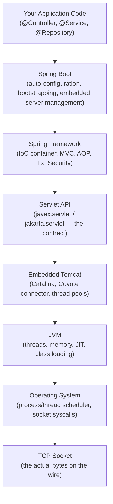

Let's walk each layer and pin down its *single sentence of responsibility*. If you can recite these, you already understand more than most working Spring developers.

### 1. The Operating System

The OS owns the network hardware and the socket abstraction. When bytes arrive on the network interface, the kernel's TCP/IP stack reassembles them into a stream and makes them available on a **file descriptor** — the socket. The OS also owns **threads**: it schedules them onto CPU cores. Nothing in Java can receive a network byte or run a line of code without the OS. Java's `ServerSocket.accept()` is ultimately a thin wrapper over the `accept(2)` syscall.

> **Responsibility:** Deliver bytes to/from the network, schedule threads onto cores, and expose sockets as file descriptors.

### 2. The JVM

The JVM is a process the OS scheduled. Inside it, the JVM manages the heap, the garbage collector, class loading, and — crucially — it maps Java `Thread` objects onto OS threads (platform threads) or, since Java 21, onto lightweight **virtual threads** that are multiplexed over a small pool of carrier platform threads. Every object we discuss — the `DispatcherServlet`, your `@Service`, a `HandlerMapping` — is a Java object living on the JVM heap.

> **Responsibility:** Execute bytecode, manage memory/GC, load classes, and map Java threads to OS threads.

### 3. Embedded Tomcat (the servlet container)

Tomcat is a **plain Java library** (a set of JARs) that Spring Boot embeds *inside your process*. This is a genuinely important shift in mindset from the old days. In 2010, you built a `.war` and deployed it into a standalone Tomcat that someone else ran. In modern Spring Boot, **there is no external Tomcat**. Tomcat's classes are on your classpath, and Spring Boot instantiates and starts Tomcat as just another set of Java objects during startup. Your `main()` method starts the web server.

Tomcat's job: open a listening socket (via the OS), accept connections, parse raw HTTP bytes into structured `HttpServletRequest` objects, hand those requests to a **Servlet** according to the Servlet API contract, take the `HttpServletResponse` the servlet fills in, serialize it back into HTTP bytes, and write it to the socket. It also manages the **thread pool** that runs request processing.

> **Responsibility:** Turn raw TCP/HTTP bytes into Servlet API objects, invoke servlets/filters, and turn their output back into bytes — while managing connections and worker threads.

### 4. The Servlet API

This is the layer people most often skip, and skipping it is why so many developers find `DispatcherServlet` mysterious. The Servlet API (`jakarta.servlet.*`, formerly `javax.servlet.*`) is a **specification — a set of interfaces** — that defines a contract between web servers and web applications. It is not code that *does* anything; it is a set of interfaces like `Servlet`, `Filter`, `ServletContext`, `HttpServletRequest`, `HttpServletResponse`.

The contract says, in essence: "Dear web server, if the application gives you an object implementing `Servlet`, you promise to call its `service(request, response)` method for each matching request, passing objects implementing `HttpServletRequest` and `HttpServletResponse`." Tomcat *implements the server side* of this contract. Spring's `DispatcherServlet` *implements the application side* (it **is** a `Servlet`).

The Servlet API is the **seam** — the neutral interface — that lets Tomcat and Spring cooperate while knowing almost nothing about each other's internals. This is one of the most important sentences in this entire guide, so let's make it a callout:

> Tomcat only knows the `Servlet` interface. Spring's `DispatcherServlet` only knows it *is a* `Servlet`. Neither depends on the other's concrete types. The Servlet API is the contract between them.

> **Responsibility:** Define the vendor-neutral interfaces (`Servlet`, `Filter`, `ServletContext`, request/response) that let any container run any web application.

### 5. Spring Framework

The Spring Framework is the actual engine. It provides:

- The **IoC container** (`ApplicationContext` / `BeanFactory`) that creates and wires your beans.
- **Spring MVC** — the `DispatcherServlet` and its supporting cast (`HandlerMapping`, `HandlerAdapter`, `HttpMessageConverter`, etc.).
- **Spring AOP** — the proxying machinery behind `@Transactional`, `@Async`, `@Cacheable`.
- **Transaction management**, the **ConversionService**, the **validation** integration, and so on.

Note: Spring Security is technically a *separate* project built on Spring Framework, but conceptually it lives at this layer too — it plugs into the Servlet filter chain.

> **Responsibility:** Create/wire objects (IoC), route requests to your controllers (MVC), and apply cross-cutting behavior via proxies (AOP/Tx).

### 6. Spring Boot

And finally, the thin, powerful layer on top. Spring Boot:

- Provides `SpringApplication.run()` which orchestrates the whole startup.
- Runs **auto-configuration**: inspects the classpath and conditionally creates beans (e.g. "there's a Tomcat JAR and a `DispatcherServlet` class present, and the user hasn't defined their own — so I'll configure an embedded Tomcat and register a `DispatcherServlet`").
- Manages the embedded server lifecycle.
- Binds `application.yml`/`application.properties` into typed configuration.

> **Responsibility:** Inspect the classpath and configuration, then assemble and start a fully-wired Spring application (including an embedded server) with sensible defaults, while letting you override anything.

### 7. Your application code

At the very top: your `@Controller`s, `@Service`s, `@Repository`s, `@Configuration` classes. This is the only layer you normally write. Everything below it is machinery you *configure* but rarely author. The goal of this guide is to make that machinery transparent.

> **Responsibility:** Express business logic and HTTP endpoints, delegating all plumbing to the layers below.

## How the layers *interact* — a first taste

Let's do a lightning-fast end-to-end so the layers stop being abstract. We'll go slow and deep later (Parts 6 and 20). For now, just watch the baton pass from layer to layer:

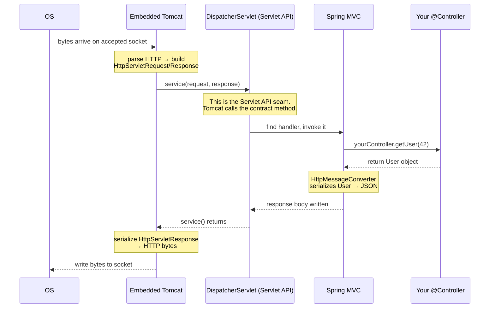

The single most important handoff in that whole diagram is `Tomcat ->> Servlet: service(request, response)`. That is the exact instant control crosses from "the web server" into "your application." Everything to the left of that line is Tomcat/Servlet-API territory. Everything to the right is Spring territory. If you internalize where that line is, you will never again be confused about "is this a Tomcat problem or a Spring problem?"

## The four things people constantly confuse

Let's make the distinctions razor-sharp, because muddling them causes 90% of "how does Spring even work" confusion:

| Thing | What it *is* | What it is *not* |
|---|---|---|
| **Spring Boot** | An auto-configuration + bootstrap layer | Not a server, not the IoC container itself |
| **Spring Framework** | The IoC container + MVC + AOP engine | Not a web server; it can't accept a socket |
| **Servlet API** | A set of interfaces (a contract) | Not an implementation; it *does* nothing by itself |
| **Tomcat** | A concrete servlet container (implements the Servlet API server side) | Not part of Spring; doesn't know Spring exists |

A useful test: **"Who can accept a TCP connection?"** Answer: only Tomcat (via the OS). Not Spring Boot, not Spring Framework, not the Servlet API. **"Who knows what a `@Controller` is?"** Answer: only Spring Framework (Spring MVC). Not Tomcat, not the Servlet API, not the OS. The fact that these two capabilities live in completely different, mutually-ignorant layers — and are bridged only by the thin Servlet API — is the central architectural insight of the entire platform.

## Why this architecture? (The motivation)

Why not just have Spring open a socket directly and parse HTTP itself? Because HTTP parsing, connection management, thread pooling, TLS termination, HTTP/2, keep-alive, and the thousand edge cases of the HTTP spec are *hard, boring, and already solved* by battle-tested servlet containers. By speaking the Servlet API, Spring gets to be **container-agnostic**: the exact same `DispatcherServlet` runs unmodified on Tomcat, Jetty, or Undertow. You can swap the container by swapping one dependency, and not a single line of your controller code changes. That is the payoff of programming to the Servlet contract instead of to a specific server.

With the map in hand, let's descend into the first deep chapter: what actually happens, object by object, when your `main()` method runs.

---

# PART 2 — What Happens When a Spring Boot Application Starts

## The one line everyone writes and no one understands

```java
@SpringBootApplication
public class ShopApplication {
    public static void main(String[] args) {
        SpringApplication.run(ShopApplication.class, args);
    }
}
```

Three lines of code. Behind that `run()` call, several hundred objects are created, an entire dependency graph is resolved, and a web server is started — all before your first request. Let's dismantle it completely.

The key realization: **`main()` is an ordinary Java method running on an ordinary thread (usually the JVM's `main` thread).** There is no magic runtime, no application server that "deploys" you. *You* start everything. `SpringApplication.run()` is a normal method call that does not return until the application is fully started (in a web app it then keeps the JVM alive via the container's threads).

## The startup phases at a glance

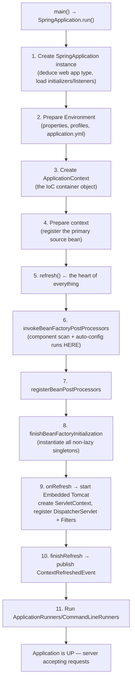

We'll walk each phase, always asking *who created what*.

## Phase 1 — Creating the `SpringApplication` object

`SpringApplication.run(...)` is a static convenience that does `new SpringApplication(sources).run(args)`. The constructor does something clever and cheap: it **deduces the application type** by probing the classpath with `Class.forName`-style checks.

```java
// Simplified from org.springframework.boot.SpringApplication
this.webApplicationType = WebApplicationType.deduceFromClasspath();
```

`deduceFromClasspath()` asks: is `DispatcherServlet` (Spring MVC, servlet-based) on the classpath? → `SERVLET`. Is `DispatcherHandler` (WebFlux, reactive) present but not the servlet one? → `REACTIVE`. Neither? → `NONE` (a plain non-web app). This single decision determines whether an embedded Tomcat will later be started and *which kind* of `ApplicationContext` will be created. This is your first taste of Spring Boot's core mechanic: **decisions driven by what is on the classpath.**

The constructor also loads, from `META-INF/spring.factories` (and, in Boot 3, `META-INF/spring/...` import files), the lists of `ApplicationContextInitializer`s and `ApplicationListener`s. These are extension hooks that fire at defined moments during startup.

> **Who created the `SpringApplication`?** Your `main()` did, directly. **Who owns it?** Your `main` thread's stack. It's a short-lived orchestrator; once `run()` finishes, it has done its job.

## Phase 2 — The `Environment`

Before any bean exists, Spring builds an `Environment` — the unified abstraction over all configuration sources: OS environment variables, JVM system properties, command-line args, `application.yml`/`application.properties`, and profile-specific files. It resolves the **active profiles**.

Why first? Because auto-configuration and bean creation need to *read* configuration to make decisions (e.g. `server.port`, `spring.datasource.url`). The `Environment` must exist before the context is refreshed. A `ConfigurableEnvironment` is created and an `ApplicationEnvironmentPreparedEvent` is published so listeners (like the one that loads `application.yml`, `EnvironmentPostProcessorApplicationListener`) can contribute property sources.

## Phase 3 — Creating the `ApplicationContext`

Now Spring instantiates the IoC container object itself. Based on the web type deduced in Phase 1, it picks a concrete class:

- `SERVLET` → `AnnotationConfigServletWebServerApplicationContext`
- `REACTIVE` → `AnnotationConfigReactiveWebServerApplicationContext`
- `NONE` → `AnnotationConfigApplicationContext`

For our purposes it's the servlet one. Note the name: **`...ServletWebServerApplicationContext`**. That class is special — its `onRefresh()` method is what starts the embedded web server. Hold that thought; it's the bridge between "Spring container" and "running web server."

Every `ApplicationContext` wraps a `BeanFactory` — specifically a `DefaultListableBeanFactory`. The `ApplicationContext` is the "rich" facade (events, i18n, resource loading, environment); the `BeanFactory` inside it is the raw bean registry and creation engine. When people say "the Spring container," they usually mean this pair.

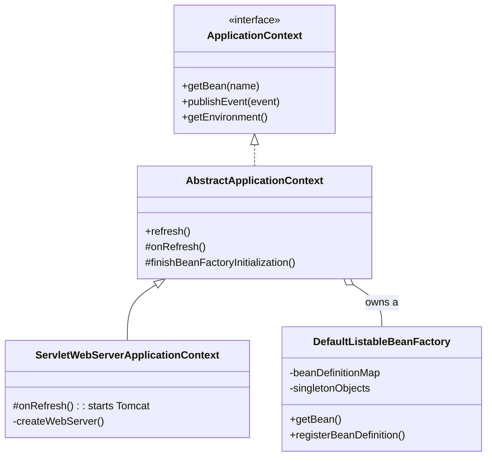

## Phase 4 — Prepare context

Spring registers your primary source (`ShopApplication.class`) as the first bean definition and applies the initializers loaded in Phase 1. Then it calls the method that *is* the entire IoC engine: `refresh()`.

## Phase 5 — `refresh()`: the heart of Spring

`AbstractApplicationContext.refresh()` is arguably the most important method in the whole framework. It is a **template method** — a fixed sequence of steps, each of which subclasses and post-processors can hook into. Simplified:

```java
// org.springframework.context.support.AbstractApplicationContext
public void refresh() {
    prepareRefresh();
    ConfigurableListableBeanFactory beanFactory = obtainFreshBeanFactory();
    prepareBeanFactory(beanFactory);
    postProcessBeanFactory(beanFactory);
    invokeBeanFactoryPostProcessors(beanFactory);   // (6) scanning + auto-config
    registerBeanPostProcessors(beanFactory);        // (7) register BPPs
    initMessageSource();
    initApplicationEventMulticaster();
    onRefresh();                                     // (9) START TOMCAT
    registerListeners();
    finishBeanFactoryInitialization(beanFactory);    // (8) create singletons
    finishRefresh();                                 // (10) publish events
}
```

Note the ordering carefully — it is *not* what most people assume. `invokeBeanFactoryPostProcessors` (which does component scanning and auto-configuration, turning classes into **bean definitions**) runs *before* `finishBeanFactoryInitialization` (which actually *instantiates* the singleton beans). And `onRefresh()` (which starts Tomcat) runs *before* the beans are fully instantiated in the servlet-web context... actually, let's be precise about that, because it's subtle and matters.

### The BeanDefinition vs the Bean

Crucial distinction. A **`BeanDefinition`** is a *recipe* — metadata describing how to create a bean: its class, scope, constructor args, whether it's lazy, its dependencies. It is **not** the bean. During `invokeBeanFactoryPostProcessors`, component scanning and auto-configuration populate the `beanFactory`'s `beanDefinitionMap` with hundreds of these recipes. **No business objects are instantiated yet.** Only later, in `finishBeanFactoryInitialization`, does Spring walk the recipes and actually `new` the objects.

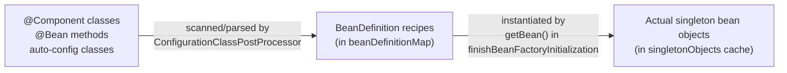

## Phase 6 — `invokeBeanFactoryPostProcessors`: scanning & auto-config

This is where **component scanning** and **auto-configuration** happen, both driven by a single powerhouse: `ConfigurationClassPostProcessor` (a `BeanDefinitionRegistryPostProcessor`).

It starts from your `@SpringBootApplication` class. That annotation is a meta-annotation composed of three:

- `@SpringBootConfiguration` (a specialized `@Configuration`)
- `@ComponentScan` — scan this package and sub-packages for `@Component`/`@Service`/`@Repository`/`@Controller`
- `@EnableAutoConfiguration` — trigger the auto-configuration machinery

`ConfigurationClassPostProcessor` parses your `@Configuration` classes, follows their `@Bean` methods, honors `@Import`, processes `@ComponentScan` to discover your components, and — via `@EnableAutoConfiguration`'s `AutoConfigurationImportSelector` — loads the list of auto-configuration classes from `META-INF/spring/org.springframework.boot.autoconfigure.AutoConfiguration.imports`. Each auto-config class is evaluated against its `@Conditional` guards. Those that pass contribute more bean definitions (e.g. `DispatcherServletAutoConfiguration` registers a `DispatcherServlet` bean definition; `EmbeddedWebServerFactoryCustomizerAutoConfiguration` and `ServletWebServerFactoryAutoConfiguration` register a `TomcatServletWebServerFactory` bean definition).

At the end of Phase 6, the `beanFactory` knows the **recipe** for every bean in your app — yours and Boot's — but has instantiated almost none of them. (We cover the conditional mechanics fully in Part 12.)

## Phase 7 — `registerBeanPostProcessors`

Spring instantiates and registers all `BeanPostProcessor` beans *early*, because they must exist before the regular beans they are meant to process. `BeanPostProcessor`s are interceptors on bean creation — they get a callback *after instantiation but around initialization* of every other bean. Two of the most important:

- `AutowiredAnnotationBeanPostProcessor` — performs `@Autowired`/`@Inject`/`@Value` injection.
- `AnnotationAwareAspectJAutoProxyCreator` — wraps beans in AOP proxies (this is how `@Transactional` etc. get applied; see Part 13).

> **Who created the BeanPostProcessors?** The `BeanFactory` itself, during `refresh()`. **Who owns them?** The container. **Who invokes them?** The `BeanFactory`, automatically, around every subsequent `getBean()`.

## Phase 8 & 9 — Instantiating singletons and starting Tomcat

Here order matters and is commonly misunderstood. In `ServletWebServerApplicationContext`, `onRefresh()` (Phase 9) runs *before* `finishBeanFactoryInitialization` (Phase 8 in the numbering above, but later in code order). `onRefresh()` calls `createWebServer()`, which:

1. Looks up the `ServletWebServerFactory` bean (e.g. `TomcatServletWebServerFactory`) — instantiating it now if needed.
2. Calls `factory.getWebServer(...)` which **creates and configures a Tomcat instance** (a `Tomcat` object, a `Connector`, an `Engine`, `Host`, `Context`) but starts it in a way that does not yet accept requests fully until later.
3. Creates the **`ServletContext`** (Tomcat's implementation of the Servlet API's `ServletContext`).

Then `finishBeanFactoryInitialization(beanFactory)` runs: it calls `beanFactory.preInstantiateSingletons()`, which iterates every non-lazy singleton `BeanDefinition` and calls `getBean(name)`, triggering the full **bean creation lifecycle** for each (instantiate → populate/inject → `BeanPostProcessor` before-init → `@PostConstruct`/`InitializingBean` → `BeanPostProcessor` after-init, where AOP proxies are created). This is when your `@Service`s, `@Controller`s, `@Repository`s actually come into existence.

Finally, the `DispatcherServlet` and any `Filter` beans get **registered into the `ServletContext`** via `ServletContextInitializer`s (specifically the `DispatcherServletRegistrationBean` and `FilterRegistrationBean`s). This is the exact bridge between Spring and Tomcat — covered in depth in Part 5. After registration, the Tomcat connector is started and begins accepting connections.

### Bean creation lifecycle (per bean)

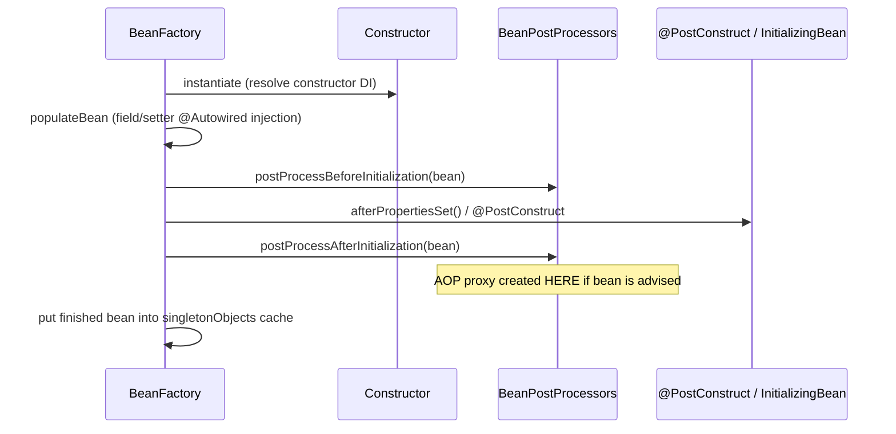

## Phase 10 & 11 — Finish and runners

`finishRefresh()` publishes `ContextRefreshedEvent` and starts `SmartLifecycle` beans (including the `WebServerStartStopLifecycle` that finalizes Tomcat's start on the latest Boot versions). Then `SpringApplication` fires `ApplicationRunner` and `CommandLineRunner` beans — your hook for "run this once at startup." An `ApplicationReadyEvent` is published. The `run()` method returns the fully-initialized `ApplicationContext`.

At this instant, Tomcat's acceptor thread is blocked in `accept()` waiting for the first TCP connection. Your application is *up*.

## Common misconceptions about startup

- **"Beans are created during component scanning."** No — scanning creates *definitions*. Instantiation happens later in `finishBeanFactoryInitialization`.
- **"Tomcat is external / deployed into."** No — Tomcat is embedded and started by your own `main()`.
- **"`@Autowired` uses reflection at every call."** No — injection happens once, at bean creation, by `AutowiredAnnotationBeanPostProcessor`. After that the reference is just a field.
- **"Lazy beans are never created."** They're created on first access, still through the same `getBean` lifecycle.

## Production debugging: startup

- **App exits immediately after start** → web type deduced as `NONE`. You lack `spring-boot-starter-web`, so no Tomcat, so nothing keeps the JVM alive. Fix the dependency.
- **`Port already in use`** → the embedded Tomcat couldn't bind `server.port`. Another process (or a previous run) owns it.
- **`BeanCurrentlyInCreationException` at startup** → an unbreakable circular dependency among constructor-injected singletons (Part 11).
- **A bean you expected is missing** → it was outside the `@ComponentScan` base package, or its auto-config `@Conditional` didn't match. Run with `--debug` to get the **Condition Evaluation Report** (Part 18).

With startup mapped, let's zoom into the component your `main()` just started but that Spring treats as a black box: the embedded servlet container itself.

---

# PART 3 — Embedded Tomcat Internals

## Why servlet containers exist at all

Rewind to the mid-1990s. To serve dynamic web content you wrote CGI scripts: for **every** request, the web server forked a brand-new OS process, ran your script, captured its stdout, and killed the process. Correct, but catastrophically slow — process creation is expensive, and nothing could be shared between requests (no connection pools, no caches).

The servlet model (1997) fixed this: instead of a process per request, you have **one long-lived Java object (a servlet) handling many requests on pooled threads inside one JVM**. State can be shared, connections pooled, classes JIT-compiled once and reused. The **servlet container** is the piece of software that hosts these servlets: it owns the socket, the threads, the HTTP parsing, and the servlet lifecycle. Tomcat is the most popular one.

> **Why does Tomcat exist?** To handle everything hard and HTTP-specific — sockets, threads, connection lifecycle, HTTP parsing — so your application code can be a simple object with a `service(request, response)` method and never touch a socket.

## Tomcat's architecture — the nested boxes

Tomcat is built as a hierarchy of **containers** and **connectors**, all managed by a top-level component called **Catalina** (the servlet engine) with **Coyote** as the HTTP connector subsystem. Let's name the parts:

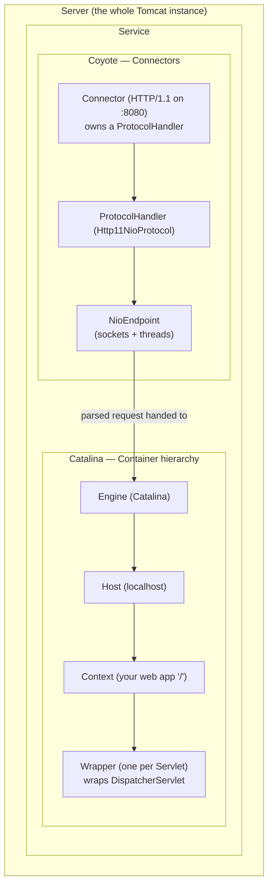

Read it top-down:

- **Server** — the entire Tomcat process/instance. One per JVM here.
- **Service** — binds one or more Connectors to one Engine.
- **Connector (Coyote)** — owns a network port and a protocol. It turns bytes ⇄ `Request`/`Response` objects. This is where HTTP is spoken.
- **Engine → Host → Context → Wrapper (Catalina)** — the container hierarchy that routes a parsed request to the right web app and the right servlet.
  - **Engine**: the request-processing pipeline top.
  - **Host**: a virtual host (e.g. `localhost`).
  - **Context**: one web application. In Spring Boot there's typically one Context at path `/`. **This Context owns the `ServletContext`.**
  - **Wrapper**: wraps exactly one servlet instance. Spring Boot's single `DispatcherServlet` lives inside one Wrapper.

## The Connector, in detail: ProtocolHandler → Endpoint → threads

The Connector delegates to a **`ProtocolHandler`** (e.g. `Http11NioProtocol`), which owns an **`Endpoint`** (e.g. `NioEndpoint`). The Endpoint is where the actual socket-and-thread machinery lives. There are three kinds of threads to understand:

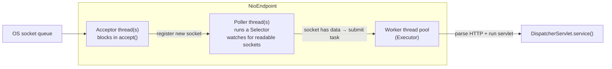

### Acceptor thread

A small number of **Acceptor** threads sit in a loop calling `serverSocket.accept()`. This is a blocking OS call that returns a new `SocketChannel` each time a client completes a TCP handshake. The Acceptor's *only* job is to accept the connection and hand the socket off — it does **not** read the request. It immediately registers the new socket with a **Poller** and goes back to accepting. Keeping the Acceptor lean means Tomcat can accept new connections extremely fast.

### Poller thread (the NIO magic)

Here's the crux of **NIO (non-blocking I/O)** and why it matters. A **Poller** thread runs a Java NIO `Selector`. A single `Selector` can monitor *thousands* of sockets simultaneously, and the Poller blocks in `selector.select()` until *any* of them has data ready to read. When a socket becomes readable, the Poller pulls it and dispatches a task to the worker pool.

Contrast with the old **BIO (blocking I/O)** model: there, one thread was dedicated to each connection for its entire lifetime, blocking on read even while the client was idle (e.g. during HTTP keep-alive between requests). With 10,000 idle keep-alive connections you'd need 10,000 blocked threads. With NIO, those 10,000 idle connections are watched by a *handful* of Poller threads, and worker threads are only consumed while a request is *actively* being processed. This is why modern Tomcat defaults to NIO (`Http11NioProtocol`).

| | BIO (`Http11Protocol`, legacy) | NIO (`Http11NioProtocol`, default) |
|---|---|---|
| Thread per connection | Yes, for connection's whole life | No — only during active request |
| Idle keep-alive cost | 1 blocked thread each | ~0 (watched by Poller/Selector) |
| Max concurrent connections | ~= max threads | Far greater than thread count |
| Scalability | Poor under many slow/idle clients | Excellent |

### Worker thread (this is *your* request thread)

The **worker** (from Tomcat's `Executor` thread pool, threads named like `http-nio-8080-exec-3`) is the thread that does the real work: it reads the full HTTP request bytes, uses Coyote's parser to build the internal `org.apache.coyote.Request`, wraps it as an `org.apache.catalina.connector.Request` (which implements `HttpServletRequest`), builds the matching `Response`, and then pushes the request **through the container pipeline** (Engine → Host → Context → Wrapper) until it reaches the servlet, whose `service()` method it finally calls.

> **This worker thread is the single most important thread in your mental model.** Every line of your `@Controller`, `@Service`, and `@Repository` code runs on *this* thread (unless you explicitly hop to another via `@Async` or reactive). `ThreadLocal`-based mechanisms — `SecurityContextHolder`, `RequestContextHolder`, transaction synchronization — all bind their state to *this* thread. When you see `http-nio-8080-exec-7` in a stack trace, that's a Tomcat worker running your code.

The default worker pool is `server.tomcat.threads.max=200`. That number is effectively your app's max concurrent *in-flight* requests (not connections — thanks to NIO you can have far more open connections than workers).

## From TCP packet to `DispatcherServlet` — the full journey

Let's trace one connection from the wire to Spring, naming every actor and thread:

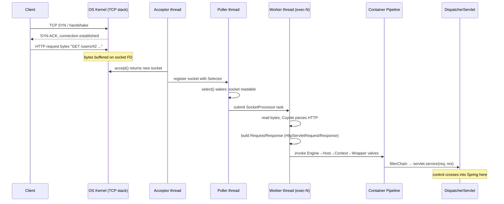

Notice the thread handoffs: the Acceptor and Poller are shared, lightweight, and never run your code. The Worker is the one that carries your request all the way into `DispatcherServlet.service()` and back. The **container pipeline** (Valves — Tomcat's own filter-like interceptors, e.g. access logging, error reporting) runs on that same worker thread just before the servlet.

## Connection lifecycle and keep-alive

HTTP/1.1 defaults to **persistent connections** (keep-alive): after a response, the TCP connection stays open so the next request from the same client reuses it (saving a handshake). In NIO, after the worker finishes writing the response, the socket is handed *back to the Poller* to watch for the next request — the worker is released to the pool. Only when the next request's bytes arrive does a worker get assigned again. This is precisely why NIO scales: workers are held only during active processing, not during the idle gaps between keep-alive requests.

`server.tomcat.keep-alive-timeout` and `max-keep-alive-requests` govern how long/how many. `server.tomcat.connection-timeout` limits how long Tomcat waits for a slow client to send request data (defense against slowloris-style attacks).

## Where Spring Boot configures all this

Everything above is configured by Spring Boot through the `TomcatServletWebServerFactory` bean and `server.*` properties. `server.port`, `server.tomcat.threads.max`, `server.tomcat.accept-count` (the OS-level backlog queue length for pending connections), `server.tomcat.max-connections` — all flow into the `NioEndpoint`. But note: **Spring Boot only *configures* Tomcat; it doesn't reimplement any of it.** Tomcat's Acceptor/Poller/Worker code is stock Apache Tomcat, running embedded.

## Common misconceptions

- **"Each request is a new thread."** No — threads are *pooled*. A worker handles a request, then returns to the pool for the next. Creating a thread per request would defeat the purpose.
- **"More `threads.max` is always faster."** No — beyond the point where your CPU/DB is saturated, more threads add context-switching and contention. Threads waiting on a slow DB are the usual reason to raise it, but the real fix may be the DB or a connection pool.
- **"Tomcat runs my controller."** Tomcat runs `DispatcherServlet.service()`. *Spring* runs your controller, from inside that call.

## Production debugging: Tomcat layer

- **Requests hang / thread pool exhausted** → take a thread dump (`jstack`). If all `http-nio-8080-exec-*` threads are `BLOCKED`/`WAITING` on a DB call or lock, you've exhausted the 200 workers; new requests queue in `accept-count` then get refused. Root cause is usually downstream (slow DB, connection-pool starvation), not Tomcat.
- **Connections refused under load** → `accept-count` (backlog) overflowed because workers are all busy. Same root cause.
- **Slow first request** → class loading / JIT warm-up, not Tomcat.
- **`Broken pipe` in logs** → client disconnected before the response finished writing; usually harmless (user navigated away) unless frequent.

Now that we know Tomcat parses HTTP and calls `service()`, we must precisely understand the *contract* it's calling through — the Servlet API.

---

# PART 4 — Servlet API Deep Dive

## The Servlet API is interfaces, not implementation

Say this out loud: **the Servlet API is a set of interfaces.** The package `jakarta.servlet` (formerly `javax.servlet` — the rename in Jakarta EE 9 is why Spring Boot 3 requires Java 17 and the `jakarta` namespace) contains almost no logic. It is a *contract*. Tomcat provides the concrete classes that implement the server-facing side; Spring provides the concrete class (`DispatcherServlet`) that implements the application-facing side. Neither side compiles against the other — both compile against these interfaces. That's the decoupling.

## The core types

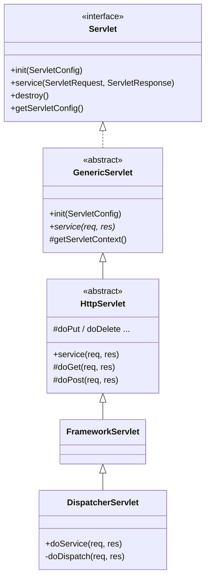

### `Servlet` (interface)

The root contract. Three lifecycle methods:

- `init(ServletConfig)` — called **once**, by the container, when the servlet is first loaded. Do your one-time setup here.
- `service(ServletRequest, ServletResponse)` — called **for every request** that maps to this servlet. This is the hot path.
- `destroy()` — called **once**, when the container is shutting the servlet down.

The container promises: *exactly one* `init`, *many* `service` (possibly concurrently, on many threads), *exactly one* `destroy`. That "possibly concurrently" is vital — **a servlet must be thread-safe**, because one instance serves all requests across all worker threads. `DispatcherServlet` is stateless per-request precisely for this reason; all per-request state lives in the passed-in request/response objects and in `ThreadLocal`s, never in servlet fields.

### `GenericServlet` (abstract)

A protocol-independent convenience base. It implements `init` to stash the `ServletConfig`, and gives you `getServletContext()`. It leaves `service()` abstract. You almost never use it directly.

### `HttpServlet` (abstract)

The one that matters for web apps. It implements `service(ServletRequest, ServletResponse)` by casting to the HTTP types and dispatching by HTTP method to `doGet`, `doPost`, `doPut`, `doDelete`, etc. In a *traditional* servlet app you'd subclass `HttpServlet` and override `doGet`/`doPost`. Spring's `FrameworkServlet` overrides these to funnel *all* HTTP methods into a single `processRequest` → `doService` → `doDispatch`, because Spring wants to route by URL+method itself, not by having separate `doGet`/`doPost` code.

### `ServletContext`

**One per web application.** It represents the application to the container and vice versa. Think of it as the application-wide shared context and registry. Through it you can:

- Register servlets and filters programmatically (`addServlet`, `addFilter`) — this is exactly how Spring Boot installs the `DispatcherServlet`.
- Store application-scoped attributes (`setAttribute`/`getAttribute`).
- Read init parameters, get resource paths, log.

Critically, **Spring stores the root `WebApplicationContext` as an attribute inside the `ServletContext`** (under the key `WebApplicationContext.ROOT_WEB_APPLICATION_CONTEXT_ATTRIBUTE`). That single attribute is one of the literal wires connecting the Servlet world to the Spring world (more in Part 5).

> `ServletContext` (one per app) vs `ServletConfig` (one per servlet). Don't confuse them. `ServletContext` = the whole application. `ServletConfig` = the configuration of *one* servlet, and it can reach the `ServletContext` via `getServletContext()`.

### `ServletConfig`

The per-servlet configuration object passed to `init()`. Holds the servlet's name and its init parameters, and provides `getServletContext()`. `DispatcherServlet` reads its init params here (e.g. `contextConfigLocation` in XML-era apps).

### `HttpServletRequest` / `HttpServletResponse`

The container's structured view of the HTTP request and response. `HttpServletRequest` exposes the method, URI, headers, query params, cookies, session, and the request **body as an `InputStream`** (`getInputStream()`/`getReader()`). `HttpServletResponse` lets you set status, headers, and write the body via `getOutputStream()`/`getWriter()`. Tomcat's concrete `org.apache.catalina.connector.Request`/`Response` implement these. **Your controller rarely touches them directly** — Spring MVC reads from and writes to them on your behalf via argument resolvers and message converters. But they're always there, underneath, being passed down the whole chain.

## The Servlet lifecycle, owned by the container

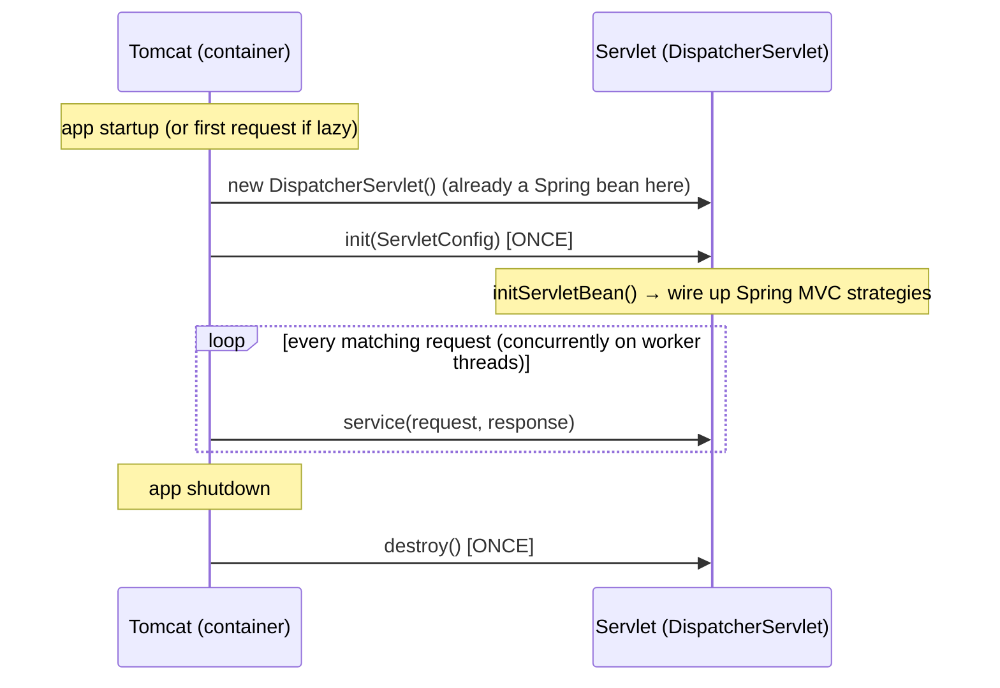

**Who creates the servlet?** In classic servlet apps, the container instantiates it via its no-arg constructor. In Spring Boot it's subtler and important: the `DispatcherServlet` is created *as a Spring bean* by the IoC container, then **handed to** the servlet container for registration and lifecycle. So Tomcat doesn't `new` it — Spring does — but Tomcat still drives its `init`/`service`/`destroy` lifecycle. This dual ownership is a recurring theme.

## Why does Spring use ONE `DispatcherServlet` instead of many servlets?

In a raw servlet app, you'd map `/users/*` to a `UserServlet`, `/orders/*` to an `OrderServlet`, and register each in `web.xml`. That doesn't scale: routing, JSON handling, validation, exception mapping, and security would be reimplemented in every servlet.

Spring instead registers **a single servlet** — `DispatcherServlet` — mapped to `/` (everything). This is the **Front Controller** pattern: one entry point that receives *all* requests and then dispatches internally to the right `@Controller` method using Spring's own routing (`HandlerMapping`). The benefits are enormous:

- All cross-cutting concerns (content negotiation, message conversion, exception handling, argument resolution) live in one place and apply uniformly.
- Adding an endpoint is adding a `@RequestMapping` method — no servlet registration, no `web.xml`.
- The Servlet API sees exactly one servlet; all the richness (hundreds of endpoints) lives *inside* Spring MVC, invisible to the container.

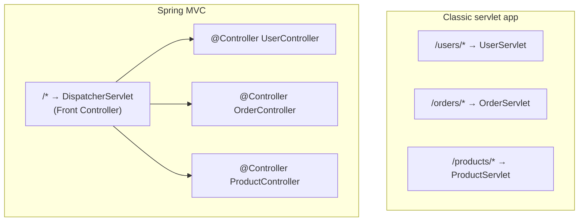

So from Tomcat's perspective there is *one* servlet handling `/`. From your perspective there are dozens of tidy controller methods. `DispatcherServlet` is the translator between those two views.

## Common misconceptions

- **"A servlet is per-request."** No — one instance, many concurrent requests. Statelessness/thread-safety is mandatory.
- **"`@Controller` is a servlet."** No — it's a Spring bean invoked *by* the single `DispatcherServlet`. Tomcat has never heard of it.
- **"`HttpServletRequest` is created by Spring."** No — Tomcat creates it (as `org.apache.catalina.connector.Request`). Spring just reads it.

## Production debugging: Servlet layer

- **Two servlets both mapped to `/`** → one wins, requests to the other 404 in confusing ways. In Boot, check for a stray `@Bean ServletRegistrationBean`.
- **`getInputStream() has already been called`** → something read the request body stream once (a filter?), and then Spring tried to read it again. Bodies are one-shot streams; you need a caching wrapper (`ContentCachingRequestWrapper`) to read twice.

Now the pivotal chapter: exactly *where* and *how* the Servlet world and the Spring world are wired together.

---

# PART 5 — How Tomcat Interacts With Spring

## The two worlds that don't know each other

Let's state the paradox baldly:

- **Tomcat knows nothing about Spring.** It knows sockets, HTTP, threads, and the Servlet API interfaces. Search the Tomcat source for "Spring" — you won't find it. Tomcat would happily run a plain `HttpServlet` you wrote in 2005.
- **Spring knows nothing about sockets.** The `DispatcherServlet` never calls `accept()`, never reads a byte off the wire, never touches a `SocketChannel`. It operates entirely on `HttpServletRequest`/`HttpServletResponse` objects handed to it.

Yet somehow a request flows from Tomcat's socket into Spring's controller. There **must** be a bridge. Where is it? The bridge is made of exactly two Servlet-API constructs:

1. The **`ServletContext`** — where Spring plants its root context and where the `DispatcherServlet` gets registered.
2. The **`Servlet` interface** — `DispatcherServlet` *implements* it, so Tomcat can call it without knowing it's Spring.

That's the whole trick. Two neutral Servlet-API touchpoints. Let's see precisely how they get connected during startup.

## The registration mechanism: `ServletContextInitializer`

Recall from Part 2 that in `ServletWebServerApplicationContext.onRefresh()`, Spring Boot creates the embedded Tomcat and its `ServletContext`. Immediately after, it needs to *install* the `DispatcherServlet` and the app's `Filter`s into that `ServletContext`. It does this via beans of type **`ServletContextInitializer`** — a Spring interface (not a servlet-spec one) with one method:

```java
public interface ServletContextInitializer {
    void onStartup(ServletContext servletContext) throws ServletException;
}
```

Spring Boot collects all `ServletContextInitializer` beans and calls each one's `onStartup`, passing the freshly-created `ServletContext`. The key implementations:

- **`DispatcherServletRegistrationBean`** — on startup, calls `servletContext.addServlet("dispatcherServlet", theDispatcherServletBean)` and maps it to `/`. This is the literal line of code that puts Spring's front controller into Tomcat.
- **`FilterRegistrationBean`** — calls `servletContext.addFilter(...)` for each filter (including Spring Security's `springSecurityFilterChain`, see Part 9).

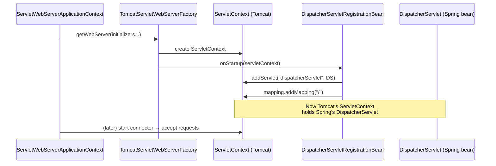

> **Who owns the `DispatcherServlet`?** *Both*, in different senses. **Spring** owns it as a *bean* — it created it, injected it, manages its Spring lifecycle. **Tomcat** owns its *servlet lifecycle* — it calls `init()`, `service()`, `destroy()`. The `DispatcherServletRegistrationBean` is the matchmaker that introduces the Spring-created bean to the Tomcat-managed lifecycle.

## The two `ApplicationContext`s (and why there can be two)

Historically, Spring MVC had a **parent-child context split**:

- The **root `WebApplicationContext`** — created by a `ContextLoaderListener`, holds services, repositories, security, data sources. Stored as a `ServletContext` attribute so *any* servlet/filter can find it.
- A **child `WebApplicationContext`** per `DispatcherServlet` — holds web-layer beans (controllers, view resolvers, handler mappings). It has the root as its *parent*, so controllers can `@Autowired` services from the root.

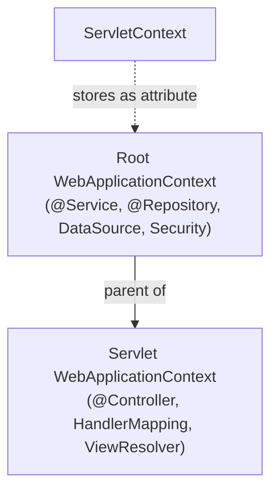

In **modern Spring Boot**, this split usually collapses: there's effectively **one** context (the `AnnotationConfigServletWebServerApplicationContext`) that holds everything, and it's registered as the root in the `ServletContext`. The parent-child machinery still exists conceptually, but Boot's single-context default is simpler and what you'll see in practice. Knowing the historical split explains why you'll still encounter `getServletContext().getAttribute(...ROOT_WEB_APPLICATION_CONTEXT...)` in framework code — that's how filters like Spring Security's `DelegatingFilterProxy` locate the Spring context from inside the pure-Servlet world.

## `WebApplicationContext` vs `ApplicationContext`

`WebApplicationContext` is just an `ApplicationContext` that additionally knows about the `ServletContext` (via `getServletContext()`). That extra link is what lets web-aware beans reach servlet resources. When `DispatcherServlet.init()` runs, one of the first things it does is grab this `WebApplicationContext` (from the `ServletContext` attribute, or via the bean it was constructed with in Boot) and use it to look up all its strategy beans (`HandlerMapping`, `HandlerAdapter`, etc.).

## The `init()` moment — Spring MVC wires itself

When Tomcat finally calls `DispatcherServlet.init(ServletConfig)` (inherited chain: `HttpServletBean.init()` → `FrameworkServlet.initServletBean()` → `DispatcherServlet.onRefresh()` → `initStrategies()`), the servlet populates its internal strategy fields by pulling beans from the `WebApplicationContext`:

```java
// DispatcherServlet.initStrategies (conceptual)
initHandlerMappings(context);      // find all HandlerMapping beans
initHandlerAdapters(context);      // find all HandlerAdapter beans
initHandlerExceptionResolvers(context);
initViewResolvers(context);
initMultipartResolver(context);
// ... etc.
```

So the connection is now complete and bidirectional:

- **Tomcat → Spring:** Tomcat holds the `DispatcherServlet` (a `Servlet`) in a Wrapper and will call `service()` on it per request.
- **Spring → Tomcat:** The `DispatcherServlet` holds a reference to the `WebApplicationContext`, from which it pulled all its collaborators, and it reads/writes the Tomcat-created request/response objects.

## Who owns what — the ownership table

| Object | Created by | Owned/managed by | Invoked by |
|---|---|---|---|
| TCP socket | OS kernel | OS | Tomcat (accept/read/write) |
| `HttpServletRequest`/`Response` | Tomcat (Coyote) | Tomcat (per request) | Spring reads/writes it |
| `ServletContext` | Tomcat | Tomcat | Spring registers into it |
| `DispatcherServlet` | Spring (as a bean) | Spring (bean) + Tomcat (servlet lifecycle) | Tomcat calls `service()` |
| Root `WebApplicationContext` | Spring Boot | Spring | Everything |
| `@Controller`/`@Service` beans | Spring IoC | Spring | Spring MVC / each other |
| Worker thread | Tomcat pool | Tomcat | runs all of the above |

Internalize this table. Nearly every "who is responsible for X" question in an interview is answered by a row here.

## Common misconceptions

- **"Spring embeds Tomcat, so Spring controls the socket."** No — Spring *starts* Tomcat and then Tomcat controls the socket independently. Spring only receives request objects.
- **"There's a magic link between Tomcat and my controllers."** The only links are the `ServletContext` attribute and the `DispatcherServlet` being a `Servlet`. Everything else is plain method calls inside Spring.
- **"`web.xml` is needed."** Not in Boot — `ServletContextInitializer` beans replace `web.xml` registration entirely, programmatically.

## Production debugging: the bridge

- **`DispatcherServlet` not mapped / all requests 404 at container level** → the `DispatcherServletRegistrationBean` didn't register (custom config overriding it, or web type deduced as `NONE`). Check the startup log line `Mapping servlet: 'dispatcherServlet' to [/]`.
- **A filter can't find the Spring context** → `DelegatingFilterProxy` looks up the `WebApplicationContext` by name from the `ServletContext`; if the target bean name is wrong, it fails to delegate (Part 9).

We've bridged the two worlds. Now let's ride a single request across the bridge and all the way down — the complete lifecycle.

---

# PART 6 — Complete Request Lifecycle

This is the spine of the whole guide. We'll trace a single `GET /users/42` that returns a JSON `User`, naming every object, thread, and handoff. Later parts drill into each stage; here we get the *end-to-end* flow so you always know where you are.

Our example endpoint:

```java
@RestController
@RequestMapping("/users")
class UserController {
    private final UserService service;
    UserController(UserService service) { this.service = service; }

    @GetMapping("/{id}")
    User getUser(@PathVariable Long id) {
        return service.findById(id);   // → repository → DB
    }
}
```

## The full path

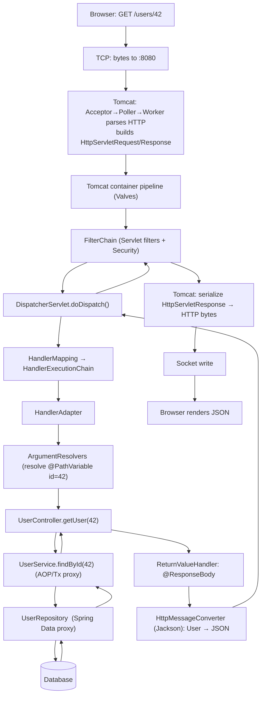

Now the narration. For each step: **who called it, why, what object was created, what happens next.**

## Step 1 — Browser → TCP

The browser resolves the host, opens a TCP connection to port 8080, and writes the HTTP request text (`GET /users/42 HTTP/1.1\r\nHost: ...\r\nAccept: application/json\r\n\r\n`). **Who called it?** The user/browser. **What's created?** A TCP connection (kernel socket). **Next:** the OS buffers the bytes and signals the socket is readable.

## Step 2 — Tomcat accepts and parses

As detailed in Part 3: the **Acceptor** thread's `accept()` returns the socket; it registers it with a **Poller**; the Poller's `Selector` sees readable data and submits a task to a **Worker** thread (`http-nio-8080-exec-N`). The worker reads the bytes and Coyote parses them into an `org.apache.coyote.Request`, wrapped as `org.apache.catalina.connector.Request` which **is** an `HttpServletRequest`. A matching `Response` is created.

**Who called it?** Tomcat's own threads. **What's created?** `HttpServletRequest`/`HttpServletResponse` objects. **Who owns them?** Tomcat, for this request only — they'll be recycled after. **Next:** the worker pushes the request through the container **pipeline** (Engine→Host→Context→Wrapper Valves: access log, error page, etc.), which culminates in invoking the servlet — but first, the **filter chain**.

## Step 3 — FilterChain

Before `DispatcherServlet.service()` is called, Tomcat runs the **`FilterChain`** — the ordered list of `Filter`s mapped to this URL. In a Spring Boot app this includes framework filters (`CharacterEncodingFilter`, `FormContentFilter`, `RequestContextFilter`) and, if present, the **single Spring Security filter** (`DelegatingFilterProxy` → `FilterChainProxy` → the whole security filter chain, Part 9). Each filter may inspect/modify the request, short-circuit (e.g. reject an unauthenticated request with 401), or call `chain.doFilter(req, res)` to pass control on.

**Who called it?** The Wrapper's `ApplicationFilterChain`, on the worker thread. **Why?** Cross-cutting concerns that must wrap the servlet. **Next:** when the last filter calls `chain.doFilter`, the chain finally invokes `servlet.service(req, res)` — entering Spring.

## Step 4 — DispatcherServlet.doDispatch

`service()` → (via `HttpServlet`/`FrameworkServlet`) → `doService()` → **`doDispatch()`**. This is the Front Controller's core loop. It will: find the handler, find an adapter, invoke it, handle the result, and resolve the view or write the body. (Full internals in Part 7.)

**Who called it?** The filter chain (Tomcat), on the worker thread. **Next:** ask the `HandlerMapping`s "who handles `GET /users/42`?"

## Step 5 — HandlerMapping → HandlerExecutionChain

`DispatcherServlet` iterates its `HandlerMapping` beans. `RequestMappingHandlerMapping` matches the URL+method against its registry of `@RequestMapping` methods and returns a **`HandlerExecutionChain`**: the matched `HandlerMethod` (a reference to `UserController#getUser` + the bean instance) plus the list of `HandlerInterceptor`s to run.

**What's created?** A `HandlerExecutionChain`. **Next:** `DispatcherServlet` finds a `HandlerAdapter` that can invoke this handler.

## Step 6 — HandlerAdapter

`DispatcherServlet` asks each `HandlerAdapter` `supports(handler)`. For a `HandlerMethod`, `RequestMappingHandlerAdapter` says yes. Its job: invoke the controller method, which requires resolving its arguments and handling its return value.

## Step 7 — ArgumentResolvers

Before calling `getUser`, the adapter runs **`HandlerMethodArgumentResolver`s** to build each parameter. For `@PathVariable Long id`, `PathVariableMethodArgumentResolver` extracts `"42"` from the URI template, then the **`ConversionService`** converts `"42"` → `Long 42`. For a `@RequestBody`, `RequestResponseBodyMethodProcessor` reads the request `InputStream` and uses an `HttpMessageConverter` (Jackson) to deserialize JSON → object. For `@RequestParam`, another resolver reads query params. (Details in Part 10.)

**What's created?** The actual argument values (`Long 42`). **Next:** reflective invocation of the controller method.

## Step 8 — Controller method runs

`ServletInvocableHandlerMethod` calls `getUser(42L)` via reflection on the controller bean. **This is your code, running on the worker thread.** It calls `service.findById(42L)`.

## Step 9 — Service (through an AOP/Tx proxy)

If `UserService.findById` is `@Transactional` (or the class is proxied for any reason), the reference the controller holds is **not** the raw service — it's a **proxy** (JDK dynamic proxy or CGLIB subclass, Part 13). The call first enters `TransactionInterceptor`, which starts a transaction (obtains a JDBC `Connection`, binds it to the thread via `TransactionSynchronizationManager`, Part 14), then invokes the real method, then commits/rolls back after it returns.

**Who created the proxy?** `AnnotationAwareAspectJAutoProxyCreator`, a `BeanPostProcessor`, at bean-creation time during startup. **Next:** the real service logic runs and calls the repository.

## Step 10 — Repository → Database

`UserRepository` (a Spring Data JPA interface) is itself a **proxy** whose calls are handled by `SimpleJpaRepository` + a `JpaRepositoryFactory`-generated implementation. It uses the `EntityManager` bound to the current transaction's connection to issue SQL. The JDBC driver writes to the DB socket, blocks the worker thread until rows return, and maps them to a `User` entity.

**What thread?** Still the same worker thread — it's *blocked* waiting on the DB (this is why DB latency directly consumes worker threads). **Next:** the `User` bubbles back up: repository → service (transaction commits) → controller returns `User`.

## Step 11 — ReturnValueHandler + HttpMessageConverter

The controller method returned a `User`. Because it's `@RestController` (implies `@ResponseBody`), the adapter uses **`RequestResponseBodyMethodProcessor`** as the `HandlerMethodReturnValueHandler`. It performs **content negotiation** (client sent `Accept: application/json`), selects `MappingJackson2HttpMessageConverter`, and calls `objectMapper.writeValue(response.getOutputStream(), user)` — serializing the `User` to JSON straight into the response body. (No view, no `ViewResolver`, because there's no view name — the body is written directly. `ViewResolver` only matters for view-name-returning controllers, Part 7/10.)

**What's created?** JSON bytes in the response buffer. **Next:** control unwinds back through `doDispatch`, the filter chain (filters get their post-processing turn as `doFilter` returns), and back to Tomcat.

## Step 12 — Tomcat serializes and writes

`service()` returns. Tomcat takes the now-populated `HttpServletResponse` (status 200, `Content-Type: application/json`, the JSON body), serializes it into an HTTP response byte stream, and writes it to the socket. With keep-alive, the socket is handed back to the Poller for the next request; the worker returns to the pool. **Next:** the browser reads the bytes and renders the JSON.

## The thread story in one sentence

From Step 2 through Step 12, **one Tomcat worker thread** carried the entire request — through filters, DispatcherServlet, controller, service, transaction, repository, DB wait, JSON serialization — and only released back to the pool after the response was written. That single-thread continuity is *why* `ThreadLocal`-based context (security, transactions, request attributes) works so seamlessly, and *why* a slow DB call ties up a worker for its whole duration.

## What could fail, at each step (preview of Part 18)

| Step | Failure | Symptom |
|---|---|---|
| 3 Filter | Security rejects | 401/403, controller never reached |
| 5 HandlerMapping | No mapping matches | 404 *inside* DispatcherServlet ("No mapping for GET /users/42") |
| 7 ArgResolver | Body can't parse | 400 / `@RequestBody` null |
| 7 Converter | No converter for content type | 415 Unsupported Media Type |
| 11 Return | No converter for `Accept` | 406 Not Acceptable |
| 9/14 Tx | Self-invocation | `@Transactional` silently ignored |
| 10 DB | Connection pool exhausted | requests hang, worker threads blocked |

Now let's crack open the single most important object in that flow — the `DispatcherServlet`.

---

# PART 7 — DispatcherServlet Internals

## The Front Controller pattern — the "why"

Imagine every controller having to individually handle: parsing JSON, choosing between JSON/XML output, running validation, mapping exceptions to status codes, resolving views, applying interceptors. Duplicated everywhere, inconsistently. The **Front Controller** pattern solves this: route *all* requests through one central servlet that owns the shared workflow and *delegates* only the business step to the right handler. `DispatcherServlet` is that front controller. It is the conductor; your controllers are individual musicians.

## The class hierarchy

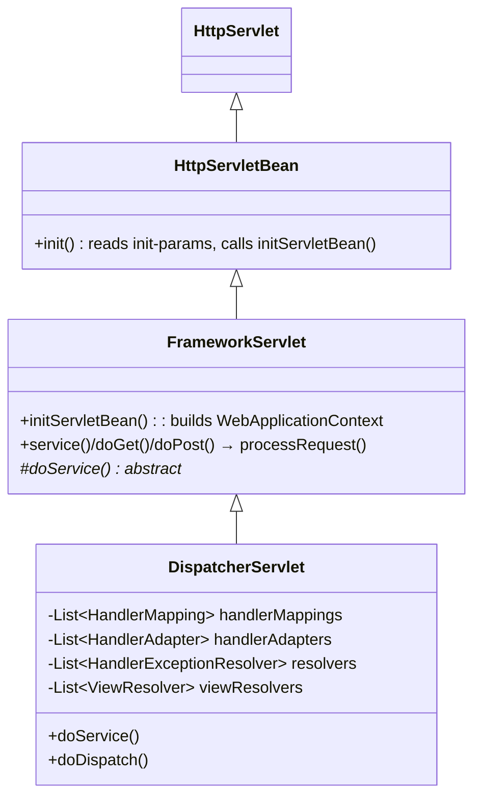

- **`HttpServletBean`** — bridges servlet init-params into Spring bean properties. Its `init()` kicks off Spring MVC initialization.
- **`FrameworkServlet`** — owns the `WebApplicationContext`, and overrides `doGet/doPost/...` to funnel every HTTP method into one `processRequest()` → `doService()`. It also binds request context (`RequestContextHolder`) and `LocaleContextHolder` around each request, and publishes the `ServletRequestHandledEvent`.
- **`DispatcherServlet`** — implements `doService()`/`doDispatch()`: the actual dispatch algorithm.

## The strategy fields — initialized once

At init, `DispatcherServlet` pulls these strategy beans from the `WebApplicationContext` (Part 5). They are *lists* because multiple implementations coexist and are tried in order:

- `List<HandlerMapping>` — map a request → handler.
- `List<HandlerAdapter>` — know how to *invoke* a given handler type.
- `List<HandlerExceptionResolver>` — turn exceptions into responses.
- `List<ViewResolver>` — turn a view name → `View`.
- `MultipartResolver` — parse `multipart/form-data`.
- `LocaleResolver`, `ThemeResolver`, `FlashMapManager`, `RequestToViewNameTranslator`.

The defaults come from `DispatcherServlet.properties` (a file inside spring-webmvc listing default strategy classes), but Boot's auto-config typically supplies richer ones (e.g. `RequestMappingHandlerMapping`, `RequestMappingHandlerAdapter`).

## `doDispatch()` — the algorithm, step by step

Here is a faithful, condensed version of the real method:

```java
// DispatcherServlet.doDispatch (simplified)
protected void doDispatch(HttpServletRequest request, HttpServletResponse response) {
    HandlerExecutionChain mappedHandler = null;
    ModelAndView mv = null;
    Exception dispatchException = null;
    try {
        // 1. Multipart check
        processedRequest = checkMultipart(request);

        // 2. Find handler for this request
        mappedHandler = getHandler(processedRequest);
        if (mappedHandler == null) { noHandlerFound(...); return; }  // → 404

        // 3. Find adapter that can invoke this handler
        HandlerAdapter ha = getHandlerAdapter(mappedHandler.getHandler());

        // 4. Interceptor preHandle (short-circuit if false)
        if (!mappedHandler.applyPreHandle(processedRequest, response)) return;

        // 5. INVOKE the handler (your controller method)
        mv = ha.handle(processedRequest, response, mappedHandler.getHandler());

        // 6. If a view name was returned but no view, apply default
        applyDefaultViewName(processedRequest, mv);

        // 7. Interceptor postHandle
        mappedHandler.applyPostHandle(processedRequest, response, mv);
    }
    catch (Exception ex) { dispatchException = ex; }

    // 8. Render view OR handle exception, then afterCompletion
    processDispatchResult(processedRequest, response, mappedHandler, mv, dispatchException);
}
```

Let's expand the pivotal steps.

### Step 2 — `getHandler()` → HandlerMapping

Iterates `handlerMappings`; the first that returns a non-null `HandlerExecutionChain` wins. For annotation controllers that's `RequestMappingHandlerMapping`, which consults its map of `RequestMappingInfo → HandlerMethod` built at startup (it scanned every `@RequestMapping` method into that registry). It matches by path, HTTP method, `consumes`/`produces`, params, headers. Returns a `HandlerExecutionChain` = handler + interceptors.

If nothing matches → `noHandlerFound` → **404 originating *inside* DispatcherServlet** (log: `No mapping for GET /users/42`). This is different from a container-level 404 (Part 18).

### Step 3 — `getHandlerAdapter()`

Finds the `HandlerAdapter` whose `supports(handler)` is true. Why the indirection? Because a "handler" can be several things: an `@RequestMapping` method (`HandlerMethod`), a plain `Controller` interface impl, an `HttpRequestHandler`, a functional `RouterFunction`. Each needs different invocation logic. The adapter abstracts "how to call this handler," so `DispatcherServlet` stays handler-type-agnostic. For annotations it's `RequestMappingHandlerAdapter`.

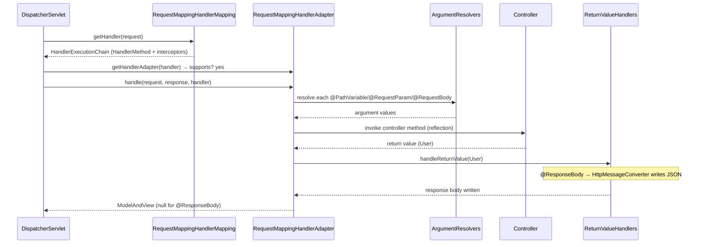

### Step 5 — `ha.handle()` → invoke controller

Inside `RequestMappingHandlerAdapter.handle` → `invokeHandlerMethod` → a `ServletInvocableHandlerMethod`:

1. **Resolve arguments** via `HandlerMethodArgumentResolver`s (Part 10).
2. **Invoke** the controller method reflectively.
3. **Handle the return value** via `HandlerMethodReturnValueHandler`s.

For `@ResponseBody`/`@RestController`, the return-value handler is `RequestResponseBodyMethodProcessor`, which uses an `HttpMessageConverter` to serialize the object into the response body **and marks the request as handled** — so `mv` (ModelAndView) comes back `null`, signaling "no view to render."

### Step 8 — `processDispatchResult()`

Two branches:

- If an exception occurred, run `HandlerExceptionResolver`s (Part 16) to produce a response or an error `ModelAndView`.
- If there's a `ModelAndView` with a **view name** (classic MVC returning `"userPage"`), invoke `ViewResolver`s to resolve the name → a `View` (e.g. a Thymeleaf/JSP view), then `view.render(model, request, response)` writes HTML. If `mv` is null (the `@ResponseBody` case), rendering is skipped — the body was already written by the converter.

Finally, `mappedHandler.triggerAfterCompletion(...)` runs interceptors' `afterCompletion` (always, even on error) — the place for cleanup/metrics.

## ViewResolver — when it matters (and when it doesn't)

A frequent confusion: "does my REST API use `ViewResolver`?" **No.** `ViewResolver` is only engaged when a controller returns a *logical view name* (a `String`/`ModelAndView` without `@ResponseBody`). Then, e.g., `InternalResourceViewResolver` maps `"users"` → `/WEB-INF/views/users.jsp`, or `ThymeleafViewResolver` maps it to a template. For `@RestController`, there's no view name — the object is serialized directly by an `HttpMessageConverter`. Keep these two return paths mentally separate:

```mermaid
flowchart TD
    RET["Controller returns..."] --> Q{@ResponseBody?}
    Q -->|Yes REST| CONV["ReturnValueHandler → HttpMessageConverter → JSON body<br/>(ViewResolver NOT used)"]
    Q -->|No, returns view name| VIEW["ViewResolver → View → render HTML"]
```

## HandlerInterceptor vs Filter (quick contrast)

Both wrap the handler, but at different layers. A **Filter** is Servlet-API-level, wraps the *entire* `DispatcherServlet` invocation, and can even prevent it. A **`HandlerInterceptor`** is Spring-MVC-level, runs *inside* `doDispatch` (after handler resolution), has three hooks (`preHandle`/`postHandle`/`afterCompletion`), and has access to the resolved handler (`HandlerMethod`) — useful for per-controller concerns. Filters can't see which handler will run; interceptors can.

## Common misconceptions

- **"DispatcherServlet calls my controller directly."** It calls the `HandlerAdapter`, which resolves args and reflectively invokes your method. Several layers of indirection buy the flexibility.
- **"ViewResolver runs for REST."** No (see above).
- **"404 always means the URL is wrong."** A 404 from `noHandlerFound` means *no mapping matched* — could be a missing `@RequestMapping`, wrong path, wrong HTTP method, or the controller not being scanned.

## Production debugging: DispatcherServlet

- **404 with log `No mapping for GET /x`** → mapping issue, not container. Enable `logging.level.org.springframework.web=DEBUG` to see the mapping registry and why nothing matched. Common: controller not in the `@ComponentScan` package, or method-level path mismatch.
- **Request reaches filter but not controller** → an interceptor `preHandle` returned `false`, or an earlier filter short-circuited.
- **Wrong `HandlerAdapter`** → mixing functional and annotation handlers; check which adapter `supports` your handler.

Next: the layer that runs *before* `DispatcherServlet` even sees the request — filters.

---

# PART 8 — Filters

## What a Filter is, and why it exists

A **`Filter`** is a Servlet-API interface (`jakarta.servlet.Filter`) that lets you intercept a request **before** it reaches any servlet and the response **after** the servlet finishes. Filters exist because some concerns are truly cross-cutting at the *container* level — they must apply to every request regardless of which servlet handles it, and possibly even reject a request before the servlet runs: authentication, logging, compression, CORS, character encoding, request/response wrapping.

```java
public interface Filter {
    default void init(FilterConfig cfg) {}
    void doFilter(ServletRequest req, ServletResponse res, FilterChain chain) throws IOException, ServletException;
    default void destroy() {}
}
```

The key is `doFilter`'s third parameter, the **`FilterChain`**. Each filter decides whether to call `chain.doFilter(req, res)` — which passes control to the *next* filter (or, at the end, to the servlet). This is the **chain of responsibility** pattern.

## The FilterChain — before and after

Because each filter wraps the `chain.doFilter(...)` call, code before that call runs on the way *in*, and code after runs on the way *out*:

```java
public void doFilter(ServletRequest req, ServletResponse res, FilterChain chain) {
    long start = System.nanoTime();          // BEFORE: on the way in
    try {
        chain.doFilter(req, res);            // proceed to next filter / servlet
    } finally {
        long took = System.nanoTime() - start; // AFTER: on the way out
        log.info("request took {} ns", took);
    }
}
```

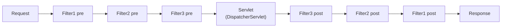

It's an onion: the request travels inward through each filter's "pre" code, hits the servlet at the core, then unwinds outward through each "post" code in reverse order. If a filter *doesn't* call `chain.doFilter`, everything inside the onion (including your controller) is skipped — that's how a security filter rejects a request with 401 without ever reaching Spring MVC.

## `GenericFilterBean` and `OncePerRequestFilter`

Spring provides base classes:

- **`GenericFilterBean`** — makes a filter a Spring bean (so it can be `@Autowired`, read the `Environment`, etc.). It implements `Filter` and exposes bean properties.
- **`OncePerRequestFilter`** — extends `GenericFilterBean` and guarantees the filter runs **at most once per request**, even when the request is *dispatched* multiple times internally (forwards, includes, async re-dispatch, error dispatch). It does this by setting a request attribute the first time and checking it on re-entry.

Why does "once per request" matter? Because a single client request can cause *multiple* servlet dispatches inside the container — e.g., an `ERROR` dispatch to `/error`, or a `FORWARD`. Without the guard, a logging or security filter could run 2–3× per user request, double-counting or double-authenticating. **This is the mechanism behind the classic "my filter runs twice" bug** — the filter extended `GenericFilterBean` (or raw `Filter`) instead of `OncePerRequestFilter`, so it fired again on the internal `/error` dispatch. Almost all Spring/Security filters extend `OncePerRequestFilter` for this reason.

## Registration and ordering in Spring Boot

Any `@Component`/`@Bean` of type `Filter` is auto-registered against `/*` by Boot. For control, use a **`FilterRegistrationBean`**:

```java
@Bean
FilterRegistrationBean<MyFilter> myFilter() {
    FilterRegistrationBean<MyFilter> reg = new FilterRegistrationBean<>(new MyFilter());
    reg.addUrlPatterns("/api/*");
    reg.setOrder(1);            // lower = earlier
    return reg;
}
```

Order is decided by `@Order`/`Ordered`/`FilterRegistrationBean.setOrder`. **This ordering is exactly how Spring Security inserts its entire filter chain at a well-defined position** (default `-100` via `SecurityProperties.DEFAULT_FILTER_ORDER`) — early, so it runs before your app filters and before `DispatcherServlet`. Boot's own filters have defined orders too (e.g. `CharacterEncodingFilter` very early).

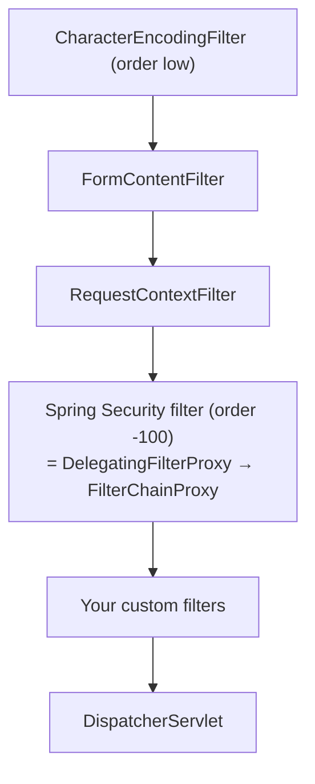

## Request/response wrapping

Filters can *wrap* the request or response using `HttpServletRequestWrapper`/`HttpServletResponseWrapper` (decorator pattern) to alter behavior downstream. Classic uses:

- **`ContentCachingRequestWrapper`/`ContentCachingResponseWrapper`** — buffer the body so it can be read *more than once* (e.g. log the request body *and* let the controller read it). Remember: the raw request `InputStream` is one-shot; wrapping is how you get around that.
- Rewriting headers, forcing HTTPS, injecting a correlation/trace ID.

```java
public void doFilter(ServletRequest req, ServletResponse res, FilterChain chain) throws ... {
    ContentCachingRequestWrapper wrapped = new ContentCachingRequestWrapper((HttpServletRequest) req);
    chain.doFilter(wrapped, res);            // controller reads the wrapper
    byte[] body = wrapped.getContentAsByteArray();  // now we can log it, after
    log.info("body: {}", new String(body));
}
```

## Filter vs Interceptor vs Aspect — where each sits

| Concern lives best in... | Layer | Sees | Can short-circuit before controller |
|---|---|---|---|
| **Filter** | Servlet container | raw request/response, all servlets | Yes (don't call `chain.doFilter`) |
| **HandlerInterceptor** | Spring MVC (inside DispatcherServlet) | the resolved `HandlerMethod` | Yes (`preHandle` returns false) |
| **AOP Aspect** | Spring beans | method args/return of any bean | Yes (don't call `proceed()`) |

Rule of thumb: security/encoding/CORS/logging of raw HTTP → **Filter**. Per-controller concerns needing handler metadata → **Interceptor**. Business-method cross-cutting (transactions, retries, caching) → **Aspect**.

## Common misconceptions

- **"Filters are Spring beans that Spring invokes."** No — filters are invoked by *Tomcat's* `FilterChain`, on the worker thread, before the servlet. Spring merely *registers* them into the `ServletContext` (Part 5).
- **"@Order on a plain Filter component controls order reliably."** Prefer `FilterRegistrationBean.setOrder` for auto-registered filters; plain-component ordering can surprise you.

## Production debugging: filters

- **Filter runs twice** → extend `OncePerRequestFilter` (the `/error` re-dispatch is firing it again).
- **Filter runs but controller doesn't** → a filter didn't call `chain.doFilter` (intentional rejection?), or Security blocked it.
- **`IllegalStateException: getInputStream() already called`** → a filter consumed the body stream; use `ContentCachingRequestWrapper`.
- **CORS/encoding not applied** → filter ordered *after* the point it needed to act; fix `setOrder`.

Filters are also the substrate on which Spring Security is built. That's the next, and one of the deepest, chapters.

---

# PART 9 — Spring Security Internals

## Why Spring Security is built on Filters

Security must apply to **every** request, **before** any controller logic, and it must be able to **reject** a request outright (401/403) without your code running. Where in the stack can you intercept every request and stop it early? The **Servlet filter chain** (Part 8). That's precisely why Spring Security is implemented as filters: it plugs into the container's request pipeline at the earliest sensible point, so authentication and authorization happen before `DispatcherServlet` ever dispatches to a controller.

But Spring Security has a puzzle to solve: filters are registered in the *`ServletContext`* (the Servlet world), instantiated early, and Tomcat drives them. Yet Spring Security's filters are **Spring beans** — they need dependency injection, configuration properties, access to `AuthenticationManager`, etc. How do you make a Tomcat-managed filter be a fully-wired Spring bean? Two indirection objects: `DelegatingFilterProxy` and `FilterChainProxy`.

## `DelegatingFilterProxy` — bridging Servlet-world and Spring-world

`DelegatingFilterProxy` is a thin `Filter` that Tomcat registers and calls, but which **owns no security logic**. Its only job: on each request, look up a *Spring bean* named `springSecurityFilterChain` from the `WebApplicationContext` (found via the `ServletContext` attribute, Part 5) and delegate `doFilter` to it.

```java
// Conceptually
public class DelegatingFilterProxy implements Filter {
    private volatile Filter delegate;   // the Spring bean
    public void doFilter(req, res, chain) {
        if (delegate == null)
            delegate = getWebApplicationContext().getBean("springSecurityFilterChain", Filter.class);
        delegate.doFilter(req, res, chain);   // hand off to the Spring-managed filter
    }
}
```

Why is this needed? Because the filter must be registered in the `ServletContext` *very early* (before the Spring context may be fully ready), and because you want the *real* filter to be a Spring bean with full DI. `DelegatingFilterProxy` is the Tomcat-registered shell; the Spring bean it delegates to is the real engine. **This is the answer to "why does Spring Security use DelegatingFilterProxy?"** — it's the adapter between "Tomcat registers/calls me as a Servlet filter" and "I'm actually a lazily-resolved Spring bean."

```mermaid
flowchart LR
    T["Tomcat FilterChain"] --> DFP["DelegatingFilterProxy<br/>(registered in ServletContext)"]
    DFP -->|"getBean('springSecurityFilterChain')"| FCP["FilterChainProxy<br/>(Spring bean)"]
    FCP --> SFC["the actual security filters"]
```

## `FilterChainProxy` — the single Spring bean that runs the security filters

The bean named `springSecurityFilterChain` is a **`FilterChainProxy`**. Why does this exist separately? Because Spring Security is not *one* filter — it's a *chain* of ~12 filters (authentication, authorization, CSRF, session, exception translation, ...). `FilterChainProxy` is a single Servlet filter that **internally holds and runs a list of `SecurityFilterChain`s**. It:

1. Receives the request from `DelegatingFilterProxy`.
2. Selects the **first `SecurityFilterChain` whose `RequestMatcher` matches** this request (you can have different chains for `/api/**` vs `/admin/**`).
3. Runs that chain's ordered list of security filters via its own internal `VirtualFilterChain` — *separate* from the container's `FilterChain`.
4. When the security filters all pass, it continues the *original* container `FilterChain` (→ `DispatcherServlet`).

**Why FilterChainProxy instead of registering 12 filters directly in the ServletContext?** Because it gives Spring Security *full control* over its own sub-chain: ordering, per-URL chain selection, consistent exception handling, and the ability to be configured entirely as Spring beans — all invisible to Tomcat, which sees just one filter (`DelegatingFilterProxy`).

```mermaid
flowchart TD
    FCP["FilterChainProxy.doFilter"] --> M{which SecurityFilterChain matches?}
    M -->|"/api/**"| C1["Chain A: filters..."]
    M -->|"/**"| C2["Chain B: filters..."]
    C1 --> VFC["VirtualFilterChain runs filters in order"]
    VFC --> DS["continue → DispatcherServlet"]
```

## The default filter chain, in order

A typical `SecurityFilterChain` runs these filters (order matters enormously):

```mermaid
flowchart TD
    A["DisableEncodeUrlFilter"] --> B["WebAsyncManagerIntegrationFilter"]
    B --> C["SecurityContextHolderFilter<br/>(load SecurityContext from repository)"]
    C --> D["HeaderWriterFilter"]
    D --> E["CorsFilter"]
    E --> F["CsrfFilter"]
    F --> G["LogoutFilter"]
    G --> H["UsernamePasswordAuthenticationFilter<br/>(form login) / BearerTokenAuthenticationFilter (JWT)"]
    H --> I["AnonymousAuthenticationFilter<br/>(assign 'anonymous' if still unauthenticated)"]
    I --> J["SessionManagementFilter"]
    J --> K["ExceptionTranslationFilter<br/>(catch AuthN/AuthZ exceptions → 401/403 or redirect)"]
    K --> L["AuthorizationFilter<br/>(the final gate: is this user allowed?)"]
    L --> M["→ FilterChainProxy continues → DispatcherServlet → Controller"]
```

Let's understand the critical ones by *role*:

- **`SecurityContextHolderFilter`** (formerly `SecurityContextPersistenceFilter`): at the start, loads any existing `SecurityContext` (e.g. from the HTTP session) via the `SecurityContextRepository` and places it in the `SecurityContextHolder` (a `ThreadLocal`). At the end, clears the `ThreadLocal` (crucial — worker threads are pooled and reused!).
- **`CsrfFilter`**: validates the CSRF token for state-changing requests (POST/PUT/DELETE) in session-based apps.
- **`UsernamePasswordAuthenticationFilter`**: for form login, extracts username/password from the POST, builds an unauthenticated `UsernamePasswordAuthenticationToken`, and hands it to the `AuthenticationManager`.
- **`BearerTokenAuthenticationFilter`** (resource server): extracts the `Authorization: Bearer <jwt>` token and authenticates it.
- **`AnonymousAuthenticationFilter`**: if no authentication happened, assigns an `AnonymousAuthenticationToken` so downstream code always has *some* `Authentication` (never null).
- **`ExceptionTranslationFilter`**: wraps the *rest* of the chain in a try/catch. It catches `AuthenticationException` → triggers the `AuthenticationEntryPoint` (e.g. 401 or redirect to login) and `AccessDeniedException` → 403. **This is why authorization failures become clean HTTP responses instead of stack traces.**
- **`AuthorizationFilter`** (formerly `FilterSecurityInterceptor`): the *last* filter — the actual authorization gate. It consults an `AuthorizationManager` to decide if the current `Authentication` may access this request; throws `AccessDeniedException` if not (caught by `ExceptionTranslationFilter`).

## The authentication core: `AuthenticationManager` / `ProviderManager` / `AuthenticationProvider`

When a filter has extracted credentials, it delegates the actual authentication decision:

```mermaid
sequenceDiagram
    participant F as Auth Filter
    participant AM as AuthenticationManager (ProviderManager)
    participant P1 as AuthenticationProvider #1
    participant P2 as AuthenticationProvider #2
    participant UDS as UserDetailsService

    F->>AM: authenticate(unauthenticatedToken)
    AM->>P1: supports(token)? authenticate(token)
    alt P1 supports it
        P1->>UDS: loadUserByUsername("alice")
        UDS-->>P1: UserDetails (hash, roles)
        P1->>P1: passwordEncoder.matches(raw, hash)?
        P1-->>AM: authenticated Authentication (+authorities)
    else P1 can't
        AM->>P2: authenticate(token)
    end
    AM-->>F: fully-authenticated Authentication
    F->>F: SecurityContextHolder.getContext().setAuthentication(auth)
```

- **`AuthenticationManager`** — one method: `Authentication authenticate(Authentication)`. Interface.
- **`ProviderManager`** — the standard `AuthenticationManager`. It holds a list of `AuthenticationProvider`s and tries each until one authenticates (or all reject). It can also delegate to a *parent* `AuthenticationManager`.
- **`AuthenticationProvider`** — knows how to authenticate *one kind* of token. `DaoAuthenticationProvider` handles username/password: it calls `UserDetailsService.loadUserByUsername`, then checks the password with a `PasswordEncoder`. `JwtAuthenticationProvider` validates JWTs.
- **`Authentication`** — represents both the *request* to authenticate (unauthenticated: has credentials) and the *result* (authenticated: has `authorities`/roles, `principal`, and `authenticated=true`). Same interface, two states.

## `SecurityContextHolder` and the `ThreadLocal`

Once authenticated, the `Authentication` is stored in the **`SecurityContext`**, which lives in the **`SecurityContextHolder`** — by default backed by a **`ThreadLocal`**. This is why, anywhere in your controller/service on the same worker thread, `SecurityContextHolder.getContext().getAuthentication()` returns the current user, with no parameter passing. It's the same `ThreadLocal` pattern as transactions and request context (Part 15).

```java
Authentication auth = SecurityContextHolder.getContext().getAuthentication();
String username = auth.getName();                 // "alice"
boolean isAdmin = auth.getAuthorities().stream()
    .anyMatch(a -> a.getAuthority().equals("ROLE_ADMIN"));
```

Two critical consequences:

1. **It must be cleared after each request** (done by `SecurityContextHolderFilter` in a `finally`), or the *next* request on the same pooled worker thread would inherit the previous user's identity — a severe security bug.
2. **It doesn't propagate to child threads by default.** If you spawn a thread or use `@Async`, the `ThreadLocal` isn't there. Use `SecurityContextHolder.setStrategyName(MODE_INHERITABLETHREADLOCAL)` or `DelegatingSecurityContextExecutor` to propagate (Part 15).

## `SecurityContextRepository` — persistence between requests

How does the *second* request from the same user know who they are? The **`SecurityContextRepository`** persists the `SecurityContext` between requests. For session-based apps, `HttpSessionSecurityContextRepository` stores it in the `HttpSession`. For stateless (JWT) apps, `NullSecurityContextRepository` / `RequestAttributeSecurityContextRepository` is used — nothing is persisted server-side; each request re-authenticates from the token. This is the crux of **stateless vs stateful** security.

## Full form-login flow (stateful)

```mermaid
sequenceDiagram
    participant U as Browser
    participant UPF as UsernamePasswordAuthenticationFilter
    participant PM as ProviderManager
    participant Repo as HttpSessionSecurityContextRepository

    U->>UPF: POST /login (user, pass)
    UPF->>PM: authenticate(UsernamePasswordAuthenticationToken)
    PM-->>UPF: authenticated Authentication
    UPF->>Repo: save SecurityContext to HttpSession
    UPF-->>U: 302 redirect to target (+ JSESSIONID cookie)
    Note over U: subsequent requests send JSESSIONID
    U->>Repo: (SecurityContextHolderFilter) load context from session
    Note over U: user is authenticated on every later request
```

## Full JWT flow (stateless resource server)

```mermaid
sequenceDiagram
    participant U as Client
    participant BTF as BearerTokenAuthenticationFilter
    participant JP as JwtAuthenticationProvider
    participant Dec as JwtDecoder (validates signature/exp/issuer)

    U->>BTF: GET /api/x  Authorization: Bearer eyJ...
    BTF->>JP: authenticate(BearerTokenAuthenticationToken)
    JP->>Dec: decode & validate JWT (signature via JWKS, exp, iss, aud)
    Dec-->>JP: Jwt (claims)
    JP-->>BTF: JwtAuthenticationToken (authorities from scopes/roles)
    BTF->>BTF: set SecurityContext (NOT persisted — stateless)
    Note over U: every request must carry the token; no session
```

Key differences from form login: **no session, no CSRF** (there's no ambient cookie to abuse), context is *not* persisted, and authorities come from JWT claims (mapped by a `JwtAuthenticationConverter`).

## OAuth2 Resource Server & Keycloak integration

With `spring-boot-starter-oauth2-resource-server`, you configure an **issuer URI**. Spring Security fetches the OpenID Connect discovery document and the **JWKS** (public keys) from the identity provider (e.g. **Keycloak**), and builds a `JwtDecoder` that validates incoming JWTs' signatures against those keys, plus `exp`, `iss`, and `aud`.

```yaml
spring:
  security:
    oauth2:
      resourceserver:
        jwt:
          issuer-uri: https://keycloak.example.com/realms/myrealm
```

Flow: the client obtains a token from Keycloak (via the OAuth2 flows — authorization code, client credentials, etc.), then calls your API with `Authorization: Bearer <token>`. `BearerTokenAuthenticationFilter` → `JwtAuthenticationProvider` → `NimbusJwtDecoder` validates it against Keycloak's JWKS (cached, refreshed periodically). Keycloak roles typically arrive under `realm_access.roles` / `resource_access.<client>.roles`, so you supply a custom `JwtAuthenticationConverter` to map those claims into Spring `GrantedAuthority`s (often prefixing `ROLE_`).

```java
@Bean
JwtAuthenticationConverter keycloakConverter() {
    JwtGrantedAuthoritiesConverter authorities = new JwtGrantedAuthoritiesConverter();
    JwtAuthenticationConverter conv = new JwtAuthenticationConverter();
    conv.setJwtGrantedAuthoritiesConverter(jwt -> {
        Map<String,Object> realm = jwt.getClaim("realm_access");
        Collection<String> roles = realm == null ? List.of()
            : (Collection<String>) realm.getOrDefault("roles", List.of());
        return roles.stream()
            .map(r -> new SimpleGrantedAuthority("ROLE_" + r))
            .collect(Collectors.toList());
    });
    return conv;
}
```

Then `@PreAuthorize("hasRole('ADMIN')")` or `authorizeHttpRequests(a -> a.requestMatchers("/admin/**").hasRole("ADMIN"))` works against Keycloak roles.

## Complete authentication + authorization flow (the big picture)

```mermaid
flowchart TD
    R["Request"] --> SCF["SecurityContextHolderFilter: load context (ThreadLocal)"]
    SCF --> AUTHN{"Auth filter: credentials present?"}
    AUTHN -->|yes| PM["ProviderManager → Provider → authenticate"]
    PM --> SET["set Authentication in SecurityContextHolder"]
    AUTHN -->|no| ANON["AnonymousAuthenticationFilter: anonymous token"]
    SET --> ETF
    ANON --> ETF["ExceptionTranslationFilter (wraps rest in try/catch)"]
    ETF --> AZ["AuthorizationFilter: AuthorizationManager.check(auth, request)"]
    AZ -->|allowed| DS["DispatcherServlet → Controller"]
    AZ -->|denied| DENY["AccessDeniedException → caught by ETF → 403"]
    AUTHN -->|auth fails| AEX["AuthenticationException → caught by ETF → 401/redirect"]
```

## Common misconceptions

- **"Spring Security is one filter."** It's one *container* filter (`DelegatingFilterProxy`) delegating to `FilterChainProxy`, which runs a whole *internal* chain of ~12 filters.
- **"`@PreAuthorize` is a filter."** No — method security (`@PreAuthorize`/`@PostAuthorize`) is **AOP** (Part 13): a proxy/interceptor around the method, separate from the URL-level `AuthorizationFilter`. Both exist; they're different layers.
- **"The SecurityContext propagates to async threads."** It does not, by default (ThreadLocal). Explicitly propagate.
- **"Stateless JWT apps need CSRF."** No — CSRF protection targets ambient credentials (cookies); Bearer tokens aren't sent automatically by browsers, so CSRF is typically disabled for pure token APIs.

## Production debugging: Spring Security

- **403 on every request unexpectedly** → CSRF enabled on a REST API using non-cookie auth; or an `AuthorizationManager` rule denies. Enable `logging.level.org.springframework.security=DEBUG` to see which filter rejected and why.
- **401 loop / redirect to login for an API** → the `AuthenticationEntryPoint` is the form-login one; configure the resource server / a `401` entry point for APIs.
- **User is null in `@Async`/new thread** → ThreadLocal not propagated (Part 15).
- **Next request sees previous user** → the `SecurityContextHolder` wasn't cleared; almost always means a custom filter chain bypassed `SecurityContextHolderFilter`.
- **Filter order wrong** → your custom filter added with `addFilterBefore/After` at the wrong reference filter.
- **Keycloak roles not mapped** → missing `JwtAuthenticationConverter`; authorities are empty so `hasRole` fails.

With the request now authorized, control finally reaches Spring MVC and your controller method. Let's dissect that layer.

---

# PART 10 — Spring MVC Internals

We've seen *where* the controller is invoked (Part 7). Now let's understand the annotations and machinery that make `@RestController` methods work: how mappings are built, how arguments are resolved, how bodies are converted, how validation runs.

## `@Controller` vs `@RestController`

- **`@Controller`** — a stereotype marking a bean as a web controller. Its methods return **logical view names** by default (resolved by `ViewResolver`), unless a method is annotated `@ResponseBody`.
- **`@RestController`** = `@Controller` + `@ResponseBody` on every method. So every return value is serialized to the response body (JSON), never treated as a view name. This is the REST-API default.

## How `@RequestMapping` becomes a route

At startup, `RequestMappingHandlerMapping` (a bean created by MVC auto-config) implements `InitializingBean`. In `afterPropertiesSet`, it scans **every bean** in the context, checks if the bean's class is `@Controller` or `@RequestMapping`-annotated, and for each `@RequestMapping`/`@GetMapping`/... method, builds a **`RequestMappingInfo`** (the path pattern, HTTP methods, params, headers, `consumes`, `produces`) and registers `RequestMappingInfo → HandlerMethod` into an internal `MappingRegistry`.

```mermaid
flowchart LR
    A["@RestController beans"] -->|scanned at startup| B["RequestMappingHandlerMapping"]
    B --> C["MappingRegistry:<br/>RequestMappingInfo → HandlerMethod"]
    D["Incoming GET /users/42"] -->|lookup| C
    C -->|match| E["HandlerMethod(UserController#getUser)"]
```

`@GetMapping("/users/{id}")` is just `@RequestMapping(path="/users/{id}", method=GET)` — a composed annotation. `@PostMapping`, `@PutMapping`, `@DeleteMapping`, `@PatchMapping` likewise. At request time, `getHandler` (Part 7) matches the request against this registry. If multiple patterns match, the *most specific* wins (exact > path variable > wildcard), computed by `RequestMappingInfo.compareTo`.

## Argument resolution — `HandlerMethodArgumentResolver`

The `RequestMappingHandlerAdapter` holds an ordered list of `HandlerMethodArgumentResolver`s. For each method parameter, it finds the first resolver whose `supportsParameter` is true and calls `resolveArgument`. The important ones:

| Annotation / type | Resolver | What it does |
|---|---|---|
| `@PathVariable Long id` | `PathVariableMethodArgumentResolver` | pulls `{id}` from the URI template, converts via `ConversionService` |
| `@RequestParam String q` | `RequestParamMethodArgumentResolver` | pulls query/form param, converts |
| `@RequestBody Dto d` | `RequestResponseBodyMethodProcessor` | reads body `InputStream`, deserializes via `HttpMessageConverter` |
| `@RequestHeader` | `RequestHeaderMethodArgumentResolver` | pulls a header |
| `HttpServletRequest`, `Model` | `ServletRequestMethodArgumentResolver`, `ModelMethodProcessor` | supplies framework objects |
| `@AuthenticationPrincipal` | (Security) resolver | pulls principal from `SecurityContext` |

```java
@GetMapping("/search")
List<User> search(
    @RequestParam String q,               // RequestParamMethodArgumentResolver
    @RequestParam(defaultValue="0") int page,  // + ConversionService "0"→int
    @RequestHeader("X-Tenant") String tenant,  // RequestHeaderMethodArgumentResolver
    Pageable pageable) { ... }            // custom resolver (Spring Data)
```

## `@RequestBody` and deserialization

For `@RequestBody`, `RequestResponseBodyMethodProcessor` reads the request `Content-Type`, finds an `HttpMessageConverter` that `canRead` that media type into the target class, and delegates. For `application/json`, that's `MappingJackson2HttpMessageConverter`, which calls Jackson's `ObjectMapper.readValue(inputStream, TargetType.class)`. If no converter supports the content type → **415 Unsupported Media Type**. If the JSON is malformed → `HttpMessageNotReadableException` → 400.

## `@ResponseBody` and serialization + content negotiation

On the way out, `RequestResponseBodyMethodProcessor` (as a return-value handler) performs **content negotiation**: it reads the `Accept` header, intersects the client's acceptable types with the types the available converters can `canWrite` for the return type, and picks the best. Then it writes via that converter. For `Accept: application/json` and a `User` return, `MappingJackson2HttpMessageConverter` calls `objectMapper.writeValue(outputStream, user)`. If the client's `Accept` can't be satisfied by any converter → **406 Not Acceptable**.

```mermaid
sequenceDiagram
    participant HA as HandlerAdapter
    participant RP as RequestResponseBodyMethodProcessor
    participant CN as ContentNegotiationManager
    participant MC as MappingJackson2HttpMessageConverter
    HA->>RP: handleReturnValue(User)
    RP->>CN: determine acceptable media types (Accept header)
    CN-->>RP: [application/json]
    RP->>MC: canWrite(User, application/json)? yes
    RP->>MC: write(user, outputStream)
    MC->>MC: objectMapper.writeValue(...)  → JSON bytes
```

## `Model` and `ModelAndView` (the view-based path)

For non-REST controllers, you populate a **`Model`** (a map of attributes) and return a **view name**; Spring bundles them into a **`ModelAndView`**. `DispatcherServlet` then resolves the view name via `ViewResolver` and calls `view.render(model, req, res)` to produce HTML (Thymeleaf/JSP). `ModelAndView` literally carries *both* the model data and the view identity. REST controllers skip all of this.

## Validation — `@Valid` / `@Validated` and `BindingResult`

When a parameter is annotated `@Valid` (or the method/class `@Validated`), after the argument is resolved (e.g. `@RequestBody Dto`), the adapter runs a `Validator` (backed by a **Bean Validation** / Hibernate Validator provider) against it. Constraint annotations (`@NotNull`, `@Size`, `@Email`, ...) are checked.

```java
@PostMapping("/users")
User create(@Valid @RequestBody CreateUserDto dto, BindingResult binding) {
    if (binding.hasErrors()) { ... }   // you handle it
    return service.create(dto);
}
```

Two behaviors:

- If a **`BindingResult`/`Errors`** parameter immediately follows the validated parameter, validation errors are placed there and **your method still runs** — you inspect `binding.hasErrors()` yourself.
- If there's **no** `BindingResult`, a failed validation throws `MethodArgumentNotValidException`, which Spring's `DefaultHandlerExceptionResolver` maps to **400 Bad Request** (Part 16). This is the common REST case, usually customized via `@ControllerAdvice`.

Internally, validation runs through the same `DataBinder`/`ConversionService` pipeline that binds request params to objects.

## `ConversionService` and `Formatter`s

Whenever a `String` from the request must become a typed value (`"42"` → `Long`, `"2026-07-12"` → `LocalDate`, `"true"` → `boolean`), the **`ConversionService`** (specifically `FormattingConversionService`) is consulted. It holds `Converter`s and `Formatter`s. You register custom ones for domain types (e.g. a `String` → `Money`). `@DateTimeFormat` and `@NumberFormat` hook into this. This is the same conversion engine used for `@Value` injection and `@ConfigurationProperties` binding — one unified type-conversion subsystem.

## Jackson integration

Spring Boot auto-configures a single, shared `ObjectMapper` (via `JacksonAutoConfiguration`) and wraps it in `MappingJackson2HttpMessageConverter`. You customize it with `spring.jackson.*` properties (e.g. `spring.jackson.serialization.write-dates-as-timestamps=false`), by defining `@Bean Jackson2ObjectMapperBuilderCustomizer`, or with Jackson annotations on your DTOs (`@JsonProperty`, `@JsonIgnore`, `@JsonFormat`). Because it's *one shared* mapper, custom modules (e.g. `JavaTimeModule`, registered automatically when `jackson-datatype-jsr310` is present) apply everywhere. (More in Part 17.)

## Full MVC method-invocation sequence

```mermaid
sequenceDiagram
    participant HA as RequestMappingHandlerAdapter
    participant AR as ArgumentResolvers
    participant CS as ConversionService
    participant V as Validator
    participant C as Controller method
    participant RV as ReturnValueHandlers
    participant MC as HttpMessageConverter

    HA->>AR: resolve each parameter
    AR->>CS: convert String→typed
    AR->>V: @Valid? validate
    AR-->>HA: argument array
    HA->>C: invoke(args)
    C-->>HA: return value
    HA->>RV: handleReturnValue
    RV->>MC: serialize (content negotiation)
    MC-->>HA: body written
```

## Common misconceptions

- **"`@RequestBody` and `@RequestParam` are interchangeable."** No — `@RequestParam` reads query/form params (never the JSON body); `@RequestBody` reads the raw body via a converter. Using the wrong one gives null/400.
- **"Validation runs automatically on any `@RequestBody`."** Only if you add `@Valid`/`@Validated`.
- **"Each request creates a new `ObjectMapper`."** No — one shared, thread-safe mapper.

## Production debugging: MVC

- **`@RequestBody` is null** → missing/incorrect `Content-Type: application/json`, or no request body, or a filter consumed the stream (Part 8). Also check the DTO has a no-args constructor/getters for Jackson.
- **415** → client sent a content type no converter can read (e.g. `text/plain` to a JSON endpoint).
- **406** → client's `Accept` can't be satisfied (e.g. `Accept: application/xml` but only JSON configured).
- **400 with validation** → `@Valid` failed and no `BindingResult`; inspect the `MethodArgumentNotValidException` field errors.
- **`@PathVariable` not binding** → name mismatch between `{id}` and the parameter (add `@PathVariable("id")` or compile with `-parameters`).

Everything so far assumed beans exist and are wired. Time to open the engine that creates and wires them: the IoC container.

---

# PART 11 — IoC Container Internals

## Inversion of Control — the "why"

Without IoC, objects create their own dependencies: `new UserService(new UserRepositoryImpl(new DataSource(...)))`. This hard-wires implementations, makes testing painful, and scatters lifecycle management. **Inversion of Control** flips it: you *declare* what you need, and a container *creates, wires, and manages* the objects. **Dependency Injection** is the mechanism. The container becomes the single owner of the object graph.

## `BeanFactory` vs `ApplicationContext`

- **`BeanFactory`** — the raw container contract: `getBean`, lazy instantiation, the bare bean registry. `DefaultListableBeanFactory` is the workhorse implementation (holds the `beanDefinitionMap` and the singleton cache).
- **`ApplicationContext`** — a superset: everything `BeanFactory` does *plus* event publishing, `MessageSource` (i18n), resource loading, `Environment`, and **eager** instantiation of singletons at startup. It *wraps* a `DefaultListableBeanFactory`.

When people say "the Spring container," they mean an `ApplicationContext` backed by a `DefaultListableBeanFactory`.

```mermaid
classDiagram
    class BeanFactory {
        <<interface>>
        +getBean(name/type)
    }
    class DefaultListableBeanFactory {
        -Map beanDefinitionMap
        -Map singletonObjects (cache)
        -Map earlySingletonObjects
        -Map singletonFactories
        +preInstantiateSingletons()
    }
    class ApplicationContext {
        <<interface>>
        +publishEvent()
        +getEnvironment()
    }
    BeanFactory <|.. DefaultListableBeanFactory
    BeanFactory <|-- ApplicationContext
    ApplicationContext o-- DefaultListableBeanFactory
```

## `BeanDefinition` and the registry

A **`BeanDefinition`** is the metadata recipe (Part 2): bean class, scope, constructor args, property values, autowire mode, init/destroy methods, lazy flag, dependencies. **`BeanDefinitionRegistry`** is the interface for storing them (`registerBeanDefinition(name, def)`); `DefaultListableBeanFactory` implements it. These definitions are produced by component scanning, `@Bean` method parsing, and auto-configuration — all before any instantiation.

## The two post-processor families (don't confuse them)

- **`BeanFactoryPostProcessor`** — operates on **bean *definitions*** (the recipes), after they're loaded but *before* any bean is instantiated. Can add/modify/remove definitions. `ConfigurationClassPostProcessor` (does scanning + `@Configuration` parsing) and `PropertySourcesPlaceholderConfigurer` (resolves `${...}`) are examples.
- **`BeanPostProcessor`** — operates on **bean *instances***, around each bean's initialization. Two callbacks: `postProcessBeforeInitialization` and `postProcessAfterInitialization`. `AutowiredAnnotationBeanPostProcessor` (injection), `CommonAnnotationBeanPostProcessor` (`@PostConstruct`/`@Resource`), and `AnnotationAwareAspectJAutoProxyCreator` (AOP proxies) are the big ones.

> Mnemonic: **BeanFactoryPostProcessor** edits *blueprints*; **BeanPostProcessor** edits *buildings*.

## The bean creation lifecycle — in detail

When `getBean("userService")` runs for a singleton not yet created (`doCreateBean`):

```mermaid
flowchart TD
    A["getBean(name)"] --> B{in singleton cache?}
    B -->|yes| Z["return cached bean"]
    B -->|no| C["resolve BeanDefinition"]
    C --> D["createBeanInstance<br/>(pick constructor, resolve constructor-arg deps → recursive getBean)"]
    D --> E["add raw bean to singletonFactories<br/>(for circular refs)"]
    E --> F["populateBean<br/>(field/setter @Autowired → recursive getBean)"]
    F --> G["BeanPostProcessor.postProcessBeforeInitialization"]
    G --> H["initializeBean:<br/>@PostConstruct → InitializingBean.afterPropertiesSet → init-method"]
    H --> I["BeanPostProcessor.postProcessAfterInitialization<br/>(AOP proxy created here)"]
    I --> J["put final bean in singletonObjects"]
    J --> Z2["return bean"]
```

Each phase:

1. **Instantiate** — `createBeanInstance` selects a constructor. For **constructor injection**, it resolves each constructor argument by recursively calling `getBean` for that type/qualifier. This is why constructor injection is preferred: dependencies are provided at construction, the object is immutable and never in a half-built state.
2. **Populate** — `populateBean` performs **field and setter injection** (`@Autowired`), again recursively resolving each dependency. `AutowiredAnnotationBeanPostProcessor` finds annotated fields/setters and sets them via reflection.
3. **Initialize** — `@PostConstruct` (via `CommonAnnotationBeanPostProcessor`), then `InitializingBean.afterPropertiesSet()`, then a custom `initMethod`.
4. **Post-process** — `postProcessAfterInitialization`: this is where a bean may be **replaced by a proxy** (AOP). The container caches whatever this returns — so downstream, everyone gets the *proxy*, not the raw bean (crucial for Part 13/14).

## Dependency injection — how `@Autowired` actually resolves

`AutowiredAnnotationBeanPostProcessor` scans for injection points. For each, it asks the `BeanFactory` to `resolveDependency`:

- **By type** first. If exactly one bean of the required type exists → inject it.
- If **multiple** candidates → narrow by `@Qualifier`, `@Primary`, or bean name matching the field name. If still ambiguous → `NoUniqueBeanDefinitionException`.
- If **none** → `NoSuchBeanDefinitionException` (unless `required=false` or `Optional`/`@Nullable`).

Injection happens **once**, at bean creation. After that, the field simply holds a reference — no per-call reflection.

## Scopes

- **Singleton** (default) — one instance per container, cached in `singletonObjects`, shared everywhere.
- **Prototype** — a **new instance every `getBean`/injection point**. The container creates and wires it but does **not** manage its full lifecycle (no destruction callback) and does **not** cache it.
- **Web scopes** — `request` (one per HTTP request), `session` (one per HTTP session), `application`. These are backed by the current request/session via a scoped-proxy.

### The singleton-injecting-prototype trap

A singleton injected with a prototype bean gets **one** prototype instance at *its* creation time — not a fresh one per use. If you truly need a new prototype each call, inject an `ObjectProvider<T>`/`Provider<T>` and call `getObject()`, or use a `@Lookup` method, or a scoped proxy.

## The singleton cache and circular dependencies

`DefaultListableBeanFactory` maintains **three** maps (the "three-level cache") specifically to resolve circular references:

- `singletonObjects` — fully initialized beans.
- `earlySingletonObjects` — raw beans exposed early (instantiated but not fully initialized).
- `singletonFactories` — `ObjectFactory`s that can produce an early reference (and, importantly, the *proxy* if AOP is involved).

### How a circular dependency is resolved

Consider `A` needs `B`, `B` needs `A`, both **field-injected** singletons:

```mermaid
sequenceDiagram
    participant BF as BeanFactory
    BF->>BF: getBean(A) → instantiate A (raw)
    BF->>BF: expose A via singletonFactories (early ref)
    BF->>BF: populate A → needs B → getBean(B)
    BF->>BF: instantiate B (raw)
    BF->>BF: populate B → needs A → getBean(A)
    Note over BF: A found in early cache! inject early A into B
    BF->>BF: finish B, cache it
    BF->>BF: inject finished B into A, finish A
```

The early reference breaks the cycle. **But this only works for setter/field injection**, because the object must exist (instantiated) before its dependencies are set. With **constructor injection on both sides**, neither can be instantiated without the other already existing → `BeanCurrentlyInCreationException`. This is the concrete reason you sometimes see circular-dependency errors *only* with constructor injection.

> Since Spring Boot 2.6, circular references are **disabled by default** — even the setter-injection cycle now fails at startup unless you set `spring.main.allow-circular-references=true`. The framework nudges you to fix the design (usually by extracting a third bean or using `@Lazy`).

### `@Lazy` as a cycle-breaker

Injecting a dependency as `@Lazy` makes Spring inject a **proxy** immediately and resolve the real bean on first use — deferring resolution past the cycle. It's a band-aid; the cleaner fix is redesigning the dependency direction.

## Lazy beans

`@Lazy` on a bean/definition means it isn't instantiated during `preInstantiateSingletons` — it's created on first access. Reduces startup time and can sidestep some ordering issues, at the cost of deferring failures (a broken lazy bean fails at first request, not startup — a debugging tradeoff).

## Common misconceptions

- **"`@Autowired` uses reflection on every call."** Only once, at creation.
- **"Prototype beans are destroyed by Spring."** No — Spring forgets them after creation; you manage their teardown.
- **"Circular deps always fail."** Setter/field cycles can resolve via early references (if enabled); constructor cycles cannot.
- **"Getting a bean by type is free."** For a singleton, yes (cache hit); the *first* creation triggers the whole lifecycle recursively.

## Production debugging: IoC

- **`NoSuchBeanDefinitionException`** → bean not scanned (outside base package), or its `@Conditional` didn't match, or wrong type/qualifier. Check `@ComponentScan` coverage.
- **`NoUniqueBeanDefinitionException`** → multiple candidates; add `@Primary` or `@Qualifier`.
- **`BeanCurrentlyInCreationException`** → constructor circular dependency; break it (`@Lazy`, redesign, or setter injection).
- **`BeanCreationException` wrapping a NPE in a constructor** → a dependency was null because injection order/`@Lazy` proxy; inspect the cause chain.
- **A `@Transactional`/`@Async` method not working** → you likely injected the raw bean somewhere, or self-invoked (Parts 13/14) — but note the *container* always hands out the proxy; the usual culprit is self-invocation, not the container.

How does the container know to create a Tomcat, a `DispatcherServlet`, a `DataSource`, a Jackson mapper — without you writing any of it? Auto-configuration. Next.

---

# PART 12 — Auto-Configuration Internals

## The core idea

Auto-configuration is Spring Boot's headline feature and its most "magical"-seeming. Demystified, it's simple: **a large library of pre-written `@Configuration` classes, each guarded by conditions, that Spring Boot imports and evaluates. Those whose conditions pass contribute beans; the rest are silently skipped.** The conditions are almost always "is this class on the classpath?" and "has the user *not* already defined this bean?" That's the whole trick — sensible defaults that back off the moment you provide your own.

## `@SpringBootApplication` decomposed

```java
@SpringBootApplication
// ≡
@SpringBootConfiguration   // = @Configuration (marks this as a config class + component)
@EnableAutoConfiguration   // triggers the auto-config import
@ComponentScan             // scan this package + subpackages for @Components
public class ShopApplication { ... }
```

- **`@SpringBootConfiguration`** — a `@Configuration`, so your main class can itself declare `@Bean`s.
- **`@ComponentScan`** — with no `basePackages`, it defaults to the package of the annotated class. **This is why beans must live in or below your main class's package.**
- **`@EnableAutoConfiguration`** — the interesting one.

## `@EnableAutoConfiguration` → `AutoConfigurationImportSelector`

`@EnableAutoConfiguration` is meta-annotated with `@Import(AutoConfigurationImportSelector.class)`. During `invokeBeanFactoryPostProcessors` (Part 2/11), `ConfigurationClassPostProcessor` processes this import. `AutoConfigurationImportSelector.selectImports` returns a list of auto-configuration class names to register as configuration classes.

Where does that list come from? In **Boot 2.7+/3.x**, from files named:

```
META-INF/spring/org.springframework.boot.autoconfigure.AutoConfiguration.imports
```

(one class name per line) inside `spring-boot-autoconfigure.jar` and any starter. (Pre-2.7 it was the `EnableAutoConfiguration` key in `META-INF/spring.factories`.) There are ~150 such classes: `DataSourceAutoConfiguration`, `JpaRepositoriesAutoConfiguration`, `DispatcherServletAutoConfiguration`, `WebMvcAutoConfiguration`, `JacksonAutoConfiguration`, `SecurityAutoConfiguration`, etc.

```mermaid
flowchart TD
    A["@EnableAutoConfiguration"] --> B["@Import(AutoConfigurationImportSelector)"]
    B --> C["read AutoConfiguration.imports files<br/>(~150 candidate classes)"]
    C --> D["filter by @Conditional evaluation"]
    D --> E["passing classes become @Configuration<br/>→ their @Bean methods register bean definitions"]
    E --> F["beans instantiated later in finishBeanFactoryInitialization"]
```

## Conditional annotations — the gatekeepers

Each auto-config class (and each `@Bean` within) is guarded by `@Conditional` annotations evaluated by `ConditionEvaluator`. The key ones:

- **`@ConditionalOnClass(X.class)`** — apply only if `X` is on the classpath. (E.g. `DataSourceAutoConfiguration` requires `DataSource`/`EmbeddedDatabaseType`.) Implemented by inspecting classpath without loading the class if absent.
- **`@ConditionalOnMissingClass`** — the inverse.
- **`@ConditionalOnBean` / `@ConditionalOnMissingBean`** — apply only if a bean of some type is (already) present / absent. `@ConditionalOnMissingBean` is the **back-off** mechanism: "create this default *only if the user hasn't defined their own*." This is why declaring your own `ObjectMapper` or `DataSource` bean silently disables Boot's default one.
- **`@ConditionalOnProperty`** — gated on a config property (e.g. `spring.h2.console.enabled=true`).
- **`@ConditionalOnWebApplication` / `@ConditionalOnNotWebApplication`** — servlet vs reactive vs none.
- **`@ConditionalOnResource`, `@ConditionalOnExpression`, `@ConditionalOnJava`** — other guards.

### Ordering matters for `@ConditionalOnMissingBean`

`@ConditionalOnMissingBean` checks the *current state* of the bean-definition registry at evaluation time. So auto-configurations are **ordered last** relative to your user configuration (via `@AutoConfiguration(after/before=...)` and the ordering machinery), ensuring your beans are registered *before* the auto-config's `@ConditionalOnMissingBean` runs — so "back off if user defined it" works correctly.

## A worked example: how the embedded Tomcat gets configured

```mermaid
flowchart TD
    A["ServletWebServerFactoryAutoConfiguration"] -->|"@ConditionalOnClass(ServletRequest)"| B["applies (spring-web present)"]
    B --> C["imports EmbeddedTomcat config"]
    C -->|"@ConditionalOnClass(Tomcat.class)<br/>@ConditionalOnMissingBean(ServletWebServerFactory)"| D["@Bean TomcatServletWebServerFactory"]
    E["DispatcherServletAutoConfiguration"] -->|"@ConditionalOnClass(DispatcherServlet)<br/>@ConditionalOnMissingBean"| F["@Bean DispatcherServlet + registration bean"]
```

So "I put `spring-boot-starter-web` on the classpath and a Tomcat magically started" decomposes to: the starter brought Tomcat + Spring MVC JARs → `@ConditionalOnClass` conditions passed → `TomcatServletWebServerFactory` and `DispatcherServlet` bean definitions were registered → they were instantiated during refresh → `onRefresh` started Tomcat (Part 2). No magic — just conditions matching your classpath.

## `@ConfigurationProperties` and typed binding

Auto-config needs *values* (ports, URLs, pool sizes). These come from `application.yml`/`.properties`, bound into typed objects via **`@ConfigurationProperties`**:

```java
@ConfigurationProperties(prefix = "app.mail")
public class MailProps {
    private String host;
    private int port = 25;
    private Duration timeout = Duration.ofSeconds(5);
    // getters/setters
}
```

`app.mail.host=smtp.example.com` binds to `host`. Binding is **relaxed** (`app.mail.host`, `APP_MAIL_HOST`, `app-mail-host` all match) and type-converted via the `ConversionService` (including rich types like `Duration`, `DataSize`, enums). Boot's own config (`ServerProperties`, `DataSourceProperties`, etc.) uses exactly this mechanism — `server.port` binds to `ServerProperties.port`.

## `@EnableConfigurationProperties`

To activate a `@ConfigurationProperties` class as a bean, either annotate it `@Component`, or (cleaner, especially in library code) register it with `@EnableConfigurationProperties(MailProps.class)` on a `@Configuration`. Auto-configs use the latter so their properties are only bound when the auto-config applies.

## Writing your own auto-configuration (the library pattern)

Understanding this cements the concept. A starter library ships:

```java
@AutoConfiguration
@ConditionalOnClass(MailSender.class)
@EnableConfigurationProperties(MailProps.class)
public class MailAutoConfiguration {

    @Bean
    @ConditionalOnMissingBean          // back off if the app defines its own
    MailSender mailSender(MailProps props) {
        return new SmtpMailSender(props.getHost(), props.getPort());
    }
}
```

...and lists `com.acme.MailAutoConfiguration` in its `META-INF/spring/org.springframework.boot.autoconfigure.AutoConfiguration.imports`. Now any app that depends on the library *and* has `MailSender` on the classpath automatically gets a configured `mailSender` bean — unless it defines its own. That's the exact pattern all official starters follow.

## Debugging what auto-configured (and what didn't)

Run with `--debug` (or `logging.level...=DEBUG` won't do it; use the debug flag) to get the **Condition Evaluation Report**:

```
Positive matches:
  DataSourceAutoConfiguration matched:
    - @ConditionalOnClass found required class 'javax.sql.DataSource' (OnClassCondition)
Negative matches:
  GsonAutoConfiguration:
    - @ConditionalOnClass did not find required class 'com.google.gson.Gson' (OnClassCondition)
Exclusions:
  ...
```

This report is your single best tool for "why did/didn't bean X get created?" It lists every auto-config, whether it matched, and *the exact condition* that decided. The Actuator `/conditions` endpoint exposes the same at runtime.

## Common misconceptions

- **"Auto-config is reflection magic at runtime."** It's ordinary `@Configuration` classes chosen by classpath/condition checks at startup — fully inspectable.
- **"Auto-config overrides my beans."** The opposite — `@ConditionalOnMissingBean` makes auto-config *back off* when you define your own.
- **"`spring.factories` is still where auto-configs are listed."** Only pre-2.7. Modern Boot uses the `AutoConfiguration.imports` file.
- **"`@ComponentScan` scans the whole classpath."** No — only your main class's package downward, by default.

## Production debugging: auto-configuration

- **Expected bean missing** → check the Condition Evaluation Report (`--debug`); a `@ConditionalOnClass`/`@ConditionalOnProperty` didn't match (missing dependency or property).
- **My custom bean ignored** → an auto-config *without* `@ConditionalOnMissingBean` also defines it, or ordering caused your bean to register too late; verify with `/conditions`.
- **Unwanted auto-config active** → exclude it: `@SpringBootApplication(exclude = DataSourceAutoConfiguration.class)`.
- **Property not binding** → prefix/name mismatch or missing `@EnableConfigurationProperties`; enable `debug` and check `Binder` logs.

Now the deepest structural topic — how Spring makes `@Transactional`, `@Async`, `@Cacheable`, and security annotations actually intercept your methods: AOP proxies.

---

# PART 13 — AOP Internals

## Why AOP exists

Some concerns cut *across* many methods: transactions, security checks, caching, retries, logging, metrics. Scattering that code into every method is repetitive and error-prone. **Aspect-Oriented Programming** lets you define such cross-cutting behavior *once* (an **aspect**) and have it applied declaratively to many methods (via **pointcuts**). `@Transactional` is the poster child: you annotate a method, and transaction begin/commit/rollback wraps it — but *you never wrote* the begin/commit code. AOP put it there.

## The mechanism: dynamic proxies

Spring AOP is **proxy-based**. When a bean has any advice applicable to it, the container does **not** hand out the raw bean. Instead, at bean creation (in `postProcessAfterInitialization`, Part 11), the `AnnotationAwareAspectJAutoProxyCreator` (a `BeanPostProcessor`) **wraps the bean in a proxy object** that has the *same type* (implements the same interfaces / subclasses the class). Everyone who injects this bean actually gets the **proxy**. The proxy intercepts each method call, runs the advice (the "around" logic), and delegates to the real bean.

```mermaid
flowchart LR
    Caller --> Proxy["Proxy (UserService$$Proxy)"]
    Proxy -->|"before: begin tx"| Interceptors["Advice chain<br/>(TransactionInterceptor, ...)"]
    Interceptors -->|"proceed()"| Target["Real UserService.findById()"]
    Target -->|"return"| Interceptors
    Interceptors -->|"after: commit tx"| Proxy
    Proxy --> Caller
```

**This proxy indirection is the single most important thing to understand about `@Transactional`, `@Async`, `@Cacheable`, method security — and it's the root of their famous failure modes.**

## JDK dynamic proxy vs CGLIB

Spring has two ways to build the proxy:

### JDK dynamic proxy

Built into the JDK (`java.lang.reflect.Proxy`). It can only proxy **interfaces**: it generates a class implementing the target's interface(s), forwarding each method to an `InvocationHandler`. Used when the target bean **implements at least one interface** and Spring is configured to prefer interface proxies.

```java
// Conceptually what JDK proxy does
UserService proxy = (UserService) Proxy.newProxyInstance(
    classLoader,
    new Class[]{ UserService.class },      // MUST be an interface
    (proxyObj, method, args) -> {
        // advice runs here, then:
        return method.invoke(realTarget, args);
    });
```

Consequence: with a JDK proxy, you must inject/reference the bean **by its interface type**, not the concrete class — the proxy *is not* an instance of the concrete class.

### CGLIB proxy

CGLIB (bundled inside `spring-core`) generates a **runtime subclass** of the target class and overrides each method to route through the advice. Used when the target has **no interface**, or when proxying by class is forced. **Spring Boot defaults to CGLIB** (`proxyTargetClass=true`) for consistency, so most Boot apps use CGLIB even for beans that have interfaces.

```mermaid
flowchart TD
    Q{Bean implements an interface?} -->|"Yes AND proxyTargetClass=false"| JDK["JDK dynamic proxy<br/>(proxies the interface)"]
    Q -->|"No, OR proxyTargetClass=true (Boot default)"| CG["CGLIB proxy<br/>(subclass the class)"]
```

### Why CGLIB's approach forces certain rules

Because CGLIB **subclasses** the target and **overrides** methods to insert advice:

- **`final` classes cannot be proxied by CGLIB** — you can't subclass a final class. → `@Transactional` on a final class fails (or falls back / errors).
- **`final` methods cannot be advised** — you can't override a final method, so advice can't be inserted; the method silently runs without the aspect.
- **`private` methods cannot be advised** — they aren't inherited/overridable, and pointcuts don't match them. `@Transactional` on a private method does nothing.
- **`static` methods** — not instance methods; not proxyable.

And because JDK proxies work through **interfaces**:

- Only **public interface methods** can be advised.
- **This is why interfaces matter**: JDK proxying is only possible against an interface; the proxy type is the interface, so references must use the interface type.

## The self-invocation problem — the #1 AOP gotcha

Here's the trap that bites everyone. Advice lives on the **proxy**, not the target. When code *inside* the target calls another method on `this`, it calls the **raw target**, bypassing the proxy — so **no advice runs**.

```java
@Service
class OrderService {

    @Transactional
    public void placeOrder(Order o) {
        save(o);
        audit(o);            // ← self-invocation: calls this.audit(), NOT proxy.audit()
    }

    @Transactional(propagation = REQUIRES_NEW)
    public void audit(Order o) {   // ← this @Transactional is IGNORED when called internally
        ...
    }
}
```

`placeOrder` was entered *through the proxy* (advice ran). But the call `audit(o)` is really `this.audit(o)` — a direct call on the target object. The proxy never sees it. So `audit`'s `@Transactional(REQUIRES_NEW)` is **completely ignored** — no new transaction. The same applies to `@Async`, `@Cacheable`, `@PreAuthorize` on self-invoked methods.

```mermaid
sequenceDiagram
    participant Caller
    participant Proxy as OrderService Proxy
    participant Target as OrderService (real)
    Caller->>Proxy: placeOrder(o)
    Note over Proxy: advice runs (tx begins)
    Proxy->>Target: placeOrder(o)
    Target->>Target: this.audit(o)  ← direct call, bypasses proxy
    Note over Target: audit's @Transactional NEVER applied
```

### Fixes for self-invocation

1. **Move the method to another bean** — inject a separate `AuditService`; calling *it* goes through *its* proxy.
2. **Self-inject the proxy** — inject the bean into itself (`@Autowired @Lazy OrderService self;`) and call `self.audit(o)`. Ugly but works.
3. **`AopContext.currentProxy()`** — with `exposeProxy=true`, call `((OrderService) AopContext.currentProxy()).audit(o)`. Also ugly.
4. **Prefer design #1** — the others are code smells signaling the method belongs elsewhere.

## The advice vocabulary

```mermaid
classDiagram
    class Aspect { "a class of cross-cutting logic (@Aspect)" }
    class Pointcut { "expression selecting WHERE advice applies" }
    class JoinPoint { "a point in execution (a method call)" }
    class Advice { "WHAT runs: @Before/@After/@Around/@AfterReturning/@AfterThrowing" }
    class Weaving { "the act of applying aspects (here: at runtime via proxy)" }
    Aspect --> Pointcut
    Aspect --> Advice
    Pointcut --> JoinPoint
```

- **JoinPoint** — a point where advice *could* apply. In Spring AOP, always a **method execution** (Spring AOP is method-level only; it can't advise field access or constructors — that needs AspectJ compile/load-time weaving).
- **Pointcut** — an expression selecting which join points match (e.g. `execution(* com.acme.service.*.*(..))` or `@annotation(org.springframework.transaction.annotation.Transactional)`).
- **Advice** — the code that runs at a matched join point:
  - `@Before`, `@AfterReturning`, `@AfterThrowing`, `@After`, and the most powerful **`@Around`** (which receives a `ProceedingJoinPoint` and must call `proceed()` to invoke the target — it can run code before *and* after, alter args, alter the return, or skip the call entirely).

## The interceptor chain and `MethodInvocation`

When a proxied method is called, Spring builds a chain of `MethodInterceptor`s (each advice is adapted to one) and runs them like a mini filter chain via `ReflectiveMethodInvocation`. Each interceptor calls `invocation.proceed()` to advance to the next, and finally the target method:

```java
// TransactionInterceptor (simplified) — a MethodInterceptor
public Object invoke(MethodInvocation invocation) throws Throwable {
    TransactionInfo tx = createTransactionIfNecessary(...);   // BEFORE
    Object result;
    try {
        result = invocation.proceed();                        // → next interceptor / target
    } catch (Throwable ex) {
        completeTransactionAfterThrowing(tx, ex);             // rollback
        throw ex;
    }
    commitTransactionAfterReturning(tx);                      // AFTER (commit)
    return result;
}
```

Multiple aspects compose into a chain (ordered by `@Order`). E.g. a method that is both `@Transactional` and `@Cacheable` gets a chain: caching interceptor → transaction interceptor → target (order configurable). Each `proceed()` moves one step deeper.

```mermaid
flowchart LR
    P["Proxy.invoke"] --> I1["CacheInterceptor"]
    I1 -->|proceed| I2["TransactionInterceptor"]
    I2 -->|proceed| T["Target method"]
    T --> I2 --> I1 --> P
```

## `ProxyFactory` — building a proxy programmatically

Under the hood Spring uses `ProxyFactory` (and `AopProxyFactory`) to decide JDK vs CGLIB and assemble the advisor chain. You rarely touch it, but it's the object that literally constructs the proxy given a target + list of advisors.

## How the big annotations use AOP

| Annotation | Interceptor | What the advice does |
|---|---|---|
| `@Transactional` | `TransactionInterceptor` | begin tx before, commit/rollback after (Part 14) |
| `@Async` | `AsyncExecutionInterceptor` | submit the method to a `TaskExecutor`, return a `Future`/void immediately (runs on another thread) |
| `@Cacheable`/`@CacheEvict` | `CacheInterceptor` | check cache before (skip target on hit), store result after |
| `@Retryable` (Spring Retry) | `RetryOperationsInterceptor` | catch exceptions and re-invoke `proceed()` up to N times |
| `@PreAuthorize`/`@PostAuthorize` | `AuthorizationManagerBeforeMethodInterceptor` | check authorization before/after, throw `AccessDeniedException` |

**They all share the same fate under self-invocation and final/private methods** — because they all rely on the proxy. Understanding one explains all of them.

## Performance implications

- Proxy call overhead is small (a reflective or generated method dispatch + a short interceptor chain) — negligible versus a DB call, but measurable in ultra-hot micro-paths.
- CGLIB subclass generation happens **once per class at startup**, adding minor startup cost and metaspace usage.
- `@Async` and `@Cacheable` can *save* enormous time (offloading, avoiding recomputation) — the AOP overhead is dwarfed by the benefit.
- Avoid annotating trivially hot, tiny methods with heavy aspects; prefer coarser boundaries (e.g. service-level, not per-getter).

## Common misconceptions

- **"`@Transactional` on a private method works."** No — proxies can't advise private methods.
- **"Calling another `@Transactional` method in the same class starts a new tx."** No — self-invocation bypasses the proxy.
- **"Spring AOP can intercept field access / constructors."** No — method executions only. Full AspectJ (weaving) can, but that's a different mechanism.
- **"The proxy is the same object as my bean."** No — it's a distinct wrapper object of a compatible type.

## Production debugging: AOP

- **Aspect/`@Transactional`/`@Cacheable` "not working"** → 90% of the time it's **self-invocation** or a **non-public/final method**. Verify the call comes *from another bean* through the proxy.
- **`ClassCastException: ...$$EnhancerBySpringCGLIB cannot be cast to X`** → you injected by concrete class while a JDK proxy (interface) was created, or vice versa; align the injection type or set `proxyTargetClass`.
- **`@Async` runs synchronously** → missing `@EnableAsync`, self-invocation, or a `void`/non-`Future` return being awaited incorrectly.
- **Proxy not created at all** → the bean isn't managed by Spring (you `new`ed it), or no advisor matched the pointcut, or `@EnableTransactionManagement`/`@EnableCaching` missing (Boot usually adds these).

The most important AOP application deserves its own chapter: transactions.

---

# PART 14 — Transaction Internals

## What `@Transactional` actually does

`@Transactional` is pure AOP (Part 13). The `TransactionInterceptor` wraps your method: **before** it, begin a transaction (get a DB connection, disable auto-commit, bind it to the thread); **after** it returns, commit; **if it throws** a rollback-triggering exception, roll back. You write zero JDBC transaction code — the interceptor does it around your method.

```mermaid
flowchart LR
    A["Proxy call"] --> B["TransactionInterceptor: getTransaction()<br/>→ acquire Connection, autocommit=false<br/>→ bind to thread"]
    B --> C["your method (repository saves via same Connection)"]
    C -->|returns| D["commit()"]
    C -->|throws| E["rollback()"]
    D --> F["release Connection"]
    E --> F
```

## The players

- **`PlatformTransactionManager`** — the abstraction: `getTransaction`, `commit`, `rollback`. Implementations: `DataSourceTransactionManager` (plain JDBC), `JpaTransactionManager` (JPA/Hibernate), `JtaTransactionManager` (distributed). Boot auto-configures the right one.
- **`TransactionInterceptor`** — the AOP advice that calls the manager around your method.
- **`TransactionSynchronizationManager`** — a set of **`ThreadLocal`s** holding the current transaction's resources (the bound `Connection`/`EntityManager`) and synchronizations for the current thread. This is *how* your repository, running later on the same thread, transparently uses the *same* connection the interceptor opened.
- **`TransactionStatus`/`TransactionInfo`** — per-invocation state (is it new? should it roll back?).

## Connection binding — the crux

This is the mechanism people miss. When `TransactionInterceptor` starts a transaction, `DataSourceTransactionManager` obtains a `Connection` from the `DataSource` and **binds it to the current thread** via `TransactionSynchronizationManager.bindResource(dataSource, connectionHolder)`. Later, when your repository executes SQL, Spring's `DataSourceUtils.getConnection(dataSource)` checks the thread-local first and returns **that same bound connection** — not a new one from the pool. That's why all statements in a `@Transactional` method share one connection and one DB transaction.

```mermaid
sequenceDiagram
    participant TI as TransactionInterceptor
    participant TM as DataSourceTransactionManager
    participant TSM as TransactionSynchronizationManager (ThreadLocal)
    participant Repo as Repository
    TI->>TM: getTransaction()
    TM->>TM: dataSource.getConnection(); autocommit=false
    TM->>TSM: bindResource(dataSource, connectionHolder)
    TI->>Repo: (your method runs)
    Repo->>TSM: DataSourceUtils.getConnection() → returns BOUND connection
    Repo->>Repo: execute SQL on that connection
    TI->>TM: commit()
    TM->>TSM: unbindResource + connection.commit() + close
```

## Rollback rules

By default, Spring rolls back on **unchecked exceptions** (`RuntimeException`, `Error`) and **commits** on **checked exceptions**. This surprises people: throwing a checked `IOException` from a `@Transactional` method **commits** by default. Override with `@Transactional(rollbackFor = Exception.class)` or `noRollbackFor`.

```java
@Transactional(rollbackFor = Exception.class)   // roll back even on checked exceptions
public void transfer(...) throws BusinessException { ... }
```

Another subtlety: once any participating code marks the transaction rollback-only (or an inner method throws), the whole physical transaction is doomed — you may see `UnexpectedRollbackException` at commit.

## Propagation — what happens when a transactional method calls another

Propagation defines how a transactional method behaves relative to an existing transaction:

| Propagation | If a tx exists | If none exists |
|---|---|---|
| `REQUIRED` (default) | join it | start a new one |
| `REQUIRES_NEW` | **suspend** it, start a new independent one | start a new one |
| `SUPPORTS` | join it | run non-transactionally |
| `NOT_SUPPORTED` | suspend it, run non-transactionally | run non-transactionally |
| `MANDATORY` | join it | **throw** |
| `NEVER` | **throw** | run non-transactionally |
| `NESTED` | create a **savepoint** within the current tx | start a new one |

`REQUIRES_NEW` physically suspends the outer transaction (unbinds its connection thread-local, gets a *second* connection), runs the inner in a separate transaction that commits/rolls back independently, then resumes the outer. Useful for "always audit even if the main tx rolls back."

```mermaid
flowchart TD
    A["outer @Transactional(REQUIRED)"] --> B["inner @Transactional(REQUIRES_NEW)"]
    B --> C["suspend outer (unbind conn1)"]
    C --> D["new conn2, run inner, commit conn2"]
    D --> E["resume outer (rebind conn1)"]
```

**Reminder (Part 13):** propagation only kicks in if the inner call goes **through the proxy**. Self-invoking `REQUIRES_NEW` in the same class does nothing — no suspension, no new transaction. This is the most common "why didn't `REQUIRES_NEW` work?" bug.

## `NESTED` vs `REQUIRES_NEW`

- `NESTED` uses a **savepoint** inside the *same* physical transaction/connection. Rolling back the nested part rolls back to the savepoint; committing the outer commits everything. If the outer rolls back, the nested work is lost too.
- `REQUIRES_NEW` uses a **separate** physical transaction/connection that commits independently — surviving even if the outer rolls back.

## Isolation levels

Controls visibility of concurrent transactions' changes (`@Transactional(isolation = ...)`):

- `READ_UNCOMMITTED` — sees others' uncommitted (dirty reads).
- `READ_COMMITTED` — only committed data (default in most DBs); non-repeatable reads possible.
- `REPEATABLE_READ` — same rows read twice are stable; phantom rows possible (MySQL InnoDB default).
- `SERIALIZABLE` — full isolation, as if serial; slowest.

Spring passes this to the JDBC connection (`connection.setTransactionIsolation`). Note: the *actual* enforcement is the database's job; Spring just sets the level.

## Read-only transactions

`@Transactional(readOnly = true)` hints the manager/driver/ORM to optimize (e.g. Hibernate skips dirty-checking/flush, some DBs route to replicas). It's an optimization + intent marker, not a hard guarantee against writes.

## Where transactions belong

Put `@Transactional` on the **service** layer, not controllers or repositories, so the transaction boundary matches a unit of business work spanning multiple repository calls. A `@Transactional` service method calling three repositories groups all their SQL into one atomic transaction on one connection.

## Interaction with the proxy and lazy loading

Because the transaction (and, for JPA, the `EntityManager`/Hibernate `Session`) is bound to the thread only *within* the `@Transactional` method, **lazy-loaded associations accessed after the method returns** find the session closed → `LazyInitializationException` (Part 18). Fix: access the data inside the transactional boundary, or fetch eagerly/with a fetch-join, or use a DTO projection — not "open session in view," which merely hides the boundary problem.

## Common misconceptions

- **"`@Transactional` rolls back on any exception."** No — only unchecked by default.
- **"Nested `@Transactional` methods in the same class create sub-transactions."** No — self-invocation bypasses the proxy entirely.
- **"`readOnly=true` prevents writes."** It's a hint/optimization, not a lock.
- **"Each repository call is its own transaction."** Only if there's no surrounding `@Transactional`; otherwise they share one.

## Production debugging: transactions

- **Data not rolled back on error** → checked exception (default commits) → add `rollbackFor`; or `@Transactional` on a non-proxied/self-invoked/private method → nothing was transactional at all.
- **`REQUIRES_NEW` ignored** → self-invocation.
- **`LazyInitializationException`** → accessing lazy JPA relations outside the transaction; fetch inside the boundary.
- **`UnexpectedRollbackException`** → an inner participant marked the tx rollback-only; find who threw.
- **Connection pool exhausted with `REQUIRES_NEW`** → each `REQUIRES_NEW` holds a *second* connection while suspending the first; nested usage can double connection demand.
- **Transaction spans too much** → a `@Transactional` method making remote/HTTP calls holds a DB connection during the call; keep transactions short and DB-only.

Transactions, security, and request context all rely on the thread. Let's make the thread model explicit.

---

# PART 15 — Request Thread Model

## Thread-per-request

The classic Servlet/Spring MVC model is **one worker thread handles one request end-to-end** (Part 3). A Tomcat worker (`http-nio-8080-exec-N`) picks up the request, runs *all* of it — filters, DispatcherServlet, controller, service, transaction, repository, the blocking DB wait, serialization — then returns to the pool. During a blocking DB or HTTP call, that thread is *parked but occupied*; it cannot serve anyone else. This is why the worker pool size (`server.tomcat.threads.max=200`) effectively caps concurrent in-flight requests, and why slow downstreams cause thread-pool exhaustion.

```mermaid
flowchart LR
    subgraph Pool["Tomcat worker pool (200)"]
        W1["exec-1: Request A (blocked on DB)"]
        W2["exec-2: Request B (running controller)"]
        W3["exec-3: idle"]
    end
```

## ThreadLocal: the invisible context bus

Because one thread carries the whole request, Spring uses `ThreadLocal` to pass ambient context *without* threading it through every method signature. Three big ones:

- **`RequestContextHolder`** — holds the current `HttpServletRequest`/`RequestAttributes`. Set by `FrameworkServlet`/`RequestContextFilter` at request start, cleared at end. Lets any bean call `RequestContextHolder.currentRequestAttributes()` to reach request-scoped data.
- **`SecurityContextHolder`** — the current `Authentication` (Part 9).
- **`TransactionSynchronizationManager`** — the bound connection/`EntityManager` and synchronizations (Part 14).

```mermaid
flowchart TD
    T["Worker thread exec-7"] --> TL1["SecurityContextHolder → Authentication(alice)"]
    T --> TL2["RequestContextHolder → HttpServletRequest"]
    T --> TL3["TransactionSyncManager → Connection#42"]
    Note["All keyed to THIS thread only"]
```

Two rules follow from ThreadLocal:

1. **It must be cleared at request end.** Threads are pooled and reused; leftover state would leak to the next, unrelated request (a security disaster or a stale-transaction bug). The framework filters do this in `finally` blocks.
2. **It does not cross thread boundaries.** Spawn a thread, submit to an `ExecutorService`, or use `@Async`, and the ThreadLocals are absent on the new thread.

## What happens with `@Async`

`@Async` (Part 13) makes the method run on a **different** thread from a `TaskExecutor` pool, returning immediately (`void`, `Future`, or `CompletableFuture`). Consequences:

- The request's ThreadLocals (**security, request, transaction**) are **not** present on the async thread by default.
- A `@Transactional` started on the request thread does **not** extend into the async thread; the async method needs its *own* `@Transactional` if it touches the DB.
- Exceptions in a `void @Async` method vanish unless you use `CompletableFuture` or an `AsyncUncaughtExceptionHandler`.

```mermaid
sequenceDiagram
    participant Req as Worker thread (exec-7)
    participant Exec as @Async TaskExecutor thread (async-3)
    Req->>Exec: submit asyncMethod()
    Req-->>Req: returns immediately (Future)
    Note over Exec: NO SecurityContext / RequestContext / Tx here by default
    Exec->>Exec: runs independently
```

To propagate context, use helpers: `DelegatingSecurityContextExecutor` (security), `RequestContextHolder` with `setRequestAttributes(attrs, true)` (inheritable), or a `TaskDecorator` on the executor that copies the needed ThreadLocals into the task.

```java
@Bean
TaskDecorator contextPropagatingDecorator() {
    return runnable -> {
        SecurityContext sec = SecurityContextHolder.getContext();
        RequestAttributes attrs = RequestContextHolder.getRequestAttributes();
        return () -> {
            try {
                SecurityContextHolder.setContext(sec);
                RequestContextHolder.setRequestAttributes(attrs);
                runnable.run();
            } finally {
                SecurityContextHolder.clearContext();
                RequestContextHolder.resetRequestAttributes();
            }
        };
    };
}
```

## Virtual threads (Spring Boot 3.2+, Java 21)

Java 21's **virtual threads** change the economics of thread-per-request. A virtual thread is a lightweight thread scheduled by the JVM onto a small pool of **carrier** platform threads. When a virtual thread blocks on I/O (DB, HTTP), the JVM **unmounts** it from its carrier, freeing the carrier to run other virtual threads. So you can have *millions* of virtual threads, and blocking is cheap.

Enable with:

```properties
spring.threads.virtual.enabled=true
```

Now Tomcat runs each request on a **virtual thread** instead of a pooled platform worker. The programming model stays identical (blocking, thread-per-request, ThreadLocals still work) — but blocking no longer ties up a scarce platform thread. This gives much of reactive's scalability *without* rewriting to reactive `Mono`/`Flux`.

```mermaid
flowchart TD
    subgraph Carriers["few carrier platform threads"]
        C1[carrier-1]
        C2[carrier-2]
    end
    subgraph VTs["millions of virtual threads"]
        V1["VT req A (blocked on DB → unmounted)"]
        V2["VT req B (running → mounted on carrier-1)"]
        V3["VT req C (running → mounted on carrier-2)"]
    end
    V2 --> C1
    V3 --> C2
```

Caveats: **`synchronized` blocks pin** a virtual thread to its carrier (Java 21; improved in later JDKs), so avoid `synchronized` around I/O — use `ReentrantLock`. Thread-pool-based reasoning (`threads.max`) no longer bounds concurrency the same way; the bottleneck shifts to downstream resources (DB connection pool!), so size *those* carefully. ThreadLocals still work but "thread reuse" caching patterns become anti-patterns (virtual threads aren't pooled).

## Common misconceptions

- **"`@Async` inherits the security/transaction context."** No — different thread, no ThreadLocals by default.
- **"Virtual threads make blocking free."** They make blocking *cheap on threads*, but the downstream resource (DB connections) is still finite — that becomes the real limit.
- **"ThreadLocal leaks are impossible in Spring."** They happen if a custom filter/executor forgets to clear; always clear in `finally`.

## Production debugging: threads

- **Thread pool exhausted** (all `exec-*` blocked) → downstream latency; consider virtual threads or fixing the downstream; check DB pool size.
- **User null / wrong tenant in async code** → ThreadLocal not propagated; add a `TaskDecorator`.
- **Virtual-thread app not scaling** → `synchronized`-over-I/O pinning, or an undersized DB connection pool now being the true bottleneck.
- **Stale request data across requests** → a ThreadLocal not cleared; audit custom filters.

When your controller or a downstream call throws, where does the exception go? Exception handling.

---

# PART 16 — Exception Handling

## Where an exception goes

Recall `doDispatch` (Part 7): the handler invocation is wrapped in try/catch, and any exception is stored and passed to `processDispatchResult`, which calls `processHandlerException` → the chain of **`HandlerExceptionResolver`s**. So an exception thrown by your controller (or by argument resolution / message conversion) doesn't escape to Tomcat as a raw 500 immediately — Spring MVC first tries to *resolve* it into a proper response.

```mermaid
flowchart TD
    A["Controller/Service throws"] --> B["doDispatch catch → dispatchException"]
    B --> C["processDispatchResult → processHandlerException"]
    C --> D["iterate HandlerExceptionResolvers"]
    D --> E{resolved?}
    E -->|yes| F["ModelAndView / response written (e.g. 400, 404, custom JSON)"]
    E -->|no| G["re-thrown → Tomcat → /error → BasicErrorController (Boot) → default error JSON/page"]
```

## The `HandlerExceptionResolver` chain

`DispatcherServlet` holds an ordered list. The important implementations:

1. **`ExceptionHandlerExceptionResolver`** — the one that powers `@ExceptionHandler`/`@ControllerAdvice`. It looks for an `@ExceptionHandler` method (in the controller or in a `@ControllerAdvice`) matching the thrown type, and invokes it (with full argument/return-value resolution, like a mini controller method).
2. **`ResponseStatusExceptionResolver`** — handles exceptions annotated `@ResponseStatus` (or `ResponseStatusException`), setting the corresponding HTTP status.
3. **`DefaultHandlerExceptionResolver`** — maps Spring MVC's *built-in* exceptions to standard status codes: `MethodArgumentNotValidException`/`HttpMessageNotReadableException` → 400, `HttpRequestMethodNotSupportedException` → 405, `HttpMediaTypeNotSupportedException` → 415, `HttpMediaTypeNotAcceptableException` → 406, `NoHandlerFoundException` → 404, etc.

They're tried in order; the first that returns a non-null `ModelAndView` wins. If none resolves it, the exception propagates out of `DispatcherServlet` to Tomcat, which does an **`ERROR` dispatch to `/error`**, handled in Boot by `BasicErrorController`, producing the default error response (the JSON `{timestamp,status,error,message,path}` or the whitelabel page).

## `@ControllerAdvice` / `@RestControllerAdvice`

A `@ControllerAdvice` bean centralizes exception handling (and `@InitBinder`/`@ModelAttribute`) across all controllers. `@RestControllerAdvice` = `@ControllerAdvice` + `@ResponseBody` (so handlers return serialized bodies).

```java
@RestControllerAdvice
public class ApiExceptionHandler {

    @ExceptionHandler(EntityNotFoundException.class)
    @ResponseStatus(HttpStatus.NOT_FOUND)
    ErrorResponse notFound(EntityNotFoundException ex) {
        return new ErrorResponse("NOT_FOUND", ex.getMessage());
    }

    @ExceptionHandler(MethodArgumentNotValidException.class)
    ResponseEntity<ErrorResponse> validation(MethodArgumentNotValidException ex) {
        var fields = ex.getBindingResult().getFieldErrors().stream()
            .map(f -> f.getField() + ": " + f.getDefaultMessage())
            .toList();
        return ResponseEntity.badRequest()
            .body(new ErrorResponse("VALIDATION_FAILED", String.join("; ", fields)));
    }
}
```

`ExceptionHandlerExceptionResolver` discovers these methods at startup, indexing them by exception type. At resolve time it picks the **most specific** matching `@ExceptionHandler` (nearest supertype match wins). You can scope advice with `@ControllerAdvice(basePackages=...)` or `assignableTypes=...`.

## `@ResponseStatus`

Put on a custom exception, it declares the HTTP status to return when that exception propagates unhandled by an `@ExceptionHandler`:

```java
@ResponseStatus(HttpStatus.CONFLICT)
public class DuplicateEmailException extends RuntimeException { ... }
```

Thrown from anywhere in the request, `ResponseStatusExceptionResolver` maps it to 409. Simple, but less flexible than `@ExceptionHandler` (no custom body unless combined). For dynamic status, throw `ResponseStatusException(HttpStatus.CONFLICT, "msg")` directly.

## `ResponseEntityExceptionHandler`

A convenient base class for a `@ControllerAdvice` that already provides `@ExceptionHandler`s for all the standard Spring MVC exceptions, returning `ResponseEntity`. Extend it and override the `handleXxx` hooks (or the `handleExceptionInternal` / `createResponseEntity`) to produce a consistent error body across *both* your custom exceptions and framework ones. In Spring 6 it aligns with **RFC 7807 `ProblemDetail`** (`application/problem+json`), the modern standard error format.

```java
@RestControllerAdvice
class GlobalHandler extends ResponseEntityExceptionHandler {
    @ExceptionHandler(BusinessException.class)
    ProblemDetail handle(BusinessException ex) {
        ProblemDetail pd = ProblemDetail.forStatusAndDetail(HttpStatus.BAD_REQUEST, ex.getMessage());
        pd.setTitle("Business rule violated");
        pd.setProperty("code", ex.getCode());
        return pd;
    }
}
```

## Precedence summary

```mermaid
flowchart TD
    A["Exception"] --> B{"@ExceptionHandler match?<br/>(ExceptionHandlerExceptionResolver)"}
    B -->|yes| Z1["your handler builds response"]
    B -->|no| C{"@ResponseStatus / ResponseStatusException?"}
    C -->|yes| Z2["status set by ResponseStatusExceptionResolver"]
    C -->|no| D{"built-in Spring MVC exception?"}
    D -->|yes| Z3["DefaultHandlerExceptionResolver → standard status"]
    D -->|no| E["/error → BasicErrorController → default 500 body"]
```

## Where filters' exceptions go (important gotcha)

Exceptions thrown in a **Filter** (Part 8) — e.g. Spring Security's — happen **before** `DispatcherServlet`, so `@ControllerAdvice`/`HandlerExceptionResolver` **do not catch them**. Security uses its own `ExceptionTranslationFilter` (Part 9) to turn `AuthenticationException`/`AccessDeniedException` into 401/403. If you want a JSON body for those, customize the `AuthenticationEntryPoint`/`AccessDeniedHandler`, not `@ControllerAdvice`. This is why "my `@RestControllerAdvice` doesn't format 401s" — the 401 never reached MVC.

## Common misconceptions

- **"`@ControllerAdvice` catches everything."** Only exceptions from *within* the MVC dispatch (controllers, arg resolution). Not filter-level (security) exceptions.
- **"Any exception is a 500."** No — validation → 400, unsupported media → 415, etc., via `DefaultHandlerExceptionResolver`.
- **"`@ResponseStatus` lets me set a body."** Only a status; use `@ExceptionHandler`/`ResponseEntity` for a body.

## Production debugging: exceptions

- **Getting the whitelabel 500 instead of my handler** → the exception type doesn't match any `@ExceptionHandler` (check supertype), or the throw came from a filter (security) not MVC.
- **401/403 not formatted by my advice** → customize `AuthenticationEntryPoint`/`AccessDeniedHandler` (filter-level).
- **Validation returns 500 not 400** → you caught/rethrew `MethodArgumentNotValidException` as a generic exception, defeating `DefaultHandlerExceptionResolver`.
- **`@ExceptionHandler` ignored** → the advice bean isn't scanned, or a more specific handler in the controller shadows it.

Let's zoom into the serialization that produced the response body: JSON.

---

# PART 17 — JSON Serialization

## The pipeline

We saw the handoff in Parts 7/10: for `@ResponseBody`/`@RestController`, `RequestResponseBodyMethodProcessor` selects an `HttpMessageConverter` (via content negotiation) and calls it to serialize the return value into the response body; for `@RequestBody` it deserializes the request body into the parameter. For JSON, the converter is **`MappingJackson2HttpMessageConverter`**, which wraps a Jackson **`ObjectMapper`**.

```mermaid
flowchart LR
    subgraph In["Request (deserialize)"]
        A["JSON bytes"] --> B["ObjectMapper.readValue"] --> C["DTO object"]
    end
    subgraph Out["Response (serialize)"]
        D["Return object"] --> E["ObjectMapper.writeValue"] --> F["JSON bytes"]
    end
```

## `HttpMessageConverter` — the abstraction

`HttpMessageConverter<T>` has four key methods: `canRead(type, mediaType)`, `read(...)`, `canWrite(type, mediaType)`, `write(...)`. Spring registers a *list* of converters (JSON via Jackson, XML via Jackson/JAXB if present, `String`, `byte[]`, form data, etc.). Content negotiation (Part 10) plus `canRead`/`canWrite` picks the right one. The converter is the seam between "Java object" and "wire bytes" — analogous to how the Servlet API is the seam between Spring and Tomcat.

## `ObjectMapper` — the engine

Jackson's `ObjectMapper` is the actual serializer/deserializer. Boot auto-configures **one shared, thread-safe instance** (`JacksonAutoConfiguration`) used by the converter (and injectable anywhere). Key points:

- **Thread-safe** once configured — that's why one instance serves all requests.
- **Reflection + cached metadata**: on first encounter of a type, Jackson introspects its properties (getters/fields) and builds a cached serializer; subsequent calls reuse it (fast).
- **Modules**: `JavaTimeModule` (for `java.time` types) is auto-registered when `jackson-datatype-jsr310` is present (it is, transitively, in `spring-boot-starter-web`), so `LocalDate`/`Instant` serialize correctly.

## Serialization: object → JSON

For each property Jackson finds a getter/field, reads the value, and writes `"name": value`. Control it with annotations:

```java
public class UserDto {
    @JsonProperty("user_id")     // rename in JSON
    private Long id;

    @JsonIgnore                  // never serialize (e.g. password)
    private String passwordHash;

    @JsonFormat(pattern = "yyyy-MM-dd")
    private LocalDate joined;

    @JsonInclude(JsonInclude.Include.NON_NULL)  // omit if null
    private String nickname;
}
```

Global behaviors via `spring.jackson.*`:

```properties
spring.jackson.serialization.write-dates-as-timestamps=false   # ISO strings, not epoch
spring.jackson.default-property-inclusion=non_null
spring.jackson.property-naming-strategy=SNAKE_CASE
```

## Deserialization: JSON → object

`ObjectMapper.readValue` needs to construct the target and set its properties. It requires either a no-args constructor + setters/fields, or a constructor annotated for binding (`@JsonCreator`/`@ConstructorProperties`, or — with the parameter-names module — a single constructor). **Records** work out of the box (Jackson uses the canonical constructor). Unknown JSON fields throw by default unless `spring.jackson.deserialization.fail-on-unknown-properties=false` or `@JsonIgnoreProperties(ignoreUnknown=true)`.

This is why **`@RequestBody` deserialization to `null` or 400** usually means: missing no-args constructor/getters, name mismatch, or a type Jackson can't construct. And why adding a Lombok `@Data`/`@NoArgsConstructor` or using a record fixes it.

## Custom serializers/deserializers

For types Jackson can't handle idiomatically (e.g. a `Money` value object, or a legacy date format), write a custom (de)serializer and register it via a module:

```java
public class MoneySerializer extends JsonSerializer<Money> {
    @Override public void serialize(Money m, JsonGenerator gen, SerializerProvider sp) throws IOException {
        gen.writeString(m.getAmount() + " " + m.getCurrency());  // "12.50 USD"
    }
}

@Bean
Jackson2ObjectMapperBuilderCustomizer moneyModule() {
    return builder -> builder.serializerByType(Money.class, new MoneySerializer());
}
```

Prefer customizing via `Jackson2ObjectMapperBuilderCustomizer` or a `@Bean Module` so your changes apply to the *shared* mapper (and thus everywhere) rather than creating a competing `ObjectMapper`.

## Performance

- **Reuse the mapper.** Constructing an `ObjectMapper` is expensive (module registration, config); the shared bean is already reused — don't `new ObjectMapper()` per request.
- **Streaming**: converters write directly to the response `OutputStream`, so large responses don't fully materialize as a `String` in memory.
- **Views/projections**: use `@JsonView`, DTO projections, or `@JsonIgnore` to avoid serializing heavy graphs; never serialize JPA entities with lazy associations directly (triggers lazy loads or `LazyInitializationException` mid-serialization — Part 18).
- **`afterburner`/`blackbird` module** can speed up (de)serialization by replacing reflection with generated accessors, if you need the extra throughput.
- Prefer `@JsonInclude(NON_NULL)` to shrink payloads.

## Common misconceptions

- **"Spring writes the JSON."** Jackson does; Spring's converter just orchestrates it.
- **"Each request builds an `ObjectMapper`."** No — one shared bean.
- **"Serializing JPA entities is fine."** It often triggers lazy loading during serialization (outside the transaction) → exceptions or N+1 queries; map to DTOs.
- **"`@JsonIgnore` on the field also blocks deserialization."** It blocks both directions; use `access` on `@JsonProperty` for one-way control (e.g. write-only passwords).

## Production debugging: JSON

- **Password/secret leaking in responses** → missing `@JsonIgnore`; or serializing the entity instead of a DTO.
- **Dates as epoch millis** → set `write-dates-as-timestamps=false`.
- **`@RequestBody` null / 400 `HttpMessageNotReadableException`** → missing constructor/getters, name mismatch, or unknown-property failure; check the exception message and DTO shape.
- **`LazyInitializationException` during response serialization** → serializing a JPA entity with lazy relations outside the transaction; use DTOs.
- **Inconsistent naming (camelCase vs snake_case)** → conflicting per-DTO `@JsonProperty` vs global naming strategy.

We've covered every layer. Now let's turn all of it into a debugging discipline.

---

# PART 18 — Production Debugging

The senior mindset: **map the symptom to the layer, then reason about that layer's mechanics.** You already have the mental model; debugging is just *localizing* the failure. For each scenario below: the symptom, the layer, the mechanism, and the fix.

## The general method

```mermaid
flowchart TD
    S["Symptom (status code / error / hang)"] --> Q1{"Did the request reach a controller?"}
    Q1 -->|"No — 401/403"| SEC["Security filter layer (Part 9)"]
    Q1 -->|"No — 404"| MAP["Mapping / container (Parts 5,7)"]
    Q1 -->|"No — 400/415/406"| CONV["Arg resolution / converters (Parts 10,16)"]
    Q1 -->|"Yes but wrong behavior"| BEAN["Bean/AOP/Tx layer (Parts 11,13,14)"]
    Q1 -->|"Hangs"| THREAD["Thread/DB pool (Parts 3,15)"]
    Q1 -->|"Won't start"| BOOT["Startup/auto-config (Parts 2,12)"]
```

Turn on the two most useful log switches while diagnosing:
```properties
logging.level.org.springframework.web=DEBUG        # MVC mapping, converters
logging.level.org.springframework.security=DEBUG   # security filter decisions
# and run with --debug for the Condition Evaluation Report
```

## 404 but the controller exists

Two very different 404s:

- **Container-level 404** (request never matched *any* servlet/handler): rare in Boot since `DispatcherServlet` maps `/`.
- **DispatcherServlet 404** (`No mapping for GET /users/42`): the request reached Spring MVC but no `@RequestMapping` matched.

Mechanism: `RequestMappingHandlerMapping` found nothing in its registry. Causes: controller not in the `@ComponentScan` base package (Part 12) → it's not even a bean; wrong path (`/user` vs `/users`); wrong HTTP method (GET vs POST → actually 405); a `context-path`/`servlet.path` prefix; `produces`/`consumes` narrowing the match. Fix: enable `web=DEBUG` to print the mapping registry; verify the controller is a bean (`/actuator/beans`); check the base package.

## 404 inside DispatcherServlet vs 405/406/415

- **405 Method Not Allowed** — path matches but method doesn't (`@GetMapping` hit with POST). `DefaultHandlerExceptionResolver` → 405.
- **415 Unsupported Media Type** — `@RequestBody` present, but no converter can read the request `Content-Type` (e.g. client sent `text/plain`, or forgot `Content-Type: application/json`). Fix the client header or add a converter.
- **406 Not Acceptable** — response side: client's `Accept` can't be satisfied by any converter (e.g. `Accept: application/xml` with only JSON configured). Fix `Accept` or add the converter.

## Circular dependency / BeanCurrentlyInCreationException

Mechanism (Part 11): constructor-injection cycle can't be broken by early references; or (Boot 2.6+) any cycle with `allow-circular-references=false`. Fix: break the cycle — extract a third bean, use `@Lazy` on one injection, or switch one side to setter injection. Don't just flip `allow-circular-references=true`; that hides a design smell.

## BeanCreationException

A wrapper — **read the `Caused by`**. Common roots: a `@Value` property missing, a downstream bean failed to create (DataSource can't connect), a constructor threw, an ambiguous/missing dependency. Trace the cause chain to the innermost exception; that's the real failure.

## LazyInitializationException

Mechanism (Part 14): accessing a JPA lazy association *after* the `@Transactional` boundary closed the Hibernate session — often during JSON serialization of an entity (Part 17). Fix: fetch what you need *inside* the transaction (fetch-join, `@EntityGraph`, or a DTO projection). Avoid "open session in view" (`spring.jpa.open-in-view=true`) — it masks the boundary and causes N+1 and connection-holding during serialization.

## Transaction not working

Checklist (Parts 13/14):
1. **Self-invocation?** Internal `this.method()` bypasses the proxy → no tx. Move to another bean.
2. **Non-public / final / private method?** Proxy can't advise it.
3. **Checked exception thrown?** Default commits; add `rollbackFor`.
4. **Wrong `PlatformTransactionManager`?** (Multiple datasources.)
5. **`new`ed the bean?** Then it's not a Spring proxy at all.

Verify by logging `org.springframework.transaction=TRACE` — you'll see "Creating new transaction" / "Committing" / "Rolling back" or *silence* (meaning no tx applied).

## @RequestBody null

Mechanism (Parts 10/17): Jackson couldn't bind the body. Causes: missing/incorrect `Content-Type: application/json`; DTO lacks no-args constructor/getters (or isn't a record); field name mismatch; a filter consumed the body stream (Part 8); GET request with a body some clients drop. Fix: check `Content-Type`, DTO shape, and any body-reading filters.

## Filter executed twice

Mechanism (Part 8): the filter isn't `OncePerRequestFilter`, so it fires again on the internal `ERROR`/`FORWARD` dispatch (e.g. `/error`). Fix: extend `OncePerRequestFilter`.

## Security filter blocking request / controller never reached

Mechanism (Part 9): a security filter short-circuited (401/403) before `DispatcherServlet`. Enable `security=DEBUG` to see *which* filter and rule rejected — CSRF on a token API, an `authorizeHttpRequests` rule, a failed/missing token, or a mis-ordered custom filter. Fix accordingly (disable CSRF for stateless APIs, fix the matcher, fix token/roles).

## Controller never reached (but not security)

A `HandlerInterceptor.preHandle` returned `false` (Part 7), or a filter didn't call `chain.doFilter` (Part 8), or an earlier `@ControllerAdvice`/resolver short-circuited. Trace with `web=DEBUG`.

## Proxy not invoked / AOP not working / self invocation

Mechanism (Part 13): the call didn't go through the proxy (self-invocation), the method is private/final, `@EnableAsync`/`@EnableCaching`/`@EnableTransactionManagement` missing (Boot usually adds tx), or you injected/used a `new` instance. Confirm the proxy exists: log the class of the injected bean — a proxy shows `...$$SpringCGLIB$$...` or `$Proxy...`. If it's your plain class name, no proxy was created.

## Bean not found (NoSuchBeanDefinitionException)

Mechanism (Parts 11/12): not scanned (outside base package), a `@Conditional` excluded it, wrong type/qualifier, or excluded auto-config. Check `/actuator/beans`, `@ComponentScan` coverage, and the Condition Evaluation Report.

## Component scan problem

Symptom: a whole package of `@Component`s missing. Cause: they're outside the main class's package (default scan root). Fix: move them under it, or add `@SpringBootApplication(scanBasePackages="com.acme")` / `@ComponentScan`.

## Condition Evaluation Report & AutoConfiguration report

Run with `--debug`. **Positive matches** = auto-configs that applied and why; **Negative matches** = which condition failed (missing class/property). This answers nearly every "why is/ isn't bean X here?" The Actuator `/conditions` endpoint gives the same at runtime, and `/actuator/beans` lists every bean and its dependencies. These three (`--debug` report, `/conditions`, `/beans`) are your startup-debugging triad.

## Thread pool exhaustion / requests hang

Mechanism (Parts 3/15): all `http-nio-8080-exec-*` workers blocked (usually on a slow DB or an exhausted JDBC connection pool). Take a **thread dump** (`jstack <pid>` or `/actuator/threaddump`): if workers are `WAITING` on `getConnection` or `BLOCKED` on a lock, the bottleneck is downstream, not Tomcat. Fixes: fix the slow query, raise/tune the **connection pool** (HikariCP `maximum-pool-size`) to match `threads.max` sanely, add timeouts, or adopt virtual threads (and then size the connection pool carefully — it becomes the real limit).

## A debugging cheat-sheet

| Symptom | Most likely layer | First check |
|---|---|---|
| Won't start, exits immediately | web type NONE | `spring-boot-starter-web` present? |
| `Port already in use` | Tomcat bind | who owns `server.port` |
| 401/403 | Security filters | `security=DEBUG` |
| 404 "No mapping" | MVC mapping | `web=DEBUG`, scan package |
| 400 `@RequestBody` null | Jackson/arg resolver | `Content-Type`, DTO shape |
| 415 / 406 | converters/negotiation | `Content-Type` / `Accept` |
| `@Transactional` no-op | AOP self-invocation | call path through proxy? |
| `LazyInitializationException` | Tx boundary + Jackson | fetch inside tx / DTO |
| Requests hang | thread + DB pool | thread dump |
| Bean missing | scan / conditions | `--debug` report, `/beans` |

Now let's connect these to the actual source classes you'll open in your IDE.

---

# PART 19 — Source Code Exploration

The goal here is to make the Spring source *navigable*. When you open these classes, you should recognize them as old friends from this guide. For each: its package, its role, and the method to breakpoint.

## The MVC servlet stack

```mermaid
classDiagram
    HttpServlet <|-- HttpServletBean
    HttpServletBean <|-- FrameworkServlet
    FrameworkServlet <|-- DispatcherServlet
    class HttpServletBean { "init() → property binding" }
    class FrameworkServlet { "processRequest(), doService()*, WebApplicationContext" }
    class DispatcherServlet { "doDispatch() — the algorithm" }
```

- **`org.springframework.web.servlet.HttpServletBean`** — turns servlet init-params into bean properties; `init()` starts the MVC bootstrap. *Breakpoint:* `init()`.
- **`FrameworkServlet`** — owns the `WebApplicationContext`; funnels all HTTP methods into `processRequest` → `doService`; binds `RequestContextHolder`/`LocaleContextHolder`. *Breakpoint:* `processRequest`.
- **`DispatcherServlet`** — the Front Controller; `doService` → `doDispatch`. *Breakpoint:* `doDispatch` — the single best place to watch a request flow through MVC.

## Handler mapping & adapter

- **`RequestMappingHandlerMapping`** (`web.servlet.mvc.method.annotation`) — builds and queries the `RequestMappingInfo → HandlerMethod` registry. *Breakpoint:* `getHandlerInternal` to see route matching; `afterPropertiesSet` to watch the registry build at startup.
- **`RequestMappingHandlerAdapter`** — invokes controller methods; owns the `HandlerMethodArgumentResolver`s and `HandlerMethodReturnValueHandler`s. *Breakpoint:* `invokeHandlerMethod`.
- **`AbstractHandlerMethodAdapter`** — the base defining `supports`/`handle` for method handlers.
- **`ServletInvocableHandlerMethod`** (`web.servlet.mvc.method.annotation`) — the object that actually resolves args, reflectively invokes your method, and dispatches the return value. *Breakpoint:* `invokeAndHandle`.
- **`RequestResponseBodyMethodProcessor`** — the resolver *and* return-value handler for `@RequestBody`/`@ResponseBody`; drives `HttpMessageConverter`s and content negotiation. *Breakpoint:* `writeWithMessageConverters` to watch JSON serialization decision-making.

```mermaid
sequenceDiagram
    participant DS as DispatcherServlet.doDispatch
    participant HM as RequestMappingHandlerMapping.getHandler
    participant HA as RequestMappingHandlerAdapter.handle
    participant IH as ServletInvocableHandlerMethod.invokeAndHandle
    participant RP as RequestResponseBodyMethodProcessor
    DS->>HM: getHandler
    DS->>HA: handle
    HA->>IH: invokeAndHandle
    IH->>RP: handleReturnValue (writeWithMessageConverters)
```

## The IoC container core

- **`AbstractApplicationContext`** (`context.support`) — `refresh()`, the startup template method (Part 2). *Breakpoint:* `refresh`, `finishBeanFactoryInitialization`, `onRefresh`.
- **`DefaultListableBeanFactory`** (`beans.factory.support`) — the bean registry + creation engine; `preInstantiateSingletons`, `doGetBean`, `createBean`, `doCreateBean`, `getSingleton` (three-level cache for circular refs). *Breakpoint:* `doCreateBean` to watch a bean's full lifecycle.
- **`ConfigurationClassPostProcessor`** (`context.annotation`) — the `BeanFactoryPostProcessor` that does `@Configuration` parsing, `@ComponentScan`, `@Import`, and triggers auto-config. *Breakpoint:* `processConfigBeanDefinitions`.
- **`AutowiredAnnotationBeanPostProcessor`** (`beans.factory.annotation`) — performs `@Autowired`/`@Value` injection. *Breakpoint:* `postProcessProperties`.
- **`ServletWebServerApplicationContext`** (`boot.web.servlet.context`) — the web context whose `onRefresh` starts Tomcat via `createWebServer`. *Breakpoint:* `onRefresh`, `createWebServer`.

## Auto-configuration

- **`AutoConfigurationImportSelector`** (`boot.autoconfigure`) — reads `AutoConfiguration.imports` and filters candidates. *Breakpoint:* `selectImports`, `getCandidateConfigurations`.
- **`OnClassCondition` / `OnBeanCondition`** — evaluate `@ConditionalOnClass`/`@ConditionalOnMissingBean`. *Breakpoint:* `getMatchOutcome`.
- **`SpringApplication`** (`boot`) — `run()` orchestration; `createApplicationContext`, `refreshContext`, `callRunners`. *Breakpoint:* `run`.

## AOP

- **`AnnotationAwareAspectJAutoProxyCreator`** (`aop.aspectj.annotation`) — the `BeanPostProcessor` that wraps beans in proxies. *Breakpoint:* `postProcessAfterInitialization`, `wrapIfNecessary`.
- **`ProxyFactory` / `DefaultAopProxyFactory`** — decide JDK vs CGLIB and build the proxy. *Breakpoint:* `createAopProxy`.
- **`JdkDynamicAopProxy`** / **`CglibAopProxy`** — the two proxy implementations; their `invoke`/`intercept` run the advisor chain.
- **`ReflectiveMethodInvocation`** — drives the interceptor chain via `proceed()`. *Breakpoint:* `proceed` to step through each advice.
- **`TransactionInterceptor`** (`transaction.interceptor`) — the `@Transactional` advice. *Breakpoint:* `invoke` — watch `createTransactionIfNecessary` / `commitTransactionAfterReturning`.

```mermaid
flowchart LR
    A["AnnotationAwareAspectJAutoProxyCreator<br/>.postProcessAfterInitialization"] --> B["ProxyFactory.createAopProxy"]
    B --> C{JDK or CGLIB?}
    C --> D["JdkDynamicAopProxy.invoke"]
    C --> E["CglibAopProxy.intercept"]
    D --> F["ReflectiveMethodInvocation.proceed"]
    E --> F
    F --> G["TransactionInterceptor.invoke → target"]
```

## Transactions

- **`TransactionInterceptor`** → **`TransactionAspectSupport`** — the shared logic.
- **`AbstractPlatformTransactionManager`** / **`DataSourceTransactionManager`** / **`JpaTransactionManager`** — `getTransaction`, `doBegin`, `commit`, `rollback`. *Breakpoint:* `doBegin` to see the connection bind.
- **`TransactionSynchronizationManager`** — the ThreadLocals holding bound resources. *Inspect:* `bindResource`/`getResource`.

## Spring Security

- **`DelegatingFilterProxy`** (`web.filter`) — the Servlet-registered shell delegating to the Spring bean. *Breakpoint:* `doFilter`, `initDelegate`.
- **`FilterChainProxy`** (`security.web`) — selects and runs the matching `SecurityFilterChain`. *Breakpoint:* `doFilterInternal`, `getFilters`; inner `VirtualFilterChain.doFilter` steps through each security filter.
- **`SecurityFilterChain`** / the filters (`AuthorizationFilter`, `ExceptionTranslationFilter`, `BearerTokenAuthenticationFilter`, etc.).
- **`ProviderManager`** (`security.authentication`) — the `AuthenticationManager` trying each `AuthenticationProvider`. *Breakpoint:* `authenticate`.
- **`SecurityContextHolder`** (`security.core.context`) — the ThreadLocal holder. *Inspect:* `getContext`.

```mermaid
flowchart TD
    DFP["DelegatingFilterProxy.doFilter"] --> FCP["FilterChainProxy.doFilterInternal"]
    FCP --> VFC["VirtualFilterChain.doFilter (loop over security filters)"]
    VFC --> AF["AuthorizationFilter → AuthorizationManager"]
    VFC --> PM["auth filter → ProviderManager.authenticate"]
    PM --> SCH["SecurityContextHolder.setContext"]
```

## How to actually explore

1. Attach a debugger, breakpoint `DispatcherServlet.doDispatch`, send one request, and **step through**. You'll traverse `getHandler` → `getHandlerAdapter` → `invokeHandlerMethod` → your controller → `handleReturnValue` — the whole of Part 7 live.
2. Breakpoint `DefaultListableBeanFactory.doCreateBean` at startup and watch a single bean go through instantiate → populate → initialize → proxy (Part 11).
3. Breakpoint `TransactionInterceptor.invoke` and step to see begin/commit around your service method (Part 14).
4. Breakpoint `FilterChainProxy.doFilterInternal` to watch the security chain run (Part 9).

Reading source with the mental model in hand turns "impenetrable framework" into "a well-organized set of collaborators I can name." Finally, let's put *everything* together in one grand walkthrough.

---

# PART 20 — Final Mental Model — The Grand Walkthrough

This is the capstone. We trace **one** request — an authenticated `POST /api/orders` that creates an order and returns JSON — from the user pressing Enter to the browser rendering the response, naming at each stage: **who owns the object, who called it, why, what happens next, what thread runs it, what could fail, how to debug it.** Everything in this guide converges here.

The scenario:

```java
@RestController
@RequestMapping("/api/orders")
class OrderController {
    private final OrderService orders;
    OrderController(OrderService orders) { this.orders = orders; }

    @PostMapping
    @PreAuthorize("hasRole('CUSTOMER')")
    OrderDto create(@Valid @RequestBody CreateOrderDto dto) {
        return orders.place(dto);         // @Transactional inside
    }
}
```

Request: `POST /api/orders`, header `Authorization: Bearer <jwt>`, `Content-Type: application/json`, body `{"productId":7,"qty":2}`.

## The full journey

```mermaid
flowchart TD
    U["User → browser sends POST"] --> K["OS kernel: TCP handshake + bytes"]
    K --> TC["Tomcat: Acceptor→Poller→Worker; parse HTTP"]
    TC --> FL["FilterChain (encoding, Security)"]
    FL --> DS["DispatcherServlet.doDispatch"]
    DS --> HM["HandlerMapping → HandlerMethod"]
    HM --> HA["HandlerAdapter"]
    HA --> AR["ArgResolvers: @RequestBody(JSON→DTO) + @Valid"]
    AR --> MS["Method security proxy: @PreAuthorize"]
    MS --> C["OrderController.create"]
    C --> TXP["OrderService proxy: @Transactional begins"]
    TXP --> SVC["OrderService.place (business logic)"]
    SVC --> REPO["OrderRepository (Spring Data proxy)"]
    REPO --> DB[("Database")]
    DB --> REPO --> SVC --> TXC["commit tx, release connection"]
    TXC --> C
    C --> RV["ReturnValueHandler → Jackson: OrderDto→JSON"]
    RV --> DS
    DS --> FL2["FilterChain unwinds (clear SecurityContext)"]
    FL2 --> TC2["Tomcat: serialize response"]
    TC2 --> K2["socket write"]
    K2 --> B["browser renders JSON"]
```

Now the stage-by-stage narration.

### Stage 1 — TCP and the kernel

**What:** The browser opens (or reuses, via keep-alive) a TCP connection to `:8080` and writes the HTTP request bytes. **Who owns it:** the OS kernel owns the socket; the browser initiated it. **Thread:** none of ours — kernel/NIC. **Next:** kernel buffers the bytes, marks the socket readable. **Could fail:** connection refused (nothing listening — app down or wrong port), TLS handshake failure (if HTTPS). **Debug:** `curl -v`, `ss -tlnp`, check the app is bound to the port.

### Stage 2 — Tomcat accepts and parses

**What:** The **Acceptor** thread's `accept()` returns the socket; it registers it with a **Poller**; the Poller's `Selector` fires on readable data and submits a task to a **Worker** thread (`http-nio-8080-exec-5`). The worker reads bytes, Coyote parses HTTP into an `org.apache.catalina.connector.Request` (an `HttpServletRequest`) and a matching `Response`. **Who owns:** Tomcat owns these objects for this request. **Who called:** Tomcat's own thread machinery. **Why:** to turn raw bytes into Servlet-API objects. **Thread:** from now until Stage 15, **one worker thread** (`exec-5`) carries everything. **Next:** the container pipeline (Valves) → the filter chain. **Could fail:** malformed HTTP → 400 by Tomcat; request too large; slow client → connection-timeout. **Debug:** Tomcat access logs, `server.tomcat.*` settings.

### Stage 3 — The FilterChain (including Security)

**What:** Tomcat's `ApplicationFilterChain` runs the ordered filters (Part 8): `CharacterEncodingFilter`, then the `DelegatingFilterProxy` → `FilterChainProxy` (Part 9). Inside the security chain: `SecurityContextHolderFilter` (loads/initializes the `SecurityContext` ThreadLocal), `BearerTokenAuthenticationFilter` extracts the JWT and calls `ProviderManager` → `JwtAuthenticationProvider` → `NimbusJwtDecoder` validates signature (against Keycloak's JWKS), `exp`, `iss`. On success, an `Authentication` (with roles from claims) is placed in `SecurityContextHolder`. `AuthorizationFilter` (URL-level rules) then allows the request. **Who owns:** the filters are Spring beans (via `DelegatingFilterProxy`); the `SecurityContext` lives in a ThreadLocal keyed to `exec-5`. **Who called:** Tomcat's filter chain. **Why:** authenticate/authorize before any controller runs. **Thread:** `exec-5`. **Next:** last filter calls `chain.doFilter` → `DispatcherServlet.service()`. **Could fail:** invalid/expired JWT → `BearerTokenAuthenticationFilter` → `ExceptionTranslationFilter` → **401**; disallowed → **403**; CSRF (n/a here — stateless bearer). **Debug:** `security=DEBUG` shows the deciding filter.

### Stage 4 — DispatcherServlet.doDispatch

**What:** `service` → `FrameworkServlet.processRequest` (binds `RequestContextHolder`, `LocaleContextHolder`) → `doService` → `doDispatch` (Part 7). **Who owns:** the `DispatcherServlet` is a Spring bean, invoked by Tomcat via the Servlet contract. **Who called:** the filter chain. **Why:** front-controller dispatch. **Thread:** `exec-5`. **Next:** `getHandler`. **Could fail:** multipart parse error. **Debug:** `web=DEBUG`, breakpoint `doDispatch`.

### Stage 5 — HandlerMapping

**What:** `RequestMappingHandlerMapping.getHandler` matches `POST /api/orders` against its registry → returns a `HandlerExecutionChain` wrapping the `HandlerMethod` for `OrderController#create` plus interceptors. **Who owns:** the mapping bean owns the registry (built at startup). **Why:** route to the right method. **Thread:** `exec-5`. **Next:** `getHandlerAdapter`. **Could fail:** no match → **404** (`No mapping`), or path matches but method mismatch → **405**. **Debug:** `web=DEBUG` prints the registry.

### Stage 6 — HandlerAdapter + argument resolution + validation

**What:** `RequestMappingHandlerAdapter.handle` → `ServletInvocableHandlerMethod`. For `@RequestBody CreateOrderDto dto`, `RequestResponseBodyMethodProcessor` reads the request `InputStream`, selects `MappingJackson2HttpMessageConverter`, and `objectMapper.readValue` deserializes JSON → `CreateOrderDto`. Then `@Valid` triggers Hibernate Validator; constraint violations without a `BindingResult` → `MethodArgumentNotValidException`. **Who owns:** the shared `ObjectMapper` and `Validator` beans. **Why:** turn wire bytes into a validated typed argument. **Thread:** `exec-5`. **Next:** invoke the controller (through the method-security proxy). **Could fail:** wrong `Content-Type` → **415**; malformed JSON → **400**; validation → **400** (via `DefaultHandlerExceptionResolver` or your `@RestControllerAdvice`, Part 16); null `@RequestBody` (missing body/getters). **Debug:** `web=DEBUG`, inspect the DTO shape and headers.

### Stage 7 — Method security (@PreAuthorize) — an AOP proxy

**What:** `OrderController` is wrapped by a method-security proxy (AOP, Part 13). Before `create` runs, `AuthorizationManagerBeforeMethodInterceptor` evaluates `hasRole('CUSTOMER')` against the `Authentication` in `SecurityContextHolder`. **Who owns:** the proxy was created by an auto-proxy `BeanPostProcessor` at startup. **Who called:** the adapter's reflective invocation hit the proxy. **Why:** fine-grained method authorization (distinct from URL-level Stage 3). **Thread:** `exec-5`. **Next:** if allowed, the real `create` runs. **Could fail:** `AccessDeniedException` → **403** (translated by security). **Debug:** `security=DEBUG`; confirm roles mapped from the JWT (Keycloak converter, Part 9).

### Stage 8 — Controller method

**What:** `OrderController.create(dto)` runs — **your code** — and calls `orders.place(dto)`. **Who owns:** the controller bean (well, its proxy). **Who called:** `ServletInvocableHandlerMethod.invokeAndHandle` reflectively. **Thread:** `exec-5`. **Next:** the service call — which enters *another* proxy. **Could fail:** any business exception → Part 16 resolution. **Debug:** breakpoint the method.

### Stage 9 — Service through the @Transactional proxy

**What:** `orders` is a **proxy**. The call enters `TransactionInterceptor.invoke` (Part 14): `DataSourceTransactionManager.getTransaction` acquires a JDBC `Connection`, sets `autocommit=false`, and **binds it to `exec-5`** via `TransactionSynchronizationManager`. Then it `proceed()`s to the real `place`. **Who owns:** the proxy (created at startup by the auto-proxy creator); the connection comes from the HikariCP pool. **Who called:** the controller — *through the proxy* (not self-invocation, so the tx applies). **Why:** atomicity for the multi-step order creation. **Thread:** `exec-5`; the connection is now thread-bound to it. **Next:** business logic + repository. **Could fail:** pool exhausted → `getConnection` blocks/times out (Stage-2 workers pile up); self-invocation would silently skip the tx. **Debug:** `org.springframework.transaction=TRACE` logs "Creating new transaction".

### Stage 10 — Business logic + repository + DB

**What:** `OrderService.place` validates stock, builds an `Order` entity, calls `orderRepository.save(order)`. The repository is a **Spring Data proxy** (`SimpleJpaRepository`) using the `EntityManager` bound to the current transaction's connection; it issues `INSERT` SQL. The JDBC driver writes to the DB socket and **blocks `exec-5`** until the DB responds. **Who owns:** the repository proxy; the `EntityManager`/`Session` bound to the tx. **Why:** persist within the same transaction/connection. **Thread:** `exec-5`, now *blocked on I/O* (this is the thread-per-request cost; virtual threads would unmount here, Part 15). **Next:** rows return, the entity gets its generated ID, control unwinds. **Could fail:** constraint violation → `DataIntegrityViolationException`; slow query → worker held; connection lost. **Debug:** SQL logging (`org.hibernate.SQL=DEBUG`), thread dump if hanging.

### Stage 11 — Commit

**What:** `place` returns an `OrderDto`. `TransactionInterceptor` calls `commitTransactionAfterReturning` → `DataSourceTransactionManager.commit` → `connection.commit()`, unbinds the thread-local, returns the connection to the pool. (Had `place` thrown a `RuntimeException`, it would `rollback` instead, per rollback rules.) **Who owns:** the tx manager. **Thread:** `exec-5`. **Next:** back up to the controller, which returns the `OrderDto`. **Could fail:** `UnexpectedRollbackException` if something marked rollback-only; commit-time constraint deferral errors. **Debug:** transaction TRACE logs "Committing" vs "Rolling back".

### Stage 12 — Return value → JSON

**What:** The controller's `OrderDto` return value flows to `RequestResponseBodyMethodProcessor.handleReturnValue` (because `@RestController` ⇒ `@ResponseBody`). Content negotiation reads `Accept: application/json`; `MappingJackson2HttpMessageConverter` serializes via the shared `ObjectMapper` straight into the response `OutputStream`. **No ViewResolver** — there's no view name. `doDispatch` gets a `null` ModelAndView (request already handled). **Who owns:** the return-value handler + shared mapper. **Why:** produce the JSON body. **Thread:** `exec-5`. **Next:** unwind through interceptors (`afterCompletion`) and the filter chain. **Could fail:** `Accept` unsatisfiable → **406**; serializing a lazy JPA entity → `LazyInitializationException` (we returned a DTO, so safe). **Debug:** `web=DEBUG`, breakpoint `writeWithMessageConverters`.

### Stage 13 — Filter chain unwinds

**What:** As `chain.doFilter` calls return, each filter's post-code runs in reverse order. Crucially, `SecurityContextHolderFilter`'s `finally` **clears the `SecurityContext` ThreadLocal** — so `exec-5` carries no identity into its next request. `FrameworkServlet` clears `RequestContextHolder`. **Who owns:** the filters. **Why:** cleanup; prevent ThreadLocal leakage across pooled requests. **Thread:** `exec-5`. **Next:** control returns to Tomcat. **Could fail:** a custom filter that forgot to clear a ThreadLocal → cross-request leak (Part 15). **Debug:** audit custom filters' `finally` blocks.

### Stage 14 — Tomcat serializes the response

**What:** `service()` returned. Tomcat takes the populated `HttpServletResponse` (status 201/200, `Content-Type: application/json`, the JSON body) and serializes it to an HTTP response byte stream, writing to the socket. **Who owns:** Tomcat. **Why:** turn Servlet-API objects back into wire bytes. **Thread:** `exec-5`. **Next:** with keep-alive, the socket is handed back to the Poller; `exec-5` returns to the pool, fully cleaned. **Could fail:** client disconnected → `Broken pipe` (usually benign). **Debug:** access logs, response size/time.

### Stage 15 — Browser renders

**What:** The kernel delivers the bytes; the browser parses the JSON and updates the UI. **Who owns:** the browser/OS. **Thread:** none of ours. The request is complete; `exec-5` is idle, its ThreadLocals cleared, ready for the next request.

## The ownership map, one more time

```mermaid
flowchart TD
    subgraph OSlayer["OS / Tomcat own"]
        A["socket, HttpServletRequest/Response, worker thread, ServletContext"]
    end
    subgraph Springlayer["Spring owns (as beans)"]
        B["DispatcherServlet, HandlerMapping/Adapter, Controllers, Services, Repositories, ObjectMapper, filters (via DelegatingFilterProxy), proxies"]
    end
    subgraph Threadlayer["Bound to the worker thread (ThreadLocal)"]
        C["SecurityContext, RequestAttributes, Transaction connection"]
    end
    A -->|"Servlet API seam"| B
    B -->|"uses"| C
```

## The seven questions, answered for the whole request

- **Who created each object?** Tomcat created the request/response/thread/ServletContext; Spring's IoC container created every bean (controllers, services, converters, proxies) at startup; the tx manager created the DB connection binding per request.
- **Who called it?** The kernel woke Tomcat; Tomcat called the filter chain and `service()`; `DispatcherServlet` called the adapter; the adapter called your controller (through proxies); your controller called the service (through the tx proxy); the service called the repository (a proxy) which called the DB.
- **Why?** Each layer exists to isolate a concern: sockets/threads (Tomcat), the neutral contract (Servlet API), routing/serialization (Spring MVC), cross-cutting behavior (AOP: security, tx), and business logic (yours).
- **What returned?** Bytes → `HttpServletRequest` → `HandlerExecutionChain` → resolved args → `OrderDto` → JSON bytes → response.
- **What thread?** One Tomcat worker (`exec-5`) for the entire in-process journey (Stages 2–14), holding a DB connection during Stages 9–11.
- **What could fail, where?** 401/403 (security), 404/405 (mapping), 400/415/406 (conversion/negotiation), tx no-op (self-invocation), hang (pool exhaustion), `LazyInitializationException` (tx boundary) — each localized to its layer.
- **How to debug?** Map the symptom to the layer (Part 18), flip the right DEBUG switch, and breakpoint the owning class (Part 19).

## The one-paragraph mental model

> A Spring Boot app is a normal Java process whose `main()` uses `SpringApplication.run()` to build an IoC container (`ApplicationContext`) that, driven by classpath-based auto-configuration, instantiates and wires every bean — including an **embedded Tomcat** it starts and into whose **ServletContext** it registers a single **DispatcherServlet** and a chain of **filters**. Tomcat owns sockets and a pool of **worker threads**; it parses HTTP into **Servlet-API** request/response objects and, via the neutral `Servlet` contract, hands each request (on one worker thread) to `DispatcherServlet`, but only after the **filter chain** — where **Spring Security** authenticates/authorizes. `DispatcherServlet`, the **front controller**, uses **HandlerMapping** to find the `@RequestMapping` method, a **HandlerAdapter** to resolve arguments (via **HttpMessageConverters**/Jackson and **validation**) and invoke it. Your controller and service run on that same worker thread; **AOP proxies** transparently apply `@Transactional` (binding a DB connection to the thread via `TransactionSynchronizationManager`), `@PreAuthorize`, `@Cacheable`, etc. — which is why **self-invocation** and **final/private methods** silently break them. The return value is serialized to JSON by a converter, the response is written back through Tomcat to the socket, and the worker thread's **ThreadLocals** (security, request, transaction) are cleared so it can safely serve the next request. Every mysterious behavior — a 415, a no-op `@Transactional`, a `LazyInitializationException`, a thread-pool hang — is just one of these named collaborators doing exactly what its contract says, at a layer you can now point to.

---

## Closing

You now hold a runtime-accurate model of Spring Boot: not a bag of annotations, but a **sequence of owned objects collaborating across well-defined seams** — OS, JVM, Tomcat, the Servlet API, Spring MVC, Security, AOP, and transactions. When something breaks, you no longer guess; you ask *which layer, which object, which contract* — and you know exactly where to put the breakpoint. That is the difference between using the framework and understanding it.

Re-read Part 20 whenever the model feels fuzzy; it is the whole guide compressed into one request. Everything else is detail hanging off that spine.

---

# Appendix A — Glossary of Key Classes and Terms

A quick-reference index. Each entry: what it is, and the part where it's explained.

**ApplicationContext** — the rich IoC container facade (events, environment, i18n) wrapping a `BeanFactory`. Part 11.

**AbstractApplicationContext** — base class defining `refresh()`, the startup template method. Parts 2, 19.

**Acceptor / Poller / Worker** — Tomcat's three thread roles: accept connections, watch sockets via a `Selector`, and run request processing. Part 3.

**AnnotationAwareAspectJAutoProxyCreator** — the `BeanPostProcessor` that wraps beans in AOP proxies. Parts 13, 19.

**AuthenticationManager / ProviderManager / AuthenticationProvider** — the security authentication trio: the contract, the standard implementation iterating providers, and per-token authenticators. Part 9.

**BeanDefinition** — the *recipe* (metadata) for creating a bean; not the bean itself. Parts 2, 11.

**BeanFactory / DefaultListableBeanFactory** — the raw bean registry and creation engine; holds the `beanDefinitionMap` and the singleton caches. Part 11.

**BeanFactoryPostProcessor** — edits bean *definitions* before instantiation (e.g. `ConfigurationClassPostProcessor`). Part 11.

**BeanPostProcessor** — edits bean *instances* around initialization (injection, AOP proxying). Part 11.

**Catalina / Coyote** — Tomcat's servlet engine (container hierarchy) and its HTTP connector subsystem. Part 3.

**ConfigurationClassPostProcessor** — parses `@Configuration`, `@ComponentScan`, `@Import`, and triggers auto-configuration. Parts 2, 12, 19.

**@ConditionalOnClass / @ConditionalOnMissingBean** — the classpath-presence and back-off guards behind auto-configuration. Part 12.

**ConversionService** — the unified type-conversion subsystem (String→typed) used by MVC binding, `@Value`, and `@ConfigurationProperties`. Part 10.

**DelegatingFilterProxy** — a Servlet-registered shell filter that delegates to a Spring bean (how Security enters the filter chain). Part 9.

**DispatcherServlet** — the Front Controller; a single `Servlet` that dispatches all requests to the right handler. Parts 4, 7.

**FilterChain / FilterChainProxy** — the Servlet-API chain-of-responsibility, and Spring Security's single filter that runs an internal chain of security filters. Parts 8, 9.

**HandlerMapping / HandlerAdapter / HandlerExecutionChain** — find the handler, know how to invoke it, and bundle handler+interceptors. Part 7.

**HandlerMethodArgumentResolver / ReturnValueHandler** — resolve controller parameters and process return values. Part 10.

**HttpMessageConverter** — the object↔bytes seam (JSON via Jackson). Parts 10, 17.

**IoC / Dependency Injection** — the container owns object creation and wiring; you declare needs, it supplies them. Part 11.

**JDK dynamic proxy / CGLIB** — interface-based vs subclass-based runtime proxies for AOP. Part 13.

**OncePerRequestFilter** — a filter base guaranteeing single execution per request (avoids the "runs twice" bug). Part 8.

**PlatformTransactionManager / TransactionInterceptor / TransactionSynchronizationManager** — the tx abstraction, the AOP advice, and the ThreadLocal holding the bound connection. Part 14.

**refresh()** — the heart of the container: the fixed startup sequence (scan → post-process → instantiate → start server). Part 2.

**RequestMappingHandlerMapping / RequestMappingHandlerAdapter** — build the route registry and invoke annotated controller methods. Parts 7, 10, 19.

**SecurityContextHolder / SecurityContext / Authentication** — the ThreadLocal holder, the container, and the current-user object. Part 9.

**Servlet / ServletContext / ServletConfig** — the application-side contract object, the per-application context, and the per-servlet config. Part 4.

**ServletContextInitializer / DispatcherServletRegistrationBean** — the Spring hooks that register the DispatcherServlet and filters into Tomcat's `ServletContext`. Part 5.

**ServletWebServerApplicationContext** — the web IoC context whose `onRefresh()` starts the embedded server. Parts 2, 5.

**SpringApplication.run()** — the entry point that orchestrates the whole startup. Part 2.

**ThreadLocal (thread-per-request)** — one worker thread carries a whole request; security/request/tx state binds to it and must be cleared afterward. Part 15.

**Virtual threads** — Java 21 lightweight threads that unmount on blocking I/O, making thread-per-request scale without reactive. Part 15.

**WebApplicationContext** — an `ApplicationContext` that also knows the `ServletContext`. Part 5.

---

# Appendix B — Staff-Level Interview Questions (with Model Answers)

Use these to test whether the model has stuck. Try answering before reading.

**Q1. Walk me through what happens between `SpringApplication.run()` and the first request being served.**
*Model answer:* `run()` deduces the web app type from the classpath, builds the `Environment`, creates a `ServletWebServerApplicationContext`, and calls `refresh()`. `refresh()` runs `ConfigurationClassPostProcessor` (component scan + auto-config → bean *definitions*), registers `BeanPostProcessor`s, then `onRefresh()` creates and configures embedded Tomcat and its `ServletContext`, `finishBeanFactoryInitialization` instantiates all non-lazy singletons (running the full bean lifecycle incl. AOP proxying), and `ServletContextInitializer`s register the `DispatcherServlet` and filters into the `ServletContext`. Finally the connector starts accepting; runners fire; `run()` returns. (Parts 2, 5.)

**Q2. Tomcat knows nothing about Spring, and Spring knows nothing about sockets. How do they connect?**
*Model answer:* Through two Servlet-API constructs. Spring registers the `DispatcherServlet` (which *implements* `Servlet`) into Tomcat's `ServletContext` via a `DispatcherServletRegistrationBean`, and stores its `WebApplicationContext` as a `ServletContext` attribute. Tomcat calls `service()` on the servlet per request through the neutral `Servlet` contract; the servlet reads/writes the Tomcat-created request/response objects. Neither side depends on the other's concrete types. (Part 5.)

**Q3. Why does `@Transactional` silently do nothing when a method calls another `@Transactional` method in the same class?**
*Model answer:* Advice lives on the AOP *proxy*, not the target. An internal `this.method()` call is a direct call on the raw target and bypasses the proxy, so the `TransactionInterceptor` never runs. Fix by moving the method to another bean, self-injecting the proxy, or `AopContext.currentProxy()`. Same reasoning applies to private/final methods (can't be advised) and to `@Async`/`@Cacheable`/`@PreAuthorize`. (Parts 13, 14.)

**Q4. When does Spring use a JDK proxy vs CGLIB, and what constraints does each impose?**
*Model answer:* JDK dynamic proxies work only against interfaces — the proxy implements the interface, so you must reference the bean by its interface type, and only interface methods are advised. CGLIB subclasses the concrete class and overrides methods — so it can't proxy `final` classes, can't advise `final`/`private` methods. Spring Boot defaults to CGLIB (`proxyTargetClass=true`). (Part 13.)

**Q5. Explain the 404 that comes from inside `DispatcherServlet` vs a container 404.**
*Model answer:* A DispatcherServlet 404 (`No mapping for GET /x`) means the request reached Spring MVC but `RequestMappingHandlerMapping` found no matching `@RequestMapping` — usually the controller isn't scanned (outside the base package), a path/method mismatch, or `produces/consumes` narrowing. A container 404 means no servlet matched at all — rare in Boot since `DispatcherServlet` maps `/`. (Parts 7, 18.)

**Q6. How does Spring Security fit into the request path, and why is it built on filters?**
*Model answer:* Security must apply to every request before controllers and be able to reject early — the Servlet filter chain is the natural insertion point. A `DelegatingFilterProxy` (registered in the `ServletContext`) delegates to the `FilterChainProxy` Spring bean, which selects a matching `SecurityFilterChain` and runs ~12 filters (context loading, authentication, anonymous, exception translation, authorization) on the worker thread. Authentication goes `AuthenticationManager`(`ProviderManager`)→`AuthenticationProvider`; the result lands in the `SecurityContextHolder` ThreadLocal, cleared at request end. (Part 9.)

**Q7. What's the difference between `@ConditionalOnMissingBean` making auto-config "back off" and it "override" my beans?**
*Model answer:* `@ConditionalOnMissingBean` makes the *auto-config* bean conditional on *your* not having defined one — so defining your own `ObjectMapper`/`DataSource` disables Boot's default. Auto-config is ordered after user config so this check sees your beans. Auto-config never overrides you; it defers to you. (Part 12.)

**Q8. A `@RequestBody` is arriving null. Enumerate the causes.**
*Model answer:* Missing/incorrect `Content-Type: application/json`; DTO lacks a no-args constructor/getters (or isn't a record); JSON field names don't match; a filter already consumed the one-shot request `InputStream`; or a GET with a body that got dropped. (Parts 10, 17, 18.)

**Q9. All 200 Tomcat workers are busy and requests are queuing. How do you diagnose and fix?**
*Model answer:* Take a thread dump (`/actuator/threaddump` or `jstack`). If `http-nio-*-exec-*` threads are WAITING on `getConnection` or BLOCKED on a downstream call, the bottleneck is downstream (slow DB, exhausted JDBC pool), not Tomcat. Fix the query, tune HikariCP `maximum-pool-size` relative to `threads.max`, add timeouts, or move to virtual threads — then size the DB pool as the new real limit. (Parts 3, 15, 18.)

**Q10. Why does a `LazyInitializationException` often surface during JSON serialization, and what's the right fix?**
*Model answer:* The Hibernate session/`EntityManager` is bound to the thread only inside the `@Transactional` boundary. If you return a JPA entity and Jackson serializes a lazy association *after* the transaction closed, Hibernate can't initialize it. The right fix is to return DTOs/projections (or fetch-join/`@EntityGraph` inside the transaction) — not `open-in-view`, which merely hides the boundary and causes N+1 and connection-holding during serialization. (Parts 14, 17, 18.)

**Q11. Explain the three-level singleton cache and how it resolves circular dependencies — and when it can't.**
*Model answer:* `DefaultListableBeanFactory` keeps `singletonObjects` (finished), `earlySingletonObjects` (raw, exposed early), and `singletonFactories` (produce an early/proxy reference). For a setter/field-injection cycle A↔B, A is instantiated and exposed early; when B needs A during A's population, B gets the early A reference, finishes, and is injected back into A. This *can't* work for constructor-injection cycles (neither can be instantiated first) → `BeanCurrentlyInCreationException`. Boot 2.6+ disables circular refs by default anyway. (Part 11.)

**Q12. What thread runs my controller, service, and repository, and what state is bound to it?**
*Model answer:* One Tomcat worker thread (`http-nio-8080-exec-N`) runs the entire request end-to-end (thread-per-request), including blocking on the DB. Bound to that thread via ThreadLocals: the `SecurityContext`, the `RequestAttributes`, and the transaction's connection (via `TransactionSynchronizationManager`). None of it propagates to `@Async`/new threads by default, and all of it must be cleared at request end to avoid leaking into the next pooled request. Virtual threads (Boot 3.2+) keep the same model but unmount on blocking I/O. (Part 15.)

