# Problem-Solving Guide in Microservices Communication
### A Real-World Troubleshooting Handbook for Spring Boot Banking Platforms

> **Audience:** Java/Spring Boot backend engineers, banking software engineers, platform & DevOps engineers supporting Keycloak, Kong Gateway, Kubernetes, Feign, WebClient, REST and JSON-RPC distributed systems.
>
> **Use it for:** live incidents, production support, debugging sessions, root-cause analysis (RCA), onboarding, and interview prep.
>
> **How to read it:** Each problem follows the same skeleton — *What it is → Symptoms → Errors → Root causes → Investigate → Reproduce → Diagnose → Fix → Prevent → Examples.* Jump to the section you need during an incident; read end-to-end during onboarding.

---

## Table of Contents

1. [Microservices Communication Troubleshooting Methodology](#1-microservices-communication-troubleshooting-methodology)
2. [End-to-End Request Flow Analysis](#2-end-to-end-request-flow-analysis)
3. [Client-Side Problems](#3-client-side-problems)
4. [Kong Gateway Troubleshooting](#4-kong-gateway-troubleshooting)
5. [Kubernetes Networking Troubleshooting](#5-kubernetes-networking-troubleshooting)
6. [DNS and Service Discovery](#6-dns-and-service-discovery)
7. [TCP/IP Layer Failures](#7-tcpip-layer-failures)
8. [TLS / SSL Troubleshooting](#8-tls--ssl-troubleshooting)
9. [HTTP Protocol Problems](#9-http-protocol-problems)
10. [Keycloak Troubleshooting](#10-keycloak-troubleshooting)
11. [JWT Troubleshooting](#11-jwt-troubleshooting)
12. [Spring Security Troubleshooting](#12-spring-security-troubleshooting)
13. [Spring MVC Layer Problems](#13-spring-mvc-layer-problems)
14. [Feign Client Troubleshooting](#14-feign-client-troubleshooting)
15. [WebClient Troubleshooting](#15-webclient-troubleshooting)
16. [RestTemplate and RestClient Troubleshooting](#16-resttemplate-and-restclient-troubleshooting)
17. [JSON / Jackson Troubleshooting](#17-json--jackson-troubleshooting)
18. [Service-to-Service Authentication Problems](#18-service-to-service-authentication-problems)
19. [Observability and Distributed Tracing](#19-observability-and-distributed-tracing)
20. [Distributed Systems Failure Patterns](#20-distributed-systems-failure-patterns)
21. [Banking-Specific Failure Scenarios](#21-banking-specific-failure-scenarios)
22. [Kubernetes Production Failures](#22-kubernetes-production-failures)
23. [Configuration Failures](#23-configuration-failures)
24. [Error-to-Root-Cause Lookup Table](#24-error-to-root-cause-lookup-table)
25. [Production Debugging Playbooks](#25-production-debugging-playbooks)
26. [Layer-by-Layer Troubleshooting Checklist](#26-layer-by-layer-troubleshooting-checklist)
27. [Senior Engineer Incident Investigation Workflow](#27-senior-engineer-incident-investigation-workflow)

**Appendices**

- [Appendix A — One-Page Command Cheat Sheet](#appendix-a--one-page-command-cheat-sheet)
- [Appendix B — 401 vs 403 vs 404 vs 502 vs 503 vs 504 in one line each](#appendix-b--401-vs-403-vs-404-vs-502-vs-503-vs-504-in-one-line-each)
- [Appendix C — Real Production War Stories (Annotated Post-Mortems)](#appendix-c--real-production-war-stories-annotated-post-mortems)
- [Appendix D — Deep Dives & Quick Theory Refreshers](#appendix-d--deep-dives--quick-theory-refreshers)
- [Appendix E — Glossary of Key Terms](#appendix-e--glossary-of-key-terms)

---

## 1. Microservices Communication Troubleshooting Methodology

### Why this section exists before any other

When you ran a monolith, debugging was comparatively simple: one process, one log file, one stack trace that ran from the HTTP entry point all the way down to the database call. If something broke, the exception told you the class and line number, and the whole story lived in a single place. The moment you split that monolith into dozens of independently deployed services — `account-service`, `ledger-service`, `fraud-service`, `customer-service`, each with its own database, its own pod, its own network identity — that single coherent story shatters into fragments. A request now crosses process boundaries, network hops, an API gateway, an identity provider, TLS handshakes, DNS lookups, connection pools, and serialization layers before it produces a result. Each of those boundaries is a place where the request can die, and each boundary has its *own* logs, its *own* metrics, and its *own* failure vocabulary. The exception you finally see in one service is very often just the *echo* of a failure that actually happened three hops upstream.

This is why the single most valuable skill in distributed-systems debugging is not knowing every error message by heart — it is **localizing the failure to a layer before you read a single line of application code**. In a digital bank with dozens of interconnected microservices, almost no production incident is "one bug in one service." It is a *chain* failure: a signing key rotates in Keycloak, so tokens minted a minute ago no longer verify; the gateway starts returning 401s; clients retry aggressively; the retries hammer the token endpoint; the token endpoint slows; downstream connection pools saturate waiting for tokens; and a service that has *no bug at all* falls over because its threads are all parked. If you start that investigation by reading the code of the service that fell over, you will waste hours, because the code is innocent. The discipline below is designed to stop you from doing that.

### 1.1 The Layered Mental Model

**Mental model — think of a request like an international traveler passing through an airport.** The traveler (the HTTP request) must clear a series of independent checkpoints before reaching the gate (your business logic). First they need to *find* the airport (DNS resolution turns a hostname into an IP address, the way a taxi needs a street address). Then they pass through the airport's outer security perimeter (TCP and TLS — establishing a trusted, encrypted connection). At the security checkpoint they show their passport (the JWT) to an officer (Kong, and then Spring Security) who decides whether the passport is genuine, unexpired, and issued by a trusted authority (Keycloak). Only after clearing every checkpoint do they reach the gate (your controller and service layer), and finally board the plane (the database transaction). Each checkpoint is staffed by a *different* authority, keeps its *own* records, and can turn the traveler away for *its own* reasons. When a traveler never arrives at the gate, the gate agent has no idea why — you have to walk back through the checkpoints to find the one that stopped them. Debugging microservices is exactly this walk-back.

The practical consequence of this model is that every request passes through a stack of **independent** layers, and the word *independent* is the important one. Independent means a layer can fail completely on its own, for reasons that have nothing to do with the layers above or below it. It also means each layer exposes a *separate* diagnostic surface: the gateway has access logs and upstream-latency metrics, Keycloak has login and admin event logs, Kubernetes has pod events and endpoint lists, the JVM has thread dumps and connection-pool gauges, and PostgreSQL has its activity and lock views. Knowing which layer you are in tells you immediately *which diagnostic surface to open*, which is half the battle. A 401 returned to the browser is not a single fact — it is a question, and the answer ("which checkpoint rejected the passport, and why?") lives in whichever layer actually made the rejection decision.

Each layer can fail independently and each layer has its *own* logs, metrics, and diagnostic commands.

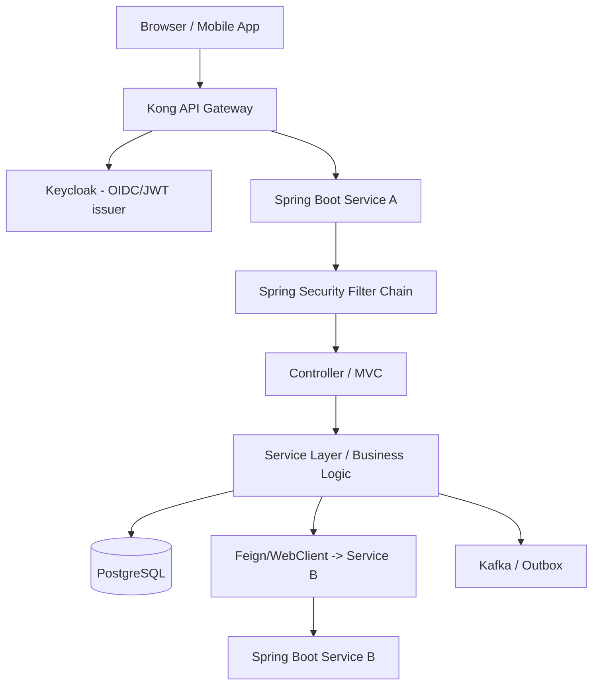

The layers, in order, are:

| # | Layer | Owns | Typical failures |
|---|-------|------|------------------|
| 0 | Client (browser/mobile) | CORS, cookies, JWT storage | preflight, SameSite, mixed content |
| 1 | DNS / Service Discovery | name → IP | `UnknownHostException`, stale records |
| 2 | TCP/IP | sockets, ports | connection refused/reset, port exhaustion |
| 3 | TLS | certs, handshake | expired cert, hostname mismatch |
| 4 | Kong Gateway | routing, plugins, auth | 404 route, 401 plugin, 502 upstream |
| 5 | Keycloak | tokens, realms | invalid issuer/audience, key rotation |
| 6 | HTTP protocol | status, headers | 413/431/415, chunking |
| 7 | Spring Security | authn/authz | 401/403, role mapping |
| 8 | Spring MVC | mapping, parsing | 404/405/400, converters |
| 9 | Business logic | correctness | idempotency, sagas |
| 10 | Data / downstream | DB, Service B | deadlocks, timeouts |
| 11 | Infra (K8s) | pods, networking | CrashLoop, OOM, NetworkPolicy |

Read that table not as a list to memorize but as a *map of jurisdictions*. Each row is a separate authority with the power to stop a request, and crucially, each authority tends to stop requests in a characteristic way that leaves a characteristic fingerprint. DNS failures produce `UnknownHostException` and happen *before* any connection exists. TCP failures produce "connection refused" or "connection reset" and happen when a connection is being established or has just died. TLS failures produce certificate and handshake errors and happen during the encrypted handshake, before any HTTP byte is exchanged. The gateway produces 404s for routing, 401s for authentication plugins, and 5xx for upstream problems, and it stamps its own `Server: kong` header on everything it emits. Spring Security produces 401 and 403 with a `WWW-Authenticate` header. Your own code produces 500s with a stack trace. Because each layer fails in its own dialect, the *form* of the error is usually enough to point you at the right jurisdiction — long before you understand the root cause. Training yourself to read that form, rather than jumping straight to "the service is broken," is what separates a five-minute diagnosis from a five-hour one.

A second insight from the table: **failure propagates upward, but causes live downward.** A user sees a symptom at the top of the stack (a spinning browser, a 502 page), but the cause almost always originates lower down (an unready pod, a saturated pool, an expired cert). Your investigation therefore moves in the opposite direction to the symptom: you observe at the top, then descend layer by layer until you find the lowest layer that is misbehaving — because that lowest misbehaving layer is the cause, and everything above it is just the failure echoing upward. This is why "restart the service" so often appears to work yet fixes nothing: restarting clears the *echo* (the saturated threads, the stale cache) without touching the *cause* (the rotated key, the bad config), so the incident returns.

### 1.2 The Universal Troubleshooting Workflow

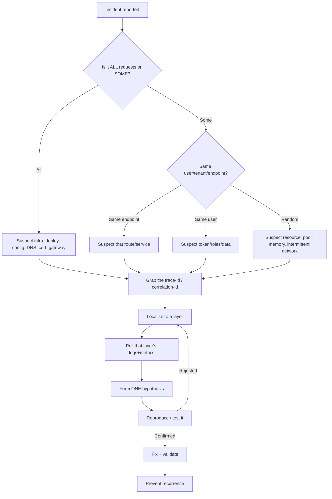

The workflow above looks like a flowchart, but its real purpose is to impose *discipline* on the panicky early minutes of an incident, when the temptation is to start randomly poking at the service you happen to suspect. The flow forces you to first measure the *shape* of the problem (all requests or some? which users? since when?), then capture a concrete piece of evidence you can follow (a trace ID), then narrow to a single layer, then form exactly *one* hypothesis and test it before moving on. The reason for "exactly one hypothesis" is subtle but important: in distributed systems, several things often look wrong simultaneously (high latency *and* elevated errors *and* a saturated pool), and if you try to fix all of them at once you will never know which change actually mattered, and you risk introducing new problems while chasing the old one. One hypothesis, one test, one conclusion — then loop.

**The five questions that localize 80% of incidents.** Each of these questions is a *discriminator*: a single answer that eliminates whole branches of the search tree, which is exactly what you want when the clock is running.

1. **Blast radius — is it all requests or only some?** This is the most powerful first question because it cleanly separates two fundamentally different worlds. If *every* request is failing, the cause is almost always something global and infrastructural: a bad deploy, an expired certificate, a DNS outage, a gateway misconfiguration, a database that is down. These are shared resources, and when a shared resource breaks, everyone feels it at once. If only *some* requests fail, the cause is more specific: a particular endpoint with a bug, a particular user whose token or data is malformed, or an intermittent resource problem (a pool that saturates only under load). The mental move is: "all" points you at infrastructure and configuration, "some" points you at code and data.

2. **Timing — when did it start, and what changed at that moment?** Distributed systems do not usually break spontaneously; they break because *something changed*. The overwhelming majority of incidents begin at a deploy, a configuration push, a certificate expiry, a credential rotation, or a sudden change in traffic. So the instant you know the start time, you should overlay it on every change log you have — Helm release history, GitOps commits, Kong configuration diffs, Keycloak admin events, certificate renewal schedules. A failure that began at 14:05 and a deploy that completed at 14:04 are almost certainly the same event. This question alone resolves a large fraction of incidents before any deep technical investigation.

3. **Boundary — at which hop does the request actually die?** This is where distributed tracing earns its keep. Instead of guessing which service is at fault, you follow a single failing request through the system and watch precisely where it stops or where its latency balloons. The span that errored, or the span that consumed most of the wall-clock time, is your prime suspect. Without a trace you are reduced to inference; with a trace you have direct observation.

4. **Status code — what is the exact status, and which component emitted it?** "It returns a 401" is not yet a useful fact, because a 401 can come from Kong's JWT plugin, from Kong's OIDC plugin, or from Spring Security's resource server — three different components with three different fixes. The *exact* code plus the *emitter* (identified by headers and body shape, see §1.3) turns a vague symptom into a precise location. Treat the combination of "status code + emitter" as the coordinates of the failure.

5. **Recent change — what is the diff against the last known-good state?** Even when timing is unclear, you can often find the cause by diffing the current system state against the last state you know worked: `git log` on the service, Helm or Argo release history, a `deck diff` against the live Kong configuration, the Keycloak admin event stream. Configuration drift — a value quietly changed by hand, a secret rotated without its consumers, a route edited in an emergency and never reverted — is one of the largest single categories of production incidents, and this question is how you catch it.

> **Golden rule:** Never debug code until you have localized the failure to a layer. A 401 in the browser may originate at Kong (its JWT plugin rejected the token), at Keycloak (it rotated a key or the audience is wrong), or at Spring Security (its resource-server validator failed) — three completely different layers with three completely different fixes. Opening your IDE and reading controller code before you know *which* of those three rejected the request is the most common way engineers waste the first hour of an incident.

### 1.3 Who Emitted the Error?

A surprising amount of wasted time in incidents comes from debugging the wrong component entirely — an engineer spends forty minutes reading `account-service` logs for a 401 that Kong's OIDC plugin generated and the request never even reached `account-service`. The cure is a simple habit: before forming any theory, identify *who actually produced the response you are looking at*. Every component in the chain leaves fingerprints on the responses it emits, and once you learn to read those fingerprints you can place the failure in the correct jurisdiction in seconds.

The reason this works is that each component constructs error responses using its own code and its own conventions. Kong is built on OpenResty/nginx and stamps a `Server: kong/3.x` header on everything it generates, returns errors as a small JSON object shaped like `{"message":"..."}`, and attaches an `X-Kong-Request-Id`. A Spring Boot application that hits its default error path returns the "whitelabel" JSON shape `{"timestamp","status","error","path"}`, or, if you have configured RFC-7807 problem details, the `{"type","title","status","detail"}` shape. Spring Security's resource server, when it rejects a bearer token, adds a `WWW-Authenticate: Bearer error="invalid_token"` header with a human-readable `error_description` that often names the exact validation that failed (expired, bad issuer, bad audience, bad signature). An nginx ingress controller that fails before reaching any application returns an HTML error page, not JSON at all. These differences are not cosmetic — they are a reliable map from "what the response looks like" to "which layer made the decision." The table below is your decoder ring; internalize it, because reading the emitter first is one of the highest-leverage habits in production debugging.

| Clue | Emitter |
|------|---------|
| `Server: kong/3.x` header, `{"message":"..."}` body | Kong |
| `WWW-Authenticate: Bearer error="invalid_token"` | Spring Security resource server (or Kong OIDC) |
| Whitelabel `{"timestamp","status","error","path"}` | Spring Boot |
| HTML error page with nginx | Ingress controller / nginx |
| `request_id` in JSON | Kong (`X-Kong-Request-Id`) |

```bash
# Always look at the full response headers first
curl -i -sS https://api.bank.example.com/accounts/123 | sed -n '1,25p'
```

---

## 2. End-to-End Request Flow Analysis

A canonical authenticated request: *"Get my account balance."*

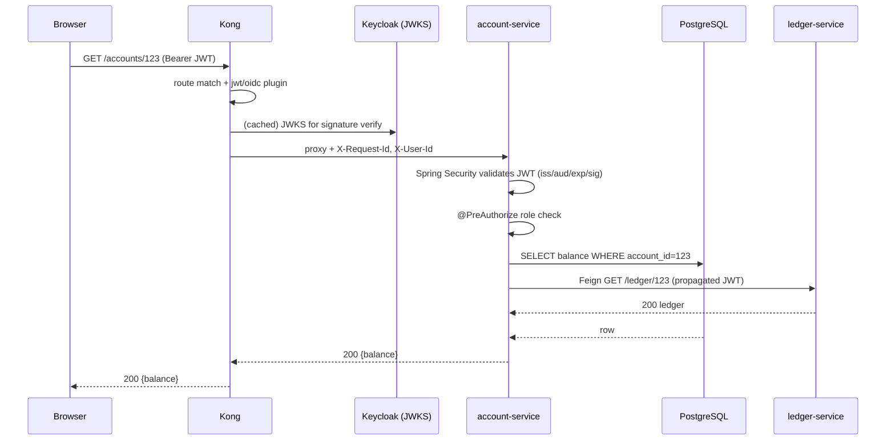

Before we walk the stages, internalize what this diagram is really showing: a single user action — "show me my balance" — is not one network call but a *cascade* of them, and the user's perceived latency and success depend on every link in that cascade holding. The browser must resolve a name and complete a TLS handshake before it can even speak to Kong. Kong must match a route, run its authentication plugins (which may themselves require a cached call to Keycloak's JWKS endpoint), and then proxy to the right pod. The pod's Spring Security filter chain must independently re-validate the same token (the gateway and the application do *not* trust each other blindly — defense in depth means the token is checked twice, by two different validators, against the same Keycloak). Only then does your controller run, query its own database, and very often make a *further* synchronous call to another service like `ledger-service`, which repeats this entire validation story one level deeper. This recursion is the essence of microservices: every "simple" request is a tree of sub-requests, and a failure in any leaf propagates back up as a failure of the whole.

The reason we analyze the flow stage by stage is that **each stage answers a different diagnostic question, and the questions are not interchangeable.** "Did the request reach Kong at all?" is answered by DNS and TLS evidence at Stage 0. "Did Kong accept and route it?" is answered by Kong's headers and logs at Stage 1. "Did the token survive validation?" is a Keycloak-and-Spring-Security question at Stages 2 and 3. Each stage below therefore lists not just *what can fail* but *how you would see that failure, which logs and metrics carry the evidence, and which commands extract it* — because in an incident, knowing that "the token might be expired" is useless unless you also know the one `curl` or `kubectl` command that proves or disproves it in ten seconds.

### Stage 0 — Browser → Kong

This is the stage that exists *before your system does anything*, and it is the stage engineers most often forget, because it happens on the client and in the network rather than on a server they control. For the request to even arrive at Kong, three independent things must succeed in sequence: the browser must resolve the public hostname to an IP via public DNS, it must complete a TLS handshake with whatever terminates TLS at your edge (a cloud load balancer or Kong itself), and — for any non-trivial cross-origin API call — it must first satisfy the browser's CORS preflight. A failure here has a telltale signature: in the browser's Network tab the request shows as *failed with no response at all* (a red "failed" with no status code) when the problem is DNS or TLS, because the browser never received an HTTP response to show you. If you instead see a real status code (even a 4xx or 5xx), then congratulations — the request *did* reach Kong, and you can move your attention inward to Stage 1. That single distinction — "no response" versus "a response with a status" — is the fork that tells you whether you are debugging the network or debugging the system.

- **Fails:** DNS of public host, TLS to the LB, CORS preflight, expired/absent JWT.
- **See it:** browser DevTools → Network → Headers/Timing; `Status (failed)` with no response = network/TLS, response with status = it reached Kong.
- **Logs:** Kong access logs (`kong_access`), CDN/WAF logs.
- **Metrics:** Kong `kong_http_requests_total{service}` , LB 4xx/5xx rate.
- **Commands:**
```bash
curl -v https://api.bank.example.com/accounts/123 -H "Authorization: Bearer $TOKEN"
nslookup api.bank.example.com
openssl s_client -connect api.bank.example.com:443 -servername api.bank.example.com </dev/null 2>/dev/null | openssl x509 -noout -dates
```

### Stage 1 — Kong routing & plugins

Once a request reaches Kong, it enters a small, deterministic pipeline that you must understand to debug, because Kong makes *several independent decisions in a fixed order*, and a failure at any one of them produces a different status code. First Kong performs **routing**: it compares the incoming request's host, path, and method against its configured routes and picks the one that matches. If nothing matches, you get a 404 *from Kong* (not from your app — the request never reaches it). If a route matches, Kong then runs that route's **plugins in priority order** — authentication plugins (JWT or OIDC) run early, because there is no point doing expensive work for an unauthenticated caller; then authorization plugins (ACL); then traffic-control plugins (rate limiting); then transformation plugins that rewrite headers or bodies. Each plugin can short-circuit the request: the JWT plugin can reject with 401, the ACL plugin with 403, the rate limiter with 429. Only if the request survives every plugin does Kong **proxy** it to the chosen upstream, and *that* is where 502/503/504 live — 502 when the upstream refuses or returns garbage, 503 when no healthy upstream target exists, 504 when the upstream is alive but too slow. The single most useful realization here is that the *status code tells you which stage of Kong's pipeline rejected the request*, and Kong's headers (`Server: kong`, `X-Kong-Upstream-Status`, `X-Kong-Request-Id`) confirm that Kong, not your application, made the call.

- **Fails:** no matching route (404), JWT/OIDC plugin rejects (401), ACL plugin (403), rate-limit (429), upstream DNS/health (502/503), upstream timeout (504).
- **See it:** response header `Server: kong/3.x`, `X-Kong-Upstream-Status`, `X-Kong-Request-Id`.
- **Logs:** `kubectl logs -n kong deploy/kong -c proxy`.
- **Metrics:** `kong_upstream_latency_ms`, `kong_request_latency_ms`, status code counters.
- **Commands:**
```bash
# Inspect the route/service that matched
http :8001/routes  # Kong Admin API
curl -s localhost:8001/routes/accounts-route | jq
```

### Stage 2 — Keycloak token validation

It is worth being precise about what "Keycloak validation" actually means at request time, because Keycloak is usually *not* in the hot path of every request — and misunderstanding this leads people to blame Keycloak for failures it had nothing to do with. Keycloak's job is to *issue* tokens during login or client-credentials flows; once a token is issued, the *validation* of that token on each subsequent request is performed by the resource servers (Kong's plugin and Spring Security) using Keycloak's *public keys*, which they fetch once from Keycloak's JWKS endpoint and cache. So at request time, the validator checks the token's signature against a cached public key, and checks the standard claims (`iss`, `aud`, `exp`, `nbf`) using only local computation — Keycloak is not contacted at all. This is by design: it makes validation fast and keeps Keycloak from being a per-request bottleneck. The failures that *do* trace back to Keycloak are therefore failures of *consistency between issuance and validation*: the issuer URL embedded in the token doesn't match what the validator expects, the audience the token carries isn't what the validator requires, Keycloak rotated its signing keys so the cached public keys no longer match, or the clocks of the issuing and validating machines have drifted apart far enough that a token appears expired or not-yet-valid. When you see a token-validation failure, your investigation is really "where did issuance and validation disagree?", and the discovery document plus the JWKS endpoint (the commands below) are how you compare the two sides.

- **Fails:** issuer/audience mismatch, key rotation (JWKS), clock skew, expired token.
- **See it:** `WWW-Authenticate: Bearer error="invalid_token", error_description="An error occurred while attempting to decode the Jwt: ..."`.
- **Logs:** Keycloak server log, **admin events**, login events.
- **Metrics:** Keycloak `keycloak_logins`, token endpoint latency.
- **Commands:**
```bash
curl -s https://keycloak/realms/bank/.well-known/openid-configuration | jq .issuer,.jwks_uri
curl -s https://keycloak/realms/bank/protocol/openid-connect/certs | jq '.keys[].kid'
```

### Stage 3 — Spring Security filter chain

Here is the part that confuses people new to this architecture: *Kong already validated the token, so why does Spring Security validate it again?* The answer is defense in depth. In a zero-trust internal network — which is what a regulated bank must assume — a service should never assume that "if a request reached me, the gateway must have authenticated it," because an attacker who gains a foothold inside the cluster could call the service directly, bypassing Kong entirely. So Spring Security independently re-validates the token at the application boundary, using the same Keycloak public keys but its own validator chain. Mechanically, the request enters Spring's `SecurityFilterChain`, a pipeline of servlet filters that execute in a strict order: the `BearerTokenAuthenticationFilter` extracts and decodes the JWT, runs the issuer/audience/expiry/signature validators, and on success constructs an `Authentication` object representing the caller; later the `AuthorizationFilter` consults that `Authentication` and decides whether the caller's authorities satisfy the endpoint's access rules. The crucial diagnostic distinction lives in *which* filter fails: a failure in the authentication filter yields 401 (we could not establish who you are), while a failure in the authorization filter yields 403 (we know exactly who you are, but you lack the required role or scope). Turning on `DEBUG` logging for `org.springframework.security` prints the filter-by-filter trail, which tells you precisely which gate slammed shut — and that single piece of information usually points straight at the fix.

- **Fails:** JWT decode, audience validator, role/authority mapping (403), CSRF for non-GET.
- **See it:** enable `logging.level.org.springframework.security=DEBUG`.
- **Logs:** app logs with the security filter trail.
- **Metrics:** `http_server_requests_seconds_count{status="401|403"}`.

### Stage 4 — Controller / MVC

By the time the request clears security, it is an authenticated, authorized HTTP request that Spring's `DispatcherServlet` must now route to a specific Java method and turn into typed objects your code can use. Three things happen here, each with its own failure mode. First, **handler mapping**: the `DispatcherServlet` matches the request's path and method to exactly one `@RequestMapping` method; if no method matches the path you get a 404, and if a method matches the path but not the HTTP verb you get a 405 (which is why a 405 is actually *good news* — it proves the path is mapped, you just used the wrong method). Second, **message conversion and argument binding**: Spring uses `HttpMessageConverter`s to deserialize the request body (usually JSON via Jackson) into your DTO and to bind path variables and query parameters to method arguments; a mismatch between the request's `Content-Type` and what the handler consumes yields 415, and an `Accept` header the handler cannot satisfy yields 406. Third, **validation**: if the handler declares `@Valid`, the bean-validation constraints run and any violation becomes a 400. Understanding this ordered pipeline is what lets you read a 400/404/405/406/415 as a *position* in the request's processing rather than a vague "the app didn't like it."

- **Fails:** mapping conflict (404/405), bean validation (400), message converter (415/406).
- **See it:** `DispatcherServlet` TRACE, `@ControllerAdvice` logs.

### Stage 5 — Service / business logic

Once the request reaches your service layer, the failures stop being about transport and start being about *correctness under concurrency and partial failure* — and in banking these are the failures that actually cost money rather than merely annoy users. Nothing here will show up as a neat 4xx; instead you get duplicated payments, balances that don't reconcile, sagas that debit one account and fail to credit another, and race conditions that only appear under real production concurrency. These failures are insidious precisely because the HTTP layer reports success: the request returned 200, the user got a response, and yet the *invariant* (money is conserved, an operation happens exactly once) was violated somewhere in the orchestration. Debugging this stage means reading domain logs and span timings to reconstruct the *order* in which concurrent operations interleaved, and the prevention lives in idempotency keys, optimistic/pessimistic locking, the outbox pattern, and explicit compensation — all covered in depth in §20 and §21.

- **Fails:** idempotency, saga/compensation, concurrency.
- **See it:** domain logs + trace span timings.

### Stage 6 — DB / downstream

The final stage is where your service hands off to its dependencies — PostgreSQL and other microservices — and it is overwhelmingly the stage that produces the slow, mysterious 504s. The key internal fact to understand is that a Spring Boot service does not open a fresh database connection for every query; it borrows one from a fixed-size pool (HikariCP, default size 10). When every connection in that pool is in use, additional requests *queue*, waiting for one to be returned, and if the wait exceeds the configured timeout the request fails. This matters enormously because connections get held not just during the SQL itself but during *anything done inside the transaction* — including a slow remote call to another service. So a downstream `ledger-service` that hangs for 30 seconds, called from inside a transaction, will pin a database connection for those 30 seconds; do that a few times concurrently and the entire pool is exhausted, at which point requests that have nothing to do with `ledger-service` also start failing because they cannot get a connection. This is the mechanism behind the classic "504 with an idle-looking database": the database is fine, but your *access to it* is starved. The metrics `hikaricp_connections_pending` (requests waiting for a connection) and `hikaricp_connections_active` (connections in use) are the gauges that reveal this, and the PostgreSQL `pg_stat_activity` and `pg_locks` views tell you whether the connections are blocked on slow queries, lock waits, or downstream calls.

- **Fails:** connection pool exhaustion (HikariCP), lock waits/deadlocks, downstream Feign/WebClient timeouts.
- **Metrics:** `hikaricp_connections_pending`, `hikaricp_connections_active`, downstream client timers.
- **Commands:**
```sql
SELECT * FROM pg_stat_activity WHERE state <> 'idle' ORDER BY query_start;
SELECT * FROM pg_locks WHERE NOT granted;
```

> **Practice:** For every incident, write a one-line *flow narrative*: "Request reached Kong (200 route), Kong got 504 from upstream account-service, account-service was blocked on Hikari (0 free connections) because ledger-service Feign calls hung at 30s." That narrative is your RCA skeleton.

---
## 3. Client-Side Problems

The browser is a layer too — and in banking it is the single most security-restricted environment your code runs in. A large fraction of incidents that get filed as "the API is broken" are in fact the browser *correctly enforcing a security policy* that the backend violated or failed to satisfy. The trap is that these failures are invisible from the server's perspective: the backend often did exactly what it was asked, returned a perfectly good response, and yet the browser refused to hand that response to your JavaScript. To debug this layer you have to stop thinking like a server engineer and start thinking like the browser's security sandbox, which treats every piece of JavaScript as potentially hostile and enforces a web of policies — same-origin policy, CORS, cookie scoping rules, mixed-content blocking, content-security policy — designed to protect the user even from the site's own code. The sections below walk through the policies that most often bite banking front-ends.

### 3.1 CORS (Cross-Origin Resource Sharing)

**Mental model — CORS is the browser asking a foreign server for written permission before letting your JavaScript read its replies.** The foundation is the *same-origin policy*: by default, JavaScript running on `https://app.bank.example.com` is allowed to read responses only from that exact same origin (same scheme, host, and port). This rule exists because of a real attack — without it, a malicious page you happened to open in another tab could use your logged-in session to silently call `https://api.bank.example.com`, read your account data, and exfiltrate it, all using *your* cookies. The same-origin policy slams that door shut. But modern banking front-ends legitimately *need* to call an API on a different origin (`app.bank` calling `api.bank`), so the browser provides a controlled exception: CORS. CORS is the protocol by which the *server* tells the *browser* "yes, I am willing to let JavaScript from this particular origin read my responses," by sending `Access-Control-Allow-*` headers. If those headers are absent or wrong, the browser blocks JavaScript from reading the response — even though the network call itself succeeded and the server happily processed it.

This is the key to the single most confusing CORS symptom: **it works in `curl` and Postman but fails in the browser.** The reason is that CORS is enforced *only by browsers*, as a protection for end users. `curl` and Postman are not browsers; they have no same-origin policy, no concept of an "origin" to protect, so they simply make the request and show you the response regardless of CORS headers. When an engineer says "the endpoint works, I tested it with Postman," they have proven that the *server* works but have learned *nothing* about whether the browser will permit the call — because the entire CORS mechanism that the browser enforces was never exercised. To reproduce a browser CORS failure you must send the `Origin` header (and for preflight, the `Access-Control-Request-*` headers) yourself, which is what the diagnosis `curl` below does.

It is also essential to understand the **preflight request**, because it is where most CORS failures actually occur. For any request that is not "simple" — and a banking API call carrying an `Authorization` header and `Content-Type: application/json` is never simple — the browser does not send your request directly. Instead it first sends a separate `OPTIONS` request to the same URL, called the *preflight*, which asks the server: "I am about to send a `GET` (or `POST`) from origin `app.bank` with headers `Authorization` and `Content-Type`; will you allow that?" The server must answer this `OPTIONS` with the matching `Access-Control-Allow-Origin`, `Access-Control-Allow-Methods`, and `Access-Control-Allow-Headers`, and it must do so *without requiring authentication* — because the browser deliberately sends the preflight with no credentials and no `Authorization` header. This is the origin of one of the nastiest CORS bugs in gateway-fronted systems: the gateway is configured to require a valid JWT on every request, so it rejects the unauthenticated `OPTIONS` preflight with a 401, the browser sees the preflight fail, and it never sends the real request at all. From the backend's logs it looks like "we just got some OPTIONS requests"; from the user's browser the app is completely broken. The fix is to ensure `OPTIONS` preflights are answered by the CORS layer (Kong's CORS plugin or a `permitAll` rule for `OPTIONS` in Spring) *before* any authentication runs.

Finally, understand *where* CORS should be owned, because the most common production CORS incident is **double headers**. If both Kong and Spring Boot are configured to add CORS headers, a response can end up with `Access-Control-Allow-Origin` listed *twice*, and the browser rejects a response with duplicate CORS headers as invalid — so adding "more CORS config" actually breaks it. CORS must have exactly one owner in your architecture, usually the gateway, and the other layer must be silent. With that mental model in place, the symptoms, causes, and fixes below read as obvious consequences rather than arbitrary rules.

**What it is:** Browser blocks a JS `fetch`/XHR to a different origin unless the server returns the right `Access-Control-Allow-*` headers, after first satisfying an `OPTIONS` preflight.

**Symptoms**
- Console: `Access to fetch at 'https://api.bank...' from origin 'https://app.bank...' has been blocked by CORS policy: No 'Access-Control-Allow-Origin' header is present on the requested resource.`
- Network tab shows an `OPTIONS` request that **succeeds with 200/204 but the actual GET never fires**, or the GET fires and returns data but JS can't read it.
- `curl` works fine (no Origin enforcement) — a classic "works in curl, fails in browser."

**Root causes**
1. CORS configured in *both* Kong and Spring Boot → duplicated/conflicting headers (`Access-Control-Allow-Origin` appears twice → browser rejects).
2. `Access-Control-Allow-Origin: *` together with `Access-Control-Allow-Credentials: true` (illegal combination).
3. Preflight (`OPTIONS`) blocked by auth — the gateway requires a JWT on `OPTIONS`, but browsers never send credentials on preflight.
4. Missing `Access-Control-Allow-Headers: Authorization, Content-Type, X-Request-Id`.

**Diagnosis**
```bash
# Simulate the preflight exactly as the browser would
curl -i -X OPTIONS https://api.bank.example.com/accounts/123 \
  -H "Origin: https://app.bank.example.com" \
  -H "Access-Control-Request-Method: GET" \
  -H "Access-Control-Request-Headers: authorization"
# Look for a SINGLE Access-Control-Allow-Origin echoing the Origin, and Allow-Headers including authorization
```

**Solutions**

Decide **one** owner of CORS — usually the gateway. Disable Spring CORS if Kong owns it.

Kong CORS plugin (route-scoped):
```yaml
plugins:
  - name: cors
    route: accounts-route
    config:
      origins: ["https://app.bank.example.com"]
      methods: ["GET","POST","PUT","DELETE","OPTIONS"]
      headers: ["Authorization","Content-Type","X-Request-Id"]
      exposed_headers: ["X-Request-Id"]
      credentials: true
      max_age: 3600
      preflight_continue: false   # Kong answers OPTIONS itself
```

If Spring owns it instead:
```java
@Bean
CorsConfigurationSource corsConfigurationSource() {
    CorsConfiguration c = new CorsConfiguration();
    c.setAllowedOrigins(List.of("https://app.bank.example.com")); // never "*" with credentials
    c.setAllowedMethods(List.of("GET","POST","PUT","DELETE","OPTIONS"));
    c.setAllowedHeaders(List.of("Authorization","Content-Type","X-Request-Id"));
    c.setAllowCredentials(true);
    c.setMaxAge(3600L);
    var src = new UrlBasedCorsConfigurationSource();
    src.registerCorsConfiguration("/**", c);
    return src;
}
// And in the filter chain: http.cors(Customizer.withDefaults());
// Make /**/OPTIONS permitAll so preflight is never auth-challenged:
// .authorizeHttpRequests(a -> a.requestMatchers(HttpMethod.OPTIONS, "/**").permitAll())
```

**Prevention:** single CORS owner, contract test that asserts exactly one `Access-Control-Allow-Origin` header, and a synthetic preflight check in CI.

### 3.2 Cookies, SameSite & Credentials

**Mental model — a cookie is a wristband the browser re-shows automatically on every visit, and `SameSite` decides whether the browser will show it when arriving from a different venue.** Cookies were designed so the server could set a small token once and have the browser *automatically attach it* to every subsequent request to that domain, which is exactly what makes a login session work — and also exactly what makes Cross-Site Request Forgery (CSRF) possible, because the browser will attach the cookie even when the request was triggered by a malicious third-party site. The `SameSite` attribute is the browser's defense: `SameSite=Strict` or the modern default `SameSite=Lax` tells the browser "only attach this cookie when the request originates from the same site," which neutralizes CSRF but also means the cookie will *not* be sent on genuine cross-site API calls. In a banking architecture where the SPA lives on `app.bank.example.com` and the API on `api.bank.example.com` (treated as a different site), a session cookie marked `Lax` simply will not accompany the XHR to the API, so the API sees an unauthenticated request and bounces the user back to login. To deliberately allow a cookie cross-site you must mark it `SameSite=None`, and browsers require that any `SameSite=None` cookie *also* be `Secure` (HTTPS-only) — so the moment TLS is terminated incorrectly or a request slips onto HTTP, the cookie silently vanishes. This interplay between `SameSite`, `Secure`, and the HTTPS chain is why cookie-based auth across subdomains is fragile, and why most banking APIs prefer bearer tokens in the `Authorization` header (which carry no automatic-attachment, no CSRF exposure, and no `SameSite` puzzle) for API traffic, reserving cookies for the interactive OIDC login flow only.

**Symptoms**
- After login the user is bounced back to login (session cookie not sent).
- Console: `Cookie "KEYCLOAK_SESSION" has been rejected because it is in a cross-site context and its SameSite is Lax`.
- Works on same domain, breaks when `app.bank` calls `api.bank` as a different site.

**Root causes**
- `SameSite=Lax` (default) blocks cookies on cross-site XHR; need `SameSite=None; Secure`.
- `Secure` cookie sent over HTTP (mixed content / TLS terminated early).
- Cookie `Domain`/`Path` scoped too narrowly.

**Solutions**
- Use bearer tokens (Authorization header) for API calls; reserve cookies for the OIDC login flow.
- If cookies must be cross-site: `Set-Cookie: SESSION=...; SameSite=None; Secure; HttpOnly`.
- Keycloak: ensure it runs behind HTTPS (`KC_PROXY=edge`, `X-Forwarded-Proto: https`) so it issues `Secure` cookies correctly.

### 3.3 JWT Storage in the Browser

Where the front-end keeps the access token is one of the most consequential security decisions in a banking SPA, and it is genuinely a *trade-off with no perfect answer* — which is why the table exists rather than a single recommendation. The tension is between two different attack classes. If you store the token somewhere JavaScript can read it (`localStorage` or `sessionStorage`), then any successful Cross-Site Scripting (XSS) attack — a single injected script, perhaps via a compromised third-party dependency — can read the token and exfiltrate it, handing the attacker the user's full banking session. That is a catastrophic, silent compromise. If instead you store the token in an `HttpOnly` cookie, JavaScript *cannot* read it (so XSS cannot steal it directly), but now the browser attaches it automatically to requests, which reintroduces CSRF exposure that you must separately mitigate with `SameSite` and CSRF tokens. So the choice is essentially "which attack do I have stronger defenses against?" For a regulated bank the usual resolution is a hybrid: keep a *short-lived* access token (2–5 minutes) in JavaScript memory only — never persisted, so a page reload loses it and it is never sitting in storage to be stolen — and keep the long-lived *refresh* token in an `HttpOnly; Secure; SameSite=Strict` cookie that JavaScript can never touch. A silent background refresh swaps the short access token for a new one before it expires. This way an XSS attack can at most steal a token that dies in minutes, and the powerful refresh token is permanently out of JavaScript's reach. The table summarizes the raw trade-off; the banking guidance below is the hybrid that balances it.

**The trade-off**

| Storage | XSS risk | CSRF risk | Notes |
|---------|----------|-----------|-------|
| `localStorage` | High (JS-readable) | Low | convenient, common, but a single XSS leaks the token |
| `sessionStorage` | High | Low | cleared on tab close |
| `HttpOnly cookie` | Low | High (mitigate with SameSite + CSRF token) | preferred for banking |

**Banking guidance:** Prefer short-lived access tokens (2–5 min) in memory + refresh token in an `HttpOnly; Secure; SameSite=Strict` cookie, with silent refresh. Never store refresh tokens in `localStorage`.

### 3.4 Preflight Requests & Browser Header Limits

Building on the CORS mechanics of §3.1, it's worth being precise about *when* the browser inserts a preflight, because the rule directly affects both latency and the auth-on-OPTIONS bug. The browser distinguishes "simple" requests — roughly, GET/POST/HEAD with only a short list of safe headers and a basic content type — from everything else. A simple request is sent directly. Anything *non*-simple triggers the preflight `OPTIONS` round-trip first. The catch for banking front-ends is that *every realistic authenticated API call is non-simple*: it carries an `Authorization` header (not on the safe list), usually a custom correlation header like `X-Request-Id`, and `Content-Type: application/json` (not a "simple" content type). So in practice essentially all your API calls pay for a preflight, which has two consequences worth designing around. First, *latency*: every call is now two round-trips instead of one, which matters for chatty UIs and high-latency mobile networks — mitigate it by setting a generous `Access-Control-Max-Age` so the browser *caches* the preflight result and skips it on subsequent identical calls. Second, the *auth-on-OPTIONS trap* (§3.1): since the preflight is unauthenticated by design, your gateway and security config must let `OPTIONS` through without a token, or every single API call dies at its preflight.

- **Preflight triggers** when the request is "non-simple": custom headers (e.g., `Authorization`, `X-Request-Id`), `Content-Type: application/json`, or methods other than GET/POST/HEAD. Expect an extra `OPTIONS` round-trip — budget for its latency.
- **Header size:** browsers and servers cap header size (~8KB common). A fat JWT with many roles can blow past it → **431** (see §9). Symptom: works for users with few roles, fails for admins with dozens of group memberships.

### 3.5 Browser Caching

Caching is a performance optimization that the browser, intermediary proxies, and CDNs all participate in, and the whole machinery is governed by HTTP headers (`Cache-Control`, `ETag`, `Expires`). In most web applications this is purely beneficial; in banking it is a *correctness hazard*, because a cached financial figure is not a stale convenience — it is a wrong number shown to a customer about their money. The mechanism to understand is that when a response lacks explicit cache-control directives, the browser (and especially aggressive service workers or shared proxies) may apply *heuristic caching*, deciding on its own that a `GET /accounts/123/balance` looks cacheable and serving an old copy on the next view. Worse, a service worker installed for offline support can cache API responses and even make a `POST` *appear* to do nothing because it served a cached result. The defense is to make sensitive endpoints explicitly non-cacheable with `Cache-Control: no-store` (which means "do not write this to any cache at all," stronger than `no-cache`, which means "you may store it but must revalidate"). Treat every endpoint that returns balances, transactions, limits, or PII as `no-store` by default, and only opt specific, genuinely-static resources into caching.

**Symptoms:** stale balance shown; `304 Not Modified` returned when data actually changed; POST appears to "do nothing" (served from cache via an aggressive SW).

**Root causes:** missing `Cache-Control: no-store` on sensitive endpoints; ETag mismatch; a service worker caching API responses.

**Solution (banking default):**
```java
// Sensitive financial data must never be cached
response.setHeader("Cache-Control", "no-store, no-cache, must-revalidate, private");
response.setHeader("Pragma", "no-cache");
```
Or globally via Spring Security: `http.headers(h -> h.cacheControl(Customizer.withDefaults()));`

### 3.6 Mixed Content

Browsers enforce a rule that a page loaded over HTTPS may not pull in resources over plain HTTP, because a single insecure sub-request would undermine the security of the whole encrypted page (an attacker could tamper with that one HTTP response). So the browser *blocks* the mixed-content request outright. The reason this surfaces as a *backend* bug rather than a front-end typo is the **TLS-termination split** common in gateway architectures: TLS is terminated at the edge (the load balancer or Kong), and the request travels from there to your Spring service over plain HTTP *inside* the cluster. Your service, seeing an HTTP request, naturally believes the original client spoke HTTP — so when it generates an absolute URL or issues a redirect, it builds an `http://` URL, which the browser then refuses to load on its HTTPS page. The application isn't "wrong" in isolation; it's just *unaware* that the *original* request was HTTPS, because that fact was lost when TLS terminated at the edge. The fix is to *propagate the original scheme* via the `X-Forwarded-Proto: https` header (which the gateway must set) and configure the application to *trust* it (`server.forward-headers-strategy=framework` in Spring Boot, and the equivalent proxy-awareness in Keycloak), so the framework reconstructs HTTPS URLs and redirects. This same forwarded-header awareness is what fixes the §3.2 `Secure`-cookie problem and is foundational for any service running behind a TLS-terminating proxy — the general principle being "never hardcode the scheme, and make the app honor the forwarded protocol."

**Symptom:** `Mixed Content: The page at 'https://app...' was loaded over HTTPS, but requested an insecure resource 'http://api...'. This request has been blocked.`

**Root cause:** hardcoded `http://` URL, or a backend redirect to `http://` because Spring/Keycloak didn't see `X-Forwarded-Proto: https` behind the gateway.

**Fix:** `server.forward-headers-strategy=framework` (Spring Boot) so it honors `X-Forwarded-Proto`; ensure Kong/Ingress sets it; never hardcode scheme.

---
## 4. Kong Gateway Troubleshooting

**Mental model — Kong is the airport security checkpoint for your entire system.** Every passenger (request) entering the secure area must pass through it, and it performs a fixed sequence of checks: it confirms you are in the right terminal (routing — does any gate actually serve this destination?), it inspects your passport and boarding pass (authentication — is this a valid, unexpired JWT from a trusted issuer?), it checks you are cleared for this particular flight (authorization — does your token grant access to this route?), it enforces capacity limits (rate limiting — have you exceeded your quota?), and only then does it wave you through to the gate (your upstream service). Because *everyone* passes through this one checkpoint, when the checkpoint malfunctions it looks like the entire airport is broken — every flight appears delayed even though the planes are fine. This is why a Kong misconfiguration is so alarming and so easy to misdiagnose: a single bad route or a single misconfigured plugin can make dozens of healthy backend services appear simultaneously down. The skill that saves you is learning to read Kong's fingerprints — its `Server: kong` header, its `X-Kong-*` headers, its structured logs — so you can tell instantly whether the checkpoint rejected the passenger or the passenger reached the gate and something went wrong there.

**Why a gateway exists at all** is worth a moment, because understanding the purpose clarifies the failure modes. Before API gateways, each microservice had to implement its own authentication, rate limiting, CORS, TLS termination, and request logging — duplicated, inconsistently, across dozens of services, so a security fix had to be applied in dozens of places. The gateway pattern centralizes these *cross-cutting concerns* at the edge: authentication is enforced once, consistently, before any request reaches a service; rate limits protect every backend uniformly; TLS is terminated in one audited place; every request is logged with a correlation ID at a single choke point. The trade-off is that this choke point is now a single point of failure and a single point of misconfiguration — which is precisely why so much of this section is about reading what Kong decided and why.

### 4.1 Kong Object Model

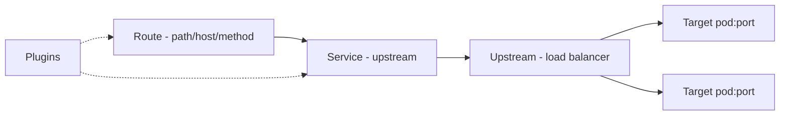

To debug Kong you must first hold its data model clearly in mind, because almost every routing or auth bug is really a misunderstanding of how these four objects relate. A **Service** in Kong is a named definition of one of your backends — it captures *where* the backend lives (host, port, protocol) and *how* to talk to it (connect/read/write timeouts, retry count). A **Route** is a set of *match rules* (host, path, method, headers) that points at a Service; it answers the question "which incoming requests should go to this backend?" One Service can have many Routes (e.g., `/accounts` and `/v2/accounts` both reaching `account-service`). An **Upstream** with its **Targets** is Kong's own client-side load balancer and health-checker, used when you want Kong to distribute traffic across multiple backend instances and ring them out of rotation when they fail health checks. And **Plugins** are the policy modules — `jwt`, `openid-connect`, `acl`, `rate-limiting`, `cors`, `request-transformer`, `response-transformer` — that attach to a Route, a Service, or globally, and execute during request processing.

The detail that trips up most engineers, and that you must internalize to debug auth and CORS issues, is **plugin execution order**. Plugins do not run in the order you defined them; each plugin has a fixed *priority number*, and Kong runs them from highest priority to lowest within each phase of request processing. Authentication plugins run early (high priority) because there is no point spending effort on a caller who has not proven their identity; authorization plugins like `acl` run *after* authentication (they need to know who you are before deciding what you may do); rate limiting runs after authorization; and transformation plugins that rewrite the request run later still. This ordering is *why*, for example, a CORS preflight can be killed by an auth plugin: if the auth plugin's priority causes it to run before the CORS plugin answers the `OPTIONS`, the unauthenticated preflight is rejected before CORS ever gets a turn. When a request behaves unexpectedly, mentally replay it through the ordered plugin pipeline — "routing matched, then `openid-connect` ran and rejected with 401" — and the behavior stops being mysterious.

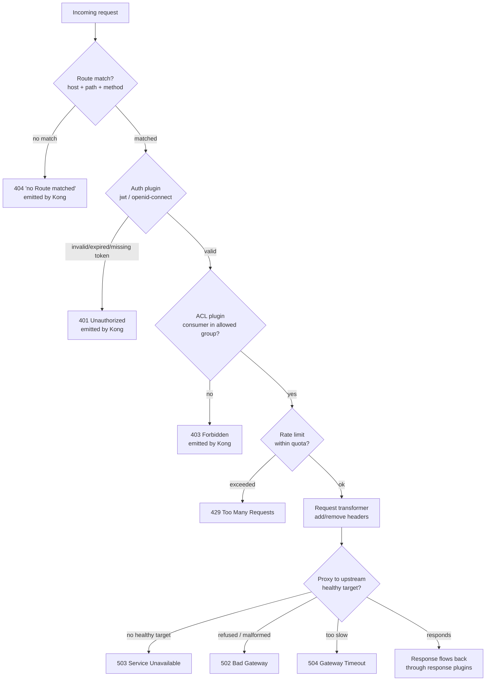

- **Service** = a backend (e.g., `account-service.bank.svc.cluster.local:8080`).
- **Route** = match rules (host, path, method, headers) → points to a Service.
- **Upstream/Target** = client-side load balancing & health checks.
- **Plugins** = jwt, oidc, acl, rate-limiting, cors, request/response-transformer — attached to a Route, Service, or globally, executed in fixed priority order (auth before authz before rate-limit before transforms).

### 4.2 How to Inspect Kong

```bash
# Admin API (port 8001). In K8s, port-forward first.
kubectl -n kong port-forward deploy/kong 8001:8001 &

curl -s localhost:8001/routes | jq '.data[] | {name,paths,hosts,methods,service:.service.id}'
curl -s localhost:8001/services | jq '.data[] | {name,host,port,protocol,connect_timeout,read_timeout}'
curl -s localhost:8001/plugins | jq '.data[] | {name,route:.route,service:.service,enabled}'
curl -s localhost:8001/upstreams/account-upstream/health | jq   # target health
curl -s localhost:8001/status | jq                               # node status

# DB-less / decK (declarative)
deck gateway dump -o kong.yaml
deck gateway diff kong.yaml
```

### 4.3 Routing Failures (404 from Kong)

The single most important thing to understand about a 404 here is *whose* 404 it is, because a 404 from Kong and a 404 from your Spring controller mean completely opposite things. A 404 from Kong — recognizable by the `{"message":"no Route matched with those values"}` body and the `Server: kong` header — means the request never reached any backend at all; Kong looked at its route table and found nothing matching this combination of host, path, and method, so it rejected the request at the door. A 404 from Spring means the request *did* reach the service, but the service had no controller mapped to that path. Confusing these two sends you debugging the wrong system entirely.

The most subtle cause of Kong routing surprises is **`strip_path`**, and it deserves a careful walk-through because it silently rewrites the URL between the client and your service. When a Route matches on path `/accounts` with `strip_path: true` (which is the default in many setups), Kong *removes* the matched prefix before proxying, so a client request for `/accounts/123` arrives at your Spring service as `/123` — and your controller, which is mapped to `/accounts/123`, returns 404. With `strip_path: false`, Kong forwards the full original path `/accounts/123` unchanged, and your controller matches. Neither setting is universally correct; what matters is that the path your *controller expects* and the path Kong *actually forwards* must agree. When you see a 404 that only appears through the gateway but works when you call the pod directly, `strip_path` is the first suspect. The other classic cause is **route precedence**: Kong scores routes by specificity and a broader route (say, a catch-all `/`) can shadow a more specific one if priorities are set wrong, so a request you expect to reach `account-service` is quietly captured by another route entirely. The diagnosis below dumps Kong's actual route table so you can compare what Kong *thinks* the routes are against what you *intended*.

**Symptom:** `{"message":"no Route matched with those values"}` and header `Server: kong/3.x`.

**Root causes**
- Path/host/method mismatch (route expects `Host: api.bank.example.com`, client sent something else).
- `strip_path` semantics: route path `/accounts` with `strip_path: true` forwards `/` to upstream, so the service (expecting `/accounts/123`) 404s. With `strip_path: false`, it forwards `/accounts/123`.
- Route priority/regex precedence — a broader route shadows a specific one.

**Diagnose**
```bash
curl -i https://api.bank.example.com/accounts/123 -H 'Host: api.bank.example.com'
# Match what Kong sees:
curl -s localhost:8001/routes | jq '.data[] | select(.paths != null)'
```

**Fix example (declarative):**
```yaml
services:
  - name: account-service
    url: http://account-service.bank.svc.cluster.local:8080
    connect_timeout: 2000
    write_timeout: 30000
    read_timeout: 30000
    retries: 0            # do NOT auto-retry non-idempotent banking POSTs
    routes:
      - name: accounts-route
        paths: ["/accounts"]
        strip_path: false   # keep /accounts/123 for the Spring controller
        methods: ["GET","POST","PUT","DELETE"]
        hosts: ["api.bank.example.com"]
```

### 4.4 JWT Plugin Failures (401 from Kong)

To debug auth at the gateway you need to know *what the plugin actually does on each request*, because "401 from Kong" covers several mechanically different failures. There are two relevant plugins and they validate differently. The older `jwt` plugin validates a token's signature against credentials you pre-register in Kong per consumer — it is simpler but requires you to manage keys inside Kong. The `openid-connect` (OIDC) plugin is the one most banks use: it bootstraps itself from Keycloak's *discovery document* (`/.well-known/openid-configuration`), learns the issuer and the JWKS endpoint from it, fetches Keycloak's public signing keys from JWKS, and *caches* them. On each incoming request the plugin performs a sequence of independent checks, and a failure of any one produces a 401: it confirms the token is well-formed and present; it verifies the signature using the cached public key whose `kid` matches the token's header; it checks the `iss` claim equals the configured/discovered issuer; it checks `exp`/`nbf` against the current clock (with optional `leeway` for skew); and, if configured, it checks the `aud` claim contains a required audience. Because all of this runs *at the edge before your service is touched*, a 401 here means the request died at the checkpoint and your application logs will show nothing — you must look at Kong.

The reason these failures are so common in banking specifically is the **internal-versus-external URL split**. Keycloak is frequently reachable at one hostname from outside the cluster (`https://keycloak.bank.example.com`) and a different one from inside (`http://keycloak.bank.svc.cluster.local:8080`). Tokens minted through the external URL carry `iss: https://keycloak.bank.example.com/realms/bank`, but if Kong's plugin was configured with the *internal* issuer, the `iss` check fails and every otherwise-valid token is rejected. The second banking-specific trap is **key rotation against a stale cache**: Keycloak periodically rotates its signing keys, and because Kong caches JWKS, there is a window where Keycloak has already started signing with a new `kid` that Kong's cache doesn't yet know about, so signature verification fails for brand-new, perfectly valid tokens. The diagnosis below — comparing the `kid` advertised by Keycloak's live JWKS against the `kid` embedded in a failing token — is the fastest way to confirm a rotation/cache problem: if the token's `kid` is absent from Keycloak's current key set you have a rotation issue, and if it is present then the cache is stale and needs to refresh.

Kong's `jwt` plugin validates HS/RS signatures against pre-registered credentials; `oidc`/`openid-connect` validates against Keycloak's discovery + JWKS.

**Symptoms / errors**
- `{"message":"Unauthorized"}` with `Server: kong`.
- `{"message":"No mandatory 'iss' in claims"}` / `"Invalid signature"` / `"Token expired"`.

**Root causes**
- JWKS URL unreachable from Kong (DNS/NetworkPolicy to Keycloak).
- Key rotation: Keycloak rotated signing keys, Kong cached old JWKS.
- `iss` in token (`https://keycloak/realms/bank`) ≠ configured issuer (internal vs external hostname mismatch — extremely common in banking when Keycloak has different internal/external URLs).

**OIDC plugin example:**
```yaml
plugins:
  - name: openid-connect
    route: accounts-route
    config:
      issuer: https://keycloak.bank.example.com/realms/bank
      client_id: ["kong-gateway"]
      client_secret: ["<from-secret>"]
      auth_methods: ["bearer"]      # API: expect Bearer tokens, no redirect
      verify_signature: true
      jwks_uri: https://keycloak.bank.example.com/realms/bank/protocol/openid-connect/certs
      leeway: 30                     # clock skew seconds
      audience_required: ["account-service"]
```

**Diagnose key rotation:**
```bash
# What kids does Keycloak advertise?
curl -s https://keycloak.bank.example.com/realms/bank/protocol/openid-connect/certs | jq '.keys[].kid'
# What kid is in the failing token?
echo "$TOKEN" | cut -d. -f1 | base64 -d 2>/dev/null | jq .kid
# If token kid not in JWKS -> Kong cache stale; reduce jwks cache TTL / restart, or fix rotation overlap.
```

### 4.5 ACL Plugin (403 from Kong)

The ACL plugin is where Kong does *authorization* (what you're allowed to reach) as opposed to *authentication* (who you are), and the ordering relationship is exactly the one from the §1.2 401-vs-403 distinction: the auth plugin runs first to establish a **consumer** identity, and *then* the ACL plugin checks whether that consumer belongs to a **group** permitted to use this route. So a 403 from the ACL plugin (recognizable by `{"message":"You cannot consume this service"}` with `Server: kong`) means authentication *succeeded* — Kong knows who you are — but your identity isn't authorized for this particular service. This is gateway-level, coarse-grained authorization, complementary to the fine-grained role checks Spring Security does deeper in (§12). The two common causes are that the consumer simply isn't in any group the route's ACL `allow` list permits, or that the ACL is misconfigured (an `allow` that names the wrong group, or a `deny` that's too broad). The diagnostic is to list the consumer's group memberships and compare them against the route's ACL configuration — the mismatch is usually immediately visible. The mental frame: at the gateway, *authentication establishes the consumer, ACL authorizes the consumer's group*, and a 403 here is "I know you, but your group isn't on the list for this door."

**Symptom:** `{"message":"You cannot consume this service"}`.

**Cause:** consumer not in an allowed group, or ACL plugin's `allow`/`deny` misconfigured. Verify consumer groups:
```bash
curl -s localhost:8001/consumers/<id>/acls | jq
```

### 4.6 Rate Limiting (429 from Kong)

Rate limiting exists to protect your backends from being overwhelmed — whether by a buggy client stuck in a retry loop, an abusive scraper, or a genuine traffic spike — by capping how many requests a given consumer may make in a time window and returning 429 once the cap is hit. The implementation detail that causes the most production surprises is *where the counter lives*, which is controlled by the `policy` setting. With the `local` policy, each Kong node keeps its own counter in its own memory. That is fast and needs no external dependency, but it is *wrong the moment you run more than one Kong replica*, because a limit of "600 per minute" enforced independently by three nodes effectively becomes 1800 per minute (each node counts only the requests it personally saw), and worse, the limit a given client experiences becomes erratic depending on which node the load balancer sends them to. With the `redis` policy, all Kong nodes share a single counter in Redis, so the limit is enforced globally and consistently regardless of how many replicas you run — at the cost of a Redis round-trip per request and a dependency on Redis being available (which is why `fault_tolerant` exists: it decides whether to fail-open or fail-closed if Redis is unreachable). The banking-specific nuances are that limits should be scoped *per consumer or per tenant* rather than globally (so one noisy customer cannot starve everyone else), and that the Keycloak token endpoint deserves its own, separate, stricter limit — because a misbehaving fleet of services fetching fresh tokens on every call (see §18) can hammer Keycloak into the ground, taking down authentication for the entire platform.

**Symptom:** `{"message":"API rate limit exceeded"}`, headers `RateLimit-Remaining: 0`, `Retry-After`.

**Banking nuance:** rate limit per consumer/tenant, not global; protect Keycloak token endpoint separately. Use `local` policy only for single-node; use `redis` for clustered Kong to avoid each node counting independently (which lets 3 nodes allow 3× the limit).
```yaml
- name: rate-limiting
  route: accounts-route
  config:
    minute: 600
    policy: redis
    redis: { host: redis.bank.svc, port: 6379 }
    fault_tolerant: true   # if redis down, fail-open (or false to fail-closed)
```

### 4.7 Request/Response Transformer

Transformer plugins let the gateway *rewrite* requests and responses as they pass through — adding, removing, or modifying headers and bodies — which centralizes useful cross-cutting behavior at the edge: injecting a correlation ID so every request is traceable from the moment it enters (§19), stamping `X-Forwarded-Proto: https` so backends know the original scheme (§3.6), or stripping internal-only headers that shouldn't leak to or from clients. The power to rewrite is also the power to *break*, and transformer failures are insidious because they're invisible from both the client's and the app's code — the request simply arrives subtly different from what was sent. Two failure modes dominate. The first is **removing a header the app depends on**: a transformer that strips `Authorization` after the OIDC plugin consumed it leaves the backend (which independently re-validates the token, §12.3) suddenly seeing no token and returning 401, baffling everyone because the client *did* send a valid token. The second is **adding a duplicate of a header that already exists**: a transformer that unconditionally *adds* `X-Request-Id` when the client (or an upstream proxy) already set one produces *two* correlation IDs, breaking trace stitching because different hops now log different IDs for the same request (§19.3). The lesson is that transformers are a sharp tool: because they silently alter the request between client and app, a transformer bug presents as "the app is misbehaving for no reason," and the diagnosis is to compare what the client *sent* against what the app *received* (Kong's structured access logs show both), looking for the header the gateway added, dropped, or duplicated.

Common use: inject correlation IDs, strip internal headers, add upstream auth.
```yaml
- name: request-transformer
  route: accounts-route
  config:
    add:
      headers: ["X-Request-Id:$(uuid)", "X-Forwarded-Proto:https"]
    remove:
      headers: ["X-Internal-Debug"]
```
**Failure:** transformer removes a header the app needs (e.g., it strips `Authorization` after OIDC), or adds a duplicate `X-Request-Id` breaking trace correlation.

### 4.8 Upstream / Timeout / Health (502, 503, 504 from Kong)

These three status codes all mean "Kong tried to reach your backend and something went wrong on that hop," but they describe three *distinct* failures, and distinguishing them is the difference between a one-minute and a one-hour diagnosis. Picture Kong as a receptionist trying to forward a call to an extension. A **502 Bad Gateway** means the receptionist dialed the extension and got something *broken* — the line was refused (the pod is down, or Kong is dialing the wrong port and nothing is listening there), or someone picked up and immediately babbled garbage (the app returned a malformed or empty response, often because it crashed mid-response, or because there is an HTTP-protocol mismatch such as Kong speaking HTTP/2 to an HTTP/1-only app). A **503 Service Unavailable** means the receptionist looked at the directory and found *no working extension to dial at all* — every target in the upstream has failed its health checks and been ringed out of rotation, so there is simply nowhere to send the call. A **504 Gateway Timeout** means the receptionist dialed, someone *answered*, but they never said anything before the `read_timeout` elapsed — the backend is alive and reachable but too slow to respond, which in banking almost always traces to a slow database query, a downstream service that is itself hung, a saturated connection pool, or a long garbage-collection pause. The mental shortcut: 502 = "got a broken answer," 503 = "no one to answer," 504 = "answered too slowly." Each points at a different layer — 502 and 503 at pod health and configuration, 504 at latency deeper in the stack — and the diagnosis commands below let you check upstream target health and read the exact nginx-level error Kong logged.

| Status | Meaning | Common cause |
|--------|---------|--------------|
| 502 Bad Gateway | upstream sent invalid/empty response or connection refused | pod crashed, wrong port, app returned malformed response |
| 503 Service Unavailable | no healthy upstream targets | all targets failed active/passive health checks |
| 504 Gateway Timeout | upstream didn't respond within `read_timeout` | slow query, downstream hang, GC pause |

**Diagnose:**
```bash
curl -s localhost:8001/upstreams/account-upstream/health | jq '.data[] | {target,health}'
kubectl -n kong logs deploy/kong -c proxy | grep -i 'upstream\|timeout\|connect()'
# Example log line:
# [error] connect() failed (111: Connection refused) while connecting to upstream, ... upstream: "http://10.1.2.3:8080/accounts/123"
```

**Health check config:**
```yaml
upstreams:
  - name: account-upstream
    healthchecks:
      active:
        http_path: /actuator/health/readiness
        healthy:   { interval: 5, successes: 2 }
        unhealthy: { interval: 5, http_failures: 3, timeouts: 3 }
      passive:
        unhealthy: { http_failures: 5, timeouts: 3 }
```

### 4.9 Kong on Kubernetes (Ingress Controller)

With Kong Ingress Controller (KIC), routes come from `Ingress`/`HTTPRoute` + `KongPlugin` CRDs.
```yaml
apiVersion: configuration.konghq.com/v1
kind: KongPlugin
metadata: { name: oidc-auth, namespace: bank }
plugin: openid-connect
config:
  issuer: https://keycloak.bank.example.com/realms/bank
---
apiVersion: networking.k8s.io/v1
kind: Ingress
metadata:
  name: account-ingress
  namespace: bank
  annotations:
    konghq.com/plugins: oidc-auth
    konghq.com/strip-path: "false"
spec:
  ingressClassName: kong
  rules:
    - host: api.bank.example.com
      http:
        paths:
          - path: /accounts
            pathType: Prefix
            backend: { service: { name: account-service, port: { number: 8080 } } }
```
**Common KIC failures:** CRD not reconciled (check controller logs), `konghq.com/strip-path` mismatch, plugin annotation referencing a `KongPlugin` in a different namespace.

### 4.10 Reading Kong Logs

Kong's logs are uniquely valuable because, sitting at the chokepoint, they record *every* request with a breakdown of *where time was spent* — and learning to read that breakdown answers the single most common gateway question, "is it Kong or is it the backend?", in seconds. The key fields in Kong's structured access logs are the **latency measurements**, which separate the request's total time into components: `latencies.kong` (time Kong itself spent — running plugins, doing routing), `latencies.proxy` (time spent waiting on the *upstream* backend), and `latencies.request` (the total). This decomposition is the diagnostic. If `latencies.kong` is high, the *gateway* is the bottleneck — most often an authentication plugin doing expensive work per request, such as an OIDC plugin re-fetching JWKS or introspecting tokens against Keycloak on every call instead of caching (which also explains §4.6-style load on Keycloak). If `latencies.proxy` is high while `latencies.kong` is low, Kong is fine and your *backend* is slow — pivot to the §2 Stage-6 investigation (slow query, pool saturation, downstream hang). This one comparison routes you to the correct half of the system before you open any application logs. To get these structured fields you enable the `http-log` or `file-log` plugin (or scrape the proxy container's JSON logs), and the same records carry `request.headers`, `response.status`, and `upstream_status` — letting you confirm the emitter and status of any request directly from Kong's vantage point.

```bash
kubectl -n kong logs -l app=kong -c proxy --tail=200 -f | jq -R 'fromjson? // .'
# Enable richer logging with the http-log/file-log plugin to ship structured access logs:
# fields include: request.headers, response.status, latencies.{kong,proxy,request}, upstream_status
```
**Latency triage:** if `latencies.kong` is high → plugin overhead (e.g., OIDC doing a JWKS fetch each request). If `latencies.proxy` (upstream) is high → the backend is slow, not Kong.

---
## 5. Kubernetes Networking Troubleshooting

**Mental model — a Kubernetes Service is a permanent reception desk that hides a constantly-changing pool of workers behind it.** Pods are mortal and disposable: they are created and destroyed constantly during deploys, scaling, and node failures, and each time a pod is born it gets a *brand-new IP address* that nothing should ever hardcode. If services called each other by pod IP, every deploy would break every caller. Kubernetes solves this with the Service abstraction: a Service has a *stable* virtual IP (the ClusterIP) and a *stable* DNS name that never change, and behind that stable front it maintains a live roster — the Endpoints (or EndpointSlices) — of which pod IPs are currently healthy and ready to receive traffic. When you call `account-service`, you are calling the reception desk; the desk consults its current roster and forwards you to one of the workers on duty. This indirection is what makes rolling deploys and autoscaling invisible to callers, and almost every Kubernetes networking bug is a breakdown somewhere in this chain: the name doesn't resolve to the desk (DNS), the desk's roster is empty (no ready pods / selector mismatch), the desk forwards to a port nobody is listening on (targetPort mismatch), or a security guard between buildings blocks the corridor (NetworkPolicy).

**The service-discovery and pod-networking flow, step by step.** When pod `ledger-service` wants to call `account-service`, here is what actually happens beneath the single line of Java that makes the request. First, **name resolution**: the JVM asks the OS resolver to turn `account-service` into an IP; the pod's `/etc/resolv.conf` points at CoreDNS (the cluster DNS server), which knows that `account-service.bank.svc.cluster.local` maps to the Service's ClusterIP and returns that virtual IP. Second, **virtual-IP routing**: the ClusterIP is not a real network interface anywhere — it is a fiction maintained by `kube-proxy`, which programs the node's `iptables` (or IPVS, or an eBPF dataplane depending on the CNI) so that packets destined for the ClusterIP are transparently rewritten (DNAT'd) to the IP of one of the *ready* backing pods, chosen roughly at random for load balancing. Third, **the actual pod-to-pod hop**: the packet, now addressed to a real pod IP, traverses the cluster's pod network (the CNI plugin — Calico, Cilium, etc. — which gives every pod a routable IP and stitches the nodes together into one flat network), possibly crossing from one node to another. Fourth, **policy enforcement**: if NetworkPolicies exist, the CNI checks whether this source pod is permitted to reach this destination pod on this port, and silently drops the packet if not. Understanding this chain is what lets you reason about *where* a failure occurred: a name that won't resolve is a CoreDNS/step-one problem; an empty Endpoints list is a step-two problem (the ClusterIP has nothing to DNAT to); a "connection refused" is a step-three problem (you reached a pod but the port has no listener); a "timeout" with a healthy listener is usually a step-four NetworkPolicy drop.

In short: "the service is down" almost always decomposes into one of *pod not running*, *Service has no Endpoints*, *DNS broken*, or *NetworkPolicy blocking* — and the discipline is to walk the chain inward, confirming each link before suspecting the next.

### 5.1 The Networking Chain

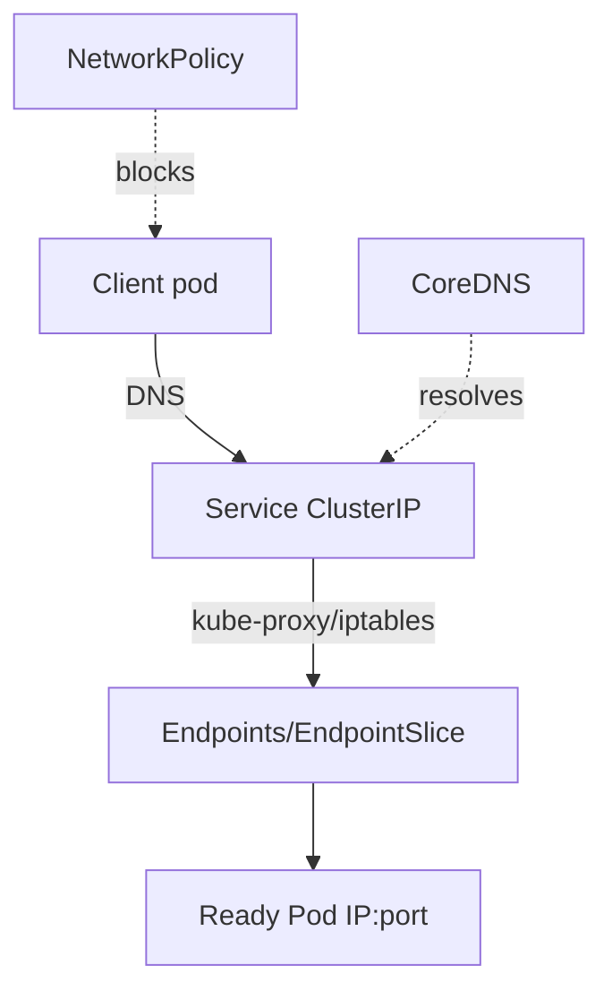

### 5.2 Universal Triage Commands

```bash
NS=bank; SVC=account-service
kubectl -n $NS get pods -o wide
kubectl -n $NS get svc $SVC -o wide
kubectl -n $NS get endpoints $SVC          # <-- empty endpoints = #1 cause of 503
kubectl -n $NS get endpointslice -l kubernetes.io/service-name=$SVC
kubectl -n $NS describe svc $SVC            # check selector vs pod labels
kubectl -n $NS describe pod <pod>          # events, probes, restarts
```

### 5.3 Decision Tree: "Service B cannot reach Service A"

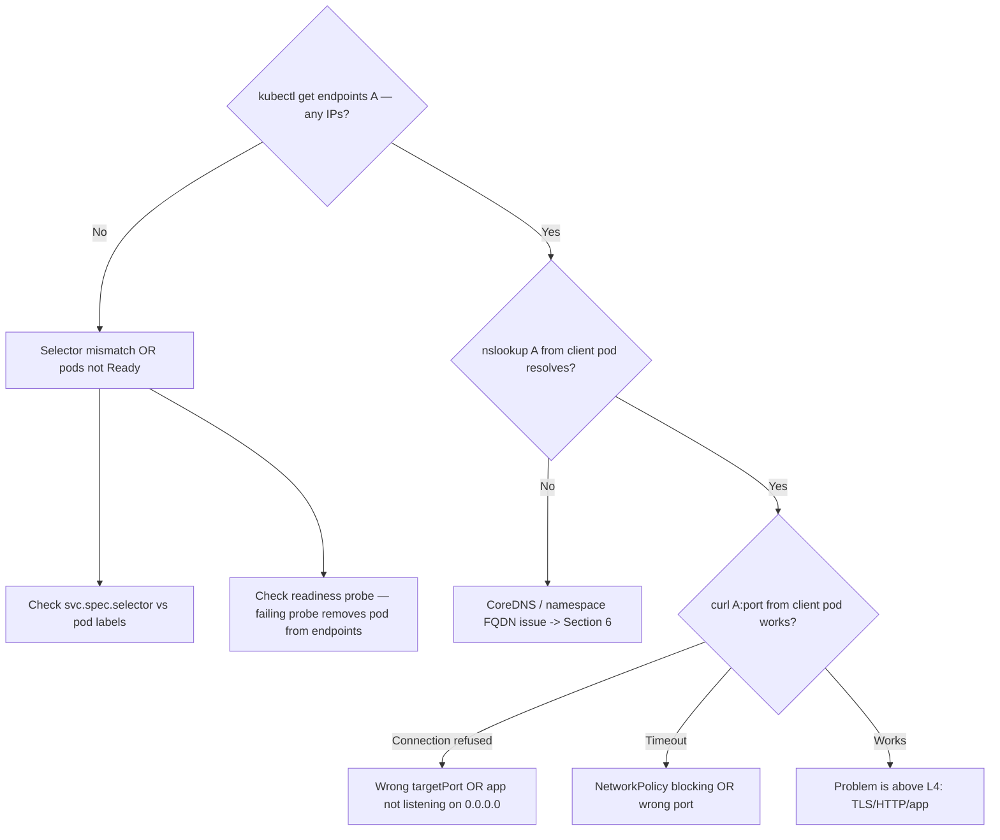

### 5.4 Empty Endpoints (most common 503 root cause)

This is the single most common Kubernetes networking incident, so it is worth understanding *why* an empty Endpoints list is so deadly and so easy to cause. Recall from the mental model that the Service's stable ClusterIP is useless on its own — it is just a virtual address that `kube-proxy` rewrites to a *real* pod IP drawn from the Endpoints roster. If that roster is empty, the ClusterIP has nowhere to forward to, so every request to the Service fails immediately, and from the gateway's perspective this surfaces as a 503 (no healthy upstream). The roster is built automatically by Kubernetes from two conditions that *both* must hold for a pod to be listed: the pod's labels must match the Service's `selector`, **and** the pod must be passing its readiness probe. This gives three distinct ways to accidentally empty the roster. First, a **selector mismatch**: someone renames a deployment's labels from `app=account` to `app=account-service` but the Service still selects `app=account`, so no pod matches and the roster is empty even though healthy pods are running right there. Second, **no ready pods**: the pods exist and are correctly labeled, but their readiness probe is failing (a slow startup, a failing dependency check, a wrong probe path), so Kubernetes deliberately keeps them *out* of the roster to avoid sending traffic to a pod that cannot serve it. Third, a **wrong `targetPort`**: technically the roster can be populated but pointing at a port the container isn't listening on, which produces connection-refused rather than an empty list — a closely related cousin. The fix is never to "restart the service" (the pods are usually fine); it is to reconcile selector-versus-labels and to make the readiness probe accurately reflect serve-ability. The diagnostic commands below dump the selector, the pod labels, and each pod's Ready condition side by side so the mismatch jumps out.

**Symptom:** Kong/Service returns 503; `kubectl get endpoints account-service` shows `<none>`.

**Root causes**
1. **Selector mismatch:** Service `selector: app=account` but pods labeled `app=account-service`.
2. **No Ready pods:** readiness probe failing, so pods exist but are excluded from Endpoints.
3. **Wrong `targetPort`:** Service `port:8080 targetPort:8080` but container listens on `8081`.

**Diagnose & fix:**
```bash
kubectl -n bank get svc account-service -o jsonpath='{.spec.selector}'; echo
kubectl -n bank get pods --show-labels | grep account
kubectl -n bank get pods -l app=account-service -o jsonpath='{range .items[*]}{.metadata.name}{"\t"}{.status.conditions[?(@.type=="Ready")].status}{"\n"}{end}'
```

### 5.5 Connection Refused vs Timeout inside the cluster

```bash
# Ephemeral debug pod (no need to bake curl into app images)
kubectl -n bank run netshoot --rm -it --image=nicolaka/netshoot -- bash
# Inside:
nslookup account-service
curl -v http://account-service:8080/actuator/health
nc -vz account-service 8080
```
The difference between "connection refused" and "timeout" is one of the most information-rich signals in all of network debugging, because the two outcomes are produced by completely different mechanisms and therefore point at completely different causes. **Connection refused** means your SYN packet *arrived at a live host* and that host actively sent back a TCP RST saying "nothing is listening on this port." The key word is *active*: someone was home to say no. That tells you the pod is up and reachable at the network level, but the application isn't listening where you're knocking — either you have the wrong `targetPort`, or, very commonly with Spring Boot, the app bound to `127.0.0.1` (loopback only) instead of `0.0.0.0` (all interfaces), so it accepts connections from inside its own container but refuses everything from the pod network. **Timeout** means your SYN went out and *nothing ever came back* — no acceptance, no refusal, just silence until the clock ran out. Silence almost always means a packet was *dropped* somewhere rather than answered, and in Kubernetes the overwhelmingly common cause is a NetworkPolicy that quietly discards the packet (default-deny policies drop with no response by design), with wrong-port-to-a-default-drop-firewall and underlying CNI/node problems as the other candidates. So: refused = "I reached it but the door's locked," timeout = "my knock vanished into the void." This single distinction routes you toward either application/port configuration (refused) or network policy/CNI (timeout), and it is worth confirming with a raw `nc -vz` before theorizing.

- **Connection refused** → reached a pod but nothing on that port: wrong `targetPort`, or app bound to `127.0.0.1` instead of `0.0.0.0` (Spring `server.address` misconfig).
- **Timeout** → packets dropped: NetworkPolicy, wrong port (no listener, default-drop), or node/CNI issue.

### 5.6 NetworkPolicies

By default, Kubernetes networking is wide open: every pod can talk to every other pod, in any namespace, on any port. That is convenient for development but unacceptable for a bank, where the principle of least privilege demands that `account-service` be reachable *only* by the specific services that legitimately need it, so that a compromised pod elsewhere cannot freely pivot to attack the account data. NetworkPolicies are the firewall rules that impose this restriction — they are how you turn the flat, open pod network into a set of explicitly-permitted corridors. In a mature banking cluster the baseline is usually **default-deny**: a policy that drops all traffic, after which you add narrow `allow` policies enumerating exactly which source can reach which destination on which port. The mental model is "everything is forbidden unless explicitly allowed," the inverse of the Kubernetes default.

The consequence for debugging is a specific, recognizable signature, and it ties back to the refused-versus-timeout distinction of §5.5: a NetworkPolicy block manifests as a **timeout, never a connection-refused**, because the policy makes the CNI *silently drop* the packet — there is no host actively saying "no," just a knock that vanishes. And the tell-tale context is *timing*: the timeout appeared right after a policy was added or changed, and it affects a *specific source→destination→port* path rather than the destination universally (the destination is up and serving its other allowed callers fine). The single most common self-inflicted wound here is forgetting **DNS egress**: when you write a default-deny *egress* policy, you must explicitly allow outbound UDP/TCP on port 53 to kube-dns, because *every* outbound call begins with a DNS lookup (§6) — block port 53 and you haven't blocked one service, you've broken *all* name resolution for those pods, which looks exactly like a cluster-wide DNS outage and sends people debugging CoreDNS when the real cause is an over-zealous egress rule. The lesson: NetworkPolicy failures are timeouts correlated with a policy change, and the most insidious one is the forgotten DNS-port allowance.

In banking, default-deny is common; a new service can't talk until policy allows it.
```yaml
apiVersion: networking.k8s.io/v1
kind: NetworkPolicy
metadata: { name: allow-ledger-to-account, namespace: bank }
spec:
  podSelector: { matchLabels: { app: account-service } }
  policyTypes: ["Ingress"]
  ingress:
    - from:
        - podSelector: { matchLabels: { app: ledger-service } }
      ports:
        - { protocol: TCP, port: 8080 }
```
**Diagnose:** symptom is a *timeout* (not refused) that appeared right after a policy change. List policies affecting the pod:
```bash
kubectl -n bank get networkpolicy
kubectl -n bank describe networkpolicy allow-ledger-to-account
```
Don't forget **DNS egress**: a default-deny egress policy that forgets to allow UDP/TCP 53 to kube-dns breaks *all* name resolution → looks like a DNS outage.

### 5.7 Service Types & LoadBalancers

The four Service types are not interchangeable options but a *progression of exposure*, each adding a layer of reachability, and knowing which you're dealing with tells you where to look when connectivity fails. **ClusterIP** (the default) gives a stable virtual IP reachable *only from inside the cluster* — it's the workhorse for service-to-service traffic and the subject of most of this section. **NodePort** additionally opens a port on *every node's* IP, exposing the service outside the cluster in a crude way (used in dev or as a building block); its failures involve the restricted port range and node firewalls. **LoadBalancer** asks the *cloud provider* to provision an external load balancer with a public IP that routes into the service — and its signature failure is an `EXTERNAL-IP` stuck in `<pending>` for a long time, which means the cloud-controller couldn't provision the LB (no cloud integration, a quota limit, or a permissions problem), diagnosed by reading the Service's *events* (`kubectl describe svc`) where the cloud provider's error is reported. **Headless** (`clusterIP: None`) goes the *opposite* direction from all of these: instead of adding a layer of indirection it *removes* the virtual IP and returns pod IPs directly (§6.5), for clients that need to address specific pods. The mental model is a ladder of reach — ClusterIP (internal only) → NodePort (via node IPs) → LoadBalancer (via a cloud LB and public IP) — with Headless as the special case that opts out of virtual-IP indirection entirely. When external traffic can't reach a service, identifying *which type* it is tells you whether to suspect a cloud LB provisioning issue, a NodePort firewall, or (for an internal ClusterIP that shouldn't be externally reachable at all) an ingress/gateway misconfiguration.

| Type | Use | Failure |
|------|-----|---------|
| ClusterIP | internal | most issues above |
| NodePort | dev/edge | port range, firewall |
| LoadBalancer | cloud ingress | LB stuck `<pending>` (no cloud controller / quota) |
| Headless (`clusterIP: None`) | StatefulSet, direct pod DNS | returns pod IPs, not VIP — see §6 |

```bash
kubectl -n bank get svc   # EXTERNAL-IP <pending> for too long => cloud LB provisioning issue
kubectl -n bank describe svc account-lb   # events show cloud provider errors
```

### 5.8 Cross-Namespace Calls

Short name only resolves within the same namespace. From `payments` ns calling `account-service` in `bank` ns, you must use the FQDN: `account-service.bank.svc.cluster.local`. A bare `account-service` will fail with `UnknownHostException` → see §6.

---

## 6. DNS and Service Discovery

**Mental model — cluster DNS is the internal corporate phone directory, and every service call starts by looking someone up in it.** Just as you would never memorize a colleague's desk phone number (which changes when they move desks) but instead look up their name in the directory each time, services never hardcode pod IPs (which change on every restart) but instead look up a stable *name* in CoreDNS. This makes DNS the very first thing that happens on *every* outbound call, which is exactly why DNS problems are so insidious: they are intermittent (a lookup fails only sometimes, under load), they are cached at several layers (so the failure outlives the cause, or the success outlives the truth), and they masquerade as application bugs (an `UnknownHostException` looks like a code problem but is really a directory problem). A surprising number of "the app is flaky" incidents are actually "the phone directory is overloaded or returning stale numbers."

### 6.1 Kubernetes DNS Naming and the `ndots` Trap

Kubernetes gives every Service a fully-qualified name with a rigid structure, and understanding that structure explains an entire class of performance bugs. The canonical form is `<service>.<namespace>.svc.cluster.local`, so `account-service` in the `bank` namespace is fully `account-service.bank.svc.cluster.local`. To let you write the short form `account-service` instead of the mouthful, each pod's `/etc/resolv.conf` contains a `search` list (`bank.svc.cluster.local svc.cluster.local cluster.local`) that the resolver appends, one at a time, when you give it a non-fully-qualified name — this is how `account-service` gets expanded into the full name and resolved. So far so convenient. The trap is the accompanying `ndots:5` option, which means: "if the name you're looking up has *fewer than 5 dots*, try appending each search domain *first* before trying the name as-is." This rule is fine for short internal names, but it is actively harmful for *external* names. Consider resolving `keycloak.bank.example.com` (three dots, fewer than five): the resolver dutifully tries `keycloak.bank.example.com.bank.svc.cluster.local` (fails), then `keycloak.bank.example.com.svc.cluster.local` (fails), then `keycloak.bank.example.com.cluster.local` (fails), and *only then* tries the real `keycloak.bank.example.com` (succeeds). That is four DNS queries where one would do, multiplied across every external call your service makes, multiplied across every pod — a hidden tax that loads down CoreDNS and adds latency, and which becomes a visible incident when CoreDNS is under pressure. The fixes (a trailing dot to signal "this is already fully qualified, don't expand it," or lowering `ndots` for pods that make many external calls) all aim at eliminating these wasted lookups. Recognizing the `ndots` amplification pattern — "first call to an external host is slow, subsequent calls are fast because they're cached" — is a senior-level diagnostic instinct.

### 6.2 UnknownHostException

**Java symptom / stack trace:**
```
java.net.UnknownHostException: account-service
  at java.base/java.net.InetAddress$CachedLookup.get(...)
  at feign.Client$Default.convertResponse(...)
```
**Root causes**
- Wrong name (short name across namespaces — see §5.8).
- Typo (`acccount-service`).
- Service deleted/renamed; config still points to old name.
- CoreDNS down or egress NetworkPolicy blocks port 53.

**Diagnose:**
```bash
kubectl -n bank run netshoot --rm -it --image=nicolaka/netshoot -- \
  nslookup account-service.bank.svc.cluster.local
kubectl -n kube-system get pods -l k8s-app=kube-dns
kubectl -n kube-system logs -l k8s-app=kube-dns --tail=100
```

### 6.3 DNS Timeout / CoreDNS Overload

This failure is a perfect storm of two earlier topics — the `ndots` amplification of §6.1 and the conntrack mechanics of §7.5 — colliding at the cluster's shared DNS service, and its signature is unmistakable once you know it: *sporadic* `UnknownHostException`s or latency spikes of 100–5000ms on the *first* call to a host, with subsequent calls fast because the result got cached. The reason it concentrates on first-calls-under-load is the chain of amplifiers. Every external hostname lookup, thanks to `ndots:5`, fans out into four or five queries instead of one (§6.1). DNS traditionally runs over UDP, which is connectionless and has no retransmission of its own, so a single dropped UDP packet means the resolver waits for a timeout (often ~5 seconds) before retrying — that's your 5000ms spike. And the packet gets dropped because all this query volume funnels into CoreDNS through the node's conntrack table, where UDP entries race and the table can saturate under load, silently discarding query packets. So a modest amount of external-call traffic, multiplied by ndots, carried over retransmit-less UDP, through a contended conntrack table, produces intermittent multi-second DNS stalls that look like random application flakiness.

The fixes attack each amplifier in the chain. **Reducing wasted lookups** (a trailing dot on fully-qualified external names, or lowering `ndots` for pods that make many external calls) cuts the query fan-out at the source. **NodeLocal DNSCache** is the most impactful structural fix: it runs a tiny DNS cache *on every node*, so the vast majority of lookups are answered locally over a stable loopback connection without ever touching the contended cross-node UDP path or the shared CoreDNS pods — it simultaneously slashes CoreDNS load and removes the UDP-conntrack hazard. **Scaling CoreDNS** and enabling autopath address the central capacity. The diagnostic instinct to build is that "first call slow, repeat calls fast, intermittently" is the fingerprint of DNS amplification, not application latency — and you confirm it by watching CoreDNS metrics and query latency rather than profiling your own code.

**Symptom:** sporadic `UnknownHostException` or 100–5000ms latency spikes on the *first* call, fine afterward.

**Root causes:** `ndots:5` amplification, CoreDNS under-provisioned, conntrack race on UDP, missing NodeLocal DNSCache.

**Fixes:**
- Add a trailing dot or use FQDN in config to skip search expansion: `keycloak.bank.example.com.`
- Set `dnsConfig` `ndots:2` for pods doing lots of external calls.
- Deploy **NodeLocal DNSCache**; scale CoreDNS; enable autopath.
```yaml
spec:
  dnsConfig:
    options:
      - { name: ndots, value: "2" }
```

### 6.4 Stale DNS Cache (JVM)

This is a failure that lives *inside your own JVM*, and it catches experienced engineers because it contradicts the comforting assumption that "DNS is handled by the OS." The JVM maintains its *own* DNS cache, separate from the OS and CoreDNS, controlled by the `networkaddress.cache.ttl` security property. Historically — particularly in older JDKs or when a SecurityManager was installed — this defaulted to caching successful lookups *forever*, on the reasoning that a hostname's IP rarely changes. In a cloud-native world that assumption is false and dangerous: pods are reborn with new IPs constantly. The failure scenario is precise and worth holding in mind. Your client JVM resolves `some-host` to pod IP `10.1.2.3` and caches it. That pod is then replaced during a deploy and the replacement comes up as `10.1.2.9`. But your JVM, trusting its forever-cache, keeps trying to connect to the now-dead `10.1.2.3` and gets `Connection refused` or timeouts on *every* call — while `nslookup` from a shell on the same pod correctly returns the new IP, making it look like "DNS is fine but the app can't connect," a maddening contradiction. The deeper lesson is the one stated at the end: the *real* defense is architectural, not a TTL tweak. If you always talk to the **Service ClusterIP** (which is stable and never changes for the life of the Service) rather than to pod IPs, the JVM's cache is harmless because the cached value never goes stale. The JVM stale-cache problem only bites when something resolves to *pod* IPs directly — which is exactly what a headless Service or a client-side load balancer (Spring Cloud LoadBalancer) does, and why those mechanisms require their own instance-refresh discipline.

The JVM caches DNS. Historically `networkaddress.cache.ttl` defaulted to "forever" for successful lookups with a SecurityManager, and negative lookups (`networkaddress.cache.negative.ttl`) default to 10s. If a pod restarts and gets a **new IP**, a client JVM caching the old IP keeps hitting a dead address → `Connection refused`/timeout.

**Fix:** Don't cache resolved IPs long. Most modern JDKs default success TTL to 30s, but verify:
```bash
# In the app image
cat $JAVA_HOME/conf/security/java.security | grep networkaddress.cache
```
```properties
# java.security override
networkaddress.cache.ttl=30
networkaddress.cache.negative.ttl=5
```
Crucially, talk to the **Service ClusterIP** (stable) not pod IPs. If you use a **headless** service or client-side LB (Spring Cloud LoadBalancer) you must refresh the instance list, or stale pod IPs persist.

### 6.5 Headless Services & Service Rename

A **headless service** deliberately turns off the abstraction that the §5 mental model praised. A normal Service gives you one stable ClusterIP that hides the pods; a headless Service (`clusterIP: None`) instead makes DNS return the IPs of *all* the individual pods directly, with no virtual IP and no load-balancing in front. Why would you want to give up the convenient abstraction? Because some clients need to address *specific* pods, not "any healthy one." The canonical case is a StatefulSet like Kafka or a database cluster, where each instance has a distinct identity and role (a partition leader, a primary) and clients must reach `kafka-0` specifically, not a random broker — headless DNS gives each pod a stable per-pod name (`kafka-0.kafka.bank.svc.cluster.local`) for exactly this. The trade-off, and the source of bugs, is that the *client* now inherits the responsibilities the Service used to handle: it must cope with *multiple* returned IPs, pick among them sensibly, and — critically — *re-resolve* as pods come and go, which intersects directly with the JVM DNS-cache trap of §6.4 (cache a headless result too long and you'll hold dead pod IPs). **Service rename** is the related operational hazard: because consumers reach a service *by its DNS name*, renaming a Service silently breaks every caller that hardcoded the old name (they'll get `UnknownHostException`, §6.2). A rename is therefore a *breaking API change* to the network contract and must be done with the same care as changing a public endpoint — introduce the new name alongside the old (an `ExternalName` alias, or a second Service pointing at the same pods) and migrate consumers before removing the old name, never a hard cutover.

- **Headless** (`clusterIP: None`) returns *all* pod A-records. Great for StatefulSets (`kafka-0.kafka.bank.svc.cluster.local`), but a client must handle multiple IPs and pods coming/going.
- **Rename:** renaming a Service is a breaking change to every consumer's DNS name. Use an alias (`ExternalName`) or keep the old Service pointing at the same selector during migration.

---
## 7. TCP/IP Layer Failures

**Mental model — TCP is a telephone call, not a letter.** Before any data flows, the two parties must establish a connection through the *three-way handshake*: the caller sends SYN ("can we talk?"), the callee answers SYN-ACK ("yes, can you hear me?"), and the caller replies ACK ("yes, go ahead"). Only after this handshake is the line "established" and bytes can flow in both directions. When the call ends, there is an equally formal teardown (FIN/ACK in each direction). Almost every L4 failure you will debug is a breakdown at a specific point in this lifecycle, and the *symptom names the point*: "connection refused" is a failure at the very first ring (someone is home but won't pick up this extension); "connect timed out" is a SYN that vanished with no answer at all (the call never connected); "connection reset" is the line being slammed down mid-conversation; and the various `_WAIT` states are connections stuck in the teardown choreography. Once name resolution has succeeded (§6) and you are still failing, you have descended to this layer, and these are precisely the failures that page you at 3 AM during a traffic spike — because most of them are *resource exhaustion* problems that only manifest under load.

The unifying theme of this entire section is that **operating systems treat connections as finite, accountable resources** — file descriptors, ephemeral ports, conntrack-table entries, accept-queue slots — and microservices that open connections carelessly (a new connection per request, connections never closed, no pooling) exhaust these resources under load and fall over in ways that look mysterious until you know to count the resource. The single most important preventive habit, which will recur in every subsection below, is **pool and reuse connections** rather than creating them per request. With that frame, each specific failure below becomes an instance of "which finite resource ran out, and why."

### 7.1 Connection Refused

**Theory:** TCP SYN reached the host but no process is `LISTEN`ing on that port → RST sent back immediately (fast failure). This is the *fast, definite* failure: because the host is alive and actively rejects the SYN with a RST, your client learns instantly that the door is locked — there is no waiting. That speed is itself a diagnostic clue: a near-instant failure is "refused" (host up, port closed), whereas a *slow* failure that waits out a timeout is "the packet went nowhere" (host down, dropped, or firewalled — see §7.3). Refused therefore *narrows* the problem to the application/port layer: the machine is reachable, so the issue is that nothing is listening where you knocked, which in Kubernetes means a wrong `targetPort`, an app bound to `127.0.0.1` instead of `0.0.0.0`, or a pod that is still starting and hasn't opened its listening socket yet.

**Java:** `java.net.ConnectException: Connection refused`.
**Linux:** `nc -vz host port` → `Connection refused`.
**K8s:** wrong `targetPort`, app bound to `127.0.0.1`, or pod still starting.

**Diagnose:**
```bash
ss -ltnp | grep 8080            # is anything listening?
kubectl -n bank exec <pod> -- ss -ltn
```
**Fix:** correct port; bind to `0.0.0.0` (`server.address=0.0.0.0`); add startup probe so traffic waits.

### 7.2 Connection Reset by Peer

**Theory:** A reset (RST) on an *already-established* connection is the peer abruptly slamming the line down mid-call, as opposed to the polite FIN-based hangup. The receiving side experiences this as `Connection reset`, and the crucial investigative question is *why did the peer reset a connection it had previously accepted?* There are a handful of answers, but in pooled-connection microservice architectures one dominates, and it is worth understanding deeply because it is non-obvious and extremely common. It is the **keep-alive idle-timeout mismatch**. To avoid the cost of the three-way handshake on every call, clients keep connections *open* in a pool and reuse them (this is the "pool and reuse" advice from the intro — but it has a sharp edge). Meanwhile, the server, the load balancer, and Kong each independently decide how long they will hold an *idle* connection before reclaiming it — their keep-alive timeout. Now suppose the client's pool is willing to hold an idle connection for 60 seconds, but Kong reclaims idle connections after 30. At second 31, Kong silently closes its end. The client's pool, unaware, still believes that connection is alive and hands it to the next request — which writes a request onto a socket the server already closed, and gets a RST back. The fix is a *timing invariant*: the client's idle timeout must be **shorter** than every upstream's idle timeout, so the client is always the one to retire a connection first, never reusing one the server has quietly killed. This is why connection-reset incidents often appear "randomly" and correlate with low-traffic periods (connections sit idle long enough to cross the timeout) rather than high-traffic ones.

**Java:** `java.net.SocketException: Connection reset`.
**Common banking cause:** the **connection pool keep-alive mismatch** — the client keeps a pooled connection longer than the server/LB/Kong idle timeout. The server silently closes; the client's next request hits a dead socket → reset.

**Fix:** make client idle timeout *shorter* than server/LB idle timeout. For HikariCP/HTTP pools, set `validate-after-inactivity`/connection TTL below the upstream's keep-alive.

### 7.3 SYN Timeout vs Socket (Read) Timeout

| Timeout | When | Java exception |
|---------|------|----------------|
| Connect timeout | SYN gets no SYN-ACK (host unreachable, dropped, firewall) | `SocketTimeoutException: connect timed out` |
| Read/socket timeout | connected, but no response bytes in time | `SocketTimeoutException: Read timed out` |

The distinction between these two timeouts matters because they protect against different failures and a system needs *both*. The **connect timeout** bounds how long you wait for the TCP handshake to complete — it fires when the destination is unreachable, the SYN is being dropped by a firewall or NetworkPolicy, or the host is down. It should be *short* (1–2 seconds), because a host that won't complete a handshake quickly is almost certainly not going to, and waiting longer just delays your failure. The **read timeout** bounds how long you wait for *response bytes* after the connection is established and your request is sent — it fires when the server accepted your request but is taking too long to answer (slow query, downstream hang, GC pause). 

The reason a missing read timeout is catastrophic — and this is one of the most important single facts in this entire guide — is the mechanism of *cascading thread exhaustion*. A traditional Spring MVC service handles each request on a thread from a bounded pool (say 200 threads). If a downstream call has no read timeout and the downstream hangs, the thread making that call blocks *forever*, holding its slot. Under steady traffic, within seconds all 200 threads are blocked waiting on the hung downstream, and now the service cannot accept *any* request — including ones that never needed the downstream at all. The service is effectively down, not because it crashed, but because every worker is parked. Then *its* callers' threads block waiting on it, and the paralysis climbs the call graph. A single slow leaf service freezes the entire tree. The read timeout is the circuit-breaker of last resort that caps this damage: with a 5-second read timeout, a blocked thread frees itself after 5 seconds instead of never, bounding how many threads the hung downstream can capture. **Always set both timeouts on every client** is not a style preference; it is the difference between a localized downstream slowdown and a platform-wide outage.

```yaml
# Spring Boot RestClient/RestTemplate via properties (example)
# connect: time to establish TCP; read: time waiting for response
```

### 7.4 Socket Leak / Too Many Open Files

The phrase to internalize here is that in Unix, **everything is a file** — and that includes network sockets. Every open socket, every open connection, every open file consumes a *file descriptor*, a small integer the kernel hands out from a *per-process limit* (`ulimit -n`, often 1024 or a few thousand by default). File descriptors are therefore a finite, accountable resource just like ephemeral ports (§7.5), and the same carelessness exhausts them: code that opens a connection or reads an HTTP response but *never closes it* leaks one file descriptor per operation, and the count climbs monotonically until it hits the ceiling, at which point *every* attempt to open anything — a new socket, a log file, a database connection — fails with `Too many open files`. The signature is a slow-burning leak: the service runs fine for hours, then starts failing across the board as it approaches the limit, and a restart "fixes" it temporarily (resetting the FD count) only for the leak to climb again. The diagnostic is to *count the descriptors* (`ls /proc/1/fd | wc -l`) and watch whether the number grows without bound, and to break them down by type with `lsof` — a flood of sockets in `CLOSE_WAIT` (§7.6) is the fingerprint of unclosed HTTP responses. The root causes are always a form of "opened but not closed": a WebClient or RestTemplate response whose body is never consumed/released (§15.2), a `new HttpClient` created per request instead of pooled, an `InputStream` left open. The real fix is to *find and close the leak* (try-with-resources, always consume response bodies, reuse pooled clients); raising the `ulimit` only buys time and is appropriate only *after* the leak is fixed, because a true leak will eventually exhaust any limit you set.

**Theory:** every socket is a file descriptor. Not closing responses/streams leaks FDs until you hit the `ulimit`.

**Java:** `java.net.SocketException: Too many open files` / `java.io.IOException: Too many open files`.

**Diagnose:**
```bash
kubectl -n bank exec <pod> -- bash -c 'ls /proc/1/fd | wc -l'   # current FDs
kubectl -n bank exec <pod> -- bash -c 'cat /proc/1/limits | grep "open files"'
lsof -p <pid> | awk '{print $5}' | sort | uniq -c   # types of FDs
ss -s   # socket summary
```
**Root causes:** WebClient/RestTemplate responses not consumed/closed; new `HttpClient` per request; no connection pooling.
**Fix:** reuse a pooled client; always close `InputStream`/`Response`; raise `ulimit -n` only after fixing the leak.

### 7.5 Ephemeral Port / NAT / Conntrack Exhaustion

This is the clearest example of the section's theme — *connections are finite, accountable resources* — and it bites hardest exactly when you'd least want it to: under peak load. Here's the theory. Every outbound TCP connection is identified by a four-tuple: source IP, source port, destination IP, destination port. The destination IP and port are fixed (you're calling a specific service), and your source IP is fixed (it's your pod), so the only thing that varies per connection is the **source port**, which the OS allocates from a limited *ephemeral port range* — by default roughly 28,000 ports. That means a single pod can have at most ~28,000 simultaneous connections *to one destination* before it physically runs out of source ports, at which point new connection attempts fail with `Cannot assign requested address` (Java `BindException`). You reach this ceiling not by having 28,000 concurrent users, but by *churning* connections — opening a brand-new connection for every request and closing it — because each closed connection lingers in `TIME_WAIT` (§7.6) for a couple of minutes, holding its source port hostage the whole time. High request rate × per-request connections × TIME_WAIT lingering = port exhaustion under load.

In Kubernetes there is a second, node-level version of the same finite-resource problem: the **conntrack table**. Because `kube-proxy` does NAT to implement Service ClusterIPs, the Linux kernel must *track* every connection passing through the node in a connection-tracking table (`nf_conntrack`), and that table has a maximum size. Under heavy connection churn the table fills, and once full the kernel *drops new connections cluster-wide* — you'll see `nf_conntrack: table full, dropping packet` in the node's `dmesg`, and the symptom is intermittent, unexplained connection timeouts affecting *many* services on that node at once, not just yours. Both the per-pod port exhaustion and the node-level conntrack exhaustion have the *same real fix*, which is the same advice that runs through this entire section: **pool and reuse connections** so you stop opening and closing them per request. A pool of, say, 100 long-lived connections serves thousands of requests over those same 100 source ports and creates almost no conntrack churn. Widening the ephemeral port range or raising `nf_conntrack_max` are stopgaps that buy headroom; pooling removes the cause. (And resist the tempting `tcp_tw_reuse` knob without understanding its NAT interactions — it can cause subtle connection mix-ups behind NAT.)

**Theory:** outbound connections use ephemeral source ports (~28k by default range). High churn (a new connection per request, no pooling) + `TIME_WAIT` buildup exhausts ports. In K8s, **conntrack table** exhaustion at the node level drops new connections cluster-wide.

**Symptoms:** `Cannot assign requested address` (Java `BindException`), intermittent timeouts under load, `nf_conntrack: table full, dropping packet` in node `dmesg`.

**Diagnose:**
```bash
ss -tan state time-wait | wc -l
cat /proc/sys/net/netfilter/nf_conntrack_count
cat /proc/sys/net/netfilter/nf_conntrack_max
dmesg | grep conntrack
```
**Fix:** **pool and reuse connections** (the real fix); widen ephemeral range `net.ipv4.ip_local_port_range`; raise `nf_conntrack_max`; reduce churn. Don't blindly enable `tcp_tw_reuse` without understanding NAT implications.

### 7.6 TIME_WAIT, CLOSE_WAIT, FIN_WAIT

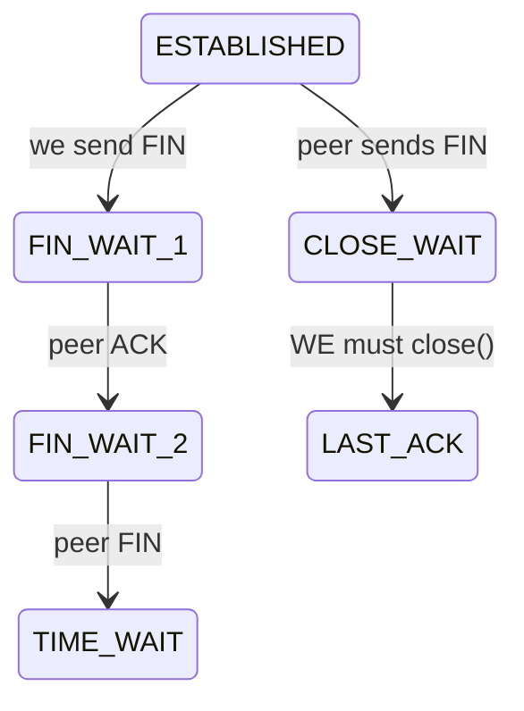

The single most valuable piece of TCP-state literacy for an application engineer is the difference between a pile of `TIME_WAIT` and a pile of `CLOSE_WAIT`, because one is usually benign and the other is almost always *your bug*. `TIME_WAIT` appears on the side that *initiated* the close, and the connection lingers there for a couple of minutes by design — the kernel keeps the socket around to absorb any stray late-arriving packets from the old connection so they don't corrupt a new one reusing the same port. A large number of `TIME_WAIT` sockets is therefore *normal* for a busy client and only becomes a problem at extreme connection churn (which, again, you fix by pooling so you stop opening and closing so many connections). `CLOSE_WAIT` is the opposite and far more sinister. When the *peer* closes the connection, your side moves to `CLOSE_WAIT` and *waits for your application to call `close()`* to complete the teardown. If your code never closes the resource — the classic cause being an HTTP response body or input stream that you read from but never closed — the socket is stuck in `CLOSE_WAIT` forever, holding a file descriptor hostage. A *rising, non-decreasing* count of `CLOSE_WAIT` sockets is a smoking gun for a resource leak in your own code, and it will march steadily toward `Too many open files` (§7.4) and take the process down. So the diagnostic reflex is: count the states with `ss`, and if `CLOSE_WAIT` is climbing, go find the HTTP client or stream you forgot to close — the kernel is telling you exactly which kind of bug you have.

- **Many `TIME_WAIT`:** normal for the side that closes first; problematic only at extreme churn → pool connections.
- **Many `CLOSE_WAIT`:** **application bug** — the peer closed but your app never called `close()`. This is a leak (often an unclosed HTTP response). It will exhaust FDs.

```bash
ss -tan | awk '{print $1}' | sort | uniq -c   # count states
```
Rising `CLOSE_WAIT` on the JVM side = find the unclosed resource.

### 7.7 TCP Backlog Full / Accept Queue

When a server `listen`s on a port, the kernel maintains a queue of connections that have completed the three-way handshake but that the application hasn't yet `accept`ed into its code — the *accept queue*, whose maximum depth is governed by `somaxconn` (and the app's `accept-count`). In steady state this queue is nearly empty because the app accepts connections as fast as they arrive. But under a sudden *burst* — a marketing campaign, a market-open spike, a thundering herd (§20.1) — connections can arrive faster than a momentarily-busy application can accept them, and the queue fills. Once it's full, the kernel has nowhere to put new completed handshakes, so it *drops the SYNs*, and the clients experience those as *connect timeouts* (§7.3) — the silent kind, where the SYN seemingly vanishes. The confusing part is that this looks like the server is *down or unreachable* (clients can't even connect) when in fact the server is *up and working*, just unable to drain its accept backlog fast enough during the spike. You diagnose it by watching the listen socket's queue depth (`ss -ltn` shows `Recv-Q` climbing toward the `Send-Q` maximum) and the kernel's "listen queue overflows" counter (`netstat -s`). The fixes work on both sides of the imbalance: raise the queue ceiling (`net.core.somaxconn` and the app's `accept-count`) so brief bursts have somewhere to wait rather than being dropped, *and* scale out / speed up acceptance so the app drains the queue faster. It's the §7 finite-resource theme once more — the accept queue is a bounded buffer, and a burst that outpaces draining overflows it.

**Theory:** under a connection burst, if the app accepts slower than SYNs arrive, the accept queue (`somaxconn`) overflows → SYNs dropped → client connect timeouts.

**Diagnose:** `ss -ltn` shows `Recv-Q` (current backlog) approaching `Send-Q` (max) on the listen socket; `netstat -s | grep -i listen` shows "listen queue overflows".
**Fix:** raise `net.core.somaxconn` and the app's `accept-count` (`server.tomcat.accept-count`), and scale out.

### 7.8 Keepalive, Half-Open, MTU, Fragmentation, Packet Loss, Jitter

This cluster of lower-level network phenomena rarely causes incidents but, when it does, produces some of the most baffling symptoms in this entire guide — connections that hang only on large payloads, or sockets that both ends believe are alive but that silently transmit nothing — so it pays to understand the mechanisms even if you meet them rarely. **Half-open connections** are the subtlest. Recall that TCP is a telephone call (§7.1) torn down by a polite FIN exchange. But if one side *dies abruptly* — a hard pod crash, a node power-off, a network partition — it never sends a FIN, so the *surviving* side has no idea the connection is gone. It sits there believing the call is still connected, and will keep believing that until it tries to *write* (and the write eventually fails) or until TCP's own keepalive probes give up — and the OS default for those probes is around *two hours*, far too long for a banking system. The result is a connection pool full of dead connections that look alive, handed out to requests that then hang. The defense is application-level heartbeats or aggressive keepalive so dead connections are detected in seconds, not hours.

**MTU and fragmentation** produce the signature "small requests work, large ones hang." Every network link has a Maximum Transmission Unit — the largest packet it will carry — and Kubernetes overlay networks (VXLAN and similar) *wrap* your packets in an outer header, which *reduces* the effective MTU below the standard 1500 (often to ~1450). Normally TCP discovers the right size, but if something sets the "Don't Fragment" bit and a packet larger than the path MTU hits a link that can't carry it, that packet is *silently dropped* rather than fragmented. Now the symptom is uncanny: tiny requests (a health check, a small GET) succeed because their packets fit, while large requests (a TLS handshake with a big certificate chain, a large JSON response) *stall* because their oversized packets vanish — and `ping`, which uses small packets, reports the host perfectly reachable, making it look like an application bug rather than a network one. The diagnostic `ping -M do -s 1472` deliberately sends a large, don't-fragment packet to prove or disprove an MTU mismatch. **Packet loss and jitter** round out the list: lost packets force TCP retransmissions that inflate latency *tails* (your p99 balloons while the median looks fine), and you confirm them with `mtr` or by reading the retransmit counters in `ss -ti`. The common thread is that these are *physical-layer truths leaking up into application symptoms*, which is exactly why they're so disorienting until you know to look below HTTP.

- **Keepalive mismatch:** see §7.2. Align client pool TTL < server keep-alive < LB idle.
- **Half-open connections:** one side died without FIN (hard crash, network partition). The survivor thinks the connection is alive until a write fails or TCP keepalive probes expire (default 2h — far too long). Enable app-level heartbeats/keepalive.
- **MTU / fragmentation:** overlay networks (VXLAN) reduce effective MTU (e.g., 1450). If something sets DF and path MTU is smaller, large packets are dropped → connections hang on large payloads but small ones work. **Symptom:** TLS handshake or large responses stall while pings succeed.
  ```bash
  ip link show     # check MTU
  ping -M do -s 1472 <host>   # DF; failures indicate MTU issue
  tracepath <host>
  ```
- **Packet loss / jitter:** retransmits inflate latency tails (p99). Diagnose with `mtr`, `ss -ti` (shows `retrans`), node NIC error counters.

---

## 8. TLS / SSL Troubleshooting

**Mental model — TLS is showing your passport at a border, and the whole system rests on a chain of trusted authorities.** When you cross a border, the officer doesn't personally know you; they trust your passport because it was issued by a government they recognize, whose authority traces back through a chain they accept. TLS works identically. A server proves its identity by presenting a *certificate* — a document stating "I am `api.bank.example.com`" — signed by a Certificate Authority (CA). Your client doesn't trust the certificate because of what it *says*; it trusts it because it was *signed by a CA the client already trusts*, and that CA may itself be vouched for by a higher CA, forming a *chain* that must terminate at a *root CA* sitting in the client's list of trusted authorities (its truststore). Validating a TLS connection therefore means answering several independent questions, and each TLS error corresponds to exactly one of them failing: *Is this certificate still valid in time?* (expiry), *Was it issued by an authority I trust?* (chain/trust), *Does the name on it match who I tried to reach?* (hostname/SAN), and *Can we agree on a cipher and protocol version to actually encrypt with?* (handshake negotiation). This is why the section opener says TLS errors are "precise once you read them" — unlike a vague 500, a TLS error message names the exact check that failed, and if you know the four questions, the message tells you the fix.

**Why banking is TLS-everywhere, including service-to-service mTLS.** In a normal web app, TLS protects the link between the user's browser and the edge, and internal traffic between services often runs in plaintext on the trusted internal network. A regulated bank cannot make the "trusted internal network" assumption — under a zero-trust model, an attacker who breaches one pod must not be able to read or impersonate traffic between *other* services. So banks encrypt internal traffic too, and frequently require **mutual TLS (mTLS)**, where not only does the server prove its identity to the client (as on the public web) but the client *also* proves its identity to the server, so each side cryptographically verifies the other before exchanging a single byte of account data. This doubles the number of things that can go wrong (now both sides need a certificate *and* a truststore), which is why §8.6 and the keystore-versus-truststore model in §8.7 matter so much in this environment.

### 8.1 Inspecting a Certificate

```bash
# Server cert + chain + dates + SANs
openssl s_client -connect keycloak.bank.example.com:443 -servername keycloak.bank.example.com </dev/null 2>/dev/null \
  | openssl x509 -noout -subject -issuer -dates -ext subjectAltName

# Just the expiry
echo | openssl s_client -connect api.bank.example.com:443 2>/dev/null | openssl x509 -noout -enddate

# Verify a chain
openssl verify -CAfile ca-bundle.pem server.pem
```

### 8.2 Certificate Expired

**Java:** `sun.security.validator.ValidatorException: PKIX path validation failed: java.security.cert.CertPathValidatorException: validity check failed` → caused by `CertificateExpiredException: NotAfter: ...`.
**Fix:** renew/rotate (cert-manager); the real fix is **automated rotation + expiry alerting** (alert at 30/14/7 days).
```bash
# cert-manager: check certificate resources
kubectl get certificate -A
kubectl describe certificate api-tls -n bank   # Renewal time, conditions
```

### 8.3 Certificate Not Trusted (PKIX path building failed)

This is, by a wide margin, the most common TLS error in internal banking systems, and understanding *why* it happens makes the fix obvious. Recall the border-crossing model: a client accepts a certificate only if it can build a chain of signatures from that certificate up to a root CA that it *already trusts*. Public websites use certificates signed by well-known commercial CAs (Let's Encrypt, DigiCert, etc.), and those root CAs ship pre-installed in every operating system and in the JVM's bundled truststore (`cacerts`), so the chain builds automatically and you never think about it. But banks run their *own internal CA* to issue certificates for internal services — it is cheaper, faster, and keeps internal infrastructure out of public certificate-transparency logs. That internal CA is, by definition, *not* in anyone's default truststore. So when your Java service connects to an internal endpoint whose certificate was signed by the internal CA, the JVM tries to build the trust chain, reaches the internal CA, finds it is not among the roots it trusts, and gives up with the famous error: `PKIX path building failed: unable to find valid certification path to requested target`. The phrase "path building failed" is literal — it could not build a path of trust to a known root. The fix is correspondingly literal: you must *add the internal CA certificate to the truststore* the JVM uses, either by importing it into the bundled `cacerts` or, better, by mounting a dedicated truststore (via a Kubernetes Secret) and pointing the JVM at it. This is also the precise explanation for the classic "works on my laptop, fails in the pod" symptom: the engineer's laptop has the corporate CA installed in its OS keychain, but the minimal container image does not — same certificate, different truststore, opposite outcome.

**Java:**
```
javax.net.ssl.SSLHandshakeException: PKIX path building failed:
  sun.security.provider.certpath.SunCertPathBuilderException:
  unable to find valid certification path to requested target
```
**Root cause:** the issuing CA (often an internal/corporate CA) is not in the JVM truststore. Extremely common for internal banking PKI.

**Fix — add CA to truststore:**
```bash
keytool -importcert -trustcacerts -alias bank-internal-ca \
  -file bank-ca.crt -keystore $JAVA_HOME/lib/security/cacerts -storepass changeit -noprompt
# Or a dedicated truststore mounted via Secret:
java -Djavax.net.ssl.trustStore=/etc/ssl/truststore.jks \
     -Djavax.net.ssl.trustStorePassword=*** -jar app.jar
```
Mount the CA in K8s:
```yaml
volumeMounts: [{ name: truststore, mountPath: /etc/ssl, readOnly: true }]
volumes: [{ name: truststore, secret: { secretName: bank-truststore } }]
```

### 8.4 Hostname / SAN Mismatch

**Java:** `javax.net.ssl.SSLPeerUnverifiedException: Certificate for <account-service> doesn't match any of the subject alternative names: [account-service.bank.svc.cluster.local]`.
**Cause:** connecting via a name not in the cert SANs (e.g., pod IP, short name, or wrong host).
**Fix:** connect using a name present in the SANs; reissue cert with the right SANs; **never** disable hostname verification in banking prod (a tempting but dangerous "fix").

### 8.5 TLS Version / Cipher Mismatch

The TLS handshake includes a *negotiation* step where client and server must agree on a protocol version (TLS 1.2, 1.3) and a cipher suite (the specific algorithms used to encrypt the session). The negotiation works like two people trying to find a common language: the client offers the set it supports, the server picks one it also supports, and they proceed — but if the two sets *don't overlap at all*, there is no common language, and the handshake fails outright with `handshake_failure` or "No appropriate protocol." This is fundamentally different from the trust and hostname errors above: nothing is wrong with the certificate; the two endpoints simply cannot agree on *how* to encrypt. In banking this mismatch is usually *self-inflicted by security hardening*, which is the irony — the very policies that strengthen TLS are what break it. A JDK upgrade disables the old TLS 1.0/1.1 that a legacy partner still requires; a FIPS-compliance mandate removes a cipher that one side depended on; a server hardened to TLS 1.3-only meets a client that only speaks 1.2. The "it worked yesterday" framing is a strong clue, because cipher/protocol sets change with library and JDK upgrades and policy edits, not with traffic. The diagnosis is to *enumerate what each side actually offers*: `nmap --script ssl-enum-ciphers` lists the server's supported versions and ciphers, `openssl s_client -tls1_2` tests whether a specific version even completes, and `-Djavax.net.debug=ssl:handshake` prints the JVM's view of the negotiation (verbose, but it shows exactly which versions and ciphers the client proposed and how the server responded). The fix is to restore an overlapping set — but *deliberately*, biased toward keeping strong protocols and re-enabling a weak one only when an external dependency genuinely requires it, never by globally weakening TLS to make an error disappear.

**Java:** `javax.net.ssl.SSLHandshakeException: No appropriate protocol (protocol is disabled or cipher suites are inappropriate)` or `Received fatal alert: handshake_failure`.
**Cause:** client offers only TLS 1.3, server allows only 1.2 with specific ciphers; or FIPS policy disables a cipher; or an old client post-JDK-upgrade that disabled TLS 1.0/1.1.
**Diagnose:**
```bash
nmap --script ssl-enum-ciphers -p 443 api.bank.example.com
openssl s_client -connect host:443 -tls1_2   # force a version
java -Djavax.net.debug=ssl:handshake -jar app.jar   # verbose handshake (then GREP, it's huge)
```

### 8.6 Mutual TLS (mTLS)

Ordinary "one-way" TLS, as used on the public web, is asymmetric: the *server* proves its identity to the client (so your browser knows it's really talking to the bank), but the client remains anonymous at the TLS layer (the server has no cryptographic proof of who the browser is — it relies on the password or token *inside* the connection for that). **Mutual TLS makes the proof symmetric**: now the client *also* presents a certificate, and the server cryptographically verifies it before exchanging any application data. Why would a bank want this internally? Because under zero-trust, "a request arrived on the internal network" is not proof that it came from a legitimate service — an attacker who compromised one pod could try to call `ledger-service` directly. With mTLS, `ledger-service` will refuse to even begin an application conversation unless the caller presents a certificate signed by a CA `ledger-service` trusts, so an unauthorized pod cannot impersonate `account-service` at the connection level. It is identity established in the TLS handshake itself, before HTTP, before the JWT.

The reason mTLS doubles the failure surface is the keystore/truststore symmetry from §8.7: now *both* sides need *both* stores. The server needs a keystore (to prove itself, as always) *and* a truststore (to verify the client's cert — new). The client needs a truststore (to verify the server, as always) *and* a keystore (to present its own cert — new). So mTLS failures come in matched pairs, and the *alert* tells you which half is missing. A `certificate_required` alert means the server demanded a client certificate and the client presented none — the *client's keystore* is unconfigured or empty. A `bad_certificate` alert means a certificate *was* presented but the verifying side rejected it — typically the verifier's *truststore* lacks the CA that signed the presented cert. In a **service mesh** (Istio, Linkerd) mTLS is usually handled transparently by sidecar proxies rather than your application, which is a blessing (no app-level cert management) and a debugging twist: an "mTLS error" in a meshed environment is often a *sidecar certificate rotation* issue, not an application misconfiguration, and you diagnose it with mesh tooling (`istioctl proxy-config secret <pod>`) rather than `keytool`.

Service A must present a client cert that Service B trusts, and vice versa.
**Failures:** `bad_certificate`, `certificate_required` alerts; A has no keystore configured; B's truststore lacks A's CA.

**Spring Boot mTLS (server side):**
```yaml
server:
  ssl:
    enabled: true
    key-store: classpath:server-keystore.p12
    key-store-password: ${KS_PASS}
    key-store-type: PKCS12
    trust-store: classpath:truststore.p12     # CAs we accept from clients
    trust-store-password: ${TS_PASS}
    client-auth: need        # require client cert (mTLS)
    protocol: TLS
    enabled-protocols: TLSv1.3,TLSv1.2
```
**Client side (WebClient mTLS):**
```java
SslContext ssl = SslContextBuilder.forClient()
    .keyManager(clientCertFile, clientKeyFile)   // present our identity
    .trustManager(caBundleFile)                  // trust the server's CA
    .build();
HttpClient http = HttpClient.create().secure(s -> s.sslContext(ssl));
WebClient client = WebClient.builder()
    .clientConnector(new ReactorClientHttpConnector(http)).build();
```
**In a service mesh** (Istio/Linkerd) mTLS is often handled by sidecars — then app-level TLS errors may actually be mesh cert rotation issues (`istioctl proxy-config secret <pod>`).

### 8.7 Keystore vs Truststore (mental model)

Engineers confuse these two constantly, and the confusion causes hours of misdirected debugging, so it is worth nailing down with a crisp analogy and never forgetting it. **Your keystore is your wallet; your truststore is your list of IDs you'll accept.** The keystore holds *your own* identity — your private key and the certificate that proves who you are — and you reach into it when you need to *prove yourself to someone else*, exactly like pulling your own passport out of your wallet. The truststore holds the *certificates of authorities you're willing to believe* — it is your answer to the question "whose ID will I accept as genuine?" — and you consult it when you need to *verify the other party*, like a bartender checking whether an ID was issued by a real state. The two never overlap in purpose: one is about asserting your identity, the other about accepting someone else's.

From this, the rules about who needs what fall out logically rather than needing memorization. A **server** on the public web always needs a **keystore**, because its entire job in the handshake is to prove "I really am `api.bank.example.com`" — but it usually needs no truststore, because it doesn't care to verify the anonymous browsers connecting to it. A **client** always needs a **truststore**, because it must verify the server it's connecting to is genuine (this is the truststore that's missing in the §8.3 PKIX error) — but on the public web it needs no keystore, because the server isn't asking the client to prove identity via certificate. **Mutual TLS flips on the missing halves**: now the server *also* demands the client prove itself, so the client must additionally have a keystore (its own identity to present), and the server must additionally have a truststore (to verify the client's certificate). So the full mTLS picture is: both sides carry a wallet (keystore) *and* a list of accepted IDs (truststore). When an mTLS handshake fails, this model tells you exactly where to look — a `bad_certificate`/`certificate_required` alert means the *presenting* side's keystore is missing or wrong, while a trust failure means the *verifying* side's truststore lacks the presenter's CA.

- **Keystore** = *my* identity (private key + my cert). Used to *prove who I am*.
- **Truststore** = *who I trust* (CA certs). Used to *verify the other party*.
- Server needs keystore (always) + truststore (only for mTLS). Client needs truststore (always) + keystore (only for mTLS).

---
## 9. HTTP Protocol Problems

**Mental model — HTTP status codes are a structured vocabulary, and the first digit tells you who is to blame.** The designers of HTTP grouped status codes into classes precisely so that a machine (or a tired engineer at 3 AM) could triage a response at a glance. The `2xx` class means success. The `3xx` class means redirection ("go look over there"). The `4xx` class means **the client did something wrong** — the request was malformed, unauthenticated, unauthorized, or aimed at something that doesn't exist; the server is fine and is telling you to fix your request. The `5xx` class means **the server (or a gateway) failed** — the request may have been perfectly valid, but something broke while handling it. This `4xx`-versus-`5xx` split is the most important first cut in HTTP debugging, because it points your investigation in opposite directions: a `4xx` says "look at what the caller sent (the token, the body, the path, the headers)," while a `5xx` says "look at what the server or gateway did (the crash, the timeout, the unready pod)." 

But in a gateway-fronted microservice architecture there is a second, equally important question layered on top of the digit: **which component emitted this code?** As established in §1.3, the same status code can come from different layers and mean different things — a 404 from Kong (no route) versus a 404 from Spring (no controller mapping), a 401 from Kong's plugin versus a 401 from Spring Security's validator, a 503 from Kong (no healthy upstream) versus a 503 your app deliberately returned. So reading an HTTP failure is always a two-part question: *what class of problem (the digit)* and *which jurisdiction emitted it (the headers)*. The reference table below encodes both — "who usually emits" and "typical banking cause" — and the subsections that follow unpack the codes that carry the most operational subtlety. Master this and you can localize a huge fraction of incidents from the response line alone, before opening a single log.

### 9.1 Status Code Quick Reference (with banking context)

| Code | Name | Who usually emits | Typical banking cause | First check |
|------|------|-------------------|----------------------|-------------|
| 400 | Bad Request | app / Kong | malformed JSON, failed `@Valid`, bad query param | request body & validation logs |
| 401 | Unauthorized | Kong / Spring Security | missing/expired/invalid JWT, wrong issuer | `WWW-Authenticate`, token exp |
| 403 | Forbidden | Spring Security / Kong ACL | missing role/scope, wrong audience | authorities mapping |
| 404 | Not Found | Kong (route) / app (mapping) | no route, `strip_path`, wrong path | `Server` header, route list |
| 405 | Method Not Allowed | app | wrong HTTP verb on mapping | `Allow` header |
| 406 | Not Acceptable | app | `Accept` header server can't satisfy | Accept vs produces |
| 408 | Request Timeout | server | client too slow sending | rare; LB idle |
| 413 | Payload Too Large | Kong/nginx/app | upload bigger than limit | body size, limits |
| 415 | Unsupported Media Type | app | wrong/missing `Content-Type` | Content-Type header |
| 429 | Too Many Requests | Kong / app | rate limit hit | `Retry-After`, `RateLimit-*` |
| 431 | Request Header Fields Too Large | nginx/Kong/Tomcat | JWT too big, too many roles | header size |
| 500 | Internal Server Error | app | unhandled exception | stack trace |
| 502 | Bad Gateway | Kong/Ingress | upstream crashed/refused/malformed | upstream health |
| 503 | Service Unavailable | Kong/K8s | no healthy/ready pods | endpoints, probes |
| 504 | Gateway Timeout | Kong/Ingress | upstream too slow | read_timeout, slow query |

### 9.2 400 Bad Request

**Symptoms:** Whitelabel `{"status":400,"error":"Bad Request","path":"/transfers"}`; or with a `@ControllerAdvice`, a structured validation error list.
**Causes:** JSON parse error (trailing comma, wrong type `"amount":"abc"`), `@Valid` failure, missing required param, type mismatch (`/accounts/abc` where `Long id`).
**Diagnose:** log the raw body (carefully — never log full PANs/tokens), enable `DEBUG` on `o.s.web`.
**Example handler:**
```java
@RestControllerAdvice
public class ApiExceptionHandler {
  @ExceptionHandler(MethodArgumentNotValidException.class)
  ResponseEntity<ProblemDetail> onValidation(MethodArgumentNotValidException ex) {
    var pd = ProblemDetail.forStatus(HttpStatus.BAD_REQUEST);
    pd.setTitle("Validation failed");
    pd.setProperty("errors", ex.getBindingResult().getFieldErrors().stream()
        .map(f -> Map.of("field", f.getField(), "message", f.getDefaultMessage())).toList());
    return ResponseEntity.badRequest().body(pd);
  }
}
```

### 9.3 413 Payload Too Large

The instructive thing about a 413 is that it can be emitted by *any* layer the request passes through, each of which independently enforces its *own* maximum body size as a defense against memory-exhaustion attacks — and that is exactly what makes it frustrating to fix. A cheque-image or KYC-document upload travels browser → Kong → Tomcat → Spring's multipart parser, and *each* of those has a size limit: Kong (via nginx directives or the request-size-limiting plugin), Tomcat (`max-http-form-post-size`, `max-swallow-size`), and Spring (`spring.servlet.multipart.max-file-size`/`max-request-size`). The request is rejected by the *first* layer whose limit it exceeds, which means raising the limit in your Spring config and re-testing can still yield a 413 — because Kong rejected it before it ever reached Spring. This is the classic "I increased the limit but it still fails" loop, and the resolution is to recognize that *all* the limits along the path must be raised consistently to the new maximum; raising one while another stays low just moves which layer says no. The discipline mirrors §3.3 (the 413's header-size cousin, which is also enforced at multiple layers): when a size limit bites, enumerate *every* layer in the path and align them, and identify *which* layer emitted the specific 413 (by its `Server` header / body shape) so you know where the binding constraint currently sits.

**Causes:** document/cheque image upload exceeds limits at multiple layers.
**Fix all layers:**
```yaml
# Spring Boot
spring:
  servlet:
    multipart:
      max-file-size: 10MB
      max-request-size: 12MB
# Tomcat
server:
  tomcat:
    max-swallow-size: 12MB
    max-http-form-post-size: 12MB
```
```yaml
# Kong / nginx
# Kong: client_max_body_size via nginx directives or the request-size-limiting plugin
plugins:
  - name: request-size-limiting
    config: { allowed_payload_size: 10 }  # MB
```

### 9.4 431 Request Header Fields Too Large

This deserves special attention because it is a *signature banking incident* — the kind of failure that is almost unique to enterprise identity systems and that will baffle you until you've seen it once. Here is the mechanism. Every JWT a user carries is sent on *every* request, inside the `Authorization` header. The size of that token depends on how many claims Keycloak stuffs into it — and in a bank, authorization is rich: a user can belong to dozens of groups, hold dozens of realm and client roles, and carry fine-grained entitlements. Each of those becomes a claim, and a token that encodes a privileged operations user's entire role graph can swell to 8, 10, even 15 KB. Meanwhile, every HTTP server (Tomcat, nginx, Kong) imposes a maximum size on the request *header block* — commonly around 8 KB — as a defense against memory-exhaustion attacks. When the fat token exceeds that limit, the server rejects the request with `431 Request Header Fields Too Large` before your application ever runs. 

The reason this is so confusing in practice is its *selectivity*: ordinary customers, who belong to one or two groups, have small tokens and never trip the limit, so the system looks perfectly healthy in normal testing and for the vast majority of users. It is only the *administrators and operations staff* — precisely the people with the most roles — whose tokens are large enough to fail, and they fail *every* request, seeing a completely broken application while everyone else is fine. The tell-tale pattern "it breaks only for high-privilege users and breaks totally for them" should make 431/token-bloat your immediate hypothesis, confirmed in seconds by measuring the token size. The *correct* fix is to shrink the token (the root cause is that you're minting bloated tokens), by trimming protocol mappers so the token carries only the claims the receiving services actually check, dropping full group-path strings, and pushing very fine-grained permissions into a separate authorization lookup rather than the token itself. Raising the header-size limit is a legitimate *stopgap* to stop the bleeding, but it treats the symptom — and a token that's 15 KB today will be 30 KB after the next reorganization adds more groups.

**The banking classic.** A user with many groups/roles gets a JWT so large the header exceeds limits. Works for normal users, fails for admins/ops.
**Errors:** `431` from nginx/Tomcat, or Tomcat log `Request header is too large`.
**Diagnose:** measure token size — `echo -n "$TOKEN" | wc -c`. If > ~6–8KB, that's your problem.
**Fixes:**
1. **Shrink the token** (best): don't dump every realm role into the access token. Use scopes, fine-grained authorization, or a token with only the roles relevant to the audience. Configure protocol mappers to exclude full group paths.
2. Raise limits as a stopgap:
```yaml
server:
  max-http-request-header-size: 32KB   # Spring Boot 3 (Tomcat)
```
   Kong/nginx: `large_client_header_buffers 4 32k;`.

### 9.5 415 Unsupported Media Type / 406 Not Acceptable

- **415:** client sent `Content-Type: text/plain` (or none) to a `@PostMapping(consumes="application/json")`. Fix client header, or relax `consumes`.
- **406:** client `Accept: application/xml` but controller only `produces` JSON. Align `Accept`.

### 9.6 429 Too Many Requests

A 429 is a *cooperative back-pressure signal*, and the reason it matters beyond the gateway-level discussion in §4.6 is that it sits at the heart of the retry-storm feedback loop (§20.1) — handled well it dampens overload, handled badly it amplifies it. When a server returns 429 it is saying "you're sending faster than I can accept; slow down," and the *contract* for making that work is the `Retry-After` header, which tells the client *how long* to wait before trying again. A well-behaved client reads `Retry-After` and backs off accordingly; the system self-regulates. The failure mode is a client that *ignores* `Retry-After` and immediately retries — now the 429 meant to reduce load instead triggers an instant retry that adds load, and a fleet of such clients turns a momentary overload into a sustained storm. So the two halves of doing 429 correctly are: as a *server*, always return `Retry-After` and a structured body so clients can back off intelligently; as a *client*, always honor `Retry-After` (with jitter, §20.1) rather than hammering. App-side rate limiting (Bucket4j, Resilience4j `RateLimiter`) lets a service protect *itself* independently of the gateway — useful for expensive endpoints. And the banking-specific imperative, restated from §18.3: never let your own services hammer Keycloak's token endpoint into returning 429s, because cached service tokens (refreshed near expiry) keep that traffic to a trickle, whereas per-call token fetches can rate-limit your *entire platform's authentication*.

See Kong §4.6. App-side bucket example (Bucket4j / Resilience4j RateLimiter). Always return `Retry-After` and a structured body so clients back off correctly. **Don't** let clients hammer Keycloak's token endpoint — cache tokens until near expiry (see §18).

### 9.7 500 / 502 / 503 / 504 — distinguishing them

These four codes are the bread-and-butter of production incidents, and confusing them wastes enormous amounts of time, so it is worth fixing their distinct meanings firmly in mind with a single unifying question: *did the request reach a working application, and if so, what happened to it there?* A **500** is special: it almost always comes from *your own application* (recognizable by the whitelabel or problem-detail body shape, no `Server: kong`), and it means your code ran and threw an unhandled exception. That is genuinely *your bug*, and the good news is there is a stack trace waiting in your application logs — find it by the trace ID and the top application frame names the line to fix. The other three come from the *gateway* and describe failures of the hop *between* the gateway and your app, which is why they share the gateway's fingerprints. A **502** means the gateway reached out and got a *broken* answer — the pod refused the connection, crashed mid-response, or spoke an incompatible protocol (HTTP/2 to an HTTP/1-only server); something answered but answered wrong. A **503** means the gateway had *nobody to ask* — no healthy, ready backend exists, because a deploy is mid-flight, all readiness probes are failing, or the deployment is scaled to zero. A **504** means the gateway reached a *live* backend that simply *took too long* — the app is up and accepting requests but is hung, blocked on a slow query, starved of database connections, or stuck in a GC pause. The mnemonic chain: 500 = "my code threw," 502 = "got a broken reply," 503 = "no one to reply," 504 = "reply too slow." Each sends you to a different place — 500 to your stack trace, 502 to pod health and protocol, 503 to endpoints and probes, 504 to downstream latency and connection pools — and the decision tree below routes you there from the `Server` header and the specific code.

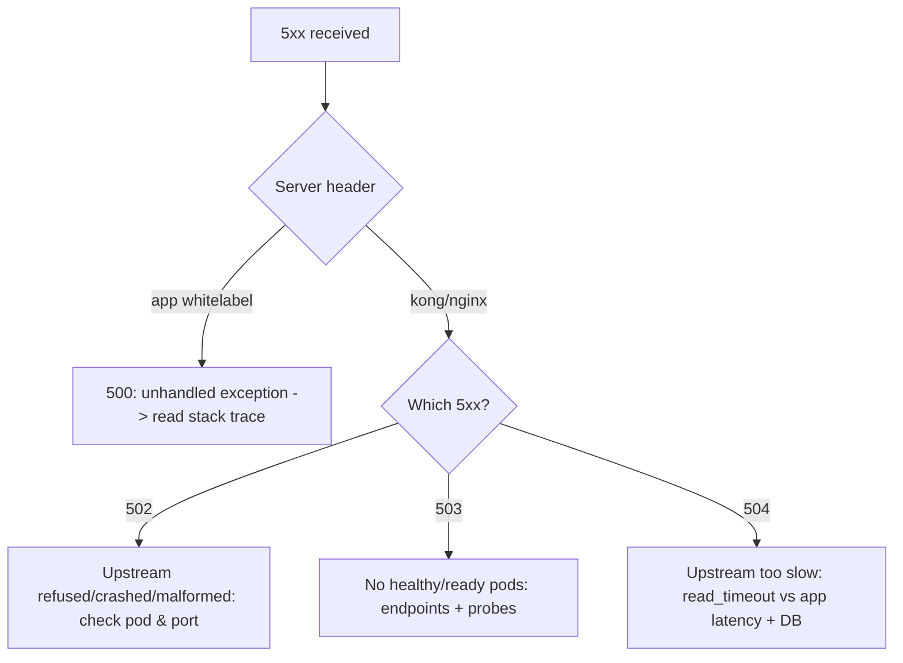

- **500** is *your* bug — there's a stack trace in app logs. Find it via trace-id.
- **502** the upstream returned garbage or refused — pod crash, wrong protocol (h2 vs h1), app wrote partial response.
- **503** no backends ready — deploy in progress, all probes failing, scaled to zero.
- **504** upstream alive but slow — almost always a downstream/DB hang; correlate with `hikaricp_connections_pending` and slow query logs.

### 9.8 Compression, Chunked Transfer, Keep-Alive, HTTP/2, Proxies

Beyond status codes, HTTP has a set of *transport-level mechanisms* that normally work invisibly but, when two layers disagree about them, produce baffling corruption and latency bugs. The unifying theme is that in a multi-hop architecture (browser → CDN → Kong → app), *every hop independently makes decisions about compression, connection reuse, protocol version, and header handling*, and trouble arises when two hops make *incompatible* decisions. **Compression** is negotiated via `Accept-Encoding`/`Content-Encoding`: the client advertises it accepts gzip, and one server compresses. The bug is *double-compression* — the application gzips the body, then the gateway gzips it again — producing bytes the client decompresses once and finds still-compressed, surfacing as a JSON parse error on a response that "looks fine" in the logs. The fix is to make exactly one layer own compression. **Chunked transfer encoding** (`Transfer-Encoding: chunked`) lets a server stream a response whose total size it doesn't know in advance (a live export, server-sent events); a proxy that *buffers* the whole response before forwarding it defeats streaming and adds latency, and historically, proxies that mishandle the interaction of `chunked` with `Content-Length` opened request-smuggling vulnerabilities — a reason to keep proxies patched. **Keep-Alive** is the connection-reuse mechanism whose idle-timeout mismatch causes the connection resets of §7.2. **HTTP/2** multiplexes many requests over one connection, but a *version mismatch between hops* — Kong speaking HTTP/2 to an app that only understands HTTP/1 cleartext — yields a 502, because the app can't parse what the gateway sent. **Proxy header handling** is the quiet one: every proxy must correctly rewrite or preserve headers, strip hop-by-hop headers (`Connection`, `Keep-Alive`) that must not be forwarded, and *add* the `X-Forwarded-For`/`Proto`/`Host` headers that tell the backend the *original* client's IP, scheme, and host. The most common consequence of getting this wrong is the missing `X-Forwarded-Proto: https`, which makes Spring or Keycloak believe the original request was plain HTTP and emit redirects to `http://` URLs — triggering the mixed-content blocking of §3.6. Each of these is invisible until two hops disagree, which is exactly why they're so confusing to debug: nothing is "broken," two correct components just made incompatible choices.

- **Compression:** `Accept-Encoding: gzip`. Mismatch (double-compression by app + gateway) corrupts bodies → client JSON parse errors. Pick one compressor.
- **Chunked transfer (`Transfer-Encoding: chunked`):** streaming responses; a proxy that buffers can break SSE/streaming or add latency. Some proxies mishandle chunked + `Content-Length` together (request smuggling risk — keep proxies patched).
- **Keep-Alive:** see §7.2 for the idle-timeout reset trap.
- **HTTP/2:** gateway↔app protocol mismatch (gateway speaks h2, app only h1c) → 502. Ensure consistent protocol or h2 prior-knowledge config.
- **Proxy behavior:** every hop may rewrite headers, strip hop-by-hop headers (`Connection`, `Keep-Alive`), and must set `X-Forwarded-For/Proto/Host`. Missing `X-Forwarded-Proto` → wrong redirect scheme (see §3.6).

**HTTP request/response example (full):**
```http
GET /accounts/123/balance HTTP/1.1
Host: api.bank.example.com
Authorization: Bearer eyJhbGciOiJSUzI1Ni␣...
Accept: application/json
X-Request-Id: 8f3c2a91-...

HTTP/1.1 200 OK
Content-Type: application/json
Cache-Control: no-store
X-Request-Id: 8f3c2a91-...
X-Kong-Upstream-Latency: 42
X-Kong-Proxy-Latency: 3

{"accountId":"123","balance":"1042.55","currency":"USD"}
```

---
## 10. Keycloak Troubleshooting

**Mental model — Keycloak is a passport office, and a JWT is the passport it issues.** A passport office's job is *issuance*: it verifies who you are through some process (a password login, a fingerprint, a sponsoring organization's letter), and then issues a tamper-proof document that *other* authorities will trust without re-verifying you from scratch. Crucially, once the passport is issued, the office is *not* consulted every time you cross a border — the border guard inspects the passport itself, checking its security features against publicly known specimens. Keycloak works exactly this way: during login or a client-credentials exchange it authenticates the principal and *issues* a signed JWT, and from then on the resource servers (Kong, Spring Security) verify that JWT *themselves* using Keycloak's published public keys, without calling back to Keycloak on each request. Internalizing this issuance-versus-verification split is the key to Keycloak debugging, because it tells you that most "Keycloak is rejecting my requests" incidents are not Keycloak failing at runtime at all — they are *disagreements between what Keycloak stamped into the passport at issuance time and what the border guard was told to expect at verification time*. Issuer, audience, signing key, expiry: each is a field stamped at issuance and checked at verification, and a mismatch in any one is forged-passport-looking even though nothing is malicious.

**The token issuance flow, concretely.** When a client authenticates, it calls Keycloak's *token endpoint* within a specific **realm** (a realm is an isolated tenant — its own users, clients, roles, and signing keys; `bank` and `bank-staging` are different realms that share nothing). The request names a **client** (an application registered in that realm, e.g., `web-app` or `account-service`), and the grant type determines how identity is proven (password, authorization-code, client-credentials). Keycloak authenticates the principal, then *assembles the token's claims* by running the client's configured **protocol mappers** — these are the rules that decide which roles, groups, scopes, and custom attributes get copied into the JWT. It sets standard claims (`iss` = this realm's canonical issuer URL, `sub` = the principal, `exp`/`iat` = lifetimes, `aud` = the intended audiences if an audience mapper is configured), then *signs* the whole thing with the realm's current private signing key, stamping the key's `kid` into the token header. The matching *public* key is published at the realm's JWKS endpoint so verifiers can check the signature. Every failure mode in this section maps to one step of that flow: realm resolution (wrong realm → wrong keys, wrong issuer), client/grant configuration (wrong secret, disabled grant), protocol mappers (missing roles/audience), and signing (key rotation breaking signature checks). Keycloak is the identity backbone, and most "auth is broken" incidents trace to a handful of these issuance-time misconfigurations: issuer mismatch, audience, key rotation, and role mapping.

### 10.1 Discovery & JWKS — always start here

Before debugging any specific token, you must know the *authoritative* answers to "what issuer does this realm claim, and which signing keys does it currently publish?" — and Keycloak exposes both through standard OpenID Connect endpoints, which is why every Keycloak investigation starts here. The **discovery document** (`/.well-known/openid-configuration`) is the realm's self-description: it declares the canonical `issuer` string (the exact value that will appear in every token's `iss` claim and that every verifier must be configured to expect), the `token_endpoint` (where tokens are minted), the `jwks_uri` (where public keys live), and more. The **JWKS endpoint** (`/protocol/openid-connect/certs`) publishes the realm's current set of public signing keys, each tagged with a `kid`. The reason this is the universal starting point is that it lets you compare the *issuer's* truth against the *verifier's* configuration and against the *failing token's* contents — three things that must agree and whose disagreement is the root of nearly every auth incident. The `issuer` value returned here is the single source of truth: every resource server's `issuer-uri` must match it character-for-character (scheme, host, port, path), and every valid token's `iss` claim must equal it.

```bash
REALM=bank; KC=https://keycloak.bank.example.com
curl -s $KC/realms/$REALM/.well-known/openid-configuration | jq \
  '{issuer, token_endpoint, jwks_uri, authorization_endpoint}'
curl -s $KC/realms/$REALM/protocol/openid-connect/certs | jq '.keys[] | {kid, alg, use}'
```
The `issuer` value here is the **single source of truth**. Every resource server's `issuer-uri` must match it *exactly* (scheme + host + path), and every token's `iss` claim must equal it.

### 10.2 Issuer Mismatch (internal vs external URL) — the #1 banking auth bug

This is the most common Keycloak auth failure in Kubernetes-based banks, and it flows directly from the issuance-versus-verification model: the `iss` claim is *stamped at issuance* from whatever hostname Keycloak believes is its own, but it is *checked at verification* against whatever hostname the resource server was configured to expect — and in a cluster, Keycloak typically has *two* hostnames. From outside the cluster it is reached at a public name like `https://keycloak.bank.example.com` (through the ingress, with real TLS); from inside the cluster, services reach it at the internal Service name `http://keycloak.bank.svc.cluster.local:8080` (no public DNS, often plain HTTP because TLS is terminated at the edge). The problem arises when these two URLs leak into the token lifecycle inconsistently. If a token is minted via the external URL, its `iss` is `https://keycloak.bank.example.com/realms/bank`; but a resource server that was configured with the *internal* issuer URL will compute "expected issuer = internal URL," see that the token's `iss` doesn't match, and reject every otherwise-valid token with `The iss claim is not valid`. The deeper fix is to make Keycloak *always* stamp one canonical issuer regardless of which network path reached it — that is exactly what `KC_HOSTNAME`/`KC_HOSTNAME_STRICT` do: they pin the issuer (and all the URLs in the discovery document) to a single canonical value. Then every verifier is configured to expect that one canonical issuer, while still being permitted to *fetch JWKS* over the fast internal path if desired (Spring lets you separate `issuer-uri`, used for the `iss` check, from `jwk-set-uri`, used to fetch keys). The mental check whenever you see an `iss` error is always the same: "decode the token's `iss`, read the verifier's configured issuer, and find where the two URLs diverge."

**Scenario:** Keycloak is reachable as `https://keycloak.bank.example.com` externally but `http://keycloak.bank.svc.cluster.local:8080` internally. Tokens minted via the external URL carry `iss: https://keycloak.bank.example.com/realms/bank`. A service configured with the internal `issuer-uri` rejects them.

**Error:**
```
An error occurred while attempting to decode the Jwt:
The iss claim is not valid
```
**Fix:** Set Keycloak's **frontend URL / hostname** so it always issues a consistent `iss` regardless of access path (`KC_HOSTNAME=keycloak.bank.example.com`, `KC_HOSTNAME_STRICT=true`). Configure resource servers to validate against that canonical issuer, but allow them to *fetch JWKS* via the internal URL if needed (Spring: set `issuer-uri` to canonical, or `jwk-set-uri` to internal + `issuer` validation to canonical).

### 10.3 Audience Problems

The `aud` (audience) claim answers the question *"which services is this token meant for?"*, and it exists to prevent a subtle but serious form of privilege escalation called the **confused deputy / token-replay** problem. Consider why it matters: if every token a user holds is accepted by *every* service in the realm, then a token the user innocently presented to a low-value service (say, a public marketing API) could be *replayed* by that service — or by an attacker who captured it there — against a high-value service (the payments API), because nothing ties the token to a specific intended recipient. Audience restriction closes this: a service that *enforces audience* accepts a token only if its `aud` claim *includes that service*, so a token minted for `marketing-api` is useless against `payments-api`. The operational friction is that **Keycloak does not, by default, put a meaningful `aud` in access tokens** — so the moment a resource server starts enforcing audience (a security best practice, especially in banking), it begins rejecting tokens that don't list it, even though the tokens are otherwise valid. The fix is on the *issuance* side (consistent with the §10 issuance-versus-verification model): configure an **audience protocol mapper** or a client scope so that tokens intended for `account-service` actually carry `aud: account-service`. This intersects directly with token *propagation* (§18.2): when `account-service` forwards a user token downstream to `ledger-service`, that token's `aud` must include `ledger-service` or the downstream rejects it — which is why richly-connected call graphs sometimes need multi-audience tokens or token exchange (§18.4). The diagnostic whenever you see an audience rejection is to decode the token's `aud` array and compare it against what the rejecting service requires.

By default Keycloak access tokens may not contain the `aud` your service expects. If your resource server enforces audience, tokens are rejected.
**Fix:** add an **Audience protocol mapper** (or use a client scope) so tokens include `aud: account-service`.
```
Client scopes -> account-service-audience -> Mappers -> Audience
  Included Client Audience: account-service
```

### 10.4 Key Rotation / JWKS Cache

To understand why key rotation causes outages you have to picture the *timing* of two independent caches against two independent lifetimes. Keycloak periodically rotates its signing keys for good security hygiene — it generates a new key, starts signing fresh tokens with it (stamping the new `kid` into their headers), and ideally keeps the old key around in a "passive" state so that tokens *already minted* with the old key can still be verified until they expire. On the other side, every verifier (Spring Security, Kong) caches the JWKS public keys it fetched, because re-fetching them on every request would be absurd. A signature check works only when the verifier's cache contains the public key whose `kid` matches the token in hand. Rotation breaks this in two distinct ways, and you should be able to name which one you're hitting. The first is *insufficient overlap at issuance*: if Keycloak retires the old key *immediately* instead of keeping it passive, then tokens minted a minute before rotation reference a `kid` that no longer exists anywhere, and they fail verification until they expire — an outage for the duration of one token lifetime (this is War Story C.1). The second is *stale verifier cache*: Keycloak rotated correctly and the new key is published, but a verifier cached the old JWKS set and hasn't refreshed, so it doesn't recognize the new `kid` on incoming tokens. The robust design defends against both: Keycloak keeps the previous key passive for at least twice the maximum token lifetime, and verifiers refresh JWKS *on encountering an unknown `kid`* rather than only on a fixed timer (Spring's `NimbusJwtDecoder` does exactly this automatically — which is why a naive caching proxy placed in front of the JWKS endpoint can paradoxically *break* an otherwise self-healing verifier). The diagnostic is always the same triangulation: read the failing token's `kid`, list the `kid`s Keycloak currently publishes, and see whether the token's key is missing (rotation/overlap problem) or present-but-not-in-the-verifier's-cache (stale cache problem).

**Error:** `Invalid signature` / `Unable to find a signing key that matches`.
**Fix:** Keep rotation overlap (keep old key as passive while new is active); ensure resource servers refresh JWKS on unknown `kid` (Spring Security `NimbusJwtDecoder` does this automatically — but a fixed `jwk-set-uri` with bad caching in front can break it). Reduce Kong's JWKS cache TTL.

### 10.5 Grant Types & Flows

A "grant type" is simply *the procedure by which a client proves it deserves a token*, and OAuth defines several because different situations have different trust characteristics — using the wrong one is both a bug and often a security flaw. The two that matter most in banking map directly onto the user-versus-service identity split of §18. **Authorization Code flow (with PKCE)** is for *user* login from a browser or mobile app: the user is redirected to Keycloak's login page, authenticates there (so the application never touches the password), and Keycloak hands back a short-lived `code` that the app exchanges for tokens. The PKCE extension protects that code from interception on public clients (mobile apps, SPAs) where no client secret can be safely stored. Its classic failures are a **redirect URI mismatch** (Keycloak refuses to send the code to a URI not pre-registered exactly, trailing slash and port included — a deliberate anti-phishing protection) and missing PKCE. **Client Credentials flow** is for *service-to-service* calls where *no user is involved*: a service authenticates with its own client ID and secret and receives a token representing *itself*. Its failures are a wrong secret or a client that wasn't enabled as a "service account" in Keycloak. 

The remaining flows are situational and carry warnings. **Password grant (ROPC)**, where the application collects the username and password directly and sends them to Keycloak, defeats much of the point of a centralized login (the app now handles raw credentials, can't do MFA cleanly, etc.) — it is disabled by default and should stay out of production, used at most for test automation. **Token Exchange** (§18.4) swaps one token for another with different scope or audience — used when a service holding a user token needs a differently-scoped token for a downstream call — and fails if the feature or the exchange policy isn't enabled. **Refresh Token** flow renews a short-lived access token without re-prompting the user, and its failures (expired refresh, rotation, reuse detection) are the machinery that lets access tokens stay short-lived (§11) while sessions stay long. Choosing the right grant is the first design decision in any integration: ask "is a human present and authenticating?" (Authorization Code) or "is this the system acting on its own?" (Client Credentials), and let that answer pick the flow.

| Flow | Use | Common failure |
|------|-----|----------------|
| Authorization Code (+PKCE) | user login (browser/mobile) | redirect URI mismatch, PKCE missing |
| Client Credentials | service-to-service (no user) | client not "service account enabled", wrong secret |
| Password (ROPC) | legacy/testing | disabled by default; avoid in prod |
| Token Exchange | swap a user token for a downstream-scoped token | feature not enabled, policy denies |
| Refresh Token | renew access token | refresh expired, rotation, reuse detection |

**Client credentials test:**
```bash
curl -s -X POST $KC/realms/bank/protocol/openid-connect/token \
  -d grant_type=client_credentials \
  -d client_id=ledger-service \
  -d client_secret=$SECRET | jq '{access_token: (.access_token|.[0:20]), expires_in, error, error_description}'
```
**Redirect URI mismatch (Auth Code):** `error=invalid_redirect_uri`. Fix: register the exact redirect URI (including trailing slash/port) in the client config.

### 10.6 Roles, Scopes, Groups, Protocol Mappers

- **Realm roles vs client roles:** a `@PreAuthorize("hasRole('ADMIN')")` fails if `ADMIN` is a *client* role but you only mapped realm roles into the token (or vice-versa).
- **Groups → roles:** groups grant composite roles; if the group mapping isn't in the token, authorization fails.
- **Protocol mappers** decide what lands in the token. Missing mapper = missing claim = 403 downstream.
- **Token bloat:** mapping full group paths + all roles inflates the token → 431 (§9.4).

**Inspect what a real token contains:**
```bash
ACCESS=$(curl -s -X POST $KC/realms/bank/protocol/openid-connect/token \
  -d grant_type=password -d client_id=web -d username=admin -d password=*** | jq -r .access_token)
echo $ACCESS | cut -d. -f2 | base64 -d 2>/dev/null | jq '{iss,aud,exp,azp,scope,realm_access,resource_access}'
```

### 10.7 Clock Skew

Token expiry is a comparison between two clocks that you implicitly assume are synchronized: the issuer's clock (which sets `iat` and `exp`) and the verifier's clock (which decides "is `exp` in the past?"). When those clocks disagree — because a node's time has drifted, NTP isn't running, or a VM resumed from a paused state with a stale clock — the comparison goes wrong in ways that look maddeningly random. If the *verifier's* clock runs fast, it will judge tokens expired that the issuer considers perfectly fresh (`Jwt expired at ...` for a token issued seconds ago). If the verifier's clock runs slow, it may reject brand-new tokens as "used before `nbf`" (not yet valid). Because in Kubernetes different pods can land on different nodes with independently-drifting clocks, the failure is *intermittent and host-dependent*: the same token validates on one pod and fails on another, which is a baffling symptom until you realize you're comparing timestamps across unsynchronized clocks. The proper fix is to keep all node clocks tightly synchronized with NTP/chrony — clock sync is foundational infrastructure, not an optional nicety. A *small* leeway (a few seconds of tolerance) configured in the validator is a reasonable safety margin against trivial sub-second drift, but treating a large leeway as the fix is dangerous: it papers over a real time-synchronization failure and weakens the security guarantee that expired tokens are actually rejected promptly.

If a pod's clock drifts, `exp`/`nbf`/`iat` validation fails intermittently: `Jwt expired at ...` for tokens that should be valid.
**Diagnose:** compare clocks; ensure NTP/chrony; in K8s the node clock matters.
**Mitigate:** allow small leeway (Keycloak/Kong `leeway`, Spring `JwtTimestampValidator` clock skew) — but fix the clock; leeway is a band-aid.

### 10.8 Keycloak Logs & Events

```bash
kubectl -n iam logs deploy/keycloak --tail=200 | grep -iE 'error|invalid|warn'
# Enable login + admin events in realm settings; query via Admin API:
curl -s -H "Authorization: Bearer $ADMIN" "$KC/admin/realms/bank/events?type=LOGIN_ERROR" | jq
```

---

## 11. JWT Troubleshooting

**Mental model — a JWT is a tamper-proof passport that the bearer carries, not a claim-check the server looks up.** This distinction is the heart of why JWTs exist and how they fail. In an older session-cookie world, the server gave the client an opaque session ID and kept all the real information (who you are, what you can do) in its own memory or database; every request meant a lookup. That doesn't scale across dozens of independent microservices, because they'd all have to share one session store and consult it constantly. A JWT inverts this: the server packs all the identity and authorization facts *into the token itself*, then *signs* it so that anyone holding Keycloak's public key can verify the token wasn't forged or altered — without contacting Keycloak and without any shared session store. Like a passport, the JWT is *self-contained* (it carries your name, nationality, expiry on its own pages) and *tamper-evident* (the signature is the equivalent of the passport's holograms and watermark; alter one byte of the payload and the signature no longer matches). This is what makes stateless, horizontally-scalable authentication possible, and it is also the source of the JWT's two defining limitations that you must hold in mind during incidents.

First, **the payload is signed, not encrypted** — it is merely base64url-encoded, which is *encoding* (reversible by anyone, like Morse code) and not *encryption* (secret). Anyone who intercepts a JWT can read every claim in it, which has two consequences: never put secrets (passwords, full card numbers) in a JWT, and — the helpful corollary for debugging — *you* can always decode the header and payload of a failing token in seconds with nothing but `base64` and `jq`, which should be your reflex the instant any auth issue appears. Second, **a JWT is valid until it expires and cannot easily be revoked**, because there is no server-side session to delete — the whole point was to avoid that lookup. This is why access tokens are deliberately short-lived (minutes), with long-lived refresh tokens handling renewal. With this model in place, every failure below becomes legible: it is either a problem with what the passport *says* (a claim is wrong, missing, or expired) or with whether the passport is *genuine* (the signature doesn't verify against the expected key).

A JWT is `header.payload.signature`, each base64url-encoded. You can (and should) decode the first two parts during incidents — they're not encrypted.

### 11.1 Decoding a JWT (no tools, just shell)

```bash
TOKEN="eyJhbGciOiJSUzI1NiIsImtpZCI6ImFiYzEyMyJ9.eyJpc3MiOiJodHRwczovL2tleWNsb2FrLmJhbmsuZXhhbXBsZS5jb20vcmVhbG1zL2JhbmsifQ.SIG"
# header
echo "$TOKEN" | cut -d. -f1 | tr '_-' '/+' | base64 -d 2>/dev/null | jq .
# payload
echo "$TOKEN" | cut -d. -f2 | tr '_-' '/+' | base64 -d 2>/dev/null | jq .
```
Helper for padding-safe decode:
```bash
jwtdecode(){ echo "$1" | cut -d. -f${2:-2} | tr '_-' '/+' | awk '{l=length($0)%4;if(l>0)$0=$0 substr("===",1,4-l);print}' | base64 -d 2>/dev/null | jq .; }
# jwtdecode "$TOKEN" 1   # header
# jwtdecode "$TOKEN" 2   # payload
```

### 11.2 Anatomy — example decoded token

```json
// header
{ "alg": "RS256", "typ": "JWT", "kid": "abc123" }
// payload
{
  "iss": "https://keycloak.bank.example.com/realms/bank",
  "aud": ["account-service", "account"],
  "azp": "web-app",
  "sub": "f:uuid:user-42",
  "exp": 1786000300,
  "iat": 1786000000,
  "scope": "openid profile accounts:read",
  "realm_access": { "roles": ["customer", "offline_access"] },
  "resource_access": { "account-service": { "roles": ["account-viewer"] } },
  "preferred_username": "alice"
}
```

### 11.3 The Claim-by-Claim Failure Table

| Claim | Failure | Error | Fix |
|-------|---------|-------|-----|
| `exp` | expired | `Jwt expired at <ts>` | refresh token; check clock skew (§10.7) |
| `nbf`/`iat` | future-dated | `Jwt used before nbf` | fix clock |
| `iss` | wrong issuer | `The iss claim is not valid` | align issuer-uri (§10.2) |
| `aud` | wrong/missing audience | `The aud claim is not valid` / 403 | add audience mapper (§10.3), relax validator |
| `kid` | key not found | `Unable to find signing key` / `Invalid signature` | JWKS rotation (§10.4) |
| `alg` | algorithm mismatch | `Unsupported algorithm` / `Invalid signature` | enforce RS256; reject `none`/HS swap |
| roles | missing | 403 Forbidden | protocol mapper + authority mapping (§12) |

### 11.4 Algorithm Confusion (security)

This is a genuine *security vulnerability*, not just a bug, and it's worth understanding because it exploits the fact that a JWT's *header* declares which algorithm was used — and a naive verifier *trusts that declaration*. There are two classic attacks. The first is the **`alg: none` attack**: the JWT spec includes a "none" algorithm meaning "unsigned," and a verifier that honors the header's `alg: none` will accept a token with *no signature at all* — so an attacker simply crafts any payload they like, sets `alg` to `none`, omits the signature, and is authenticated as anyone. The second is the **RS256→HS256 downgrade**: RS256 is *asymmetric* (Keycloak signs with a private key, verifiers check with the corresponding *public* key, which is published openly via JWKS). HS256 is *symmetric* (the same secret both signs and verifies). The attack: take the *public* key — which is, by design, public — change the token's header to claim `alg: HS256`, and sign the forged token using that public key *as if it were the HMAC secret*. A flawed verifier that reads `alg: HS256` from the header and then uses "the key it has for this issuer" (the public key) as the HMAC secret will validate the forgery, because the attacker used the same public key to sign it. Both attacks share a root cause: *trusting the attacker-controlled `alg` header to decide how to verify.* The defense is to *pin* the expected algorithm on the verifier side and reject anything else — never let the token tell you how to check it. Spring Security's `NimbusJwtDecoder`, configured with `issuer-uri`/JWKS, does asymmetric (RS256) verification against the published public keys and won't be tricked into symmetric verification or `none`; the danger zone is *hand-rolled* verification that branches on the header `alg`. The rule: enforce the algorithm; never accept `none`; never let RS256 be silently reinterpreted as HS256.

Never accept `alg: none`. Never let an attacker downgrade RS256→HS256 using the public key as an HMAC secret. Spring Security's `NimbusJwtDecoder` with `issuer-uri`/JWKS enforces asymmetric verification — don't hand-roll verification that trusts the header `alg` blindly.

### 11.5 Malformed Tokens

A "malformed token" error is distinct from every other JWT failure in this section: it means the verifier couldn't even *parse* the token into its three parts, let alone check its claims or signature — the problem is structural, before any validation logic runs. Because a JWT is exactly `header.payload.signature` (three base64url segments separated by dots), anything that disturbs that structure produces a malformed-token error, and the causes are usually *transport accidents* rather than identity problems. The token was *truncated* because it exceeded a header size limit and got cut off (§9.4 — note how the 431/large-token story resurfaces here as malformation when the cut is partial rather than rejected). A script or client doubled the prefix, sending `Bearer Bearer eyJ...`, so the verifier strips one `Bearer` and tries to parse `Bearer eyJ...` as a token. A shell variable or copy-paste injected a stray newline or whitespace into the middle of the token. Or — subtly — the *wrong kind* of token was sent: a refresh token (which is opaque, not a JWT) presented as an access token, or an ID token used where an access token was expected, neither of which parses as the access-token structure the resource server wants. The diagnostic is refreshingly mechanical and follows from the structure: count the dot-separated segments (`awk -F. '{print NF}'` must print 3), check the length for truncation, and decode the header to confirm it's even a JWT. Because this is a *structural/transport* problem, the fix is almost always on the *sending* side (fix the truncation, the double-Bearer, the whitespace, the wrong token type) rather than in the verifier — which is exactly why distinguishing "malformed" (can't parse) from "invalid" (parsed fine but a claim or signature failed) saves you from debugging the wrong end of the connection.

**Symptoms:** `Malformed token` / `An error occurred while attempting to decode the Jwt: Malformed payload`.
**Causes:** truncated token (header size limits cut it — §9.4), double `Bearer Bearer`, whitespace/newline injected by a script, wrong token type (refresh token sent as access token, or an ID token used where an access token is required).
**Diagnose:** count segments (`echo $TOKEN | awk -F. '{print NF}'` must be 3), check length, decode header.

### 11.6 Large Tokens

Symptom is 431 (§9.4) or upstream latency. Measure: `echo -n "$TOKEN" | wc -c`. Reduce mapped claims; don't embed full group hierarchies; consider reference tokens / token introspection for very rich authorization.

---
## 12. Spring Security Troubleshooting

**Mental model — Spring Security is a pipeline of inspection gates that a request passes through *before* your controller ever sees it.** Every incoming HTTP request, before it reaches your `@RestController`, is routed through a chain of servlet filters called the `SecurityFilterChain`. Think of it as a series of gates at the entrance to a secure facility, each gate staffed by an officer with one specific job, and the gates are arranged in a *fixed, deliberate order*. Understanding that order is the key to all Spring Security debugging, because *which gate stopped the request* is exactly what distinguishes a 401 from a 403 and tells you what to fix.

**The filter chain execution order, and why it's that order.** The relevant gates, in sequence, are roughly: first a `SecurityContextHolderFilter` establishes a fresh, empty security context for this request (a clean slate — "we don't know who you are yet"); then for a bearer-token API the `BearerTokenAuthenticationFilter` extracts the JWT from the `Authorization` header and attempts to *authenticate* it; then, much later, an `AuthorizationFilter` (the final gate before your controller) checks whether the now-known caller is *authorized* for this specific endpoint. The order is not arbitrary — authentication must precede authorization for the obvious reason that you cannot decide *what someone may do* until you've established *who they are*. This ordering is precisely why the 401/403 distinction is so meaningful: a failure at the authentication gate produces **401 Unauthorized** ("we could not establish who you are" — a token problem: missing, expired, wrong issuer, bad signature), while a failure at the authorization gate produces **403 Forbidden** ("we know exactly who you are, but you lack the required role or scope" — a permissions problem). When you turn on `DEBUG` logging for `org.springframework.security`, what you're reading is a trace of the request passing through these gates in order, and the gate that rejected it points straight at the category of fix.

**The `Authentication` object and the `SecurityContext` lifecycle.** When the `BearerTokenAuthenticationFilter` successfully validates a JWT, it does something crucial: it constructs an `Authentication` object — specifically a `JwtAuthenticationToken` — that represents the verified caller, bundling together the decoded JWT and a collection of `GrantedAuthority` objects (the roles and scopes this caller holds, as derived by your authority converter). It then stores this `Authentication` in the `SecurityContext`, which is held in a `SecurityContextHolder` backed by a **`ThreadLocal`**. That `ThreadLocal` detail is enormously important and is the root of a whole class of bugs covered in §12.5: the security context is bound to the *specific thread* handling the request, so anything `@PreAuthorize` checks, anything `SecurityContextHolder.getContext().getAuthentication()` returns, and any token your Feign interceptor reads, all depend on running on *that same thread*. The moment work hops to a different thread — an `@Async` method, a reactive scheduler, a `CompletableFuture` — the `ThreadLocal` is empty on the new thread and the caller appears *unauthenticated*, even though the original request was perfectly authenticated. The context lives for the duration of the request and is cleared when the request completes, so that the thread, when returned to the pool and reused for the next request, doesn't carry the previous caller's identity. With this lifecycle in mind, the difference at the top of this section becomes precise and mechanical rather than a slogan: **401 = the authentication gate could not build an `Authentication` object; 403 = an `Authentication` exists but its authorities don't satisfy the rule.**

### 12.1 Resource Server Setup (the correct baseline)

```java
@Configuration
@EnableWebSecurity
@EnableMethodSecurity   // enables @PreAuthorize
public class SecurityConfig {

  @Bean
  SecurityFilterChain api(HttpSecurity http) throws Exception {
    http
      .authorizeHttpRequests(a -> a
        .requestMatchers(HttpMethod.OPTIONS, "/**").permitAll()
        .requestMatchers("/actuator/health/**").permitAll()
        .requestMatchers("/accounts/**").hasAuthority("SCOPE_accounts:read")
        .anyRequest().authenticated())
      .oauth2ResourceServer(o -> o.jwt(j -> j.jwtAuthenticationConverter(jwtAuthConverter())))
      .sessionManagement(s -> s.sessionCreationPolicy(SessionCreationPolicy.STATELESS))
      .csrf(csrf -> csrf.disable());   // stateless bearer APIs: CSRF off (see 12.5)
    return http.build();
  }
}
```
```yaml
spring:
  security:
    oauth2:
      resourceserver:
        jwt:
          issuer-uri: https://keycloak.bank.example.com/realms/bank
          # or jwk-set-uri for internal fetch; audiences validated via a custom validator
```

### 12.2 Role/Authority/Scope Mapping — the #1 cause of 403

This is the single most common Spring-Security-plus-Keycloak bug, and it stems from a mismatch in *vocabulary* between two systems that were designed independently. Recall that authorization happens by comparing the `GrantedAuthority` objects in the `Authentication` against the rule on the endpoint. The question is: how do Keycloak's roles, buried in the token's JSON, *become* those `GrantedAuthority` objects? The answer is a converter, and Spring's *default* converter only knows about one place: the standard `scope` (or `scp`) claim, which it maps to authorities prefixed with `SCOPE_`. But Keycloak does **not** put roles in the `scope` claim. It puts realm roles under `realm_access.roles` and client roles under `resource_access.<client>.roles` — custom, Keycloak-specific locations that Spring's default converter has never heard of and therefore *silently ignores*. The result is a maddening contradiction: you decode the token and plainly see `realm_access.roles: ["customer"]`, yet `@PreAuthorize("hasRole('CUSTOMER')")` returns 403, because the role was right there in the token but never made it into the `Authentication`'s authorities — Spring looked in the standard place, found nothing, and built a caller with no roles at all.

There is a second, compounding subtlety hiding in the `hasRole` versus `hasAuthority` distinction, and it bites people even *after* they've written a converter. Spring has a convention that "roles" are just authorities with a `ROLE_` prefix, and `hasRole('CUSTOMER')` is sugar that automatically prepends that prefix and actually checks for the authority `ROLE_CUSTOMER`. So your converter must produce authorities *named* `ROLE_CUSTOMER` (prefix included) for `hasRole('CUSTOMER')` to match. If your converter adds a bare `CUSTOMER` authority, then `hasRole('CUSTOMER')` (looking for `ROLE_CUSTOMER`) fails with 403, while `hasAuthority('CUSTOMER')` would pass — and mixing the two conventions inconsistently across a codebase produces 403s that seem to defy the evidence. The fix below is a custom converter that explicitly reaches into Keycloak's claim locations *and* applies the `ROLE_` prefix, translating Keycloak's vocabulary into Spring's. Whenever you face a 403 on an endpoint whose token visibly contains the right role, this converter — and the `hasRole`/`hasAuthority` prefix convention — is the first thing to inspect.

By default Spring maps `scope`/`scp` claims to `SCOPE_*` authorities, and does **not** map Keycloak's `realm_access.roles` to `ROLE_*`. So `@PreAuthorize("hasRole('CUSTOMER')")` returns 403 even though the token clearly has `realm_access.roles: ["customer"]`.

**Fix — custom converter that reads Keycloak roles:**
```java
@Bean
Converter<Jwt, AbstractAuthenticationToken> jwtAuthConverter() {
  JwtAuthenticationConverter conv = new JwtAuthenticationConverter();
  conv.setJwtGrantedAuthoritiesConverter(jwt -> {
    Collection<GrantedAuthority> authorities = new ArrayList<>();
    // scopes -> SCOPE_*
    String scope = jwt.getClaimAsString("scope");
    if (scope != null) for (String s : scope.split(" "))
      authorities.add(new SimpleGrantedAuthority("SCOPE_" + s));
    // realm roles -> ROLE_*
    Map<String,Object> realm = jwt.getClaim("realm_access");
    if (realm != null && realm.get("roles") instanceof Collection<?> roles)
      for (Object r : roles) authorities.add(new SimpleGrantedAuthority("ROLE_" + r));
    // client roles -> ROLE_*
    Map<String,Object> res = jwt.getClaim("resource_access");
    if (res != null && res.get("account-service") instanceof Map<?,?> client
        && client.get("roles") instanceof Collection<?> croles)
      for (Object r : croles) authorities.add(new SimpleGrantedAuthority("ROLE_" + r));
    return authorities;
  });
  return conv;
}
```
> **Gotcha:** `hasRole('X')` checks for authority `ROLE_X` (prefix added automatically); `hasAuthority('ROLE_X')` needs the full string. Mixing these silently causes 403.

### 12.3 Audience Validation (custom validator)

```java
@Bean
JwtDecoder jwtDecoder(@Value("${spring.security.oauth2.resourceserver.jwt.issuer-uri}") String issuer) {
  NimbusJwtDecoder decoder = JwtDecoders.fromIssuerLocation(issuer);
  OAuth2TokenValidator<Jwt> withIssuer = JwtValidators.createDefaultWithIssuer(issuer);
  OAuth2TokenValidator<Jwt> audience = jwt ->
      jwt.getAudience().contains("account-service")
        ? OAuth2TokenValidatorResult.success()
        : OAuth2TokenValidatorResult.failure(new OAuth2Error("invalid_token","Required audience missing", null));
  decoder.setJwtValidator(new DelegatingOAuth2TokenValidator<>(withIssuer, audience));
  return decoder;
}
```

### 12.4 Debugging Security

```yaml
logging:
  level:
    org.springframework.security: DEBUG
    org.springframework.security.oauth2: TRACE
    org.springframework.security.web.FilterChainProxy: DEBUG
```
This prints the filter chain trail: which filter rejected the request and why. For 403, look for `AuthorizationFilter` / `Access is denied` with the missing authority. For 401, look for `BearerTokenAuthenticationFilter` and the decode error.

**Common log lines:**
```
o.s.s.web.access.intercept.AuthorizationFilter : Authorization failed: AccessDenied for ... required SCOPE_accounts:read
o.s.s.oauth2.server.resource.web.BearerTokenAuthenticationFilter : Failed to authenticate: Jwt expired at 2026-06-13T...
```

### 12.5 CSRF, Anonymous, SecurityContext

These three topics share a theme: they are the places where a *mechanically correct understanding of how Spring Security works internally* prevents a bug that otherwise looks like black magic.

**Why CSRF protection depends on your authentication mechanism.** Cross-Site Request Forgery is an attack that only works when the browser *automatically* attaches credentials to a request — which is exactly what cookies do. If your app authenticates via session cookies, a malicious site can trick the user's browser into firing a state-changing request (a transfer!) with the victim's cookie auto-attached, and CSRF tokens are the defense. But if your app authenticates via a *bearer token in the `Authorization` header*, the browser does **not** attach that automatically — the legitimate front-end must deliberately read the token and set the header, which a cross-site attacker cannot do. So bearer-token APIs are structurally immune to CSRF, and Spring's CSRF protection becomes pure friction: with it on, every POST/PUT/DELETE demands a CSRF token the stateless client never has, and they all fail with 403 `Invalid CSRF token`. Hence the rule "disable CSRF for stateless bearer APIs, keep it on for cookie-session apps" is not arbitrary — it follows directly from *which credential the browser auto-attaches*. Disabling CSRF on a cookie-authenticated banking app, by contrast, is a real vulnerability.

**Why anonymous requests aren't `null`.** A subtle internal behavior: when an unauthenticated request passes through the filter chain, Spring does not leave the security context empty — it installs an `AnonymousAuthenticationToken`. This means `SecurityContextHolder.getContext().getAuthentication()` is never `null` in a normal request, and naive code that checks `authentication.isAuthenticated()` can be misled, because the anonymous token reports as authenticated in some respects. The correct way to require a real, logged-in user is the `.authenticated()` request matcher (which specifically excludes anonymous), not hand-rolled null checks.

**Why your async call is suddenly unauthenticated — the `ThreadLocal` consequence.** This follows directly from the `SecurityContext` lifecycle described in the section intro: the context lives in a `ThreadLocal`, bound to the request-handling thread. The moment your code offloads work to a *different* thread — an `@Async` method, a `CompletableFuture.supplyAsync`, a reactive `Scheduler`, a manually-submitted task — that new thread has its *own* empty `ThreadLocal`, so `SecurityContextHolder.getContext()` returns an empty context, the caller appears anonymous, and any Feign interceptor that reads the token to propagate it finds nothing and sends an unauthenticated downstream call that gets 401. This is the mechanism behind the classic "the synchronous path works but the scheduled/async path gets 401" incident (War Story C.6). The fixes are about *carrying the context across the thread boundary*: `DelegatingSecurityContextExecutor` wraps an executor so it copies the context onto worker threads, and in reactive code `ReactiveSecurityContextHolder` stores the context in the Reactor `Context` (which *does* flow across threads) instead of a `ThreadLocal`. For genuine background jobs that have no user context at all, the right answer isn't to propagate a user token but to use a service identity — see §18.

- **CSRF:** for stateless bearer-token APIs, disable CSRF. For cookie-session apps (Keycloak login, server-rendered), keep CSRF on; a disabled CSRF on a cookie-auth banking app is a vulnerability. The classic bug: enabling CSRF on a stateless API → all POST/PUT/DELETE return 403 with `Invalid CSRF token`.
- **Anonymous authentication:** an unauthenticated request gets an `AnonymousAuthenticationToken`, so `isAuthenticated()` is true-ish; use `.authenticated()` matchers, not `isAuthenticated()` checks expecting anonymous to be null.
- **SecurityContext propagation:** `SecurityContextHolder` is thread-local. In async (`@Async`, reactive, `CompletableFuture`), the context is lost → downstream sees no auth. Use `DelegatingSecurityContextExecutor` or reactive `ReactiveSecurityContextHolder`. This is a frequent cause of "service A is authenticated but its async call to B is anonymous."

### 12.6 Method Security

```java
@PreAuthorize("hasRole('TELLER') and #request.amount <= 10000")
public TransferResult transfer(TransferRequest request) { ... }

@PostAuthorize("returnObject.ownerId == authentication.name")
public Account getAccount(String id) { ... }
```
**Failure:** `@PreAuthorize` silently inert because `@EnableMethodSecurity` is missing, or because the call is *internal* (self-invocation bypasses the proxy). Method security only applies through the Spring proxy.

---

## 13. Spring MVC Layer Problems

**Mental model — the `DispatcherServlet` is a switchboard operator who must find the right extension, translate the message, and check it's well-formed before connecting the call.** By the time a request clears the security gates, it is still just raw HTTP — a method, a path, some headers, a byte-stream body. Spring MVC's job is to turn that into a call to one specific Java method with properly-typed arguments, and it does so through a front controller called the `DispatcherServlet` that orchestrates a fixed sequence of helpers. First, a `HandlerMapping` resolves *which* controller method should handle this path+method (a 404 if none matches the path, a 405 if the path matches but the verb doesn't). Then `HandlerMethodArgumentResolver`s and `HttpMessageConverter`s *translate*: they bind path variables and query params to arguments, and deserialize the request body (usually JSON, via Jackson) into your DTO — a 415 if the body's `Content-Type` isn't something a converter accepts, a 406 if the client's `Accept` header asks for a representation the handler can't produce. Finally, if the handler declares `@Valid`, the bean-validation layer *checks the message is well-formed* before your business code runs, turning any constraint violation into a 400. Understanding this pipeline means you can read each of these status codes as a *position* in the request's journey through the switchboard — "it failed at routing" versus "it failed at translation" versus "it failed at validation" — rather than as an undifferentiated "the app didn't like my request." Each subsection below corresponds to one stage of that pipeline.

Once authenticated and authorized, the request must map to a handler and parse correctly.

### 13.1 Controller Mapping Conflicts (404/405/ambiguous)

The `DispatcherServlet`'s first job is to map an incoming path+method to exactly *one* handler method, and the failures here come from that mapping being either *empty* (no handler matches → 404), *wrong-verb* (path matches but method doesn't → 405), or *ambiguous* (two handlers match → startup error). The 405 case is actually the most *informative* of the three and worth appreciating: a 405 *proves the path is correctly mapped*, you've just hit it with the wrong HTTP verb (a PUT to a GET-only endpoint), and the response's `Allow` header even lists which verbs are accepted — so a 405 narrows the problem far more than a 404. An `Ambiguous mapping` *startup* error is Spring refusing to start because two methods claim the same path+verb, which is a good failure (caught at boot, not at runtime) and usually a copy-paste duplication. The runtime 404-for-a-path-you-know-exists is the tricky one, and in this architecture it has a recurring cause beyond simple typos: the *gateway rewrote the path*. As covered in §4.3, Kong's `strip_path` can strip the prefix your controller expects, so the request the controller actually receives doesn't match its `@RequestMapping` even though the client's URL looked right. This is why the diagnostic discipline is to *list the mappings Spring actually registered* (`/actuator/mappings`) and compare them against the path the controller is *actually receiving* (which may differ from what the client sent) — confirming whether the mismatch is in your annotations or in the gateway's path handling.

**Symptoms:** `404` for a path you "know" exists; startup error `Ambiguous mapping. Cannot map 'X' method ... to {GET /accounts/{id}}: There is already 'Y' bean method mapped.`
**Causes:** two methods mapped to the same path+verb; `{id}` vs `{accountId}` path-variable conflict; missing `@RequestMapping` base path; wrong `pathType` interplay with Kong `strip_path`.
**Diagnose — list all mappings:**
```yaml
management.endpoints.web.exposure.include: mappings
```
```bash
curl -s localhost:8080/actuator/mappings | jq '.contexts.application.mappings.dispatcherServlets.dispatcherServlet[] | .details.requestMappingConditions.patterns'
```

### 13.2 Request Parsing & Argument Resolvers

This stage is where the `DispatcherServlet` *binds* pieces of the raw HTTP request to your method's parameters, and the bugs come from a mismatch between *where you told Spring to look* and *where the data actually is*. The three binding annotations address three different parts of the request: `@PathVariable` pulls from the URL path (`/accounts/{id}`), `@RequestParam` pulls from query string or form fields (`?status=active`), and `@RequestBody` deserializes the request *body* (the JSON payload). Point an annotation at the wrong place and the data silently doesn't arrive: the most common version is *forgetting `@RequestBody`* on a POST handler's DTO parameter, after which Spring doesn't deserialize the JSON body into it at all, the object's fields come back `null`, and you get confusing downstream NullPointerExceptions or validation failures for data the client *did* send — it just never got bound. Type conversion is the other trap: Spring converts path/query strings to your parameter types automatically for simple cases, but richer types like `LocalDate` need a declared format (`@DateTimeFormat`) or a registered converter, or the bind fails with a 400. The mental model is that argument resolvers are a *mapping from request locations to method parameters*, and a parsing failure means that mapping is wrong — so when a handler receives nulls or 400s for data you know was sent, check that each parameter's annotation names the *part of the request the data actually lives in*.

- `@RequestParam` vs `@PathVariable` vs `@RequestBody` mismatch → 400.
- Missing `@RequestBody` → body ignored, fields null.
- Type conversion: `LocalDate` needs a format; register converters or use `@DateTimeFormat`.

### 13.3 Validation Errors

Bean validation (`@Valid` plus constraint annotations) is your *first and cheapest line of defense* against bad data entering the system, and in banking it is also a correctness and security control, not just an input nicety. The principle is to reject malformed input *at the boundary*, before it can flow into business logic and the ledger, where a bad value is far more expensive to detect and unwind. The mechanism has one notorious gotcha: the constraint annotations (`@NotNull`, `@DecimalMin`, `@Digits`) on a DTO do *nothing on their own* — they are only enforced when the controller parameter is marked `@Valid`. Forget `@Valid` and the constraints become decorative comments; the request sails through with a negative `amount` or a null account, and you've shipped invalid data into a transfer. With `@Valid`, any violation is collected and thrown as `MethodArgumentNotValidException`, which your `@ControllerAdvice` (§9.2) turns into a structured 400 listing the offending fields. The banking-specific lesson embedded in the example is to validate the *money* properly: `@DecimalMin("0.01")` forbids zero and negative amounts (you cannot transfer nothing or a negative sum), and `@Digits(integer=12, fraction=2)` constrains the value to a sane magnitude and *exactly two decimal places*, catching both absurd amounts and precision mistakes at the door. Treat validation as part of the security and correctness perimeter: every money-moving DTO should have explicit, strict constraints *and* the `@Valid` that actually enforces them, because the cheapest place to stop a bad transfer is before it starts.

```java
public record TransferRequest(
    @NotNull String fromAccount,
    @NotNull String toAccount,
    @DecimalMin("0.01") @Digits(integer=12, fraction=2) BigDecimal amount,
    @NotBlank String currency) {}

@PostMapping("/transfers")
ResponseEntity<?> transfer(@Valid @RequestBody TransferRequest req) { ... }
```
Without `@Valid`, constraints are ignored → bad data flows into the ledger. With it, violations become 400 via `MethodArgumentNotValidException` (handle it — §9.2).

### 13.4 Multipart Uploads

File uploads — cheque images, KYC documents, signed mandates — use a different request encoding (`multipart/form-data`) than ordinary JSON APIs, and the failures cluster around layers that each have to *understand* and *permit* that encoding. A 415 means the request didn't arrive as `multipart/form-data` (the client used the wrong `Content-Type`, or didn't set the multipart boundary correctly), so Spring's multipart resolver couldn't parse it. A 413 means the upload exceeded a size limit somewhere along the path — and per §9.3 that limit exists independently at Kong, Tomcat, and Spring's multipart settings, so all of them must be raised consistently or the smallest one rejects the file. And a binding failure means the handler didn't declare the right parameter to *receive* the file (`@RequestPart` or `@RequestParam("file") MultipartFile`), so the uploaded bytes have nowhere to land. The mental frame is that a multipart upload must be *understood* (correct content type, 415 if not), *permitted* (under every layer's size cap, 413 if not), and *bound* (a `MultipartFile` parameter to catch it) — three independent conditions, each with its own failure code. In banking specifically, also remember that an uploaded document is untrusted input crossing a trust boundary: validate its type and size, scan it, and never echo its raw bytes back unsanitized.

- 415 if `Content-Type` isn't `multipart/form-data`.
- 413 if over limits (§9.3).
- Missing `@RequestPart`/`@RequestParam("file") MultipartFile` binding.

### 13.5 Message Converters & Serialization

The `LazyInitializationException` in this list deserves a careful explanation because it produces a uniquely confusing failure: a *partial* response that morphs into a 502. Here's the mechanism. JPA entities often have *lazy* associations — an `Account` whose list of `Transaction`s isn't loaded from the database immediately, but only when you first touch it, to avoid expensive eager loading. That lazy loading requires an open Hibernate session, which normally exists only *inside* a `@Transactional` boundary. The trap is returning a JPA entity *directly* from a controller: by the time Spring serializes the response, the transaction (and its session) has already closed, so when Jackson walks the object graph and touches the lazy `transactions` field to serialize it, Hibernate tries to lazily load it, finds no open session, and throws `LazyInitializationException`. The cruel part is the *timing*: Jackson has often already *written part of the JSON* to the response stream before it hits the lazy field and throws, so the client receives a truncated, malformed body, and the gateway — seeing the upstream produce a broken response mid-stream — reports a 502 rather than a clean 500. This is why "intermittent 502 on an endpoint that returns entities" so often traces to lazy loading. The robust fix is the one that also solves the cross-service contract problem of §17: **never serialize JPA entities directly — map them to DTOs** inside the transaction, where lazy loading still works, and return the fully-materialized DTO. This decouples your wire format from your persistence model (so a database refactor doesn't break API consumers) and eliminates the lazy-load-during-serialization hazard entirely. The related items — a custom `ObjectMapper` not being picked up, causing date/enum/BigDecimal handling to silently differ between services — are the §17 serialization-contract problems surfacing at the MVC boundary.

- 406/415 from converter mismatch.
- A custom `ObjectMapper` bean not picked up → date/enum/BigDecimal handling differs between services (see §17).
- Returning an entity with a lazy JPA association outside a transaction → `LazyInitializationException` during serialization → 500 mid-stream (partial body, then 502 at the gateway).

### 13.6 Exception Handlers

Centralized exception handling is what turns your service's *failures* into a *coherent, safe, machine-readable contract* — and its absence is both a debugging handicap and a security risk. Without a global handler, every exception that escapes your controllers falls through to Spring's default error path, which renders a generic 500 with a "whitelabel" body. That has two problems. First, it is *uninformative to callers*: a downstream service or front-end receives an opaque 500 with no structured indication of *what* went wrong, so it cannot react intelligently (retry? show a specific message? give up?). Second, and more dangerously in banking, default error rendering can *leak internal details* — stack traces that reveal class names, library versions, SQL fragments, even snippets of data — handing an attacker a map of your internals and potentially exposing PII or account information in an error body. The fix is a centralized `@RestControllerAdvice` that catches exceptions in one place and maps each *domain* exception to an appropriate HTTP status and a structured, sanitized body — ideally the RFC-7807 `ProblemDetail` format (`{type, title, status, detail}`), which is a standardized, machine-readable error shape that consumers can program against. This lets you translate `InsufficientFundsException` → 422 with a clear title, `AccountNotFoundException` → 404, a downstream `FeignException` → a deliberate 502 or a degraded response, all consistently. The two non-negotiable banking rules: **never leak stack traces or internal data in production error bodies** (log the detail server-side, keyed by trace ID, and return only a safe, generic message plus that trace ID to the client so support can correlate), and ensure *every* money-relevant exception maps to a *deliberate* status rather than an accidental 500 — because an unhandled exception in a payment path is not just a bad user experience, it's an ambiguous outcome (did the payment happen or not?) that idempotency and clear error contracts exist to disambiguate.

---
## 14. Feign Client Troubleshooting

**Mental model — Feign turns a Java interface into a remote phone call that *looks* local, and the danger is precisely that it looks local.** You declare an interface, annotate it, and call its methods like any other Spring bean — `ledgerClient.getLedger(id)` — and Feign generates a proxy that, behind that innocent method call, opens a socket, serializes arguments to an HTTP request, waits for a response over the network, and deserializes it back. This *abstraction* is wonderful for productivity and *treacherous* for reliability, because it hides the fact that every one of these "method calls" is a network operation that can be slow, time out, fail partway, or return an error — none of which a local method call can do. Almost every Feign incident comes from an engineer (or a default setting) treating the call as if it were local: no timeout (so a hung remote pins the thread forever, §7.3), automatic retries on a write (so a payment executes twice, §14.3), no propagated identity (so the remote rejects the call as unauthenticated, §14.5), or fragile deserialization (so a new field on the other side breaks the call, §17). The discipline of Feign debugging is to *re-expose the network* that the abstraction hid: for every Feign call, ask "what happens if this is slow, fails, returns an error, or the contract changed?" — and ensure the configuration has an answer.

Feign is the workhorse for synchronous service-to-service calls. Its failure modes cluster around URLs, timeouts, header propagation, and error decoding.

### 14.1 Baseline Feign Client

```java
@FeignClient(name = "ledger-service", url = "${clients.ledger.url}",
             configuration = LedgerFeignConfig.class)
public interface LedgerClient {
  @GetMapping("/ledger/{accountId}")
  LedgerView getLedger(@PathVariable String accountId);

  @PostMapping("/ledger/postings")
  PostingResult post(@RequestBody PostingRequest req,
                     @RequestHeader("Idempotency-Key") String idemKey);
}
```
```yaml
clients:
  ledger:
    url: http://ledger-service.bank.svc.cluster.local:8080
spring:
  cloud:
    openfeign:
      client:
        config:
          ledger-service:
            connectTimeout: 2000
            readTimeout: 5000
            loggerLevel: BASIC
```

### 14.2 URL / Path Issues

These are the unglamorous-but-common failures of *where the call actually goes*, and they cluster around a single ambiguity: a `@FeignClient` can resolve its target either from an explicit `url` or from *service discovery* by name, and confusing the two breaks the call before any network theory comes into play. With `@FeignClient(name="ledger-service")` and *no* `url`, Feign treats `ledger-service` as a *logical service name* to be resolved by a load balancer plus discovery client — and if that discovery infrastructure isn't present or has no registered instances, you get `IllegalStateException: No instances available for ledger-service` (the call never even attempts a connection because Feign doesn't know *which* address to dial). In a Kubernetes-native setup the cleaner pattern is usually an explicit `url` pointing at the stable Service DNS name (per §14.7's preference for Service DNS over client-side LB), which sidesteps discovery entirely. The path-construction bugs are mundane but waste real time: a base `url` ending in `/` concatenated with a method path starting with `/` yields a double slash (`//ledger`) that the target 404s on; a target that has a *context path* (`/api`) you forgot to include sends the request to the wrong path; and — the gateway twist — if the Feign call routes *through* Kong rather than directly to the pod, Kong's `strip_path` (§4.3) may rewrite the path so what arrives at the controller isn't what Feign sent. The diagnostic instinct for any Feign 404 or "no instances" error is to determine *exactly what URL Feign constructed and how it resolved the host* — turn on Feign's request logging (`loggerLevel: FULL` in dev) to see the literal outbound URL, then compare it against what the target actually expects.

- **No URL + no service discovery:** `@FeignClient(name="ledger-service")` without `url` requires a load-balancer (Spring Cloud LoadBalancer + discovery). Without it: `java.lang.IllegalStateException: No instances available for ledger-service`.
- **Double slashes / missing context path:** `url` ends with `/` and method path starts with `/` → `//ledger` → 404. Or the target has a context-path (`/api`) you forgot.
- **`strip_path` confusion** when Feign goes through Kong instead of directly.

### 14.3 Timeouts & Retries

Retries are where a well-intentioned reliability feature becomes a *banking liability*, and the reasoning deserves to be spelled out because it runs counter to the "retries make things more reliable" instinct. Recall the lost-response scenario from §21.1: a network glitch can cause a request to *succeed on the server* while its *response is lost in transit*. From the client's point of view, a succeeded-but-lost-response and a genuinely-failed request look *identical* — in both cases the client saw no response. So when the client automatically retries, it cannot know whether it is re-sending a request that failed (safe to retry) or re-sending one that *already executed* (catastrophic to retry). For a *read* (a GET — "what's the balance?"), retrying a duplicate is harmless: you just read the value again. For a *write* — and especially a money-moving write like POST `/transfers` — retrying a request that already succeeded executes the transfer *twice*, and the customer is debited twice. This is exactly how the duplicate-payment incidents (§21.1, War Story C.3) happen, and a careless `retries: 3` on a payment client is a loaded gun.

The discipline is therefore: **never auto-retry non-idempotent writes blindly.** The safe default for write clients is `Retryer.NEVER_RETRY`. Retries are acceptable in two narrow cases: idempotent reads (GETs, which are safe by definition), and writes that carry an **idempotency key** (§21.1) which lets the *server* recognize and dedupe the retry, making the second execution a no-op that returns the first result. In that second case the retry is safe precisely because the server, not the network, has been made the arbiter of "has this already happened?" The companion concern, timeouts, is the §7.3 story restated for Feign: without an explicit read timeout, a hung downstream pins the calling thread forever, and enough such hangs exhaust the thread pool and cascade (§20.2). So every Feign client needs *both* an explicit, bounded timeout *and* a deliberate, conservative retry policy — and in banking, "conservative" means "off for writes unless idempotency-keyed."

**Default danger:** without explicit timeouts, a hung downstream pins the calling thread indefinitely → thread pool exhaustion → cascading failure.

**Retries in banking — be careful:** auto-retrying a non-idempotent POST (a payment!) can **double-charge**. Disable retries for writes; only retry idempotent GETs, and only with idempotency keys for writes.
```java
@Bean Retryer feignRetryer() { return Retryer.NEVER_RETRY; }  // safe default for writes
```

### 14.4 Circuit Breakers (Resilience4j)

```yaml
spring.cloud.openfeign.circuitbreaker.enabled: true
resilience4j:
  circuitbreaker:
    instances:
      ledger-service:
        slidingWindowSize: 20
        failureRateThreshold: 50
        waitDurationInOpenState: 10s
        slowCallDurationThreshold: 3s
        slowCallRateThreshold: 80
  timelimiter:
    instances:
      ledger-service: { timeoutDuration: 5s }
```
```java
@FeignClient(name="ledger-service", fallback = LedgerFallback.class)
public interface LedgerClient { ... }

@Component
class LedgerFallback implements LedgerClient {
  public LedgerView getLedger(String id){ return LedgerView.unavailable(id); } // degrade gracefully
  public PostingResult post(PostingRequest r, String k){ throw new ServiceUnavailableException("ledger"); }
}
```
**Failure:** circuit stuck open (downstream healthy but window not reset), or fallback masking real errors (a fallback returning `balance=0` could be catastrophic in banking — fail loudly for money-moving ops).

### 14.5 Header / JWT / Correlation-ID Propagation

Here is a fact that surprises almost everyone the first time: **identity does not flow downstream by itself.** When a request arrives at `account-service` with a valid JWT, Spring Security validates it and builds an `Authentication` — but that `Authentication` lives only inside `account-service`. When `account-service` then makes a Feign call to `ledger-service`, Feign constructs a brand-new HTTP request from scratch, and that new request has *no `Authorization` header* unless you explicitly add one. So `ledger-service`, which (correctly, under zero-trust) demands a valid token of its own, sees an unauthenticated request and returns 401. The incoming token was never "passed along" because there is no automatic mechanism that does so — the two HTTP requests are entirely separate objects. The standard fix is a Feign `RequestInterceptor`: a hook that runs while Feign builds each outbound request, into which you reach back to the current `SecurityContext`, pull the original JWT, and set it as the `Authorization` header on the downstream call. The same interceptor is the right place to propagate the correlation/trace ID so the entire call chain shares one identifier for log stitching (§19).

Two caveats make this more than a copy-paste. First, this interceptor reads the token from the `ThreadLocal` `SecurityContext` (§12.5), so it works *only on the request-handling thread* — if the Feign call originates from an `@Async` or reactive context where the security context wasn't propagated, the interceptor finds no token and silently sends an unauthenticated call. Second, propagating the *user's* token is correct only when the downstream action is genuinely *on behalf of that user*; for background jobs and system-to-system work where there is no user, you should instead obtain a *service* token via client-credentials (the full user-token-versus-service-token decision is §18). Blindly forwarding whatever token happens to be around is a common source of both 401s (no token in async) and subtle authorization bugs (forwarding a user token to an operation it shouldn't perform).

The most common Feign auth bug: the downstream call has **no Authorization header** → 401. Feign doesn't propagate the incoming token automatically.

**RequestInterceptor that propagates the bearer token + correlation id:**
```java
@Bean
RequestInterceptor authPropagation() {
  return template -> {
    Authentication auth = SecurityContextHolder.getContext().getAuthentication();
    if (auth instanceof JwtAuthenticationToken jwt) {
      template.header("Authorization", "Bearer " + jwt.getToken().getTokenValue());
    }
    String cid = MDC.get("correlationId");
    if (cid != null) template.header("X-Request-Id", cid);
  };
}
```
> **Caveat:** propagating the *user* token works for user-context calls, but for background jobs (no user) you need a **service token** (client credentials) — see §18. Also beware: SecurityContext is thread-local and is lost in `@Async`/reactive — the interceptor then finds no auth.

### 14.6 Encoder/Decoder & Error Decoding

Error decoding is about *preserving meaning across a service boundary*, and its default behavior throws that meaning away in a way that matters in banking. When a downstream service returns a non-2xx with a *structured* error body — say, `ledger-service` returns 409 with a `ProblemDetail` explaining "duplicate posting" — Feign, by default, collapses all of that into a generic `FeignException` carrying little more than the status code. The rich, actionable information the downstream took care to send (a specific business reason the caller could handle differently) is lost, and the calling code is left with an opaque "something failed with 409." This is the §13.6 exception-contract problem viewed from the *caller's* side: the downstream published a meaningful error vocabulary, but the default Feign decoding doesn't *receive* it. A custom `ErrorDecoder` fixes this by translating downstream statuses and bodies back into *domain exceptions* the caller can reason about — 409 → `DuplicatePostingException` (which the caller might treat as success-via-idempotency), 404 → `LedgerNotFoundException`, 5xx → a `RetryableException` (so retry logic knows this one *is* safe to retry, unlike a 4xx). This matters enormously for money flows, where "the posting was rejected as a duplicate" and "the ledger is down" demand completely different responses, yet both are just "an exception" without decoding. The related *decode* failures — where a downstream changed a DTO field and the response no longer deserializes (`DecodeException`/`UnrecognizedPropertyException`) — are the §17 serialization-contract problem surfacing in Feign, defended by lenient deserialization and contract tests. The principle: a service boundary should *preserve* error semantics, not flatten them, and the `ErrorDecoder` is how the caller honors the vocabulary the callee published.

By default Feign throws `FeignException` for non-2xx, losing the structured error body. Provide an `ErrorDecoder` to translate downstream `ProblemDetail` into domain exceptions:
```java
@Bean
ErrorDecoder errorDecoder() {
  return (methodKey, response) -> {
    if (response.status() == 409) return new DuplicatePostingException(readBody(response));
    if (response.status() == 404) return new LedgerNotFoundException();
    if (response.status() >= 500) return new RetryableException(response.status(),
        "ledger 5xx", response.request().httpMethod(), (Long)null, response.request());
    return FeignException.errorStatus(methodKey, response);
  };
}
```
**Decode failures:** downstream changed a DTO field → `DecodeException`/Jackson `UnrecognizedPropertyException` (see §17). Use lenient deserialization or contract tests.

### 14.7 Load Balancing Issues

There are two fundamentally different places load balancing can happen, and choosing the wrong one for a Kubernetes environment causes a recurring class of "calls to dead pods" bugs. **Client-side load balancing** (Spring Cloud LoadBalancer plus a discovery client) means *your application* maintains a list of the downstream's instances and picks one itself for each call. **Server-side load balancing** (Kubernetes Service ClusterIP) means you call one *stable virtual address* and the platform (`kube-proxy`) picks a healthy pod for you. The client-side approach was designed for environments (classic Spring Cloud / Eureka on VMs) that *lacked* a platform load balancer — but in Kubernetes you already *have* an excellent one built into every Service, and using client-side LB on top of it reintroduces a problem the platform already solved: *instance-list staleness*. Pods are constantly replaced with new IPs (§6.4), and a client-side balancer caching the instance list will keep trying to reach *terminated* pods until it refreshes, producing intermittent `Connection refused` exactly during deploys (War Story C.5). The Kubernetes Service, by contrast, is *always* current — its Endpoints roster is maintained live by the platform, so calling the stable ClusterIP never sends you to a dead pod. The guidance is therefore to **prefer Kubernetes Service DNS over client-side load balancing** in a Kubernetes-native bank: it is simpler, it can't go stale, and it sidesteps the entire instance-refresh problem. Reserve client-side LB for cases where you specifically need per-call routing logic the platform can't provide — and if you do use it, ensure the discovery client refreshes aggressively and that the JVM DNS cache (§6.4) isn't compounding the staleness.

With Spring Cloud LoadBalancer + discovery, stale instance lists cause calls to dead pods (`Connection refused`). Ensure the discovery client refreshes; prefer K8s Service DNS (stable ClusterIP) over client-side LB when possible — it sidesteps stale-instance problems entirely.

---

## 15. WebClient Troubleshooting

**Mental model — WebClient is a restaurant kitchen with a few chefs who never wait, instead of one waiter per table who stands idle while the kitchen cooks.** To debug WebClient you must understand *why* it exists, because its failure modes are the dark side of its design. The traditional blocking model (RestTemplate, Servlet MVC) assigns one thread per in-flight request; while that request waits on a slow downstream, its thread sits *blocked*, doing nothing but occupying memory and a pool slot. Under high concurrency with slow dependencies, you need thousands of threads, most of them just *waiting* — wasteful and eventually fatal (§7.3). The reactive model that WebClient is built on (Reactor Netty) flips this: a *small, fixed* number of "event loop" threads (typically one per CPU core) never block. When a request is waiting on the network, its event-loop thread doesn't wait with it — it sets a callback and immediately goes to handle *other* requests, returning to the first one only when its data arrives. A handful of chefs, each juggling many dishes, instead of a waiter frozen at each table. This lets one service handle enormous concurrency with very few threads.

The catch — and the source of nearly every WebClient incident — is that this entire model **depends on the event-loop threads never blocking**. If you perform a *blocking* operation on an event-loop thread (a JDBC call, a `Thread.sleep`, or the cardinal sin, calling `.block()` on a reactive pipeline), that one chef freezes mid-service, and because so few chefs serve so many tables, freezing even one collapses throughput for a huge number of requests — the symptom being that the service grinds to a halt under load while CPU sits idle (the chefs are frozen, not busy). So WebClient's failures are subtler than blocking clients': instead of "ran out of threads," you get "blocked the few threads I have," plus connection leaks (a pooled connection isn't released until you fully consume the response body) and silently swallowed errors (a reactive chain that is never subscribed simply never runs). Reactor Netty (non-blocking) is powerful precisely because it shares few threads across many requests — which is exactly why a single blocking call, a leaked connection, or an unconsumed response is so much more damaging here than in a thread-per-request world.

WebClient (Reactor Netty) is non-blocking. Its failures are subtler: you can deadlock your event loop, leak connections, or silently swallow errors.

### 15.1 Correct WebClient with pooling + timeouts

```java
@Bean
WebClient ledgerWebClient() {
  ConnectionProvider pool = ConnectionProvider.builder("ledger")
      .maxConnections(100)
      .pendingAcquireMaxCount(200)
      .pendingAcquireTimeout(Duration.ofSeconds(5))
      .maxIdleTime(Duration.ofSeconds(20))    // < upstream keep-alive (see 7.2)
      .maxLifeTime(Duration.ofSeconds(60))
      .build();
  HttpClient http = HttpClient.create(pool)
      .responseTimeout(Duration.ofSeconds(5))
      .option(ChannelOption.CONNECT_TIMEOUT_MILLIS, 2000)
      .doOnConnected(c -> c.addHandlerLast(new ReadTimeoutHandler(5))
                           .addHandlerLast(new WriteTimeoutHandler(5)));
  return WebClient.builder()
      .baseUrl("http://ledger-service.bank.svc.cluster.local:8080")
      .clientConnector(new ReactorClientHttpConnector(http))
      .build();
}
```

### 15.2 Connection Pool Exhaustion

The non-obvious cause here trips up even experienced reactive developers, and it follows from how Reactor Netty manages connections. WebClient keeps a pool of TCP connections to each downstream and *borrows* one for each request, returning it to the pool when done — standard pooling. The subtlety is *when* "done" happens: Reactor Netty considers a connection still in use until the response body has been **fully consumed (drained)**, because until then there may be more bytes arriving on that socket. So if your code retrieves a response but never reads its body — for example, you only care about the status code and never call `.bodyToMono(...)`, or you take an early branch that skips body consumption, or an error path abandons the response — the connection is *never returned to the pool*. Do that repeatedly and the pool empties: every connection is checked out and "in use" (forever), new requests queue in the pending-acquire queue, and once that queue fills you get `PoolAcquirePendingLimitException` / "Pending acquire queue has reached its maximum size." The insidious part is that this looks identical to "downstream is slow and the pool is too small," but the cure is different: the real fix is to **always fully consume or explicitly release every response body** (`.bodyToMono(...)`, or `.releaseBody()` when you genuinely don't want the body), so connections actually return to the pool. Sizing the pool larger only delays a leak; consuming bodies fixes it.

**Symptom:** `reactor.netty.http.client.PrematureCloseException` or `WebClientRequestException` with `PoolAcquirePendingLimitException` / `Pending acquire queue has reached its maximum size`.
**Cause:** responses not fully consumed (Reactor Netty won't release the connection until the body is drained), or downstream slow + small pool.
**Fix:** always consume the body (`.bodyToMono(...)` or `.releaseBody()`); size the pool for concurrency; set `pendingAcquireTimeout`.

### 15.3 Event Loop Blocking & block() Misuse

This is the failure that most directly punishes a misunderstanding of the kitchen-with-few-chefs model from the section intro, so it's worth being concrete about the mechanism and why it's so disproportionately damaging. There are, say, 8 event-loop threads (one per core) serving thousands of concurrent requests by never waiting. If one piece of your code, running on an event-loop thread, makes a *blocking* call — a synchronous JDBC query, a `Thread.sleep`, a third-party SDK that blocks internally, or the infamous `.block()` that forces a reactive pipeline to wait synchronously — then that thread *stops juggling* and freezes until the blocking operation returns. You have just removed one of your 8 chefs from service, and every request whose work was assigned to that event loop is now stalled behind a single blocking call. Do it on a few requests under load and throughput collapses entirely, with the deeply confusing signature of *high latency and near-zero CPU utilization* — the system looks idle because its threads aren't working, they're frozen waiting. This is the opposite of a CPU bottleneck and misleads people into scaling up cores that sit unused. Reactor guards against the most obvious case: calling `.block()` directly on an event-loop thread throws `IllegalStateException: block()/blockFirst()/blockLast() are blocking, which is not supported in thread reactor-http-nio-*` — a deliberately loud failure. The discipline is: never block on an event-loop thread, and when you genuinely must call blocking code from a reactive pipeline, push it onto a *different* thread pool designed for blocking work with `.subscribeOn(Schedulers.boundedElastic())`, keeping the event loops free. `BlockHound` is a dev/test tool that instruments the JVM to detect and throw on *any* blocking call that sneaks onto a non-blocking thread, catching these mistakes before production.

**The cardinal sin:** calling a blocking method (JDBC, `.block()`, `Thread.sleep`) on a Netty event-loop thread. It stalls *all* requests sharing that loop.
**Symptom:** Reactor's `BlockHound` (if enabled) throws; or throughput collapses under load with healthy CPU.
**Detection:**
```java
// In tests/dev:
BlockHound.install();   // throws if blocking call detected on a non-blocking thread
```
**`block()` on the event loop** → `IllegalStateException: block()/blockFirst()/blockLast() are blocking, which is not supported in thread reactor-http-nio-*`. Never `.block()` inside a reactive pipeline. If you must bridge to blocking code, use `.subscribeOn(Schedulers.boundedElastic())`.

### 15.4 Memory Leaks & Backpressure

**Backpressure** is one of the most important concepts in reactive programming and one of the most overlooked causes of OOM in streaming banking workloads, so it deserves a proper explanation. Imagine a fast producer and a slow consumer — say, a query that streams a million ledger rows for a statement export (fast to produce) feeding a downstream that writes each to a slow remote service (slow to consume). If the producer is allowed to emit as fast as it can while the consumer lags, the unprocessed items have to go *somewhere*, and without backpressure they accumulate in an *unbounded* in-memory buffer that grows until the JVM runs out of heap and is OOMKilled (§22.2). Backpressure is the protocol by which the *consumer signals the producer to slow down* — "only send me what I can currently handle" — so that a slow consumer *throttles* a fast producer instead of being buried by it. Reactor implements this through the `request(n)` mechanism under the hood, but you control it with operators: `limitRate` caps how much is prefetched, `flatMap`'s concurrency parameter bounds how many in-flight operations run at once, and bounded buffers make overflow an explicit, handled condition rather than silent unbounded growth. The mental model is a conveyor belt with a "stop" button the worker at the end can press — without it, a fast loader buries the slow worker; with it, the belt matches the worker's pace. The companion failure, **memory leaks of Netty ByteBufs**, is the §15.2 unconsumed-response problem viewed through the leak detector: reactive buffers that are never consumed or cancelled aren't released, and `ResourceLeakDetector` warns about them — the fix, again, is to *always terminate the reactive chain* so every buffer is consumed or explicitly released. Both failures share the reactive lesson that *you must account for the flow of data and the lifecycle of buffers explicitly*, because the non-blocking model that gives you scale also removes the implicit backpressure that blocking, thread-per-request code got for free (a blocked thread *is* backpressure).

- **Leak:** `io.netty.util.ResourceLeakDetector` warns about unreleased ByteBufs when responses aren't consumed/cancelled. Always terminate the reactive chain.
- **Backpressure:** a fast producer + slow consumer without backpressure buffers unbounded → OOM. Use `limitRate`, `flatMap` concurrency limits, and bounded buffers when streaming large result sets (e.g., statement exports).

### 15.5 Retries (reactive)

```java
ledgerWebClient.get().uri("/ledger/{id}", id)
  .retrieve()
  .onStatus(HttpStatusCode::is5xxServerError, r -> Mono.error(new RetryableException()))
  .bodyToMono(LedgerView.class)
  .retryWhen(Retry.backoff(3, Duration.ofMillis(200))
      .filter(ex -> ex instanceof RetryableException)   // never retry 4xx or write ops
      .jitter(0.5))
  .timeout(Duration.ofSeconds(5));
```
Add jitter to avoid synchronized retry storms (§20).

### 15.6 Authentication & Context Propagation

This is where the `ThreadLocal` problem of §12.5 becomes *fundamental* rather than occasional, and understanding why illuminates a core difference between blocking and reactive code. In the blocking world, one thread handles a request start-to-finish, so a `ThreadLocal` `SecurityContextHolder` works *most* of the time (failing only when you explicitly hop threads). In the reactive world, a single request is processed by *many* event-loop threads over its lifetime — the chain pauses on I/O, resumes on whatever thread is free, hops again — so a `ThreadLocal` is *useless by design*: there is no single thread that "owns" the request to hang context on. Reactor's answer is the **Reactor `Context`**, a key-value map that flows *with the reactive pipeline itself* rather than with any thread, so it survives every thread hop. Spring provides `ReactiveSecurityContextHolder`, which reads the security context out of that Reactor `Context` instead of a `ThreadLocal` — which is why propagating a token in reactive code looks different (you `flatMap` off `ReactiveSecurityContextHolder.getContext()` rather than calling a static holder). The same principle applies to the correlation ID for logging: a plain MDC (which is `ThreadLocal`-based) won't survive reactive thread hops, so you must bridge it through the Reactor `Context` via `contextWrite` and an MDC-bridging hook, or use Micrometer Context Propagation to automate it. The takeaway: in reactive code, *anything you'd normally stash in a `ThreadLocal` (auth, MDC, tenant) must instead travel in the Reactor `Context`* — forgetting this is why reactive services so often lose their authentication and their trace IDs on downstream calls.

Reactive code has no thread-local `SecurityContextHolder`. Use `ReactiveSecurityContextHolder` and propagate via the Reactor `Context`:
```java
return ReactiveSecurityContextHolder.getContext()
   .map(ctx -> ((JwtAuthenticationToken) ctx.getAuthentication()).getToken().getTokenValue())
   .flatMap(token -> ledgerWebClient.get().uri("/ledger/{id}", id)
       .headers(h -> h.setBearerAuth(token))
       .retrieve().bodyToMono(LedgerView.class));
```
For MDC/correlation-id in reactive, use `contextWrite` + a `Hooks.onEachOperator` MDC bridge, or Micrometer Context Propagation.

### 15.7 SSL Issues

Same as §8, but configure via the `HttpClient.secure(...)`. Internal CA not trusted → `PKIX path building failed` wrapped in `WebClientRequestException`.

---

## 16. RestTemplate and RestClient Troubleshooting

**Mental model — these are the "old reliable" blocking clients, and their danger lives entirely in their defaults.** `RestTemplate` (now in maintenance mode) and its modern fluent successor `RestClient` (Spring 6.1+) follow the simple, intuitive thread-per-request model: a thread makes a call and blocks until the response comes back. That simplicity is a virtue — there is no event loop to deadlock, no reactive chain to mis-subscribe — but it hides two landmines that come from how you *construct* them. The first landmine is that the *default* request factory (`SimpleClientHttpRequestFactory`) has **no connection pooling and no timeouts**: it opens a fresh connection per request and will wait *forever* for a response. The second is that the blocking model means each in-flight call holds a thread, so an un-timed call to a hung downstream pins threads exactly as described in §7.3, leading to cascading exhaustion. Both landmines are defused by the same single practice — *never* use the default factory; always construct the client with a pooled connection manager and explicit connect/read timeouts, exactly as the baseline below does. Put differently: the bug with these clients is almost never in *using* them, it's in *constructing* them carelessly, and the fix is a one-time bean definition you reuse everywhere.

`RestTemplate` is in maintenance mode; `RestClient` (Spring 6.1+) is the modern synchronous client. Both are blocking and need a pooled connection factory and timeouts.

### 16.1 Always use a pooled, timed connection factory

```java
@Bean
RestClient ledgerRestClient() {
  PoolingHttpClientConnectionManager cm = PoolingHttpClientConnectionManagerBuilder.create()
      .setMaxConnTotal(100).setMaxConnPerRoute(50).build();
  CloseableHttpClient hc = HttpClients.custom()
      .setConnectionManager(cm)
      .setDefaultRequestConfig(RequestConfig.custom()
          .setConnectTimeout(Timeout.ofMilliseconds(2000))
          .setResponseTimeout(Timeout.ofMilliseconds(5000)).build())
      .evictIdleConnections(TimeValue.ofSeconds(20))   // < upstream keep-alive
      .build();
  return RestClient.builder()
      .requestFactory(new HttpComponentsClientHttpRequestFactory(hc))
      .baseUrl("http://ledger-service.bank.svc.cluster.local:8080")
      .build();
}
```

### 16.2 Thread / Connection Exhaustion

The default `SimpleClientHttpRequestFactory` has **no connection pooling and no timeouts** → under load it opens unbounded connections and threads block forever on slow downstreams. This is a leading cause of "the whole service froze." Always replace it with a pooled factory + timeouts (above).

### 16.3 Authentication Headers

```java
String body = ledgerRestClient.get().uri("/ledger/{id}", id)
    .header(HttpHeaders.AUTHORIZATION, "Bearer " + token)
    .retrieve().body(String.class);
```
Propagate the token from the current request (see §18 on user vs service tokens). For interceptors, add a `ClientHttpRequestInterceptor` that injects auth + correlation id.

### 16.4 Performance & Migration

The migration question — "we're on `RestTemplate`, what do we move to?" — is worth reasoning about carefully because the wrong choice imports a whole new failure surface for no benefit. There are two targets, and they are *not* equivalent. `RestClient` keeps the *same blocking, thread-per-request model* as `RestTemplate` but offers a modern fluent API; migrating `RestTemplate` → `RestClient` is therefore a low-risk modernization that changes the *ergonomics* without changing the *execution model* — your existing reasoning about threads, pools, and timeouts carries over unchanged. `WebClient`, by contrast, is *reactive and non-blocking* (§15), a genuinely different execution model whose value is handling massive concurrency with few threads — but realizing that value requires writing *actual reactive code* all the way down. The common, costly mistake is migrating to WebClient "because it's the newer one" and then sprinkling `.block()` everywhere to bridge back to blocking style: this gives you the *worst of both worlds* — the cognitive overhead and event-loop hazards of reactive code (§15.3) with none of the non-blocking throughput benefit, since every `.block()` reintroduces a blocked thread. The decision rule: migrate to **`RestClient`** if you want a cleaner blocking client (the common case), and migrate to **`WebClient`** only if you have a real non-blocking use case and will commit to reactive code end-to-end. Underlying both, the non-negotiable performance rule restated from §16.2: *reuse a single, pooled, timed client bean* — never `new RestTemplate()` (or a fresh client) per request, because that defeats pooling and marches you straight into the port and file-descriptor exhaustion of §7.5.

- Migrate `RestTemplate` → `RestClient` (same blocking model, fluent API) or → `WebClient` if you want non-blocking. Don't migrate to WebClient *just* for the API — its value is non-blocking I/O; misusing `.block()` everywhere gives you the worst of both.
- Reuse a single client bean; never `new RestTemplate()` per request (no pooling = port/FD exhaustion, §7.5).

---
## 17. JSON / Jackson Troubleshooting

**Mental model — JSON between services is an undocumented contract that two teams sign without reading.** When `account-service` calls `ledger-service` and deserializes the JSON response into a `LedgerDto`, there is an implicit agreement: "the field will be called `amount`, it will be a number, dates will be ISO-8601, the `currency` enum will be one of these values." But this contract is *not enforced by the compiler* — each service has its own copy of the DTO, evolved by a different team on a different release schedule, and nothing checks that the two copies still agree. Jackson is the machinery that serializes Java objects to JSON and back, and Jackson failures are really *contract violations surfacing at runtime*: the producer renamed a field, added an enum value, changed a date format, or shifted a number's precision, and the consumer's stale assumptions break against the new reality.

What makes this category uniquely dangerous in banking is that the worst failures are **silent** — they throw no exception at all. An `UnrecognizedPropertyException` is actually the *good* case, because at least it fails loudly and you know something changed. The terrifying cases are the ones where deserialization "succeeds" but produces the *wrong value*: a monetary amount that loses precision because it round-tripped through a `double` (§17.3), a timestamp that shifts by hours because two services assumed different timezones (§17.4), a field that silently becomes `null` because it was renamed and the consumer never noticed. No error fires, the request returns 200, and a wrong number about someone's money flows downstream into a ledger, a statement, a regulatory report. This is why the discipline here is not just "handle Jackson exceptions" but "treat every cross-service JSON shape as a *versioned contract* and defend it with contract tests, explicit money/date handling, and conservative deserialization settings." A serialization bug that corrupts a balance is infinitely worse than one that throws — the throw you'll catch in testing; the silent corruption you'll discover in a reconciliation report weeks later.

Serialization mismatches between services cause silent data corruption — the most dangerous kind in banking, because no exception is thrown.

### 17.1 DTO Mismatch / Field Rename / Unknown Properties

**Symptom:** `com.fasterxml.jackson.databind.exc.UnrecognizedPropertyException: Unrecognized field "feeAmount" (class TransferDto), not marked as ignorable`.
**Cause:** producer added/renamed a field; consumer's DTO is out of date.
**Fix / resilience:**
```java
@JsonIgnoreProperties(ignoreUnknown = true)   // forward-compatible consumers
public record TransferDto(String id, BigDecimal amount, String currency) {}
// Global:
// spring.jackson.deserialization.fail-on-unknown-properties=false
```
> **Banking caution:** silently ignoring unknown fields is good for resilience but can hide a contract break (a new mandatory field you're not reading). Pair with **consumer-driven contract tests** (Spring Cloud Contract / Pact).

### 17.2 Enum Mismatch

**Symptom:** `Cannot deserialize value of type Status from String "SETTLED": not one of the values accepted for Enum class [PENDING, POSTED]`.
**Cause:** producer added an enum value the consumer doesn't know.
**Fix:**
```java
spring.jackson.deserialization.read-unknown-enum-values-as-null: true
// or @JsonEnumDefaultValue on an UNKNOWN constant
```

### 17.3 BigDecimal Precision — money safety

This is the most important single rule in banking software, and it deserves the *why*, not just the commandment. Computers store `double` and `float` in binary floating-point (IEEE 754), which can represent `1/2`, `1/4`, `1/8` exactly but *cannot* exactly represent most decimal fractions like `0.1` or `0.10` — they store the nearest binary approximation, the same way `1/3` cannot be written exactly in decimal. For most engineering this rounding error is negligible, but money is *decimal by nature and audited to the cent*, so the errors are both visible and unacceptable. The canonical demonstration is that `0.1 + 0.2` evaluates to `0.30000000000000004` in floating point, not `0.3`. Now imagine that error accumulating across thousands of transactions, or a balance that serializes as `1042.55` on one service and arrives as `1042.5499999999` on another because it passed through a `double` on the way: the two services now *disagree about how much money exists*, and a reconciliation job flags a discrepancy that no single line of code appears to have caused. The fix is to represent money as `BigDecimal`, which stores decimal digits exactly and rounds only when you explicitly tell it to, with a scale and rounding mode *you* choose rather than the CPU. But `BigDecimal` in the Java objects isn't enough — the *JSON hop* can reintroduce the error if Jackson parses the JSON number into a `double` first. So you must also tell Jackson to use `BigDecimal` for floating-point JSON values (`use-big-decimal-for-floats`), and ideally serialize money as a JSON *string* to dodge any numeric interpretation, scientific notation, or precision drift entirely. The rule "never use `double`/`float` for money, end to end including serialization" is the cheapest insurance in all of banking engineering.

**Never use `double`/`float` for money.** `0.1 + 0.2 != 0.3` in floating point. Use `BigDecimal` everywhere, and serialize as a string or with controlled scale.
```java
spring.jackson.deserialization.use-big-decimal-for-floats: true
// Serialize money as plain string to avoid scientific notation / precision drift:
@JsonFormat(shape = JsonFormat.Shape.STRING) BigDecimal amount;
```
**Symptom of the bug:** `1042.55` becomes `1042.5499999999` across a hop, or rounds differently between services → reconciliation breaks by cents.

### 17.4 Date / Timezone / Format Mismatch

Time is deceptively hard in distributed systems because a "timestamp" is ambiguous in two independent ways, and services that disagree on either produce off-by-hours bugs that corrupt financial records silently. The first ambiguity is **format**: is `1786000000` epoch-seconds or epoch-milliseconds? Is the date `"2026-06-13T14:00:00Z"` (ISO-8601) or `1786000000000` (epoch)? If the producer serializes dates as epoch-millis and the consumer expects ISO-8601, deserialization either fails loudly or — worse — succeeds with a wildly wrong value. The second, subtler ambiguity is **timezone**: a `LocalDateTime` of `14:00` carries *no zone information at all*, so when it crosses a service boundary, each service interprets it in *its own* default timezone. If `account-service` runs in UTC and `ledger-service` runs in a server that defaults to a +3 zone, the same `14:00` becomes two different actual moments three hours apart — and now a transaction's posting date, or the cutoff for an interest calculation, differs between services, breaking reconciliation and potentially mis-dating financial events across day boundaries (a transaction "posted" on the wrong business day has real accounting and regulatory consequences).

The discipline that eliminates both ambiguities is uncompromising standardization. **Standardize every service on UTC** for storage and transport — convert to the user's local zone *only* at the very edge, for display — so that no timestamp's meaning depends on which server happened to process it. **Prefer `Instant` or `OffsetDateTime` over `LocalDateTime`** for any timestamp that crosses a boundary, because the former carry their zone explicitly (an `Instant` is an unambiguous point on the global timeline) while `LocalDateTime` is a zone-less "wall clock" reading that means different moments in different places. And **standardize the wire format on ISO-8601** rather than epoch numbers, so the representation is self-describing and unambiguous. These aren't stylistic preferences; in banking, a timestamp that shifts by hours or lands on the wrong business day is a correctness defect in the financial record, and the cheapest defense is to never let timezone or format be implicit.

**Symptoms:** timestamps off by hours; `Cannot deserialize value of type LocalDateTime from String ...`; epoch-millis vs ISO-8601 disagreement.
**Fixes:**
```yaml
spring:
  jackson:
    serialization:
      write-dates-as-timestamps: false   # use ISO-8601, not epoch
    time-zone: UTC                        # standardize on UTC everywhere
    date-format: com.fasterxml.jackson.databind.util.StdDateFormat
```
- Use `Instant`/`OffsetDateTime` (carry zone) over `LocalDateTime` (no zone) for cross-service timestamps.
- Standardize **all services on UTC**; convert to local only at presentation. Mixed server timezones cause off-by-hours posting dates — a real reconciliation nightmare.

### 17.5 Null Handling

```java
spring.jackson.default-property-inclusion: non_null   // omit nulls in output
```
Beware: omitting a field (absent) vs explicit `null` can mean different things in PATCH semantics (absent = don't change, null = clear). Use `JsonNullable` (openapi-jackson-nullable) for PATCH DTOs in banking profile updates.

### 17.6 Circular References / Infinite Recursion

This crash is a direct consequence of serializing JPA entities (and thus another argument for the DTO discipline of §13.5). JPA relationships are frequently *bidirectional*: an `Account` has a list of `Transaction`s, and each `Transaction` has a reference back to its `Account`. That's perfectly natural in the object model, but when Jackson tries to serialize it to JSON, it walks the graph mechanically — it serializes the `Account`, which leads it to serialize each `Transaction`, each of which points back to the `Account`, which leads it to serialize the `Transaction` list again, which points back to the `Account`... a loop with no exit. Jackson recurses until the call stack overflows, throwing `Infinite recursion (StackOverflowError)`. The cleanest fix is the one that keeps recurring in this guide: **don't serialize JPA entities directly — map to DTOs**, and design the DTO graph as a *tree* (one direction only) rather than a cycle, so there is simply no loop to fall into. If you genuinely must serialize the entity (you shouldn't, on a public API), Jackson offers escape hatches — `@JsonManagedReference`/`@JsonBackReference` to mark one direction as the "owning" side that serializes and the other as the side that's skipped, or `@JsonIgnore` to cut the back-reference entirely — but these are patches on a deeper design smell. The real lesson is that your *persistence model* (which legitimately has bidirectional links for query convenience) and your *wire model* (which must be an acyclic tree) are different concerns that should not share classes; conflating them produces both this recursion crash and the lazy-loading crash of §13.5 from the same root mistake.

**Symptom:** `com.fasterxml.jackson.databind.JsonMappingException: Infinite recursion (StackOverflowError)` serializing bidirectional JPA entities (`Account` ↔ `Transaction`).
**Fix:** don't serialize JPA entities directly — map to DTOs. If you must, use `@JsonManagedReference`/`@JsonBackReference` or `@JsonIgnore` on one side.

### 17.7 Version Mismatch & Contract Discipline

This subsection is the *positive* counterpart to all the serialization failures above: rather than reacting to broken JSON contracts, how do you *govern* cross-service data shapes so they don't break in the first place? The framing that makes this tractable is to treat every JSON shape exchanged between services as a **versioned API contract** owned jointly by producer and consumer, evolved under rules — exactly as you'd govern a public REST API, because internally it *is* one. The default rule is **additive-only, backward-compatible evolution**: you may *add* optional fields (old consumers ignore them, per §17.1's `ignoreUnknown`), but you may not rename, remove, retype, or make-required an existing field without a coordinated migration, because any of those silently breaks consumers still on the old shape. To *enforce* the contract rather than hope for it, use **consumer-driven contract tests** (Spring Cloud Contract, Pact): the consumer publishes the shape it depends on, and the producer's CI fails if a change would violate that expectation — so a breaking change is caught at build time, in the producer's pipeline, instead of at 2 AM in production. For *event* payloads, where messages may be replayed weeks later and consumed by services on many versions, a **schema registry** with Avro or Protobuf adds compile-time-checked forward/backward compatibility and explicit versioning, which is sturdier than free-form JSON for long-lived event streams. Finally, the subtle infrastructure point: even with stable DTOs, *different Jackson library versions* across services can serialize records, `Optional`, and Java time types differently, reintroducing mismatches from the toolchain rather than the schema — so standardize the Jackson version via a shared platform BOM. The throughline of this entire section is that JSON between services is an unenforced contract by default; contract discipline is how you give it the enforcement that the compiler gives your in-process code.

Different Jackson versions across services can serialize records/`Optional`/Java time differently. Standardize the Jackson BOM via a shared parent/platform. Govern DTO changes with:
- **Additive-only** changes by default (add optional fields).
- Consumer-driven contract tests in CI.
- Schema registry for event payloads (Avro/Protobuf) where ordering/forward-compat matters (§20).

---

## 18. Service-to-Service Authentication Problems

**Mental model — every internal call is made under *some* identity, and you must consciously choose between "on behalf of the user" and "as myself, the service."** This is the single most misunderstood area in banking microservices, and the confusion is almost always a failure to ask one question: *whose identity is this call made under?* There are exactly two coherent answers, and they correspond to two real-world situations. The first is **delegated identity** — the call is happening *because a specific user asked for it*, so it should carry the *user's* token, and the downstream service sees "Alice wants her ledger" and applies Alice's permissions and audit trail. This is like an employee processing your request while *you* stand at the counter: the action is attributed to you. The second is **system identity** — the call is happening for the system's own reasons (a nightly reconciliation job, a scheduled fraud sweep, an internal cache warm), with *no user involved*, so it should carry the *service's own* token obtained via client-credentials, and the downstream sees "fraud-service is doing system work." This is like the bank's back office running an internal batch at midnight: there is no customer at the counter, so attributing it to a customer would be both wrong and a compliance problem.

The reason this matters so much in banking specifically is **audit and least-privilege**. Regulators require that money-moving actions be attributable to *who actually initiated them*; if a user-initiated transfer is executed downstream under a powerful service identity, you've lost the audit link to the real human and you've used far more privilege than the action needed. Conversely, if a background job tries to run under a user token (because someone copy-pasted token-propagation code into a scheduler), it either fails with 401 (no user context exists — War Story C.6) or, worse, latches onto whatever stale user token is lying around and acts under the wrong person's identity. The bugs in this section — missing downstream tokens, wrong audience, token endpoint overload, privilege confusion — all dissolve once you consistently ask "is this delegated or system work?" and choose the matching token type. The diagram and tables below make that choice concrete.

### 18.1 User Token vs Service Token

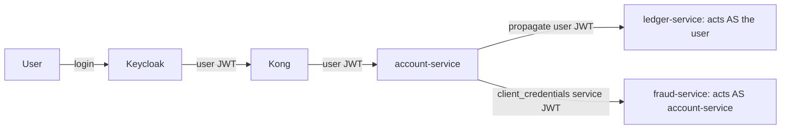

| Use a **user token** when | Use a **service token** when |
|---------------------------|------------------------------|
| The action is on behalf of the logged-in user | A background job/scheduler runs (no user) |
| Downstream needs user identity for authz/audit | System-to-system trust, user identity irrelevant |
| You want per-user rate limits & audit trail | Cross-tenant/admin operations |

### 18.2 Token Propagation (user context)

Token propagation is the *delegated identity* path from the section intro: when the work is genuinely on behalf of the logged-in user, you forward the user's token downstream so each service sees and authorizes the *real user*, preserving the per-user audit trail that banking compliance demands. Mechanically it's the Feign/WebClient interceptor of §14.5/§15.6 — but the three pitfalls below are where propagation breaks in practice, and each traces to something covered elsewhere in this guide. **Mid-chain expiry**: access tokens are deliberately short-lived (§11), so a long-running fan-out (a request that triggers a slow chain of downstream calls) can outlive its own token, and a hop late in the chain gets a token that expired since the request began, failing with 401. The mitigation is adequate token lifetime for the operation, or refreshing before a long fan-out. **Audience mismatch**: the propagated token must list each downstream in its `aud` (§10.3), or the downstream rejects it — which is exactly the tension token exchange (§18.4) resolves. **Thread-local loss**: the interceptor reads the token from the `ThreadLocal` `SecurityContext`, so it silently finds nothing on `@Async`/reactive threads (§12.5), sending an unauthenticated downstream call. The unifying point is that propagation *looks* like a simple "forward the header" but actually depends on token lifetime, audience scoping, and execution-thread context all lining up — and when a propagated call gets an unexpected 401, those three are your checklist.

Propagate the incoming bearer token to downstream calls (Feign interceptor §14.5 / WebClient §15.6). **Pitfalls:**
- Token expires mid-chain on a long operation → downstream 401. Mitigate with sufficient token lifetime or refresh before long fan-outs.
- Audience: the propagated token's `aud` must include the *downstream* service, or it'll reject (§10.3). Either issue multi-audience tokens or use **token exchange**.
- Thread-local loss in async/reactive (§12.5).

### 18.3 Service Accounts (client credentials)

A service account is simply *an identity for a program rather than a person* — the service authenticates to Keycloak with its own client ID and secret and receives a token representing itself, which it then presents on system-initiated calls. The implementation looks trivial, but it hides the most common and most damaging operational mistake in this whole area: **fetching a fresh token on every outbound call.** It's an easy mistake because the naive code ("get a token, make the call") works perfectly in testing. In production it is a slow-motion denial-of-service against your own identity provider: every internal call now triggers a round-trip to Keycloak's token endpoint, so a fleet of services making thousands of internal calls per second generates thousands of token requests per second, and Keycloak — which is doing real cryptographic work to mint each token — buckles under the load, adding latency to *every* authentication in the platform and eventually returning 429s or falling over. Since Keycloak is the single front door for all authentication, taking it down is a platform-wide outage. The fix is to **cache the service token and reuse it until it is near expiry** (commonly refreshing at ~80% of its lifetime), so one token serves thousands of calls and Keycloak sees a trickle of token requests instead of a flood — which is exactly what Spring's `OAuth2AuthorizedClientManager` does for you when wired correctly. The other two failure modes are operational: a service account that wasn't *granted* the client roles the downstream requires gets a valid token that is nonetheless rejected with 403 (authentication succeeded, authorization failed — §12); and rotating the client secret without overlap breaks *every* caller using that account simultaneously, which is why secrets must be rotated with a grace period where both old and new are accepted.

```java
// Obtain & cache a service token; refresh before expiry
@Bean
OAuth2AuthorizedClientManager authorizedClientManager(
    ClientRegistrationRepository regs, OAuth2AuthorizedClientService svc) {
  var provider = OAuth2AuthorizedClientProviderBuilder.builder().clientCredentials().build();
  var mgr = new AuthorizedClientServiceOAuth2AuthorizedClientManager(regs, svc);
  mgr.setAuthorizedClientProvider(provider);
  return mgr;
}
```
```yaml
spring:
  security:
    oauth2:
      client:
        registration:
          fraud-svc:
            provider: keycloak
            client-id: account-service
            client-secret: ${ACCOUNT_SVC_SECRET}
            authorization-grant-type: client_credentials
        provider:
          keycloak:
            token-uri: https://keycloak.bank.example.com/realms/bank/protocol/openid-connect/token
```
**Common mistakes:**
- **Fetching a new token on every call** → hammering Keycloak's token endpoint (429, latency). **Cache** the token until ~80% of its lifetime, then refresh.
- Service account not granted the needed client roles → downstream 403.
- Secret rotation breaks all callers simultaneously → roll secrets with overlap.

### 18.4 Token Exchange (RFC 8693)

Token exchange solves a specific tension that arises from the audience model (§10.3) meeting token propagation (§18.2). When `account-service` holds a user's token and needs to call `ledger-service` *on that user's behalf*, simple propagation (forwarding the token unchanged) works only if the user's token *already* lists `ledger-service` in its audience — and giving every user token a broad audience that covers every service it might transitively reach defeats the whole point of audience restriction (a token good everywhere is a token an attacker can replay anywhere). Token exchange is the principled alternative: `account-service` presents the user's token to Keycloak and asks for a *new* token that still represents the *same user* (preserving the audit trail and the user's permissions) but is *scoped down* to the specific downstream — narrower audience, possibly fewer scopes. The downstream then receives a token that is correctly audienced for it and carries exactly the authority the delegated call needs, no more. This keeps the security model tight (each token is valid only where it should be) while preserving delegated identity (the action is still attributable to the user, not to a service account). The trade-off is operational complexity: token exchange is a Keycloak feature that must be explicitly enabled, the exchanging client needs permission to perform the exchange, and the policy governing *which* exchanges are allowed must be configured — so its failures are "feature not enabled," "exchange policy denies," and "missing `audience` parameter." Use token exchange when you need *down-scoped delegated identity* across an audience boundary; it's the surgical tool between blunt token forwarding (which over-shares audience) and a service token (which loses the user's identity entirely).

When account-service (holding a user token) needs a downstream-scoped token for the *same user* but with a different audience/scope, use Keycloak token exchange instead of blindly forwarding:
```bash
curl -s -X POST $KC/realms/bank/protocol/openid-connect/token \
  -d grant_type=urn:ietf:params:oauth:grant-type:token-exchange \
  -d client_id=account-service -d client_secret=$SECRET \
  -d subject_token=$USER_TOKEN \
  -d requested_token_type=urn:ietf:params:oauth:token-type:access_token \
  -d audience=ledger-service | jq .access_token
```
**Failures:** token exchange feature/permission not enabled; policy denies the exchange; missing `audience`.

### 18.5 Common Banking Auth Mistakes (checklist)

- Forwarding a user token to an internal admin operation it has no rights for (privilege confusion).
- Using a powerful service token for user-initiated actions (loses per-user audit — a compliance problem).
- Long-lived service tokens stored in logs/env without rotation.
- Not validating audience downstream (any valid realm token is accepted everywhere — lateral movement risk).
- Trusting `X-User-Id` headers from upstream without verifying the JWT (header spoofing if an attacker reaches the pod network).

---
## 19. Observability and Distributed Tracing

**Mental model — the three pillars answer three different questions, and a correlation ID is the thread that sews them together.** Everything in this guide so far assumed you could *see* what happened — read the right log, check the right metric, follow the request to the hop where it died. In a monolith that visibility is nearly free; in a system of dozens of services it must be deliberately engineered, and the discipline of building that visibility is *observability*. The three pillars are not redundant — each answers a question the others can't. **Metrics** answer *"is something wrong, and how bad?"* — they are cheap, aggregated numbers (error rate, p99 latency, pool saturation) that you watch on dashboards and alert on; they tell you a problem exists and its magnitude but not its cause. **Traces** answer *"where in the request's journey did it go wrong?"* — a trace follows one request across every service it touched and shows the latency and status of each hop, so you can see that the 504 originated in the `ledger-service` span, not in `account-service`. **Logs** answer *"what exactly happened at that point?"* — the detailed, per-event record with the stack trace, the SQL, the business context. The natural debugging flow descends through them in order: a *metric* alert tells you something broke, a *trace* localizes it to a service and hop, and the *logs* for that service reveal the precise failure. 

The mechanism that makes all three usable across many services is the **correlation/trace ID** — a single identifier generated at the edge (by Kong) and propagated, unchanged, through every downstream hop, stamped into every log line and every span. Without it, you have dozens of separate log streams and no way to know which lines belong to *your* failing request amid thousands of concurrent ones; with it, you type one ID into your log store and instantly gather every log line from every service for that exact request, and you pull up the matching trace. You cannot debug what you cannot see, and in distributed systems "seeing" means: instrument the three pillars, and thread a correlation ID through all of them so a single request's story can be reassembled from the fragments scattered across the fleet.

### 19.1 The Correlation/Trace ID Backbone

Every request gets a `trace-id` at the edge (Kong) and it propagates via W3C `traceparent` header to every hop. Put it in the MDC so every log line carries it.

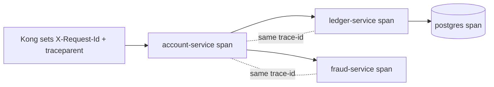

**Kong:** enable the `correlation-id` plugin and the OpenTelemetry plugin so the gateway starts the trace.
```yaml
plugins:
  - name: correlation-id
    config: { header_name: X-Request-Id, generator: uuid, echo_downstream: true }
  - name: opentelemetry
    config: { endpoint: http://otel-collector.observability:4318/v1/traces }
```

### 19.2 Spring Boot Tracing (Micrometer + OpenTelemetry)

```xml
<dependency><groupId>org.springframework.boot</groupId><artifactId>spring-boot-starter-actuator</artifactId></dependency>
<dependency><groupId>io.micrometer</groupId><artifactId>micrometer-tracing-bridge-otel</artifactId></dependency>
<dependency><groupId>io.opentelemetry</groupId><artifactId>opentelemetry-exporter-otlp</artifactId></dependency>
```
```yaml
management:
  tracing:
    sampling.probability: 1.0   # 100% in incident mode; lower (0.1) at steady state
  otlp.tracing.endpoint: http://otel-collector.observability:4318/v1/traces
logging:
  pattern:
    level: "%5p [${spring.application.name},%X{traceId:-},%X{spanId:-}]"
```
This stamps `traceId`/`spanId` into every log line automatically. Micrometer instruments Feign, WebClient, RestClient, and JDBC, so spans link end-to-end.

### 19.3 MDC & Correlation in your own logs

```java
@Component
public class CorrelationFilter extends OncePerRequestFilter {
  protected void doFilterInternal(HttpServletRequest req, HttpServletResponse res, FilterChain chain)
      throws ServletException, IOException {
    String cid = Optional.ofNullable(req.getHeader("X-Request-Id"))
        .orElse(UUID.randomUUID().toString());
    MDC.put("correlationId", cid);
    res.setHeader("X-Request-Id", cid);
    try { chain.doFilter(req, res); } finally { MDC.clear(); }
  }
}
```
Propagate `correlationId` on every outbound call (Feign/WebClient interceptors). For reactive/async, bridge MDC via Micrometer Context Propagation (`Hooks.enableAutomaticContextPropagation()`).

### 19.4 Tracing One Request Across 10 Services

This is the capability that, more than any other, makes a distributed system debuggable, so it's worth understanding *how* a trace is constructed before using one. The foundation is **context propagation via the W3C `traceparent` header**. When a request enters the system at the edge, the first instrumented component generates a globally-unique **trace ID** and an initial **span ID** (a span is one unit of work — one service handling one operation), and encodes them into a `traceparent` header. Every downstream call carries that header forward, and each service, when it receives it, creates a *new* span whose *parent* is the incoming span, all sharing the *same trace ID*. The result is that across ten services, dozens of spans all carry one trace ID and are linked into a parent-child tree by their span relationships — a complete, time-ordered map of where the request went and how long each hop took, reconstructed from fragments each service emitted independently. The instrumentation libraries (Micrometer Tracing bridging to OpenTelemetry) do this propagation automatically for Feign, WebClient, RestClient, and JDBC, which is why those hops show up as spans without you writing any tracing code.

With that machinery in place, debugging a cross-service failure becomes the disciplined four-step routine below, and the reason it's so fast is that it *replaces inference with direct observation*. Instead of guessing "maybe `ledger-service` is slow," you open the trace and *see* that the `ledger-service` span consumed 4.8 of the request's 5 seconds, or that the `fraud-service` span is the one marked with an error tag. The longest span tells you *where the time went*; the errored span tells you *where the failure originated* — distinguishing the true culprit from the services that merely reported the downstream failure as their own. Then you pivot from the trace to the *logs*: because every log line carries the same trace ID in its MDC (see §19.3), you query your log store for `traceId=<that id>` and instantly retrieve *every log line from every service* for that one request, in order, filtering out the noise of thousands of concurrent requests. Trace to localize the hop, logs to read the detail at that hop — that is how you debug a ten-service request in minutes instead of hours.

1. Get the `trace-id` from the user (it's in the response header `X-Request-Id`, or the error page).
2. Open Jaeger → search by trace-id → see the full span tree with per-hop latency.
3. The longest span / the span that errored is your culprit. Drill into its tags (`http.status_code`, `db.statement`, `error`).
4. Cross-reference logs: query your log store (Loki/ELK) by `traceId=<id>` to get every log line from every service for that request.

```bash
# Loki/LogQL example
{app=~"account-service|ledger-service|fraud-service"} | json | traceId="8f3c2a91..."
# Jaeger API
curl -s "http://jaeger:16686/api/traces/8f3c2a91..." | jq '.data[0].spans[] | {service:.process.serviceID, op:.operationName, durMs:(.duration/1000)}'
```

### 19.5 Metrics that Matter (RED + USE)

The reason to memorize these two acronyms is that they answer the perennial question "out of the thousands of metrics I *could* collect, which ones actually tell me whether something is wrong?" — and they answer it from two complementary angles. **RED** is the *request-centric* view, asking of each service or endpoint: what is its **R**ate (requests per second), its **E**rror count/ratio, and its **D**uration (latency, watched at percentiles like p99, not averages, because averages hide the tail of slow requests that users actually feel). RED tells you about the *experience your service is delivering* — it's how you notice "the transfers endpoint's error ratio jumped to 8% and its p99 doubled at 14:05." **USE** is the *resource-centric* view, asking of each finite resource (thread pool, connection pool, heap, CPU): what is its **U**tilization (how busy), **S**aturation (how much queued/waiting work is backing up), and **E**rrors. USE tells you *why* a service is struggling — it's how you discover that the latency spike RED revealed is because the Hikari pool's saturation (`connections_pending`) went positive. The two compose into a diagnostic narrative: RED detects the *symptom* at the request boundary, USE reveals the *exhausted resource* behind it. This is precisely the §2 Stage-6 story — a 504 (RED: errors up, duration up) caused by pool starvation (USE: Hikari pending > 0) — expressed as a monitoring discipline. The banking-specific dashboards listed (token-validation failure rate, downstream error rate, Hikari pending, circuit-breaker state, Kafka consumer lag, idempotency cache hit rate) are simply RED and USE applied to the components this guide has shown are most likely to fail — instrument those, alert on their *leading indicators* (saturation rising *before* errors appear), and you convert most incidents from "a customer reported it" into "an alert caught it before customers noticed."

- **RED** (per service/endpoint): **R**ate, **E**rrors, **D**uration. `http_server_requests_seconds_count`, `..._sum`, by `status`,`uri`.
- **USE** (per resource): **U**tilization, **S**aturation, **E**rrors. Threads, Hikari pool, heap, GC.
- Key banking dashboards: token-validation failure rate, downstream call error rate, Hikari `connections_pending`, circuit-breaker state, queue lag (Kafka), idempotency cache hit rate.

```promql
# Error ratio per endpoint
sum(rate(http_server_requests_seconds_count{status=~"5.."}[5m])) by (uri)
 / sum(rate(http_server_requests_seconds_count[5m])) by (uri)
# Saturation: DB pool starvation
hikaricp_connections_pending > 0
# p99 latency
histogram_quantile(0.99, sum(rate(http_server_requests_seconds_bucket[5m])) by (le, uri))
```

### 19.6 Dashboards (placeholders)

>  — rate/errors/duration per endpoint; spot the spike's onset time.
>
>  — 10-service span tree; the red span is the 504 source.
>
>  — `connections_pending > 0` correlates with the 504 window.
>
>  — every service's log line for one request.

### 19.7 Logging Hygiene for Banking

- **Never log:** full PAN, CVV, full tokens, passwords, full PII. Mask (`****1234`). Logging a JWT = logging a credential.
- Structured JSON logs with `traceId`, `correlationId`, `service`, `userId(hashed)`, `tenant`.
- Consistent log levels; ERROR means actionable. Sample noisy DEBUG.

---

## 20. Distributed Systems Failure Patterns

**Mental model — these are *emergent* failures: the system melts down even though every individual service is behaving exactly as written.** Up to now most failures had a locus — a misconfigured route, an expired cert, a thread-local lost across an async boundary. The failures in this section are different and more unsettling, because there is *no buggy line of code to find*. Each service does precisely what it was told; the catastrophe emerges from the *interaction* of correct components under load and partial failure. A retry policy is sensible in isolation, but thousands of clients retrying a slow service *simultaneously* multiply load and finish off the service that was merely slow. A shared thread pool is fine until one downstream hangs and the pool becomes a transmission channel that spreads the paralysis to unrelated work. These are properties of the *system*, not of any node, which is why you cannot debug them by reading one service's code — you have to reason about feedback loops, shared resources, and timing across the whole fleet.

The unifying insight is that distributed systems have **feedback loops and shared fate** that monoliths don't. A monolith that gets slow just gets slow; a distributed system that gets slow can get slow *in a self-amplifying way* — slowness causes retries, retries cause more load, more load causes more slowness — until it crosses a tipping point and collapses. The defenses, accordingly, are not bug fixes but *architectural dampeners* that break the feedback loops: timeouts that cap how long failure can propagate, circuit breakers that stop sending load to a failing dependency, bulkheads that isolate resources so one failure can't drain the whole pool, backoff-with-jitter that desynchronizes retries so they don't pile up, and idempotency that makes the duplicate requests these patterns generate harmless. Learn to recognize each pattern by its *signature in the metrics* (downstream request rate far exceeding user request rate = retry storm; thread pools saturating cluster-wide = cascading failure; consumer lag climbing = queue saturation), because by the time you're reading code it's already too late — these failures move in seconds.

These are the emergent failures — no single service is "buggy," yet the system melts down.

### 20.1 Retry Storm & Thundering Herd

The retry storm is the canonical example of a *positive feedback loop* turning a minor wobble into a total collapse, and the cruel irony is that it is *retries — a reliability feature — that cause it*. Trace the loop carefully. A downstream service gets slightly slow (a GC pause, a brief lock contention). Its callers, configured to retry on slowness, each fire a second and third attempt. But those retries don't replace the original load — they *add* to it, so the downstream that was handling N requests is now handling 2N or 3N. The extra load makes it *slower*, which causes *more* callers to cross the slowness threshold and retry, which adds *more* load. Each turn of the loop makes the next turn worse; the system has no natural brake, and within seconds the merely-slow service is buried under a self-inflicted avalanche and goes from degraded to dead. The **thundering herd** is the same dynamic triggered by *synchronization* rather than slowness: when a popular cache entry expires, every request that needed it simultaneously stampedes the database to refill it; when a downstream restarts, every caller that was waiting reconnects at the same instant. The common thread is *many actors doing the same thing at the same time, amplifying load*.

The defenses all attack the feedback loop or the synchronization. **Exponential backoff** spaces retries further apart so they stop piling up; **jitter** (randomizing the backoff) is the crucial and often-omitted companion that *desynchronizes* the retries — without it, all the backed-off clients retry at the *same* later moment, simply moving the stampede rather than dissolving it. **Retry budgets** cap retries as a fraction of total traffic (e.g., "retries may never exceed 10% of requests"), which structurally prevents retries from multiplying load without bound. **Circuit breakers** (§20.3) stop sending traffic to a failing downstream entirely, giving it room to recover instead of being kept down by the retries. **Request coalescing / singleflight** ensures that when a cache entry expires, only *one* request refills it while the others wait for that single result, collapsing the herd into a single animal. **Load shedding** has the service itself return 429 early when overwhelmed, sacrificing some requests to keep the rest alive. Every one of these is a brake on a system that, by default, has none.

**How it happens:** downstream gets slow → every caller retries → load multiplies → downstream gets slower → more retries. A synchronized cache expiry or a downstream restart causes a *thundering herd* of simultaneous requests.

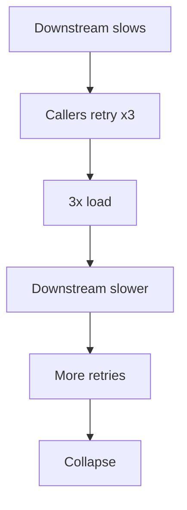

**Detect:** request rate to downstream spikes far above user request rate; retry counters climb.
**Prevent:** exponential backoff **with jitter**; cap total retries; circuit breakers; retry budgets (e.g., retries ≤ 10% of requests); request coalescing/singleflight for cache refills; load shedding (return 429 early).

### 20.2 Cascading Failure & Bulkhead

The bulkhead pattern takes its name and its logic from ship design, and the analogy is the fastest way to understand both the failure and the fix. A ship's hull is divided into watertight compartments (bulkheads) so that a breach in one compartment floods only that compartment, not the whole hull — without them, a single hole anywhere sinks the entire ship. A microservice without bulkheads is a hull with no internal walls. Here is the failure: service A calls both B and C, and — by default — uses *one shared thread pool* for all its work. Now B hangs. Requests to B, lacking a tight timeout or with no concurrency cap, block threads. Because the pool is shared, those blocked threads are drawn from the *same* pool that serves C-only requests and even requests that touch neither B nor C. As B's hang persists, more and more of A's threads pile up waiting on B, until the *entire* shared pool is exhausted — and now A cannot serve *anything*, including work that had nothing to do with the failing B. A's own callers then block waiting on A, and the flood rises through the fleet. One hole sank the whole ship.

The **bulkhead** fix installs the watertight compartments: you give each downstream dependency its *own* isolated resource allotment — a separate thread pool, a separate connection pool, or a Resilience4j bulkhead capping concurrent calls — so that a hang in B can consume *only B's compartment* (say, 25 concurrent slots) and is physically unable to touch the slots reserved for C or for unrelated work. B's failure floods B's compartment and stops there; A keeps serving C and everything else at reduced-but-real capacity. Note how bulkheads compose with the timeouts of §7.3: the timeout caps *how long* each blocked call lasts, and the bulkhead caps *how many* can be blocked at once — together they bound the total damage a single sick dependency can inflict to a small, survivable fraction of the service's capacity. This is why resilient banking services isolate every downstream: in a system where a hung dependency is not a question of *if* but *when*, the bulkhead is what keeps one dependency's bad day from becoming the whole platform's outage.

**How:** Service A calls B and C with a shared thread pool. B hangs → all A's threads block on B → A can't serve C-only requests either → A fails → A's callers fail. The failure cascades upstream.
**Prevent — bulkheads:** isolate resources per downstream (separate thread pools / connection pools / Resilience4j bulkheads), so a hang in B can't starve C's capacity.
```yaml
resilience4j.bulkhead.instances:
  ledger-service: { maxConcurrentCalls: 25 }
  fraud-service:  { maxConcurrentCalls: 25 }
```

### 20.3 Circuit Breaker Failures

The circuit breaker is borrowed directly from electrical engineering: just as a household breaker *trips* to cut power when it detects a dangerous fault — protecting the wiring from a fire — a software circuit breaker *trips* to stop sending requests to a downstream that is clearly failing, protecting the *caller* from wasting threads on calls that will only fail and protecting the *downstream* from being kept on its knees by relentless traffic (the §20.1 retry storm). It is a small state machine with three states. **Closed** is normal operation: requests flow through, and the breaker counts failures. When the failure rate crosses a threshold (say, 50% of the last 20 calls failed), the breaker trips to **Open**: for a cooldown period it *immediately rejects* all calls without even attempting them, failing fast and giving the sick downstream breathing room to recover. After the cooldown, it moves to **Half-Open**: it lets a *trickle* of trial requests through to test whether the downstream has recovered — if they succeed, it closes again and normal traffic resumes; if they fail, it re-opens and waits again. This automatic trip-and-test cycle is what lets a system *degrade gracefully* under dependency failure instead of collapsing.

The failure modes are misconfigurations of that state machine, and each has a distinct cause. **Stuck open** — the breaker won't reclose even though the downstream has recovered — usually means the half-open probe keeps hitting a still-bad instance (in a multi-replica downstream where only some pods recovered) or the thresholds are so sensitive that normal jitter retrips it. **Never opens** is the opposite: thresholds so lax that the breaker tolerates a clearly-failing downstream and never trips, providing no protection at all — a breaker that never trips is just decoration. The third, and most dangerous in banking, is **the fallback that hides a money bug**: a circuit breaker is often paired with a fallback (return a default when the breaker is open), and for *read* operations a degraded default may be fine, but for *money* a fallback can be catastrophic — a fallback that returns `balance = 0` when the balance service is down could authorize or deny transactions on false data, and a fallback that silently "succeeds" a transfer that never happened corrupts the ledger. The rule is to **fail closed (loudly) for money-moving operations**: when you cannot be sure the operation is safe, refuse it visibly rather than papering over the failure with a plausible-looking default. A circuit breaker's job is to fail *fast*, not to fail *silently*.

- **Stuck open:** half-open probe keeps failing on a now-healthy service because the probe hits a still-bad instance, or threshold too sensitive.
- **Never opens:** thresholds too lax, so it never protects.
- **Fallback hides money bugs:** returning a default balance is unacceptable; fail closed for money movement.

### 20.4 Queue Saturation & Backpressure

Asynchronous, event-driven processing (via Kafka) is often introduced precisely to *absorb* load spikes — the queue acts as a buffer so a burst of events doesn't overwhelm the consumers. But a buffer only helps if, *on average*, consumers keep up with producers; if the *sustained* production rate exceeds the *sustained* consumption rate, the queue doesn't smooth the load, it *accumulates* it without bound. This is **consumer lag**: the gap between the latest produced event and the latest consumed one, growing steadily. The insidious part in banking is that lag is *invisible to the producer and to synchronous callers* — the API that published the event returned 200 instantly, the user thinks their action succeeded, and yet the *effect* of that action (the notification, the balance projection update, the downstream posting) is sitting in a queue that is now minutes or hours behind. Customers see balances that don't reflect transactions they just made, fraud checks run late, notifications arrive stale — all while every dashboard shows green because nothing *errored*. The detection signal is the consumer lag metric itself, which must be monitored and alerted on *as a first-class SLO*, because it is often the *only* indication that an async pipeline is silently falling behind. The preventions address the rate imbalance from both ends: **scale consumers** (more instances processing in parallel) and **partition correctly** (lag can hide on a single hot partition even when the topic's average looks fine, so watch per-partition lag), and apply **backpressure** so a fast upstream is *slowed* to match what the system can actually absorb rather than allowed to pile work into an unbounded queue. The throughline with the rest of §20 is that async decoupling trades *immediate failure* for *deferred, silent failure*, so the safety net is not error handling but *lag monitoring* — you must watch the buffer's depth, because a quietly-growing queue is a quietly-failing system.

Kafka consumer lag grows unbounded → events processed minutes late → balance/notifications stale. **Detect:** consumer lag metric. **Prevent:** scale consumers, partition correctly, apply backpressure, set max in-flight, alert on lag.

### 20.5 Deadlocks

A deadlock is a *mutual waiting cycle* where each party holds a resource the other needs and neither will release until it gets what it's waiting for — so both wait forever. The canonical **database deadlock** in banking is a transfer between two accounts: transaction 1 locks account A then tries to lock account B, while transaction 2 (a transfer in the opposite direction) locks account B then tries to lock account A. Now T1 holds A and waits for B; T2 holds B and waits for A; the cycle is closed and neither can proceed. PostgreSQL detects this automatically, picks a victim, and aborts it with `ERROR: deadlock detected` (SQLSTATE `40P01`). The elegant prevention is **consistent lock ordering**: if *every* transaction always locks accounts in a fixed global order (say, ascending account ID), the cycle becomes impossible — both transfers would try to lock the lower-numbered account first, so one simply waits for the other rather than forming a cycle. Pair that with *short transactions* (hold locks for as little time as possible) and a *retry on `40P01`* (since the database aborting one party is a normal, recoverable outcome — just retry the victim). The **thread deadlock** is the same cycle in application threads rather than database rows, and the most insidious banking variant is *resource-pool exhaustion masquerading as deadlock*: service A makes a nested call to B using a *bounded thread pool*, but B (perhaps via a callback or a shared pool) needs a thread from that *same* pool to respond — and if all threads are occupied waiting for B, there are none left for B to use, so everything waits forever. You detect thread deadlocks by capturing a *thread dump* (`jstack` or `/actuator/threaddump`) and looking for threads in `BLOCKED` state waiting on locks held by each other, or a pool with every thread parked waiting on the very downstream it can't reach without a free thread. The unifying defense is to break the cycle: order your locks, bound your transactions, and never let a call path depend circularly on a resource it is itself consuming.

- **DB deadlock:** two transactions lock rows in opposite order. Postgres: `ERROR: deadlock detected`. Fix: consistent lock ordering, shorter transactions, retry on `40P01`.
- **Thread deadlock:** thread pool A waits on B which waits on A (e.g., nested Feign calls sharing a bounded pool). Detect with thread dumps (`jstack`/`/actuator/threaddump`).

### 20.6 Lost Updates, Duplicate Requests, Race Conditions

The **lost update** is the textbook concurrency bug, and walking through it concretely shows why it's so easy to write and so dangerous in banking. Imagine an account with balance 100, and two withdrawals of 30 arriving at nearly the same instant on two threads (or two pods). The naive code is *read-modify-write*: read the balance (both threads read 100), subtract 30 in application memory (both compute 70), write the result back (both write 70). The correct end state is 40 (100 − 30 − 30); the actual end state is 70, because the second write overwrote the first — one entire withdrawal *vanished*, and the bank just gave away 30. No exception fired; both requests returned success. The root cause is that the read and the write are separate operations with a gap between them, and a concurrent actor slipped into that gap. There are three standard fixes, each closing the gap differently. **Optimistic locking** (`@Version`) lets both proceed but stamps a version number; the second write notices the version changed since its read and fails (rather than silently overwriting), so the application retries with fresh data — ideal when conflicts are rare. **Pessimistic locking** (`SELECT ... FOR UPDATE`) makes the first thread *lock* the row so the second *waits* until the first commits, serializing them — ideal when conflicts are common. **Atomic SQL** (`UPDATE ... SET balance = balance - 30`) sidesteps the read-modify-write entirely by letting the database compute the new value in a single atomic statement, so there is no gap to exploit. The unifying principle, and the deepest lesson of concurrent banking code, is the next bullet's advice: **make the database the arbiter of truth.** Application memory is not a safe place to make money decisions because multiple instances each have their own memory; the single shared database, with its locks and atomic operations, is the one place that can serialize concurrent access correctly.

- **Lost update:** read-modify-write without locking → two transfers read the same balance, both subtract, one update lost. Fix: optimistic locking (`@Version`) or `SELECT ... FOR UPDATE` or atomic SQL (`UPDATE ... SET balance = balance - ?`).
- **Duplicate requests:** client retried, network glitch, or at-least-once delivery → double processing. Fix: **idempotency keys** (§21).
- **Race conditions:** concurrent operations on shared state. Fix: serialize per-aggregate (per-account locking), use the DB as the arbiter.

### 20.7 Split Brain

Split brain is what happens when a *network partition* — a temporary break in connectivity that splits a cluster into two groups that can't talk to each other — meets a system that relies on a single leader. Picture a 2-node primary/replica database whose network link drops. The replica, no longer hearing the primary's heartbeat, reasonably concludes "the primary died, I must take over" and promotes itself to primary. But the original primary is *not* dead — it's just unreachable — so now there are *two* primaries, each accepting writes, each unaware of the other. When the partition heals, you have two divergent histories of "the truth" that cannot be cleanly merged: two different balances for the same account, both "authoritative." This is catastrophic in banking because there is no correct way to reconcile two independent sets of accepted transactions after the fact. The deeper principle is the CAP theorem's hard lesson: when a partition happens, a system must choose between *consistency* (refuse to operate rather than risk divergence) and *availability* (keep operating and risk divergence) — it cannot have both. Split brain is what you get when a system chooses availability without the machinery to prevent two leaders.

The preventions all enforce "at most one leader, ever." **Quorum/consensus** (Raft, Paxos) requires a *majority* of nodes to agree before any node acts as leader — which is why clusters use an *odd* number of nodes (3, 5): a partition can leave at most one side with a majority, so the minority side knows it must *not* act as primary, mathematically precluding two leaders. **Fencing tokens** give each leadership grant a monotonically increasing number, so a stale old-primary's writes (carrying an old token) are rejected by the storage layer once a new primary (with a higher token) exists. **Single-writer-per-partition** designs ensure each piece of data has exactly one node responsible for writing it, so there's no leadership to contend. The takeaway for an application engineer is to *never roll your own leader election or multi-primary scheme for financial data* — lean on systems with proven consensus, and understand that during a partition, correctness sometimes requires choosing unavailability over the risk of divergence.

Network partition makes two nodes both think they're primary → divergent state. Affects clustered caches, leader election, multi-region DBs. **Prevent:** quorum/consensus (odd number of nodes), fencing tokens, single-writer per partition.

### 20.8 Event Ordering, Duplication, Loss

Event-driven systems make three promises that engineers *assume* but Kafka does not universally *guarantee*, and each gap is a banking bug. Start with **ordering**. It is natural to assume events are processed in the order they were produced, but Kafka guarantees ordering *only within a single partition* — and a topic is split across many partitions for parallelism. If a "deposit" and a subsequent "withdrawal" for the same account land in *different* partitions, they may be processed out of order, and a withdrawal processed before its prior deposit could spuriously fail an insufficient-funds check or compute a wrong intermediate balance. The fix exploits the one ordering guarantee Kafka *does* give: **key events by `accountId`**, because Kafka routes all events with the same key to the same partition, so all events for a given account become strictly ordered relative to each other (while different accounts still parallelize across partitions). The mental model is "order where it matters (per account), parallelize where it doesn't (across accounts)." Next, **duplication**: Kafka's default delivery is *at-least-once*, meaning a consumer can legitimately see the same event twice (after a rebalance, a redelivery, a retry), so every consumer that has side effects **must be idempotent** — typically by recording processed event IDs in a `processed_events` table and skipping duplicates (§21.2). Assuming exactly-once delivery is the bug; designing for at-least-once and deduplicating is the fix. Finally, **loss**: with weak acknowledgment settings or the dual-write problem (§21.4), events can simply *vanish* — produced into the void, or committed to the database but never published. The defenses are `acks=all` (the producer waits for the event to be durably replicated before considering it sent), the idempotent producer, and the transactional outbox that makes event publication atomic with the data change. Taken together, the rule for reliable event-driven banking is: **order by entity key, make consumers idempotent, and guarantee delivery with acks-all plus the outbox** — three deliberate choices that close the three gaps between what you assume and what Kafka promises.

- **Ordering:** Kafka guarantees order only within a partition. Key events by `accountId` so all events for an account land in one partition → ordered.
- **Duplication:** at-least-once delivery → consumers must be **idempotent** (dedupe by event id).
- **Loss:** at-most-once or misconfigured acks → events vanish. Use `acks=all`, idempotent producer, the **transactional outbox** (§21) to avoid dual-write loss.

| Pattern | Detect | Prevent |
|---------|--------|---------|
| Retry storm | downstream rate ≫ user rate | backoff+jitter, budgets, breakers |
| Cascading | thread pools saturate cluster-wide | bulkheads, timeouts |
| Queue saturation | consumer lag rising | scale, backpressure, alert |
| Lost update | balance discrepancies | optimistic/pessimistic locking |
| Duplicate | double postings | idempotency keys |
| Split brain | divergent replicas | quorum, fencing |
| Event loss | missing downstream effects | outbox, acks=all |

---
## 21. Banking-Specific Failure Scenarios

**Mental model — banking software is the defense of a small set of *invariants*, and every incident here is an invariant violated.** A normal web app can tolerate the occasional lost click, double-submitted comment, or stale view; the cost is a mild annoyance. Banking cannot, because it maintains invariants that *must never* be violated: money is conserved (it is neither created nor destroyed by a transfer, only moved), every operation happens *exactly once* (a payment is not executed twice, nor zero times), the balance shown equals the sum of the ledger, and every money-moving action is attributable to who initiated it. These invariants are precisely what the distributed-systems patterns of §20 threaten — a retry duplicates an operation (violating exactly-once), a partial saga debits without crediting (violating conservation), a stale cache shows a wrong balance (violating consistency). So the banking-specific failures below are not a *new* category so much as the §20 patterns viewed through the lens of *which sacred invariant they break and what that costs* — and the cost is measured in real money, regulatory exposure, and customer trust, which is why these are the incidents that wake up both the on-call engineer and the CFO.

The corresponding mental shift for the engineer is that **"the request returned 200" is not success in banking** — success is "the invariant still holds." A duplicate payment returns two cheerful 200s. A broken saga returns 200 to the caller while money silently evaporates between two services. This is why the prevention techniques here — idempotency keys, the transactional outbox, explicit compensation, continuous reconciliation — are not optional hardening but the load-bearing structure of correct banking software: each one defends a specific invariant against a specific distributed-systems threat. Each scenario below is framed as a mini post-mortem (incident → root cause → investigation → resolution → prevention) precisely because that is how these failures are actually encountered and must be reasoned about.

These are the incidents that wake up the on-call and the CFO. Each is framed as a mini post-mortem.

### 21.1 Duplicate Payment Execution

**Incident:** Customers report being charged twice for one transfer. Ledger shows two identical postings 800ms apart.
**Root cause:** the mobile client timed out (slow network) and auto-retried the POST `/transfers`. The first request actually succeeded server-side but the response was lost. No idempotency protection → two transfers.
**Investigation:**
```sql
SELECT account_id, amount, created_at, request_id
FROM transfers WHERE created_at > now() - interval '1 day'
GROUP BY account_id, amount, request_id HAVING count(*) > 1;  -- find dupes
```
Check trace: two traces, different `trace-id` but same `Idempotency-Key` (if present) or same business payload.
**Resolution (immediate):** reverse the duplicate posting via a compensating entry; reconcile.
**Prevention — idempotency keys:**
```java
@PostMapping("/transfers")
public TransferResult transfer(@RequestHeader("Idempotency-Key") @NotBlank String key,
                               @Valid @RequestBody TransferRequest req) {
  return idempotencyService.execute(key, req, () -> transferService.transfer(req));
}
```
```java
// Store key result atomically; INSERT ... ON CONFLICT makes it race-safe
public <T> T execute(String key, Object req, Supplier<T> action) {
  // 1) try claim the key (unique constraint on idempotency_key)
  // 2) if already present and completed -> return stored response
  // 3) else run action, persist response under the key in same TX
}
```
Enforce: unique constraint on `idempotency_key`; key scoped per client+endpoint; TTL (e.g., 24h). Kong can also enforce idempotency at the edge, but the **authoritative** dedupe must be in the service+DB.

### 21.2 Duplicate Transfers via At-Least-Once Events

This is the event-driven sibling of the duplicate-payment incident (§21.1), and it teaches the same lesson from Kafka's angle: **at-least-once delivery is a guarantee that the same event will sometimes be delivered twice, by design, and your consumer must be built to survive that.** Kafka tracks how far a consumer has progressed via committed offsets. If a consumer processes an event but crashes or is reassigned (a "rebalance") *before* committing the offset for that event, Kafka — correctly honoring "at least once" — redelivers the event to whichever consumer picks up that partition next, because from Kafka's bookkeeping the event was never confirmed as processed. So a payout-processing consumer can receive the same "execute payout" event twice and, if naive, execute the payout twice. Note this is *not a bug in Kafka* — it is Kafka faithfully delivering its promise; the bug is a consumer that assumed exactly-once. The robust fix is to make the consumer **idempotent by deduplicating on the event's unique ID**: maintain a `processed_events(event_id PRIMARY KEY)` table, and process each event *and* record its ID **in the same database transaction** — so a redelivered event finds its ID already present and is safely skipped, and because the dedup-record and the side effect commit atomically, there's no window where one happened without the other. (Kafka's "exactly-once semantics" via transactional producers and read-committed isolation can also help within a Kafka-to-Kafka pipeline, but for the common Kafka-to-database case, consumer-side idempotent dedup is the reliable pattern.) The transferable principle, shared with §21.1 and §20.8, is *design for at-least-once and make duplicates harmless*, rather than wishing for an exactly-once delivery that distributed systems cannot truly provide.

**Incident:** an event-driven payout processed an event twice after a consumer rebalance.
**Root cause:** Kafka at-least-once redelivery + non-idempotent consumer.
**Prevention:** dedupe by `eventId` in a `processed_events` table within the same transaction as the side effect; or use exactly-once semantics (transactional producer + read-committed) where feasible.

### 21.3 Idempotency Failures

This is a wonderfully instructive bug because it is *idempotency protection that itself has a race condition* — the guard meant to prevent duplicates can, when implemented naively, fail to prevent them under exactly the concurrency it was built for. The naive implementation is "check then act": `SELECT` to see whether this idempotency key has been used; if not, run the operation and `INSERT` the key. It passes every test, because tests rarely fire two identical requests at the *same microsecond*. But under real production concurrency, two requests carrying the same key can both execute the `SELECT` *before* either executes the `INSERT` — both find nothing, both conclude "this is new," and both proceed to run the operation. The very duplicate the key was supposed to stop happens anyway. The root cause is the *gap* between the check and the act, identical in shape to the lost-update gap of §20.6: two operations interleaved in a window where each was blind to the other. And the fix is identical in spirit: **don't check-then-act in application code; make the database serialize for you.** Put a *unique constraint* on the idempotency key and use `INSERT ... ON CONFLICT` (or catch the unique-violation exception): now the *database* atomically decides who wins — the first insert succeeds, the second hits the constraint and is rejected, and you return the first request's stored result for the loser. There is no gap because the check and the claim are a single atomic database operation. The general lesson, which recurs throughout concurrent banking code, is that *correctness under concurrency comes from making the database the single arbiter*, not from cleverly-ordered reads and writes in application memory that races can always slip between.

**Incident:** idempotency "worked" in tests but failed in prod under concurrency — two concurrent requests with the same key both executed.
**Root cause:** check-then-insert race (`SELECT` found nothing, both `INSERT`ed). 
**Fix:** rely on a **unique constraint + INSERT ... ON CONFLICT**, not a read-then-write. Let the DB serialize.

### 21.4 Outbox Pattern Failures (dual-write problem)

To understand the outbox you must first deeply understand the **dual-write problem** it solves, because it is one of those issues that is invisible until you've been burned by it. Consider the natural-looking code: "save the transfer to the database, then publish a `TransferCompleted` event to Kafka." These are *two separate systems* (PostgreSQL and Kafka) with *two separate commit operations*, and there is no transaction spanning both — you cannot commit a database row and a Kafka message atomically. So there is an inescapable window *between* the two writes, and if the process crashes in that window (a pod eviction, an OOM, a node failure — all routine in Kubernetes), you are left in an inconsistent state: the transfer is committed in the database but the event was never published, so every downstream consumer (the notification service, the ledger projection, the fraud monitor) is blind to a transfer that definitely happened. Reorder the writes (publish first, then save) and you get the opposite inconsistency: an event announcing a transfer that the database never recorded. There is no ordering of two independent writes that closes the window — this is fundamental, not a coding mistake.

The transactional outbox closes the window by *collapsing two writes into one*. Instead of writing to the database and then to Kafka, you write the domain change *and* a row representing the event-to-be-published into an `outbox` table **in the same database transaction**. Because they share one transaction, they commit together atomically — either both the transfer and its pending event are durably recorded, or neither is; the crash window is gone. A separate **relay** process (a polling publisher, or Change-Data-Capture via Debezium reading the database's write-ahead log) then reads committed outbox rows and publishes them to Kafka, marking each as sent. The event *cannot be lost*, because it was committed atomically with the data it describes; at worst it is *delayed* (if the relay is behind) or *delivered more than once* (if the relay crashes after publishing but before marking sent) — and "at-least-once, possibly delayed" is a vastly safer failure mode than "silently lost," especially since idempotent consumers (§21.2) already handle duplicates. This is why the outbox is the backbone of reliable event-driven banking: it converts the unsolvable dual-write problem into a solvable single-write-plus-relay problem.

**Incident:** a transfer was saved to the DB but the "TransferCompleted" event was never published (or vice-versa) because the service crashed between the DB commit and the Kafka send.
**Root cause:** **dual write** — two systems (DB + Kafka) updated without a shared transaction. One succeeded, one didn't.
**Prevention — Transactional Outbox:**
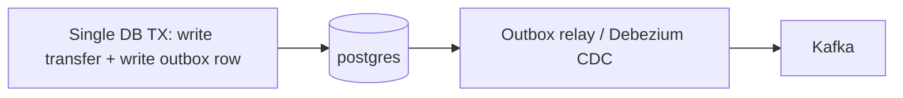
Write the domain change and an `outbox` row in **one transaction**; a relay (polling publisher or Debezium CDC) reads the outbox and publishes to Kafka, marking rows sent. The event can't be lost because it's committed atomically with the data.
**Outbox failure modes to watch:** relay lag (events delayed), relay stuck (publish errors), outbox table growth (purge sent rows), ordering (publish in insertion order per aggregate).

### 21.5 Saga Failures & Compensation

To understand sagas you must first understand the problem they exist to solve: **there is no distributed transaction across microservices.** In a monolith with one database, a transfer is trivially safe — you debit A and credit B inside a single database transaction, and if anything fails the whole thing rolls back atomically; the database guarantees you can never end up with A debited but B not credited. The moment A and B live in *different services with different databases*, that safety net is gone, because there is no transaction that spans two databases (distributed two-phase-commit transactions exist but are slow, fragile, and largely abandoned in microservice architectures). So a multi-step money flow — debit A, credit B, notify — becomes a sequence of *independent local transactions*, and the catastrophic possibility appears: step one (debit A) commits, step two (credit B) fails, and there is no automatic rollback. Account A has been debited, account B was never credited, and the money has *vanished* from the customer's point of view. This is not a hypothetical; it is the default behavior of naively chaining service calls, and it violates the most sacred banking invariant — conservation of money.

The **saga pattern** is the disciplined answer: since you can't get an automatic distributed rollback, you implement rollback *manually* by giving every forward step an explicit **compensating action** that semantically undoes it. The compensation for "debit A" is "credit A back"; for "credit B" it's "debit B." The saga executes the forward steps in order, and if any step fails, it runs the compensations for all the *already-completed* steps in reverse, returning the system to a consistent state. Two properties are non-negotiable and are where saga implementations usually go wrong. First, **compensations must be idempotent and retryable**, because the saga framework *will* retry them (a compensation that itself fails transiently must be safely re-runnable, or you'll either leave money lost or double-compensate). Second, **saga state must be persisted** — which steps have completed must be durably recorded, so that if the orchestrator crashes mid-saga (routine in Kubernetes), a restarted instance can read the state and either resume forward or compensate backward; an in-memory-only saga that loses its state on crash leaves money in limbo. And because compensation in banking is correctness-critical, a saga that *cannot* compensate (the compensation keeps failing) must not silently give up — it must escalate the stuck transaction to a manual reconciliation queue where a human ensures the books balance. A saga is essentially "rollback you have to write yourself," and the rigor of that writing is what keeps the money invariant intact across service boundaries.

**Incident:** a multi-step transfer (debit account A → credit account B → notify) failed at step 2; account A was debited but B never credited. Money "disappeared."
**Root cause:** distributed transaction across services with no compensation, or compensation that itself failed.
**Resolution:** run the compensating action (credit A back); reconcile.
**Prevention — Saga with compensations:**
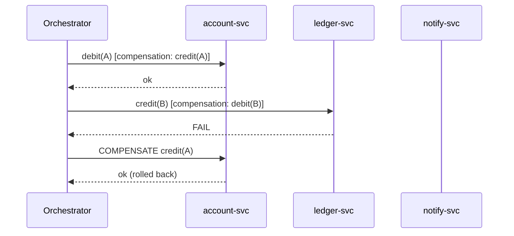
- Each step has an explicit compensating action.
- Compensations must be **idempotent** and **retryable** (they will be retried).
- Persist saga state (which steps done) so a crash mid-saga can resume/compensate.
- Money-moving sagas should never silently give up — escalate to a manual reconciliation queue if compensation fails repeatedly.

### 21.6 Balance Inconsistency

The root cause of balance inconsistency is almost always a violation of one architectural principle: **there must be a single source of truth for money, and everything else must be a derivation of it.** The temptation in a microservice system is to store "the balance" as a mutable number that each operation reads and overwrites — but the moment a balance is an independently-stored mutable value, it can *drift* from the actual history of transactions, and you have two things that are supposed to agree but are maintained separately. The drift creeps in through every failure this guide has covered: a cache wasn't invalidated (§21.7), so the read path shows an old balance; a posting was written to the ledger but the separate balance-projection update failed (a dual-write problem, §21.4); two concurrent transfers both read-modify-wrote the balance and one update was lost (§20.6); or floating-point arithmetic accumulated cent-level errors (§17.3). Each is a different mechanism, but they share one shape: the *derived* balance diverged from the *authoritative* transaction history.

The robust design makes the **ledger the single source of truth** and treats the balance as a *projection* of it — something you can always *recompute* by summing the postings, never an independently-authoritative number. Then any displayed or cached balance is just a performance optimization over the ledger, and consistency means "the projection equals the recomputation." This is why the investigation below recomputes the balance from the ledger and compares it against the stored projection: the ledger *defines* truth, so any disagreement is by definition a bug in the projection, not in the ledger. The prevention is correspondingly architectural — derive balances rather than storing them mutably, use transactional projections or event sourcing so the derivation stays atomic with the postings, run continuous reconciliation jobs that recompute and alert on any drift (so you catch inconsistency in minutes, not when a customer complains), and of course `BigDecimal` end-to-end. A bank that can always answer "the balance is the sum of the ledger, and we check that continuously" has eliminated an entire class of incidents.

**Incident:** account balance in `account-service` disagrees with the sum of postings in `ledger-service`.
**Root causes:** cached balance not invalidated; a posting applied to ledger but the balance projection update failed; concurrent updates with a lost update (§20.6); floating-point money (§17.3).
**Investigation:**
```sql
-- Recompute authoritative balance from the ledger (source of truth)
SELECT account_id, SUM(CASE WHEN direction='CREDIT' THEN amount ELSE -amount END) AS computed
FROM ledger_postings WHERE account_id = :id GROUP BY account_id;
-- Compare with the cached/projected balance
SELECT balance FROM account_balances WHERE account_id = :id;
```
**Prevention:** single source of truth (the ledger); derive balances; use event sourcing or transactional projections; reconcile continuously; `BigDecimal` only.

### 21.7 Stale Cache

Phil Karlton's famous quip — "there are only two hard things in computer science: cache invalidation and naming things" — is funny precisely because cache invalidation is genuinely hard, and in banking it crosses from "hard" to "dangerous." Caching exists to make reads fast and cheap by keeping a copy of data close to where it's needed instead of re-fetching it from the source every time. The unavoidable catch is that a cache is a *copy*, and the source can change while the copy doesn't — at which point the cache is *stale*, serving an old value as if it were current. In most applications a few seconds of staleness is harmless; for a bank balance it is a wrong number about a customer's money, shown right after they made a transaction, eroding trust and potentially driving wrong decisions. The mechanism of the bug is almost always the same: the *write path* updates the source of truth (the ledger, the balance projection) but *forgets to invalidate or update the cached copy*, so the *read path* keeps happily returning the stale cached value until its TTL finally expires. A subtler variant is a *populate-during-write race*: a read miss triggers a cache fill with the old value at the same moment a write changes the source, so the cache is repopulated stale.

The prevention follows from treating cache invalidation as *part of the write*, not an afterthought. Either use **write-through** (every write updates the cache as it updates the source, so they never diverge) or **explicit invalidation** (every write actively evicts the affected cache entries so the next read re-fetches fresh). For money-critical reads, the safest choice is often the most boring one: **don't cache them at all**, or cache only with a very short TTL and a versioning scheme that detects staleness. The general principle is that caching is a performance optimization that trades *freshness* for *speed*, and in banking you must consciously decide, per piece of data, whether that trade is acceptable — for a product catalog, gladly; for a balance, almost never without an airtight invalidation strategy. A stale read in banking is not a performance footnote; it is a correctness bug wearing a performance costume.

**Incident:** customer sees an old balance/limit after a transaction.
**Root cause:** cache (Redis/local) not invalidated on write; TTL too long; cache populated by a stale read during a write race.
**Prevention:** write-through or explicit invalidation on the write path; short TTL for financial data or no-cache; cache-aside with versioning; never cache money-critical reads without an invalidation strategy.

### 21.8 Customer Profile Synchronization Issues

This scenario is where the abstract event-ordering and delivery guarantees of §20.8 become a concrete compliance problem, illustrating that *data replicated across services is only as correct as the propagation mechanism that keeps it in sync*. In a microservice bank, the customer's KYC profile (identity, address, risk rating) is owned by `customer-service`, but `account-service`, `card-service`, and the compliance engine all need a copy to do their jobs. That copy must be kept current as the master changes, and every gap in the propagation becomes a divergence: if the update is propagated by a fire-and-forget event with no outbox (§21.4), a crash can *lose* the event and the replicas silently keep stale data; if events for one customer aren't ordered (§20.8), a replayed older "address change" can overwrite a newer one, reverting the profile to an outdated state; if a consumer isn't idempotent, a redelivered event can mis-apply a change twice. The consequence in banking is not a cosmetic glitch — a compliance check run against a stale risk rating or an outdated sanctions-relevant address can let a transaction through that should have been blocked, or block one that should pass, with regulatory exposure either way.

The robust pattern is **event-carried state transfer with versioned events**: `customer-service` publishes profile changes through the outbox (guaranteeing delivery), keyed by customer ID (guaranteeing per-customer ordering), each event stamped with a monotonically increasing version; consumers apply an event only if its version is *newer* than what they hold (so a late or replayed older event is safely ignored), making them both idempotent and order-tolerant. Backing all of it, a periodic **reconciliation job** compares each replica against the `customer-service` source of truth and alerts on any drift, so a propagation bug is caught proactively rather than discovered when a compliance check fails. The throughline is the same as §21.6: there is a single source of truth (`customer-service`), the copies are derivations that must be kept honestly in sync, and the sync mechanism needs guaranteed delivery, ordering, idempotency, and reconciliation — the absence of any one is a latent data-divergence incident.

**Incident:** a KYC profile updated in `customer-service` isn't reflected in `account-service`/`card-service`, causing failed compliance checks.
**Root cause:** synchronous coupling missing, or the propagation event was lost (no outbox), or consumers processed out of order (a later "address change" overwritten by an earlier event replay).
**Prevention:** event-carried state transfer with versioned events; ordering by customerId partition key; outbox for guaranteed delivery; reconciliation jobs comparing source-of-truth vs replicas; idempotent, version-checked consumers (ignore events with `version <= current`).

### 21.9 Cross-Cutting Banking Prevention Checklist

- Idempotency keys on every money-moving endpoint.
- Outbox for every "DB change + must-publish-event."
- Compensations for every multi-service money flow.
- `BigDecimal` + UTC everywhere.
- Reconciliation jobs (ledger vs projections) with alerting on drift.
- Never auto-retry non-idempotent writes blindly.
- Audit every money operation with the **user identity** (not just service identity).

---
## 22. Kubernetes Production Failures

**Mental model — Kubernetes is a relentless control loop that constantly compares "what you declared" against "what is running" and acts to close the gap, and most platform failures are that loop reacting to a pod that won't cooperate.** You don't *run* containers in Kubernetes; you *declare a desired state* ("I want 3 replicas of `account-service`, each with these resource limits and these health probes"), and a set of controllers works ceaselessly to make reality match that declaration. This framing explains the otherwise-cryptic failure states. `CrashLoopBackOff` is the loop *trying and retrying* to keep a container that keeps dying — and "BackOff" means it's deliberately spacing out the retries so a doomed container doesn't thrash the node. `OOMKilled` is the loop *enforcing the memory limit you declared* by killing a container that exceeded it. An `Evicted` pod is the loop *protecting a node under pressure* by sacrificing pods. A `Pending` pod is the loop *unable to find a node* that satisfies the pod's declared requirements. In every case, the platform is doing exactly what it was designed to do; the "failure" is the gap between your declaration and your container's actual behavior, and debugging means finding that gap.

The other half of the model is that **Kubernetes treats CPU and memory as declared, enforced resources, and the JVM historically didn't know it was being watched.** You declare `requests` (what the scheduler reserves for you) and `limits` (the ceiling the runtime enforces), and the kernel's cgroups *physically enforce* them — exceed the memory limit and you're killed, exceed the CPU limit and you're throttled. A huge fraction of Kubernetes incidents with Java workloads come from a mismatch between what the JVM *thinks* it can use and what the cgroup *actually allows*: an old JVM that ignores the container memory limit and sizes its heap to the whole node will get OOMKilled; a tight CPU limit will throttle the JVM's GC threads into long pauses (§22.3). So the platform-layer failures below are best read as "the control loop enforcing a constraint your application violated or wasn't aware of" — and the fixes are about making your application's resource behavior honest about the limits it runs under. These failures take services down regardless of how correct your business logic is.

### 22.1 CrashLoopBackOff

`CrashLoopBackOff` is not itself an error — it is Kubernetes *honestly reporting that it is stuck in a loop trying to help you*. The container starts, dies, and the control loop (whose job is to keep your declared replicas running) restarts it; it dies again, gets restarted again, and to avoid hammering the node with a container that's clearly doomed, Kubernetes inserts an exponentially-increasing delay between attempts — that delay is the "BackOff." So the status tells you the *symptom* (the container keeps dying at or near startup) but not the *cause*, and the entire diagnostic art is extracting the cause from the wreckage of the already-dead container. The single most important command is `kubectl logs <pod> --previous`: because the current container is freshly (re)started or not yet up, you need the logs from the *previous*, crashed instance, and `--previous` retrieves exactly those — they almost always contain the startup exception that explains everything. The second source is `kubectl describe pod`, whose Events and "Last State" section show the exit code, which is itself a strong clue: exit 137 means the kernel SIGKILLed it (almost always OOMKilled, §22.2, or a failed liveness probe killing it during a too-slow startup); exit 1 is a generic application error (read the `--previous` logs for the stack trace); a `CreateContainerConfigError` (not a crash but a start failure) means a referenced ConfigMap or Secret is missing. A huge fraction of banking CrashLoops are *startup dependency failures*: the app tries to connect to PostgreSQL or fetch Keycloak's discovery document at boot, the dependency isn't reachable (wrong URL, NetworkPolicy, dependency still starting), and the app fails fast and exits — which is correct behavior, just surfacing as a crash loop until the dependency or config is fixed. And one frequent self-inflicted variant: a JVM that takes 40 seconds to start, behind a liveness probe with a 30-second deadline, gets killed *mid-startup* every time and loops forever despite being perfectly healthy — the fix is a `startupProbe` that holds off liveness until boot completes.

**Symptom:** pod restarts repeatedly; `kubectl get pods` shows `CrashLoopBackOff` with rising restart count.
**Diagnose:**
```bash
kubectl -n bank describe pod <pod>                 # Events, last state, exit code
kubectl -n bank logs <pod> --previous              # logs from the crashed container
kubectl -n bank get events --sort-by=.lastTimestamp | tail -30
```
**Common causes & exit codes:**
- App throws on startup (bad config, can't reach DB/Keycloak at boot) → check `--previous` logs.
- Exit code 137 = SIGKILL → usually **OOMKilled** (§22.2) or failed liveness.
- Exit code 1 = app error; 143 = SIGTERM (graceful, maybe probe-driven restart).
- Missing ConfigMap/Secret → `CreateContainerConfigError`.
- Liveness probe failing during slow startup → use a **startupProbe** so slow JVM boot isn't killed.

### 22.2 OOMKilled

`OOMKilled` (exit code 137 = 128 + signal 9, i.e., the kernel sent SIGKILL) is the control loop enforcing the memory ceiling you declared, and with Java workloads it most often stems from a historical mismatch worth understanding deeply. The JVM, on startup, decides how large to make its heap based on how much memory it believes the machine has. For most of Java's life, "the machine" meant the *physical host* — so a JVM running in a container on a 64 GB node would happily size its heap as if it had 64 GB, *completely ignoring* the container's 1 GB cgroup memory limit. The container then grows past 1 GB, the kernel's cgroup enforcement notices, and it kills the process instantly — no graceful shutdown, no exception, just gone, with `Reason: OOMKilled`. The fix is twofold. First, use a **container-aware JDK** (Java 11+ respects cgroup limits by default) and size the heap *relative to the container limit* with `-XX:MaxRAMPercentage=75` rather than a fixed `-Xmx`, so the heap automatically scales with whatever limit you set and stays safely under it. Second — and this is the part people miss — **the heap is not the whole story.** A Java process's total memory is heap *plus* a substantial amount of non-heap: metaspace (class metadata), thread stacks (each thread costs ~1 MB, and a service with hundreds of threads adds up), JIT-compiled code, and *direct/off-heap buffers* (which Netty, used by WebClient and many drivers, allocates outside the heap). If you set `MaxRAMPercentage=75` you're leaving 25% for all of that, which is usually right; if you naively set the heap to nearly the whole limit, the non-heap overflows the limit and you're OOMKilled even though the *heap* looks fine in your monitoring — a deeply confusing symptom. So right-sizing means: container-aware heap percentage, *plus* enough headroom for the non-heap footprint your stack actually uses. And of course, rule out a genuine memory *leak* (steadily climbing usage that never plateaus) and oversized in-memory operations (loading an entire statement export into memory rather than streaming it) before simply raising the limit, which would just delay the same death.

**Symptom:** container `State: Terminated, Reason: OOMKilled, Exit Code: 137`.
**Diagnose:**
```bash
kubectl -n bank describe pod <pod> | grep -A3 'Last State'
kubectl -n bank top pod <pod>
```
**Root causes:** memory `limit` too low for the JVM heap + non-heap; JVM not container-aware (old JDK ignoring cgroup limits); a real leak; large in-memory processing (statement exports).
**Fix:**
- Use a container-aware JDK (11+) and set `-XX:MaxRAMPercentage=75` instead of fixed `-Xmx`, so heap scales with the limit.
- Right-size `requests`/`limits`. Leave headroom for metaspace, threads, direct buffers (Netty).
```yaml
resources:
  requests: { memory: "768Mi", cpu: "250m" }
  limits:   { memory: "1Gi" }
env:
  - { name: JAVA_TOOL_OPTIONS, value: "-XX:MaxRAMPercentage=75 -XX:+UseG1GC" }
```

### 22.3 CPU Throttling

CPU throttling is one of the most counterintuitive Kubernetes failures because it produces *high latency at low average CPU* — a combination that seems contradictory until you understand how CPU limits are enforced. A CPU `limit` is not enforced as "you may never exceed N cores of average usage"; it's enforced by the Linux CFS (Completely Fair Scheduler) over short *quota periods* (typically 100ms): within each period you get a budget of CPU-time proportional to your limit, and *once you've spent it, you are frozen until the next period begins*, even if there's idle CPU on the node. This matters enormously for the JVM, which is *bursty* by nature: garbage collection and JIT compilation want to use *several threads at full tilt for a brief moment*. Picture a service with a 0.5-core limit and a 4-thread garbage collector. When GC fires, those 4 threads try to run flat-out, blowing through the 50ms-per-100ms budget almost instantly — and then the kernel *throttles the entire process* for the rest of the period, freezing the GC mid-collection. The application stalls not because it's CPU-*starved on average* (its average usage is well under the limit) but because it's CPU-*throttled in bursts*, and those throttle-induced freezes show up as latency spikes and long GC pauses. The dead-giveaway metric is `container_cpu_cfs_throttled_periods_total` rising while average CPU looks comfortable — that divergence (throttled yet not busy on average) *is* the diagnosis. The fix is to give bursty, latency-sensitive JVMs enough CPU headroom to absorb their bursts: raise the limit, or for the most latency-critical services remove the CPU *limit* entirely (keeping the *request* so the scheduler still reserves capacity), so GC and JIT bursts aren't guillotined mid-stride. Also ensure the JVM sizes its thread pools to the *actual* CPU allocation (`-XX:ActiveProcessorCount`), since a JVM that thinks it has more cores than its limit allows will create more bursty parallelism than the quota can sustain.

**Symptom:** high p99 latency, GC pauses, slow responses despite low average CPU. Metric: `container_cpu_cfs_throttled_periods_total` rising.
**Root cause:** CPU `limit` too low; CFS quota throttles the JVM (which wants bursts for GC/JIT). A 4-thread GC throttled to 0.5 CPU stalls.
**Fix:** raise CPU limits or remove CPU limits (keep requests) for latency-sensitive services; ensure `-XX:ActiveProcessorCount` matches allocation.

### 22.4 Probe Failures (liveness/readiness/startup)

The three probe types are *how the control loop knows what your container is actually doing*, and confusing their distinct purposes causes some of the worst self-inflicted outages, so it's worth being precise about what each one *means* and what the loop *does* when it fails. A **readiness** probe answers "can this pod serve traffic *right now*?" — and when it fails, Kubernetes removes the pod from the Service's Endpoints (so it stops receiving traffic) but *leaves it running*, on the theory that it might recover. A **liveness** probe answers "is this pod *fundamentally broken* and beyond recovery?" — and when it fails, Kubernetes *restarts the container*, on the theory that a fresh start might fix it. A **startup** probe answers "has this pod *finished booting yet*?" — and it exists to hold off the liveness and readiness checks during a slow startup (a JVM can take 30+ seconds), preventing a slow-but-healthy boot from being misread as "broken" and killed in a loop.

The critical design principle that follows is that **a probe's failure consequence must match the probe's question** — and getting this wrong, especially with dependency checks, causes catastrophic *correlated* outages. The dangerous mistake is putting downstream dependency checks (can I reach the database? can I reach Keycloak?) into a *liveness* probe, or into a readiness probe across all pods. Walk through why: suppose every pod's readiness probe checks "can I reach the database?", and the database has a 5-second blip. Now *every pod simultaneously* fails readiness, *all* are removed from Endpoints at once, and the Service has zero healthy backends — a total outage — even though the pods themselves are perfectly fine and the database recovers in seconds. You've converted a minor, brief dependency hiccup into a full platform outage, and worse, if it were a *liveness* check, Kubernetes would *restart every pod at once*, turning a 5-second blip into a multi-minute cold-start storm. The discipline: keep **liveness shallow** (only "is the process alive and not deadlocked?" — never check dependencies, because you don't want a dependency blip to trigger mass restarts), keep **readiness** focused on "can *I* serve?" without coupling all pods' fate to a shared dependency, and use a **startup** probe so slow JVM boots aren't mistaken for failures. A probe is a question with a *consequence*; make sure the consequence is proportionate to what the question actually reveals.

| Probe | Failing means | Effect |
|-------|---------------|--------|
| readiness | not ready | removed from Service Endpoints → 503 at gateway |
| liveness | unhealthy | container **restarted** |
| startup | still booting | delays liveness/readiness until app is up |

**Banking gotcha:** a readiness probe that checks downstream (DB/Keycloak) means a brief DB blip marks *all* pods not-ready → full outage. Keep liveness shallow (process alive), readiness moderate (can serve), and avoid cascading dependency checks in liveness.
```yaml
startupProbe:   { httpGet: { path: /actuator/health/readiness, port: 8080 }, failureThreshold: 30, periodSeconds: 5 }
readinessProbe: { httpGet: { path: /actuator/health/readiness, port: 8080 }, periodSeconds: 10 }
livenessProbe:  { httpGet: { path: /actuator/health/liveness,  port: 8080 }, periodSeconds: 10, failureThreshold: 3 }
```

### 22.5 Node Pressure, Evictions, Taints, Tolerations

These are *scheduling and node-health* failures — the control loop deciding *where* pods may run and *which* pods to sacrifice when a node is in trouble — and they share the signature of pods that are `Pending` (can't be placed) or `Evicted` (forcibly removed) rather than crashing. **Evictions** happen when a node itself comes under resource pressure: if a node runs low on memory or disk, the kubelet protects the node's stability by *evicting* pods (killing and rescheduling them elsewhere), marking them `Evicted` with a reason like `MemoryPressure` or `DiskPressure`. The key insight is that an eviction is often *not your pod's fault* — a noisy neighbor on the same node, or the node's disk filling with logs and images, can get *your* well-behaved pod evicted — so the diagnosis starts at the *node* (`kubectl describe node` → Conditions) rather than the pod. **Taints and tolerations** are the mechanism for *reserving* nodes: a taint on a node says "repel all pods unless they explicitly tolerate this taint," used to dedicate nodes to particular workloads (GPU nodes, or in banking, PCI-scoped nodes that only cardholder-data services may run on). A pod stuck `Pending` with the event `node(s) had untolerated taint` means it tried to schedule onto a tainted node it lacks permission for, or every node it *could* use is cordoned/tainted. **Insufficient cpu/memory** `Pending` means the opposite — the pod's *requests* exceed what any node has free, so the scheduler genuinely cannot place it, and you need more capacity or smaller requests. The unifying frame is that, unlike CrashLoop/OOM (which are about a pod misbehaving), these are about the *fit between the pod's declared requirements and the cluster's available, healthy nodes* — so you debug them by examining node conditions, taints, and allocatable capacity, not the application logs.

- **Evictions:** node under memory/disk pressure evicts pods (`Evicted` status, reason `MemoryPressure`/`DiskPressure`). Diagnose: `kubectl describe node <node>` → Conditions.
- **Taints/Tolerations:** pod stuck `Pending` because no node tolerates a taint, or node cordoned. `kubectl describe pod` → events `node(s) had untolerated taint`.
- **Resource limits & scheduling:** `Pending` with `Insufficient cpu/memory` → cluster lacks capacity; check requests vs node allocatable.
```bash
kubectl get nodes
kubectl describe node <node> | sed -n '/Conditions/,/Addresses/p'
kubectl -n bank get pod <pod> -o jsonpath='{.status.conditions}'
kubectl get events -A --field-selector reason=Evicted
```

### 22.6 Rollout / Deploy Failures

A rolling deployment is the control loop *gradually* replacing old pods with new ones while keeping the service available throughout — and understanding its mechanics turns "the deploy is stuck" from a panic into a diagnosis. The key parameters are `maxUnavailable` (how many old pods may be down at once) and `maxSurge` (how many extra new pods may be spun up), and crucially, a new pod is only counted as "successfully rolled out" once it passes its *readiness* probe. This gives rolling deploys a valuable safety property: if the new version is broken — it crashes on startup (§22.1) or never becomes Ready (a failing readiness probe, a missing config, an unreachable dependency) — the new pods never report Ready, so the rollout *stalls* rather than completing, and with a conservative `maxUnavailable` the *old, working pods keep serving traffic the entire time*. A stuck rollout is therefore often the system *protecting you* from shipping a broken version, not a failure to fix in the new pods first. The diagnostic flow is: `kubectl rollout status` tells you it's stuck, `kubectl describe` on the *new* ReplicaSet and its pods reveals *why* the new pods aren't Ready (crash, probe failure, config error), and if you need to abort, `kubectl rollout undo` instantly reverts to the previous known-good ReplicaSet — the single most valuable command during a bad-deploy incident. The flip side (War Story C.10) is an *over-aggressive* rollout: too high a `maxUnavailable` removes old pods before new ones are Ready, briefly leaving zero healthy backends and a 503 window — which is why conservative `maxUnavailable: 0`, `maxSurge: 1` (bring up the new pod *before* retiring an old one) plus a PodDisruptionBudget is the safe banking default.

```bash
kubectl -n bank rollout status deploy/account-service
kubectl -n bank rollout history deploy/account-service
kubectl -n bank rollout undo deploy/account-service        # fast rollback during an incident
```
- New version crashes → rollout stalls (good, if `maxUnavailable` is conservative); old pods keep serving.
- Bad readiness → new pods never Ready → rollout hangs; `kubectl describe` the new ReplicaSet.

---

## 23. Configuration Failures

**Mental model — configuration is *code that no compiler checks and no test usually covers*, deployed straight to production.** It is tempting to think of incidents as bugs in logic, but in mature systems the largest single category of outages is configuration: a URL pointing at the wrong host, a secret that was rotated on one side but not the other, a ConfigMap mounted into the wrong namespace, a profile that activated the wrong beans, a timeout set to zero, a realm name with a typo. What makes config so dangerous is precisely that it bypasses every safety net that protects code. Your code is type-checked by the compiler, exercised by unit tests, and reviewed in a pull request; a value in a ConfigMap or a Helm values file is a *string* that is type-checked by nothing, tested by almost nothing, and frequently changed under incident pressure with no review at all. A single wrong character — `http` instead of `https`, `bank` instead of `bank-staging`, a trailing slash on an issuer URL — can take a service down or, worse, point it silently at the wrong environment, and the application will start up perfectly happy because the value is *syntactically* valid; it's just *wrong*.

The practical consequences for debugging are two. First, **whenever an incident's timing correlates with a change, suspect config before code** — a value edited by hand during a previous incident and never reverted, a secret rotated without its consumers, a values file copy-pasted between environments with one field missed. Second, **the antidote is to drag configuration back under the same disciplines as code**: keep it in version control (GitOps) so every change is reviewed and diffable and the last-known-good state is recoverable; validate it at application startup (`@ConfigurationProperties` + `@Validated`) so a missing or malformed value *fails the pod loudly at boot* rather than surfacing as a mysterious NullPointerException or a silent wrong-environment connection hours later; and log the resolved critical values (masked) at startup so you can confirm from the logs which issuer, URL, and timeouts a pod is *actually* using. A wrong value in one ConfigMap can take down a service silently — and "silently" is the word that makes configuration the most underestimated failure class in production.

### 23.1 The Config Failure Matrix

| Wrong thing | Symptom | How to catch |
|-------------|---------|--------------|
| Wrong URL | UnknownHost / connection refused / 404 | resolve + curl the configured URL |
| Wrong Secret | 401 from downstream / Keycloak `invalid_client` | decode secret, test token fetch |
| Wrong ConfigMap | app uses defaults / NPE on missing key | `kubectl get cm -o yaml`, check mount |
| Wrong Namespace | UnknownHost (short name cross-ns) | FQDN check (§5.8) |
| Wrong Environment | hitting prod from staging or vice-versa | echo resolved config at boot |
| Wrong Profile | wrong beans/props active | `/actuator/env`, active profiles log |
| Wrong Realm | issuer mismatch / token rejected | compare `iss` vs configured |
| Wrong Route (Kong) | 404 / wrong upstream | `deck dump`, admin API |
| Wrong Host | TLS SAN mismatch / 404 | check Host header vs route |
| Wrong Port | connection refused | `ss -ltn`, targetPort |
| Wrong Certificate | PKIX / handshake failure | openssl inspect |
| Wrong Timeout | premature 504 or hung threads | check client read timeout |
| Wrong Retry Policy | duplicate payments / retry storm | inspect retryer config |
| Wrong JVM Options | OOM / throttling / GC pauses | check JAVA_TOOL_OPTIONS |

### 23.2 Inspecting Effective Config

```bash
# What config did the app actually load?
curl -s localhost:8080/actuator/env | jq '.propertySources[] | {name, props: (.properties|keys)}'
curl -s localhost:8080/actuator/configprops | jq '.contexts.application.beans | keys'
curl -s localhost:8080/actuator/env/spring.profiles.active | jq

# K8s config sources
kubectl -n bank get configmap account-config -o yaml
kubectl -n bank get secret account-secrets -o jsonpath='{.data.client-secret}' | base64 -d; echo
kubectl -n bank set env deploy/account-service --list     # env vars
kubectl -n bank describe deploy account-service | sed -n '/Environment/,/Mounts/p'
```
> **Security:** be careful exposing `/actuator/env` — it can leak secrets. Restrict actuator to internal network + mask sensitive keys (`management.endpoint.env.show-values=never`).

### 23.3 Config Drift & Prevention

- **GitOps** (Argo CD/Flux): config in git, cluster reconciles to it → no manual `kubectl edit` drift.
- **Schema-validate** config at startup (`@ConfigurationProperties` + `@Validated`) — fail fast on missing/invalid values rather than NPE later.
- **Sealed/External Secrets**: never plain secrets in git; rotate with overlap.
- **Per-environment review**: a checklist diff between staging/prod config before promotion.
- **Startup assertion**: log resolved critical config (masked) at boot so you can confirm from logs which realm/URL/timeout is active.

```java
@ConfigurationProperties("clients.ledger")
@Validated
public record LedgerProps(@NotBlank String url,
                          @Positive int connectTimeoutMs,
                          @Positive int readTimeoutMs) {}
```

---
## 24. Error-to-Root-Cause Lookup Table

This is the section you reach for *first* in the heat of an incident: you have an error string in front of you and need to know, in seconds, which layer to open and what to check. Its value comes from a principle established throughout this guide — *errors have characteristic fingerprints*, and a given error string is produced by a specific mechanism at a specific layer far more often than not. The table is therefore a lookup from "the symptom you can see" to "the jurisdiction that owns it and the single fastest test to confirm." Read the columns as a tiny decision procedure: the **Likely Cause** is the hypothesis the error string most strongly suggests, the **Layer** tells you which diagnostic surface to open (which logs, which `kubectl`/`curl`), and the **First action** is the cheapest experiment that will confirm or refute the hypothesis before you invest in deeper investigation. None of these mappings are absolute — a 401 *can* be exotic — but in a system shaped like the one this guide describes, the listed cause is where the probability mass sits, so it's where you should look first. Scan for the exact error string you see; **Layer** tells you where to start; **First action** is the fastest disambiguator.

### 24.1 HTTP Status & Gateway

| Error / Message | Likely Cause | Layer | First action |
|-----------------|-------------|-------|--------------|
| `401 Unauthorized` (`Server: kong`) | JWT invalid/expired/missing at gateway | Kong/Keycloak | decode token `exp`,`iss` |
| `401` + `WWW-Authenticate: Bearer error="invalid_token"` | resource server rejected JWT | Spring Security | enable security DEBUG |
| `403 Forbidden` (app body) | missing role/scope/authority | Spring Security | check authorities mapping |
| `403` (`You cannot consume this service`) | Kong ACL plugin | Kong | check consumer groups |
| `403 invalid_token aud` | wrong audience | Keycloak/Security | add audience mapper |
| `404 no Route matched with those values` | no Kong route | Kong | list routes, check host/path |
| `404` (app whitelabel) | controller mapping / strip_path | MVC/Kong | `/actuator/mappings`, strip_path |
| `405 Method Not Allowed` | wrong verb | MVC | check `Allow` header |
| `406 Not Acceptable` | Accept vs produces | MVC | align Accept |
| `413 Payload Too Large` | upload over limit | HTTP/Kong/Tomcat | raise multipart/body limits |
| `415 Unsupported Media Type` | wrong Content-Type | MVC | set `application/json` |
| `429 Too Many Requests` | rate limit | Kong/app | check `Retry-After`, limits |
| `431 Request Header Fields Too Large` | JWT too big / too many roles | HTTP | measure token size |
| `500 Internal Server Error` | unhandled exception | app | find stack trace by trace-id |
| `502 Bad Gateway` | upstream refused/crashed/malformed | Kong/K8s | upstream health, pod status |
| `503 Service Unavailable` | no healthy/ready pods | Kong/K8s | `get endpoints`, probes |
| `504 Gateway Timeout` | upstream too slow | Kong/app/DB | read_timeout, slow query, Hikari |
| `RateLimit-Remaining: 0` | quota exhausted | Kong | per-consumer limit |

### 24.2 Java / Network Exceptions

| Exception | Likely Cause | Layer | First action |
|-----------|-------------|-------|--------------|
| `java.net.UnknownHostException` | DNS / wrong name / cross-ns short name | DNS/K8s | nslookup FQDN |
| `java.net.ConnectException: Connection refused` | nothing listening / wrong port / pod down | TCP/K8s | `ss -ltn`, targetPort |
| `java.net.SocketException: Connection reset` | peer closed (idle keep-alive mismatch / crash) | TCP | align pool idle < server idle |
| `SocketTimeoutException: connect timed out` | SYN dropped (firewall/NetworkPolicy) | TCP/K8s | check NetworkPolicy, port |
| `SocketTimeoutException: Read timed out` | downstream slow / hung | TCP/app | downstream latency, DB |
| `java.net.BindException: Cannot assign requested address` | ephemeral port exhaustion | TCP | pool connections, port range |
| `Too many open files` | FD/socket leak | TCP/app | `ls /proc/1/fd|wc -l`, close streams |
| many `CLOSE_WAIT` | app not closing responses | app | find unclosed HTTP client |
| `nf_conntrack: table full` | conntrack exhaustion | node | raise max, reduce churn |
| `PrematureCloseException` (Netty) | upstream closed connection mid-response | WebClient | pool idle, keep-alive |
| `PoolAcquirePendingLimitException` | WebClient pool exhausted | WebClient | body not consumed / pool size |
| `IllegalStateException: block()... not supported` | block() on event loop | WebClient | use boundedElastic / don't block |
| `No instances available for X` | discovery has no instances | Feign/LB | check discovery / use DNS |

### 24.3 TLS / Certificates

| Error | Likely Cause | Layer | First action |
|-------|-------------|-------|--------------|
| `PKIX path building failed: unable to find valid certification path` | CA not in truststore | TLS | import CA to truststore |
| `CertificateExpiredException / validity check failed` | expired cert | TLS | renew, check cert-manager |
| `SSLPeerUnverifiedException ... doesn't match any of the subject alternative names` | hostname/SAN mismatch | TLS | connect via SAN name |
| `Received fatal alert: handshake_failure` | TLS version/cipher mismatch | TLS | nmap ssl-enum-ciphers |
| `Received fatal alert: bad_certificate` | mTLS client cert rejected | TLS | check keystore/truststore pair |
| `Received fatal alert: certificate_required` | server wants client cert, none sent | TLS | configure client keystore |

### 24.4 Keycloak / JWT

| Error | Likely Cause | Layer | First action |
|-------|-------------|-------|--------------|
| `The iss claim is not valid` | issuer mismatch (internal/external URL) | Keycloak | align issuer-uri |
| `The aud claim is not valid` | wrong/missing audience | Keycloak | audience mapper |
| `Jwt expired at <ts>` | expired token / clock skew | Keycloak/JWT | refresh; check NTP |
| `Jwt used before nbf` / `iat` future | clock skew | infra | fix NTP, add leeway |
| `Invalid signature` / `Unable to find a signing key` | JWKS rotation / cache | Keycloak/Kong | compare token kid vs JWKS |
| `Malformed payload` / `Malformed token` | truncated/garbled token | HTTP/JWT | count segments, header size |
| `invalid_client` | wrong client secret | Keycloak | verify secret |
| `invalid_grant` | bad credentials / expired refresh | Keycloak | check grant params |
| `unauthorized_client` | grant type not allowed for client | Keycloak | enable grant on client |
| `invalid_redirect_uri` | redirect not registered | Keycloak | register exact URI |
| `Unsupported algorithm` / alg none | algorithm confusion/attack | JWT | enforce RS256 |

### 24.5 Spring / Jackson / Data

| Error | Likely Cause | Layer | First action |
|-------|-------------|-------|--------------|
| `UnrecognizedPropertyException` | DTO field mismatch | Jackson | `ignoreUnknown=true` + contract test |
| `Cannot deserialize value of type Enum` | new enum value | Jackson | read-unknown-enum-as-null |
| `Infinite recursion (StackOverflowError)` | bidirectional entity serialization | Jackson | map to DTOs |
| `LazyInitializationException` | serializing lazy JPA outside TX | JPA/MVC | use DTOs / fetch eagerly |
| `MethodArgumentNotValidException` | `@Valid` failure | MVC | inspect field errors |
| `Ambiguous mapping` (startup) | duplicate controller mapping | MVC | `/actuator/mappings` |
| `Connection is not available, request timed out after` | HikariCP pool exhausted | DB | `hikaricp_connections_pending` |
| `deadlock detected` (40P01) | DB lock ordering | DB | consistent lock order, retry |
| `could not serialize access due to concurrent update` (40001) | optimistic lock conflict | DB | retry / `@Version` |
| `Access is denied` (security log) | authorization failure | Spring Security | authorities |
| `Invalid CSRF token` | CSRF enabled on stateless API | Spring Security | disable CSRF for bearer API |

### 24.6 Kubernetes / Platform

| Error / Status | Likely Cause | Layer | First action |
|----------------|-------------|-------|--------------|
| `CrashLoopBackOff` | startup failure / OOM / liveness | K8s | logs `--previous`, describe |
| `OOMKilled` (exit 137) | memory limit too low / leak | K8s | top pod, MaxRAMPercentage |
| `CreateContainerConfigError` | missing ConfigMap/Secret | K8s | check refs |
| `ImagePullBackOff` | bad image/registry auth | K8s | describe, registry creds |
| `Pending` `Insufficient cpu/memory` | no capacity | K8s | requests vs allocatable |
| `Pending` `untolerated taint` | taint/toleration | K8s | node taints |
| `Evicted` MemoryPressure | node pressure | K8s | node conditions |
| empty `Endpoints` | selector mismatch / not Ready | K8s | selector vs labels, probes |
| LB `EXTERNAL-IP <pending>` | cloud LB not provisioned | K8s | describe svc events |
| `connect() failed (111: Connection refused)` (Kong log) | upstream pod down/wrong port | Kong/K8s | upstream health |

---
## 25. Production Debugging Playbooks

Where the lookup table (§24) maps a single error string to a starting point, these playbooks are the *full investigative routines* for the handful of status codes you will actually be paged for. The reason to have them written down — rather than improvising each time — is that incidents create cognitive load: the clock is running, people are watching, and under that pressure even experienced engineers skip steps, jump to conclusions, or forget which command reveals which fact. A playbook is a *checklist that survives panic*: it encodes the ordered sequence of "narrow the emitter, pull this evidence, test this hypothesis, apply this fix" so you execute the same disciplined path whether it's your first incident or your hundredth, at 2 PM or 4 AM. Each playbook follows the methodology of §1 applied to one symptom: identify which component emitted the code, gather that layer's evidence, form one hypothesis, confirm it cheaply, and fix. Two habits make all of them work. First, **always grab the trace-id / `X-Request-Id` first** — it is the thread that lets you pull one request's story out of the noise across every service. Second, **resist the urge to skip to the fix**: the playbooks deliberately confirm the cause before changing anything, because a "fix" applied to the wrong cause both fails to resolve the incident and adds a new variable that makes the real diagnosis harder. Treat these as living documents — every novel incident you resolve should leave its hard-won commands behind in the relevant playbook.

### 25.1 Playbook: 401 Unauthorized

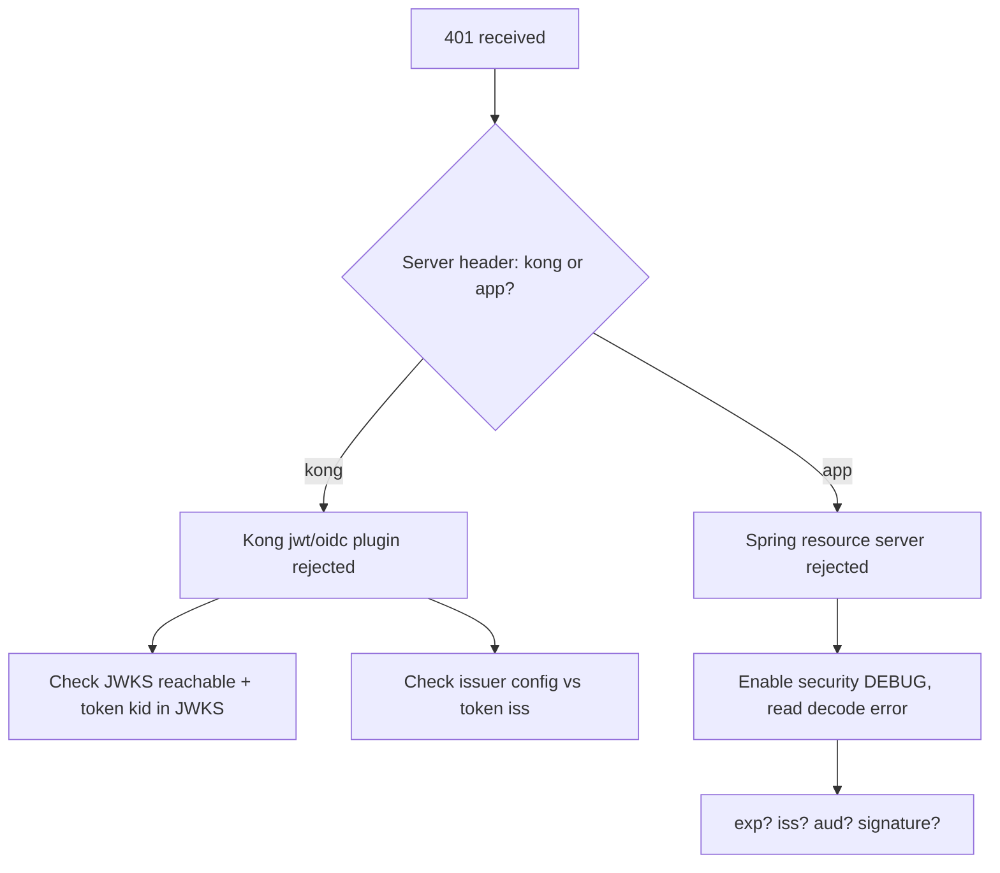
**Steps**
1. `curl -i` the endpoint; note `Server` and `WWW-Authenticate`.
2. Decode token: `jwtdecode "$TOKEN" 2` → check `exp` (epoch vs now: `date +%s`), `iss`, `aud`, `kid`.
3. If expired → client token refresh issue; check clock skew (`date` on pods).
4. If `iss` wrong → issuer config mismatch (§10.2).
5. If signature → JWKS rotation: compare token `kid` vs `/certs` (§10.4).
6. **Logs:** `kubectl logs deploy/account-service | grep -i 'Failed to authenticate'`; Kong proxy logs.
7. **Metrics:** `http_server_requests_seconds_count{status="401"}` spike onset.
**Fix:** refresh/rotate keys, align issuer, fix clock, or correct token issuance.

### 25.2 Playbook: 403 Forbidden

1. Confirm authenticated (it's not 401) → identity is known, authorization failed.
2. Decode token → list `realm_access.roles`, `resource_access`, `scope`.
3. Compare against the endpoint's requirement (`@PreAuthorize`, matcher).
4. Enable security DEBUG → find `Access is denied` with the **required authority**.
5. Check the **authority mapping converter** (§12.2) — is `realm_access.roles` mapped to `ROLE_*`? This is the usual culprit.
6. If Kong ACL → check consumer groups.
**Fix:** add the missing role in Keycloak, fix the protocol mapper, or fix the authority converter. **Never** just remove the auth check.

### 25.3 Playbook: 404 Not Found

1. `curl -i` → `Server: kong` (route) vs app whitelabel (mapping).
2. If Kong: `curl localhost:8001/routes` — does any route match the host+path+method? Check `strip_path`.
3. If app: `/actuator/mappings` — is the path mapped? Context-path? Path variable mismatch?
4. Check recent deploys (route renamed, controller path changed).
**Fix:** correct route/strip_path or controller mapping.

### 25.4 Playbook: 429 Too Many Requests

1. Read `Retry-After`, `RateLimit-Limit/Remaining`.
2. Who's limiting — Kong (`Server: kong`) or app? 
3. Is it one abusive client/tenant or global? Check per-consumer metrics.
4. If Kong with `local` policy on multi-node → effective limit is N× (each node counts separately) or clients hit different nodes inconsistently → switch to `redis`.
5. Check for a **retry storm** (§20.1) inflating traffic.
**Fix:** raise/limit appropriately per tenant; switch to redis policy; add client backoff; protect token endpoint.

### 25.5 Playbook: 431 Header Too Large

1. `echo -n "$TOKEN" | wc -c` — is the JWT huge (>6–8KB)?
2. Decode payload → count roles/groups; admin/ops users usually trigger it.
3. Identify the limiting layer (nginx/Kong vs Tomcat) from which component emits 431.
**Fix (priority):** shrink the token (trim mappers, drop full group paths, scope per-audience) — §9.4/§11.6. Raise header buffers as a stopgap.

### 25.6 Playbook: 500 Internal Server Error

1. Get trace-id from response/`X-Request-Id`.
2. `kubectl logs deploy/<svc> | grep <trace-id>` (or query log store by `traceId`).
3. Read the **stack trace** — the top app frame is your bug location.
4. Common: NPE, `LazyInitializationException`, downstream `FeignException` unhandled, DB constraint violation.
5. Reproduce with the same payload in staging.
**Fix:** handle the exception via `@RestControllerAdvice`, fix the root logic, add a regression test.

### 25.7 Playbook: 502 Bad Gateway

1. Confirm emitter is the gateway (`Server: kong`).
2. `kubectl get pods` — are upstream pods Running? Recent crashes?
3. `curl localhost:8001/upstreams/<up>/health` — target health.
4. Kong proxy logs: `connect() failed (111: Connection refused)` → pod down/wrong port; `upstream prematurely closed` → app crashed mid-response or protocol mismatch (h2 vs h1).
5. Check app logs for OOM/crash at that timestamp.
**Fix:** restore healthy pods, fix port/protocol, fix the crash.

### 25.8 Playbook: 503 Service Unavailable

1. `kubectl get endpoints <svc>` — empty? (most common).
2. If empty → `kubectl get pods -l <selector>`; are any Ready? Describe a pod → readiness probe failing?
3. Check selector vs pod labels (§5.4).
4. Check if a deploy/rollout is in progress or scaled to 0.
5. Kong: no healthy upstream targets.
**Fix:** fix readiness probe / selector / scale up / wait out rollout.

### 25.9 Playbook: 504 Gateway Timeout

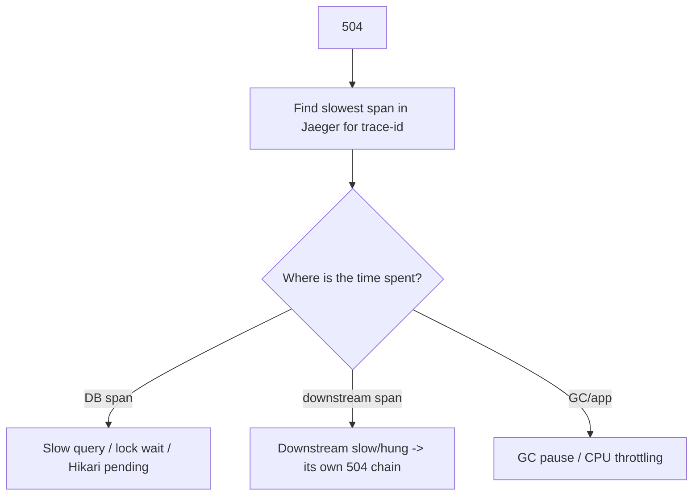
1. Pull the trace; find the long span.
2. **DB:** `pg_stat_activity` for long queries; `pg_locks` for blocked; `hikaricp_connections_pending`.
3. **Downstream:** is account-service blocked on ledger-service? Its read timeout missing/too high?
4. **App:** GC logs, CPU throttling (§22.3).
5. Check Kong `read_timeout` vs actual upstream latency.
**Fix:** optimize query/index, add/lower read timeouts (fail fast), add circuit breaker/bulkhead, scale, fix GC/CPU limits.

```sql
-- During a 504 incident on the DB
SELECT pid, now()-query_start AS dur, state, wait_event_type, left(query,80)
FROM pg_stat_activity WHERE state<>'idle' ORDER BY dur DESC LIMIT 20;
SELECT bl.pid AS blocked, ka.pid AS blocking, left(ka.query,60) AS blocking_q
FROM pg_locks bl JOIN pg_stat_activity a ON a.pid=bl.pid
JOIN pg_locks kl ON kl.locktype=bl.locktype AND kl.pid<>bl.pid AND NOT kl.granted=bl.granted
JOIN pg_stat_activity ka ON ka.pid=kl.pid WHERE NOT bl.granted;
```

---
## 26. Layer-by-Layer Troubleshooting Checklist

This checklist operationalizes the central thesis of the entire guide — *localize the failure to a layer before you read code* — into a concrete, tickable procedure. Recall the layered mental model from §1: a request passes through a stack of independent jurisdictions, each able to fail on its own and each exposing its own diagnostic surface. The fastest way to find a failure is to walk that stack from the outside in, *confirming each layer is healthy before descending to the next*, so you never waste time debugging the database when the request actually died at the gateway. That is exactly what the boxes below do: each section corresponds to one layer, and each box is a cheap yes/no test that either clears the layer (move inward) or implicates it (stop and dig). The discipline of ticking boxes matters under incident pressure precisely because it prevents the two most common time-wasters — skipping a layer on a hunch (and being wrong), and re-checking the same layer repeatedly because you lost track. Work top to bottom; the first box you *can't* tick is your prime suspect, and the relevant deep-dive section is one click away. Use this during any incident — tick each box as you eliminate a layer.

### Browser / Client
- [ ] Does the request even leave the browser? (Network tab: failed vs status)
- [ ] CORS preflight (`OPTIONS`) succeeds with a single `Access-Control-Allow-Origin`?
- [ ] Is the `Authorization` header present and a well-formed JWT (3 segments)?
- [ ] Cookies present with correct `SameSite`/`Secure`? Mixed content blocked?
- [ ] Header size sane (no 431)? Caching not serving stale data?

### Gateway (Kong)
- [ ] `Server: kong` on the response? Which `X-Kong-Request-Id`?
- [ ] A route matches host+path+method? `strip_path` correct?
- [ ] Auth plugin (jwt/oidc) passing? JWKS reachable? issuer aligned?
- [ ] Rate limit not tripped? CORS plugin not conflicting?
- [ ] Upstream targets healthy? `read_timeout` adequate?

### Keycloak
- [ ] `iss` in token == realm issuer (canonical URL)?
- [ ] `aud` includes the target service?
- [ ] Token not expired; clocks in sync?
- [ ] Signing `kid` present in JWKS (no stale rotation)?
- [ ] Required roles/scopes mapped into the token?

### Network / DNS
- [ ] FQDN resolves from the calling pod? CoreDNS healthy?
- [ ] TCP connects (not refused/timeout)? Correct port/targetPort?
- [ ] NetworkPolicy allows the path (including DNS egress 53)?
- [ ] No conntrack/FD/port exhaustion under load?

### TLS
- [ ] Cert valid (not expired), trusted (CA in truststore), host in SAN?
- [ ] TLS version/cipher compatible? mTLS pair (keystore/truststore) correct?

### Kubernetes
- [ ] Pods Running and Ready? Restart count stable (no CrashLoop/OOM)?
- [ ] Service has non-empty Endpoints? Selector matches labels?
- [ ] No CPU throttling / memory pressure / evictions?
- [ ] Recent rollout healthy? Config/Secret mounted correctly?

### Spring Security
- [ ] 401 vs 403 understood (authn vs authz)?
- [ ] JWT decodes; issuer/audience validators pass?
- [ ] Authority converter maps Keycloak roles → `ROLE_*`/`SCOPE_*`?
- [ ] CSRF/anonymous/context-propagation not interfering (async/reactive)?

### Controller / MVC
- [ ] Path+verb mapped (no 404/405/ambiguous)? Context-path correct?
- [ ] Body parses; `@Valid` passes; correct `Content-Type`/`Accept`?
- [ ] No serialization error (lazy init, recursion, enum/date/BigDecimal)?

### Business Logic
- [ ] Idempotency enforced on writes? No duplicate processing?
- [ ] Concurrency safe (locking/version)? No lost updates?
- [ ] Saga/compensation/outbox behaving? No partial money movement?

### Database / Downstream
- [ ] Hikari pool not exhausted (`connections_pending`)?
- [ ] No long queries / lock waits / deadlocks?
- [ ] Downstream calls have timeouts + breakers; not hung?

---

## 27. Senior Engineer Incident Investigation Workflow

What separates a senior engineer from a junior one during an incident is rarely raw knowledge — it is *method*. A junior engineer with a panicked, random approach can sit beside a senior engineer with the exact same technical knowledge and take five times as long to find the same root cause, because the junior jumps between hypotheses, changes several things at once, forgets what they've already ruled out, and declares victory the moment the symptom disappears (often before the cause is even found). The senior engineer follows a *repeatable methodology* that turns the chaos of an incident into a clean, defensible root-cause analysis. The ten steps below are that methodology, and they are deliberately ordered to enforce the disciplines this guide has stressed throughout: localize before you dig (steps 1–4), confirm identity and access systematically rather than by guessing (5–6), verify the boring infrastructure causes that are statistically most likely (7–8), prove your fix actually addresses the *reproduced* failure rather than coincidentally coinciding with recovery (9), and — the step juniors skip and seniors never do — close the loop so the same incident cannot recur silently (10). 

The deepest principle encoded here is the distinction between *symptom* and *cause*, and the refusal to stop at the former. An incident is not "resolved" when the error rate drops; it is resolved when you can *explain* why it happened, *prove* your change fixed that specific cause, and *guarantee* (with an alert, a guardrail, a test) that it won't silently return. "We restarted it and it's fine now" is not a resolution — it's a deferral, because you cleared the *echo* of the failure without touching the *cause* (§1.2), and the cause will fire again. Run incidents this way and two things happen: you resolve them faster because you're not thrashing, and you resolve them *permanently* because every incident leaves the system more observable and more guarded than it was before. This is how a senior engineer runs an incident.

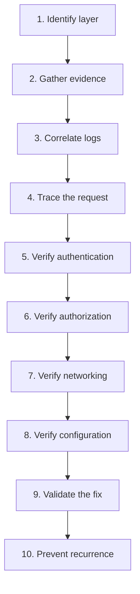

### Step 1 — Identify the Layer
Apply the five localizing questions (§1.2): blast radius, timing, boundary, exact status + emitter, recent change. Output a one-line hypothesis: *"All `/transfers` POSTs return 504 since the 14:05 deploy; account-service spans hang on ledger-service."*

### Step 2 — Gather Evidence
Pin the facts before theorizing:
- Exact error string + status + `Server`/`WWW-Authenticate` headers.
- Trace-id / X-Request-Id of a failing request.
- Timestamp of onset; correlate with deploy/cert/config/traffic changes.
- Scope: which endpoints/users/tenants/regions.
```bash
kubectl -n bank get events --sort-by=.lastTimestamp | tail -20
kubectl -n bank rollout history deploy/account-service
helm history account-service -n bank   # what changed and when
```

### Step 3 — Correlate Logs
Pull every service's logs for the failing trace-id; align them on a timeline. The first ERROR in causal order points at the origin, not the symptom.
```bash
# Across services by trace id
{app=~".+"} | json | traceId="<id>"            # Loki
```

### Step 4 — Trace the Request
Open the trace in Jaeger. Identify the span that errored or dominated latency. That span's service + tags is your prime suspect. If no trace exists, that itself is a finding (instrument it).

### Step 5 — Verify Authentication
If auth-related: decode the token, validate `exp/iss/aud/kid/sig`, check Keycloak events, confirm JWKS freshness and clock sync. Distinguish "no token" vs "bad token" vs "rejected token."

### Step 6 — Verify Authorization
Confirm the identity *should* have access. Inspect mapped authorities vs endpoint requirements; check the authority converter and Keycloak role/group mappers. Decide whether the policy or the token is wrong — never weaken the policy reflexively.

### Step 7 — Verify Networking
Resolve names, test TCP/TLS from the actual calling pod, inspect Endpoints/NetworkPolicies/DNS. Confirm whether it's refused (port/listener), timeout (policy/MTU/firewall), or reset (keep-alive).
```bash
kubectl -n bank run netshoot --rm -it --image=nicolaka/netshoot -- \
  sh -c 'nslookup ledger-service && curl -m5 -v http://ledger-service:8080/actuator/health'
```

### Step 8 — Verify Configuration
Compare effective config (`/actuator/env`, ConfigMaps, Secrets) against expected for the environment. Most "mystery" incidents resolve here. Diff against the last known-good (GitOps history).

### Step 9 — Validate the Fix
- Reproduce the failure first (so you know the fix actually addresses it).
- Apply the fix in staging; confirm the exact failing request now succeeds.
- Roll out with a safe strategy; watch the error/latency metrics return to baseline.
- Confirm no new errors introduced (check adjacent endpoints).
```bash
kubectl -n bank rollout status deploy/account-service
watch -n5 'curl -s localhost:9090/api/v1/query?query=... '   # error rate back to 0
```

### Step 10 — Prevent Recurrence
Close the loop so the same incident can't happen silently again:
- **Detection:** add an alert on the leading indicator (e.g., `hikaricp_connections_pending>0`, JWKS fetch failures, cert expiry < 14d).
- **Guardrail:** config validation at startup, contract test, idempotency, timeout/breaker defaults, retry budgets.
- **Runbook:** add/refine the playbook (§25) with the exact commands that worked.
- **Blameless post-mortem:** timeline, root cause, contributing factors, action items with owners.

### The RCA One-Pager Template

```
Title:        <short symptom> on <service> (<date/time, UTC>)
Impact:       <who/what affected, duration, $ / SLA impact>
Detection:    <how we found out — alert/customer report>
Trace-id:     <id>
Timeline:     14:05 deploy -> 14:07 first 504 -> 14:20 mitigated -> 14:35 resolved
Root cause:   <the ONE underlying cause, not the symptom>
Contributing: <missing timeout, no alert, etc.>
Resolution:   <what fixed it>
Prevention:   [ ] alert  [ ] guardrail  [ ] runbook  [ ] test  (owners + dates)
```

---

## Appendix A — One-Page Command Cheat Sheet

```bash
# HTTP / who emitted the error
curl -i -sS https://api.bank.example.com/accounts/123 -H "Authorization: Bearer $TOKEN"

# Decode a JWT payload
echo "$TOKEN" | cut -d. -f2 | tr '_-' '/+' | base64 -d 2>/dev/null | jq .

# Keycloak discovery + keys
curl -s $KC/realms/bank/.well-known/openid-configuration | jq '{issuer,jwks_uri}'
curl -s $KC/realms/bank/protocol/openid-connect/certs | jq '.keys[].kid'

# TLS inspect
echo | openssl s_client -connect host:443 -servername host 2>/dev/null | openssl x509 -noout -dates -ext subjectAltName

# Kubernetes triage
kubectl -n bank get pods -o wide
kubectl -n bank get endpoints <svc>
kubectl -n bank describe pod <pod>
kubectl -n bank logs <pod> --previous
kubectl -n bank run netshoot --rm -it --image=nicolaka/netshoot -- bash

# Kong
kubectl -n kong port-forward deploy/kong 8001:8001 &
curl -s localhost:8001/routes | jq '.data[] | {name,paths,hosts}'
curl -s localhost:8001/upstreams/<up>/health | jq

# Linux network
ss -ltnp ; ss -tan state time-wait | wc -l ; ss -tan | awk '{print $1}'|sort|uniq -c
cat /proc/1/limits | grep 'open files' ; ls /proc/1/fd | wc -l

# Postgres
psql -c "SELECT pid,now()-query_start dur,state,left(query,80) FROM pg_stat_activity WHERE state<>'idle' ORDER BY dur DESC;"
psql -c "SELECT * FROM pg_locks WHERE NOT granted;"

# Spring actuator
curl -s localhost:8080/actuator/health | jq
curl -s localhost:8080/actuator/env/spring.profiles.active | jq
curl -s localhost:8080/actuator/mappings | jq '.. | .patterns? // empty'
curl -s localhost:8080/actuator/metrics/hikaricp.connections.pending | jq
curl -s localhost:8080/actuator/threaddump | jq '.threads[] | select(.threadState=="BLOCKED")'
```

## Appendix B — 401 vs 403 vs 404 vs 502 vs 503 vs 504 in one line each

- **401** — *I don't know who you are.* (token missing/invalid/expired) → fix auth.
- **403** — *I know you, but you can't.* (missing role/scope/audience) → fix authorization.
- **404** — *That doesn't exist here.* (no route / no mapping / strip_path) → fix routing.
- **502** — *My upstream gave me garbage.* (pod crash/refused/protocol) → fix upstream health.
- **503** — *I have no healthy upstream.* (no Ready pods / empty endpoints) → fix readiness/selector.
- **504** — *My upstream was too slow.* (DB/downstream hang) → fix latency/timeouts.

---

## Appendix C — Real Production War Stories (Annotated Post-Mortems)

These are composite, anonymized incidents typical of a digital bank. Each is written the way you'd want a post-mortem to read: symptom → investigation → root cause → fix → prevention. Read them to build pattern-recognition; the same shapes recur with different surface details.

### C.1 "Everything is 401 after midnight"

**Symptom:** At 00:00 UTC, all authenticated API calls started returning `401`. Logins still worked (new tokens issued), but existing sessions failed.

**Investigation:** `Server: kong` on the 401s → gateway-level rejection. Kong proxy logs showed `Invalid signature`. Decoding a failing token's header revealed `kid: "rsa-2025-q4"`; Keycloak's `/certs` only advertised `kid: "rsa-2026-q1"`. A scheduled **key rotation job ran at midnight** and *immediately retired* the old key instead of keeping it passive.

**Root cause:** zero-overlap key rotation. Tokens minted before midnight (still valid for 15 min) referenced a `kid` that no longer existed in JWKS → signature verification failed at Kong.

**Fix (immediate):** re-published the previous signing key as passive in Keycloak; Kong refreshed JWKS; 401s cleared within the JWKS cache TTL. **Fix (proper):** rotation policy keeps the prior key active-as-passive for at least 2× the max token lifetime.

**Prevention:** alert on `count(distinct kid in JWKS) < 2` during rotation windows; synthetic check that a token minted at T-1min still validates at T+1min after rotation; reduce Kong JWKS cache TTL so new keys propagate fast.

**Lesson:** key rotation is a *distributed* operation — every cache (Kong, resource servers) must see the overlap window. See §10.4, §25.1.

### C.2 "The 3 PM slowdown"

**Symptom:** Every weekday around 15:00, p99 latency on `account-service` jumped from 80ms to 6s for ~10 minutes, then recovered. No errors, just slow.

**Investigation:** Jaeger traces during the window showed the time was spent *not* in the DB span nor downstream — it was a gap *before* the controller span even started. CPU metrics showed `container_cpu_cfs_throttled_periods_total` spiking at exactly 15:00. A marketing batch job scaled up on the same nodes, and the JVM's GC threads got CPU-throttled by a tight CPU `limit`.

**Root cause:** CPU `limit` of `500m` on a service with a 4-thread G1 GC. Under co-tenant pressure, CFS throttled the GC, causing long stop-the-world pauses that froze request handling.

**Fix:** removed the CPU limit (kept the request) for this latency-sensitive service; set `-XX:ActiveProcessorCount` to match. Throttling vanished.

**Prevention:** alert on `rate(container_cpu_cfs_throttled_periods_total[5m]) > 0` for latency-critical services; don't put batch and latency-sensitive workloads on the same nodes (node pools / taints); right-size GC threads to the CPU allocation.

**Lesson:** a "slow" with no DB/downstream time and no errors smells like the runtime (GC/throttling), not your code. See §22.3.

### C.3 "Payments doubled during the network blip"

**Symptom:** A 4-second network partition between the mobile gateway and `payment-service` led to ~120 duplicate payments.

**Investigation:** Duplicate rows in `payments` shared identical amounts and accounts, 2–3s apart, different `trace-id`s. The mobile SDK auto-retried POSTs on timeout. `/transfers` had **no idempotency key**; the first attempt had actually succeeded server-side but the response was lost in the partition.

**Root cause:** non-idempotent write + client retry on timeout. Classic at-least-once-from-the-client problem.

**Fix (immediate):** identified duplicates via a dedupe query (§21.1) and posted reversals after manual review. **Fix (proper):** mandatory `Idempotency-Key` header, stored with a unique constraint; replays return the original response.

**Prevention:** idempotency keys on every money-moving endpoint; client SDK generates the key once per logical operation and reuses it across retries; Kong rejects money POSTs missing the header.

**Lesson:** the network *will* partition; your writes must be safe to retry. See §21.1, §20.6.

### C.4 "Admin users can't log in, everyone else is fine"

**Symptom:** Only users in many groups (admins, ops) got a blank error page; regular customers were unaffected.

**Investigation:** Browser console showed `431`. `echo -n "$TOKEN" | wc -c` for an admin token: 11KB. The access token embedded every realm role and full group paths via an over-eager protocol mapper. Tomcat's default header limit (8KB) rejected it.

**Root cause:** token bloat from mapping full group hierarchies into the access token; admins have dozens of groups.

**Fix:** trimmed protocol mappers to emit only the roles the resource servers actually check; removed full group-path claim; moved fine-grained permissions to a dedicated authorization service queried on demand. Token dropped to ~3KB.

**Prevention:** alert on token size p99; cap mapped claims; periodic review of protocol mappers; raise header buffers only as a stopgap.

**Lesson:** "works for some users, fails for others" with the difference being *role count* is almost always 431/token bloat. See §9.4, §11.6.

### C.5 "Intermittent UnknownHostException after a deploy"

**Symptom:** After redeploying `ledger-service`, `account-service` threw sporadic `UnknownHostException: ledger-service` for ~60 seconds, then stabilized.

**Investigation:** The errors clustered right when old `ledger-service` pods terminated. `account-service` used a client-side load balancer with a stale instance cache pointing at terminated pod IPs; some calls also hit a brief CoreDNS lookup spike (ndots amplification) during the rollout.

**Root cause:** stale client-side instance list + JVM DNS caching of pod IPs that no longer existed during the rolling update.

**Fix:** switched to calling the **Service ClusterIP via DNS** (stable) instead of client-side LB over pod IPs; set JVM `networkaddress.cache.ttl=30`; added `dnsConfig ndots:2` to cut lookup amplification.

**Prevention:** prefer Service DNS over client-side LB unless you specifically need it; graceful shutdown with `preStop` sleep so terminating pods drain; readiness gates so new pods receive traffic only when ready.

**Lesson:** rolling deploys churn IPs; anything caching pod IPs (client LB, JVM DNS) will briefly point at the dead. See §6.4, §6.2.

### C.6 "Service B sees no Authorization header"

**Symptom:** `account-service` → `ledger-service` Feign calls returned `401` only for requests triggered from an async flow (notifications, scheduled reconciliation); synchronous user requests worked.

**Investigation:** The Feign `RequestInterceptor` read the token from `SecurityContextHolder`, which is thread-local. In the `@Async` path the security context wasn't propagated to the worker thread → interceptor found no auth → no header → 401.

**Root cause:** thread-local SecurityContext lost across async boundary.

**Fix:** for user-context async work, propagate the context (`DelegatingSecurityContextExecutor`); for true background jobs (no user), switched to a **service token** via client-credentials (the correct identity for system-initiated work anyway — §18).

**Prevention:** lint/guard against `@Async` flows that assume user context; explicit decision per flow: user token (propagate) vs service token (client credentials).

**Lesson:** auth that "works synchronously, fails async" is a context-propagation bug, not a Keycloak bug. See §12.5, §14.5, §18.

### C.7 "504s only under load, DB looks idle"

**Symptom:** Under peak load, `transfer` requests returned `504`; the DB CPU and query times looked normal.

**Investigation:** `hikaricp_connections_pending` spiked to 40+ while `hikaricp_connections_active` sat at the max pool size (10). Threads were *waiting for a connection*, not running slow queries. The downstream `fraud-service` call inside the transfer transaction was slow (2–3s), so each request held a DB connection for the entire fraud call → pool starved.

**Root cause:** holding a DB connection across a slow remote call ("chatty transaction"); tiny Hikari pool relative to concurrency.

**Fix:** moved the `fraud-service` call *outside* the DB transaction; right-sized the pool; added a timeout + bulkhead on the fraud call.

**Prevention:** never make remote calls while holding a DB connection/transaction; alert on `hikaricp_connections_pending > 0`; load test transaction boundaries.

**Lesson:** "504 with an idle-looking DB" usually means connection *pool* starvation, not slow SQL. See §25.9, §20.2.

### C.8 "TLS works from my laptop, fails in the cluster"

**Symptom:** A new service calling an internal partner API got `PKIX path building failed`; the same `curl` worked from an engineer's laptop.

**Investigation:** The laptop trusted the corporate internal CA (installed in the OS keychain). The container's JVM `cacerts` did not include the internal CA.

**Root cause:** internal CA missing from the container truststore.

**Fix:** mounted the internal CA bundle as a Secret and pointed the JVM at a truststore containing it (§8.3). 

**Prevention:** bake the internal CA into the base image or standardize a truststore Secret across all services; CI check that internal endpoints are reachable from a container, not just laptops.

**Lesson:** "works on my machine" for TLS = a truststore difference. The cluster trusts nothing you didn't give it. See §8.3.

### C.9 "Stale balance after a successful transfer"

**Symptom:** After a transfer, the app briefly showed the *old* balance, then corrected on refresh.

**Investigation:** `account-service` cached balances in Redis with a 5-minute TTL. The transfer wrote to the ledger and updated the balance projection, but did **not** invalidate the Redis entry. The read path served the stale cached value until TTL expiry.

**Root cause:** cache not invalidated on the write path.

**Fix:** explicit cache eviction on balance change (write-through); for money-critical reads, dropped caching entirely in favor of the authoritative projection.

**Prevention:** treat cache invalidation as part of every write that changes cached data; prefer no-cache for money-critical reads; reconciliation alert on cache-vs-source drift.

**Lesson:** in banking, a stale read is a correctness bug, not a performance footnote. See §21.7.

### C.10 "Kong returns 503 right after a perfectly healthy deploy"

**Symptom:** Immediately after deploying `account-service`, Kong returned `503` for ~30s even though pods showed `Running`.

**Investigation:** `kubectl get endpoints account-service` was empty during the window. The new pods were `Running` but not yet `Ready` — the readiness probe pointed at `/actuator/health/readiness`, which depended on a downstream warm-up. Kong's active health check also needed two consecutive successes before routing.

**Root cause:** normal startup gap, but no surge protection — old pods were already gone (aggressive `maxUnavailable`) before new ones were Ready.

**Fix:** set `maxUnavailable: 0`, `maxSurge: 1` so new pods become Ready before old ones leave; added a `startupProbe` for slow JVM boot.

**Prevention:** conservative rollout strategy for every service; readiness reflects true serve-ability; PodDisruptionBudget to keep minimum availability.

**Lesson:** 503 right at deploy time = endpoints empty during the rollout gap; fix the rollout strategy, not the app. See §25.8, §22.4.

---

## Appendix D — Deep Dives & Quick Theory Refreshers

### D.1 Why timeouts are non-negotiable (the math of cascading failure)

Suppose `account-service` has 200 request threads and calls `ledger-service`. If `ledger-service` hangs and the **read timeout is infinite**, then within seconds all 200 threads are parked waiting on ledger. Now `account-service` cannot serve *any* request — including ones that never needed ledger. Its callers' threads then park waiting on `account-service`, and the failure climbs the call graph. A single slow leaf can freeze the whole tree.

With a 2s read timeout + a bulkhead capping ledger calls at 25 concurrent, at most 25 threads are ever tied up in ledger; the other 175 keep serving. The slow leaf is contained. **Every** remote call needs: connect timeout, read timeout, a concurrency cap (bulkhead), and ideally a circuit breaker. The default "no timeout" is the single most dangerous setting in microservices.

### D.2 Idempotency, exactly-once, and why "exactly-once delivery" is a myth

You cannot have exactly-once *delivery* across an unreliable network — the sender can never be sure its message arrived, so it must either risk loss (at-most-once) or risk duplication (at-least-once). What you *can* have is exactly-once *effect*: accept at-least-once delivery and make processing **idempotent** so duplicates are harmless. In banking this means: idempotency keys on writes, dedupe tables for events (`processed_events(event_id PK)`), and atomic claim-or-return semantics (`INSERT ... ON CONFLICT`). Design for "this will be delivered more than once" and the duplicate-payment class of bugs disappears.

### D.3 The dual-write problem and the outbox, restated

Any time one operation must update **two** systems that don't share a transaction (DB + Kafka, DB + another service), there is a window where one succeeds and the other doesn't — a crash there leaves them inconsistent. The transactional outbox collapses the two writes into one DB transaction (domain row + outbox row), then a separate relay propagates the outbox to the other system with retries. The propagation can be delayed but cannot be lost, because it's durably committed with the data. This is the backbone of reliable event-driven banking. See §21.4.

### D.4 Reading a thread dump fast

```bash
curl -s localhost:8080/actuator/threaddump > td.json
# Count threads by state
jq -r '.threads[].threadState' td.json | sort | uniq -c
# Find what BLOCKED threads are waiting on
jq -r '.threads[] | select(.threadState=="BLOCKED") | {name:.threadName, lock:.lockOwnerName, top:.stackTrace[0].className}' td.json
```
Many threads blocked on the same lock owner → a hot synchronized section or a connection pool. Many `WAITING` on a pool's `awaitNanos` → pool exhaustion. Many `RUNNABLE` deep in a downstream socket read → a slow/hung downstream. A thread dump taken twice, ~5s apart, shows whether threads are *progressing* or *stuck*.

### D.5 The "which timeout fired?" decision

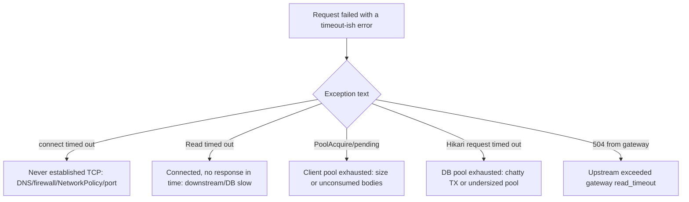
Naming the *exact* timeout that fired collapses the search space immediately — it tells you whether you never connected, connected-but-waited, or couldn't even get a client/connection slot to start.

### D.6 HTTP status emitter fingerprints (expanded)

| Header / body trait | Emitter | Note |
|---------------------|---------|------|
| `Server: kong/3.x` | Kong | gateway-level decision |
| `X-Kong-Upstream-Latency` present | Kong | shows upstream was reached |
| `X-Kong-Upstream-Latency` absent on 4xx/5xx | Kong | Kong rejected before reaching upstream (plugin) |
| `WWW-Authenticate: Bearer error=...` | resource server / Kong OIDC | token problem detail in `error_description` |
| `{"timestamp","status","error","path"}` | Spring Boot whitelabel | app-level |
| `{"type","title","status","detail"}` (RFC 7807) | Spring `ProblemDetail` | app with `@RestControllerAdvice` |
| nginx HTML error page | Ingress nginx / nginx upstream | not your app |
| empty body + connection closed | upstream crash / proxy reset | check pod + proxy logs |

### D.7 Banking authorization mental model

There are three distinct questions, often conflated:
1. **Authentication** — *who are you?* (valid JWT) → 401 if it fails.
2. **Authorization (coarse)** — *are you allowed this endpoint?* (role/scope) → 403.
3. **Authorization (fine / data-level)** — *are you allowed this specific account/record?* (ownership, tenant, limits) → 403/404.

The third is the one teams forget: a valid `customer` token with the `accounts:read` scope is correctly authenticated and coarsely authorized, but must *still* be prevented from reading *someone else's* account. Enforce data-level checks (`@PostAuthorize`, repository-level tenant filters, ownership checks) — never assume the coarse role is enough. A missing data-level check is a serious banking vulnerability (horizontal privilege escalation / IDOR), not just a bug.

### D.8 A minimal, safe outbound-call template (copy this everywhere)

Every synchronous outbound call in a banking service should have, at minimum:
- connect timeout (fast, e.g. 2s) and read timeout (bounded, e.g. 3–5s);
- a pooled, reused client (never per-request);
- a concurrency cap / bulkhead per downstream;
- a circuit breaker with a *safe* fallback (fail-closed for money operations);
- correlation-id + appropriate identity (user vs service token) propagated;
- **no retries on non-idempotent writes** (or retries only with an idempotency key);
- jitter on any retry;
- structured error decoding (don't swallow downstream error semantics).

If a call is missing any of these, it's a latent incident. Treat this list as a code-review checklist for every new client.

---

## Appendix E — Glossary of Key Terms

A quick-reference glossary for the vocabulary used throughout this handbook. Definitions are written for an engineer mid-incident — concise, practical, and cross-linked to the section that covers each term in depth. Terms are grouped by domain; within each group they are ordered roughly from foundational to advanced.

### Identity, Auth & Tokens

- **OAuth2** — An authorization framework defining how a client obtains an access token to call a protected resource on a user's behalf. It standardizes the *flows* (grant types) but not identity itself. See §10.5.
- **OpenID Connect (OIDC)** — An identity layer built on top of OAuth2 that adds authentication (proving *who* the user is) via the ID token and a standard discovery document. Keycloak is an OIDC provider. See §10.
- **JWT (JSON Web Token)** — A signed, self-contained token of the form `header.payload.signature`, base64url-encoded. Carries identity and authorization claims; tamper-evident via its signature but **not encrypted** (anyone can read the payload). The "passport" of the system. See §11.
- **Claim** — A single field inside a JWT payload (e.g., `iss`, `aud`, `exp`, `realm_access.roles`). Each is *stamped at issuance* and *checked at verification*. See §11.3.
- **Issuer (`iss`)** — The URL identifying who minted a token. Must match the verifier's configured issuer *exactly*; the internal-vs-external URL mismatch is the #1 banking auth bug. See §10.2.
- **Audience (`aud`)** — The claim naming which service(s) a token is intended for. Enforcing it prevents a token issued for one service being replayed against another. See §10.3.
- **Scope** — A coarse permission string in a token (e.g., `accounts:read`), mapped by Spring to a `SCOPE_*` authority. See §12.2.
- **Realm** — An isolated tenant in Keycloak with its own users, clients, roles, and signing keys. `bank` and `bank-staging` share nothing. See §10.
- **Client (Keycloak)** — A registered application within a realm (e.g., `web-app`, `account-service`), identified by a client ID and optionally a secret. See §10.5.
- **Grant type / Flow** — The procedure by which a client proves it deserves a token: Authorization Code (user login), Client Credentials (service-to-service), Refresh Token (renewal), Token Exchange (re-scoping). See §10.5.
- **Service account** — An identity for a *program* rather than a person, obtained via the client-credentials grant; used for system-initiated, no-user-present work. See §18.3.
- **JWKS (JSON Web Key Set)** — The endpoint where Keycloak publishes its *public* signing keys (each tagged with a `kid`), so verifiers can check signatures without contacting Keycloak per request. See §10.1, §10.4.
- **`kid` (Key ID)** — An identifier in a JWT header naming which signing key was used, so verifiers pick the matching public key from JWKS. Stale JWKS caches after key rotation cause `Invalid signature`. See §10.4.
- **Key rotation** — Periodically replacing Keycloak's signing keys. Requires an *overlap window* (old key kept passive) or in-flight tokens fail verification. See §10.4, War Story C.1.
- **Token propagation** — Forwarding the incoming user's token to downstream calls so each service authorizes the *real user* (delegated identity). Lost across `@Async`/reactive thread boundaries. See §18.2, §14.5.
- **Token exchange (RFC 8693)** — Swapping a user token for a new one representing the same user but scoped down to a specific downstream audience. The surgical alternative to blunt propagation. See §18.4.
- **Clock skew** — Drift between the issuer's and verifier's clocks, causing valid tokens to look expired/not-yet-valid. Fix with NTP, not large leeway. See §10.7.
- **Algorithm confusion** — An attack exploiting a verifier that trusts the token's `alg` header (`alg: none`, or RS256→HS256 downgrade). Defense: pin the expected algorithm. See §11.4.

### Spring & Application Layer

- **Spring Security filter chain** — The ordered pipeline of servlet filters every request passes through *before* the controller; authentication runs before authorization. *Which filter rejected* determines 401 vs 403. See §12.
- **`SecurityContext` / `Authentication`** — The object representing the verified caller and its authorities, stored in a `ThreadLocal`. Lost when work hops threads (async/reactive). See §12.
- **`GrantedAuthority`** — A permission held by the caller (`ROLE_*`, `SCOPE_*`); authorization compares these against the endpoint's rule. The Keycloak-roles-not-mapped issue is the #1 cause of 403. See §12.2.
- **`401 Unauthorized` vs `403 Forbidden`** — 401 = "we can't establish who you are" (token problem); 403 = "we know you, but you lack the required role/scope" (authorization problem). See §12.
- **Resource server** — A service that validates incoming JWTs (re-checking the gateway's work under zero-trust) using Keycloak's public keys. See §12.1.
- **`DispatcherServlet`** — Spring MVC's front controller that maps a request to a handler method, binds/deserializes arguments, and runs validation. See §13.
- **Bean validation (`@Valid`)** — Constraint enforcement on DTOs (`@NotNull`, `@DecimalMin`); inert without `@Valid` on the parameter. The cheap first defense against bad data. See §13.3.
- **`@ControllerAdvice` / `ProblemDetail`** — Centralized exception handling mapping domain exceptions to safe, structured (RFC-7807) error responses. Prevents stack-trace/data leaks. See §13.6.
- **DTO (Data Transfer Object)** — A purpose-built wire-format object, distinct from JPA entities. Mapping entities → DTOs avoids lazy-loading and circular-reference serialization crashes. See §13.5, §17.6.
- **`LazyInitializationException`** — Thrown when serializing a lazy JPA association after its transaction/session closed; surfaces as a partial body → 502. See §13.5.
- **HikariCP** — Spring Boot's default database connection pool (default size 10). Saturation (`connections_pending > 0`) is the usual cause of "504 with an idle-looking database." See §2 Stage 6.

### Clients & HTTP

- **Feign** — A declarative HTTP client that turns a Java interface into remote calls. Its danger is that remote calls *look local*; needs explicit timeouts, conservative retries, and identity propagation. See §14.
- **WebClient** — Spring's reactive, non-blocking HTTP client (Reactor Netty). Scales with few event-loop threads but is wrecked by blocking calls, unconsumed responses, and `.block()`. See §15.
- **RestClient / RestTemplate** — Blocking, thread-per-request HTTP clients. Their danger lives in the defaults (no pooling, no timeouts); always use a pooled, timed factory. See §16.
- **Connect timeout vs read timeout** — Connect bounds the TCP handshake (short); read bounds waiting for response bytes. A missing read timeout is the classic cause of cascading thread exhaustion. See §7.3.
- **Connection pool** — A reusable set of long-lived connections; the universal antidote to port/FD/conntrack exhaustion. Pool idle-TTL must be shorter than upstream keep-alive. See §7.2, §7.5.
- **Idempotency key** — A client-supplied key letting the server recognize and dedupe a retried write, making "execute exactly once" safe over an at-least-once network. The defense against duplicate payments. See §21.1.
- **CORS (Cross-Origin Resource Sharing)** — The browser protocol by which a server grants JavaScript permission to read cross-origin responses. Enforced *only* by browsers (hence "works in curl, fails in browser"). See §3.1.
- **Preflight (`OPTIONS`)** — The unauthenticated `OPTIONS` request a browser sends before a non-simple cross-origin call; must not be auth-challenged. See §3.4.
- **Jackson** — The JSON serialization library. Cross-service Jackson failures are *contract violations* surfacing at runtime; the silent ones (precision, timezone) are the dangerous ones. See §17.

### Gateway & Networking

- **Kong** — The API gateway; the "airport security checkpoint" every external request passes through. Stamps `Server: kong` and `X-Kong-*` headers on what it emits. See §4.
- **Route / Service / Upstream (Kong)** — Route = match rules (host/path/method); Service = a backend definition; Upstream/Target = Kong's own load balancer + health checks. See §4.1.
- **Plugin (Kong)** — A policy module (jwt, openid-connect, acl, rate-limiting, cors, transformers) that runs in fixed priority order: auth → authz → rate-limit → transform. See §4.1.
- **`strip_path`** — A Kong route setting controlling whether the matched path prefix is removed before proxying. Mismatches cause 404s that only appear through the gateway. See §4.3.
- **ClusterIP / NodePort / LoadBalancer / Headless** — Kubernetes Service types forming a ladder of exposure; Headless opts out of the virtual-IP abstraction to expose pod IPs directly. See §5.7, §6.5.
- **Endpoints / EndpointSlice** — The live roster of ready pod IPs behind a Service. An *empty* Endpoints list is the #1 cause of 503 (selector mismatch or failing readiness). See §5.4.
- **kube-proxy** — The component that makes a Service's virtual ClusterIP work by programming iptables/IPVS to DNAT packets to a ready pod. See §5 intro.
- **CoreDNS** — The cluster DNS server resolving Service names to ClusterIPs. The "internal phone directory"; overload causes intermittent `UnknownHostException` and latency spikes. See §6.
- **`ndots:5`** — A resolver setting causing short names to be tried with search-domain suffixes first, amplifying external-host lookups into 4–5 queries each. See §6.1.
- **NetworkPolicy** — Kubernetes firewall rules restricting pod-to-pod traffic. A block manifests as a *timeout* (not a refusal); forgetting DNS-port egress breaks all name resolution. See §5.6.
- **TLS / mTLS** — Transport encryption with identity proof; mutual TLS additionally requires the *client* to present a certificate. Failures are precise once you read them. See §8.
- **Keystore vs Truststore** — Keystore = *my* identity (private key + cert, to prove who I am); Truststore = *who I trust* (CA certs, to verify others). See §8.7.
- **PKIX path building failed** — The TLS error meaning the verifier couldn't build a trust chain to a known root CA — usually an internal CA missing from the truststore. See §8.3.
- **SAN (Subject Alternative Name)** — The names a certificate is valid for; connecting via a name not in the SANs causes a hostname-mismatch error. See §8.4.

### Distributed Systems & Reliability

- **Correlation ID / Trace ID** — A single identifier generated at the edge and propagated (via `traceparent`) through every hop, stamped into every log line and span; the thread that reassembles one request's story across services. See §19.
- **Span / Trace** — A span is one unit of work (one service handling one operation); a trace is the parent-child tree of spans sharing a trace ID. The trace localizes *where* a request failed. See §19.4.
- **RED / USE** — Metric frameworks: RED (Rate, Errors, Duration) is the request-centric view; USE (Utilization, Saturation, Errors) is the resource-centric view. See §19.5.
- **Idempotency** — The property that processing the same operation more than once has the same effect as once. The realistic substitute for unattainable exactly-once *delivery*. See §20.6, Appendix D.2.
- **At-least-once / Exactly-once** — Delivery guarantees; true exactly-once *delivery* is impossible over an unreliable network, so you design for at-least-once and make duplicates harmless via idempotency. See §20.8.
- **Retry storm / Thundering herd** — A positive-feedback collapse where retries (or synchronized stampedes) multiply load on a struggling service. Tamed by backoff *with jitter*, retry budgets, and circuit breakers. See §20.1.
- **Cascading failure** — A failure that spreads across services because a shared resource (e.g., a thread pool) is exhausted by one hung dependency. See §20.2.
- **Bulkhead** — Resource isolation (separate pools per dependency) so one failing downstream can't drain the capacity others need — the ship-compartment pattern. See §20.2.
- **Circuit breaker** — A state machine (Closed → Open → Half-Open) that stops sending traffic to a failing dependency, failing fast to protect both caller and callee. In banking, fail *closed/loud* for money. See §20.3.
- **Backpressure** — The mechanism by which a slow consumer signals a fast producer to slow down, preventing unbounded buffering and OOM in streaming pipelines. See §15.4.
- **Saga** — A multi-service transaction implemented as forward steps each paired with a compensating action, since no distributed rollback exists. Compensations must be idempotent and retryable. See §21.5.
- **Compensation** — The explicit action that semantically undoes a completed saga step (credit-back undoes a debit) when a later step fails. See §21.5.
- **Transactional outbox** — A pattern that writes a domain change and its to-be-published event in *one* database transaction, then relays the event — closing the dual-write window so events can't be silently lost. See §21.4.
- **Dual-write problem** — The inconsistency window when one operation must update two systems (DB + Kafka) without a shared transaction; solved by the outbox. See §21.4, Appendix D.3.
- **Lost update** — A concurrency bug where two read-modify-write operations overwrite each other, losing one. Fixed with optimistic/pessimistic locking or atomic SQL — let the DB be the arbiter. See §20.6.
- **Split brain** — Divergent state when a network partition lets two nodes both act as primary. Prevented by quorum/consensus, fencing tokens, single-writer-per-partition. See §20.7.
- **Consumer lag** — The growing gap between produced and consumed Kafka events; a silent failure where effects (notifications, projections) fall minutes behind while everything reports green. See §20.4.
- **Source of truth** — The single authoritative store for a piece of data (the ledger for money); all caches/projections are derivations that must be kept honestly in sync. See §21.6.
- **Reconciliation** — A periodic job recomputing a derived value (balance) from its source of truth and alerting on drift; how you catch silent inconsistency proactively. See §21.6.

### Kubernetes Platform

- **Control loop / Desired state** — Kubernetes continuously reconciles "what you declared" against "what's running." Most platform failures are this loop reacting to a non-cooperating pod. See §22.
- **Requests vs Limits** — Declared resources: `requests` is what the scheduler reserves; `limits` is the cgroup-enforced ceiling (exceed memory → killed, exceed CPU → throttled). See §22.
- **CrashLoopBackOff** — Kubernetes repeatedly restarting a container that keeps dying at startup, with increasing back-off delay. Diagnose with `logs --previous`. See §22.1.
- **OOMKilled (exit 137)** — The kernel killing a container that exceeded its memory limit; with Java, often a non-container-aware heap or forgotten non-heap (metaspace, threads, Netty buffers) footprint. See §22.2.
- **CPU throttling** — CFS freezing a process that spends its per-period CPU budget; produces high latency at *low average CPU* (bursty GC throttled). See §22.3.
- **Liveness / Readiness / Startup probes** — Health checks: readiness gates traffic (failing → removed from Endpoints → 503), liveness restarts the container, startup holds off the others during slow boot. Don't put dependency checks in liveness. See §22.4.
- **Taint / Toleration** — A mechanism to *reserve* nodes: a taint repels pods unless they tolerate it. Causes `Pending` with "untolerated taint." See §22.5.
- **Rolling deployment (`maxUnavailable`/`maxSurge`)** — Gradual pod replacement keeping the service available; a broken new version stalls the rollout (good) while old pods keep serving. `rollout undo` reverts fast. See §22.6.

### TCP/IP & OS

- **Connection refused vs timeout** — Refused = reached a live host but nothing listens on the port (fast, active rejection → app/port issue); timeout = packet vanished (silent drop → NetworkPolicy/firewall). See §5.5, §7.1.
- **`TIME_WAIT` / `CLOSE_WAIT`** — TCP teardown states: many `TIME_WAIT` is normal under churn; rising `CLOSE_WAIT` is an *application bug* (a response/stream you never closed) leaking file descriptors. See §7.6.
- **Ephemeral port / conntrack exhaustion** — Finite per-pod source ports and per-node connection-tracking entries; high connection churn exhausts them under load. Fix: pool connections. See §7.5.
- **File descriptor (FD)** — The kernel handle for every socket/file, capped per process by `ulimit`. Leaked FDs (unclosed responses) cause `Too many open files`. See §7.4.
- **MTU / fragmentation** — Overlay networks reduce the max packet size; oversized don't-fragment packets are silently dropped, causing "small requests work, large ones hang." See §7.8.

### Banking-Specific

- **Ledger** — The authoritative, append-only record of postings; the source of truth for money, from which balances are *derived* rather than independently stored. See §21.6.
- **Posting** — A single credit or debit entry in the ledger; money movement is conservation of postings (every debit has a matching credit). See §21.
- **Invariant** — A property that must *never* be violated (money is conserved, operations happen exactly once, balance equals the sum of the ledger). Every banking incident is an invariant violated; "returned 200" is not success — "the invariant still holds" is. See §21.
- **KYC (Know Your Customer)** — Regulatory identity/risk profile data owned by `customer-service` and replicated to others; stale replicas cause failed compliance checks. See §21.8.
- **Zero-trust** — The assumption that the internal network is *not* safe, so every service independently authenticates and authorizes every call (why Spring re-validates a token Kong already checked). Underlies mTLS and double validation. See §8, §12.

---

*End of handbook. Keep it next to your terminal during incidents; extend the playbooks (§25), the lookup table (§24), the war stories (Appendix C), and this glossary (Appendix E) with every new incident you resolve — a runbook is only as good as its last post-mortem.*


