# Problem-Solving Guide in Microservices Communication
### A Real-World Troubleshooting Handbook for Spring Boot Banking Platforms

> **Audience:** Java/Spring Boot backend engineers, banking software engineers, platform & DevOps engineers supporting Keycloak, Kong Gateway, Kubernetes, Feign, WebClient, REST and JSON-RPC distributed systems.
>
> **Use it for:** live incidents, production support, debugging sessions, root-cause analysis (RCA), onboarding, and interview prep.
>
> **How to read it:** Each problem follows the same skeleton — *What it is → Symptoms → Errors → Root causes → Investigate → Reproduce → Diagnose → Fix → Prevent → Examples.* Jump to the section you need during an incident; read end-to-end during onboarding.

---

## Table of Contents

1. [Microservices Communication Troubleshooting Methodology](#1-microservices-communication-troubleshooting-methodology)
2. [End-to-End Request Flow Analysis](#2-end-to-end-request-flow-analysis)
3. [Client-Side Problems](#3-client-side-problems)
4. [Kong Gateway Troubleshooting](#4-kong-gateway-troubleshooting)
5. [Kubernetes Networking Troubleshooting](#5-kubernetes-networking-troubleshooting)
6. [DNS and Service Discovery](#6-dns-and-service-discovery)
7. [TCP/IP Layer Failures](#7-tcpip-layer-failures)
8. [TLS / SSL Troubleshooting](#8-tls--ssl-troubleshooting)
9. [HTTP Protocol Problems](#9-http-protocol-problems)
10. [Keycloak Troubleshooting](#10-keycloak-troubleshooting)
11. [JWT Troubleshooting](#11-jwt-troubleshooting)
12. [Spring Security Troubleshooting](#12-spring-security-troubleshooting)
13. [Spring MVC Layer Problems](#13-spring-mvc-layer-problems)
14. [Feign Client Troubleshooting](#14-feign-client-troubleshooting)
15. [WebClient Troubleshooting](#15-webclient-troubleshooting)
16. [RestTemplate and RestClient Troubleshooting](#16-resttemplate-and-restclient-troubleshooting)
17. [JSON / Jackson Troubleshooting](#17-json--jackson-troubleshooting)
18. [Service-to-Service Authentication Problems](#18-service-to-service-authentication-problems)
19. [Observability and Distributed Tracing](#19-observability-and-distributed-tracing)
20. [Distributed Systems Failure Patterns](#20-distributed-systems-failure-patterns)
21. [Banking-Specific Failure Scenarios](#21-banking-specific-failure-scenarios)
22. [Kubernetes Production Failures](#22-kubernetes-production-failures)
23. [Configuration Failures](#23-configuration-failures)
24. [Error-to-Root-Cause Lookup Table](#24-error-to-root-cause-lookup-table)
25. [Production Debugging Playbooks](#25-production-debugging-playbooks)
26. [Layer-by-Layer Troubleshooting Checklist](#26-layer-by-layer-troubleshooting-checklist)
27. [Senior Engineer Incident Investigation Workflow](#27-senior-engineer-incident-investigation-workflow)

---

## 1. Microservices Communication Troubleshooting Methodology

In a digital bank with dozens of microservices, almost no production incident is "one bug in one service." It is a *chain* failure: a token expires, a DNS record goes stale, a connection pool saturates, a downstream times out, and a retry storm finishes the job. The single most valuable skill is **localizing the failure to a layer** before you start reading code.

### 1.1 The Layered Mental Model

Think of every request as passing through a stack of independent layers. Each layer can fail independently and each layer has its *own* logs, metrics, and diagnostic commands.

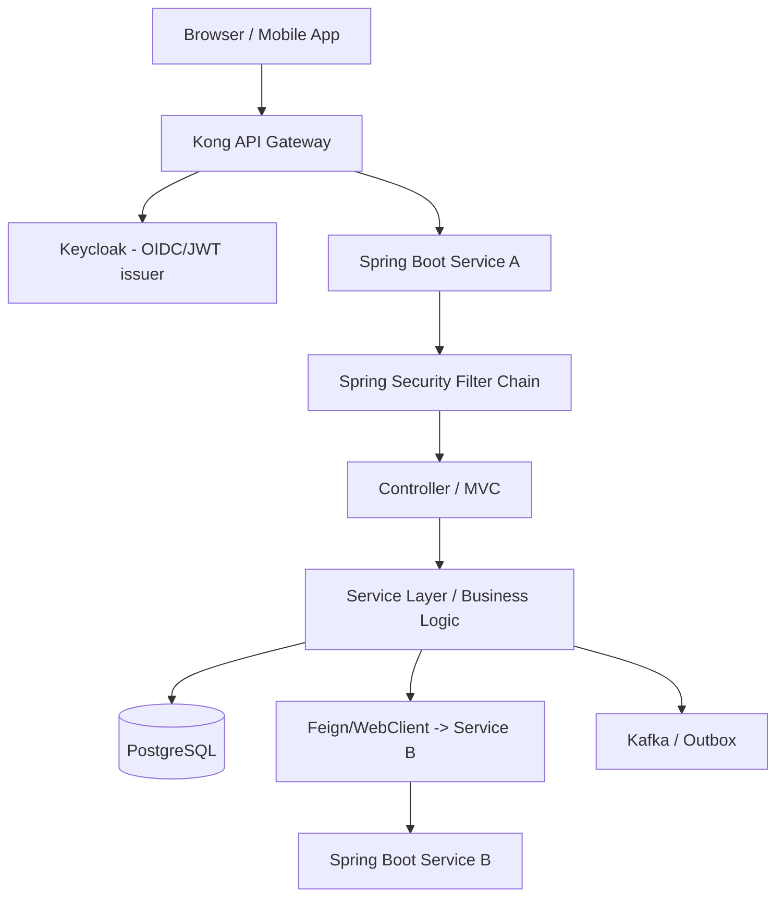

The layers, in order, are:

| # | Layer | Owns | Typical failures |
|---|-------|------|------------------|
| 0 | Client (browser/mobile) | CORS, cookies, JWT storage | preflight, SameSite, mixed content |
| 1 | DNS / Service Discovery | name → IP | `UnknownHostException`, stale records |
| 2 | TCP/IP | sockets, ports | connection refused/reset, port exhaustion |
| 3 | TLS | certs, handshake | expired cert, hostname mismatch |
| 4 | Kong Gateway | routing, plugins, auth | 404 route, 401 plugin, 502 upstream |
| 5 | Keycloak | tokens, realms | invalid issuer/audience, key rotation |
| 6 | HTTP protocol | status, headers | 413/431/415, chunking |
| 7 | Spring Security | authn/authz | 401/403, role mapping |
| 8 | Spring MVC | mapping, parsing | 404/405/400, converters |
| 9 | Business logic | correctness | idempotency, sagas |
| 10 | Data / downstream | DB, Service B | deadlocks, timeouts |
| 11 | Infra (K8s) | pods, networking | CrashLoop, OOM, NetworkPolicy |

### 1.2 The Universal Troubleshooting Workflow

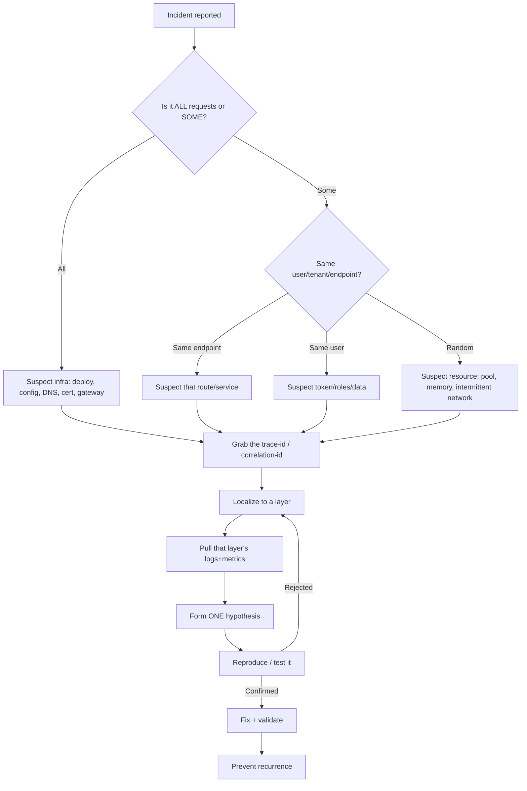

**The five questions that localize 80% of incidents:**

1. **Blast radius:** all requests or some? (infra vs. code)
2. **Timing:** did it start at a deploy, a cert expiry, a traffic spike, or a config change? Correlate with the change log.
3. **Boundary:** at which hop does the request die? Use the trace.
4. **Status code:** what *exact* status and *which component emitted it* (Kong vs. app)?
5. **Recent change:** `git log`, Helm release history, Kong config diff, Keycloak admin events.

> **Golden rule:** Never debug code until you have localized the failure to a layer. A 401 in the browser may originate at Kong, Keycloak, or Spring Security — three completely different fixes.

### 1.3 Who Emitted the Error?

A surprising amount of wasted time comes from debugging the wrong component. Use headers and body shape to identify the emitter:

| Clue | Emitter |
|------|---------|
| `Server: kong/3.x` header, `{"message":"..."}` body | Kong |
| `WWW-Authenticate: Bearer error="invalid_token"` | Spring Security resource server (or Kong OIDC) |
| Whitelabel `{"timestamp","status","error","path"}` | Spring Boot |
| HTML error page with nginx | Ingress controller / nginx |
| `request_id` in JSON | Kong (`X-Kong-Request-Id`) |

```bash
# Always look at the full response headers first
curl -i -sS https://api.bank.example.com/accounts/123 | sed -n '1,25p'
```

---

## 2. End-to-End Request Flow Analysis

A canonical authenticated request: *"Get my account balance."*

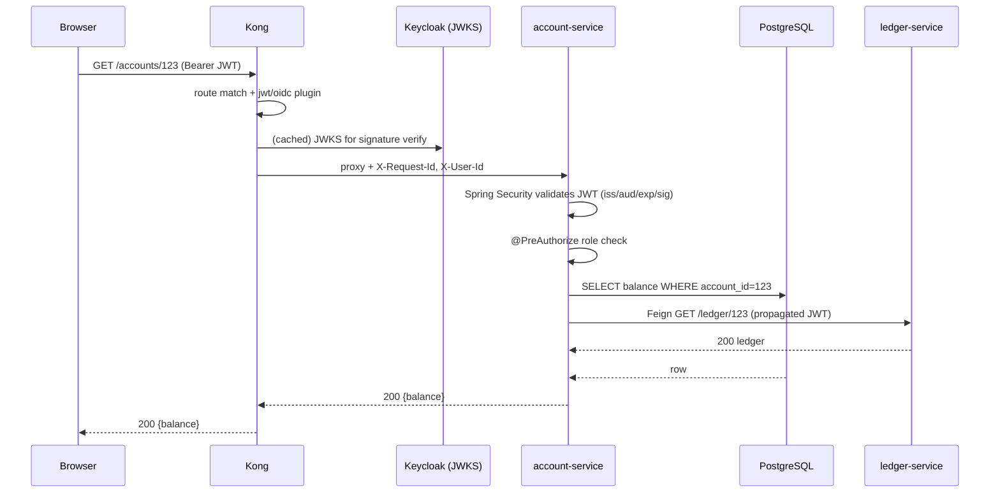

For each stage: **what fails, how to see it, logs, metrics, commands.**

### Stage 0 — Browser → Kong
- **Fails:** DNS of public host, TLS to the LB, CORS preflight, expired/absent JWT.
- **See it:** browser DevTools → Network → Headers/Timing; `Status (failed)` with no response = network/TLS, response with status = it reached Kong.
- **Logs:** Kong access logs (`kong_access`), CDN/WAF logs.
- **Metrics:** Kong `kong_http_requests_total{service}` , LB 4xx/5xx rate.
- **Commands:**
```bash
curl -v https://api.bank.example.com/accounts/123 -H "Authorization: Bearer $TOKEN"
nslookup api.bank.example.com
openssl s_client -connect api.bank.example.com:443 -servername api.bank.example.com </dev/null 2>/dev/null | openssl x509 -noout -dates
```

### Stage 1 — Kong routing & plugins
- **Fails:** no matching route (404), JWT/OIDC plugin rejects (401), ACL plugin (403), rate-limit (429), upstream DNS/health (502/503), upstream timeout (504).
- **See it:** response header `Server: kong/3.x`, `X-Kong-Upstream-Status`, `X-Kong-Request-Id`.
- **Logs:** `kubectl logs -n kong deploy/kong -c proxy`.
- **Metrics:** `kong_upstream_latency_ms`, `kong_request_latency_ms`, status code counters.
- **Commands:**
```bash
# Inspect the route/service that matched
http :8001/routes  # Kong Admin API
curl -s localhost:8001/routes/accounts-route | jq
```

### Stage 2 — Keycloak token validation
- **Fails:** issuer/audience mismatch, key rotation (JWKS), clock skew, expired token.
- **See it:** `WWW-Authenticate: Bearer error="invalid_token", error_description="An error occurred while attempting to decode the Jwt: ..."`.
- **Logs:** Keycloak server log, **admin events**, login events.
- **Metrics:** Keycloak `keycloak_logins`, token endpoint latency.
- **Commands:**
```bash
curl -s https://keycloak/realms/bank/.well-known/openid-configuration | jq .issuer,.jwks_uri
curl -s https://keycloak/realms/bank/protocol/openid-connect/certs | jq '.keys[].kid'
```

### Stage 3 — Spring Security filter chain
- **Fails:** JWT decode, audience validator, role/authority mapping (403), CSRF for non-GET.
- **See it:** enable `logging.level.org.springframework.security=DEBUG`.
- **Logs:** app logs with the security filter trail.
- **Metrics:** `http_server_requests_seconds_count{status="401|403"}`.

### Stage 4 — Controller / MVC
- **Fails:** mapping conflict (404/405), bean validation (400), message converter (415/406).
- **See it:** `DispatcherServlet` TRACE, `@ControllerAdvice` logs.

### Stage 5 — Service / business logic
- **Fails:** idempotency, saga/compensation, concurrency.
- **See it:** domain logs + trace span timings.

### Stage 6 — DB / downstream
- **Fails:** connection pool exhaustion (HikariCP), lock waits/deadlocks, downstream Feign/WebClient timeouts.
- **Metrics:** `hikaricp_connections_pending`, `hikaricp_connections_active`, downstream client timers.
- **Commands:**
```sql
SELECT * FROM pg_stat_activity WHERE state <> 'idle' ORDER BY query_start;
SELECT * FROM pg_locks WHERE NOT granted;
```

> **Practice:** For every incident, write a one-line *flow narrative*: "Request reached Kong (200 route), Kong got 504 from upstream account-service, account-service was blocked on Hikari (0 free connections) because ledger-service Feign calls hung at 30s." That narrative is your RCA skeleton.

---
## 3. Client-Side Problems

The browser is a layer too — and in banking, the most security-restricted one. Many "backend" incidents are actually browser policy failures.

### 3.1 CORS (Cross-Origin Resource Sharing)

**What it is:** Browser blocks a JS `fetch`/XHR to a different origin unless the server returns the right `Access-Control-Allow-*` headers.

**Symptoms**
- Console: `Access to fetch at 'https://api.bank...' from origin 'https://app.bank...' has been blocked by CORS policy: No 'Access-Control-Allow-Origin' header is present on the requested resource.`
- Network tab shows an `OPTIONS` request that **succeeds with 200/204 but the actual GET never fires**, or the GET fires and returns data but JS can't read it.
- `curl` works fine (no Origin enforcement) — a classic "works in curl, fails in browser."

**Root causes**
1. CORS configured in *both* Kong and Spring Boot → duplicated/conflicting headers (`Access-Control-Allow-Origin` appears twice → browser rejects).
2. `Access-Control-Allow-Origin: *` together with `Access-Control-Allow-Credentials: true` (illegal combination).
3. Preflight (`OPTIONS`) blocked by auth — the gateway requires a JWT on `OPTIONS`, but browsers never send credentials on preflight.
4. Missing `Access-Control-Allow-Headers: Authorization, Content-Type, X-Request-Id`.

**Diagnosis**
```bash
# Simulate the preflight exactly as the browser would
curl -i -X OPTIONS https://api.bank.example.com/accounts/123 \
  -H "Origin: https://app.bank.example.com" \
  -H "Access-Control-Request-Method: GET" \
  -H "Access-Control-Request-Headers: authorization"
# Look for a SINGLE Access-Control-Allow-Origin echoing the Origin, and Allow-Headers including authorization
```

**Solutions**

Decide **one** owner of CORS — usually the gateway. Disable Spring CORS if Kong owns it.

Kong CORS plugin (route-scoped):
```yaml
plugins:
  - name: cors
    route: accounts-route
    config:
      origins: ["https://app.bank.example.com"]
      methods: ["GET","POST","PUT","DELETE","OPTIONS"]
      headers: ["Authorization","Content-Type","X-Request-Id"]
      exposed_headers: ["X-Request-Id"]
      credentials: true
      max_age: 3600
      preflight_continue: false   # Kong answers OPTIONS itself
```

If Spring owns it instead:
```java
@Bean
CorsConfigurationSource corsConfigurationSource() {
    CorsConfiguration c = new CorsConfiguration();
    c.setAllowedOrigins(List.of("https://app.bank.example.com")); // never "*" with credentials
    c.setAllowedMethods(List.of("GET","POST","PUT","DELETE","OPTIONS"));
    c.setAllowedHeaders(List.of("Authorization","Content-Type","X-Request-Id"));
    c.setAllowCredentials(true);
    c.setMaxAge(3600L);
    var src = new UrlBasedCorsConfigurationSource();
    src.registerCorsConfiguration("/**", c);
    return src;
}
// And in the filter chain: http.cors(Customizer.withDefaults());
// Make /**/OPTIONS permitAll so preflight is never auth-challenged:
// .authorizeHttpRequests(a -> a.requestMatchers(HttpMethod.OPTIONS, "/**").permitAll())
```

**Prevention:** single CORS owner, contract test that asserts exactly one `Access-Control-Allow-Origin` header, and a synthetic preflight check in CI.

### 3.2 Cookies, SameSite & Credentials

**What it is:** Banking SSO often uses cookies (Keycloak session) plus bearer tokens. `SameSite` controls whether cookies ride cross-site requests.

**Symptoms**
- After login the user is bounced back to login (session cookie not sent).
- Console: `Cookie "KEYCLOAK_SESSION" has been rejected because it is in a cross-site context and its SameSite is Lax`.
- Works on same domain, breaks when `app.bank` calls `api.bank` as a different site.

**Root causes**
- `SameSite=Lax` (default) blocks cookies on cross-site XHR; need `SameSite=None; Secure`.
- `Secure` cookie sent over HTTP (mixed content / TLS terminated early).
- Cookie `Domain`/`Path` scoped too narrowly.

**Solutions**
- Use bearer tokens (Authorization header) for API calls; reserve cookies for the OIDC login flow.
- If cookies must be cross-site: `Set-Cookie: SESSION=...; SameSite=None; Secure; HttpOnly`.
- Keycloak: ensure it runs behind HTTPS (`KC_PROXY=edge`, `X-Forwarded-Proto: https`) so it issues `Secure` cookies correctly.

### 3.3 JWT Storage in the Browser

**The trade-off**

| Storage | XSS risk | CSRF risk | Notes |
|---------|----------|-----------|-------|
| `localStorage` | High (JS-readable) | Low | convenient, common, but a single XSS leaks the token |
| `sessionStorage` | High | Low | cleared on tab close |
| `HttpOnly cookie` | Low | High (mitigate with SameSite + CSRF token) | preferred for banking |

**Banking guidance:** Prefer short-lived access tokens (2–5 min) in memory + refresh token in an `HttpOnly; Secure; SameSite=Strict` cookie, with silent refresh. Never store refresh tokens in `localStorage`.

### 3.4 Preflight Requests & Browser Header Limits

- **Preflight triggers** when the request is "non-simple": custom headers (e.g., `Authorization`, `X-Request-Id`), `Content-Type: application/json`, or methods other than GET/POST/HEAD. Expect an extra `OPTIONS` round-trip — budget for its latency.
- **Header size:** browsers and servers cap header size (~8KB common). A fat JWT with many roles can blow past it → **431** (see §9). Symptom: works for users with few roles, fails for admins with dozens of group memberships.

### 3.5 Browser Caching

**Symptoms:** stale balance shown; `304 Not Modified` returned when data actually changed; POST appears to "do nothing" (served from cache via an aggressive SW).

**Root causes:** missing `Cache-Control: no-store` on sensitive endpoints; ETag mismatch; a service worker caching API responses.

**Solution (banking default):**
```java
// Sensitive financial data must never be cached
response.setHeader("Cache-Control", "no-store, no-cache, must-revalidate, private");
response.setHeader("Pragma", "no-cache");
```
Or globally via Spring Security: `http.headers(h -> h.cacheControl(Customizer.withDefaults()));`

### 3.6 Mixed Content

**Symptom:** `Mixed Content: The page at 'https://app...' was loaded over HTTPS, but requested an insecure resource 'http://api...'. This request has been blocked.`

**Root cause:** hardcoded `http://` URL, or a backend redirect to `http://` because Spring/Keycloak didn't see `X-Forwarded-Proto: https` behind the gateway.

**Fix:** `server.forward-headers-strategy=framework` (Spring Boot) so it honors `X-Forwarded-Proto`; ensure Kong/Ingress sets it; never hardcode scheme.

---
## 4. Kong Gateway Troubleshooting

Kong sits between every external client and your services. When Kong misbehaves, *everything* looks broken. Learn to read Kong's fingerprints.

### 4.1 Kong Object Model

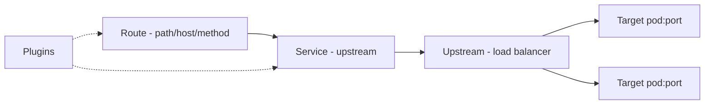

- **Service** = a backend (e.g., `account-service.bank.svc.cluster.local:8080`).
- **Route** = match rules (host, path, method, headers) → points to a Service.
- **Upstream/Target** = client-side load balancing & health checks.
- **Plugins** = jwt, oidc, acl, rate-limiting, cors, request/response-transformer — attached to a Route, Service, or globally.

### 4.2 How to Inspect Kong

```bash
# Admin API (port 8001). In K8s, port-forward first.
kubectl -n kong port-forward deploy/kong 8001:8001 &

curl -s localhost:8001/routes | jq '.data[] | {name,paths,hosts,methods,service:.service.id}'
curl -s localhost:8001/services | jq '.data[] | {name,host,port,protocol,connect_timeout,read_timeout}'
curl -s localhost:8001/plugins | jq '.data[] | {name,route:.route,service:.service,enabled}'
curl -s localhost:8001/upstreams/account-upstream/health | jq   # target health
curl -s localhost:8001/status | jq                               # node status

# DB-less / decK (declarative)
deck gateway dump -o kong.yaml
deck gateway diff kong.yaml
```

### 4.3 Routing Failures (404 from Kong)

**Symptom:** `{"message":"no Route matched with those values"}` and header `Server: kong/3.x`.

**Root causes**
- Path/host/method mismatch (route expects `Host: api.bank.example.com`, client sent something else).
- `strip_path` semantics: route path `/accounts` with `strip_path: true` forwards `/` to upstream, so the service (expecting `/accounts/123`) 404s. With `strip_path: false`, it forwards `/accounts/123`.
- Route priority/regex precedence — a broader route shadows a specific one.

**Diagnose**
```bash
curl -i https://api.bank.example.com/accounts/123 -H 'Host: api.bank.example.com'
# Match what Kong sees:
curl -s localhost:8001/routes | jq '.data[] | select(.paths != null)'
```

**Fix example (declarative):**
```yaml
services:
  - name: account-service
    url: http://account-service.bank.svc.cluster.local:8080
    connect_timeout: 2000
    write_timeout: 30000
    read_timeout: 30000
    retries: 0            # do NOT auto-retry non-idempotent banking POSTs
    routes:
      - name: accounts-route
        paths: ["/accounts"]
        strip_path: false   # keep /accounts/123 for the Spring controller
        methods: ["GET","POST","PUT","DELETE"]
        hosts: ["api.bank.example.com"]
```

### 4.4 JWT Plugin Failures (401 from Kong)

Kong's `jwt` plugin validates HS/RS signatures against pre-registered credentials; `oidc`/`openid-connect` validates against Keycloak's discovery + JWKS.

**Symptoms / errors**
- `{"message":"Unauthorized"}` with `Server: kong`.
- `{"message":"No mandatory 'iss' in claims"}` / `"Invalid signature"` / `"Token expired"`.

**Root causes**
- JWKS URL unreachable from Kong (DNS/NetworkPolicy to Keycloak).
- Key rotation: Keycloak rotated signing keys, Kong cached old JWKS.
- `iss` in token (`https://keycloak/realms/bank`) ≠ configured issuer (internal vs external hostname mismatch — extremely common in banking when Keycloak has different internal/external URLs).

**OIDC plugin example:**
```yaml
plugins:
  - name: openid-connect
    route: accounts-route
    config:
      issuer: https://keycloak.bank.example.com/realms/bank
      client_id: ["kong-gateway"]
      client_secret: ["<from-secret>"]
      auth_methods: ["bearer"]      # API: expect Bearer tokens, no redirect
      verify_signature: true
      jwks_uri: https://keycloak.bank.example.com/realms/bank/protocol/openid-connect/certs
      leeway: 30                     # clock skew seconds
      audience_required: ["account-service"]
```

**Diagnose key rotation:**
```bash
# What kids does Keycloak advertise?
curl -s https://keycloak.bank.example.com/realms/bank/protocol/openid-connect/certs | jq '.keys[].kid'
# What kid is in the failing token?
echo "$TOKEN" | cut -d. -f1 | base64 -d 2>/dev/null | jq .kid
# If token kid not in JWKS -> Kong cache stale; reduce jwks cache TTL / restart, or fix rotation overlap.
```

### 4.5 ACL Plugin (403 from Kong)

**Symptom:** `{"message":"You cannot consume this service"}`.

**Cause:** consumer not in an allowed group, or ACL plugin's `allow`/`deny` misconfigured. Verify consumer groups:
```bash
curl -s localhost:8001/consumers/<id>/acls | jq
```

### 4.6 Rate Limiting (429 from Kong)

**Symptom:** `{"message":"API rate limit exceeded"}`, headers `RateLimit-Remaining: 0`, `Retry-After`.

**Banking nuance:** rate limit per consumer/tenant, not global; protect Keycloak token endpoint separately. Use `local` policy only for single-node; use `redis` for clustered Kong to avoid each node counting independently (which lets 3 nodes allow 3× the limit).
```yaml
- name: rate-limiting
  route: accounts-route
  config:
    minute: 600
    policy: redis
    redis: { host: redis.bank.svc, port: 6379 }
    fault_tolerant: true   # if redis down, fail-open (or false to fail-closed)
```

### 4.7 Request/Response Transformer

Common use: inject correlation IDs, strip internal headers, add upstream auth.
```yaml
- name: request-transformer
  route: accounts-route
  config:
    add:
      headers: ["X-Request-Id:$(uuid)", "X-Forwarded-Proto:https"]
    remove:
      headers: ["X-Internal-Debug"]
```
**Failure:** transformer removes a header the app needs (e.g., it strips `Authorization` after OIDC), or adds a duplicate `X-Request-Id` breaking trace correlation.

### 4.8 Upstream / Timeout / Health (502, 503, 504 from Kong)

| Status | Meaning | Common cause |
|--------|---------|--------------|
| 502 Bad Gateway | upstream sent invalid/empty response or connection refused | pod crashed, wrong port, app returned malformed response |
| 503 Service Unavailable | no healthy upstream targets | all targets failed active/passive health checks |
| 504 Gateway Timeout | upstream didn't respond within `read_timeout` | slow query, downstream hang, GC pause |

**Diagnose:**
```bash
curl -s localhost:8001/upstreams/account-upstream/health | jq '.data[] | {target,health}'
kubectl -n kong logs deploy/kong -c proxy | grep -i 'upstream\|timeout\|connect()'
# Example log line:
# [error] connect() failed (111: Connection refused) while connecting to upstream, ... upstream: "http://10.1.2.3:8080/accounts/123"
```

**Health check config:**
```yaml
upstreams:
  - name: account-upstream
    healthchecks:
      active:
        http_path: /actuator/health/readiness
        healthy:   { interval: 5, successes: 2 }
        unhealthy: { interval: 5, http_failures: 3, timeouts: 3 }
      passive:
        unhealthy: { http_failures: 5, timeouts: 3 }
```

### 4.9 Kong on Kubernetes (Ingress Controller)

With Kong Ingress Controller (KIC), routes come from `Ingress`/`HTTPRoute` + `KongPlugin` CRDs.
```yaml
apiVersion: configuration.konghq.com/v1
kind: KongPlugin
metadata: { name: oidc-auth, namespace: bank }
plugin: openid-connect
config:
  issuer: https://keycloak.bank.example.com/realms/bank
---
apiVersion: networking.k8s.io/v1
kind: Ingress
metadata:
  name: account-ingress
  namespace: bank
  annotations:
    konghq.com/plugins: oidc-auth
    konghq.com/strip-path: "false"
spec:
  ingressClassName: kong
  rules:
    - host: api.bank.example.com
      http:
        paths:
          - path: /accounts
            pathType: Prefix
            backend: { service: { name: account-service, port: { number: 8080 } } }
```
**Common KIC failures:** CRD not reconciled (check controller logs), `konghq.com/strip-path` mismatch, plugin annotation referencing a `KongPlugin` in a different namespace.

### 4.10 Reading Kong Logs

```bash
kubectl -n kong logs -l app=kong -c proxy --tail=200 -f | jq -R 'fromjson? // .'
# Enable richer logging with the http-log/file-log plugin to ship structured access logs:
# fields include: request.headers, response.status, latencies.{kong,proxy,request}, upstream_status
```
**Latency triage:** if `latencies.kong` is high → plugin overhead (e.g., OIDC doing a JWKS fetch each request). If `latencies.proxy` (upstream) is high → the backend is slow, not Kong.

---
## 5. Kubernetes Networking Troubleshooting

In K8s, "the service is down" usually means one of: pod not running, Service has no Endpoints, DNS broken, or NetworkPolicy blocking. Walk the chain inward.

### 5.1 The Networking Chain

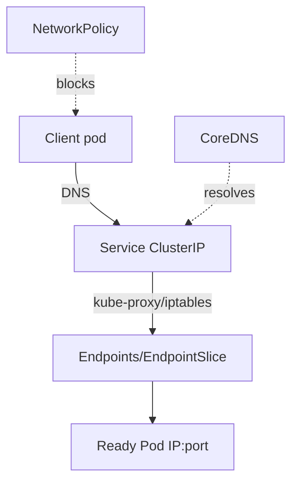

### 5.2 Universal Triage Commands

```bash
NS=bank; SVC=account-service
kubectl -n $NS get pods -o wide
kubectl -n $NS get svc $SVC -o wide
kubectl -n $NS get endpoints $SVC          # <-- empty endpoints = #1 cause of 503
kubectl -n $NS get endpointslice -l kubernetes.io/service-name=$SVC
kubectl -n $NS describe svc $SVC            # check selector vs pod labels
kubectl -n $NS describe pod <pod>          # events, probes, restarts
```

### 5.3 Decision Tree: "Service B cannot reach Service A"

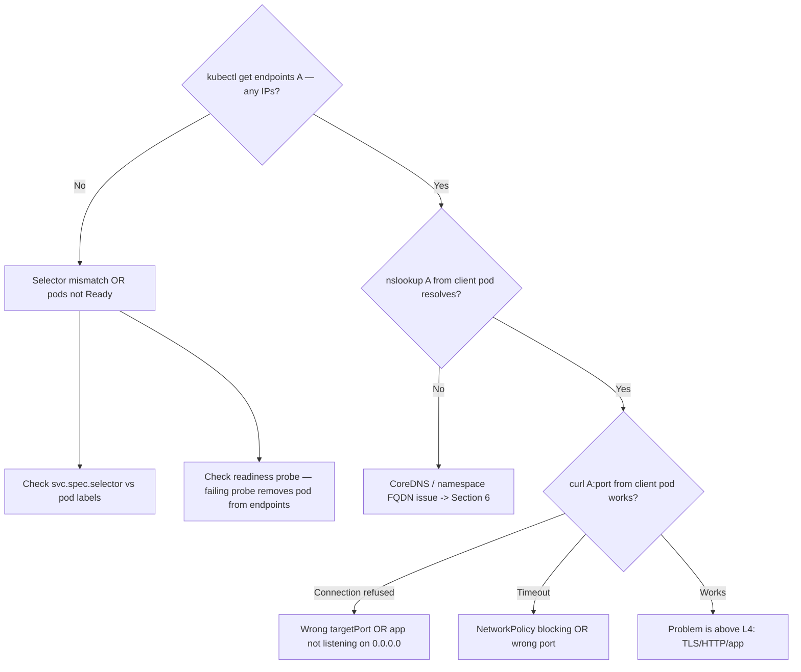

### 5.4 Empty Endpoints (most common 503 root cause)

**Symptom:** Kong/Service returns 503; `kubectl get endpoints account-service` shows `<none>`.

**Root causes**
1. **Selector mismatch:** Service `selector: app=account` but pods labeled `app=account-service`.
2. **No Ready pods:** readiness probe failing, so pods exist but are excluded from Endpoints.
3. **Wrong `targetPort`:** Service `port:8080 targetPort:8080` but container listens on `8081`.

**Diagnose & fix:**
```bash
kubectl -n bank get svc account-service -o jsonpath='{.spec.selector}'; echo
kubectl -n bank get pods --show-labels | grep account
kubectl -n bank get pods -l app=account-service -o jsonpath='{range .items[*]}{.metadata.name}{"\t"}{.status.conditions[?(@.type=="Ready")].status}{"\n"}{end}'
```

### 5.5 Connection Refused vs Timeout inside the cluster

```bash
# Ephemeral debug pod (no need to bake curl into app images)
kubectl -n bank run netshoot --rm -it --image=nicolaka/netshoot -- bash
# Inside:
nslookup account-service
curl -v http://account-service:8080/actuator/health
nc -vz account-service 8080
```
- **Connection refused** → reached a pod but nothing on that port: wrong `targetPort`, or app bound to `127.0.0.1` instead of `0.0.0.0` (Spring `server.address` misconfig).
- **Timeout** → packets dropped: NetworkPolicy, wrong port (no listener, default-drop), or node/CNI issue.

### 5.6 NetworkPolicies

In banking, default-deny is common; a new service can't talk until policy allows it.
```yaml
apiVersion: networking.k8s.io/v1
kind: NetworkPolicy
metadata: { name: allow-ledger-to-account, namespace: bank }
spec:
  podSelector: { matchLabels: { app: account-service } }
  policyTypes: ["Ingress"]
  ingress:
    - from:
        - podSelector: { matchLabels: { app: ledger-service } }
      ports:
        - { protocol: TCP, port: 8080 }
```
**Diagnose:** symptom is a *timeout* (not refused) that appeared right after a policy change. List policies affecting the pod:
```bash
kubectl -n bank get networkpolicy
kubectl -n bank describe networkpolicy allow-ledger-to-account
```
Don't forget **DNS egress**: a default-deny egress policy that forgets to allow UDP/TCP 53 to kube-dns breaks *all* name resolution → looks like a DNS outage.

### 5.7 Service Types & LoadBalancers

| Type | Use | Failure |
|------|-----|---------|
| ClusterIP | internal | most issues above |
| NodePort | dev/edge | port range, firewall |
| LoadBalancer | cloud ingress | LB stuck `<pending>` (no cloud controller / quota) |
| Headless (`clusterIP: None`) | StatefulSet, direct pod DNS | returns pod IPs, not VIP — see §6 |

```bash
kubectl -n bank get svc   # EXTERNAL-IP <pending> for too long => cloud LB provisioning issue
kubectl -n bank describe svc account-lb   # events show cloud provider errors
```

### 5.8 Cross-Namespace Calls

Short name only resolves within the same namespace. From `payments` ns calling `account-service` in `bank` ns, you must use the FQDN: `account-service.bank.svc.cluster.local`. A bare `account-service` will fail with `UnknownHostException` → see §6.

---

## 6. DNS and Service Discovery

DNS issues are insidious: intermittent, cached, and they masquerade as app bugs.

### 6.1 Kubernetes DNS Naming

```
<service>.<namespace>.svc.cluster.local
account-service.bank.svc.cluster.local
```
`/etc/resolv.conf` in a pod usually has `search bank.svc.cluster.local svc.cluster.local cluster.local` and `ndots:5`. That `ndots:5` means any name with fewer than 5 dots gets the search domains appended first — causing **extra failed lookups** for external hosts like `keycloak.bank.example.com` (resolves `keycloak.bank.example.com.bank.svc.cluster.local` first, fails, retries…). This adds latency and load to CoreDNS.

### 6.2 UnknownHostException

**Java symptom / stack trace:**
```
java.net.UnknownHostException: account-service
  at java.base/java.net.InetAddress$CachedLookup.get(...)
  at feign.Client$Default.convertResponse(...)
```
**Root causes**
- Wrong name (short name across namespaces — see §5.8).
- Typo (`acccount-service`).
- Service deleted/renamed; config still points to old name.
- CoreDNS down or egress NetworkPolicy blocks port 53.

**Diagnose:**
```bash
kubectl -n bank run netshoot --rm -it --image=nicolaka/netshoot -- \
  nslookup account-service.bank.svc.cluster.local
kubectl -n kube-system get pods -l k8s-app=kube-dns
kubectl -n kube-system logs -l k8s-app=kube-dns --tail=100
```

### 6.3 DNS Timeout / CoreDNS Overload

**Symptom:** sporadic `UnknownHostException` or 100–5000ms latency spikes on the *first* call, fine afterward.

**Root causes:** `ndots:5` amplification, CoreDNS under-provisioned, conntrack race on UDP, missing NodeLocal DNSCache.

**Fixes:**
- Add a trailing dot or use FQDN in config to skip search expansion: `keycloak.bank.example.com.`
- Set `dnsConfig` `ndots:2` for pods doing lots of external calls.
- Deploy **NodeLocal DNSCache**; scale CoreDNS; enable autopath.
```yaml
spec:
  dnsConfig:
    options:
      - { name: ndots, value: "2" }
```

### 6.4 Stale DNS Cache (JVM)

The JVM caches DNS. Historically `networkaddress.cache.ttl` defaulted to "forever" for successful lookups with a SecurityManager, and negative lookups (`networkaddress.cache.negative.ttl`) default to 10s. If a pod restarts and gets a **new IP**, a client JVM caching the old IP keeps hitting a dead address → `Connection refused`/timeout.

**Fix:** Don't cache resolved IPs long. Most modern JDKs default success TTL to 30s, but verify:
```bash
# In the app image
cat $JAVA_HOME/conf/security/java.security | grep networkaddress.cache
```
```properties
# java.security override
networkaddress.cache.ttl=30
networkaddress.cache.negative.ttl=5
```
Crucially, talk to the **Service ClusterIP** (stable) not pod IPs. If you use a **headless** service or client-side LB (Spring Cloud LoadBalancer) you must refresh the instance list, or stale pod IPs persist.

### 6.5 Headless Services & Service Rename

- **Headless** (`clusterIP: None`) returns *all* pod A-records. Great for StatefulSets (`kafka-0.kafka.bank.svc.cluster.local`), but a client must handle multiple IPs and pods coming/going.
- **Rename:** renaming a Service is a breaking change to every consumer's DNS name. Use an alias (`ExternalName`) or keep the old Service pointing at the same selector during migration.

---
## 7. TCP/IP Layer Failures

When name resolution is fine but connections still fail, you're at L4. These are the failures that page you at 3 AM during a traffic spike.

### 7.1 Connection Refused

**Theory:** TCP SYN reached the host but no process is `LISTEN`ing on that port → RST sent back immediately (fast failure).

**Java:** `java.net.ConnectException: Connection refused`.
**Linux:** `nc -vz host port` → `Connection refused`.
**K8s:** wrong `targetPort`, app bound to `127.0.0.1`, or pod still starting.

**Diagnose:**
```bash
ss -ltnp | grep 8080            # is anything listening?
kubectl -n bank exec <pod> -- ss -ltn
```
**Fix:** correct port; bind to `0.0.0.0` (`server.address=0.0.0.0`); add startup probe so traffic waits.

### 7.2 Connection Reset by Peer

**Theory:** the peer sent an RST on an established connection — it abruptly closed (crash, idle timeout on the *other* side, LB closed an idle pooled connection).

**Java:** `java.net.SocketException: Connection reset`.
**Common banking cause:** the **connection pool keep-alive mismatch** — the client keeps a pooled connection longer than the server/LB/Kong idle timeout. The server silently closes; the client's next request hits a dead socket → reset.

**Fix:** make client idle timeout *shorter* than server/LB idle timeout. For HikariCP/HTTP pools, set `validate-after-inactivity`/connection TTL below the upstream's keep-alive.

### 7.3 SYN Timeout vs Socket (Read) Timeout

| Timeout | When | Java exception |
|---------|------|----------------|
| Connect timeout | SYN gets no SYN-ACK (host unreachable, dropped, firewall) | `SocketTimeoutException: connect timed out` |
| Read/socket timeout | connected, but no response bytes in time | `SocketTimeoutException: Read timed out` |

**Always set both** on every client. A missing read timeout is the classic cause of cascading hangs: one slow downstream pins every thread.

```yaml
# Spring Boot RestClient/RestTemplate via properties (example)
# connect: time to establish TCP; read: time waiting for response
```

### 7.4 Socket Leak / Too Many Open Files

**Theory:** every socket is a file descriptor. Not closing responses/streams leaks FDs until you hit the `ulimit`.

**Java:** `java.net.SocketException: Too many open files` / `java.io.IOException: Too many open files`.

**Diagnose:**
```bash
kubectl -n bank exec <pod> -- bash -c 'ls /proc/1/fd | wc -l'   # current FDs
kubectl -n bank exec <pod> -- bash -c 'cat /proc/1/limits | grep "open files"'
lsof -p <pid> | awk '{print $5}' | sort | uniq -c   # types of FDs
ss -s   # socket summary
```
**Root causes:** WebClient/RestTemplate responses not consumed/closed; new `HttpClient` per request; no connection pooling.
**Fix:** reuse a pooled client; always close `InputStream`/`Response`; raise `ulimit -n` only after fixing the leak.

### 7.5 Ephemeral Port / NAT / Conntrack Exhaustion

**Theory:** outbound connections use ephemeral source ports (~28k by default range). High churn (a new connection per request, no pooling) + `TIME_WAIT` buildup exhausts ports. In K8s, **conntrack table** exhaustion at the node level drops new connections cluster-wide.

**Symptoms:** `Cannot assign requested address` (Java `BindException`), intermittent timeouts under load, `nf_conntrack: table full, dropping packet` in node `dmesg`.

**Diagnose:**
```bash
ss -tan state time-wait | wc -l
cat /proc/sys/net/netfilter/nf_conntrack_count
cat /proc/sys/net/netfilter/nf_conntrack_max
dmesg | grep conntrack
```
**Fix:** **pool and reuse connections** (the real fix); widen ephemeral range `net.ipv4.ip_local_port_range`; raise `nf_conntrack_max`; reduce churn. Don't blindly enable `tcp_tw_reuse` without understanding NAT implications.

### 7.6 TIME_WAIT, CLOSE_WAIT, FIN_WAIT

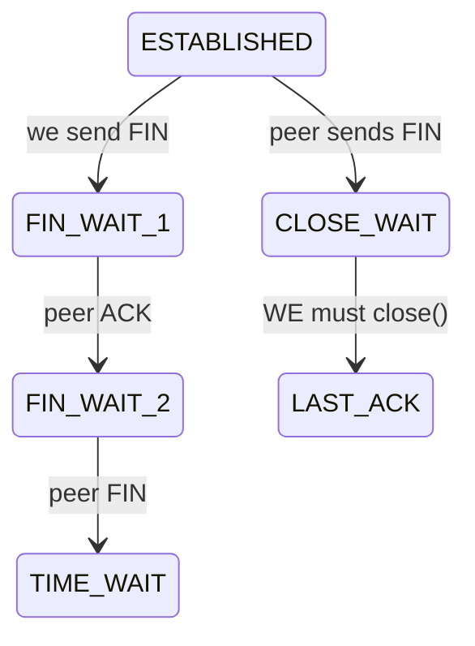

- **Many `TIME_WAIT`:** normal for the side that closes first; problematic only at extreme churn → pool connections.
- **Many `CLOSE_WAIT`:** **application bug** — the peer closed but your app never called `close()`. This is a leak (often an unclosed HTTP response). It will exhaust FDs.

```bash
ss -tan | awk '{print $1}' | sort | uniq -c   # count states
```
Rising `CLOSE_WAIT` on the JVM side = find the unclosed resource.

### 7.7 TCP Backlog Full / Accept Queue

**Theory:** under a connection burst, if the app accepts slower than SYNs arrive, the accept queue (`somaxconn`) overflows → SYNs dropped → client connect timeouts.

**Diagnose:** `ss -ltn` shows `Recv-Q` (current backlog) approaching `Send-Q` (max) on the listen socket; `netstat -s | grep -i listen` shows "listen queue overflows".
**Fix:** raise `net.core.somaxconn` and the app's `accept-count` (`server.tomcat.accept-count`), and scale out.

### 7.8 Keepalive, Half-Open, MTU, Fragmentation, Packet Loss, Jitter

- **Keepalive mismatch:** see §7.2. Align client pool TTL < server keep-alive < LB idle.
- **Half-open connections:** one side died without FIN (hard crash, network partition). The survivor thinks the connection is alive until a write fails or TCP keepalive probes expire (default 2h — far too long). Enable app-level heartbeats/keepalive.
- **MTU / fragmentation:** overlay networks (VXLAN) reduce effective MTU (e.g., 1450). If something sets DF and path MTU is smaller, large packets are dropped → connections hang on large payloads but small ones work. **Symptom:** TLS handshake or large responses stall while pings succeed.
  ```bash
  ip link show     # check MTU
  ping -M do -s 1472 <host>   # DF; failures indicate MTU issue
  tracepath <host>
  ```
- **Packet loss / jitter:** retransmits inflate latency tails (p99). Diagnose with `mtr`, `ss -ti` (shows `retrans`), node NIC error counters.

---

## 8. TLS / SSL Troubleshooting

Banking is TLS-everywhere, often mutual TLS (mTLS) between services. TLS errors are precise once you read them.

### 8.1 Inspecting a Certificate

```bash
# Server cert + chain + dates + SANs
openssl s_client -connect keycloak.bank.example.com:443 -servername keycloak.bank.example.com </dev/null 2>/dev/null \
  | openssl x509 -noout -subject -issuer -dates -ext subjectAltName

# Just the expiry
echo | openssl s_client -connect api.bank.example.com:443 2>/dev/null | openssl x509 -noout -enddate

# Verify a chain
openssl verify -CAfile ca-bundle.pem server.pem
```

### 8.2 Certificate Expired

**Java:** `sun.security.validator.ValidatorException: PKIX path validation failed: java.security.cert.CertPathValidatorException: validity check failed` → caused by `CertificateExpiredException: NotAfter: ...`.
**Fix:** renew/rotate (cert-manager); the real fix is **automated rotation + expiry alerting** (alert at 30/14/7 days).
```bash
# cert-manager: check certificate resources
kubectl get certificate -A
kubectl describe certificate api-tls -n bank   # Renewal time, conditions
```

### 8.3 Certificate Not Trusted (PKIX path building failed)

**Java:**
```
javax.net.ssl.SSLHandshakeException: PKIX path building failed:
  sun.security.provider.certpath.SunCertPathBuilderException:
  unable to find valid certification path to requested target
```
**Root cause:** the issuing CA (often an internal/corporate CA) is not in the JVM truststore. Extremely common for internal banking PKI.

**Fix — add CA to truststore:**
```bash
keytool -importcert -trustcacerts -alias bank-internal-ca \
  -file bank-ca.crt -keystore $JAVA_HOME/lib/security/cacerts -storepass changeit -noprompt
# Or a dedicated truststore mounted via Secret:
java -Djavax.net.ssl.trustStore=/etc/ssl/truststore.jks \
     -Djavax.net.ssl.trustStorePassword=*** -jar app.jar
```
Mount the CA in K8s:
```yaml
volumeMounts: [{ name: truststore, mountPath: /etc/ssl, readOnly: true }]
volumes: [{ name: truststore, secret: { secretName: bank-truststore } }]
```

### 8.4 Hostname / SAN Mismatch

**Java:** `javax.net.ssl.SSLPeerUnverifiedException: Certificate for <account-service> doesn't match any of the subject alternative names: [account-service.bank.svc.cluster.local]`.
**Cause:** connecting via a name not in the cert SANs (e.g., pod IP, short name, or wrong host).
**Fix:** connect using a name present in the SANs; reissue cert with the right SANs; **never** disable hostname verification in banking prod (a tempting but dangerous "fix").

### 8.5 TLS Version / Cipher Mismatch

**Java:** `javax.net.ssl.SSLHandshakeException: No appropriate protocol (protocol is disabled or cipher suites are inappropriate)` or `Received fatal alert: handshake_failure`.
**Cause:** client offers only TLS 1.3, server allows only 1.2 with specific ciphers; or FIPS policy disables a cipher; or an old client post-JDK-upgrade that disabled TLS 1.0/1.1.
**Diagnose:**
```bash
nmap --script ssl-enum-ciphers -p 443 api.bank.example.com
openssl s_client -connect host:443 -tls1_2   # force a version
java -Djavax.net.debug=ssl:handshake -jar app.jar   # verbose handshake (then GREP, it's huge)
```

### 8.6 Mutual TLS (mTLS)

Service A must present a client cert that Service B trusts, and vice versa.
**Failures:** `bad_certificate`, `certificate_required` alerts; A has no keystore configured; B's truststore lacks A's CA.

**Spring Boot mTLS (server side):**
```yaml
server:
  ssl:
    enabled: true
    key-store: classpath:server-keystore.p12
    key-store-password: ${KS_PASS}
    key-store-type: PKCS12
    trust-store: classpath:truststore.p12     # CAs we accept from clients
    trust-store-password: ${TS_PASS}
    client-auth: need        # require client cert (mTLS)
    protocol: TLS
    enabled-protocols: TLSv1.3,TLSv1.2
```
**Client side (WebClient mTLS):**
```java
SslContext ssl = SslContextBuilder.forClient()
    .keyManager(clientCertFile, clientKeyFile)   // present our identity
    .trustManager(caBundleFile)                  // trust the server's CA
    .build();
HttpClient http = HttpClient.create().secure(s -> s.sslContext(ssl));
WebClient client = WebClient.builder()
    .clientConnector(new ReactorClientHttpConnector(http)).build();
```
**In a service mesh** (Istio/Linkerd) mTLS is often handled by sidecars — then app-level TLS errors may actually be mesh cert rotation issues (`istioctl proxy-config secret <pod>`).

### 8.7 Keystore vs Truststore (mental model)

- **Keystore** = *my* identity (private key + my cert). Used to *prove who I am*.
- **Truststore** = *who I trust* (CA certs). Used to *verify the other party*.
- Server needs keystore (always) + truststore (only for mTLS). Client needs truststore (always) + keystore (only for mTLS).

---
## 9. HTTP Protocol Problems

Status codes are your fastest signal — but only if you know *who emitted them* and the difference between client-side (4xx) and server/gateway-side (5xx).

### 9.1 Status Code Quick Reference (with banking context)

| Code | Name | Who usually emits | Typical banking cause | First check |
|------|------|-------------------|----------------------|-------------|
| 400 | Bad Request | app / Kong | malformed JSON, failed `@Valid`, bad query param | request body & validation logs |
| 401 | Unauthorized | Kong / Spring Security | missing/expired/invalid JWT, wrong issuer | `WWW-Authenticate`, token exp |
| 403 | Forbidden | Spring Security / Kong ACL | missing role/scope, wrong audience | authorities mapping |
| 404 | Not Found | Kong (route) / app (mapping) | no route, `strip_path`, wrong path | `Server` header, route list |
| 405 | Method Not Allowed | app | wrong HTTP verb on mapping | `Allow` header |
| 406 | Not Acceptable | app | `Accept` header server can't satisfy | Accept vs produces |
| 408 | Request Timeout | server | client too slow sending | rare; LB idle |
| 413 | Payload Too Large | Kong/nginx/app | upload bigger than limit | body size, limits |
| 415 | Unsupported Media Type | app | wrong/missing `Content-Type` | Content-Type header |
| 429 | Too Many Requests | Kong / app | rate limit hit | `Retry-After`, `RateLimit-*` |
| 431 | Request Header Fields Too Large | nginx/Kong/Tomcat | JWT too big, too many roles | header size |
| 500 | Internal Server Error | app | unhandled exception | stack trace |
| 502 | Bad Gateway | Kong/Ingress | upstream crashed/refused/malformed | upstream health |
| 503 | Service Unavailable | Kong/K8s | no healthy/ready pods | endpoints, probes |
| 504 | Gateway Timeout | Kong/Ingress | upstream too slow | read_timeout, slow query |

### 9.2 400 Bad Request

**Symptoms:** Whitelabel `{"status":400,"error":"Bad Request","path":"/transfers"}`; or with a `@ControllerAdvice`, a structured validation error list.
**Causes:** JSON parse error (trailing comma, wrong type `"amount":"abc"`), `@Valid` failure, missing required param, type mismatch (`/accounts/abc` where `Long id`).
**Diagnose:** log the raw body (carefully — never log full PANs/tokens), enable `DEBUG` on `o.s.web`.
**Example handler:**
```java
@RestControllerAdvice
public class ApiExceptionHandler {
  @ExceptionHandler(MethodArgumentNotValidException.class)
  ResponseEntity<ProblemDetail> onValidation(MethodArgumentNotValidException ex) {
    var pd = ProblemDetail.forStatus(HttpStatus.BAD_REQUEST);
    pd.setTitle("Validation failed");
    pd.setProperty("errors", ex.getBindingResult().getFieldErrors().stream()
        .map(f -> Map.of("field", f.getField(), "message", f.getDefaultMessage())).toList());
    return ResponseEntity.badRequest().body(pd);
  }
}
```

### 9.3 413 Payload Too Large

**Causes:** document/cheque image upload exceeds limits at multiple layers.
**Fix all layers:**
```yaml
# Spring Boot
spring:
  servlet:
    multipart:
      max-file-size: 10MB
      max-request-size: 12MB
# Tomcat
server:
  tomcat:
    max-swallow-size: 12MB
    max-http-form-post-size: 12MB
```
```yaml
# Kong / nginx
# Kong: client_max_body_size via nginx directives or the request-size-limiting plugin
plugins:
  - name: request-size-limiting
    config: { allowed_payload_size: 10 }  # MB
```

### 9.4 431 Request Header Fields Too Large

**The banking classic.** A user with many groups/roles gets a JWT so large the header exceeds limits. Works for normal users, fails for admins/ops.
**Errors:** `431` from nginx/Tomcat, or Tomcat log `Request header is too large`.
**Diagnose:** measure token size — `echo -n "$TOKEN" | wc -c`. If > ~6–8KB, that's your problem.
**Fixes:**
1. **Shrink the token** (best): don't dump every realm role into the access token. Use scopes, fine-grained authorization, or a token with only the roles relevant to the audience. Configure protocol mappers to exclude full group paths.
2. Raise limits as a stopgap:
```yaml
server:
  max-http-request-header-size: 32KB   # Spring Boot 3 (Tomcat)
```
   Kong/nginx: `large_client_header_buffers 4 32k;`.

### 9.5 415 Unsupported Media Type / 406 Not Acceptable

- **415:** client sent `Content-Type: text/plain` (or none) to a `@PostMapping(consumes="application/json")`. Fix client header, or relax `consumes`.
- **406:** client `Accept: application/xml` but controller only `produces` JSON. Align `Accept`.

### 9.6 429 Too Many Requests

See Kong §4.6. App-side bucket example (Bucket4j / Resilience4j RateLimiter). Always return `Retry-After` and a structured body so clients back off correctly. **Don't** let clients hammer Keycloak's token endpoint — cache tokens until near expiry (see §18).

### 9.7 500 / 502 / 503 / 504 — distinguishing them

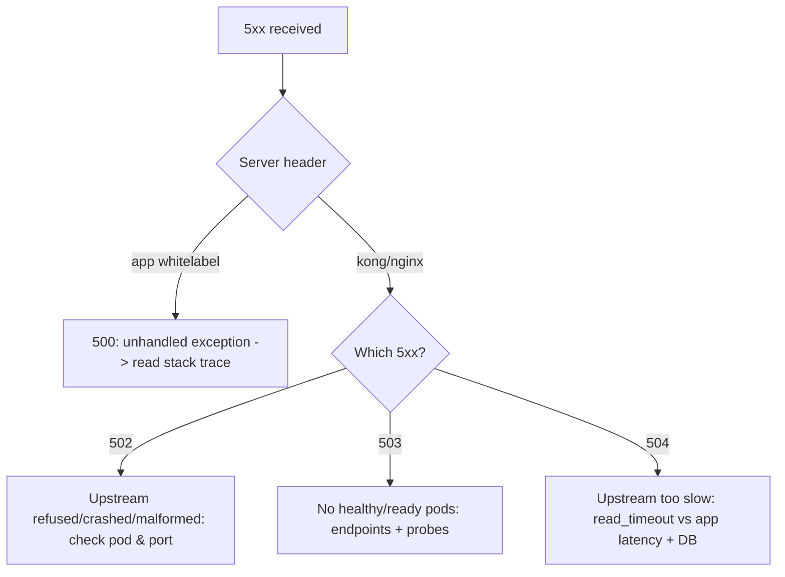

- **500** is *your* bug — there's a stack trace in app logs. Find it via trace-id.
- **502** the upstream returned garbage or refused — pod crash, wrong protocol (h2 vs h1), app wrote partial response.
- **503** no backends ready — deploy in progress, all probes failing, scaled to zero.
- **504** upstream alive but slow — almost always a downstream/DB hang; correlate with `hikaricp_connections_pending` and slow query logs.

### 9.8 Compression, Chunked Transfer, Keep-Alive, HTTP/2, Proxies

- **Compression:** `Accept-Encoding: gzip`. Mismatch (double-compression by app + gateway) corrupts bodies → client JSON parse errors. Pick one compressor.
- **Chunked transfer (`Transfer-Encoding: chunked`):** streaming responses; a proxy that buffers can break SSE/streaming or add latency. Some proxies mishandle chunked + `Content-Length` together (request smuggling risk — keep proxies patched).
- **Keep-Alive:** see §7.2 for the idle-timeout reset trap.
- **HTTP/2:** gateway↔app protocol mismatch (gateway speaks h2, app only h1c) → 502. Ensure consistent protocol or h2 prior-knowledge config.
- **Proxy behavior:** every hop may rewrite headers, strip hop-by-hop headers (`Connection`, `Keep-Alive`), and must set `X-Forwarded-For/Proto/Host`. Missing `X-Forwarded-Proto` → wrong redirect scheme (see §3.6).

**HTTP request/response example (full):**
```http
GET /accounts/123/balance HTTP/1.1
Host: api.bank.example.com
Authorization: Bearer eyJhbGciOiJSUzI1Ni␣...
Accept: application/json
X-Request-Id: 8f3c2a91-...

HTTP/1.1 200 OK
Content-Type: application/json
Cache-Control: no-store
X-Request-Id: 8f3c2a91-...
X-Kong-Upstream-Latency: 42
X-Kong-Proxy-Latency: 3

{"accountId":"123","balance":"1042.55","currency":"USD"}
```

---
## 10. Keycloak Troubleshooting

Keycloak is the identity backbone. Most "auth is broken" incidents trace to a handful of Keycloak misconfigurations: issuer mismatch, audience, key rotation, and role mapping.

### 10.1 Discovery & JWKS — always start here

```bash
REALM=bank; KC=https://keycloak.bank.example.com
curl -s $KC/realms/$REALM/.well-known/openid-configuration | jq \
  '{issuer, token_endpoint, jwks_uri, authorization_endpoint}'
curl -s $KC/realms/$REALM/protocol/openid-connect/certs | jq '.keys[] | {kid, alg, use}'
```
The `issuer` value here is the **single source of truth**. Every resource server's `issuer-uri` must match it *exactly* (scheme + host + path), and every token's `iss` claim must equal it.

### 10.2 Issuer Mismatch (internal vs external URL) — the #1 banking auth bug

**Scenario:** Keycloak is reachable as `https://keycloak.bank.example.com` externally but `http://keycloak.bank.svc.cluster.local:8080` internally. Tokens minted via the external URL carry `iss: https://keycloak.bank.example.com/realms/bank`. A service configured with the internal `issuer-uri` rejects them.

**Error:**
```
An error occurred while attempting to decode the Jwt:
The iss claim is not valid
```
**Fix:** Set Keycloak's **frontend URL / hostname** so it always issues a consistent `iss` regardless of access path (`KC_HOSTNAME=keycloak.bank.example.com`, `KC_HOSTNAME_STRICT=true`). Configure resource servers to validate against that canonical issuer, but allow them to *fetch JWKS* via the internal URL if needed (Spring: set `issuer-uri` to canonical, or `jwk-set-uri` to internal + `issuer` validation to canonical).

### 10.3 Audience Problems

By default Keycloak access tokens may not contain the `aud` your service expects. If your resource server enforces audience, tokens are rejected.
**Fix:** add an **Audience protocol mapper** (or use a client scope) so tokens include `aud: account-service`.
```
Client scopes -> account-service-audience -> Mappers -> Audience
  Included Client Audience: account-service
```

### 10.4 Key Rotation / JWKS Cache

When Keycloak rotates signing keys, the new `kid` must be discoverable before old tokens expire. If consumers cache JWKS too long, valid new tokens fail signature checks.
**Error:** `Invalid signature` / `Unable to find a signing key that matches`.
**Fix:** Keep rotation overlap (keep old key as passive while new is active); ensure resource servers refresh JWKS on unknown `kid` (Spring Security `NimbusJwtDecoder` does this automatically — but a fixed `jwk-set-uri` with bad caching in front can break it). Reduce Kong's JWKS cache TTL.

### 10.5 Grant Types & Flows

| Flow | Use | Common failure |
|------|-----|----------------|
| Authorization Code (+PKCE) | user login (browser/mobile) | redirect URI mismatch, PKCE missing |
| Client Credentials | service-to-service (no user) | client not "service account enabled", wrong secret |
| Password (ROPC) | legacy/testing | disabled by default; avoid in prod |
| Token Exchange | swap a user token for a downstream-scoped token | feature not enabled, policy denies |
| Refresh Token | renew access token | refresh expired, rotation, reuse detection |

**Client credentials test:**
```bash
curl -s -X POST $KC/realms/bank/protocol/openid-connect/token \
  -d grant_type=client_credentials \
  -d client_id=ledger-service \
  -d client_secret=$SECRET | jq '{access_token: (.access_token|.[0:20]), expires_in, error, error_description}'
```
**Redirect URI mismatch (Auth Code):** `error=invalid_redirect_uri`. Fix: register the exact redirect URI (including trailing slash/port) in the client config.

### 10.6 Roles, Scopes, Groups, Protocol Mappers

- **Realm roles vs client roles:** a `@PreAuthorize("hasRole('ADMIN')")` fails if `ADMIN` is a *client* role but you only mapped realm roles into the token (or vice-versa).
- **Groups → roles:** groups grant composite roles; if the group mapping isn't in the token, authorization fails.
- **Protocol mappers** decide what lands in the token. Missing mapper = missing claim = 403 downstream.
- **Token bloat:** mapping full group paths + all roles inflates the token → 431 (§9.4).

**Inspect what a real token contains:**
```bash
ACCESS=$(curl -s -X POST $KC/realms/bank/protocol/openid-connect/token \
  -d grant_type=password -d client_id=web -d username=admin -d password=*** | jq -r .access_token)
echo $ACCESS | cut -d. -f2 | base64 -d 2>/dev/null | jq '{iss,aud,exp,azp,scope,realm_access,resource_access}'
```

### 10.7 Clock Skew

If a pod's clock drifts, `exp`/`nbf`/`iat` validation fails intermittently: `Jwt expired at ...` for tokens that should be valid.
**Diagnose:** compare clocks; ensure NTP/chrony; in K8s the node clock matters.
**Mitigate:** allow small leeway (Keycloak/Kong `leeway`, Spring `JwtTimestampValidator` clock skew) — but fix the clock; leeway is a band-aid.

### 10.8 Keycloak Logs & Events

```bash
kubectl -n iam logs deploy/keycloak --tail=200 | grep -iE 'error|invalid|warn'
# Enable login + admin events in realm settings; query via Admin API:
curl -s -H "Authorization: Bearer $ADMIN" "$KC/admin/realms/bank/events?type=LOGIN_ERROR" | jq
```

---

## 11. JWT Troubleshooting

A JWT is `header.payload.signature`, each base64url-encoded. You can (and should) decode the first two parts during incidents — they're not encrypted.

### 11.1 Decoding a JWT (no tools, just shell)

```bash
TOKEN="eyJhbGciOiJSUzI1NiIsImtpZCI6ImFiYzEyMyJ9.eyJpc3MiOiJodHRwczovL2tleWNsb2FrLmJhbmsuZXhhbXBsZS5jb20vcmVhbG1zL2JhbmsifQ.SIG"
# header
echo "$TOKEN" | cut -d. -f1 | tr '_-' '/+' | base64 -d 2>/dev/null | jq .
# payload
echo "$TOKEN" | cut -d. -f2 | tr '_-' '/+' | base64 -d 2>/dev/null | jq .
```
Helper for padding-safe decode:
```bash
jwtdecode(){ echo "$1" | cut -d. -f${2:-2} | tr '_-' '/+' | awk '{l=length($0)%4;if(l>0)$0=$0 substr("===",1,4-l);print}' | base64 -d 2>/dev/null | jq .; }
# jwtdecode "$TOKEN" 1   # header
# jwtdecode "$TOKEN" 2   # payload
```

### 11.2 Anatomy — example decoded token

```json
// header
{ "alg": "RS256", "typ": "JWT", "kid": "abc123" }
// payload
{
  "iss": "https://keycloak.bank.example.com/realms/bank",
  "aud": ["account-service", "account"],
  "azp": "web-app",
  "sub": "f:uuid:user-42",
  "exp": 1786000300,
  "iat": 1786000000,
  "scope": "openid profile accounts:read",
  "realm_access": { "roles": ["customer", "offline_access"] },
  "resource_access": { "account-service": { "roles": ["account-viewer"] } },
  "preferred_username": "alice"
}
```

### 11.3 The Claim-by-Claim Failure Table

| Claim | Failure | Error | Fix |
|-------|---------|-------|-----|
| `exp` | expired | `Jwt expired at <ts>` | refresh token; check clock skew (§10.7) |
| `nbf`/`iat` | future-dated | `Jwt used before nbf` | fix clock |
| `iss` | wrong issuer | `The iss claim is not valid` | align issuer-uri (§10.2) |
| `aud` | wrong/missing audience | `The aud claim is not valid` / 403 | add audience mapper (§10.3), relax validator |
| `kid` | key not found | `Unable to find signing key` / `Invalid signature` | JWKS rotation (§10.4) |
| `alg` | algorithm mismatch | `Unsupported algorithm` / `Invalid signature` | enforce RS256; reject `none`/HS swap |
| roles | missing | 403 Forbidden | protocol mapper + authority mapping (§12) |

### 11.4 Algorithm Confusion (security)

Never accept `alg: none`. Never let an attacker downgrade RS256→HS256 using the public key as an HMAC secret. Spring Security's `NimbusJwtDecoder` with `issuer-uri`/JWKS enforces asymmetric verification — don't hand-roll verification that trusts the header `alg` blindly.

### 11.5 Malformed Tokens

**Symptoms:** `Malformed token` / `An error occurred while attempting to decode the Jwt: Malformed payload`.
**Causes:** truncated token (header size limits cut it — §9.4), double `Bearer Bearer`, whitespace/newline injected by a script, wrong token type (refresh token sent as access token, or an ID token used where an access token is required).
**Diagnose:** count segments (`echo $TOKEN | awk -F. '{print NF}'` must be 3), check length, decode header.

### 11.6 Large Tokens

Symptom is 431 (§9.4) or upstream latency. Measure: `echo -n "$TOKEN" | wc -c`. Reduce mapped claims; don't embed full group hierarchies; consider reference tokens / token introspection for very rich authorization.

---
## 12. Spring Security Troubleshooting

Spring Security is where a valid token meets your authorization rules. 401 vs 403 here means very different things: **401 = we couldn't authenticate you (token problem); 403 = we know who you are but you're not allowed (authorization problem).**

### 12.1 Resource Server Setup (the correct baseline)

```java
@Configuration
@EnableWebSecurity
@EnableMethodSecurity   // enables @PreAuthorize
public class SecurityConfig {

  @Bean
  SecurityFilterChain api(HttpSecurity http) throws Exception {
    http
      .authorizeHttpRequests(a -> a
        .requestMatchers(HttpMethod.OPTIONS, "/**").permitAll()
        .requestMatchers("/actuator/health/**").permitAll()
        .requestMatchers("/accounts/**").hasAuthority("SCOPE_accounts:read")
        .anyRequest().authenticated())
      .oauth2ResourceServer(o -> o.jwt(j -> j.jwtAuthenticationConverter(jwtAuthConverter())))
      .sessionManagement(s -> s.sessionCreationPolicy(SessionCreationPolicy.STATELESS))
      .csrf(csrf -> csrf.disable());   // stateless bearer APIs: CSRF off (see 12.5)
    return http.build();
  }
}
```
```yaml
spring:
  security:
    oauth2:
      resourceserver:
        jwt:
          issuer-uri: https://keycloak.bank.example.com/realms/bank
          # or jwk-set-uri for internal fetch; audiences validated via a custom validator
```

### 12.2 Role/Authority/Scope Mapping — the #1 cause of 403

By default Spring maps `scope`/`scp` claims to `SCOPE_*` authorities, and does **not** map Keycloak's `realm_access.roles` to `ROLE_*`. So `@PreAuthorize("hasRole('CUSTOMER')")` returns 403 even though the token clearly has `realm_access.roles: ["customer"]`.

**Fix — custom converter that reads Keycloak roles:**
```java
@Bean
Converter<Jwt, AbstractAuthenticationToken> jwtAuthConverter() {
  JwtAuthenticationConverter conv = new JwtAuthenticationConverter();
  conv.setJwtGrantedAuthoritiesConverter(jwt -> {
    Collection<GrantedAuthority> authorities = new ArrayList<>();
    // scopes -> SCOPE_*
    String scope = jwt.getClaimAsString("scope");
    if (scope != null) for (String s : scope.split(" "))
      authorities.add(new SimpleGrantedAuthority("SCOPE_" + s));
    // realm roles -> ROLE_*
    Map<String,Object> realm = jwt.getClaim("realm_access");
    if (realm != null && realm.get("roles") instanceof Collection<?> roles)
      for (Object r : roles) authorities.add(new SimpleGrantedAuthority("ROLE_" + r));
    // client roles -> ROLE_*
    Map<String,Object> res = jwt.getClaim("resource_access");
    if (res != null && res.get("account-service") instanceof Map<?,?> client
        && client.get("roles") instanceof Collection<?> croles)
      for (Object r : croles) authorities.add(new SimpleGrantedAuthority("ROLE_" + r));
    return authorities;
  });
  return conv;
}
```
> **Gotcha:** `hasRole('X')` checks for authority `ROLE_X` (prefix added automatically); `hasAuthority('ROLE_X')` needs the full string. Mixing these silently causes 403.

### 12.3 Audience Validation (custom validator)

```java
@Bean
JwtDecoder jwtDecoder(@Value("${spring.security.oauth2.resourceserver.jwt.issuer-uri}") String issuer) {
  NimbusJwtDecoder decoder = JwtDecoders.fromIssuerLocation(issuer);
  OAuth2TokenValidator<Jwt> withIssuer = JwtValidators.createDefaultWithIssuer(issuer);
  OAuth2TokenValidator<Jwt> audience = jwt ->
      jwt.getAudience().contains("account-service")
        ? OAuth2TokenValidatorResult.success()
        : OAuth2TokenValidatorResult.failure(new OAuth2Error("invalid_token","Required audience missing", null));
  decoder.setJwtValidator(new DelegatingOAuth2TokenValidator<>(withIssuer, audience));
  return decoder;
}
```

### 12.4 Debugging Security

```yaml
logging:
  level:
    org.springframework.security: DEBUG
    org.springframework.security.oauth2: TRACE
    org.springframework.security.web.FilterChainProxy: DEBUG
```
This prints the filter chain trail: which filter rejected the request and why. For 403, look for `AuthorizationFilter` / `Access is denied` with the missing authority. For 401, look for `BearerTokenAuthenticationFilter` and the decode error.

**Common log lines:**
```
o.s.s.web.access.intercept.AuthorizationFilter : Authorization failed: AccessDenied for ... required SCOPE_accounts:read
o.s.s.oauth2.server.resource.web.BearerTokenAuthenticationFilter : Failed to authenticate: Jwt expired at 2026-06-13T...
```

### 12.5 CSRF, Anonymous, SecurityContext

- **CSRF:** for stateless bearer-token APIs, disable CSRF. For cookie-session apps (Keycloak login, server-rendered), keep CSRF on; a disabled CSRF on a cookie-auth banking app is a vulnerability. The classic bug: enabling CSRF on a stateless API → all POST/PUT/DELETE return 403 with `Invalid CSRF token`.
- **Anonymous authentication:** an unauthenticated request gets an `AnonymousAuthenticationToken`, so `isAuthenticated()` is true-ish; use `.authenticated()` matchers, not `isAuthenticated()` checks expecting anonymous to be null.
- **SecurityContext propagation:** `SecurityContextHolder` is thread-local. In async (`@Async`, reactive, `CompletableFuture`), the context is lost → downstream sees no auth. Use `DelegatingSecurityContextExecutor` or reactive `ReactiveSecurityContextHolder`. This is a frequent cause of "service A is authenticated but its async call to B is anonymous."

### 12.6 Method Security

```java
@PreAuthorize("hasRole('TELLER') and #request.amount <= 10000")
public TransferResult transfer(TransferRequest request) { ... }

@PostAuthorize("returnObject.ownerId == authentication.name")
public Account getAccount(String id) { ... }
```
**Failure:** `@PreAuthorize` silently inert because `@EnableMethodSecurity` is missing, or because the call is *internal* (self-invocation bypasses the proxy). Method security only applies through the Spring proxy.

---

## 13. Spring MVC Layer Problems

Once authenticated and authorized, the request must map to a handler and parse correctly.

### 13.1 Controller Mapping Conflicts (404/405/ambiguous)

**Symptoms:** `404` for a path you "know" exists; startup error `Ambiguous mapping. Cannot map 'X' method ... to {GET /accounts/{id}}: There is already 'Y' bean method mapped.`
**Causes:** two methods mapped to the same path+verb; `{id}` vs `{accountId}` path-variable conflict; missing `@RequestMapping` base path; wrong `pathType` interplay with Kong `strip_path`.
**Diagnose — list all mappings:**
```yaml
management.endpoints.web.exposure.include: mappings
```
```bash
curl -s localhost:8080/actuator/mappings | jq '.contexts.application.mappings.dispatcherServlets.dispatcherServlet[] | .details.requestMappingConditions.patterns'
```

### 13.2 Request Parsing & Argument Resolvers

- `@RequestParam` vs `@PathVariable` vs `@RequestBody` mismatch → 400.
- Missing `@RequestBody` → body ignored, fields null.
- Type conversion: `LocalDate` needs a format; register converters or use `@DateTimeFormat`.

### 13.3 Validation Errors

```java
public record TransferRequest(
    @NotNull String fromAccount,
    @NotNull String toAccount,
    @DecimalMin("0.01") @Digits(integer=12, fraction=2) BigDecimal amount,
    @NotBlank String currency) {}

@PostMapping("/transfers")
ResponseEntity<?> transfer(@Valid @RequestBody TransferRequest req) { ... }
```
Without `@Valid`, constraints are ignored → bad data flows into the ledger. With it, violations become 400 via `MethodArgumentNotValidException` (handle it — §9.2).

### 13.4 Multipart Uploads

- 415 if `Content-Type` isn't `multipart/form-data`.
- 413 if over limits (§9.3).
- Missing `@RequestPart`/`@RequestParam("file") MultipartFile` binding.

### 13.5 Message Converters & Serialization

- 406/415 from converter mismatch.
- A custom `ObjectMapper` bean not picked up → date/enum/BigDecimal handling differs between services (see §17).
- Returning an entity with a lazy JPA association outside a transaction → `LazyInitializationException` during serialization → 500 mid-stream (partial body, then 502 at the gateway).

### 13.6 Exception Handlers

Centralize with `@RestControllerAdvice`; map domain exceptions to RFC-7807 `ProblemDetail`. Without it, every uncaught exception is a generic 500 with a stack trace leak risk. Never leak stack traces or account data in error bodies in production.

---
## 14. Feign Client Troubleshooting

Feign is the workhorse for synchronous service-to-service calls. Its failure modes cluster around URLs, timeouts, header propagation, and error decoding.

### 14.1 Baseline Feign Client

```java
@FeignClient(name = "ledger-service", url = "${clients.ledger.url}",
             configuration = LedgerFeignConfig.class)
public interface LedgerClient {
  @GetMapping("/ledger/{accountId}")
  LedgerView getLedger(@PathVariable String accountId);

  @PostMapping("/ledger/postings")
  PostingResult post(@RequestBody PostingRequest req,
                     @RequestHeader("Idempotency-Key") String idemKey);
}
```
```yaml
clients:
  ledger:
    url: http://ledger-service.bank.svc.cluster.local:8080
spring:
  cloud:
    openfeign:
      client:
        config:
          ledger-service:
            connectTimeout: 2000
            readTimeout: 5000
            loggerLevel: BASIC
```

### 14.2 URL / Path Issues

- **No URL + no service discovery:** `@FeignClient(name="ledger-service")` without `url` requires a load-balancer (Spring Cloud LoadBalancer + discovery). Without it: `java.lang.IllegalStateException: No instances available for ledger-service`.
- **Double slashes / missing context path:** `url` ends with `/` and method path starts with `/` → `//ledger` → 404. Or the target has a context-path (`/api`) you forgot.
- **`strip_path` confusion** when Feign goes through Kong instead of directly.

### 14.3 Timeouts & Retries

**Default danger:** without explicit timeouts, a hung downstream pins the calling thread indefinitely → thread pool exhaustion → cascading failure.

**Retries in banking — be careful:** auto-retrying a non-idempotent POST (a payment!) can **double-charge**. Disable retries for writes; only retry idempotent GETs, and only with idempotency keys for writes.
```java
@Bean Retryer feignRetryer() { return Retryer.NEVER_RETRY; }  // safe default for writes
```

### 14.4 Circuit Breakers (Resilience4j)

```yaml
spring.cloud.openfeign.circuitbreaker.enabled: true
resilience4j:
  circuitbreaker:
    instances:
      ledger-service:
        slidingWindowSize: 20
        failureRateThreshold: 50
        waitDurationInOpenState: 10s
        slowCallDurationThreshold: 3s
        slowCallRateThreshold: 80
  timelimiter:
    instances:
      ledger-service: { timeoutDuration: 5s }
```
```java
@FeignClient(name="ledger-service", fallback = LedgerFallback.class)
public interface LedgerClient { ... }

@Component
class LedgerFallback implements LedgerClient {
  public LedgerView getLedger(String id){ return LedgerView.unavailable(id); } // degrade gracefully
  public PostingResult post(PostingRequest r, String k){ throw new ServiceUnavailableException("ledger"); }
}
```
**Failure:** circuit stuck open (downstream healthy but window not reset), or fallback masking real errors (a fallback returning `balance=0` could be catastrophic in banking — fail loudly for money-moving ops).

### 14.5 Header / JWT / Correlation-ID Propagation

The most common Feign auth bug: the downstream call has **no Authorization header** → 401. Feign doesn't propagate the incoming token automatically.

**RequestInterceptor that propagates the bearer token + correlation id:**
```java
@Bean
RequestInterceptor authPropagation() {
  return template -> {
    Authentication auth = SecurityContextHolder.getContext().getAuthentication();
    if (auth instanceof JwtAuthenticationToken jwt) {
      template.header("Authorization", "Bearer " + jwt.getToken().getTokenValue());
    }
    String cid = MDC.get("correlationId");
    if (cid != null) template.header("X-Request-Id", cid);
  };
}
```
> **Caveat:** propagating the *user* token works for user-context calls, but for background jobs (no user) you need a **service token** (client credentials) — see §18. Also beware: SecurityContext is thread-local and is lost in `@Async`/reactive — the interceptor then finds no auth.

### 14.6 Encoder/Decoder & Error Decoding

By default Feign throws `FeignException` for non-2xx, losing the structured error body. Provide an `ErrorDecoder` to translate downstream `ProblemDetail` into domain exceptions:
```java
@Bean
ErrorDecoder errorDecoder() {
  return (methodKey, response) -> {
    if (response.status() == 409) return new DuplicatePostingException(readBody(response));
    if (response.status() == 404) return new LedgerNotFoundException();
    if (response.status() >= 500) return new RetryableException(response.status(),
        "ledger 5xx", response.request().httpMethod(), (Long)null, response.request());
    return FeignException.errorStatus(methodKey, response);
  };
}
```
**Decode failures:** downstream changed a DTO field → `DecodeException`/Jackson `UnrecognizedPropertyException` (see §17). Use lenient deserialization or contract tests.

### 14.7 Load Balancing Issues

With Spring Cloud LoadBalancer + discovery, stale instance lists cause calls to dead pods (`Connection refused`). Ensure the discovery client refreshes; prefer K8s Service DNS (stable ClusterIP) over client-side LB when possible — it sidesteps stale-instance problems entirely.

---

## 15. WebClient Troubleshooting

WebClient (Reactor Netty) is non-blocking. Its failures are subtler: you can deadlock your event loop, leak connections, or silently swallow errors.

### 15.1 Correct WebClient with pooling + timeouts

```java
@Bean
WebClient ledgerWebClient() {
  ConnectionProvider pool = ConnectionProvider.builder("ledger")
      .maxConnections(100)
      .pendingAcquireMaxCount(200)
      .pendingAcquireTimeout(Duration.ofSeconds(5))
      .maxIdleTime(Duration.ofSeconds(20))    // < upstream keep-alive (see 7.2)
      .maxLifeTime(Duration.ofSeconds(60))
      .build();
  HttpClient http = HttpClient.create(pool)
      .responseTimeout(Duration.ofSeconds(5))
      .option(ChannelOption.CONNECT_TIMEOUT_MILLIS, 2000)
      .doOnConnected(c -> c.addHandlerLast(new ReadTimeoutHandler(5))
                           .addHandlerLast(new WriteTimeoutHandler(5)));
  return WebClient.builder()
      .baseUrl("http://ledger-service.bank.svc.cluster.local:8080")
      .clientConnector(new ReactorClientHttpConnector(http))
      .build();
}
```

### 15.2 Connection Pool Exhaustion

**Symptom:** `reactor.netty.http.client.PrematureCloseException` or `WebClientRequestException` with `PoolAcquirePendingLimitException` / `Pending acquire queue has reached its maximum size`.
**Cause:** responses not fully consumed (Reactor Netty won't release the connection until the body is drained), or downstream slow + small pool.
**Fix:** always consume the body (`.bodyToMono(...)` or `.releaseBody()`); size the pool for concurrency; set `pendingAcquireTimeout`.

### 15.3 Event Loop Blocking & block() Misuse

**The cardinal sin:** calling a blocking method (JDBC, `.block()`, `Thread.sleep`) on a Netty event-loop thread. It stalls *all* requests sharing that loop.
**Symptom:** Reactor's `BlockHound` (if enabled) throws; or throughput collapses under load with healthy CPU.
**Detection:**
```java
// In tests/dev:
BlockHound.install();   // throws if blocking call detected on a non-blocking thread
```
**`block()` on the event loop** → `IllegalStateException: block()/blockFirst()/blockLast() are blocking, which is not supported in thread reactor-http-nio-*`. Never `.block()` inside a reactive pipeline. If you must bridge to blocking code, use `.subscribeOn(Schedulers.boundedElastic())`.

### 15.4 Memory Leaks & Backpressure

- **Leak:** `io.netty.util.ResourceLeakDetector` warns about unreleased ByteBufs when responses aren't consumed/cancelled. Always terminate the reactive chain.
- **Backpressure:** a fast producer + slow consumer without backpressure buffers unbounded → OOM. Use `limitRate`, `flatMap` concurrency limits, and bounded buffers when streaming large result sets (e.g., statement exports).

### 15.5 Retries (reactive)

```java
ledgerWebClient.get().uri("/ledger/{id}", id)
  .retrieve()
  .onStatus(HttpStatusCode::is5xxServerError, r -> Mono.error(new RetryableException()))
  .bodyToMono(LedgerView.class)
  .retryWhen(Retry.backoff(3, Duration.ofMillis(200))
      .filter(ex -> ex instanceof RetryableException)   // never retry 4xx or write ops
      .jitter(0.5))
  .timeout(Duration.ofSeconds(5));
```
Add jitter to avoid synchronized retry storms (§20).

### 15.6 Authentication & Context Propagation

Reactive code has no thread-local `SecurityContextHolder`. Use `ReactiveSecurityContextHolder` and propagate via the Reactor `Context`:
```java
return ReactiveSecurityContextHolder.getContext()
   .map(ctx -> ((JwtAuthenticationToken) ctx.getAuthentication()).getToken().getTokenValue())
   .flatMap(token -> ledgerWebClient.get().uri("/ledger/{id}", id)
       .headers(h -> h.setBearerAuth(token))
       .retrieve().bodyToMono(LedgerView.class));
```
For MDC/correlation-id in reactive, use `contextWrite` + a `Hooks.onEachOperator` MDC bridge, or Micrometer Context Propagation.

### 15.7 SSL Issues

Same as §8, but configure via the `HttpClient.secure(...)`. Internal CA not trusted → `PKIX path building failed` wrapped in `WebClientRequestException`.

---

## 16. RestTemplate and RestClient Troubleshooting

`RestTemplate` is in maintenance mode; `RestClient` (Spring 6.1+) is the modern synchronous client. Both are blocking and need a pooled connection factory and timeouts.

### 16.1 Always use a pooled, timed connection factory

```java
@Bean
RestClient ledgerRestClient() {
  PoolingHttpClientConnectionManager cm = PoolingHttpClientConnectionManagerBuilder.create()
      .setMaxConnTotal(100).setMaxConnPerRoute(50).build();
  CloseableHttpClient hc = HttpClients.custom()
      .setConnectionManager(cm)
      .setDefaultRequestConfig(RequestConfig.custom()
          .setConnectTimeout(Timeout.ofMilliseconds(2000))
          .setResponseTimeout(Timeout.ofMilliseconds(5000)).build())
      .evictIdleConnections(TimeValue.ofSeconds(20))   // < upstream keep-alive
      .build();
  return RestClient.builder()
      .requestFactory(new HttpComponentsClientHttpRequestFactory(hc))
      .baseUrl("http://ledger-service.bank.svc.cluster.local:8080")
      .build();
}
```

### 16.2 Thread / Connection Exhaustion

The default `SimpleClientHttpRequestFactory` has **no connection pooling and no timeouts** → under load it opens unbounded connections and threads block forever on slow downstreams. This is a leading cause of "the whole service froze." Always replace it with a pooled factory + timeouts (above).

### 16.3 Authentication Headers

```java
String body = ledgerRestClient.get().uri("/ledger/{id}", id)
    .header(HttpHeaders.AUTHORIZATION, "Bearer " + token)
    .retrieve().body(String.class);
```
Propagate the token from the current request (see §18 on user vs service tokens). For interceptors, add a `ClientHttpRequestInterceptor` that injects auth + correlation id.

### 16.4 Performance & Migration

- Migrate `RestTemplate` → `RestClient` (same blocking model, fluent API) or → `WebClient` if you want non-blocking. Don't migrate to WebClient *just* for the API — its value is non-blocking I/O; misusing `.block()` everywhere gives you the worst of both.
- Reuse a single client bean; never `new RestTemplate()` per request (no pooling = port/FD exhaustion, §7.5).

---
## 17. JSON / Jackson Troubleshooting

Serialization mismatches between services cause silent data corruption — the most dangerous kind in banking, because no exception is thrown.

### 17.1 DTO Mismatch / Field Rename / Unknown Properties

**Symptom:** `com.fasterxml.jackson.databind.exc.UnrecognizedPropertyException: Unrecognized field "feeAmount" (class TransferDto), not marked as ignorable`.
**Cause:** producer added/renamed a field; consumer's DTO is out of date.
**Fix / resilience:**
```java
@JsonIgnoreProperties(ignoreUnknown = true)   // forward-compatible consumers
public record TransferDto(String id, BigDecimal amount, String currency) {}
// Global:
// spring.jackson.deserialization.fail-on-unknown-properties=false
```
> **Banking caution:** silently ignoring unknown fields is good for resilience but can hide a contract break (a new mandatory field you're not reading). Pair with **consumer-driven contract tests** (Spring Cloud Contract / Pact).

### 17.2 Enum Mismatch

**Symptom:** `Cannot deserialize value of type Status from String "SETTLED": not one of the values accepted for Enum class [PENDING, POSTED]`.
**Cause:** producer added an enum value the consumer doesn't know.
**Fix:**
```java
spring.jackson.deserialization.read-unknown-enum-values-as-null: true
// or @JsonEnumDefaultValue on an UNKNOWN constant
```

### 17.3 BigDecimal Precision — money safety

**Never use `double`/`float` for money.** `0.1 + 0.2 != 0.3` in floating point. Use `BigDecimal` everywhere, and serialize as a string or with controlled scale.
```java
spring.jackson.deserialization.use-big-decimal-for-floats: true
// Serialize money as plain string to avoid scientific notation / precision drift:
@JsonFormat(shape = JsonFormat.Shape.STRING) BigDecimal amount;
```
**Symptom of the bug:** `1042.55` becomes `1042.5499999999` across a hop, or rounds differently between services → reconciliation breaks by cents.

### 17.4 Date / Timezone / Format Mismatch

**Symptoms:** timestamps off by hours; `Cannot deserialize value of type LocalDateTime from String ...`; epoch-millis vs ISO-8601 disagreement.
**Fixes:**
```yaml
spring:
  jackson:
    serialization:
      write-dates-as-timestamps: false   # use ISO-8601, not epoch
    time-zone: UTC                        # standardize on UTC everywhere
    date-format: com.fasterxml.jackson.databind.util.StdDateFormat
```
- Use `Instant`/`OffsetDateTime` (carry zone) over `LocalDateTime` (no zone) for cross-service timestamps.
- Standardize **all services on UTC**; convert to local only at presentation. Mixed server timezones cause off-by-hours posting dates — a real reconciliation nightmare.

### 17.5 Null Handling

```java
spring.jackson.default-property-inclusion: non_null   // omit nulls in output
```
Beware: omitting a field (absent) vs explicit `null` can mean different things in PATCH semantics (absent = don't change, null = clear). Use `JsonNullable` (openapi-jackson-nullable) for PATCH DTOs in banking profile updates.

### 17.6 Circular References / Infinite Recursion

**Symptom:** `com.fasterxml.jackson.databind.JsonMappingException: Infinite recursion (StackOverflowError)` serializing bidirectional JPA entities (`Account` ↔ `Transaction`).
**Fix:** don't serialize JPA entities directly — map to DTOs. If you must, use `@JsonManagedReference`/`@JsonBackReference` or `@JsonIgnore` on one side.

### 17.7 Version Mismatch & Contract Discipline

Different Jackson versions across services can serialize records/`Optional`/Java time differently. Standardize the Jackson BOM via a shared parent/platform. Govern DTO changes with:
- **Additive-only** changes by default (add optional fields).
- Consumer-driven contract tests in CI.
- Schema registry for event payloads (Avro/Protobuf) where ordering/forward-compat matters (§20).

---

## 18. Service-to-Service Authentication Problems

The single most misunderstood area in banking microservices: *whose identity is this call made under?*

### 18.1 User Token vs Service Token

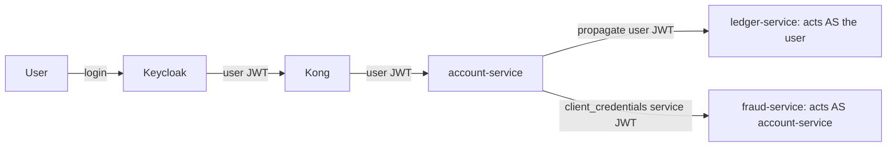

| Use a **user token** when | Use a **service token** when |
|---------------------------|------------------------------|
| The action is on behalf of the logged-in user | A background job/scheduler runs (no user) |
| Downstream needs user identity for authz/audit | System-to-system trust, user identity irrelevant |
| You want per-user rate limits & audit trail | Cross-tenant/admin operations |

### 18.2 Token Propagation (user context)

Propagate the incoming bearer token to downstream calls (Feign interceptor §14.5 / WebClient §15.6). **Pitfalls:**
- Token expires mid-chain on a long operation → downstream 401. Mitigate with sufficient token lifetime or refresh before long fan-outs.
- Audience: the propagated token's `aud` must include the *downstream* service, or it'll reject (§10.3). Either issue multi-audience tokens or use **token exchange**.
- Thread-local loss in async/reactive (§12.5).

### 18.3 Service Accounts (client credentials)

```java
// Obtain & cache a service token; refresh before expiry
@Bean
OAuth2AuthorizedClientManager authorizedClientManager(
    ClientRegistrationRepository regs, OAuth2AuthorizedClientService svc) {
  var provider = OAuth2AuthorizedClientProviderBuilder.builder().clientCredentials().build();
  var mgr = new AuthorizedClientServiceOAuth2AuthorizedClientManager(regs, svc);
  mgr.setAuthorizedClientProvider(provider);
  return mgr;
}
```
```yaml
spring:
  security:
    oauth2:
      client:
        registration:
          fraud-svc:
            provider: keycloak
            client-id: account-service
            client-secret: ${ACCOUNT_SVC_SECRET}
            authorization-grant-type: client_credentials
        provider:
          keycloak:
            token-uri: https://keycloak.bank.example.com/realms/bank/protocol/openid-connect/token
```
**Common mistakes:**
- **Fetching a new token on every call** → hammering Keycloak's token endpoint (429, latency). **Cache** the token until ~80% of its lifetime, then refresh.
- Service account not granted the needed client roles → downstream 403.
- Secret rotation breaks all callers simultaneously → roll secrets with overlap.

### 18.4 Token Exchange (RFC 8693)

When account-service (holding a user token) needs a downstream-scoped token for the *same user* but with a different audience/scope, use Keycloak token exchange instead of blindly forwarding:
```bash
curl -s -X POST $KC/realms/bank/protocol/openid-connect/token \
  -d grant_type=urn:ietf:params:oauth:grant-type:token-exchange \
  -d client_id=account-service -d client_secret=$SECRET \
  -d subject_token=$USER_TOKEN \
  -d requested_token_type=urn:ietf:params:oauth:token-type:access_token \
  -d audience=ledger-service | jq .access_token
```
**Failures:** token exchange feature/permission not enabled; policy denies the exchange; missing `audience`.

### 18.5 Common Banking Auth Mistakes (checklist)

- Forwarding a user token to an internal admin operation it has no rights for (privilege confusion).
- Using a powerful service token for user-initiated actions (loses per-user audit — a compliance problem).
- Long-lived service tokens stored in logs/env without rotation.
- Not validating audience downstream (any valid realm token is accepted everywhere — lateral movement risk).
- Trusting `X-User-Id` headers from upstream without verifying the JWT (header spoofing if an attacker reaches the pod network).

---
## 19. Observability and Distributed Tracing

You cannot debug what you cannot see. The three pillars — **logs, metrics, traces** — plus correlation IDs let you reconstruct a request's journey across 10 services.

### 19.1 The Correlation/Trace ID Backbone

Every request gets a `trace-id` at the edge (Kong) and it propagates via W3C `traceparent` header to every hop. Put it in the MDC so every log line carries it.

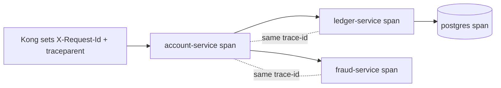

**Kong:** enable the `correlation-id` plugin and the OpenTelemetry plugin so the gateway starts the trace.
```yaml
plugins:
  - name: correlation-id
    config: { header_name: X-Request-Id, generator: uuid, echo_downstream: true }
  - name: opentelemetry
    config: { endpoint: http://otel-collector.observability:4318/v1/traces }
```

### 19.2 Spring Boot Tracing (Micrometer + OpenTelemetry)

```xml
<dependency><groupId>org.springframework.boot</groupId><artifactId>spring-boot-starter-actuator</artifactId></dependency>
<dependency><groupId>io.micrometer</groupId><artifactId>micrometer-tracing-bridge-otel</artifactId></dependency>
<dependency><groupId>io.opentelemetry</groupId><artifactId>opentelemetry-exporter-otlp</artifactId></dependency>
```
```yaml
management:
  tracing:
    sampling.probability: 1.0   # 100% in incident mode; lower (0.1) at steady state
  otlp.tracing.endpoint: http://otel-collector.observability:4318/v1/traces
logging:
  pattern:
    level: "%5p [${spring.application.name},%X{traceId:-},%X{spanId:-}]"
```
This stamps `traceId`/`spanId` into every log line automatically. Micrometer instruments Feign, WebClient, RestClient, and JDBC, so spans link end-to-end.

### 19.3 MDC & Correlation in your own logs

```java
@Component
public class CorrelationFilter extends OncePerRequestFilter {
  protected void doFilterInternal(HttpServletRequest req, HttpServletResponse res, FilterChain chain)
      throws ServletException, IOException {
    String cid = Optional.ofNullable(req.getHeader("X-Request-Id"))
        .orElse(UUID.randomUUID().toString());
    MDC.put("correlationId", cid);
    res.setHeader("X-Request-Id", cid);
    try { chain.doFilter(req, res); } finally { MDC.clear(); }
  }
}
```
Propagate `correlationId` on every outbound call (Feign/WebClient interceptors). For reactive/async, bridge MDC via Micrometer Context Propagation (`Hooks.enableAutomaticContextPropagation()`).

### 19.4 Tracing One Request Across 10 Services

1. Get the `trace-id` from the user (it's in the response header `X-Request-Id`, or the error page).
2. Open Jaeger → search by trace-id → see the full span tree with per-hop latency.
3. The longest span / the span that errored is your culprit. Drill into its tags (`http.status_code`, `db.statement`, `error`).
4. Cross-reference logs: query your log store (Loki/ELK) by `traceId=<id>` to get every log line from every service for that request.

```bash
# Loki/LogQL example
{app=~"account-service|ledger-service|fraud-service"} | json | traceId="8f3c2a91..."
# Jaeger API
curl -s "http://jaeger:16686/api/traces/8f3c2a91..." | jq '.data[0].spans[] | {service:.process.serviceID, op:.operationName, durMs:(.duration/1000)}'
```

### 19.5 Metrics that Matter (RED + USE)

- **RED** (per service/endpoint): **R**ate, **E**rrors, **D**uration. `http_server_requests_seconds_count`, `..._sum`, by `status`,`uri`.
- **USE** (per resource): **U**tilization, **S**aturation, **E**rrors. Threads, Hikari pool, heap, GC.
- Key banking dashboards: token-validation failure rate, downstream call error rate, Hikari `connections_pending`, circuit-breaker state, queue lag (Kafka), idempotency cache hit rate.

```promql
# Error ratio per endpoint
sum(rate(http_server_requests_seconds_count{status=~"5.."}[5m])) by (uri)
 / sum(rate(http_server_requests_seconds_count[5m])) by (uri)
# Saturation: DB pool starvation
hikaricp_connections_pending > 0
# p99 latency
histogram_quantile(0.99, sum(rate(http_server_requests_seconds_bucket[5m])) by (le, uri))
```

### 19.6 Dashboards (placeholders)

>  — rate/errors/duration per endpoint; spot the spike's onset time.
>
>  — 10-service span tree; the red span is the 504 source.
>
>  — `connections_pending > 0` correlates with the 504 window.
>
>  — every service's log line for one request.

### 19.7 Logging Hygiene for Banking

- **Never log:** full PAN, CVV, full tokens, passwords, full PII. Mask (`****1234`). Logging a JWT = logging a credential.
- Structured JSON logs with `traceId`, `correlationId`, `service`, `userId(hashed)`, `tenant`.
- Consistent log levels; ERROR means actionable. Sample noisy DEBUG.

---

## 20. Distributed Systems Failure Patterns

These are the emergent failures — no single service is "buggy," yet the system melts down.

### 20.1 Retry Storm & Thundering Herd

**How it happens:** downstream gets slow → every caller retries → load multiplies → downstream gets slower → more retries. A synchronized cache expiry or a downstream restart causes a *thundering herd* of simultaneous requests.

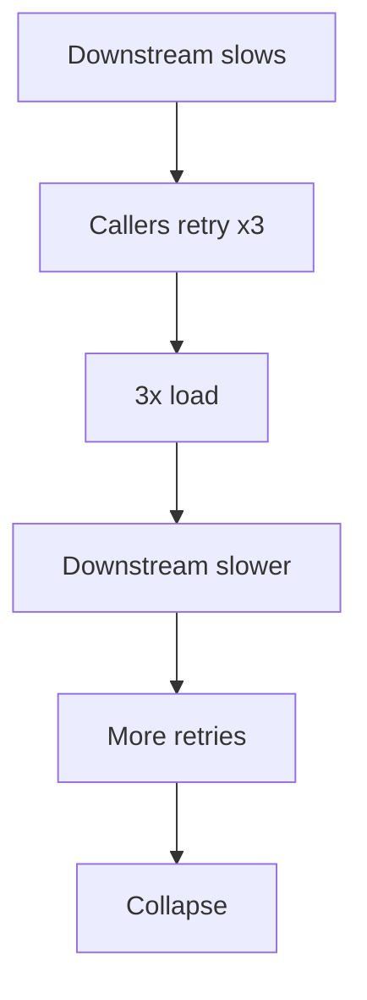

**Detect:** request rate to downstream spikes far above user request rate; retry counters climb.
**Prevent:** exponential backoff **with jitter**; cap total retries; circuit breakers; retry budgets (e.g., retries ≤ 10% of requests); request coalescing/singleflight for cache refills; load shedding (return 429 early).

### 20.2 Cascading Failure & Bulkhead

**How:** Service A calls B and C with a shared thread pool. B hangs → all A's threads block on B → A can't serve C-only requests either → A fails → A's callers fail. The failure cascades upstream.
**Prevent — bulkheads:** isolate resources per downstream (separate thread pools / connection pools / Resilience4j bulkheads), so a hang in B can't starve C's capacity.
```yaml
resilience4j.bulkhead.instances:
  ledger-service: { maxConcurrentCalls: 25 }
  fraud-service:  { maxConcurrentCalls: 25 }
```

### 20.3 Circuit Breaker Failures

- **Stuck open:** half-open probe keeps failing on a now-healthy service because the probe hits a still-bad instance, or threshold too sensitive.
- **Never opens:** thresholds too lax, so it never protects.
- **Fallback hides money bugs:** returning a default balance is unacceptable; fail closed for money movement.

### 20.4 Queue Saturation & Backpressure

Kafka consumer lag grows unbounded → events processed minutes late → balance/notifications stale. **Detect:** consumer lag metric. **Prevent:** scale consumers, partition correctly, apply backpressure, set max in-flight, alert on lag.

### 20.5 Deadlocks

- **DB deadlock:** two transactions lock rows in opposite order. Postgres: `ERROR: deadlock detected`. Fix: consistent lock ordering, shorter transactions, retry on `40P01`.
- **Thread deadlock:** thread pool A waits on B which waits on A (e.g., nested Feign calls sharing a bounded pool). Detect with thread dumps (`jstack`/`/actuator/threaddump`).

### 20.6 Lost Updates, Duplicate Requests, Race Conditions

- **Lost update:** read-modify-write without locking → two transfers read the same balance, both subtract, one update lost. Fix: optimistic locking (`@Version`) or `SELECT ... FOR UPDATE` or atomic SQL (`UPDATE ... SET balance = balance - ?`).
- **Duplicate requests:** client retried, network glitch, or at-least-once delivery → double processing. Fix: **idempotency keys** (§21).
- **Race conditions:** concurrent operations on shared state. Fix: serialize per-aggregate (per-account locking), use the DB as the arbiter.

### 20.7 Split Brain

Network partition makes two nodes both think they're primary → divergent state. Affects clustered caches, leader election, multi-region DBs. **Prevent:** quorum/consensus (odd number of nodes), fencing tokens, single-writer per partition.

### 20.8 Event Ordering, Duplication, Loss

- **Ordering:** Kafka guarantees order only within a partition. Key events by `accountId` so all events for an account land in one partition → ordered.
- **Duplication:** at-least-once delivery → consumers must be **idempotent** (dedupe by event id).
- **Loss:** at-most-once or misconfigured acks → events vanish. Use `acks=all`, idempotent producer, the **transactional outbox** (§21) to avoid dual-write loss.

| Pattern | Detect | Prevent |
|---------|--------|---------|
| Retry storm | downstream rate ≫ user rate | backoff+jitter, budgets, breakers |
| Cascading | thread pools saturate cluster-wide | bulkheads, timeouts |
| Queue saturation | consumer lag rising | scale, backpressure, alert |
| Lost update | balance discrepancies | optimistic/pessimistic locking |
| Duplicate | double postings | idempotency keys |
| Split brain | divergent replicas | quorum, fencing |
| Event loss | missing downstream effects | outbox, acks=all |

---
## 21. Banking-Specific Failure Scenarios

These are the incidents that wake up the on-call and the CFO. Each is framed as a mini post-mortem.

### 21.1 Duplicate Payment Execution

**Incident:** Customers report being charged twice for one transfer. Ledger shows two identical postings 800ms apart.
**Root cause:** the mobile client timed out (slow network) and auto-retried the POST `/transfers`. The first request actually succeeded server-side but the response was lost. No idempotency protection → two transfers.
**Investigation:**
```sql
SELECT account_id, amount, created_at, request_id
FROM transfers WHERE created_at > now() - interval '1 day'
GROUP BY account_id, amount, request_id HAVING count(*) > 1;  -- find dupes
```
Check trace: two traces, different `trace-id` but same `Idempotency-Key` (if present) or same business payload.
**Resolution (immediate):** reverse the duplicate posting via a compensating entry; reconcile.
**Prevention — idempotency keys:**
```java
@PostMapping("/transfers")
public TransferResult transfer(@RequestHeader("Idempotency-Key") @NotBlank String key,
                               @Valid @RequestBody TransferRequest req) {
  return idempotencyService.execute(key, req, () -> transferService.transfer(req));
}
```
```java
// Store key result atomically; INSERT ... ON CONFLICT makes it race-safe
public <T> T execute(String key, Object req, Supplier<T> action) {
  // 1) try claim the key (unique constraint on idempotency_key)
  // 2) if already present and completed -> return stored response
  // 3) else run action, persist response under the key in same TX
}
```
Enforce: unique constraint on `idempotency_key`; key scoped per client+endpoint; TTL (e.g., 24h). Kong can also enforce idempotency at the edge, but the **authoritative** dedupe must be in the service+DB.

### 21.2 Duplicate Transfers via At-Least-Once Events

**Incident:** an event-driven payout processed an event twice after a consumer rebalance.
**Root cause:** Kafka at-least-once redelivery + non-idempotent consumer.
**Prevention:** dedupe by `eventId` in a `processed_events` table within the same transaction as the side effect; or use exactly-once semantics (transactional producer + read-committed) where feasible.

### 21.3 Idempotency Failures

**Incident:** idempotency "worked" in tests but failed in prod under concurrency — two concurrent requests with the same key both executed.
**Root cause:** check-then-insert race (`SELECT` found nothing, both `INSERT`ed). 
**Fix:** rely on a **unique constraint + INSERT ... ON CONFLICT**, not a read-then-write. Let the DB serialize.

### 21.4 Outbox Pattern Failures (dual-write problem)

**Incident:** a transfer was saved to the DB but the "TransferCompleted" event was never published (or vice-versa) because the service crashed between the DB commit and the Kafka send.
**Root cause:** **dual write** — two systems (DB + Kafka) updated without a shared transaction. One succeeded, one didn't.
**Prevention — Transactional Outbox:**
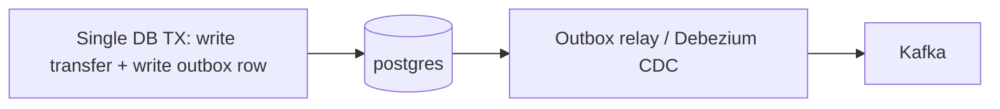
Write the domain change and an `outbox` row in **one transaction**; a relay (polling publisher or Debezium CDC) reads the outbox and publishes to Kafka, marking rows sent. The event can't be lost because it's committed atomically with the data.
**Outbox failure modes to watch:** relay lag (events delayed), relay stuck (publish errors), outbox table growth (purge sent rows), ordering (publish in insertion order per aggregate).

### 21.5 Saga Failures & Compensation

**Incident:** a multi-step transfer (debit account A → credit account B → notify) failed at step 2; account A was debited but B never credited. Money "disappeared."
**Root cause:** distributed transaction across services with no compensation, or compensation that itself failed.
**Resolution:** run the compensating action (credit A back); reconcile.
**Prevention — Saga with compensations:**
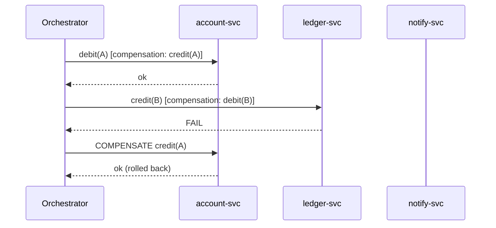
- Each step has an explicit compensating action.
- Compensations must be **idempotent** and **retryable** (they will be retried).
- Persist saga state (which steps done) so a crash mid-saga can resume/compensate.
- Money-moving sagas should never silently give up — escalate to a manual reconciliation queue if compensation fails repeatedly.

### 21.6 Balance Inconsistency

**Incident:** account balance in `account-service` disagrees with the sum of postings in `ledger-service`.
**Root causes:** cached balance not invalidated; a posting applied to ledger but the balance projection update failed; concurrent updates with a lost update (§20.6); floating-point money (§17.3).
**Investigation:**
```sql
-- Recompute authoritative balance from the ledger (source of truth)
SELECT account_id, SUM(CASE WHEN direction='CREDIT' THEN amount ELSE -amount END) AS computed
FROM ledger_postings WHERE account_id = :id GROUP BY account_id;
-- Compare with the cached/projected balance
SELECT balance FROM account_balances WHERE account_id = :id;
```
**Prevention:** single source of truth (the ledger); derive balances; use event sourcing or transactional projections; reconcile continuously; `BigDecimal` only.

### 21.7 Stale Cache

**Incident:** customer sees an old balance/limit after a transaction.
**Root cause:** cache (Redis/local) not invalidated on write; TTL too long; cache populated by a stale read during a write race.
**Prevention:** write-through or explicit invalidation on the write path; short TTL for financial data or no-cache; cache-aside with versioning; never cache money-critical reads without an invalidation strategy.

### 21.8 Customer Profile Synchronization Issues

**Incident:** a KYC profile updated in `customer-service` isn't reflected in `account-service`/`card-service`, causing failed compliance checks.
**Root cause:** synchronous coupling missing, or the propagation event was lost (no outbox), or consumers processed out of order (a later "address change" overwritten by an earlier event replay).
**Prevention:** event-carried state transfer with versioned events; ordering by customerId partition key; outbox for guaranteed delivery; reconciliation jobs comparing source-of-truth vs replicas; idempotent, version-checked consumers (ignore events with `version <= current`).

### 21.9 Cross-Cutting Banking Prevention Checklist

- Idempotency keys on every money-moving endpoint.
- Outbox for every "DB change + must-publish-event."
- Compensations for every multi-service money flow.
- `BigDecimal` + UTC everywhere.
- Reconciliation jobs (ledger vs projections) with alerting on drift.
- Never auto-retry non-idempotent writes blindly.
- Audit every money operation with the **user identity** (not just service identity).

---
## 22. Kubernetes Production Failures

The platform layer. These failures take services down regardless of code correctness.

### 22.1 CrashLoopBackOff

**Symptom:** pod restarts repeatedly; `kubectl get pods` shows `CrashLoopBackOff` with rising restart count.
**Diagnose:**
```bash
kubectl -n bank describe pod <pod>                 # Events, last state, exit code
kubectl -n bank logs <pod> --previous              # logs from the crashed container
kubectl -n bank get events --sort-by=.lastTimestamp | tail -30
```
**Common causes & exit codes:**
- App throws on startup (bad config, can't reach DB/Keycloak at boot) → check `--previous` logs.
- Exit code 137 = SIGKILL → usually **OOMKilled** (§22.2) or failed liveness.
- Exit code 1 = app error; 143 = SIGTERM (graceful, maybe probe-driven restart).
- Missing ConfigMap/Secret → `CreateContainerConfigError`.
- Liveness probe failing during slow startup → use a **startupProbe** so slow JVM boot isn't killed.

### 22.2 OOMKilled

**Symptom:** container `State: Terminated, Reason: OOMKilled, Exit Code: 137`.
**Diagnose:**
```bash
kubectl -n bank describe pod <pod> | grep -A3 'Last State'
kubectl -n bank top pod <pod>
```
**Root causes:** memory `limit` too low for the JVM heap + non-heap; JVM not container-aware (old JDK ignoring cgroup limits); a real leak; large in-memory processing (statement exports).
**Fix:**
- Use a container-aware JDK (11+) and set `-XX:MaxRAMPercentage=75` instead of fixed `-Xmx`, so heap scales with the limit.
- Right-size `requests`/`limits`. Leave headroom for metaspace, threads, direct buffers (Netty).
```yaml
resources:
  requests: { memory: "768Mi", cpu: "250m" }
  limits:   { memory: "1Gi" }
env:
  - { name: JAVA_TOOL_OPTIONS, value: "-XX:MaxRAMPercentage=75 -XX:+UseG1GC" }
```

### 22.3 CPU Throttling

**Symptom:** high p99 latency, GC pauses, slow responses despite low average CPU. Metric: `container_cpu_cfs_throttled_periods_total` rising.
**Root cause:** CPU `limit` too low; CFS quota throttles the JVM (which wants bursts for GC/JIT). A 4-thread GC throttled to 0.5 CPU stalls.
**Fix:** raise CPU limits or remove CPU limits (keep requests) for latency-sensitive services; ensure `-XX:ActiveProcessorCount` matches allocation.

### 22.4 Probe Failures (liveness/readiness/startup)

| Probe | Failing means | Effect |
|-------|---------------|--------|
| readiness | not ready | removed from Service Endpoints → 503 at gateway |
| liveness | unhealthy | container **restarted** |
| startup | still booting | delays liveness/readiness until app is up |

**Banking gotcha:** a readiness probe that checks downstream (DB/Keycloak) means a brief DB blip marks *all* pods not-ready → full outage. Keep liveness shallow (process alive), readiness moderate (can serve), and avoid cascading dependency checks in liveness.
```yaml
startupProbe:   { httpGet: { path: /actuator/health/readiness, port: 8080 }, failureThreshold: 30, periodSeconds: 5 }
readinessProbe: { httpGet: { path: /actuator/health/readiness, port: 8080 }, periodSeconds: 10 }
livenessProbe:  { httpGet: { path: /actuator/health/liveness,  port: 8080 }, periodSeconds: 10, failureThreshold: 3 }
```

### 22.5 Node Pressure, Evictions, Taints, Tolerations

- **Evictions:** node under memory/disk pressure evicts pods (`Evicted` status, reason `MemoryPressure`/`DiskPressure`). Diagnose: `kubectl describe node <node>` → Conditions.
- **Taints/Tolerations:** pod stuck `Pending` because no node tolerates a taint, or node cordoned. `kubectl describe pod` → events `node(s) had untolerated taint`.
- **Resource limits & scheduling:** `Pending` with `Insufficient cpu/memory` → cluster lacks capacity; check requests vs node allocatable.
```bash
kubectl get nodes
kubectl describe node <node> | sed -n '/Conditions/,/Addresses/p'
kubectl -n bank get pod <pod> -o jsonpath='{.status.conditions}'
kubectl get events -A --field-selector reason=Evicted
```

### 22.6 Rollout / Deploy Failures

```bash
kubectl -n bank rollout status deploy/account-service
kubectl -n bank rollout history deploy/account-service
kubectl -n bank rollout undo deploy/account-service        # fast rollback during an incident
```
- New version crashes → rollout stalls (good, if `maxUnavailable` is conservative); old pods keep serving.
- Bad readiness → new pods never Ready → rollout hangs; `kubectl describe` the new ReplicaSet.

---

## 23. Configuration Failures

Most production incidents are not bugs — they're **config**. A wrong value in one ConfigMap can take down a service silently.

### 23.1 The Config Failure Matrix

| Wrong thing | Symptom | How to catch |
|-------------|---------|--------------|
| Wrong URL | UnknownHost / connection refused / 404 | resolve + curl the configured URL |
| Wrong Secret | 401 from downstream / Keycloak `invalid_client` | decode secret, test token fetch |
| Wrong ConfigMap | app uses defaults / NPE on missing key | `kubectl get cm -o yaml`, check mount |
| Wrong Namespace | UnknownHost (short name cross-ns) | FQDN check (§5.8) |
| Wrong Environment | hitting prod from staging or vice-versa | echo resolved config at boot |
| Wrong Profile | wrong beans/props active | `/actuator/env`, active profiles log |
| Wrong Realm | issuer mismatch / token rejected | compare `iss` vs configured |
| Wrong Route (Kong) | 404 / wrong upstream | `deck dump`, admin API |
| Wrong Host | TLS SAN mismatch / 404 | check Host header vs route |
| Wrong Port | connection refused | `ss -ltn`, targetPort |
| Wrong Certificate | PKIX / handshake failure | openssl inspect |
| Wrong Timeout | premature 504 or hung threads | check client read timeout |
| Wrong Retry Policy | duplicate payments / retry storm | inspect retryer config |
| Wrong JVM Options | OOM / throttling / GC pauses | check JAVA_TOOL_OPTIONS |

### 23.2 Inspecting Effective Config

```bash
# What config did the app actually load?
curl -s localhost:8080/actuator/env | jq '.propertySources[] | {name, props: (.properties|keys)}'
curl -s localhost:8080/actuator/configprops | jq '.contexts.application.beans | keys'
curl -s localhost:8080/actuator/env/spring.profiles.active | jq

# K8s config sources
kubectl -n bank get configmap account-config -o yaml
kubectl -n bank get secret account-secrets -o jsonpath='{.data.client-secret}' | base64 -d; echo
kubectl -n bank set env deploy/account-service --list     # env vars
kubectl -n bank describe deploy account-service | sed -n '/Environment/,/Mounts/p'
```
> **Security:** be careful exposing `/actuator/env` — it can leak secrets. Restrict actuator to internal network + mask sensitive keys (`management.endpoint.env.show-values=never`).

### 23.3 Config Drift & Prevention

- **GitOps** (Argo CD/Flux): config in git, cluster reconciles to it → no manual `kubectl edit` drift.
- **Schema-validate** config at startup (`@ConfigurationProperties` + `@Validated`) — fail fast on missing/invalid values rather than NPE later.
- **Sealed/External Secrets**: never plain secrets in git; rotate with overlap.
- **Per-environment review**: a checklist diff between staging/prod config before promotion.
- **Startup assertion**: log resolved critical config (masked) at boot so you can confirm from logs which realm/URL/timeout is active.

```java
@ConfigurationProperties("clients.ledger")
@Validated
public record LedgerProps(@NotBlank String url,
                          @Positive int connectTimeoutMs,
                          @Positive int readTimeoutMs) {}
```

---
## 24. Error-to-Root-Cause Lookup Table

Scan for the exact error string you see. **Layer** tells you where to start; **First action** is the fastest disambiguator.

### 24.1 HTTP Status & Gateway

| Error / Message | Likely Cause | Layer | First action |
|-----------------|-------------|-------|--------------|
| `401 Unauthorized` (`Server: kong`) | JWT invalid/expired/missing at gateway | Kong/Keycloak | decode token `exp`,`iss` |
| `401` + `WWW-Authenticate: Bearer error="invalid_token"` | resource server rejected JWT | Spring Security | enable security DEBUG |
| `403 Forbidden` (app body) | missing role/scope/authority | Spring Security | check authorities mapping |
| `403` (`You cannot consume this service`) | Kong ACL plugin | Kong | check consumer groups |
| `403 invalid_token aud` | wrong audience | Keycloak/Security | add audience mapper |
| `404 no Route matched with those values` | no Kong route | Kong | list routes, check host/path |
| `404` (app whitelabel) | controller mapping / strip_path | MVC/Kong | `/actuator/mappings`, strip_path |
| `405 Method Not Allowed` | wrong verb | MVC | check `Allow` header |
| `406 Not Acceptable` | Accept vs produces | MVC | align Accept |
| `413 Payload Too Large` | upload over limit | HTTP/Kong/Tomcat | raise multipart/body limits |
| `415 Unsupported Media Type` | wrong Content-Type | MVC | set `application/json` |
| `429 Too Many Requests` | rate limit | Kong/app | check `Retry-After`, limits |
| `431 Request Header Fields Too Large` | JWT too big / too many roles | HTTP | measure token size |
| `500 Internal Server Error` | unhandled exception | app | find stack trace by trace-id |
| `502 Bad Gateway` | upstream refused/crashed/malformed | Kong/K8s | upstream health, pod status |
| `503 Service Unavailable` | no healthy/ready pods | Kong/K8s | `get endpoints`, probes |
| `504 Gateway Timeout` | upstream too slow | Kong/app/DB | read_timeout, slow query, Hikari |
| `RateLimit-Remaining: 0` | quota exhausted | Kong | per-consumer limit |

### 24.2 Java / Network Exceptions

| Exception | Likely Cause | Layer | First action |
|-----------|-------------|-------|--------------|
| `java.net.UnknownHostException` | DNS / wrong name / cross-ns short name | DNS/K8s | nslookup FQDN |
| `java.net.ConnectException: Connection refused` | nothing listening / wrong port / pod down | TCP/K8s | `ss -ltn`, targetPort |
| `java.net.SocketException: Connection reset` | peer closed (idle keep-alive mismatch / crash) | TCP | align pool idle < server idle |
| `SocketTimeoutException: connect timed out` | SYN dropped (firewall/NetworkPolicy) | TCP/K8s | check NetworkPolicy, port |
| `SocketTimeoutException: Read timed out` | downstream slow / hung | TCP/app | downstream latency, DB |
| `java.net.BindException: Cannot assign requested address` | ephemeral port exhaustion | TCP | pool connections, port range |
| `Too many open files` | FD/socket leak | TCP/app | `ls /proc/1/fd|wc -l`, close streams |
| many `CLOSE_WAIT` | app not closing responses | app | find unclosed HTTP client |
| `nf_conntrack: table full` | conntrack exhaustion | node | raise max, reduce churn |
| `PrematureCloseException` (Netty) | upstream closed connection mid-response | WebClient | pool idle, keep-alive |
| `PoolAcquirePendingLimitException` | WebClient pool exhausted | WebClient | body not consumed / pool size |
| `IllegalStateException: block()... not supported` | block() on event loop | WebClient | use boundedElastic / don't block |
| `No instances available for X` | discovery has no instances | Feign/LB | check discovery / use DNS |

### 24.3 TLS / Certificates

| Error | Likely Cause | Layer | First action |
|-------|-------------|-------|--------------|
| `PKIX path building failed: unable to find valid certification path` | CA not in truststore | TLS | import CA to truststore |
| `CertificateExpiredException / validity check failed` | expired cert | TLS | renew, check cert-manager |
| `SSLPeerUnverifiedException ... doesn't match any of the subject alternative names` | hostname/SAN mismatch | TLS | connect via SAN name |
| `Received fatal alert: handshake_failure` | TLS version/cipher mismatch | TLS | nmap ssl-enum-ciphers |
| `Received fatal alert: bad_certificate` | mTLS client cert rejected | TLS | check keystore/truststore pair |
| `Received fatal alert: certificate_required` | server wants client cert, none sent | TLS | configure client keystore |

### 24.4 Keycloak / JWT

| Error | Likely Cause | Layer | First action |
|-------|-------------|-------|--------------|
| `The iss claim is not valid` | issuer mismatch (internal/external URL) | Keycloak | align issuer-uri |
| `The aud claim is not valid` | wrong/missing audience | Keycloak | audience mapper |
| `Jwt expired at <ts>` | expired token / clock skew | Keycloak/JWT | refresh; check NTP |
| `Jwt used before nbf` / `iat` future | clock skew | infra | fix NTP, add leeway |
| `Invalid signature` / `Unable to find a signing key` | JWKS rotation / cache | Keycloak/Kong | compare token kid vs JWKS |
| `Malformed payload` / `Malformed token` | truncated/garbled token | HTTP/JWT | count segments, header size |
| `invalid_client` | wrong client secret | Keycloak | verify secret |
| `invalid_grant` | bad credentials / expired refresh | Keycloak | check grant params |
| `unauthorized_client` | grant type not allowed for client | Keycloak | enable grant on client |
| `invalid_redirect_uri` | redirect not registered | Keycloak | register exact URI |
| `Unsupported algorithm` / alg none | algorithm confusion/attack | JWT | enforce RS256 |

### 24.5 Spring / Jackson / Data

| Error | Likely Cause | Layer | First action |
|-------|-------------|-------|--------------|
| `UnrecognizedPropertyException` | DTO field mismatch | Jackson | `ignoreUnknown=true` + contract test |
| `Cannot deserialize value of type Enum` | new enum value | Jackson | read-unknown-enum-as-null |
| `Infinite recursion (StackOverflowError)` | bidirectional entity serialization | Jackson | map to DTOs |
| `LazyInitializationException` | serializing lazy JPA outside TX | JPA/MVC | use DTOs / fetch eagerly |
| `MethodArgumentNotValidException` | `@Valid` failure | MVC | inspect field errors |
| `Ambiguous mapping` (startup) | duplicate controller mapping | MVC | `/actuator/mappings` |
| `Connection is not available, request timed out after` | HikariCP pool exhausted | DB | `hikaricp_connections_pending` |
| `deadlock detected` (40P01) | DB lock ordering | DB | consistent lock order, retry |
| `could not serialize access due to concurrent update` (40001) | optimistic lock conflict | DB | retry / `@Version` |
| `Access is denied` (security log) | authorization failure | Spring Security | authorities |
| `Invalid CSRF token` | CSRF enabled on stateless API | Spring Security | disable CSRF for bearer API |

### 24.6 Kubernetes / Platform

| Error / Status | Likely Cause | Layer | First action |
|----------------|-------------|-------|--------------|
| `CrashLoopBackOff` | startup failure / OOM / liveness | K8s | logs `--previous`, describe |
| `OOMKilled` (exit 137) | memory limit too low / leak | K8s | top pod, MaxRAMPercentage |
| `CreateContainerConfigError` | missing ConfigMap/Secret | K8s | check refs |
| `ImagePullBackOff` | bad image/registry auth | K8s | describe, registry creds |
| `Pending` `Insufficient cpu/memory` | no capacity | K8s | requests vs allocatable |
| `Pending` `untolerated taint` | taint/toleration | K8s | node taints |
| `Evicted` MemoryPressure | node pressure | K8s | node conditions |
| empty `Endpoints` | selector mismatch / not Ready | K8s | selector vs labels, probes |
| LB `EXTERNAL-IP <pending>` | cloud LB not provisioned | K8s | describe svc events |
| `connect() failed (111: Connection refused)` (Kong log) | upstream pod down/wrong port | Kong/K8s | upstream health |

---
## 25. Production Debugging Playbooks

Each playbook is incident-grade: copy-paste commands, what to look for, and the fix. Always grab the **trace-id / X-Request-Id** first.

### 25.1 Playbook: 401 Unauthorized

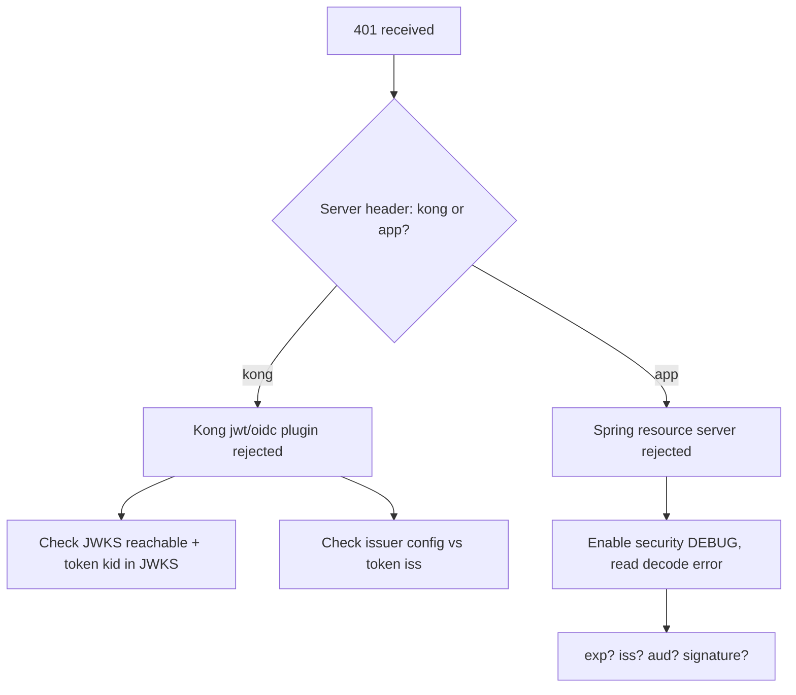
**Steps**
1. `curl -i` the endpoint; note `Server` and `WWW-Authenticate`.
2. Decode token: `jwtdecode "$TOKEN" 2` → check `exp` (epoch vs now: `date +%s`), `iss`, `aud`, `kid`.
3. If expired → client token refresh issue; check clock skew (`date` on pods).
4. If `iss` wrong → issuer config mismatch (§10.2).
5. If signature → JWKS rotation: compare token `kid` vs `/certs` (§10.4).
6. **Logs:** `kubectl logs deploy/account-service | grep -i 'Failed to authenticate'`; Kong proxy logs.
7. **Metrics:** `http_server_requests_seconds_count{status="401"}` spike onset.
**Fix:** refresh/rotate keys, align issuer, fix clock, or correct token issuance.

### 25.2 Playbook: 403 Forbidden

1. Confirm authenticated (it's not 401) → identity is known, authorization failed.
2. Decode token → list `realm_access.roles`, `resource_access`, `scope`.
3. Compare against the endpoint's requirement (`@PreAuthorize`, matcher).
4. Enable security DEBUG → find `Access is denied` with the **required authority**.
5. Check the **authority mapping converter** (§12.2) — is `realm_access.roles` mapped to `ROLE_*`? This is the usual culprit.
6. If Kong ACL → check consumer groups.
**Fix:** add the missing role in Keycloak, fix the protocol mapper, or fix the authority converter. **Never** just remove the auth check.

### 25.3 Playbook: 404 Not Found

1. `curl -i` → `Server: kong` (route) vs app whitelabel (mapping).
2. If Kong: `curl localhost:8001/routes` — does any route match the host+path+method? Check `strip_path`.
3. If app: `/actuator/mappings` — is the path mapped? Context-path? Path variable mismatch?
4. Check recent deploys (route renamed, controller path changed).
**Fix:** correct route/strip_path or controller mapping.

### 25.4 Playbook: 429 Too Many Requests

1. Read `Retry-After`, `RateLimit-Limit/Remaining`.
2. Who's limiting — Kong (`Server: kong`) or app? 
3. Is it one abusive client/tenant or global? Check per-consumer metrics.
4. If Kong with `local` policy on multi-node → effective limit is N× (each node counts separately) or clients hit different nodes inconsistently → switch to `redis`.
5. Check for a **retry storm** (§20.1) inflating traffic.
**Fix:** raise/limit appropriately per tenant; switch to redis policy; add client backoff; protect token endpoint.

### 25.5 Playbook: 431 Header Too Large

1. `echo -n "$TOKEN" | wc -c` — is the JWT huge (>6–8KB)?
2. Decode payload → count roles/groups; admin/ops users usually trigger it.
3. Identify the limiting layer (nginx/Kong vs Tomcat) from which component emits 431.
**Fix (priority):** shrink the token (trim mappers, drop full group paths, scope per-audience) — §9.4/§11.6. Raise header buffers as a stopgap.

### 25.6 Playbook: 500 Internal Server Error

1. Get trace-id from response/`X-Request-Id`.
2. `kubectl logs deploy/<svc> | grep <trace-id>` (or query log store by `traceId`).
3. Read the **stack trace** — the top app frame is your bug location.
4. Common: NPE, `LazyInitializationException`, downstream `FeignException` unhandled, DB constraint violation.
5. Reproduce with the same payload in staging.
**Fix:** handle the exception via `@RestControllerAdvice`, fix the root logic, add a regression test.

### 25.7 Playbook: 502 Bad Gateway

1. Confirm emitter is the gateway (`Server: kong`).
2. `kubectl get pods` — are upstream pods Running? Recent crashes?
3. `curl localhost:8001/upstreams/<up>/health` — target health.
4. Kong proxy logs: `connect() failed (111: Connection refused)` → pod down/wrong port; `upstream prematurely closed` → app crashed mid-response or protocol mismatch (h2 vs h1).
5. Check app logs for OOM/crash at that timestamp.
**Fix:** restore healthy pods, fix port/protocol, fix the crash.

### 25.8 Playbook: 503 Service Unavailable

1. `kubectl get endpoints <svc>` — empty? (most common).
2. If empty → `kubectl get pods -l <selector>`; are any Ready? Describe a pod → readiness probe failing?
3. Check selector vs pod labels (§5.4).
4. Check if a deploy/rollout is in progress or scaled to 0.
5. Kong: no healthy upstream targets.
**Fix:** fix readiness probe / selector / scale up / wait out rollout.

### 25.9 Playbook: 504 Gateway Timeout

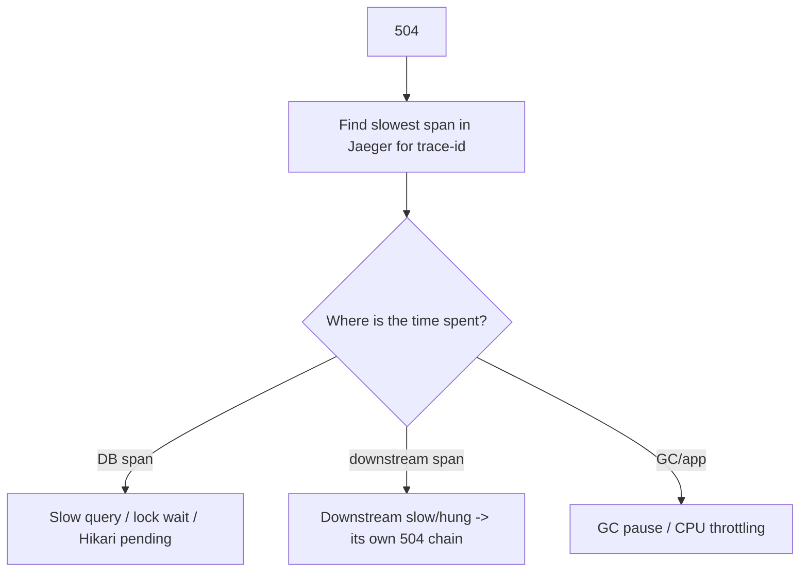
1. Pull the trace; find the long span.
2. **DB:** `pg_stat_activity` for long queries; `pg_locks` for blocked; `hikaricp_connections_pending`.
3. **Downstream:** is account-service blocked on ledger-service? Its read timeout missing/too high?
4. **App:** GC logs, CPU throttling (§22.3).
5. Check Kong `read_timeout` vs actual upstream latency.
**Fix:** optimize query/index, add/lower read timeouts (fail fast), add circuit breaker/bulkhead, scale, fix GC/CPU limits.

```sql
-- During a 504 incident on the DB
SELECT pid, now()-query_start AS dur, state, wait_event_type, left(query,80)
FROM pg_stat_activity WHERE state<>'idle' ORDER BY dur DESC LIMIT 20;
SELECT bl.pid AS blocked, ka.pid AS blocking, left(ka.query,60) AS blocking_q
FROM pg_locks bl JOIN pg_stat_activity a ON a.pid=bl.pid
JOIN pg_locks kl ON kl.locktype=bl.locktype AND kl.pid<>bl.pid AND NOT kl.granted=bl.granted
JOIN pg_stat_activity ka ON ka.pid=kl.pid WHERE NOT bl.granted;
```

---
## 26. Layer-by-Layer Troubleshooting Checklist

Use this during any incident — tick each box as you eliminate a layer.

### Browser / Client
- [ ] Does the request even leave the browser? (Network tab: failed vs status)
- [ ] CORS preflight (`OPTIONS`) succeeds with a single `Access-Control-Allow-Origin`?
- [ ] Is the `Authorization` header present and a well-formed JWT (3 segments)?
- [ ] Cookies present with correct `SameSite`/`Secure`? Mixed content blocked?
- [ ] Header size sane (no 431)? Caching not serving stale data?

### Gateway (Kong)
- [ ] `Server: kong` on the response? Which `X-Kong-Request-Id`?
- [ ] A route matches host+path+method? `strip_path` correct?
- [ ] Auth plugin (jwt/oidc) passing? JWKS reachable? issuer aligned?
- [ ] Rate limit not tripped? CORS plugin not conflicting?
- [ ] Upstream targets healthy? `read_timeout` adequate?

### Keycloak
- [ ] `iss` in token == realm issuer (canonical URL)?
- [ ] `aud` includes the target service?
- [ ] Token not expired; clocks in sync?
- [ ] Signing `kid` present in JWKS (no stale rotation)?
- [ ] Required roles/scopes mapped into the token?

### Network / DNS
- [ ] FQDN resolves from the calling pod? CoreDNS healthy?
- [ ] TCP connects (not refused/timeout)? Correct port/targetPort?
- [ ] NetworkPolicy allows the path (including DNS egress 53)?
- [ ] No conntrack/FD/port exhaustion under load?

### TLS
- [ ] Cert valid (not expired), trusted (CA in truststore), host in SAN?
- [ ] TLS version/cipher compatible? mTLS pair (keystore/truststore) correct?

### Kubernetes
- [ ] Pods Running and Ready? Restart count stable (no CrashLoop/OOM)?
- [ ] Service has non-empty Endpoints? Selector matches labels?
- [ ] No CPU throttling / memory pressure / evictions?
- [ ] Recent rollout healthy? Config/Secret mounted correctly?

### Spring Security
- [ ] 401 vs 403 understood (authn vs authz)?
- [ ] JWT decodes; issuer/audience validators pass?
- [ ] Authority converter maps Keycloak roles → `ROLE_*`/`SCOPE_*`?
- [ ] CSRF/anonymous/context-propagation not interfering (async/reactive)?

### Controller / MVC
- [ ] Path+verb mapped (no 404/405/ambiguous)? Context-path correct?
- [ ] Body parses; `@Valid` passes; correct `Content-Type`/`Accept`?
- [ ] No serialization error (lazy init, recursion, enum/date/BigDecimal)?

### Business Logic
- [ ] Idempotency enforced on writes? No duplicate processing?
- [ ] Concurrency safe (locking/version)? No lost updates?
- [ ] Saga/compensation/outbox behaving? No partial money movement?

### Database / Downstream
- [ ] Hikari pool not exhausted (`connections_pending`)?
- [ ] No long queries / lock waits / deadlocks?
- [ ] Downstream calls have timeouts + breakers; not hung?

---

## 27. Senior Engineer Incident Investigation Workflow

A repeatable methodology that turns chaos into a clean RCA. This is how a senior engineer runs an incident.

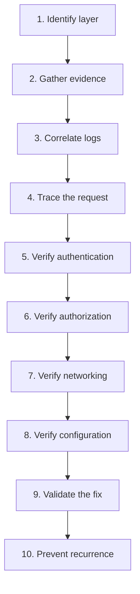

### Step 1 — Identify the Layer
Apply the five localizing questions (§1.2): blast radius, timing, boundary, exact status + emitter, recent change. Output a one-line hypothesis: *"All `/transfers` POSTs return 504 since the 14:05 deploy; account-service spans hang on ledger-service."*

### Step 2 — Gather Evidence
Pin the facts before theorizing:
- Exact error string + status + `Server`/`WWW-Authenticate` headers.
- Trace-id / X-Request-Id of a failing request.
- Timestamp of onset; correlate with deploy/cert/config/traffic changes.
- Scope: which endpoints/users/tenants/regions.
```bash
kubectl -n bank get events --sort-by=.lastTimestamp | tail -20
kubectl -n bank rollout history deploy/account-service
helm history account-service -n bank   # what changed and when
```

### Step 3 — Correlate Logs
Pull every service's logs for the failing trace-id; align them on a timeline. The first ERROR in causal order points at the origin, not the symptom.
```bash
# Across services by trace id
{app=~".+"} | json | traceId="<id>"            # Loki
```

### Step 4 — Trace the Request
Open the trace in Jaeger. Identify the span that errored or dominated latency. That span's service + tags is your prime suspect. If no trace exists, that itself is a finding (instrument it).

### Step 5 — Verify Authentication
If auth-related: decode the token, validate `exp/iss/aud/kid/sig`, check Keycloak events, confirm JWKS freshness and clock sync. Distinguish "no token" vs "bad token" vs "rejected token."

### Step 6 — Verify Authorization
Confirm the identity *should* have access. Inspect mapped authorities vs endpoint requirements; check the authority converter and Keycloak role/group mappers. Decide whether the policy or the token is wrong — never weaken the policy reflexively.

### Step 7 — Verify Networking
Resolve names, test TCP/TLS from the actual calling pod, inspect Endpoints/NetworkPolicies/DNS. Confirm whether it's refused (port/listener), timeout (policy/MTU/firewall), or reset (keep-alive).
```bash
kubectl -n bank run netshoot --rm -it --image=nicolaka/netshoot -- \
  sh -c 'nslookup ledger-service && curl -m5 -v http://ledger-service:8080/actuator/health'
```

### Step 8 — Verify Configuration
Compare effective config (`/actuator/env`, ConfigMaps, Secrets) against expected for the environment. Most "mystery" incidents resolve here. Diff against the last known-good (GitOps history).

### Step 9 — Validate the Fix
- Reproduce the failure first (so you know the fix actually addresses it).
- Apply the fix in staging; confirm the exact failing request now succeeds.
- Roll out with a safe strategy; watch the error/latency metrics return to baseline.
- Confirm no new errors introduced (check adjacent endpoints).
```bash
kubectl -n bank rollout status deploy/account-service
watch -n5 'curl -s localhost:9090/api/v1/query?query=... '   # error rate back to 0
```

### Step 10 — Prevent Recurrence
Close the loop so the same incident can't happen silently again:
- **Detection:** add an alert on the leading indicator (e.g., `hikaricp_connections_pending>0`, JWKS fetch failures, cert expiry < 14d).
- **Guardrail:** config validation at startup, contract test, idempotency, timeout/breaker defaults, retry budgets.
- **Runbook:** add/refine the playbook (§25) with the exact commands that worked.
- **Blameless post-mortem:** timeline, root cause, contributing factors, action items with owners.

### The RCA One-Pager Template

```
Title:        <short symptom> on <service> (<date/time, UTC>)
Impact:       <who/what affected, duration, $ / SLA impact>
Detection:    <how we found out — alert/customer report>
Trace-id:     <id>
Timeline:     14:05 deploy -> 14:07 first 504 -> 14:20 mitigated -> 14:35 resolved
Root cause:   <the ONE underlying cause, not the symptom>
Contributing: <missing timeout, no alert, etc.>
Resolution:   <what fixed it>
Prevention:   [ ] alert  [ ] guardrail  [ ] runbook  [ ] test  (owners + dates)
```

---

## Appendix A — One-Page Command Cheat Sheet

```bash
# HTTP / who emitted the error
curl -i -sS https://api.bank.example.com/accounts/123 -H "Authorization: Bearer $TOKEN"

# Decode a JWT payload
echo "$TOKEN" | cut -d. -f2 | tr '_-' '/+' | base64 -d 2>/dev/null | jq .

# Keycloak discovery + keys
curl -s $KC/realms/bank/.well-known/openid-configuration | jq '{issuer,jwks_uri}'
curl -s $KC/realms/bank/protocol/openid-connect/certs | jq '.keys[].kid'

# TLS inspect
echo | openssl s_client -connect host:443 -servername host 2>/dev/null | openssl x509 -noout -dates -ext subjectAltName

# Kubernetes triage
kubectl -n bank get pods -o wide
kubectl -n bank get endpoints <svc>
kubectl -n bank describe pod <pod>
kubectl -n bank logs <pod> --previous
kubectl -n bank run netshoot --rm -it --image=nicolaka/netshoot -- bash

# Kong
kubectl -n kong port-forward deploy/kong 8001:8001 &
curl -s localhost:8001/routes | jq '.data[] | {name,paths,hosts}'
curl -s localhost:8001/upstreams/<up>/health | jq

# Linux network
ss -ltnp ; ss -tan state time-wait | wc -l ; ss -tan | awk '{print $1}'|sort|uniq -c
cat /proc/1/limits | grep 'open files' ; ls /proc/1/fd | wc -l

# Postgres
psql -c "SELECT pid,now()-query_start dur,state,left(query,80) FROM pg_stat_activity WHERE state<>'idle' ORDER BY dur DESC;"
psql -c "SELECT * FROM pg_locks WHERE NOT granted;"

# Spring actuator
curl -s localhost:8080/actuator/health | jq
curl -s localhost:8080/actuator/env/spring.profiles.active | jq
curl -s localhost:8080/actuator/mappings | jq '.. | .patterns? // empty'
curl -s localhost:8080/actuator/metrics/hikaricp.connections.pending | jq
curl -s localhost:8080/actuator/threaddump | jq '.threads[] | select(.threadState=="BLOCKED")'
```

## Appendix B — 401 vs 403 vs 404 vs 502 vs 503 vs 504 in one line each

- **401** — *I don't know who you are.* (token missing/invalid/expired) → fix auth.
- **403** — *I know you, but you can't.* (missing role/scope/audience) → fix authorization.
- **404** — *That doesn't exist here.* (no route / no mapping / strip_path) → fix routing.
- **502** — *My upstream gave me garbage.* (pod crash/refused/protocol) → fix upstream health.
- **503** — *I have no healthy upstream.* (no Ready pods / empty endpoints) → fix readiness/selector.
- **504** — *My upstream was too slow.* (DB/downstream hang) → fix latency/timeouts.

---

## Appendix C — Real Production War Stories (Annotated Post-Mortems)

These are composite, anonymized incidents typical of a digital bank. Each is written the way you'd want a post-mortem to read: symptom → investigation → root cause → fix → prevention. Read them to build pattern-recognition; the same shapes recur with different surface details.

### C.1 "Everything is 401 after midnight"

**Symptom:** At 00:00 UTC, all authenticated API calls started returning `401`. Logins still worked (new tokens issued), but existing sessions failed.

**Investigation:** `Server: kong` on the 401s → gateway-level rejection. Kong proxy logs showed `Invalid signature`. Decoding a failing token's header revealed `kid: "rsa-2025-q4"`; Keycloak's `/certs` only advertised `kid: "rsa-2026-q1"`. A scheduled **key rotation job ran at midnight** and *immediately retired* the old key instead of keeping it passive.

**Root cause:** zero-overlap key rotation. Tokens minted before midnight (still valid for 15 min) referenced a `kid` that no longer existed in JWKS → signature verification failed at Kong.

**Fix (immediate):** re-published the previous signing key as passive in Keycloak; Kong refreshed JWKS; 401s cleared within the JWKS cache TTL. **Fix (proper):** rotation policy keeps the prior key active-as-passive for at least 2× the max token lifetime.

**Prevention:** alert on `count(distinct kid in JWKS) < 2` during rotation windows; synthetic check that a token minted at T-1min still validates at T+1min after rotation; reduce Kong JWKS cache TTL so new keys propagate fast.

**Lesson:** key rotation is a *distributed* operation — every cache (Kong, resource servers) must see the overlap window. See §10.4, §25.1.

### C.2 "The 3 PM slowdown"

**Symptom:** Every weekday around 15:00, p99 latency on `account-service` jumped from 80ms to 6s for ~10 minutes, then recovered. No errors, just slow.

**Investigation:** Jaeger traces during the window showed the time was spent *not* in the DB span nor downstream — it was a gap *before* the controller span even started. CPU metrics showed `container_cpu_cfs_throttled_periods_total` spiking at exactly 15:00. A marketing batch job scaled up on the same nodes, and the JVM's GC threads got CPU-throttled by a tight CPU `limit`.

**Root cause:** CPU `limit` of `500m` on a service with a 4-thread G1 GC. Under co-tenant pressure, CFS throttled the GC, causing long stop-the-world pauses that froze request handling.

**Fix:** removed the CPU limit (kept the request) for this latency-sensitive service; set `-XX:ActiveProcessorCount` to match. Throttling vanished.

**Prevention:** alert on `rate(container_cpu_cfs_throttled_periods_total[5m]) > 0` for latency-critical services; don't put batch and latency-sensitive workloads on the same nodes (node pools / taints); right-size GC threads to the CPU allocation.

**Lesson:** a "slow" with no DB/downstream time and no errors smells like the runtime (GC/throttling), not your code. See §22.3.

### C.3 "Payments doubled during the network blip"

**Symptom:** A 4-second network partition between the mobile gateway and `payment-service` led to ~120 duplicate payments.

**Investigation:** Duplicate rows in `payments` shared identical amounts and accounts, 2–3s apart, different `trace-id`s. The mobile SDK auto-retried POSTs on timeout. `/transfers` had **no idempotency key**; the first attempt had actually succeeded server-side but the response was lost in the partition.

**Root cause:** non-idempotent write + client retry on timeout. Classic at-least-once-from-the-client problem.

**Fix (immediate):** identified duplicates via a dedupe query (§21.1) and posted reversals after manual review. **Fix (proper):** mandatory `Idempotency-Key` header, stored with a unique constraint; replays return the original response.

**Prevention:** idempotency keys on every money-moving endpoint; client SDK generates the key once per logical operation and reuses it across retries; Kong rejects money POSTs missing the header.

**Lesson:** the network *will* partition; your writes must be safe to retry. See §21.1, §20.6.

### C.4 "Admin users can't log in, everyone else is fine"

**Symptom:** Only users in many groups (admins, ops) got a blank error page; regular customers were unaffected.

**Investigation:** Browser console showed `431`. `echo -n "$TOKEN" | wc -c` for an admin token: 11KB. The access token embedded every realm role and full group paths via an over-eager protocol mapper. Tomcat's default header limit (8KB) rejected it.

**Root cause:** token bloat from mapping full group hierarchies into the access token; admins have dozens of groups.

**Fix:** trimmed protocol mappers to emit only the roles the resource servers actually check; removed full group-path claim; moved fine-grained permissions to a dedicated authorization service queried on demand. Token dropped to ~3KB.

**Prevention:** alert on token size p99; cap mapped claims; periodic review of protocol mappers; raise header buffers only as a stopgap.

**Lesson:** "works for some users, fails for others" with the difference being *role count* is almost always 431/token bloat. See §9.4, §11.6.

### C.5 "Intermittent UnknownHostException after a deploy"

**Symptom:** After redeploying `ledger-service`, `account-service` threw sporadic `UnknownHostException: ledger-service` for ~60 seconds, then stabilized.

**Investigation:** The errors clustered right when old `ledger-service` pods terminated. `account-service` used a client-side load balancer with a stale instance cache pointing at terminated pod IPs; some calls also hit a brief CoreDNS lookup spike (ndots amplification) during the rollout.

**Root cause:** stale client-side instance list + JVM DNS caching of pod IPs that no longer existed during the rolling update.

**Fix:** switched to calling the **Service ClusterIP via DNS** (stable) instead of client-side LB over pod IPs; set JVM `networkaddress.cache.ttl=30`; added `dnsConfig ndots:2` to cut lookup amplification.

**Prevention:** prefer Service DNS over client-side LB unless you specifically need it; graceful shutdown with `preStop` sleep so terminating pods drain; readiness gates so new pods receive traffic only when ready.

**Lesson:** rolling deploys churn IPs; anything caching pod IPs (client LB, JVM DNS) will briefly point at the dead. See §6.4, §6.2.

### C.6 "Service B sees no Authorization header"

**Symptom:** `account-service` → `ledger-service` Feign calls returned `401` only for requests triggered from an async flow (notifications, scheduled reconciliation); synchronous user requests worked.

**Investigation:** The Feign `RequestInterceptor` read the token from `SecurityContextHolder`, which is thread-local. In the `@Async` path the security context wasn't propagated to the worker thread → interceptor found no auth → no header → 401.

**Root cause:** thread-local SecurityContext lost across async boundary.

**Fix:** for user-context async work, propagate the context (`DelegatingSecurityContextExecutor`); for true background jobs (no user), switched to a **service token** via client-credentials (the correct identity for system-initiated work anyway — §18).

**Prevention:** lint/guard against `@Async` flows that assume user context; explicit decision per flow: user token (propagate) vs service token (client credentials).

**Lesson:** auth that "works synchronously, fails async" is a context-propagation bug, not a Keycloak bug. See §12.5, §14.5, §18.

### C.7 "504s only under load, DB looks idle"

**Symptom:** Under peak load, `transfer` requests returned `504`; the DB CPU and query times looked normal.

**Investigation:** `hikaricp_connections_pending` spiked to 40+ while `hikaricp_connections_active` sat at the max pool size (10). Threads were *waiting for a connection*, not running slow queries. The downstream `fraud-service` call inside the transfer transaction was slow (2–3s), so each request held a DB connection for the entire fraud call → pool starved.

**Root cause:** holding a DB connection across a slow remote call ("chatty transaction"); tiny Hikari pool relative to concurrency.

**Fix:** moved the `fraud-service` call *outside* the DB transaction; right-sized the pool; added a timeout + bulkhead on the fraud call.

**Prevention:** never make remote calls while holding a DB connection/transaction; alert on `hikaricp_connections_pending > 0`; load test transaction boundaries.

**Lesson:** "504 with an idle-looking DB" usually means connection *pool* starvation, not slow SQL. See §25.9, §20.2.

### C.8 "TLS works from my laptop, fails in the cluster"

**Symptom:** A new service calling an internal partner API got `PKIX path building failed`; the same `curl` worked from an engineer's laptop.

**Investigation:** The laptop trusted the corporate internal CA (installed in the OS keychain). The container's JVM `cacerts` did not include the internal CA.

**Root cause:** internal CA missing from the container truststore.

**Fix:** mounted the internal CA bundle as a Secret and pointed the JVM at a truststore containing it (§8.3). 

**Prevention:** bake the internal CA into the base image or standardize a truststore Secret across all services; CI check that internal endpoints are reachable from a container, not just laptops.

**Lesson:** "works on my machine" for TLS = a truststore difference. The cluster trusts nothing you didn't give it. See §8.3.

### C.9 "Stale balance after a successful transfer"

**Symptom:** After a transfer, the app briefly showed the *old* balance, then corrected on refresh.

**Investigation:** `account-service` cached balances in Redis with a 5-minute TTL. The transfer wrote to the ledger and updated the balance projection, but did **not** invalidate the Redis entry. The read path served the stale cached value until TTL expiry.

**Root cause:** cache not invalidated on the write path.

**Fix:** explicit cache eviction on balance change (write-through); for money-critical reads, dropped caching entirely in favor of the authoritative projection.

**Prevention:** treat cache invalidation as part of every write that changes cached data; prefer no-cache for money-critical reads; reconciliation alert on cache-vs-source drift.

**Lesson:** in banking, a stale read is a correctness bug, not a performance footnote. See §21.7.

### C.10 "Kong returns 503 right after a perfectly healthy deploy"

**Symptom:** Immediately after deploying `account-service`, Kong returned `503` for ~30s even though pods showed `Running`.

**Investigation:** `kubectl get endpoints account-service` was empty during the window. The new pods were `Running` but not yet `Ready` — the readiness probe pointed at `/actuator/health/readiness`, which depended on a downstream warm-up. Kong's active health check also needed two consecutive successes before routing.

**Root cause:** normal startup gap, but no surge protection — old pods were already gone (aggressive `maxUnavailable`) before new ones were Ready.

**Fix:** set `maxUnavailable: 0`, `maxSurge: 1` so new pods become Ready before old ones leave; added a `startupProbe` for slow JVM boot.

**Prevention:** conservative rollout strategy for every service; readiness reflects true serve-ability; PodDisruptionBudget to keep minimum availability.

**Lesson:** 503 right at deploy time = endpoints empty during the rollout gap; fix the rollout strategy, not the app. See §25.8, §22.4.

---

## Appendix D — Deep Dives & Quick Theory Refreshers

### D.1 Why timeouts are non-negotiable (the math of cascading failure)

Suppose `account-service` has 200 request threads and calls `ledger-service`. If `ledger-service` hangs and the **read timeout is infinite**, then within seconds all 200 threads are parked waiting on ledger. Now `account-service` cannot serve *any* request — including ones that never needed ledger. Its callers' threads then park waiting on `account-service`, and the failure climbs the call graph. A single slow leaf can freeze the whole tree.

With a 2s read timeout + a bulkhead capping ledger calls at 25 concurrent, at most 25 threads are ever tied up in ledger; the other 175 keep serving. The slow leaf is contained. **Every** remote call needs: connect timeout, read timeout, a concurrency cap (bulkhead), and ideally a circuit breaker. The default "no timeout" is the single most dangerous setting in microservices.

### D.2 Idempotency, exactly-once, and why "exactly-once delivery" is a myth

You cannot have exactly-once *delivery* across an unreliable network — the sender can never be sure its message arrived, so it must either risk loss (at-most-once) or risk duplication (at-least-once). What you *can* have is exactly-once *effect*: accept at-least-once delivery and make processing **idempotent** so duplicates are harmless. In banking this means: idempotency keys on writes, dedupe tables for events (`processed_events(event_id PK)`), and atomic claim-or-return semantics (`INSERT ... ON CONFLICT`). Design for "this will be delivered more than once" and the duplicate-payment class of bugs disappears.

### D.3 The dual-write problem and the outbox, restated

Any time one operation must update **two** systems that don't share a transaction (DB + Kafka, DB + another service), there is a window where one succeeds and the other doesn't — a crash there leaves them inconsistent. The transactional outbox collapses the two writes into one DB transaction (domain row + outbox row), then a separate relay propagates the outbox to the other system with retries. The propagation can be delayed but cannot be lost, because it's durably committed with the data. This is the backbone of reliable event-driven banking. See §21.4.

### D.4 Reading a thread dump fast

```bash
curl -s localhost:8080/actuator/threaddump > td.json
# Count threads by state
jq -r '.threads[].threadState' td.json | sort | uniq -c
# Find what BLOCKED threads are waiting on
jq -r '.threads[] | select(.threadState=="BLOCKED") | {name:.threadName, lock:.lockOwnerName, top:.stackTrace[0].className}' td.json
```
Many threads blocked on the same lock owner → a hot synchronized section or a connection pool. Many `WAITING` on a pool's `awaitNanos` → pool exhaustion. Many `RUNNABLE` deep in a downstream socket read → a slow/hung downstream. A thread dump taken twice, ~5s apart, shows whether threads are *progressing* or *stuck*.

### D.5 The "which timeout fired?" decision

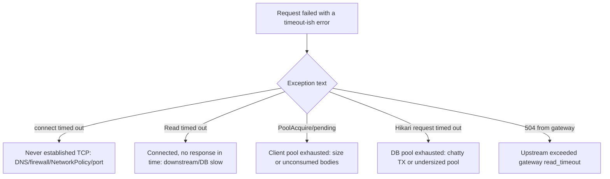
Naming the *exact* timeout that fired collapses the search space immediately — it tells you whether you never connected, connected-but-waited, or couldn't even get a client/connection slot to start.

### D.6 HTTP status emitter fingerprints (expanded)

| Header / body trait | Emitter | Note |
|---------------------|---------|------|
| `Server: kong/3.x` | Kong | gateway-level decision |
| `X-Kong-Upstream-Latency` present | Kong | shows upstream was reached |
| `X-Kong-Upstream-Latency` absent on 4xx/5xx | Kong | Kong rejected before reaching upstream (plugin) |
| `WWW-Authenticate: Bearer error=...` | resource server / Kong OIDC | token problem detail in `error_description` |
| `{"timestamp","status","error","path"}` | Spring Boot whitelabel | app-level |
| `{"type","title","status","detail"}` (RFC 7807) | Spring `ProblemDetail` | app with `@RestControllerAdvice` |
| nginx HTML error page | Ingress nginx / nginx upstream | not your app |
| empty body + connection closed | upstream crash / proxy reset | check pod + proxy logs |

### D.7 Banking authorization mental model

There are three distinct questions, often conflated:
1. **Authentication** — *who are you?* (valid JWT) → 401 if it fails.
2. **Authorization (coarse)** — *are you allowed this endpoint?* (role/scope) → 403.
3. **Authorization (fine / data-level)** — *are you allowed this specific account/record?* (ownership, tenant, limits) → 403/404.

The third is the one teams forget: a valid `customer` token with the `accounts:read` scope is correctly authenticated and coarsely authorized, but must *still* be prevented from reading *someone else's* account. Enforce data-level checks (`@PostAuthorize`, repository-level tenant filters, ownership checks) — never assume the coarse role is enough. A missing data-level check is a serious banking vulnerability (horizontal privilege escalation / IDOR), not just a bug.

### D.8 A minimal, safe outbound-call template (copy this everywhere)

Every synchronous outbound call in a banking service should have, at minimum:
- connect timeout (fast, e.g. 2s) and read timeout (bounded, e.g. 3–5s);
- a pooled, reused client (never per-request);
- a concurrency cap / bulkhead per downstream;
- a circuit breaker with a *safe* fallback (fail-closed for money operations);
- correlation-id + appropriate identity (user vs service token) propagated;
- **no retries on non-idempotent writes** (or retries only with an idempotency key);
- jitter on any retry;
- structured error decoding (don't swallow downstream error semantics).

If a call is missing any of these, it's a latent incident. Treat this list as a code-review checklist for every new client.

---

*End of handbook. Keep it next to your terminal during incidents; extend the playbooks (§25), the lookup table (§24), and the war stories (Appendix C) with every new incident you resolve — a runbook is only as good as its last post-mortem.*


