# System Design Foundations and Building Blocks

> **Who this is for:** A Java / Spring Boot developer with 3+ years of experience who can build a service, wire up a database, and ship a REST API — but wants to understand *why* large systems are built the way they are, *how* they fail, and *how* to reason about them like a distributed-systems engineer.
>
> **What this is not:** This is not an interview cheat sheet. There are no "memorize these 10 numbers" tables divorced from meaning. Every concept is built from a problem, broken under load, and repaired — so the knowledge survives past the interview and becomes intuition.

---

## How to read this document

Every major concept follows the same eight-beat rhythm. Internalize the rhythm and you can analyze *any* system, even ones not covered here:

1. **Problem** — what real need forces this to exist?
2. **Naive solution** — what does a junior engineer build first?
3. **Scaling failure** — where and why does the naive version break?
4. **Improved design** — what do engineers actually do?
5. **Tradeoffs** — what did we pay to get the improvement?
6. **Production concerns** — what bites you at 3 AM?
7. **Interview perspective** — how to talk about it crisply.
8. **Mental model** — the one-sentence picture to keep in your head.

Diagrams use [Mermaid](https://mermaid.js.org/). Every diagram is explained line-by-line, because a diagram you can't narrate is a diagram you don't understand.

A recurring theme: **a single-server program and a distributed system are different *kinds* of things, not the same thing at different sizes.** The moment your computation spans more than one machine connected by a network, new laws of physics apply: messages get lost, clocks disagree, and "is the other node down or just slow?" becomes an unanswerable question. Most of system design is coping with that one brutal fact.

---

# PART 1 — THE SYSTEM DESIGN METHODOLOGY

## Why a methodology at all?

**Problem.** You're asked "Design Twitter." A blank page. The temptation is to immediately start drawing boxes — "we'll have a user service, a tweet service, a Redis cache..." This is the single most common failure mode. You're optimizing a solution before you understand the problem. You'll design for 100 users when they meant 500 million, or build strong consistency when eventual consistency was fine, or spend 20 minutes on the login flow when the interesting part is the timeline fan-out.

**Naive approach.** Jump straight to architecture. Draw what you've seen in blog posts. Hope it matches what they wanted.

**Improved approach.** Follow a disciplined funnel that goes from *fuzzy human need* → *measurable requirements* → *numbers* → *architecture* → *deep dive on the hard part* → *honest tradeoffs* → *what happens at 10×*. Each stage feeds the next. The numbers from capacity estimation tell you where the bottleneck is; the bottleneck tells you what to deep-dive; the deep-dive surfaces tradeoffs; the tradeoffs frame the scaling discussion.

Here is the funnel as a diagram:

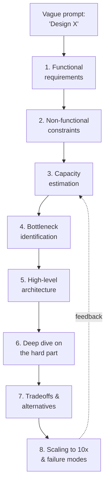

**Reading the diagram line by line:**
- `A --> B`: We never start at architecture. The first arrow forces you from the vague prompt into concrete functional requirements (what the system *does*).
- `B --> C`: Once you know what it does, you pin down the qualities it must have (how fast, how available, how consistent).
- `C --> D`: Constraints are useless without numbers; capacity estimation turns "lots of users" into "40,000 requests per second."
- `D --> E`: Numbers reveal the bottleneck — the one resource (storage, fan-out, bandwidth) that will break first.
- `E --> F`: Only now do we draw boxes — and we draw them aimed at the bottleneck.
- `F --> G`: We pick the *one* hardest component and go deep, because breadth without depth signals shallow understanding.
- `G --> H`: Every deep design choice traded something away; we name what.
- `H --> I`: Finally we stress the design — what breaks at 10× traffic, and what fails when a machine dies.
- The dotted `I -.feedback.-> D`: scaling discussions often send you back to re-estimate. The funnel is iterative, not strictly linear.

Let's walk each stage.

---

## Stage 1 — Requirements clarification (functional)

**What it is.** Pin down exactly *what the system must do*, expressed as user-visible behaviors. For "Design Twitter," functional requirements might be: post a tweet, follow users, view a home timeline, view a user's profile timeline. Notably *excluded* (to keep scope sane): DMs, trending topics, ads, search — unless the interviewer says otherwise.

**Why it matters.** Scope is the enemy. A system that does three things well is designable in 45 minutes; a system that does fifteen things is not. The act of saying "I'll focus on posting and timeline, and treat DMs as out of scope — is that okay?" demonstrates judgment. It also protects you: you can't be faulted for not designing what you explicitly scoped out.

**How to do it.** Ask questions and propose answers; don't interrogate. Good clarifying questions:
- "Is this read-heavy or write-heavy?" (Twitter: massively read-heavy.)
- "Do all users see the same content, or is it personalized?" (Personalized → fan-out problem.)
- "How fresh must the timeline be — is a few seconds of delay acceptable?" (Almost always yes → enables caching/async.)

**Anti-pattern.** Listing 12 features and trying to design them all. **Mental model:** *You're a product surgeon — cut scope to the smallest thing that's still interesting.*

---

## Stage 2 — Non-functional constraints

**What it is.** The *qualities*, not the features. These are the dials that actually determine your architecture:

| Constraint | The question it answers | Why it changes your design |
|---|---|---|
| **Availability** | What % uptime? 99.9%? 99.99%? | Higher availability → redundancy, multi-region, more $$$ |
| **Latency** | p50 / p99 response time targets? | Tight latency → caching, edge, denormalization |
| **Consistency** | Must reads always reflect the latest write? | Strong consistency limits scaling & availability (CAP) |
| **Durability** | Can we ever lose data? | High durability → replication, fsync, backups |
| **Scale** | Users, growth rate, peak vs average | Drives sharding, capacity, cost |
| **Read/write ratio** | 10:1? 1000:1? | Read-heavy → caches & replicas; write-heavy → partitioning & queues |

**Why it matters.** *Functional requirements rarely differentiate two designs; non-functional ones always do.* "Post a tweet" looks the same whether you have 100 or 100 million users. The constraint "500M users, read:write of 1000:1, p99 < 200ms" is what forces a completely different architecture.

**Key insight — latency is a distribution, not a number.** "Average latency 50ms" can hide a horrifying p99 of 3 seconds. Always reason in **percentiles**. p99 means 1 in 100 requests is at least this slow. At scale, p99 is not rare — if a page makes 100 backend calls, the *probability that at least one hits the p99 tail* is `1 - 0.99^100 ≈ 63%`. So **the tail is the typical user experience** for any fan-out-heavy page. This single realization reshapes how senior engineers think.

**Mental model:** *Functional requirements decide what you build; non-functional constraints decide how you build it.*

---

## Stage 3 — Capacity estimation

This gets a full masterclass in Part 2. For the methodology: the goal here is to produce 3–5 numbers that *locate the bottleneck*. You want:
- **Requests per second** (average and peak).
- **Storage growth** per day / per year.
- **Bandwidth** in and out.
- **Memory** needed to cache the hot set.

You do *not* need precision. You need order of magnitude. Is it 1,000 QPS or 1,000,000 QPS? That difference changes everything; whether it's 40,000 or 60,000 changes nothing.

**Mental model:** *Estimation is a flashlight, not a ruler — you're finding the bottleneck in the dark, not measuring it to the millimeter.*

---

## Stage 4 — Bottleneck identification

**What it is.** From your numbers, name the single resource that breaks first. Examples:
- Twitter timeline → **fan-out** (a celebrity with 100M followers posting once creates 100M timeline writes).
- YouTube → **storage and egress bandwidth** (video is huge; serving it is the cost).
- A stock-trading matching engine → **latency and ordering** (microseconds and strict sequence matter).
- A URL shortener → **read QPS and key-space** (tiny data, enormous read volume).

**Why it matters.** The bottleneck tells you what to deep-dive (Stage 6) and what to ignore. If you don't name it, you'll spend equal effort on every box, which means you spent too little on the one that matters.

**Mental model:** *Every system has exactly one thing that will kill it first. Find it before you design around it.*

---

## Stage 5 — High-level architecture

**What it is.** Now — and only now — draw boxes: clients, load balancer, services, datastores, caches, queues. Keep it to ~6–8 boxes. Show the *request path* for your main use cases.

A generic, defensible starting skeleton for a read-heavy web system:

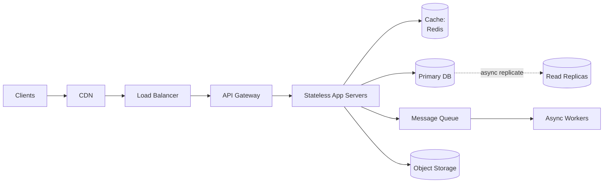

**Reading line by line:**
- `Client --> CDN`: static assets and cacheable responses are served from the edge, close to users, never touching your origin.
- `CDN --> LB`: cache misses and dynamic requests fall through to a load balancer that spreads traffic across servers.
- `LB --> APIGW`: the gateway centralizes auth, rate limiting, and routing so individual services don't reimplement them.
- `APIGW --> SVC`: stateless app servers do the work. *Stateless* is critical — any server can handle any request, so you scale by adding more.
- `SVC --> Cache`: the hot path checks the cache first to avoid hitting the database.
- `SVC --> DBp` and `DBp -. async replicate .-> DBr`: writes go to the primary; reads can be served from replicas that lag slightly behind.
- `SVC --> Q --> W`: slow or non-urgent work (sending email, fan-out, image processing) is pushed to a queue and done by workers asynchronously, keeping the request path fast.
- `SVC --> Blob`: large binary objects (images, video) live in object storage, not the database.

This skeleton is your "default starting point." You adapt it to the bottleneck — e.g., for YouTube the `Blob` and `CDN` boxes dominate; for a trading engine you'd delete the queue and obsess over `SVC`.

**Mental model:** *Stateless compute in the middle, state pushed to the edges (caches, databases, blob stores, queues) where it can be specialized.*

---

## Stage 6 — Deep dive

**What it is.** Pick the bottleneck component and design it in detail. For Twitter, you'd deep-dive the timeline: do you **fan-out on write** (push each tweet into every follower's precomputed timeline) or **fan-out on read** (assemble the timeline on demand)? The answer is "a hybrid — fan-out on write for normal users, fan-out on read for celebrities" — and explaining *why* (the celebrity write amplification problem) is what separates a strong candidate.

**Why it matters.** Interviews and real reviews both reward *depth on the hard part*. Anyone can say "add a cache." Knowing *which* cache pattern, *how* invalidation works, and *what* happens on a cache stampede is the actual skill.

**Mental model:** *Breadth shows you've seen systems; depth shows you've built them. Spend your time where the difficulty is.*

---

## Stage 7 — Tradeoffs

**What it is.** Explicitly name what each choice cost. Every decision in distributed systems is a trade, never a pure win:
- Caching → faster reads, but stale data and invalidation complexity.
- Replication → higher availability and read throughput, but replication lag and possible stale reads.
- Sharding → horizontal scale, but cross-shard joins/transactions become painful.
- Async/queues → responsive, resilient, but eventual consistency and harder debugging.

**Why it matters.** The phrase that marks a senior engineer is *"it depends, and here's what it depends on."* Stating tradeoffs proves you understand that you didn't get something for nothing.

**Mental model:** *There are no solutions in distributed systems, only tradeoffs. Name your price.*

---

## Stage 8 — Scaling & failure-mode discussion

**What it is.** Two questions: "What breaks at 10× traffic?" and "What happens when component X dies?" Walk through each box: if the cache node dies, do we stampede the DB? If a region goes down, do we fail over? If the queue backs up, do we shed load or fall over?

**Why it matters.** Real systems live in a world of partial failure (Part 3). A design that only works when everything is healthy is a design that doesn't work. **Mental model:** *Assume every component is already on fire; design for the fire, not the demo.*

---

# PART 2 — CAPACITY ESTIMATION MASTERCLASS

## Why estimate at all?

**Problem.** Without numbers, you can't tell whether one database is enough or you need a thousand shards. "Design Instagram" is unanswerable until you know it's ~500M daily active users uploading ~100M photos a day — *then* the storage math forces an architecture.

**Mental model up front:** *Estimation converts adjectives ("huge", "fast", "popular") into nouns with units (TB/day, requests/sec, Gbps). Architecture follows units, not adjectives.*

---

## The vocabulary: QPS, RPS, TPS

These three are often conflated; the distinction matters in interviews.

- **RPS — Requests Per Second.** Raw count of HTTP (or RPC) requests hitting your servers. A single page load might be 1 navigation request + 30 asset requests = 31 RPS worth of load from one user action.
- **QPS — Queries Per Second.** Usually means queries hitting the *database* (or a query layer). One request can fan out into many queries (N+1 problem!) — so QPS is often *higher* than RPS at the DB tier, or lower if caching absorbs most reads.
- **TPS — Transactions Per Second.** Business-level operations, often involving multiple steps that must succeed or fail together (e.g., a payment = debit + credit + ledger write). TPS is the unit that matters for OLTP systems like banks.

**Why the distinction matters:** a system at 10,000 RPS with aggressive caching might only hit the DB at 500 QPS — but a poorly designed one with N+1 queries might generate 100,000 QPS from the same 10,000 RPS and melt the database. *The translation factor between these numbers is itself a design decision.*

---

## The estimation toolkit

You need only a few reference numbers and the willingness to round aggressively.

**Time, rounded for mental math:**
- 1 day ≈ 86,400 seconds ≈ **100,000 seconds** (round up; it gives margin).
- 1 month ≈ 2.5 million seconds. 1 year ≈ 30 million seconds.

**Latency numbers every engineer should know (orders of magnitude, 2020s hardware):**

| Operation | Rough latency | Relative |
|---|---|---|
| L1 cache reference | ~1 ns | 1× |
| Main memory (RAM) reference | ~100 ns | 100× |
| SSD random read | ~100 µs | 100,000× |
| Round trip within a datacenter | ~500 µs | 500,000× |
| Disk (HDD) seek | ~10 ms | 10,000,000× |
| Round trip across continents | ~150 ms | 150,000,000× |

**Why memorize the shape (not the digits):** the gaps are what matter. RAM is ~1000× faster than SSD; a cross-continent round trip is ~300× slower than an in-datacenter one. This is *why* caching works (RAM ≫ disk) and *why* CDNs exist (local ≫ cross-ocean). You don't quote these to impress; you use them to justify "we cache in RAM because hitting disk is 1000× slower."

**Powers of two for storage:**
- 2^10 = 1 thousand = KB
- 2^20 = 1 million = MB
- 2^30 = 1 billion = GB
- 2^40 = 1 trillion = TB
- 2^50 = PB

---

## Worked example 1 — Twitter-scale timeline

**Given (assume / clarify):** 300M monthly active users, 50% daily active = 150M DAU. Average user posts twice a day. Read:write ratio ~ 100:1.

**Write QPS:**
- Tweets/day = 150M × 2 = 300M tweets/day.
- Tweets/sec = 300M / 100,000 sec ≈ **3,000 writes/sec** average.
- Peak is typically 2–3× average → **~9,000 writes/sec** peak. (Always compute peak; systems are sized for peak, not average.)

**Read QPS:**
- 100:1 ratio → ~300,000 reads/sec average, ~1M/sec peak. *This is the number that dominates the design* — it's why Twitter is a read-optimization problem, solved with precomputed timelines and caching.

**Storage per year:**
- A tweet: ~300 bytes (text + metadata), round to ~1 KB with indexing overhead.
- 300M tweets/day × 1 KB = 300 GB/day.
- × 365 ≈ **~110 TB/year** of tweet text. Trivial for object storage; the *fan-out* is the hard part, not the raw bytes.

**The insight the numbers hand you:** writes are cheap (3K/sec), reads are brutal (300K/sec), text storage is small. Therefore: **precompute timelines on write, cache aggressively, and the bottleneck is fan-out amplification from celebrities** — not storage, not write throughput.

---

## Worked example 2 — Instagram / photo storage

**Given:** 500M DAU, each uploads 0.2 photos/day on average. Average photo 1.5 MB (plus thumbnails).

**Upload write rate:** 500M × 0.2 = 100M photos/day = 100M / 100,000 ≈ **1,000 uploads/sec** average, ~3,000 peak.

**Storage growth:**
- Raw: 100M × 1.5 MB = 150 TB/day.
- With multiple resized variants (thumb, medium, full) say ~2× → **~300 TB/day** → **~110 PB/year**.

**The insight:** this is a **storage and bandwidth** problem, not a compute problem. You cannot put 100 PB in a relational DB. Architecture forced: **object storage (S3) for blobs + CDN for serving + a metadata DB** that stores only the small rows (who, when, URL, captions). The photos never touch your application database. This is the single most important lesson photos teach: *separate large immutable blobs (object store + CDN) from small mutable metadata (database).*

---

## Worked example 3 — Bandwidth for video streaming

**Given:** 1M concurrent viewers, average stream 5 Mbps (1080p).

**Egress bandwidth:** 1M × 5 Mbps = 5,000,000 Mbps = 5 Tbps.

**The insight:** 5 Tbps is far beyond what any single datacenter link or origin can serve. This *mathematically forces* a CDN with thousands of edge nodes — there is no other option. The number doesn't suggest a CDN; it *proves* you must have one. (This is the power of estimation: it turns "we should probably use a CDN" into "the physics require a CDN.")

---

## Worked example 4 — Cache memory sizing

**Question:** How much RAM to cache the hot set of a read-heavy system?

Use the **80/20 rule**: ~20% of items get ~80% of traffic; often it's more extreme (1% → 90%). For Twitter timelines: if a timeline cache entry is ~10 KB and you cache the most active 20% of 150M DAU = 30M timelines × 10 KB = **300 GB**. That's a few Redis nodes — entirely feasible, and it's why caching the hot set (not all data) is the move.

**Mental model for all estimation:** *Pick a per-unit size, multiply by rate, multiply by time, then ask "which of QPS / storage / bandwidth / memory is the scary one?" That scary one is your bottleneck.*

---

# PART 3 — DISTRIBUTED SYSTEMS FUNDAMENTALS

This is the conceptual heart of the document. Everything in later parts is an application of these ideas. Read slowly.

## The foundational truth

A program on one machine has a comforting property: it either works or the whole machine is dead. There is no in-between. The moment you split work across machines connected by a network, you lose that comfort and gain the central difficulty of the field:

> **You cannot distinguish a slow node from a dead node from a slow network.** A message that hasn't arrived might arrive in one more millisecond, or never. You must act without knowing which.

Everything below is a consequence of, or a coping mechanism for, that one fact.

---

## Concurrency vs. parallelism

**Problem.** These words are used interchangeably in casual talk, but they're different, and the difference matters for design.

**Definitions made concrete:**
- **Concurrency** is *dealing with* many things at once — a structure of your program where multiple tasks are *in progress* and interleaved. A single-core CPU running 100 threads is concurrent (it switches between them) but not parallel.
- **Parallelism** is *doing* many things at once — literally simultaneous execution on multiple cores/machines.

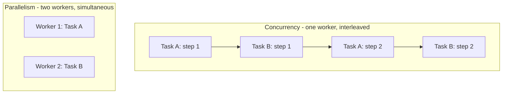

**Reading the diagram:**
- The **Concurrency** block shows one worker time-slicing: it does a step of A, then a step of B, then back to A. Progress on both, but never literally at the same instant. This is what a Spring Boot app does with one CPU and a thread pool handling many requests — it interleaves while waiting on I/O.
- The **Parallelism** block shows two independent workers each fully executing a task at the same wall-clock moment. This needs multiple cores or machines.

**Why a Java dev should care.** Your Spring app is concurrent by default (the servlet thread pool). It becomes parallel when it runs on multiple cores or, at system scale, multiple instances behind a load balancer. **Concurrency is a correctness concern** (race conditions, locks, the `synchronized` keyword, `ConcurrentHashMap`); **parallelism is a throughput concern** (more cores/machines = more simultaneous work). You can have concurrency bugs even with zero parallelism (interleaving on one core can still corrupt shared state).

**Tradeoff.** Concurrency adds complexity (synchronization, deadlocks, race conditions) in exchange for using a single machine efficiently while it waits on I/O. Parallelism adds coordination cost (data must be split, results merged) in exchange for raw speed.

**Mental model:** *Concurrency is a juggler with one pair of hands keeping many balls in the air. Parallelism is many jugglers. Most servers are jugglers; scaling adds more jugglers.*

---

## Latency vs. throughput

**Problem.** People conflate "fast." There are two independent dimensions:
- **Latency** = time for *one* operation (how long the user waits).
- **Throughput** = operations *per unit time* (how much total work).

They trade off and can move in opposite directions. **Batching** improves throughput (amortize overhead over many items) but *worsens* latency (each item waits for the batch to fill). A highway analogy: latency is how long *your* trip takes; throughput is how many cars cross the bridge per minute. Adding lanes raises throughput; it doesn't make your individual car faster.

**Production reality.** A queue can have great throughput and terrible latency simultaneously — items zip through once dequeued, but they sat in line for 30 seconds. Always specify *which* you're optimizing.

**Mental model:** *Latency is the experience of one user; throughput is the capacity of the system. They are not the same axis.*

---

## Partial failure — the defining problem

**Problem.** In a single process, failure is total and observable: an exception, a crash. In a distributed system, **some parts work while others don't, and you may not know which.** Service A calls service B. B times out. Did B:
1. Never receive the request?
2. Receive it, process it (e.g., charged the credit card), but the *response* got lost?
3. Crash mid-processing?

A and B-failed-before-doing-work mean "safe to retry." B-succeeded-but-reply-lost means "retrying double-charges the customer." **You cannot tell these apart from the caller's side.** This single ambiguity is why distributed systems are hard.

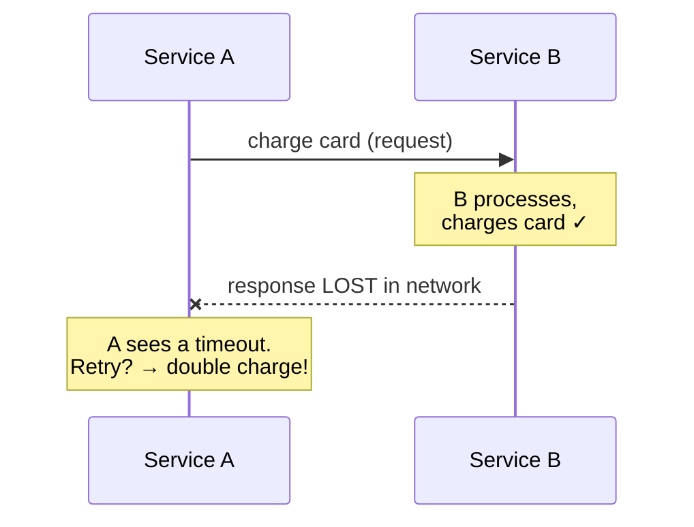

**Reading the diagram:**
- `A->>B: charge card`: A sends the request.
- `Note over B`: B *successfully* charges the card.
- `B--xA: response LOST`: the `x` marks a dropped message — B's "success" reply never reaches A.
- `Note over A`: A only sees silence/timeout. From A's view this is indistinguishable from "B never got the request." If A retries, the card is charged twice.

**Improved design — idempotency.** The fix is to make operations **idempotent**: doing them twice has the same effect as doing them once. Attach a unique **idempotency key** to each request; B records processed keys and ignores duplicates. Now retrying is safe. This is *the* foundational pattern for reliable distributed communication, and it's why payment APIs (Stripe, etc.) require an idempotency key.

**Tradeoff.** Idempotency requires storing and checking keys (state + lookups), and defining what "same operation" means. The cost is real but the alternative (double charges, duplicate orders) is unacceptable.

**Mental model:** *In a distributed system, "did it work?" is often unanswerable. Design so the answer doesn't matter — make retries safe.*

---

## Network partitions

**Problem.** A **network partition** is when the network splits the cluster into groups that can't talk to each other, even though every node is alive and healthy. The nodes on each side see the *other* side as "down" — but it isn't; it's just unreachable. Both sides may keep serving requests, and now you have two groups making decisions independently.

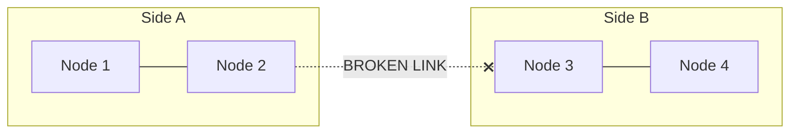

**Reading the diagram:**
- Nodes 1–2 can talk to each other; nodes 3–4 can talk to each other.
- The `BROKEN LINK` between N2 and N3 (marked `x`) is the partition. Each side is internally healthy but blind to the other.
- The danger: if both sides accept writes, they diverge ("split-brain"). When the partition heals, whose data wins?

**Why it matters.** Partitions are not exotic — they happen from switch failures, misconfigured firewalls, overloaded links, even long GC pauses (a node that pauses for 30 seconds looks partitioned). **You cannot prevent partitions; you can only choose how to behave during one.** That choice is the heart of the CAP theorem (Part 7): during a partition, do you stay *available* (let both sides serve, risk inconsistency) or *consistent* (refuse writes on the minority side, sacrifice availability)?

**Production fix — quorums.** A common approach: require a **majority (quorum)** to make decisions. With 5 nodes, you need 3 to agree. During a partition, at most one side can have a majority, so only that side proceeds; the minority side refuses. This prevents split-brain at the cost of the minority being unavailable.

**Mental model:** *A partition is the universe forcing you to choose between "wrong but available" and "correct but offline." There is no third option during the partition itself.*

---

## Availability

**Problem.** "Is the system up?" measured rigorously: the fraction of time it can serve requests successfully.

**The nines:**

| Availability | Downtime per year | Downtime per day |
|---|---|---|
| 99% ("two nines") | ~3.65 days | ~14 min |
| 99.9% ("three nines") | ~8.7 hours | ~1.4 min |
| 99.99% ("four nines") | ~52 minutes | ~8.6 sec |
| 99.999% ("five nines") | ~5.25 minutes | ~0.86 sec |

**The brutal multiplication rule.** If your request passes through 5 independent services each at 99.9%, your end-to-end availability is `0.999^5 ≈ 99.5%` — *worse than any single component.* Availability of a serial chain is the *product* of its parts, so it only goes down as you add dependencies.

**Improved design.** Two levers:
1. **Redundancy** (parallel, not serial): two replicas each at 99% give `1 - (0.01 × 0.01) = 99.99%` *if* either can serve the request. Redundancy in parallel *multiplies the failure probabilities* (good); dependencies in series *multiply the success probabilities* (bad).
2. **Reduce the dependency chain** and make dependencies *optional* (degrade gracefully — if the recommendations service is down, show the page without recommendations rather than failing the whole page).

**Production concern.** Each extra "nine" is exponentially more expensive (more redundancy, more regions, more on-call rigor). You buy availability you actually need, not the maximum. A photo-sharing app at 99.9% is fine; a payment processor needs more.

**Mental model:** *Availability multiplies down a chain and multiplies up through redundancy. Short chains + parallel redundancy + optional dependencies = uptime.*

---

## Consistency

**Problem.** When data is replicated across machines, *which* value does a reader see — the latest write, or a stale copy? "Consistency" names where you sit on that spectrum. (This is a different "consistency" from the C in ACID — here we mean *replica consistency*.)

**The spectrum (strongest to weakest):**
- **Linearizable / strong consistency:** every read sees the most recent write, as if there were a single copy. Behaves like one machine. Expensive: requires coordination (quorum reads/writes or consensus), adds latency, and is unavailable during partitions.
- **Causal consistency:** operations that are causally related are seen in order by everyone (if you reply to a comment, no one sees your reply before the comment). Unrelated operations may be seen in different orders. A pragmatic middle ground.
- **Eventual consistency:** if writes stop, all replicas *eventually* converge. In the meantime, reads may be stale. Cheap, highly available, but you might read your own write and not see it.

**Concrete example — "read your own writes."** You update your profile photo. The write hits the primary. You refresh, the read hits a replica that hasn't caught up yet, and you see the *old* photo. Infuriating. The fix: route a user's reads to the primary (or to a replica known to be caught up) for a short window after their write — a targeted strengthening called *read-your-writes consistency*.

**Tradeoff.** Stronger consistency costs latency and availability; weaker consistency costs correctness guarantees and developer sanity (you must reason about stale reads everywhere). **Most of the internet runs on eventual consistency** because for likes, view counts, and timelines, "stale by a second" is invisible to users. Money, inventory, and bookings demand stronger guarantees.

**Mental model:** *Consistency is "how recent is the truth I'm allowed to see?" Strong = always the latest (slow, fragile under partition); eventual = maybe a bit old (fast, robust).*

---

## Durability

**Problem.** Once a system says "saved," is the data *really* safe — surviving crashes, power loss, disk failure?

**The gotcha:** acknowledging a write into RAM is fast but not durable — pull the power and it's gone. True durability means the data is on persistent storage and (for safety) **replicated** to other machines/disks, because a single disk *will* eventually fail.

**Design levers:**
- **fsync** the data to disk before acknowledging (slower, but survives process crash).
- **Replicate** to N machines before acknowledging (survives single-machine/disk loss). "Write to 3 replicas, ack after 2 confirm" is a common durability/latency balance.
- **Backups / snapshots** to defend against logical corruption and "delete everything" bugs (replication faithfully replicates your mistakes!).

**Tradeoff — durability vs. latency.** Every durability guarantee costs time. Acking after fsync + 2 replicas is much slower than acking from RAM. You tune this per workload: a bank ledger acks slowly and safely; a "user is typing…" indicator can live entirely in RAM and be lost freely.

**Production concern.** Durability ≠ availability ≠ consistency. You can have durable-but-stale (data is safe on a replica that's behind) or available-but-not-durable (serving from RAM cache while the write hasn't been persisted). Reason about them separately.

**Mental model:** *Durability is "if everything loses power right now, is the data still there when it comes back?" RAM says no; replicated disk says yes.*

---

## Fault tolerance — tying it together

**Problem.** Given that components *will* fail (partial failure, partitions, crashed disks), how does the system keep working?

**Core techniques, each a coping mechanism for an earlier concept:**

| Technique | Copes with | How |
|---|---|---|
| **Redundancy / replication** | Machine & disk failure | Keep N copies; survive losing some |
| **Idempotency** | Lost responses, retries | Make repeats harmless |
| **Timeouts** | Slow/dead nodes | Don't wait forever; fail fast |
| **Retries with backoff** | Transient failures | Try again, but spaced out to avoid overload |
| **Circuit breakers** | Cascading failure | Stop calling a failing service; let it recover |
| **Bulkheads** | Resource exhaustion | Isolate failures so one bad dependency can't sink everything |
| **Graceful degradation** | Optional-dependency outage | Serve a reduced experience instead of failing |

**The cascading failure story (why this matters).** Service B slows down. Service A's calls to B pile up, holding threads. A's thread pool exhausts. Now A is down too, and *its* callers pile up. One slow service takes down the whole system through **back-pressure and resource exhaustion**. This is how most large outages actually unfold — not a single dramatic failure, but a slow component dragging everyone into its grave.

The fixes form a layered defense:
- **Timeout**: A stops waiting on B after, say, 200ms — frees the thread.
- **Circuit breaker**: after B fails N times, A *stops calling B entirely* for a cooldown, instantly failing those calls (and serving a fallback). This lets B recover instead of being hammered while it's down.
- **Bulkhead**: A uses a *separate, bounded* thread pool per dependency, so B's slowness can only exhaust B's pool, not A's entire capacity.

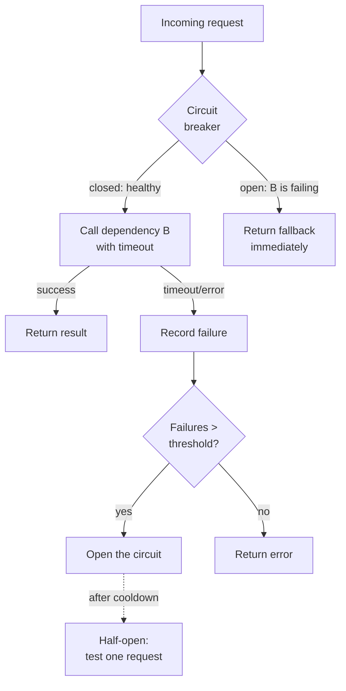

**Reading the diagram:**
- `Req --> CB`: every call first consults the circuit breaker's state.
- `CB -->|closed|`: when healthy ("closed" = current flows), the call proceeds with a timeout.
- `CB -->|open|`: when the breaker has "tripped" (open = no current), calls short-circuit to a fallback *without even trying* B — protecting both A (no piled-up threads) and B (no extra load while recovering).
- `Call -->|timeout/error| --> Count --> Trip`: failures are counted; crossing a threshold trips the breaker `Open`.
- `Open -.after cooldown.-> HalfOpen`: after a cooldown the breaker lets *one* test request through; if it succeeds the circuit closes again, if it fails it re-opens. This is the self-healing mechanism.

**Java connection.** Resilience4j (the modern successor to Hystrix) implements exactly these: `@CircuitBreaker`, `@Bulkhead`, `@Retry`, `@TimeLimiter`. Now you know *why* they exist, not just *how* to annotate.

**Mental model:** *Fault tolerance is assuming the fire is already burning. Timeouts stop you from holding a dead phone; circuit breakers stop you from redialing a corpse; bulkheads keep one fire in one room.*

---

# PART 4 — SYSTEM DESIGN BUILDING BLOCKS

These are the reusable Lego bricks. Master them and most architectures become "which bricks, arranged how?" Each follows the full eight-beat rhythm.

## 4.1 Load Balancers

**Problem.** One server has a ceiling — finite CPU, memory, connections. Past that, requests queue and latency explodes. You need many servers, but clients only know one address. *Something* must spread incoming traffic across the fleet and stop sending traffic to dead servers.

**Naive solution.** DNS round-robin: return a different server IP per DNS lookup. It "works" but has no health awareness (it'll happily hand out a dead server's IP), DNS caching makes changes slow to propagate, and it can't balance by actual load.

**Improved design — a real load balancer.** A dedicated component sits in front of the fleet, receives every request, and forwards it to a healthy backend using a balancing algorithm:
- **Round-robin** — next server in rotation. Simple, ignores load.
- **Least connections** — server with fewest active connections. Better when request durations vary.
- **Least response time** — fastest-responding server. Adapts to slow nodes.
- **Consistent hashing** — same client/key → same server (needed for sticky sessions or cache locality; see Part 6).

It also runs **health checks** (periodic pings); a server that fails them is pulled from rotation automatically.

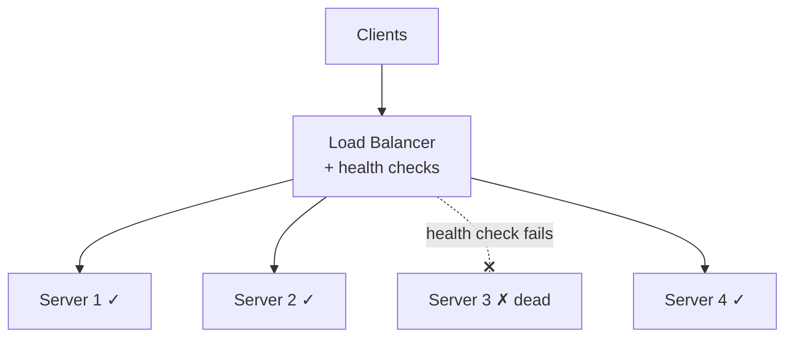

**Reading the diagram:**
- All clients hit one stable endpoint, the `LB`.
- The LB fans requests to healthy servers (1, 2, 4).
- Server 3 failed its health check, so the LB stops routing to it (the `x` link) — users never notice it died. This is the load balancer doing double duty: *distribution* and *failover*.

**Layer 4 vs Layer 7 (a key distinction).**
- **L4 (transport)** load balancing routes by IP/port without looking inside the packet. Fast, cheap, protocol-agnostic, but dumb — it can't route based on URL or headers.
- **L7 (application)** load balancing reads HTTP — it can route `/api/*` to one fleet and `/images/*` to another, do SSL termination, and inspect headers. Smarter, slightly more overhead. Most web systems use L7 (e.g., NGINX, AWS ALB, Envoy); L4 (AWS NLB, LVS) is for raw throughput or non-HTTP traffic.

**Failure modes.**
- *The LB itself is a single point of failure.* Mitigated by running LBs in pairs/clusters with a floating virtual IP, or using a managed LB (AWS ELB) that's internally redundant.
- *Stale health checks*: a server passes the TCP health check but its app is broken (returns 500s). Use deep/application-level health checks, not just "is the port open?"
- *Uneven load*: round-robin to servers with long-lived connections (WebSockets) can pile up on a few nodes. Use least-connections.

**Tradeoffs.** Adds a network hop (latency) and a component to operate, in exchange for horizontal scalability and failover. L7 features cost CPU (parsing, TLS) vs L4's bare speed.

**Real production examples.** AWS ALB (L7) / NLB (L4), NGINX, HAProxy, Envoy (the data plane behind most service meshes), Google Maglev (their software LB handling enormous traffic).

**Interview perspective.** Say "I'll put an L7 load balancer with health checks in front of a stateless server fleet so I can scale horizontally and survive node failure." Mention the LB's own redundancy unprompted — it shows you remember the SPOF.

**Mental model:** *A load balancer is a maître d' who seats diners at open tables, skips the table where someone fainted, and never lets one waiter get swamped.*

---

## 4.2 Reverse Proxies

**Problem.** You want a single entry point in front of your backends that can do cross-cutting jobs — TLS termination, compression, caching, request buffering, hiding your internal topology — without each backend reimplementing them.

**Distinction from a load balancer (commonly confused).** A **forward proxy** sits in front of *clients* and represents them to the internet (corporate web filters, VPNs). A **reverse proxy** sits in front of *servers* and represents them to clients — the client thinks it's talking to one server but it's the proxy. A load balancer is *a kind of* reverse proxy whose main job is distribution; a reverse proxy is the broader category (NGINX is both, depending on config).

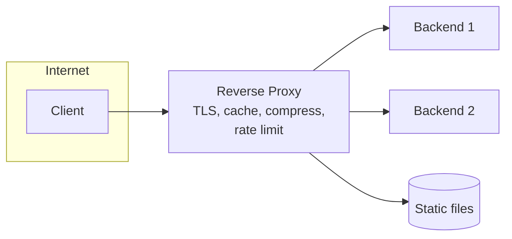

**Reading the diagram:**
- The client only ever sees the `RP`; backends' real addresses are hidden (security + flexibility to rearrange them).
- The RP terminates TLS once (backends speak plain HTTP internally), compresses responses, may serve cached or static content directly (`St`) without bothering a backend at all, and can enforce rate limits at the edge.

**Why it exists / what it buys you.**
- **TLS termination** in one place (certs managed centrally, backends simplified).
- **Caching** of responses so repeat requests skip the backend.
- **Compression** (gzip/brotli) offloaded from app servers.
- **Security**: hides internal IPs, can block bad requests, adds a chokepoint for WAF rules.
- **Request buffering**: absorbs slow clients so backends aren't tied up streaming to a phone on 3G.

**Failure modes & tradeoffs.** Same SPOF concern as LBs (run redundantly). Adds a hop. Caching at the proxy introduces staleness (invalidation problem again). But the centralization of cross-cutting concerns is usually well worth it.

**Real examples.** NGINX, Envoy, HAProxy, Apache httpd, Cloudflare (a giant distributed reverse proxy).

**Interview perspective.** Use it to explain *where* TLS termination, compression, and edge caching happen. Distinguish forward vs reverse proxy if asked — it's a classic clarifying question.

**Mental model:** *A reverse proxy is the building's front desk: visitors talk only to the desk, which checks IDs, handles deliveries, and quietly routes you to the right office without revealing the floor plan.*

---

## 4.3 Content Delivery Networks (CDNs)

**Problem.** Physics. A user in Sydney fetching from a server in Virginia eats ~200ms *each way* just for light-in-fiber round trips, before any processing. For images, JS, video — static bytes that don't change per user — making every user cross an ocean is wasteful and slow. (Recall Part 2: 5 Tbps of video egress is impossible from one origin anyway.)

**Naive solution.** Serve everything from your origin servers. Works for local users, miserable for distant ones, and your origin bandwidth bill is brutal.

**Improved design.** A **CDN** is a globally distributed network of edge servers (PoPs — Points of Presence) that cache your static content close to users. The user's request is routed (via DNS or anycast) to the *nearest* edge. On a cache hit, the edge serves the bytes locally — fast and cheap. On a miss, the edge fetches from your origin once, caches it, and serves everyone else from the edge.

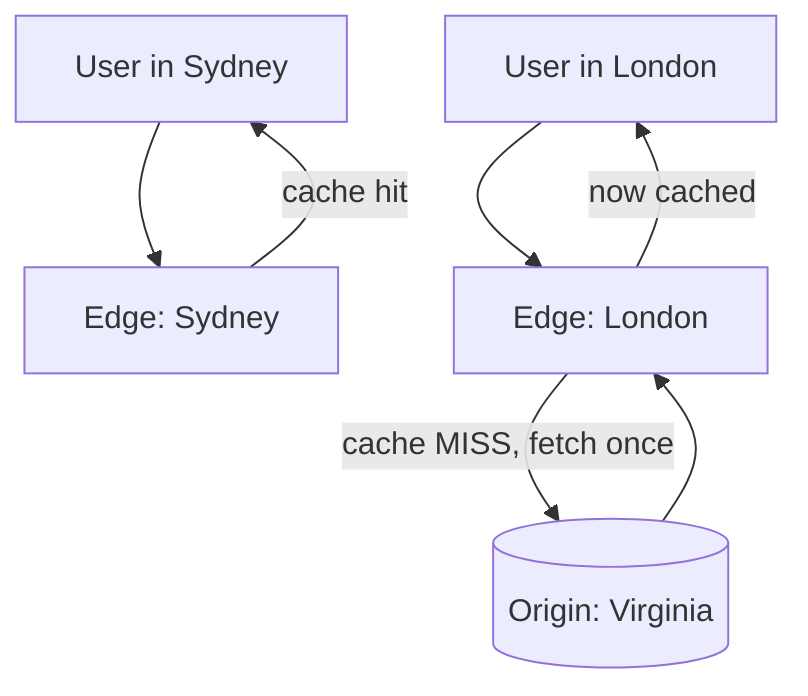

**Reading the diagram:**
- The Sydney user hits the Sydney edge and gets a `cache hit` — bytes served locally in ~10ms instead of ~400ms round trip to Virginia.
- The London user hits a `cache MISS`; the London edge fetches from the `Origin` *once*, caches it, and serves it. The next thousand London users get hits. The origin is shielded — it served one request, not a thousand.

**Why it matters beyond speed.** The CDN **absorbs the bulk of traffic and bandwidth**, so your origin only handles cache misses and dynamic requests. This is both a latency win and a massive cost/scale win — it's the only way video streaming or global software downloads are physically possible.

**Failure modes.**
- *Stale content*: you deploy v2 of `app.js` but edges still serve v1 until TTL expires. **Fix:** content-hashed filenames (`app.4f3a2b.js`) so a new version is a new URL — never stale; plus cache **purge/invalidation** APIs for emergencies.
- *Cache miss storms / thundering herd*: a popular new file expires everywhere at once, and all edges hit the origin simultaneously. **Fix:** request coalescing at the edge, staggered TTLs.
- *Edge outage*: a PoP goes down; traffic reroutes to the next-nearest (slower but working).

**Tradeoffs.** CDNs shine for static/cacheable content; they don't help (much) with personalized, per-user dynamic responses — though modern CDNs run *edge compute* (Cloudflare Workers, Lambda@Edge) to do light dynamic work at the edge. Cost is usage-based; invalidation adds operational complexity.

**Real examples.** Cloudflare, Akamai (the original), AWS CloudFront, Fastly, Google Cloud CDN.

**Interview perspective.** "Static assets and cacheable responses go through a CDN with content-hashed filenames for instant cache-busting." Mentioning the hashed-filename trick signals real-world experience.

**Mental model:** *A CDN is a chain of neighborhood warehouses. Instead of everyone driving to the one factory, the popular goods are pre-stocked nearby; only rare items make the long trip, and only once.*

---

## 4.4 Caches

(Full masterclass in Part 6; here's the building-block view.)

**Problem.** Your database is the slowest, most expensive, hardest-to-scale tier. Hitting it for every read — especially repeated reads of the same hot data — wastes its limited capacity and adds latency.

**Naive solution.** Read from the DB every time. Fine at low scale; at high read QPS the DB becomes the bottleneck (recall Twitter's 300K reads/sec — no single DB serves that).

**Improved design.** Put a fast in-memory store (Redis, Memcached) between the app and the DB. Check the cache first; on a hit, return immediately (sub-millisecond, RAM speed). On a miss, read the DB, populate the cache, return. Because RAM is ~1000× faster than disk and the hot set is small (80/20 rule), a cache absorbs the vast majority of reads.

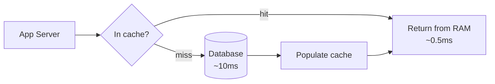

**Reading:** the app asks the cache first; a hit returns from RAM in well under a millisecond; a miss falls through to the DB, then *backfills* the cache so the next reader hits. A well-tuned cache hit rate of 90%+ means the DB only sees 10% of read traffic.

**Why it matters.** Caching is the highest-leverage single technique in read-heavy systems. It directly converts "DB is melting" into "DB is bored."

**Failure modes (detailed in Part 6):** stale data, cache stampede on expiry, hot keys overwhelming one node, and the avalanche when a cache layer dies and all traffic slams the DB.

**Tradeoffs.** Speed and DB-offload, paid for with **staleness** (the cache can lag the DB) and **invalidation complexity** ("there are only two hard things in computer science: cache invalidation and naming things").

**Real examples.** Redis, Memcached, Caffeine (in-process JVM cache — relevant to your Spring apps via `@Cacheable`), application-level CDN caching.

**Mental model:** *A cache is a sticky note on your monitor with the answer you keep looking up — instant, but it goes stale the moment the real answer changes and nobody updates the note.*

---

## 4.5 Databases

(Full masterclass in Part 5.)

**Problem.** You need to store data durably, query it, and keep it correct under concurrent access. This is the system's source of truth — the thing you most fear losing or corrupting.

**Building-block view.** A database gives you durability, querying, and (in SQL) transactions with ACID guarantees. As load grows you scale it in stages:
1. **Vertical scaling** — bigger machine. Simple, has a hard ceiling, expensive at the top.
2. **Read replicas** — copy the primary to N read-only replicas; route reads to them, writes to the primary. Scales *reads* (and adds availability), introduces *replication lag* (stale reads).
3. **Sharding (partitioning)** — split data across machines by a shard key (e.g., user_id). Scales *writes and storage*, but cross-shard queries/transactions become hard and rebalancing is painful.

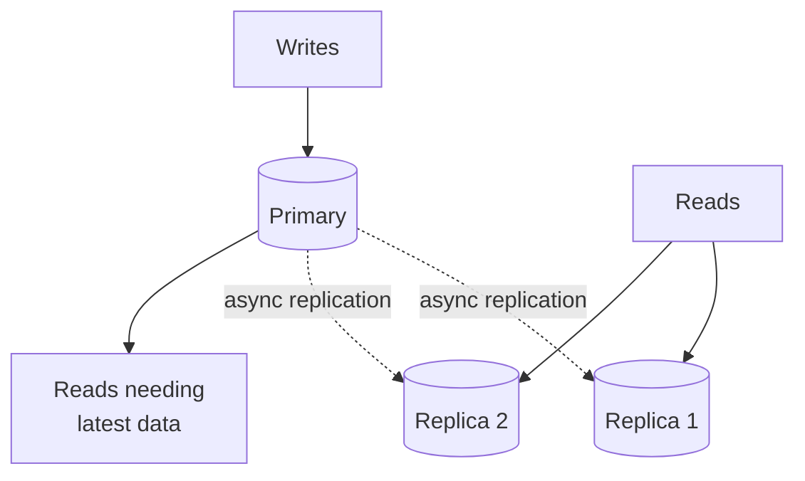

**Reading:** writes always go to the `Primary`; the primary asynchronously copies changes to `Replica 1` and `2`; most reads are served from replicas (scaling read capacity); reads that *must* see the latest write (e.g., read-your-writes) go to the primary. The `async` label is the source of replication lag — replicas are always a little behind.

**Failure modes.** Primary failure (need automated failover + replica promotion), replication lag causing stale reads, split-brain if two nodes both think they're primary (quorum/consensus prevents this), and the operational nightmare of resharding a live system.

**Tradeoffs.** Replicas trade consistency (lag) for read scale and availability. Sharding trades query power (no easy joins across shards) for write scale. SQL trades flexibility/scale for strong guarantees and rich queries; NoSQL the reverse (Part 5).

**Real examples.** PostgreSQL, MySQL (SQL); DynamoDB, Cassandra, MongoDB (NoSQL); Vitess (MySQL sharding), CockroachDB / Spanner (distributed SQL).

**Mental model:** *The database is the system's memory and conscience. You scale reads by cloning it, writes by splitting it, and you pay in consistency or query power for each.*

---

## 4.6 Message Queues

**Problem.** Synchronous coupling. When your checkout endpoint must, in-line, charge the card *and* send a confirmation email *and* update analytics *and* notify the warehouse, the user waits for the slowest of all of them, and if the email service is down, checkout fails — even though emailing isn't essential to placing an order.

**Naive solution.** Do everything synchronously in the request. Slow, fragile, and tightly coupled: a hiccup in any downstream takes down the user-facing action.

**Improved design.** Introduce a **message queue** (or log). The producer (checkout) writes a message ("order placed") and immediately returns to the user. Consumers (email, analytics, warehouse) pick up the message and process it **asynchronously**, at their own pace. This **decouples** producers from consumers in three dimensions: *time* (consumer can be slow or temporarily down), *space* (they don't know about each other), and *throughput* (the queue buffers bursts).

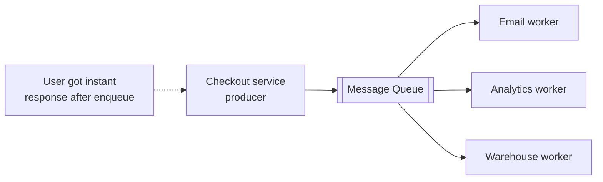

**Reading:**
- Checkout `produces` one message and returns to the user instantly (the `Note`) — the user no longer waits on email or warehouse systems.
- Three independent `workers` consume and process at their own speed. If the email worker is down, messages wait safely in the queue; when it recovers, it catches up. Nothing is lost, and checkout never failed.

**Two core patterns.**
- **Work queue / point-to-point**: each message is processed by *exactly one* consumer in a pool (load-leveling work across workers). Classic: RabbitMQ, AWS SQS.
- **Pub/Sub**: each message is delivered to *every* subscriber (one event, many independent reactions). Classic: Kafka topics, SNS, Google Pub/Sub. (More in Part 8.)

**Why it matters.** Queues give you: **load leveling** (absorb spikes, process steadily — a flash sale's 100K orders/sec queue up and drain at the DB's sustainable rate), **resilience** (downstream outage ≠ user-facing failure), and **decoupling** (add a new consumer without touching the producer).

**Failure modes.**
- *Consumer can't keep up* → queue grows unbounded → memory/disk exhaustion. **Fix:** monitoring on queue depth, autoscaling consumers, load shedding.
- *Poison messages* — a message that always fails processing, blocking or looping forever. **Fix:** a **dead-letter queue (DLQ)** to quarantine messages after N failed attempts.
- *Duplicate delivery* — most queues guarantee *at-least-once*, so a message can be delivered twice (consumer crashed after processing but before acking). **Fix:** idempotent consumers (Part 3!).
- *Ordering* — many queues don't guarantee global order; if order matters you need ordering keys/partitions (Kafka) and to accept reduced parallelism.

**Tradeoffs.** You gain decoupling and resilience but pay with **eventual consistency** (the email arrives "soon," not instantly), **harder debugging** (flow is now asynchronous and spread across systems — observability matters, Part 10), and operational overhead (the queue is now critical infrastructure).

**Real examples.** Kafka (log-based, high-throughput streaming), RabbitMQ (flexible routing, classic broker), AWS SQS (managed work queue), AWS SNS / Google Pub/Sub (pub/sub), ActiveMQ. In Spring: `@KafkaListener`, `@RabbitListener`, Spring Cloud Stream.

**Interview perspective.** Reach for a queue whenever you see "send notification," "process upload," "fan-out," "decouple," or "handle traffic spikes." Always mention at-least-once delivery → idempotent consumers, and a DLQ for poison messages. That trio (decouple / at-least-once / DLQ) signals you've operated queues, not just read about them.

**Mental model:** *A queue is a conveyor belt between workers who never have to meet or work at the same speed. The fast worker drops items and walks away; the slow worker picks them up whenever it's ready, and a jam on one belt never stops the others.*

---

## 4.7 Object Storage

**Problem.** You need to store huge numbers of large, immutable blobs — images, videos, PDFs, backups, ML model files. Databases are terrible at this: BLOB columns bloat the DB, kill backup/restore times, and waste expensive transactional storage on bytes that never change and don't need queries.

**Naive solution.** Store files on the app server's local disk, or as BLOBs in the database. Local disk doesn't survive the server dying and can't be shared across a fleet; DB BLOBs make your database enormous and slow.

**Improved design.** A purpose-built **object store**: a flat namespace of *objects* (blob + metadata + a key), accessed over HTTP, with effectively infinite capacity and very high durability (S3 advertises 11 nines — 99.999999999% — by replicating each object across multiple devices and facilities). It's not a filesystem (no real directories, no partial in-place edits — you replace whole objects) and not a database (no rich queries) — it's optimized for "put a blob, get a blob, cheaply, forever, at any scale."

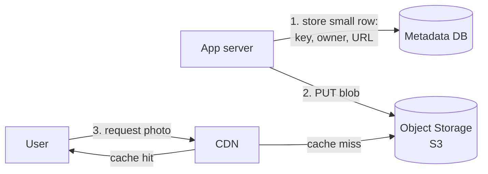

**Reading:**
- The app stores only a **small metadata row** in the database (who owns it, when, and the object's URL/key) — keeping the DB lean.
- The actual **blob** goes to object storage.
- Users fetch blobs through a **CDN** in front of the object store, so the object store itself is rarely hit directly. This three-part pattern — *metadata in DB, blob in object store, served via CDN* — is the canonical way to handle user-generated media at scale (Part 2's Instagram math forced exactly this).

**Failure modes & concerns.** Object stores are extraordinarily durable but **eventually consistent** historically (S3 is now strongly consistent for reads-after-writes, but older designs weren't — know your store's guarantees). Latency per request is higher than a local disk, so you don't use it for hot, tiny, frequently-mutated data. Access control matters — a misconfigured public bucket is a classic breach.

**Tradeoffs.** Near-infinite scale, durability, and low cost, traded for: no in-place edits, no rich queries, higher per-op latency, and eventual-consistency caveats. Perfect for write-once-read-many blobs; wrong for transactional state.

**Real examples.** AWS S3 (the archetype), Google Cloud Storage, Azure Blob Storage, MinIO (self-hosted, S3-compatible).

**Mental model:** *Object storage is an infinite coat-check: hand over any bundle, get a ticket (the key), retrieve it later, never worry about losing it. But you can't reach in and alter the coat — you check in a whole new one.*

---

## 4.8 Search Engines

**Problem.** Databases are bad at *search*. `WHERE description LIKE '%wireless headphones%'` does a full table scan (no index helps a leading wildcard), can't rank by relevance, can't handle typos, synonyms, or "find documents *about* this." Once users expect Google-quality search over your data, a relational `LIKE` collapses.

**Naive solution.** `LIKE '%term%'` queries against the primary DB. Slow (full scans), unranked, and it competes with your transactional load.

**Improved design — the inverted index.** A search engine builds an **inverted index**: instead of "document → words," it stores "word → list of documents containing it." Searching becomes a fast lookup of the query terms followed by intersecting/ranking the document lists. It adds tokenization, stemming ("running" → "run"), stop-word removal, relevance scoring (TF-IDF / BM25), fuzzy matching for typos, and faceting.

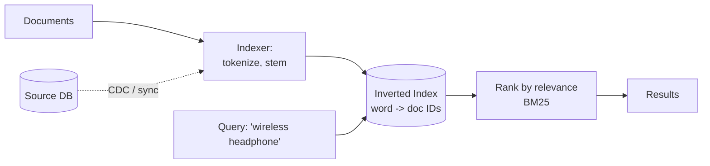

**Reading:**
- Documents flow through an `Indexer` that tokenizes and stems them, producing the `Inverted Index` mapping each word to the documents containing it.
- A query hits that index directly — looking up "wireless" and "headphone" and combining their doc lists — then `ranks` results by relevance.
- Crucially, the search engine is **a secondary index, not the source of truth.** The `Source DB` keeps the authoritative data and **syncs** changes into the index (often via Change Data Capture or a queue). This means the index is *eventually consistent* with the DB — a just-added product may take a moment to become searchable.

**Failure modes & concerns.** The index can drift from the source DB if the sync pipeline breaks (you must monitor and be able to **reindex** from scratch). Indexes are large and memory-hungry. Search clusters need sharding and replication of their own. Relevance tuning is an endless product concern.

**Tradeoffs.** Blazing, rich, ranked, typo-tolerant search — paid for with a second system to operate, data duplication, eventual consistency with the source, and significant memory. Never make the search engine your primary store (people do, and regret it — Elasticsearch isn't built to be a durable system of record).

**Real examples.** Elasticsearch / OpenSearch, Apache Solr (both built on Lucene), Algolia (managed, ultra-low-latency), Typesense, Meilisearch.

**Mental model:** *A search engine is the index at the back of a book. Reading every page to find a word (DB `LIKE`) is insane; you flip to the index, which maps each word straight to its pages — and someone has to keep that index in sync when the book is reprinted.*

---

## 4.9 API Gateways

**Problem.** In a microservices world you have dozens of services. If every client must know each service's address, and each service must independently implement authentication, rate limiting, TLS, logging, and request validation, you get massive duplication and a brittle, exposed system.

**Naive solution.** Let clients call each microservice directly, and copy-paste auth/rate-limit code into every service. Duplication, inconsistency, and a huge attack surface.

**Improved design.** An **API gateway** is the single front door for all client traffic. It sits at the edge and handles **cross-cutting concerns once**, then routes to the right backend service:
- **Authentication / authorization** (validate JWT/API keys here, so services trust the gateway).
- **Rate limiting & throttling** (protect backends from abuse and overload).
- **Routing** (map `/users/*` → user-service, `/orders/*` → order-service).
- **TLS termination, request/response transformation, protocol translation** (e.g., REST in, gRPC out).
- **Aggregation** (optionally fan one client request out to several services and combine — though heavy aggregation is better in a dedicated BFF/service).
- **Observability** (one place to log, trace, and meter all traffic).

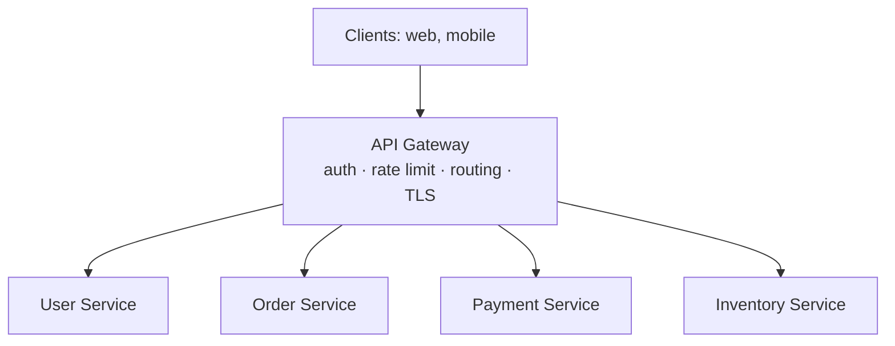

**Reading:** all clients hit one `Gateway`. It authenticates, rate-limits, and terminates TLS *once*, then routes each request to the appropriate internal service. The services behind it can stay simple — they trust that anything reaching them is already authenticated and within rate limits, and they don't need public addresses (smaller attack surface).

**Gateway vs. load balancer (a frequent confusion).** A load balancer distributes traffic across *identical* instances of one service (L4/L7 balancing). An API gateway routes across *different* services by path/content and adds API-management features (auth, rate limiting, transformation). They're often layered: LB in front for raw distribution/failover, gateway for API logic. (Your existing Kong notes cover one popular gateway in depth.)

**Failure modes & concerns.** It's a **critical SPOF and a potential bottleneck** — must be horizontally scaled and redundant. Too much logic in the gateway turns it into a distributed monolith ("god gateway") — keep business logic in services. Added latency from the extra hop. Misconfigured routing/auth at the gateway is a high-blast-radius mistake.

**Tradeoffs.** Centralizes and standardizes cross-cutting concerns (huge maintainability win, consistent security) at the cost of a critical shared component, an extra hop, and the temptation to overload it.

**Real examples.** Kong, AWS API Gateway, Apigee, Envoy/Istio gateways, Spring Cloud Gateway (directly relevant to your Spring stack), Netflix Zuul (historical).

**Interview perspective.** Introduce the gateway as "the single entry point that handles auth, rate limiting, and routing so services don't each reimplement them." Immediately note its SPOF nature and that you'd run it redundantly — and resist putting business logic in it.

**Mental model:** *An API gateway is the security desk and switchboard of an office tower: it checks every visitor's badge once, enforces the visitor quota, and directs each person to the right department — so individual offices don't each need their own guard.*

---

# PART 5 — DATABASES MASTERCLASS

## The fundamental fork: SQL vs NoSQL

**Problem.** You must store data. The first and most consequential choice is the *data model and its guarantees*. Getting this wrong is expensive — migrating databases mid-flight is one of the hardest things a team can do.

**SQL (relational) databases.** Data in tables with a fixed **schema**, related by keys, queried with SQL, and protected by **ACID transactions**:
- **Atomicity** — a transaction fully completes or fully rolls back; no partial state.
- **Consistency** (the ACID kind — constraints are never violated, e.g., foreign keys, uniqueness).
- **Isolation** — concurrent transactions don't see each other's half-done work (tunable via isolation levels).
- **Durability** — once committed, it survives crashes.

SQL's superpowers: **joins** (combine related data), **strong consistency**, **flexible ad-hoc queries**, and **transactions** spanning multiple rows/tables. Its weakness: harder to scale writes horizontally (joins and transactions resist sharding), and the rigid schema slows rapid iteration.

**NoSQL databases.** A family that relaxes one or more of SQL's properties to gain scale, flexibility, or a better fit for a specific shape of data. Common themes: **flexible/no schema**, **horizontal scaling built-in (sharding native)**, **denormalization** instead of joins, and often **eventual consistency** (tunable). The cost: you usually lose multi-object ACID transactions and rich joins; you must model data around your *access patterns* up front.

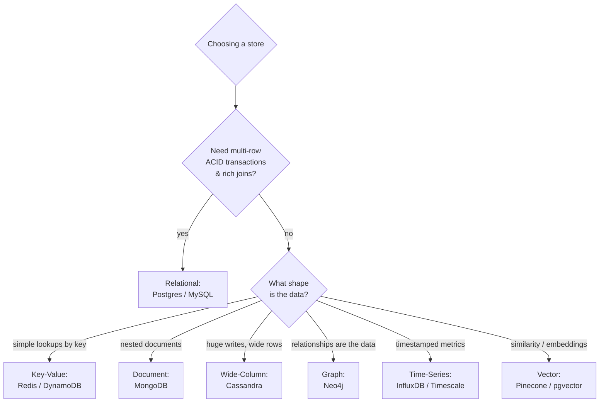

**Reading the decision tree:** the *first* question is always "do I need ACID transactions and joins?" If yes, reach for relational by default — it's the safest, most flexible choice and scales further than people think (read replicas + careful sharding). Only if you genuinely don't need those, and your data has a clear shape or scale that a specialized store serves better, do you branch into NoSQL — and *which* NoSQL is dictated by the *shape of your data and access pattern*, not by hype.

**The crucial NoSQL mindset shift.** In SQL you model the data, then write queries. In NoSQL you start from the **queries (access patterns)** and model the data to serve them — often duplicating data across multiple denormalized structures so each query is a single fast lookup. "Model your data to your access patterns" is the whole game in DynamoDB/Cassandra.

---

## The NoSQL family, type by type

### Key-Value stores
- **What:** a giant distributed hash map — `get(key)`, `put(key, value)`. The value is opaque.
- **Why it scales:** trivial to shard by key; O(1) lookups; no query planning.
- **Use when:** session storage, user preferences, caching, feature flags, anything you fetch by a single known key.
- **Don't use when:** you need to query *by* the value's contents or scan ranges.
- **Examples:** Redis, DynamoDB (also doc-ish), Memcached, Riak.
- **Mental model:** *a coat-check ticket — give the number, get exactly what you stored, no questions about what's inside.*

### Document stores
- **What:** store self-contained JSON-like documents; fields can be queried and indexed; documents can be nested and heterogeneous.
- **Why:** flexible schema (great for evolving products), and a document often maps 1:1 to an application object (a whole order with its line items in one doc) — no joins needed for the common read.
- **Use when:** content management, catalogs, user profiles, anything where each entity is naturally a self-contained nested object and the schema evolves often.
- **Watch out:** denormalization means duplicated data — updating something repeated across many documents is painful; document stores tempt you into modeling relationships you'll later wish were relational.
- **Examples:** MongoDB, Couchbase, DynamoDB, Firestore.
- **Mental model:** *a filing cabinet of folders; each folder is complete on its own, and folders need not look alike.*

### Wide-column stores
- **What:** rows keyed by a partition key, each holding a flexible, potentially huge set of columns; optimized for massive write throughput and writes/reads by key.
- **Why:** built for enormous scale and high write volume across many nodes; data is partitioned and replicated natively; writes are cheap (log-structured).
- **Use when:** time-series at scale, event logging, messaging history, IoT, anything write-heavy at huge volume where you query by a known partition key.
- **Watch out:** you must design tables per query (no ad-hoc joins); poor partition key choice creates hot partitions; eventual consistency by default (tunable).
- **Examples:** Cassandra, ScyllaDB, HBase, Google Bigtable.
- **Mental model:** *a colossal spreadsheet split across thousands of machines, where you must know the row key to find anything and each row can have its own columns.*

### Graph databases
- **What:** data as nodes and edges (relationships) as first-class citizens; queries traverse relationships efficiently.
- **Why:** "find friends-of-friends who like X" is a nightmare of recursive joins in SQL but a natural, fast traversal in a graph DB.
- **Use when:** social networks, fraud detection (follow the money trails), recommendation engines, knowledge graphs, network/dependency modeling.
- **Watch out:** scaling graph traversals across shards is genuinely hard (relationships cross partitions); a niche tool — don't use it as a general store.
- **Examples:** Neo4j, Amazon Neptune, JanusGraph.
- **Mental model:** *a relationship map where the lines between dots matter as much as the dots — and following the lines is the cheap operation.*

### Time-series databases
- **What:** optimized for append-only, timestamped data; efficient time-range queries, downsampling, and retention/expiry.
- **Why:** metrics and sensor data are written constantly, queried by time window, and old data is aggregated or dropped — general DBs handle this clumsily; TSDBs compress and index by time superbly.
- **Use when:** monitoring/metrics (your Part 10 observability stack), IoT sensors, financial ticks, anything "value at timestamp."
- **Examples:** InfluxDB, TimescaleDB (Postgres extension), Prometheus (metrics-focused), Amazon Timestream.
- **Mental model:** *a tape recorder optimized for "what happened between 2 and 3 PM," not "find this one event."*

### Vector databases
- **What:** store high-dimensional **embeddings** and do **approximate nearest-neighbor (ANN)** search — "find the items most *similar* to this one" by vector distance.
- **Why:** the rise of AI/LLMs. Semantic search and Retrieval-Augmented Generation (RAG) need "find documents semantically similar to this query," which is similarity in vector space, not keyword matching. (If you build AI features with Claude or other models, this is where you store and retrieve the knowledge the model reasons over.)
- **Use when:** semantic search, RAG, recommendations by similarity, image/audio similarity, deduplication.
- **Watch out:** ANN is *approximate* (trades recall for speed); embeddings must be regenerated if you change the embedding model; it's a complement to, not a replacement for, your primary store.
- **Examples:** Pinecone, Weaviate, Milvus, Qdrant, and `pgvector` (vectors inside Postgres — often the pragmatic first choice).
- **Mental model:** *a librarian who finds books by "vibe" rather than title — nearby in meaning-space, not alphabetized.*

---

## Polyglot persistence

**Key insight:** real systems use *several* of these together. An e-commerce platform might run Postgres for orders/payments (ACID), Redis for sessions/cart (key-value speed), Elasticsearch for product search (inverted index), Cassandra for the event/clickstream firehose (write scale), and a vector DB for "similar products." This is **polyglot persistence** — pick the right store per workload, accepting the operational cost of running several. The tradeoff: optimal fit per use case vs. the complexity of syncing data across stores and operating many systems.

**Interview perspective.** Default to relational unless a specific access pattern or scale clearly demands otherwise — and *justify* the NoSQL choice by data shape and access pattern ("writes dominate, we query only by user_id, no joins needed → Cassandra"), never by buzzword. Naming polyglot persistence and the cost of keeping stores in sync shows maturity.

**Mental model for all of Part 5:** *Relational is the trusted general-purpose tool; each NoSQL store is a specialized blade. You don't replace your chef's knife with a fillet knife — you add the fillet knife when you're filleting fish.*

---

# PART 6 — CACHING MASTERCLASS

Caching is the highest-leverage, highest-footgun technique in system design. Speed is easy; *correctness* (avoiding stale or lost data) is where engineers bleed.

## Why cache (recap) and where

**Problem.** Repeatedly computing or fetching the same data is wasteful and slow; the DB is the scarce resource. **Solution:** keep frequently-accessed data in fast storage closer to the consumer. Caches exist at every layer:
- **Client/browser cache** (HTTP cache headers).
- **CDN/edge cache** (Part 4.3).
- **Reverse-proxy cache** (NGINX).
- **Application cache** — in-process (Caffeine in your JVM, near-zero latency, but per-instance and not shared) or distributed (Redis/Memcached, shared across the fleet, one network hop away).
- **Database cache** (buffer pool — the DB caches hot pages in RAM itself).

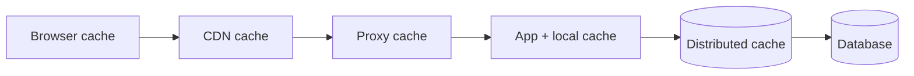

**Reading:** a request can be satisfied at any layer; the closer to the user it's served, the faster and cheaper. Each arrow is a fallback to the next layer on a miss. The art is deciding *what* to cache *where*, and *how* to keep each layer honest.

---

## Cache patterns (write/read strategies)

The pattern you choose determines your consistency and failure behavior.

### Cache-aside (lazy loading) — the default
The application manages the cache explicitly. On read: check cache → on miss, read DB, write to cache, return. On write: write DB, then **invalidate (delete)** the cache entry.

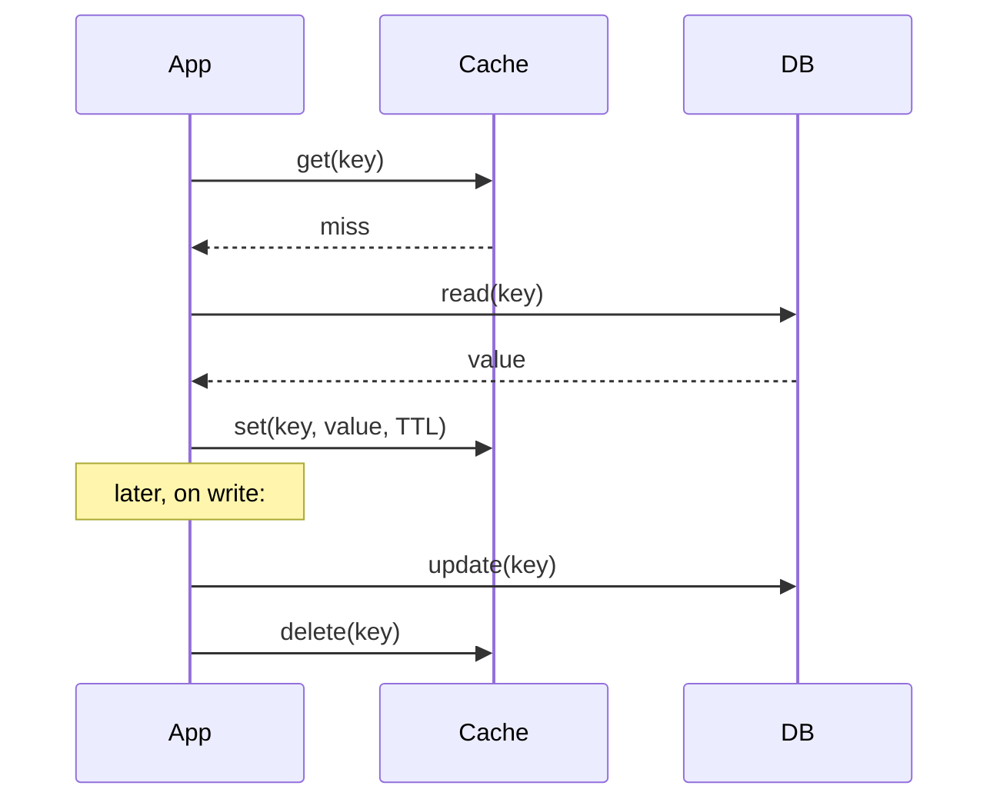

**Reading:** the app does the work — cache is a side store it consults and populates. On write it *deletes* the key (rather than updating it) so the next read repopulates fresh from the DB. **Pros:** only requested data is cached (memory-efficient); resilient (if cache is down, you still hit the DB). **Cons:** first read of any key is always a miss (cold cache penalty); a window of staleness exists between the DB write and the cache delete if not ordered carefully. *This is the most common pattern and a safe default.*

### Write-through
Writes go *through* the cache: the app writes to the cache, which synchronously writes to the DB, before acking. Reads are always warm for written data. **Pro:** cache never stale for written keys; **Con:** every write pays cache+DB latency, and you cache data that may never be read (memory waste).

### Write-behind (write-back)
Writes go to the cache and are acked immediately; the cache *asynchronously* flushes to the DB later (often batched). **Pro:** very fast writes, absorbs write bursts; **Con:** **risk of data loss** if the cache dies before flushing — only acceptable when some loss is tolerable, or paired with a durable log.

### Read-through
Like cache-aside but the *cache library* (not your app code) handles the DB read on a miss. Cleaner app code; the cache becomes a transparent layer. Common in caching libraries/CDNs.

**Tradeoff summary:** cache-aside = simple & resilient, accepts cold misses; write-through = consistent reads, slower writes; write-behind = fast writes, risks loss; read-through = clean abstraction. **Most systems use cache-aside + TTLs.**

---

## Cache invalidation — the hard part

> "There are only two hard things in computer science: cache invalidation and naming things." — Phil Karlton

**The problem:** the cached copy and the source of truth drift apart. Three strategies:
1. **TTL (time-to-live) expiry** — entries auto-expire after N seconds; you accept up to N seconds of staleness in exchange for simplicity. *The workhorse* — most caching is "good enough" with a sensible TTL.
2. **Explicit invalidation** — on write, delete/update the affected keys. Precise but hard: you must know *every* key affected by a write (a single user update might invalidate their profile, their post list, several aggregations…). Miss one and you serve stale data forever.
3. **Versioning / event-driven** — bump a version or emit an event on change; consumers refresh. Powerful but complex.

**Production reality:** combine TTL (safety net — even if you miss an explicit invalidation, it self-heals within the TTL) with explicit invalidation (precision for the keys you can track). TTL alone is the pragmatic baseline.

---

## The three cache catastrophes

These are the classic failure modes — knowing them by name is a strong signal.

### 1. Cache stampede (thundering herd)
**What:** a hot key expires (or a cold cache starts). Suddenly thousands of concurrent requests all miss, all hit the DB *at the same instant* to recompute the same value, and the DB is crushed by a self-inflicted spike.

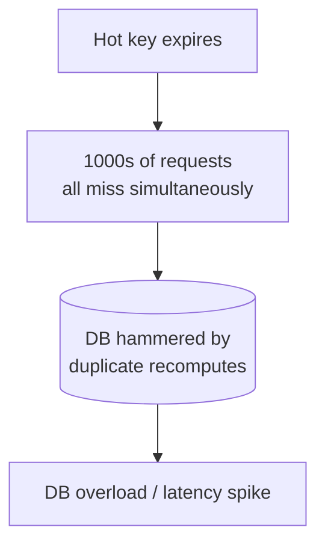

**Reading:** the moment the key expires, every in-flight request becomes a miss and stampedes the DB to recompute the *same* value redundantly — a spike the DB never sees in normal operation.

**Fixes:**
- **Request coalescing / single-flight**: only *one* request recomputes the value; the rest wait for it and share the result. (Go's `singleflight`, or a per-key lock.)
- **Probabilistic early expiration**: refresh the value slightly *before* it expires, randomized, so it's renewed by one request before the herd arrives.
- **Locking**: first miss takes a lock to recompute; others serve stale or wait.

### 2. Hot key
**What:** one key is *so* popular (a celebrity's profile, a viral product) that all traffic for it lands on the *single* cache node holding it, overwhelming that one node even though the cluster has capacity. Sharding by key doesn't help — it's one key.

**Fixes:**
- **Replicate the hot key** across multiple cache nodes and read from a random one.
- **Local (in-process) caching** of the hottest keys on each app server, so they never even hit the distributed cache.
- **Add a suffix/split** the key into N copies (`key#1`…`key#N`).

### 3. Cache avalanche
**What:** a large swath of cache disappears at once — many keys share the same TTL and expire simultaneously, *or* a cache node/cluster crashes — and the full read load slams the DB, which was sized assuming the cache absorbs 90% of reads. The DB falls over; this can cascade (Part 3).

**Fixes:**
- **Jitter the TTLs** (randomize expiry times so keys don't all expire together).
- **Cache high availability** (Redis Cluster with replicas, so a node death doesn't wipe a whole shard).
- **Circuit breaker + rate limit** in front of the DB so a cache outage degrades gracefully instead of cascading.
- **Multi-layer caching** (local cache survives if the distributed cache dies).

**Interview perspective.** When you propose a cache, *proactively* address: which pattern (cache-aside), what TTL and why, and how you'd handle stampede/hot-key/avalanche. Saying "I'll add jittered TTLs and single-flight to avoid stampedes, and replicate hot keys" instantly marks you as someone who has run caches in production.

**Mental model:** *A cache is a fast lie you tell to save a trip to the truth. The whole discipline of caching is keeping the lie small, fresh, and gracefully recoverable when it's exposed.*

---

# PART 7 — CONSISTENCY MASTERCLASS

## CAP theorem — what it actually says (and doesn't)

**Problem.** When data is replicated across nodes and the network can partition, what guarantees can you keep?

**CAP states:** during a **network partition (P)**, a distributed system must choose between **Consistency (C)** — every read sees the latest write (linearizable) — and **Availability (A)** — every request gets a non-error response. You cannot have both *while partitioned*.

**The single most important correction to how CAP is usually taught:** P is **not optional**. Partitions *will* happen; you don't get to "choose CP vs AP vs CA" as three equal options. CA is not a real choice for a distributed system — you can't opt out of the network failing. The real choice is binary and only *matters during a partition*: **when the network splits, do you sacrifice consistency (AP) or availability (CP)?**

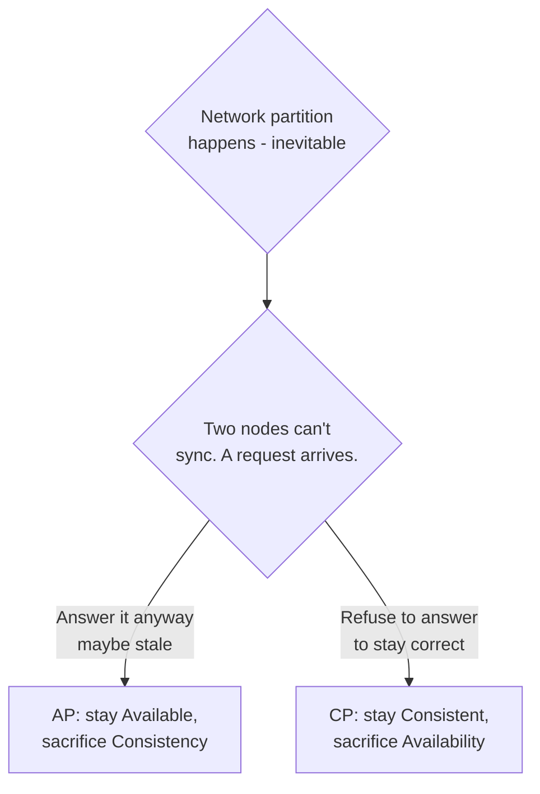

**Reading:** the partition is a given (top box). When a request arrives at a node that can't reach its peers, it has exactly two honest choices: answer with possibly-stale data (**AP** — available but inconsistent) or refuse/error to avoid serving wrong data (**CP** — consistent but unavailable). There is no door three.

**Concrete examples:**
- **AP systems:** Cassandra, DynamoDB (default), DNS. A shopping cart should stay *available* — let users add items during a partition and reconcile later; a brief inconsistency is fine.
- **CP systems:** ZooKeeper, etcd, HBase, traditional RDBMS with synchronous replication. A bank balance or a distributed lock must stay *consistent* — better to reject the operation than to allow a double-spend.

**The nuance that wins interviews:** the choice is **per-operation, not per-system**. The *same* product can be CP for payments and AP for the product catalog. Real systems mix. Saying "I'd make checkout CP and the like-count AP" shows you understand CAP as a per-feature dial, not a religion.

---

## PACELC — the more honest model

**Problem with CAP:** it only describes behavior *during a partition*, which is rare. What about the 99.9% of the time the network is fine? **PACELC** extends CAP:

> **If Partition (P)**, choose **A**vailability or **C**onsistency — **E**lse (no partition), choose **L**atency or **C**onsistency.

The "ELC" half is the everyday reality: even with a healthy network, **strong consistency costs latency** (you must coordinate across replicas/quorums before answering). So you're *always* trading consistency against latency, partition or not.

```mermaid
flowchart TD
    Start{System running} --> P{Partition?}
    P -->|yes| AC{Availability<br/>vs Consistency}
    P -->|no - the common case| LC{Latency<br/>vs Consistency}
    LC -->|favor latency| EL[EL: fast, weaker<br/>consistency<br/>Dynamo, Cassandra]
    LC -->|favor consistency| EC[EC: slower, strong<br/>consistency<br/>Spanner]
```

**Reading:** the right branch (`no partition`, the common case) is what CAP ignores. Even when all is well, you choose: answer fast from the nearest replica (favor **L**atency, accept weaker consistency — Dynamo/Cassandra) or coordinate for correctness (favor **C**onsistency, accept higher **L**atency — Google Spanner). PACELC captures that consistency has a *latency* price tag at all times, not just during failures.

**Classification examples:** Cassandra/Dynamo are **PA/EL** (choose availability under partition, latency otherwise). Spanner/VoltDB are **PC/EC** (consistency always, paying availability and latency). MongoDB is roughly **PA/EC** by default.

**Interview perspective.** Mentioning PACELC unprompted is a power move — it shows you know CAP is incomplete and that the *real, constant* tradeoff is consistency vs. latency.

---

## Replication models

How copies stay in sync determines your consistency and durability.

- **Synchronous replication:** the primary waits for replicas to confirm before acking the write. Strong consistency and durability (no data loss on primary failure), but higher write latency and reduced availability (a slow/down replica blocks writes). CP-leaning.
- **Asynchronous replication:** primary acks immediately, replicates in the background. Fast writes, high availability, but **replication lag** → stale reads, and **data loss** if the primary dies before replicating. AP-leaning. (This is the default for most read-replica setups — recall Part 4.5.)
- **Semi-synchronous:** wait for *at least one* (or a quorum of) replicas, not all. A pragmatic balance — durability of "at least 2 copies" without waiting for the slowest replica.

**Quorum consistency (the Dynamo/Cassandra model).** With N replicas, require W replicas to confirm a write and R replicas to agree on a read. If **W + R > N**, any read overlaps with the latest write — giving strong consistency *tunable per query*. Example: N=3, W=2, R=2 → 2+2 > 3, so reads are consistent, while still tolerating one node down. Set R=1 for fast reads (eventual consistency) or W=3 for max durability. **This is the elegant knob:** you dial consistency vs. latency vs. availability per operation by choosing R and W.

```mermaid
flowchart LR
    Wr[Write] --> N1[(Replica 1 ✓)]
    Wr --> N2[(Replica 2 ✓)]
    Wr -. not yet .- N3[(Replica 3)]
    Rd[Read R=2] --> N2
    Rd --> N3
    Note[W=2, R=2, N=3<br/>R+W>N -> read overlaps write] -.-> Rd
```

**Reading:** the write reaches 2 of 3 replicas (W=2). A read consults 2 of 3 (R=2). Because any two reads and any two writes must share at least one node (2+2 > 3), the read is guaranteed to see at least one replica that has the latest write — so it can return the freshest value even though replica 3 hadn't caught up. That overlap is the whole trick behind quorum consistency.

---

## Real-world consistency, by feature

The most useful skill is matching the *right* consistency level to each feature:

| Feature | Acceptable consistency | Why |
|---|---|---|
| Bank balance / payment | Strong (linearizable) | Double-spend / lost money is unacceptable |
| Inventory at checkout | Strong (or reserved with locks) | Overselling the last item is a real problem |
| Username uniqueness | Strong | Two users can't claim the same handle |
| Social media like count | Eventual | Off-by-a-few for a second is invisible |
| News feed / timeline | Eventual | A few seconds stale is fine |
| Product catalog | Eventual | Updates can propagate lazily |
| "Read your own writes" | Session/causal | Users must see their *own* edits immediately |

**Interview perspective.** Never say "the system is consistent" or "it's eventually consistent" globally. Say "payments are strongly consistent; the activity feed is eventually consistent; users get read-your-writes for their own profile." That per-feature reasoning is exactly what senior design is.

**Mental model:** *Consistency is a spending decision: strong consistency buys correctness with latency and availability. Spend it where being wrong costs money or trust; economize everywhere else.*

---

# PART 8 — MESSAGING FOUNDATIONS

## Why asynchronous messaging (recap with depth)

**Problem.** Direct synchronous calls between services create tight coupling: caller waits for callee, caller fails if callee fails, and adding a new reaction to an event means changing the producer. We saw queues solve this in Part 4.6; here we go deeper on the *semantics*.

## Pub/Sub vs. queue, precisely

- **Message queue (point-to-point):** a message is consumed by **exactly one** worker from a pool. Used to *distribute work* (load leveling). Once processed and acked, the message is gone.
- **Publish/Subscribe:** a message (event) is delivered to **every** subscriber. Used to *broadcast facts* ("OrderPlaced happened") so many independent systems can react. Each subscriber gets its own copy.

```mermaid
flowchart TD
    subgraph Queue [Work Queue: one consumer per message]
        QP[Producer] --> QQ[[Queue]]
        QQ --> W1[Worker A]
        QQ --> W2[Worker B]
        QQ --> W3[Worker C]
    end
    subgraph PubSub [Pub/Sub: all subscribers get every message]
        PP[Publisher] --> T((Topic))
        T --> S1[Email svc]
        T --> S2[Analytics svc]
        T --> S3[Audit svc]
    end
```

**Reading:**
- In the **Queue** block, the producer's messages are *spread across* workers A/B/C — each message goes to one worker. This scales *processing* of a stream of tasks.
- In the **Pub/Sub** block, every message on the `Topic` is *copied to all three* subscribers — email, analytics, and audit each independently react to the same event. This *decouples* one event from its many consequences. Adding a fourth subscriber requires zero changes to the publisher.

---

## Kafka — the key concepts (intro)

Kafka is the dominant event-streaming platform; understanding its model clarifies modern messaging. Its central idea: **a topic is a durable, append-only, replayable log**, not a transient queue.

- **Topic:** a named stream of events (e.g., `orders`).
- **Partition:** each topic is split into partitions for parallelism and scale. **Order is guaranteed *within* a partition, not across them.** Messages with the same key (e.g., `order_id`) go to the same partition, preserving per-key order.
- **Offset:** each message has a sequential position in its partition. Consumers track their offset — *where they've read up to*.
- **Consumer group:** consumers in a group share the partitions of a topic (each partition is read by exactly one consumer in the group → that's the work-queue behavior). Different groups each get the *full* stream → that's pub/sub. **Kafka unifies both models** via consumer groups.
- **Retention & replay:** unlike a classic queue, Kafka *keeps* messages for a configured time (or forever). A new consumer can replay history from offset 0; a buggy consumer can reset its offset and reprocess. This makes Kafka a *source of truth event log*, enabling event sourcing and adding new consumers retroactively.

```mermaid
flowchart LR
    Prod[Producer] -->|key=order_id| P0[Partition 0: e0 e1 e2 ...]
    Prod --> P1[Partition 1: e0 e1 ...]
    Prod --> P2[Partition 2: e0 e1 e2 e3 ...]
    P0 --> CG1[Group A: consumer 1]
    P1 --> CG1b[Group A: consumer 2]
    P2 --> CG1b
    P0 --> CG2[Group B: full replay]
```

**Reading:** the producer partitions events by key (same `order_id` → same partition → ordered). Within **Group A**, partitions are divided among consumers (parallel work, each partition to one consumer). **Group B** independently consumes the same partitions for its own purpose (pub/sub across groups), and can replay from the beginning because Kafka retains the log. This is why Kafka scales (partitions = parallelism), preserves order (per partition), and supports both work-queue and broadcast patterns.

**Tradeoffs.** Kafka gives enormous throughput, durability, ordering-per-key, and replay — at the cost of operational complexity (partitions, brokers, consumer-group rebalancing, ZooKeeper/KRaft) and the fact that *more partitions = more parallelism but weaker global ordering*. For simple task queues, RabbitMQ/SQS is lighter.

---

## Delivery guarantees — the unavoidable choice

Because networks lose messages and consumers crash (Part 3!), every messaging system offers one of three guarantees:

- **At-most-once:** deliver and don't retry. Messages may be *lost* but never duplicated. Use for tolerable-loss data (some metrics).
- **At-least-once:** retry until acked. Messages are *never lost* but may be *duplicated* (consumer crashed after processing, before acking → redelivered). **This is the default and the practical choice** — and it *demands idempotent consumers* (Part 3's idempotency key returns here).
- **Exactly-once:** never lost, never duplicated. The holy grail — and *very* expensive/limited. Kafka offers it within Kafka (transactions + idempotent producer) but true end-to-end exactly-once across external systems is generally impossible; you *simulate* it with at-least-once delivery + idempotent processing.

```mermaid
flowchart TD
    M{Delivery guarantee} --> A1[At-most-once:<br/>fast, may lose]
    M --> A2[At-least-once:<br/>safe, may duplicate<br/>-> need idempotency]
    M --> A3[Exactly-once:<br/>ideal, costly/limited<br/>-> usually faked via<br/>at-least-once + idempotent]
```

**Reading:** the three branches are a strict tradeoff between *loss* and *duplication*. The practical real-world answer is almost always the middle: **at-least-once delivery plus idempotent consumers**, which gives you effectively-once behavior without the cost and limits of true exactly-once.

**Interview perspective.** When you mention a queue, state the delivery guarantee: "at-least-once, so consumers are idempotent via a dedup key, with a DLQ for poison messages." That one sentence covers the three things that bite people in production.

**Mental model:** *Exactly-once delivery is a myth you achieve by accepting at-least-once delivery and making duplicates harmless. The network will repeat itself; your job is to not care.*

---

# PART 9 — MICROSERVICES FUNDAMENTALS

> You already work in microservices (your Kong and microservices-communication notes confirm it), so this part connects the *system-design* lens to what you build daily.

## The problem microservices solve (and create)

**Problem.** A monolith is one deployable unit. At first this is a *virtue* — simple, one codebase, easy transactions, no network between modules. It becomes painful at organizational scale: a 200-engineer team stepping on each other in one codebase, one slow module forcing the whole app to scale, one bad deploy taking everything down, and one tech-stack choice locked in for everyone.

**Naive "solution".** Split into microservices immediately, from day one, because "microservices scale." This is usually a *mistake* — you trade in-process method calls (fast, reliable, transactional) for network calls (slow, fallible, no distributed transactions), inheriting *every* problem from Part 3 (partial failure, partitions, consistency) before you even have the scale that justifies it.

**The honest guidance:** start with a **well-modularized monolith**; extract services when a clear seam, a scaling need, or a team-autonomy need appears. Microservices are an *organizational* scaling tool as much as a technical one (Conway's Law: your architecture mirrors your org chart).

## Service decomposition

**How to draw the boundaries.** The durable principle is **decompose by business capability / bounded context** (Domain-Driven Design), *not* by technical layer. "Orders," "Payments," "Inventory," "Shipping" are good services — each owns its data and logic end-to-end. "Controllers service," "Database service" are bad — they cut across every feature and recreate the monolith's coupling over a network (worse than the monolith).

**The golden rule: each service owns its data.** No service reaches into another's database. Services communicate only through APIs/events. The moment two services share a database, you have a distributed monolith — the worst of both worlds (network calls *and* tight coupling).

```mermaid
flowchart TD
    GW[API Gateway] --> Ord[Order Service]
    GW --> Pay[Payment Service]
    GW --> Inv[Inventory Service]
    Ord --> ODB[(Orders DB)]
    Pay --> PDB[(Payments DB)]
    Inv --> IDB[(Inventory DB)]
    Ord -.event: OrderPlaced.-> Bus[[Event Bus]]
    Bus -.-> Inv
    Bus -.-> Pay
```

**Reading:** each service owns *its own* database (no shared DB lines crossing services). Synchronous client traffic enters through the gateway. Services coordinate through **events** on a bus (`OrderPlaced` triggers inventory reservation and payment) rather than reaching into each other's data — keeping them loosely coupled and independently deployable.

## API Gateway (in the microservices context)

Covered fully in Part 4.9 — in microservices it's essential as the single front door that shields clients from the internal service topology and centralizes auth/rate-limiting. Without it, every client must know every service and every service reimplements security.

## Service discovery

**Problem.** Services scale up/down and move (containers, autoscaling); their IPs change constantly. How does Order Service find a healthy instance of Payment Service when its address isn't fixed?

**Solution.** A **service registry**: instances register themselves on startup (and deregister/expire on death via heartbeats); callers look up healthy instances by *name*. Two flavors:
- **Client-side discovery:** the caller queries the registry and picks an instance (e.g., Netflix Eureka + Ribbon — familiar from Spring Cloud).
- **Server-side discovery:** the caller hits a stable endpoint (load balancer / mesh) that does the lookup (e.g., Kubernetes Services + kube-proxy, or a service mesh).

```mermaid
flowchart LR
    PS1[Payment inst 1] -->|register| Reg[(Service Registry)]
    PS2[Payment inst 2] -->|register + heartbeat| Reg
    Ord[Order Service] -->|'where is payment?'| Reg
    Reg -->|healthy instances| Ord
    Ord -->|call| PS2
```

**Reading:** payment instances register and heartbeat into the `Registry`; dead ones expire automatically. The Order Service asks the registry by *name*, gets a current list of healthy instances, and calls one. No hardcoded IPs; the system self-heals as instances come and go. (In Kubernetes this is mostly invisible — DNS + Services handle it for you.)

## Resilience patterns (microservices edition)

These are Part 3's fault-tolerance techniques applied to inter-service calls — and your Resilience4j/Spring toolkit:
- **Timeouts** on every remote call (never wait forever).
- **Retries with exponential backoff + jitter** (retry transient failures, but spaced out and randomized so you don't synchronize a retry storm that DDoSes the recovering service).
- **Circuit breakers** (stop calling a failing dependency; fail fast with a fallback).
- **Bulkheads** (isolate resources per dependency so one slow service can't exhaust all threads).
- **Idempotency** (because retries + at-least-once messaging mean duplicates).
- **Graceful degradation** (if recommendations are down, render the page without them).

**The saga pattern (distributed transactions).** Since you can't have an ACID transaction across services (no shared DB), a business transaction spanning services becomes a **saga**: a sequence of local transactions, each publishing an event that triggers the next, with **compensating actions** to undo prior steps if a later one fails (e.g., if payment fails after inventory was reserved, emit an event that *releases* the reservation). This trades ACID's all-or-nothing for eventual consistency with explicit rollback logic — the unavoidable cost of splitting data across services.

**Interview/practice perspective.** The mature take: "microservices are an organizational and scaling tool with a real distributed-systems tax; I'd modularize a monolith first, split by bounded context when a seam justifies it, give each service its own data, and use a gateway, service discovery, and Resilience4j patterns — accepting sagas instead of distributed transactions."

**Mental model:** *Microservices turn fast, reliable in-process calls into slow, fallible network calls in exchange for independent deployment and team autonomy. Only make the trade when the autonomy is worth the tax — and once you do, every Part 3 problem is now yours.*

---

# PART 10 — OBSERVABILITY

## Why observability (not just monitoring)

**Problem.** In a monolith, debugging is a stack trace and a log file. In a distributed system, a single user request hops through a gateway, five services, three databases, and a queue — across dozens of machines. When it's slow or fails, *where* did it break? You cannot SSH into 200 containers. Without observability, a distributed system is a black box that fails in ways you can't explain.

**Monitoring vs. observability.** *Monitoring* answers known questions ("is CPU high?", "is the error rate up?") via predefined dashboards/alerts. *Observability* is the property that lets you ask *new, unanticipated* questions about your system's internal state from its outputs — to debug problems you didn't predict. You build it from three pillars (plus a fourth increasingly).

```mermaid
flowchart TD
    Obs[Observability] --> L[Logs:<br/>discrete events,<br/>'what happened']
    Obs --> M[Metrics:<br/>aggregated numbers,<br/>'how much / how often']
    Obs --> T[Traces:<br/>request path across services,<br/>'where did time go']
```

**Reading:** the three pillars answer different questions. **Logs** = detailed records of individual events (great for *why* a specific request failed). **Metrics** = cheap aggregated time-series (great for *trends and alerting* — error rate, p99 latency, QPS). **Traces** = the end-to-end journey of one request across services (great for *where* the latency or failure is in a distributed call chain). You need all three; each is blind where the others see.

## The three pillars in depth

### Logs
- **What:** timestamped records of discrete events. In distributed systems, use **structured logging** (JSON with fields: `request_id`, `user_id`, `service`, `level`) so logs are *queryable*, not just human-readable text.
- **Critical practice:** propagate a **correlation/trace ID** through every service and include it in every log line, so you can `grep` one request's journey across all services. Without it, logs from 10 services are unrelatable noise.
- **Production concern:** logs are voluminous and expensive; sample/aggregate at scale, set retention, never log secrets/PII. Centralize them (ELK / Loki / cloud logging) — you can't tail 200 machines.

### Metrics
- **What:** numeric measurements over time, cheaply aggregated. The classic groupings:
  - **RED** (for request-driven services): **R**ate (requests/sec), **E**rrors (error rate), **D**uration (latency distribution).
  - **USE** (for resources): **U**tilization, **S**aturation, **E**rrors.
- **Why:** metrics are cheap to store (just numbers + time) and ideal for **alerting** and dashboards. Always track *percentiles* (p50/p95/p99), never just averages (Part 1's tail-latency lesson).
- **Stack:** Prometheus (scrapes & stores time-series — a TSDB from Part 5) + Grafana (dashboards). In Spring: Micrometer exposes metrics to Prometheus.

### Traces
- **What:** a **distributed trace** follows one request across all services. It's a tree of **spans** — each span is one unit of work (a service handling the request, a DB call) with a start/end time, linked by a shared **trace ID** and parent/child **span IDs**.
- **Why:** this is the *only* tool that shows you *where the time went* in a multi-service request — "the request took 800ms; 600ms was waiting on the inventory service's slow DB query." Indispensable for latency debugging in microservices.
- **Stack:** OpenTelemetry (the vendor-neutral standard for instrumentation) → Jaeger / Zipkin / Tempo (storage & visualization). Spring Cloud Sleuth / Micrometer Tracing auto-propagate trace IDs.

```mermaid
flowchart TD
    R[Trace: GET /checkout - 800ms] --> S1[Span: API Gateway 20ms]
    S1 --> S2[Span: Order Service 750ms]
    S2 --> S3[Span: Payment call 100ms]
    S2 --> S4[Span: Inventory call 600ms ⚠]
    S4 --> S5[Span: Inventory DB query 580ms ⚠]
```

**Reading:** one request's trace, broken into spans with timings. The total is 800ms; following the tree, the culprit is obvious — the Inventory DB query took 580ms of it. Without a trace you'd only know "checkout is slow"; the trace pinpoints the exact span and service to fix. The `⚠` markers are where you'd focus.

## SLIs, SLOs, SLAs — defining "good enough"

These formalize "is the system healthy?" into agreed numbers — and they govern engineering priorities.

- **SLI (Service Level Indicator):** a *measured* metric of service health. E.g., "% of requests served in under 200ms," or "% of requests that succeed (non-5xx)." This is the raw number, from your metrics.
- **SLO (Service Level Objective):** the *internal target* for an SLI. E.g., "99.9% of requests succeed over a rolling 30 days." It's the goal you hold yourselves to.
- **SLA (Service Level Agreement):** a *contractual* promise to customers, with **consequences** (refunds/credits) if breached. E.g., "99.9% uptime or you get a credit." SLAs are *looser* than SLOs by design — you set your internal SLO stricter so you catch problems before you breach the customer-facing SLA.

```mermaid
flowchart LR
    SLI[SLI: measured<br/>'99.95% succeeded'] --> SLO[SLO: internal target<br/>'aim for 99.9%']
    SLO --> SLA[SLA: customer contract<br/>'promise 99.5% or refund']
    SLO --> EB[Error budget:<br/>0.1% allowed failure<br/>= permission to ship/risk]
```

**Reading:** you *measure* the SLI, compare it to your *internal* SLO, and keep the customer-facing SLA looser than the SLO for safety margin. The branch to **error budget** is the powerful idea: an SLO of 99.9% means you're *allowed* 0.1% failure — that budget is a currency. Plenty of budget left → ship fast, take risks. Budget exhausted → freeze risky changes and focus on reliability. This turns reliability from a vague aspiration into a quantified, shared decision-making tool between product and engineering.

**The error budget insight (why SLOs matter beyond dashboards):** 100% reliability is the wrong target — it's infinitely expensive and means you never ship anything risky. The error budget makes the tradeoff explicit and *agreed*: it's the bridge between "move fast" and "don't break things."

**Interview perspective.** "I'd instrument with the three pillars — structured logs with correlation IDs, RED metrics in Prometheus with p99 (not averages), and distributed tracing via OpenTelemetry — and define SLOs with an error budget to govern reliability vs. velocity." That sentence demonstrates you think about running systems, not just building them.

**Mental model:** *Observability is the instrument panel of a plane you're flying through clouds. Metrics are the gauges (something's wrong), traces are the map (where it's wrong), logs are the black box (why it's wrong). SLOs are the agreed limits that tell you when to worry.*

---

# SYNTHESIS — PUTTING IT ALL TOGETHER

You now have the bricks and the laws of physics. The final skill is *assembling* them under the methodology of Part 1, driven by the numbers of Part 2, constrained by the realities of Part 3.

## A worked mini-design: "Design a URL shortener" (applying everything)

Let's run the whole funnel quickly to show the pieces interlocking.

1. **Functional:** create a short URL from a long one; redirect short → long. (Scope out: analytics, custom aliases, expiry — mention as extensions.)
2. **Non-functional:** *massively* read-heavy (redirects ≫ creations, maybe 100:1), redirects must be very low latency (it's in the user's critical path), high availability (a dead shortener breaks every link ever made — so availability and durability are paramount), eventual consistency is fine.
3. **Capacity:** say 100M new URLs/month ≈ 40 writes/sec — trivial. Reads at 100:1 ≈ 4,000/sec, peak ~12,000/sec — significant but cache-friendly. Storage: 100M/month × ~500 bytes × 5 years ≈ ~3 TB — small. **Bottleneck identified: read QPS and latency, not storage or writes.**
4. **High-level:** clients → CDN/LB → stateless app servers → **cache (Redis)** in front of a **key-value store** (the mapping is a pure key→value lookup — Part 5 says KV store, e.g., DynamoDB). Short code generation via base-62 encoding of a counter or a hash.
5. **Deep dive:** the redirect path. Because it's read-dominated and the data is immutable (a short code's target never changes), **cache aggressively** — and since mappings are immutable, *cache invalidation is a non-problem* (the catastrophe of Part 6 mostly evaporates). Hit rate will be near 100% for hot links.
6. **Tradeoffs:** KV store over SQL (no joins/transactions needed → scale and simplicity win); eventual consistency on creation (a just-created link might take a moment to propagate to all replicas — acceptable).
7. **Scaling:** at 10×, the cache absorbs reads, the KV store shards trivially by short-code key, the app tier scales horizontally (stateless). Hot links (a viral URL) → the **hot key** problem (Part 6) → replicate that key / local cache it.
8. **Failure modes:** cache avalanche → jittered TTLs + Redis replicas; KV store node loss → built-in replication; region loss → multi-region read replicas (since reads tolerate eventual consistency, this is easy).

Notice how *every* part of this document showed up: methodology (1), estimation (3), the bottleneck concept (4), building blocks — CDN/LB/cache/KV store (Part 4), database choice (5), caching catastrophes (6), consistency tradeoff (7). **That interlocking is the actual skill.** Any system decomposes the same way; only the bottleneck and the chosen bricks change.

## The transferable mental models, collected

Carry these as your compressed toolkit:

- **The network is a liar.** Slow, dead, and partitioned are indistinguishable. Design so you don't need to tell them apart (idempotency, timeouts, retries).
- **Everything is a tradeoff.** Consistency vs. latency/availability, caching vs. staleness, sharding vs. join-power, microservices vs. simplicity. Name the price of every choice.
- **Stateless compute, stateful edges.** Push state into specialized stores (DB, cache, blob, queue) so your compute tier scales by cloning.
- **The bottleneck is singular.** Find the one resource that breaks first; design for it; don't over-engineer the rest.
- **Tail latency is the real latency.** Reason in p99, not averages — at fan-out, the tail is the typical experience.
- **Strong consistency is a luxury good.** Buy it only where being wrong costs money or trust.
- **Assume the fire is already burning.** Design for partial failure as the normal case, not the exception.
- **At-least-once + idempotent = effectively-once.** Stop chasing exactly-once; make duplicates harmless.
- **Cache is a fast lie.** Keep it small, fresh, and gracefully recoverable.
- **Match the tool to the data shape and access pattern**, never to the buzzword.

## Where to go next

This document is the foundation. The case-study documents that build on it (designing Twitter, a chat system, a rate limiter, a payment system, YouTube, etc.) are *applications* of exactly these primitives. When you read or attempt one, consciously map it back: "Which Part 1 stage am I in? What's the bottleneck (Part 2/4)? Which Part 3 reality bites here? Which Part 4 bricks, which Part 5 store, which Part 6 cache pattern, which Part 7 consistency level, which Part 8 delivery guarantee, which Part 9 decomposition, which Part 10 SLO?" If you can answer those, you're not memorizing systems — you're reasoning about them. That was the entire goal.

---

*End of document. The point was never the boxes and arrows — it was the reasoning that decides which boxes, drawn where, and what they cost.*
