# System Design: Junior / Intermediate Case Studies

> **Prerequisite:** This document builds on the primitives from *System-Design-Foundations-and-Building-Blocks.md* — load balancers, caches, queues, replication, CAP/PACELC, idempotency, consistency levels. Don't worry if a few are rusty; whenever one shows up here, we give you a quick plain-English reminder before using it. Think of the foundations doc as the toolbox and this doc as twenty real projects where we actually pick up the tools.
>
> **How to read this so it sticks.** Please don't read it like a dictionary, front to back, hoping it soaks in. It won't. Instead, for each system do this:
>
> 1. Read the **Problem Statement** and picture the scene. Really imagine being the engineer on call when it breaks.
> 2. **Cover the diagram with your hand** and try to sketch the design yourself first. Even a bad attempt makes the real design click ten times harder.
> 3. *Then* uncover it and compare. Notice what you missed and *why*.
>
> The whole point is **intuition transfer**. After enough of these, you'll read a brand-new interview prompt and a little voice will say "ah, this is just a fan-out problem" or "this is a reservation/locking problem" — and suddenly 80% of the design writes itself. That moment is the entire goal. Everything below is in service of getting you there.

## The recurring problem archetypes

Twenty systems sounds like twenty separate things to memorize. Good news: it isn't. Under the surface, almost everything here is one of just **six recurring shapes** ("archetypes"). Once you learn to spot the shape, most of the design falls out automatically — like recognizing that a problem is "really just sorting" and reaching for the obvious tool. Here are the six:

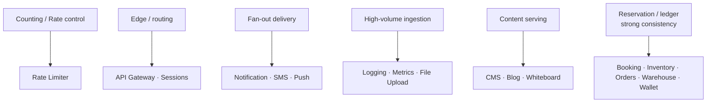

**Reading the diagram:** each archetype on the left dictates the *hard part* on the right. Counting systems fight on atomic increments and hot keys. Fan-out systems fight on partial delivery and retries. Ingestion systems fight on write throughput and backpressure. Reservation/ledger systems fight on consistency and double-booking. Recognizing the archetype tells you *where the difficulty lives* before you draw a single box — which is exactly the Part 1 methodology from the foundations doc.

Each case study below uses the same 16-section structure, and within it the same reasoning arc: **problem → naive design → scaling issues → improved architecture → tradeoffs → production concerns → mental model.**

---

# 1. RATE LIMITER

## 1. Problem Statement
Picture your API humming along happily. Then one buggy client (or one angry script, or one scraper) starts firing 10,000 requests a second at it. Your database melts, and now *everyone* is down — not because your system was weak, but because you let one client hog everything. A **rate limiter** is the bouncer at the door: it caps how many requests each client (a user, an IP address, an API key) may make in a given window — say "100 requests per minute" — and politely turns away the rest.

We build these for three reasons: to **protect the backend** from abuse and accidents, to **enforce fair usage** (free tier vs paid tier), and to **stop one noisy client from taking everyone down**.

**Why is it hard?** A rate limiter sounds like a simple counter, and on one server it is. The difficulty comes from four demands pulling at once:
- It must be **fast** — it runs in front of *every single request*, so even a millisecond of overhead is multiplied by your entire traffic.
- It must be **accurate** — count too loosely and abuse slips through; too strictly and you reject legitimate users.
- It must be **distributed** — you have many gateway servers, and they must somehow share *one* count, or each one allows the full limit and the real limit becomes 10× what you intended.
- It must be **fail-safe** — the limiter is itself a piece of software that can break. The cruel irony is a limiter that crashes and takes down the very system it was protecting.

## 2. Functional Requirements
- Limit requests per client to N per time window (e.g., 100 req/min).
- Support multiple rules (per-IP, per-user, per-endpoint, per-API-key tier).
- Return `429 Too Many Requests` with a `Retry-After` header when exceeded.
- Limits configurable without redeploy.

## 3. Non-Functional Requirements
- Very low latency overhead (sub-millisecond ideally — it's in front of *everything*).
- Highly available; **fail-open vs fail-closed** is a deliberate choice (see §11).
- Accurate under distributed load and clock skew.
- Scalable to millions of distinct clients.

## 4. Capacity Estimation
Let's do quick napkin math to find what's *actually* hard here. Suppose the fleet handles 1M requests/sec from 10M distinct clients. Each client needs one little counter — call it 50 bytes. Total memory = 10M × 50 bytes = **500 MB**. That's nothing; it fits in Redis with room to spare. So storage is a non-issue. What the math surfaces instead is the real challenge: roughly **1M atomic counter updates per second**, each fast. That one number is what later pushes us toward in-memory counters and doing some counting locally on each node before syncing centrally.

## 5. API Design
This is mostly an internal middleware, but conceptually:
```
allow(clientId, ruleId) -> { allowed: bool, remaining: int, resetAt: ts }
```
Exposed to clients only via response headers: `X-RateLimit-Limit`, `X-RateLimit-Remaining`, `X-RateLimit-Reset`, and `429 + Retry-After`.

## 6. Data Model
Per client+rule: a counter and a window. In Redis: key `rl:{clientId}:{ruleId}` → count, with TTL = window. For sliding/token-bucket variants, store `{tokens, lastRefillTs}`.

## 7. High-Level Architecture

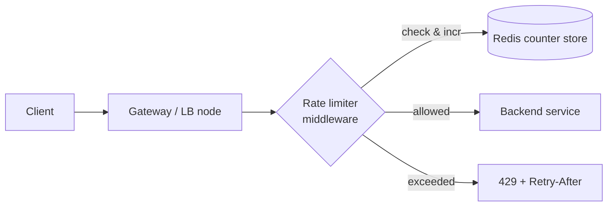

**Reading:** the limiter sits inside the gateway, before the backend. On each request it atomically checks/increments the client's counter in a *shared* store (Redis) so all gateway nodes agree on the count. Allowed → forward; exceeded → reject immediately without touching the backend. The shared store is the crux: without it, 10 gateway nodes each allow N, so the real limit is 10×N.

## 8. Deep Dive Components — the algorithms
The naive design (a fixed counter reset every minute) has a fatal flaw: **boundary bursts**. With a 100/min fixed window, a client can send 100 at 11:00:59 and 100 at 11:01:00 — 200 requests in one second. Algorithms, weakest to best:

- **Fixed window counter:** simple, but boundary-burst problem above.
- **Sliding window log:** store a timestamp per request, count those within the last 60s. Accurate but memory-heavy (one entry per request).
- **Sliding window counter:** weighted blend of current + previous window. Cheap and ~accurate — the common production choice.
- **Token bucket:** tokens refill at a steady rate; each request consumes one; burst up to bucket size allowed. Great for allowing controlled bursts. Used by most cloud APIs.
- **Leaky bucket:** requests queue and drain at a fixed rate — smooths output, good for shaping traffic to a downstream.

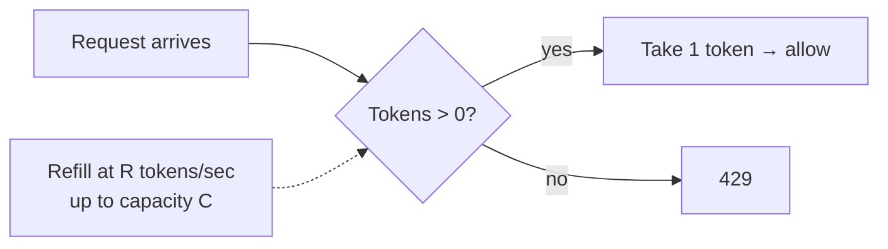

**Reading (token bucket):** a bucket holds up to C tokens and refills at R/sec. Each request takes a token; empty bucket → reject. This permits short bursts (up to C) while enforcing a long-run rate of R — matching real traffic better than a hard fixed cap.

**Atomicity matters:** "read count, check, increment" must be atomic or two concurrent requests both pass. Use a Redis Lua script (or `INCR` + `EXPIRE` in one round trip) so check-and-increment is a single atomic operation.

## 9. Scaling Strategy
- **Shard counters** across Redis by client key (consistent hashing).
- **Local token buckets + async sync:** each gateway node holds a local approximate bucket and periodically reconciles with the central store — trades a little accuracy for huge latency/throughput wins (avoids a Redis round trip per request).
- **Hierarchical limits:** local node-level limit as a cheap first gate, global limit as the authoritative one.

## 10. Bottlenecks
- **Redis round-trip per request** dominates latency → mitigate with local pre-aggregation and pipelining.
- **Hot key:** one massive client hammering one counter → one Redis shard hotspots (foundations: hot-key problem). Mitigate by splitting that client's counter across N sub-keys and summing.

## 11. Failure Scenarios
- **Redis down:** must choose **fail-open** (allow all traffic — protects availability, risks abuse) or **fail-closed** (reject all — protects backends, causes an outage). Most user-facing systems fail *open* for availability; security-critical limits fail *closed*. This is a CAP-flavored business decision.
- **Clock skew** across nodes corrupts time windows → use the store's clock or logical windows.

## 12. Security Considerations
- Rate-limit by *multiple* keys (IP + user + API key) since attackers rotate IPs.
- Beware spoofable identifiers (`X-Forwarded-For`); trust only the edge-set client IP.
- Protects against credential-stuffing and DoS — but a distributed botnet needs additional WAF/anomaly defenses.

## 13. Tradeoffs
- Accuracy vs latency (central store = accurate but slow; local = fast but approximate).
- Fail-open (availability) vs fail-closed (protection).
- Memory (sliding log) vs precision (sliding counter approximates).

## 14. Alternative Designs
- **Stateless rate limiting via JWT claims + client-side** (untrusted, weak).
- **Cloud-native:** API Gateway built-in limits, Envoy's global rate-limit service, Kong's rate-limiting plugin (your existing Kong notes apply directly).

## 15. Interview Discussion
Lead with "which algorithm and why" (token bucket for burst-tolerant APIs, sliding window counter for strict caps). Then *immediately* raise the distributed-counter problem (shared store) and the fail-open/closed decision — that pair is what separates juniors from intermediates here.

## 16. Senior Engineer Insights
Real rate limiters are **approximate by design** — perfect global accuracy isn't worth the latency. Netflix/Stripe-style systems use local buckets with async global reconciliation. The deepest insight: *the rate limiter is itself a dependency that can fail, so it must degrade more gracefully than what it protects.* **Mental model:** *a bouncer with a clicker counter — fast, mostly accurate, and if the clicker breaks you decide in advance whether to wave everyone in or turn everyone away.*

---

# 2. API GATEWAY

## 1. Problem Statement
Imagine your backend is now 40 microservices. Without a front door, your mobile app would have to know the address of every one of them, and *each* of those 40 services would have to re-implement the same boring-but-critical chores: checking who you are (auth), enforcing rate limits, terminating HTTPS, logging traffic. That's 40 copies of the same code, 40 chances to get security wrong, and a client that breaks every time you rename a service.

An **API gateway** fixes this by being the single front door to your whole platform. Every request comes in through it; it handles the shared chores once, then routes the request to the right internal service. The client only ever talks to the gateway and never needs to know what's behind it.

**Why is it hard?** Because that single front door is now in the path of *all* your traffic. It has to add almost no latency, it has to be more reliable than anything behind it (if the gateway is down, your entire platform is down — it's the ultimate single point of failure), and it has to resist the constant temptation to grow into a tangled monster that secretly runs your business logic. (The foundations doc introduces the gateway as a building block; here we design the gateway *itself* as a system.)

## 2. Functional Requirements
- Route requests to backend services by path/host/header.
- Authenticate & authorize (validate JWT/API keys).
- Rate limit & throttle.
- Terminate TLS; transform/aggregate requests; protocol translation (REST↔gRPC).
- Observability: log/trace/meter all traffic.

## 3. Non-Functional Requirements
- Low added latency (one hop, minimal processing).
- Extremely high availability (it's a SPOF for *all* traffic).
- Horizontally scalable; config changes without downtime.

## 4. Capacity Estimation
Simple sizing: if the whole platform serves 500K req/sec, the gateway sees *all* of it (it's the single front door) plus its own overhead. If one gateway node comfortably handles ~5K req/sec, you need ~100 nodes, plus headroom for spikes. One design tip falls straight out of these numbers: validate auth tokens *locally* — verify the JWT's signature in-process — instead of calling an auth service on every request. At 500K req/sec, an extra network hop per request would be brutal.

## 5. API Design
The gateway exposes the *public* API surface and maps it to internal routes via declarative config:
```
route: /api/orders/**  -> order-service   (auth: required, rateLimit: 100/min)
route: /api/catalog/** -> catalog-service  (auth: optional, cache: 60s)
```

## 6. Data Model
Mostly *config*, not data: route table, auth policies, rate-limit rules, service registry references. Stored in a config store (etcd/Consul/DB) and hot-reloaded. The gateway itself is stateless.

## 7. High-Level Architecture

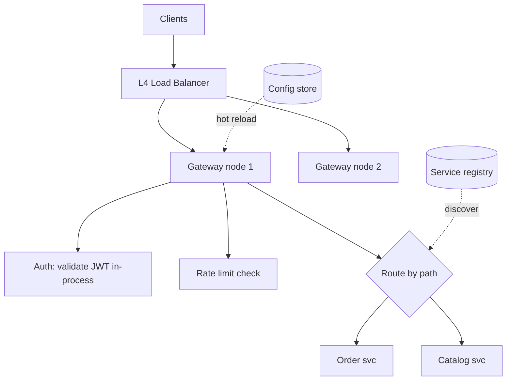

**Reading:** a plain L4 load balancer spreads raw traffic across stateless gateway nodes (so the gateway scales horizontally and the LB handles the gateway's own redundancy). Each node runs the pipeline — auth → rate limit → route — then forwards to the right service, discovered dynamically via the registry. Config and routes hot-reload from a config store so you change behavior without redeploying.

## 8. Deep Dive Components
- **Auth:** validate the JWT signature locally using cached public keys (JWKS) — never call an auth service per request. Only token *introspection/revocation* needs a lookup; cache it.
- **Request pipeline / filters:** an ordered chain (auth → rate limit → transform → route → response filters). Spring Cloud Gateway and Kong both model this as filters/plugins.
- **Aggregation / BFF concern:** light aggregation (combine 2 service calls) is OK; heavy aggregation belongs in a dedicated Backend-for-Frontend, not the gateway (avoid the "god gateway").

## 9. Scaling Strategy
Stateless nodes scale horizontally behind the LB. Push *state* (rate-limit counters, sessions) to shared stores. Use connection pooling and keep-alive to backends. Cache cacheable responses at the gateway.

## 10. Bottlenecks
- TLS termination is CPU-heavy → offload to hardware/optimized libs, reuse sessions.
- Per-request auth network calls (avoid; validate locally).
- The gateway becoming a chokepoint → autoscale on CPU/latency, not just request count.

## 11. Failure Scenarios
- **Gateway fleet overload** → cascading failure across the whole platform. Mitigate with autoscaling, load shedding, and circuit breakers to backends.
- **Bad config push** → routes all break at once (huge blast radius). Mitigate with staged rollout, config validation, and instant rollback.
- **Backend slow** → gateway threads pile up → bulkheads + timeouts per route.

## 12. Security Considerations
The gateway is your security perimeter: enforce auth, validate/sanitize input, WAF rules, mutual TLS to backends, hide internal topology, centralized audit logging. A misconfigured gateway = platform-wide breach.

## 13. Tradeoffs
Centralization (consistency, one place for security) vs. SPOF risk and the temptation to overload it with business logic. Extra hop adds latency. Standardization vs. per-service flexibility.

## 14. Alternative Designs
- **Service mesh (sidecar) for east-west traffic** (Istio/Envoy) — handles service-to-service concerns; the gateway handles north-south (client↔platform). Often used together.
- **BFF per client type** (mobile vs web gateways).

## 15. Interview Discussion
Distinguish gateway (routes across *different* services, API-management features) from load balancer (distributes across *identical* instances). State the SPOF and how you'd run it redundantly. Mention local JWT validation as a latency optimization.

## 16. Senior Engineer Insights
The biggest real-world failure is the **god gateway** — teams pile business logic in and recreate a monolith at the edge. Keep it thin: routing, auth, rate limiting, observability — *mechanism, not policy*. **Mental model:** *the gateway is an airport security + signage system: check everyone once, point them to the right gate, but don't let it start running the airlines.*

---

# 3. DISTRIBUTED SESSION MANAGEMENT

## 1. Problem Statement
Here's a frustrating bug. A user logs in, clicks a link, and is suddenly logged out. Clicks again — logged back in. Again — logged out. What's going on?

The root cause is that HTTP is **stateless**: each request is a stranger to the server, carrying no memory of the last one. So apps need a way to remember "this person is logged in" across requests. On a *single* server this is trivial — you just keep the session in that server's memory. But the moment you add a second app server behind a load balancer, the trouble starts: the user logs in on Server A (which remembers them), but their next request gets routed to Server B (which has never heard of them) — so they look logged out. That's our flickering bug.

**Why is it hard?** The obvious quick fix — "sticky sessions," where the load balancer always sends a user back to the same server — quietly reintroduces the exact coupling that load balancing was supposed to remove (more on why that's a trap in §8). The real challenge is letting *any* server handle *any* request while still knowing who's logged in, and doing it with fast reads (every request needs the session), high availability (if sessions vanish, everyone is logged out at once), and tight security (a session is basically a temporary password — steal it and you're in).

## 2. Functional Requirements
- Create/read/update/destroy a user session.
- Session survives across any server in the fleet.
- Configurable expiry/idle timeout; logout invalidates immediately.

## 3. Non-Functional Requirements
- Low-latency reads (every request reads the session).
- Highly available (session store down = everyone logged out).
- Secure (sessions are credentials — theft = account takeover).
- Scales with users.

## 4. Capacity Estimation
Quick napkin math. Say 10M users are logged in at once, each session record about 2 KB. That's 10M × 2 KB = **20 GB** — comfortably held in a Redis cluster. But now look at the *read rate*: every single request has to look up its session, so the session store's read traffic equals your *entire* request traffic. That's the constraint that actually matters, and it's why we reach for a fast in-memory store rather than a disk-based database.

## 5. API Design
```
POST /login -> Set-Cookie: session_id=...; HttpOnly; Secure; SameSite
GET  /* (cookie sent) -> server resolves session_id -> user
POST /logout -> invalidate session_id
```

## 6. Data Model
Key `sess:{sessionId}` → `{userId, roles, createdAt, lastSeen, csrfToken}` with TTL. The `sessionId` is a long, random, opaque token (never guessable, never containing data).

## 7. High-Level Architecture

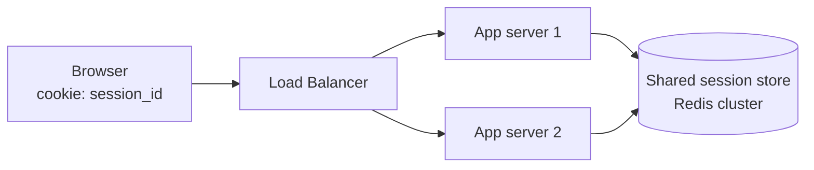

**Reading:** the browser holds only an opaque `session_id` in a cookie. Any app server the LB picks resolves that ID against a *shared* Redis store — so servers are stateless and interchangeable, and the user stays logged in regardless of which node handles the request. The shared store replaces per-server memory; that's the whole fix.

## 8. Deep Dive Components — three approaches
**(a) Sticky sessions (naive improvement):** the LB pins each user to one server (by cookie/IP). Sessions stay in server memory. *Breaks* when that server dies (all its sessions lost) or scales down, and prevents even load distribution. A trap, not a solution.

**(b) Centralized session store (server-side sessions):** the diagram above. Opaque ID in cookie, data in shared Redis. **Pros:** instant revocation (delete the key), small cookie, secure. **Cons:** a store lookup per request (fast, but a dependency), and the store must be HA.

**(c) Stateless / token-based (JWT):** put signed claims *in the token itself* (cookie or `Authorization` header). Server validates the signature locally — **no store lookup**.
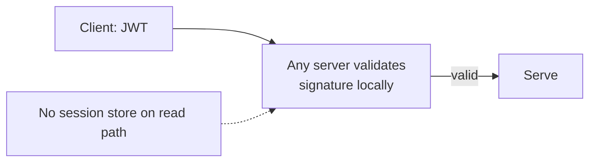
**Reading:** the token carries the identity and is self-verifying via signature, so no shared store is needed for reads — maximally scalable. **The catch:** you *can't easily revoke* a JWT before it expires (it's valid until exp). Logout/ban requires a denylist (which reintroduces a store) or short-lived tokens + refresh tokens.

## 9. Scaling Strategy
- Server-side: Redis cluster, sharded by session ID, replicas for HA.
- JWT: scales trivially (stateless) but pair short access tokens (5–15 min) with longer refresh tokens stored server-side, getting *both* scalability and revocability.

## 10. Bottlenecks
- Session store QPS (one read per request) → in-memory + read replicas + local short-TTL caching.
- JWT size if overstuffed with claims → keep tokens lean.

## 11. Failure Scenarios
- **Session store outage** → mass logout / errors. Mitigate with replication, multi-AZ, and graceful degradation. This is *why* JWTs are attractive — no store on the read path.
- **Replication lag** on session creation → "logged in but next request says logged out" (read-your-writes problem). Route post-login reads to primary briefly.

## 12. Security Considerations
- Cookies: `HttpOnly` (no JS access → XSS-resistant), `Secure` (HTTPS only), `SameSite` (CSRF defense).
- Session IDs: long, random, rotated on privilege change (prevent fixation).
- JWTs: strong signing (RS256), short expiry, never store secrets in them (they're readable), validate `aud`/`iss`/`exp`.
- Always support server-side revocation for "log out all devices" / breach response.

## 13. Tradeoffs
**The central tension:** server-side sessions = easy revocation + store dependency + per-request lookup; JWT = no lookup + great scaling − hard revocation. Most mature systems use a **hybrid**: short-lived JWT access tokens (no lookup on the hot path) + server-side refresh tokens (revocable).

## 14. Alternative Designs
- Encrypted cookie sessions (data in the cookie, encrypted) — no server store, but large cookies and same revocation issue.
- Database-backed sessions (durable but slower than Redis).

## 15. Interview Discussion
Start by killing sticky sessions and explaining *why* (lost on failover, uneven load). Present centralized-store vs JWT as a revocation-vs-scalability tradeoff, then propose the hybrid. Mentioning the read-your-writes lag on login shows depth.

## 16. Senior Engineer Insights
The recurring real-world bug is **revocation** — teams adopt JWTs for scaling, then can't log a compromised user out. The senior move is the hybrid from day one. **Mental model:** *a session is a coat-check ticket. Server-side = the ticket is just a number and the coat (data) stays at the desk, so the desk can refuse it anytime. JWT = the ticket itself is a signed note saying "give bearer the coat" — fast, but once printed you can't un-print it before it expires.*

---

# 4. NOTIFICATION SERVICE

## 1. Problem Statement
"Just send the user an email" sounds like one line of code. Then reality arrives. The marketing team wants to send a push notification *and* an email. Some users have turned off email. Some are asleep (don't wake them at 3 AM). The email provider is having a bad day. A retry accidentally sends the same message twice. And next week someone wants to notify *all 10 million users at once* about a breaking story.

A **notification service** is the one central place that handles all of this, so every feature in your company doesn't reinvent it. Any service says "notify user X," and this platform figures out the channels (email, SMS, push, in-app), respects the user's preferences, renders the templates, retries on failure, and tracks what was actually delivered.

**Why is it hard?** Because almost everything it depends on is unreliable or bursty, and those problems stack on top of each other:
- It hands messages to **third parties** (SendGrid, Twilio, Apple, Google) that throttle you, go down, and fail in weird ways.
- **Broadcasts spike violently** — a "send to everyone" can jump from a trickle to millions of messages in seconds.
- It must honor **per-user preferences and quiet hours**, and obey the law (unsubscribe, GDPR).
- And it must **never spam or double-send** — especially for things like one-time passwords, where a duplicate or a miss is a real problem.

## 2. Functional Requirements
- Send a notification via one or more channels.
- Template management (render content per channel/locale).
- User preferences (opt-in/out per channel/category) and quiet hours.
- Deduplication and delivery-status tracking.
- Scheduled and bulk/broadcast sends.

## 3. Non-Functional Requirements
- Reliable delivery (at-least-once with dedup → effectively-once).
- High throughput for broadcasts; low latency for transactional (OTP, password reset).
- Resilient to provider outages.
- Auditable (who got what, when, status).

## 4. Capacity Estimation
Let's size it. 100M users × 5 notifications/day = 500M per day, which averages out to a gentle **~6K/sec**. But that average is a lie. The moment a breaking-news broadcast fires, you jump from a trickle to *millions in a few seconds*. That spikiness — not the average — is the whole design challenge. And it's exactly why we put a queue in the middle: to soak up the sudden flood, then drain it at whatever pace the email/SMS/push providers can actually accept.

## 5. API Design
```
POST /notifications
{ userId, templateId, channels:[push,email], data:{...}, priority, idempotencyKey }
GET /notifications/{id}/status -> { perChannel: {push: delivered, email: bounced} }
```

## 6. Data Model
- `notification`: id, userId, templateId, channels, status, idempotencyKey, createdAt.
- `template`: id, channel, locale, subject, body (with placeholders).
- `preferences`: userId, channel, category, enabled, quietHours.
- `delivery_log`: notificationId, channel, providerMsgId, status, attempts.

## 7. High-Level Architecture

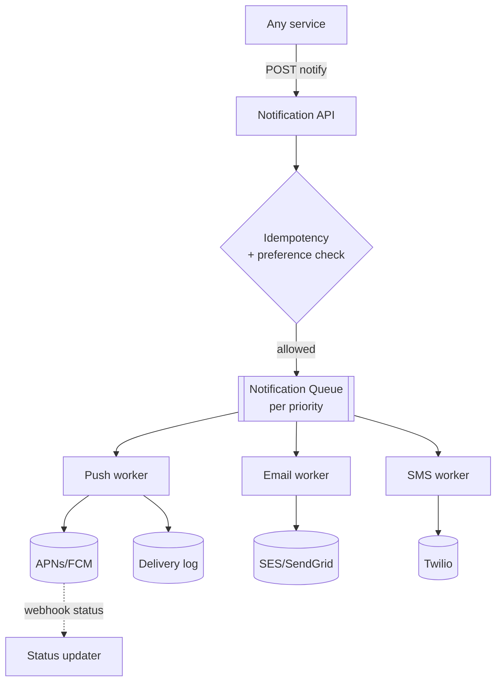

**Reading:** callers POST to one API. It checks the idempotency key (no double-send) and user preferences (respect opt-outs/quiet hours) *before* enqueuing — filtering early saves work. Notifications land on priority queues (transactional OTPs jump ahead of marketing blasts). Channel-specific workers pull from the queue and call the relevant third-party provider, recording status. Providers report final delivery asynchronously via webhooks back into a status updater. The queue is what absorbs broadcast spikes and isolates provider slowness from callers.

## 8. Deep Dive Components

The whole design is really one instinct repeated: *never let the bulk, boring traffic get in the way of the urgent, important traffic.* A marketing blast is huge but nobody's waiting on it; a password-reset code is tiny but someone is staring at their screen waiting for it. The four pieces below are all ways of protecting the second from the first.

- **Priority queues:** separate lanes so a 10M-user marketing broadcast can't delay a password-reset OTP. Think of it like an airport: there's a first-class lane and an economy lane feeding the same gate, so a planeload of economy passengers can't trap the urgent traveler behind them. Transactional > marketing.
- **Fan-out for broadcasts:** "notify all users" is enqueued as a *job*, then expanded into per-user messages by fan-out workers (don't materialize 10M rows synchronously).
- **Provider abstraction + failover:** wrap each provider behind an interface; if SendGrid fails, fail over to SES. Circuit-break unhealthy providers.
- **Retry with backoff + DLQ:** transient provider failures retry with exponential backoff; permanent failures (invalid address) go to a dead-letter queue, not infinite retry.

## 9. Scaling Strategy
Scale workers per channel independently (push volume ≫ SMS). Shard queues by priority and channel. Rate-limit per provider to respect *their* quotas (providers throttle you). Batch where providers support it (FCM multicast).

## 10. Bottlenecks
- **Third-party provider throughput/limits** — the real ceiling; you can't send faster than Twilio accepts. → rate-limit and queue.
- **Broadcast fan-out** generating millions of messages → distribute fan-out across workers.
- **Preference/dedup lookups** per message → cache preferences.

## 11. Failure Scenarios
- **Provider outage** → messages pile in queue; failover to secondary provider; circuit-break the dead one. Queue prevents loss.
- **Duplicate sends** from retries → idempotency key + dedup store makes retries safe (foundations: at-least-once + idempotent).
- **Poison messages** (bad template) → DLQ + alert.
- **Webhook loss** → status stuck "sent"; reconcile via provider status API.

## 12. Security Considerations
Prevent notification spoofing (authenticate callers). Don't leak PII in logs. OTPs short-lived and single-use. Honor unsubscribe legally (CAN-SPAM/GDPR). Rate-limit per user to prevent notification-bombing abuse.

## 13. Tradeoffs
At-least-once (safe, needs dedup) vs at-most-once (simpler, may drop — unacceptable for OTP). Real-time vs batched (batching boosts throughput, adds latency). Single provider (simple) vs multi-provider failover (resilient, complex).

## 14. Alternative Designs
- Per-channel microservices vs one service with channel workers (former isolates better, latter simpler).
- Push directly from callers (rejected — recreates duplication, no central preferences/retry).

## 15. Interview Discussion
Emphasize: queue to absorb spikes, priority lanes (transactional vs marketing), idempotency for safe retries, provider failover, and DLQ. The interviewer is testing whether you see notifications as a *distributed delivery* problem with unreliable downstreams, not a simple `send()` call.

## 16. Senior Engineer Insights
The classic outage: a marketing blast saturates the shared queue and delays OTPs, locking users out — *priority isolation* prevents it. The classic bug: retries without idempotency double-send. **Mental model:** *a mailroom with separate express and bulk lanes, that keeps trying to deliver but knows when to give up (DLQ), and never sends the same letter twice even when the courier says "did it arrive? not sure."*

---

# 5. SMS DELIVERY PLATFORM

## 1. Problem Statement
SMS feels old-fashioned, but it's still how the world receives one-time passwords and critical alerts — and sending it at scale is its own beast. This is a specialized cousin of the notification service, focused purely on getting text messages out through telecom carriers and aggregators (the middlemen who connect you to phone networks).

**Why does SMS deserve its own chapter?** Because unlike a free push notification, SMS comes with constraints that change the whole design:
- **Every message costs real money** — fractions of a cent, but multiply by millions and suddenly your routing choices are a budget line. So you literally shop around for the cheapest reliable carrier per destination ("least-cost routing").
- **Carriers cap your speed.** Each connection might accept only ~100 messages/second, so you can't just blast.
- **The rules are strict and vary by country** — registered sender IDs, mandatory opt-out handling, regional regulations.
- **You're often flying blind on delivery.** Carriers send back "delivery receipts" (DLRs) telling you if a message arrived — but they're late, sometimes never show up, and you can't trust them for time-sensitive UX.
- And one user-facing reality: a password-reset code (OTP) needs to arrive in *seconds*, while a marketing blast can take its time.

## 2. Functional Requirements
- Send SMS to a phone number via carrier/aggregator.
- Route by country/carrier to the cheapest reliable provider (least-cost routing).
- Track delivery via DLRs; handle opt-outs (STOP).
- Support OTP (high priority, low latency) and bulk campaigns.

## 3. Non-Functional Requirements
- Low latency for OTP (< a few seconds end-to-end).
- High throughput for campaigns.
- Cost-optimized routing; provider failover.
- Compliant (TCPA, country sender-ID rules).

## 4. Capacity Estimation
Napkin math: 50M SMS/day works out to **~600/sec** on average, spiking much higher during campaigns. Here's the catch the numbers reveal — each carrier connection might only accept ~100 messages/sec. So even at the *average* rate you already need several connections, and at peak you need many connections across multiple providers, with a queue pacing the flow to match what each one is willing to swallow.

## 5. API Design
```
POST /sms { to, from, body, type: OTP|TXN|MKT, idempotencyKey }
   -> { messageId, status: queued }
Webhook: provider -> /dlr { messageId, status: delivered|failed, errorCode }
```

## 6. Data Model
- `message`: id, to, from, body, type, providerId, status, cost, attempts.
- `routing_rule`: country/prefix → ordered provider list with price/quality.
- `optout`: phoneNumber, timestamp.

## 7. High-Level Architecture

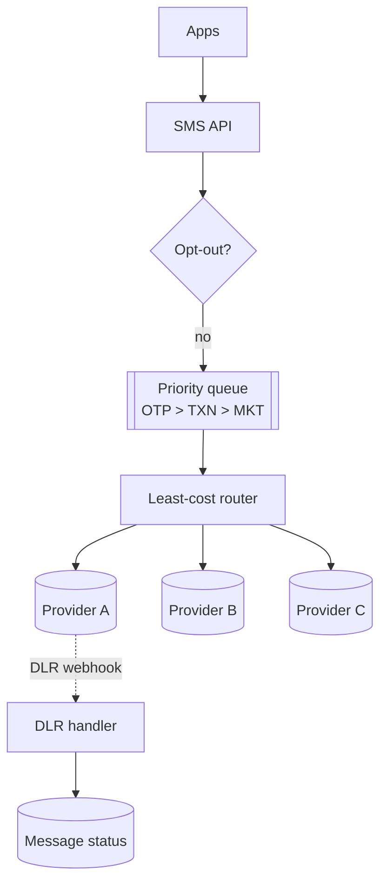

**Reading:** requests pass an opt-out check, then enter a priority queue (OTP ahead of marketing). A least-cost router selects a provider per destination by price and quality, with failover to the next provider on rejection. Providers asynchronously return delivery receipts (DLRs) via webhook, updating final status. The routing layer is the value-add unique to SMS — it's literally optimizing cost-per-message across carriers.

## 8. Deep Dive Components
- **Least-cost routing (LCR):** choose provider by destination price *and* historical delivery quality; reroute on failure. This directly affects the bill.
- **Per-provider rate limiting:** respect each carrier connection's TPS; queue and pace.
- **DLR reconciliation:** DLRs are flaky/late; mark "delivery unknown" and reconcile; don't block OTP UX on the DLR.
- **OTP fast path:** OTPs bypass bulk lanes; sometimes use a premium high-deliverability route despite cost.

## 9. Scaling Strategy
Multiple connections per provider; shard the queue by priority and region; horizontally scale sender workers; pre-warm provider connections.

## 10. Bottlenecks
- Carrier/provider TPS limits — the hard ceiling.
- DLR webhook floods during campaigns.
- Phone-number validation/normalization (E.164) at volume.

## 11. Failure Scenarios
- **Provider down/degraded** → failover via LCR; circuit-break.
- **DLR never arrives** → status stuck; periodic reconciliation job.
- **Duplicate OTP** → idempotency key; also rate-limit OTP per number to prevent abuse/bill shock.

## 12. Security Considerations
SMS OTP is phishable/SIM-swappable — note it's a weak second factor. Rate-limit OTP requests per number (prevent SMS-pumping fraud that runs up your bill). Sanitize content; comply with opt-out laws; protect against toll fraud.

## 13. Tradeoffs
Cost (cheapest route) vs deliverability/latency (premium route) — OTP favors quality, marketing favors cost. At-least-once vs duplicate cost (each duplicate SMS costs real money → dedup is also a cost control).

## 14. Alternative Designs
Direct single-aggregator (Twilio) — simpler, less control, vendor lock-in, higher cost at scale. Multi-aggregator LCR — complex but cheaper and more resilient (the scale answer).

## 15. Interview Discussion
Highlight what makes SMS special vs generic notifications: least-cost routing, per-carrier TPS limits, flaky DLRs, real per-message cost, and OTP fraud (SMS pumping). That specificity shows you understand the domain, not just "send a message."

## 16. Senior Engineer Insights
Two things bite in production: **SMS-pumping fraud** (attackers trigger millions of OTPs to premium numbers they own, costing you a fortune — defend with per-number/IP rate limits and velocity checks) and **DLR unreliability** (never make UX depend on a timely receipt). **Mental model:** *a global postal broker choosing the cheapest reliable carrier per destination, that keeps a fast premium lane for urgent letters and watches for fraudsters mailing themselves on your dime.*

---

# 6. PUSH NOTIFICATION SYSTEM

## 1. Problem Statement
When a "Breaking News" banner pops up on your phone's lock screen, where did it come from? Not directly from the news company's servers — they *can't* reach your phone directly. Instead they handed the message to Apple (APNs) or Google (FCM), and *those* gateways delivered it to your device. We're building the system that orchestrates this: deliver real-time messages to millions of mobile and web apps via the platform push services.

**Why is it hard?** The core twist is that **you don't control the last mile** — Apple and Google do, and you must play by their rules:
- You go through their gateways, with their protocols, their connection limits, and their throughput caps.
- **Device tokens are slippery.** A token is the "address" of one app on one device. They rotate, expire, and go dead when someone uninstalls the app. If you keep pushing to dead tokens, your delivery rate silently rots and you waste effort.
- **Broadcasts are enormous.** "Notify all 200 million devices" must fan out almost instantly — but if you dump it all at once, the gateways throttle you and delivery tanks. You have to pace it.

## 2. Functional Requirements
- Register/refresh device tokens per user/device.
- Send to a user (all their devices), a segment, or broadcast to all.
- Handle token invalidation (uninstalls).
- Support payloads, badges, deep links, silent pushes.

## 3. Non-Functional Requirements
- High throughput for broadcasts (millions in seconds).
- Low latency for transactional pushes.
- Reliable token management; graceful handling of provider limits.

## 4. Capacity Estimation
Picture the worst case: 200M registered devices, and a breaking-news alert that should reach all of them within seconds to minutes. Apple's and Google's gateways *can* take high throughput over long-lived HTTP/2 connections (which carry many messages over a single pipe), but they still cap how fast you can go. The only way to hit that target is **massive parallelism**: many workers, each holding a pool of reused connections, all pushing at once.

## 5. API Design
```
POST /devices { userId, token, platform }
POST /push { target: user|segment|all, payload, ttl, priority }
```

## 6. Data Model
- `device`: token, userId, platform, appVersion, lastActive, valid.
- `segment`: criteria (used to resolve target users).
Token store must support fast "all tokens for user" and bulk scans for broadcasts.

## 7. High-Level Architecture

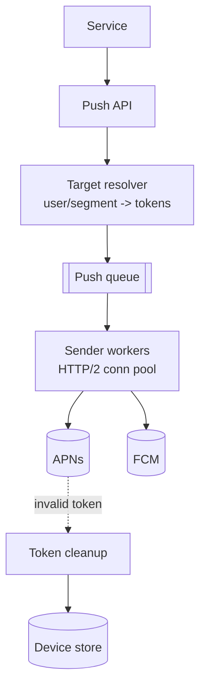

**Reading:** a push request is resolved into a concrete list of device tokens (one user → many devices; a segment → many users → many devices; "all" → a huge scan). Tokens are enqueued and sender workers push them over pooled HTTP/2 connections to APNs/FCM. When a provider reports an invalid/expired token (e.g., app uninstalled), a cleanup process prunes it from the device store — keeping the token base healthy and avoiding wasted sends. Target resolution + token hygiene are the core of the system.

## 8. Deep Dive Components
- **Token lifecycle:** tokens rotate and die; ingest provider feedback (APNs feedback, FCM `NotRegistered`) to mark tokens invalid — otherwise delivery rates silently rot.
- **Broadcast fan-out:** resolve "all" lazily into batches; parallelize across workers; pace to provider limits.
- **HTTP/2 connection multiplexing:** reuse long-lived connections to APNs/FCM (handshakes are expensive at this volume).
- **Priority & collapsing:** collapse keys so a device that's been offline gets only the *latest* of N queued pushes, not all N.

## 9. Scaling Strategy
Many sender workers, each holding pooled connections; shard device store by user/token; batch FCM multicast; regionally distribute senders to be near provider endpoints.

## 10. Bottlenecks
- Provider connection limits & throughput.
- Broadcast token resolution (scanning 200M devices) → precompute segments, parallelize.
- Invalid-token churn wasting sends.

## 11. Failure Scenarios
- **Provider (APNs/FCM) outage** → queue and retry; pushes are best-effort (TTL drops stale ones).
- **Token store stale** → low delivery rate; aggressive cleanup.
- **Thundering broadcast** overwhelming workers → rate-pace and prioritize.

## 12. Security Considerations
Protect push credentials (APNs keys/FCM secrets). Validate payloads (no PII in notification text — it shows on lock screens). Prevent push spoofing via authenticated APIs. Respect per-user push preferences (ties to the Notification Service).

## 13. Tradeoffs
Best-effort delivery (push is inherently lossy — device off/uninstalled) vs reliability expectations (don't promise guaranteed delivery for push; use it for engagement, not critical data). TTL/collapsing (fresh but may drop) vs deliver-all (stale floods).

## 14. Alternative Designs
Often a *channel within* the Notification Service (System 4) rather than standalone. WebSocket/long-poll for in-app real-time when the app is foregrounded (push for background).

## 15. Interview Discussion
Stress that you can't reach devices directly — APNs/FCM are mandatory intermediaries with limits and token lifecycles. Token hygiene and broadcast fan-out are the interesting parts. Note push is best-effort, unlike a durable queue.

## 16. Senior Engineer Insights
Delivery rates quietly decay if you don't process invalid-token feedback — a top real-world issue. And broadcasts must be *paced*: dumping 200M pushes instantly trips provider throttling and tanks delivery. **Mental model:** *you're not the mail carrier — you hand sacks of mail to Apple and Google, keep your address book clean (dead tokens out), and feed them at a pace they'll accept.*

---

# 7. LOGGING SYSTEM

## 1. Problem Statement
It's 3 AM, something is broken in production, and the only thing standing between you and a fix is the ability to search your logs and see what actually happened. Now imagine those logs are pouring in from thousands of services across thousands of machines — millions of lines every second. We're building the system that collects, stores, and makes all of that searchable.

**Why is it hard?** Logs are a firehose, and a firehose creates three conflicting pressures:
- **Insane write volume, in bursts.** Millions of lines per second, spiking when things go wrong (exactly when you need it most).
- **You can't keep everything forever** (it's terabytes per day, and storage costs real money), but you also **can't lose the important stuff** (audit logs, errors).
- **Search must be fast across enormous data**, or it's useless during an incident.
- And the subtle killer: **the logging system must never take down the apps it watches.** If your app's request thread blocks waiting for a slow log backend, a logging hiccup becomes an app outage. Logging has to fail by quietly dropping data, never by freezing the app.

## 2. Functional Requirements
- Ingest structured logs from many sources.
- Store with retention tiers; search/filter by fields & time.
- Tail/stream live logs; alert on patterns.

## 3. Non-Functional Requirements
- Very high write throughput; bursty.
- Durable for critical logs (audit), best-effort for debug.
- Fast time-bounded search; cost-efficient at scale.
- **Non-blocking for producers** (logging must not slow or crash apps).

## 4. Capacity Estimation
Let's add it up, because the number is genuinely shocking. 10K servers, each emitting ~100 log lines/sec, each line ~500 bytes: 10,000 × 100 × 500 bytes = **500 MB every second**. Over a day, that's ~43 TB. Let that sink in — *terabytes per day* — and that write-volume-and-storage-cost is the constraint that dominates every decision. At this scale, buffering, compression, tiered storage, and sampling stop being nice-to-haves and become survival requirements.

## 5. API Design
```
Agent -> POST /ingest (batched, compressed)
Query: GET /search?q=level:ERROR service:orders&from=..&to=..
```

## 6. Data Model
Log event: `{ts, service, host, level, traceId, message, fields{}}`. Indexed by time + service + level + traceId. Stored in time-partitioned indices.

## 7. High-Level Architecture

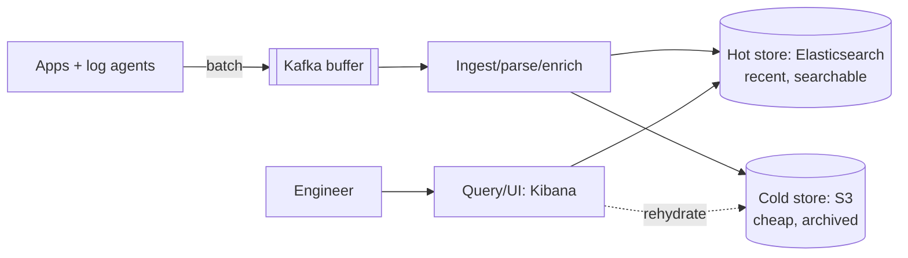

**Reading:** apps write logs locally; lightweight agents batch and ship them into **Kafka**, which absorbs bursts and decouples producers from the slower indexing pipeline (so a slow search cluster never backs up into the apps). Ingest workers parse/enrich and write recent logs to a **hot** searchable store (Elasticsearch) and stream everything to **cold** cheap storage (S3). Engineers query the hot store for recent debugging; old data is rehydrated from cold on demand. The Kafka buffer + hot/cold split is the cost-and-resilience backbone.

## 8. Deep Dive Components

The golden rule running through all of this: **logging is a passenger, never the driver.** The system that's *producing* logs (your actual app serving real users) must never slow down or crash because the system that *collects* logs is having a bad day. Every decision below flows from that — and from the brutal reality that at scale you simply cannot afford to keep every log forever.

- **Async, non-blocking agents:** apps write to a local buffer/file; agents ship asynchronously. The app's job is to scribble a line and immediately get back to serving the user — like dropping a letter in a mailbox and walking away, not standing at the post office waiting for it to arrive. If logging backs up, apps *drop* logs rather than block — observability must never cause an outage.
- **Tiered retention:** hot (7 days, searchable, expensive) → warm → cold (S3/Glacier, cheap, slow). Auto-expire by policy.
- **Sampling:** at extreme volume, sample high-frequency debug logs; never sample errors/audit.
- **Compression + columnar/inverted indexing** for storage and search efficiency.

## 9. Scaling Strategy
Partition Kafka by service; shard Elasticsearch by time and service; scale ingest workers with backlog. Index only fields you search; store the rest as opaque blobs.

## 10. Bottlenecks
- Write/index throughput on the search cluster — the usual choke.
- Storage cost (tiering + retention is the lever).
- Expensive unbounded queries (no time range) → enforce time bounds.

## 11. Failure Scenarios
- **Ingestion pipeline down** → Kafka buffers; agents buffer locally; drop oldest if full (bounded loss of debug logs, never block apps).
- **Search cluster overload** → throttle/queue queries; isolate from ingest.
- **Log flood** (a service goes haywire logging) → per-source rate caps.

## 12. Security Considerations
Logs leak secrets/PII constantly — scrub at ingest. Access control (audit logs are sensitive). Tamper-evident storage for compliance logs. Encrypt at rest/in transit.

## 13. Tradeoffs
Durability vs cost (sample/drop debug, never errors). Real-time index vs batch (latency vs throughput). Retention length vs storage bill.

## 14. Alternative Designs
ELK (Elasticsearch/Logstash/Kibana) vs Grafana Loki (cheaper, indexes only labels not full text) vs managed (Datadog/CloudWatch). Loki's "index labels, not content" trades search richness for far lower cost — a common modern choice.

## 15. Interview Discussion
Lead with "this is a write-heavy ingestion problem" → Kafka buffer, async non-blocking agents, hot/cold tiering. The key insight to voice: *the logging system must degrade by dropping logs, never by blocking the apps.*

## 16. Senior Engineer Insights
The cardinal sin is synchronous logging that blocks request threads when the log backend slows — it turns a logging hiccup into an app outage. Always async + bounded buffer + drop policy. Cost discipline (tiering, sampling, label-only indexing) is the other perennial fight. **Mental model:** *a firehose into a buffered reservoir — recent water is clean and on tap (hot), the rest flows to a cheap cistern (cold), and if the reservoir overflows you spill water, never burst the pipe feeding it.*

---

# 8. METRICS PLATFORM

## 1. Problem Statement
Logs tell you *what happened* in detail. Metrics tell you *how things are trending* — the dashboards full of lines going up and down: CPU usage, request latency, requests per second, sign-ups per hour. We're building the system that collects these numbers from across your entire fleet, stores them cheaply, and powers both the dashboards engineers stare at and the alerts that wake them up.

**Why is it its own system, separate from logging?** Because a metric is a fundamentally different shape of data. A log is a discrete *event* ("user 5 placed order 99 at 10:04"). A metric is a *number sampled over time* ("latency was 42ms, then 47ms, then 41ms..."). That difference makes metrics far cheaper to store — but it introduces a brand-new enemy unique to this world: **high cardinality**. Don't worry about the term yet; we'll meet it properly in §8. The one-line version: if you're not careful about *how* you label your metrics, the storage cost can explode by a million times overnight and crash the whole platform. Taming that is the heart of this design.

## 2. Functional Requirements
- Ingest metrics (counters, gauges, histograms) with labels/dimensions.
- Aggregate over time windows; query/visualize (dashboards).
- Alerting on thresholds/anomalies.

## 3. Non-Functional Requirements
- High write throughput; efficient long-term storage.
- Fast aggregation queries for dashboards.
- Cardinality control.

## 4. Capacity Estimation
Let's size it and find the surprise. Say 1M distinct metric series, each sampled every 15 seconds → about 66K samples/sec. Raw, each sample is ~16 bytes (a timestamp plus a value), but time-series databases compress brilliantly — they store tiny differences between consecutive points and squeeze it down to ~1–2 bytes each. So storage turns out to be modest... *as long as the number of series stays around 1M*. And there's the trap: that "1M series" figure is entirely in your hands, and a single careless label can multiply it a thousandfold. Storage is cheap; **cardinality** is the real bill (we'll explain exactly why in §8).

## 5. API Design
```
Push: POST /metrics  OR  Pull: scrape GET /metrics (Prometheus model)
Query: PromQL e.g. histogram_quantile(0.99, rate(http_latency_bucket[5m]))
```

## 6. Data Model
A series = metric name + label set, e.g. `http_requests_total{service="orders",status="500"}`. Each series is a stream of `(timestamp, value)`. Stored in a time-series DB (foundations Part 5).

## 7. High-Level Architecture

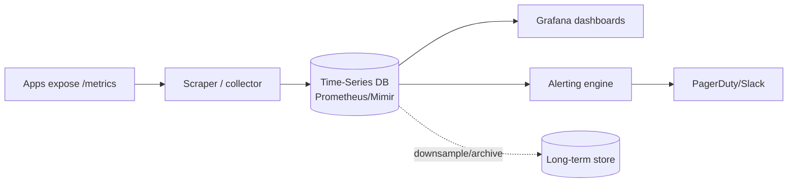

**Reading:** apps expose metrics (RED/USE — foundations Part 10); a scraper pulls them on an interval into a TSDB optimized for time-series compression. Grafana queries the TSDB for dashboards; an alerting engine evaluates rules continuously and pages on breach. Older data is downsampled (e.g., 15s → 5m resolution) into long-term storage to control cost. Pull-based scraping (Prometheus model) means the platform discovers and polls targets, naturally handling ephemeral instances.

## 8. Deep Dive Components
**Let's finally explain cardinality, because it's the concept that makes or breaks this system.** A metric isn't just one line — it's one line *per unique combination of labels*. Take `http_requests{service, status}`. With 10 services and 5 status codes, that's 10 × 5 = 50 separate lines ("series"). Manageable. Now some well-meaning engineer adds a `user_id` label to "see requests per user." You have 10M users. Suddenly that's 10 × 5 × 10,000,000 = **half a billion series**, and your database falls over at 3 AM. *That* is a cardinality explosion: the count of series multiplies out of every label you add, and high-uniqueness labels (IDs, emails, request IDs) detonate it. The golden rule below keeps you safe.

- **Cardinality control:** every unique label combination is a brand-new series, so the series count is the *product* of all your label values. The rule that saves you: **labels are for low-cardinality dimensions** (service, region, status code — things with a handful of values), **never for IDs** (user_id, request_id, email). This is the single most common — and most catastrophic — metrics mistake.
- **Histograms & percentiles:** store bucketed histograms so you can compute p99 across the fleet (averages lie — foundations tail-latency lesson).
- **Downsampling & retention:** keep high resolution short-term, downsample for long-term trends.
- **Pull vs push:** pull (Prometheus) auto-detects dead targets and simplifies discovery; push (StatsD) suits short-lived jobs. Often both via a gateway.

## 9. Scaling Strategy
Federate/shard Prometheus by service/region; use scalable backends (Thanos/Cortex/Mimir/VictoriaMetrics) for global query and long retention. Recording rules precompute expensive queries.

## 10. Bottlenecks
- **Cardinality** — dominates memory and query cost.
- Expensive ad-hoc queries over long ranges → recording rules + downsampling.
- Ingest throughput at very high series counts.

## 11. Failure Scenarios
- **Scraper down** → gaps in data; HA pairs of scrapers.
- **Cardinality explosion** (someone adds a high-card label) → OOM the TSDB; enforce label limits and review.
- **Alerting outage** → blind during incidents; run alerting redundantly, and alert on the monitoring system itself.

## 12. Security Considerations
Metrics can leak business data (revenue, user counts) — access control dashboards. Authenticate scrape endpoints. Don't expose internal metrics publicly.

## 13. Tradeoffs
Resolution vs storage (downsampling). Cardinality (rich dimensions) vs cost. Pull (discovery, dead-target detection) vs push (short jobs). Metrics (cheap, aggregate, no per-event detail) vs logs (detailed, expensive) vs traces — use all three (foundations Part 10).

## 14. Alternative Designs
Prometheus + Thanos/Mimir (open source) vs Datadog/CloudWatch (managed) vs InfluxDB/TimescaleDB. Choice hinges on scale, retention, and ops appetite.

## 15. Interview Discussion
Differentiate metrics from logs immediately (aggregated numbers vs events → different storage). Then nail cardinality as the core scaling challenge and percentiles over averages. Mention pull-based scraping and downsampling.

## 16. Senior Engineer Insights
Cardinality is where metrics platforms die — one engineer adds `user_id` as a label and the TSDB OOMs at 3 AM. Guardrails (cardinality limits, label linting) are essential. Also: **alert on symptoms (user-facing SLOs), not causes** — too many low-level alerts cause fatigue and missed real incidents. **Mental model:** *a stock ticker, not a transaction journal — it tracks aggregate trends cheaply over time; the moment you try to make it remember every individual transaction (high cardinality), it collapses.*

---

# 9. CONTENT MANAGEMENT SYSTEM (CMS)

## 1. Problem Statement
Think of a big news site or a company's marketing pages. A handful of editors write and publish articles; millions of readers consume them. We're building the system behind that — letting non-technical people create, organize, and publish content (pages, articles, images), which then gets served fast to a huge audience.

**Why is it interesting?** Because the two sides of this system have wildly opposite needs, and the whole art is keeping them apart:
- The **write side** is tiny (a few editors) but rich and fiddly — drafts, reviews, "publish next Tuesday at 9 AM," version history so you can roll back a mistake.
- The **read side** is enormous (millions of readers) and wants one thing: speed.
- And these two collide in the classic CMS headache: editors want their changes to appear *instantly*, but fast reads come from heavy **caching** — and a cache, by definition, is showing slightly old data. "I hit publish but the site still shows the old version!" is the bug that haunts every CMS. Reconciling fresh edits with cached reads is the puzzle we're here to solve.

## 2. Functional Requirements
- CRUD content with structured types/fields.
- Draft/preview, editorial workflow & roles, versioning/rollback.
- Media management; publish to web/app/API (headless).
- Scheduling (publish at time T).

## 3. Non-Functional Requirements
- Fast reads at scale (millions of readers).
- Reliable authoring (don't lose editors' work).
- Strong access control; preview consistency for editors.

## 4. Capacity Estimation
The numbers here tell a lopsided story. Reads dwarf writes — say 100K reads/sec versus maybe 100 writes/sec, a thousand-to-one ratio. When you see a gap that extreme, the design almost writes itself: throw caches and a CDN at the read path so it scales effortlessly, and let the tiny write path focus on getting editing, workflow, and correctness right rather than chasing raw throughput.

## 5. API Design
```
Authoring: POST/PUT /content, POST /content/{id}/publish, GET /content/{id}/versions
Delivery (headless): GET /published/{slug}  (heavily cached)
```

## 6. Data Model
- `content`: id, type, fields(json), status(draft/published), version, authorId.
- `content_version`: full snapshots for rollback.
- `media`: in object storage + metadata row.
Separate **authoring** store (rich, mutable) from **published/delivery** store (denormalized, read-optimized).

## 7. High-Level Architecture

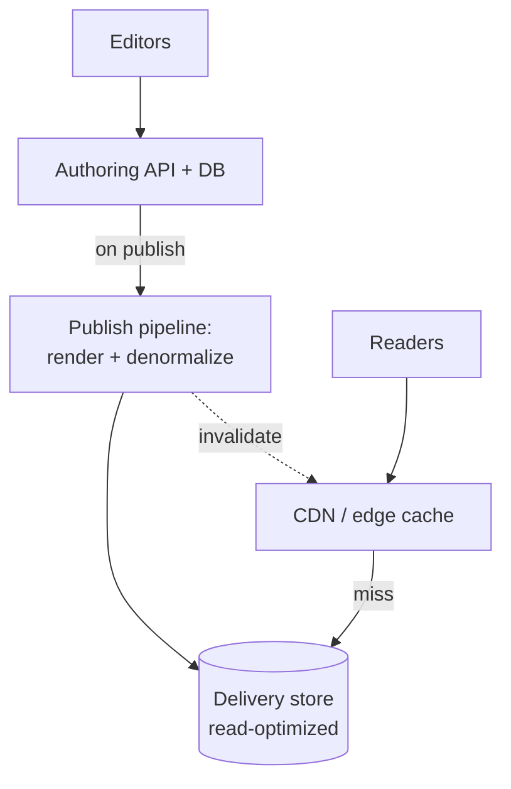

**Reading:** editors work against a rich **authoring** store (drafts, versions, workflow). Publishing triggers a pipeline that renders/denormalizes the content into a **delivery** store optimized for fast reads, and *invalidates the CDN* for the changed URLs. Readers hit the CDN first; misses fall to the delivery store. This **read/write separation** lets editing be flexible and consistent while reads are blazing and cache-friendly — and publishing is the controlled moment that bridges them.

## 8. Deep Dive Components
- **Authoring vs delivery split:** the key architectural move — decouple the mutable editorial model from the immutable-ish published model. Publishing is a deliberate denormalize+cache-bust step.
- **Versioning:** store snapshots (or diffs) per publish for rollback/audit.
- **Cache invalidation on publish:** purge only affected URLs (content-keyed); use content-hashed asset URLs (foundations CDN section) so assets never go stale.
- **Headless delivery:** serve content via API/CDN to web, mobile, etc.

## 9. Scaling Strategy
Read side: CDN + delivery-store read replicas + cache → near-infinite read scale. Write side: modest single primary suffices. Media: object storage + CDN.

## 10. Bottlenecks
- Cache invalidation correctness on publish (stale pages) — the main headache.
- Large media → object storage + CDN, never the DB.
- Preview consistency (editors must see their unpublished draft instantly — read-your-writes).

## 11. Failure Scenarios
- **Delivery store/CDN issue** → serve stale-but-available cached content (graceful: better stale than down for a content site).
- **Publish pipeline failure** → content stuck in draft; retries + idempotent publish.
- **Lost edits** → autosave drafts frequently, optimistic locking to prevent editors overwriting each other.

## 12. Security Considerations
Role-based access (author/editor/publisher/admin). Sanitize content (stored XSS via rich text is a top CMS vuln). Protect preview URLs. Audit who published what.

## 13. Tradeoffs
Read/write separation (fast reads, but publish complexity & eventual consistency between authoring and live). Cache TTL (freshness vs origin load). Headless flexibility vs integrated simplicity.

## 14. Alternative Designs
Traditional coupled CMS (WordPress) vs headless (Contentful/Strapi) vs static site generation (render to static files on publish, serve from CDN — ultimate read scale, the JAMstack approach).

## 15. Interview Discussion
The signal is recognizing read/write asymmetry and proposing authoring/delivery separation with publish-time cache invalidation. Discuss stored-XSS sanitization and editor read-your-writes for previews.

## 16. Senior Engineer Insights
Most CMS pain is **cache invalidation** — "I published but the site shows the old version." Solve it by keying invalidation to content and preferring static generation where possible (nothing scales like static files on a CDN). **Mental model:** *a newsroom + printing press: editors draft freely in the back office; "publish" runs the press and ships papers to every newsstand (CDN) at once — and you must recall the old edition from every stand, the hard part.*

---

# 10. BLOG PLATFORM

## 1. Problem Statement
A CMS has a few trusted editors. Now blow that open: a blog platform like Medium or WordPress.com has *millions* of independent authors, each with their own followers, all publishing into one shared system. Readers follow authors, get a personalized feed of new posts, leave comments, and hit "like."

**Why is it harder than a CMS?** Two new ingredients change the game:
- It's **multi-tenant** — millions of strangers share the platform, so author A must never be able to touch author B's posts, and spammers will absolutely show up.
- It's **social**, which means **feeds** — and feeds bring the famous "fan-out" problem. When an author publishes, that post must somehow reach all their followers' feeds. For a normal author that's easy. For an author with 5 million followers, "deliver this post to 5 million feeds" is suddenly a serious engineering problem (we'll dig into it in §8). This is the canonical *fan-out* system in miniature, layered on top of the read-heavy content serving you already met in the CMS.

## 2. Functional Requirements
- Authors write/publish posts (markdown/rich text).
- Readers view posts, follow authors, get a feed, comment, like.
- Tags/categories, search, trending.

## 3. Non-Functional Requirements
- Read-heavy, low-latency reads, SEO-friendly (fast first paint).
- Highly available; eventual consistency fine for counts/feeds.
- Multi-tenant isolation.

## 4. Capacity Estimation
Quick math: 1M daily active users reading ~50 posts each = 50M reads/day, roughly **600/sec** on average. The average looks calm, but a single viral post can pull a wildly disproportionate share of that traffic onto *one* item — the classic "hot key" problem we'll tackle later. Posts themselves are small (text, with images living in object storage). The shape is unmistakable: read-dominated, so caching and a CDN are the backbone.

## 5. API Design
```
POST /posts, GET /posts/{slug}, GET /feed (following), 
POST /posts/{id}/comments, POST /posts/{id}/like, GET /search?q=
```

## 6. Data Model
- `post`: id, authorId, slug, title, body, tags, status, publishedAt, counters.
- `follow`: followerId, authorId.
- `comment`, `like` (denormalized counters on post).
- Feed: precomputed or computed-on-read (see deep dive).

## 7. High-Level Architecture

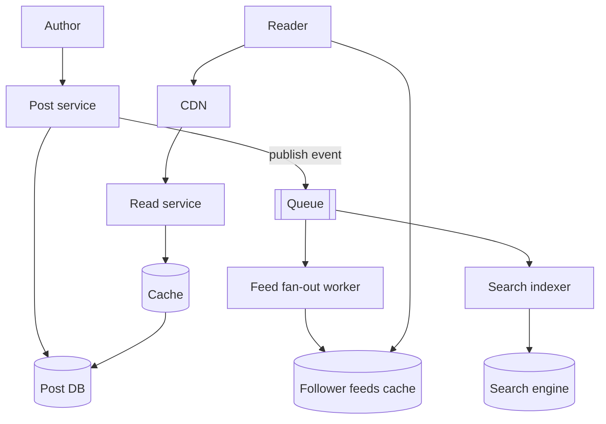

**Reading:** authors publish to the post service (source of truth in the post DB), which emits a publish event onto a queue. Async workers fan the post into followers' feeds and index it for search — keeping publish fast and decoupled. Readers fetch posts via CDN→read-service→cache→DB, and pull their personalized feed from a precomputed feed store. Search hits the inverted index (foundations Part 4.8). This separates the small write path from the heavy read+feed+search paths.

## 8. Deep Dive Components
- **Feed generation — fan-out on write vs read:** push each new post into followers' feeds on publish (fast reads, costly for authors with millions of followers — the celebrity problem), or assemble feeds on read (cheap writes, slow reads). **Hybrid:** fan-out on write for normal authors, fan-out on read for mega-popular ones (foundations Twitter pattern).
- **Counters (likes/views):** high-write hot counters → buffer/aggregate (eventually consistent), don't transact each like.
- **Search & trending:** inverted index for search; trending via windowed counts.

## 9. Scaling Strategy
Read replicas + CDN + cache for posts; sharded feed store; async fan-out workers scale independently; object storage + CDN for media.

## 10. Bottlenecks
- Viral post = hot key → replicate/local-cache it.
- Feed fan-out for high-follower authors → hybrid model.
- Comment/like write spikes → buffer counters.

## 11. Failure Scenarios
- **Fan-out worker backlog** → feeds lag (acceptable, eventual). 
- **Cache stampede on a viral post** → single-flight + jittered TTL (foundations Part 6).
- **Spam flood** → rate limit + moderation queue.

## 12. Security Considerations
Stored XSS in post/comment HTML (sanitize). Spam/abuse (rate limits, moderation, captcha). Multi-tenant isolation (one author can't edit another's posts). CSRF on actions.

## 13. Tradeoffs
Fan-out on write (fast reads, write amplification) vs read (cheap writes, slow reads) → hybrid. Strong vs eventual consistency (counts/feeds are fine eventual). Precomputed feeds (storage) vs on-demand (compute).

## 14. Alternative Designs
Static generation for published posts (great SEO/scale) + dynamic feed/comments overlay. Single-tenant WordPress vs multi-tenant SaaS.

## 15. Interview Discussion
This is the canonical *fan-out* interview in miniature — articulate the write-vs-read fan-out tradeoff and the hybrid for popular authors. Add hot-key handling for viral posts and eventual-consistency for counters.

## 16. Senior Engineer Insights
The feed fan-out decision dominates everything, and the right answer is almost always *hybrid*, decided by follower count. Counters are deceptively hard at scale — never run a transaction per like. **Mental model:** *a publishing house + a postal feed: printing a book is cheap, but mailing a copy to every one of a bestselling author's million subscribers (fan-out on write) is the expensive part — so for superstars you let readers come pull it instead.*

---

# 11. FILE UPLOAD SERVICE

## 1. Problem Statement
A user on a phone with two bars of signal tries to upload a 2 GB video. Halfway through, the connection drops. Do they have to start over from zero? And meanwhile, are those 2 GB of video bytes flowing *through your application servers*, eating their memory and bandwidth? If so, the first big upload will bring your servers to their knees. We're building a file upload service that handles all of this gracefully — for images, documents, and multi-gigabyte videos alike.

**Why is it hard?** Three traps catch the naive design:
- **Big files over flaky networks** need to be uploaded in chunks and *resumed* after a drop — never restarted from scratch.
- **Routing file bytes through your app servers is a disaster** at scale. Your app servers should broker permission and metadata, not haul gigabytes on their backs. (The fix — uploading directly to object storage — is the key insight of this whole chapter.)
- And you still have to **validate, scan for malware, deduplicate, and serve** all those files efficiently and safely, since "let users upload arbitrary files" is also "let attackers upload arbitrary files."

## 2. Functional Requirements
- Upload files (small and large/multi-GB), resumable.
- Download/serve files; generate thumbnails/transcodes.
- Metadata, access control, deduplication.

## 3. Non-Functional Requirements
- Reliable uploads over flaky networks (resume, not restart).
- High durability; efficient serving.
- Don't bottleneck app servers on file bytes.

## 4. Capacity Estimation
Napkin math: 1M uploads/day at an average of 5 MB each = **5 TB of incoming data per day**. Now picture all of that flowing *through* your application servers — they'd burn every CPU cycle and every byte of bandwidth just shuffling files around, doing no actual work. That one realization drives the entire design: the bytes must bypass your app servers and go *straight to object storage*, using presigned URLs (the key pattern we build in §7–8).

## 5. API Design
```
POST /uploads -> { uploadId, presignedUrl(s) }   // client uploads directly to S3
PUT presignedUrl (bytes, by chunk)               // multipart for large files
POST /uploads/{id}/complete -> finalize, store metadata
GET /files/{id} -> presigned download URL (via CDN)
```

## 6. Data Model
- `file`: id, ownerId, key(in object store), size, contentType, checksum, status, createdAt.
- `upload_session`: id, parts[], status (for resumable multipart).
Metadata in DB; bytes in object storage (foundations: metadata/blob split).

## 7. High-Level Architecture

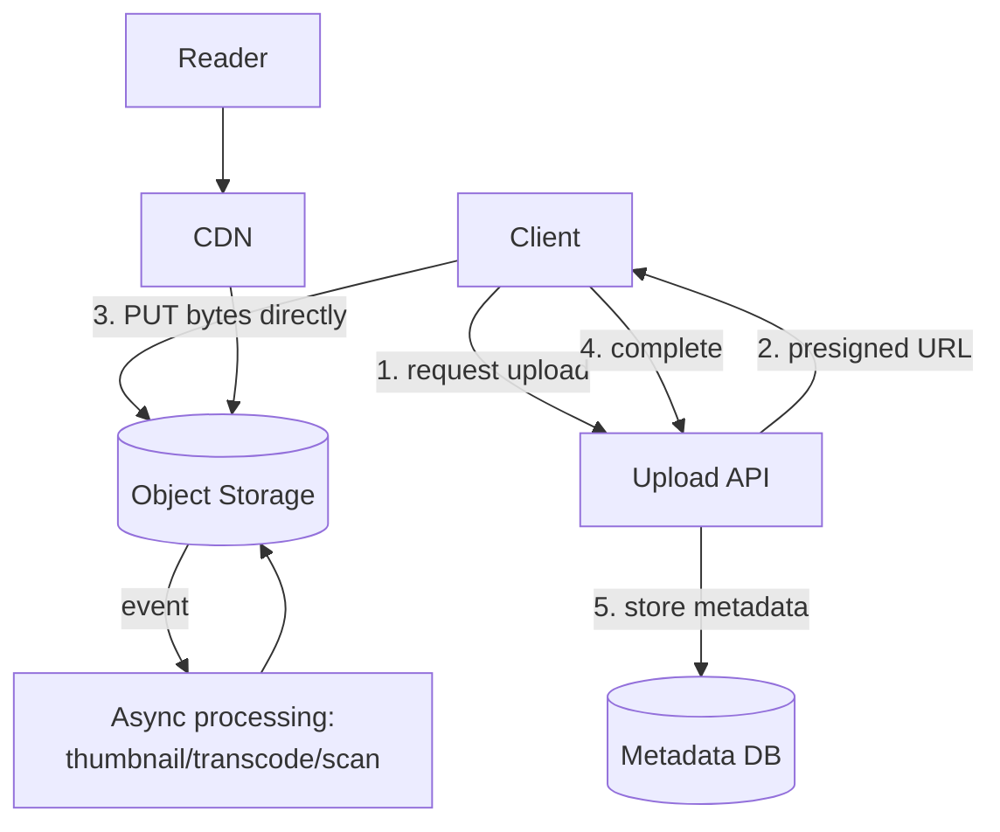

**Reading:** the client asks the API for a **presigned URL**, then uploads bytes *directly to object storage* — the app server never touches the file data (huge bandwidth/memory savings; the API only brokers permission and metadata). On completion, the API records metadata. An object-storage event triggers async processing (thumbnails, video transcode, virus scan). Reads go through a CDN in front of the object store. This presigned-direct-upload + async-process + CDN-serve pattern is *the* way to do files at scale.

## 8. Deep Dive Components
**The star of the show: presigned URLs — in plain English.** A presigned URL is a special, temporary link that says "whoever holds this may upload one specific file to this exact spot in object storage, but only for the next 10 minutes." Your API generates it (it has the storage credentials), hands it to the client, and steps out of the way. The client then uploads *directly* to S3 using that link — your servers never touch a single byte of the file. Think of it as a valet handing you a one-time keycard to drive your own car straight into the garage, instead of carrying every car in on his back. That's how 5 TB/day flows in without melting your app tier.

- **Presigned URLs:** the API grants time-limited, narrowly-scoped permission to upload/download directly to/from object storage — offloading all the file bytes from your servers.
- **Multipart / resumable upload:** split large files into chunks, upload independently/in parallel, retry only failed chunks, resume after disconnect, then assemble. Essential for multi-GB files on mobile.
- **Async processing pipeline:** transcoding/thumbnailing/scanning happens off the upload path via events + workers (don't make the user wait).
- **Deduplication:** content-hash files; if the hash exists, skip storage and reference the existing object (saves storage for common files).

## 9. Scaling Strategy
Object storage scales infinitely; CDN serves reads; processing workers scale via queue depth. App tier stays light (no byte handling). Shard metadata DB by owner.

## 10. Bottlenecks
- (Avoided) app-server bandwidth — solved by direct upload.
- Processing queue under upload spikes → autoscale workers.
- Thumbnail/transcode CPU → dedicated worker fleet.

## 11. Failure Scenarios
- **Upload interrupted** → resume via multipart (only missing chunks).
- **Orphaned uploads** (started, never completed) → TTL cleanup of incomplete sessions/objects.
- **Processing failure** → retry + DLQ; serve original while transcode pending.
- **Duplicate complete calls** → idempotent finalize.

## 12. Security Considerations
Presigned URLs: short expiry, least privilege, scoped to one key. **Validate content-type and scan for malware** (uploads are an attack vector). Enforce size limits. Never trust client-provided content-type. Private files: presigned, time-limited download URLs, not public buckets.

## 13. Tradeoffs
Direct upload (offloads servers, but client complexity & presigned-URL management) vs proxied (simple, but server bottleneck). Sync vs async processing (UX wait vs eventual availability). Dedup (storage savings vs hashing cost/privacy).

## 14. Alternative Designs
Proxy through app servers (only for tiny files). Tus protocol for resumable uploads. tus/S3 multipart directly from browser.

## 15. Interview Discussion
The make-or-break insight: *don't route file bytes through your application servers* — use presigned URLs for direct object-storage transfer, and process asynchronously. Add multipart/resumable for large files and malware scanning for security.

## 16. Senior Engineer Insights
Juniors proxy uploads through the app and melt their servers on the first big video. Seniors use presigned direct upload, multipart resume, async processing, and content-hash dedup. The subtle prod issue is **orphaned multipart uploads** silently accruing storage cost — set lifecycle rules to abort them. **Mental model:** *a valet who hands you a one-time pass to drive your own car straight into the garage (S3), instead of carrying every car through the lobby on his back.*

---

# 12. WHITEBOARD APP (Real-Time Collaboration)

## 1. Problem Statement
You and a coworker open the same Figma or Miro board. You drag a box left; at the exact same instant, they drag it up. You both see each other's cursors moving live, and somehow — even though your two edits crossed in mid-air over the network — you both end up looking at the *same* final picture. Building that "somehow" is one of the genuinely hard problems in this entire document.

A whiteboard app is a shared canvas where many people draw at once and see each other's changes in real time. **Why is it so hard?** This is the **real-time collaborative editing** archetype, and it stacks the toughest demands we've seen:
- **Many writers editing the same shared state simultaneously** — not the easy read-heavy world of blogs and CMSes.
- **Sub-100ms latency** — collaboration that lags feels broken.
- And the deep one: **conflict resolution.** When two people edit the same thing at the same time over an unreliable network (where messages arrive late, out of order, or twice), how do you guarantee everyone converges to the *identical* result? That question is the heart of the chapter, and the answer (CRDTs) is genuinely clever — we'll build up to it in §8.

## 2. Functional Requirements
- Multiple users draw/edit shapes on a shared board in real time.
- See others' cursors and changes live.
- Persistence (board survives reconnect/reload); undo/redo.
- Presence (who's online).

## 3. Non-Functional Requirements
- Very low latency (< 100ms perceived).
- Conflict resolution so concurrent edits converge consistently.
- Offline tolerance / reconnection.
- Scales to many boards, moderate users per board.

## 4. Capacity Estimation
The numbers here have an unusual shape. Any single board has only a handful of editors (say under 50), but there are *millions* of boards. So the challenge isn't raw aggregate throughput — it's two other things entirely: doing low-latency real-time fan-out and conflict resolution *within* each board, and holding open **millions of persistent WebSocket connections** across the fleet at once (each one costs memory just sitting there).

## 5. API Design
Mostly a **WebSocket** protocol, not REST:
```
WS connect /board/{id}
-> ops: {type: addShape|move|delete, shapeId, props, opId, clock}
<- broadcasts of others' ops, presence updates
REST: GET /board/{id}/snapshot  (initial load), POST /board (create)
```

## 6. Data Model
- `board`: id, snapshot (current state), version.
- `operation`: boardId, opId, userId, type, payload, logical clock — the op log.
State = snapshot + replay of ops since snapshot.

## 7. High-Level Architecture

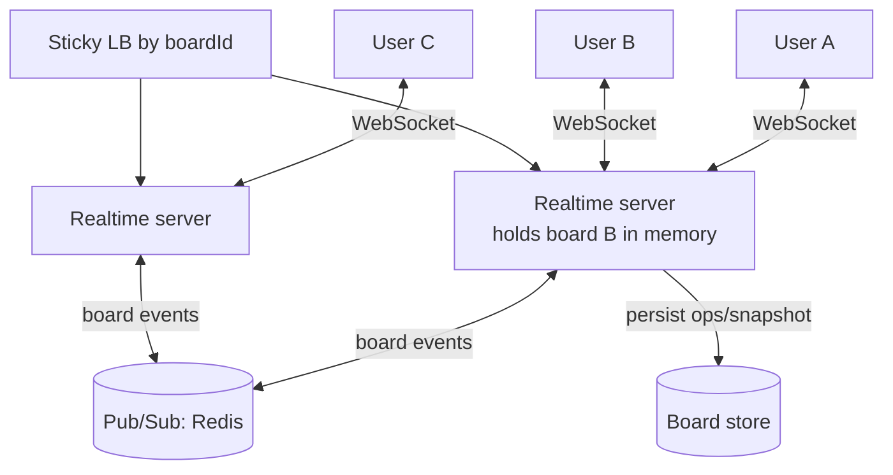

**Reading:** users hold persistent WebSocket connections to realtime servers. Ideally all editors of one board land on the *same* server (routed by board ID) so it can broadcast in-memory with minimal latency. When editors of a board span servers, a **Pub/Sub** layer (Redis) relays each board's events between servers so everyone converges. Operations are persisted (op log + periodic snapshot) so a board survives restarts and late-joiners can load state. The hard part — conflict resolution — happens in how those concurrent ops are merged (next section).

## 8. Deep Dive Components — conflict resolution
Here's the core problem, stated plainly. Two people, A and B, edit the same board at the same moment (maybe one was even offline for a bit). Their changes cross paths over the network — arriving late, out of order, sometimes twice. Question: whose change wins, and — crucially — does *everyone* end up looking at the exact same final picture? If A's screen and B's screen disagree, the app is broken. Three strategies, from crude to elegant:

- **Last-write-wins (LWW):** the simplest idea. Stamp every change with a timestamp; if two changes hit the same thing, the later timestamp wins. Easy to build, and totally fine when people edit *different* shapes. But on a true conflict it just throws away the loser's work — someone's edit silently vanishes.

- **Operational Transformation (OT):** instead of discarding, OT cleverly *rewrites* concurrent edits so they still make sense together. Classic example: if A inserts a character at position 5 while B inserts at position 3, OT shifts A's position to account for B's insert. This is what powered Google Docs for years. It works beautifully — but it's *notoriously* hard to implement correctly (the edge cases are a minefield).

- **CRDTs (Conflict-free Replicated Data Types):** the modern winner. The trick: design your data structure with special math so that *no matter what order changes arrive in, or how many times they're duplicated*, merging them always produces the identical result. Think of it like addition — `2 + 3 + 5` gives `10` regardless of the order you add them. CRDTs make edits combine with that same order-independence, so every device converges to the same state with **no central referee needed** — which also means it just works offline and re-syncs cleanly when you reconnect. The cost is extra bookkeeping metadata per change. Libraries like Yjs and Automerge give you this off the shelf, which is why most new collaborative tools choose CRDTs.

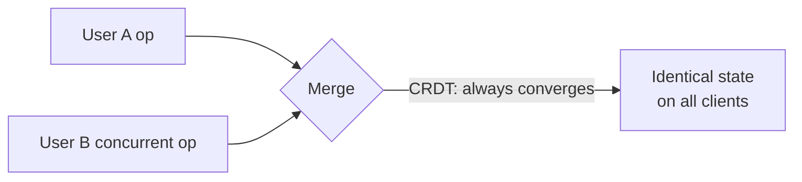

**Reading:** two concurrent ops feed a merge function; with CRDTs the merge is *commutative and associative*, so regardless of order or duplication, every client converges to identical state — exactly what an unreliable network with retries needs (foundations: idempotency + eventual consistency, formalized).

## 9. Scaling Strategy
Route a board to one server (sticky by board ID) for low-latency in-memory broadcast; Pub/Sub bridges across servers. Shard boards across the realtime fleet. Snapshot periodically to bound op-log replay. Many boards scale horizontally; per-board scale is bounded by editor count (small).

## 10. Bottlenecks
- WebSocket connection count (memory per connection) → many servers, efficient connection handling.
- A single hugely-popular board → still one logical merge point; bounded by editors.
- Op broadcast frequency (every cursor move) → throttle/coalesce cursor updates.

## 11. Failure Scenarios
- **Server holding a board dies** → reconnect clients to another server, rebuild from persisted snapshot + ops.
- **Network partition / offline** → CRDTs let clients keep editing offline and merge on reconnect.
- **Op loss/duplication** → opIds + CRDT idempotent merge.

## 12. Security Considerations
Authn/authz per board (who can view/edit). Validate ops server-side (don't trust client to mutate others' content arbitrarily). Rate-limit ops (prevent flooding). Sanitize embedded content.

## 13. Tradeoffs
LWW (simple, lossy) vs OT (precise, very complex) vs CRDT (converges + offline, memory overhead). Sticky routing (low latency, rebalancing pain) vs full Pub/Sub mesh (flexible, higher latency). In-memory speed vs persistence durability (snapshot cadence).

## 14. Alternative Designs
Central authoritative server serializing all ops (simple ordering, single bottleneck) vs peer-to-peer CRDT sync. Polling (rejected — too slow for real-time).

## 15. Interview Discussion
Identify it as the real-time collaboration archetype, propose WebSockets + board-sticky routing + Pub/Sub, then go deep on conflict resolution (LWW → OT → CRDT) and *why* CRDTs win for offline-tolerant convergence. Mention snapshot+op-log persistence.

## 16. Senior Engineer Insights
The naive "central server orders everything" works until latency or scale forces concurrency, then you need OT/CRDT — and CRDTs have largely won in modern tools because they handle offline and merge without a coordinator. Persistence via op-log + snapshots (event sourcing) is what makes boards durable and undo/redo natural. **Mental model:** *a shared sketchpad where everyone draws at once; CRDTs are special ink that, no matter the order strokes arrive in, always dries into the exact same picture for everyone.*

---

> **Reservation archetype (Systems 13–16).** Ticketing, hotel, airline, and movie booking are all the *same core problem*: a **limited, exclusive inventory** (a seat, a room, a flight seat) that must never be sold twice, under a burst of concurrent buyers, with a multi-step checkout (select → hold → pay → confirm). The hard part is always **preventing double-booking without killing availability or making everyone wait**. Read System 13 carefully — the others reuse its locking/hold pattern with domain twists.

# 13. TICKETING SYSTEM (e.g., Ticketmaster-style event tickets)

## 1. Problem Statement
10:00:00 AM. Taylor Swift tickets just went on sale. In the next sixty seconds, half a million people mash "Buy" — all fighting over the same 50,000 seats. That's roughly ten desperate buyers per available seat, arriving in the same instant. Welcome to the most brutal version of the reservation problem.

We're selling tickets to events with fixed capacity, where a hot on-sale creates a sudden, violent rush. **Why is this brutally hard?** Three things must all be true at once, and they fight each other:
- **No seat may ever be sold twice.** Sell seat 14B to two people and you have an angry customer and a refund — this invariant is sacred.
- **You must "hold" a seat during checkout** (so it's yours while you type your card details) — but not forever, or abandoned carts would freeze the whole venue.
- **You must survive the stampede.** The on-sale spike can be hundreds of times your normal traffic. The clever trick that makes this tractable — a virtual waiting room — is the signature move of this chapter.

## 2. Functional Requirements
- Browse events, view seat map/availability.
- Reserve (hold) specific seats temporarily during checkout.
- Pay and confirm; release holds on timeout/abandon.
- Prevent double-booking absolutely.

## 3. Non-Functional Requirements
- **Strong consistency on inventory** (no double-sell — money/trust).
- High availability and ability to absorb extreme spikes.
- Fair access under contention; low checkout latency.

## 4. Capacity Estimation
Let's put numbers to that Taylor Swift scene. A 50K-seat venue, ~500K hopeful buyers all arriving in the first minute → a spike north of **10K req/sec**, fighting over just 50K seats. That's about **10 buyers per seat**. And between on-sales? The system sits nearly idle. This exact combination — violent, brief spikes against a tiny finite supply — is why "just add more servers" fails, and why we need a **virtual waiting room** to meter people in at a rate the backend can actually survive.

## 5. API Design
```
GET /events/{id}/seats -> availability
POST /holds { eventId, seats[], userId } -> { holdId, expiresAt } (or 409 if taken)
POST /holds/{id}/purchase { payment } -> confirmed ticket (idempotencyKey)
DELETE /holds/{id} (or auto-expire)
```

## 6. Data Model
- `seat`: eventId, seatId, status (available/held/sold), holdId, version.
- `hold`: id, userId, seats[], expiresAt.
- `ticket`: id, seatId, userId, orderId, status.

## 7. High-Level Architecture

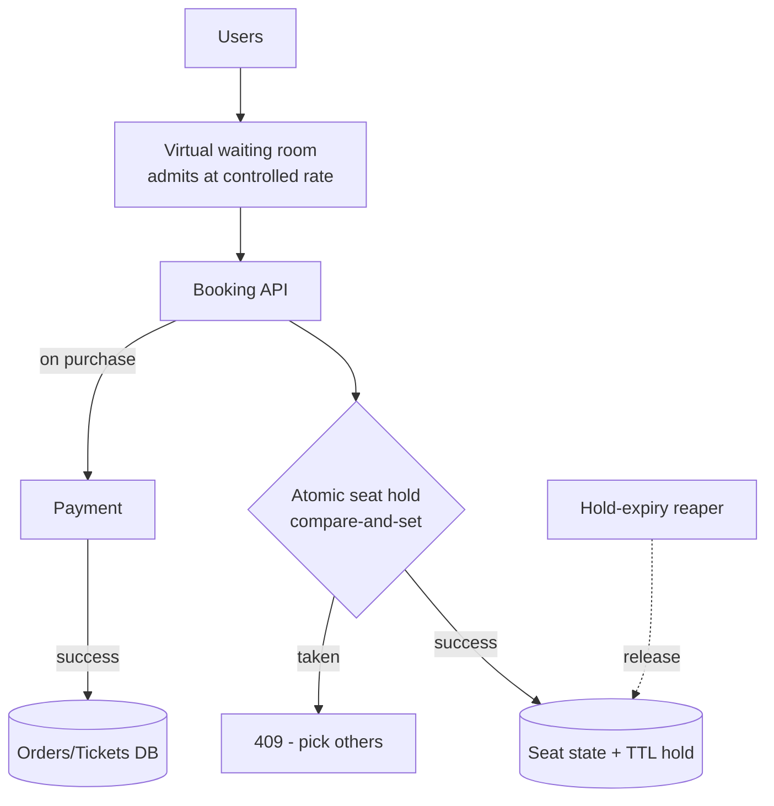

**Reading:** the **virtual waiting room** is the first defense — it throttles the herd, admitting users into the real system at a rate it can handle (turning a 500K spike into a steady stream). Inside, selecting seats does an **atomic compare-and-set** on seat state (in Redis or DB) — only one user can flip a seat from available→held; everyone else gets a 409 and picks others. Held seats carry a **TTL**; a reaper releases abandoned holds so seats aren't locked forever. Payment success promotes held→sold and writes the durable order. Atomic holds + TTL + waiting room together solve double-booking under a rush.

## 8. Deep Dive Components
- **Seat holding via atomic operations:** the heart of it. Use a conditional update (`UPDATE seat SET status='held', holdId=? WHERE seatId=? AND status='available'`) or Redis Lua — atomic check-and-set so two buyers can't both win.
- **Hold expiry (TTL):** holds auto-release after N minutes (Redis TTL or a reaper job) so abandoned carts don't freeze inventory. Tradeoff: too short frustrates buyers, too long starves availability.
- **Virtual waiting room:** queue users (token + position) and admit at a controlled rate — protects the backend and creates *fairness* under a thundering herd.
- **Idempotent purchase:** retries on payment must not double-charge or double-issue (foundations idempotency key).

## 9. Scaling Strategy
Inventory in fast atomic store (Redis) for hold operations; durable confirmation in DB. Waiting room absorbs spikes. Read-side (seat maps) heavily cached (but availability needs near-real-time invalidation). Shard by event.

## 10. Bottlenecks
- Contention on hot seats/events (everyone wants front row) → atomic ops serialize per seat; partition by seat to spread.
- The on-sale spike itself → waiting room is the answer.
- Payment latency holding inventory → short holds + async confirm.

## 11. Failure Scenarios
- **Double-booking** → prevented by atomic CAS; this is the non-negotiable invariant.
- **Hold store (Redis) failure mid-sale** → must be HA; durable backstop in DB; reconcile.
- **Payment succeeds but confirm fails** → idempotent retry + saga to either confirm or refund+release.
- **Reaper down** → seats leak as held; monitor and have a sweep job.

## 12. Security Considerations
Bot/scalper defense (CAPTCHA, rate limits, device fingerprinting — bots are the real adversary here). Prevent hold-griefing (one user holding all seats). Secure payment (PCI). Fair queue (prevent queue-jumping).

## 13. Tradeoffs
Strong consistency on seats (correctness) vs throughput (atomic ops serialize hot seats). Hold duration (UX vs availability). Waiting room (fairness/protection vs added friction). Optimistic (version check) vs pessimistic (lock) concurrency.

## 14. Alternative Designs
Optimistic concurrency (version field, retry on conflict) vs pessimistic locks vs Redis atomic holds. General-admission (just a counter decrement) vs assigned-seating (per-seat state) — GA is far simpler (atomic counter, no seat map).

## 15. Interview Discussion
Lead with the two hard parts: **no double-booking** (atomic seat holds + TTL) and **surviving the rush** (virtual waiting room). Discuss hold expiry tradeoffs and idempotent purchase. This is the reservation archetype — nail it once.

## 16. Senior Engineer Insights
The genius of the virtual waiting room is converting an *availability* problem into a *fairness* problem you can control — Ticketmaster lives or dies by it. The subtle bug is **leaked holds** (reaper failures freezing inventory) and **scalper bots** (often the majority of traffic). **Mental model:** *a shop with one fitting room per item: a velvet-rope queue (waiting room) controls who enters, you can only try on an item if it's free (atomic hold), and if you dawdle the item goes back on the rack (TTL).*

---

# 14. HOTEL BOOKING SYSTEM

## 1. Problem Statement
A hotel room isn't sold once — it's sold *per night*. The same room can be booked by Alice for Monday–Wednesday and Bob for Thursday–Friday, no conflict. But if Carol wants Tuesday–Thursday, she collides with Alice on Tuesday and Wednesday. That little wrinkle — inventory measured in *date ranges* instead of single units — is what makes hotel booking its own flavor of the reservation problem.

We're building search-and-book across many hotels and date ranges, never letting a room type get overbooked for any overlapping night. **Why is it its own twist on reservations?**
- Availability is a **calendar/interval problem**: booking 3 nights means checking and reserving 3 separate nights, all-or-nothing.
- It's heavily **search-driven** — people browse dozens of hotels with filters (price, location, stars) far more than they book. So the read path (search) and the write path (booking) have very different needs, and we'll deliberately split them: fast, slightly-stale search vs. strictly-correct booking.

## 2. Functional Requirements
- Search hotels by location/dates/filters with availability.
- View room types, prices, book a room for a date range.
- Cancel/modify; prevent overbooking per room-type per night.

## 3. Non-Functional Requirements
- Fast search across large inventory (read-heavy browsing).
- Strong consistency on booking (no overbooking).
- Availability + accurate pricing.

## 4. Capacity Estimation
Let's gauge the inventory size: ~1M hotels × ~100 room types × 365 days of availability. That's a lot of rows, but it's *bounded* and predictable — not the scary part. The scary part is search traffic: people browse far, far more than they book. So we've really got two different workloads bolted together — high-volume browsing and low-volume-but-must-be-correct booking — which is the clue that we should split the read path (search) from the write path (booking).

## 5. API Design
```
GET /search?location=&checkin=&checkout=&guests= -> hotels + availability + price
POST /bookings { hotelId, roomTypeId, checkin, checkout } -> confirmed | conflict
```

## 6. Data Model
- `hotel`, `room_type` (hotelId, capacity, basePrice).
- `inventory`: roomTypeId, date, totalRooms, bookedCount — **availability is per (roomType, date)**.
- `booking`: id, roomTypeId, dateRange, userId, status.

## 7. High-Level Architecture

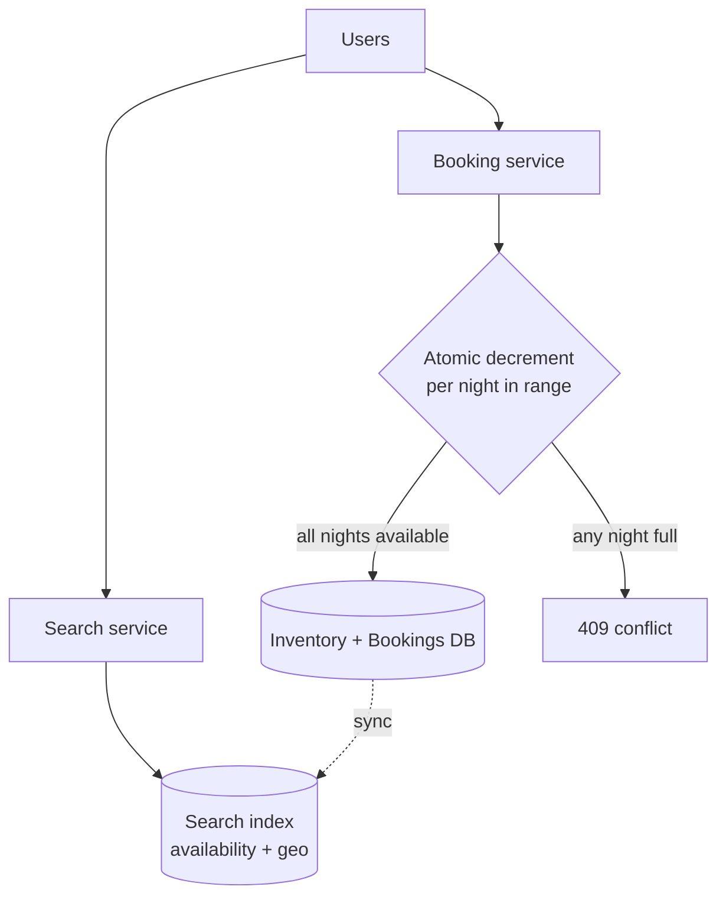

**Reading:** search hits a read-optimized index (geo + availability) for fast browsing — eventually consistent with the source. Booking goes to the booking service, which must **atomically reserve every night in the range** (decrement `bookedCount` for each date, all-or-nothing within a transaction); if any night is full, the whole booking fails. The authoritative inventory DB syncs into the search index. The interval (multi-night) atomicity is what distinguishes this from single-seat ticketing.

## 8. Deep Dive Components
- **Per-night inventory & multi-night atomicity:** booking 3 nights = decrement 3 date rows in one transaction; rollback if any is unavailable. This is the core invariant.
- **Search vs booking consistency:** search shows *approximate* availability (cached/indexed, may be slightly stale); booking *confirms* against the strongly-consistent source — so search can be fast and eventual while booking is correct.
- **Optimistic concurrency:** version/conditional update on inventory rows to handle concurrent bookers.
- **Pricing:** dynamic pricing as a separate concern (demand-based), often precomputed.

## 9. Scaling Strategy
Read path: search index (Elasticsearch) + heavy caching scales reads. Write path: shard inventory by hotel/region; transactions are local to a hotel (no cross-hotel transactions needed). 

## 10. Bottlenecks
- Search across millions of hotels with availability filtering → precomputed availability index.
- Hot properties/dates (a popular hotel on New Year's) → contention on those inventory rows.

## 11. Failure Scenarios
- **Overbooking** → prevented by atomic per-night decrements; the invariant.
- **Search-vs-reality mismatch** → user books something search showed available but is now gone → graceful 409 + re-search.
- **Payment/confirm split** → saga (release inventory if payment fails).

## 12. Security Considerations
Prevent inventory-griefing (fake bookings to block competitors) — auth + rate limits. Secure payment/PII. Prevent price manipulation.

## 13. Tradeoffs
Eventually-consistent search (fast, occasionally stale) vs strongly-consistent booking (correct, slower). Overbooking *on purpose* (airlines/hotels deliberately overbook to offset no-shows — a business policy you can model as negative buffer). Optimistic vs pessimistic concurrency.

## 14. Alternative Designs
Hold-based (like ticketing, hold during checkout) vs direct atomic book. Single inventory DB vs per-region sharding.

## 15. Interview Discussion
Emphasize the read/write split (fast eventual search + strongly-consistent booking) and **multi-night atomicity** as the distinguishing challenge. Mention deliberate overbooking as a business reality you can model.

## 16. Senior Engineer Insights
The elegant move is decoupling *search* (fast, eventual, indexed) from *booking* (correct, transactional) — let users browse stale data but confirm against truth. And remember the industry deliberately overbooks: your "no overbooking" invariant is really "no overbooking *beyond policy buffer*." **Mental model:** *a calendar of rooms where booking means stamping every night of your stay at once — if even one night's square is full, the whole stamp is rejected.*

---

# 15. AIRLINE BOOKING SYSTEM

## 1. Problem Statement
You search "New York to Tokyo" and get an itinerary: a flight to Los Angeles on one airline, then LA to Tokyo on another. To book it, *both* legs must succeed — a ticket to LA with no way onward is useless. Now make it worse: the seat inventory isn't even yours. It lives in giant external systems called GDSs (Amadeus, Sabre) that the whole travel industry shares, and they're slow, rate-limited, and occasionally down. This is the reservation archetype at its most complex.

We're searching flights (often multi-leg) and booking seats across a global, *externally-owned* inventory. **Why is it the hardest reservation variant?**
- **Itineraries are all-or-nothing across multiple airlines** — and you can't wrap a normal database transaction around two different companies' systems. This forces a pattern called a **saga** (tentatively book each leg; if one fails, undo the others), which we'll unpack in §8.
- **Your inventory isn't yours.** You cache the GDS data for speed but must re-check it at purchase, because the fare you showed five minutes ago may already be gone.
- **Search is combinatorially huge** (multi-city routing across thousands of airports) and the external GDS is your slowest dependency.

## 2. Functional Requirements
- Search flights (one-way, round-trip, multi-city) with fares.
- Book a full itinerary (all legs or none); seat selection.
- Integrate with airline/GDS inventory; cancel/change.

## 3. Non-Functional Requirements
- Fast complex search (huge combination space).
- Strong consistency on seat inventory; itinerary atomicity.
- Resilience to slow/unreliable external GDS APIs.

## 4. Capacity Estimation
Search dominates and is *combinatorially expensive* (multi-city routing across thousands of airports/flights). Booking volume is lower but high-value. The bottleneck is **search complexity + external GDS latency**, not raw QPS.

## 5. API Design
```
POST /search { origin, dest, dates, passengers, type } -> itineraries[] with fares
POST /bookings { itineraryId, passengers, seats } -> PNR (booking reference)
```

## 6. Data Model
- Cached flight/fare data (from GDS).
- `itinerary`: legs[] (flight, class, seat).
- `booking` (PNR): itinerary, passengers, status, payment.
Seat inventory often *authoritative in the GDS*, mirrored/cached locally.

## 7. High-Level Architecture

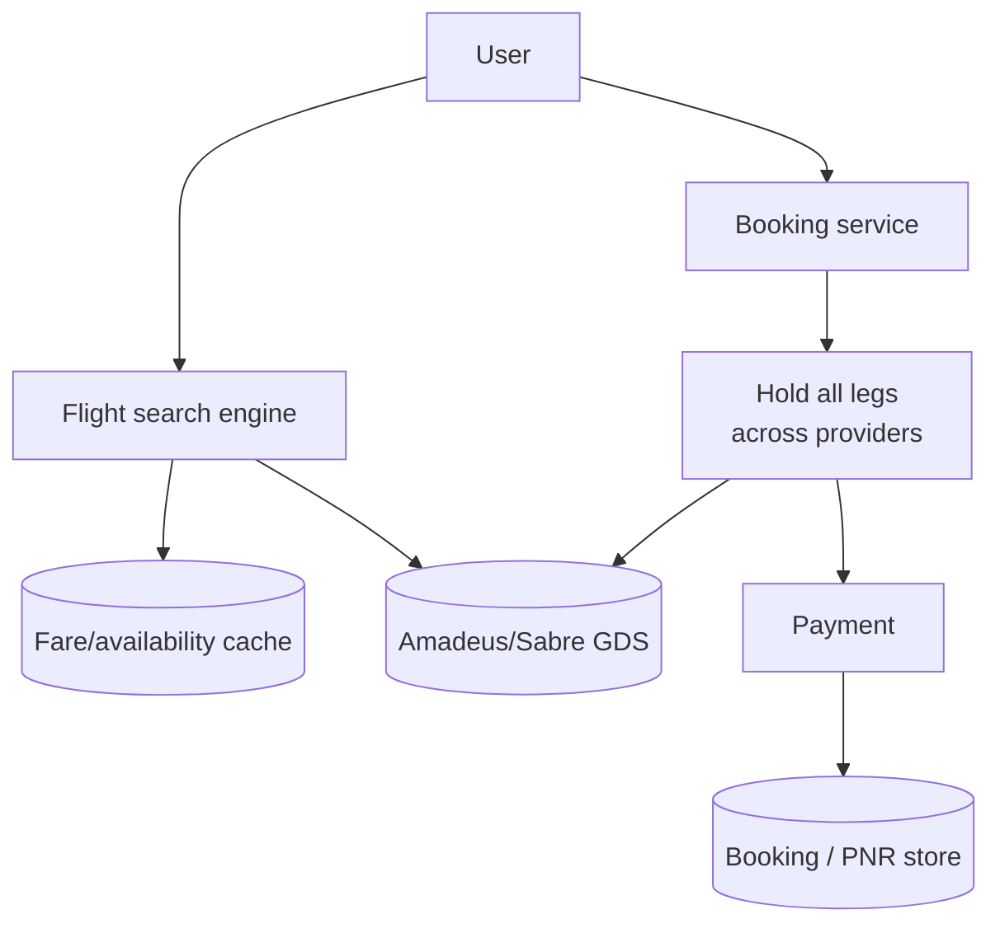

**Reading:** search blends a local fare/availability **cache** (for speed) with live **GDS** calls (for accuracy), assembling multi-leg itineraries. Booking must **hold every leg** — potentially across different airlines/GDSs — and only confirm if *all* succeed (distributed all-or-nothing), then take payment and store the PNR. The external GDS dependency (slow, rate-limited, occasionally down) and multi-provider itinerary atomicity are what make this the hardest reservation variant.

## 8. Deep Dive Components
- **Multi-leg atomicity across providers:** holding 3 legs from 2 airlines is a **distributed transaction** you can't do with classic ACID → use a **saga**: hold leg 1, leg 2, leg 3; if any fails, *compensate* by releasing the earlier holds. Eventual consistency with explicit rollback.
- **Search caching + freshness:** cache fares aggressively (search volume is huge) but accept staleness; reprice/recheck at booking time (the fare you saw may be gone — "price changed" UX).
- **GDS resilience:** timeouts, retries, circuit breakers around slow external systems; degrade to cached results.

## 9. Scaling Strategy
Cache fares/availability heavily; precompute popular routes; parallelize multi-provider search; rate-limit and pool GDS connections. Search scales via cache; booking is lower volume.

## 10. Bottlenecks
- External GDS latency/limits — the dominant constraint.
- Search combination explosion (multi-city) → caching, route precomputation, bounded search.

## 11. Failure Scenarios
- **One leg books, another fails** → saga compensation (release/refund booked legs).
- **GDS timeout during booking** → unknown state → reconcile via GDS status; idempotent retries.
- **Stale fare** → recheck at purchase; surface price change rather than silently overcharge.

## 12. Security Considerations
PII/passport data (heavy compliance). Secure GDS credentials. Payment PCI. Prevent fare-scraping abuse (search is expensive — rate limit).

## 13. Tradeoffs
Cache freshness vs search speed (stale fares vs slow live search). Saga (handles distributed booking, but compensation complexity & eventual consistency) vs unavailable distributed ACID. Build vs rely-on-GDS.

## 14. Alternative Designs
Direct airline APIs vs GDS aggregators. Materialized route graph for search vs on-demand. Hold-then-pay vs instant purchase.

## 15. Interview Discussion
Two standout points: **multi-leg booking as a saga with compensation** (you can't ACID across airlines), and **search caching with revalidation at purchase**. Discuss GDS as an unreliable external dependency wrapped in circuit breakers.

## 16. Senior Engineer Insights
The defining lesson is the **saga**: real cross-provider bookings have no distributed ACID, so you orchestrate local holds + compensating rollbacks, accepting eventual consistency. The other reality is that *your inventory isn't yours* — it's the GDS's, so you cache for speed and revalidate for truth. **Mental model:** *booking a relay race team across rival clubs — you tentatively pencil in each runner, and if the last club says no, you must politely un-pencil all the others (compensate).*

---

# 16. MOVIE TICKET BOOKING SYSTEM (e.g., BookMyShow)

## 1. Problem Statement
Booking a movie seat looks just like booking a concert seat — you pick a spot on a grid and pay. And mechanically, it *is* the same (atomic holds, TTLs, the works). But there's one beautiful difference that makes movies easier than a Taylor Swift on-sale: the load is naturally spread out. Instead of one giant 50,000-seat event melting your system, you have thousands of small shows (each ~200 seats) running across the country, and the rush for any one blockbuster is confined to that single show.

We're booking specific seats for specific movie showtimes. **Why include it if it's so similar to ticketing?** Precisely to teach that lesson: the same reservation toolkit (atomic seat holds, hold expiry, idempotent confirm) but **partitioned per show**, so contention shards itself naturally and you rarely need the heavy machinery (like a global waiting room) that a mega on-sale demands. It's a great example of how the *structure of the load* changes which tools you reach for.

## 2. Functional Requirements
- Browse movies/theaters/showtimes; view seat map.
- Select + hold specific seats; pay & confirm; release on timeout.
- No double-booking per show.

## 3. Non-Functional Requirements
- Strong consistency per show's seats.
- Handle opening-night spikes per popular show.
- Fast seat-map reads.

## 4. Capacity Estimation
Each show = small fixed inventory (~200 seats). Many shows nationwide. Hotspots are *specific* blockbuster shows, not global — so contention is naturally partitioned by show (easier than one giant on-sale, but same mechanics).

## 5. API Design
```
GET /shows/{id}/seats -> seat map + status
POST /shows/{id}/holds { seats[] } -> { holdId, expiresAt } | 409
POST /holds/{id}/confirm { payment } -> tickets
```

## 6. Data Model
- `show`: id, movieId, screenId, startTime.
- `seat_status`: showId, seatId, status (available/held/booked), holdId, version.
- `booking`: id, showId, seats[], userId, status.

## 7. High-Level Architecture

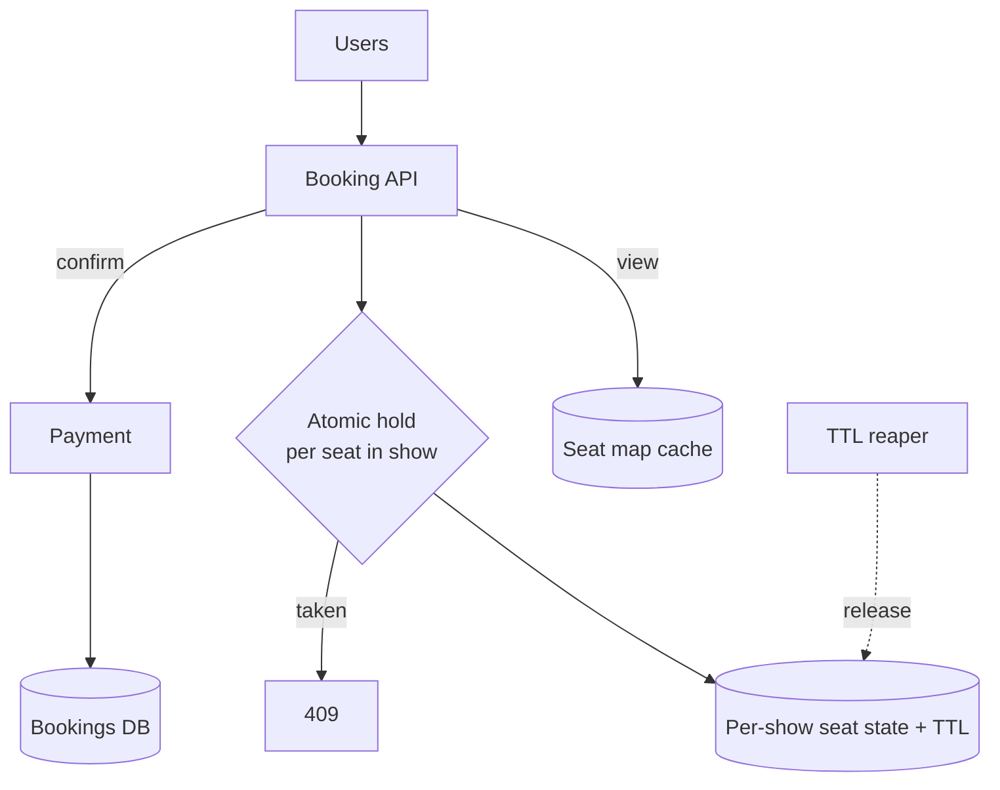

**Reading:** identical mechanics to ticketing (System 13) but **partitioned per show** — each show's seat state is independent, so a blockbuster's rush only contends within that show, not the whole system. Atomic per-seat hold + TTL + reaper + idempotent confirm; seat-map reads served from cache. Because contention is naturally sharded by show, this scales more gracefully than a single mega on-sale.

## 8. Deep Dive Components
- **Per-show seat locking:** atomic CAS on each selected seat within a show; partition state by showId (natural sharding).
- **Hold TTL & reaper:** same as ticketing — release abandoned holds.
- **Seat-map read caching:** show the grid fast; reflect holds with short-TTL/real-time updates so users don't pick taken seats.
- **Idempotent confirm + payment saga.**

## 9. Scaling Strategy
Shard seat state by show (each show is a small independent unit) → contention is bounded and distributed. Cache seat maps. Scale stateless API horizontally.

## 10. Bottlenecks
- Hot blockbuster shows → contention confined to that show's partition (still hot, but isolated).
- Seat-map freshness under rapid holds → real-time push or short TTL.

## 11. Failure Scenarios
- **Double-booking** → atomic holds prevent.
- **Hold leak** → reaper.
- **Payment/confirm split** → saga: release seats if payment fails, idempotent confirm.

## 12. Security Considerations
Bot/scalper defense, hold-griefing limits, payment security — same family as event ticketing.

## 13. Tradeoffs
Same as ticketing: consistency vs throughput on hot shows, hold duration UX vs availability, optimistic vs pessimistic locking. Per-show partitioning makes it gentler than a single global on-sale.

## 14. Alternative Designs
General-admission shows = simple atomic counter (no seat map). Assigned seating = per-seat state. Optimistic vs Redis-atomic holds.

## 15. Interview Discussion
Note it's ticketing partitioned by show, which *naturally distributes contention* — a nice point. Reuse the hold/TTL/atomic-CAS/saga vocabulary. Distinguish assigned-seat (per-seat state) vs GA (counter).

## 16. Senior Engineer Insights
The clean insight versus a single giant on-sale: **natural partitioning by show** spreads load, so you rarely need a global waiting room — per-show contention is manageable. Everything else is the shared reservation toolkit. **Mental model:** *thousands of small independent ticket booths (one per show) instead of one stadium box office — the same rules, but the crowd is split across many doors.*

---

> **Commerce/ledger archetype (Systems 17–20).** Inventory, orders, warehouse, and wallet form the backbone of e-commerce. They share a demand for **correctness over raw speed** — you cannot oversell stock, lose an order, ship the wrong thing, or lose money — and they're tied together by **events and sagas** (an order reserves inventory, triggers fulfillment, debits a wallet). Together they're a masterclass in *distributed transactions without distributed ACID*.

# 17. INVENTORY SYSTEM

## 1. Problem Statement
There are 100 units of the hottest gadget in stock, and a flash sale just started. In one second, 100,000 people all click "Buy." How do you make sure *exactly* 100 of them succeed and not one more? Sell the 101st unit and you've "oversold" — now you owe someone an apology, a refund, and a hit to your reputation.

An inventory system tracks stock levels and, above all, **prevents overselling** when many people buy the same thing at once. **Why is it hard?** It's the classic "everyone fighting over one number" problem:
- **Stock is a single hotly-contended count** that must be decremented safely — if two purchases read "1 left" at the same time, they must not both succeed.
- That single number can become a brutal bottleneck under a flash sale (everyone hammering *one row* in the database).
- And inventory doesn't live alone — it has to stay in sync with **orders, returns, restocks, and reservations**, all while staying up during the exact spikes that stress it most. The core trick (an atomic *guarded* decrement) is simple to state and surprisingly deep in practice.

## 2. Functional Requirements
- Track available quantity per SKU (per location).
- Reserve stock on order, decrement on fulfillment, restock on return/replenish.
- Prevent overselling; support reservations/holds.

## 3. Non-Functional Requirements
- **Strong consistency on stock counts** (no overselling).
- High availability and throughput during flash sales.
- Accurate, auditable stock movements.

## 4. Capacity Estimation
The interesting thing about inventory is that the bottleneck *isn't* total volume — it's concentration. Picture a flash sale: 100K people buying the *same* SKU within seconds. They all need to update one thing — the stock count for that single product. Tens of thousands of writes piling onto **one database row** is the real enemy, not the overall request rate. That insight points us straight at techniques to spread or serialize updates to hot items (§8).

## 5. API Design
```
GET /inventory/{sku} -> available
POST /inventory/{sku}/reserve { qty, orderId, idempotencyKey } -> reserved | insufficient
POST /inventory/{sku}/commit { orderId }   // on fulfillment
POST /inventory/{sku}/release { orderId }  // on cancel/timeout
```

## 6. Data Model
- `inventory`: sku, locationId, available, reserved, version.
- `stock_movement`: sku, delta, reason (sale/return/restock), refId, ts — an append-only ledger of changes (auditability).

## 7. High-Level Architecture

```mermaid
flowchart TD
    Order[Order service] -->|reserve| Inv[Inventory service]
    Inv --> Dec{Atomic conditional decrement<br/>available >= qty}
    Dec -->|ok| DB[(Inventory DB + movement log)]
    Dec -->|insufficient| Rej[Reject - out of stock]
    Inv -->|reserved/committed events| Bus[[Event bus]]
    Bus --> WH[Warehouse]
    Bus --> Analytics[Analytics]
```

**Reading:** the order service requests a reservation; inventory does an **atomic conditional decrement** (`UPDATE ... SET available = available - qty WHERE sku=? AND available >= qty`) — the `available >= qty` guard is what prevents overselling, since the DB serializes concurrent updates to that row and rejects the ones that would go negative. Every change is recorded in an append-only **movement log** for audit/reconciliation. Inventory emits events so the warehouse and analytics react. The atomic guarded decrement is the whole correctness story.

## 8. Deep Dive Components

Everything in inventory orbits one question: *how do you let thousands of people grab from the same pile of stock without ever handing out the same unit twice?* Keep that in mind and the four pieces below click into place — the first one is the safety latch, the next two are how you make that latch fast and flexible, and the last one is your paper trail.

- **Atomic guarded decrement:** the conditional `WHERE available >= qty` (or optimistic version check + retry) is the core anti-oversell mechanism. Picture two shoppers reaching for the last item at the same millisecond: the database physically can't apply both updates at once, so it lines them up — the first one turns `available` from 1 to 0, and the second one's `available >= qty` check now fails, so it bounces with "zero rows updated" instead of dragging the count to -1. That single `WHERE` clause is doing the job a bouncer does at a sold-out door. Pessimistic row lock vs optimistic retry — both work; optimistic scales better under moderate contention.
- **Reserve vs commit (two-phase):** reserve stock when order is placed (hold), commit on fulfillment, release on cancel/timeout — mirrors the booking hold pattern. Decouples "ordered" from "shipped."
- **Hot-SKU contention:** for extreme flash sales, *partition the count* into N sub-buckets (`available_1..available_N`), decrement a random bucket, sum for total — spreads contention across rows (like hot-key splitting).
- **Event sourcing via movement log:** stock = sum of movements; gives audit trail and reconciliation.

## 9. Scaling Strategy
Shard inventory by SKU/location (most updates are single-SKU, no cross-shard txn). Sub-bucket hot SKUs. Cache read availability (with the caveat it may be slightly stale — confirm at reserve). Async-propagate to downstream via events.

## 10. Bottlenecks
- **Hot-row write contention** on flash-sale SKUs — the defining problem → sub-bucketing / queue serialization.
- Read availability accuracy vs caching staleness.

## 11. Failure Scenarios
- **Overselling** → prevented by atomic guard; the invariant.
- **Reserved-but-never-committed** (order abandoned) → TTL release / saga compensation.
- **Negative stock from a bug** → movement log enables reconciliation; alerts on invariant violation.
- **Lost reserve event** → idempotency key makes retries safe.

## 12. Security Considerations
Prevent inventory manipulation (auth on adjustments). Audit all movements (fraud/theft detection). Prevent reservation-griefing (bots reserving to deny others) via limits.

## 13. Tradeoffs
Strong consistency (correct, but hot-row contention) vs eventual (fast, risks oversell — sometimes accepted with overselling tolerance + apologies for low-margin goods). Reserve/commit (accurate, complex) vs decrement-on-order (simple, risks holding stock for unpaid orders). Optimistic vs pessimistic concurrency.

## 14. Alternative Designs
Allow *controlled* overselling with reconciliation (some retailers accept it to maximize availability, then cancel/refund the rare oversold order). Centralized DB count vs distributed sub-bucket counters vs queue-serialized decrements (one writer per SKU).

## 15. Interview Discussion
Center on **preventing overselling under concurrency** — atomic guarded decrement, reserve/commit two-phase, and hot-SKU sub-bucketing for flash sales. Mention the movement log for auditability. Note overselling is sometimes a deliberate business tradeoff.

## 16. Senior Engineer Insights
The hot-row problem is where naive inventory dies — a single `UPDATE` row becomes a global serialization point in a flash sale. Sub-bucketing or single-writer queue-per-SKU fixes it. And mature systems treat stock as an **append-only ledger** (movements), deriving the count — making reconciliation and audit tractable. **Mental model:** *a bank account for each product where the balance can never go negative; every sale/return/restock is a posted transaction, and the running balance is sacred.*

---

# 18. ORDER MANAGEMENT SYSTEM (OMS)

## 1. Problem Statement
You click "Place Order." Behind that one click, five separate services have to cooperate perfectly: reserve the inventory, charge your card, tell the warehouse to pack it, arrange shipping, and track delivery. Now the hard question: what if the payment succeeds but the warehouse is out of stock? You've been charged for something that can't ship. What undoes the charge? Who makes sure the whole thing ends in a sane state?

An Order Management System (OMS) orchestrates this entire lifecycle across services that each own their own data. **Why is it the heart of e-commerce complexity?** Because an order is a **distributed transaction** — it spans inventory, payment, warehouse, and shipping, each a separate service with its own database — and you *cannot* wrap a single database transaction around all of them. So when something fails halfway, you can't just "roll back." You need a way to undo completed steps deliberately. That pattern is the **saga**, and this chapter is the definitive lesson in it. Get this one, and you understand the backbone of every commerce platform.

## 2. Functional Requirements
- Place an order (cart → order); track status through its lifecycle.
- Coordinate payment, inventory reservation, fulfillment.
- Handle cancellations, returns, refunds, partial fulfillment.

## 3. Non-Functional Requirements
- Reliable (never lose an order; never charge without reserving stock).
- Consistent across services (eventually, via saga).
- Auditable order state history; idempotent operations.

## 4. Capacity Estimation
Orders are moderate-volume, high-value, multi-step, long-lived (minutes to days across fulfillment). The challenge is **orchestration reliability across services**, not raw QPS.

## 5. API Design
```
POST /orders { cart, payment, address, idempotencyKey } -> { orderId, status: PENDING }
GET /orders/{id} -> status + timeline
POST /orders/{id}/cancel
```

## 6. Data Model
- `order`: id, userId, items[], total, status (PENDING→PAID→FULFILLED→SHIPPED→DELIVERED / CANCELLED), idempotencyKey.
- `order_event`: orderId, fromState, toState, ts — state-transition log (the order's history).
- Saga state: which steps completed, for compensation.

## 7. High-Level Architecture — the saga

```mermaid
flowchart TD
    U[User] -->|place order| OMS[Order service<br/>saga orchestrator]
    OMS -->|1. reserve| Inv[Inventory svc]
    OMS -->|2. charge| Pay[Payment svc]
    OMS -->|3. fulfill| WH[Warehouse svc]
    Inv -. fail .-> Comp[Compensate:<br/>release stock, refund]
    Pay -. fail .-> Comp
    WH -. fail .-> Comp
    OMS --> Log[(Order state + event log)]
```

**Reading:** the OMS acts as a **saga orchestrator** — it drives the steps in sequence (reserve inventory → charge payment → trigger fulfillment), persisting state after each. If any step fails, it runs **compensating actions** to undo the completed ones (release reserved stock, refund the charge) — achieving consistency without a distributed ACID transaction (foundations: saga pattern). Every transition is logged, so the order's state is recoverable and auditable. The orchestrated saga is the central pattern of the entire commerce backend.

## 8. Deep Dive Components
**First, what *is* a saga — in plain English.** A normal database transaction is all-or-nothing: either everything commits, or everything rolls back, automatically. That magic only works inside *one* database. But our order touches four different services with four different databases, so the magic isn't available. A **saga** is how you fake "all-or-nothing" across separate services: you do the steps one at a time, and if a later step fails, you run an *undo* action for each step you already completed. Reserved inventory? Release it. Charged the card? Refund it. The order ends up either fully done or fully undone — just not automatically, and not instantly. That's the whole idea; everything below is detail.

- **Saga orchestration vs choreography:** two ways to run a saga. *Orchestration* = one central conductor (the OMS) explicitly calls each step in order — like a wedding planner working down a checklist. Clear, easy to follow, easy to debug. *Choreography* = no conductor; each service just reacts to events from the others — like dancers who each know their cue. More decoupled, but the overall flow is "emergent" and painful to trace when something goes wrong. The OMS usually picks orchestration, because being able to *see* the whole flow is worth a lot.
- **State machine:** the order is a finite state machine with explicit transitions; invalid transitions rejected. The event log makes it auditable and recoverable after a crash (resume the saga from last persisted step).
- **Idempotency everywhere:** every step (reserve, charge) is idempotent so retries after a crash don't double-act (foundations idempotency).
- **Compensation:** each forward step has an inverse (reserve↔release, charge↔refund). Note compensation is *semantic undo*, not rollback (you can't un-send an email; you send an apology).

## 9. Scaling Strategy
OMS is moderate volume; scale orchestrator instances statelessly with saga state in a durable store. Downstream services scale independently. Use a durable workflow engine (Temporal/Camunda) for reliable long-running sagas.

## 10. Bottlenecks
- Coordination latency across services (sequential steps) → parallelize independent steps where safe.
- Long-running sagas holding reservations → timeouts + compensation.

## 11. Failure Scenarios
- **Crash mid-saga** → on restart, read saga state and resume/compensate (this is why state is persisted per step).
- **Payment succeeds, fulfillment fails** → compensate (refund) or retry fulfillment per policy.
- **Duplicate order submission** → idempotency key dedups.
- **Partial failure** → the whole point of the saga; compensate to a consistent state.

## 12. Security Considerations
Authorize order actions (user owns order). Payment security (delegate to PCI-compliant payment service). Prevent price/total tampering (server computes totals). Audit all state changes.

## 13. Tradeoffs
Orchestration (visible, central coordinator as a focal point) vs choreography (decoupled, hard to trace). Saga/eventual consistency (works across services, but intermediate inconsistent states visible) vs unavailable distributed ACID. Sync steps (simpler, slower) vs async events (resilient, complex).

## 14. Alternative Designs
Event-driven choreography. Workflow engines (Temporal) that durably manage saga state and retries for you (increasingly the standard). Monolithic transaction (only if all data is in one DB — defeats microservices).

## 15. Interview Discussion
This is *the* saga interview. Explain why you can't use a distributed ACID transaction, then orchestration vs choreography, compensating actions, idempotency, and crash-recovery via persisted saga state. Mention workflow engines as the production-grade tool.

## 16. Senior Engineer Insights
The single most important commerce-backend concept is the **saga** — and the production reality is that hand-rolling reliable sagas (with retries, timeouts, crash recovery, compensation) is so error-prone that teams adopt **durable workflow engines** (Temporal) to do it correctly. Also: design for *visible intermediate states* ("payment processing," "preparing shipment") — eventual consistency is user-facing here. **Mental model:** *a wedding planner running the ceremony step by step; if the caterer cancels after the venue's booked, the planner doesn't crash — they un-book the venue and refund deposits (compensate) to restore order.*

---

# 19. WAREHOUSE MANAGEMENT SYSTEM (WMS)

## 1. Problem Statement
Every system so far has lived entirely inside computers. This one steps into the physical world. A Warehouse Management System (WMS) runs the actual building where orders become packages: goods arrive, get put away on shelves, then get picked, packed, and shipped when an order comes in. Software here has to bridge the digital order to a physical object sitting in bin 47-C, aisle 12.

**Why is it so different from everything else?**
- It **models the real world** — bins, shelves, forklifts, human workers with handheld scanners, maybe robots — and the real world is messy. Items get misplaced; counts drift; the digital map is *always* slightly wrong and must be constantly reconciled.
- It must **optimize physical movement.** A worker walking an extra mile per shift costs real money, so the system computes efficient "pick paths" (closer to a shortest-route puzzle than a database problem).
- It must **work offline.** Warehouses have Wi-Fi dead zones, and a scanner that freezes when it loses signal stops a worker cold. The software's real constraint isn't QPS — it's *physics and meatspace*.

## 2. Functional Requirements
- Track item locations (bin/shelf/zone) precisely.
- Receive & putaway inbound stock; generate optimized pick lists for orders.
- Pack & ship; handle cycle counts/reconciliation.
- Support handheld scanners/robots.

## 3. Non-Functional Requirements
- Accurate location tracking (physical-digital sync).
- Resilient to intermittent device connectivity (offline-capable).
- Optimized for throughput (picks/hour) and worker efficiency.

## 4. Capacity Estimation
A large fulfillment center: millions of items, thousands of locations, thousands of picks/hour. The challenge is **operational throughput and physical-digital consistency**, plus offline-tolerant device clients — not internet-scale QPS.

## 5. API Design
```
POST /receiving { items } ; POST /putaway { item, location }
POST /orders/{id}/picklist -> optimized pick route
POST /pick/confirm { item, location, qty }  (from scanner, idempotent, may be queued offline)
POST /pack, POST /ship
```

## 6. Data Model
- `location`: id, zone, aisle, bin, capacity.
- `item_location`: sku, locationId, qty (the physical inventory map).
- `task`: type (pick/putaway), assignedTo, status.
- `pick_list`: orderId, items + optimized sequence.

## 7. High-Level Architecture

```mermaid
flowchart TD
    OMS[Order Mgmt] -->|fulfillment request| WMS[WMS core]
    WMS --> Opt[Pick-path optimizer]
    Opt --> Task[(Task queue per worker)]
    Scanner[Handheld scanners/robots] <-->|sync, offline-capable| WMS
    WMS --> Loc[(Location/inventory map)]
    WMS -->|shipped event| OMS
    WMS -.reconcile.-> CC[Cycle counting]
```

**Reading:** the OMS sends a fulfillment request; the WMS generates an **optimized pick path** (minimize worker travel — a routing/TSP-flavored problem) and dispatches tasks to workers' scanners. Scanners sync with the WMS but must tolerate **intermittent connectivity** (buffer scans offline, sync when reconnected — idempotent). The location/inventory map is the digital twin of the physical warehouse, kept honest by **cycle counting** (periodic physical recounts that reconcile drift). Shipped events flow back to the OMS. Physical-digital sync + movement optimization define the system.

## 8. Deep Dive Components
- **Pick-path optimization:** order pick tasks to minimize travel (batch picking, zone picking, route optimization). Directly drives labor cost/throughput.
- **Offline-capable devices:** scanners queue operations locally and sync when connectivity returns; operations idempotent and conflict-aware (the floor has dead zones).
- **Physical-digital reconciliation:** the digital count *will* drift from reality (theft, damage, misplacement) → cycle counting and reconciliation jobs correct it; the system must tolerate and surface discrepancies.
- **Task assignment:** distribute tasks to workers/robots efficiently, balancing load and proximity.

## 9. Scaling Strategy
Scale per-warehouse (each warehouse is largely independent — natural partition). Within a warehouse, optimize for throughput not QPS. Edge/local processing for scanner resilience.

## 10. Bottlenecks
- Physical throughput (workers/robots) — the real constraint; software optimizes around it.
- Pick-path computation at scale → heuristics, batching.
- Connectivity dead zones → offline buffering.

## 11. Failure Scenarios
- **Scanner offline** → buffer + sync (idempotent); never block the worker.
- **Physical-digital mismatch** → cycle counts reconcile; flag shortages to OMS (which may re-source or cancel).
- **WMS outage** → degrade to manual/paper procedures (warehouses plan for this).

## 12. Security Considerations
Access control (workers see their tasks). Audit movements (theft/shrinkage detection). Secure device fleet. Physical security integration.

## 13. Tradeoffs
Optimization sophistication vs simplicity (fancy routing vs robust simple rules). Real-time sync vs offline tolerance (the floor demands offline). Accuracy (frequent counts cost labor) vs efficiency.

## 14. Alternative Designs
Manual/paper (small ops) vs WMS vs full automation (robotic — Amazon Kiva). Centralized vs per-warehouse autonomous systems.

## 15. Interview Discussion
Emphasize what makes WMS unusual among software systems: it models the *physical world*, must run *offline-tolerant* on the floor, optimizes *human/robot movement*, and constantly *reconciles* digital vs physical truth. It's bounded by physics, not by QPS.

## 16. Senior Engineer Insights
The defining lesson: software here is constrained by the *physical world*, so resilience means **degrading to manual operation** and *continuously reconciling* an always-slightly-wrong digital twin. Offline-first device design is non-negotiable. **Mental model:** *a GPS for warehouse workers — it plots the shortest route to gather items, keeps working when it loses signal, and periodically double-checks the map against the real streets (cycle counts).*

---

# 20. DIGITAL WALLET

## 1. Problem Statement
This is the strictest system in the entire document, and the reason is simple: it handles **money**. Everywhere else, we cheerfully traded a little correctness for speed — a slightly stale like-count or feed is fine. Here, that attitude is forbidden. A digital wallet stores user balances and moves money around (top-ups, payments, transfers, withdrawals), and the rules are absolute: money must **never** be created out of thin air, **never** be lost, and **never** be spent twice.

**Why is it the hardest in terms of rigor?** Because every operation must be *exact*, durable, auditable, and correct even when two requests race each other or a server crashes mid-transfer. If two withdrawals both read "balance: $100" at the same moment, they must not both succeed and leave you at -$50. This is the ledger archetype turned up to maximum: **correctness beats everything, including availability** — when in doubt, this system would rather *reject* your transaction than risk getting your balance wrong. The professional toolkit for this — a double-entry ledger, ACID transactions, and idempotency keys — is exactly where we'll go in §6 and §8.

## 2. Functional Requirements
- Maintain per-user balance(s); top-up, withdraw, pay, transfer.
- Transaction history; idempotent operations.
- Prevent overdraft, double-spend, money creation.

## 3. Non-Functional Requirements
- **Strong consistency + ACID on balances** (non-negotiable).
- High durability (never lose a transaction).
- Auditable, tamper-evident; regulatory compliance.
- Available, but **consistency wins ties** (better to reject than to corrupt).

## 4. Capacity Estimation
Moderate-to-high TPS (payments), each a strongly-consistent multi-account transaction. The challenge is **correctness under concurrency at throughput**, not just volume — and it's a CP system by necessity.

## 5. API Design
```
POST /wallets/{id}/topup { amount, idempotencyKey }
POST /transfers { from, to, amount, idempotencyKey } -> success | insufficient
GET /wallets/{id}/transactions
```
The `idempotencyKey` is mandatory — duplicate-submission protection for money is essential.

## 6. Data Model — double-entry ledger
**The key idea, in plain English.** The tempting design is one number per user — `balance` — that you add to and subtract from. *Don't.* A raw mutable number has no memory: if it's ever wrong, you can't tell why, and a single buggy update silently corrupts someone's money. Accountants solved this 500 years ago with **double-entry bookkeeping**, and we steal it wholesale.

The rule: money is never edited in place — it's only ever *moved*, and every move is written down as two matching entries. When Alice sends Bob $10, you don't "edit two balances." You append two immutable records: **−$10 from Alice** and **+$10 to Bob**. They're a pair, equal and opposite, so across the whole system every entry sums to **zero**. That single property is your superpower: money literally cannot be created or destroyed by accident, and if the books ever *don't* sum to zero, you know instantly that something is wrong. A user's balance isn't a stored number you trust — it's *derived* by adding up their entries.

- `account`: id, userId, balance (treated as a cached/derived figure, not the source of truth).
- `ledger_entry`: txnId, accountId, debit/credit, amount, ts — **append-only, immutable, double-entry** (every transfer = a debit on one account + an equal credit on another; all entries always sum to zero).
- `transaction`: id, type, status, idempotencyKey.

## 7. High-Level Architecture

```mermaid
flowchart TD
    U[User] --> API[Wallet API]
    API --> Idem{Idempotency<br/>key check}
    Idem -->|new| Txn[Transaction processor]
    Idem -->|duplicate| Prev[Return prior result]
    Txn --> ACID[(ACID transaction:<br/>debit A + credit B atomically)]
    ACID --> Ledger[(Double-entry ledger<br/>append-only)]
    ACID -->|balance check| Bal{from.balance >= amount?}
    Bal -->|no| Rej[Reject - insufficient]
    Txn --> Audit[(Audit log)]
```

**Reading:** every request first passes an **idempotency check** — a duplicate (retry) returns the original result without re-executing, so money is never moved twice. New transactions run inside a single **ACID transaction** that atomically debits the sender and credits the receiver in the **double-entry ledger**, guarded by a balance check that prevents overdraft. The ledger is append-only and immutable (you never edit a balance; you post entries), giving a tamper-evident audit trail. ACID + double-entry + idempotency are the three pillars of financial correctness.

## 8. Deep Dive Components
- **Double-entry ledger:** the centuries-old accounting principle — every transaction posts equal debits and credits, so the books always balance and money can't be created or destroyed. Balances are *derived* from immutable entries, not mutated in place. This is the gold standard for financial systems.
- **ACID transactions for transfers:** debit + credit must be atomic (both or neither) — a classic ACID use case. Within one DB, use a transaction; across services/banks, use a saga with reservation (hold funds, then settle) + compensation.
- **Idempotency for exactly-once money movement:** mandatory idempotency keys so network retries never double-charge (foundations: the canonical example).
- **Strong consistency / locking:** row-lock the account (or serialize per-account) so concurrent debits can't both pass an overdraft check (the inventory hot-row problem, but for money — and here you *never* trade away correctness).

## 9. Scaling Strategy
Shard by user/account (most transfers are within-shard or two accounts); cross-shard transfers use 2-phase commit or saga. Per-account serialization for correctness. Read scale on history via replicas (eventual is fine for *reading* history, never for the balance check).

## 10. Bottlenecks
- Per-account write serialization (correctness requires it) → shard, but hot accounts (a merchant receiving thousands of payments) need careful handling.
- Cross-shard/cross-bank transfers → distributed transaction complexity.

## 11. Failure Scenarios
- **Double-spend / double-charge** → idempotency + ACID + balance lock prevent it; the cardinal invariant.
- **Crash mid-transfer** → ACID guarantees atomicity within a DB; cross-service uses saga with funds reservation + compensation/reconciliation.
- **Money creation/loss bug** → double-entry makes it detectable (books won't balance); reconciliation jobs catch drift.
- **Partition** → choose consistency over availability (reject rather than risk corruption — CP).

## 12. Security Considerations
This is the highest-stakes section: strong authn/authz, fraud detection (velocity checks, anomaly detection), encryption, regulatory compliance (KYC/AML, PCI), tamper-evident immutable ledger, rate limiting, and defense against account takeover. Every operation audited.

## 13. Tradeoffs
**Consistency and correctness over availability and latency** — the opposite default from most systems in this doc. You accept rejected operations and higher latency to guarantee no money is ever wrong. Mutable-balance (simple, risky) vs derived-from-ledger (correct, more storage/compute) — finance chooses the ledger.

## 14. Alternative Designs
Event-sourced ledger (balance = fold over events — natural fit, full audit). Single-DB ACID (simplest, scales surprisingly far for money) vs sharded with 2PC/saga. Mutable balance with optimistic locking (acceptable but ledger is safer).

## 15. Interview Discussion
Lead with the three pillars: **double-entry ledger** (can't create/lose money), **ACID transactions** (atomic debit+credit), and **idempotency keys** (exactly-once money movement). State explicitly that this is a CP system — consistency beats availability. Mention reconciliation and audit. This is where you demonstrate that you know *when* to abandon the eventual-consistency defaults used everywhere else.

## 16. Senior Engineer Insights
Everywhere else in this document we traded consistency for availability/latency; the wallet is where you *stop* doing that — correctness is absolute, and you reject or delay rather than risk a wrong balance. The professional pattern is the **immutable double-entry ledger** with derived balances, idempotent operations, and continuous reconciliation — never an in-place mutable balance you `UPDATE`. **Mental model:** *a bank's general ledger written in permanent ink — you never erase a balance; you post a new matching pair of entries, the books must always sum to zero, and if they ever don't, an alarm goes off.*

---

# SYNTHESIS — PATTERNS THAT RECUR ACROSS ALL 20 SYSTEMS

You've now seen 20 systems. The payoff is recognizing that they're built from a small set of repeating moves. When you face a *new* prompt, scan for these:

```mermaid
flowchart TD
    P[New system prompt] --> Q1{Counting/limiting?}
    Q1 -->|yes| R1[Atomic counters,<br/>hot-key splitting,<br/>fail-open/closed]
    P --> Q2{Fan-out delivery?}
    Q2 -->|yes| R2[Queue + workers,<br/>idempotency, DLQ,<br/>priority lanes, provider failover]
    P --> Q3{High-volume ingestion?}
    Q3 -->|yes| R3[Buffer (Kafka), async/non-blocking,<br/>hot-cold tiering, backpressure]
    P --> Q4{Read-heavy content?}
    Q4 -->|yes| R4[CDN + cache + replicas,<br/>read/write split, fan-out feeds]
    P --> Q5{Reservation/exclusive?}
    Q5 -->|yes| R5[Atomic hold + TTL,<br/>waiting room, idempotent confirm]
    P --> Q6{Money/ledger/orders?}
    Q6 -->|yes| R6[ACID + double-entry,<br/>saga + compensation, idempotency]
```

**Reading:** this is your triage flowchart. Most prompts match one or two archetypes, and each archetype carries a default toolkit. You're not memorizing 20 designs — you're learning to *classify* a prompt and reach for the right patterns.

## The cross-cutting techniques (master these and you can design most things)

1. **Idempotency keys** — appeared in *every* write-heavy system. Networks retry; make repeats harmless. The universal antidote to at-least-once delivery and partial failure.
2. **Queues for decoupling & spike absorption** — notifications, logging, orders, ticketing. Turn synchronous fragility into asynchronous resilience and turn spikes into steady drains.
3. **Atomic operations / conditional updates** — rate limits, seat holds, inventory, wallets. The defense against concurrent-write correctness bugs (double-book, oversell, double-spend).
4. **Hot-key / hot-row mitigation** — viral posts, flash-sale SKUs, popular events. Split, replicate, or locally cache the one thing everyone wants.
5. **Read/write separation & caching** — CMS, blog, hotel, inventory. Serve heavy reads from caches/replicas/indexes (eventual is fine); confirm critical writes against the consistent source.
6. **Sagas + compensation** — orders, airline booking, cross-service money. Distributed transactions without distributed ACID; forward steps + semantic undo.
7. **Choosing your consistency** — the meta-skill. Rate-limit counts and feeds tolerate eventual consistency; seats, inventory, and money demand strong. *Knowing which is which* is the senior judgment this whole document trains.
8. **Fail-open vs fail-closed / CP vs AP** — every system makes a stance on what to do under failure. Make it a deliberate, stated decision, not an accident.

## How to attack any interview prompt (recap of the method)

1. **Classify the archetype** (the flowchart above) — it tells you where the difficulty is.
2. **Clarify requirements & scope**, then **estimate** to find the bottleneck (foundations Part 1–2).
3. **Sketch the naive design**, then break it under scale — show you see the failure.
4. **Improve toward the archetype's toolkit** (queue, atomic op, saga, cache…).
5. **State tradeoffs and failure modes explicitly** — consistency vs availability, what happens when each box dies.
6. **Go deep on the one hard part** (the bottleneck), not evenly on everything.

If you can do that, you're not reciting systems — you're *reasoning* about them, which is exactly what intermediate and senior interviews (and real jobs) reward.

---

*End of document. The 20 systems were never the point — the six archetypes and eight cross-cutting techniques are. Learn to classify, reach for the toolkit, and state your tradeoffs.*