# System Design for Mid-Level and Senior Engineers
### A Case-Study Book on How Real Systems Are Built, Broken, and Rebuilt

---

## How to Read This Book

Most system design material treats architecture as a vocabulary test. You memorize that "Redis is for caching," that "Kafka decouples services," that "you should shard your database," and then you recite these spells in an interview as if naming the right component is the same as understanding it. It is not. A junior engineer can list the components in a CDN. A senior engineer can tell you *why each one exists*, *what was tried before it*, *what it costs*, and *what will eventually break it*.

This book is built around a single conviction: **architecture is not a set of answers. It is a set of consequences.** Every box in a diagram is there because someone, at some point, hit a wall — a slow query at 2 a.m., a database that fell over on launch day, a cache that stampeded and took down the homepage — and the box was the scar tissue that grew over that wound. If you understand the wound, you understand the box. If you only memorize the box, you understand nothing, and the moment an interviewer or a production incident asks "why?" you have nothing to say.

So we are going to do this differently. For each of the twenty systems in this book, we will start as the *first engineer* — one laptop, one database, a weekend to ship. Then we will let success happen to us, because success is the thing that breaks systems. Traffic will grow. Latency will climb. The pager will go off. And at each crisis, we will reason our way to the next piece of architecture the same way the engineers at Bitly, WhatsApp, Uber, and Netflix actually did: reluctantly, under pressure, trading one problem for a smaller one.

You will notice some repetition across chapters — caching, partitioning, replication, and queues come up again and again. This is intentional and it is the point. By the fifth time you derive *why* you need consistent hashing, you will not be memorizing it. You will *know* it, the way you know how to ride a bicycle. That transfer — from a fact you've read to an intuition you own — is the entire goal.

### Who this is for

You are a Java / Spring Boot developer with a few years under your belt. You can build a REST API, model a relational schema, wire up a few microservices, deploy to Kubernetes on AWS. What you have not done much of is design a system meant for a hundred million users, where the naive version of every decision is wrong and the consequences land on a fleet of thousands of machines. This book is the bridge.

### How each chapter is structured

Every system is a full chapter with the same skeleton, because real architectural thinking follows the same arc every time:

1. **The Business Problem** — what we're actually building and why anyone pays for it.
2. **Building Version 1** — the simplest thing that works, built by one engineer.
3. **The First Scaling Crisis** — what breaks first, and why it always breaks there.
4. **Architecture Evolution** — introducing each new component *only* when a problem forces it.
5. **Deep Dive Into Critical Components** — the two or three parts that make this system special.
6. **Scaling to Massive Scale** — 10M, 100M, 1B users, and the new physics at each tier.
7. **Failure Stories** — realistic incidents, root causes, and the fixes.
8. **Tradeoffs and Engineering Decisions** — because there are no perfect choices, only priced ones.
9. **How Big Tech Builds It** — how the real companies actually solved it, and where they disagree.
10. **Interview Perspective** — what's really being evaluated, and how seniors answer differently.

Read it front to back if you can. The early chapters (URL Shortener, Redis, Memcached) teach the primitives slowly; the later chapters (Uber, YouTube, Google Docs) assume you've internalized them and move faster. But each chapter also stands alone if you need to study one system before an interview.

Let's begin with the mental tools you'll use in every chapter.

---

## Chapter 0 — The Foundations You'll Use Everywhere

Before the case studies, we need a shared toolkit. These are the mental models a senior engineer reaches for automatically. We'll introduce them quickly here and then *use* them, in context, dozens of times. Don't try to memorize this chapter — treat it as a reference you'll return to.

### Latency: the numbers that govern everything

Every architectural decision is ultimately a negotiation with the speed of light and the cost of moving bytes. You should burn these orders of magnitude into your intuition, because they decide what is and isn't possible:

| Operation | Approximate latency | Intuition |
|---|---|---|
| L1 cache reference | ~1 ns | The CPU's own pocket. |
| Main memory (RAM) reference | ~100 ns | 100× slower than L1, still effectively free. |
| Read 1 MB sequentially from RAM | ~3 µs | Memory is fast *and* streamable. |
| SSD random read | ~16 µs | ~150× slower than RAM. |
| Read 1 MB sequentially from SSD | ~50 µs | Sequential beats random by orders of magnitude. |
| Round trip within a data center | ~0.5 ms | Same building, different machine. |
| Read 1 MB from disk (spinning) | ~2–5 ms | Why we stopped using spinning disks for hot data. |
| Round trip, same region (cross-AZ) | ~1 ms | A few miles of fiber. |
| Round trip, cross-continent (US↔EU) | ~80–150 ms | Physics. You cannot beat this; you can only avoid it. |

The single most important lesson hidden in this table: **a cross-continent round trip is roughly a million times slower than a RAM access.** This is why we replicate data to multiple regions, why CDNs exist, why "just call the other service" is sometimes a catastrophe. When a senior engineer flinches at a synchronous cross-region call in a hot path, this table is the reflex behind the flinch.

### Capacity estimation: thinking in back-of-the-envelope

You will do this in every interview and every design doc. The skill is not arithmetic; it's knowing *which* numbers matter and being unafraid to approximate. The workflow:

- **Start from users and behavior.** "100M daily active users, each does 10 reads and 1 write per day."
- **Convert to per-second rates.** A day is ~86,400 seconds, which you should just round to **~100,000 seconds** (10⁵). This single rounding trick makes all the math tractable.
- **Separate average from peak.** Real traffic is spiky. A common rule of thumb: **peak ≈ 2–3× average**, and for consumer apps with a daily rhythm, sometimes more.
- **Compute the three resources that actually constrain you:** QPS (compute/network), storage (disk growth over time), and bandwidth (bytes/second in and out).

Worked example we'll reuse constantly: 100M DAU × 10 reads = 1B reads/day. Divide by 10⁵ seconds ≈ **10,000 reads/sec average**, call it **~25,000 at peak**. That number tells you immediately whether one database can cope (no) and roughly how many cache nodes or read replicas you'll need (some). We'll do this fresh in every chapter so it becomes automatic.

### The four ways to scale, and the order you reach for them

When a system is overloaded, engineers have a surprisingly small menu, and they almost always try it in this order:

1. **Scale up (vertical).** Buy a bigger machine. Cheap in effort, expensive in dollars, and it hits a hard ceiling. Always the first move because it buys time with zero code changes.
2. **Cache.** Stop asking the same question twice. The highest leverage move in most systems, because real-world access is wildly skewed — a tiny fraction of data is responsible for most of the reads.
3. **Scale out reads (replication).** Copy the data to many machines and spread reads across them. Works beautifully for read-heavy systems; introduces replication lag, which introduces consistency headaches.
4. **Scale out writes (partitioning / sharding).** Split the data so no single machine holds all of it. The most powerful and most painful move, because it breaks transactions, joins, and your ability to reason simply about the system.

Most of this book is, in a sense, the story of teams walking down this ladder, rung by rung, only descending to the next rung when the current one runs out.

### Consistency: the spectrum you'll navigate constantly

"Consistency" is overloaded, so let's pin down what we mean. When data lives in more than one place (replicas, caches, regions), there's a question of whether everyone sees the same value at the same time.

- **Strong consistency:** every read reflects the most recent write. Simple to reason about, expensive to provide, and it fundamentally limits availability when the network partitions (this is the heart of the CAP theorem).
- **Eventual consistency:** replicas converge *eventually* if writes stop. Cheap, highly available, and the source of "I posted a comment and it vanished, then came back."
- **Read-after-write (read-your-own-writes):** a pragmatic middle ground — you always see *your own* changes immediately, even if others see them with a delay. This is what most consumer products actually promise, because it covers the case users actually notice.

The senior instinct is never "strong consistency is correct." It's *"which data needs which guarantee?"* Your bank balance needs strong consistency. The like-count on a tweet does not. Designing the whole system to the strictest requirement of its weakest field is the most common and most expensive junior mistake in this entire discipline.

### CAP, PACELC, and why "just make it consistent" isn't free

The CAP theorem says that when a network **P**artition happens, you must choose between **C**onsistency and **A**vailability — you cannot have both. You can't wish away partitions (networks fail), so really you're choosing your behavior *when* they fail: refuse to answer (CP) or answer with possibly-stale data (AP).

PACELC extends this with the part that matters in everyday operation: **E**lse (when there's no partition), you still trade **L**atency against **C**onsistency. Keeping replicas strongly consistent means coordinating on every write, which costs latency *all the time*, not just during failures. This is why "just make everything strongly consistent" is never free even when the network is perfectly healthy.

### A vocabulary of components (so we can stop re-explaining)

These will appear everywhere. One-line definitions now; deep mechanics when each chapter forces the issue:

- **Load balancer** — spreads incoming requests across many identical servers; the front door of every scaled system.
- **Reverse proxy / API gateway** — terminates TLS, authenticates, rate-limits, routes; the bouncer.
- **Cache** (Redis/Memcached) — fast in-memory store for hot data; trades freshness for speed.
- **Message queue / log** (Kafka, RabbitMQ, SQS) — decouples producers from consumers in time; absorbs spikes; enables async work.
- **Object store** (S3) — cheap, durable, effectively infinite storage for blobs; not a database.
- **CDN** — caches content physically close to users; defeats the speed of light for static (and increasingly dynamic) content.
- **Search index** (Elasticsearch) — inverted index for full-text and faceted queries the database is bad at.
- **Coordination service** (ZooKeeper/etcd) — small, strongly-consistent store for leader election, config, and locks.

With these tools in hand, let's go build something. We start, as every team does, small.

---

# Chapter 1 — URL Shortening Service (Bitly)

## 1. The Business Problem

A URL shortener looks almost insultingly simple. You give it `https://www.example.com/products/category/winter-collection/item?ref=newsletter&utm_campaign=2026spring`, and it gives you back `https://bit.ly/3xY9aBc`. Click the short one, and you land on the long one. That's the whole product. New engineers often wonder why this is a classic system design question at all — surely it's a `HashMap` and an afternoon?

That reaction is exactly why it's the perfect first chapter. The *product* is trivial. The *system* — at scale, with billions of links, hundreds of thousands of redirects per second, analytics, custom domains, and an absolute requirement that a link minted in 2012 still works in 2026 — is a genuine distributed systems problem that touches ID generation, caching, partitioning, read/write skew, and the economics of storage. It is the smallest possible system that still teaches the big lessons, which is why we start here.

Who uses it and why? Marketers, because a short link fits in a tweet, on a billboard, in a printed coupon, and because the shortener sits in the middle of every click and can therefore *count* those clicks — analytics is the real product. Ordinary people, because long URLs are ugly and break when wrapped in emails. Businesses care because that click-tracking data is marketing gold: which campaign drove traffic, from which country, on which device. The link is free; the analytics is the business.

Why does scale matter? Two reasons that will shape everything. First, the **read/write ratio is extreme** — links are created occasionally but redirected constantly. A successful link might be created once and clicked ten million times. A system that is 100:1 or even 10,000:1 read-heavy is architected completely differently from a balanced one; this asymmetry is the dominant force in every decision we'll make. Second, **redirects are latency-critical and on the human-perceptible path.** When someone clicks a link, a slow redirect is a visibly broken experience. We are signing up to answer a firehose of reads in single-digit milliseconds, essentially forever, for links that may have been created years ago.

## 2. Building Version 1

You are the first and only engineer. Ship something this weekend. The naive design is honestly correct for now, and recognizing *when naive is correct* is itself a senior skill — over-engineering on day one is as much a failure as under-engineering on day one thousand.

Here is the entire system:

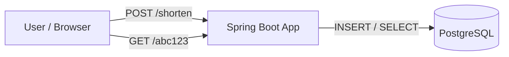

One Spring Boot application. One PostgreSQL database. Two endpoints. The schema is a single table:

```sql
CREATE TABLE urls (
    short_code   VARCHAR(10) PRIMARY KEY,
    long_url     TEXT        NOT NULL,
    created_at   TIMESTAMP   NOT NULL DEFAULT now()
);
```

The two flows:

**Create (write path).** A `POST /shorten` arrives with a long URL. We need to mint a unique short code. The dead-simple version: insert the long URL into an `AUTO_INCREMENT`/serial column to get an integer ID, then **Base62-encode** that integer into a short string. Base62 uses `[a-z A-Z 0-9]` — 62 symbols — so each character carries log₂(62) ≈ 5.95 bits. Seven characters give 62⁷ ≈ **3.5 trillion** combinations, comfortably more than we'll ever need. Integer `125` becomes `"cb"`, integer `1,000,000` becomes `"4c92"`. The user gets `https://short.ly/4c92`.

**Redirect (read path).** A `GET /4c92` arrives. We Base62-*decode* `4c92` back to the integer (or just look up the string directly), `SELECT long_url FROM urls WHERE short_code = '4c92'`, and return an **HTTP 301 or 302** redirect with the long URL in the `Location` header. The browser follows it. Done.

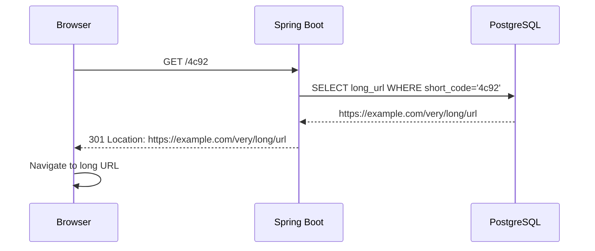

Why does this work? Because at low traffic, PostgreSQL on a single box will happily serve thousands of these tiny indexed lookups per second, the dataset fits in memory, and you have a real, shippable product. **Do not add Redis here.** Do not add Kafka. There is no problem yet, and architecture without a problem is just cost and risk you've volunteered for. The senior move on day one is restraint.

One decision worth pausing on even now: **301 vs 302.** A 301 ("Moved Permanently") tells the browser and intermediate caches they may remember this mapping and skip your server entirely next time. That sounds wonderful for load — until you realize it *destroys your analytics* (you never see the repeat clicks) and means you can never change or disable a link. A 302 ("Found" / temporary) keeps every click flowing through your servers, which is more load but preserves counting and control. Bitly uses **301-style permanent semantics for some cases but generally favors keeping clicks visible** — the analytics *is* the business, so most shorteners deliberately choose the more expensive 302-style behavior. This is our first real tradeoff: we are *choosing* to absorb more traffic in exchange for data. Hold that thought; it defines the read load for the rest of the chapter.

## 3. The First Scaling Crisis

The product catches on. A few popular links get embedded in a viral tweet and a TV chyron. Traffic climbs from hundreds of redirects per second to tens of thousands. Three things start to hurt, and they hurt in a specific, instructive order.

**First, the single database becomes the bottleneck on reads.** Every redirect is a database round trip. At 50,000 redirects/second, you are asking one PostgreSQL instance to do 50,000 point lookups per second *plus* handle writes *plus* whatever analytics queries the marketing dashboard fires. The box's CPU saturates, connection pools exhaust, and p99 latency — the latency the unluckiest 1% of clicks experience — climbs from 5 ms to 500 ms. Redirects feel sluggish. This is the classic read-overload crisis, and it arrives first precisely because reads outnumber writes so heavily.

**Second, you notice the load is wildly uneven.** You instrument the lookups and discover that **a few hundred links account for the overwhelming majority of redirects.** The link from the viral tweet is getting hammered; the millions of links created last year sit idle. This is the famous **skewed access distribution** (often loosely called a power law or "the hot key problem"), and it is the single most important empirical fact about real systems. It is also *fantastic news*, because it means a small, cheap cache can absorb a huge fraction of the load. The database is exhausting itself answering the same few questions over and over.

**Third, a subtler write-path problem lurks.** That `AUTO_INCREMENT` ID generator we used in V1 is a single sequence on a single database. The moment we want to run more than one database (and we will, soon), "give me the next unique integer" stops being free — two databases would hand out the same ID. We don't feel this yet, but a senior engineer sees it coming and starts thinking about ID generation *before* the migration, not during the 2 a.m. incident.

Let's solve the read crisis first, because it's on fire, then circle back to ID generation, which is smoldering.

## 4. Architecture Evolution

### Step 1 — Put the app behind a load balancer and run many copies

The Spring Boot app itself is **stateless** — every request carries everything it needs, nothing is held in the app's memory between requests. Stateless services are a gift: you can run twenty copies behind a load balancer and any copy can serve any request. This is horizontal scaling at its easiest, and it's always the first structural move.

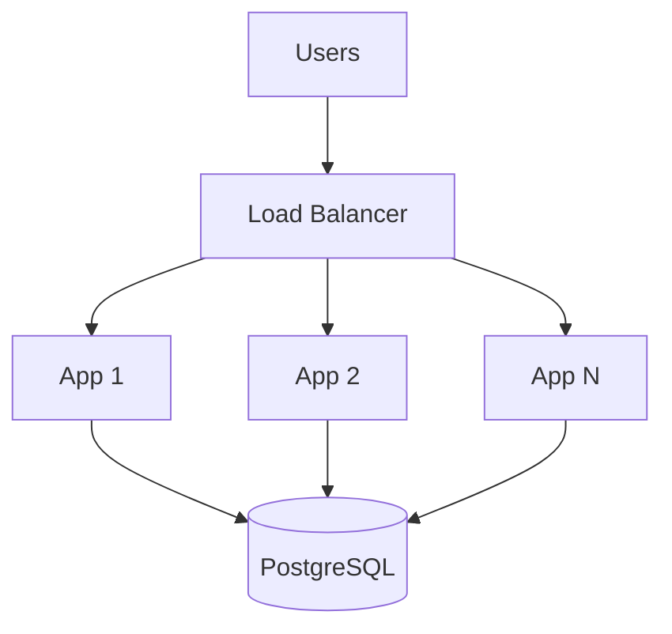

But notice this *doesn't fix the real problem.* All twenty app servers still hammer the one database. We've scaled the cheap tier and exposed that the bottleneck was never the app. This is a recurring lesson: scaling the stateless tier is easy and rarely where the real fight is. The fight is always at the stateful layer.

### Step 2 — Cache the hot links

Now we attack the actual bottleneck with the skew we discovered. We put **Redis in front of the database as a look-aside cache** for the redirect path:

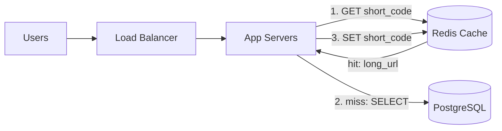

The redirect logic becomes: check Redis for the short code; on a **hit**, return the redirect immediately without touching the database; on a **miss**, read from PostgreSQL, write the result into Redis with a TTL, and return. Because a few hundred links drive most traffic, after a brief warm-up the **cache hit rate climbs above 95%**, and the database load collapses by more than an order of magnitude. The viral link now lives entirely in RAM, served in microseconds.

This is the canonical **cache-aside (look-aside) pattern**, and it's worth naming the alternatives we *didn't* pick so you understand the choice:

- **Cache-aside** (what we chose): the application manages the cache. Simple, resilient (if Redis dies, we fall back to the DB and just get slower), and it only caches what's actually requested. The downside is the first request for any key always misses.
- **Read-through / write-through:** the cache sits inline and manages DB access itself. Cleaner application code, but tighter coupling and a more complex cache layer.
- **Write-back:** writes go to the cache and are flushed to the DB later. Fast writes, but you can *lose data* if the cache dies before flushing — unacceptable for a system of record.

For a read-heavy, loss-tolerant *cache* (the DB remains the source of truth), cache-aside is the right default, and it's what most teams reach for. Note the data is immutable once created — a short code always maps to the same long URL — which means **cache invalidation, normally the hardest problem in computer science, is almost free here.** We mostly only worry about TTL to evict cold entries and reclaim memory. This near-absence of invalidation is a luxury specific to this domain; savor it, because in later chapters (Facebook, Instagram) invalidation will be the central nightmare.

### Step 3 — Fix ID generation before sharding forces it

Now the smoldering problem. We want to add more databases and more app servers, but our unique-ID scheme is a single database sequence. We need a way to generate unique short codes across many machines with no central coordinator on the hot path. Three real options:

**Option A — A dedicated ID-generation service using ranges.** A central service (or coordination store like ZooKeeper) hands each app server a *range* of IDs — say, server 1 gets 1–1,000,000, server 2 gets 1,000,001–2,000,000. Each server then mints IDs from its range locally with zero coordination, only talking to the central service once per million IDs to grab the next range. This is simple, gives short sequential codes, and the coordination cost is negligible. The downside: codes are sequential and therefore *guessable* — someone can enumerate your links by counting up. For a public shortener that may be a privacy problem.

**Option B — Snowflake-style IDs.** Generate a 64-bit ID locally from `[timestamp | machine_id | per-machine sequence]`. No coordination at all after each machine learns its ID. Globally unique, roughly time-ordered, infinitely scalable. The codes are longer (a 64-bit number is ~11 Base62 chars) but that's fine. This is what you reach for when you need decentralized generation. We'll deep-dive Snowflake in the Twitter chapter, since Twitter invented it for exactly this class of problem.

**Option C — Random codes with collision check.** Generate 7 random Base62 characters, attempt to insert, and on the rare primary-key collision, retry. With 3.5 trillion possible 7-char codes and only billions used, collisions are vanishingly rare, so the retry loop almost never runs. Codes are unguessable (a security win), generation is fully decentralized, and the only cost is the occasional extra round trip on collision. **For a URL shortener specifically, this is often the best choice** because unguessability is a feature and the collision rate is negligible until the keyspace fills.

The senior point here is not "pick C." It's that **ID generation is a real architectural decision with security, scalability, and aesthetic tradeoffs**, and the right answer depends on whether you value short codes, unguessable codes, or zero coordination. A junior picks `AUTO_INCREMENT` and never thinks about it. A senior knows it's a fork in the road.

### Step 4 — Partition the database for storage, not just reads

Caching solved reads. But the *data itself* keeps growing — billions of links, each with a long URL and metadata, plus the click events for analytics, which dwarf everything. Eventually one database can't *store* it all, and even if it could, writes and analytical scans would contend. We **shard the `urls` table by short_code**, using a hash of the short code to assign each link to one of N database partitions.

```mermaid
flowchart TB
    App[App Servers] --> H{hash(short_code) mod N}
    H --> S0[(Shard 0)]
    H --> S1[(Shard 1)]
    H --> S2[(Shard 2)]
    H --> S3[(Shard N)]
```

Sharding by `short_code` is natural because **every redirect already knows the short code** — the lookup key is right there in the URL path, so we can route directly to the correct shard with no fan-out. This is the ideal sharding situation: your most common query carries its own partition key. Compare this to sharding by, say, `created_at`, which would make redirects fan out across all shards — a disaster. *Choosing the shard key to match your dominant access pattern is the whole art of partitioning,* and we got lucky that the shortener's dominant pattern (lookup by code) aligns perfectly with a high-cardinality, uniformly-distributable key.

We'll defer the *mechanics* of how to add shards without reshuffling all the data — **consistent hashing** — to the Redis and Cassandra chapters, where it's the star of the show. For now, know that naive `hash mod N` works but makes adding a shard painful (almost every key moves), and consistent hashing is the fix.

## 5. Deep Dive Into Critical Components

Three components define this system. Let's open each one up.

### The redirect service: latency is the product

The redirect path is the hottest code in the system, and its entire job is to answer "what long URL does this code map to?" in as few milliseconds as possible. The optimized path is: **edge/CDN → app server → Redis → (rarely) database.** With a warm cache, the vast majority of redirects never reach the database and complete in low single-digit milliseconds. The art is in shaving each layer:

- **Connection reuse.** Opening a new TCP+TLS connection per request would add tens of milliseconds. We keep persistent connection pools to Redis and the DB, and keep-alive to clients.
- **Avoid the database on the hot path entirely.** A cache miss on a *popular* link should be impossible in steady state; we even pre-warm the cache for known-hot links. A miss should only happen for genuinely cold, rarely-clicked links, where a few extra milliseconds is invisible.
- **Fail open, not closed.** If Redis is briefly unreachable, we fall through to the database rather than erroring. A slower redirect is acceptable; a broken redirect is not. The system degrades gracefully.

### Cache design: the 95% that holds the system up

The cache isn't just "Redis." Its *design* is what matters:

- **What to cache:** the `short_code → long_url` mapping, which is small (a URL is a few hundred bytes) and immutable, so entries never go stale.
- **TTL strategy:** we use a TTL not for correctness (the data never changes) but for *memory management* — to evict links that stopped being clicked so we don't pay to keep three billion cold mappings in RAM. An LRU eviction policy in Redis does this automatically: hot links stay, cold links fall out.
- **Capacity math:** if the hot set is ~10 million links at ~500 bytes each, that's ~5 GB — trivially fits in one Redis node's memory, with room to spare. We do *not* need to cache all billion links; the skew means caching the hot 1% captures 95%+ of traffic. This is the payoff of the power-law insight: **you cache a little and win a lot.**

### Analytics: the write firehose hiding behind the reads

Here's the part juniors miss. Every redirect should record a click event — timestamp, country (from IP), device, referrer — for the analytics dashboards that are the actual business. That's a *write* on the read path, and at 100,000 redirects/second it's 100,000 writes/second, which would obliterate the database we just protected. **You never write click events synchronously to the primary database.** Instead, the redirect fires the event onto a **message queue / log (Kafka)** and returns immediately. Downstream consumers batch these events and write them to an analytics store (a columnar warehouse or a system like ClickHouse/Cassandra) optimized for aggregation.


This is your first encounter with the most important async pattern in this book: **decouple the slow/bulky work from the user-facing path using a queue.** The user's redirect must be fast; the analytics write can happen a few seconds later, batched, in the background. The queue also *absorbs spikes* — if a link goes viral and click events 10×, Kafka buffers them and consumers catch up, instead of the spike taking down the writer. We will see this exact move, with variations, in nearly every remaining chapter.

## 6. Scaling to Massive Scale

Let's put numbers on it and watch the bottlenecks migrate.

**Capacity estimation.** Suppose 100 million new links/day. That's 100M / 10⁵ ≈ **1,000 writes/second average**, maybe 3,000 at peak — small. Now reads: a healthy shortener might see 100:1 read/write, so **~100,000 redirects/second average**, several hundred thousand at peak. Storage: 100M links/day × 365 ≈ 36.5B links/year; at ~500 bytes each that's ~18 TB/year for the mappings — meaningful but manageable. The click events, however, are the monster: at 100,000 clicks/second × ~100 bytes, that's ~10 MB/second, ~**860 GB/day**, hundreds of TB/year. *The analytics data is 10–50× larger than the link data itself.* This reframes the whole system: the link store is a modest sharded database; the analytics store is a big-data problem.

**At 10M users**, the cache + read-replica + single sharded DB design we built handles everything. No drama.

**At 100M users**, two new bottlenecks emerge. First, a *single* Redis node, while big enough for the hot set, becomes a single point of failure and a hot spot — so we move to a **Redis cluster** with the keyspace partitioned across nodes and replicas for failover. Second, the analytics pipeline must scale horizontally: more Kafka partitions, more consumers, a distributed analytics store.

**At 1B users / global traffic**, geography becomes the dominant force. A user in Sydney clicking a link should not wait 150 ms for a round trip to Virginia. We go **multi-region**: deploy the redirect service and a cache in every region, and serve redirects entirely from the nearest region. The link mapping data is immutable and small enough to **replicate to every region** (or lazily populate each region's cache on first miss), so a redirect almost never crosses an ocean. Writes (new links) can be routed to a primary region and replicated out, accepting that a brand-new link might take a second or two to become resolvable worldwide — a perfectly acceptable tradeoff, because nobody creates a link and expects someone on the other side of the planet to click it in the same second. This is **read-local, write-anywhere-eventually**, and the immutability of our data makes it unusually clean here.

## 7. Failure Stories

**Incident 1 — The cache stampede.** A celebrity tweets a bit.ly link to 50 million followers. The link wasn't in the cache (it's brand new). The first redirect misses, goes to the database... and so do the next *fifty thousand redirects that arrive in the same few milliseconds before the first one finishes populating the cache.* All of them miss, all of them slam the database for the same key, and the database — which we so carefully protected — falls over from a thundering herd asking one identical question. This is the classic **cache stampede** (or "dogpile"). *Root cause:* a cache miss on a suddenly-hot key with no coordination among the concurrent missers. *Fix:* **request coalescing / single-flight** — when many requests miss the same key simultaneously, only *one* goes to the database to repopulate; the rest wait briefly for that result. Combined with proactively warming the cache for links that suddenly spike, this turns a 50,000-query stampede into a single query. We'll see stampede defenses again in the CDN and Memcached chapters; it is one of the most universal failure modes in caching.

**Incident 2 — The hot shard.** We sharded by `hash(short_code)`, expecting even distribution. But one short code — a link in a Super Bowl ad — receives 40% of all redirect traffic for an evening. Its shard's database and even its cache node melt while the other shards idle. *Root cause:* even perfect *key* distribution doesn't protect you when one *key* is itself a hotspot; sharding spreads keys, not load-per-key. *Fix:* the cache layer absorbs single-key hotspots beautifully (one key in RAM serves millions of reads), so the real defense is ensuring hot keys are *replicated* across multiple cache nodes so even the cache node serving that key doesn't saturate. Some systems detect hot keys at runtime and replicate them to every cache node. The lesson: **partitioning solves storage and aggregate load; it does not solve single-item hotspots — caching and replication do.**

**Incident 3 — The 301 that wouldn't die.** Early on, someone configured popular links to return **301 Permanent** redirects to reduce server load. It worked too well: browsers and proxies cached the mapping forever. Then a customer's destination URL changed (or worse, a link was used for abuse and needed to be disabled), and we *could not take it back* — millions of browsers had memorized the old destination and never asked us again. *Root cause:* 301 transfers control of the mapping to clients permanently. *Fix:* default to **302** for anything that might change or that we need to keep counting, reserving 301 only for truly permanent, fire-and-forget links. This is the analytics-vs-load tradeoff from Chapter 2 coming back to bite — and it shows why senior engineers think about the *full lifecycle* of a decision, including "how do I undo this?"

## 8. Tradeoffs and Engineering Decisions

**301 vs 302.** 301 offloads traffic to client caches (less load, lower cost) but loses analytics and control (can't update or count). 302 keeps every click flowing through you (more load, more cost) but preserves the data that *is the business* and keeps you in control. Most shorteners choose 302-style behavior on purpose. *There is no "correct" answer — there's a choice about whether you're optimizing for infrastructure cost or business value, and for a shortener, business value wins.*

**Random codes vs sequential IDs.** Random codes are unguessable (security/privacy win) and need no coordination (scalability win), at the cost of an occasional collision-retry and slightly less "clean" codes. Sequential IDs are compact and ordered but guessable and require a coordinator. For a public link service, unguessability usually tips the balance to random.

**SQL vs NoSQL for the mapping store.** The mapping is dead simple — a key-value lookup by short code — which screams "NoSQL key-value store." But the volume of *mapping* data is modest and a well-sharded relational database handles point lookups fine, while giving you transactions and familiar tooling. The honest answer: *either works, and the data model is so simple that the decision should be driven by operational familiarity, not theology.* The **analytics** store is where the SQL/NoSQL question has a clear answer — that's a high-volume, append-heavy, aggregation-query workload that belongs in a columnar/analytical store, not your transactional database.

**Caching everything vs caching the hot set.** Caching all billion mappings would guarantee zero database reads but cost enormous memory. Caching only the hot set (via LRU) captures 95%+ of traffic for a fraction of the cost. The power-law access pattern makes the hot-set strategy a no-brainer — *spend memory where the traffic actually is.*

## 9. How Big Tech Builds It

Real shorteners (Bitly, TinyURL, and the in-house shorteners at Twitter `t.co` and Google's former `goo.gl`) converge on remarkably similar shapes, which is reassuring — it means the reasoning in this chapter mirrors reality. Common threads: a **heavily cached read path** because the read/write skew is universal; **asynchronous, queue-based analytics** because click data dwarfs link data; and a **key-value-shaped storage layer** because the data model is trivially simple.

Where they differ is *emphasis*. **Twitter's `t.co`** is less about shortening (their codes aren't even that short) and more about **safety and analytics** — every link in a tweet is wrapped so Twitter can scan it for malware and phishing and measure engagement; the redirect is a security checkpoint as much as a convenience. **Bitly** built an entire analytics product on top of the redirect stream, so for them the Kafka-and-warehouse pipeline *is* the product and the redirect is almost a loss-leader. The philosophical lesson: the same core architecture serves wildly different business goals depending on *which side* you treat as the product — the redirect or the data exhaust it generates.

## 10. Interview Perspective

When an interviewer asks you to "design a URL shortener," they are not checking whether you can build a `HashMap`. They are probing whether you recognize the **read/write asymmetry**, whether you reach for **caching driven by access skew**, whether you think clearly about **unique ID generation across machines**, and whether you remember that **the analytics write path is the real scaling challenge.**

**Weak answer:** "I'll use a database with an auto-increment ID, Base62 encode it, and add Redis for caching." It's not *wrong*, but it's a recital. It names components without reasoning, ignores the click-tracking firehose entirely, and treats ID generation as a non-issue.

**Strong, senior answer:** Start by establishing the read/write ratio out loud and using it to declare that this is a read-optimization problem. Estimate QPS and *separately* estimate the analytics data volume, then point out that the analytics is the larger system. Discuss ID generation as a real tradeoff (random vs sequential vs Snowflake) tied to security. Introduce caching as a *response* to the power-law access pattern, not as a reflex. Proactively raise the cache stampede and hot-key problems and how you'd defend against them. Mention 301-vs-302 as a business-vs-infrastructure tradeoff. And close on multi-region read-local serving enabled by the data's immutability. The difference between the two answers isn't more components — it's that every component arrives attached to the problem that justifies it. That is the entire skill this book is teaching, and you just watched it in miniature.

---

# Chapter 2 — Distributed Key-Value Store (Redis)

## 1. The Business Problem

In Chapter 1 we *used* Redis as a black box that made reads fast. Now we're going to open the box and build it, because understanding how a distributed key-value store works internally is the single most transferable piece of knowledge in this book — caches, NoSQL databases, session stores, and coordination services all rest on the same foundations. The "business problem" here is meta: thousands of teams need a place to put data they can read and write in *microseconds*, far faster than any disk-backed database, and they need it to survive node failures and grow beyond one machine's memory. Redis exists because **RAM is roughly a thousand times faster than disk**, and an enormous class of problems — caching, rate limiting, leaderboards, session storage, real-time counters, queues — only need simple key-based access but need it *blisteringly* fast. The value Redis creates is latency: it turns a 5 ms database hit into a 0.2 ms memory hit, and at scale that difference is the difference between a snappy product and a sluggish one.

## 2. Building Version 1

Version 1 of an in-memory store is almost embarrassingly simple: a single-threaded process holding a giant hash map in RAM, listening on a socket, speaking a tiny text protocol — `SET key value`, `GET key`. That's it.

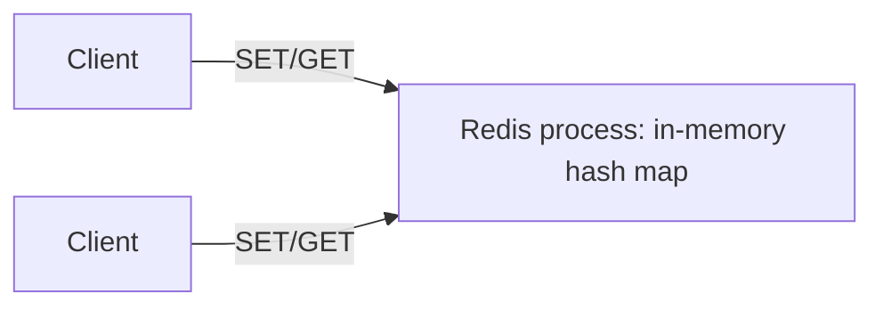

Two design choices in V1 are worth dwelling on because they're counterintuitive. First, **single-threaded.** Redis processes commands one at a time on a single core, and people are often shocked this is fast. It's fast precisely *because* it's single-threaded: no locks, no mutexes, no context-switching, no cache-coherency traffic between cores. Each operation is a pure in-memory hash-map access taking nanoseconds, so a single core can serve hundreds of thousands of operations per second. Concurrency would add coordination overhead that costs more than it saves for tiny operations. This is a profound lesson: **parallelism is not free, and for sufficiently small/fast operations, doing them serially on one core beats coordinating them across many.**

Second, **durability is optional and secondary.** Data lives in RAM, which vanishes on restart. Redis offers two persistence mechanisms — **RDB snapshots** (periodically fork and dump the whole dataset to disk) and **AOF** (append every write command to a log file) — but both are bolt-ons to an in-memory core. The default stance is "I am a cache; if you need a system of record, that's a database's job." This honesty about its role is why Redis stays fast.

## 3. The First Scaling Crisis

Two ceilings appear. **Memory ceiling:** your dataset grows past what one machine's RAM can hold. A box with 256 GB of RAM is large, but a billion 1 KB objects is a terabyte — it doesn't fit. **Throughput/availability ceiling:** one node, however fast, is one node — if it dies, your cache is *gone*, and worse, all the traffic it was absorbing slams into your database simultaneously (the cache going down causes a *correlated* database overload, a nasty failure mode). You need more memory than one box holds and you need to survive a node dying.

## 4. Architecture Evolution

### Step 1 — Replication for availability

First we solve "node dies." We add **replicas**: one primary takes writes and streams them to one or more read replicas. If the primary dies, a replica is promoted. This gives us read scaling (reads can hit replicas) and failover. But it introduces our recurring villain, **replication lag** — a replica might be a few milliseconds behind the primary, so a read just after a write might see stale data. For a cache, that's usually fine. The promotion itself needs coordination so two nodes don't both think they're primary (split-brain); Redis Sentinel or Cluster handles this election.

### Step 2 — Partitioning for capacity, and the consistent hashing payoff

To break the memory ceiling we **partition (shard)** the keyspace across many nodes, each holding a slice. The naive scheme is `node = hash(key) mod N`. It works until you add or remove a node: changing `N` reassigns *almost every key* (because the modulus changes for nearly all keys), triggering a catastrophic reshuffle where the whole cluster moves data and hit rates crater. This is the problem **consistent hashing** was invented to solve, and since it underpins Redis Cluster, Cassandra, DynamoDB, CDNs, and load balancers, we'll build the intuition carefully here once.

Imagine a ring of hash values from 0 to 2³²−1. Place each *node* on the ring at several positions (its hash). To find a key's home, hash the key to a point on the ring and walk clockwise to the first node you hit. Now the magic: **when you add a node, it lands between two existing nodes and only steals the keys in that arc — roughly 1/N of the data moves, not all of it.** Remove a node, and only its keys migrate to the next node clockwise. The "virtual nodes" trick (placing each physical node at many ring positions) smooths out the distribution so no single node gets an unfairly large arc.

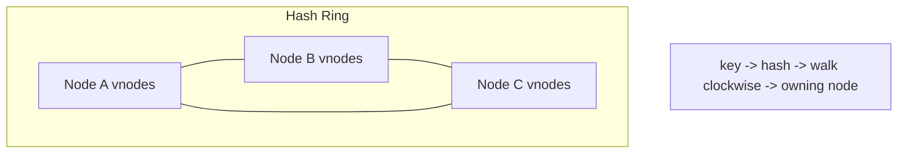

Redis Cluster implements a pragmatic variant: it divides the keyspace into **16,384 hash slots**, and each node owns a range of slots. Adding a node means handing it some slots; only those slots' keys migrate. Same idea, fixed slot count for simplicity. *The whole point is the same: make membership changes cost O(1/N) data movement instead of O(everything).* Internalize this — you will reach for it in five more chapters.

### Step 3 — Handling hot keys and big values

Partitioning spreads *keys* evenly but, as we learned with the URL shortener, one *key* can be a hotspot (a global rate-limit counter, a celebrity's profile). The defenses: **replicate the hot key** to multiple nodes and read from any; or **shard the key itself** (split a hot counter into N sub-counters, one per node, and sum on read). Big values (a 50 MB blob in one key) are an anti-pattern — they make one node's operations slow and block the single thread; the fix is to keep values small and store large blobs elsewhere (S3) with Redis holding only a pointer.

## 5. Deep Dive Into Critical Components

**The event loop.** Redis multiplexes thousands of client connections on one thread using non-blocking I/O (epoll). It reads ready commands, executes them instantly against memory, and writes responses — a tight loop that never blocks. Any command that *could* block (a slow `KEYS *` scan over millions of keys) is dangerous precisely because it stalls *every other client* — which is why senior engineers ban `KEYS` in production and use `SCAN`'s incremental cursor instead.

**Eviction and memory policy.** When memory fills, Redis must evict. Policies like `allkeys-lru` (evict least-recently-used) or `allkeys-lfu` (least-frequently-used) decide what to drop. Choosing the right policy is the difference between a cache that keeps the hot set and one that thrashes. For a pure cache, LRU/LFU; for data you can't lose, `noeviction` (reject writes when full) forces you to confront the capacity problem rather than silently dropping data.

**Data structures as a feature.** Redis isn't just strings — it has lists, sets, sorted sets, hashes, streams, HyperLogLog. The sorted set (`ZADD`/`ZRANGE`) makes leaderboards trivial; streams give you a lightweight queue; HyperLogLog counts unique items in 12 KB regardless of cardinality. These rich structures are *why* teams reach for Redis over a plain memcached — it's a Swiss-army knife of fast data primitives.

## 6. Scaling to Massive Scale

At large scale you run a Redis Cluster of dozens to hundreds of nodes, sharded by hash slot, each with replicas. Capacity math: 200 nodes × 100 GB RAM = 20 TB of hot data, serving tens of millions of ops/second aggregate. The new challenges are operational: **cluster topology management** (adding/removing nodes, rebalancing slots without downtime), **client-side smarts** (clients must know which node owns which slot and follow `MOVED`/`ASK` redirects during migrations), and **cross-slot operations** (a multi-key transaction only works if all keys live in the same slot, forcing the use of hash tags like `{user123}:profile` to co-locate related keys). Multi-region adds the question of whether to replicate the cache globally (low latency, eventual consistency) or keep regional caches independent (simpler, but cold in each region).

## 7. Failure Stories

**The persistence fork stall.** Redis takes RDB snapshots by `fork()`-ing the process and dumping memory. On a large instance with heavy writes, the fork's copy-on-write causes a memory spike and a multi-second latency stall as the OS copies pages — clients see timeouts every time the snapshot runs. *Fix:* snapshot on replicas instead of the primary, tune `save` intervals, or use AOF with careful `fsync` policy. Lesson: *durability and latency are in tension even in a "cache."*

**The eviction-induced stampede.** Memory filled, LRU evicted a swath of hot keys during a traffic spike, every evicted key missed simultaneously, and the database got the thundering herd. *Fix:* size memory for the true hot set, use LFU to better protect frequently-used keys, and add request coalescing at the application layer (the same single-flight defense from Chapter 1).

**The split-brain failover.** A network partition isolated the primary; Sentinel promoted a replica; the old primary came back still thinking it was primary, and for a few seconds *two* primaries accepted writes that then conflicted. *Root cause:* failover under partition is a CAP problem — you can't have both consistency and availability. *Fix:* configure `min-replicas-to-write` so a primary that can't reach enough replicas refuses writes (choosing consistency over availability), accepting brief write unavailability to avoid divergence.

## 8. Tradeoffs and Engineering Decisions

**Redis vs Memcached** (full treatment in Chapter 8): Redis offers rich data structures, persistence, and replication; Memcached is simpler, multi-threaded, and pure cache. **Single-threaded vs multi-threaded:** simplicity and predictable latency vs raw multi-core throughput — Redis chose simplicity and won on latency. **Cache-aside vs Redis-as-database:** Redis *can* be a primary store with AOF durability, but using a memory-first system as your system of record means accepting that a correlated failure could lose recent writes; most teams keep Redis as a cache with a durable database behind it. **Strong vs eventual consistency across replicas:** Redis replication is asynchronous (eventual) by default for speed; forcing synchronous replication (`WAIT`) buys consistency at a latency cost — the PACELC tradeoff made concrete.

## 9. How Big Tech Builds It

Twitter, GitHub, Stack Overflow, and Snapchat run Redis at enormous scale, typically as a caching and real-time-data layer in front of durable databases. Many large shops run **Redis Cluster** or managed equivalents (AWS ElastiCache, Google Memorystore). Some build proprietary layers on top — Twitter's caching infrastructure and Netflix's EVCache (built on Memcached, covered later) solve the same "fast tier in front of slow tier" problem with different tradeoffs. The philosophical convergence: *everyone puts a memory-speed tier in front of their databases, because the latency and load-shielding benefits are too large to forgo.*

## 10. Interview Perspective

If asked to "design a distributed cache" or "design Redis," interviewers want to see that you understand **why in-memory is fast**, **why single-threaded can beat multi-threaded for small ops**, **consistent hashing** for partitioning, and the **replication/consistency tradeoffs** of failover. A weak answer describes Redis commands. A strong answer builds up from "RAM is 1000× faster than disk" to "so we hold data in memory, but one box isn't enough, so we partition with consistent hashing to make resharding cheap, and replicate for availability, accepting eventual consistency and the split-brain risk it implies." The strong answer *derives* the architecture from physics and failure modes; the weak one recites the manual.

---

# Chapter 3 — Social Network News Feed (Facebook)

## 1. The Business Problem

Facebook's core loop is the **News Feed**: you open the app and see a personalized, ranked stream of posts from your friends and the pages you follow. The business runs on attention — more time in feed means more ads shown — so the feed must be *fast*, *fresh*, and *relevant*. Behind that simple scroll lies one of the hardest problems in consumer software: with billions of users each connected to hundreds of friends, how do you assemble, for *every* user, a personalized feed from the firehose of everything their connections just posted, in under a second, billions of times a day? This is the **social graph + feed generation** problem, and it has launched a thousand architecture debates.

## 2. Building Version 1

The first version is a pull-on-read query. Store users, friendships, and posts in a relational database:

```sql
posts(id, author_id, content, created_at)
friendships(user_id, friend_id)
```

To build Alice's feed: find Alice's friends, fetch their recent posts, sort by time, return the top N.

```sql
SELECT p.* FROM posts p
JOIN friendships f ON p.author_id = f.friend_id
WHERE f.user_id = :alice
ORDER BY p.created_at DESC LIMIT 50;
```

This is correct, simple, and works great for a college with 10,000 users. The feed is always fresh (computed at read time) and there's no extra storage. Ship it.

## 3. The First Scaling Crisis

That join is a time bomb. As users gain hundreds of friends and the posts table reaches billions of rows, this query becomes a massive fan-in: for *each* feed load, the database must gather recent posts from hundreds of authors scattered across the table, sort them, and return a page — and it must do this every time *any* of a billion users opens the app, dozens of times a day. The read amplification is brutal: one feed view touches hundreds of authors' data. At Facebook's read volume (the feed is viewed *far* more often than posts are written — another extreme read/write asymmetry), this query model collapses. The database can't sustain billions of expensive fan-in joins per day.

## 4. Architecture Evolution

The central insight: **you can do the expensive work at write time instead of read time.** This is the famous **fan-out-on-write vs fan-out-on-read** decision, the beating heart of every feed system.

### Fan-out-on-write (push model)

When Alice posts, *immediately* push that post's ID into a precomputed feed list for *each* of her friends, stored in a fast cache (Redis lists, one per user). Now when Bob opens his feed, his list is already assembled — a single fast read of his precomputed feed, no join.

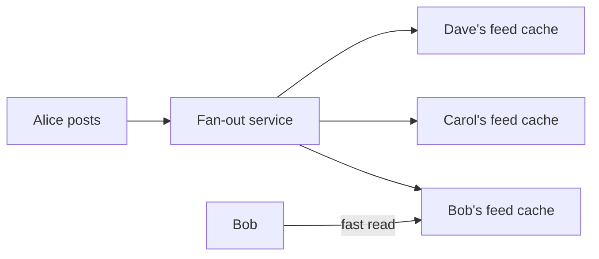

This makes reads trivially fast — exactly what we want for the read-heavy feed. The cost moves to write time: one post by someone with 500 friends becomes 500 cache writes. Usually fine... until we meet the celebrity.

### The celebrity problem and the hybrid model

A user with 50 million followers posts once. Fan-out-on-write means **50 million cache writes for a single post** — a write amplification catastrophe that backs up the fan-out pipeline and delays everyone's feeds. This is where fan-out-on-write breaks, and it's the single most important nuance in feed design.

The production answer is a **hybrid**: use fan-out-on-write for ordinary users (push their posts to followers' feeds), but for celebrities/high-fan-out accounts, *don't* push — instead, **pull their recent posts at read time** and merge them into the precomputed feed. So Bob's feed = his precomputed list (from normal friends, pushed) + a live fetch of the few celebrities he follows (pulled), merged and ranked. This caps write amplification (no 50M-write storms) while keeping reads fast for the common case.

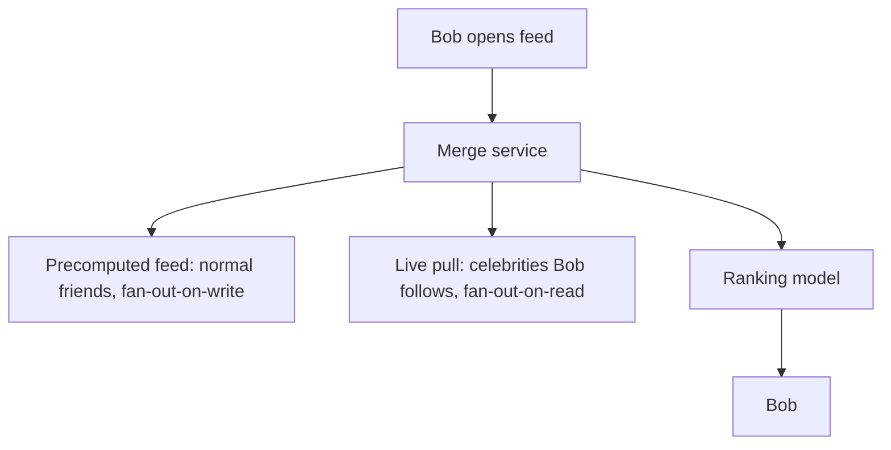

This hybrid — *push for the masses, pull for the celebrities* — is how essentially every large feed (Facebook, Twitter, Instagram) actually works, and recognizing it is a senior-level signal.

## 5. Deep Dive Into Critical Components

**The social graph store.** Friendships form a graph, and "get all friends of X," "are X and Y friends," "friends-of-friends" are graph queries. Facebook built **TAO**, a geographically-distributed, read-optimized graph cache over sharded MySQL, holding the social graph as objects (nodes) and associations (edges). TAO serves billions of reads/second by aggressively caching the graph close to where it's queried, accepting eventual consistency. The lesson: *the social graph is itself a massive, read-dominated, cache-first system separate from the feed.*

**The ranking pipeline.** Modern feeds aren't chronological — they're *ranked* by a machine-learning model predicting engagement (likelihood you'll like, comment, share, dwell). So feed generation is: gather candidate posts (from push + pull), extract features, score each candidate with an ML model, sort by score, return the top N. This ranking step is computationally heavy and runs at read time, which is why the *candidate set* must be small (a few hundred posts) — you can't ML-score a billion posts per feed load. Fan-out's real job is to cheaply narrow billions of posts to a rankable few hundred.

**The feed cache.** Per-user precomputed feeds live in a distributed cache, partitioned by user ID. This is enormous (billions of users × a few hundred post IDs each) but each entry is just IDs, not full posts — the post bodies are hydrated from a separate store at read time. Storing IDs, not content, keeps the feed cache compact and avoids duplicating post bodies across millions of follower feeds.

## 6. Scaling to Massive Scale

At billions of users the dominant costs are the **fan-out write volume** (every post by a normal user multiplied by their friend count — billions of feed-cache writes per day) and the **graph read volume** (every feed load fans into the graph). Multi-region adds the challenge that a user's friends are global, so the feed must assemble data that lives in multiple regions; Facebook replicates the graph regionally and accepts eventual consistency. Data growth is staggering, so old posts are tiered to colder storage and feeds are capped (you can't scroll infinitely into ancient history cheaply).

## 7. Failure Stories

**The fan-out backlog.** A surge of posting (a major world event) flooded the fan-out pipeline; the queue backed up and feeds went stale for minutes. *Fix:* prioritize fan-out for active users, shed load by deferring fan-out to inactive users' feeds (compute lazily when they next log in), and rate-limit the pipeline.

**The hot celebrity.** Before the hybrid model, a mega-celebrity post triggered tens of millions of writes and stalled the system. *Fix:* the pull-for-celebrities hybrid described above — a direct architectural response to a real incident.

**Cache inconsistency on edit/delete.** A user deleted a post, but it lingered in millions of precomputed feeds. *Root cause:* fan-out-on-write duplicates references widely, making invalidation hard. *Fix:* filter deleted/edited posts at hydration time (check the authoritative post store when rendering) rather than trying to purge every feed cache — *invalidate lazily at read, not eagerly at write.*

## 8. Tradeoffs and Engineering Decisions

**Fan-out-on-write vs on-read:** push gives fast reads at the cost of write amplification and storage; pull gives cheap writes at the cost of expensive reads. The hybrid is strictly more complex but wins because it matches each strategy to where it's cheap. **Chronological vs ML-ranked:** chronological is simple and predictable but less engaging; ML ranking drives metrics but adds enormous compute and complexity. **Graph database vs sharded SQL + cache:** a purpose-built graph DB is elegant but Facebook chose sharded MySQL + TAO cache for operational maturity and read performance — *boring, proven storage with a smart cache layer beats exotic databases at extreme scale.*

## 9. How Big Tech Builds It

Facebook: TAO + sharded MySQL + ML ranking + hybrid fan-out. Twitter: famously rebuilt its feed ("timeline") around fan-out-on-write into Redis, then added pull for high-followers — the same convergent design. LinkedIn and Instagram follow similar hybrids. The striking thing is **convergence**: independent teams, solving the feed problem at scale, all arrive at hybrid fan-out + ranked candidate sets + a cached read-optimized graph. When many smart teams converge, it's a strong signal the design reflects the problem's true shape, not fashion.

## 10. Interview Perspective

"Design the Facebook/Twitter feed" is *the* canonical senior interview question. Interviewers evaluate whether you (1) identify the read/write asymmetry, (2) propose fan-out-on-write and then *catch its own celebrity flaw*, (3) arrive at the hybrid, and (4) understand ranking needs a small candidate set. The weak answer is the V1 join, or fan-out-on-write with no mention of celebrities. The strong answer walks the evolution, proactively surfaces the celebrity write-amplification problem before being prompted, lands on the hybrid, and discusses lazy invalidation for edits/deletes. Bonus senior points for separating the social graph as its own cached subsystem and noting that fan-out's real purpose is candidate generation for ranking.

---

# Chapter 4 — Recommendation System (Netflix)

## 1. The Business Problem

Netflix's recommendations are not a feature; they are the product's survival. With tens of thousands of titles and a user whose patience lasts maybe 90 seconds of browsing before they give up and close the app, the homepage *is* the recommendation engine. Netflix has said that personalization and recommendations save it over a billion dollars a year in retention — if you can't find something to watch, you cancel. The business problem is therefore: for each of hundreds of millions of subscribers, assemble a personalized homepage of rows ("Because you watched...", "Trending Now", "Top Picks") ranked to maximize the chance you press play and keep your subscription. Scale matters because this must be personalized per-user, per-device, refreshed regularly, and rendered in well under a second.

## 2. Building Version 1

The simplest recommender is **popularity-based**: show everyone the most-watched titles. No personalization, just a nightly batch job ranking titles by view count, cached and served to all. It's a real baseline that surprisingly often beats nothing, and for a tiny catalog with few users it's fine. The next simplest personalization is **collaborative filtering**: "users similar to you watched X." Compute a user-item matrix (who watched what), find similar users or similar items, recommend accordingly. In V1 this is a nightly batch job in a single database or a Python script over a CSV.

## 3. The First Scaling Crisis

The user-item matrix explodes. With 200M users and 50K titles, the matrix is 10 trillion cells — you cannot compute pairwise user similarities naively (that's O(users²)). Batch jobs that ran in minutes now run for days, and by the time they finish, they're stale. Worse, recommendations computed once a night ignore what you did *this evening* — you binged a thriller an hour ago and the homepage still shows comedies. Two crises: **the computation doesn't scale**, and **batch is too slow to feel personal.**

## 4. Architecture Evolution

### Step 1 — Offline + online (the Lambda-ish split)

The industry answer is a **two-tier pipeline**: heavy model *training* happens **offline** (batch, on a big-data cluster), while lightweight *inference and re-ranking* happens **online** (in real time at request). Offline, you train models (matrix factorization, then deep learning) over the full history nightly or hourly, producing compact user and item **embeddings** — dense vectors capturing taste. Online, when you open the app, you fetch your embedding and the candidate items' embeddings and compute scores in milliseconds.

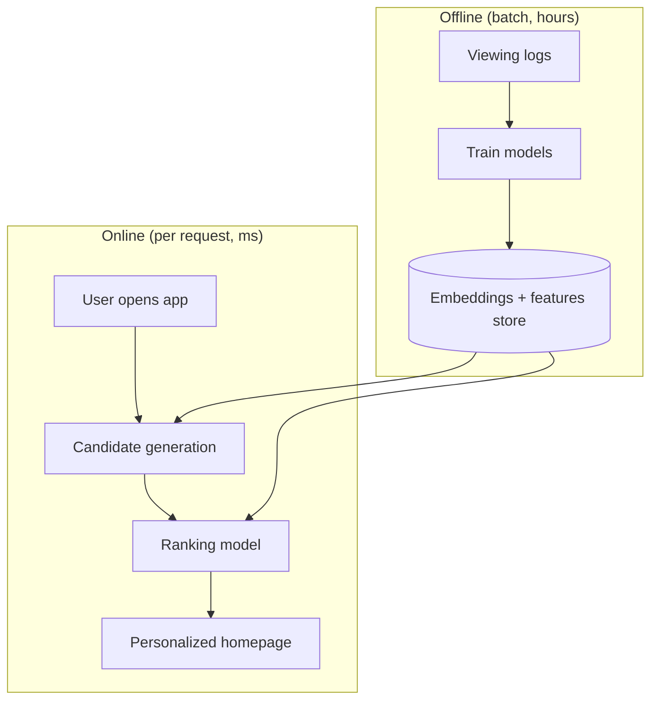

### Step 2 — Candidate generation then ranking (the funnel)

You cannot score 50,000 titles per user per request. So recommendation becomes a **funnel**: **candidate generation** cheaply narrows 50,000 titles to a few hundred plausible ones (using embeddings: nearest neighbors to your taste vector, plus trending, plus continue-watching), then a heavier **ranking model** scores those few hundred with rich features (time of day, device, recent activity) to order the homepage. This two-stage funnel — cheap recall then expensive precision — is the universal structure of large recommenders and search alike. We saw its cousin in Facebook's feed (fan-out generates candidates, ML ranks them); it's the same pattern.

### Step 3 — Real-time signals

To fix staleness, recent events (what you just watched, paused, searched) stream through Kafka into a **feature store** that the online ranker reads, so this evening's binge influences the next page load. The heavy model is still trained offline, but the *features* it consumes are fresh. This is the pragmatic resolution of batch-vs-realtime: **train slowly, serve with fresh features.**

## 5. Deep Dive Into Critical Components

**Embeddings and approximate nearest neighbor (ANN) search.** Representing users and items as vectors turns "find similar items" into "find nearest vectors," and doing that exactly over millions of items is too slow, so systems use **ANN indexes** (HNSW, FAISS, ScaNN) that find approximate nearest neighbors in milliseconds. ANN is the engine of modern candidate generation and, increasingly, of semantic search and RAG systems — a hugely transferable concept.

**The feature store.** A feature store serves the *same* feature values to offline training and online inference, solving the insidious **train/serve skew** bug where a model trained on one definition of a feature is served a subtly different one and silently degrades. This consistency is a real production concern that juniors rarely anticipate.

**A/B testing infrastructure.** Netflix changes recommendations only behind experiments, measuring impact on retention and engagement. The recommender is inseparable from an experimentation platform that can run thousands of concurrent A/B tests and attribute outcomes — the *measurement* system is as important as the model.

## 6. Scaling to Massive Scale

At hundreds of millions of users across the globe, training pipelines run on large Spark/distributed-ML clusters over petabytes of viewing logs; the online tier is a low-latency service replicated per region with the feature store and embeddings cached close to users. Precomputation helps: much of the homepage can be **precomputed and cached** per user (refreshed periodically), with only the most dynamic rows computed live — the same precompute-vs-compute-live tradeoff as the feed. Data growth is dominated by the logs (every play, pause, scroll is an event), which feed both training and analytics.

## 7. Failure Stories

**The feedback loop / filter bubble.** A recommender trained on what it itself surfaced learns to recommend only what it already shows, narrowing diversity until engagement quietly declines. *Fix:* inject exploration (occasionally show uncertain candidates) and optimize for long-term retention, not just next-click. This is a *modeling* failure, but it's a production incident in slow motion.

**The cold start.** A brand-new user (or new title) has no history, so collaborative filtering has nothing to work with and recommends generic popularity — a poor first impression at the moment retention matters most. *Fix:* onboarding signals (pick a few favorites), content-based features (genre, cast) that don't need history, and contextual defaults.

**The stale-model serving bug.** A training pipeline silently failed for days; the online tier kept serving an increasingly stale model, and engagement drifted down before anyone noticed. *Fix:* freshness monitoring and alerting on model age and on prediction-distribution drift — *observability for ML, not just for servers.*

## 8. Tradeoffs and Engineering Decisions

**Batch vs real-time:** batch training is cheap and powerful but stale; real-time is fresh but expensive and harder to operate. The offline-train/online-serve-with-fresh-features split captures most of both. **Precompute vs compute-on-request:** precomputing homepages saves latency and compute but wastes work on users who don't log in and can be stale; computing live is fresh but costly. **Accuracy vs diversity vs latency:** a more accurate model that takes 200 ms may lose to a slightly worse one at 20 ms because the slow one hurts the browsing experience. **Collaborative vs content-based:** collaborative is powerful but cold-starts badly; content-based handles new items but misses subtle taste — production blends both.

## 9. How Big Tech Builds It

YouTube's recommender (deep candidate generation + deep ranking, the funnel made famous in their 2016 paper), Spotify's Discover Weekly, Amazon's "customers also bought," and TikTok's For You feed are all variations of the **two-stage funnel + embeddings + real-time signals** architecture. TikTok's distinguishing bet is an exceptionally tight real-time feedback loop — the model adapts within a session — which is why its recommendations feel uncannily fast to learn you. The convergent lesson: *retrieve cheaply, rank expensively, learn continuously, and measure everything with experiments.*

## 10. Interview Perspective

"Design a recommendation system" rewards candidates who structure it as a funnel (candidate generation → ranking), separate offline training from online serving, and raise cold start, the feedback loop, and A/B testing unprompted. A weak answer says "use collaborative filtering" and stops. A strong answer derives the funnel from the impossibility of scoring the whole catalog per request, explains embeddings + ANN for candidate generation, addresses freshness via a feature store, and treats the experimentation platform as part of the system. Senior candidates also note that the *objective* matters — optimizing for clicks vs long-term retention produces very different systems.

---

# Chapter 5 — Distributed File System (HDFS / GFS)

## 1. The Business Problem

Some workloads need to store and process files far too large for any single machine — petabytes of web crawls, logs, sensor data, video — and to run computations *across* that data in parallel. Before distributed file systems, you were limited by one machine's disk. Google's GFS (and its open-source descendant HDFS) solved this: **store enormous files reliably across thousands of commodity machines, survive constant hardware failure, and let computation run where the data lives.** The business value is enabling big-data processing (MapReduce, Spark) and serving as the durable substrate beneath data warehouses, ML training, and analytics. Scale matters because at thousands of machines, *hardware failure is not an exception — it is the steady state.* With 10,000 disks, several are dying every day; the system must treat failure as normal.

## 2. Building Version 1

Naively, you'd store a file on one big machine with a big disk. It works until the file exceeds the disk, or the disk dies and the file is gone. The first real idea: **split each file into fixed-size blocks** (HDFS uses 128 MB blocks) and spread the blocks across many machines (DataNodes), with a central **NameNode** tracking which blocks live where and the directory structure (metadata).

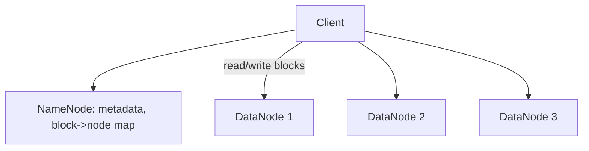

The split of **metadata (NameNode) from data (DataNodes)** is the foundational design: one authority knows *where everything is*, many workers *hold the bytes*. Clients ask the NameNode "where are the blocks for this file?" then stream data directly from DataNodes, so the NameNode never becomes a data bottleneck — it only handles metadata.

## 3. The First Scaling Crisis

Two problems: **disks fail constantly**, so a block on one dead DataNode means data loss; and **the NameNode is a single point of failure and a memory bottleneck** — it holds all metadata in RAM, so the number of files is limited by NameNode memory, and if it dies, the whole filesystem is inaccessible.

## 4. Architecture Evolution

### Step 1 — Replication for durability

Each block is stored on **three DataNodes** (default replication factor 3) on different machines and racks. If one dies, the other two serve the data, and the NameNode notices the under-replication (via missing heartbeats) and re-replicates the block to a new node to restore three copies. **Rack-aware placement** puts copies on different racks so a whole-rack failure (a top-of-rack switch dying) doesn't lose data. Three copies on commodity disks is cheaper and simpler than exotic reliable hardware — *reliability through redundant cheap parts, not expensive parts.* This is GFS's foundational philosophy and it reshaped the industry.

### Step 2 — Write pipeline and consistency model

Writes are append-oriented and pipelined: the client writes to the first DataNode, which forwards to the second, which forwards to the third, acknowledging back up the chain. HDFS deliberately offers a *simple* consistency model — **write-once, append, read-many** — rather than arbitrary random writes, because supporting random concurrent writes across replicas would be vastly more complex. By constraining the workload (big sequential reads/writes, append-only), the system stays simple and fast. *Choosing a simpler data model to make the distributed problem tractable is a recurring senior move.*

### Step 3 — Erasure coding for cost

3× replication means 200% storage overhead. For colder data, HDFS supports **erasure coding** (Reed-Solomon), which achieves the same durability with ~50% overhead by storing parity blocks instead of full copies — the same math RAID uses, applied across machines. The tradeoff: erasure-coded data is cheaper to store but more expensive to reconstruct on failure (you must read many blocks to rebuild one), so it suits cold data, not hot.

## 5. Deep Dive Into Critical Components

**The NameNode.** It holds the entire namespace and block map in memory for speed, persists changes to an edit log (and periodic FsImage checkpoints) for durability, and learns block locations from DataNode **block reports** and liveness from **heartbeats**. Its single-point-of-failure nature is solved by a **standby NameNode** with a shared edit log and automatic failover (via ZooKeeper) — HDFS High Availability. The metadata-in-RAM design is why HDFS struggles with *many small files*: each file/block consumes NameNode memory regardless of size, so a billion tiny files exhausts the NameNode while a thousand huge files don't. *The small-files problem is the classic HDFS gotcha.*

**Data locality.** The reason this matters beyond storage: computation frameworks (MapReduce, Spark) ask the NameNode where a file's blocks live and *schedule the computation on those same machines*, so data is processed locally instead of shipped across the network. **Moving compute to data** rather than data to compute is the key efficiency that made big-data processing feasible — network bandwidth, not disk, was the scarce resource.

## 6. Scaling to Massive Scale

At thousands of nodes and exabytes, the NameNode's single-namespace memory limit bites, addressed by **HDFS Federation** (multiple independent NameNodes, each owning part of the namespace). Modern cloud setups often replace HDFS with **object storage (S3)** as the durable layer, separating storage from compute entirely so each scales independently — the cloud-era evolution of GFS's ideas. S3 gives effectively infinite, 11-nines-durable storage; compute clusters (Spark, EMR) spin up, read from S3, and spin down. This **disaggregation of storage and compute** is the dominant modern pattern and a direct descendant of GFS thinking.

## 7. Failure Stories

**The NameNode OOM from small files.** A team wrote billions of tiny files (one per event); the NameNode ran out of memory and the cluster became unusable. *Fix:* compact small files into large container files (SequenceFiles, or table formats like Parquet/ORC), and never use a distributed file system as a key-value store for tiny objects.

**Correlated failure from bad rack placement.** A rack switch failed and, due to a misconfiguration, multiple replicas of some blocks were on that rack — those blocks became unavailable. *Fix:* enforce rack-aware placement and audit replica distribution; *durability assumes failures are independent, so co-located replicas silently break the math.*

**The slow re-replication storm.** Several DataNodes failed at once; the NameNode tried to re-replicate thousands of under-replicated blocks simultaneously, saturating the network and slowing everything. *Fix:* throttle re-replication bandwidth and prioritize blocks with the fewest remaining copies.

## 8. Tradeoffs and Engineering Decisions

**Replication vs erasure coding:** 3× replication is simple, fast to recover, fast to read, but 200% overhead; erasure coding is ~50% overhead but expensive to reconstruct — hot data gets replication, cold data gets EC. **Central metadata (NameNode) vs fully distributed metadata:** a single metadata authority is simple and consistent but a scaling/availability bottleneck; fully distributed metadata (as in Ceph) scales further but is far more complex. **Large blocks vs small blocks:** large blocks (128 MB) minimize metadata and favor sequential throughput but waste space for tiny files and hurt small-file workloads. **HDFS vs object storage:** HDFS gives data locality (great for on-prem compute) but couples storage and compute; S3 disaggregates them (elastic, cheaper to operate) at the cost of locality — the cloud chose disaggregation.

## 9. How Big Tech Builds It

Google: GFS, then Colossus (its successor, which distributed the metadata layer to overcome the single-master bottleneck). Facebook, Yahoo, and the Hadoop ecosystem ran massive HDFS clusters. The modern cloud (AWS S3, Google Cloud Storage, Azure Blob) embodies the same durability-through-replication-and-erasure-coding ideas behind a simple object API, and most new data platforms build on object storage rather than HDFS. The philosophical arc: *from a single-master file system on commodity disks (GFS) → to distributed metadata (Colossus) → to fully disaggregated object storage (S3).* Each step relaxed a bottleneck the previous design hit at scale.

## 10. Interview Perspective

Distributed file systems appear in interviews as "design a system to store and process petabytes" or as a building block ("where do the videos/photos live?"). Interviewers want the metadata/data split, replication for durability, failure-as-normal thinking, and awareness of the small-files and single-NameNode pitfalls. A weak answer says "store files on a cluster." A strong answer separates metadata from data, derives 3× replication and rack-awareness from "disks fail constantly," explains data locality as the key to big-data compute, and notes the modern shift to disaggregated object storage. Mentioning erasure coding for cold data and the small-files problem signals real depth.

---

# Chapter 6 — Real-Time Messaging Platform (WhatsApp)

## 1. The Business Problem

WhatsApp delivers messages between people instantly, reliably, and privately, at a scale that is genuinely staggering: billions of users, tens of billions of messages a day, famously run by a tiny engineering team. The product promises are deceptively hard: a message must arrive **fast** (real-time feel), **reliably** (exactly once, in order, never lost), with **delivery receipts** (sent ✓, delivered ✓✓, read ✓✓ blue), **presence** (online/last-seen/typing), and increasingly **end-to-end encryption** so even WhatsApp can't read messages. Each of these is a distributed systems challenge. The business value is ubiquity and trust — messaging is the most-used app category on earth, and reliability is non-negotiable because a lost message can mean a missed emergency.

## 2. Building Version 1

The naive design: clients POST messages to a server over HTTP; recipients poll "any new messages for me?" every few seconds. Store messages in a database keyed by recipient.

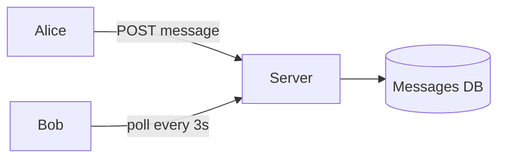

This works for a chat app demo but is wrong for real-time at scale in two ways. **Polling is terrible**: it adds latency (up to the poll interval) and wastes enormous resources (billions of "anything for me? no" requests). And HTTP request/response doesn't fit a bidirectional, server-initiated push model — the server needs to *push* a message to Bob the instant it arrives, not wait for Bob to ask.

## 3. The First Scaling Crisis

Polling collapses under load: with a billion users polling every few seconds, the server handles a billion mostly-empty requests every few seconds — almost all wasted. Latency is poor and resource use is absurd. The crisis forces the central architectural truth of messaging: **you need persistent connections and server push, not request/response polling.**

## 4. Architecture Evolution

### Step 1 — Persistent connections

Each online client holds a **persistent connection** to a server — a long-lived TCP socket (WhatsApp historically used a customized XMPP; modern systems use WebSockets or raw TCP). The server can now *push* a message down the socket the instant it arrives. This eliminates polling and gives true real-time delivery. The connection-handling servers are often called **gateways** or **connection servers**, and their job is to maintain millions of concurrent open sockets. This is where Erlang/the BEAM VM shines (WhatsApp's famous choice) — it's built for millions of lightweight concurrent processes, letting a single server hold *millions* of connections.

### Step 2 — The session registry: who's connected where?

When Alice sends to Bob, the system must find *which gateway server holds Bob's connection* right now. This needs a **session registry / presence service** — a fast, distributed map of `user → current gateway server`, updated as users connect and disconnect. Alice's message is routed to Bob's gateway, which pushes it down Bob's socket.

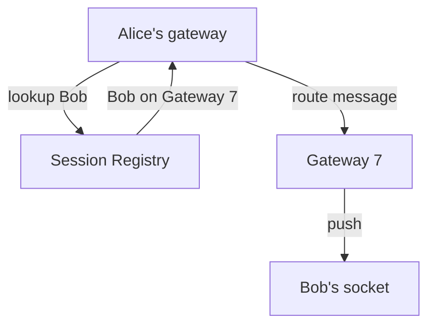

### Step 3 — Reliability: store-and-forward

What if Bob is **offline**? The message must not be lost. So the server **persists** the message and delivers it when Bob reconnects — the **store-and-forward** model. WhatsApp's design is interesting: messages are queued on the server *only until delivered*, then (historically) deleted from the server — the phone, not the server, is the long-term store. This keeps server storage minimal (a key reason a small team could run it). Delivery receipts work the same way: when Bob's device acknowledges receipt, the server notifies Alice (✓✓) and can drop the message.

### Step 4 — Group messaging and fan-out

A group message goes to many recipients. The server **fans out** one inbound message to each member's gateway/queue. For large groups this is the now-familiar fan-out problem, but messaging groups are bounded (hundreds, not millions), so simple fan-out works without the celebrity hybrid that feeds need.

## 5. Deep Dive Into Critical Components

**Message delivery and ordering guarantees.** Each message gets a per-conversation sequence so clients can order and de-duplicate. Delivery aims for *at-least-once with idempotent de-dup* — the server may retry, and the client discards duplicates by message ID — yielding effectively exactly-once from the user's view. Acknowledgements flow at every hop (client→server→recipient→server→sender) to drive the ✓/✓✓/blue states. *Reliability is built from acks and idempotent retries, not from hoping the network works.*

**Presence and typing indicators.** Presence (online, last-seen, typing) is high-volume, low-value-per-event, and ephemeral — you don't persist "typing." It's distributed via lightweight pub/sub to the subset of users who care (people in an open chat with you), and aggressively rate-limited. Presence is a great example of *deliberately weak guarantees*: it's fine if "last seen" is a few seconds stale, so it's served from fast, eventually-consistent, in-memory state — never let presence's chattiness threaten message reliability.

**End-to-end encryption.** With the Signal protocol, messages are encrypted on Alice's device and only decryptable on Bob's; the server routes ciphertext it cannot read. This constrains the architecture: the server can't do content-based features (search, server-side ML) on message bodies, and group messaging encryption requires per-recipient key management. *Encryption is a feature that removes server capabilities — a profound architectural tradeoff between privacy and functionality.*

## 6. Scaling to Massive Scale

At billions of users with hundreds of millions online simultaneously, the dominant resource is **open connections** — you need enough gateway servers to hold all live sockets (hence the obsession with packing millions of connections per box). The session registry must handle the churn of users connecting/disconnecting as phones move between networks. Multi-region: users connect to the nearest region's gateways, and cross-region routing handles conversations between users on different continents, accepting that the message physically crosses an ocean (unavoidable — the *people* are far apart). Storage stays modest because of the store-and-forward-then-delete model — a deliberate architectural choice that keeps the whole system lean.

## 7. Failure Stories

**The reconnection storm (thundering herd).** A region's gateways restarted (deploy or outage); millions of clients reconnected simultaneously, overwhelming the session registry and authentication path, causing cascading failures as reconnections timed out and retried. *Fix:* randomized exponential backoff with jitter on client reconnect, and capacity to absorb reconnection surges. *The herd isn't just for caches — any system with millions of clients faces synchronized reconnect storms after any blip.*

**Out-of-order / duplicate delivery.** A retry after a network hiccup delivered a message twice, or out of order. *Fix:* per-conversation sequence numbers and client-side idempotent de-dup by message ID — reliability mechanisms earning their keep.

**Presence overload starving messaging.** During a major event, presence/typing traffic spiked and contended with message delivery for resources. *Fix:* strict isolation and rate-limiting of presence so the low-value chatter can never degrade the high-value message path — *isolate your tiers by importance.*

## 8. Tradeoffs and Engineering Decisions

**Persistent connections vs polling:** persistent connections give real-time push and efficiency at the cost of stateful servers holding millions of sockets (harder to deploy/balance); polling is stateless and simple but wasteful and laggy — real-time messaging demands connections. **Store-and-forward-then-delete vs keep history server-side:** deleting after delivery minimizes server storage and boosts privacy but means the server can't be the source of truth for history (the device is), complicating multi-device sync; keeping history server-side enables cloud backup and multi-device but costs storage and privacy. **E2E encryption vs server features:** privacy vs the ability to do server-side search/ML/moderation — a values-driven tradeoff. **At-least-once + dedup vs exactly-once:** true exactly-once is famously near-impossible in distributed systems; at-least-once delivery with idempotent de-dup is the practical equivalent.

## 9. How Big Tech Builds It

WhatsApp: Erlang/BEAM, persistent connections, store-and-forward, Signal E2E — minimalist and reliability-obsessed. Facebook Messenger and Instagram DMs use similar persistent-connection + queue designs but keep more server-side history (enabling cloud features) and historically lighter encryption defaults. Slack and Discord solve the same real-time-delivery problem with WebSocket gateways + pub/sub fan-out, but optimize for *channels* (many-to-many rooms) rather than person-to-person. Telegram keeps messages server-side (cloud chats) for seamless multi-device, trading the privacy posture WhatsApp chose. The convergent core: *persistent connections + a session registry + store-and-forward queues + acks*; the divergence is all about **where history lives and how much the server can see** — pure product/privacy philosophy.

## 10. Interview Perspective

"Design WhatsApp/a chat system" tests whether you immediately reach for persistent connections over polling, design a session registry for routing, handle offline users with store-and-forward, and reason about delivery guarantees (ordering, dedup, receipts). Weak answers poll, or hand-wave "use WebSockets" without the routing and reliability layers. Strong answers derive persistent connections from the wastefulness of polling, introduce the session registry to solve "which server has the recipient," add store-and-forward for offline reliability, and discuss at-least-once + idempotent dedup for exactly-once semantics. Senior signal: noting that presence should be deliberately weakly-consistent and isolated, and that E2E encryption *removes* server capabilities — showing you understand the product/architecture interplay.

---

# Chapter 7 — Web Crawler (Googlebot)

## 1. The Business Problem

A web crawler systematically downloads pages from the web so they can be indexed (for search), archived, or analyzed. For a search engine, the crawler is the intake valve: the index can only be as fresh and complete as what the crawler fetches. The problem is scale and politeness at once: the web has *trillions* of URLs, pages change constantly, and you must fetch enough to stay fresh **without hammering any single website** (politeness) or wasting effort on junk and traps. The business value is comprehensive, fresh coverage — a search engine that misses or stales out on important pages loses to one that doesn't. Scale matters because "download the web" is one of the largest data-movement tasks humans perform.

## 2. Building Version 1

A V1 crawler is a queue and a loop: seed the queue with some URLs, pop one, download it, extract its links, add new ones to the queue, repeat — a breadth-first traversal of the web graph. Store fetched pages and a set of seen URLs to avoid re-crawling.

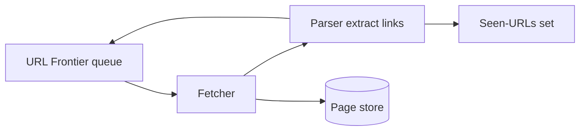

For crawling a few thousand pages, this single-threaded loop is fine. The pieces — a **frontier** (queue of URLs to fetch), a **fetcher**, a **parser/link-extractor**, a **seen-set** for dedup, and **storage** — are the permanent skeleton; everything later is about making each piece distributed and polite.

## 3. The First Scaling Crisis

Several walls hit at once. **Throughput:** one fetcher downloads maybe a few pages/second; the web needs *millions* of pages/second, so you need massive parallelism. **Politeness:** naive parallelism would blast a single site with thousands of simultaneous requests, effectively DoS-ing it and getting you blocked — you must rate-limit *per domain*. **Dedup at scale:** the seen-set must hold *billions* of URLs; an in-memory hash set won't fit. **Traps and junk:** infinite calendars, session-ID URLs, and malicious spider-traps generate endless useless URLs that can swallow your crawler. The polite, deduplicated, massively-parallel crawler is a genuinely hard system.

## 4. Architecture Evolution

### Step 1 — Distributed fetchers with a partitioned frontier

Run thousands of fetcher workers in parallel. The **frontier** becomes a distributed, prioritized queue. Crucially, it's partitioned **by host/domain**, so all URLs for `example.com` go to the same frontier queue/worker, which enforces a polite delay between requests to that host. This *politeness-via-partitioning* is the key design: partition by the thing you must rate-limit (the domain), so rate-limiting becomes local.

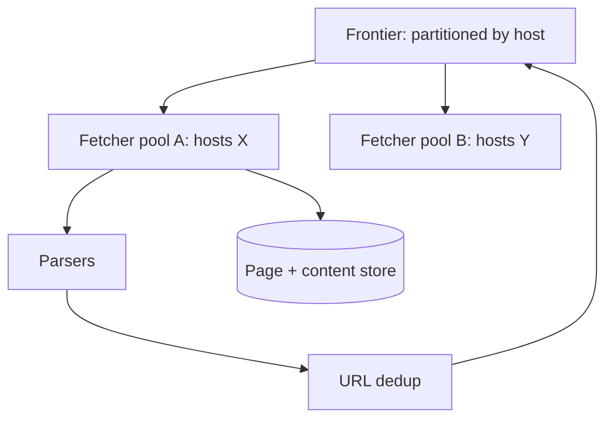

### Step 2 — Scalable dedup with Bloom filters

To check "have I seen this URL?" against billions of entries without keeping them all in RAM, crawlers use a **Bloom filter** — a probabilistic structure that answers set-membership in tiny memory, with no false negatives and a tunable tiny false-positive rate. A false positive means occasionally skipping a new URL (acceptable); never a false negative (never re-crawl forever). Bloom filters are a beautiful example of *trading a little accuracy for an enormous memory win*, and they appear all over big-data systems (databases, caches, CDNs).

### Step 3 — Politeness, robots.txt, and priority

Each domain's `robots.txt` (cached) defines what's allowed; the crawler obeys it. Crawl-rate per domain respects both robots directives and adaptive politeness (back off if the server slows). A **priority** system decides what to crawl next: important, frequently-changing pages (news homepages) get recrawled often; static, low-value pages rarely. This turns the frontier from a plain queue into a *priority* queue informed by page importance and change frequency.

### Step 4 — Content dedup and trap avoidance

Many URLs serve identical or near-identical content (mirrors, print versions). Crawlers compute content fingerprints (e.g., **MinHash/SimHash** for near-duplicate detection) to avoid storing and indexing the same content many times. Trap avoidance uses URL pattern heuristics, depth limits, and budgets per domain so no single site can consume unbounded resources.

## 5. Deep Dive Into Critical Components

**The URL frontier.** This is the crawler's brain. It must balance two competing goals: **priority** (crawl important/fresh pages first) and **politeness** (don't exceed per-host rates). A common design (from the Mercator crawler) is a two-level queue: front queues by priority, back queues by host, with a scheduler ensuring each host is fetched no faster than its politeness allows while overall the highest-priority URLs flow through. Designing the frontier well *is* designing the crawler.

**The DNS bottleneck.** Every fetch needs a DNS lookup, and at millions of pages/second, DNS becomes a bottleneck and a source of latency — so crawlers run aggressive local DNS caching and sometimes their own resolvers. A non-obvious bottleneck that bites real crawlers; *senior engineers find the bottleneck that isn't the "main" component.*

**Freshness scheduling.** The web changes at wildly different rates. Crawlers model per-page change frequency (a news site's homepage changes hourly; an archived PDF never) and schedule recrawls to maximize freshness per unit of crawl budget — recrawling the homepage often and the PDF rarely. This is an optimization problem (limited crawl budget, maximize index freshness) that distinguishes a good crawler from a brute-force one.

## 6. Scaling to Massive Scale

At web scale, the crawler is thousands of machines across data centers, fetching billions of pages/day, with petabytes of stored content feeding the indexer. Storage and bandwidth dominate. The seen-set and frontier are sharded across the fleet. Multi-region crawling places fetchers near the content they fetch to reduce latency and respect geography. The crawler also coordinates tightly with the **indexing pipeline** (next chapter) — crawling and indexing are two halves of search.

## 7. Failure Stories

**The accidental DoS.** A bug in per-host rate-limiting let fetchers hammer a small site, taking it down and earning the crawler an IP ban (and an angry email). *Fix:* robust, conservative per-host limits, adaptive backoff on errors/slowness, and respecting `Retry-After`. *Politeness bugs damage others, not just you — they're a special category of incident.*

**The spider trap.** A site with infinite auto-generated calendar URLs (`/calendar?date=...` forever) trapped fetchers, which crawled millions of useless pages and starved the frontier of real URLs. *Fix:* per-domain crawl budgets, URL-pattern detection, and depth limits.

**The Bloom filter saturation.** As the seen-set grew beyond the Bloom filter's designed capacity, its false-positive rate climbed, causing the crawler to wrongly skip many *new* URLs (coverage silently dropped). *Fix:* size Bloom filters for projected growth, monitor false-positive rate, and use scalable/segmented Bloom filters that grow. *Probabilistic structures degrade silently — you must monitor the probability.*

## 8. Tradeoffs and Engineering Decisions

**Breadth-first vs priority crawling:** BFS is simple and gives broad coverage but wastes budget on junk; priority crawling is more complex but spends budget where it matters — at scale, priority wins. **Bloom filter vs exact set:** Bloom saves enormous memory at the cost of rare false positives (skipped URLs); an exact set is correct but won't fit. **Freshness vs coverage:** with finite crawl budget, recrawling known important pages (freshness) competes with discovering new pages (coverage) — you must balance per business need. **Politeness vs speed:** respecting per-host limits slows crawling but is mandatory; ignoring it gets you banned and harms the web. **Centralized vs distributed frontier:** distributing the frontier scales but complicates global priority and dedup decisions.

## 9. How Big Tech Builds It

Google's crawling infrastructure (Googlebot) is a vast, priority-driven, politeness-respecting distributed crawler tightly integrated with indexing, using sophisticated freshness models and content dedup. The Internet Archive's Heritrix crawls for preservation (coverage over freshness). Bing, and specialized crawlers (Common Crawl's open dataset), share the same skeleton — frontier, fetchers, dedup, politeness — tuned to different objectives. The convergent lessons: *partition by host for politeness, dedup probabilistically, prioritize by importance and change rate, and treat the frontier as the central intelligent component.* The divergence is objective: search engines optimize freshness-per-budget; archives optimize coverage; researchers optimize breadth.

## 10. Interview Perspective

"Design a web crawler" evaluates whether you handle scale (distributed fetchers), politeness (per-host rate limiting via partitioning), dedup at billions of URLs (Bloom filters), and traps/freshness. Weak answers give the V1 BFS loop and stop. Strong answers partition the frontier by host to make politeness local, use Bloom filters for memory-efficient dedup, add priority and freshness scheduling, and raise traps, robots.txt, and the DNS bottleneck. Senior signal: framing the frontier as the core component balancing priority against politeness, and noting freshness scheduling as a budget-optimization problem — showing you see the crawler as an optimization system, not just a downloader.

---

# Chapter 8 — Distributed Cache (Memcached)

## 1. The Business Problem

We met caching in Chapter 1 and built a key-value store in Chapter 2. Memcached deserves its own chapter because it represents a *philosophy*: the simplest possible distributed cache, and the lessons from running it at Facebook scale are among the most cited in the field. The business problem is identical to Redis's — put a memory-speed tier in front of slow databases — but Memcached answers it with radical minimalism: no persistence, no replication, no data structures, just an in-memory `key → blob` map, multi-threaded, designed to be thrown in front of a database and forgotten. The value is the same latency and database-shielding, and the lesson is *how far simplicity can take you* and exactly where it breaks.

## 2. Building Version 1

A single Memcached node is a multi-threaded in-memory hash table with LRU eviction, speaking a trivial `get/set` protocol. Your app uses cache-aside (Chapter 1): on read, check Memcached; on miss, read the DB and populate the cache; on write, update the DB and invalidate/update the cache key. One node in front of one database instantly absorbs the hot reads.

## 3. The First Scaling Crisis

One cache node isn't enough memory, and your app servers number in the hundreds. So you run *many* Memcached nodes — and immediately face the question: **which node holds which key?** And Memcached famously gives you *no help* — the nodes don't know about each other. The clients must decide. Naive `hash(key) mod N` reshuffles everything when you add a node (Chapter 2's lesson), causing a mass cache miss and a database stampede the moment you scale the cache.

## 4. Architecture Evolution

### Step 1 — Client-side consistent hashing

The clients use **consistent hashing** to map keys to nodes, so adding/removing a node only moves ~1/N of keys. This is *client-side sharding* — there's no smart server tier; the intelligence lives in the client library. It's a beautifully simple model: dumb servers, smart clients. This is the opposite philosophy from Redis Cluster (smart servers); both work, and the choice is about where you want the complexity.

### Step 2 — The look-aside contract and invalidation

Memcached is pure look-aside: the database is the source of truth, the cache is a disposable accelerator. The hard part, as always, is **invalidation** — when data changes, the cached copy must be removed or updated, or users see stale data. Facebook's enormously influential paper "Scaling Memcache at Facebook" is essentially a treatise on invalidation at scale, introducing mechanisms like **leases** to combat two specific plagues: stale sets and thundering herds.

### Step 3 — Leases (the senior-level trick)

Two problems arise in a busy look-aside cache. **Thundering herd / stampede:** a hot key misses and a thousand app servers simultaneously hit the DB for it (Chapter 1's stampede). **Stale set:** a slow cache-fill races with a concurrent DB update and writes an old value into the cache *after* the update, leaving stale data indefinitely. Facebook's **lease** mechanism solves both: on a miss, the cache hands exactly *one* client a short-lived "lease" token to go fetch from the DB; other concurrent missers are told to wait briefly and retry the cache. When the lease-holder writes back, the cache verifies the lease is still valid (no intervening invalidation) before storing. This single-flights the DB load *and* prevents stale sets — an elegant fix to two nasty races at once, and a hallmark of mature cache engineering.

## 5. Deep Dive Into Critical Components

**Multi-threaded vs single-threaded.** Unlike Redis, Memcached is multi-threaded, using fine-grained locking to exploit many cores for raw `get/set` throughput on large boxes. The tradeoff: more cores of throughput, but no rich operations (everything is a simple blob get/set, so locking stays manageable). This is the mirror image of Redis's bet, and which is "right" depends on whether you value simple raw throughput (Memcached) or rich data structures and persistence (Redis).

**Slab allocation.** Memcached avoids memory fragmentation by pre-allocating memory in fixed-size "slabs" and assigning objects to the slab class that fits — trading some internal waste for zero fragmentation and predictable performance. A nice example of *choosing predictability over perfect efficiency*, which matters enormously in a system that must run for months without degrading.

**Regional caching and replication pools (Facebook's architecture).** Facebook organizes Memcached into pools and regions: a region has many Memcached nodes (a "pool"), and to handle hot keys that would overload a single node, hot data is *replicated* across nodes. Cross-region, an invalidation in one region must propagate to caches in other regions — Facebook built an invalidation pipeline (via the database's replication stream) to broadcast deletes globally. *The cache stops being one box and becomes a globally-coordinated, eventually-consistent system in its own right.*

## 6. Scaling to Massive Scale

At Facebook scale, Memcached serves *billions* of requests/second across thousands of nodes, and the system's behavior is dominated by **invalidation correctness and incast congestion**. Incast: when one app server requests many keys spread across hundreds of cache nodes (to render a page), all responses arrive at once and can overwhelm the requester's network link — a subtle, fan-in network problem that emerges only at scale and required client-side flow control to fix. Multi-region invalidation propagation, hot-key replication, and gutter pools (small standby pools that absorb traffic when a node dies, preventing the DB stampede a dead node would cause) round out the mature design.

## 7. Failure Stories

**The dead-node database stampede.** A Memcached node died; all its keys instantly became misses; that traffic hit the database in a wave. *Fix:* **gutter servers** — a small pool of standby caches that temporarily take over a dead node's keys, absorbing the misses instead of the database. *A cache node dying must not become a database incident — design for cache-node failure explicitly.*

**The stale-set race.** Without leases, a slow repopulation overwrote a fresh value with a stale one, and users saw old data until the TTL expired. *Fix:* leases, as described — verify no invalidation occurred between read and write-back.

**The cross-region inconsistency.** A write in the US invalidated the US cache but the invalidation lagged to Europe; European users saw stale data for seconds. *Root cause:* global cache coherence is an eventual-consistency problem. *Fix:* tie invalidation to the database replication stream so it propagates with the data, and accept brief staleness as the price of a global cache.

## 8. Tradeoffs and Engineering Decisions

**Memcached vs Redis:** Memcached is simpler, multi-threaded, pure cache (no persistence/replication/structures) — ideal when you want a fast, dumb, horizontally-scaled cache and manage everything else in the app. Redis offers data structures, persistence, replication, and Lua scripting — ideal when you need those features. *Use Memcached when you want a cache; use Redis when you want a cache that's also a lightweight database.* **Client-side vs server-side sharding:** Memcached's smart-client/dumb-server model is simple to operate but pushes complexity (consistent hashing, failure handling) into every client; server-side clustering centralizes that logic at the cost of server complexity. **Leases/complexity vs simplicity:** raw Memcached is trivial, but production-correct Memcached (leases, gutters, invalidation pipelines) is sophisticated — *simple primitives, complex operations.*

## 9. How Big Tech Builds It

Facebook's Memcached deployment is the canonical large-scale cache story (read the paper — it's a masterclass). Netflix built **EVCache** on top of Memcached, adding cross-zone replication for resilience in AWS, so a zone failure doesn't cold-cache the system. Many companies run Memcached or Redis behind managed services. The shared philosophy across all of them: *the cache is not an afterthought but a first-class distributed system requiring its own thinking about sharding, invalidation, failure, and hot keys.* The divergence — Memcached's minimalism vs Redis's richness vs EVCache's replication — reflects different bets on where to spend complexity.

## 10. Interview Perspective

A distributed-cache question wants consistent hashing, cache-aside semantics, invalidation strategy, and stampede/hot-key/dead-node handling. The senior differentiator is invalidation maturity: mentioning leases (single-flight + stale-set prevention), gutter pools for node failure, and cross-region invalidation propagation shows you've thought past "add a cache." Weak answers treat the cache as a magic speed box; strong answers treat it as a distributed system with its own failure modes and coherence challenges, and cite the Facebook lease/gutter patterns as battle-tested solutions.

---

# Chapter 9 — Content Delivery Network (Cloudflare)

## 1. The Business Problem

A CDN serves content to users from servers physically near them, defeating the speed of light we met in Chapter 0. When a user in Sydney loads a website hosted in Virginia, every round trip costs ~150 ms; a page needing dozens of round trips feels broken. A CDN caches that content in a Sydney data center, cutting latency to a few milliseconds. Beyond speed, CDNs absorb traffic spikes (taking load off origin servers), defend against DDoS attacks, and increasingly run compute at the edge. The business value is **fast, reliable, cheap delivery of content globally**, plus security — which is why companies like Cloudflare, Akamai, and Fastly sit in front of much of the web. Scale matters because a CDN must have presence in hundreds of cities and serve a meaningful fraction of all internet traffic.

## 2. Building Version 1

The essence of a CDN is a **caching reverse proxy near the user.** Place a proxy in many cities (Points of Presence, PoPs). When a user requests `image.jpg`, they hit the nearest PoP; if it's cached there, it's served instantly; if not, the PoP fetches it from the **origin** server, caches it, and serves it.


The two foundational questions: **how does the user reach the nearest PoP?** (routing) and **what's cacheable and for how long?** (cache policy).

## 3. The First Scaling Crisis

As traffic grows, several issues surface. **Routing users to the right PoP** must be automatic and resilient. **Cache misses storm the origin**: if popular content isn't cached (or a PoP is cold), many users miss simultaneously and overwhelm the origin — a global stampede. **Dynamic and personalized content** can't be naively cached (your logged-in dashboard differs per user). And **purging/invalidation** — pushing a content update to hundreds of PoPs quickly — is hard. The naive single-layer cache near the user needs more structure.

## 4. Architecture Evolution

### Step 1 — Anycast routing

CDNs route users to the nearest PoP using **Anycast**: the same IP address is announced from every PoP, and the internet's BGP routing naturally delivers each user's packets to the topologically nearest one. This is elegant — no DNS trickery needed, and if a PoP fails, BGP reroutes users to the next-nearest automatically. (Some CDNs also/instead use DNS-based geo-routing.) Anycast gives *automatic proximity and automatic failover* from the routing layer itself.

### Step 2 — Tiered caching to protect the origin

To prevent every PoP from independently missing and hitting the origin, CDNs add a **tiered cache**: edge PoPs miss to a smaller set of regional "parent" caches, which miss to the origin. So the origin sees misses only from a handful of parents, not hundreds of edges — the cache hierarchy shields the origin, and popular content gets pulled to a parent once and shared by many edges.

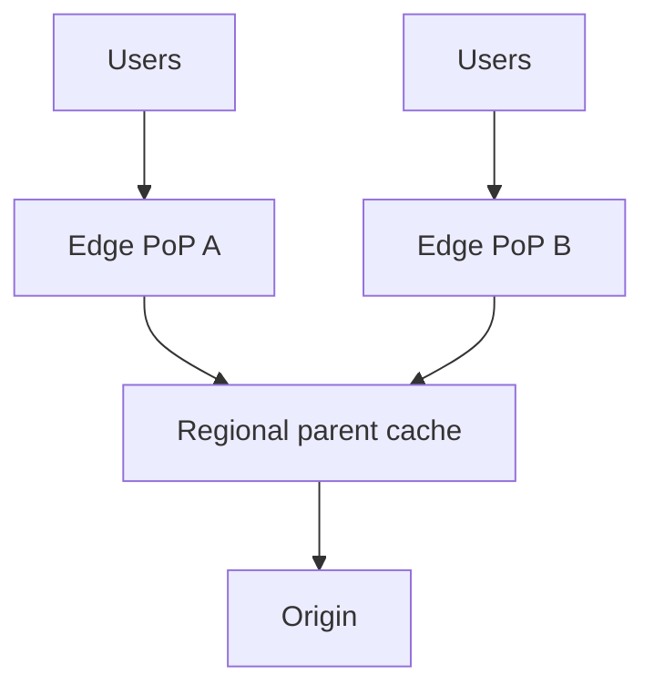

### Step 3 — Cache-control and TTLs

Origins signal cacheability via HTTP headers (`Cache-Control`, `ETag`, `max-age`). Static assets (images, CSS, JS) get long TTLs; HTML might get short TTLs; truly dynamic responses are marked no-cache. Cache keys can include query strings, cookies, or device type when responses vary. Getting cache keys and TTLs right is the core operational skill of running a CDN — too aggressive and users see stale content; too timid and you miss the point of the CDN.

### Step 4 — Purge and edge compute

When content changes, the CDN must **purge** it from all PoPs fast — implemented as a global pub/sub invalidation broadcast (purge by URL, by tag, or everything). And modern CDNs run **edge compute** (Cloudflare Workers, Lambda@Edge): small functions executing at the PoP to personalize, authenticate, A/B test, or assemble responses near the user — pushing not just data but *logic* to the edge.

## 5. Deep Dive Into Critical Components

**Cache hierarchy and consistent hashing within a PoP.** A single PoP has many cache servers; content is distributed across them by consistent hashing so each object has a home server, maximizing hit rate and memory efficiency within the PoP. Same primitive as Chapter 2, applied at the edge.

**Handling the long tail and dynamic content.** CDNs excel at the popular head of content (cached everywhere) but the long tail (rarely-requested objects) often misses. Strategies include "cache on second hit" (don't cache one-hit-wonders, to avoid polluting the cache) and serving dynamic content via edge compute + smart caching of fragments. **DDoS absorption:** because the CDN sits in front of the origin with enormous aggregate capacity across PoPs, it can absorb volumetric attacks that would crush the origin — security as a side effect of the caching architecture.

**TLS termination and HTTP optimization.** PoPs terminate TLS near the user (faster handshakes), and upgrade connections to the origin (HTTP/2, HTTP/3/QUIC, connection reuse), so the slow part (user↔PoP) is short and the long-haul (PoP↔origin) is optimized and reused. Terminating TLS at the edge is a big latency win because the handshake's multiple round trips happen over the short hop.

## 6. Scaling to Massive Scale

A global CDN runs hundreds of PoPs, thousands of servers, serving tens of millions of requests/second and tens of terabits/second of traffic. Challenges: **global cache coherence** (purges propagating to all PoPs in seconds), **capacity planning per PoP** (each city's traffic differs), **origin shielding** (ensuring the origin survives even massive cache-miss events), and **routing optimization** (Anycast gets you close, but real-time traffic engineering tunes around congestion and outages). Cost: bandwidth at this scale is the dominant expense, driving the relentless focus on hit rate.

## 7. Failure Stories

**The global config push outage.** A bad configuration or rule deployed to all PoPs simultaneously took the entire CDN — and a chunk of the web — down (this has really happened to major CDNs). *Root cause:* global systems have global blast radius; a single bad push hits everywhere at once. *Fix:* staged/canary rollouts (deploy to a few PoPs, watch, then expand), config validation, and fast rollback. *The flip side of "one change updates everything" is "one bad change breaks everything" — global reach demands staged deployment.*

**The cache-miss origin meltdown.** A popular site purged its entire cache during a traffic peak; every PoP missed and stampeded the origin, which fell over. *Fix:* tiered caching and origin shielding, request coalescing at the edge (single-flight misses per object per PoP), and staggered/soft purges that revalidate rather than hard-evict.

**The stale-content-after-purge bug.** A purge failed to reach some PoPs; users in certain regions saw outdated content (an old price, a retracted article). *Fix:* reliable, acknowledged purge propagation with monitoring, and short TTLs as a safety net so staleness self-heals even if a purge is missed.

## 8. Tradeoffs and Engineering Decisions

**Anycast vs DNS routing:** Anycast gives automatic, fast failover and proximity but less fine-grained control; DNS-based routing allows richer policies but is slower to react (DNS TTLs) — many CDNs blend both. **Cache aggressiveness vs freshness:** long TTLs maximize hit rate and origin protection but risk staleness; short TTLs keep content fresh but increase origin load — the eternal cache tension, now global. **Edge compute vs origin compute:** running logic at the edge cuts latency and offloads origin but complicates deployment, debugging, and consistency across hundreds of PoPs. **Push vs pull CDN:** pull (lazy, cache-on-miss) is simple and self-managing; push (proactively distribute content to PoPs) gives control over what's where but requires managing distribution — most CDNs are pull-based with push options for critical content.

## 9. How Big Tech Builds It

Cloudflare (Anycast everywhere, edge compute via Workers, security-first), Akamai (the pioneer, enormous PoP footprint, deep enterprise delivery), Fastly (programmable edge, instant purge, developer-focused), and the hyperscalers' CDNs (CloudFront, Google Cloud CDN) all share the cache-hierarchy + edge-proximity core. Netflix built its own CDN, **Open Connect**, placing caching appliances *inside ISP networks* — because video is so bandwidth-heavy that putting the bytes physically inside the ISP is the only economical way to stream to millions. The divergence is about footprint philosophy (more PoPs vs deeper integration) and how much *compute*, not just caching, lives at the edge — the industry trend is decisively toward more edge compute.

## 10. Interview Perspective

CDN questions appear directly ("design a CDN") or as a component ("how do users get the video/images fast?"). Interviewers want edge proximity (defeat the speed of light), routing (Anycast/DNS), cache hierarchy (origin shielding), and invalidation/purge. Weak answers say "use a CDN" without explaining the mechanism. Strong answers explain *why* proximity matters (latency physics from Chapter 0), how Anycast routes and fails over, how tiered caching protects the origin from miss-storms, and how purges propagate. Senior signal: raising the global-blast-radius risk of config pushes (staged rollout), TLS termination at the edge as a latency win, and the trend toward edge compute. Connecting the CDN to DDoS protection shows you see the architecture's emergent security benefit.

---

# Chapter 10 — Search Engine (Google)

## 1. The Business Problem

A search engine takes a few words and returns the most relevant documents from billions, in well under a second. It is one of the most demanding systems ever built: the index spans the entire crawled web (Chapter 7 fed it), queries arrive by the hundreds of thousands per second, and relevance — returning the *right* answer first — is the product. The business value is matching intent to information (and, commercially, to ads) better than anyone else; tiny relevance improvements move billions in revenue. Scale matters on three axes simultaneously: **index size** (trillions of documents), **query latency** (sub-second, always), and **relevance quality** (the actual competitive moat).

## 2. Building Version 1

The foundational data structure is the **inverted index**: instead of mapping documents to their words, map each word to the list of documents containing it (a "posting list"). To find documents containing "system" AND "design," intersect the posting lists for "system" and "design." V1: crawl some pages, tokenize them, build an in-memory inverted index, and answer queries by intersecting posting lists and ranking by simple term frequency.

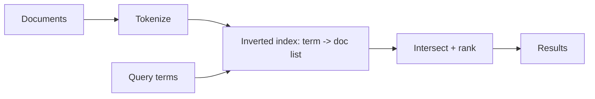

For thousands of documents this works on one machine. The inverted index is the unchanging heart of search; everything else is making it huge, fast, and well-ranked.

## 3. The First Scaling Crisis

The index outgrows one machine — you cannot hold the web's inverted index in one box's memory or disk. Query latency suffers as posting lists for common words ("the," "design") grow to billions of entries. And simple term-frequency ranking returns garbage — spam pages stuffed with keywords rank above authoritative ones. Three crises: **the index must be distributed**, **query processing must be fast over enormous posting lists**, and **ranking must measure true relevance and authority**, not just word counts.

## 4. Architecture Evolution

### Step 1 — Sharding the index by document

The index is partitioned across many machines, almost always **by document** (document partitioning / local index): each shard holds the full inverted index for a *subset* of documents. A query is sent to *all* shards in parallel; each returns its top results for its documents; an aggregator merges them into the final ranking. This **scatter-gather** pattern is the backbone of distributed search.

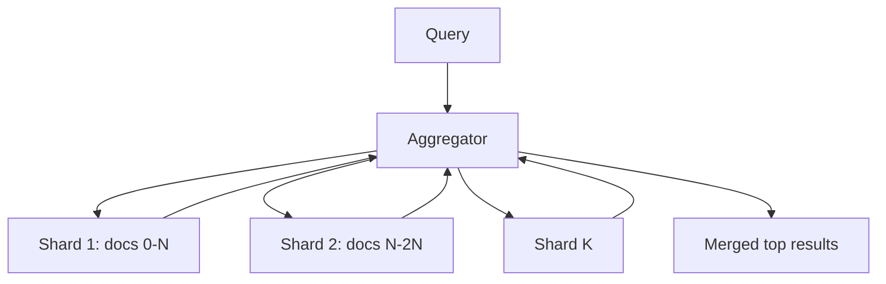

Why partition by document, not by term? Term partitioning (each shard owns certain words' posting lists) sounds appealing but creates hot shards (the shard owning "the") and forces multi-shard coordination per query. Document partitioning spreads load evenly and lets each shard work independently — the dominant choice. Each shard is also **replicated** for availability and query throughput (more replicas = more queries/second).

### Step 2 — Ranking: PageRank and beyond

Google's original breakthrough was **PageRank**: treat the web as a graph and rank pages by the quantity and quality of links pointing to them — a page linked by many authoritative pages is itself authoritative. This measured *authority* independent of the page's own claims, defeating keyword stuffing. Modern ranking blends *hundreds* of signals (relevance, freshness, location, user behavior, and now deep-learning models like BERT for understanding query intent), but the principle stands: **ranking is the real product, and it's a continuous machine-learning and anti-spam arms race.**

### Step 3 — Multi-stage ranking (the funnel again)

You can't run expensive ML ranking on millions of matching documents per query. So search uses the **funnel** we keep meeting: cheap retrieval (intersect posting lists, basic scoring) narrows billions to thousands of candidates per shard; progressively more expensive rankers narrow thousands to hundreds to the final ten. Retrieve cheaply, rank expensively — the same shape as Netflix recommendations and the Facebook feed, because it's the universal answer to "score too many things, too little time."

### Step 4 — Caching and serving

Popular queries ("weather," "facebook") repeat constantly, so a **query result cache** serves them without touching the index. Posting lists for common terms are cached in memory. The whole serving path is latency-obsessed because the sub-second budget is split across retrieval, ranking, and rendering.

## 5. Deep Dive Into Critical Components

**Inverted index construction and compression.** Posting lists are enormous, so they're heavily compressed (delta-encoding document IDs, variable-length integers) to fit in memory and minimize I/O — compression directly buys latency because less data moves. Indexes are built offline in massive batch pipelines (MapReduce-style) from crawled content and shipped to serving shards.

**Query understanding.** Before retrieval, the query is processed: spelling correction, synonym expansion, intent detection, entity recognition. "Apple stock" should understand "Apple" as the company and "stock" as finance. Modern systems use language models to map the query into the same semantic space as documents (vector/semantic search via embeddings and ANN — Chapter 4's tools), complementing keyword matching with meaning-based retrieval.

**The scatter-gather aggregator and the tail-latency problem.** Because a query fans out to *all* shards and must wait for *all* (or nearly all) to respond, the query is only as fast as the **slowest shard** — the dreaded **tail latency at scale**. If each shard is fast 99% of the time but a query hits 100 shards, the chance *all* respond fast is 0.99¹⁰⁰ ≈ 37% — so the slow tail dominates. Google's famous techniques: **hedged requests** (send the same sub-query to two replicas, take the first to respond) and **tied requests** (cancel the duplicate once one starts). *Fan-out makes tail latency the enemy, and taming it is core senior-level distributed-systems craft.*

## 6. Scaling to Massive Scale

At web scale, the index is thousands of shards, each replicated, across data centers, serving hundreds of thousands of queries/second sub-second. The index is continuously rebuilt and updated (freshness from the crawler). Multi-region serving puts the index near users. The relevance pipeline runs enormous offline ML training plus online inference. Costs are dominated by the sheer compute of ranking and the memory to hold compressed indexes hot. The system co-evolves with the crawler (intake) and the ads system (monetization) as one giant machine.

## 7. Failure Stories

**The tail-latency cascade.** A few slow shards (a GC pause, a hot replica) made a fraction of queries slow; under load, slow queries piled up and consumed threads, degrading everything. *Fix:* hedged/tied requests, strict per-shard timeouts (return partial results rather than wait forever), and load-aware routing. *At fan-out scale, you must design for the slow tail, not the average.*

**The bad index push.** A corrupted or mis-built index shard shipped to serving and returned wrong/empty results for its documents. *Fix:* index validation before serving, canary shards, and the ability to roll back to the previous index version instantly. (Same global-push lesson as the CDN.)

**The spam/relevance regression.** A ranking change inadvertently let a class of spam rank highly; quality dropped before anyone noticed. *Fix:* continuous relevance evaluation (human raters + automated metrics), A/B testing every ranking change, and fast rollback. *Relevance regressions are silent outages — you need observability for quality, not just for latency.*

## 8. Tradeoffs and Engineering Decisions

**Document vs term partitioning:** document partitioning balances load and isolates shards (chosen) at the cost of querying every shard; term partitioning queries fewer shards but creates hot spots and coordination — document wins at scale. **Keyword vs semantic retrieval:** keyword (inverted index) is precise, fast, and explainable; semantic (vector) captures meaning and synonyms but is fuzzier and costlier — modern search blends both. **Index freshness vs cost:** real-time indexing keeps results fresh but is expensive; batch indexing is cheaper but staler — search uses a hybrid (a fast real-time index for fresh content + a large batch index). **Latency vs quality:** more ranking stages improve relevance but cost latency; the funnel exists precisely to spend compute only where it changes the answer.

## 9. How Big Tech Builds It

Google: inverted index + PageRank-and-successors + deep-learning ranking (RankBrain, BERT, MUM) + tail-latency engineering, tightly coupled to crawling and ads. Bing follows a similar architecture. Elasticsearch/OpenSearch bring the same inverted-index + scatter-gather + document-sharding model to everyone for site search and log analytics — when you "design a search feature," you're usually deploying these ideas via Elasticsearch. The frontier is **retrieval-augmented generation**: search as the retrieval layer feeding LLMs, where embeddings + ANN (Chapter 4) retrieve context for a language model to synthesize an answer — the inverted index and the vector index converging. The convergent core across all: *inverted index, scatter-gather over document shards, multi-stage ranking, relentless relevance tuning.*

## 10. Interview Perspective

"Design a search engine / search autocomplete / typeahead" tests the inverted index, sharding strategy (document vs term — know why document wins), scatter-gather with an aggregator, multi-stage ranking, and tail-latency awareness. Weak answers describe a `LIKE '%query%'` database scan (which doesn't scale) or stop at "use Elasticsearch." Strong answers build the inverted index, shard by document with replication, explain scatter-gather and *its tail-latency problem with hedged requests*, structure ranking as a funnel, and treat relevance as an ML/anti-spam system measured by A/B tests. Senior signal: the tail-latency math (0.99¹⁰⁰) and its mitigations — it shows you understand the emergent physics of fan-out, the single most important scaling concept in distributed query systems.

---

# Chapter 11 — Ride-Sharing Platform (Uber)

## 1. The Business Problem

Uber matches riders requesting trips with nearby drivers, in real time, computing routes, prices, and ETAs, then tracking the trip to completion and handling payment. The defining characteristics: it's **geospatial** (everything depends on location), **real-time** (matches in seconds, locations updated constantly), and **transactional with money** (payments must be correct). The business value is liquidity in a two-sided marketplace — enough drivers and riders, matched efficiently, that both sides find the service reliable. Scale matters because Uber operates in thousands of cities with millions of concurrent location updates and must match in seconds while surge-pricing dynamically balances supply and demand.

## 2. Building Version 1

V1 in one city: drivers' apps send GPS updates to a server storing `driver_id, lat, lng, available` in a database; when a rider requests, query for nearby available drivers, pick the closest, notify them. A relational database with a naive distance query (`WHERE sqrt((lat-x)² + (lng-y)²) < r`) works for one small city.

## 3. The First Scaling Crisis

Two things break. **Geospatial queries don't scale:** a full-table distance scan over millions of drivers per request is hopeless, and standard B-tree indexes don't index 2D proximity well. **Location update volume is enormous:** millions of drivers each sending GPS every few seconds is millions of writes/second — a firehose that obliterates a normal database. You need an efficient way to answer "who's near here?" and a way to ingest a torrent of location updates.

## 4. Architecture Evolution

### Step 1 — Geospatial indexing with grids/geohashing

To answer "nearby" queries fast, divide the world into a grid of cells and index drivers by cell. Approaches: **geohashing** (encode lat/lng into a string where shared prefixes mean proximity), **QuadTrees** (recursively subdivide space, denser where there are more drivers), or Uber's own **H3** (hexagonal hierarchical grid). To find nearby drivers, compute the rider's cell and look up drivers in that cell and its neighbors — turning an O(N) scan into an O(1) cell lookup. *Spatial indexing is the heart of any location system; it converts geometry into hashable keys.*

```mermaid
flowchart LR
    R[Rider request lat/lng] --> G[Compute grid cell H3]
    G --> IDX[Lookup drivers in cell + neighbors]
    IDX --> M[Matching service]
```

### Step 2 — A real-time location store

Driver locations are hot, ephemeral, and updated constantly — a perfect fit for an **in-memory store** (Redis or a purpose-built service) keyed by cell, not a durable relational database. Uber built a dispatch system (historically "Ringpop"/"DISCO") holding live driver locations in memory, sharded geographically. Location updates flow in (often via a streaming pipeline like Kafka) and update the in-memory spatial index. *Don't durably persist every GPS ping to your transactional DB — that data is high-volume, low-durability-value, and belongs in a fast in-memory geo-index.*

### Step 3 — The matching service

Matching is an optimization problem: given pending requests and nearby drivers, assign them to minimize wait time and maximize efficiency (it's a bipartite matching, not just "nearest driver" — sometimes a slightly farther driver yields a better global outcome). The matcher operates per geographic region, considering ETA (real road-network routing, not straight-line distance), driver acceptance likelihood, and fairness.

### Step 4 — Geographic sharding

The entire system is **sharded by geography** — a city or region's drivers, riders, and matching logic are handled together, because rides are inherently local (a rider in Mumbai is never matched with a driver in Berlin). Geographic sharding is natural and powerful: it bounds the data each shard handles and localizes the matching problem. The challenge is city boundaries and uneven density (a tiny dense downtown cell vs a huge sparse rural one), handled by adaptive grids (QuadTree/H3 subdivide dense areas finer).

## 5. Deep Dive Into Critical Components

**Supply-demand and surge pricing.** Surge pricing raises prices where demand exceeds supply, both rationing scarce drivers and incentivizing more drivers to the area. It's computed per geographic cell from real-time supply/demand ratios — a continuous control loop over the spatial grid. Surge is controversial but architecturally it's a real-time analytics-and-pricing system layered on the spatial index.

**Trip state management.** A trip is a stateful workflow: requested → matched → driver en route → started → completed → paid, with many edge cases (rider cancels, driver cancels, no drivers found, payment fails). This is modeled as a **state machine**, often backed by a durable store and sometimes a workflow engine, because trips must survive server restarts and reconcile correctly. *The ephemeral location data and the durable trip/payment data have opposite requirements and live in different systems — recognizing that split is key.*

**ETA and routing.** Computing ETAs requires routing over a road network graph with live traffic — a graph problem (Dijkstra/A* with real-time edge weights) at massive scale, precomputed and cached heavily. ETAs feed matching (which driver arrives soonest), pricing, and the rider experience.

## 6. Scaling to Massive Scale

Across thousands of cities, the geographically-sharded design scales naturally — add cities, add shards. The dominant loads are **location ingestion** (millions of writes/second into in-memory geo-indexes) and **matching compute** per region. Multi-region for latency and disaster recovery: each region handles its local cities, with global services (user accounts, payments) replicated. Data growth in the durable tier (trips, payments) is steady and handled by sharded transactional databases; the location firehose mostly never lands durably. Reliability is paramount because Uber is a real-world physical service — a software outage strands people on roadsides.

## 7. Failure Stories

**The hot city cell.** A dense event (concert letting out, airport) created a tiny geographic cell with enormous demand; that cell's shard/index overloaded while rural shards idled. *Root cause:* uniform grids don't match non-uniform demand. *Fix:* adaptive spatial indexing (H3/QuadTree subdivides hot areas), and load-aware sharding that splits hot cells. *Geographic hotspots are the ride-sharing version of the hot-key problem.*

**The location-update overload.** A surge of concurrent drivers (a busy Friday) pushed location-update volume past the ingestion pipeline's capacity, delaying location freshness so matches used stale positions (driver shown far from actual). *Fix:* scale the streaming pipeline, throttle/adaptively sample updates (a parked driver needn't update every second), and prioritize freshness for drivers near pending requests.

**The double-dispatch race.** Two riders matched to the same driver simultaneously due to a race between the read of "available drivers" and the write of "assigned." *Root cause:* concurrent matching without proper locking/atomicity on driver availability. *Fix:* atomic assignment (compare-and-set on driver state, or a single authoritative matcher per region serializing assignments). *Marketplaces live and die by not double-allocating scarce resources — the same problem as inventory in e-commerce.*

## 8. Tradeoffs and Engineering Decisions

**Geohash vs QuadTree vs H3:** geohash is simple and prefix-searchable but has edge/boundary issues and uneven cells; QuadTrees adapt to density but are more complex; H3's hexagons give uniform neighbor distances and clean hierarchy (Uber's choice) at the cost of building/adopting a specialized system. **In-memory location store vs durable DB:** in-memory gives the needed write throughput and low latency but isn't durable (acceptable — locations are ephemeral); a durable DB can't sustain the write rate. **Nearest-driver vs global optimization matching:** greedy nearest is simple and fast; global bipartite optimization yields better overall outcomes (shorter total wait) but is computationally heavier and must run in tight time windows. **Strong consistency for trips/payments vs eventual for locations:** money and trip state need strong consistency; locations tolerate eventual — *apply the right consistency to the right data, never one-size-fits-all.*

## 9. How Big Tech Builds It

Uber: H3 hexagonal indexing, in-memory geo-dispatch, geographic sharding, surge as a real-time control loop, trips as durable state machines, heavy investment in mapping/ETA. Lyft, DiDi, Grab, and Ola solve the same problem with the same skeleton (spatial index + real-time matching + geo-sharding); the differentiation is in matching algorithms, pricing models, and local-market adaptation. Food delivery (next chapter) reuses much of this geospatial machinery. The convergent insight: *ride-sharing is fundamentally a real-time geospatial matching marketplace, and the architecture follows from making "who's nearby?" fast and "who gets assigned?" correct.*

## 10. Interview Perspective

"Design Uber/Lyft" tests geospatial indexing (don't do a distance scan — use geohash/QuadTree/H3), handling the location-update firehose (in-memory store, streaming ingestion), the matching service, geographic sharding, and the consistency split between ephemeral locations and durable trips/payments. Weak answers use a SQL distance query and persist every GPS ping to the main database. Strong answers introduce a spatial index to make proximity O(1), separate the high-throughput ephemeral location store from the durable transactional store, design matching as a per-region optimization, shard by geography, and raise hot-cell and double-dispatch problems with their fixes. Senior signal: explicitly assigning strong consistency to payments/trips and eventual to locations, and treating surge as a real-time control system — showing you see the system as several subsystems with different physics, not one monolith.

---

# Chapter 12 — Video Streaming Platform (YouTube)

## 1. The Business Problem

YouTube lets anyone upload video and anyone watch it, smoothly, on any device and network, anywhere. The defining challenges are **storage** (exabytes of video, hundreds of hours uploaded every minute), **bandwidth** (video is the single largest category of internet traffic), and **adaptive delivery** (the same video must play on a fiber-connected TV and a spotty mobile connection). The business runs on watch time and ads, so playback must start fast and never buffer — a video that takes five seconds to start or stalls mid-play loses the viewer. Scale matters because video is orders of magnitude larger than text or images; the bandwidth and storage numbers dwarf every other system in this book.

## 2. Building Version 1

V1: users upload a video file; you store it in object storage (S3); viewers stream it back. A web app handles metadata (title, uploader, views) in a database, and the raw file is served on request. For a handful of videos and viewers this works — but it serves the *original* file to everyone, which is the seed of every problem to come.

```mermaid
flowchart LR
    U[Uploader] --> A[App] --> S[(Object store: raw video)]
    A --> DB[(Metadata DB)]
    V[Viewer] --> A --> S --> V
```

## 3. The First Scaling Crisis

Serving the raw uploaded file is broken for real use. A creator's 4K phone video is huge; a viewer on 3G can't download it fast enough and stalls endlessly. Different devices need different formats/codecs. Serving large files from a central origin to global viewers saturates bandwidth and incurs the speed-of-light latency. And storing every raw upload forever is astronomically expensive. The crises: **one format doesn't fit all networks/devices**, **central serving can't handle video bandwidth globally**, and **storage/processing of uploads is a massive pipeline problem.**

## 4. Architecture Evolution

### Step 1 — The transcoding pipeline

When a video is uploaded, an asynchronous **transcoding pipeline** converts it into many renditions: multiple resolutions (240p→4K) and bitrates, in several codecs (H.264, VP9, AV1), each split into small segments (2–10 seconds). This is heavy, parallelizable batch compute: the video is chunked, chunks are transcoded in parallel across a fleet, and outputs are stored. Upload returns immediately ("processing..."); transcoding happens in the background — the now-familiar async decoupling, here at massive compute scale.

```mermaid
flowchart TB
    UP[Upload] --> Q[(Queue)]
    Q --> CH[Chunk video]
    CH --> T1[Transcode worker 1]
    CH --> T2[Transcode worker 2]
    CH --> Tn[Transcode worker N]
    T1 --> ST[(Renditions in object store)]
    T2 --> ST
    Tn --> ST
```

### Step 2 — Adaptive Bitrate Streaming (ABR)

The player uses **adaptive bitrate streaming** (HLS or DASH): the video is exposed as a manifest listing segments at every quality level, and the player *dynamically* picks the quality for each segment based on current bandwidth and buffer health. Good network → 4K segments; network drops → seamlessly switch to 480p so playback never stalls. This is *why* we transcode into many renditions: ABR needs a quality ladder to climb up and down. The intelligence lives in the **player**, which measures throughput and chooses segments — a beautiful client-side control loop.

### Step 3 — CDN delivery

Video segments are served from a **CDN** (Chapter 9), cached at edges near viewers. Popular videos live in edge caches worldwide; viewers stream from a nearby PoP, not the origin. Because video bandwidth is so enormous, YouTube (Google) and Netflix run their *own* CDNs with caches placed inside ISP networks (Open Connect) — at video scale, owning the delivery network is an economic necessity, not a luxury. The CDN, not the origin, carries the traffic.

### Step 4 — Metadata, search, recommendations

Around the core upload/transcode/deliver pipeline sits the rest: a metadata store (sharded database) for video info and view counts, search (Chapter 10), and recommendations (Chapter 4 — YouTube's recommender drives most watch time). These reuse patterns from earlier chapters, which is the point: *big systems are compositions of the primitives you've already learned.*

## 5. Deep Dive Into Critical Components

**The upload and transcoding pipeline.** This is YouTube's signature subsystem. Resilience matters: a transcode of a long 4K video can fail midway, so the pipeline is chunked and idempotent (re-transcode only failed chunks), prioritized (a popular creator's video jumps the queue), and elastic (scales workers with upload volume). The pipeline is one of the largest batch-compute systems in existence.

**Adaptive bitrate and the player.** The player's job is to maximize quality while never running the buffer dry. It maintains a buffer, measures download speed per segment, and uses an algorithm (buffer-based or throughput-based) to choose the next segment's quality — climbing to higher quality when the network is good and bailing to lower quality before the buffer empties. *The most important latency in video isn't request latency — it's "time to first frame" and "rebuffer ratio," and the player's ABR logic governs both.*

**Storage tiering.** Not all videos are equal: a viral video is read constantly; a 2009 upload with 12 views is read almost never. Storage is tiered — hot videos on fast storage and widely cached; cold videos on cheap, slower storage (and cold renditions may be generated on-demand rather than pre-stored). Storing every rendition of every video forever is uneconomical, so the system trades storage cost against re-transcode/serve latency for the long tail.

## 6. Scaling to Massive Scale

At YouTube scale, storage is exabytes, delivery is a huge fraction of global internet traffic, and the transcoding fleet is enormous. The dominant cost is **bandwidth**, which is why owning the CDN and optimizing codecs (a more efficient codec like AV1 saves petabytes of transfer) directly saves money. Multi-region everything; uploads accepted regionally and processed near where they land. The metadata and view-count systems handle their own scale (view counts are a high-write-rate counting problem, often approximated and batched — exact real-time global view counts are deliberately relaxed to eventual consistency). Live streaming adds a whole real-time dimension (low-latency transcode and delivery) layered on the same foundation.

## 7. Failure Stories

**The transcoding backlog.** A surge of uploads (a global event) overwhelmed the transcoding fleet; videos sat "processing" for hours, frustrating creators. *Fix:* elastic autoscaling of workers, priority queuing (monetized/popular creators first), and graceful communication ("still processing"). *Async pipelines must be elastic or they become backlogs.*

**The thundering-herd on a viral premiere.** A massively anticipated video premiered; millions hit it simultaneously before it was warm in edge caches, stampeding the origin. *Fix:* pre-warm CDN caches for anticipated content, tiered caching, and request coalescing — the CDN stampede defenses from Chapter 9.

**The rebuffer storm from a bad ABR tweak.** A change to the player's bitrate algorithm made it too aggressive, causing widespread rebuffering on mobile. *Root cause:* ABR is a delicate control loop; small changes have large UX effects. *Fix:* A/B test player changes on quality-of-experience metrics (rebuffer ratio, startup time) and roll back fast. *The player is production code with global blast radius too.*

## 8. Tradeoffs and Engineering Decisions

**Pre-transcode all renditions vs on-demand:** pre-transcoding gives instant playback at all qualities but costs storage and upfront compute for videos that may never be watched at every quality; on-demand transcoding saves storage but adds latency for the first viewer of a cold rendition — hot content is pre-transcoded, cold content on-demand. **Own CDN vs third-party:** building your own CDN (Open Connect) is a huge investment but essential economics at video scale; third-party CDNs are simpler but costly at this volume. **Codec choice:** newer codecs (AV1) cut bandwidth dramatically but cost far more compute to encode and aren't supported on all devices — a compute-vs-bandwidth-vs-compatibility triangle. **HLS vs DASH:** competing ABR standards with device-support tradeoffs; platforms often support both. **Exact vs approximate view counts:** exact real-time counts at this write volume are impractical, so counts are batched/approximated — relaxing consistency where users don't notice.

## 9. How Big Tech Builds It

YouTube (Google): massive transcoding pipeline, Open Connect-style serving via Google's network, ABR, recommendation-driven watch time. Netflix: similar, but with a *fixed* catalog (not user uploads), so it can pre-transcode everything optimally offline (per-title encoding tuned to each video's complexity) and place content in ISP caches ahead of demand — Netflix optimizes *delivery* of a curated library, YouTube optimizes *ingestion* of infinite uploads. TikTok adds short-form and an aggressive real-time recommender. Twitch optimizes for *live* low-latency streaming. The shared core: *transcode into an ABR quality ladder, deliver via CDN close to users, let the player adapt.* The divergence is upload-heavy (YouTube) vs catalog-heavy (Netflix) vs live (Twitch).

## 10. Interview Perspective

"Design YouTube/Netflix" tests the upload/transcoding pipeline (async, chunked, parallel), adaptive bitrate streaming (why you transcode multiple renditions), CDN delivery (why video needs edge serving and often an owned CDN), and storage tiering for the long tail. Weak answers "store the file and stream it," ignoring transcoding and ABR entirely. Strong answers build the async transcoding pipeline, explain the quality ladder feeding ABR's client-side control loop, deliver via CDN, and tier storage by popularity. Senior signal: identifying bandwidth as the dominant cost (driving owned-CDN and codec decisions), relaxing view-count consistency, and naming time-to-first-frame and rebuffer ratio as the real latency metrics — showing you optimize the metrics users actually feel.

---

# Chapter 13 — Food Delivery Platform (Zomato / DoorDash)

## 1. The Business Problem

A food delivery platform connects three parties — **customers** ordering food, **restaurants** preparing it, and **delivery partners** carrying it — coordinating them in real time so hot food arrives quickly. It's a **three-sided marketplace** (harder than Uber's two-sided one), deeply geospatial and time-sensitive, with the added complication that the product (food) is perishable and preparation takes variable time. The business value is convenience and the network effects of liquidity (enough restaurants, customers, and couriers in each area). Scale matters because it operates city-by-city with real-time logistics, sharp demand peaks (lunch and dinner rushes), and tight delivery-time promises that directly affect customer retention.

## 2. Building Version 1

V1: a catalog of restaurants and menus in a database, an order flow (customer browses → adds items → places order → restaurant accepts → someone delivers), and basic order tracking. For one city with a few restaurants, a standard web app with a relational database (restaurants, menus, orders, users) handles it. The order is just a row that transitions through statuses.

## 3. The First Scaling Crisis

Complexity explodes along several axes. **Search/discovery** must be fast and geospatial-and-personalized ("restaurants near me that deliver here, open now, with good ratings, in my budget") — too rich for naive SQL filters at scale. **Real-time logistics** — matching orders to couriers, batching multiple orders per courier, predicting prep and delivery times — is a hard optimization problem (harder than Uber because food prep timing must align with courier arrival). **Demand spikes** at meal times create extreme load concentrated in narrow windows. And the **order state machine** spans three parties and many failure modes (restaurant rejects, no courier available, customer cancels, food spilled). The simple app can't coordinate this.

## 4. Architecture Evolution

### Step 1 — Search and discovery as its own system

Restaurant discovery becomes a dedicated search service (Chapter 10's inverted index + Chapter 11's geospatial index combined): index restaurants by location, cuisine, availability, ratings, and price, and serve ranked, personalized, geo-filtered results fast. This is often Elasticsearch with geo-queries plus a ranking layer. *Discovery is a search-and-recommendation problem layered on a geospatial index — composition of earlier chapters.*

### Step 2 — The order orchestration service

The order lifecycle is a long-running, multi-party **state machine / workflow**: placed → restaurant accepts → preparing → courier assigned → picked up → delivered, with compensating actions for every failure (refund if no courier, reassign if courier cancels). This is modeled with an orchestration/workflow engine and a durable, strongly-consistent order store — because orders involve money and real-world commitments, they must be correct and survive failures. Events (order placed, status changed) flow through a message queue to notify all parties and trigger downstream steps. *This is where event-driven architecture and the saga pattern earn their place.*

```mermaid
flowchart TB
    C[Customer places order] --> O[Order Orchestrator state machine]
    O --> R[Restaurant service]
    O --> D[Dispatch/courier matching]
    O --> P[Payment service]
    O --> N[Notifications]
    O --> DB[(Durable order store)]
```

### Step 3 — Dispatch and batching

Courier assignment reuses Uber's geospatial matching (Chapter 11) but adds **timing**: assign a courier so they arrive roughly when the food is ready (too early, they wait; too late, food gets cold), and **batch** multiple nearby orders onto one courier to improve efficiency. This is a constrained optimization over location, prep-time predictions, and courier availability, run continuously per area. Prep-time and delivery-time **prediction** (ML models) feed the dispatcher and the customer ETA.

### Step 4 — Geographic sharding and surge handling

Like Uber, the system shards by geography (city/zone), localizing search, dispatch, and load. Meal-time surges are handled with autoscaling, surge pricing/delivery fees to balance courier supply, and queueing/throttling when restaurants are overwhelmed.

## 5. Deep Dive Into Critical Components

**The dispatch optimizer.** The crown jewel: a real-time engine solving "which courier, for which order(s), when?" balancing delivery speed, courier utilization, batching, and prep timing. It's a continuous optimization problem under uncertainty (prep times and traffic are estimates), and small improvements compound into large efficiency and cost gains. DoorDash and others have written extensively about their assignment engines.

**Order state management and the saga pattern.** Because an order spans payment, restaurant, and courier services, a failure midway (payment succeeds but no courier found) requires **compensating transactions** (refund the payment) — the **saga pattern** for distributed transactions without a global lock. The order orchestrator coordinates these steps and their rollbacks. *Multi-service workflows with money demand sagas; you cannot two-phase-commit across a restaurant, a payment processor, and a courier.*

**ETA prediction.** Customer trust hinges on accurate delivery estimates, which combine restaurant prep-time prediction (per restaurant, per dish, per current load), courier travel time (routing + traffic), and queueing. These ML predictions feed dispatch, pricing, and UX, and their accuracy is a direct retention lever.

## 6. Scaling to Massive Scale

Across hundreds of cities, geographic sharding scales the core, but the dominant challenges are the **meal-time peak** (traffic concentrated into a few hours, demanding elastic capacity and graceful degradation) and the **optimization quality** of dispatch at scale (more orders and couriers make batching richer but the optimization harder, under tight time budgets). Multi-region and per-city customization (local payment methods, regulations, restaurant integrations) add operational complexity. The data — orders, deliveries, restaurant performance — feeds analytics and ML that continuously improve predictions and matching.

## 7. Failure Stories

**The dinner-rush meltdown.** A major holiday concentrated orders into a 90-minute window beyond planned capacity; the order service and dispatch slowed, orders timed out, and couriers/restaurants got inconsistent state. *Fix:* aggressive autoscaling ahead of known peaks, load-shedding (throttle new orders gracefully rather than fail in-flight ones), and capacity planning around predictable spikes. *Food delivery's load is sharply peaked — design for the peak, not the average.*

**The saga left half-done.** A payment was charged, but the order failed to find a courier and the compensating refund didn't fire due to a bug — the customer paid for food that never came. *Root cause:* incomplete saga compensation. *Fix:* durable, retried, idempotent compensation steps and reconciliation jobs that detect and fix orphaned states. *Sagas are only correct if every compensation reliably runs — design and test the unhappy paths.*

**The stale-menu order.** A restaurant's menu/availability was cached; a customer ordered a sold-out item, the restaurant rejected it, and the customer was frustrated and refunded. *Fix:* near-real-time availability updates from restaurants, and treating availability as fast-changing data with short TTLs and live checks at order time.

## 8. Tradeoffs and Engineering Decisions

**Orchestration vs choreography for the order workflow:** central orchestration (an order service directs each step) is easier to reason about and monitor but is a coordination hub; choreography (services react to events independently) is more decoupled but harder to trace and reason about end-to-end — most pick orchestration for the critical money path. **Batching vs speed:** batching multiple orders per courier cuts cost and boosts efficiency but can slow individual deliveries — a customer-experience vs unit-economics tradeoff. **Prediction accuracy vs simplicity:** sophisticated ETA/prep models improve experience but add complexity and failure modes; simple heuristics are robust but less accurate. **Strong consistency for orders/payments vs eventual for discovery:** orders need correctness; restaurant listings/ratings can be eventually consistent — the recurring "right consistency per data" theme.

## 9. How Big Tech Builds It

DoorDash, Uber Eats, Zomato, Swiggy, Grubhub, and Deliveroo share the three-sided-marketplace architecture: geospatial discovery, real-time dispatch optimization, saga-based order orchestration, ML-driven ETAs. They reuse ride-sharing's geospatial machinery (Uber Eats literally builds on Uber's). The differentiation is dispatch-algorithm quality (the core efficiency lever), prediction accuracy, and local market operations. DoorDash has published notably on its assignment optimization and its move to event-driven microservices. The convergent core: *discovery (search+geo) + orchestration (saga state machine) + dispatch (real-time optimization) + prediction (ML), all geo-sharded.*

## 10. Interview Perspective

"Design a food delivery system" tests geospatial discovery, the multi-party order workflow (state machine + saga for distributed transactions), real-time courier dispatch (reusing geospatial matching with timing constraints), and handling peaky demand. Weak answers model it as a simple e-commerce order and ignore logistics and sagas. Strong answers separate discovery (search+geo), orchestrate the order as a saga with compensations (crucial — it's the distinguishing detail), design dispatch as a timing-aware optimization, and plan for meal-time peaks with autoscaling and load-shedding. Senior signal: invoking the saga pattern for the payment/restaurant/courier coordination and reasoning about prep-time/ETA prediction as a first-class subsystem — showing you grasp distributed transactions and real-world logistics, not just CRUD.

---

# Chapter 14 — Collaborative Editing Platform (Google Docs)

## 1. The Business Problem

Google Docs lets many people edit the same document *simultaneously* and see each other's changes in real time, with no one's edits lost and everyone converging to the same final document. This sounds simple until you realize two people typing in the same paragraph at the same moment, over a laggy network, must end up with a consistent result that preserves both intents. The business value is frictionless collaboration — it killed the email-attachment-merge dance. Scale matters less in raw QPS (a document has limited concurrent editors) and more in **correctness under concurrency**: this is the system in the book where the *consistency algorithm itself* is the hard part, not the infrastructure.

## 2. Building Version 1

V1 for a single editor: store the document, load it, edit it, save it. Trivial. The moment you allow *two* editors, the naive approach — "last write wins, save the whole document" — destroys data: Alice and Bob both load version 1, both edit, and whoever saves last overwrites the other's changes entirely. Even a smarter "lock the document while editing" approach defeats the purpose (real-time collaboration means *no* locking). The core problem announces itself immediately: **how do concurrent edits merge without loss?**

## 3. The First Scaling Crisis

The crisis here isn't traffic — it's **concurrency correctness**. Consider Alice and Bob editing "Hello" at the same time: Alice inserts "!" at position 5 ("Hello!"), Bob inserts "?" at position 0 ("?Hello"). If we naively apply both operations by their original positions on the other's already-changed text, positions shift and you get corruption ("?Hell!o" or worse) or lost edits. With network latency, operations arrive in different orders at different clients. We need a principled way to **transform concurrent operations so all clients converge to the same correct document regardless of arrival order.**

## 4. Architecture Evolution

### Step 1 — Operations, not snapshots

The first key insight: don't sync the whole document; sync **operations** (insert char 'X' at position N, delete position M). Edits become a stream of small operations applied to a shared document. This makes real-time sync feasible (send tiny ops, not whole docs) but raises the central question of how to reconcile concurrent ops.

### Step 2 — Operational Transformation (OT)

The classic solution (used by Google Docs) is **Operational Transformation**. The idea: when an operation arrives that was generated against an *older* version of the document than the local one, **transform** it against the operations that happened in between, adjusting its parameters (e.g., shift its position) so it applies correctly to the current state. In the example, Bob's "insert at 0" needs no shift, but Alice's "insert at 5" is unaffected; in trickier cases, an insert before your position shifts your position by one. A central server orders operations (assigns a canonical sequence) and transforms/relays them so every client converges.

```mermaid
flowchart TB
    A[Alice's edits as ops] --> S[Server: order + transform]
    B[Bob's edits as ops] --> S
    S -->|transformed ops| A
    S -->|transformed ops| B
    S --> DB[(Document + op log)]
```

OT is powerful but notoriously subtle — the transformation functions must satisfy mathematical properties (convergence, intention preservation) and are famously hard to implement correctly for rich documents. *This is the rare system where the algorithm, not the box diagram, is the engineering.*

### Step 3 — CRDTs as the alternative

A newer approach is **Conflict-free Replicated Data Types (CRDTs)**, which structure the data so concurrent operations *always* commute and merge without a central transform — convergence is guaranteed by the data structure's math. For text, CRDTs (like RGA, or implementations like Yjs/Automerge) give each character a unique, ordered identity so inserts/deletes merge deterministically regardless of order, even peer-to-peer with no central server. CRDTs trade more metadata per character (overhead) for simpler reasoning and offline/decentralized support. The OT-vs-CRDT debate is the defining tradeoff of this domain (Chapter 8 of this system).

### Step 4 — Presence, cursors, and persistence

Around the core merge engine: **presence** (who's in the doc, their colored cursors and selections) is high-frequency ephemeral data broadcast via the real-time channel (like Chapter 6's presence). The document and its operation history are **persisted** durably (the op log enables undo, history, and recovery), and periodically the ops are compacted into a snapshot so loading a doc doesn't require replaying millions of operations.

## 5. Deep Dive Into Critical Components

**The transformation/merge engine.** Whether OT or CRDT, this is the heart. For OT, the server maintains the canonical operation sequence and transforms incoming ops against concurrent ones before broadcasting; clients also transform locally to apply remote ops against their in-flight local ops. Getting the transform right for all operation-pair combinations (insert/insert, insert/delete, delete/delete, plus rich formatting) is the deep work. For CRDTs, the engine assigns and orders unique identifiers and merges replicas.

**The real-time sync channel.** Clients hold a persistent connection (WebSocket) to the server for low-latency bidirectional op exchange — the same persistent-connection foundation as messaging (Chapter 6). Ops are batched and sent rapidly; the server sequences and fans them out to all collaborators on the document.

**Persistence and history.** The operation log is the source of truth, enabling version history ("see revision from Tuesday"), undo/redo, and recovery. Periodic snapshots bound replay cost. This append-only op log is itself a nice example of **event sourcing** — the document state is a fold over its operation history.

## 6. Scaling to Massive Scale

Scaling collaborative editing is less about a single doc (bounded editors) and more about **many millions of documents** concurrently, each a small real-time session. This shards naturally **by document** — each document's editing session can be handled by one server (or a small coordinated set), so you scale by distributing documents across a fleet, routing all editors of a given doc to the same server (session affinity) so the canonical ordering is local. Hot documents (a viral shared doc with thousands of viewers/editors) need read-scaling (many viewers, fewer editors) and possibly hierarchical fan-out. Multi-region adds the challenge that collaborators may be global, so the canonical-ordering server's location affects latency — typically the doc is "homed" in one region with others relaying to it.

## 7. Failure Stories

**The divergence bug.** A flaw in an OT transformation function caused two clients to converge to *different* documents under a specific concurrent edit pattern — silent data corruption that's maddening to reproduce. *Root cause:* OT correctness is fiendishly hard; an untested operation-pair combination diverged. *Fix:* exhaustive property-based testing of transform functions, and the broader industry shift toward CRDTs whose convergence is guaranteed by construction. *When correctness is algorithmic, your tests must be algorithmic too.*

**The lost edit on reconnect.** A client lost its connection mid-edit; on reconnect, its in-flight operations weren't properly reconciled against the server's newer state, and an edit vanished. *Fix:* clients track unacknowledged ops and replay/transform them against the server state on reconnect; the server acks ops so clients know what's durably ordered.

**The history-replay slowdown.** A heavily-edited document accumulated millions of operations; loading it required replaying them all, taking many seconds. *Fix:* periodic snapshotting so load = latest snapshot + recent ops only.

## 8. Tradeoffs and Engineering Decisions

**OT vs CRDT:** OT is mature, memory-efficient (ops carry little metadata), and battle-tested (Google Docs) but requires a central server for ordering and has notoriously complex, error-prone transform functions; CRDTs guarantee convergence mathematically, support peer-to-peer and offline editing, but carry more per-element metadata (memory/bandwidth overhead) and can be complex in their own way. *Neither is strictly better — OT for central, memory-tight, mature needs; CRDTs for decentralized, offline-first, correctness-by-construction needs.* **Central server vs peer-to-peer:** central ordering is simpler to reason about and moderate but a coordination point; P2P (via CRDTs) is resilient and offline-capable but harder to secure/moderate. **Op-based sync vs state-based sync:** sending operations is bandwidth-efficient but requires ordering; sending merged state is simpler but heavier. **Snapshot frequency:** frequent snapshots speed loading but cost storage/compute; infrequent snapshots save space but slow loads.

## 9. How Big Tech Builds It

Google Docs: server-authoritative **Operational Transformation** over a persistent channel, with an op log and snapshots — the canonical OT deployment. Figma (collaborative design) built a custom multiplayer engine with CRDT-like properties and a central server optimizing for its specific data (a scene graph, not text), and has written influentially about it. Notion, Confluence, and others mix approaches. The modern open-source momentum (Yjs, Automerge) is firmly **CRDT**, enabling offline-first and local-first software. The philosophical split mirrors the tradeoff: established players often run OT (it predates good CRDTs and is memory-efficient at scale), while new local-first applications choose CRDTs for their decentralization and correctness guarantees.

## 10. Interview Perspective

"Design Google Docs / a collaborative editor" is unusual because the hard part is the **concurrency algorithm**, not infrastructure. Interviewers want you to recognize that naive last-write-wins loses data, that you must sync *operations* not snapshots, and that you need OT or CRDTs to merge concurrent edits convergently. Weak answers propose locking or last-write-wins. Strong answers identify the concurrent-insert corruption problem concretely, introduce operation-based sync, explain OT (transform concurrent ops against each other via a central sequencer) *or* CRDTs (commutative merges by construction), and discuss the tradeoff between them. Senior signal: discussing convergence/intention-preservation correctness, snapshotting to bound history replay, reconnect reconciliation of in-flight ops, and document-level sharding with session affinity — showing you understand that here, consistency is the system.

---

# Chapter 15 — E-Commerce Platform (Amazon)

## 1. The Business Problem

An e-commerce platform lets customers browse a vast catalog, search and discover products, add to cart, and check out — paying money for physical goods that must be reserved, shipped, and tracked. The defining constraints: **correctness with money and inventory** (you cannot sell the same last item twice, or charge incorrectly), **massive catalog and traffic** (hundreds of millions of products, huge read volume on product pages), and **extreme, predictable spikes** (Black Friday, Prime Day, flash sales). The business is the transaction; everything optimizes for converting browsing into completed, correct purchases. Scale matters because Amazon-class platforms serve enormous catalogs to global traffic with absolute reliability on the money/inventory path, where a bug means lost revenue or oversold stock.

## 2. Building Version 1

V1: a relational database with products, inventory, carts, and orders; a web app to browse and buy; a checkout that, in one database transaction, decrements inventory, creates the order, and charges payment. For a small store this monolith with ACID transactions is perfect — the relational database's transactional guarantees give you correct inventory and orders for free. *Don't dismiss the monolith; for V1 e-commerce, ACID transactions are a feature you'd be foolish to give up early.*

```mermaid
flowchart LR
    U[Customer] --> APP[Monolith app] --> DB[(Relational DB: products, inventory, orders)]
```

## 3. The First Scaling Crisis

Several pressures mount. **Read-heavy product pages** swamp the database (everyone browses, few buy — the read/write asymmetry again). **The catalog and traffic outgrow one database.** **Checkout contention:** during a flash sale, thousands try to buy the same hot item simultaneously, all contending on that item's inventory row — lock contention serializes them and the database melts. **The monolith couples everything:** catalog, cart, checkout, search, recommendations, and shipping all in one codebase and database become impossible to scale and evolve independently. And **search/discovery** outgrows SQL `LIKE` queries.

## 4. Architecture Evolution

### Step 1 — Cache the catalog, replicate reads

Product pages are read-heavy and mostly static, so cache them aggressively (Chapters 1, 8) and serve from read replicas/CDN. The catalog becomes a read-optimized, heavily-cached subsystem — most product-page traffic never touches the primary database.

### Step 2 — Decompose into microservices

Amazon famously broke its monolith into services: catalog, inventory, cart, checkout, payments, recommendations, shipping, reviews — each owned by a team, with its own datastore. This is the **microservices** move, and Amazon's "you build it, you run it" and two-pizza-team culture drove it. Services communicate via APIs and events. The benefit is independent scaling and development; the cost is distributed-systems complexity — now a checkout spans multiple services and you've lost the single ACID transaction. *Microservices trade local simplicity (one ACID database) for organizational scalability and independent evolution — a tradeoff worth making only once the monolith's coupling actually hurts.*

```mermaid
flowchart TB
    G[API Gateway] --> CAT[Catalog svc]
    G --> CART[Cart svc]
    G --> CO[Checkout svc]
    CO --> INV[Inventory svc]
    CO --> PAY[Payment svc]
    CO --> ORD[Order svc]
    CO -.events.-> SHIP[Shipping svc]
    CO -.events.-> REC[Recommendation svc]
```

### Step 3 — Inventory and the oversell problem

With inventory in its own service and high concurrency on hot items, preventing **overselling** the last unit becomes the crux. Options: **pessimistic locking** (lock the inventory row — correct but serializes and limits throughput), **optimistic concurrency** (version the inventory; on conflict, retry — better throughput, but contention causes retries), or **reservation-based** flows (reserve stock for a short window at add-to-cart/checkout-start, confirm at payment, release on timeout). High-scale systems often use atomic decrements with reservations and accept queueing for hyper-contended flash-sale items. *Inventory correctness under concurrency is e-commerce's defining hard problem — the same scarce-resource-allocation challenge as Uber's double-dispatch.*

### Step 4 — Sagas for distributed checkout

Checkout now spans inventory, payment, and order services with no global transaction — so it's a **saga** (Chapter 13): reserve inventory → charge payment → create order → trigger fulfillment, with compensations (release inventory, refund) if any step fails. The order service orchestrates and ensures eventual correctness across services.

### Step 5 — Search and recommendations as services

Search moves to an inverted index (Chapter 10); recommendations ("customers who bought this...") become an ML service (Chapter 4). Both are read-optimized subsystems fed by the catalog and order events.

## 5. Deep Dive Into Critical Components

**The checkout saga and idempotency.** Checkout must be **idempotent** — a customer double-clicking "Place Order," or a retry after a timeout, must not create two orders or two charges. This is enforced with idempotency keys (a unique token per checkout attempt; the payment/order services dedupe on it). Combined with the saga's compensations, this makes checkout correct despite retries and partial failures. *Idempotency keys are the unsung hero of every money-handling system — internalize them.*

**Inventory management.** Beyond oversell prevention, inventory is distributed across warehouses, must reflect reservations, returns, and restocks, and feeds availability on product pages (cached, eventually consistent for display) while remaining strongly consistent at the moment of purchase. The split — *eventually-consistent availability display, strongly-consistent decrement at checkout* — is the pragmatic resolution.

**The shopping cart.** Carts are interesting: high-write (every add/remove), per-user, and must persist across devices and sessions. They're often stored in a fast key-value store (DynamoDB-style), and Amazon's original Dynamo paper was motivated partly by the cart's need for *always-writable, highly-available* storage — a cart add must never fail even during partitions, so it chose availability over consistency (accepting that a cart might occasionally need merging). *The cart is the textbook case for choosing availability (AP) over consistency.*

## 6. Scaling to Massive Scale

At Amazon scale, every subsystem is independently scaled and globally distributed. The catalog is massively cached and CDN-fronted; inventory is sharded by product/warehouse; orders are sharded by customer/order ID; search and recommendations run their own large infrastructures. The defining event is the **planned mega-spike** (Prime Day/Black Friday), demanding pre-scaled capacity, load testing, graceful degradation (shed non-critical features like recommendations to protect checkout), and queue-based smoothing of order processing. Multi-region for latency and disaster recovery, with careful handling of inventory consistency across regions (typically inventory is regionally authoritative). Data growth (orders, events, clickstream) feeds enormous analytics and ML.

## 7. Failure Stories

**The flash-sale oversell.** A popular flash sale's inventory checks raced and the platform sold more units than existed, forcing embarrassing cancellations. *Root cause:* insufficient atomicity on the hot inventory item under extreme concurrency. *Fix:* atomic decrement/reservation with a hard floor at zero, queueing buyers for hyper-contended items, and accepting throughput limits on those items to guarantee correctness. *For scarce hot items, correctness must beat throughput.*

**The double-charge from a retry.** A payment timed out, the client retried, and the customer was charged twice because the payment wasn't idempotent. *Fix:* idempotency keys end-to-end so retries are deduplicated. (The single most common money-system bug.)

**The cascading checkout failure.** The recommendation service (called synchronously on the product page) slowed down and, lacking isolation, dragged down page loads and even checkout. *Root cause:* a non-critical dependency in the critical path with no circuit breaker. *Fix:* circuit breakers and timeouts isolating non-critical services, and degrading gracefully (show the page without recommendations) — *never let a non-essential dependency take down the money path.*

## 8. Tradeoffs and Engineering Decisions

**Monolith vs microservices:** the monolith gives ACID simplicity and easy reasoning but couples teams and limits independent scaling; microservices enable organizational and scaling independence but force distributed transactions (sagas), eventual consistency, and operational complexity — *migrate when coupling hurts, not before.* **Pessimistic vs optimistic vs reservation inventory control:** correctness vs throughput vs complexity, chosen per item contention. **Strong vs eventual consistency:** strong for inventory-decrement and payment; eventual for catalog display, cart, reviews, recommendations — *the right guarantee per data, the book's recurring refrain.* **Sync vs async between services:** synchronous calls are simple but couple availability and add latency; async events decouple and absorb spikes but add eventual consistency — checkout's critical steps are often synchronous with sagas, while fulfillment/notifications/analytics are async events.

## 9. How Big Tech Builds It

Amazon pioneered much of this: service-oriented architecture at organizational scale, **DynamoDB** (from the Dynamo paper — eventually-consistent, always-available KV storage for carts and more), saga-based workflows, and ruthless graceful degradation for peak events. Shopify (Ruby monolith scaled impressively far before selective decomposition — a reminder monoliths scale further than dogma suggests), Alibaba (extreme flash-sale scale on Singles' Day, heavy on async queueing and reservation inventory), and Flipkart solve the same problems with regional twists. The convergent lessons: *cache the read-heavy catalog, isolate the strongly-consistent money/inventory path, use sagas + idempotency for distributed checkout, and degrade gracefully under planned spikes.*

## 10. Interview Perspective

"Design Amazon/an e-commerce platform" tests catalog read-scaling (cache/CDN), the inventory oversell problem (concurrency control — the key hard part), distributed checkout (saga + idempotency), and graceful degradation under spikes. Weak answers do everything in one ACID database (fine for V1 but not at scale) or ignore oversell and idempotency. Strong answers cache the catalog, isolate inventory with explicit concurrency control to prevent oversell, design checkout as an idempotent saga across payment/inventory/order services, and protect the money path with circuit breakers and load-shedding under peak. Senior signal: choosing consistency models per subsystem (strong for inventory/payment, eventual/AP for cart and display, citing Dynamo's motivation), and emphasizing idempotency keys — demonstrating you can reason about correctness, availability, and failure isolation simultaneously, which is exactly what running a money-handling system demands.

---

# Chapter 16 — Marketplace Recommendation System (Amazon / Etsy)

## 1. The Business Problem

We covered Netflix's recommender (Chapter 4), but a *marketplace* recommender is a different beast worth its own chapter because the differences are instructive. In a marketplace (Amazon, Etsy, eBay, an app store), recommendations must drive **purchases**, not just engagement, and they operate over a catalog that is **dynamic, multi-seller, and commercially charged**: items go in and out of stock, prices change, new products appear constantly, sellers compete, and the platform must balance buyer relevance against seller fairness and its own revenue. The business value is direct: "customers who bought X also bought Y," "frequently bought together," and personalized homepages drive a large share of marketplace revenue. Scale matters because the catalog is enormous and volatile, and recommendations touch the entire shopping funnel from discovery to checkout.

## 2. Building Version 1

V1 is **item-to-item collaborative filtering**, the technique Amazon famously pioneered: precompute, for each product, the other products most often bought (or viewed) together by the same customers. This sidesteps the "find similar *users*" scaling wall (Chapter 4) by instead computing item-item similarities offline, then at runtime simply looking up "people who bought this also bought..." for the item on screen. It's fast (a lookup), scales with the catalog rather than the user base, and works without knowing much about the user. For a modest catalog, a nightly batch job computing co-purchase counts produces a serviceable recommender.

## 3. The First Scaling Crisis

The marketplace dynamics break naive collaborative filtering. **Cold start is constant**, not occasional: new products arrive every minute with zero purchase history, and they must be recommendable or sellers revolt. **The catalog is volatile**: out-of-stock or discontinued items must instantly drop out of recommendations (recommending an unavailable product is a terrible experience and a saga waiting to happen). **Commercial signals matter**: price, margin, shipping speed, ratings, and return rates all should influence recommendations, not just co-purchase. And **context matters**: a recommendation on the product page (similar items), in the cart (complementary items), in email (re-engagement), and on the homepage (personalized) are *different problems* with different objectives.

## 4. Architecture Evolution

### Step 1 — Multiple recommenders for multiple contexts

Rather than one model, the marketplace runs a **portfolio of recommenders** keyed to context: "similar items" (substitutes) on product pages, "frequently bought together" (complements) near the buy box, "recommended for you" (personalized) on the homepage, "buy it again" for consumables. Each context has a distinct objective and candidate-generation strategy, unified by a serving layer that picks and blends them. *Recommendation isn't one model; it's a system of context-specific models.*

### Step 2 — The funnel and feature-rich ranking

As in Chapter 4, recommendation is a **funnel**: candidate generation (co-purchase lookups, content-based similarity for cold items, embeddings/ANN for personalization) narrows the catalog to a few hundred, then a **ranking model** scores them using rich features — relevance, price, predicted purchase probability, margin, availability, ratings, shipping speed. The ranker optimizes a business objective (often expected revenue or long-term customer value), not just click probability. Availability is a hard filter applied late: never show out-of-stock items.

```mermaid
flowchart TB
    CTX[Context: page/cart/home] --> CG[Candidate generation: co-purchase + content + embeddings]
    CG --> FILT[Filter: in-stock, eligible, dedupe]
    FILT --> RANK[Ranking: relevance x price x margin x availability]
    RANK --> OUT[Recommendations]
```

### Step 3 — Real-time signals and inventory awareness

Recent behavior (just viewed, just added to cart, just searched) streams in to personalize immediately (Chapter 4's feature store). Crucially, **inventory and price changes** flow into the recommender in near-real-time so it never surfaces unavailable or mispriced items — coupling the recommender to the commerce systems is what distinguishes a marketplace recommender from a media one.

### Step 4 — Content-based models for cold start

To handle the constant stream of new items, **content-based** features (category, attributes, title/description embeddings, image embeddings, seller) let a brand-new product be recommended based on its *similarity to established items* before it has any purchase history. This blends with collaborative signals as history accumulates — the standard hybrid that makes cold start survivable.

## 5. Deep Dive Into Critical Components

**Item-to-item collaborative filtering at scale.** Amazon's classic algorithm computes an item-item similarity matrix offline (which items co-occur in purchases/carts), pruned to top-K neighbors per item to keep it tractable, and serves it as fast lookups. It scales with catalog and is robust, which is why it endured for years as a marketplace workhorse. Modern systems augment it with embeddings and deep models but the item-item intuition persists.

**Multi-objective ranking.** The marketplace ranker juggles competing objectives: buyer relevance, conversion probability, revenue/margin, seller fairness (don't only show big sellers), and diversity (don't show ten near-identical items). This is multi-objective optimization, often expressed as a weighted blend or a learned model trained on a composite reward — and the weights are *business policy*, tuned via experiments. *The hard part isn't the model; it's deciding what to optimize, which is a business decision encoded in the objective.*

**The availability/eligibility filter.** A deceptively important component: before serving, recommendations are filtered for stock, regional eligibility, price validity, and policy (no recommending restricted items). This filter must be fast and current, drawing on near-real-time inventory — a recommendation pipeline that ignores availability generates checkout failures and refunds.

## 6. Scaling to Massive Scale

At marketplace scale, the offline pipelines compute co-purchase and embedding models over enormous purchase/clickstream logs; the online serving layer must return blended, filtered, ranked recommendations in milliseconds across the whole site (every page has recommendation modules, so QPS is huge). Caching precomputed recommendations per item/context helps, but personalization and real-time inventory limit how much can be cached. Multi-region serving places models and feature stores near users. The system is deeply entangled with search, ads (sponsored products are recommendations with a bid), and inventory — at scale it's one big relevance-and-monetization machine.

## 7. Failure Stories

**The out-of-stock recommendation cascade.** An inventory-sync lag caused the recommender to keep surfacing a hot-but-sold-out item; thousands clicked through to a dead-end or failed checkout. *Fix:* near-real-time availability filtering and a fast invalidation path from inventory to the recommender. *A marketplace recommender that lags inventory generates its own failures downstream.*

**The feedback-loop monopoly.** The ranker, optimizing short-term clicks, increasingly surfaced already-popular items, starving new and niche products of exposure (a fairness and long-term-health failure — sellers leave, catalog diversity collapses). *Fix:* explicit exploration, diversity constraints, and optimizing for long-term marketplace health, not just next-click — the Chapter 4 feedback-loop problem with commercial stakes.

**The price-mismatch incident.** A price changed but the recommendation cache showed the old price; customers clicked expecting one price and saw another. *Fix:* don't cache prices in recommendations — fetch price at render, or invalidate on price change; treat price as fast-changing data.

## 8. Tradeoffs and Engineering Decisions

**Item-item CF vs user-based vs deep models:** item-item is scalable, robust, and explainable but misses deep personalization; deep/embedding models personalize better but are costlier and harder to explain — marketplaces blend them. **Relevance vs revenue vs fairness:** optimizing pure relevance may not maximize revenue; optimizing revenue may harm trust and seller fairness — the objective is a business-tuned blend, the central decision. **Precompute vs real-time:** precomputed recommendations are fast and cheap but can't reflect this-session behavior or live inventory; real-time is fresh but costly — hybrid. **Caching vs freshness for commercial data:** caching boosts performance but risks stale price/availability — the inventory/price coupling forces freshness on exactly the data that's most volatile. **Explicit sponsored placement vs organic:** monetizing recommendations (sponsored products) raises revenue but, overdone, erodes relevance and trust — a delicate balance.

## 9. How Big Tech Builds It

Amazon: item-to-item collaborative filtering at its origin, now a portfolio of context-specific, multi-objective, inventory-aware recommenders deeply tied to its ads and inventory systems. Etsy and eBay emphasize handling huge, sparse, long-tail catalogs (most items are unique-ish) where content-based and embedding methods matter more than co-purchase. App stores and Alibaba run similar context-aware, commercially-tuned recommenders. The convergent lesson versus media recommenders (Netflix): *marketplace recommenders must be inventory- and price-aware, multi-objective (relevance × commerce × fairness), context-specific, and robust to constant cold start* — the commerce reality reshapes the recommendation architecture.

## 10. Interview Perspective

A marketplace-recommendation question rewards distinguishing it from media recommendation: emphasize **constant cold start** (content-based for new items), **inventory/price awareness** (filter and don't cache volatile commerce data), **multiple contexts** (product page vs cart vs home), and **multi-objective ranking** (relevance vs revenue vs fairness). Weak answers say "collaborative filtering" and stop, ignoring availability and commercial objectives. Strong answers propose item-item CF as a scalable base, layer content-based models for cold start, structure the funnel with a multi-objective ranker, and rigorously filter for availability and eligibility with real-time inventory coupling. Senior signal: framing the objective function as a business decision (what are we optimizing and why), raising the popularity feedback loop and fairness, and treating price/availability as volatile data that must not be cached — showing you understand recommendations as a commercial system embedded in a marketplace, not an isolated ML model.

---

# Chapter 17 — Distributed Database Platform (DynamoDB / Cassandra / Spanner)

## 1. The Business Problem

Every chapter so far has *used* databases; this chapter builds one. A distributed database stores more data than one machine holds, survives machine and even data-center failures, and serves reads/writes at scale with chosen consistency guarantees. The business need is universal: applications outgrow the single relational database (Chapter 15's crisis), and teams need storage that scales horizontally for writes, stays available through failures, and offers the right consistency/latency tradeoff for their workload. The value is a reliable, scalable foundation that lets product teams not reinvent storage. Scale matters because this is *infrastructure* — it must handle the combined load of thousands of applications and never lose data.

## 2. Building Version 1

A single-node database (Postgres) is V1: ACID transactions, SQL, a B-tree on disk. It's wonderful and you should use it until it genuinely can't cope. The first scaling move is **replication** (Chapter 2): a primary takes writes, replicas serve reads and provide failover. This scales reads and adds availability but not write capacity or storage beyond one machine, and it introduces replication lag. The next move — partitioning writes across machines — is where building a *distributed* database truly begins.

## 3. The First Scaling Crisis

Writes and data outgrow one machine. You must **partition** data across nodes so each holds a slice, and **replicate** each slice across nodes/data-centers for durability and availability. Immediately you collide with the hardest truths in the field: the **CAP theorem** (during a network partition you must choose consistency or availability) and the operational realities of partitioning (the resharding problem, hot partitions), replication (lag, conflicts, failover), and consistency (what do reads see?). Building a distributed database is, more than any other system in this book, an exercise in navigating these fundamental tradeoffs deliberately.

## 4. Architecture Evolution

### Step 1 — Partitioning with consistent hashing

Data is partitioned across nodes by **consistent hashing** (Chapter 2) — Amazon's Dynamo paper popularized using a hash ring with virtual nodes so adding/removing nodes moves minimal data. Each key hashes to a position on the ring and is owned by the next node(s) clockwise. This gives smooth, incremental scaling. (Cassandra uses this ring model directly; DynamoDB and others use partition-key hashing with managed splitting.)

### Step 2 — Replication and quorums

Each key is replicated to **N** nodes (e.g., N=3). To balance consistency and availability, Dynamo-style systems use **tunable quorums**: a read consults R replicas, a write must be acknowledged by W replicas. If **R + W > N**, reads and writes overlap on at least one node, giving strong consistency; if **R + W ≤ N**, you get higher availability and lower latency but possible stale reads. Setting W=1 (fast, lossy) vs W=N (durable, slow) lets each application dial its own tradeoff. *Quorums turn the CAP/consistency tradeoff into a tunable knob — a profound and reusable idea.*

```mermaid
flowchart TB
    C[Client] -->|write| Coord[Coordinator node]
    Coord --> R1[Replica 1]
    Coord --> R2[Replica 2]
    Coord --> R3[Replica 3]
    Coord -->|ack when W replicas confirm| C
```

### Step 3 — Handling conflicts and failures

With high availability (W < N) and concurrent writes, replicas can diverge. Dynamo-style systems resolve conflicts with **vector clocks** (track causal history; detect concurrent writes) or **last-write-wins** (simpler, can lose data) or application-level merging (like the shopping cart, Chapter 15). Failed nodes are handled with **hinted handoff** (a healthy node temporarily holds writes for a down node and replays them later) and **anti-entropy / Merkle trees** (replicas periodically compare and repair divergences). **Gossip protocols** spread cluster membership and health without a central coordinator. These mechanisms make the system *self-healing and decentralized* — no single master to fail.

### Step 4 — The storage engine: LSM trees

Write-heavy distributed databases (Cassandra, DynamoDB internals, RocksDB-based stores) use **LSM-trees (Log-Structured Merge trees)** rather than B-trees. Writes append to an in-memory table and a commit log (fast sequential writes), periodically flushing to immutable sorted files (SSTables) that are later compacted and merged. This trades read complexity (a read may check several SSTables, mitigated by Bloom filters — Chapter 7) for **extremely fast writes**, which is exactly what high-write distributed databases need. *The storage-engine choice (LSM vs B-tree) is a fundamental write-vs-read optimization that defines a database's character.*

### Step 5 — The other path: strong consistency at scale (Spanner)

Dynamo chose availability (AP). Google **Spanner** took the other road: a globally-distributed database with **strong consistency and SQL transactions**, using synchronized clocks (**TrueTime**, backed by GPS and atomic clocks) to order transactions globally, plus **Paxos** consensus to replicate each partition consistently. Spanner proves you *can* have strong consistency at global scale — but at the cost of specialized hardware (clocks), higher write latency (consensus + commit-wait), and choosing consistency over availability during partitions (CP). *Dynamo and Spanner are the two poles of distributed databases: AP/tunable/eventually-consistent vs CP/strongly-consistent — and the entire NoSQL/NewSQL landscape lives between them.*

## 5. Deep Dive Into Critical Components

**Consensus (Paxos/Raft).** For strong consistency, a group of replicas must agree on an ordered log of operations even as nodes fail — the **consensus** problem, solved by Paxos (Spanner, Chubby) or the more understandable **Raft** (etcd, CockroachDB). Consensus elects a leader, replicates a log to a majority, and commits entries a majority has acknowledged, guaranteeing a single agreed history. Consensus is the bedrock of strongly-consistent distributed systems and of coordination services (ZooKeeper/etcd); understanding "a majority must agree, and a leader sequences writes" is foundational senior knowledge.

**Partitioning and the hot-partition problem.** Even with consistent hashing spreading keys, a single hot partition key (a celebrity, a trending product) overloads its nodes — the recurring hot-key problem. Mitigations: caching, write-sharding the hot key (suffix the key with a random bucket and aggregate), and adaptive splitting (DynamoDB automatically splits and isolates hot partitions). *Good key design — high-cardinality, evenly-accessed partition keys — is the user's responsibility and the most common cause of distributed-database pain.*

**Replication models and lag.** Synchronous replication (wait for replicas) gives durability/consistency at latency cost; asynchronous (ack before replicas confirm) is fast but risks data loss on failover and exposes replication lag (stale reads from replicas). Read-your-writes consistency (Chapter 0) is provided by routing a user's reads to a replica known to have their writes, or to the leader. These choices are exposed to applications as consistency levels.

## 6. Scaling to Massive Scale

At hyperscale, these databases span thousands of nodes and multiple regions, storing petabytes and serving millions of ops/second. DynamoDB offers single-digit-millisecond latency at any scale as a managed service (you never see the nodes). Multi-region adds **geo-replication** with a choice: multi-region strong consistency (Spanner — higher latency, global transactions) or multi-region eventual consistency (DynamoDB global tables — low latency, last-write-wins conflict resolution). Operational concerns dominate: rebalancing partitions without downtime, repairing replicas, handling rolling failures, and capacity/cost management. The managed-service model (DynamoDB, Cosmos DB, Cloud Spanner) exists precisely because operating these systems is brutally hard — most teams should *rent*, not build.

## 7. Failure Stories

**The hot partition throttle.** An application used a low-cardinality partition key (e.g., the current date, so all today's writes hit one partition); that partition throttled while the rest of the cluster idled. *Root cause:* poor partition-key design concentrating load. *Fix:* high-cardinality keys, write-sharding, and adaptive partition splitting. *The number-one DynamoDB/Cassandra production issue, and almost always a data-modeling mistake.*

**The eventual-consistency surprise.** A team read from a replica immediately after writing and got stale data, breaking a workflow that assumed read-your-writes. *Root cause:* defaulting to eventually-consistent reads. *Fix:* use strongly-consistent reads (or read from the leader) where the workflow requires it — and understand your database's consistency knobs. *Eventual consistency bites teams that didn't choose it consciously.*

**The split-brain / failover data loss.** A network partition with asynchronous replication caused a failover to a replica missing recent writes; those writes were lost (or, worse, both sides accepted writes and diverged). *Root cause:* the CAP tradeoff under partition with async replication. *Fix:* consensus-based replication (Raft/Paxos) for the data that needs it, or accepting and reconciling divergence for AP data — *choose your CAP side deliberately per dataset.*

## 8. Tradeoffs and Engineering Decisions

**SQL/relational vs NoSQL:** relational gives rich queries, joins, and ACID but scales writes harder; NoSQL (KV/wide-column/document) scales writes and is schema-flexible but pushes joins and transactions into the application — *model your access patterns first, then pick.* **Strong vs eventual consistency (CP vs AP):** strong is easy to reason about but costs latency and availability under partition; eventual is available and fast but exposes staleness and conflicts — quorums make this tunable. **LSM vs B-tree:** LSM optimizes writes (and compaction costs read/IO amplification); B-trees optimize reads and in-place updates — pick by workload. **Build vs buy:** operating a distributed database is extraordinarily hard (the failure stories are a fraction of the reality); managed services trade cost and some control for not having a 3 a.m. cluster-repair pager. **Single-region vs multi-region:** multi-region adds resilience and low global latency but forces the geo-consistency tradeoff (Spanner's latency vs DynamoDB's eventual conflicts).

## 9. How Big Tech Builds It

Amazon: **Dynamo** (the paper that launched the NoSQL movement) → **DynamoDB** (managed, consistent-hashing partitioning, tunable consistency, automatic hot-partition splitting). Facebook: **Cassandra** (Dynamo's ring + Bigtable's wide-column model, AP, LSM-based), now widely used. Google: **Bigtable** (wide-column on GFS/Colossus), **Spanner** (TrueTime + Paxos, globally strong CP, SQL), **Megastore** before it. CockroachDB and YugabyteDB are open-source Spanner-likes (Raft-based, strongly consistent, SQL). The grand divide: *the Dynamo lineage chose availability and tunable consistency; the Spanner/Bigtable lineage chose strong consistency via consensus and (for Spanner) synchronized clocks.* Both are correct — they answer different needs. Knowing which lineage a database belongs to instantly tells you its tradeoffs.

## 10. Interview Perspective

"Design a distributed database / key-value store / DynamoDB" is a deep systems question testing partitioning (consistent hashing), replication (quorums, R+W>N), consistency (CAP, tunable, conflict resolution via vector clocks/LWW), failure handling (hinted handoff, anti-entropy, gossip), and storage engines (LSM vs B-tree). Weak answers say "shard and replicate" without mechanism. Strong answers build it up: consistent-hashing partitioning, quorum reads/writes with the R+W>N consistency lever, conflict resolution for the AP case, consensus (Raft/Paxos) for the CP case, hinted handoff and Merkle-tree repair for failures, and LSM storage for write throughput. Senior signal: articulating the Dynamo-vs-Spanner (AP vs CP) philosophical fork and choosing per requirements, explaining the hot-partition problem as a data-modeling issue, and knowing when to *buy* rather than build — demonstrating command of the field's deepest tradeoffs, which is exactly what distinguishes a senior systems engineer.

---

# Chapter 18 — Event-Driven Social Platform (Twitter / X)

## 1. The Business Problem

Twitter/X is a real-time, public, event-driven social platform: users post short messages (tweets) that fan out to followers' timelines instantly, and the whole system pulses with real-time events — posts, likes, retweets, replies, trends. It shares DNA with Facebook's feed (Chapter 3) but its defining traits are **real-time-ness** (the firehose, "what's happening now"), **public broadcast** (follow graphs are asymmetric and can be enormous — millions of followers), and an **event-driven core** where everything is a stream. The business value is real-time public conversation and the advertising it supports. Scale matters because of the brutal combination of high write volume, extreme fan-out (celebrity accounts), and a hard real-time freshness expectation.

## 2. Building Version 1

V1 is the pull-on-read model from Chapter 3: store tweets and the follow graph; build a timeline by querying "recent tweets from people I follow, sorted by time." It works for early Twitter and is dead simple. And, exactly as in Chapter 3, it collapses under fan-in load as follow counts and tweet volume grow — the timeline query becomes an unscalable join across the firehose.

## 3. The First Scaling Crisis

Twitter's crisis is the canonical one (they wrote and spoke about it extensively): the read-time timeline assembly can't keep up, and the famous **"fail whale"** era was largely a timeline-scaling story. The asymmetry is severe — timelines are read far more than tweets are written — and the celebrity problem is *extreme* (accounts with tens of millions of followers). Twitter needed fast timeline reads without the fan-in join, and without the celebrity fan-out catastrophe.

## 4. Architecture Evolution

### Step 1 — Fan-out-on-write into timeline caches

Twitter moved to **fan-out-on-write** (Chapter 3's push model): when you tweet, the tweet's ID is pushed into each follower's precomputed timeline, stored in an in-memory cache (Redis). Reading a timeline becomes a fast lookup of your precomputed list, hydrated with tweet content. This made the common-case read blazing fast. Twitter's timeline-fanout service became a celebrated piece of infrastructure.

```mermaid
flowchart TB
    T[User tweets] --> FO[Fanout service]
    FO --> TL1[Follower 1 timeline cache]
    FO --> TL2[Follower 2 timeline cache]
    FO --> TLn[Follower N timeline cache]
    R[Read timeline] --> TLx[Precomputed list] --> H[Hydrate tweets]
```

### Step 2 — The hybrid for celebrities

Pushing a tweet from an account with 50M followers means 50M writes — the same write-amplification catastrophe as Chapter 3. Twitter's answer is the **hybrid**: fan-out-on-write for normal accounts, but for high-follower accounts, *don't* fan out; instead **merge their tweets in at read time** (fan-out-on-read for the few celebrities you follow). Your timeline = your precomputed list (from normal follows) + a live merge of recent tweets from the celebrities you follow. This caps write amplification while keeping reads fast — the universal feed solution, here driven by Twitter's especially extreme celebrity distribution.

### Step 3 — Event-driven everything via a streaming backbone

What makes Twitter distinctly *event-driven*: nearly every action is an event on a streaming platform (Twitter built and open-sourced much around this; Kafka and similar logs are central). A tweet event drives fan-out, search indexing, analytics, trend computation, notifications, and ML — all as independent consumers of the event stream. This **event-streaming backbone** decouples producers from the many consumers and absorbs spikes. *The log (Kafka) as the central nervous system — one event, many independent reactions — is the architectural signature of Twitter-like platforms.*

```mermaid
flowchart LR
    P[Tweet event] --> K[(Event log / Kafka)]
    K --> FAN[Fanout consumer]
    K --> IDX[Search indexer]
    K --> TR[Trends/analytics]
    K --> NOT[Notifications]
    K --> ML[ML/ranking features]
```

### Step 4 — Real-time search and trends

Tweets must be searchable in real time ("what are people saying right now"), so a real-time indexing pipeline (Twitter's Earlybird, built on Lucene) ingests the tweet stream into an inverted index (Chapter 10) within seconds. **Trends** are computed by streaming aggregation over the event log — detecting statistically unusual spikes in terms/hashtags in real time. Both are stream-processing consumers of the firehose.

## 5. Deep Dive Into Critical Components

**The timeline fan-out service.** The heart: ingesting the tweet stream and writing tweet IDs into millions of timeline caches efficiently, handling the normal/celebrity split, respecting ordering, and dealing with the long tail of inactive users (don't fan out to someone who hasn't logged in for months — compute their timeline lazily on return). Storing IDs (not content) keeps timeline caches compact; content is hydrated at read from a tweet store, with deleted/edited tweets filtered at hydration (lazy invalidation, Chapter 3).

**The event log as source of truth.** Treating the durable, ordered event log as the backbone gives **replayability** (re-run a consumer to rebuild an index or fix a bug), **decoupling** (add a new consumer without touching producers), and **spike absorption** (the log buffers bursts). This is the essence of **event-driven architecture** and **event sourcing** — the log of events is primary, and materialized views (timelines, search index, trends) are derived and rebuildable. *A senior engineer recognizes that "the log is the source of truth, views are derived" unlocks replay, decoupling, and resilience all at once.*

**Real-time ranking.** Modern timelines aren't pure chronological — an ML ranker scores candidate tweets (from push + celebrity pull) for relevance/engagement, the same candidate-generation-then-ranking funnel as Chapters 3, 4, 10. Real-time features (this tweet's velocity of likes) feed the ranker for "what's hot now."

## 6. Scaling to Massive Scale

At hundreds of millions of users posting hundreds of millions of tweets a day, the system processes a colossal real-time event stream. The fan-out service writes billions of timeline entries daily; the event log handles enormous throughput partitioned across many brokers; search indexes the firehose in near-real-time. The celebrity hybrid is essential, not optional. Multi-region serving places timeline caches and read paths near users, with the global follow graph and event stream replicated. Data growth (tweets, engagements, the event log) feeds search, trends, ads, and ML at massive scale. Reliability under spikes (a global event causing a tweet/engagement surge) demands the log's buffering and elastic consumers.

## 7. Failure Stories

**The fan-out storm during a mega-event.** A globally watched event (a sports final, breaking news) caused a tweet *and* engagement surge; the fan-out pipeline and timeline caches strained, delaying timelines. *Fix:* the event log buffers the surge, consumers autoscale, fan-out is prioritized for active users, and load is shed gracefully (slightly delayed timelines beat an outage). *The event-log backbone exists precisely to turn a traffic spike into a temporary consumer backlog rather than a cascading failure.*

**The celebrity-tweet thundering herd.** Before/without the hybrid, a mega-celebrity tweet triggered tens of millions of fan-out writes, backing up the pipeline for everyone. *Fix:* the read-time merge for high-follower accounts — an architectural response to a recurring real incident.

**The trends manipulation / hot-key incident.** A coordinated campaign (or a viral term) spiked a single term, overwhelming the trend-aggregation hot partition and skewing results. *Fix:* hot-key handling in stream aggregation (sharding the counter), plus anti-manipulation logic — the hot-key problem meets adversarial input.

## 8. Tradeoffs and Engineering Decisions

**Fan-out-on-write vs on-read vs hybrid:** identical to Chapter 3's analysis — push for fast reads, pull for celebrities to cap write amplification, hybrid to get both. **Event-driven (async) vs synchronous:** the event-log backbone decouples and absorbs spikes and enables replay, at the cost of eventual consistency (your tweet appears in followers' timelines a moment later) and the operational complexity of a streaming platform — for a real-time social firehose, async is clearly right. **Chronological vs ML-ranked timeline:** chronological is simple, transparent, and real-time-pure; ML ranking boosts engagement but adds complexity and can feel less "live" — a product-and-architecture tradeoff Twitter has gone back and forth on. **Kafka/log vs message queue (RabbitMQ):** a durable, replayable, partitioned *log* (Kafka) suits the many-independent-consumers, replay-needed firehose; a traditional queue (RabbitMQ) suits work-distribution with per-message ack/delete but lacks cheap replay and massive fan-out to many consumer groups — Twitter's needs point to the log. (Full Kafka-vs-RabbitMQ treatment in the closing chapter.)

## 9. How Big Tech Builds It

Twitter/X: hybrid fan-out into Redis timeline caches, an event-streaming backbone, real-time search (Earlybird), streaming trends, and (lately) ML-ranked timelines — a textbook event-driven architecture, much of it open-sourced and written about (their "Timelines at Scale" talks are classics). LinkedIn built **Kafka** itself to be exactly this kind of event backbone for its feed and data pipelines. Facebook/Instagram use similar hybrid-fan-out feeds. The convergent lesson: *a real-time social platform is an event-driven system with a durable log at its core, materializing timelines/search/trends as derived views, with hybrid fan-out to tame the celebrity distribution.*

## 10. Interview Perspective

"Design Twitter" overlaps with "design a feed" (Chapter 3) but emphasizes **real-time** and **event-driven** architecture. Interviewers want hybrid fan-out (and you catching the celebrity problem yourself), the event-log backbone enabling decoupled consumers (timeline, search, trends, notifications), and real-time search/trends as stream consumers. Weak answers give the pull-on-read join or fan-out-on-write without the celebrity hybrid. Strong answers evolve from pull → fan-out-on-write → hybrid, then reframe the whole system around the event log as source of truth with derived materialized views, explaining the replay/decoupling/spike-absorption benefits. Senior signal: articulating "the log is the source of truth, timelines/search/trends are rebuildable derived views," choosing a durable log over a queue for the firehose, and handling the celebrity and hot-key problems explicitly — demonstrating command of event-driven architecture, the defining paradigm of modern real-time platforms.

---

# Chapter 19 — Photo Sharing Platform (Instagram)

## 1. The Business Problem

Instagram lets users upload photos/videos, follow others, and scroll a feed of media, with likes, comments, stories, and direct messages. It combines the **feed** problem (Chapter 3), the **media storage/delivery** problem (Chapter 12, scaled down to photos but with stories/reels adding video), and a famously **lean engineering origin** (Instagram famously scaled to tens of millions of users with a tiny team on a simple, disciplined stack). The business value is visual social connection and the advertising it monetizes. Scale matters because media is heavy (storage and bandwidth), the feed is read-dominated, and growth was explosively fast — Instagram is a masterclass in *scaling pragmatically* without over-engineering.

## 2. Building Version 1

Instagram's actual V1 is instructive precisely because it was *simple and proudly boring*: a Django (Python) app, **PostgreSQL** for core data (users, photos metadata, follows, likes), **Redis** for feeds and caching, and media files in **S3** served via a CDN. That's it — a clean, standard stack. The feed used fan-out-on-write into Redis (Chapter 3). The lesson Instagram embodies: *you can scale astonishingly far on a simple, well-understood stack (Postgres + Redis + S3 + CDN) by applying known patterns with discipline — you don't need exotic technology to reach tens of millions of users.*

```mermaid
flowchart LR
    U[User] --> APP[Django app]
    APP --> PG[(PostgreSQL: metadata)]
    APP --> R[(Redis: feeds, cache)]
    U -->|upload| S[(S3: media)]
    V[Viewers] --> CDN --> S
```

## 3. The First Scaling Crisis

Explosive growth strains the stack on familiar axes. **PostgreSQL outgrows one machine** — too much data and write load for users/photos/likes/follows. **The feed fan-out** faces the celebrity problem (popular accounts with millions of followers). **Media storage and bandwidth** balloon as photos (and later videos) accumulate. **The like/follow counters** become high-write hotspots. Instagram's crises are the *composition* of earlier chapters' crises, which is why it's a fitting near-final case study — it integrates the whole book.

## 4. Architecture Evolution

### Step 1 — Sharding PostgreSQL

Instagram famously sharded PostgreSQL across many logical shards, mapping each user to a shard and embedding shard IDs inside their generated IDs (a Snowflake-like scheme: IDs encode timestamp + shard + sequence, so an ID itself tells you which shard holds the data). This let them scale writes and storage on the database they trusted, rather than jumping to an unfamiliar NoSQL system. *Sharding the database you already understand can beat adopting a new one — Instagram chose boring-but-known over exciting-but-risky, a deeply senior instinct.*

### Step 2 — Feed fan-out with the celebrity hybrid

The feed uses fan-out-on-write into Redis for fast reads, with the celebrity hybrid (pull for mega-accounts) — Chapter 3's pattern. Feeds store media IDs; content is hydrated from the metadata store and media from CDN at read.

### Step 3 — Media pipeline and CDN

Uploaded media goes to S3 (durable object storage, Chapter 5's lineage), is processed into multiple sizes/formats (thumbnails, feed-size, full — a transcoding pipeline like Chapter 12, lighter for photos, heavier once video/Reels arrive), and is served via CDN (Chapter 9) close to users. Media delivery, not metadata, dominates bandwidth and cost.

### Step 4 — Counters and high-write data

Likes, follows, and view counts are high-write and contention-prone. They're handled with caching, atomic increments in Redis, write-sharding hot counters (split a celebrity's like-count across buckets, sum on read — Chapter 17), and async aggregation. Exact real-time counts are relaxed where users don't notice (approximate like counts on a viral post are fine), trading consistency for throughput.

## 5. Deep Dive Into Critical Components

**ID generation (Instagram's Snowflake-like scheme).** To generate unique IDs across sharded Postgres without a central coordinator, Instagram encodes timestamp + shard ID + per-shard sequence into 64-bit IDs (Chapter 1's ID-generation problem, Chapter 18's Snowflake). The ID reveals its shard, so given any object's ID you route directly to its data — elegant and coordination-free. *This is the URL-shortener ID problem and Twitter's Snowflake, applied to shard-routing — the same primitive recurring.*

**The feed and stories.** The main feed is fan-out-on-write hybrid (Chapter 3). **Stories** (ephemeral 24-hour media) add a twist: they're transient (auto-expire, so TTL-based storage), viewed in a different UI, and have their own fan-out. **Reels** (short video) bring Chapter 12's transcoding and Chapter 4's recommendation funnel (Reels is recommendation-driven, like TikTok). Instagram thus layers multiple earlier-chapter systems into one product.

**Media storage and delivery.** Photos/videos in object storage with multiple renditions, served via CDN with aggressive caching. The metadata (who posted what, when, captions, locations) lives in sharded Postgres; the heavy bytes live in S3/CDN — *separating metadata (small, queryable, transactional) from media (large, immutable, CDN-served) is the foundational split for any media platform.*

## 6. Scaling to Massive Scale

At a billion+ users, every subsystem scales independently: sharded databases (now many shards, possibly with a mix of Postgres and other stores post-acquisition by Facebook, leveraging TAO/Chapter 3 infrastructure), massive Redis fleets for feeds/counters, exabyte-scale media in object storage, and global CDN delivery. The feed's fan-out, the media pipeline, the recommendation engine (Explore, Reels), and the counters all operate at extreme scale. Multi-region for latency and resilience. Instagram's post-acquisition path also illustrates *leveraging a parent's infrastructure* (Facebook's graph, storage, ML, and CDN) rather than rebuilding — a real-world scaling shortcut.

## 7. Failure Stories

**The thundering-herd on a viral post.** A celebrity's post went viral; its media and metadata weren't sufficiently cached/replicated and the hot content overloaded its serving path. *Fix:* hot-content replication across cache/CDN nodes, request coalescing, and pre-warming — the hot-key/stampede defenses from Chapters 1, 8, 9.

**The counter contention.** A viral post's like-count row became a write hotspot, with massive concurrent increments contending. *Fix:* write-sharded counters (split across buckets) and async aggregation with relaxed real-time exactness. *High-write counters on hot items are a recurring trap; shard the counter.*

**The cross-shard query pain.** A feature needed data across many user shards (e.g., an aggregate query), which the shard-per-user design made expensive and slow. *Root cause:* sharding optimizes the dominant access pattern (per-user) at the expense of cross-cutting queries. *Fix:* maintain separate denormalized/derived datasets (or a data warehouse) for cross-shard analytics rather than querying the operational shards — *sharding choices privilege one access pattern; serve others with derived views.*

## 8. Tradeoffs and Engineering Decisions

**Sharded SQL vs NoSQL:** Instagram chose to **shard PostgreSQL** (keep the trusted, transactional, well-understood database) over adopting NoSQL — gaining familiarity and ACID at the cost of building sharding logic and losing easy cross-shard queries. A powerful lesson in *valuing operational maturity over novelty.* **Fan-out-on-write vs hybrid:** Chapter 3's tradeoff. **Exact vs approximate counters:** relaxing like/view-count consistency buys huge throughput at no real UX cost — *relax consistency where users can't tell.* **Store metadata and media together vs separately:** separating them (sharded DB + object store + CDN) is the clear win for media platforms — different data, different stores, different scaling. **Build vs leverage parent infra:** post-acquisition, reusing Facebook's TAO/CDN/ML beat rebuilding — pragmatism over purity.

## 9. How Big Tech Builds It

Instagram: sharded Postgres + Redis + S3 + CDN, fan-out-on-write hybrid feed, Snowflake-like IDs, later leveraging Facebook's graph (TAO), storage, ML, and CDN — and famously scaling to enormous size with remarkable engineering discipline and a small team. Pinterest (visual discovery) has a similar media + feed + recommendation shape and also wrote extensively about sharding MySQL. Flickr was an early pioneer of sharded media storage. Snapchat emphasizes ephemeral media (stories-like) and built heavily on cloud infrastructure. The convergent lesson: *a photo/video social platform = sharded metadata store + object storage + CDN for media + hybrid-fan-out feed + recommendation for discovery + sharded high-write counters* — a composition of nearly every pattern in this book, executed with pragmatic discipline.

## 10. Interview Perspective

"Design Instagram" is a capstone question integrating media storage/delivery (object store + CDN + transcoding), the feed (hybrid fan-out), ID generation (Snowflake/shard-encoded), and high-write counters (write-sharding, relaxed consistency). Weak answers store media in a database (catastrophic) or ignore the feed celebrity problem. Strong answers separate metadata (sharded DB) from media (S3 + CDN), evolve the feed to hybrid fan-out, generate shard-encoded IDs for coordination-free routing, and handle hot counters and viral-content stampedes. Senior signal: praising the *boring* sharded-Postgres choice over NoSQL (operational maturity), relaxing counter consistency deliberately, separating metadata from media, and recognizing the product as a composition of well-understood subsystems rather than something exotic — exactly the integrative, pragmatic judgment that defines senior engineering.

---

# Chapter 20 — Distributed Task Scheduling Platform

## 1. The Business Problem

Almost every system in this book needed background work: the URL shortener's analytics aggregation, YouTube's transcoding, the food-delivery sagas, e-commerce order processing, recommendation training. A **distributed task scheduling platform** is the general infrastructure for this: run tasks — now, later, on a schedule (cron-like), or in response to events — reliably, at scale, across a fleet of workers, with retries, ordering, and exactly-the-right-number-of-executions guarantees. Think of systems like Airflow, Celery, Temporal, AWS Step Functions, Google Cloud Tasks, or a company's internal job platform. The business value is that *every* team needs to run deferred, scheduled, and orchestrated work without each reinventing reliability, retries, and scheduling. Scale matters because at a large company this platform runs millions of tasks/day spanning seconds to hours, and its reliability underpins everyone else's.

## 2. Building Version 1

V1: a database table of tasks (`id, payload, run_at, status`) and a worker that polls "give me tasks due now," executes them, and marks them done. A cron-like loop enqueues scheduled tasks. For a single app's background jobs, this **database-backed queue** is perfectly fine and widely used (it's essentially how simple job systems work).

```mermaid
flowchart LR
    P[Producer] --> Q[(Task table: pending tasks)]
    W1[Worker] -->|claim + execute| Q
    W2[Worker] --> Q
    W1 --> R[(Results / status)]
```

## 3. The First Scaling Crisis

The naive version breaks on classic distributed-systems rocks. **The database becomes a bottleneck** as task volume and polling load grow (every worker hammering the table). **Concurrency races:** two workers claim the same task and run it twice (or a crashed worker leaves a task "running" forever — the **visibility/lease** problem). **Reliability:** a worker dies mid-task — was the task done? Must it retry? **Scheduling at scale:** firing millions of scheduled tasks at exactly the right time without thundering herds. **Exactly-once execution** is the holy grail and, as messaging taught us (Chapter 6), genuinely hard. The simple table-and-poller can't provide reliability at scale.

## 4. Architecture Evolution

### Step 1 — A real queue with visibility timeouts

Move from polling a table to a proper **message queue** (SQS, RabbitMQ, or Kafka) for task distribution. A worker *claims* a task, which becomes invisible to others for a **visibility timeout**; the worker must finish and **acknowledge** within that window, or the task becomes visible again for another worker to retry. This elegantly handles worker crashes (unacked tasks reappear) and prevents most double-execution. *The visibility-timeout + ack pattern is how queues provide at-least-once delivery with automatic retry — the backbone of reliable task processing.*

### Step 2 — Idempotency for exactly-once *effect*

At-least-once means tasks can run more than once (a retry after a worker died post-execution but pre-ack). True exactly-once delivery is near-impossible, so — exactly as in messaging (Chapter 6) and checkout (Chapter 15) — we make tasks **idempotent**: each task carries a unique ID, and its effects are deduplicated (check "did I already process task X?" before acting, or design effects to be naturally idempotent). At-least-once delivery + idempotent execution = **exactly-once *effect***, the achievable and correct goal. *Stop chasing exactly-once delivery; engineer exactly-once effect via idempotency — one of the most important lessons in distributed systems.*

### Step 3 — Scheduling, priorities, and fairness

A **scheduler** component fires time-based tasks (cron expressions, run-at timestamps) by maintaining a time-ordered structure and enqueuing tasks as they come due. To avoid thundering herds (a million tasks all scheduled for midnight), it spreads/jitters firing. **Priority queues** ensure urgent tasks preempt bulk ones; **fairness/rate-limiting** prevents one tenant's flood from starving others (multi-tenant isolation). The scheduler itself must be **highly available and not duplicate firings** — typically a leader (elected via consensus, Chapter 17) owns scheduling, or scheduling is partitioned with coordination.

### Step 4 — Workflows and orchestration (DAGs and sagas)

Many tasks are steps in a larger **workflow** with dependencies (task B runs after A and C succeed) — a directed acyclic graph (DAG), as in Airflow, or a stateful saga (Chapters 13, 15). An **orchestration engine** tracks workflow state durably, schedules each step when its dependencies complete, handles failures with retries/compensation, and survives restarts (durable workflow state — systems like Temporal persist every step so a crashed workflow resumes exactly where it left off). *Orchestration turns individual reliable tasks into reliable multi-step processes — the difference between a job queue and a workflow engine.*

```mermaid
flowchart TB
    SCH[Scheduler] --> Q[(Task queues by priority)]
    Q --> WK[Worker fleet]
    WK --> ST[(Durable state store)]
    ORCH[Orchestrator: DAG/saga] --> Q
    ST --> ORCH
    WK -->|ack / retry / fail| ST
```

## 5. Deep Dive Into Critical Components

**The execution-guarantee model.** The platform's contract — at-least-once, at-most-once, or exactly-once-effect — is its defining property. At-least-once (retry on failure, dedupe via idempotency) is the standard, correct choice for most work. At-most-once (fire and forget, no retry) suits tasks where duplication is worse than loss. The platform exposes these and helps users achieve idempotency (dedup IDs, idempotency keys). *Being explicit about delivery semantics is what separates a toy from a production task system.*

**The scheduler and durable timers.** Firing millions of timers reliably is harder than it sounds: timers must survive restarts (durable, not in-memory), fire at scale without herds (sharded time-wheels, jitter), and not double-fire (leader ownership/coordination). A durable, sharded timer service is a genuinely hard subsystem that systems like Temporal and cloud schedulers invest heavily in.

**Worker management and the dead-letter queue.** Workers are elastic (autoscale with queue depth), heartbeat their liveness, and have their in-flight tasks reclaimed on death (visibility timeout). Tasks that fail repeatedly (a poison message that crashes every worker) are moved to a **dead-letter queue** after N retries — isolating bad tasks so they don't retry forever and block the pipeline. *The dead-letter queue is the essential safety valve: without it, one poison task can wedge a whole queue.*

## 6. Scaling to Massive Scale

At scale the platform runs millions of tasks/day across thousands of workers and many queues, multi-tenant across an entire company. Challenges: **queue partitioning** (shard queues for throughput and isolation), **multi-tenancy** (fairness, rate-limiting, and resource isolation so no tenant starves others), **observability** (every task's status, retries, latency, and failures must be visible — Chapter on observability matters acutely here since the platform runs everyone's critical work), and **the scheduler's scale** (durable timers for millions of future tasks). Multi-region for resilience, with careful handling of where a task's state lives. The platform's own reliability is paramount — it's foundational infrastructure whose outage cascades to every dependent system.

## 7. Failure Stories

**The double-execution incident.** A worker executed a task, then crashed before acknowledging; the visibility timeout expired and another worker re-ran it — and because the task wasn't idempotent (it charged a customer), it charged twice. *Root cause:* relying on at-least-once delivery without idempotent effects. *Fix:* idempotency keys / dedup on task effects — exactly-once *effect*, not delivery. *The single most common task-platform bug, identical in spirit to Chapter 15's double-charge.*

**The thundering-herd schedule.** Ten million tasks were all scheduled for `00:00:00`; at midnight they fired simultaneously, overwhelming workers and downstream services. *Fix:* jitter/spread scheduled firings, and rate-limit enqueue. *Synchronized schedules are a herd waiting to stampede — always add jitter.*

**The poison-message wedge.** A malformed task crashed every worker that picked it up; the visibility timeout returned it to the queue, the next worker crashed too, and the queue stalled as the poison task cycled forever. *Fix:* a retry limit moving the task to a dead-letter queue after N failures, isolating it for investigation. *Without a dead-letter queue, one bad task is a denial-of-service on your whole pipeline.*

**The lost-schedule outage.** The scheduler ran on a single node that died; scheduled tasks simply didn't fire until someone noticed hours later. *Root cause:* a single point of failure in the scheduler with non-durable timers. *Fix:* HA scheduler with leader election (consensus) and durable timer state so a failover resumes pending schedules. *Anything that must fire reliably needs durable state and HA — in-memory timers are a trap.*

## 8. Tradeoffs and Engineering Decisions

**Database-backed queue vs dedicated message queue:** a DB table is simple, transactional (enqueue in the same transaction as your business write — no dual-write problem), and great at low scale; a dedicated queue scales far better but adds the dual-write/transactional-outbox concern (ensuring the task is enqueued iff the business change committed). **At-least-once vs at-most-once vs exactly-once:** at-least-once + idempotency is the pragmatic correct default; exactly-once delivery is a near-myth — engineer exactly-once effect instead. **Orchestration vs choreography:** central orchestration (an engine drives the workflow) is observable and easy to reason about but a coordination hub; choreography (tasks emit events that trigger others) is decoupled but hard to trace — Chapter 13's tradeoff, recurring. **Kafka vs RabbitMQ vs cloud queue:** Kafka for high-throughput, replayable, ordered streams with many consumers; RabbitMQ for flexible routing and per-message ack/priority; managed cloud queues (SQS) for operational simplicity — match the tool to the workload (full treatment in the closing chapter). **Pull (workers poll) vs push (dispatch to workers):** pull is simple and naturally load-balances (workers take work when ready); push enables lower latency but requires tracking worker capacity.

## 9. How Big Tech Builds It

The landscape: **Celery/Sidekiq** (app-level task queues on Redis/RabbitMQ), **Airflow** (DAG-based batch workflow scheduling, data-pipeline-centric), **Temporal/Cadence** (durable workflow orchestration with code-as-workflow and automatic state persistence — Uber built Cadence for its sagas), **AWS Step Functions / Google Cloud Tasks/Workflows** (managed orchestration), and internal platforms at every large company (Google's Borg/cron infrastructure, Facebook's async tiers). Kafka underpins many event-driven task systems. The convergent lessons: *reliable task processing = durable queue + visibility-timeout retries + idempotent execution + dead-letter isolation; reliable workflows add durable orchestration state; reliable scheduling needs durable, HA, jittered timers.* The divergence is batch-DAG (Airflow) vs durable-code-workflow (Temporal) vs simple-task-queue (Celery) — matching the abstraction to the problem.

## 10. Interview Perspective

"Design a distributed job scheduler / task queue / cron service" tests queue-based distribution with visibility timeouts and acks, exactly-once *effect* via idempotency, reliable scheduling (durable HA timers, jitter against herds), dead-letter queues for poison tasks, and (for workflows) durable orchestration of DAGs/sagas. Weak answers use a polling database table and claim "exactly-once" without explaining how (a red flag). Strong answers build at-least-once delivery with visibility timeouts, explicitly achieve exactly-once *effect* through idempotency keys, design an HA scheduler with durable jittered timers, add dead-letter queues, and discuss orchestration for multi-step workflows. Senior signal: the crisp distinction between exactly-once *delivery* (impractical) and exactly-once *effect* (achievable via idempotency), HA scheduling with consensus-based leader election, and the dead-letter safety valve — demonstrating the reliability-engineering maturity this foundational infrastructure demands.

---

# Closing — The Patterns Beneath the Systems

You've now walked twenty systems from one engineer's weekend project to globe-spanning infrastructure. If the book worked, you've noticed that the *same handful of ideas* kept reappearing, dressed in different clothes. That recurrence is the real lesson — system design is not twenty unrelated tricks but a small set of deep patterns applied with judgment. Let's name them explicitly now that you've earned them.

### The recurring patterns

**The read/write asymmetry drives everything.** URL shortener, feed, e-commerce, search — over and over, reads vastly outnumber writes, and the entire architecture bends to optimize the common path (reads) via caching, replication, and precomputation, while protecting the rarer writes. *Always establish the read/write ratio first; it dictates the design.*

**Caching, governed by skewed access.** Because real access is power-law-skewed (a few items get most of the traffic), a small cache captures most of the load. We saw it in every chapter. The hard parts are always the same: invalidation, hot keys, and stampedes — and the same defenses recur (TTLs, write-sharding hot keys, single-flight/request coalescing, leases).

**Partitioning to scale storage and writes, via consistent hashing.** When data outgrows one machine, you shard — and consistent hashing (or fixed slots) makes resharding cheap. Choosing the partition key to match the dominant access pattern is the whole art, and the hot-partition problem is the recurring tax.

**Replication for availability and read scaling, with replication lag as the price.** Copies survive failures and serve reads, but introduce the consistency spectrum — strong vs eventual vs read-your-writes — and the senior move is always *the right consistency per dataset*, never one-size-fits-all. Money and inventory get strong; counts and feeds get eventual.

**Async via queues and logs.** Decoupling slow/bulky/spiky work from the user path — analytics, transcoding, fan-out, task processing — using a queue or a durable log is the universal pattern for absorbing spikes, enabling background work, and (with a log) replay and decoupled consumers. At-least-once + idempotency = exactly-once effect, everywhere.

**The candidate-generation-then-ranking funnel.** Feeds, recommendations, search, marketplace — whenever you must "score too many things in too little time," you retrieve cheaply to a small candidate set, then rank expensively. The same shape, four times.

**Fan-out: push vs pull vs hybrid.** Every broadcast system (feed, timeline, messaging, notifications) faces it, and every one at scale lands on the hybrid (push for the masses, pull for the celebrities) to tame write amplification.

**Failure as the steady state.** At scale, hardware fails constantly, networks partition, and herds thunder. Mature systems treat failure as normal: redundancy, graceful degradation (shed non-critical features to protect the core), circuit breakers, staged rollouts (because global reach means global blast radius), and the relentless question "what happens when this dies?"

### A few cross-cutting tradeoffs, settled

**Kafka vs RabbitMQ (and cloud queues):** Kafka is a durable, ordered, partitioned *log* — choose it for high-throughput streams, many independent consumers, and replay (Twitter's firehose, event sourcing, analytics). RabbitMQ is a *broker* with flexible routing, priorities, and per-message ack/delete — choose it for task distribution and complex routing where you don't need replay. Managed queues (SQS) trade control for operational simplicity. *Match the tool to whether you need a replayable stream (log) or work distribution (queue).*

**SQL vs NoSQL:** relational for rich queries, joins, and ACID transactions (default for V1, and it scales further than dogma claims — Instagram, Shopify); NoSQL when you must scale writes horizontally, your access is key-based, or your schema is fluid — accepting that you push joins and transactions into the application. *Model your access patterns first, then choose; don't choose the database and then contort the data.*

**Monolith vs microservices:** the monolith's ACID simplicity and easy reasoning are genuine assets — keep it until team and scaling coupling actually hurt. Microservices buy independent scaling and organizational autonomy at the price of distributed transactions (sagas), eventual consistency, and operational complexity. *Migrate when coupling causes pain, not because microservices are fashionable.*

**Sync vs async:** synchronous calls are simple but couple availability and stack latency; async decouples and absorbs spikes but adds eventual consistency and operational complexity. Critical correctness paths (checkout) lean synchronous with sagas; everything downstream (notifications, analytics, fan-out) goes async.

**Strong vs eventual consistency:** the book's deepest refrain — strong where correctness demands it (money, inventory, unique allocation), eventual where users won't notice (counts, feeds, presence, recommendations). The CAP and PACELC tradeoffs are not abstractions; they are daily decisions you now make deliberately.

### How to think like a senior engineer

The thread through every chapter: **architecture emerges from problems, not the other way around.** A senior engineer doesn't open with a diagram full of boxes; they ask what the system must do, establish the numbers (capacity estimation), identify where it will break first, and introduce each component *only* when a concrete problem forces it — naming the alternatives and the tradeoff each time. They know there are no perfect solutions, only priced ones, and they make the price explicit. They design for failure because failure is certain. They apply the right consistency, the right storage, the right consistency to each part rather than one blunt choice everywhere. And they value boring, proven technology used with discipline over exciting technology used to impress.

When you sit in a design discussion or interview now, you have the two things that actually matter: a library of patterns you've seen derived from first principles, and the judgment to apply them to a problem you've never seen before. That judgment — knowing *why*, not just *what* — is the whole game. The boxes were never the point. The reasoning that puts them there is.

Go build something. Then let it grow until it breaks. That's when the real learning, and the real engineering, begins.

---

*End of book.*
