# System Design: Principal Architect Case Studies

> How large-scale systems are *actually* designed at Amazon, Google, Microsoft, Netflix, Uber, and Meta — explained simply.

---

## How to Read This Book

This is not a textbook. You don't need a PhD in distributed systems. You're a backend developer who already knows microservices, databases, and the cloud. What you're missing is the **intuition** — the "why" behind the architecture of giant platforms.

So we'll do this the fun way. For every system, we start with the simplest possible design — the kind you'd build in a weekend. Then we'll grow it. Traffic increases. Users complain. Something breaks at 3 AM. And each time something breaks, we fix *just that thing*. By the end, you'll have built (on paper) the same systems that power the biggest companies in the world.

Each chapter follows the same rhythm:

1. **The Problem** — what are we building and why is it hard?
2. **A Simple Design** — the naive version.
3. **What Breaks at Scale?** — where it falls apart.
4. **Improving the Design** — fixing things one at a time.
5. **Key Design Decisions** — the choices that matter most.
6. **Tradeoffs** — because nothing is free.
7. **Interview Tips** — how to talk about this without freezing up.

A few big ideas keep coming back — **control plane vs data plane**, **consensus**, **replication**, **multi-region**, **eventual consistency**. Don't worry about memorizing them now. We'll explain each one the first time it shows up, in plain language, when it actually solves a problem in front of us.

Grab a coffee. Let's build some giant systems.

---

## Table of Contents

**Part I — Infrastructure & Compute**
1. [Cloud Compute Platform (AWS EC2-like)](#1-cloud-compute-platform-aws-ec2-like)
2. [Container Orchestration Platform (Kubernetes-like)](#2-container-orchestration-platform-kubernetes-like)
3. [Serverless Platform (AWS Lambda-like)](#3-serverless-platform-aws-lambda-like)

**Part II — Data & Coordination**
4. [Global Distributed Database](#4-global-distributed-database)
5. [Multi-Region Disaster Recovery System](#5-multi-region-disaster-recovery-system)
6. [Coordination Service (ZooKeeper-like)](#6-coordination-service-zookeeper-like)

**Part III — Identity & Configuration**
7. [IAM Platform](#7-iam-platform)
8. [Single Sign-On Platform](#8-single-sign-on-platform)
9. [Feature Flag Platform](#9-feature-flag-platform)

**Part IV — Data at Internet Scale**
10. [Global Ad Serving Platform](#10-global-ad-serving-platform)
11. [Real-Time Analytics Platform](#11-real-time-analytics-platform)
12. [Recommendation Engine](#12-recommendation-engine)
13. [ML Feature Store](#13-ml-feature-store)

**Part V — Devices & Domains**
14. [IoT Device Platform](#14-iot-device-platform)
15. [Smart City Monitoring Platform](#15-smart-city-monitoring-platform)
16. [Healthcare Records Platform](#16-healthcare-records-platform)
17. [ERP Platform](#17-erp-platform)
18. [CRM Platform](#18-crm-platform)

**Part VI — Putting It Together**
19. [Global Microservices Platform](#19-global-microservices-platform)

[Appendix: The Big Ideas Cheat Sheet](#appendix-the-big-ideas-cheat-sheet)

---

# Part I — Infrastructure & Compute

---

## 1. Cloud Compute Platform (AWS EC2-like)

### 1. The Problem

We want to let anyone, anywhere, click a button and get a virtual server in seconds. They pick a size (2 CPUs, 8 GB RAM), an operating system, and a region. A minute later they have a running machine with an IP address.

Who uses it? Everyone. Startups, banks, your own other systems in this book. EC2 is the floor that the rest of the cloud stands on.

Why is it hard? Because behind that one button there are **millions of physical servers** in data centers around the world. We have to slice them into virtual machines, keep tenants isolated from each other, bill by the second, and never lose a customer's machine. And we have to do it while hardware constantly fails — at our scale, *something* is always broken.

### 2. A Simple Design

Let's build the toy version. We have a pool of physical servers ("hosts"). Each host runs a **hypervisor** (like KVM) that can carve the machine into virtual machines (VMs).

A customer sends "give me a VM" to our API. A scheduler picks a host with free capacity and tells its hypervisor to boot a VM.

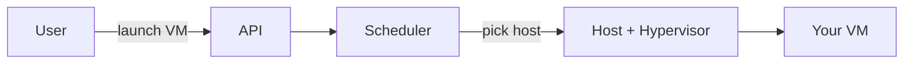

**Request flow:** user → API → scheduler → host → VM boots → return IP.

That's it. It works for a few hundred VMs.

### 3. What Breaks at Scale?

Now we have a million hosts and customers launching VMs every second.

- **The scheduler is one box.** It can't track free capacity across a million hosts in real time. It becomes the bottleneck.
- **Hosts fail constantly.** A power supply dies and a customer's VM vanishes. Who notices? Who tells the customer?
- **Noisy neighbors.** Two VMs on one host fight over the same disk and network. One customer's batch job slows down another customer's database.
- **Storage is glued to the host.** If the host dies, the disk dies, and the data is gone. That's unacceptable.
- **Networking is a mess.** A million VMs all need IP addresses and need to *not* see each other's traffic.

### 4. Improving the Design

The single most important move: **split the control plane from the data plane.**

- The **control plane** is the "management brain" — the API, the scheduler, the billing system, the database of who-owns-what. It's allowed to be a little slow. It does *not* sit in the path of your running VM.
- The **data plane** is the actual running stuff — your VM, its network packets, its disk reads. It must be blazing fast and must keep working even if the control plane is down.

> **Key idea — Control plane vs Data plane.** Think of an airport. The control tower (control plane) decides which plane lands on which runway. But once your plane is flying (data plane), it doesn't need to phone the tower for every second of the flight. If the tower goes dark, planes already in the air keep flying. We design clouds the same way: **your running VM keeps running even if our management systems are having a bad day.**

Now fix the rest, one problem at a time:

- **Scheduler bottleneck →** make it a distributed pool. Shard hosts into "cells" or "availability zones," and run a scheduler per cell. No single scheduler knows about all million hosts.
- **Host failure loses data →** **separate storage from compute.** Disks live on a network storage service (think EBS). The VM talks to its disk over a fast network. If the host dies, we reattach the disk to a new host and reboot the VM. Data survives.
- **Noisy neighbors →** the hypervisor enforces limits: CPU shares, disk IOPS caps, network bandwidth caps per VM.
- **Networking →** give each customer a **virtual network** (a VPC). Use software-defined networking so packets are tagged and isolated. Customer A literally cannot send a packet to Customer B's private VM.

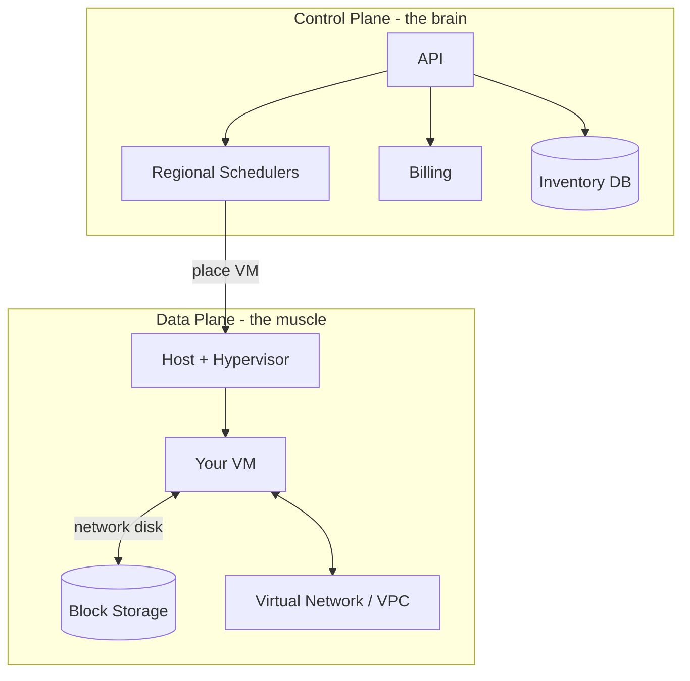

### 5. Key Design Decisions

- **Control plane / data plane split.** This is *the* decision. It's why your EC2 instance doesn't reboot just because AWS deploys a new console.
- **Storage separated from compute.** Lets us treat hosts as disposable. Host died? Move the workload. The data isn't trapped.
- **Availability Zones.** A region is split into 2–4 isolated zones with separate power and network. If one zone burns down, the others survive. Customers spread their VMs across zones.
- **Multi-tenancy with hard isolation.** The hypervisor is the security boundary. Getting this wrong is a catastrophe (one customer reading another's memory), so it's the most scrutinized code in the system.

### 6. Tradeoffs

- **Separating storage from compute adds latency.** A local disk is faster than a network disk. We accept a small latency cost to gain durability and flexibility. (For customers who need raw speed, we offer local "instance store" disks with the warning: *if the host dies, your data is gone*.)
- **Strong isolation costs efficiency.** We could pack VMs tighter if we trusted them to share more. We don't, because security wins.
- **Control plane complexity.** We've turned one simple scheduler into a sprawling distributed system. More moving parts, more to operate. The payoff is that failures stay contained.

### 7. Interview Tips

- **The phrase to drop:** "I'd separate the control plane from the data plane so running workloads survive management outages." This instantly signals senior thinking.
- **Common question:** "What happens when a physical host fails?" Strong answer: storage is on the network, so we detach and reattach the volume to a healthy host and reboot — minimal data loss.
- **Common mistake:** designing one global scheduler. Always shard by zone/region.
- **Strong point:** explain Availability Zones as the unit of failure isolation, and why customers should deploy across zones.

---

## 2. Container Orchestration Platform (Kubernetes-like)

### 1. The Problem

VMs are heavy. Booting one takes a minute and wastes resources if your app only needs 200 MB of RAM. Containers are lighter — they start in seconds and pack many to a host. But now you have *hundreds* of containers across *dozens* of machines, and you need something to answer: which container runs where? What if one crashes? How do they find each other?

We're building the thing that answers those questions automatically. You hand it a wish — "run 10 copies of my web app" — and it makes reality match your wish, forever, even as machines die.

Who uses it? Basically every modern engineering team. Why is it hard? Because "keep reality matching the wish, despite constant failure" is a surprisingly deep problem.

### 2. A Simple Design

You have a few worker machines ("nodes"). A central **scheduler** decides which node runs which container. You tell it "run 3 copies of app X," it picks 3 nodes and starts them.

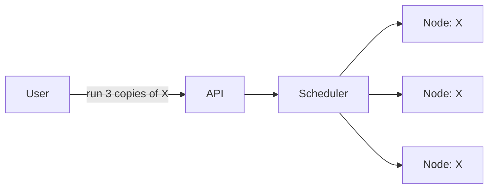

Works fine for a small cluster.

### 3. What Breaks at Scale?

- **A container crashes.** Now you have 2 copies, not 3. Nobody fixes it.
- **A whole node dies.** All its containers vanish. Who notices?
- **How do containers find each other?** App X needs to call app Y, but Y's containers have random IPs that change when they restart.
- **Config drift.** Someone manually fixed something on node 5. Now node 5 is a special snowflake and behaves differently.
- **The control brain is a single point of failure.** If the scheduler box dies, you can't deploy anything.

### 4. Improving the Design

The big idea here is the **reconciliation loop** (also called "desired state vs actual state").

> **Key idea — Desired vs Actual state.** You don't tell the system *how* to do things step by step. You tell it *what you want* — "3 copies of X running." The system constantly compares the desired state ("3") to the actual state ("2, one crashed") and takes action to close the gap. It's like a thermostat: you set 21°C, and it keeps nudging the heater until the room matches. This is why Kubernetes "self-heals" — it never stops trying to make reality match your wish.

Components we add:

- **A cluster store (etcd)** — a reliable, consistent database that holds the desired state. This is the single source of truth. (It uses consensus under the hood — more on that in Chapter 6.)
- **Controllers** — small loops, each watching one kind of thing. The "ReplicaSet controller" watches "I want 3 copies" and creates/deletes containers to match.
- **A kubelet on every node** — the local agent that actually starts containers and reports "node 5 is alive, here's what's running."
- **A service abstraction + DNS** — instead of chasing changing IPs, app X calls `service-y`, and the platform routes to whichever healthy copies of Y exist right now.

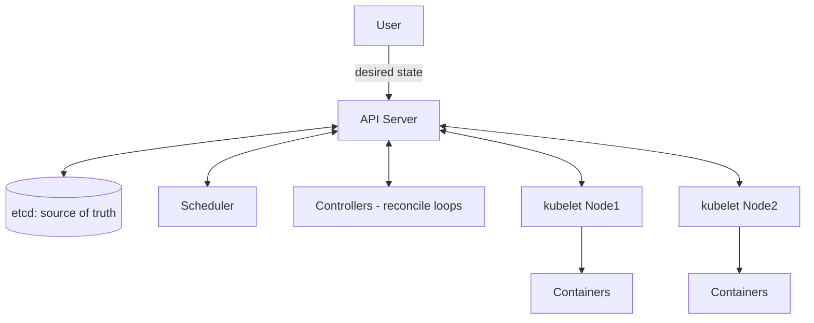

**Request flow for self-healing:** node 2 dies → its kubelet stops reporting → controller notices actual (2 copies) ≠ desired (3) → scheduler places a new copy on a healthy node → kubelet starts it. No human involved.

### 5. Key Design Decisions

- **Declarative, not imperative.** You declare the end state; the system figures out the steps. This is what makes it self-healing and what makes config reproducible (the snowflake problem disappears).
- **etcd as the single source of truth.** Everything flows through one consistent store. The whole cluster's "brain state" lives here.
- **Everything is a controller watching the store.** The architecture is dozens of simple loops, not one giant program. Each loop does one job. This makes the system extensible — you can add your own controllers.
- **Control plane vs data plane again.** The API server, scheduler, etcd, and controllers are the control plane. Your actual running containers are the data plane. If the control plane goes down, **your containers keep serving traffic** — you just can't make changes until it recovers.

### 6. Tradeoffs

- **etcd needs consensus, which limits cluster size.** Consensus is chatty. This is why a single cluster tops out around a few thousand nodes — beyond that, etcd struggles. Solution: run many clusters, not one giant one.
- **Eventual consistency in the loops.** When you ask for 3 copies, you don't get them *instantly* — there's a short reconciliation delay. Usually fine, occasionally surprising.
- **Complexity.** Kubernetes is famously hard to operate. The power and flexibility come at the cost of a steep learning curve. For small workloads it's overkill.

### 7. Interview Tips

- **The phrase to drop:** "It's a reconciliation loop — desired state in etcd, controllers continuously driving actual state toward it."
- **Common question:** "How does self-healing work?" Answer with the thermostat analogy.
- **Common mistake:** describing it as "the scheduler restarts crashed containers." It's subtler — controllers detect the *gap* and the scheduler *places* replacements.
- **Strong point:** mention that the control plane and your workloads are decoupled, so a control-plane outage doesn't take down running apps.

---

## 3. Serverless Platform (AWS Lambda-like)

### 1. The Problem

Sometimes you don't want a server *at all*. You just have a function — "when an image is uploaded, make a thumbnail" — and you want to run it without thinking about machines, scaling, or patching. You pay only for the milliseconds it runs.

Who uses it? Teams that want to ship logic fast, event-driven workloads, glue code, APIs with spiky traffic.

Why is it hard? Because "no servers" is a lie we tell the customer. There are absolutely servers. We just have to make them appear and disappear so fast and so cheaply that the customer never thinks about them. And we have to go from **zero running copies to thousands in seconds** when traffic spikes — then back to zero.

### 2. A Simple Design

A customer uploads their function code. When a request comes in, we grab a free worker, load the code, run it, return the result.


Fine for a demo.

### 3. What Breaks at Scale?

- **Cold starts.** Loading the code and booting a runtime takes time. If we do it on every request, latency is terrible.
- **Traffic spikes.** A function gets 10,000 simultaneous requests. We need 10,000 isolated execution environments *now*.
- **Isolation.** Every customer's untrusted code runs on our shared machines. Customer A must never see Customer B's data — or even know they exist.
- **Idle cost.** A function that runs once an hour shouldn't hold a server for the other 59 minutes.

### 4. Improving the Design

Two key moves: **warm pools** and **micro-isolation**.

- **Warm pools.** Keep pre-initialized execution environments ready. When a request arrives, grab a warm one (fast — a "warm start"). Only build a new one when the pool is empty (slow — a "cold start"). After a function goes idle, we keep its environment warm for a few minutes in case another request comes, then tear it down.

- **Micro-isolation.** Full VMs are too heavy to start in milliseconds; plain containers aren't isolated enough for untrusted code. The breakthrough is **lightweight micro-VMs** (AWS built Firecracker for exactly this): they boot in ~100 ms and give VM-level isolation. Best of both worlds.

- **Separate control plane from invocation path.** The control plane handles uploading code, configuration, and scaling decisions. The **invoke path** — the thing that runs on every request — must be ultra-lean.

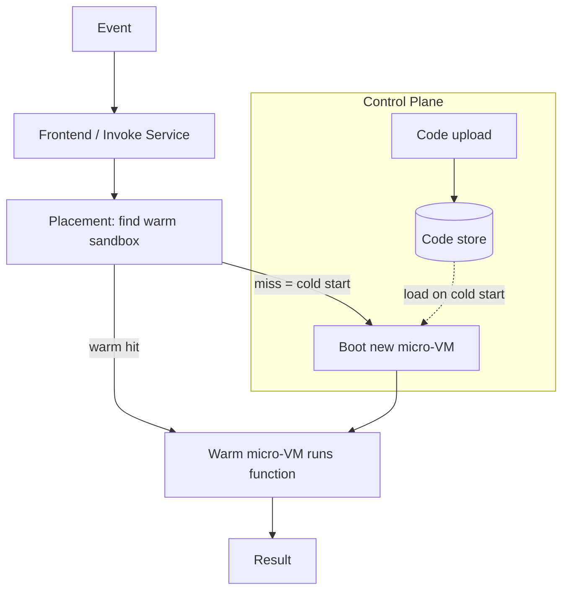

**Request flow:** event → frontend → find a warm micro-VM for this function → run → return. If none warm, cold-start a new micro-VM from stored code.

**Scaling:** each concurrent request gets its own sandbox. 10,000 requests → up to 10,000 micro-VMs spun up in parallel, then released. This is the magic of serverless: scaling is automatic and per-request.

### 5. Key Design Decisions

- **Micro-VMs for isolation + speed.** This is the heart of the platform. It's the decision that makes secure, fast, multi-tenant function execution possible.
- **Warm pools to hide cold starts.** A latency-vs-cost dial. Keep more warm = faster but pricier (for us). Keep fewer = cheaper but more cold starts.
- **Stateless functions.** Functions can't keep state between invocations (you might run on a different sandbox each time). State goes to external stores (databases, object storage). This constraint is *what makes* effortless scaling possible — any sandbox can handle any request.
- **Scale to zero.** When no requests come, we run nothing and charge nothing. The customer's idle function costs us almost nothing.

### 6. Tradeoffs

- **Cold starts are an inherent tax.** You can shrink them but never fully kill them. Latency-sensitive apps feel this.
- **Statelessness is restrictive.** You can't hold a big in-memory cache or a long-lived connection pool easily. Some workloads just don't fit.
- **Cost crossover.** Serverless is cheap for spiky, low-volume workloads and *expensive* for steady high-volume ones — at constant high load, a dedicated server is cheaper. Knowing where that crossover is, is a senior-level judgment call.
- **Hard limits.** Max execution time, max memory. Long-running jobs don't belong here.

### 7. Interview Tips

- **The phrase to drop:** "Micro-VMs give us VM-grade isolation with container-grade startup time — that's what makes secure multi-tenant serverless feasible."
- **Common question:** "How do you handle cold starts?" Talk about warm pools and pre-initialization.
- **Common mistake:** assuming functions can keep state in memory between calls. They can't — explain why that constraint *enables* scaling.
- **Strong point:** discuss the cost crossover — serverless isn't always cheaper, and knowing when to use it is the real skill.

---

# Part II — Data & Coordination

---

## 4. Global Distributed Database

### 1. The Problem

We want a database that:
- Holds a huge amount of data (way more than one machine can store),
- Is available worldwide with low latency,
- Survives machine and even whole-datacenter failures,
- And doesn't lose data.

Who uses it? Any global app — think a database backing a worldwide social network or store. This is the hardest chapter conceptually, so we'll go slow. Everything here (CAP, replication, consensus) shows up again in later chapters.

### 2. A Simple Design

One PostgreSQL box. App writes and reads from it.

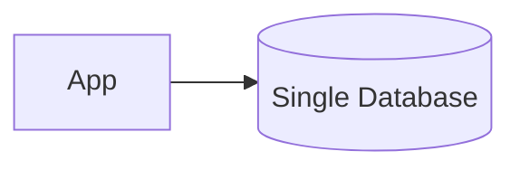

It's great. Until it isn't.

### 3. What Breaks at Scale?

- **Too much data.** One machine's disk fills up. You can't store the world on one box.
- **Too much traffic.** One machine's CPU maxes out under read/write load.
- **It's a single point of failure.** The box dies → your whole app is down, and you may have lost data.
- **Latency.** Your one box is in Virginia. Users in Tokyo wait 150 ms for every query.

### 4. Improving the Design

We fix these with two classic techniques: **replication** (copies for safety and reads) and **sharding** (splitting data for scale).

**Step 1 — Replication for safety.** Keep multiple copies of the data on different machines. If one dies, another has the data.

> **Key idea — Replication.** A *replica* is a copy of your data on another machine. Copies give you two things: **durability** (one machine dies, the data lives on the others) and **read scaling** (spread reads across copies). The catch: when you write, you have to update all the copies, and keeping them in sync is where all the difficulty lives.

**Step 2 — Sharding for size.** Split the data into pieces ("shards") by some key (e.g., user ID). Shard 1 holds users A–M, shard 2 holds N–Z. Each shard lives on its own machine (and has its own replicas). Now no single machine holds everything.

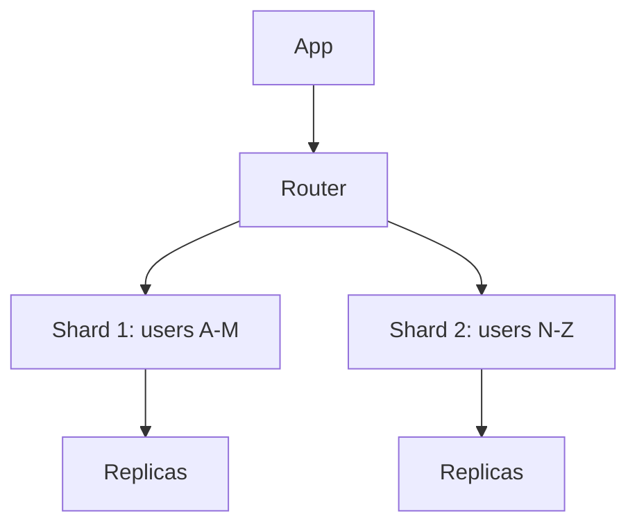

**Step 3 — Now the hard question: keeping copies consistent.** When you write to a replica set, when do you say "the write succeeded"? Here's where we meet the most famous tradeoff in distributed systems.

> **Key idea — CAP Theorem (the intuition).** Imagine your replicas are split across two data centers, and the network *between them* breaks (a "partition"). You now face a choice for every request:
> - **Stay consistent (CP):** refuse to answer until the network heals, so you never give a wrong/stale answer. You sacrifice **availability**.
> - **Stay available (AP):** keep answering from whichever side you can reach, accepting that the two sides might temporarily disagree. You sacrifice **consistency**.
>
> You can't have both *during a network partition*. That's CAP. The trick is: partitions are rare, so the more useful daily question is...

> **Key idea — PACELC.** CAP only talks about the partition case. PACELC adds the normal case: **if Partition, choose Availability or Consistency; Else (normal operation), choose Latency or Consistency.** Even when the network is fine, making all replicas agree before answering *costs latency*. So every database is really tuning a dial between "fast but maybe stale" and "always correct but slower." This dial is the single most important thing to understand about distributed databases.

**Step 4 — How do replicas agree?** For data you can't afford to get wrong (a bank balance), replicas use **consensus**: a majority must agree before a write counts.

> **Key idea — Consensus & Quorums.** Say you have 3 replicas. A write only "counts" once a **majority (2 of 3)** acknowledge it. A read also checks a majority. Because any majority overlaps with any other majority, you can never miss the latest write. This majority-voting scheme (Paxos/Raft) is how systems stay correct even when a minority of machines fail. The cost: you need a majority reachable, and voting takes a network round trip.

### 5. Key Design Decisions

- **Sharding strategy.** Range-based (A–M, N–Z) makes range scans easy but can create hotspots. Hash-based spreads load evenly but kills range scans. Pick based on your access patterns.
- **Consistency model.** **Strong** (always see the latest write, à la Google Spanner) vs **eventual** (replicas converge over time, à la Amazon Dynamo). This is your PACELC dial.
- **How many replicas and where.** More replicas = more durability and read capacity but more write cost. Spreading across regions cuts read latency for distant users but raises write latency (writes must cross oceans to reach a quorum).
- **Synchronous vs asynchronous replication.** Sync = no data loss but slow writes. Async = fast writes but you can lose the last few writes if a machine dies before copying them.

### 6. Tradeoffs

- **Strong consistency costs latency.** Spanner gives you globally correct reads but pays for it with coordination (it even uses atomic clocks to pull this off). Dynamo-style eventual consistency is lightning fast but you might read stale data for a moment.
- **Sharding adds complexity.** Cross-shard transactions and joins are painful. Many systems avoid them entirely by designing the data so related items live on the same shard.
- **More replicas, more cost.** Storage and write amplification grow. There's no free durability.

### 7. Interview Tips

- **The phrase to drop:** "What's our consistency requirement? That decides everything downstream." Then reason with PACELC.
- **Common question:** "Strong or eventual consistency?" Don't pick blindly — tie it to the use case. Bank balance → strong. Like-count → eventual is fine.
- **Common mistake:** saying CAP means "pick 2 of 3 always." No — you only sacrifice C or A *during a partition*. Mention PACELC to show depth.
- **Strong point:** explain quorums (majority overlap) in one sentence. It shows you understand *how* consensus actually keeps data correct.

---

## 5. Multi-Region Disaster Recovery System

### 1. The Problem

Everything in one region is a gamble. Regions go down — fires, floods, fiber cuts, a bad config push that bricks an entire data center. When (not if) a whole region fails, your business must keep running.

Who needs this? Anyone who can't afford to be down: banks, hospitals, payment systems, anything with an SLA. The question this chapter answers: **how do we survive losing an entire region, and how fast do we recover?**

### 2. A Simple Design

Everything runs in Region A. We take nightly backups and copy them to Region B's storage. If Region A dies, we... restore from backup and rebuild. Manually. Over many hours.

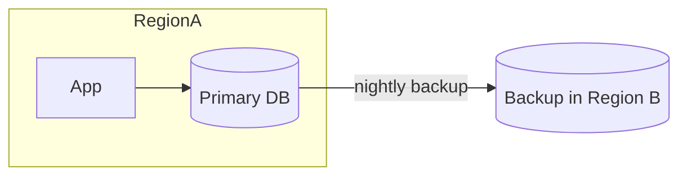

It "works," but recovery is slow and you lose up to a day of data.

### 3. What Breaks at Scale?

Two numbers expose the problem:

> **Key idea — RPO and RTO.** **RPO (Recovery Point Objective):** how much data can you afford to lose? With nightly backups, RPO = up to 24 hours of data — gone. **RTO (Recovery Time Objective):** how long until you're back up? With manual restore, RTO = many hours. For a payment system, both are wildly unacceptable. These two numbers drive your entire DR design — and your cost.

- **Backups are stale** → big RPO (data loss).
- **Manual recovery is slow** → big RTO (long outage).
- **Region B is cold** → nothing's running there; it takes time to spin everything up.

### 4. Improving the Design

There's a spectrum of strategies, from cheap-and-slow to expensive-and-instant. You pick based on your RPO/RTO needs and budget.

**1. Backup & Restore (cheapest).** What we have. Hours of RTO, hours/day of RPO. Fine for non-critical systems.

**2. Pilot Light.** Keep a minimal version of Region B always running — the database is replicated and live, but app servers are off. On disaster, just turn on the app servers. Much faster.

**3. Warm Standby.** Region B runs a small but fully working copy. On disaster, scale it up and redirect traffic. RTO in minutes.

**4. Active-Active (most expensive, best).** Both regions serve live traffic *all the time*. If one dies, the other already has everything — just stop sending traffic to the dead one.

> **Key idea — Active-Active.** Instead of a "main" region and a "backup" region, run *both* as equals, each handling real users. Data replicates between them continuously. The beauty: failover is nearly instant because the surviving region is already warm, already serving, already has the data. The cost: you're paying for full capacity in two places, *and* you have to handle the nightmare of writes happening in both regions at once (conflict resolution — see tradeoffs).

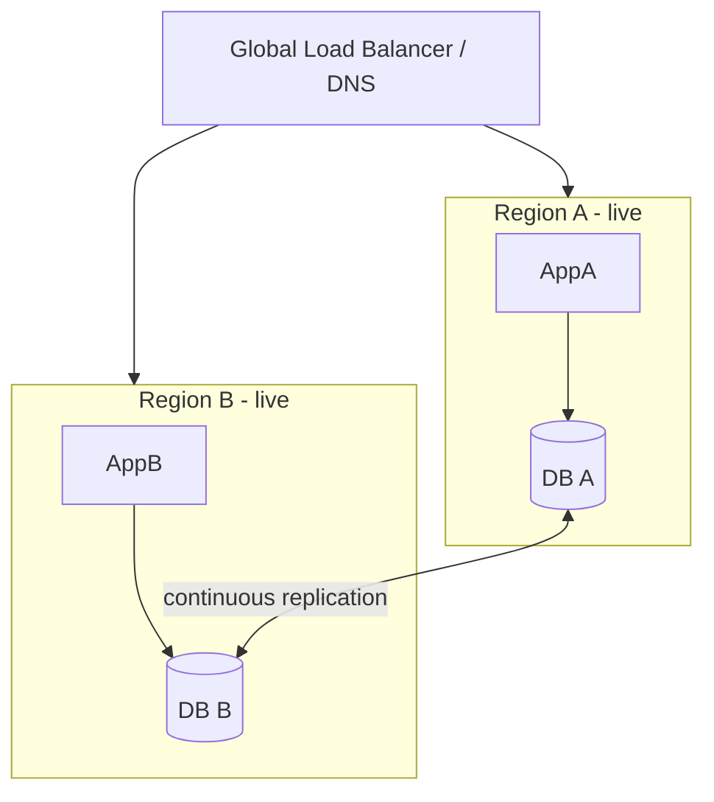

**Failover flow:** health checks detect Region A is down → global load balancer / DNS stops routing to A → all traffic flows to B, which was already live. Users barely notice.

### 5. Key Design Decisions

- **Which DR strategy?** Driven entirely by RPO/RTO and money. A blog uses backup-restore. A bank uses active-active. Don't over-engineer; don't under-engineer.
- **How traffic fails over.** Usually DNS-based routing or a global load balancer with health checks. DNS is simple but has caching delays; global load balancers fail over faster.
- **Data replication mode.** Synchronous across regions = zero data loss (RPO≈0) but adds latency to every write (oceans are far). Asynchronous = fast writes but you may lose the last few seconds on failover. This is the RPO dial.
- **Practice failovers.** A DR plan you've never tested *will* fail when you need it. Chaos engineering / "game days" where you deliberately kill a region are how serious companies build confidence.

### 6. Tradeoffs

- **Active-active write conflicts.** If both regions accept writes to the same record, who wins? You need conflict resolution (last-write-wins, or app-level merging, or partitioning writes so each record has a "home" region). This is genuinely hard.
- **Cost scales with ambition.** Active-active roughly doubles your infrastructure bill. Lower RPO/RTO always costs more. The art is matching spend to actual business need.
- **Cross-region sync latency.** True zero-RPO synchronous replication across continents is often too slow to be practical, so most systems accept a small RPO.

### 7. Interview Tips

- **The phrase to drop:** "What are our RPO and RTO targets? That decides which DR strategy and how much it'll cost."
- **Common question:** "How do you handle a region failure?" Walk the spectrum (backup → pilot light → warm → active-active) and justify a pick.
- **Common mistake:** assuming active-active is always best. It's the most expensive and adds conflict-resolution complexity. Sometimes warm standby is the right, cheaper answer.
- **Strong point:** mention testing DR (game days). Untested DR is theater.

---

## 6. Coordination Service (ZooKeeper-like)

### 1. The Problem

In a distributed system, machines constantly need to agree on small but critical facts:
- **Who is the leader?** (Of a replica set, of a shard.)
- **Who is alive right now?** (Service discovery.)
- **Who holds the lock?** (So two machines don't do the same job twice.)
- **What's the current config?**

Getting these wrong is catastrophic — *two* leaders (a "split brain") can corrupt your data forever. So we build a tiny, rock-solid service whose only job is to be the trustworthy source of truth for these coordination facts. ZooKeeper, etcd, and Consul all do this. (Remember Kubernetes' etcd from Chapter 2? Same idea.)

### 2. A Simple Design

A single server holds the coordination data (leader info, locks, config). Everyone asks it.

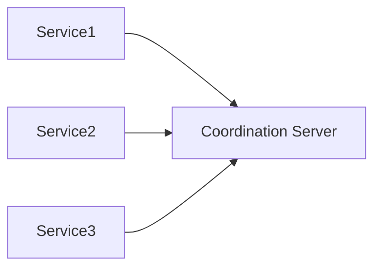

Simple — but it's a single point of failure, which is *exactly* the thing a coordination service must never be. If the one thing everyone trusts goes down, everything stops.

### 3. What Breaks at Scale?

- **Single point of failure.** The coordinator dies → nobody can elect leaders or grab locks → the whole system freezes.
- **So we run several copies — but now they can disagree.** If two coordinator nodes each think a *different* service is "the leader," you get split brain and data corruption.
- **Network partitions.** The coordinators get split in half. Each half might try to keep operating. Disaster.

The whole challenge: be **highly available** (multiple copies) *and* **never disagree** (always give one consistent answer), even when machines and networks fail.

### 4. Improving the Design

This is the textbook home of **consensus**. We run an odd number of coordinator nodes (3 or 5) that vote.

> **Key idea — Consensus (Raft/Paxos), revisited.** The nodes elect one **leader** among themselves. All writes go through the leader, which only commits a change once a **majority** of nodes have stored it. Reads can be served fast. Because every decision needs a majority, and any two majorities overlap, the cluster can *never* commit two conflicting decisions. Even if a minority of nodes fail or get cut off, the majority side keeps working and stays correct.

This directly kills split brain:

> **Key idea — Quorum prevents split brain.** With 5 nodes, a partition might split them 3-vs-2. The side with 3 (the majority) can still form a quorum and keep operating. The side with 2 *cannot* get a majority, so it refuses to act — it knows it might be the minority. Only one side can ever have the majority, so only one side ever acts. No two leaders. No split brain. **This is why coordination services always use an odd number of nodes** — so there's always a clear majority.

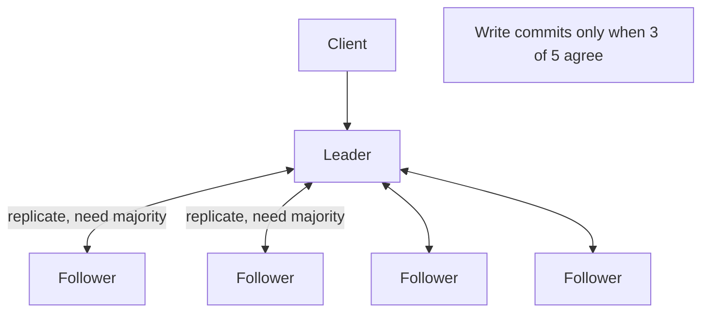

On top of consensus, the service offers handy primitives:
- **Locks** (only one holder at a time),
- **Leader election** (services use it to pick their own leaders),
- **Watches** (tell me when this value changes — great for config),
- **Ephemeral nodes** (a key that auto-disappears when a client dies — perfect for "who's alive?").

### 5. Key Design Decisions

- **Strong consistency over raw speed.** A coordination service deliberately chooses **CP** (in CAP terms): during a partition, the minority side becomes *unavailable* rather than risk giving a wrong answer. For coordination, a wrong answer is worse than no answer.
- **Odd number of nodes.** 3 tolerates 1 failure; 5 tolerates 2. Odd numbers avoid tie votes.
- **Keep it small and focused.** This service stores tiny amounts of critical metadata, *not* your application data. Don't dump big data in here — it's a referee, not a warehouse.
- **Clients cache + watch.** To avoid hammering the service, clients cache values and subscribe to changes.

### 6. Tradeoffs

- **CP means it can become unavailable.** During a bad partition, the minority side stops serving. That's the price of never being wrong. For coordination, it's the right price.
- **Writes are slow-ish.** Every write needs a majority round trip. That's why you store *little* data here and read far more than you write.
- **It's a critical dependency.** Half your infrastructure may depend on it, so it has to be operated with extreme care. When it's unhealthy, a lot of things wobble.

### 7. Interview Tips

- **The phrase to drop:** "Use a consensus-based coordination service for leader election and locks — quorum guarantees one consistent answer and prevents split brain."
- **Common question:** "How do you prevent two leaders / split brain?" Answer: majority quorum — only one side can hold a majority.
- **Common mistake:** putting application data in the coordination service. It's for small, critical metadata only.
- **Strong point:** explain *why* the node count is odd (clear majority, fault tolerance: 2f+1 nodes tolerate f failures).

---

# Part III — Identity & Configuration

---

## 7. IAM Platform

### 1. The Problem

Every action in a big system must answer two questions: **Who are you?** (authentication) and **Are you allowed to do this?** (authorization). IAM (Identity and Access Management) is the platform that answers both, for every request, across every service.

Who uses it? Everything. Every API call to a cloud provider, every internal microservice call, hits IAM. Why is it hard? Because it must be: (1) astronomically high-volume — *every* request checks it, (2) correct — a bug means a security breach, and (3) low-latency — nobody waits 100 ms just to be told "yes you're allowed."

### 2. A Simple Design

A users table and a permissions table. On each request, look up the user, check if they have permission, allow or deny.

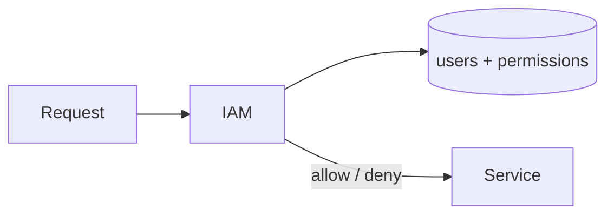

Works for one app.

### 3. What Breaks at Scale?

- **Every request hits the IAM database.** Millions of permission checks per second crush a single database.
- **Permission checks are in the critical path.** If IAM is slow, *every* service is slow. If IAM is down, *everything* is down.
- **Permissions get complicated.** Not just "user X can do Y," but roles, groups, resource hierarchies ("can edit any file in this folder"), conditions ("only from the office network"). Simple tables can't express this cleanly.
- **Audit.** Security teams need to know who did what, when. You must log everything.

### 4. Improving the Design

**Move from authenticating-every-time to tokens.**

> **Key idea — Tokens.** Instead of re-checking the password and re-querying permissions on every request, the user authenticates *once* and gets a signed **token** (often a JWT) that says "I am Alice, here are my roles, valid for 1 hour." Services *verify the signature* locally — no database call needed. This takes the IAM database out of the hot path. The token is like a wristband at a festival: checked once at the gate, then flashed quickly everywhere inside.

**Model permissions properly with RBAC (and sometimes ABAC).**

- **RBAC (Role-Based Access Control):** users get *roles* ("Admin," "Viewer"), and roles have permissions. Far easier to manage than per-user grants.
- **ABAC (Attribute-Based):** rules based on attributes ("allow if resource.owner == user.id and request.region == 'EU'"). More flexible for complex cases.

**Separate the planes again.**

- **Control plane:** managing users, roles, policies (low volume, can be a bit slow, strongly consistent).
- **Data plane:** the actual allow/deny decision on each request (insane volume, must be fast). Cache policies aggressively at the edge / in each service.

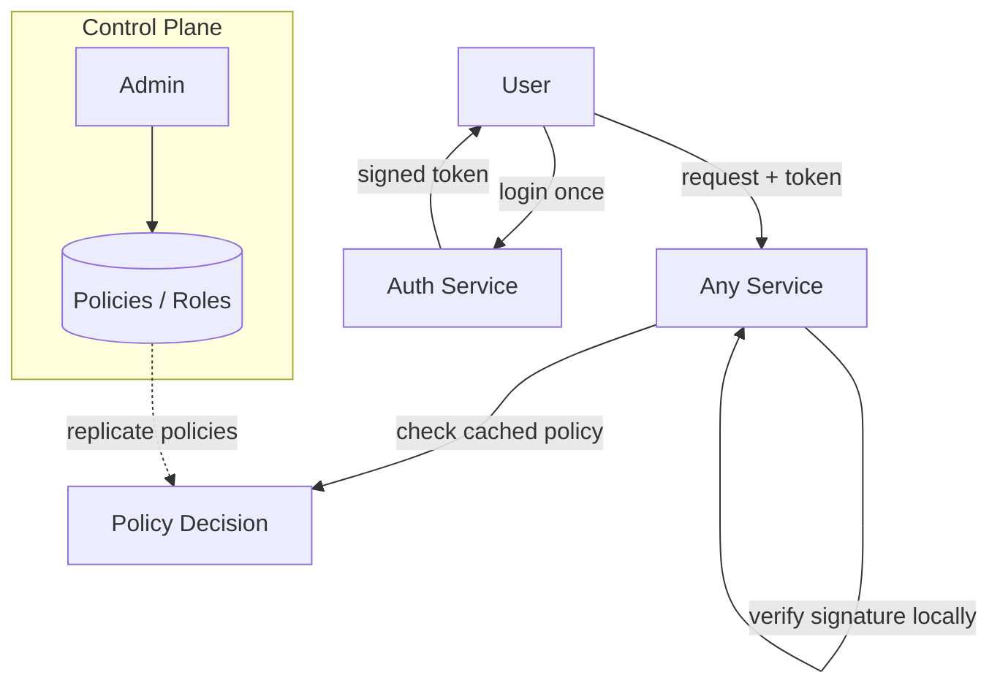

### 5. Key Design Decisions

- **Token-based auth.** Decouples verification from the IAM database. The biggest scalability win.
- **RBAC as the default model.** Roles scale to millions of users far better than individual grants. Add ABAC only where you need fine-grained conditions.
- **Cache permission decisions, but carefully.** Caching makes it fast, but a revoked permission must take effect quickly. Use short token lifetimes + a revocation mechanism. This is a consistency-vs-latency tradeoff (PACELC again!).
- **Default deny.** If unsure, say no. Security systems fail *closed*, never open.
- **Audit everything.** Append-only logs of every decision, for compliance and forensics.

### 6. Tradeoffs

- **Tokens vs instant revocation.** A token valid for 1 hour means a fired employee might keep access for up to an hour. Shorter tokens = more secure but more re-auth traffic. Add a revocation list for emergencies (at some latency cost).
- **Caching vs freshness.** Cached "allow" decisions are fast but can be stale right after a permission change. You're trading a tiny window of staleness for massive performance.
- **RBAC vs ABAC complexity.** RBAC is simple but can lead to "role explosion." ABAC is powerful but rules get hard to reason about and audit.

### 7. Interview Tips

- **The phrase to drop:** "Authenticate once, issue a signed token, verify it locally — keep the IAM database out of the per-request hot path."
- **Common question:** "How do you revoke access immediately if tokens are cached/long-lived?" Answer: short token TTLs + a revocation list/denylist for emergencies.
- **Common mistake:** doing a database lookup on every single request. Doesn't scale.
- **Strong point:** mention "default deny" and audit logging — shows a security mindset.

---

## 8. Single Sign-On Platform

### 1. The Problem

You log in *once* and get access to Gmail, Drive, YouTube, and dozens of third-party apps — without typing your password again. That's SSO. The goal: one identity, many apps, one login.

Who uses it? Every enterprise ("log in with your corporate account"), every "Sign in with Google/Apple" button. Why is it hard? Because the apps you're logging into are *separate systems* — often owned by different companies — that must trust your login without ever seeing your password.

### 2. A Simple Design

Each app has its own login and its own user table. You make an account everywhere and log in everywhere separately.

That's the *opposite* of SSO — and it's the problem. Users hate it, passwords get reused, and there's no central control. Let's fix it.

### 3. What Breaks (the status quo)?

- **Password fatigue.** Users have 50 passwords, reuse them, get phished.
- **No central control.** Employee leaves → admin must disable them in 50 places.
- **Each app stores passwords** → 50 chances for a breach.
- **Third parties shouldn't see your password** at all.

### 4. Improving the Design

Introduce a central **Identity Provider (IdP)** that everyone trusts. Apps ("relying parties") delegate login to it.

> **Key idea — Delegated authentication (OIDC / SAML).** The app doesn't check your password — it *redirects you to the IdP*. You log in there (once). The IdP sends you back to the app with a signed token proving "yes, this is Alice." The app trusts the IdP's signature. Your password only ever touches the IdP. This is what "Sign in with Google" does under the hood. **OpenID Connect (OIDC)** is the modern standard for this; **SAML** is the older enterprise one.

Walk the flow:

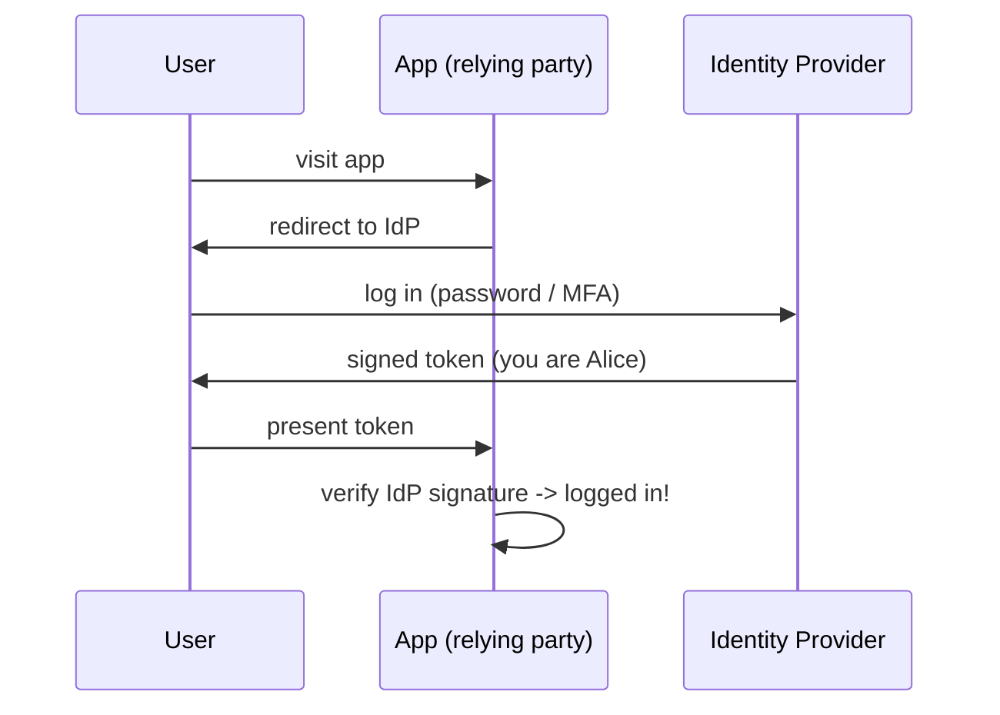

The magic of *single* sign-on: once you have a session with the IdP, the next app that redirects you there sees you're already logged in and sends you straight back — **no second login**.

**Authentication vs Authorization:** OIDC handles "who you are" (authentication). OAuth2 (which OIDC is built on) handles "what this app may do on your behalf" (authorization) — e.g., "this app may read your contacts." They're related but distinct; senior candidates keep them straight.

### 5. Key Design Decisions

- **Central IdP as the single source of identity truth.** One place to add MFA, enforce policies, disable a departing employee instantly (fixes the "50 places" problem).
- **Token-based trust, not password sharing.** Apps verify signatures; passwords stay at the IdP. This is the core security win.
- **Standards (OIDC/SAML/OAuth2).** Use the standards so any app can integrate. Rolling your own auth protocol is a classic, dangerous mistake.
- **Session management.** The IdP holds a central session ("Single Sign-On"); also need **Single Logout** — log out once, and ideally you're out everywhere.

### 6. Tradeoffs

- **The IdP is a juicy single point of failure / attack.** If it's down, *nobody* can log into *anything*. If it's breached, attacker gets everything. So it must be ultra-available (multi-region) and ultra-secure (MFA, monitoring).
- **Single logout is genuinely hard.** Telling every app "this session is dead" reliably is messy, especially across companies.
- **Token theft.** If someone steals a valid token, they're in. Mitigate with short lifetimes, refresh tokens, and binding tokens to devices.

### 7. Interview Tips

- **The phrase to drop:** "Delegate auth to a central IdP; apps trust signed tokens (OIDC) and never see the password."
- **Common question:** "What's the difference between authentication and authorization / OIDC and OAuth2?" Auth*entication* = who you are (OIDC); Auth*orization* = what you may access (OAuth2).
- **Common mistake:** describing apps as receiving the user's password. They never should — that defeats the entire point.
- **Strong point:** discuss the IdP as a critical dependency that must be highly available, and mention single logout as a known hard problem.

---

## 9. Feature Flag Platform

### 1. The Problem

You want to turn features on and off *without deploying code*. Ship a new checkout flow to 1% of users. Instantly kill a buggy feature without a rollback. Show feature X only to users in Canada. That's a feature flag platform.

Who uses it? Every modern product team doing continuous delivery. Why is it (subtly) hard? Because the flag check runs **inside every request of every app**, billions of times a day, and it has to be **fast**, **always available**, and **consistent enough** that you don't show a feature to half a user's page and not the other half.

### 2. A Simple Design

A config file with `new_checkout: true`. Apps read it. To change a flag, edit the file and redeploy.


Problem: changing a flag needs a deploy — defeating the whole point ("change without deploying").

### 3. What Breaks at Scale?

- **No live changes.** Editing a file + redeploy is slow and risky.
- **Calling a central flag service on every request** would add latency to every request *and* make that service a single point of failure for your entire fleet.
- **Targeting rules get complex.** "10% of users, but 100% of beta testers, but 0% in the EU" — a boolean file can't do this.
- **Consistency.** A single user must get a *consistent* answer within a session, or the UI flickers/breaks.

### 4. Improving the Design

The key insight: **evaluate flags locally in each app, using rules pushed from a central control plane.**

- **Control plane:** a UI + service where you define flags and targeting rules. Low volume.
- **Distribution:** push the ruleset to a lightweight **SDK embedded in each app**. The SDK keeps the rules in memory and gets updates via streaming/polling.
- **Data plane:** the flag check happens *in-process, in memory* — microseconds, no network call. Even if the central service is down, the app keeps using its last-known rules.

> **Key idea — Push config, evaluate locally.** Don't ask a remote service "is this flag on?" on every request — that's slow and fragile. Instead, *ship the rules to the app* and let it decide locally. The central service's job is just to *distribute* rules, not to answer per-request. This is the same control-plane/data-plane split we keep seeing: management is centralized, the hot decision is local. Bonus: if the control plane dies, apps keep working on cached rules (graceful degradation).

**Consistent targeting** uses a neat trick:

> **Key idea — Deterministic bucketing.** To roll out to "10% of users" consistently, hash the user's ID into a number 0–99. If it's under 10, they're in. Because hashing is deterministic, the *same user always lands in the same bucket* — so they get a stable experience, and 10% means a stable, evenly-spread 10%. No central state needed to remember who's in.

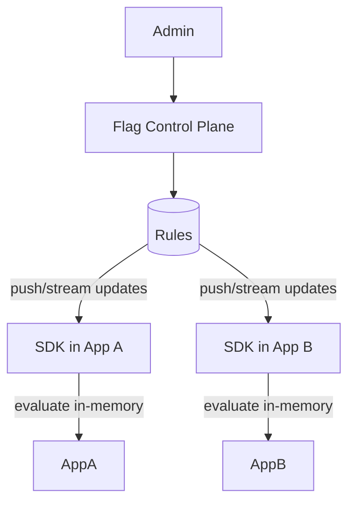

### 5. Key Design Decisions

- **Local in-memory evaluation.** Zero added latency, and resilience if the control plane is unreachable. The defining decision.
- **Streaming updates.** Flag changes propagate in seconds (kill switch must be *fast*), without polling storms.
- **Deterministic hashing for rollouts.** Stable, even, stateless percentage rollouts.
- **Fail to a safe default.** If the SDK has no rules yet, default to "off" (or a configured safe value). Never crash because a flag couldn't load.

### 6. Tradeoffs

- **Eventual consistency of flag state.** A change takes a few seconds to reach all apps. Different servers may briefly disagree. Almost always fine — but for something that *must* be instant and global, this matters.
- **SDK in every language.** You must build and maintain SDKs for every platform your apps use. Real ongoing cost.
- **Flag debt.** Old flags pile up and rot in the codebase. Operationally you need a process to retire them, or you drown in dead conditionals.

### 7. Interview Tips

- **The phrase to drop:** "Evaluate flags locally in-memory via an SDK; the central service only distributes rules — keeps it fast and resilient."
- **Common question:** "How do you do a consistent 10% rollout?" Answer: hash the user ID into buckets — deterministic, stateless, even.
- **Common mistake:** calling a central service on every flag check. Adds latency and a single point of failure.
- **Strong point:** mention graceful degradation (cached rules survive a control-plane outage) and the kill-switch use case.

---

# Part IV — Data at Internet Scale

---

## 10. Global Ad Serving Platform

### 1. The Problem

When a web page loads, in the ~100 milliseconds before you see it, an *auction* happens: advertisers bid to show you an ad, a winner is picked, and the ad is served. Do this **millions of times per second, globally, in under 100 ms each**, while tracking budgets so no advertiser overspends.

Who uses it? Google, Meta, every ad network. Why is it brutally hard? The combination: **massive scale + hard latency deadline + money correctness** (budgets, billing) all at once. This is one of the most demanding systems in tech.

### 2. A Simple Design

When a page loads, ask each advertiser "want to bid?", collect bids, pick the highest, show that ad, charge the advertiser.

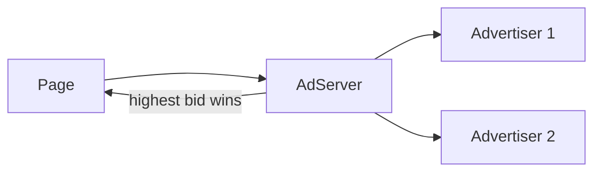

Fine for a handful of advertisers and pages.

### 3. What Breaks at Scale?

- **Latency budget is tiny.** You have ~100 ms total. You can't synchronously ask a million advertisers anything.
- **Volume is staggering.** Millions of auctions per second, worldwide.
- **Budget correctness vs speed.** You must not let an advertiser overspend — but checking a global budget counter on every auction (with strong consistency) is far too slow.
- **Targeting.** Pick relevant ads for *this* user from billions of candidate ads, fast.
- **Global users.** Latency means you must serve from data centers near the user.

### 4. Improving the Design

**Two-phase: narrow down, then rank.**

- **Candidate selection (retrieval):** from billions of ads, quickly fetch a few hundred that *could* match this user (using precomputed indexes by targeting attributes). Fast, approximate.
- **Ranking (the auction):** score those few hundred precisely (predicted click value × bid) and pick the winner. Expensive, but only on a small set.

This "retrieve cheap, then rank expensive on a small set" pattern shows up again in recommendations (Chapter 12) — remember it.

**Serve everything from the edge.** Run the auction in data centers close to the user to meet the latency deadline. Ad data and models are replicated out to every region.

**Handle budgets with approximate, distributed counting.**

> **Key idea — Trade exact for fast (with money!).** You can't run a globally-consistent budget check in a 100 ms auction at millions of QPS. So you *approximate*: give each region a *slice* of the advertiser's budget to spend locally without coordinating. Periodically reconcile the slices centrally. The result: an advertiser might overspend by a tiny fraction for a brief moment, which you eat as a known, bounded cost. **You deliberately relax strict correctness to hit latency** — and you make the small error someone else's problem (yours, financially, but bounded). This is eventual consistency applied to money, on purpose.

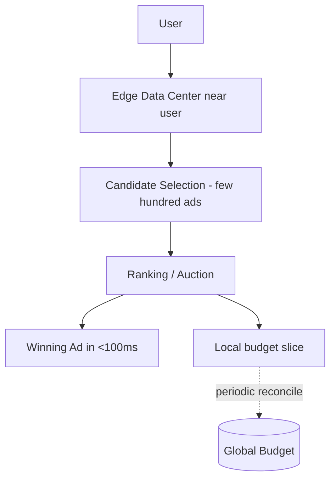

### 5. Key Design Decisions

- **Retrieve-then-rank.** Never score billions of ads per request. Cheaply narrow to hundreds, then rank precisely. Fundamental to meeting latency.
- **Edge serving + global replication.** The auction must happen near the user. Push ad data and ML models out to every region.
- **Approximate budgets.** Local budget slices + periodic reconciliation. Accept tiny, bounded overspend to win latency.
- **Precompute relentlessly.** Targeting indexes, user features, model scores — compute offline so the online path is just a fast lookup.

### 6. Tradeoffs

- **Approximation vs exactness.** You accept small budget overruns and slightly stale targeting data to hit the deadline. At this scale, perfect is impossible; bounded-imperfect is the only option.
- **Cost of global replication.** Replicating massive ad catalogs and models to every region is expensive in storage and bandwidth.
- **Complexity of the latency budget.** Every component has a sub-budget (retrieval 20 ms, ranking 30 ms...). Engineering to a hard real-time deadline is relentless and unforgiving.

### 7. Interview Tips

- **The phrase to drop:** "Retrieve a small candidate set cheaply, then rank precisely — you can't score billions of ads in 100 ms."
- **Common question:** "How do you enforce budgets at this scale?" Answer: distributed budget slices + periodic reconciliation, accepting bounded overspend.
- **Common mistake:** proposing a strongly-consistent global budget check per auction. It cannot meet the latency requirement.
- **Strong point:** name the hard latency deadline explicitly and design *backward* from it. Mention precomputation.

---

## 11. Real-Time Analytics Platform

### 1. The Problem

You want dashboards that update *now*: live active users, real-time fraud alerts, "trending right now," operational metrics. Data flows in continuously from millions of sources, and you want answers in seconds, not tomorrow.

Who uses it? Ops teams watching live metrics, fraud detection, product analytics, anything needing "what's happening *right now*." Why is it hard? Two conflicting needs: **real-time speed** (answer in seconds on fresh data) *and* **historical accuracy** (correct answers over months of data). These pull in opposite directions.

### 2. A Simple Design

Events land in a database. Dashboards run SQL queries against it.


Works at low volume. Then the events flood in.

### 3. What Breaks at Scale?

- **Write overload.** Millions of events per second overwhelm a normal database's writes.
- **Slow queries.** "Count distinct users in the last 5 minutes" over billions of rows is slow if computed on read.
- **Real-time vs batch tension.** Fast streaming results are approximate and can have gaps; accurate batch results are slow. You want both.
- **Late and out-of-order data.** Events arrive seconds or hours late (a phone was offline). Your time-windowed counts must cope.

### 4. Improving the Design

**Step 1 — Put a log in front: ingest with a streaming buffer.**

> **Key idea — The event log (Kafka).** Don't write events straight to a database. Write them to a distributed, append-only **log** (like Kafka) that can absorb millions of events per second and hold them durably. Multiple consumers can then read this stream at their own pace. The log decouples the firehose of incoming data from the systems that process it — a shock absorber. This pattern underpins almost every large data platform.

**Step 2 — Pre-aggregate with stream processing.** A stream processor (Flink, Spark Streaming) reads the log and continuously maintains rolling aggregates ("active users per minute") in **time windows**, so dashboards read pre-computed results instead of scanning raw events.

**Step 3 — Reconcile speed and accuracy.** The classic approach is two layers:

> **Key idea — Speed layer + batch layer (Lambda architecture).** Run two paths over the same event log: a **speed layer** (streaming) gives you *fast, approximate, recent* answers within seconds; a **batch layer** periodically reprocesses *all* data for *slow, exact, complete* answers. The dashboard merges them: recent data from the speed layer, older data from the accurate batch layer. (Modern systems sometimes unify these into one streaming engine — "Kappa architecture" — but the speed-vs-accuracy idea is the same.)

```mermaid
flowchart TB
    Sources --> Log[(Event Log / Kafka)]
    Log --> Speed[Speed Layer - streaming, fast/approx]
    Log --> Batch[Batch Layer - slow/exact]
    Speed --> Serving[Serving / Dashboard]
    Batch --> Serving
```

For "count distinct users" type queries at scale, use **approximate algorithms** (like HyperLogLog) that give ~99% accuracy using a tiny fraction of the memory. Another deliberate trade of exactness for speed/cost.

### 5. Key Design Decisions

- **Log-based ingestion (Kafka).** Absorbs the firehose, decouples producers from consumers, gives durability and replay. The foundation.
- **Pre-aggregation in time windows.** Compute on write, not on read. Dashboards must be fast.
- **Speed + batch layers.** Get real-time *and* eventually-accurate. A direct CAP-flavored tradeoff between freshness and correctness.
- **Approximate algorithms** where exactness isn't worth the cost (unique counts, percentiles).
- **Use a purpose-built analytics store** (columnar / time-series DB like ClickHouse or Druid) for fast aggregation queries, not a row-store OLTP database.

### 6. Tradeoffs

- **Real-time = approximate; accurate = delayed.** The whole design is managing this tension. Be explicit about which numbers are "live-ish" vs "settled."
- **Lambda architecture means two codebases** (stream + batch) computing the same thing — duplicated logic, a maintenance burden. (Hence the push toward unified/Kappa.)
- **Late data complicates windows.** You must decide how long to wait for stragglers before "closing" a time window — a freshness-vs-completeness call.

### 7. Interview Tips

- **The phrase to drop:** "Ingest into a log like Kafka, pre-aggregate in a stream processor, serve from a columnar store — and use a speed layer plus a batch layer to balance freshness and accuracy."
- **Common question:** "How do you count unique users at this scale?" Answer: approximate algorithms like HyperLogLog.
- **Common mistake:** querying raw events on every dashboard load. Pre-aggregate.
- **Strong point:** explain the speed-vs-accuracy tradeoff and how Lambda/Kappa addresses it.

---

## 12. Recommendation Engine

### 1. The Problem

"Because you watched X..." "Customers also bought..." "Suggested for you." Given a user, pick the handful of items (from millions) they're most likely to want — and do it fast, on the fly, as they browse.

Who uses it? Netflix, Amazon, YouTube, every content/commerce platform. Recommendations drive a huge share of engagement and revenue. Why is it hard? You're choosing the best few from *millions* of items, *per user*, in *milliseconds*, and "best" is a moving target that depends on taste, context, and freshness.

### 2. A Simple Design

"People who bought this also bought that." Precompute item-to-item correlations; when a user views an item, show correlated items.

```mermaid
flowchart LR
    User --> Item
    Item --> Reco[correlated items]
```

Simple and surprisingly effective — but limited and not personalized to *you*.

### 3. What Breaks at Scale?

- **Scoring millions of items per request is impossible** in real time.
- **Cold start.** New user (no history) or new item (no interactions) — what do you recommend?
- **Freshness.** Tastes and trends change hourly; static precomputed lists go stale.
- **The "best" metric is fuzzy.** Clicks? Watch time? Purchases? Long-term satisfaction? Optimizing the wrong thing backfires (clickbait).

### 4. Improving the Design

Same two-phase pattern as ad serving — **retrieve, then rank** (told you it'd come back):

> **Key idea — Candidate generation → ranking.** **Stage 1 (candidate generation):** from millions of items, cheaply pull a few hundred plausible candidates using fast, approximate methods. **Stage 2 (ranking):** apply an expensive, accurate ML model to score just those few hundred and pick the top few. You get both scale *and* quality because the costly model only runs on a tiny set.

How candidates are generated, intuitively:

- **Collaborative filtering:** "people similar to you liked these." Find users with similar taste, recommend what they liked.
- **Content-based:** "items similar to what you liked." Match item attributes/embeddings.
- **Embeddings + nearest-neighbor search:** represent users and items as points (vectors) in a space; recommend items *near* the user's point. Fast approximate nearest-neighbor search makes this scalable.

**Precompute offline, serve online.** Heavy work (training models, computing embeddings, generating candidate lists) happens in **offline batch jobs**. The **online path** is a fast lookup + light ranking. This split is the recurring theme of large ML systems.

```mermaid
flowchart TB
    subgraph Offline
        Train[Train models / compute embeddings] --> Store[(Candidates / Embeddings)]
    end
    User -->|request| Online[Online Service]
    Store --> Online
    Online --> Cand[Generate candidates - few hundred]
    Cand --> Rank[Rank with ML model]
    Rank --> Top[Top N recommendations]
```

**Cold start fixes:** for new users, fall back to popularity/trending or ask a few onboarding questions; for new items, lean on content attributes until interaction data accrues.

### 5. Key Design Decisions

- **Two-stage retrieve-then-rank.** The architecture that makes million-item, millisecond personalization possible.
- **Offline/online split.** Train and precompute offline; keep the online path light. Decouples expensive ML from the latency-sensitive serving path.
- **Embeddings + approximate nearest neighbor.** The modern workhorse for candidate generation at scale.
- **Pick the right objective.** Optimize for genuine long-term value (e.g., watch time/satisfaction), not just clicks, or you train your system to be a clickbait machine.

### 6. Tradeoffs

- **Freshness vs cost.** Recomputing everything constantly is expensive; doing it rarely means stale recs. Most systems mix daily batch with lighter real-time signals.
- **Accuracy vs latency.** A bigger ranking model is more accurate but slower. You rank a *small* candidate set precisely to balance this.
- **Personalization vs filter bubbles.** Too much personalization traps users in a narrow loop. Deliberately inject diversity/exploration.
- **Complexity.** A full reco stack (pipelines, feature stores, model training, serving) is a large investment.

### 7. Interview Tips

- **The phrase to drop:** "Two stages — cheap candidate generation, then expensive ranking on a small set. Heavy compute offline, light serving online."
- **Common question:** "How do you handle cold start?" Answer: popularity/content-based fallbacks; onboarding signals.
- **Common mistake:** proposing to score all items per request. Impossible at scale — always retrieve-then-rank.
- **Strong point:** mention choosing the right objective and adding exploration/diversity. Shows product maturity, not just ML mechanics.

---

## 13. ML Feature Store

### 1. The Problem

ML models eat "features" — computed signals like "user's average order value over the last 30 days" or "number of logins this week." Both *training* (offline, on historical data) and *serving* (online, per request) need these features. A feature store is the platform that computes, stores, and serves features consistently to both.

Who uses it? Every company doing ML at scale (Uber's Michelangelo popularized the concept). Why is it hard? The same feature must be computed *identically* for training and for live serving — otherwise your model sees one thing in the lab and another in production, and silently breaks.

### 2. A Simple Design

Each ML team writes their own SQL/scripts to compute features, once for training and again (separately) for serving.

```mermaid
flowchart LR
    Data --> Train[feature code for training]
    Data --> Serve[feature code for serving]
```

It works — until the two pieces of code drift apart.

### 3. What Breaks at Scale?

- **Training/serving skew.** The biggest killer. Training computes "30-day average" one way; serving computes it slightly differently. The model performs great in testing and badly in production, and nobody knows why.
- **Duplicated work.** Every team re-builds the same features ("user age," "session count") from scratch. No sharing.
- **Two very different access patterns.** Training needs *huge historical batches* (months of data). Serving needs *one user's features in milliseconds*. One storage system can't do both well.
- **Point-in-time correctness.** For training, you must use feature values *as they were at the time of the event*, not today's values — or you "leak" future information and get falsely great results that collapse in production.

### 4. Improving the Design

Centralize feature definitions and serve them through **two coordinated stores**.

> **Key idea — Offline store + online store (dual storage).** Define each feature *once*. Compute it and write it to **two** places: an **offline store** (a big data warehouse holding full history, optimized for large batch reads — for training) and an **online store** (a fast key-value store holding the *latest* value per entity — for millisecond serving). Same definition, two storage shapes for two access patterns. This is how you kill training/serving skew: one source of truth, consistently materialized to both.

```mermaid
flowchart TB
    Raw[Raw Data] --> Pipe[Feature Pipeline - single definition]
    Pipe --> Offline[(Offline Store - full history, batch)]
    Pipe --> Online[(Online Store - latest value, fast)]
    Offline --> Training[Model Training]
    Online --> Serving[Online Inference]
```

- **Feature registry:** a catalog of defined features so teams discover and reuse instead of rebuilding.
- **Point-in-time joins:** the offline store supports fetching feature values *as of* each training example's timestamp, preventing data leakage.
- **Streaming + batch features:** slow-changing features (30-day average) computed in batch; fast ones (clicks in the last minute) computed from a stream — both landing in the same stores.

### 5. Key Design Decisions

- **Single definition, dual materialization.** Define once, serve to both training and inference from consistent data. The whole reason the feature store exists.
- **Offline store for scale, online store for speed.** Two technologies for two access patterns (warehouse vs key-value).
- **Point-in-time correctness built in.** Prevents the subtle, devastating bug of future-data leakage.
- **A registry for reuse and governance.** Features become shared, documented, monitored assets — not buried in someone's notebook.

### 6. Tradeoffs

- **Freshness vs cost.** Updating the online store more frequently = fresher features but higher cost. Batch-updated features can be hours stale.
- **Operational complexity.** You're now running pipelines, two stores, a registry, and monitoring — a real platform investment. Overkill for a team with two models; essential for a hundred.
- **Consistency between the two stores.** Keeping offline and online in sync (same logic, same timing) takes care; lag between them is itself a subtle source of skew.

### 7. Interview Tips

- **The phrase to drop:** "Define features once, materialize to an offline store for training and an online store for low-latency serving — that's how you eliminate training/serving skew."
- **Common question:** "What is training/serving skew and how do you prevent it?" This is *the* feature-store question. Answer with the single-definition / dual-store idea.
- **Common mistake:** ignoring point-in-time correctness — leads to data leakage and models that look great offline but fail live.
- **Strong point:** mention the registry for reuse/governance — shows you think about ML *platforms*, not just models.

---

# Part V — Devices & Domains

---

## 14. IoT Device Platform

### 1. The Problem

Millions (or billions) of physical devices — sensors, thermostats, cars, factory machines — need to connect to the cloud, stream data up, and receive commands down. We're building the platform that manages all those devices and their data.

Who uses it? Smart-home companies, industrial IoT, connected cars, utilities. Why is it hard? The sheer number of devices, their flakiness (cheap hardware, bad networks, frequent disconnects), and the need to both **ingest a torrent of data** *and* **reliably push commands** to specific devices that may currently be offline.

### 2. A Simple Design

Devices make HTTP calls to a server to send readings. The server stores them in a database.

```mermaid
flowchart LR
    Device -->|HTTP| Server
    Server --> DB[(readings)]
```

Fine for a few devices. Now imagine ten million.

### 3. What Breaks at Scale?

- **HTTP is too heavy.** Opening a fresh HTTP connection per reading wastes battery and bandwidth on tiny, constrained devices.
- **Millions of persistent connections.** Devices need to stay connected to receive commands — but holding millions of open connections is hard.
- **Unreliable devices.** They disconnect constantly, send late/duplicate/garbled data, and live on terrible networks.
- **Write flood.** Millions of readings per second overwhelm a normal database.
- **Sending a command to an offline device.** What happens to "turn off" when the device is asleep?

### 4. Improving the Design

**Step 1 — Use a lightweight protocol built for this: MQTT.**

> **Key idea — MQTT and pub/sub for devices.** Instead of heavy HTTP, devices use **MQTT**: a lightweight protocol designed for constrained devices and flaky networks. Devices keep one efficient long-lived connection to a **broker** and communicate via **publish/subscribe topics**. A device *publishes* its readings to a topic; the cloud *subscribes*. To send a command, the cloud *publishes* to the device's topic, and the device (subscribed) receives it. Pub/sub cleanly decouples sender from receiver — neither needs to know where the other is.

**Step 2 — Add a Device Shadow for offline devices.**

> **Key idea — Device Shadow (digital twin).** Keep a *virtual copy* of each device's state in the cloud — its "shadow." Want to turn off a device that's offline? Update its shadow to `desired: off`. When the device reconnects, it syncs with its shadow, sees the desired state, and turns off. The app always talks to the *shadow*, never directly to the (possibly offline) device. This makes an unreliable fleet feel reliable. (Notice: it's the *desired-vs-actual* reconciliation idea from Kubernetes, applied to physical devices!)

**Step 3 — Ingest through a streaming log + time-series store.** Readings flow from the broker into a log (Kafka) to absorb the flood, then into a **time-series database** optimized for "lots of writes, queried by time."

```mermaid
flowchart TB
    Devices <-->|MQTT| Broker[MQTT Broker - millions of connections]
    Broker --> Log[(Event Log)]
    Log --> TSDB[(Time-Series DB)]
    App --> Shadow[Device Shadow - desired/actual state]
    Shadow <--> Broker
    App --> TSDB
```

### 5. Key Design Decisions

- **Lightweight pub/sub (MQTT).** Right protocol for constrained devices and bad networks. The foundational choice.
- **Device shadow.** Decouples apps from device availability; makes a flaky fleet usable. The signature IoT pattern.
- **Streaming ingestion + time-series storage.** Handle the write flood and store data in a query-efficient shape.
- **Edge processing.** Push filtering/aggregation onto the device or a local gateway so you don't ship every raw reading to the cloud — saves bandwidth and cost. (More of this in the next chapter.)
- **Security per device.** Each device gets its own identity/certificate; a compromised device must be revocable individually.

### 6. Tradeoffs

- **Connection management at scale is hard.** Holding millions of long-lived connections needs specialized, horizontally-scaled brokers.
- **Eventual consistency with reality.** The shadow may lag the real device (it was offline). Apps must tolerate "last known state," not "guaranteed current state."
- **Edge vs cloud processing.** More edge processing saves bandwidth but complicates device firmware and updates. A real balancing act.
- **Data volume costs.** Storing every reading forever is expensive — you need downsampling/retention policies (keep raw for a week, hourly averages for a year).

### 7. Interview Tips

- **The phrase to drop:** "Use MQTT pub/sub for the fleet and a device shadow so apps can interact with devices even when they're offline."
- **Common question:** "How do you send a command to an offline device?" Answer: update its shadow's desired state; it syncs on reconnect.
- **Common mistake:** using request/response HTTP per reading. Too heavy for constrained devices at scale.
- **Strong point:** mention edge processing and data retention/downsampling — shows cost awareness.

---

## 15. Smart City Monitoring Platform

### 1. The Problem

A city wants to monitor traffic, air quality, parking, energy, public safety cameras — thousands of sensor types across a whole city — and turn that into real-time dashboards, alerts, and long-term planning insights.

Who uses it? City governments, utilities, transportation departments. Why is it hard? It's IoT (Chapter 14) *plus* heavy real-time analytics (Chapter 11) *plus* multiple independent agencies, geospatial data, and citizen-safety stakes. It's a great capstone for the data patterns we've built — so we'll lean on them.

### 2. A Simple Design

All sensors send data to one platform; one dashboard shows everything.

```mermaid
flowchart LR
    Sensors --> Platform --> Dashboard
```

Conceptually clean. Reality is messier.

### 3. What Breaks at Scale?

- **Wildly heterogeneous data.** Traffic loops, air sensors, cameras (video!), parking meters — totally different formats, rates, and sizes.
- **Geospatial everything.** Queries are location-based: "air quality near this school," "congestion in this district." Normal databases handle this poorly.
- **Mixed urgency.** A gunshot-detection alert needs sub-second response; monthly traffic planning is a slow batch job. One pipeline can't treat them the same.
- **Many agencies, one platform.** Police, transport, environment — each owns its data, with different access rules. Multi-tenant within one government.
- **Massive, varied volume.** Especially video, which dwarfs sensor readings.

### 4. Improving the Design

**Reuse the IoT + analytics backbone, then specialize.**

- **Ingestion layer** (from Ch. 14): MQTT/gateways for sensors, feeding a streaming log (Kafka). City scale, flaky networks — same problem, same tools.
- **Tiered processing by urgency:**

> **Key idea — Hot path vs cold path.** Split processing by urgency. The **hot path** handles time-critical events (safety alerts, accident detection) in real time with stream processing — low latency, simple logic. The **cold path** handles the firehose at leisure: store everything, run heavy batch analytics for planning and trends. Same incoming data, two processing speeds matched to two needs. (It's the speed-layer/batch-layer idea from Chapter 11, organized around urgency.)

- **Geospatial storage:** use databases/indexes built for location queries (geospatial indexes, map tiling) so "what's near point X" is fast.
- **Edge processing for video:** don't stream raw video from 10,000 cameras to the cloud. Process at the edge (detect events locally), send only metadata/clips of interest. Essential for cost and bandwidth.
- **Per-agency data isolation:** multi-tenant boundaries and access control (lean on the IAM patterns from Chapter 7) so each agency sees only its data.

```mermaid
flowchart TB
    Sensors --> Ingest[Ingestion - MQTT / gateways]
    Cameras --> Edge[Edge video processing]
    Ingest --> Log[(Event Log)]
    Edge --> Log
    Log --> Hot[Hot Path - real-time alerts]
    Log --> Cold[Cold Path - batch analytics]
    Hot --> Alerts
    Cold --> Planning[Dashboards / Planning]
    Hot --> Geo[(Geospatial Store)]
    Cold --> Geo
```

### 5. Key Design Decisions

- **Hot path / cold path split.** Match latency to need; don't pay real-time costs for batch questions, and don't make safety alerts wait in a batch queue.
- **Edge processing (especially video).** Bandwidth and cost make centralizing all raw data impossible. Filter at the source.
- **Geospatial-first data model.** Location is the primary query dimension; design storage and indexes around it.
- **Multi-agency multi-tenancy.** Strong data isolation and access control across departments, on shared infrastructure.

### 6. Tradeoffs

- **Edge vs central, again.** Edge saves bandwidth but means managing software on thousands of distributed devices across the city.
- **Real-time accuracy vs cost.** Running everything in real time is prohibitively expensive; reserve the hot path for what truly needs it.
- **Data governance complexity.** Multiple agencies, privacy concerns (citizen surveillance!), and retention laws make governance as hard as the tech. Cameras especially raise serious privacy/policy questions.
- **Integration sprawl.** Cities run legacy systems; integrating decades-old infrastructure is a major, unglamorous cost.

### 7. Interview Tips

- **The phrase to drop:** "Split into a hot path for safety-critical real-time alerts and a cold path for batch planning analytics, with edge processing for video."
- **Common question:** "How do you handle video from thousands of cameras?" Answer: process at the edge, send only events/metadata, not raw streams.
- **Common mistake:** treating all data with the same urgency and pipeline. Tier by need.
- **Strong point:** raise data governance and privacy. For a *city* platform, that's a sign of real-world maturity, not just engineering.

---

## 16. Healthcare Records Platform

### 1. The Problem

Store and share patient medical records — history, prescriptions, lab results, imaging — across hospitals, clinics, labs, and pharmacies. Make them available to the right caregiver at the right moment, while keeping them private and legally compliant.

Who uses it? Hospitals, doctors, patients, insurers. Why is it hard? Here, **correctness, privacy, and compliance dominate over raw scale.** A wrong or unavailable record can cost a life. Regulations (HIPAA, GDPR) are strict. This system trades performance for safety and trust — a deliberately different posture from the internet-scale chapters.

### 2. A Simple Design

One database of patient records; a web app for doctors to read/write them.

```mermaid
flowchart LR
    Doctor --> App --> DB[(patient records)]
```

Fine for one clinic. Healthcare is a web of *many* institutions.

### 3. What Breaks at Scale (and at stakes)?

- **Data is siloed.** Each hospital has its own system; records don't follow the patient. A doctor can't see what another hospital did.
- **No common format.** Systems can't understand each other's data.
- **Privacy and audit are non-negotiable.** Every access must be authorized and logged. A leak is a legal and ethical disaster.
- **Correctness and availability are life-critical.** Stale, wrong, or unavailable data can directly harm patients.
- **Compliance varies by region** (HIPAA in the US, GDPR in the EU), affecting where data may even be stored.

### 4. Improving the Design

The hard part here is rarely throughput; it's **interoperability, security, and consistency.**

- **Adopt a standard data model (FHIR).** A shared healthcare data format so different institutions' systems can exchange records meaningfully. Standardization, not raw scale, is the core problem.
- **Strong consistency for clinical data.** Unlike a like-counter, a medication record *cannot* be eventually consistent — a doctor must see the current, correct value. Choose consistency over latency here (PACELC, leaning hard toward C).
- **Encryption everywhere + fine-grained access + full audit.** Encrypt at rest and in transit. Use detailed access control (IAM patterns, Ch. 7) so only authorized caregivers see a record — and log *every* access immutably.
- **Patient consent management.** Patients control who can see what; the platform enforces consent rules on every access.
- **Data residency.** Store records in the legally-required region (ties to multi-region design, Ch. 5 — but driven by law, not latency).

```mermaid
flowchart TB
    Hospitals --> API[FHIR-standard API]
    Labs --> API
    Pharmacies --> API
    API --> Authz[Access control + consent check]
    Authz --> Records[(Encrypted, strongly-consistent records)]
    Authz --> Audit[(Immutable audit log)]
```

### 5. Key Design Decisions

- **Interoperability via standards (FHIR).** The central problem is making many systems speak one language. Solve that and you've solved the core challenge.
- **Strong consistency for clinical correctness.** Deliberately favor correctness over latency/availability for medical data.
- **Security, consent, and audit as first-class.** Encryption, fine-grained authorization, immutable audit logs, patient consent — built in, not bolted on.
- **Data residency / compliance by design.** Architecture follows the law (where data lives, who may access).

### 6. Tradeoffs

- **Consistency over availability.** Choosing correctness means the system may sometimes be slower or refuse access rather than risk a wrong answer. In healthcare, that's the right call.
- **Security vs accessibility — the emergency tension.** Tight access control protects privacy but must not block a doctor in an emergency. "Break-glass" access (emergency override, heavily audited afterward) resolves this. A subtle, important design point.
- **Standardization cost.** Mapping legacy systems to FHIR is slow, expensive, and unglamorous — but unavoidable.
- **Compliance limits flexibility.** Regulations constrain where and how you build; you trade engineering freedom for legal safety.

### 7. Interview Tips

- **The phrase to drop:** "Here correctness and compliance outrank raw scale — strong consistency for clinical data, standards like FHIR for interoperability, and audit/consent built in."
- **Common question:** "Strong or eventual consistency for medical records?" Strong — and explain *why* (patient safety) by contrasting with a like-counter.
- **Common mistake:** optimizing for throughput/latency while underweighting privacy, audit, and correctness. Wrong priorities for this domain.
- **Strong point:** mention break-glass emergency access — shows you grasp the security-vs-accessibility tension in a life-critical setting.

---

## 17. ERP Platform

### 1. The Problem

ERP (Enterprise Resource Planning) runs a company's core operations in one integrated system: finance, inventory, supply chain, HR, procurement, manufacturing. Think SAP or Oracle ERP. The point is *integration* — when a sale happens, inventory, accounting, and procurement all update in sync.

Who uses it? Large enterprises running their entire business on it. Why is it hard? It's enormous in *scope* (dozens of tightly-coupled business domains), demands **transactional correctness** (it's the company's money and inventory), and must be deeply customizable per company while staying reliable.

### 2. A Simple Design

One big database, one big application covering all modules — finance, inventory, HR — sharing the same data.

```mermaid
flowchart LR
    Users --> ERP[Monolithic ERP App] --> DB[(Single Shared DB)]
```

Classic ERP *is* a monolith — and for good reasons we'll see.

### 3. What Breaks at Scale?

- **The monolith gets gigantic.** Every module in one codebase and database becomes hard to change, scale, or deploy.
- **Customization chaos.** Every company customizes heavily; upgrades become nightmares of merging custom code.
- **Module scaling is uneven.** Month-end finance reports hammer the system while HR sits idle, but a monolith scales as one lump.
- **Correctness is paramount.** A sale must atomically update inventory *and* accounting *and* orders — partial updates corrupt the books.

### 4. Improving the Design

The interesting twist: ERP **resists** naive microservice-ification, because its modules are genuinely interdependent and need transactional consistency.

> **Key idea — Why consistency makes ERP hard to split.** When a sale fires, inventory drops, revenue records, and a payable is created — all-or-nothing. In one database, that's a simple ACID transaction. Split those modules into separate services with separate databases, and you *lose* easy transactions: you now need distributed transactions or sagas, which are far more complex. This is why ERP clings to strong consistency and why splitting it is genuinely hard — the opposite lesson from the internet-scale chapters, where we happily relaxed consistency.

So the evolution is *careful* modularization:

- **Modular monolith → selective services.** Keep tightly-coupled, transaction-heavy modules together (with shared ACID transactions); split off the parts that are more independent and need separate scaling (e.g., reporting/analytics, or a customer-facing portal).
- **Sagas where you must split.** When a process spans services, use a **saga**: a sequence of steps, each with a compensating "undo" if a later step fails (e.g., if payment fails, release the reserved inventory). It trades simple atomicity for eventual consistency with explicit rollbacks.
- **Separate OLTP from OLAP.** Run daily operations on the transactional system; offload heavy reporting to a separate analytics store so month-end reports don't crush live operations.
- **Customization via configuration/extensions,** not forking core code — so upgrades stay manageable.

```mermaid
flowchart TB
    Core[Core transactional modules - shared ACID DB] --> OLAP[(Analytics / Reporting Store)]
    Core <-->|saga, with compensations| Ext[More independent services]
    Users --> Core
    Users --> Ext
    Analysts --> OLAP
```

### 5. Key Design Decisions

- **Favor strong consistency for core operations.** The business's books must be correct; ACID transactions over the tightly-coupled core.
- **Modularize cautiously.** Split only where modules are genuinely independent; don't shatter transactional flows into a distributed mess.
- **Sagas for unavoidable cross-service flows.** With explicit compensating actions for rollback.
- **Separate operational and analytical workloads.** Protect live operations from heavy reporting.
- **Customization through extension points,** preserving upgradeability.

### 6. Tradeoffs

- **Consistency vs scalability.** ERP picks consistency, accepting that it scales less elegantly than an eventually-consistent web system. Right call for accounting.
- **Monolith vs microservices.** Splitting buys independent scaling/deployment but costs you easy transactions. Often a *modular monolith* is the wiser middle ground here — a genuinely senior judgment.
- **Customization vs upgradeability.** Heavy customization fits the business but makes upgrades painful. Configuration-driven extension is the compromise.
- **Saga complexity.** Compensating logic is fiddly and error-prone; only reach for it when splitting is truly necessary.

### 7. Interview Tips

- **The phrase to drop:** "ERP favors strong consistency for transactional integrity, so I'd modularize carefully and use sagas only where I must — not blindly microservice everything."
- **Common question:** "Why not just split ERP into microservices?" Answer: tightly-coupled modules need ACID transactions; splitting forces distributed transactions/sagas and adds risk.
- **Common mistake:** treating ERP like a web app and reaching for eventual consistency. Wrong domain — money and inventory need correctness.
- **Strong point:** mention the modular monolith as a deliberate, mature choice, and OLTP/OLAP separation.

---

## 18. CRM Platform

### 1. The Problem

CRM (Customer Relationship Management) — think Salesforce — manages every interaction a business has with its customers: contacts, sales pipelines, support tickets, marketing campaigns, activity history. And critically, it's offered as **multi-tenant SaaS**: thousands of *different companies* share the same platform, each seeing only their own data, each customizing it heavily.

Who uses it? Sales, support, and marketing teams at companies of every size. Why is it hard? **Multi-tenancy at scale + deep per-tenant customization.** Thousands of businesses on shared infrastructure, each wanting custom fields, workflows, and reports — without ever seeing each other's data.

### 2. A Simple Design

One database, one app. Customer records, a UI to manage them.

```mermaid
flowchart LR
    SalesRep --> App --> DB[(customers)]
```

Fine for *one* company. But CRM SaaS serves *thousands* at once.

### 3. What Breaks at Scale?

- **Multi-tenancy.** Thousands of companies share the platform. How do you isolate their data and prevent any leak between tenants?
- **Customization per tenant.** Company A wants custom fields and workflows totally different from Company B — on the same shared system.
- **Noisy neighbors.** One huge tenant's massive query shouldn't slow everyone else down.
- **Uneven scale.** A 5-person startup and a 50,000-employee enterprise on the same platform, with vastly different loads.

### 4. Improving the Design

The defining challenge is multi-tenancy. There's a spectrum:

> **Key idea — Multi-tenancy models.** Three broad approaches: **(1) Separate database per tenant** — strongest isolation, but thousands of databases are a nightmare to operate and waste resources. **(2) Shared database, separate schema per tenant** — middle ground. **(3) Shared database, shared tables** with a `tenant_id` column on every row and every query filtered by it — most efficient, scales to huge numbers of small tenants, but isolation now depends entirely on never forgetting that filter. Big SaaS platforms typically use shared tables for the many small tenants and may give the largest customers dedicated resources. It's a spectrum of isolation vs efficiency.

Customization without forking the app:

> **Key idea — Metadata-driven architecture.** Instead of changing code per tenant, the platform is **driven by metadata**. A tenant's custom fields, objects, workflows, and layouts are *data* (configuration rows), not code. The single shared application engine reads each tenant's metadata at runtime and behaves accordingly. This is how one codebase serves thousands of uniquely-customized tenants — Salesforce's core insight. Customization becomes configuration, and everyone runs the same upgradeable engine.

Plus protections:
- **Tenant-aware everything:** every query, cache key, and log carries the tenant ID; isolation is enforced at the framework level so a developer can't accidentally cross tenants.
- **Resource governance / quotas:** limit any one tenant's resource use so noisy neighbors can't starve others (governor limits).
- **Large tenants get isolation:** the biggest customers may get dedicated shards/instances.

```mermaid
flowchart TB
    Tenants --> Engine[Shared App Engine - tenant aware]
    Meta[(Per-tenant Metadata: fields, workflows)] --> Engine
    Engine --> DB[(Shared DB with tenant_id)]
    Engine --> Quota[Resource governor / quotas]
```

### 5. Key Design Decisions

- **Multi-tenancy model.** Shared infrastructure with strict tenant isolation — efficient, but isolation must be ironclad at the framework level.
- **Metadata-driven customization.** One engine, infinite customization via configuration. The decision that makes CRM SaaS economically viable.
- **Tenant-aware framework.** Make isolation automatic, not something each developer must remember (humans forget; frameworks don't).
- **Resource governance.** Quotas/limits to contain noisy neighbors and keep the shared platform fair.

### 6. Tradeoffs

- **Isolation vs efficiency.** Shared tables are cheap and scale to many tenants but make isolation a software guarantee (one bug = a cross-tenant leak). Separate databases are safer but costly. The core tradeoff.
- **Flexibility vs performance.** Metadata-driven generality is powerful but adds a runtime interpretation layer that's slower than hand-coded logic. You trade peak performance for massive flexibility.
- **Noisy neighbors.** Even with quotas, sharing means one tenant can affect others; governance never fully eliminates it.
- **Fairness across tenant sizes.** Serving a startup and a giant on one platform requires careful capacity management.

### 7. Interview Tips

- **The phrase to drop:** "Multi-tenant shared infrastructure with strict tenant isolation, plus a metadata-driven engine so one codebase serves thousands of customized tenants."
- **Common question:** "How do you isolate tenant data?" Discuss the spectrum (DB-per-tenant → shared schema → shared tables with tenant_id) and the isolation/efficiency tradeoff.
- **Common mistake:** hardcoding customization per tenant. Doesn't scale to thousands — use metadata/configuration.
- **Strong point:** mention noisy-neighbor governance and giving large tenants dedicated resources — shows operational awareness.

---

# Part VI — Putting It Together

---

## 19. Global Microservices Platform

### 1. The Problem

This is the capstone. A big company runs *hundreds or thousands* of microservices, written by hundreds of teams, deployed across multiple regions, serving users worldwide. We need the **platform** that makes all those services discoverable, reliable, secure, observable, and deployable — without every team reinventing the wheel.

Who uses it? Every engineer at a company like Netflix, Uber, or Amazon. Why is it hard? It's not one service — it's the *connective tissue* and shared infrastructure for everything. It must impose enough consistency to be manageable while letting hundreds of teams move independently. Almost every idea from earlier chapters reappears here.

### 2. A Simple Design

A handful of services call each other directly over HTTP, each knowing the others' addresses.

```mermaid
flowchart LR
    A[Service A] --> B[Service B]
    B --> C[Service C]
```

Fine for 5 services. Now picture 1,000.

### 3. What Breaks at Scale?

- **Discovery.** With services scaling up/down constantly, hardcoded addresses are hopeless. How does A find healthy instances of B *right now*?
- **Cascading failures.** B slows down → A's threads pile up waiting → A fails → A's callers fail. One slow service takes down a chain.
- **No visibility.** A request crosses 20 services; when it's slow, *which* service is to blame? You're blind.
- **Security.** Hundreds of services calling each other — how do you authenticate and encrypt service-to-service traffic everywhere?
- **Inconsistent everything.** Every team handles retries, timeouts, logging, and routing differently. Chaos.
- **Global routing.** Multiple regions — route users to the nearest healthy one, and handle a region failing.

### 4. Improving the Design

We assemble the platform from patterns we've already met, plus a few new ones.

**1. Service discovery** (echo of Ch. 6, coordination). A registry tracks which instances of each service are healthy. Services look up "B" and get a current healthy address.

**2. Resilience patterns — stop cascading failures.**

> **Key idea — Circuit breakers, timeouts, retries.** Wrap every cross-service call with: a **timeout** (don't wait forever), bounded **retries** (try again, but not infinitely — and beware retry storms), and a **circuit breaker** (if B is clearly failing, *stop calling it* for a while and fail fast, giving B room to recover). The circuit breaker is like an electrical fuse: it trips to protect the rest of the system from a fault. This is how you stop one sick service from taking down everything.

**3. Service mesh — push the hard parts out of app code.**

> **Key idea — The service mesh (sidecars).** Rather than every team coding discovery, retries, mTLS, and metrics in every language, run a **sidecar proxy** next to each service. All traffic flows through the sidecar, which transparently handles routing, retries, encryption (mutual TLS), and telemetry. App code just makes a normal call; the mesh does the rest. This is — you guessed it — a **control plane** (mesh config) and **data plane** (the sidecars carrying traffic) split. It gives every service consistent networking behavior *for free*.

**4. Observability — see across the whole call graph.**

> **Key idea — Distributed tracing.** Tag each incoming request with a **trace ID** that propagates through every service it touches. Now you can reconstruct the full journey — "this request spent 200 ms in service C" — and pinpoint bottlenecks across 20 services. Combined with metrics and centralized logs, this is how you debug a system too big to hold in your head.

**5. API gateway + global routing.** An **API gateway** is the single front door for external traffic (auth, rate limiting, routing). A **global load balancer** routes users to the nearest healthy region and fails over if a region dies (echo of Ch. 5, DR).

```mermaid
flowchart TB
    User --> GLB[Global LB - nearest region]
    GLB --> GW[API Gateway - auth, rate limit]
    subgraph Mesh[Service Mesh: sidecars handle discovery, retries, mTLS, tracing]
        GW --> A[Service A + sidecar]
        A --> B[Service B + sidecar]
        B --> C[Service C + sidecar]
    end
    A -.metrics + traces.-> Obs[Observability]
    B -.metrics + traces.-> Obs
    C -.metrics + traces.-> Obs
```

### 5. Key Design Decisions

- **Service mesh: separate the "platform" concerns from business code.** Discovery, resilience, security, telemetry handled uniformly by infrastructure — teams focus on business logic. The defining decision.
- **Resilience by default** (timeouts, retries, circuit breakers everywhere). Assume failure is normal and contain it.
- **Observability is mandatory, not optional.** Tracing + metrics + logs. You can't operate what you can't see.
- **Standardized platform, autonomous teams.** Shared paved-road infrastructure for consistency; freedom above it for speed. Balancing these is the heart of platform engineering.
- **Multi-region by design** for low latency and DR (Ch. 5).

### 6. Tradeoffs

- **Power vs complexity.** A service mesh + full observability + multi-region is immensely capable and immensely complex to run. For a small company, it's overkill — microservices themselves have a cost. (Sometimes the senior answer is "stay a modular monolith," cf. Ch. 17.)
- **Sidecar overhead.** Every call goes through a proxy — a little latency and resource cost per service, in exchange for consistency and resilience.
- **Standardization vs autonomy.** Too much central standardization slows teams; too little creates chaos. There's no perfect setting — it's continuously tuned.
- **Operational burden.** This platform is itself a large system needing a dedicated team. The connective tissue isn't free.

### 7. Interview Tips

- **The phrase to drop:** "Push cross-cutting concerns — discovery, resilience, security, telemetry — into a service mesh so teams focus on business logic, and make observability and resilience defaults."
- **Common question:** "How do you prevent cascading failures?" Answer: timeouts + bounded retries + circuit breakers, ideally enforced by the mesh.
- **Common question:** "How do you debug a slow request across many services?" Answer: distributed tracing with a propagated trace ID.
- **Common mistake:** adding microservices/mesh complexity when a simpler architecture would do. Senior engineers know microservices have real costs — and say so.
- **Strong point:** tie it together — show how discovery, resilience, observability, and multi-region all combine, and acknowledge the complexity tradeoff honestly.

---

# Appendix: The Big Ideas Cheat Sheet

You've now seen the same handful of ideas solve problems across nineteen very different systems. That's the real lesson: **a small set of patterns explains most of large-scale design.** Here they are in one place.

### Control Plane vs Data Plane
The management brain (control plane) is separate from the thing doing the actual work (data plane). The data plane keeps working even if the control plane is down. *Seen in:* EC2, Kubernetes, Lambda, IAM, feature flags, service mesh. **If you remember one idea, remember this one.**

### Desired State vs Actual State (Reconciliation)
Declare what you want; let the system continuously drive reality toward it. Self-healing. *Seen in:* Kubernetes, IoT device shadows.

### Replication
Copies of data for durability and read scaling. The hard part is keeping copies in sync. *Seen in:* every database, DR, coordination.

### Sharding
Split data across machines so no one box holds it all. *Seen in:* distributed databases, anything storing huge data.

### Consensus & Quorums
A majority must agree before a decision counts; overlapping majorities guarantee one consistent answer and prevent split brain. *Seen in:* coordination services, etcd, strongly-consistent databases.

### CAP & PACELC
During a network partition you must choose consistency *or* availability (CAP). Even normally, you trade latency *or* consistency (PACELC). Every data system is tuning this dial. *Seen in:* databases, IAM caching, healthcare (chose C), ads (chose latency).

### Eventual Consistency
Let copies disagree briefly and converge later — in exchange for speed and availability. Great for like-counts; wrong for bank balances and medical records. *Seen in:* Dynamo-style DBs, ads budgets, feature flags.

### Retrieve-then-Rank
Cheaply narrow millions of candidates to a few hundred, then apply an expensive model to just those. *Seen in:* ad serving, recommendations.

### Offline/Online Split (Precompute)
Do heavy work in batch offline; keep the per-request online path light and fast. *Seen in:* recommendations, feature stores, ads.

### The Event Log (Kafka)
An append-only log absorbs firehose data, decouples producers from consumers, and enables replay. *Seen in:* real-time analytics, IoT, smart city.

### Speed Layer + Batch Layer (Hot/Cold Path)
Run a fast-approximate path and a slow-accurate path over the same data; match processing speed to need. *Seen in:* real-time analytics, smart city.

### Multi-Region & RPO/RTO
Survive losing a whole region. RPO = data you can lose; RTO = time to recover. These two numbers and your budget pick your DR strategy (backup → pilot light → warm → active-active). *Seen in:* DR, healthcare residency, global platform.

### Tokens for Auth
Authenticate once, get a signed token, verify it locally — keep the auth database out of the hot path. *Seen in:* IAM, SSO.

### Multi-Tenancy
Many customers on shared infrastructure with strict isolation; metadata-driven customization lets one engine serve thousands. *Seen in:* CRM, serverless, smart city.

### Resilience Patterns
Timeouts, bounded retries, and circuit breakers stop one slow service from cascading into a total outage. *Seen in:* the global microservices platform — and you should use them everywhere.

---

### A Final Word

Notice what we *didn't* do: we never started with the giant architecture. Every chapter began with the simplest thing that could work, then grew it only when something actually broke. That's not just how this book is written — **it's how real systems are built, and how the best engineers think.**

When you face a design question, don't reach for the most complex answer. Start simple. Add a component only when a real problem demands it. Name the tradeoff out loud. Know which of the big ideas above applies — and, just as importantly, know when *not* to use it.

Do that, and you won't just pass the interview. You'll think like the Staff and Principal engineers who build these systems for real.

Now go build something.
