# System Design: Senior & Staff Case Studies

### A field guide to how large-scale systems are really built — told as twenty stories

---

## Preface — Read this first

Most system design material has a problem: it tells you *what* the answer is without ever letting you feel *why* the answer exists.

You read "Kafka uses partitions for scalability" and you nod, but nothing actually clicks. You memorize it. Then in an interview, or worse, in production at 3 a.m., the memorized fact evaporates because it was never attached to a reason.

This book is built on a different bet: **if you feel the pain that a design solves, you will never forget the design.**

So every chapter follows the same journey. We start with a product — something real, something a business actually needs. We build the dumbest possible version that works. Then we turn up the traffic and watch it break. And every single piece of "big distributed systems" machinery — partitioning, replication, consensus, idempotency, quorums — enters the story *only at the exact moment the pain makes it necessary.* Never before.

You are the kind of engineer this book is written for: you've shipped Spring Boot services, you've used Postgres and Redis, you've deployed to AWS or GCP, you understand REST and maybe some messaging. What you haven't done is build the systems *underneath* the systems — the message queue itself, the object store itself, the lock service itself. That's the leap we're making together.

A few promises about the style:

- **We never define a term before you need it.** When "quorum" shows up, it's because we just hit a problem that quorums solve.
- **We pause at every tradeoff.** You'll see the phrase "notice what we just gave up" a lot. That phrase is the whole point. There are no perfect designs — only designs that are correct *for a particular set of priorities.*
- **We tell you what the big companies actually did** — not as trivia, but as "here's the lesson they paid for so you don't have to."

Read the chapters in any order. They're self-contained stories. But if this is your first time, read the Kafka chapter first — it introduces the largest number of foundational ideas (partitioning, replication, consensus, ordering, exactly-once), and every later chapter quietly reuses them.

Let's begin.

---

## How each chapter is structured

Every chapter walks the same path, because that's the path a strong engineer's mind actually walks:

1. **Understanding the Problem** — what is this thing *for*, and why is it hard?
2. **The Simplest Version** — one server, one DB, and it honestly works.
3. **It Starts Breaking** — traffic grows, and we feel real pain.
4. **Evolving the Architecture** — each fix introduced only when its pain arrives.
5. **Deep Dive** — the two or three ideas that are the actual soul of the system.
6. **Production Challenges** — what breaks at 3 a.m. and how operators cope.
7. **Tradeoffs** — the honest comparison; what you give up for what you get.
8. **How Large Companies Solve It** — the lessons others already paid for.
9. **Interview Discussion** — short, sharp, the senior-level signals.

---
---

# Chapter 1 — A Kafka-like Distributed Message Queue

## 1. Understanding the Problem

Picture an e-commerce company on Black Friday. A customer taps **Place Order**, and in that single instant, a surprising number of things need to happen.

Inventory must be decremented. Payment must be charged. A confirmation email and push notification must go out. The shipping service needs to start planning a delivery. The fraud team's models want to score the transaction. The analytics team wants the event for their dashboards. The recommendation engine wants to learn that this customer just bought running shoes.

That's seven systems reacting to one click. Now multiply by *millions of clicks per hour.*

The naive instinct is to make the order service call all seven directly. And that instinct is exactly where the pain begins, so hold onto it — we'll watch it break in a moment.

The real problem here isn't "how do I send a message." You can do that with an HTTP call. The real problem is this:

> How do I let many producers of events and many consumers of events talk to each other **reliably**, **at enormous volume**, **without any of them needing to know the others exist**, and **without losing data even when machines die**?

That's what a distributed message queue (or more precisely, a distributed **commit log**, which is what Kafka really is) solves. It's the central nervous system of a large company. Understanding it deeply unlocks half of distributed systems, because nearly every other system in this book uses one internally.

**Who uses it?** Practically every team. The order team produces events. The email, shipping, analytics, and fraud teams consume them. None of them coordinate with each other directly.

**Why is it hard?** Because the moment you have millions of events per second flowing through a single component that *cannot lose data and cannot fall behind*, every easy assumption you have about software stops being true.

## 2. The Simplest Version

Let's build the dumbest thing that works. We have a few thousand orders a day. One backend, one database.

The order service finishes processing an order and writes a row into an `events` table. Each interested service polls that table: "any new rows since the last ID I saw?"

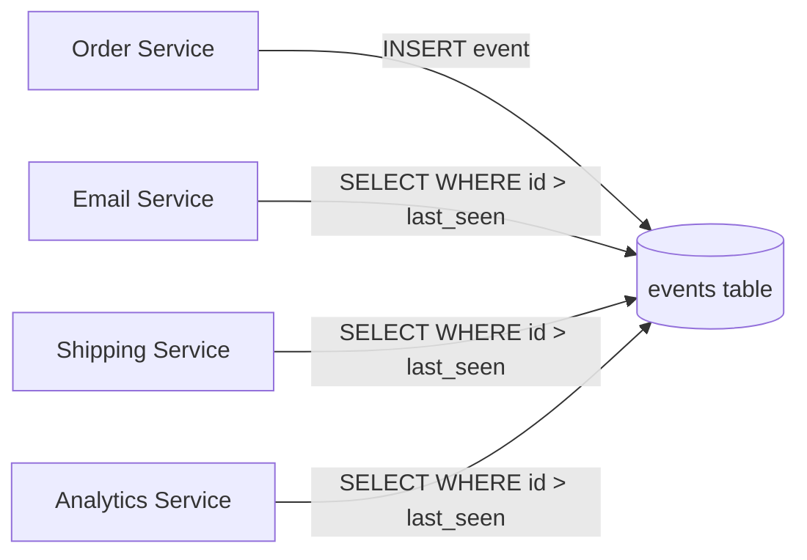

**What the diagram shows:** a single database table acting as the message channel. Producers `INSERT`. Each consumer remembers the last event ID it processed and periodically asks for anything newer.

**Why it works — and it genuinely does at small scale:** The database gives us durability for free (the event is on disk the moment it's committed). It gives us ordering for free (auto-incrementing IDs). Consumers are decoupled from the producer — the order service doesn't even know who's listening. And each consumer tracks its own progress with a single number, so a consumer can crash, restart, and pick up exactly where it left off.

Honestly, for a startup, *this is a perfectly good design.* Don't let anyone shame you for it. Many successful companies ran on a database table as a queue for years. The "transactional outbox" pattern, which serious systems still use today, is exactly this idea.

So why does the rest of this chapter exist? Because we said *Black Friday.* Let's turn up the dial.

## 3. It Starts Breaking

Traffic grows from thousands to millions of events per hour. Now watch the cracks appear, one by one.

**The polling stampede.** We have 30 consumer services, each polling the `events` table every second. That's a flood of `SELECT ... WHERE id > ?` queries hammering the same table that's also trying to accept millions of `INSERT`s. The reads and writes fight over the same locks and the same disk. Your database CPU pins at 100%.

**The table that never stops growing.** Events keep coming and nothing deletes them. The table hits hundreds of millions of rows. Indexes bloat. That once-instant `SELECT` now takes seconds.

**The slow consumer poisons everyone.** The analytics service does heavy processing per event and falls behind. But it's reading the *same table* as everyone else, so its long-running queries hold locks and slow down the email service too. One slow consumer just degraded an unrelated one.

**The single machine ceiling.** All of this lives on one database server. You can buy a bigger machine — for a while. But there is a biggest machine, and Black Friday will exceed it. Worse, that one machine is a single point of failure: if it dies, *every* event-driven feature in the company stops at once.

**Ordering vs. throughput collide.** You try to speed up consumers by running ten copies of the email service in parallel. But now they're all reading the same table and racing each other — two of them grab the same event, the customer gets two emails, and the "process in order" guarantee you got for free is gone.

Feel the shape of the pain: **one shared resource, doing too much, for too many, with no way to spread the load.** Every fix from here on is about spreading that load while *keeping the guarantees we got for free* — durability, ordering, and per-consumer progress tracking.

## 4. Evolving the Architecture

Let's evolve deliberately. Each step solves one specific pain from above.

### Step 1: Separate the log from the database

The first realization: we're abusing a database. A database is built for *random reads and updates of mutable rows.* But our events are never updated. They're only appended and read in order. We're paying for a Ferrari to drive in a straight line.

So we build a purpose-built thing: an **append-only log**. Writes only ever go to the end. Reads are sequential scans from some offset. This is dramatically faster than a B-tree database because appending to the end of a file and reading sequentially is the single thing spinning disks *and* SSDs do best — no random seeks.

Each event gets an **offset**: its position in the log, 0, 1, 2, 3... Sound familiar? It's the auto-increment ID, but now it's the heart of the design.

A consumer's entire state is one number: "I have processed up to offset N." This is the same idea as before, but now it's explicit and cheap.

### Step 2: Partition the log to break the single-machine ceiling

One log on one machine still has a throughput ceiling. The fix is the most important idea in the whole chapter: **partitioning** (also called sharding).

Instead of one log, we split the topic into N independent logs called **partitions**. Each partition lives on a (potentially) different machine called a **broker**. A topic with 12 partitions can be spread across 12 machines, giving us roughly 12× the throughput.

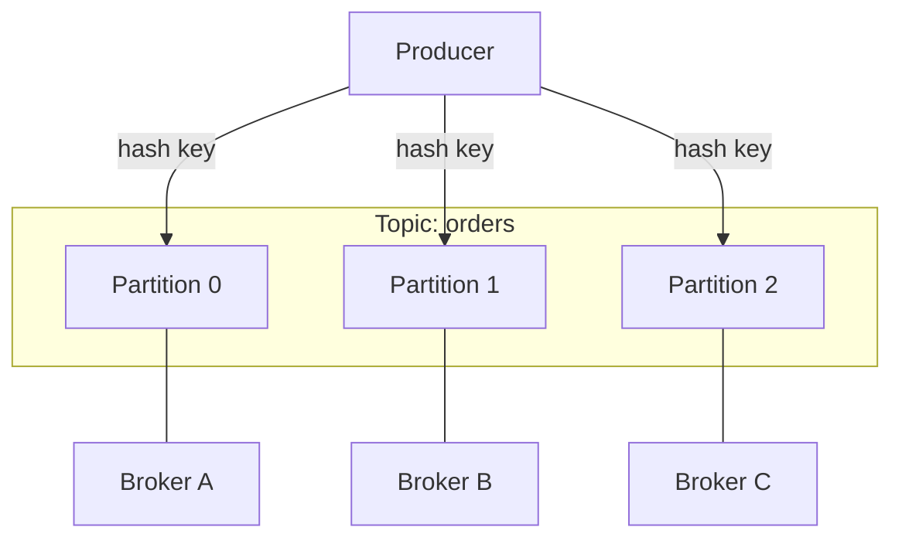

**What the diagram shows:** a single topic `orders` split into three partitions, each hosted on a different broker. The producer decides which partition each event goes to.

**How does the producer choose a partition?** It hashes a **key**. For orders, the natural key is `customer_id`. `hash(customer_id) % 3` picks the partition. This choice has a profound consequence we'll unpack in the deep dive: *all events for the same customer always land in the same partition.*

**The tradeoff we just introduced** (and you must say this sentence in interviews): Kafka gives you ordering **within a partition**, but **not across partitions.** We traded global ordering for scalability. For most real systems that's a great trade — you rarely need "all orders ever, globally ordered," but you very often need "all events for *this one customer* in order," and partitioning by customer gives you exactly that.

### Step 3: Replicate each partition so a dead machine doesn't lose data

Now Broker B catches fire. Partition 1 is gone, and every event in it is lost. Unacceptable.

The fix: **replication.** Each partition is stored on multiple brokers. One copy is the **leader**; the others are **followers** (replicas). All reads and writes go to the leader; followers continuously copy the leader's log.

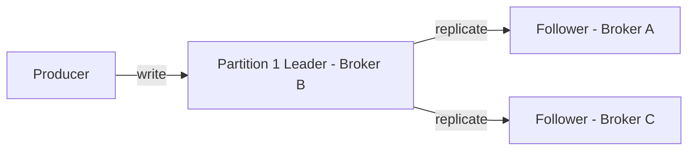

If Broker B dies, one of the followers is promoted to leader and the partition keeps serving. We typically keep a **replication factor of 3** — survive one failure comfortably, even two in a pinch.

**The new problem this creates:** when is a write "safe"? If the leader says "got it!" before followers have copied the data, and the leader then dies, the data vanishes. This is the question that forces us into the deep dive.

### Step 4: Coordinate the cluster

Who decides which broker is the leader for each partition? Who notices when a broker dies and triggers a new leader election? You need a brain for the cluster — a **coordination service**. Historically Kafka used ZooKeeper for this; modern Kafka uses a built-in Raft-based controller (KRaft). Either way, the job is the same: maintain agreed-upon, consistent metadata about who leads what, even as machines come and go. (We devote an entire later chapter to how a distributed lock/coordination service like this works internally.)

## 5. Deep Dive

Three ideas are the soul of this system. Let's go deep.

### Deep Dive A: Consumer groups — scaling reads without chaos

Remember the disaster where we ran ten copies of the email service and customers got duplicate emails? Here's the elegant fix.

Consumers join a named **consumer group**. Kafka guarantees that within a group, **each partition is assigned to exactly one consumer.** So if topic `orders` has 12 partitions and the email group has 4 consumers, each consumer is handed 3 partitions, and no event is processed twice within the group.

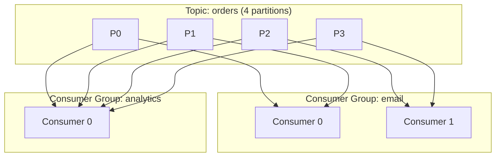

**What the diagram shows:** the same four partitions feeding *two different groups.* Within the email group, the four partitions are split across two consumers. The analytics group is completely separate — it gets *its own copy* of every event, and tracks *its own* offsets.

This is the whole magic. **Different teams (groups) read the same data independently and at their own pace.** The analytics service falling behind no longer affects the email service at all — they don't share a cursor, they don't share a query, they don't even know about each other. Compare that to Chapter 3, where a slow consumer poisoned everyone. *That* pain is now gone.

**Scaling rule, and a classic interview trap:** you can have at most as many *active* consumers in a group as there are partitions. 12 partitions, 20 consumers → 8 sit idle. This is why you choose partition count carefully up front — it's the ceiling on your consumer parallelism. Many engineers over-partition slightly to leave room to scale consumers later.

**Rebalancing:** when a consumer joins or dies, the group **rebalances** — partitions are reshuffled among the survivors. This is necessary but disruptive: during a rebalance, processing briefly pauses. A common production headache is "rebalance storms" where consumers flap and the group never settles.

### Deep Dive B: When is a write durable? The ISR and `acks`

Back to the question replication forced on us. The producer can choose how safe it wants a write to be, via `acks`:

- `acks=0` — fire and forget. The producer doesn't even wait for the leader. Fastest, and you *will* lose data. Fine for, say, click-tracking where a few lost events don't matter.
- `acks=1` — wait for the leader to write it. Better. But if the leader dies before followers copy it, that write is gone.
- `acks=all` — wait until all **in-sync replicas** have the data. Slowest, safest.

That phrase **in-sync replicas (ISR)** is the key. The ISR is the set of replicas that are currently caught up with the leader. With `acks=all`, the leader only acknowledges once every ISR member has the record. Now even if the leader dies, a follower that's promoted is guaranteed to have the data.

But there's a subtle trap. What if followers fall behind and drop out of the ISR, leaving just the leader? Then `acks=all` is secretly `acks=1` again. So you also set `min.insync.replicas=2`: "refuse the write unless at least 2 replicas are in sync." If too many replicas are down, the producer gets an error rather than silently losing durability.

**Notice the tradeoff we just made explicit:** this is the CAP theorem, live. With `min.insync.replicas=2`, if you can't reach 2 replicas, you **reject writes** — you chose **consistency over availability.** Lower it to 1 and you stay available but risk losing data. There is no setting that gives you both. This single config knob *is* the C-vs-A decision for your pipeline.

### Deep Dive C: Exactly-once — the holy grail and the honest truth

Everyone wants "exactly-once delivery." Let's be precise, because this is where senior engineers separate from juniors.

The default is **at-least-once**: the producer retries on failure, so a message might be written twice. Or a consumer processes an event, crashes before committing its offset, restarts, and processes it again. Duplicates happen.

The other option is **at-most-once**: don't retry, commit offsets early. You'll never double-process, but you might lose events.

**Exactly-once** sounds like the dream. Here's the honest truth: *true* exactly-once *delivery* over a network is impossible (you can never be 100% sure the other side got your message without an ack, and the ack itself can be lost). What systems actually achieve is exactly-once **processing** through two tricks:

1. **Idempotent producers.** Each producer gets an ID and each message a sequence number. If a retry causes a duplicate, the broker recognizes the sequence number and discards it. Duplicates from retries vanish.

2. **Transactions / idempotent consumers.** The consumer makes "process the event" and "commit the offset" a single atomic operation, or it makes its own processing idempotent (e.g., "insert order with this ID, ignore if it already exists"). Then even if it reprocesses, the *effect* happens once.

The deep lesson: **don't chase exactly-once delivery. Make your consumers idempotent and exactly-once processing falls out naturally.** This idea echoes through every chapter in this book — it reappears in Stripe payments, in the cron scheduler, everywhere.

## 6. Production Challenges

**A broker dies during peak traffic.** A leader election fires for every partition that broker led. For a few seconds those partitions are unavailable while followers get promoted. Producers buffer and retry; well-configured clients ride it out invisibly. The danger is if the dead broker held leaders for *many* partitions — the election storm and the sudden replication catch-up load can cascade. Mitigation: spread leadership evenly across brokers (Kafka does this automatically, but operators monitor it).

**Consumer lag — the metric you live by.** "Lag" is how far behind a consumer group is: `latest offset − committed offset`. Rising lag means consumers can't keep up. This is the single most important Kafka metric in production. You alert on it. When lag explodes on Black Friday, your options are: add consumers (up to the partition limit), make processing faster, or scale out partitions (painful — see below).

**You can't easily reduce partitions.** Adding partitions is possible but it breaks key-based ordering (because `hash(key) % N` now maps to a different partition). Reducing them isn't supported. So partition count is a semi-permanent decision. Operators agonize over it. A good rule: estimate peak throughput, divide by per-partition throughput, then multiply by a healthy growth factor.

**Retention and disk.** The log isn't infinite. You configure retention — e.g., "keep 7 days" or "keep 100GB per partition." Old segments are deleted. Get this wrong and either you blow up disks or you delete data a slow consumer hadn't read yet.

**An entire region goes down.** Single-cluster Kafka lives in one region. For disaster recovery you replicate to a second region (MirrorMaker 2, or Confluent's Cluster Linking). But cross-region replication is asynchronous — so a regional failure means some recent events that hadn't replicated yet are lost or delayed. You accept a small RPO (recovery point objective) in exchange for surviving a region loss.

## 7. Tradeoffs

**Kafka vs. RabbitMQ — the canonical comparison.**

RabbitMQ is a *traditional message broker*: messages are pushed to consumers and *deleted once acknowledged.* It excels at complex routing (topic exchanges, fanout, per-message TTL, priority queues) and per-message acknowledgment. Think "smart broker, dumb consumer."

Kafka is a *distributed log*: messages are *retained* regardless of consumption, and consumers pull at their own pace and track their own offsets. Think "dumb broker, smart consumer." That retention is why Kafka can replay history, feed multiple independent consumer groups, and hit millions of messages/sec.

The rule of thumb:
- Need a **task queue** with complex routing, priorities, and "process this job then delete it"? RabbitMQ (or SQS) fits more naturally.
- Need a **high-throughput event stream** that many teams replay independently and that doubles as a source of truth? Kafka.

**Log retention vs. queue semantics.** Kafka's "keep everything for N days" enables replay and multiple consumers — but costs storage and means a buggy consumer can reprocess a week of data. A delete-on-ack queue is leaner but a message read once is gone forever.

**Ordering vs. parallelism.** More partitions = more parallelism but weaker ordering guarantees (only within-partition). Fewer partitions = stronger ordering but a lower throughput ceiling. You can't max both.

**Latency vs. durability.** `acks=all` + `min.insync.replicas=2` is durable but slower. `acks=1` is faster but riskier. The right answer depends entirely on the data: payments demand durability, click-streams tolerate loss.

There is no perfect setting. There's only "correct for *this* data's value."

## 8. How Large Companies Solve It

**LinkedIn** built Kafka in the first place, precisely because they had the "N services need M event streams" explosion and their databases couldn't take it. The lesson they paid for: treat the **log as the source of truth**, and let every other system be a *materialized view* derived from it. This idea — the log as the central, replayable ground truth — is one of the most influential ideas in modern data engineering (Jay Kreps' "the Log" essay is the canonical read).

**Uber** runs some of the largest Kafka deployments on earth, moving trillions of messages a day for everything from trip events to surge pricing. Their hard-won lesson: at that scale, **regional isolation and tiered storage** matter enormously — they offload old log segments to cheaper object storage so brokers aren't bottlenecked by local disk.

**Netflix** uses Kafka as the backbone of its data pipeline (Keystone), routing application and operational events into stream processors and data stores. Their lesson: invest heavily in **self-service and automation** — when thousands of engineers create topics, you cannot manage partitions and retention by hand.

The common thread: none of these companies treat the queue as a dumb pipe. They treat the log as **infrastructure as fundamental as the database**, and they build tooling, governance, and automation around it accordingly.

## 9. Interview Discussion

**Questions you'll get:** "Design a distributed message queue / Kafka." "How does Kafka guarantee ordering?" "How does Kafka achieve high throughput?" "Explain exactly-once."

**Strong answer beats:** Lead with partitioning as the scalability mechanism and immediately name its cost (ordering only within a partition). Explain consumer groups as the read-scaling and isolation mechanism. Explain replication + ISR + `acks` as the durability mechanism, and connect `min.insync.replicas` explicitly to CAP. On exactly-once, say the honest thing: "exactly-once *delivery* is effectively impossible; we achieve exactly-once *processing* via idempotent producers and idempotent/transactional consumers."

**Common mistakes:** Claiming Kafka gives global ordering (it doesn't). Saying "Kafka guarantees exactly-once" without nuance. Forgetting that consumer parallelism is capped by partition count. Treating Kafka like RabbitMQ (push/delete) when it's pull/retain.

**Senior-level signals:** Talking about consumer lag as the operational heartbeat. Discussing rebalancing pain. Bringing up the transactional outbox pattern for reliably getting events *into* Kafka from your database (the dual-write problem). Naming the partition-count decision as semi-permanent and explaining how you'd size it.

**Killer follow-up to be ready for:** "Your producer writes to Postgres *and* publishes to Kafka. The DB commit succeeds but the Kafka publish fails. Now your DB and your event stream disagree. How do you fix it?" The answer — the **transactional outbox** + a relay (or change-data-capture via Debezium) — is the bridge from this chapter back to your everyday Spring Boot world. Have it ready.

---
---

# Chapter 2 — A Distributed Pub/Sub Platform

## 1. Understanding the Problem

Chapter 1 gave us a durable log that teams read at their own pace. But sometimes you don't want a *log* — you want a *megaphone.*

Imagine a ride-sharing app. A driver's phone reports its GPS location every few seconds. Who cares about that location? The rider watching the car approach on a map. The pricing engine computing surge. The ETA service. The fraud system checking the route makes sense. And tomorrow, three teams you haven't met yet will also care.

The driver's phone has no idea who's listening, and it shouldn't have to. It just shouts "I'm at this corner!" into the void. Anyone interested subscribes to that shout. This is **publish/subscribe**: publishers emit messages to *topics*, and any number of subscribers receive them — fully decoupled, fan-out by design.

The difference from Chapter 1 is one of emphasis. Kafka is pub/sub that *remembers* (a log). A pure pub/sub platform — Google Pub/Sub, AWS SNS, MQTT brokers, Redis pub/sub — is often optimized for *fan-out to many subscribers right now,* sometimes to enormous numbers of them (think: pushing a notification to 10 million phones), and frequently with looser delivery guarantees.

**Why it's hard:** The fan-out itself. One published message might need to reach a million subscribers. That's an *amplification* problem — one in, a million out — and naive designs melt.

## 2. The Simplest Version

Small scale. We keep an in-memory map: `topic → list of subscriber connections`. A publisher sends a message; we loop over the subscriber list and push to each.

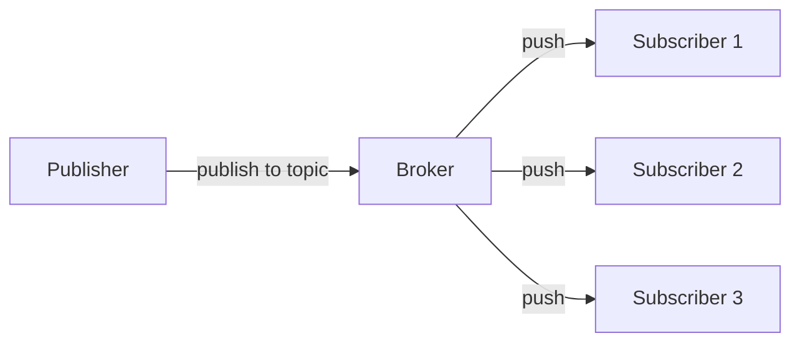

**What it shows:** a single broker holding subscriptions in memory and pushing each message to everyone subscribed. This is literally Redis pub/sub or a small WebSocket server. For a chat room or a dashboard with a few hundred listeners, it's perfect — sub-millisecond fan-out, trivial to build.

It works because everything fits on one box and nobody's keeping state. There's no log, no offsets, no disk. A message arrives, gets sprayed out, and is forgotten.

## 3. It Starts Breaking

**The fan-out explosion.** A breaking-news topic has 5 million subscribers. One publish means 5 million sends *from a single broker.* The CPU and the network card on that one machine cannot physically do it. Latency balloons; the broker falls over.

**Slow subscribers back up the system.** One subscriber is on a flaky mobile connection and reads slowly. If the broker waits for it, *everyone* waits. If the broker buffers for it, memory grows unbounded.

**Lost messages.** A subscriber's connection blips for two seconds during a publish. With pure in-memory pub/sub, those messages are simply *gone* — there's no log to replay from. For "driver moved 10 meters," fine. For "your payment failed," catastrophic.

**The single broker is a single point of failure.** It dies, every subscription evaporates, every client must reconnect and re-subscribe simultaneously — a thundering herd that knocks over whatever they reconnect to.

## 4. Evolving the Architecture

### Step 1: A tier of broker nodes + a subscription registry

We add many broker nodes behind a load balancer and a shared registry (often backed by a coordination service) that knows which broker holds which subscriptions. Publishers hit any broker; that broker routes to the brokers holding the relevant subscribers.

### Step 2: Fan-out trees for massive subscriber counts

Here's the key idea for the amplification problem: **don't fan out from one node.** Arrange brokers in a *tree.* The publish goes to a root broker, which forwards to a handful of mid-tier brokers, each of which forwards to more, until the leaves push to actual subscribers. A million-way fan-out becomes many small, parallel fan-outs.

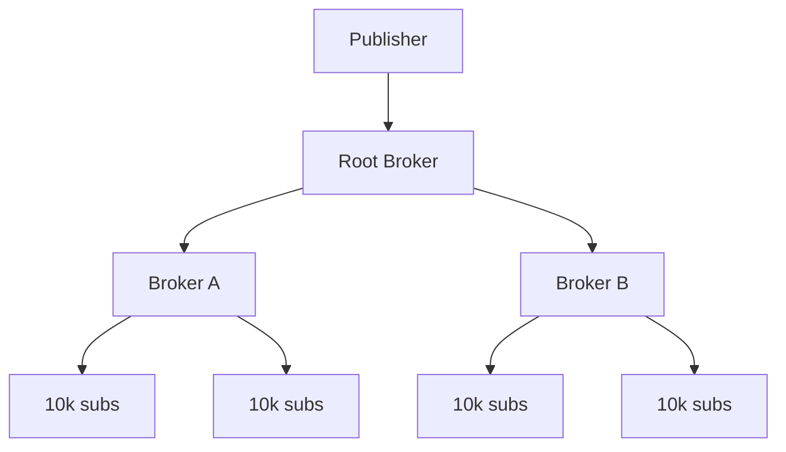

**What it shows:** the load of fan-out distributed across a tree so no single node sends a million messages. Each node does a bounded amount of work. This is how systems push to millions of devices.

### Step 3: Decouple slow subscribers with per-subscriber queues

Give each subscriber (or subscription) its **own buffer**. The broker writes to the buffer and moves on; a slow subscriber drains its own buffer at its own speed and can't block others. When a buffer overflows, you choose a policy: drop oldest, drop newest, or disconnect. *That choice is a product decision* — for live GPS, drop old positions (you only want the latest); for alerts, never drop.

### Step 4: Add optional durability for the messages that matter

For topics that can't tolerate loss, back the subscription with a small per-subscriber log (offsets again!) or push to a durable queue. Now a brief disconnect is recoverable. Notice we've quietly rebuilt a piece of Chapter 1 — *because the moment you need "don't lose it," you need a log.* This is the natural boundary where pub/sub and Kafka converge.

## 5. Deep Dive

### Deep Dive A: Push vs. pull, and the slow-consumer problem

Kafka is **pull** (consumers ask for data when ready), which inherently protects the broker from slow consumers — they just pull slower. Classic pub/sub is **push** (broker sends proactively), which gives lower latency but exposes the broker to slow/absent subscribers. The per-subscriber buffer + overflow policy is how push systems survive. Google Pub/Sub cleverly offers both: a push mode (it POSTs to your endpoint) and a pull mode (you ask), letting you pick based on whether latency or backpressure control matters more.

### Deep Dive B: Delivery guarantees and the dedup burden

Most large pub/sub systems guarantee **at-least-once** delivery: to make sure you *get* the message, they may send it twice. The consequence lands on *you*: subscribers must be **idempotent** (there's that word again from Chapter 1). The platform often helps by attaching a unique `message_id` so you can dedup. The lesson repeats and will keep repeating: in distributed systems, *the receiver owning idempotency is almost always cheaper and more correct than the sender guaranteeing exactly-once.*

### Deep Dive C: Topics vs. subscriptions — the decoupling that scales teams

The clean model (SNS→SQS, Google Pub/Sub) separates the **topic** (what publishers emit to) from the **subscription** (a named consumer's view). Each subscription gets its own copy and its own backlog. A new team adds a subscription without touching the publisher or any existing subscriber. This is the same independence consumer groups gave us in Kafka — and it's *the* feature that lets a pub/sub system scale organizationally, not just technically.

## 6. Production Challenges

**Reconnection storms.** When a broker dies, thousands of clients reconnect at once. Mitigate with jittered exponential backoff on clients and connection-rate limiting on brokers. (We'll see thundering herds again in the config and service-discovery chapters — it's a recurring villain.)

**Backlog growth on offline subscribers.** A subscriber goes offline for an hour; its durable backlog grows. You need retention limits and dead-letter handling so one absent subscriber doesn't fill disks forever.

**Hot topics.** A celebrity tweets; one topic gets a billion fan-outs. You need per-topic isolation so a hot topic can't starve the rest — dedicated broker tiers or rate limits.

## 7. Tradeoffs

**Pub/Sub vs. Kafka.** Pub/Sub (push, often ephemeral, huge fan-out) optimizes for *reaching many subscribers now.* Kafka (pull, durable log) optimizes for *durable, replayable streams.* Need to notify 10M phones? Pub/Sub. Need a replayable event backbone? Kafka. They overlap in the middle, which is why Google Pub/Sub and Kafka are sometimes pitted against each other — but their centers of gravity differ.

**Push vs. pull.** Push = low latency, broker bears backpressure risk. Pull = natural backpressure, slightly higher latency. 

**Ephemeral vs. durable.** Ephemeral is cheap and fast and loses data on disconnect. Durable survives disconnects but costs storage and complexity. Match it to the data's value.

## 8. How Large Companies Solve It

**Google** runs Pub/Sub as a global, multi-region managed service — its lesson is that **global ordering and exactly-once are expensive add-ons**, off by default, that you opt into per-subscription only when you truly need them. Most topics don't.

**Discord and Slack** push real-time messages to millions of connected clients and lean heavily on **fan-out trees and consistent-hashing of sessions to gateway nodes**, plus aggressive per-connection buffering. Their lesson: the connection layer (millions of live WebSockets) is its own hard problem, separate from the messaging layer.

**MQTT brokers** (used in IoT, where millions of low-power devices publish telemetry) teach the lesson that **subscription wildcards and QoS levels** (0 = at-most-once, 1 = at-least-once, 2 = exactly-once-ish) let each device pick its own cost/reliability tradeoff per message.

## 9. Interview Discussion

**Questions:** "Design a notification fan-out system / pub-sub for millions of subscribers." "How do you push to 10 million devices?"

**Strong answer:** Lead with the fan-out tree for amplification, per-subscriber buffers for slow-consumer isolation, and at-least-once + idempotent subscribers for reliability. Distinguish push vs. pull explicitly. Mention durability as an *optional* layer for topics that need it.

**Common mistakes:** Fanning out from a single node. Forgetting backpressure (slow subscribers). Assuming exactly-once. Ignoring the reconnection storm.

**Senior signals:** Naming the topic-vs-subscription decoupling as the organizational scaling lever; discussing overflow policy as a product decision; connecting the durable variant back to Kafka and admitting where the two systems converge.

---
---

# Chapter 3 — A Stream Processing Platform

## 1. Understanding the Problem

We now have rivers of events flowing through Kafka (Chapter 1). But a river of raw events isn't an *answer.* Someone has to stand in the river and compute things from it *as it flows.*

Concrete example: fraud detection. Events stream in — "card swiped in New York," then 90 seconds later "same card swiped in Tokyo." Individually, both are boring. The *pattern across them, in a time window,* is the fraud. You need to compute "how many transactions has this card made in the last 5 minutes, and in how many countries?" — continuously, on a never-ending stream, with answers in milliseconds.

Or: a live dashboard showing "orders per minute, per region, updating every second." Or: enriching each click event with user profile data before it lands in a warehouse.

This is **stream processing** — frameworks like Kafka Streams, Apache Flink, and Spark Structured Streaming. The defining challenge: **computing over data that never ends, where the answer must keep updating, and where events arrive late, out of order, and sometimes twice.**

## 2. The Simplest Version

Small scale: a single consumer (Chapter 1!) reads events and keeps running totals in a local `HashMap`. "Count per region" is just `map.merge(region, 1, Integer::sum)` on each event.

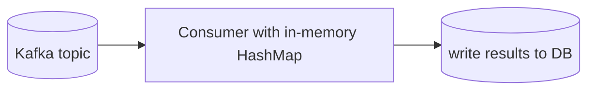

It genuinely works. A single process tallying counts in memory and periodically flushing to a database handles a surprising amount of load. This is where most "real-time analytics" features start, and they're fine until the numbers get big.

## 3. It Starts Breaking

**State doesn't fit in memory.** "Count per *user*" across 200 million users won't fit in one process's heap.

**The process crashes and the counts vanish.** Your `HashMap` was in memory. Restart, and every running total is zero. You've lost hours of aggregation. Reprocessing from the start of the Kafka log takes hours and gives wrong intermediate answers.

**Out-of-order and late events wreck windows.** You're counting "orders per minute." An event timestamped 10:00:59 arrives at 10:01:03 — after you already "closed" the 10:00 minute and reported it. Do you reopen it? Drop it? Your dashboard now lies.

**One process can't keep up.** Millions of events/sec exceed a single consumer. You need many — and now the state for "user X" might be on a different machine than the event for "user X."

## 4. Evolving the Architecture

### Step 1: Partition the work the same way Kafka partitions data

Run many processing tasks, one per Kafka partition. Because Kafka already partitions by key (say, `user_id`), *all events for a given user land on the same partition, hence the same task, hence the same local state.* The partitioning we did in Chapter 1 pays off again: it co-locates each key's events with that key's state. This is the foundational trick of stream processing — **state is partitioned by key, aligned with the input.**

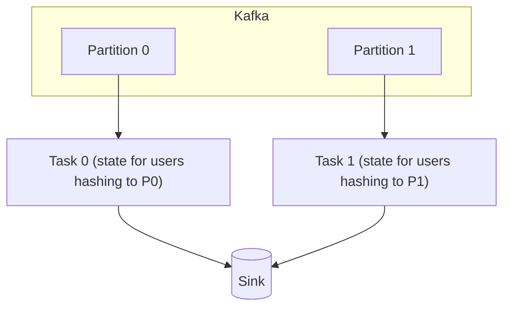

### Step 2: Make state durable with a changelog

To survive crashes, each task keeps its state in a local embedded store (RocksDB) **and** writes every state change to a Kafka "changelog" topic. If the task dies and restarts elsewhere, it rebuilds its state by replaying the changelog. The log saves us *again* — state recovery is just log replay. Flink takes a different but related route: periodic **checkpoints** of all state to durable storage (more on that below).

### Step 3: Handle time properly — event time, watermarks, windows

This is the heart of stream processing, so it gets the deep dive. The short version: stop trusting wall-clock arrival time; use the time *in the event itself,* and use **watermarks** to decide when a window is "probably complete."

## 5. Deep Dive

### Deep Dive A: Event time vs. processing time, and watermarks

There are two clocks. **Processing time** is when your system sees the event. **Event time** is when the thing actually happened (a timestamp inside the event). They differ because of network delays, mobile devices that were offline, retries, and partition skew.

If you window by *processing time*, your "10:00–10:01 orders" bucket contains whatever happened to arrive in that wall-clock minute — which is meaningless and non-reproducible. If you window by *event time*, the bucket contains events that *actually occurred* in that minute — correct and reproducible. So serious stream processing windows by event time.

But event time creates a question: **"when can I close the 10:00 window and report it, if late events might still trickle in?"** You can't wait forever. The answer is a **watermark**: a moving assertion that says "I believe I've now seen all events up to time T." When the watermark passes 10:01, you close the 10:00 window and emit the result. Late events after that are handled by a separate policy: drop them, or emit a correction.

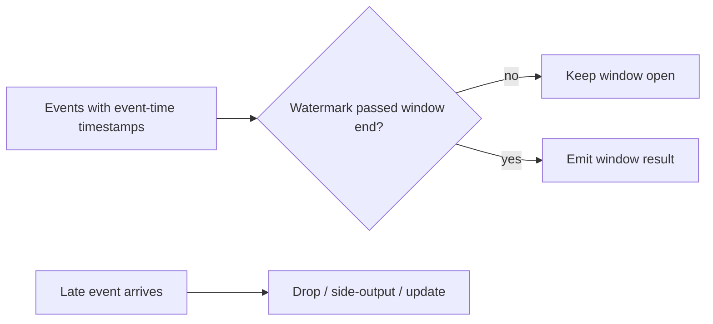

**The tradeoff, stated plainly:** a *conservative* watermark (wait longer) catches more late events → more accurate, higher latency. An *aggressive* watermark (close fast) → lower latency, more late-arrivals dropped. This latency-vs-completeness dial is the central tuning decision in every streaming system. There is no correct setting — only correct *for your tolerance.*

### Deep Dive B: Exactly-once processing in a stream

Remember from Chapter 1: exactly-once *delivery* is a myth, exactly-once *processing* (correct effect) is achievable. Streaming systems achieve it by making "advance my input offset," "update my state," and "write my output" a single atomic unit.

Flink does this with **distributed checkpoints** (the Chandy-Lamport algorithm): periodically a "barrier" flows through the entire processing graph; when it passes, every operator snapshots its state to durable storage *consistently.* On failure, the whole job rewinds to the last checkpoint — input offsets, state, and all — and replays. Combined with transactional/idempotent sinks, the *effect* is exactly-once. Kafka Streams achieves the analogous thing using Kafka transactions across the input offset, the changelog, and the output topic.

The recurring lesson: **exactly-once = atomically tie your progress, your state, and your output together, so a replay can't produce a different result.**

### Deep Dive C: Stateful joins and windows

Streaming isn't just counting. You join two streams — "match each ad-click to the ad-impression that preceded it within 30 minutes." That requires buffering one stream's events in keyed, windowed state until the other side's matching event arrives or the window expires. This is why robust state management (RocksDB + changelog/checkpoints) is non-negotiable: the state can be huge and must survive failures.

## 6. Production Challenges

**Restart/recovery time.** A job with terabytes of state can take many minutes to restore from changelog/checkpoint after a crash. Operators tune checkpoint frequency (more frequent = faster recovery but more overhead) and use incremental checkpoints.

**Backpressure.** A slow sink (say, the database you're writing results to) slows the operators feeding it, which slows the source. Good frameworks propagate backpressure cleanly so nothing buffers unboundedly; you monitor it as a first-class health signal.

**State skew / hot keys.** One celebrity user generates 1000× the events. That key's partition/task becomes a hotspot. Mitigations: pre-aggregate hot keys, add salting, or use two-stage aggregation.

**Reprocessing / schema changes.** You found a bug in your logic. To fix history you replay from Kafka — but your new code must coexist with old state, or you run a fresh job in parallel and switch over. This is operationally delicate.

## 7. Tradeoffs

**Batch vs. stream.** Batch (Spark, nightly jobs) processes bounded chunks: simpler, easy to reprocess, high latency (minutes to hours). Stream processes continuously: low latency, but harder state and time semantics. The honest senior take: *use batch unless you genuinely need fresh-by-the-second answers* — streaming's operational cost is real. Many "real-time" requirements are satisfied by micro-batches every few minutes.

**Micro-batch vs. true streaming.** Spark Structured Streaming processes tiny batches (simpler, slightly higher latency); Flink processes event-at-a-time (lower latency, more complex). 

**Latency vs. completeness.** The watermark dial, as above.

**Local state (RocksDB) vs. external store.** Local state is fast but needs changelog/checkpoint machinery. An external store (Redis/Cassandra) is simpler conceptually but adds a network hop per event and its own failure modes.

## 8. How Large Companies Solve It

**Netflix and Uber** run Flink at massive scale for real-time features (recommendations, surge, fraud). Their lesson: **checkpointing and state backend tuning dominate operations** — the compute is easy; keeping terabytes of state correct and recoverable is the hard part.

**LinkedIn** built Samza and pioneered the idea (with Kafka) that **stream processing is just consuming a log and writing back to a log** — keeping the model uniform and replayable.

**The "Kappa architecture"** (popularized by Jay Kreps) is the lesson distilled: instead of maintaining separate batch and streaming pipelines (the older "Lambda architecture"), keep *one* streaming pipeline and just *replay the log* when you need to reprocess history. Fewer moving parts, one source of truth.

## 9. Interview Discussion

**Questions:** "Design a real-time analytics / fraud detection pipeline." "How do you handle late and out-of-order events?" "How do you make stream processing fault-tolerant?"

**Strong answer:** Partition state by key aligned with the input. Use event time + watermarks for correct windows, and name the latency/completeness tradeoff. Achieve fault tolerance via checkpointing/changelog + replay, and exactly-once by atomically binding offset+state+output.

**Common mistakes:** Windowing by processing time. Ignoring late events. Storing state only in memory. Claiming exactly-once without explaining the mechanism. Reaching for streaming when batch would do.

**Senior signals:** Discussing watermarks and the latency/completeness dial; explaining checkpoint/recovery cost; raising hot-key skew; recommending batch when streaming isn't justified; referencing Lambda vs. Kappa.

---
---

# Chapter 4 — A Distributed Lock Service

## 1. Understanding the Problem

Here's a deceptively simple requirement: **"only one instance of this job should run at a time."**

Concretely: you run a nightly billing job. For redundancy you deploy three copies of the service across three machines. At midnight, a cron fires on all three. Now three copies are charging every customer — *triple billing.* You need exactly one to win and the other two to stand down.

On a single machine this is trivial: `synchronized`, a mutex, a database row lock. Java hands you locks for free. But those locks live *inside one process or one database.* The moment your three copies are separate processes on separate machines, there is no shared `synchronized` block. You need a lock that lives *outside* all of them — a **distributed lock.**

The use cases are everywhere once you see them: leader election ("who's the primary?"), preventing duplicate work, rate-limiting a shared resource, coordinating a rolling deploy. Tools that provide this: ZooKeeper, etcd, Consul, and (carefully) Redis.

**Why it's brutally hard:** A distributed lock must answer "who holds the lock?" *correctly even when machines crash mid-hold, networks partition, and clocks drift.* What happens when the lock holder freezes for 30 seconds (a GC pause!) and everyone assumes it's dead? This question — and its terrifying answer — is the soul of the chapter.

## 2. The Simplest Version

One database. To take the lock, `INSERT` a row with a unique key `lock_name = 'billing'`. The unique constraint means only one inserter wins; the rest get a constraint violation and back off. To release, `DELETE` the row.

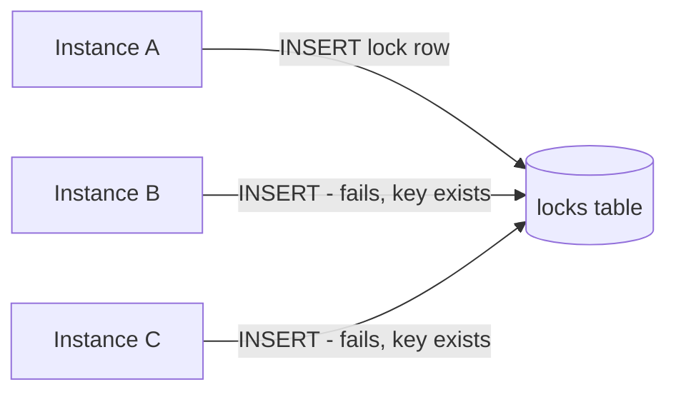

Instance A wins, runs the billing job, deletes the row when done. B and C lost and stood down. **This works,** and for many real systems a database row *is* the correct lock — don't over-engineer.

## 3. It Starts Breaking

**The holder dies and never releases.** Instance A grabs the lock, then crashes before `DELETE`. The row stays forever. Billing never runs again. We need locks that *expire* — a lease with a TTL.

**TTLs introduce a far scarier bug.** Say the lock auto-expires after 30s. Instance A grabs it and starts billing. But A hits a 35-second stop-the-world GC pause. At second 30, the lock expires; Instance B grabs it and *also starts billing.* At second 35, A wakes up, with no idea it ever lost the lock, and *finishes billing.* **Two holders at once.** This is the central nightmare of distributed locking and it cannot be fully eliminated — only defended against (deep dive).

**The lock database is a single point of failure.** If that DB is down, *nobody* can coordinate. The lock service must itself be highly available — which means replicated — which means... it needs to agree with itself about who holds the lock even when its own nodes fail. We've recursed into the hardest problem in distributed systems: **agreement.**

## 4. Evolving the Architecture

### Step 1: Leases with TTLs and fencing tokens

Locks become **leases** that auto-expire, and crucially, each lock grant comes with a monotonically increasing **fencing token** — a number that goes up by one every time the lock is granted. We'll see in the deep dive how this single integer defuses the GC-pause nightmare.

### Step 2: Replicate the lock service with consensus

A single lock DB can't be the SPOF. We replicate across (typically) 3 or 5 nodes. But replicas must *agree* on lock state — and "agree, despite failures" is exactly what a **consensus algorithm** (Raft or Paxos) provides. This is why real lock services (ZooKeeper, etcd) are built on consensus engines (ZAB, Raft). Consensus is the bedrock, so it gets the deep dive.

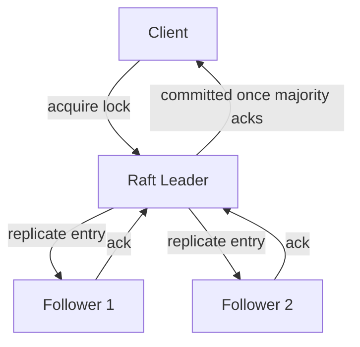

## 5. Deep Dive

### Deep Dive A: Consensus and quorums — how machines agree despite failures

The core problem: five machines, each can crash or be unreachable, the network can delay or drop messages — and yet they must all agree on a single sequence of decisions (like "lock granted to A at token 7"). 

**Raft** (the most teachable consensus algorithm) solves it like this. One node is elected **leader**. All writes go to the leader. The leader appends the write to its log and sends it to followers. Here's the key: the write is **committed only once a majority (a quorum) has acknowledged it.** With 5 nodes, a quorum is 3. With 3 nodes, it's 2.

Why a *majority*? Because **any two majorities of the same cluster must overlap in at least one node.** That overlap is what prevents two different "truths" from being committed. If the network splits the cluster into a group of 2 and a group of 3, only the group of 3 has a quorum and can make progress; the group of 2 *cannot* (it can't reach a majority), so it refuses writes. There is no way for both sides to act — which is precisely how "split-brain" is prevented.

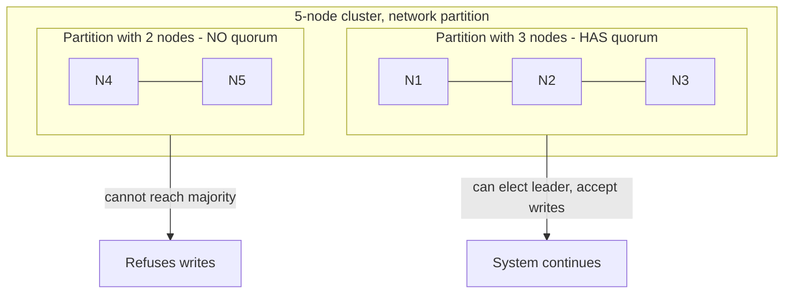

**The CAP consequence, made concrete:** when partitioned, the minority side *stops serving* to stay correct. The lock service chooses **consistency over availability** (CP). That's the right call for a lock — a lock that's "available but maybe wrong" is worse than useless. This is why you tolerate `(N-1)/2` failures: 5 nodes survive 2 failures, 3 nodes survive 1. More nodes = more fault tolerance but *slower* writes (bigger quorum to wait for). Five is the common sweet spot.

### Deep Dive B: Fencing tokens — defusing the GC-pause nightmare

Consensus makes the lock service itself correct, but it does *not* solve the "A pauses, lease expires, B acquires, A wakes up and acts" problem — because that bug is on the *client* side, downstream of the lock.

The defense is the **fencing token.** Every lock grant returns a strictly increasing number. When A acquired the lock it got token 33. While A was paused, B acquired it and got token 34. Now A wakes up and tries to write to the protected resource (say, a storage system) stamped with token 33. The resource remembers it has already accepted token 34, so it **rejects the stale token 33.** A's late write is fenced off.

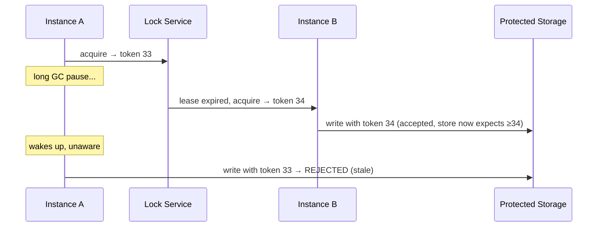

**The crucial lesson** (this is a famous senior interview point, from Martin Kleppmann's critique of Redis's Redlock): *a lock alone cannot guarantee mutual exclusion of side effects across pauses; the protected resource must participate by rejecting stale fencing tokens.* If your downstream resource can't check a token, your distributed lock has a hole no amount of consensus can close.

## 6. Production Challenges

**Lock service down = everything that depends on it stalls.** Because it's CP, a quorum loss halts coordination cluster-wide. Operators run it on dedicated, well-provisioned, low-latency nodes and treat it as critical infrastructure.

**Lease tuning.** Too short a TTL → false expirations under normal GC/network jitter → unnecessary lock churn. Too long → a truly-dead holder blocks others for ages. There's no universally right value; you tune to your workload's pause profile.

**Herd on release.** When a lock frees, every waiter pounces. ZooKeeper's elegant fix: each waiter watches *only the node just ahead of it* in a queue (an ephemeral sequential znode), so a release wakes exactly one waiter, not all of them.

**Clock dependence.** Avoid designs that assume synchronized clocks across machines. Clocks drift. Leases should be measured by the lock service's own clock, and correctness should rest on fencing tokens, not timestamps.

## 7. Tradeoffs

**Redis locks vs. ZooKeeper/etcd locks.** Redis (single-node `SET NX PX` or Redlock across several) is *fast* and simple but offers weaker guarantees: single-node Redis is a SPOF, and Redlock's safety under partitions/clock-skew is famously disputed. ZooKeeper/etcd are consensus-backed, correct under partitions, but higher-latency and operationally heavier. The senior rule: **for efficiency (avoid duplicate work, and a rare double-run is merely wasteful) Redis is fine; for correctness (a double-run causes real damage, like double billing) use a consensus-backed lock *and* fencing tokens.**

**Consistency vs. availability (CP vs. AP).** Lock services choose CP — correctness over uptime. That's correct *for locks*, and exactly the wrong choice for, say, a shopping cart (which wants AP). The choice flows from what the data is *for.*

**Few vs. many nodes.** More nodes = survive more failures but slower (larger quorum). 3 or 5 is standard.

## 8. How Large Companies Solve It

**Google's Chubby** is the original and most influential lock service — Paxos-backed, used internally for leader election and as a tiny, highly-available metadata store. The lesson Google documented: Chubby's *real* usage was overwhelmingly **coarse-grained locks and naming/config**, not fine-grained locking — people wanted a reliable place to elect a leader and store a little critical state, far more than they wanted rapid mutexes.

**Kubernetes** uses **etcd** (Raft) as the single source of truth for all cluster state, and leader election for its controllers — a textbook modern application of consensus.

**Many companies** deliberately *avoid* fine-grained distributed locks where possible, preferring designs that don't need them (idempotency, partitioning by key so each key has one natural owner, optimistic concurrency). The deepest lesson: **the best distributed lock is often the one you designed your way out of needing.**

## 9. Interview Discussion

**Questions:** "Design a distributed lock." "How do you ensure only one node runs a job?" "What's a fencing token?" "Is Redlock safe?"

**Strong answer:** Leases with TTLs to survive crashes; consensus-backed service to survive node failures (explain quorum overlap → no split-brain); fencing tokens to survive client pauses, and stress that the *protected resource must check the token.*

**Common mistakes:** Assuming a TTL alone gives mutual exclusion (the GC-pause bug). Forgetting fencing tokens. Treating Redis Redlock as bulletproof. Ignoring that the lock service must itself be HA.

**Senior signals:** Explaining quorum overlap intuitively; the CP choice and why it's right for locks; the Kleppmann fencing-token argument; and — best of all — proposing to *avoid the lock entirely* via idempotency or single-owner-per-key partitioning.

---
---

# Chapter 5 — A Service Discovery Platform

## 1. Understanding the Problem

In your early career, Service A called Service B at `http://service-b.internal:8080` — a fixed address in a config file. That works when B lives at one stable address forever.

Now picture reality at scale. Service B runs as 50 instances. They're on ephemeral cloud machines and containers that come and go every few minutes — autoscaling spins them up, deploys replace them, crashes kill them. Their IP addresses are *constantly changing.* There is no fixed address to put in a config file. So how does A find a *healthy* instance of B *right now*?

That's **service discovery.** It's a live, always-current registry answering "where are the healthy instances of service X?" Tools: Consul, Eureka, etcd, and the discovery built into Kubernetes (kube-proxy + CoreDNS) and service meshes (Istio/Envoy).

**Why it's hard:** The registry must be *fresh* (an instance that died 2 seconds ago must stop receiving traffic *fast*) yet *not flap* (a brief network blip shouldn't evict a perfectly healthy instance). Freshness vs. stability is a genuine tension, and it gets worse the more instances you have and the faster they churn.

## 2. The Simplest Version

A load balancer with a static list of B's IPs, and a config file in A pointing at the LB. The LB health-checks the backends and removes dead ones.

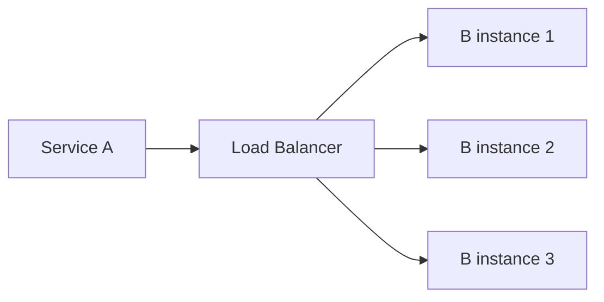

For a handful of long-lived services, this is great — it's how the web worked for two decades. The LB hides B's instances behind one stable address and routes around dead ones. Don't dismiss it; for many architectures a load balancer *is* sufficient service discovery.

## 3. It Starts Breaking

**Manual registration can't keep up.** With instances appearing and vanishing every few minutes across hundreds of services, no human can maintain LB backend lists. It must be automatic — instances must *register themselves* on startup and *deregister* on shutdown.

**Crashes skip deregistration.** An instance that crashes never gets to say "remove me." The registry keeps sending traffic to a corpse. We need active **health checking** and **heartbeats** so the registry notices death on its own.

**The registry becomes critical and central.** Every service now depends on it to find every other service. If it's down or stale, the *whole mesh* can't route. It must be highly available *and* fresh — and (echo of Chapter 4) being HA means replicated means it must agree with itself.

**Staleness vs. flapping bites hard.** Health-check too aggressively and a 1-second GC pause evicts a healthy node, causing needless churn and even cascading evictions. Too leniently and dead nodes linger, black-holing requests. At thousands of instances, getting this dial wrong causes either traffic loss or instability.

## 4. Evolving the Architecture

### Step 1: Self-registration + heartbeats + TTL

On startup, each instance registers `(service=B, ip, port, healthy)` with the registry. It then sends a **heartbeat** every few seconds. The registration carries a **TTL**; miss enough heartbeats and the registry auto-evicts the entry. (Notice: this is the *lease* idea from Chapter 4, reused. Leases are everywhere.)

### Step 2: Health checks — push and pull

Two complementary mechanisms. **Push:** the instance heartbeats ("I'm alive"). **Pull:** the registry (or a sidecar) actively probes `/health`. Push catches process death fast; pull catches "process alive but broken" (e.g., DB connection dead). Mature systems use both.

### Step 3: Client-side discovery + local caching

Instead of routing every call through a central LB, clients *query the registry* (or a local agent caches it) and pick an instance themselves.

```mermaid
flowchart TB
    subgraph Registry["Service Registry (replicated)"]
        R[(B: [ip1, ip2, ip3])]
    end
    B1[B instance 1] -->|register + heartbeat| Registry
    B2[B instance 2] -->|register + heartbeat| Registry
    A[Service A] -->|"1. query: where is B?"| Registry
    Registry -->|"2. healthy ips"| A
    A -->|"3. call directly + load-balance"| B2
```

**What it shows:** B's instances self-register and heartbeat; A asks the registry for B's healthy instances and calls one directly. The registry is now the live source of truth, and there's no central LB bottleneck on the data path. To survive registry blips, A *caches* the last-known list — so even if the registry hiccups, A keeps routing. That cache is a deliberate **availability-over-freshness** choice (we'll weigh it next).

## 5. Deep Dive

### Deep Dive A: The CP vs. AP split — Consul/etcd vs. Eureka

This is the most illuminating part of the chapter, because two famous tools made *opposite* CAP choices on purpose.

**etcd and Consul are CP** (consensus-backed, Chapter 4). When the registry is partitioned, the minority side stops serving updates to guarantee *correctness* — you never get stale or conflicting data, but during a partition you might not be able to read/write the registry.

**Netflix's Eureka is AP** on purpose. It *prefers to return possibly-stale data over returning no data.* If Eureka servers can't talk to each other, each keeps serving whatever it last knew. An instance that died might linger in the list for a bit — but the system *keeps routing,* and callers handle the occasional dead instance with retries.

**Why would you ever choose AP (possibly wrong) for something as important as routing?** Here's the senior insight, and it's beautiful: **for service discovery, stale-but-available usually beats fresh-but-unavailable.** If the registry goes fully unavailable, *no service can find any other service* and your entire system dies at once. But if the registry returns a slightly stale list, the worst case is the caller tries one dead instance, gets an error, and retries another — a minor, recoverable blip. Netflix reasoned that a routing system should *never* be the thing that takes down the fleet, so they chose availability. That's exactly the inverse of the lock service's choice in Chapter 4 — **and both are correct, because the cost of being wrong is completely different.** A wrong lock causes double-billing; a slightly-stale route causes one retry.

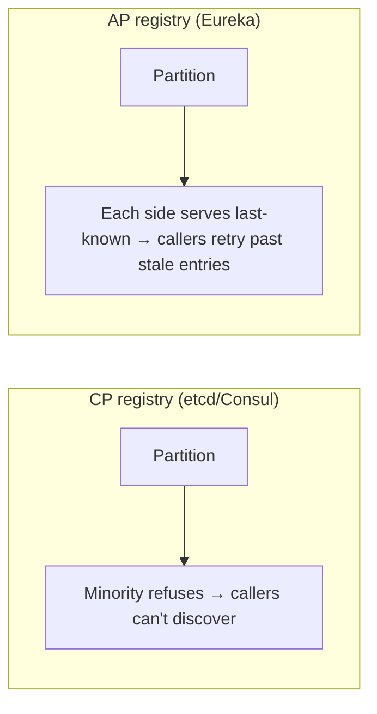

### Deep Dive B: Health checking and the flapping problem

The freshness/stability dial. To avoid evicting a node over one missed heartbeat, you require *several* consecutive failures before eviction, and *several* successes before re-admission (hysteresis). You add jitter so all instances don't heartbeat in lockstep. And critically, you protect against *mass* eviction: Eureka has a "**self-preservation mode**" — if it suddenly loses heartbeats from a large fraction of instances at once, it assumes *the network is broken, not that half the fleet died simultaneously,* and refuses to evict anyone. This prevents a network blip from cascading into "registry thinks everything is dead → routes nowhere → real outage." It's a profound operational lesson: **when your monitoring says everything died at once, suspect your monitoring.**

## 6. Production Challenges

**The registry is tier-0 infrastructure.** Its outage is everyone's outage. Run it replicated, isolated, over-provisioned, and with client-side caching so a registry blip degrades gracefully instead of catastrophically.

**Cache staleness windows.** Client caches mean a dead instance can receive traffic for a few seconds after death. The fix isn't perfect freshness (impossible); it's **fast, cheap retries on a different instance.** Discovery and retry policy are co-designed.

**Thundering herds on registry recovery.** When the registry comes back, every client refreshes at once. Jitter and staggered refresh, again.

## 7. Tradeoffs

**CP (etcd/Consul) vs. AP (Eureka).** Correct/consistent routing data that can become unavailable, vs. always-available routing data that can be stale. For pure discovery, AP is often the wiser default; for things needing strong consistency (config, leader election) layered on the same store, CP wins. This is the cleanest real-world illustration of CAP you'll find.

**Client-side vs. server-side discovery.** Client-side (A picks the instance) removes the central LB bottleneck and enables smart load-balancing, but pushes logic into every client/sidecar. Server-side (central LB) is simpler for clients but reintroduces a central component. Service meshes (Envoy sidecars) get the best of both: client-side logic, but in a sidecar so app code stays clean.

**Push vs. pull health checks.** Push is fast and cheap but only proves "process running"; pull proves "actually functional" but costs probe traffic. Use both.

## 8. How Large Companies Solve It

**Netflix (Eureka)** taught the industry the AP lesson above: a discovery system must fail *open*, never take down the fleet, and lean on client-side resilience (their Ribbon/Hystrix stack: client load-balancing + retries + circuit breakers).

**Kubernetes** made discovery nearly invisible: a stable virtual **Service** name and IP front a constantly-churning set of Pods; etcd (CP) holds the truth, while kube-proxy/CoreDNS give every workload a stable name. The lesson: **a stable logical name over an unstable physical set** is the abstraction everyone actually wants.

**Service meshes (Istio/Linkerd)** push discovery, load-balancing, retries, and health into a sidecar proxy, so application developers get all of it *for free* without writing discovery code. The lesson: **make resilience a platform feature, not an app-developer chore.**

## 9. Interview Discussion

**Questions:** "Design service discovery." "How do services find each other when IPs change constantly?" "Would you make your registry CP or AP, and why?"

**Strong answer:** Self-registration + heartbeats/leases + health checks (push and pull) + client-side caching with cheap retries. Then nail the CAP question: explain *why* AP often suits discovery (stale route = one retry; unavailable registry = total outage) while being ready to justify CP when strong consistency is required.

**Common mistakes:** Forgetting deregistration on crash (zombie instances). No caching (registry blip = outage). Over-aggressive health checks causing flapping. Treating the registry as non-critical.

**Senior signals:** The CP-vs-AP discussion with the *cost-of-being-wrong* reasoning (and contrasting it against Chapter 4's lock service); self-preservation / fail-open thinking; co-designing discovery with retry/circuit-breaker policy; recognizing the mesh as the modern answer.

---
---

# Chapter 6 — A Centralized Configuration Management System

## 1. Understanding the Problem

Every service has knobs: feature flags, timeouts, database connection strings, rate limits, the percentage of users in an A/B test. Early on, these live in `application.yml`, baked into the deployment.

Then a problem arrives that you'll feel viscerally one day: **it's 2 a.m., a feature flag is causing an outage, and to turn it off you have to do a full code deploy** — build, test, roll out across 200 instances — which takes 25 minutes while the site burns. You think: *"Why can't I just flip a switch?"*

That's the product. A **centralized configuration system** lets you change settings *at runtime, instantly, without redeploying,* and have those changes propagate to hundreds of running instances in seconds. Bonus powers: gradual rollouts ("enable for 5% of users"), per-environment config, and an audit trail of who changed what. Tools: Consul, etcd, AWS AppConfig, Spring Cloud Config, LaunchDarkly (for flags), Facebook's Configerator.

**Why it's hard:** Config is read by *everything, constantly,* and a bad config push can take down your *entire fleet at once* — faster and more completely than a bad code deploy, because there's no slow rollout to catch it. Config changes are among the top causes of large outages in the industry. So the system must be fast, consistent enough, *and* extremely safe.

## 2. The Simplest Version

A config table in a database (or a file in object storage), and a simple API. Each service reads its config on startup.

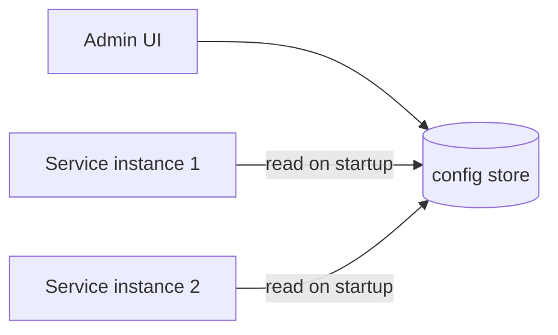

Works fine — *until you realize "on startup" means changes don't take effect without a restart,* which is the very thing we were trying to avoid.

## 3. It Starts Breaking

**Changes need a restart.** Reading config only at boot means a flag flip requires a rolling restart — better than a full deploy, but still minutes, and still disruptive.

**Polling hammers the store.** So services poll every few seconds for changes. 5,000 instances polling every 5 seconds = 1,000 reads/sec of mostly-unchanged data. Wasteful, and a poll interval means up-to-5-second propagation delay.

**A bad config takes down everything instantly.** Someone sets `timeout=0` or pushes malformed JSON. Every instance picks it up within seconds and crashes *simultaneously.* Unlike a code deploy that rolls out gradually, a config push hits everyone at once. This is the defining danger.

**Config store outage.** If services *only* read from the central store and it's down, instances starting up can't get config and fail. The dependency must degrade gracefully.

## 4. Evolving the Architecture

### Step 1: Watch instead of poll

Instead of polling, instances **watch** for changes — they hold a long-lived connection (or use the watch primitive of etcd/ZooKeeper/Consul) and the store *pushes* a notification when a key changes. Propagation drops to sub-second and the constant-poll load vanishes. (This is the same watch mechanism a coordination service provides — Chapter 4's substrate, reused.)

### Step 2: Local cache + last-known-good fallback

Each instance caches config locally on disk. If the central store is unreachable, the instance keeps running on its last-known-good config rather than failing. **Config availability must never be a hard dependency for already-running services** — they should boot and run even if the config service is down.

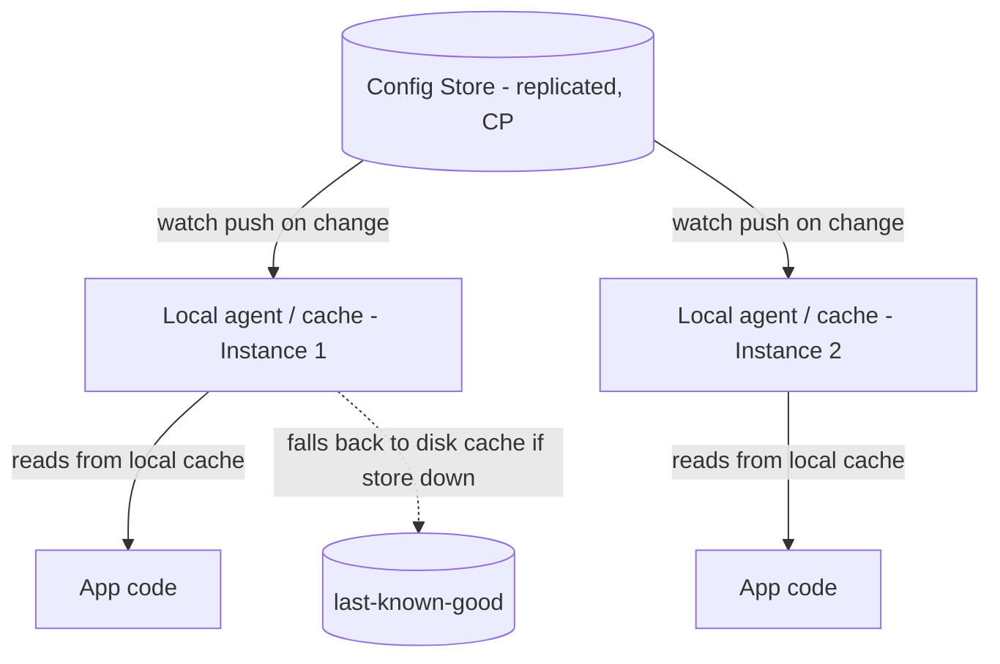

### Step 3: Safe rollout — the part that prevents 2 a.m. disasters

This is what separates a toy from a real config system, so it gets the deep dive. The essentials: **validate before publish, roll out gradually, and make rollback instant.**

## 5. Deep Dive

### Deep Dive A: Versioned config + instant rollback

Config is **versioned and immutable** — every change creates a new version (v41, v42…), never an in-place edit. Instances reference a version. Rollback is therefore *trivial and fast:* repoint everyone from v42 back to v41. No rebuild, no redeploy — milliseconds. This versioning also gives you the audit trail ("v42 changed `timeout` from 5s to 0s, by alice, at 02:01") that's gold during incident response. Notice the echo of Chapter 1: an **immutable, versioned, append-only** model beats mutable state again — it's becoming a theme of this book.

### Deep Dive B: Staged rollout and validation — defusing the fleet-wide blast

A config change is *dangerous precisely because it's instant and global.* So we deliberately make it *not* instant and global:

1. **Schema/type validation at write time.** Reject `timeout="banana"` or a missing required key *before* it's ever published. Catch the dumb stuff at the door.
2. **Canary the config.** Push v42 to 1% of instances first. Watch their error rates and latency. Only if they stay healthy do you proceed to 10%, then 50%, then 100%. A bad config now harms 1% briefly instead of 100% catastrophically.
3. **Automatic rollback.** If canary health degrades, the system auto-reverts to the last-known-good version without a human.

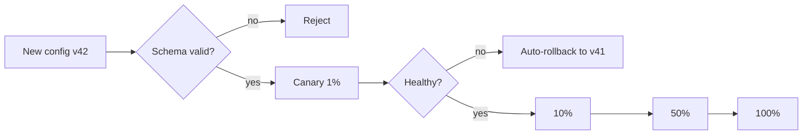

**The lesson:** treat a config change with *exactly the same respect as a code deploy* — validation, canary, gradual rollout, instant rollback. The biggest mistake teams make is assuming "it's just config" and pushing it everywhere at once. Config changes deserve a deploy pipeline of their own.

### Deep Dive C: Consistency model — do all instances need the same config at once?

Mostly, **no** — and that's freeing. During any rollout, some instances run v41 and some v42 *by design.* So your system must tolerate config heterogeneity, which is actually healthy (it's what makes canarying possible). The exception is config that *must* be globally consistent (e.g., a shared cryptographic key all instances must agree on) — that needs a CP store and a coordinated switch. Knowing *which* of your config is "eventually consistent is fine" vs. "must be atomic" is the senior judgment call.

## 6. Production Challenges

**The dependency-cycle trap.** Your config service stores *its own* config in... itself. Or your service-discovery needs config and your config needs discovery. Bootstrap dependency loops cause spectacular outages where nothing can start because everything is waiting on everything. Solution: a minimal, self-contained bootstrap config baked into the image, enough to reach the config service.

**Secrets are special.** DB passwords and API keys are config too, but they need encryption at rest, tight access control, and rotation. This is usually split into a dedicated secrets manager (Vault, AWS Secrets Manager) rather than the general config store.

**Config sprawl.** Thousands of flags accumulate; nobody remembers what `enable_legacy_path_v2` does or whether it's safe to remove. Stale flags become land mines. Mature orgs track flag ownership and expiry.

## 7. Tradeoffs

**Watch (push) vs. poll (pull).** Watch = instant, efficient, but more connection state and complexity. Poll = dead simple, but laggy and wasteful at scale. Most serious systems watch; small ones happily poll.

**Centralized vs. baked-in config.** Centralized = dynamic, instant changes, but a new critical dependency and blast-radius risk. Baked-in (in the deploy artifact) = no runtime dependency and naturally gradual rollout, but slow to change. Many teams split: *dynamic* things (flags, limits) centralized; *structural* things (which DB) baked in.

**Consistency vs. availability for the store.** A CP store (etcd) gives correct, consistent config but can become unavailable during partitions — survivable because of local caching. Strong consistency matters less here than you'd think, *because of* local caches and last-known-good.

## 8. How Large Companies Solve It

**Facebook's Configerator** is the canonical deep example: config is code, checked into version control, code-reviewed, validated, canaried, and distributed to millions of machines in seconds — with the explicit philosophy that **config changes are deploys and must go through the same safety pipeline.** This came directly from painful config-induced outages.

**Netflix** uses dynamic config (Archaius) and **feature flags as the core of safe deployment** — dark launches, gradual rollouts, and instant kill-switches. The lesson: a kill-switch you can flip in one second is your best friend during an incident.

**Google and Amazon** both treat config rollout with canary + automatic rollback, having learned the hard way that a single global config push is one of the fastest ways to take down a global service.

## 9. Interview Discussion

**Questions:** "Design a feature-flag / config system." "How do you change config without redeploying?" "How do you prevent a bad config from taking down the fleet?"

**Strong answer:** Watch-based push for fast propagation, local cache + last-known-good for availability, versioned immutable config for instant rollback, and — the headline — validation + canary + gradual rollout + auto-rollback to contain blast radius.

**Common mistakes:** Treating config as "just a value" and pushing globally at once. Making the config service a hard runtime dependency. Forgetting rollback. Ignoring secrets.

**Senior signals:** "Config changes are deploys." Discussing blast radius and canarying config. The bootstrap dependency-cycle trap. Distinguishing eventually-consistent config from must-be-atomic config. Flag lifecycle/expiry hygiene.

---
---

# Chapter 7 — A Distributed Cron Scheduler

## 1. Understanding the Problem

`@Scheduled` in Spring or a line in crontab runs a job on a timer. Easy — on *one* machine. But that one machine is a single point of failure: it dies, your nightly reports, cleanup jobs, and billing runs all silently stop. And one machine can only run so many jobs.

So you run the scheduler on three machines for redundancy. Now you've recreated *exactly* the Chapter 4 nightmare: at midnight, all three fire the same job, and you bill everyone three times. Redundancy created duplication.

A **distributed cron scheduler** solves: run scheduled jobs **reliably** (survive machine failures) and **exactly the right number of times** (ideally once) across a *fleet,* at large scale (millions of scheduled jobs — think "send this reminder to this user at this time" for 50 million users). Tools/examples: Kubernetes CronJobs, Airflow's scheduler, Quartz clustered, Google's distributed cron, Uber's Cherami/Cadence timers.

**Why it's hard:** The collision of three demands — *don't miss a job* (reliability) pushes toward redundancy, *don't double-run* (correctness) pushes against it, and *millions of jobs* pushes toward distribution. Reconciling all three is the whole game.

## 2. The Simplest Version

One scheduler process, a table of `(job, schedule, next_run_time)`. A loop wakes up, finds jobs whose `next_run_time <= now`, runs them, and computes the next run time.

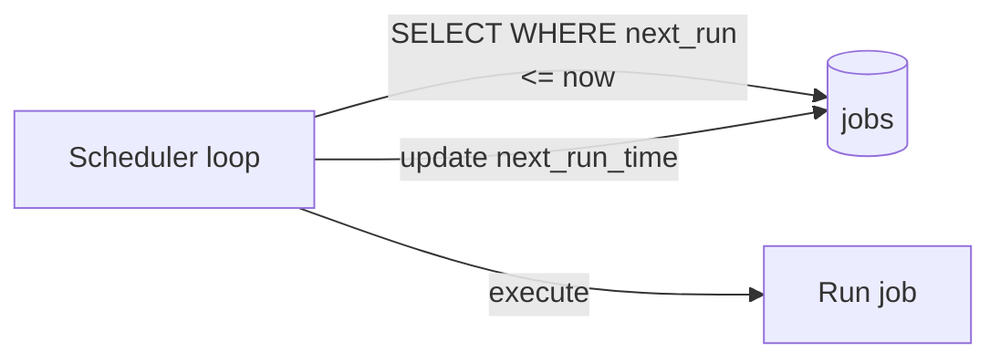

Perfect for a single app with a few dozen jobs. It's literally Quartz with a JDBC store. Reliable enough until the machine dies or the job count explodes.

## 3. It Starts Breaking

**SPOF.** The one scheduler dies → nothing runs, silently. The scariest failures are the silent ones: no error, just jobs quietly not happening, discovered days later.

**Redundancy → double execution.** Add more schedulers and they collide (the triple-billing problem).

**Missed runs after downtime.** The scheduler was down from 11:58 to 12:05. The midnight job's window passed. Did it run? Should it run late? "Exactly once" is meaningless if a crash means "zero times."

**Scale.** Millions of per-user timers ("remind Alice at 9 a.m. her time") won't fit the naive "scan all jobs every tick" loop — scanning millions of rows every second is absurd.

**Long jobs and overlap.** A job scheduled every 5 minutes takes 7 minutes. The next tick fires while it's still running. Now two run concurrently. Do you skip, queue, or allow overlap?

## 4. Evolving the Architecture

### Step 1: Leader election (the Chapter 4 payoff)

Only **one** scheduler is the leader at a time, chosen via a consensus-backed lock (etcd/ZooKeeper). The leader decides *what* should run; if it dies, a follower is elected within seconds. This kills both the SPOF and the double-firing in one move — *deciding* happens once, on the leader. We don't re-derive leader election here; we *reuse* Chapter 4. (This is the book's point: big systems are built from a small set of repeated primitives.)

### Step 2: Separate scheduling from execution

The leader doesn't *run* jobs — it *enqueues* them. It decides "job X is due now" and pushes a task onto a queue (Chapter 1). A pool of stateless workers pulls and executes. This decouples the timing brain from the execution muscle, lets execution scale horizontally, and means a slow job can't block the scheduler's clock.

```mermaid
flowchart TB
    subgraph Schedulers
        L[Leader scheduler]
        F1[Follower - standby]
        F2[Follower - standby]
    end
    L -->|"due jobs"| Q[(Task Queue)]
    Q --> W1[Worker 1]
    Q --> W2[Worker 2]
    Q --> W3[Worker 3]
    L -.->|leader lease via etcd| Etcd[(etcd)]
```

### Step 3: Time-bucketed / sharded storage for scale

For millions of timers, don't scan everything. Bucket jobs by time (e.g., a sorted structure or per-minute buckets) so the scheduler only loads "jobs due in the next minute." A **hierarchical timing wheel** (the classic data structure) makes "what's due now?" O(1)-ish instead of a full scan. For horizontal scale, shard jobs across multiple leaders by job-ID hash, each leader owning its shard.

## 5. Deep Dive

### Deep Dive A: Exactly-once execution — and why you should stop chasing it

The headline requirement is "run each job exactly once." By now (Chapters 1, 3) you know the punchline: **exactly-once is best achieved as at-least-once + idempotency, not as a delivery guarantee.**

Here's the reasoning. Even with a single leader, consider: the leader marks job X "running," sends it to a worker, the worker runs it, then crashes *before* reporting success. Did it finish? The scheduler can't tell. If it assumes failure and retries, the job runs twice. If it assumes success, the job might have run zero times. *There is no way to know for certain* across a network — this is the same fundamental impossibility from Chapter 1.

So the robust design picks **at-least-once** (better to run twice than zero times for most jobs) and makes the *job itself* idempotent: a job carries a unique run-id, and "send Alice's reminder" checks "have I already sent reminder run-id 8842? then skip." The effect happens once even if the trigger fires twice.

```mermaid
sequenceDiagram
    participant S as Scheduler (leader)
    participant Q as Queue
    participant W as Worker
    S->>Q: enqueue job X, run_id=8842
    Q->>W: deliver (possibly more than once)
    W->>W: already processed run_id 8842? skip : do work
    W->>Q: ack
```

**The lesson, now a refrain:** design for at-least-once delivery and idempotent effects. Trying to engineer true exactly-once delivery is chasing a ghost; making effects idempotent is achievable and robust.

### Deep Dive B: Misfire handling — what to do about missed windows

When the scheduler was down and a job's time passed, you need an explicit **misfire policy** per job: *fire immediately* (run the missed one now), *skip* (the moment passed, forget it — correct for "send 9 a.m. newsletter," wrong to send at noon), or *fire all missed* (run every skipped occurrence — usually a bad idea, can cause a stampede of catch-up runs). Making this a deliberate per-job choice — rather than an accident of implementation — is a senior move. Quartz literally has named misfire instructions for exactly this reason.

## 6. Production Challenges

**Silent failure is the worst failure.** A job not running produces *no error.* You need **dead-man's-switch monitoring**: each job is *expected* to check in by a deadline; if it doesn't, *that* fires an alert. You alert on absence, not just on errors. (Tools like Healthchecks.io / Cronitor exist purely for this.)

**Clock skew and time zones.** "9 a.m." in whose time zone? DST transitions create days with a missing or doubled hour — jobs scheduled at 2:30 a.m. on a spring-forward night may never fire or fire twice. Store schedules in UTC, compute local times carefully, and test DST edges.

**Overlapping runs.** Per-job concurrency policy: forbid (skip if previous still running — Kubernetes calls this `concurrencyPolicy: Forbid`), allow, or replace. Pick deliberately.

**Thundering herd at round times.** Everyone schedules things at `00:00`. Midnight becomes a tidal wave. Add jitter; spread jobs across the minute.

## 7. Tradeoffs

**At-least-once vs. at-most-once execution.** At-least-once (+ idempotency) risks duplicate work but never misses — right for most jobs. At-most-once never duplicates but can silently skip — only acceptable when a duplicate run is *more* harmful than a missed run (rare, but e.g. some financial postings).

**Single leader vs. sharded leaders.** Single leader = simplest, correct, but a scaling ceiling. Sharded = scales to millions of jobs but more complex (each shard needs its own election, rebalancing on failure).

**Coupled vs. decoupled execution.** Running jobs inside the scheduler is simple but lets a slow job stall the clock and limits scale. Decoupling (scheduler enqueues, workers execute) scales and isolates but adds a queue to operate.

## 8. How Large Companies Solve It

**Google's distributed cron** (documented in the SRE book) is the canonical reference. Their hard-won lessons: use **Paxos for leader election** so exactly one datacenter's cron is authoritative; **track each job's last-known state in consensus storage** so a failover leader knows what already ran; and **prefer to skip rather than double-run for jobs where duplication is dangerous, but make that an explicit per-job decision.** They explicitly discuss the "did it run before I crashed?" ambiguity and design around it.

**Airflow** separates the **scheduler** (decides what runs) from **executors/workers** (run it) and tracks every task instance's state in a metadata DB — the decouple-and-track pattern above, productized.

**Uber's Cadence/Temporal** reframe scheduling as **durable workflows** (next chapter), persisting every step so that "run exactly these steps in order, surviving any crash" becomes the primitive — which is the natural evolution of a cron scheduler into something far more powerful.

## 9. Interview Discussion

**Questions:** "Design a distributed cron / job scheduler." "How do you ensure a job runs exactly once across many machines?" "How do you handle a missed run?"

**Strong answer:** Leader election (consensus) to avoid double-scheduling and SPOF; decouple scheduling from execution via a queue; at-least-once + idempotent jobs (run-id dedup) for correctness; explicit misfire and concurrency policies; dead-man's-switch monitoring for silent failures; time-bucketing/sharding for scale.

**Common mistakes:** Claiming true exactly-once. Running schedulers redundantly without leader election (double-fire). Ignoring missed runs and silent failures. Forgetting time zones/DST. The midnight thundering herd.

**Senior signals:** Reframing exactly-once as at-least-once + idempotency (and *citing the same idea from messaging*); dead-man's-switch alerting on *absence*; explicit per-job misfire/concurrency policies; recognizing this evolves into workflow orchestration.

---
---

# Chapter 8 — A Workflow Orchestration Platform

## 1. Understanding the Problem

A real business process is rarely one step. Take fulfilling an order: **charge the card → reserve inventory → notify the warehouse → wait for "shipped" → send tracking email.** Five steps, spread across five services, and the whole thing might take *days* (waiting for the warehouse). Some steps can fail. Some need retries. If step 2 fails after step 1 charged the card, you must *refund* — undo what's already done.

Now try to code that with plain service calls and you'll feel the agony: where do you store "we're on step 3"? What if your service restarts mid-flow — is the order stuck forever? How do you retry just step 4 without redoing 1–3? How do you wait *three days* for the warehouse without holding a thread open? How do you undo step 1 when step 2 fails?

A **workflow orchestration platform** answers all of this. It runs **long-lived, multi-step, fault-tolerant processes** that survive crashes, restarts, and deploys, with built-in retries, timeouts, waiting, and compensation. Tools: Temporal (and its ancestor Uber Cadence), AWS Step Functions, Netflix Conductor, Apache Airflow, Camunda.

**Why it's hard:** The process state must be **durable across failures and time.** A workflow might be paused for a week. The server running it will be restarted, redeployed, and replaced many times during that week — yet the workflow must resume *exactly where it left off,* as if nothing happened. Making code survive its own infrastructure dying underneath it is the central magic.

## 2. The Simplest Version

A `status` column. The order row has `status` ∈ {charged, reserved, notified, shipped, completed}. A service advances it step by step, updating the column after each step.

```mermaid
flowchart LR
    Start[New order: status=created] --> Charge[charge → status=charged]
    Charge --> Reserve[reserve → status=reserved]
    Reserve --> Notify[notify → status=notified]
    Notify --> Done[status=completed]
```

For a few simple, short flows this is fine and extremely common — it's the humble state machine. The status column *is* your durable state; on restart you read it and continue from there.

## 3. It Starts Breaking

**Crash between step and status update.** You charged the card (step succeeds) but crashed before writing `status=charged`. On restart you see `status=created` and charge *again.* Double charge. (The Chapter 1/7 ghost returns: the gap between doing and recording.)

**Retry logic metastasizes.** Each step needs retries with backoff, timeouts, and "give up after N." Hand-coding this in every service, for every step, is a swamp of duplicated, buggy code.

**Long waits don't fit the request model.** Waiting 3 days for "shipped" can't hold an HTTP request or a thread. You need to *suspend* and *resume on an external event.*

**Undo is hard (no distributed transactions).** Step 2 fails after step 1 charged the card. You can't roll back across services with a database transaction — they're separate systems. You must explicitly *compensate* (issue a refund). Coordinating compensation by hand across many steps is error-prone.

**No visibility.** "Where is order #12345 stuck?" With scattered status columns and logs, answering that is detective work.

## 4. Evolving the Architecture

### Step 1: An explicit, persisted state machine + an orchestrator

Model the workflow as an explicit state machine, and put a dedicated **orchestrator** in charge of advancing it. After every step, the orchestrator **persists the new state** to durable storage *before* moving on. The orchestrator owns retries, timeouts, and transitions — individual services just do one thing each.

### Step 2: Event sourcing — persist the history of steps, not just current state

Instead of only storing "current step," store the **append-only history of everything that happened**: "charge attempted," "charge succeeded," "inventory reserved"… The current state is *derived* by replaying that history. (This is **event sourcing**, and yes — it's the immutable append-only log idea from Chapters 1 and 6, applied a third time. The pattern is that good.) This is the foundation of crash recovery, so it gets the deep dive.

### Step 3: Saga pattern for cross-service consistency

Since you can't have an ACID transaction across services, you use a **saga**: a sequence of local transactions, each with a matching **compensating action**. If step 4 fails, the orchestrator runs the compensations for steps 3, 2, 1 in reverse to undo them. This is how you get "all-or-nothing" semantics without distributed transactions. Deep dive below.

```mermaid
flowchart TB
    subgraph Orchestrator
        O[Orchestrator: reads event history, decides next step]
    end
    O -->|"command: charge"| Pay[Payment Service]
    O -->|"command: reserve"| Inv[Inventory Service]
    O -->|"command: notify"| WH[Warehouse Service]
    Pay -->|"event: charged"| Log[(Event History)]
    Inv -->|"event: reserved"| Log
    WH -->|"event: shipped"| Log
    Log --> O
```

## 5. Deep Dive

### Deep Dive A: Event sourcing + replay = surviving crashes and time

Here's the trick that makes a week-long workflow survive its server being redeployed ten times.

The workflow's entire state is an **append-only event history** in durable storage. When the worker process running the workflow is restarted (crash, deploy, whatever), the orchestrator **reloads the event history and replays it** to reconstruct exactly where the workflow was — which steps completed, what they returned — and continues from the next pending step. The running process is *disposable*; the truth lives in the durable history.

Temporal pushes this to a beautiful extreme with **deterministic replay**: you write workflow logic as ordinary, sequential code (it *looks* like a normal function with `await chargeCard(); await reserveInventory();`), but every external result is recorded to the history. On replay, instead of re-calling the services, the framework *feeds back the recorded results,* fast-forwarding your code to its last position. To the developer, it feels like code that simply *cannot die* — pause it for a month, restart the server, and it resumes mid-function. The cost: your workflow code must be **deterministic** (no `new Random()`, no direct `now()`, no nondeterministic branching) because replay must reproduce the same path. That constraint is the price of the magic, and a classic gotcha.

```mermaid
sequenceDiagram
    participant H as Event History (durable)
    participant W as Worker (disposable)
    Note over W: process crashes / redeploys
    W->>H: load full history
    H-->>W: charged✓, reserved✓ (notify pending)
    Note over W: replay fast-forwards code past charge & reserve
    W->>W: resume at "notify" step — as if never interrupted
```

This is *the* answer to "how does it survive crashes": **the process is stateless and replaceable; the durable event log is the workflow.** Same idea as Kafka, config versions, and event sourcing — applied to control flow itself.

### Deep Dive B: Sagas and compensation — consistency without distributed transactions

You cannot wrap "charge card" (in Payments) and "reserve inventory" (in Inventory) in one ACID transaction; they're different databases on different services. The two-phase-commit alternative is slow, fragile, and holds locks across services — almost nobody uses it for business workflows.

The saga is the pragmatic answer: **a chain of local transactions, each paired with a compensating transaction that semantically undoes it.** Charge → (compensate: refund). Reserve → (compensate: release). If the chain fails partway, run the compensations backward. Note "compensate" is *semantic* undo, not a rollback: you don't erase the charge from history, you issue a *refund.* The customer sees a charge and a refund — which is honest and auditable.

**Orchestration vs. choreography** — the two saga flavors: in **orchestration** (above), a central brain issues commands and tracks progress (clear, observable, but a central component). In **choreography**, services react to each other's events with no central coordinator (decoupled, but the overall flow is implicit and hard to follow — "where is order #12345?" becomes very hard). Senior take: choreography is elegant for 2–3 steps; for anything complex, **orchestration's observability wins** — you can *see* the whole flow in one place.

**Idempotency, again.** Because of retries and replay, every step must be idempotent (charge carries an idempotency key so a retry doesn't double-charge). You've now seen this requirement in *every single chapter.* That's not repetition for its own sake — it's the load-bearing wall of reliable distributed systems.

## 6. Production Challenges

**Versioning running workflows.** You deploy new workflow code while thousands of week-long workflows are mid-flight on the *old* code. Deterministic replay breaks if the code path changed. This is genuinely hard; platforms provide explicit versioning APIs so old executions keep their old logic while new ones use new logic.

**Stuck workflows.** A workflow waiting on an event that never arrives hangs forever. You need timeouts on waits and tooling to find, inspect, and manually nudge or terminate stuck instances.

**Poison steps.** A step that always fails will retry forever (or hit max retries and dead-letter). You need backoff caps, max-attempt limits, and a human-escalation path.

**History bloat.** A workflow with millions of events has a huge history that's slow to replay. Platforms snapshot/compact periodically (yet another echo of log compaction).

## 7. Tradeoffs

**Orchestration vs. choreography.** Central control + great visibility vs. full decoupling + implicit, hard-to-trace flow. Complexity tips the balance toward orchestration.

**Workflow engine vs. hand-rolled state machine.** An engine (Temporal/Step Functions) gives you durability, retries, timeouts, and visibility for free — at the cost of a heavy new platform and a programming model with constraints (determinism). A hand-rolled status-column state machine is simple and dependency-free but you'll reinvent retries, recovery, and visibility badly. For 2 steps, hand-roll; for 10 steps across 6 services over days, use an engine.

**Saga vs. two-phase commit.** Sagas: available, no cross-service locks, but only *eventual* consistency and you must design compensations (and tolerate visible intermediate states). 2PC: stronger atomicity but blocking, slow, and fragile under failures. Sagas win for business workflows almost universally.

## 8. How Large Companies Solve It

**Uber built Cadence** (now **Temporal**) precisely because hand-coded, status-column workflows across their microservices were unmaintainable. The lesson: **make durable execution a platform primitive** so engineers write ordinary-looking code that happens to be crash-proof and resumable — and stop hand-rolling state machines.

**Netflix's Conductor** orchestrates their content-encoding and operational pipelines as JSON-defined workflows, emphasizing **visibility and operability** at scale — you can watch every workflow's state.

**AWS Step Functions** turns workflows into a managed state-machine service, teaching that for many teams the right move is to **not run the orchestrator yourself** at all.

The shared lesson across all three: long-running business processes are a *first-class problem* deserving dedicated infrastructure — not something to bolt onto request handlers.

## 9. Interview Discussion

**Questions:** "Design an order fulfillment / workflow system." "How do you make a multi-step process survive crashes?" "How do you handle a failure halfway through a distributed transaction?"

**Strong answer:** Model as a persisted state machine; use event sourcing + replay so a disposable worker resumes from durable history; use sagas with compensating actions for cross-service consistency (no 2PC); make every step idempotent; prefer orchestration for observability.

**Common mistakes:** Assuming distributed ACID transactions exist. Storing only "current step" (crash-between-step-and-update bug). Holding threads/requests open for long waits. Forgetting compensation. Ignoring workflow versioning.

**Senior signals:** Event-sourcing + deterministic replay as the crash-recovery mechanism (and its determinism constraint); sagas vs. 2PC with the right reasoning; orchestration-vs-choreography on observability grounds; the versioning-running-workflows problem; and connecting it all back to the recurring idempotency + append-only-log themes.

---
---

# Chapter 9 — A Stripe-like Payment Platform

## 1. Understanding the Problem

This is the system where bugs cost *real money* and "eventually consistent" can mean "we charged a customer twice and they're tweeting about it."

A payment platform sits between merchants and the byzantine world of card networks (Visa, Mastercard), banks, and acquirers. When a customer checks out, the platform must: take card details *without the merchant ever touching them* (compliance), authorize the charge with the bank, capture the funds, record everything in a way that *always balances* to the penny, and handle the messy aftermath — refunds, disputes, chargebacks, failed-then-retried payments.

**Who uses it:** every online business that takes money. **Why it matters:** it's literally the revenue. **Why it's uniquely hard:**

1. **Correctness is absolute.** A double charge or a lost payment isn't a glitch; it's a financial and legal event. Money must never be created or destroyed by a bug.
2. **The network is unreliable but the money is real.** You send "charge $50" to the bank and the connection drops before the response. Did it charge? You *cannot* just retry blindly — that risks a double charge. (The Chapter 1 ghost, now with financial stakes.)
3. **Everything is asynchronous and slow.** Banks respond in seconds, settle in days, and disputes arrive weeks later.

## 2. The Simplest Version

A `payments` table and a call to a payment gateway. Customer pays → insert row `status=pending` → call the bank → on success update `status=succeeded` and the merchant's balance.

```mermaid
flowchart LR
    C[Checkout] --> API[Payment API]
    API -->|insert pending| DB[(payments)]
    API -->|charge| Bank[Bank / Card Network]
    Bank -->|approved| API
    API -->|status=succeeded, credit merchant| DB
```

For a single store with modest volume, this honestly works. The pain isn't volume at first — it's *correctness under failure,* which bites even at low scale.

## 3. It Starts Breaking

**The retry that double-charges.** You call the bank; the network times out; you didn't get a response. Maybe it charged, maybe not. The customer clicks "Pay" again (or your code auto-retries). Now you might charge twice. This single failure mode is the entire reason payment APIs are built the way they are.

**Updating a balance with `UPDATE` corrupts money.** `UPDATE merchants SET balance = balance + 50` seems fine — until a bug, a race, or a partial failure runs it twice or not at all, and now your books are wrong with no way to tell *why* or *by how much.* A mutable balance column has no history; you can't audit it; you can't prove it's right.

**Storing card numbers is a catastrophe waiting to happen.** Holding raw PANs puts you in PCI-DSS scope and one breach from ruin.

**The aftermath doesn't fit.** Refunds, partial refunds, chargebacks (the bank claws back money weeks later), failed recurring charges — each mutates "balance" in ad-hoc ways, and the books drift.

## 4. Evolving the Architecture

### Step 1: Idempotency keys — the foundational fix

Every payment request carries a client-generated **idempotency key** (e.g., a UUID per checkout attempt). The platform records it. If the *same key* arrives again (the retry after the timeout), the platform returns the *original result* instead of charging again. The customer can mash the button or the network can hiccup; the charge happens once. This is the single most important pattern in payments, and it's *the same idempotency* you've now seen in every chapter — here it's load-bearing for money. Deep dive below.

### Step 2: Tokenization / vault for card data

Cards are sent directly from the browser to a **vault** (Stripe.js style), which returns a **token**. The merchant's server only ever sees the token, never the PAN. This pulls the merchant out of PCI scope and centralizes the sensitive data in one hardened, encrypted service.

### Step 3: The double-entry ledger — never UPDATE a balance again

Replace the mutable `balance` column with an **append-only, double-entry ledger**: every movement of money is recorded as balanced debits and credits across accounts that *always sum to zero.* Balances are *derived* by summing ledger entries, never stored mutably. This is the accounting world's version of event sourcing, and it's non-negotiable for correctness. Deep dive below.

```mermaid
flowchart TB
    C[Checkout + idempotency key] --> API[Payment API]
    API --> Idem{Key seen before?}
    Idem -->|yes| Return[Return original result]
    Idem -->|no| Auth[Authorize with bank]
    Auth --> Ledger[(Append-only double-entry ledger)]
    Vault[(Card Vault → token)] -.-> API
    Ledger --> Bal[Balances derived by summing entries]
```

## 5. Deep Dive

### Deep Dive A: Idempotency keys — exactly-once *effect* for money

Mechanically: the client picks a unique key per logical operation and sends it with the request. The server, *inside a transaction,* checks an idempotency table. First time: it does the work and stores `(key → result)`. Repeat: it short-circuits and returns the stored result. The subtlety is the *concurrent* duplicate — two requests with the same key arriving at once. You handle it with a unique constraint on the key plus a lock/`INSERT ... ON CONFLICT`, so the second one either waits for the first's result or detects the in-flight operation.

Notice the framing: this is **at-least-once delivery + idempotent processing = exactly-once effect** — the exact pattern from Kafka (Ch.1), the cron scheduler (Ch.7), and workflows (Ch.8). Payments is where you finally see *why* the book hammered it: when the "effect" is "$50 leaves a real bank account," idempotency stops being best-practice and becomes the difference between a correct business and a class-action lawsuit.

### Deep Dive B: The double-entry ledger — making money impossible to lose

The rule from 500 years of accounting: **every transaction touches at least two accounts, and debits equal credits — always.** A $50 payment isn't "merchant balance += 50." It's:

```
DEBIT  customer_funds   $50
CREDIT merchant_payable $50
```

Two entries, summing to zero. The ledger is **append-only and immutable** — you never edit or delete an entry. A refund isn't undoing the original; it's a *new* pair of balanced entries in the opposite direction. The customer's history shows the charge *and* the refund — honest and fully auditable.

Why this matters so much:
- **Money can't appear or vanish.** Because every entry is balanced, the total across all accounts is invariant. If your numbers don't sum correctly, you have a *bug you can detect* — you can run a continuous "trial balance" that must equal zero. A mutable-column design gives you no such safety net.
- **Perfect audit trail.** Every penny's movement is a permanent record with a reason. "Why is this balance $237.14?" is answerable by replaying entries.
- **Balances are a `SUM`, not a stored value.** (For performance you keep cached/snapshotted balances, but the ledger remains the source of truth — same "derive state from the log, snapshot for speed" pattern as event sourcing.)

```mermaid
flowchart LR
    P[Payment $50] --> E1["DEBIT customer_funds 50 / CREDIT merchant_payable 50"]
    R[Refund $50] --> E2["DEBIT merchant_payable 50 / CREDIT customer_funds 50"]
    E1 --> L[(Immutable Ledger — entries always sum to zero)]
    E2 --> L
```

### Deep Dive C: The payment state machine and async reality

A payment isn't a function call; it's a **state machine** living over time: `pending → authorized → captured → settled`, with branches to `failed`, `refunded`, `disputed`, `charged_back`. Authorization (a hold) and capture (taking the money) are often separate steps. Settlement happens days later. Disputes arrive weeks later via asynchronous bank notifications (webhooks). So a payment platform is really a long-running, durable state machine fed by asynchronous external events — which is exactly the **workflow** of Chapter 8. Payments and workflow orchestration are the same shape of problem; that's not a coincidence.

## 6. Production Challenges

**Reconciliation.** The bank/processor sends a daily settlement file. Your ledger says one thing; their file says another (a fee you didn't record, a transaction in a different state). **Reconciliation** — automatically matching your records against the processor's and flagging discrepancies — is a core, never-finished function of every payment company. The double-entry ledger is what makes it tractable.

**Webhook reliability.** Banks notify you of disputes/settlements via webhooks that can be delayed, duplicated, or out-of-order. You must process them idempotently (key again) and tolerate any ordering.

**Stuck `pending` payments.** A payment authorized but never captured, or pending with no bank response, ties up customer funds. You need sweepers that reconcile and resolve stuck states, and clear timeouts.

**A processor outage.** Your primary processor goes down mid-Black-Friday. Mature platforms route across *multiple* processors and fail over — but failover must not double-charge (idempotency keys span the retry-on-the-other-processor).

**Consistency over availability — deliberately.** When in doubt, a payment system *refuses* (declines, asks to retry) rather than risk a wrong charge. Unlike a social feed (which favors availability), money systems are unapologetically **CP**: better to fail a payment than to charge incorrectly.

## 7. Tradeoffs

**Strong vs. eventual consistency.** Core money operations (the charge, the ledger entry) demand **strong consistency** — they run in ACID transactions, often on a single relational database (Stripe famously ran enormous volume on sharded Postgres/MongoDB with strong guarantees). Peripheral data (analytics, search) can be eventually consistent. The art is drawing that line correctly.

**Synchronous authorize vs. async capture.** Authorizing synchronously gives the customer an instant yes/no; capturing later (or asynchronously) decouples revenue recognition and enables flows like "charge on ship." More flexibility, more states to manage.

**Single processor vs. multi-processor.** One processor is simple; multiple gives resilience and better rates but multiplies reconciliation and idempotency complexity.

**Availability vs. correctness.** Payments choose correctness, full stop. This is the cleanest example in the book of "the right CAP choice depends entirely on what the data *is*."

## 8. How Large Companies Solve It

**Stripe** built its reputation on two ideas this chapter centers: **idempotency keys as a first-class API concept**, and an **immutable double-entry ledger** as the financial source of truth. Their lesson: expose idempotency to your *customers* so their retries are safe too, and treat the ledger as sacred and append-only.

**PayPal and Square** emphasize **reconciliation and the state machine** — accepting that money moves asynchronously over days and that matching your books to the banks' is a permanent, automated discipline.

**Adyen** built multi-acquirer routing — sending each transaction to the optimal bank connection — teaching that at scale, *routing payments intelligently* across processors improves both success rates and cost, but demands airtight idempotency.

The universal lesson: in money systems, **immutability + idempotency + reconciliation** are the holy trinity. Never mutate, never assume a single attempt, always verify against the source.

## 9. Interview Discussion

**Questions:** "Design Stripe / a payment system." "How do you prevent double charges?" "How do you store balances correctly?" "Handle a network timeout mid-charge."

**Strong answer:** Idempotency keys for safe retries (at-least-once + idempotent effect); tokenization/vault to stay out of PCI scope; an append-only double-entry ledger with derived balances; a durable payment state machine fed by async webhooks; reconciliation against the processor; and an explicit CP stance — refuse rather than risk a wrong charge.

**Common mistakes:** Blindly retrying a charge. Storing a mutable balance column. Storing raw card numbers. Treating payment as synchronous and instantaneous. Forgetting refunds/chargebacks/disputes and reconciliation.

**Senior signals:** Framing idempotency as exactly-once *effect* (and linking it to messaging/cron/workflow). Insisting on double-entry immutable ledgers and a continuous trial-balance check. Recognizing payments as a long-running async state machine (= workflow). Naming reconciliation as a core, permanent function. Choosing consistency over availability with conviction.

---
---

# Chapter 10 — A Subscription Billing Platform

## 1. Understanding the Problem

Chapter 9 moved money *once.* Subscription billing moves it *forever, on a schedule, with rules that make accountants weep.*

Think Netflix, your SaaS tools, your gym. The platform must: charge customers on recurring cycles (monthly/annual), handle plan changes mid-cycle (upgrade from Basic to Pro on the 14th — how much do they owe *now*?), apply **proration**, manage trials, coupons, taxes (which vary by jurisdiction), dunning (retrying failed charges politely), cancellations, refunds, and produce correct invoices and revenue reports. And it must do all this for millions of subscribers without charging anyone the wrong amount.

**Why it's hard, and *differently* hard than payments:** payments is about *one* transaction's correctness under failure. Billing is about *correctly modeling time and state* — entitlements that change mid-cycle, money owed that depends on *when* something happened, and a relentless schedule. The complexity is in the *business rules and their interaction with time,* not just the plumbing.

## 2. The Simplest Version

A `subscriptions` table: `(customer, plan, price, next_billing_date)`. A daily job finds subscriptions due today and charges them (using the Chapter 9 payment system).

```mermaid
flowchart LR
    Cron[Daily billing job] -->|"due today?"| Subs[(subscriptions)]
    Cron --> Pay[Payment platform - Ch.9]
    Pay -->|success| Adv[advance next_billing_date +1 month]
```

For a single-plan, fixed-price product with no proration, this is genuinely enough. Many SaaS companies start exactly here. The pain begins when the *rules* arrive.

## 3. It Starts Breaking

**Mid-cycle plan changes.** Customer on a $10/mo plan upgrades to $30/mo on day 15. What do they owe today? A credit for unused $10-plan time plus a charge for the rest of the month on the $30 plan — **proration**. Get the date math wrong and you over- or under-charge, and customers *notice.*

**The daily job double-bills on retry.** The billing job crashes after charging but before advancing `next_billing_date`. Next run, it charges again. (The Chapter 7/9 ghost — billing is where it's *most* expensive.)

**Failed charges need a polite, persistent retry strategy.** A card declines (expired, insufficient funds). You can't just give up (lost revenue) or retry aggressively (annoy the bank and customer). You need **dunning**: retry on a schedule, email the customer, and eventually downgrade/suspend. Roughly *a meaningful chunk of churn is involuntary* — failed payments, not unhappy customers — so dunning directly drives revenue.

**Invoices and revenue recognition diverge from cash.** You charge a customer $120 for an annual plan today, but accounting rules (ASC 606) say you've only *earned* $10 this month — the rest is *deferred revenue.* Cash received ≠ revenue earned. Finance needs both views, correctly.

**Taxes and edge cases multiply.** VAT, sales tax, different rules per country, tax-exempt customers, coupons stacking with proration… the matrix of cases explodes.

## 4. Evolving the Architecture

### Step 1: Separate the subscription state machine from invoicing from payment

Three distinct concerns, three components: a **subscription lifecycle** (active, trialing, past_due, canceled — a state machine), an **invoicing engine** (computes *what is owed* including proration, tax, coupons → produces an immutable invoice), and the **payment platform** (Chapter 9, which *collects* what the invoice says is owed). Keeping "what do they owe" separate from "did we collect it" is the key structural insight.

```mermaid
flowchart TB
    Sub[Subscription Lifecycle - state machine] -->|"cycle due / plan changed"| Inv[Invoicing Engine]
    Inv -->|"computes line items: base, proration, tax, discounts"| Invoice[(Immutable Invoice)]
    Invoice --> Pay[Payment Platform - Ch.9]
    Pay -->|paid| Inv2[mark invoice paid]
    Pay -->|failed| Dun[Dunning process]
    Dun -->|retry schedule| Pay
    Dun -->|exhausted| Sub
```

### Step 2: Idempotent billing runs

The billing job is a Chapter 7 distributed scheduler problem: each billing cycle generates an invoice with a **deterministic idempotency key** (e.g., `subscription_id + period_start`). Re-running the job finds the invoice already exists and skips. Charging that invoice uses the Chapter 9 idempotency key. *Double-billing becomes structurally impossible,* not "carefully avoided."

### Step 3: Dunning as a workflow

Failed payment → enter a **dunning workflow** (Chapter 8!): retry after 1 day, 3 days, 5 days, emailing at each step, then suspend. This is a long-running, multi-step, stateful process — exactly what workflow orchestration is for. Billing is, structurally, a *composition* of the previous chapters.

## 5. Deep Dive

### Deep Dive A: Proration and the immutable invoice

Proration is "money owed as a function of *time within a cycle.*" Upgrade on day 15 of a 30-day month: credit ~15 days of the old plan, charge ~15 days of the new. The danger is doing this arithmetic *imperatively* against a mutable balance — it drifts and becomes unauditable.

The robust design: model billing as a series of **immutable invoices and line items.** A plan change doesn't edit anything; it generates *new line items* (a proration credit line, a new charge line). The invoice is an append-only document — same immutability principle as the Chapter 9 ledger and event sourcing. You can always show the customer *exactly* why they were charged $X by listing the line items. "Why is my bill $23.71?" has a precise, itemized answer.

### Deep Dive B: Cash vs. revenue — deferred revenue and the ledger

This trips up almost everyone. **Cash** (money received) and **revenue** (money *earned* over time) are different, and accounting law requires tracking both. Annual plan, $120 upfront:

- **Cash:** +$120 today.
- **Revenue:** $10 recognized each month; the unearned remainder sits in a **deferred revenue** liability account that draws down monthly.

You model this with — you guessed it — a **double-entry ledger** (Chapter 9): cash is debited, deferred revenue credited, then each month deferred revenue is debited and earned revenue credited. The same immutable double-entry machinery serves billing's accounting needs. This is why mature billing systems are built *on top of* a ledger, not on mutable balance columns.

### Deep Dive C: Time, time zones, and the billing clock

Billing lives and dies by dates. "Monthly" on Jan 31 → does February bill on the 28th? Then back to the 31st in March? Leap years, DST, customer time zones, "end of month" semantics — these aren't edge cases, they're *daily occurrences* at scale. The disciplined approach: anchor cycles to explicit, well-defined rules (e.g., "bill on the Nth, clamp to month length"), compute in UTC, and treat the billing clock as a first-class, heavily-tested component. (This is Chapter 7's time-zone problem, now with money attached.)

## 6. Production Challenges

**Mass billing-day spikes.** Many subscriptions renew on the 1st. The billing job faces a tidal wave. Spread renewals across the cycle (anchor to signup date) and rate-limit against the payment processor (Chapter 5/9 thundering-herd echo).

**Dunning tuning.** Too-aggressive retries get you flagged by card networks; too-passive loses revenue. Smart systems use **retry timing optimization** (retry when the customer's paycheck likely cleared) and card-network "account updater" services that fetch new card numbers automatically.

**Migrations and grandfathering.** You change pricing. Existing customers are "grandfathered" on old prices. Now you maintain many plan versions simultaneously, forever. Plan/price versioning (immutable price objects) is essential.

**Refunds, credits, and disputes ripple into accounting.** A refund must adjust both the invoice view and the revenue-recognition ledger correctly — more append-only entries, never edits.

## 7. Tradeoffs

**Build vs. buy.** Billing's complexity (proration, tax, dunning, rev-rec, compliance) is so deep that most companies *should* use Stripe Billing, Chargebee, or Recurly rather than build it. The senior insight: **billing is a domain where "buy" is usually right** — the rules are a bottomless pit, and getting tax/rev-rec wrong has legal consequences. Build only if billing *is* your product.

**Immutable invoices vs. mutable balances.** Immutable = auditable, correct, but more records and "issue a credit" instead of "edit." Mutable = simpler-looking but drifts and can't be audited. For money, immutable wins every time (the book's recurring verdict).

**Real-time vs. batch billing.** Batch (nightly) is simple and efficient but laggy. Real-time/usage-based billing (metered APIs, "pay per request") needs streaming aggregation (Chapter 3!) and is far more complex but enables usage pricing. Usage-based billing literally bolts a stream-processing pipeline onto the billing engine.

## 8. How Large Companies Solve It

**Stripe Billing** productized this entire chapter — proration, invoicing, dunning, tax, rev-rec — and the lesson is exactly "buy don't build": Stripe absorbed a decade of edge cases so you don't relive them.

**Netflix and large SaaS** focus enormous energy on **involuntary churn / dunning optimization** because recovering failed payments is pure found revenue — card-updater integrations, smart retry timing, grace periods.

**Zuora** built a business purely around *enterprise* subscription billing and revenue recognition, proving how deep the "modeling money over time" problem really is — entire companies exist just to get rev-rec right.

The shared lesson: subscription billing is *deceptively* hard. The naive version is a daily cron; the real version is a composition of scheduling, workflow, payments, and double-entry accounting, drowning in time-based business rules.

## 9. Interview Discussion

**Questions:** "Design a subscription billing system." "How do you handle mid-cycle upgrades / proration?" "How do you retry failed payments?" "How do you avoid double-billing?"

**Strong answer:** Separate subscription state machine / invoicing / payment. Compute proration into immutable invoice line items. Idempotent billing runs keyed by `subscription+period`. Dunning as a retry workflow. A double-entry ledger for cash-vs-revenue. And the senior kicker: "honestly, I'd evaluate buying this — the rule complexity rarely justifies building."

**Common mistakes:** Mutable balance columns. Editing invoices instead of issuing credits. Forgetting proration/time-zone/month-length math. Ignoring dunning (leaving revenue on the table). Conflating cash with revenue.

**Senior signals:** Recognizing billing as a *composition* of cron + workflow + payments + ledger. Insisting on immutable invoices and double-entry rev-rec. The build-vs-buy judgment. Treating dunning as a revenue lever. Naming usage-based billing's streaming dependency.

---
---

# Chapter 11 — A Fraud Detection Platform

## 1. Understanding the Problem

A stolen credit card is being tested on your checkout. A bot is creating 10,000 fake accounts. Someone in one country is logging into an account that's only ever been used in another. A "customer" is buying $5,000 of gift cards at 3 a.m. with a card that's never spent over $50.

A **fraud detection platform** decides, *in real time, while the customer waits,* whether to **allow, block, or challenge** (step-up: ask for 2FA) each risky action. It must catch fraud (true positives) without blocking legitimate customers (false positives) — and those two goals are in direct tension. Every blocked fraudster you celebrate sits next to a furious real customer whose legitimate purchase you declined.

**Why it's uniquely hard:**
1. **Latency budget is tiny.** You have maybe 100–300ms to decide while the payment hangs. No "we'll analyze it overnight."
2. **The adversary adapts.** Unlike a database that doesn't fight back, fraudsters actively probe and evolve. Your model that worked last month is being reverse-engineered right now.
3. **Labels arrive late and noisy.** You only *know* a transaction was fraud weeks later when the chargeback lands. So your training data is always stale and incomplete.
4. **The cost of errors is asymmetric and business-specific.** Blocking a $5 purchase to stop $5 of fraud is a bad trade if it loses a $5,000/year customer.

## 2. The Simplest Version

A **rules engine.** A list of `if` conditions written by analysts: *if amount > $1000 AND card is new AND country mismatch → block.* Run the rules on each transaction synchronously.

```mermaid
flowchart LR
    Tx[Transaction] --> Rules{Rules engine}
    Rules -->|matches block rule| Block[Decline]
    Rules -->|matches review rule| Challenge[Step-up 2FA]
    Rules -->|clean| Allow[Approve]
```

This works remarkably well early on and *never fully goes away* — rules are fast, explainable, and instantly adjustable ("we're seeing fraud from this BIN range, block it now"). Every mature fraud system *still* has a rules layer. The pain is that rules alone can't keep up.

## 3. It Starts Breaking

**Rules are brittle and gameable.** Fraudsters learn the threshold is $1000 and charge $999. They learn new+mismatch is flagged and warm up accounts first. Static rules are a fence with a known gap.

**Rule explosion.** Analysts add rules for every new pattern. Soon there are 2,000 rules that contradict each other, nobody understands the interactions, and adding one breaks three.

**No memory of behavior.** A single transaction looks fine in isolation. Fraud reveals itself in *patterns over time* — "this card hit 12 merchants in 5 minutes," "this device created 40 accounts today." A stateless rule on one transaction can't see that.

**Latency from data gathering.** To decide well you need *context* — this user's history, this device's reputation, velocity counts. Fetching all that per transaction, synchronously, blows the latency budget.

## 4. Evolving the Architecture

### Step 1: Real-time feature computation (enter stream processing)

Fraud signals are mostly **aggregations over time windows**: "transactions per card in the last 5 min," "distinct countries per account in the last hour," "failed-login velocity per IP." These are *exactly* Chapter 3 stream-processing windowed aggregations. A streaming pipeline consumes the event stream and continuously maintains these **features**, so they're pre-computed and instantly readable at decision time.

### Step 2: A feature store — the bridge between "now" and "history"

A **feature store** holds two synchronized views: **online** (low-latency, current feature values for real-time lookup during the decision) and **offline** (the full history, for training models). The same feature definition feeds both, so the model sees the same features in training and in production (avoiding "training-serving skew," a notorious ML bug).

### Step 3: ML models alongside rules

Add ML models (gradient-boosted trees, then neural nets) that score risk from hundreds of features. Crucially, **models complement rules, not replace them** — rules handle the known and the must-block-now; models catch subtle, learned patterns.

```mermaid
flowchart TB
    Stream[Event stream] --> SP[Stream processor - windowed features]
    SP --> FS[(Feature Store - online)]
    Tx[Transaction] --> Decision[Decision service]
    FS --> Decision
    Rules[Rules engine] --> Decision
    Model[ML model score] --> Decision
    Decision -->|allow / block / challenge| Out[Outcome]
    Out --> Label[(Chargebacks weeks later → labels)]
    Label --> Train[Offline training]
    Train --> Model
```

**What the diagram shows:** the full loop. Streaming computes features → feature store serves them fast → the decision service combines rules + model score + features within the latency budget → outcomes eventually get labeled by chargebacks → labels retrain the model. The loop is the system.

## 5. Deep Dive

### Deep Dive A: The latency budget and the precompute trick

You have ~200ms while a customer stares at a spinner. You cannot compute "transactions per card in 5 min" by scanning a database at decision time. So the architecture is built around **precomputation**: the stream processor maintains these aggregates *continuously* in the background, and the decision path does only fast lookups + a model inference. This is the core design pressure — **move all the expensive work off the synchronous path.** It's why fraud detection is one of the killer applications of stream processing: the windowed aggregates *must* already exist the instant the transaction arrives.

### Deep Dive B: The asymmetric-cost decision and the precision/recall dial

Fraud is a classification problem with a *business-weighted* error cost. Two error types: **false negative** (let fraud through → you eat the chargeback) and **false positive** (block a good customer → lost sale + churn + support cost). These costs differ wildly by context and *that ratio sets your decision threshold.*

This is why the output is usually three-way, not binary: **allow / block / challenge.** The "challenge" (step-up authentication) is the elegant escape from the precision/recall trap — for medium-risk cases you don't have to guess; you *ask* (2FA, verify a code). It converts an uncertain block-or-allow gamble into a cheap verification. Senior insight: **the step-up tier is where most of the value is**, because it lets you be aggressive about catching fraud *without* the false-positive cost of hard blocks.

```mermaid
flowchart LR
    Score[Risk score] --> T{Threshold bands}
    T -->|low| A[Allow - frictionless]
    T -->|medium| C[Challenge - step-up 2FA]
    T -->|high| B[Block]
```

### Deep Dive C: The adversarial, delayed-label loop

Two things make fraud unlike ordinary ML. First, **adversaries adapt** — the data distribution shifts *because* you deployed a model (they probe and route around it). So models decay fast and need frequent retraining and monitoring for drift. Second, **labels are delayed weeks** (chargebacks) and noisy (some fraud never gets reported; some "fraud" reports are customer confusion). So you can't quickly tell if today's model is good. Mitigations: proxy labels (manual review outcomes), continuous monitoring of score distributions for sudden shifts, and **champion/challenger** deployment (run a new model in shadow against the live one before trusting it). The lesson: in an adversarial domain, *the system that monitors and retrains* matters more than any single model.

## 6. Production Challenges

**Model + rule governance.** With rules and models both deciding, you need to explain *why* a transaction was blocked (for disputes, regulators, and debugging). Pure black-box models are a liability here; explainability (feature contributions) is often a hard requirement.

**Feedback latency and shadow mode.** Before trusting a new model, run it in **shadow** (it scores but doesn't decide) and compare against outcomes. Never flip a fraud model live cold.

**Hot entities / graph fraud.** Fraud rings share devices, cards, and addresses. **Graph features** ("how many accounts share this device?") catch rings that per-entity features miss — but graph computation at low latency is hard, so these are often precomputed too.

**The 3 a.m. false-positive storm.** A model update or a bad feature pipeline starts blocking legitimate customers en masse. Revenue drops instantly. You need fast kill-switches (Chapter 6 feature flags!) to disable a model or rule immediately, and alerting on *approval-rate drops*, not just fraud-rate.

## 7. Tradeoffs

**Rules vs. ML.** Rules: fast, explainable, instantly adjustable, but brittle and gameable. ML: catches subtle/evolving patterns, but slower to update, harder to explain, and needs labeled data. The answer is **both, layered** — never one alone.

**Precision vs. recall.** Catch more fraud (high recall) → block more good customers (low precision), and vice versa. The threshold is a *business* decision driven by the cost ratio, mediated by the step-up tier.

**Latency vs. accuracy.** A bigger model with more features is more accurate but slower. You live within a hard latency budget, which caps model complexity on the synchronous path (hence precomputation).

**Real-time vs. batch detection.** Real-time blocks fraud before money moves but is latency-constrained; batch/offline analysis (run nightly) can be far more thorough and catches what slipped through, feeding back into rules and labels. You need both: real-time gate + offline sweep.

## 8. How Large Companies Solve It

**Stripe Radar** layers ML on top of Stripe's payment network, leveraging cross-merchant signals ("this card just failed at 50 other merchants") — the lesson being that **network-scale data is the real moat**: a fraud system that sees more of the world catches more.

**PayPal** pioneered large-scale ML fraud detection and emphasizes the **adversarial, always-retraining** nature — treating it as a continuous arms race, not a solved model.

**Uber, Airbnb, and others** built **feature stores** (Uber's Michelangelo) specifically to solve training-serving skew and to share real-time features across many models. The lesson: invest in the *feature platform*, because features — not algorithms — are where fraud detection is won.

**Ride-share and marketplace companies** lean heavily on **graph-based detection** for collusion/ring fraud, teaching that some fraud is only visible in the *connections* between entities.

## 9. Interview Discussion

**Questions:** "Design a fraud detection system." "How do you decide in real time?" "How do you handle the latency constraint?" "Rules or ML?"

**Strong answer:** Layer rules + ML. Use stream processing to precompute windowed features into a feature store so the synchronous decision is fast. Output allow/block/challenge (highlight step-up as the false-positive escape hatch). Close the loop with delayed chargeback labels, shadow deployment, and drift monitoring. Set thresholds from the asymmetric business cost.

**Common mistakes:** Rules-only (brittle) or ML-only (unexplainable, label-starved). Computing features synchronously (blows latency). Binary block/allow without a challenge tier. Ignoring the delayed/adversarial label problem. No kill-switch.

**Senior signals:** Precompute-everything for the latency budget; the precision/recall/cost framing with step-up as the lever; training-serving skew and the feature store; the adversarial retraining loop and shadow/champion-challenger; graph features for rings; and connecting it explicitly to Chapter 3 streaming.

---
---

# Chapter 12 — A Stock Trading Platform

## 1. Understanding the Problem

Two people want to trade Apple stock. One will sell at $180, another will buy at $180. A **trading platform** (more precisely, an **exchange** with a **matching engine**) brings their orders together, matches them fairly, executes the trade, and updates everyone's positions and balances — for *millions of orders per second,* with **microsecond** latency, where being a millisecond slow can cost millions, and where a single wrong match is a regulatory incident.

**Who uses it:** brokers, traders, market makers, ultimately every investor. **Why it matters:** it's the machinery of capital markets. **Why it's uniquely hard — and almost the opposite of everything else in this book:**

1. **Latency is measured in microseconds, not milliseconds.** High-frequency traders co-locate servers *in the exchange's building* to shave nanoseconds. This single fact bends the entire architecture.
2. **Fairness and determinism are legal requirements.** Orders must be processed in a strict, provable order (usually price-time priority). "Eventually consistent" is *unthinkable.*
3. **Absolute correctness.** Like payments, but faster: every match must be exactly right, and the full sequence must be auditable for regulators.
4. **Bursty, brutal load.** A market open, a Fed announcement, or a flash crash creates instantaneous order floods.

This chapter is the book's great *counterexample*: most systems scale *out* (more machines) and embrace *eventual consistency.* A matching engine often does the opposite — it scales *up* and *in,* favoring a single, blazingly fast, deterministic core. Understanding *why* teaches you when the usual playbook doesn't apply.

## 2. The Simplest Version

An **order book** in memory: two sorted lists — **bids** (buy orders, highest price first) and **asks** (sell orders, lowest price first). A new order is matched against the opposite side; if prices cross, a trade executes; leftover quantity rests in the book.

```mermaid
flowchart LR
    O[New order] --> ME[Matching Engine]
    ME --> Book[(In-memory Order Book: bids ↓ / asks ↑)]
    ME -->|prices cross| Trade[Execute trade → fill]
    ME -->|no match| Rest[Rest order in book]
```

For one symbol at modest volume, a single in-memory matching loop is not just adequate — *it's the right design,* and it's essentially what real exchanges run, just hyper-optimized. The order book genuinely lives in RAM. The "evolution" here isn't about replacing this; it's about making it fast, durable, and fault-tolerant *without* sacrificing its deterministic single-threaded purity.

## 3. It Starts Breaking

**Disk and databases are far too slow.** Writing each order to a database (milliseconds) is *thousands of times* too slow for a microsecond budget. The hot path cannot touch disk synchronously.

**Locks and multithreading add jitter.** The instinct to parallelize the matching engine across threads introduces lock contention and *non-determinism* — and non-determinism is fatal when order *sequence* is legally mandated. Concurrency, the usual scaling tool, is here partly the *enemy.*

**A crash loses the in-memory book.** If the engine holds everything in RAM and dies, the entire order book — live orders, the market state — vanishes. Unacceptable.

**GC pauses are catastrophic.** A 10ms garbage-collection pause is an eternity; during it, the market freezes and traders are harmed. (This is why many engines are written in C++ or carefully GC-tuned/off-heap Java — LMAX runs on the JVM with near-zero allocation on the hot path.)

**Fairness under load.** During a burst, *which* order got there first must be unambiguous and provable, or you've broken the law.

## 4. Evolving the Architecture

### Step 1: Keep it single-threaded and in-memory — on purpose

Counterintuitively, the fix for jitter and non-determinism is a **single-threaded matching core** processing a strict sequence of orders from an in-memory book. One thread = no locks, no contention, perfectly deterministic ordering, and (well-engineered) it processes *millions of orders per second* because everything is in L1/L2 cache and there are no stalls. This is the famous **LMAX Disruptor** insight: a single thread doing only matching, fed by a lock-free ring buffer, beats a multithreaded design that's drowning in coordination overhead. **Determinism and speed turn out to be allies here, not opposites.**

### Step 2: Durability via an event log + replicas (not a database)

How do you make an in-memory engine crash-proof without slow disk writes? **Log every incoming order to a sequential, replicated event log *before* it hits the matching engine** (sequential append is fast — Chapter 1's core insight, reused). The matching engine is a **deterministic state machine**: feed the same ordered input log to a replica and it reconstructs the *identical* order book. So you run hot replicas consuming the same log; if the primary dies, a replica that has replayed the same inputs is already in the identical state and takes over.

```mermaid
flowchart TB
    In[Incoming orders] --> Seq[Sequencer: assign strict order + append to log]
    Seq --> Log[(Replicated Event Log)]
    Log --> Primary[Matching Engine - primary, in-memory book]
    Log --> Replica1[Replica - same log → same state]
    Log --> Replica2[Replica - same log → same state]
    Primary --> Out[Trade/fill events → out feed]
```

**What it shows:** the **sequencer** establishes *the* canonical order once; the log is the durable truth; matching engines are deterministic replays of that log. Recovery = replay the log. This is event sourcing (Chapter 8) and the commit log (Chapter 1) applied to the most latency-sensitive system imaginable. The same idea keeps winning.

### Step 3: Partition by symbol (the one place out-scaling fits)

You *can* scale across symbols: AAPL on one engine, TSLA on another, because trades never cross symbols. This is partitioning (Chapter 1) by a natural key. But within a single symbol, you stay single-threaded — you cannot split one order book's matching without breaking deterministic priority.

## 5. Deep Dive

### Deep Dive A: Price-time priority and the deterministic matching core

The matching rule is usually **price-time priority**: best price wins; among equal prices, *earliest order* wins. This must be *exactly* reproducible — given the same input sequence, every replica must produce the identical trades. That's why the core is a deterministic, single-threaded state machine with no wall-clock dependence, no randomness, no concurrency: determinism is what makes replication, recovery, *and* regulatory audit possible. The sequencer's job — stamping the one true order — is sacred, because "who was first" is the entire fairness guarantee.

### Deep Dive B: Why the usual distributed-systems playbook inverts here

It's worth stating plainly, because it's the chapter's big lesson. Most systems in this book: scale *out* with many nodes, embrace *eventual consistency*, use *concurrency* for throughput, tolerate *some* loss/latency. The matching engine: scales *up* (one ferociously fast core per symbol), demands *strict consistency and ordering*, *avoids* concurrency on the hot path, tolerates *zero* incorrectness. 

Why the inversion? Because the requirements inverted: **microsecond latency + legal determinism + absolute correctness.** When *those* are your constraints, the "obvious" distributed patterns become liabilities. The senior lesson transcends trading: **architecture follows requirements, and when requirements are extreme and unusual, the textbook answer is wrong.** Knowing *when not to apply* distributed-systems orthodoxy is itself senior judgment.

### Deep Dive C: Risk checks, settlement, and the layers around the core

The microsecond core is small on purpose; the surrounding layers do the rest. **Pre-trade risk checks** ("does this trader have the funds/margin?") happen *before* the order reaches the matching engine — fast, often in-memory checks, because you can't slow the core. **Post-trade**, trades flow out asynchronously to **clearing and settlement** (the actual transfer of money and shares, which takes — historically — *days*, "T+2/T+1"). So the system is: ultra-fast synchronous matching core, wrapped by fast pre-trade risk, feeding slow async settlement. Different latency regimes, cleanly separated. (Settlement itself is, once again, a double-entry ledger problem — Chapter 9.)

## 6. Production Challenges

**Market data fan-out.** Every order/trade must be broadcast to thousands of participants *fairly and simultaneously* (no one gets data sooner). This is a massive, latency-sensitive, *fairness-critical* fan-out (Chapter 2's pub/sub, but where unequal delivery is a *fairness violation*, not just a performance issue).

**Circuit breakers.** During a flash crash, exchanges *halt trading* automatically when prices move too fast. A deliberate "stop the world to protect the market" mechanism — availability sacrificed for stability and correctness.

**Failover without losing or reordering a single message.** Primary dies mid-burst; a replica must take over with the *exact* same state and not drop, duplicate, or reorder any order. This is why the deterministic-replay-from-log design is non-negotiable.

**Time synchronization and audit.** Regulators require precise, synchronized timestamps (sub-microsecond) across the system for audit and to reconstruct events. Time itself becomes critical infrastructure (PTP, not NTP).

## 7. Tradeoffs

**Scale-up vs. scale-out.** Scale-up (one fast core) gives determinism and microsecond latency but a per-symbol ceiling and a harder HA story. Scale-out (across symbols) helps; *within* a symbol you can't. The opposite of most chapters — and correctly so.

**In-memory vs. durable.** Pure in-memory is fastest but loses state on crash; the event-log + deterministic-replica design recovers durability *without* putting disk on the hot path. The synthesis is the art.

**Strong consistency vs. availability.** Absolutely CP, and stricter — strict serial ordering. Availability is sacrificed (halts, careful failover) to guarantee correctness and fairness. The inverse of, say, a social feed.

**Latency vs. richness of checks.** Every pre-trade check adds nanoseconds. There's constant tension between safety checks and speed; HFT pressure pushes checks to be minimal and pre-computed.

## 8. How Large Companies Solve It

**LMAX** publicly documented the **Disruptor** pattern — a single-threaded business-logic core fed by a lock-free ring buffer, achieving millions of ops/sec on the JVM with deterministic ordering. It's the canonical lesson: *mechanical sympathy* (designing with the CPU cache, branch predictor, and memory layout in mind) beats naive parallelism for latency-critical cores.

**NASDAQ, NYSE, CME** run matching engines with exactly this shape — in-memory deterministic cores, hardware-accelerated networking (kernel bypass, FPGAs), co-location for fairness, and obsessive time-sync. Lesson: at the extreme, **the network and hardware are part of the architecture**, not an afterthought.

**Modern brokers (Robinhood, etc.)** mostly *don't* run a matching engine — they route orders to exchanges/market-makers. The lesson: know which problem you're actually solving. Most "trading apps" are order-routing + portfolio systems (ordinary distributed systems), not matching engines (extreme systems).

## 9. Interview Discussion

**Questions:** "Design a stock exchange / matching engine." "How do you match orders fairly?" "How do you get microsecond latency?" "How do you make an in-memory engine fault-tolerant?"

**Strong answer:** Single-threaded, in-memory, deterministic matching core with price-time priority; a sequencer assigning the one canonical order; a replicated event log for durability + deterministic-replay replicas for failover; partition by symbol; pre-trade risk before the core, async clearing/settlement after. And the headline insight: explain *why* you invert the usual scale-out/eventual-consistency playbook here.

**Common mistakes:** Reaching for a database on the hot path. Multithreading the matching core (non-determinism, contention). Applying eventual consistency. Forgetting durability/failover for the in-memory book. Ignoring fairness in market-data fan-out.

**Senior signals:** Articulating *why* requirements invert the textbook (latency + determinism + correctness); the deterministic-state-machine + event-log recovery design; mechanical sympathy / the Disruptor; separating the latency regimes (matching vs. settlement); and recognizing most "trading platforms" are routers, not exchanges.

---
---

# Chapter 13 — A Cryptocurrency Exchange

## 1. Understanding the Problem

A crypto exchange (Coinbase, Binance, Kraken) *contains* the stock exchange of Chapter 12 — there's still an order book and a matching engine — but bolts on a set of problems that are uniquely, sometimes terrifyingly, its own.

Here's what's different and *harder*:

1. **You custody real assets that can be irreversibly stolen.** When a user deposits Bitcoin, *you hold the private keys.* A breach doesn't leak data — it transfers irreplaceable money to an anonymous attacker, instantly and permanently. There's no chargeback, no fraud department to call. Exchanges have lost *billions* this way.
2. **You bridge two worlds with opposite trust models.** Inside your exchange, you're a fast centralized database. Outside, the blockchain is a slow, decentralized, *probabilistic* ledger where a "confirmed" transaction can still be reversed (reorgs). Reconciling these is the core challenge.
3. **24/7, global, unregulated-ish, adversarial.** Markets never close, every user is a potential attacker, and the surrounding rules are unsettled.

So this chapter is: Chapter 12's matching engine + Chapter 9's ledger + a brutal **security and blockchain-integration** problem layered on top.

## 2. The Simplest Version

An internal database with user balances and an order book, plus a single hot wallet holding everyone's crypto. Users deposit to the wallet, trade against internal balances, withdraw from the wallet.

```mermaid
flowchart LR
    User --> Exch[Exchange: internal balances + order book]
    Exch --> Wallet[(Hot Wallet - holds all crypto)]
    Chain[Blockchain] -->|deposits| Wallet
    Wallet -->|withdrawals| Chain
```

This works for a small exchange — and it's also *exactly the design that gets hacked.* The single hot wallet holding all funds, connected to the internet, is the fatal flaw the rest of the chapter exists to fix.

## 3. It Starts Breaking

**The hot wallet is a giant honeypot.** One server compromise, one leaked key, one malicious insider → all funds gone, irreversibly. Internet-connected keys holding everything is indefensible.

**Deposits are slow and reversible.** A blockchain deposit isn't instant or final. You must wait for **confirmations** (blocks built on top), and even then a **reorg** can un-confirm it. Credit too early → an attacker double-spends and withdraws your money. Credit too late → users are furious waiting.

**Internal balance bugs = printed money.** A race condition in balance updates can let a user withdraw more than they have — literally creating money and draining the exchange. (Chapter 9's "never mutate a balance" lesson, now with attackers actively hunting the bug.)

**Withdrawal floods and blockchain congestion.** During a panic, everyone withdraws at once; blockchain fees spike and transactions back up. You must batch and prioritize.

## 4. Evolving the Architecture

### Step 1: Hot/cold wallet split — the foundational security move

Keep the **vast majority of funds in cold storage** — keys generated and stored *completely offline* (air-gapped hardware, multi-sig, often in vaults). Keep only a small operating float in the **hot wallet** for day-to-day withdrawals. A breach of the hot system loses the float, not the fortune. Refilling the hot wallet from cold is a deliberate, multi-person, audited process.

```mermaid
flowchart TB
    Chain[Blockchain] -->|deposits| Hot[Hot Wallet - small float, online]
    Hot -->|"daily withdrawals"| Chain
    Cold[(Cold Storage - majority, offline, multi-sig)] -.->|"manual, audited refill"| Hot
    Hot -.->|"sweep excess to cold"| Cold
```

### Step 2: Confirmation policy + an internal ledger

Credit deposits only after **N confirmations** (N varies by coin and amount — more confirmations for bigger deposits, because reversing a deep block is exponentially harder). Track all internal balances in a **double-entry ledger** (Chapter 9) — append-only, always-balanced, so internal accounting is provably correct and auditable, and so "create money" bugs are detectable via continuous trial-balance checks.

### Step 3: Reuse the matching engine, add a blockchain-integration layer

The trading core is Chapter 12 (in-memory order book, deterministic matching, partition by trading pair). Wrap it with a dedicated **blockchain service** that monitors chains for deposits, manages confirmations, constructs and signs withdrawals, handles fees, and reconciles on-chain reality against the internal ledger.

## 5. Deep Dive

### Deep Dive A: Hot/cold custody and key management — the real product

For a crypto exchange, *custody is the product* — users are trusting you with irreversible money. The architecture is dominated by key management:

- **Cold storage**: private keys generated offline and *never* touch an internet-connected machine. Often **multi-signature** (e.g., 3-of-5 keys held by different officers in different locations) so no single person or breach can move funds. Increasingly **MPC** (multi-party computation) splits a key into shares so the full key never exists anywhere.
- **Hot wallet**: minimal float, tightly monitored, rate-limited, with anomaly detection on withdrawals.
- **The flow between them** is a deliberate, slow, multi-human, audited ceremony — the *opposite* of automation, on purpose. Friction here is a feature.

The lesson, and it's profound: **in most systems you optimize for speed and automation; in custody you deliberately add friction, manual steps, and offline air-gaps, because the threat model is total and irreversible loss.** Security requirements can *invert* normal engineering instincts (an echo of Chapter 12's "requirements dictate architecture").

### Deep Dive B: Bridging deterministic internal state with probabilistic blockchains

Inside the exchange, state is deterministic and final (a trade either happened or didn't). On the blockchain, finality is *probabilistic* — a transaction with 1 confirmation is *likely* permanent; with 6, *very* likely; never 100% in proof-of-work. Reconciling these is the heart of the integration:

- **Deposits:** wait for enough confirmations that a reversal is economically implausible *for that amount*, then credit the internal ledger. The confirmation count is a risk/UX dial (Chapter 11's asymmetric-cost thinking: the cost of a reversed large deposit vs. the UX cost of waiting).
- **Withdrawals:** debit the internal ledger *first* (strong, immediate), then broadcast the on-chain transaction (asynchronous, may need fee-bumping if stuck). Track its lifecycle as a state machine (Chapter 8 workflow) until confirmed on-chain.
- **Reorg handling:** if a deposit's block gets orphaned, you must *un-credit* it — which is why you don't let users withdraw freshly-deposited funds until deeply confirmed.

```mermaid
flowchart LR
    Dep[On-chain deposit detected] --> Conf{>= N confirmations?}
    Conf -->|no| Wait[Pending - not spendable]
    Conf -->|yes| Credit[Credit internal ledger]
    Wd[Withdrawal request] --> Debit[Debit internal ledger first]
    Debit --> Broadcast[Broadcast tx → track until confirmed]
```

### Deep Dive C: Internal correctness under attack

Every internal balance operation is a transaction against the double-entry ledger, with strict isolation to prevent the race conditions that let attackers withdraw twice. Withdrawals are idempotent (Chapter 9's keys) so a retry can't double-send real crypto. And critically, **continuous reconciliation**: the sum of internal ledger balances for each asset must equal the on-chain holdings (hot + cold). A mismatch means either a bug or a theft — and you want to know in *minutes,* not when an auditor finds it. This is "proof of reserves" in spirit.

## 6. Production Challenges

**Insider threat and operational security.** The attacker might be an employee. Defenses: multi-sig requiring multiple people, separation of duties, hardware security modules, and audit logs no single person can alter.

**Blockchain reorgs and chain-specific quirks.** Each chain behaves differently (block times, finality, fee models). The blockchain service needs per-chain logic and must handle reorgs, stuck transactions (fee bumping / replace-by-fee), and chain halts.

**Withdrawal queue under panic.** A bank-run-style withdrawal surge meets blockchain congestion. Batch withdrawals into single transactions where possible, prioritize by fee, and communicate clearly. Some exchanges throttle — a controversial availability/safety tradeoff.

**Regulatory and compliance (AML/KYC).** Unlike a pure stock exchange, crypto exchanges must screen for money laundering, sanctioned addresses, and report suspicious activity — a whole compliance subsystem analyzing transaction graphs (Chapter 11's graph analysis returns).

## 7. Tradeoffs

**Hot vs. cold (security vs. liquidity).** More in cold = safer but slower withdrawals (manual refills); more in hot = smoother UX but bigger breach loss. The split ratio is *the* core risk decision.

**Confirmation count (safety vs. UX).** More confirmations = safer against reorgs/double-spends but slower deposits. Tuned per coin and per amount.

**Custodial vs. non-custodial (centralized vs. decentralized exchange).** Centralized (you hold keys): fast, easy UX, but you're a honeypot and users must trust you ("not your keys, not your coins"). Decentralized exchanges (DEX, e.g. Uniswap): users keep custody, trades settle on-chain via smart contracts — no honeypot, but slower, costlier (gas), and constrained by on-chain throughput. The cleanest "centralized convenience vs. decentralized trust" tradeoff in computing.

**On-chain vs. off-chain settlement.** Off-chain internal trades are instant and free (just ledger updates); on-chain settlement is final and trustless but slow and costly. Exchanges keep trading off-chain and only touch the chain for deposits/withdrawals.

## 8. How Large Companies Solve It

**Coinbase** built its reputation on **custody security** — deep cold storage, multi-sig, geographically distributed key shards, insurance — teaching that for an exchange, *trust in your security is the entire business.*

**Binance** (which, notably, *was* breached on its hot wallet and covered losses from a reserve fund) demonstrated the value of the hot/cold split (the breach was contained to the hot float) and of maintaining an emergency reserve (SAFU fund) — the lesson that you plan for the breach you hope never comes.

**The graveyard of failed exchanges** (Mt. Gox, FTX, and others) is itself the lesson, written in losses: nearly every catastrophic failure traces to **poor custody, commingled funds, or unaudited internal ledgers.** The boring disciplines — cold storage, double-entry ledgers, continuous reconciliation, separation of duties — are exactly what separates survivors from cautionary tales.

## 9. Interview Discussion

**Questions:** "Design a crypto exchange." "How do you store users' crypto securely?" "How do you handle deposits/withdrawals safely?" "How is this different from a stock exchange?"

**Strong answer:** Reuse the matching engine (Ch.12) and a double-entry ledger (Ch.9), then center the *new* problems: hot/cold wallet split with multi-sig cold storage; confirmation-based deposit crediting with reorg handling; debit-internally-first withdrawals tracked as a state machine; continuous on-chain-vs-ledger reconciliation; and AML/KYC compliance.

**Common mistakes:** A single hot wallet for all funds. Crediting deposits with too few confirmations. Mutable balances / race conditions. Ignoring reorgs. Forgetting the bridge between deterministic internal state and probabilistic chains. Treating it as "just a stock exchange."

**Senior signals:** Custody-first thinking (deliberate friction/air-gaps inverting normal automation instincts); the probabilistic-vs-deterministic finality bridge; confirmation count as a risk/UX dial; continuous proof-of-reserves reconciliation; and the custodial-vs-DEX tradeoff. Citing the historical failures shows you understand the stakes.

---
---

# Chapter 14 — A Gaming Leaderboard Platform

## 1. Understanding the Problem

A mobile game has 50 million players. After every match, scores update, and players want to see: their **global rank** ("you're #2,481,003"), the **top 100**, and their **friends' ranks** — all updating in near-real-time, refreshing constantly as millions of scores pour in.

It sounds trivial — "just sort by score." And at small scale it *is* trivial. That's exactly why this is a wonderful chapter: it shows how a problem any junior can solve in one SQL query becomes genuinely hard purely through *scale and read-pattern*, and it teaches the single most useful piece of practical infrastructure knowledge — **how Redis sorted sets work and why they're perfect for this.**

**Why it's hard at scale:**
1. **Ranking is expensive.** "What's player X's rank?" means "how many players have a higher score?" — a count across *millions* of rows, recomputed constantly.
2. **Reads vastly outnumber writes,** and reads must be fast (players refresh constantly).
3. **Hot data, real-time updates.** Scores change continuously; the leaderboard can't be a nightly batch.

## 2. The Simplest Version

A `scores` table, `(player_id, score)`. To get the leaderboard: `SELECT ... ORDER BY score DESC LIMIT 100`. To get a player's rank: `SELECT COUNT(*) FROM scores WHERE score > :myScore`.

```mermaid
flowchart LR
    Game --> DB[(scores table)]
    Player -->|"ORDER BY score DESC LIMIT 100"| DB
    Player -->|"COUNT(*) WHERE score > mine"| DB
```

With an index on `score`, this is fast and correct for thousands or even millions of rows. *Genuinely don't over-engineer this for a small game.* The pain is specifically a large-scale, high-read-rate problem.

## 3. It Starts Breaking

**The rank query is brutal at scale.** `COUNT(*) WHERE score > X` across 50M rows, run thousands of times per second as players refresh, hammers the database. Even with an index, counting millions of qualifying rows repeatedly is expensive.

**Constant updates thrash the index.** Scores change every match; the `score` index is rewritten constantly while simultaneously serving heavy reads. Read/write contention (a familiar villain from Chapter 1).

**Top-100 is fine; arbitrary rank is the killer.** Caching the top 100 is easy (it changes slowly-ish). But "player #2,481,003's exact rank" can't be cached for everyone — every player has a different rank, and ranks shift as *any* score changes.

**One database can't hold the read load.** Tens of millions of players refreshing → read QPS exceeds a single database, even with replicas (and replicas add lag).

## 4. Evolving the Architecture

### Step 1: Use the right data structure — Redis sorted sets

This is the chapter's centerpiece, and it's a *practical* skill you'll use in real jobs. A **Redis sorted set (ZSET)** maintains members ordered by a score, with operations that are *purpose-built* for leaderboards:

- `ZADD board <score> <player>` — add/update a score: **O(log N)**.
- `ZREVRANK board <player>` — get a player's rank: **O(log N)**.
- `ZREVRANGE board 0 99 WITHSCORES` — get the top 100: **O(log N + 100)**.

The database's painful `COUNT(*)` rank query becomes an **O(log N)** operation, because a sorted set is internally a **skip list + hash map** that maintains rank information *as part of its structure.* You're no longer counting rows on demand; the structure already knows the order. And it's all in memory, so reads are microseconds.

```mermaid
flowchart TB
    Game -->|"ZADD board score player"| Redis[(Redis Sorted Set - skip list)]
    Player -->|"ZREVRANK player → rank O(log N)"| Redis
    Player -->|"ZREVRANGE 0 99 → top 100"| Redis
    Redis -.->|async persist| DB[(Durable store - source of truth)]
```

**Why this is the heart of the chapter:** it's the cleanest real-world lesson in *choosing the right data structure beats optimizing the wrong one.* No amount of SQL tuning makes `COUNT(*)` an O(log N) operation. Switching the data structure does. This insight — *the data structure is the design* — generalizes far beyond leaderboards.

### Step 2: Persistence and Redis as a cache, not the truth

Redis is in-memory; a crash can lose recent updates (even with AOF/RDB persistence, some risk remains). So the durable database remains the **source of truth**; Redis is a high-performance materialized view (Chapter 1's "derive a view from the log" pattern). You rebuild the sorted set from the database if Redis is lost.

### Step 3: Sharding for scale beyond one Redis

50M players in one ZSET is large but feasible; *hundreds of millions, or many leaderboards,* need sharding. This is where it gets interesting — and where naive sharding *breaks ranking.*

## 5. Deep Dive

### Deep Dive A: The sharded-ranking problem

Here's a subtle, beautiful problem. To scale reads/memory, you shard players across N Redis nodes. Top-100 *within* a shard is easy. But **global rank across shards is hard**: player X is rank #5 on their shard, but what's their *global* rank? You'd have to ask every shard "how many of your players beat score S?" and sum — a scatter-gather on every rank query, which kills the O(log N) win.

Approaches, each a tradeoff:
- **Don't shard the ranking** — keep one big ZSET (vertically scale Redis); often enough, since a ZSET handles tens of millions of members fine. *Simplest, and frequently the right answer* — resist premature sharding.
- **Bucket by score range** — shard 0 owns scores 0–1000, shard 1 owns 1001–2000, etc. Then global rank = (ranks in higher buckets, known by counts) + rank within your bucket. Clever, but score ranges get unbalanced (hot buckets) and rebalancing is painful.
- **Approximate ranks** — for the long tail, exact rank #2,481,003 vs. #2,481,050 *doesn't matter to the player.* Maintain a histogram of score distribution and *estimate* rank for non-top players, reserving exact ranks for the top N (where it matters). **This is the senior move:** recognize that *exactness isn't uniformly valuable*, and trade precision where nobody cares to buy scalability.

```mermaid
flowchart LR
    Q[Rank query] --> Tier{Top N or long tail?}
    Tier -->|top N| Exact[Exact ZREVRANK]
    Tier -->|long tail| Approx[Estimate from score histogram]
```

### Deep Dive B: Different leaderboard *types* and time windows

"Leaderboard" hides variety: all-time, daily, weekly, per-region, per-friends. Each is its own sorted set. **Time-windowed** boards (daily/weekly) use ZSETs with TTLs or date-keyed keys (`board:2026-06-13`) that you roll over and expire — cheap, and avoids unbounded growth. **Friends leaderboards** are interesting: you can't pre-rank every possible friend group, so you fetch the player's friends' scores (a small set) and rank *those* on the fly — a small in-memory sort, not a global operation. Matching the data structure to *each query pattern* is the recurring theme.

## 6. Production Challenges

**Hot keys.** A single global leaderboard ZSET is one Redis key getting enormous read traffic — a hot key that can saturate one Redis node/shard. Mitigations: read replicas of that key, client-side caching of top-N (which changes slowly), and CDN/edge caching for the public top-100.

**Update storms.** Right after a popular match ends, millions of `ZADD`s arrive at once. Buffer/batch updates (a queue in front, Chapter 1) and coalesce multiple score updates for the same player.

**Cheating and integrity.** Players hack scores. Score submission must be validated server-side (never trust the client), and you need anomaly detection (Chapter 11 again) to catch impossible scores before they pollute the board.

**Consistency vs. freshness.** Does the rank need to be exact *this millisecond*? Usually no — slight staleness (the board updates every few seconds) is fine and dramatically cheaper. Pick the freshness the product actually needs (an AP-leaning choice — leaderboards favor availability/speed over perfect consistency).

## 7. Tradeoffs

**Redis sorted set vs. SQL `ORDER BY`.** ZSET: O(log N) ranks, in-memory speed, but a new component and memory cost, and durability needs care. SQL: simple, durable, but `COUNT(*)` ranking doesn't scale. For real-time leaderboards at scale, ZSET wins decisively — this is one of the few "clear winner" tools in the book.

**Exact vs. approximate ranks.** Exact everywhere = expensive at scale. Exact-for-top + approximate-for-tail = scalable and *indistinguishable to users.* The art is knowing where exactness matters.

**Single big ZSET vs. sharded.** Single = simple, handles tens of millions, no cross-shard ranking pain — prefer it until you truly can't. Sharded = scales further but reintroduces the global-ranking problem.

**Freshness vs. cost.** Real-time-to-the-millisecond is costly; "fresh within a few seconds" is cheap and almost always sufficient.

## 8. How Large Companies Solve It

**Basically the entire gaming industry uses Redis sorted sets** for leaderboards — it's the textbook tool, and the lesson is refreshingly simple: *the right primitive makes a hard-seeming problem easy.*

**Large games** (and platforms like Discord, social apps with rankings) add the refinements above: approximate long-tail ranks, time-windowed boards with rollover, friends-leaderboards computed on the fly, and heavy caching of the public top-N.

**The deeper, transferable lesson** large companies internalize: *match the data structure and the consistency model to the query pattern.* Leaderboards taught a generation of engineers that you don't brute-force a ranking with `COUNT(*)` — you pick a structure that makes ranking cheap, and you relax exactness where it's invisible.

## 9. Interview Discussion

**Questions:** "Design a leaderboard for 50M players." "How do you get a player's rank efficiently?" "How do you scale it?"

**Strong answer:** Lead with Redis sorted sets and *why* (O(log N) rank/range via skip-list, vs. SQL's O(N) `COUNT(*)`). Keep a durable store as source of truth with Redis as a rebuildable materialized view. For scale, prefer one big ZSET first; if truly needed, shard and address global ranking via score-bucketing or — better — exact-top + approximate-tail. Add time-windowed and friends boards as separate structures. Validate scores server-side.

**Common mistakes:** Brute-forcing rank with `COUNT(*)`. Treating Redis as the source of truth (durability). Premature sharding (and then being stuck on global ranking). Insisting on exact ranks for everyone. Trusting client-submitted scores.

**Senior signals:** "The data structure *is* the design." Knowing Redis ZSET internals (skip list + hash). The exact-top/approximate-tail insight (exactness isn't uniformly valuable). Handling the sharded global-ranking problem honestly. Matching freshness/consistency to the product (leaning AP). Per-query-pattern structures for friends/time-windowed boards.

---
---

# Chapter 15 — A Multiplayer Matchmaking Service

## 1. Understanding the Problem

A player clicks "Find Match." Within seconds, they want to be dropped into a game with 9 other players who are: roughly their **skill level** (so the game is fun, not a stomp), **low-latency** to them (so the game is playable, not laggy), and ideally similar in other ways (game mode, party size, ranked vs. casual). Multiply by millions of players queuing concurrently across the globe.

A **matchmaking service** groups waiting players into balanced, playable matches. It's a fascinating system because it's an **optimization problem under time pressure** with *competing objectives that actively fight each other.*

**Why it's hard:**
1. **The objectives conflict.** The *best* skill match might be a player on another continent (high latency). The *lowest-latency* match might be a skill mismatch. You're constantly trading these off.
2. **It's dynamic and time-sensitive.** The pool of waiting players changes every second, and players hate waiting — a "perfect" match found in 5 minutes is worse than a "good enough" match in 15 seconds.
3. **Quality vs. wait time is a live, per-player tradeoff** that must adapt as the queue thins or floods.

## 2. The Simplest Version

A single queue. When enough players (say 10) are waiting, grab the oldest 10 and start a match.

```mermaid
flowchart LR
    P[Players click Find Match] --> Q[(FIFO Queue)]
    Q -->|"10 waiting?"| Match[Form match with oldest 10]
```

For a small game with one mode and one region, FIFO is fine — fast and simple. The pain arrives the moment players have *different skill levels* and *different locations,* because FIFO ignores both and produces miserable, laggy, lopsided matches.

## 3. It Starts Breaking

**FIFO ignores skill → stomps.** A bronze player gets matched with grandmasters. The game is no fun; players quit. Match *quality* matters, not just match *existence.*

**FIFO ignores latency → unplayable games.** Players from Tokyo and Brazil in one match means someone has 300ms ping. The game is technically formed but practically broken.

**Naive skill matching → infinite waits.** "Only match players within 50 skill points and 30ms latency" sounds great until a high-ranked player at an odd hour finds *nobody* in range and waits forever. Strict criteria + a thin pool = no match at all.

**The pool is global and huge.** Millions of players across regions and modes; you can't scan everyone against everyone (O(N²)) every second.

## 4. Evolving the Architecture

### Step 1: Partition the pool, then match within partitions

Don't match across the whole world. **Partition** the waiting pool by the hard constraints first: region (latency), game mode, ranked/casual, party size. Now you're matching within much smaller, *compatible* pools — and latency is largely handled by the region partition. (Partitioning by a natural key — Chapter 1's idea — reused to shrink an O(N²) problem.)

### Step 2: Skill-based matching with a rating system

Within a partition, match by skill using a rating like **Elo, Glicko, or TrueSkill** (TrueSkill, from Xbox Live, models skill as a distribution with uncertainty, not a single number — newer players have wide uncertainty, so the system matches them more loosely until it learns their level). Group players with nearby ratings.

### Step 3: Expanding search windows — the key dynamic trick

This is the elegant heart of matchmaking. Start each player with *tight* criteria (skill ±50, latency <30ms). The longer they wait, **progressively widen the window**: after 10s, ±100 skill; after 30s, ±200 and <60ms latency; eventually, "just find *anyone* playable." This directly resolves the quality-vs-wait conflict: hold out for a great match briefly, then gracefully relax standards rather than leave the player stuck.

```mermaid
flowchart TB
    Join[Player joins queue] --> W1[t=0s: skill ±50, latency <30ms]
    W1 -->|no match| W2[t=15s: skill ±150, latency <60ms]
    W2 -->|no match| W3[t=45s: skill ±400, latency <100ms]
    W3 -->|no match| W4[t=90s: any playable match]
```

## 5. Deep Dive

### Deep Dive A: The expanding-window algorithm and the quality/wait curve

Mechanically, each waiting player carries a set of acceptance criteria that *loosen over time* as a function of how long they've waited. A matching loop repeatedly scans the (partitioned, skill-sorted) pool looking for groups whose mutual criteria all currently overlap. Because criteria expand with wait time, a match is essentially *guaranteed* eventually — the system trades quality for time along a tunable curve.

The senior insight: matchmaking is fundamentally about **shaping the quality-vs-wait-time curve**, and that curve is a *product* decision, not a technical one. A hardcore ranked mode tolerates longer waits for tighter matches; a casual mode prioritizes instant play over balance. The *same engine* serves both by tuning the expansion schedule. This mirrors a theme throughout the book: the architecture provides knobs; *the business sets them.*

### Deep Dive B: Why this is an optimization problem, not just a queue

With many waiting players and multiple objectives (skill closeness, latency, wait time, team balance, party-keeping), forming the *best set of simultaneous matches* is a combinatorial optimization (think bipartite matching / graph matching). You're not just pulling the front of a queue — you're partitioning the current pool into the *collection of matches that maximizes total quality.* Real systems approximate this greedily (it must run in real time): sort by skill, sweep, form groups, prefer players who've waited longer. The lesson: recognizing a problem's *true* shape (an optimization, not a FIFO) changes the whole solution — and you usually *approximate* the optimum because the exact solution is too slow for the time budget.

### Deep Dive C: Backfill, parties, and fairness wrinkles

Real matchmaking has nasty corners. **Parties**: a group of 3 friends must stay together, so you match *groups of mixed size* into teams — much harder than matching individuals. **Backfill**: someone disconnects mid-match; do you pull a waiting player in? **Smurfs/derankers**: high-skill players on new accounts wreck low-skill matches — feeding into anomaly detection (Chapter 11) and uncertainty-aware ratings (TrueSkill widens for new accounts to detect this faster). These wrinkles are where matchmaking quality is actually won or lost.

## 6. Production Challenges

**Thin pools at off-peak / for niche modes.** At 4 a.m. or in an unpopular mode, too few players are waiting for good matches. Mitigations: merge nearby regions (accept higher latency), widen faster, or merge modes — all degrade quality gracefully rather than leaving players stranded.

**Match-quality monitoring.** You must measure whether matches are actually fun: post-match win-probability spread (were teams balanced?), early-quit rates, average ping. These metrics tune the expansion curves. Matchmaking is a *continuously tuned* system, like fraud detection.

**Latency estimation.** "Low latency" requires knowing player↔server ping *before* the match. Systems ping candidate game servers and route matches to a server minimizing everyone's latency — sometimes the server *location* is itself part of the optimization.

**Fairness and player retention.** If a player loses repeatedly because of bad matches, they churn. Matchmaking quality directly drives retention, so it's a revenue-critical system disguised as a queue.

## 7. Tradeoffs

**Match quality vs. wait time.** The central tradeoff, tuned per mode via the expansion curve. There is no universal right point — it's a product call.

**Skill vs. latency.** Tighter skill matching may force higher latency (pulling from farther away); tighter latency may force skill mismatch. You weight them per game (a fighting game cares about latency more than a turn-based one).

**Optimal vs. fast (greedy).** The mathematically optimal set of matches is too slow to compute in real time; greedy approximations are "good enough" and fast. Classic optimal-vs-real-time tradeoff.

**Strict partitioning vs. pool size.** Fine partitions (exact region + mode + skill) give great matches but thin pools (long waits); coarse partitions fill faster but match worse. The expansion mechanism is precisely how you start strict and coarsen under pressure.

## 8. How Large Companies Solve It

**Microsoft's TrueSkill** (Xbox Live, Halo) taught the industry to model skill as a *distribution with uncertainty*, enabling faster, more accurate matching and quick detection of mismatched (e.g., smurf) players. Lesson: *model uncertainty explicitly* rather than pretending skill is a single confident number.

**Riot (League of Legends), Valve (CS/Dota), and Activision** run sophisticated matchmaking with expanding windows, party handling, and heavy quality monitoring, and treat matchmaking tuning as a *continuous, data-driven discipline* — small changes to the curves measurably move player retention.

**Open-source Open Match** (Google/Unity) generalized the pattern into a reusable service: a pool of "tickets," pluggable match functions, and an evaluator — teaching that matchmaking is a *general framework* (ingest players + scoring function + match assembly) reusable across games.

## 9. Interview Discussion

**Questions:** "Design a matchmaking system." "How do you balance match quality against wait time?" "How do you handle skill and latency together?"

**Strong answer:** Partition the pool by hard constraints (region/mode) to handle latency and shrink the search; match by an uncertainty-aware skill rating within partitions; use *expanding search windows* over wait time to resolve the quality-vs-wait conflict; frame the core as a (greedily-approximated) optimization, not a FIFO; handle parties/backfill; and continuously monitor match-quality metrics to tune the curves.

**Common mistakes:** Pure FIFO (ignores skill and latency). Static, strict criteria (infinite waits in thin pools). Treating it as a simple queue rather than an optimization. Ignoring parties/backfill. Forgetting that the quality/wait curve is a product decision.

**Senior signals:** The expanding-window mechanism as the quality/wait resolver; recognizing it as an approximate combinatorial optimization under a time budget; uncertainty-aware ratings (TrueSkill) and smurf handling; quality monitoring as continuous tuning; and "the engine provides knobs, the product sets them."

---
---

# Chapter 16 — An ELK-like Distributed Logging Platform

## 1. Understanding the Problem

It's 3 a.m. Something is broken. You have 500 microservices across 3,000 containers, each spewing log lines. The error is *somewhere* in there. Without a logging platform, you're SSHing into machines (which ones?) grepping files (which are rotating and disappearing) — an impossible needle-in-a-haystack with the haystack on fire.

A **distributed logging platform** (ELK = Elasticsearch + Logstash + Kibana; or Loki, Splunk, Datadog Logs) **collects logs from everywhere into one place, makes them searchable, and lets you query and visualize them.** It turns "SSH into 3,000 machines" into "search `error AND order-service AND traceId:abc` and get results in seconds."

**Who uses it:** every engineer, constantly, especially during incidents. **Why it's hard:**
1. **Staggering write volume.** Terabytes per day, millions of lines per second, *bursty* (an incident causes a log storm exactly when you need logs most).
2. **Must be searchable fast** across enormous volumes — full-text search over terabytes.
3. **It's a firehose you can't slow down.** Applications keep logging regardless; the platform must absorb spikes or drop gracefully, never block the apps.

## 2. The Simplest Version

Each service writes to a log file. You configure an agent (or just `rsync`) to ship files to one central server, and you `grep` them there.

```mermaid
flowchart LR
    S1[Service 1] --> F1[log file] --> Central[Central log server]
    S2[Service 2] --> F2[log file] --> Central
    Eng[Engineer] -->|grep| Central
```

For a handful of services, centralized files + `grep` genuinely works (plenty of small shops live here happily). The pain is volume, search speed, and structure — `grep` over terabytes across thousands of sources doesn't scale, and unstructured text is hard to query precisely.

## 3. It Starts Breaking

**Volume overwhelms one server.** Terabytes/day won't fit or index on a single box; `grep` over it takes minutes to hours.

**Unstructured logs are hard to query.** `grep "error"` returns 2 million lines. You can't filter by service, severity, time range, or trace ID precisely because the logs are free-form text.

**Shipping logs reliably is its own problem.** Logs are generated faster than they ship during spikes; the shipping pipeline backs up, buffers overflow, and you *lose the very logs you need during an incident.*

**Search needs an index, and indexing is expensive.** To search terabytes in seconds you need an inverted index (like a search engine) — but building and storing that index at firehose write rates is a major system in itself.

## 4. Evolving the Architecture

### Step 1: Structured logging + a collection agent

Switch to **structured logs** (JSON: `{ts, level, service, traceId, msg, ...}`) so they're filterable by field, not just text. Run a lightweight **agent** on every host (Filebeat, Fluentd, Vector) that tails log files and ships them — decoupling the app (which just writes locally, fast) from the pipeline.

### Step 2: A buffer in the middle (Kafka, naturally)

Put a **message queue (Kafka, Chapter 1) between collection and indexing.** This is the crucial move: it **absorbs bursts** (the indexer can fall behind during a log storm without anything blocking or losing data — the log buffers it), **decouples producers from the slow indexer,** and lets you replay if indexing fails. Logging is one of Kafka's classic killer apps precisely because of its bursty firehose nature.

```mermaid
flowchart TB
    A1[Agent on host 1] --> K[(Kafka buffer)]
    A2[Agent on host 2] --> K
    A3[Agent on host N] --> K
    K --> Ingest[Ingest/parse workers]
    Ingest --> ES[(Elasticsearch - indexed, sharded)]
    ES --> Kib[Kibana / search UI]
    ES -.->|age out| Cold[(Cheap cold storage / S3)]
```

**What it shows:** agents → Kafka (shock absorber) → parse/index workers → a sharded search store → query UI, with old data aging out to cheap storage. The Kafka buffer is what keeps the firehose from drowning the indexer.

### Step 3: A distributed, sharded search index

Index logs into a distributed search engine (**Elasticsearch**, built on Lucene's inverted index), sharded across many nodes so both storage and search scale horizontally. This is the deep dive.

## 5. Deep Dive

### Deep Dive A: The inverted index — how full-text search is fast

How do you search "error" across a terabyte in 50ms? Not by scanning — by an **inverted index.** Instead of "document → words," you precompute "word → list of documents containing it." Searching "error" is then a *lookup* of the "error" posting list, not a scan. This is the same idea that powers web search, applied to logs. Building it costs CPU and storage at write time (that's the price), but it turns search from O(N-scan) into near-O(1-lookup) + merge. Time-based fields (the timestamp) get special treatment so "last 15 minutes" is a fast range, since nearly every log query is time-bounded.

This is a recurring meta-lesson with Chapter 14: **you pay at write time to make reads cheap.** A logging platform is *write-heavy but read-rarely* (you search only during investigations), which makes the index cost feel high — yet when you *do* search, you need it instantly. That asymmetry shapes everything.

### Deep Dive B: Time-based sharding and the hot/warm/cold lifecycle

Logs have a brutal access pattern: **recent logs are queried constantly; old logs almost never.** So you **shard by time** — typically one index per day (`logs-2026-06-13`). This unlocks a lifecycle:

- **Hot** (today, last few days): on fast SSD nodes, fully indexed, instant search.
- **Warm** (last few weeks): on cheaper nodes, slower but available.
- **Cold/frozen** (older): compressed, moved to cheap object storage (S3), searchable slowly or not at all.
- **Delete**: past retention, dropped entirely.

Time-sharding makes this trivial: aging out is just moving/deleting whole daily indices, and "last 15 min" queries only touch the hot index. This **hot/warm/cold tiering by age** is *the* cost-control mechanism — logs are voluminous and mostly worthless after a week, so you must not pay SSD prices to store last year's debug lines. Managing cost is arguably the dominant operational concern of a logging platform.

```mermaid
flowchart LR
    New[New logs] --> Hot[Hot tier - SSD, days]
    Hot -->|age| Warm[Warm tier - cheaper, weeks]
    Warm -->|age| Cold[Cold tier - S3, months]
    Cold -->|retention end| Del[Delete]
```

### Deep Dive C: Backpressure and graceful degradation

When the firehose exceeds indexing capacity (a log storm during an incident), something must give. The Kafka buffer absorbs a lot, but if even that fills, you need a *policy*: drop low-severity logs first (keep ERRORs, shed DEBUGs), sample high-volume sources, or apply rate limits per service. The principle: **degrade gracefully and prioritize signal** — losing some DEBUG lines is fine; the platform falling over (and losing *everything* during the incident) is catastrophic. Never let logging block or crash the application it serves.

## 6. Production Challenges

**Cost, cost, cost.** Logging is often a company's largest observability bill. Teams aggressively sample, set retention tiers, and push back on verbose logging. "Do we really need to index this at full fidelity for 90 days?" is a constant conversation.

**Cardinality explosions.** Indexing a field with millions of unique values (like a raw user ID or a full URL with query params) bloats the index and slows everything. Field/cardinality discipline is essential.

**Log storms during incidents.** Exactly when you need logs most, volume spikes 10×. The buffer + degradation policy must hold. Ironically, an outage can take down your logging if you didn't plan for the storm.

**Multi-line and parsing pain.** Stack traces span many lines; logs come in countless formats. Parsing (Logstash/grok) is fiddly and CPU-heavy, and bad parsing makes logs unsearchable. Structured logging at the source largely sidesteps this — push the structure to where the log is written.

## 7. Tradeoffs

**Index everything vs. sample/tier.** Full indexing = everything searchable but huge cost. Sampling + tiering = far cheaper but some data is slow or gone. At scale, you *must* sample/tier; the question is *what* to keep at full fidelity (errors, recent) vs. shed.

**Elasticsearch (index-everything) vs. Loki (index-only-labels).** ES indexes log *content* (powerful full-text search, expensive). Grafana Loki indexes only *labels/metadata* and stores log bodies cheaply unindexed (much cheaper, but content search is slower/grep-like). The tradeoff: *search power vs. storage cost.* Loki bets most queries filter by label (service, level) then scan a small slice — true surprisingly often.

**Push vs. pull collection / centralized vs. agent.** Agents on hosts (push) scale well and isolate apps; they add per-host overhead. 

**Real-time vs. batch indexing.** Near-real-time indexing (logs searchable in seconds) is what you want during incidents but costs more; batch is cheaper but laggy — useless mid-incident.

## 8. How Large Companies Solve It

**The ELK stack** (Elastic) defined the category; the architecture lesson everyone copied is **agent → buffer (Kafka) → index → visualize**, with the buffer as the non-negotiable shock absorber.

**Grafana Loki** rethought the cost model — "index labels, not content" — teaching that *most log queries are label-filtered scans*, so you can drop the expensive full-text index for huge savings. A great example of *questioning an assumption* (full-text index) to win on cost.

**Datadog, Splunk** (managed) teach the lesson that for many companies, **logging is a buy-not-build** — the operational burden of running Elasticsearch at petabyte scale (cluster management, hot/warm/cold, cost tuning) is enormous.

**Most large companies' biggest logging lesson is cultural:** *log less, log structured, sample aggressively, and tier by age* — because the naive "log everything forever at full fidelity" bankrupts you and slows search to a crawl.

## 9. Interview Discussion

**Questions:** "Design a logging / log aggregation system." "How do you make terabytes of logs searchable?" "How do you handle log volume spikes?"

**Strong answer:** Structured logs + per-host agents → a Kafka buffer (shock absorber, the key move) → parse/index workers → a sharded inverted-index search store (Elasticsearch) → query UI. Time-shard indices and tier hot/warm/cold by age for cost. Backpressure policy: prioritize errors, shed/sample debug. Never block the app.

**Common mistakes:** No buffer (indexer falls over during storms, logs lost when most needed). Unstructured logs (hard to query). Ignoring retention/tiering (runaway cost). Letting logging block or crash the app. High-cardinality fields blowing up the index.

**Senior signals:** The Kafka buffer + graceful-degradation reasoning; the inverted index and "pay-at-write-for-fast-reads" insight; time-sharding + hot/warm/cold as cost control; the ES-vs-Loki "search power vs. cost" tradeoff; and treating *cost and culture* (log less, sample) as first-class concerns.

---
---

# Chapter 17 — A Distributed Tracing Platform

## 1. Understanding the Problem

Logs (Chapter 16) tell you *what happened* in one service. But here's a question logs can't answer: a user complains "checkout took 8 seconds." That checkout request flowed through the API gateway → order service → inventory service → payment service → notification service. *Which one was slow?* Logs from five services, on different machines, with no connection between them, won't tell you. You're staring at five separate haystacks with no thread linking them.

A **distributed tracing platform** (Jaeger, Zipkin, Datadog APM, AWS X-Ray, built on OpenTelemetry) **follows a single request as it travels across all the services it touches**, and shows you a timeline: "the request spent 200ms in order-service, 50ms in inventory, and *7.5 seconds waiting on payment-service's database call.*" Now you know exactly where the time went.

**Who uses it:** engineers debugging latency and errors in microservices. **Why it matters:** in a monolith, a stack trace shows the whole call path; in microservices, that call path is *spread across the network and many machines*, and tracing reconstructs it. **Why it's hard:**
1. **You must correlate events across many independent services and machines** into one coherent picture.
2. **Volume is immense** — every request generates trace data across every hop; at millions of requests/sec, tracing *everything* is prohibitively expensive.
3. **It must be low-overhead** — tracing can't meaningfully slow down the requests it observes.

## 2. The Simplest Version

Generate a **request ID** at the entry point and pass it through every service call (e.g., an HTTP header). Each service logs with that ID. To debug, search your logs (Chapter 16) for that ID and read the entries in time order.

```mermaid
flowchart LR
    GW[Gateway: generate request_id=abc] -->|header: abc| Order
    Order -->|header: abc| Inv[Inventory]
    Order -->|header: abc| Pay[Payment]
    Eng[Engineer] -->|"search logs for abc"| Logs[(Log platform)]
```

This **correlation ID** approach is genuinely valuable and you should do it *today* even without a tracing platform — it's the seed of the whole idea. The pain: logs don't capture precise per-hop *timing* and parent-child *structure*, so you can see *that* all five services handled `abc` but not the *timeline* of who-called-who and where the 8 seconds went.

## 3. It Starts Breaking

**Logs lack timing structure.** You see five log lines for request `abc` but not "order-service called payment-service, which took 7.5s." There's no notion of nested spans with durations and parent-child relationships.

**Manually threading the ID is error-prone.** Every service, every outbound call, must propagate the header. Miss one and the trace breaks. Doing this by hand across hundreds of services is hopeless — it needs to be automatic.

**Tracing everything is wildly expensive.** At millions of requests/sec, every request emitting spans at every hop = more trace data than the original traffic. Storing and processing all of it costs more than the system you're tracing.

**Clock differences confuse timing.** Spans come from different machines with slightly different clocks; naive timing math produces nonsense (a child span appearing to start before its parent).

## 4. Evolving the Architecture

### Step 1: Traces and spans — a structured model

Formalize the model: a **trace** is the whole journey of one request, made of **spans**. Each span = one unit of work (one service handling the request, or one DB call), with a **start time, duration, a span ID, and a parent span ID.** The parent links form a tree, so you can reconstruct the exact call hierarchy and timeline. The request carries a **trace context** (trace ID + current span ID) propagated across every hop — the correlation ID, evolved into a structured context.

### Step 2: Automatic instrumentation

Instead of hand-threading headers, use **instrumentation libraries** (OpenTelemetry) that hook into your HTTP clients, servers, and DB drivers to *automatically* create spans and propagate context. The app developer gets tracing nearly for free. (This mirrors Chapter 5's "make resilience a platform feature, not an app chore.")

### Step 3: Sampling — the defining decision

Because tracing everything is too expensive, you **sample** — keep only a fraction of traces. *How* you sample is the central design choice and gets the deep dive.

```mermaid
flowchart TB
    App[Services - auto-instrumented, emit spans] --> Coll[Collector]
    Coll --> Sample{Sampling decision}
    Sample -->|keep| Store[(Trace storage - by trace ID)]
    Sample -->|drop| X[Discard]
    Store --> UI[Trace UI - waterfall timeline]
```

## 5. Deep Dive

### Deep Dive A: Sampling — head-based vs. tail-based

This is the soul of tracing, because it's where the cost/value tension lives.

**Head-based sampling:** decide *at the start* of a request whether to trace it (e.g., "keep 1%"). Cheap and simple — the decision is made once, up front, and propagated. The fatal flaw: **you decide before you know if the request is interesting.** The 1% you kept is random; the *error* that happened in the 99% you dropped is gone. You can't debug what you didn't sample.

**Tail-based sampling:** buffer *all* spans of a trace, wait until the request completes, *then* decide whether to keep it based on the *outcome* — "keep all traces that errored or were slow (>1s), plus 1% of normal ones." Now you keep exactly the interesting traces. The cost: you must **buffer all in-flight traces' spans** until the request finishes, which needs significant memory/infrastructure and routing so all of one trace's spans reach the same decision-maker. 

The senior insight: **tail-based sampling is what you actually want** (keep the errors and the slow ones — the traces you'd ever look at) but it's *operationally expensive* (buffer everything, route by trace ID). Head-based is cheap but blind. The whole sampling architecture is a negotiation between "keep what matters" and "what we can afford to buffer." This is the same *"exactness/completeness isn't uniformly valuable"* theme from leaderboards and fraud — applied to observability.

```mermaid
flowchart LR
    subgraph Head["Head-based (cheap, blind)"]
        H[Start of request] -->|"random 1%, decided upfront"| HK[Keep/drop]
    end
    subgraph Tail["Tail-based (expensive, smart)"]
        T[Buffer all spans] --> TD{Request done: errored or slow?}
        TD -->|yes| Keep[Keep]
        TD -->|no| Mostdrop[Drop most]
    end
```

### Deep Dive B: Context propagation and the broken-trace problem

A trace is only as good as its weakest link: if *any* service fails to propagate the trace context, the trace breaks into disconnected fragments and you lose the end-to-end picture. This is why **standardized propagation** (W3C Trace Context headers, OpenTelemetry) matters so much — every service, in any language, must speak the same context format. The hardest gaps are async boundaries: when a request publishes to Kafka (Chapter 1) and a consumer processes it later, the trace context must ride *inside the message* to link the producer's span to the consumer's. Propagating context across queues, threads, and language boundaries is the perennial practical headache.

### Deep Dive C: Clock skew and assembling the waterfall

Spans arrive from many machines with unsynchronized clocks, so raw timestamps can produce impossible timelines. Mitigations: rely on *durations* (measured locally on each machine, immune to cross-machine skew) more than absolute timestamps; use parent-child relationships to order spans logically rather than purely by clock; and keep clocks reasonably synced (NTP). The collector assembles the spans (matched by trace ID, nested by parent ID) into the **waterfall diagram** — the timeline that finally answers "where did the 8 seconds go?"

## 6. Production Challenges

**Storage and cost at scale.** Even sampled, trace data is large. It's tiered and retained briefly (you rarely need last month's traces), much like logs (Chapter 16).

**The async/queue gap.** As above — linking a producer to a consumer across Kafka requires deliberately carrying context in the message; it's the most commonly broken link.

**Overhead control.** Instrumentation adds CPU and latency per span. It must be lightweight; spans are batched and exported asynchronously (never blocking the request) — often via a local agent/sidecar so the app just fires-and-forgets.

**Correlating the three pillars.** Traces, logs (Ch.16), and metrics (Ch.18) are most powerful *together* — jump from a slow trace to that service's logs for that exact request to its metrics at that moment. Stitching the three "pillars of observability" via shared IDs (trace ID in logs!) is the modern goal.

## 7. Tradeoffs

**Head-based vs. tail-based sampling.** Cheap-but-blind vs. smart-but-expensive (buffer everything). The defining tracing tradeoff. Many use a hybrid (always-keep errors via tail logic where affordable, head-sample the rest).

**Sampling rate (cost vs. coverage).** Trace more = better coverage, debug more issues, but higher cost and overhead. Trace less = cheap but you'll miss the trace you wanted.

**Automatic vs. manual instrumentation.** Auto (OpenTelemetry) is low-effort and broad but generic; manual adds rich, domain-specific spans but is laborious. Use auto as the baseline, manual for critical paths.

**Build vs. buy.** Running Jaeger + storage at scale is real work; Datadog/Honeycomb/etc. sell it managed — another buy-vs-build call like logging.

## 8. How Large Companies Solve It

**Google's Dapper** (the paper that started it all) established the trace/span model *and* the crucial lesson that **low overhead and sampling are non-negotiable** — you trace a fraction, because tracing 100% of a planet-scale system is impossible. Nearly every tracing system descends from Dapper.

**Twitter's Zipkin and Uber's Jaeger** open-sourced practical implementations; Uber's lesson at huge microservice scale was the value of **tail-based sampling** (keep the rare errors, not random traffic) and rock-solid context propagation.

**OpenTelemetry** (the convergence of OpenTracing + OpenCensus) is the industry lesson that **standardization wins** — vendor-neutral instrumentation and propagation so traces aren't broken by language/library boundaries and you're not locked to one backend.

**Honeycomb** pushed the idea of high-cardinality, wide events and **"observability" as asking arbitrary questions** of your traces — teaching that the goal isn't pre-defined dashboards but the ability to investigate *unknown-unknowns* after the fact.

## 9. Interview Discussion

**Questions:** "Design a distributed tracing system." "How do you trace a request across microservices?" "How do you handle the volume / decide what to trace?"

**Strong answer:** Trace/span model with trace context (trace ID + parent span ID) propagated across every hop via standardized headers and auto-instrumentation. Spans report locally-measured durations (skew-resistant). Sampling is the headline: explain head-based (cheap, blind) vs. tail-based (buffer all, keep errors/slow — what you actually want, but expensive). Assemble into a waterfall; correlate with logs/metrics via shared IDs.

**Common mistakes:** Hand-threading IDs (fragile) instead of standardized auto-instrumentation. Tracing 100% (cost). Only head-based sampling (you drop the errors). Ignoring async/queue context propagation. Trusting cross-machine timestamps.

**Senior signals:** The head-vs-tail sampling tradeoff with its buffering cost; context propagation as the fragile critical link (especially across Kafka); duration-over-timestamp for clock skew; and the "three pillars" correlation (trace ID embedded in logs) as the real observability payoff.

---
---

# Chapter 18 — A Time-Series Database

## 1. Understanding the Problem

Every server reports CPU, memory, disk, and request latency every 10 seconds. Every IoT sensor reports temperature every second. Every trade, every metric, every event has a timestamp. Across thousands of machines and millions of metrics, you're generating an unrelenting flood of `(metric, timestamp, value)` points — and you want to ask "show me p99 latency for the checkout API over the last 6 hours" and get an answer *instantly*, while ingesting millions of new points per second.

A **time-series database** (Prometheus, InfluxDB, TimescaleDB, Cassandra-based, Facebook's Gorilla, Amazon Timestream) is **purpose-built to ingest and query timestamped data at enormous scale.** It's the engine behind every monitoring dashboard (Chapter 17's "metrics" pillar) and every IoT/financial-tick platform.

**Why a *special* database?** Because time-series data has a peculiar shape that general databases handle badly:
1. **Append-mostly, ordered by time.** Points arrive in roughly time order and are essentially never updated. (Sound familiar? It's a *log* again — Chapter 1's instinct.)
2. **Written far more than read,** and reads are almost always **time-range + aggregation** ("average over last hour", "p99 over last day"), rarely "fetch one exact point."
3. **Old data is queried less and can be downsampled.** You want per-second data for today but per-hour averages for last year.
4. **Volume is staggering and relentless** — and unlike logs, it never stops or burts down; it's a constant high rate.

This shape is so specific that a specialized engine *crushes* a general one — making this a beautiful chapter on *why specialized databases exist at all.*

## 2. The Simplest Version

A regular SQL table: `(metric_name, timestamp, value)`, indexed on `(metric_name, timestamp)`. Query with `WHERE metric='cpu' AND timestamp BETWEEN ... GROUP BY ...`.

```mermaid
flowchart LR
    Agents[Metric agents] -->|INSERT point| DB[(metrics table - SQL)]
    Dash[Dashboard] -->|"SELECT avg WHERE time range"| DB
```

For one app's metrics at modest resolution, this works fine (TimescaleDB is literally "Postgres optimized for this," proving the relational model *can* be adapted). The pain is purely scale: the write rate and data volume of real metrics overwhelm a general B-tree table.

## 3. It Starts Breaking

**Write rate kills the B-tree.** Millions of inserts/sec, each updating a B-tree index, causes massive write amplification and index churn. General databases choke on this sustained write rate.

**Storage explodes.** Billions of points/day as full rows (metric name string + timestamp + value, repeated forever) is enormous and expensive. Raw storage of repetitive numeric data is wildly inefficient.

**Range-aggregation queries are slow.** "Average CPU over last 6 hours" scans millions of rows. Without special handling, dashboards take seconds-to-minutes to load — useless for monitoring.

**Old data accumulates uselessly.** You're storing per-second data from a year ago at full fidelity, paying for it, even though nobody queries last year at second-resolution.

## 4. Evolving the Architecture

### Step 1: A log-structured, time-partitioned storage engine (LSM, not B-tree)

Replace the B-tree with an **append-optimized, log-structured engine** (LSM-tree style: buffer recent writes in memory, flush sorted batches to immutable on-disk files). Writes become sequential appends — fast, no in-place index churn. (Yet again, the **append-only log** beats mutable structures — Chapter 1's core insight, now powering a database.) **Partition by time**: data is chunked into time windows (e.g., 2-hour blocks), so a time-range query touches only the relevant chunks, and expiring old data is just dropping whole chunks (Chapter 16's time-sharding, reused).

### Step 2: Aggressive compression (the deep dive)

Time-series values compress *extraordinarily* well because consecutive points are similar (CPU was 40%, then 41%, then 40%...) and timestamps are regular (every 10s). Specialized compression (delta-of-delta for timestamps, XOR for floats — Facebook's Gorilla) shrinks data ~10× or more. This is what makes storing billions of points affordable.

### Step 3: Downsampling / retention tiers

Keep high resolution for recent data, **downsample** older data to coarser resolution (per-second → per-minute → per-hour averages), and eventually delete. You don't need per-second granularity from two years ago — its hourly average is plenty.

```mermaid
flowchart TB
    Ingest[Points] --> Mem[In-memory buffer recent points]
    Mem -->|flush sorted, compressed| Chunk[Immutable time-chunked files]
    Chunk -->|"query: time range + aggregate"| Q[Fast range scan over few chunks]
    Chunk -->|age| DS[Downsample: 1s → 1m → 1h]
    DS -->|retention end| Del[Delete old chunks]
```

## 5. Deep Dive

### Deep Dive A: Why time-series compression is magic

This is the most delightful part of the chapter — a case where understanding the *data's shape* yields a 10× win. Consider how a metric stream looks: timestamps are nearly evenly spaced (10s, 10s, 10s...), and values change slowly (40.1, 40.2, 40.0...).

- **Timestamps — delta-of-delta:** Instead of storing `1718200000, 1718200010, 1718200020`, store the first, then the *delta* (10), then the *delta of the delta* (0, 0, 0...). A perfectly regular series compresses to almost nothing — a stream of zeros.
- **Float values — XOR encoding (Gorilla):** XOR each value with the previous; similar floats share most bits, so the XOR is mostly zeros, which packs tiny.

Facebook's **Gorilla** paper showed this compresses real metric data to ~1.4 bytes per point (from 16). The lesson generalizes beyond TSDBs: **when you deeply understand your data's structure, you can exploit it for enormous wins that a general-purpose system, which assumes nothing, cannot.** Specialization beats generality *because* it makes assumptions — and the assumptions are the leverage.

### Deep Dive B: Why the read pattern reshapes everything

Time-series reads are almost always **"aggregate a range,"** never "random point lookup." That single fact justifies every design choice:
- Sort/store *by time* → range scans are sequential and fast.
- Partition by time → queries touch only relevant chunks; old data trivially droppable.
- Pre-compute rollups/downsamples → "p99 over last day" can read pre-aggregated minute-buckets instead of raw seconds.
- No need for the random-access B-tree a general DB optimizes for.

This is a recurring meta-lesson of the whole book, stated most cleanly here: **the query pattern dictates the storage design.** Leaderboards (rank queries → sorted sets), logs (text search → inverted index), and TSDBs (range aggregation → time-partitioned log + rollups) are three faces of the same principle.

### Deep Dive C: Cardinality — the silent TSDB killer

The number that destroys time-series databases is **cardinality**: the count of *distinct* time series. A metric `http_requests` tagged with `{service, endpoint, status, region, user_id}` — if `user_id` is a tag, you've created *one series per user*, millions of series, each needing its own index entry and memory. Cardinality explosions are the #1 way people blow up Prometheus. The discipline: **tags must be low-cardinality** (service, region — bounded sets), *never* unbounded values (user IDs, request IDs, full URLs). This is the exact same cardinality warning from Chapter 16 (logging) — it haunts every observability system, because the index cost is proportional to distinct combinations.

## 6. Production Challenges

**Cardinality management.** As above — the dominant operational concern. You monitor series count, enforce tag hygiene, and reject/limit high-cardinality metrics before they OOM the database.

**Out-of-order and late points.** A network blip delays metrics; they arrive after their time-chunk was flushed. The engine must handle late arrivals (buffer windows, or special late-data handling) — Chapter 3's late-event problem, in storage form.

**Long-range queries.** "Show me last year" could scan enormous data. Downsampling/rollups make this feasible (query the hourly rollup, not raw seconds). Without rollups, dashboards spanning long windows time out.

**High availability and the metrics-monitor-the-monitoring paradox.** Your TSDB monitors everything — including itself. If it goes down during an incident, you're blind exactly when you need sight. So it's run redundantly (Prometheus pairs, remote-write to durable long-term stores like Thanos/Cortex/Mimir for HA and global views).

## 7. Tradeoffs

**Specialized TSDB vs. general database.** Specialized = far better compression, ingest, and range-query performance, but a new system to operate and a model tuned to time-series (awkward for non-time-series queries). General/relational (TimescaleDB) = familiar SQL and joins, "good enough" at moderate scale, but doesn't match a purpose-built engine at extreme scale.

**Resolution vs. storage cost.** High resolution (per-second) forever = expensive and rarely needed. Downsampling = cheap but you *permanently lose* fine detail of old data (you can't get per-second from 2 years ago back). An irreversible tradeoff you must choose deliberately.

**Push vs. pull collection.** Prometheus *pulls* (scrapes targets) — simple service discovery, easy "is it up" detection, but awkward for short-lived jobs and through firewalls. Push (InfluxDB, StatsD) handles ephemeral/edge sources but needs a gateway and loses the free liveness check. (Echo of Chapter 5's push/pull health checks.)

**Cardinality vs. dimensionality.** More tags = richer queries (slice by anything) but exponential cardinality risk. You're constantly balancing "useful dimensions" against "index/memory explosion."

## 8. How Large Companies Solve It

**Facebook's Gorilla** (in-memory TSDB) is the canonical deep lesson: extreme compression (delta-of-delta + XOR) and an in-memory design for fast recent-data queries, accepting that *recent* data matters most for monitoring. It reshaped how the industry stores metrics.

**Prometheus** became the open-source standard for metrics, teaching the **pull model + a powerful query language (PromQL)** for range aggregations, and exposing the **cardinality discipline** lesson the hard way to a generation of SREs.

**Thanos / Cortex / Mimir / VictoriaMetrics** extend Prometheus for **long-term storage and global, HA, multi-cluster views** — the lesson that single-node metrics don't scale to a fleet, so you offload to object storage (S3) for cheap, durable, queryable history.

**InfluxDB and TimescaleDB** represent the two philosophies — purpose-built engine vs. "make Postgres great at time-series" — teaching that the right choice depends on scale and whether you value SQL/relational features over peak performance.

## 9. Interview Discussion

**Questions:** "Design a time-series database / metrics store." "Why not just use a regular database?" "How do you store billions of points cheaply?" "How do you make range-aggregation queries fast?"

**Strong answer:** Explain *why specialized* — the append-mostly, time-ordered, range-aggregation, downsamplable shape. Use a log-structured (LSM) engine partitioned by time; exploit time-series compression (delta-of-delta timestamps, XOR floats) for ~10× savings; downsample/tier old data by retention. Reads are range+aggregate, so storage is sorted by time with pre-computed rollups. Call out cardinality as the killer and tag hygiene as the defense.

**Common mistakes:** Using a B-tree/general DB at scale (write amplification, storage bloat). Storing full resolution forever (cost). Ignoring downsampling (slow long-range queries). High-cardinality tags (the classic blow-up). Forgetting late/out-of-order points.

**Senior signals:** Connecting it to the append-only-log theme and "query pattern dictates storage." Explaining compression as exploiting data structure (Gorilla). Cardinality as the dominant operational risk (and tying it to Chapter 16). Downsampling as an irreversible resolution/cost tradeoff. Pull-vs-push and the "monitoring must outlive the outage" HA concern.

---
---

# Chapter 19 — An S3-like Object Storage Service

## 1. Understanding the Problem

You need somewhere to put *files* — user photos, video uploads, backups, ML datasets, log archives (Chapter 16's cold tier!), static website assets. Not rows in a database; whole blobs, from a few KB to terabytes each, and *trillions* of them, with **eleven nines of durability** (the famous "99.999999999%" — lose effectively *nothing, ever*), accessible over HTTP from anywhere, at internet scale.

**Object storage** (Amazon S3, Google Cloud Storage, Azure Blob, MinIO, Ceph) provides exactly this: a flat namespace of **buckets** containing **objects** (key → bytes + metadata), accessed by simple HTTP `PUT`/`GET`/`DELETE`. No filesystem hierarchy, no partial edits — you write a whole object and read a whole object.

**Why it's hard:**
1. **Durability is the headline.** Eleven nines means that across trillions of objects, you expect to lose *a handful per millennium.* Disks fail constantly at this scale (thousands fail per day in a large fleet) — yet *no data is lost, ever.* Achieving that is the central engineering feat.
2. **It must scale essentially infinitely** — exabytes, trillions of objects — with no practical ceiling.
3. **Cheap.** It's the bottom of the storage pyramid; cost-per-byte must be minimal, which fights against durability (more copies = more cost).

## 2. The Simplest Version

A server with disks. `PUT` writes a file to disk under a key; `GET` reads it back. Store metadata (key → file path, size, content-type) in a database.

```mermaid
flowchart LR
    Client -->|"PUT /bucket/key"| Server
    Server -->|write blob| Disk[(Local disk)]
    Server -->|key → path| Meta[(metadata DB)]
    Client -->|"GET /bucket/key"| Server
```

For a single app's uploads, this is fine — it's basically a file server with an index. The pain is *durability and scale*: one disk dies and data is gone; one server fills up and you're stuck.

## 3. It Starts Breaking

**One disk fails → data lost forever.** At any scale, disks die. A single copy means guaranteed eventual loss. You need redundancy — but *how much,* and *what kind?*

**One server's capacity is finite.** Petabytes won't fit on one machine. You must spread objects across thousands of machines (Chapter 1's partitioning, for bytes).

**The metadata database becomes the bottleneck.** Trillions of objects = trillions of metadata rows. One database can't index that, and every `GET` needs a metadata lookup.

**Naive replication is expensive.** The obvious durability fix — keep 3 copies — *triples* your storage cost. At exabyte scale, that's billions of dollars. There must be a cheaper way to be durable. (There is — erasure coding, the deep dive.)

**Hot objects.** A viral video's object gets hammered; the machine holding it saturates. You need to handle access skew.

## 4. Evolving the Architecture

### Step 1: Separate the data plane from the metadata plane

Split into two scalable subsystems: a **metadata service** (key → where the bytes live, plus size/checksum/ACLs) and a **storage layer** (the actual bytes on thousands of disks). They scale independently — metadata is small but huge in count; data is large in bytes. This separation is the foundational architecture of every object store.

### Step 2: Partition both, massively

**Shard the metadata** across many nodes (by key hash or key-range). **Spread object bytes** across thousands of storage nodes. A bucket isn't a folder on one machine — it's a logical namespace whose objects are scattered across the fleet. Large objects are split into **chunks** spread across many nodes (so a 5TB object isn't trapped on one disk, and reads/writes parallelize).

### Step 3: Durability via replication, then erasure coding

Start with **replication** (N copies on different machines/racks/availability-zones, so correlated failures don't take all copies). Then, to cut cost, evolve to **erasure coding** — the deep dive — which gives the *same or better* durability at a fraction of the storage overhead.

```mermaid
flowchart TB
    Client -->|"PUT object"| API[API / Request router]
    API --> MetaSvc[Metadata Service - sharded]
    API --> Chunk[Split into chunks]
    Chunk --> EC[Erasure-code each chunk]
    EC --> N1[Storage node 1]
    EC --> N2[Storage node 2]
    EC --> N3[Storage node ...]
    EC --> Nk[Storage node k+m]
    MetaSvc -.->|key → chunk locations| API
```

## 5. Deep Dive

### Deep Dive A: Erasure coding — durability without paying for full copies

This is the single most important idea in object storage, and it's beautiful.

Replication is simple but wasteful: 3 copies = 200% overhead to survive 2 failures. **Erasure coding** (Reed-Solomon, the same math behind RAID and CDs) does far better. You split data into **k** data fragments and compute **m** parity fragments, storing all **k+m** on different nodes. The magic property: **you can reconstruct the original from *any* k of the k+m fragments.** So you can lose any **m** fragments and lose *nothing.*

Concretely, a common scheme is **(k=10, m=4)**: split into 10 data + 4 parity = 14 fragments. You survive *any 4* simultaneous failures, with only **40% storage overhead** — versus the 200% (or 300% to survive more) that replication needs for comparable durability. At exabyte scale, that difference is *billions of dollars saved* while being *more* durable.

```mermaid
flowchart LR
    Obj[Object] --> Split["Split into k=10 data fragments"]
    Split --> Parity["Compute m=4 parity fragments"]
    Parity --> Store["Store 14 fragments on 14 different nodes/racks/AZs"]
    Store --> Recover["Any 10 of 14 → full reconstruction (survive any 4 losses)"]
```

The tradeoff (always a tradeoff): erasure coding is *cheaper and more durable* but **costs CPU** (encoding/decoding) and adds **read latency** for reconstruction when a fragment is missing (you must fetch k fragments and recompute). So hot, latency-sensitive, small objects sometimes use replication; large, cold, cost-sensitive objects use erasure coding. Many systems even *transition* objects from replicated (hot) to erasure-coded (cold) as they age — a recurring "tier by access pattern" theme.

This is the chapter's gem because it's a place where *math* (Reed-Solomon) directly buys you a fundamental cost/durability improvement that no amount of operational cleverness could.

### Deep Dive B: Achieving eleven nines — defense in depth

Erasure coding alone isn't enough for 11 nines. Durability is *layered*:
- **Spread fragments across failure domains** — different disks, machines, racks, *and availability zones/data centers* — so a rack fire or AZ outage can't take enough fragments to lose data.
- **Continuous background verification** — scrub processes constantly read fragments, verify checksums, and detect **bit rot** (silent disk corruption). Corrupted fragments are rebuilt from the others *before* enough accumulate to threaten loss.
- **Fast re-replication on failure** — when a disk/node dies, its fragments are immediately rebuilt elsewhere, restoring the redundancy margin quickly so you're never one failure from loss for long.
- **Checksums end-to-end** — every object has a checksum verified on write and read, so corruption is *detected*, never silently served.

The lesson: extreme durability isn't one trick; it's **layered defense** — encoding for fault tolerance, failure-domain spreading for correlated failures, scrubbing for silent corruption, and fast repair to keep the margin. You design assuming hardware *will* fail constantly and engineer so it never matters.

### Deep Dive C: The metadata service and consistency

Trillions of objects means the metadata index is itself a massive distributed system (often a custom sharded key-value store or distributed database). A subtle, famous point: **S3 was *eventually consistent* for years** (after a `PUT`, a `GET` or `LIST` might briefly not see it) because making metadata strongly consistent across a global, sharded system is *hard and slow.* In 2020 AWS made S3 **strongly read-after-write consistent** — a genuine engineering milestone. The tradeoff this illustrates (PACELC!): even when not partitioned, there's a **latency-vs-consistency** choice, and for years S3 chose latency/availability. Knowing that object storage metadata consistency is a deliberate, evolving choice is a strong senior signal.

## 6. Production Challenges

**Constant hardware failure as the normal state.** At fleet scale, disks and nodes fail *continuously.* The system's baseline operating mode is "things are always failing and always being repaired." Operators watch *repair throughput* — can you rebuild lost redundancy faster than new failures erode it?

**Hot objects / request skew.** A viral object overwhelms its nodes. Mitigation: caching/CDN in front (most reads of hot objects never hit the storage layer), and replicating hot objects more widely.

**Multi-region and disaster recovery.** A whole region can be lost. **Cross-region replication** copies objects to another region (asynchronously — accepting a small RPO). Customers choose per-bucket whether to pay for it. (Chapter 1's regional-DR tradeoff, for storage.)

**Lifecycle and tiering.** Objects move from hot (S3 Standard) → infrequent-access → cold archival (Glacier, where retrieval takes minutes-to-hours but costs pennies). Same hot/warm/cold tiering as logs and TSDBs — *match storage cost to access pattern* is universal.

**Deletes and consistency of space reclamation.** Deleting must eventually free fragments across all nodes; with erasure coding and replication, reclaiming space is a background, eventually-consistent process.

## 7. Tradeoffs

**Replication vs. erasure coding.** Replication: simple, fast reads, low CPU, but 2–3× storage cost. Erasure coding: ~1.4× cost for *better* durability, but CPU overhead and slower degraded reads. Hot/small → replicate; cold/large → erasure-code. The central storage tradeoff.

**Strong vs. eventual consistency (metadata).** Strong (current S3) = intuitive, no stale reads, but harder/slower to build globally. Eventual (old S3) = simpler, faster, more available, but confusing stale reads. A clean PACELC illustration.

**Object vs. block vs. file storage.** Object (S3): infinite scale, HTTP, whole-object ops, but no partial edits / no real filesystem semantics. Block (EBS): low-latency random access, but tied to one machine and finite. File (EFS/NFS): filesystem semantics, but harder to scale. Object wins for *blobs at scale*; it's the wrong tool for a database's data files (use block).

**Cost vs. retrieval latency (tiering).** Archival tiers are ~10× cheaper but retrieval is slow. You trade access speed for cost on cold data.

## 8. How Large Companies Solve It

**Amazon S3** is the reference: the lesson is **durability as the product** — 11 nines via erasure coding, multi-AZ fragment spreading, continuous integrity scrubbing, and fast repair. And the S3-eventual→strong-consistency journey teaches that even the giants make pragmatic consistency tradeoffs and revisit them as engineering advances.

**Google (Colossus)** and **Facebook (Haystack/f4)** built object/blob stores with the lesson that **access pattern drives architecture** — Facebook's *Haystack* optimized for hot, small photos (reduce metadata overhead, keep many photos per file), while *f4* used erasure coding for *warm/cold* photos to cut cost. Same company, two designs, because hot and cold data are different problems.

**Ceph and MinIO** brought erasure-coded object storage to the open-source/on-prem world, teaching that the S3 *API* became a universal standard — so much so that "S3-compatible" is now a product category.

The universal lesson: **assume hardware always fails, achieve durability through layered redundancy + erasure coding + scrubbing + fast repair, separate metadata from data, and tier ruthlessly by access pattern.**

## 9. Interview Discussion

**Questions:** "Design S3 / a blob store." "How do you achieve 11 nines of durability?" "How do you store exabytes cheaply?" "Replication or erasure coding?"

**Strong answer:** Separate metadata plane from data plane; shard both; chunk large objects across nodes. For durability, explain erasure coding (k+m, reconstruct from any k, survive m losses at ~40% overhead vs. replication's 200%) and *why* it beats replication on cost-per-durability. Layer in failure-domain spreading, continuous scrubbing for bit rot, and fast repair. Address metadata consistency (eventual vs. strong, PACELC) and tiering by access pattern.

**Common mistakes:** Single copy (guaranteed loss). Defaulting to 3× replication without mentioning erasure coding's cost win. Forgetting bit rot / scrubbing. Treating metadata as trivial. Ignoring failure-domain spreading (all copies in one rack). Confusing object with block/file storage.

**Senior signals:** Erasure coding math and the cost/durability/latency tradeoff (and replicate-hot vs. erasure-code-cold). Layered durability (encode + spread + scrub + repair) with "assume constant hardware failure." The S3 eventual→strong consistency story and PACELC framing. Tiering by access pattern as the universal cost lever (linking to logs and TSDB chapters).

---
---

# Chapter 20 — A Dropbox-like File Synchronization Platform

## 1. Understanding the Problem

You edit a document on your laptop. Moments later it's updated on your phone, your desktop, and your colleague's machine. You go offline on a plane, keep editing, land, and your changes sync up automatically. Two people edit the same file and somehow it (mostly) just works. This is **file synchronization** — Dropbox, Google Drive, OneDrive, iCloud.

It *feels* simple ("just copy files to the cloud") and is secretly one of the hardest systems in this book, because it combines: **distributed state across many devices that are often offline**, **conflict resolution**, **efficient transfer of huge files over slow networks**, and **doing it for hundreds of millions of users storing exabytes.** It sits *on top of* object storage (Chapter 19) but adds the brutal problem of **keeping many independent, intermittently-connected replicas in sync.**

**Why it's hard:**
1. **Devices are offline and edit independently**, then reconnect with divergent state — you must merge without losing work.
2. **Files are large and networks are slow** — re-uploading a 2GB file because one byte changed is unacceptable.
3. **Conflicts are inevitable** — two devices edit the same file; there's no single authority that saw both edits in order.

## 2. The Simplest Version

The client watches a folder. On any change, it uploads the whole file to the server (object storage, Chapter 19). Other devices poll periodically and download files that changed.

```mermaid
flowchart LR
    L[Laptop: file changed] -->|upload whole file| S[Server / object store]
    S -->|poll + download| Ph[Phone]
    S -->|poll + download| D[Desktop]
```

For one user with small files and infrequent changes, this works. It's "the cloud as a USB drive." The pain: whole-file uploads waste bandwidth, polling is laggy and inefficient, offline edits collide, and large files are agony.

## 3. It Starts Breaking

**Whole-file transfer is brutally wasteful.** You change one paragraph in a 50MB document and re-upload all 50MB. Multiply across millions of users and constant small edits — bandwidth and cost explode.

**Polling is laggy and expensive.** Polling every 30s means slow sync *and* millions of devices hammering the server with "anything new?" (Chapter 6's polling problem.)

**Offline edits create conflicts.** Your laptop (offline) and phone both edit `report.docx`. Both reconnect. Which wins? Naive "last write wins" *silently destroys* the other person's work — a cardinal sin for a file sync product.

**No integrity/resumption for big files.** A 5GB upload fails at 90% on a flaky connection → start over. Unacceptable.

## 4. Evolving the Architecture

### Step 1: Chunking + content-addressed dedup (the core efficiency win)

Split every file into **chunks** (say ~4MB). Identify each chunk by the **hash of its content** (content-addressed). Now:
- **Only changed chunks transfer.** Edit one paragraph → only the affected chunk's hash changes → upload *just that chunk.* The 50MB file syncs by sending 4MB.
- **Deduplication.** If two users (or two files) have identical chunks, store the chunk *once.* Identical content anywhere in the system = stored once. Massive storage savings.
- **Resumable transfers.** Upload chunk-by-chunk; a failure resumes from the last successful chunk, not the start.

This chunk-and-hash design is the heart of efficient sync and gets the deep dive.

### Step 2: Separate metadata (file structure) from blocks (content)

Two services again (echo of Chapter 19): a **metadata/file service** (the namespace, file→chunk-list mappings, versions, who-can-access) and a **block storage service** (the content-addressed chunks, living in object storage). The metadata is small and changes often; the blocks are large and immutable (a chunk's content never changes — a *new* chunk gets a *new* hash). Immutable, content-addressed blocks (the append-only/immutable theme, *again*) make dedup, caching, and integrity trivial.

### Step 3: Push notifications instead of polling

Replace polling with a **notification service**: clients hold a long-lived connection; when a file changes, the server *pushes* "sync needed" to the relevant devices, which then pull the changed metadata + chunks. (Chapter 2's pub/sub + Chapter 6's watch, reused.) Sync becomes near-instant and the polling load vanishes.

```mermaid
flowchart TB
    L[Client: detect change] --> Ch[Chunk + hash file]
    Ch -->|"upload only new chunks"| Block[Block Service - content-addressed, in object store]
    Ch -->|"update file → chunk list, new version"| MetaSvc[Metadata Service]
    MetaSvc --> Notify[Notification Service]
    Notify -->|"push: sync needed"| Other[Other devices]
    Other -->|"pull changed metadata + missing chunks"| MetaSvc
    Other --> Block
```

## 5. Deep Dive

### Deep Dive A: Content-addressed chunking and delta sync

The elegant core. A file is represented in metadata as an *ordered list of chunk hashes*. Syncing a change becomes:
1. Client re-chunks the file and computes hashes.
2. It asks the server "which of these chunk hashes do you already have?"
3. It uploads *only the missing ones*, then updates the file's chunk-list in metadata.

The win compounds: small edits transfer almost nothing, cross-user dedup means popular files (a shared PDF) are stored once and *transferred* to a new user as "you already have these chunks elsewhere," and integrity is free (a chunk's hash *is* its identity — corruption is detectable, and you can't have a "wrong" chunk).

A subtlety: **fixed-size vs. content-defined chunking.** With fixed 4MB boundaries, *inserting* one byte at the file's start shifts every subsequent boundary, changing *every* chunk hash (no dedup win!). **Content-defined chunking** (rsync/Rabin-fingerprint style) sets boundaries based on *content* patterns, so an insertion only affects the local chunk and boundaries "re-align" after it — preserving dedup across edits. This is the kind of detail that separates a senior answer: knowing *why* naive fixed chunking breaks on insertions.

### Deep Dive B: Conflict resolution and the offline-edit problem

The genuinely hard part. When two devices edit independently while offline, there's no global order — you have *divergent replicas* and must reconcile without losing work. Approaches, in increasing sophistication:

- **Last-write-wins (LWW):** newest timestamp wins. Simple, but *silently discards* the other edit. Acceptable only for data nobody cares about losing — *not* for documents.
- **Conflict copies (Dropbox's pragmatic choice):** detect the divergence via **version vectors** (each file tracks a version per device; if neither device's version descends from the other, they conflicted). Rather than guess, keep *both*: `report.docx` and `report (conflicted copy from Alice's laptop).docx`. **Never lose data; let the human decide.** Unglamorous, but *correct* — preserving user work trumps automatic cleverness.
- **Operational Transformation / CRDTs (Google Docs):** for *real-time collaborative* editing, model edits as operations that can be *merged* deterministically (CRDTs = Conflict-free Replicated Data Types, which mathematically guarantee all replicas converge regardless of order). Powerful, but complex and mostly for structured/text collaboration, not arbitrary binary files.

```mermaid
flowchart LR
    A[Laptop edits offline] --> Div{Version vectors diverged?}
    B[Phone edits offline] --> Div
    Div -->|no, one descends other| Auto[Auto-merge - newer]
    Div -->|yes, true conflict| Copy[Keep both: create conflicted copy]
```

The senior lesson: **the right conflict strategy depends entirely on the data.** Arbitrary files → conflict copies (never lose data). Collaborative text → CRDTs/OT (merge intelligently). LWW → only for the disposable. There's no universal answer — *match the strategy to the cost of being wrong* (the book's deepest recurring theme, here applied to merges).

### Deep Dive C: Sync efficiency and the metadata-heavy reality

Counterintuitively, at scale the *metadata* operations dominate, not the bytes. Detecting *what* changed, comparing chunk lists, version vectors, and notification fan-out across a user's devices and shared collaborators is the bulk of the work. Dropbox's scaling story is largely a *metadata* scaling story — billions of files, each with version history and chunk lists, queried constantly. So the metadata service is sharded (by user) and heavily optimized, and clients keep a local index so they can compute deltas *locally* and only talk to the server about differences. The lesson: in sync systems, **the index of what-exists-where is the hard scaling problem**, not storing the bytes (object storage already solved that — Chapter 19).

## 6. Production Challenges

**Many devices per user / shared folders.** A file in a shared folder with 50 collaborators means a change notifies and re-syncs to *all* their devices. Notification fan-out (Chapter 2) and permission checks make shared folders far harder than personal files.

**Bandwidth and battery on clients.** Mobile clients must sync without draining battery or burning data plans — selective sync ("don't download everything"), LAN sync (devices on the same network sync directly, skipping the cloud), and throttling.

**Huge files and many tiny files.** A 100GB video and a folder of a million 1KB files are both pathological in different ways (one stresses transfer/chunking, the other stresses metadata). Both need special handling.

**Consistency of the namespace.** Move a folder with 10,000 files — that's one user action but a huge metadata operation that must apply atomically-ish and sync correctly everywhere, even to offline devices that reconnect mid-operation.

**Security.** Files are private; encryption at rest and in transit, secure sharing links, and (for some products) end-to-end encryption — which makes server-side dedup harder (you can't dedup what you can't read), a real privacy-vs-efficiency tradeoff.

## 7. Tradeoffs

**Conflict resolution strategy.** LWW (simple, loses data) vs. conflict copies (never loses data, manual cleanup) vs. CRDT/OT (auto-merges, complex, structured-data-only). Match to the data's value — there's no free lunch.

**Fixed vs. content-defined chunking.** Fixed: simple, but insertions kill dedup. Content-defined: dedup survives edits, but more complex chunking logic. Content-defined wins for real sync.

**Eventual vs. strong consistency.** Sync is inherently *eventually consistent* (offline devices *can't* be current) — you embrace it and resolve conflicts, rather than fight for strong consistency that's impossible with offline clients. This is AP by necessity.

**Dedup vs. end-to-end encryption.** Cross-user dedup saves enormous storage but requires the server to read content; E2E encryption protects privacy but defeats server-side dedup. A genuine, unavoidable tradeoff between cost and privacy.

## 8. How Large Companies Solve It

**Dropbox** is the canonical example: **chunking + content-addressed dedup + delta sync** for efficiency, **version vectors + conflict copies** for safety (never lose user data), and a massive **metadata service** as the true scaling challenge. Their famous later move *off* AWS S3 onto their own storage (**Magic Pocket**, an erasure-coded object store — Chapter 19!) taught that at sufficient scale, owning the storage layer is worth the enormous effort. Note the layering: Dropbox is a sync system *on top of* an object store.

**Google Drive / Docs** pushed **real-time collaboration via OT/CRDTs**, teaching that for *structured collaborative* content you can do far better than conflict copies — but only because the data model (a document) supports principled merging.

**rsync** (the venerable tool) pioneered **content-defined delta transfer** decades ago — the lesson that "only send what changed" via rolling-hash chunking is foundational, and every modern sync system stands on it.

The universal lesson: **sync = object storage (bytes) + a smart metadata/index layer (what-changed-where) + delta transfer (chunking/dedup) + a conflict strategy matched to the data.** The bytes are the easy part; the *coordination of divergent, offline replicas* is the hard part.

## 9. Interview Discussion

**Questions:** "Design Dropbox / Google Drive." "How do you sync efficiently?" "How do you handle conflicts / offline edits?" "How do you avoid re-uploading whole files?"

**Strong answer:** Chunk files, content-address chunks (hash = identity) for delta sync, dedup, and resumable transfer; use content-defined chunking so edits don't break dedup. Separate metadata service (file→chunk-lists, versions, ACLs) from immutable block storage (object store, Chapter 19). Push notifications instead of polling. For conflicts, use version vectors to *detect* divergence and conflict copies to *never lose data* (or CRDTs for real-time collaboration). Embrace eventual consistency (offline is inherent).

**Common mistakes:** Whole-file transfer. Last-write-wins that silently destroys edits. Polling instead of push. Fixed-size chunking (breaks on insert). Underestimating metadata as the real scaling problem. Forgetting offline/conflict handling entirely.

**Senior signals:** Content-defined chunking and *why* fixed chunking fails on insertions; content-addressing for dedup + integrity; version vectors + conflict copies as "never lose data" (and matching conflict strategy to data value — the book's recurring theme); recognizing metadata/index as the hard scaling problem; layering the design *on top of* an object store; and the dedup-vs-E2E-encryption tradeoff.

---
---

# Closing — The Patterns Underneath All Twenty Systems

If you read all twenty chapters, you may have noticed something: *we kept telling the same handful of stories in different costumes.* That's not a lack of imagination — it's the actual structure of the field. Large-scale systems are built from a small set of deep ideas, recombined. Here are the threads, pulled together, so they're yours for good.

**1. The append-only log is the most reused idea in the book.** It showed up as Kafka's commit log, the config version history, event sourcing in workflows, the payment ledger, the matching engine's input log, the TSDB's storage engine, and content-addressed immutable chunks in Dropbox. *Why* does it keep winning? Because immutability makes everything else easy: durability (just append), recovery (replay), auditability (history is permanent), and concurrency (no in-place mutation to race over). Whenever you see mutable shared state causing pain, ask: *could this be an append-only log instead?*

**2. "Exactly-once delivery" is a myth; "exactly-once effect via idempotency" is the real answer.** Kafka, the cron scheduler, workflows, payments, billing — every single one converged on the same resolution: *assume at-least-once delivery, make the effect idempotent.* If you internalize one sentence from this book for interviews and for real life, make it that one.

**3. CAP and PACELC are not theory — they're a *per-system* decision driven by the cost of being wrong.** The lock service chose CP (a wrong lock = double billing). Service discovery often chose AP (a stale route = one retry). Payments chose CP hard (a wrong charge = lawsuit). Leaderboards leaned AP (a slightly stale rank = nobody notices). *Same theorem, opposite choices — because the cost of inconsistency differed.* The senior skill isn't reciting CAP; it's *reasoning about what going wrong actually costs* and choosing accordingly.

**4. The query/access pattern dictates the storage design.** Leaderboards → sorted sets (cheap ranks). Logs → inverted index (fast text search). TSDB → time-partitioned log + rollups (fast range aggregation). Object storage → metadata/data split + erasure coding. *Don't pick a database and force the problem into it — understand the access pattern and let it choose the structure.*

**5. Partition for scale, replicate for durability — and know what each costs.** Partitioning (by a natural key) broke single-machine ceilings everywhere, but cost global ordering. Replication (often via consensus/quorums) bought durability and availability, but cost write latency and forced consistency choices. These two moves, and their two costs, recur in nearly every chapter.

**6. Tier and degrade by what actually matters.** Hot/warm/cold tiering (logs, TSDB, object storage) and graceful degradation (drop DEBUG logs, sample traces, approximate long-tail ranks) all rest on one insight: *not all data, freshness, or exactness is equally valuable — spend resources where it matters and economize where it doesn't.*

**7. Make resilience and coordination *platform* features, not app-developer chores.** Service meshes, auto-instrumented tracing, config systems, workflow engines — the pattern is to *lift* hard cross-cutting concerns out of application code into infrastructure, so thousands of engineers get correctness for free.

**8. There are no perfect architectures — only tradeoffs chosen for a context.** Every chapter's Chapter 7 hammered this. The matching engine *inverted* the usual scale-out/eventual-consistency playbook because its requirements were extreme. The deepest senior signal of all is knowing not just the patterns, but *when they don't apply.*

You now have the vocabulary and, more importantly, the *reasoning habits*. The next time you face an unfamiliar system — in an interview or in production — don't reach for a memorized architecture. Reach for the *process*: What's the product? What's the simplest thing that works? Where does it break under load? What single fix does each pain demand? What does that fix cost? Walk that path, out loud, and you'll design systems the way the best engineers actually do — not by recalling answers, but by *deriving* them.

That was the whole point. Go build something.

---
